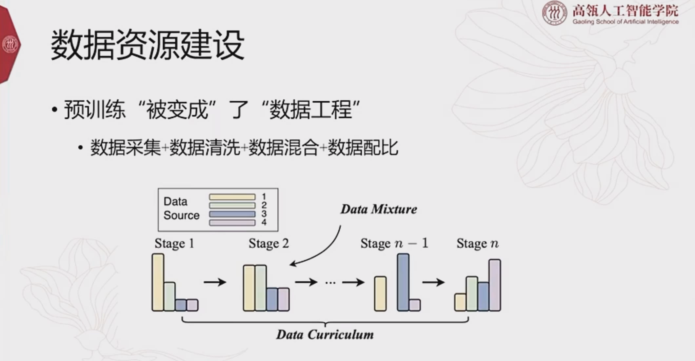
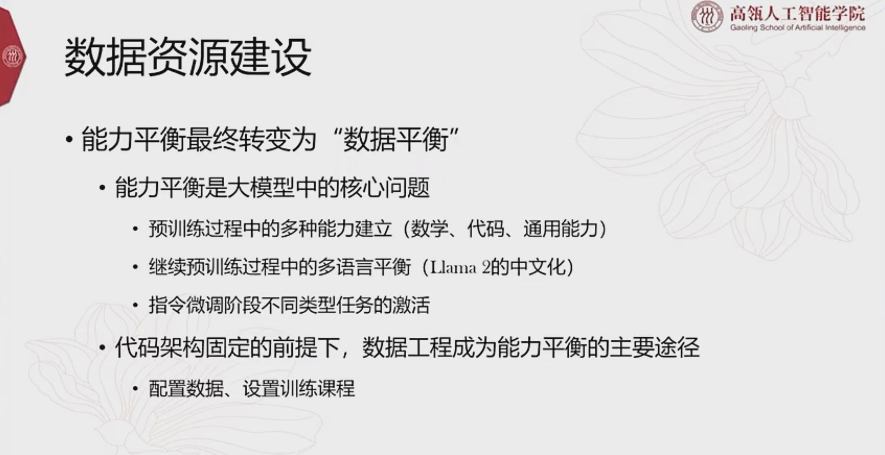
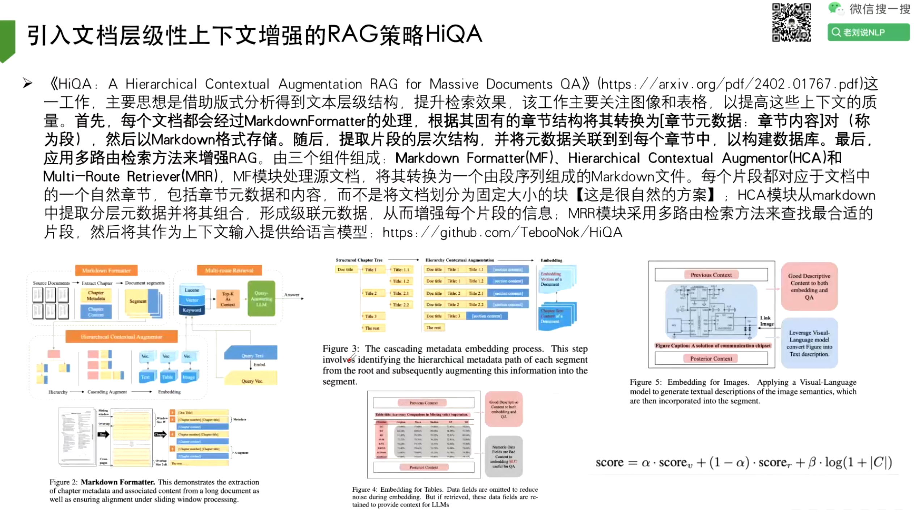
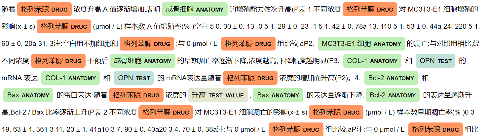
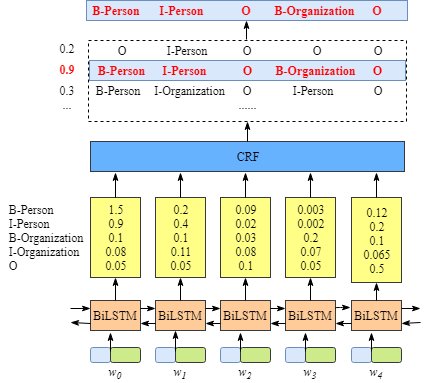

# 数据工程





## 数据采集


## 数据清洗


## 数据混合


## 数据配比


# 文档数据处理

## 文档层级上下文增强RAG




# 命名实体识别（NER）

> Pytorch BiLSTM+CRF+NER 医疗命名实体识别项目

## 项目介绍

本项目是阿里天池大赛的一个经典赛题，《瑞金医院MMC人工智能辅助构建知识图谱大赛》，赛题要求选手在糖尿病相关的学术论文和临床指南的基础上，做实体的标注，也就是NLP领域常说的，命名实体识别（Named Entity Recognition, NER）任务。

天池赛题地址：https://tianchi.aliyun.com/competition/entrance/231687/information

### 效果预览

```py
输入：每个糖尿病患者,无论是病情轻重,不论是注射胰岛素,还是口服降糖药,都必须合理地控制饮食。
输出：[['Disease', '糖尿病'], ['Drug', '胰岛素'], ['Drug', '口服降糖药']]
```



### 类别名称和定义

**疾病相关：**

> 1、疾病名称 (Disease)，如I型糖尿病。
>
> 2、病因(Reason)，疾病的成因、危险因素及机制。比如“糖尿病是由于胰岛素抵抗导致”，胰岛素抵抗是属于病因。
>
> 3、临床表现 (Symptom)，包括症状、体征，病人直接表现出来的和需要医生进行查体得出来的判断。如"头晕" "便血" 等。
>
> 4、检查方法(Test)，包括实验室检查方法，影像学检查方法，辅助试验，对于疾病有诊断及鉴别意义的项目等，如甘油三酯。
>
> 5、检查指标值(Test_Value)，指标的具体数值，阴性阳性，有无，增减，高低等，如”>11.3 mmol/L”。

**治疗相关：**

> 6、药品名称(Drug)，包括常规用药及化疗用药，比如胰岛素。
>
> 7、用药频率(Frequency)，包括用药的频率和症状的频率，比如一天两次。
>
> 8、用药剂量（Amount），比如500mg/d。
>
> 9、用药方法（Method）：比如早晚，餐前餐后，口服，静脉注射，吸入等。
>
> 10、非药治疗(Treatment)，在医院环境下进行的非药物性治疗，包括放疗，中医治疗方法等，比如推拿、按摩、针灸、理疗，不包括饮食、运动、营养等。
>
> 11、手术（Operation），包括手术名称，如代谢手术等。
>
> 12、不良反应（SideEff），用药后的不良反应。

**常规实体：**

> 13、部位（Anatomy），包括解剖部位和生物组织，比如人体各个部位和器官，胰岛细胞。
>
> 14、程度（level），包括病情严重程度，治疗后缓解程度等。
>
> 15、持续时间(Duration)，包括症状持续时间，用药持续时间，如“头晕一周”的“一周”。

### 模型图示


### 三方库

```py
pip install numpy
pip install pandas
pip install scikit-learn
pip install torch==1.12.0
pip install pytorch-crf==0.7.2
pip install seqeval
```

## 解析文字和实体标签对应关系

主办方提供的数据是一些用brat标注的文件，.txt文件为原始文档，.ann文件为标注信息，标注实体以T开头，后接实体序号，实体类别，起始位置，结束位置和实体对应的文档中的词。

因为标注文件的格式不是模型直接能用的，所以我们需要预处理一下，将单个字和标签做一一对应，生成一个新的带标注的文件。

### 预处理说明

**原始数据**

```py
中国成人2型糖尿病HBA1C  c控制目标的专家共识
```

**标注文件格式**

```py
T368 Disease 4 9 2型糖尿病   # [4,9)
T369 Test 9 14 HBA1C
```

**导出格式**

```py
中,O
国,O
成,O
人,O
2,B-Disease
型,I-Disease
糖,I-Disease
尿,I-Disease
病,I-Disease
...
```

### 代码示例

**1、配置项**

```py
# config.py
ORIGIN_DIR = './input/origin/'
ANNOTATION_DIR = './output/annotation/'
```

**2、新建预处理文件**

```py
# data_process.py
from glob import glob # glob可以用正则表达式去读取文件，用os还得加if判断
import os
import random
import pandas as pd
from config import *
```

**3、解析标签**

```py
# 根据标注文件生成对应关系
def get_annotation(ann_path):
    with open(ann_path, encoding='utf-8') as file:
        anns = {}
        for line in file.readlines():
            # print(line.split(' '))  # ['T1\tDisease', '1845', '1850\t1型糖尿病\n']
            # print(line.split('\t'))  # ['T1', 'Disease 1845 1850', '1型糖尿病\n']   还是以tab为分隔进行切割
            arr = line.split('\t')[1].split()
            # print(arr) # ['Disease', '1845', '1850']
            name = arr[0]
            start = int(arr[1])
            end = int(arr[-1])
            # 这里取最后一个的原因是：例如【T176	Test_Value 3692 3693;3694 3696	< 8%】这样的数据
            # <和8%中间有个空格，直接取arr[2]会丢失数据，所以不管中间3693;3694，取arr[-1]=3696
            # 标注太长，可能有问题, 例如41.ann中第222行的数据
            if end - start > 50:
                continue
            anns[start] = 'B-' + name
            for i in range(start + 1, end):
                anns[i] = 'I-' + name
        return anns


if __name__ == '__main__':
    anns = get_annotation('./input/origin/0.ann')
    print(anns)
    # {1845: 'B-Disease', 1846: 'I-Disease', 1847: 'I-Disease', 1848: 'I-Disease', 1849: 'I-Disease', 1983: 'B-Disease', 1984: 'I-Disease', 1985: 'I-Disease', 1986: 'I-Disease', 1987: 'I-Disease', 30: 'B-Disease', 31: 'I-Disease', 32: 'I-Disease', 33: 'I-Disease', 34: 'I-Disease', 1822: 'B-Disease', 1823: 'I-Disease', 1824: 'I-Disease', 1825: 'I-Disease', 1826: 'I-Disease', 2055: 'B-Disease', 2056: 'I-Disease', 2057: 'I-Disease', 2058: 'I-Disease', 2059: 'I-Disease', 2324: 'B-Disease', 2325: 'I-Disease', 2326: 'I-Disease', 2327: 'I-Disease', 2328: 'I-Disease', 4325: 'B-Disease', 4326: 'I-Disease'...
```

**4、一一对应**

```py
def get_text(txt_path):
    with open(txt_path, encoding='utf-8') as file:
        return file.read()

# 建立文字和标签对应关系
def generate_annotation():
    for txt_path in glob(ORIGIN_DIR + '*.txt'):
        # print(txt_path) # ./input/origin\0.txt
        ann_path = txt_path[:-3] + 'ann' # 把后三位去掉，加上ann
        anns = get_annotation(ann_path) 
        text = get_text(txt_path)
        # 建立文字和标注对应,DataFrame是两列，一列是word,一列是list
        # word列先转化为纵状索引(0,1,2,3...)，label先用O填充，再用anns填充
        df = pd.DataFrame({'word': list(text), 'label': ['O'] * len(text)})
        # anns.keys()是标注的索引值，1847这种，'lable'是上面df那一列，用anns的值对应替换
        df.loc[anns.keys(), 'label'] = list(anns.values())
        # print(df.head(20))
        #    word      label
        # 0     中          O
        # 1     国          O
        # 2     成          O
        # 3     人          O
        # 4     2  B-Disease
        # 5     型  I-Disease
        # 6     糖  I-Disease
        # 7     尿  I-Disease
        # 8     病  I-Disease
        # 9     H     B-Test
        # 10    B     I-Test
        # 11    A     I-Test
        # 12    1     I-Test
        # 13    C     I-Test
        # 14               O
        # 15               O
        # 16    c          O
        # 17    控          O
        # 18    制          O
        # 19    目          O 

        # 取文件名，导出文件
        # print(os.path.split(txt_path))   # ('./input/origin', '0.txt')
        file_name = os.path.split(txt_path)[1]
        # 输出到./output/annotation/
        df.to_csv(ANNOTATION_DIR + file_name, header=None, index=None)

if __name__ == '__main__':
    # 建立文字和标签对应关系
    generate_annotation()
```

## 拆分训练集和测试集

前面已经生成了单个字和标注对应的文件，接下来就是将这些文件，拆分为训练集和测试集两部分。这里的拆分不单是文件选择的问题，还需要考虑后续加载数据集的问题。

### 难点分析

因为原始数据是OCR识别得到的，有错字、空格、换行等内容。**而我们在模型训练时，是以句子为单位进行输入的**，所以还会面临文档拆分为句子的难题。

显然，按照空格、句号、回车，这些直观的句子拆分方法是行不通的，因为可能会出现句子太长、一个实体被拆分到两句话中等问题。我们这里采用一个简单粗暴的方法，**将多个文档合并为一个文件，看做一篇文档**。

加载数据时，在按固定长度进行截取，当然，这样也会有实体被拆开的问题，到加载数据时再处理。

### 代码示例

**1、添加配置项**

```py
# config.py
TRAIN_SAMPLE_PATH = './output/train_sample.txt'
TEST_SAMPLE_PATH = './output/test_sample.txt'
```

**2、拆分方法**

```py
# data_process.py
# 拆分训练集和测试集
def split_sample(test_size=0.3):
    files = glob(ANNOTATION_DIR + '*.txt')
    # random.seed(0)  # 设置随机种子是为了让本代码每次结果都一样
    random.shuffle(files)
    n = int(len(files) * test_size)
    test_files = files[:n]
    train_files = files[n:]
    # 合并文件
    merge_file(train_files, TRAIN_SAMPLE_PATH)
    merge_file(test_files, TEST_SAMPLE_PATH)
    
def merge_file(files, target_path):
    # a代表模式是追加
    with open(target_path, 'a', encoding='utf-8') as file:
        for f in files:
            text = open(f, encoding='utf-8').read()
            file.write(text)

if __name__ == '__main__':
    # 拆分训练集和测试集
    split_sample()
```

> ```py
> open(path, '-模式-',encoding='UTF-8') 
> 即open(路径+文件名, 读写模式, 编码)
> 
> 在python对文件进行读写操作的时候，常常涉及到“读写模式”，整理了一下常见的几种模式，如下：
> 
> 读写模式：
> 
> r ：只读 
> r+ : 读写 
> w ： 新建（会对原有文件进行覆盖） 
> a ： 追加 
> b ： 二进制文件
> ```
>

## 生成词表和标签表缓存文件

拆分完训练集和测试集后，我们需要根据训练集，生成词表和标签表的缓存文件，供后面的流程调用。该表不仅要记录所有词和标签，还要对应一个不重复的ID，方便后续进行Embedding，即数字化。

### 代码示例

**1、配置项**

```py
VOCAB_PATH = './output/vocab.txt'
LABEL_PATH = './output/label.txt'

# 填充特殊字符
WORD_PAD = '<PAD>'
# 未知特殊字符
WORD_UNK = '<UNK>'

VOCAB_SIZE = 3000
```

**2、生成词表**

```py
# 生成词表
def generate_vocab():
    df = pd.read_csv(TRAIN_SAMPLE_PATH, usecols=[0], names=['word'])
    vocab_list = [WORD_PAD, WORD_UNK] + df['word'].value_counts().keys().tolist()
    vocab_list = vocab_list[:VOCAB_SIZE]
    vocab_dict = {v: k for k, v in enumerate(vocab_list)}
    vocab = pd.DataFrame(list(vocab_dict.items()))
    vocab.to_csv(VOCAB_PATH, header=None, index=None)
```

**3、生成标签表**

```py
# 生成标签表
def generate_label():
    df = pd.read_csv(TRAIN_SAMPLE_PATH, usecols=[1], names=['label'])
    label_list = df['label'].value_counts().keys().tolist()
    label_dict = {v: k for k, v in enumerate(label_list)}
    label = pd.DataFrame(list(label_dict.items()))
    label.to_csv(LABEL_PATH, header=None, index=None)
```

至此，数据预处理就做完了，下面开始定义Dataset类，加载数据。

## 定义Dataset数据集和文本等长切分

经过前面的数据预处理操作，我们已经得到了训练样本、测试样本文件，以及词表和标签表的缓存文件，接下来就是定义Dataset类，来加载数据。另外在加载数据时，需要将文本切分为等长的句子。

**1、新建文件**

```py
# utils.py
import torch
from torch.utils import data
from config import *
import pandas as pd
```

**2、加载词表和标签表**

```py
def get_vocab():
    df = pd.read_csv(VOCAB_PATH, names=['word', 'id'])
    return list(df['word']), dict(df.values)

def get_label():
    df = pd.read_csv(LABEL_PATH, names=['label', 'id'])
    return list(df['label']), dict(df.values)

if __name__ == '__main__':
    res = get_label()
    print(res) 
    # 第一个输出id2lable：list自带索引信息，所以直接输出了label的值；
    # 第二个输出lable2id：直接输出，利用字典的特性对应起label和id值
    # (['O', 'I-Test', 'I-Disease', 'I-Anatomy', 'I-Test_Value', 'I-Drug', 'B-Test', 'B-Disease', 'B-Anatomy', 'I-Reason', 'I-Symptom', 'B-Drug', 'B-Test_Value', 'I-Amount', 'I-Treatment', 'B-Symptom', 'I-Level', 'I-Duration', 'B-Reason', 'I-Operation', 'I-SideEff', 'I-Method', 'I-Frequency', 'B-Level', 'B-Treatment', 'B-Amount', 'B-Duration', 'B-Method', 'B-SideEff', 'B-Operation', 'B-Frequency'],                             {'O': 0, 'I-Test': 1, 'I-Disease': 2, 'I-Anatomy': 3, 'I-Test_Value': 4, 'I-Drug': 5, 'B-Test': 6, 'B-Disease': 7, 'B-Anatomy': 8, 'I-Reason': 9, 'I-Symptom': 10, 'B-Drug': 11, 'B-Test_Value': 12, 'I-Amount': 13, 'I-Treatment': 14, 'B-Symptom': 15, 'I-Level': 16, 'I-Duration': 17, 'B-Reason': 18, 'I-Operation': 19, 'I-SideEff': 20, 'I-Method': 21, 'I-Frequency': 22, 'B-Level': 23, 'B-Treatment': 24, 'B-Amount': 25, 'B-Duration': 26, 'B-Method': 27, 'B-SideEff': 28, 'B-Operation': 29, 'B-Frequency': 30})
```

**3、Dataset**

type 参数，这个类是训练和测试公用的，所以定义一个参数来区分加载哪个文件。

base_len 参数，用来定义句子的参考长度，特殊情况再稍做处理。

```py
# 需要集成pytorch中data下面的Dataset类
class Dataset(data.Dataset):
    # 需要传递两个参数，type区分加载的是训练集还是测试集，base_len拆分句子会用到
    def __init__(self, type='train', base_len=50):
        super().__init__()
        self.base_len = base_len
        # 根据type值区分类型
        sample_path = TRAIN_SAMPLE_PATH if type == 'train' else TEST_SAMPLE_PATH
        # print(sample_path) # ./output/train_sample.txt

        # 加载数据并命名为word，label方便后续处理
        self.df = pd.read_csv(sample_path, names=['word', 'label'])
        # 这里因为每一句话都要调用上述两个方法，所以直接定义给self
        _, self.word2id = get_vocab()
        _, self.label2id = get_label()

if __name__ == '__main__':
    dataset = Dataset()
```

### 切分文本

目前我们已经定义好了Dataset类，并将文本加载到DataFrame中，下一步，就是要将长文本拆分成句子。我们这里采用等长切分，每隔50个字切一刀。

但有一种情况需要处理，就是切点上是非O标签，则需要将切点往后移动，直达O标签为止。

**1、计算分割点**

```py
def get_points(self):
    self.points = [0]
	# 从i出发
    i = 0
    while True:
        # 判断是否大于整个句子长度，
        if i + self.base_len >= len(self.df):
            self.points.append(len(self.df))
            break
        if self.df.loc[i + self.base_len, 'label'] == 'O':
            i += self.base_len
            self.points.append(i)
        else:
            i += 1
```

**2、文本数字化**

```py
def __len__(self):
    return len(self.points) - 1

def __getitem__(self, index):
    df = self.df[self.points[index]:self.points[index + 1]]
    word_unk_id = self.word2id[WORD_UNK]
    label_o_id = self.label2id['O']
    input = [self.word2id.get(w, word_unk_id) for w in df['word']]
    target = [self.label2id.get(l, label_o_id) for l in df['label']]
    return input, target
```

### DataLoader句子填充PAD和MASK

经过上一步的处理，我们将长文本切分成了单句，但每个句子长度又不完全一样。在批处理时，要求每个batch的句子长度必须一致，所以我们需要填充 PAD，来保证句子每个batch的句子长度一样。

另外，在后续模型 CRF 阶段计算损失时，**可以通过MASK，将填充的 PAD 数值忽略掉，以消除填充值 PAD 的影响**。

综上，我们需要在 DataLoader 批量加载数据阶段，填充 PAD 来保证批数据长度一致，且需要记录 MASK。

**1、添加配置项**

```py
WORD_PAD_ID = 0
WORD_UNK_ID = 1
LABEL_O_ID = 0
```

**2、DataLader()**

```py
if __name__ == '__main__':
    dataset = Dataset()
    loader = data.DataLoader(dataset, batch_size=10, collate_fn=collate_fn)
    print(iter(loader).next())
```

**3、数据校对整理**

句子不等长，先按句子长度从大到小排序，获取最大长度，其他句子填充到跟他一样长。

```py
def collate_fn(batch):
    batch.sort(key=lambda x: len(x[0]), reverse=True)
    max_len = len(batch[0][0])
    input = []
    target = []
    mask = []
    for item in batch:
        pad_len = max_len - len(item[0])
        input.append(item[0] + [WORD_PAD_ID] * pad_len)
        target.append(item[1] + [LABEL_O_ID] * pad_len)
        mask.append([1] * len(item[0]) + [0] * pad_len)
    return torch.tensor(input), torch.tensor(target), torch.tensor(mask).bool()
```

## 定义BiLSTM模型

到目前为止，我们已经处理好了模型需要的数据，本节就正式开始搭建模型了。

模型的整体是 BiLSTM+CRF 结构，但 CRF 涉及到解码和特殊的损失值计算方法，所以本节先介绍 BiLSTM，下一小节再介绍 CRF 部分。

### 模型结构



参考文档：https://createmomo.github.io/

### 代码示例

**1、定义模型参数**

```py
# config.py
VOCAB_SIZE = 3000
EMBEDDING_DIM = 100
HIDDEN_SIZE = 256
TARGET_SIZE = 31
LR = 1e-3
EPOCH = 100

MODEL_DIR = './output/model/'
```

**2、导入模块**

```py
# model.py
import torch.nn as nn
from config import *
from torchcrf import CRF
import torch
```

**3、定义模型**

```py
class Model(nn.Module):
    def __init__(self):
        super().__init__()
        self.embed = nn.Embedding(VOCAB_SIZE, EMBEDDING_DIM, WORD_PAD_ID)
        self.lstm = nn.LSTM(
            EMBEDDING_DIM,
            HIDDEN_SIZE,
            batch_first=True,
            bidirectional=True,
        )
        self.linear = nn.Linear(2 * HIDDEN_SIZE, TARGET_SIZE)

    def _get_lstm_feature(self, input):
        out = self.embed(input)
        out, _ = self.lstm(out)
        return self.linear(out)

    def forward(self, input, mask):
        out = self._get_lstm_feature(input)
        return out

if __name__ == '__main__':
    model = Model()
    input = torch.randint(1, 3000, (100, 50))
    print(model)
    print(model(input))
```