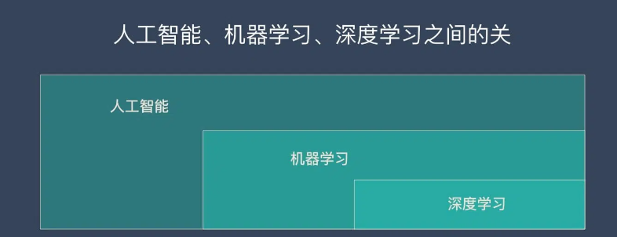

# 基本概念

## 深度学习、神经网络、机器学习、人工智能的关系

简单来说：

1. 深度学习是机器学习的一个分支(最重要的分支)
2. 机器学习是人工智能的一个分支

# 经典算法

## 生成式对抗网络GAN

> 生成对抗网络(Generative Adversarial Networks, GAN) 是很热门的一种无监督算法，他能生成出非常逼真的照片，图像甚至视频。我们手机里的照片处理软件中就会使用到它。
>
> 本文将详细介绍生成对抗网络 – GAN 的设计初衷、基本原理、10种典型算法和13种实际应用。

### 设计初衷

一句话来概括 GAN 的设计动机就是——自动化。

**人工提取特征——自动提取特征**

深度学习最特别最厉害的地方就是能够自己学习特征提取。机器的超强算力可以解决很多人工无法解决的问题。自动化后，学习能力更强，适应性也更强。

**人工判断生成结果的好坏——自动判断和优化**

我们在《[监督学习](http://localhost:3000/#/Theory/ML/机器学习?id=监督学习)》中讲过，训练集需要大量的人工标注数据，这个过程是成本很高且效率很低的。而人工判断生成结果的好坏也是如此，有成本高和效率低的问题。

而 GAN 能自动完成这个过程，且不断的优化，这是一种效率非常高，且成本很低的方式。GAN是如何实现自动化的呢？下面我们讲解一下他的原理。

### 基本原理

#### 大白话版本

知乎上有一个很不错的解释，大家应该都能理解：

假设一个城市治安混乱，很快，这个城市里就会出现无数的小偷。在这些小偷中，有的可能是盗窃高手，有的可能毫无技术可言。假如这个城市开始整饬其治安，突然开展一场打击犯罪的「运动」，警察们开始恢复城市中的巡逻，很快，一批「学艺不精」的小偷就被捉住了。之所以捉住的是那些没有技术含量的小偷，是因为警察们的技术也不行了，在捉住一批低端小偷后，城市的治安水平变得怎样倒还不好说，但很明显，城市里小偷们的平均水平已经大大提高了。

警察们开始继续训练自己的破案技术，开始抓住那些越来越狡猾的小偷。随着这些职业惯犯们的落网，警察们也练就了特别的本事，他们能很快能从一群人中发现可疑人员，于是上前盘查，并最终逮捕嫌犯；小偷们的日子也不好过了，因为警察们的水平大大提高，如果还想以前那样表现得鬼鬼祟祟，那么很快就会被警察捉住。

为了避免被捕，小偷们努力表现得不那么「可疑」，而魔高一尺、道高一丈，警察也在不断提高自己的水平，争取将小偷和无辜的普通群众区分开。随着警察和小偷之间的这种「交流」与「切磋」，小偷们都变得非常谨慎，他们有着极高的偷窃技巧，表现得跟普通群众一模一样，而警察们都练就了「火眼金睛」，一旦发现可疑人员，就能马上发现并及时控制——最终，我们同时得到了最强的小偷和最强的警察。

#### 非大白话版本

生成对抗网络（GAN）由2个重要的部分构成：

1. **生成器(Generator**)：通过机器生成数据（大部分情况下是图像），目的是“骗过”判别器
2. **判别器(Discriminator**)：判断这张图像是真实的还是机器生成的，目的是找出生成器做的“假数据”

下面详细介绍一下过程：

**第一阶段：固定「判别器D」，训练「生成器G」**

我们使用一个还 OK 判别器，让一个「生成器G」不断生成“假数据”，然后给这个「判别器D」去判断。

一开始，「生成器G」还很弱，所以很容易被揪出来。

但是随着不断的训练，「生成器G」技能不断提升，最终骗过了「判别器D」。

到了这个时候，「判别器D」基本属于瞎猜的状态，判断是否为假数据的概率为50%。

**第二阶段：固定「生成器G」，训练「判别器D」**

当通过了第一阶段，继续训练「生成器G」就没有意义了。这个时候我们固定「生成器G」，然后开始训练「判别器D」。

「判别器D」通过不断训练，提高了自己的鉴别能力，最终他可以准确的判断出所有的假图片。

到了这个时候，「生成器G」已经无法骗过「判别器D」。

**循环阶段一和阶段二**

通过不断的循环，「生成器G」和「判别器D」的能力都越来越强。

最终我们得到了一个效果非常好的「生成器G」，我们就可以用它来生成我们想要的图片了。

下面的实际应用部分会展示很多“惊艳”的案例。

> 如果对 GAN 的详细技术原理感兴趣，可以看看下面2篇文章：
>
> 《[生成性对抗网络（GAN）初学者指南 – 附代码](https://easyai.tech/blog/generative-adversarial-networks-gans-a-beginners-guide/)》
>
> 《[长文解释生成对抗网络GAN的详细原理（20分钟阅读）](https://easyai.tech/blog/understanding-generative-adversarial-networks-gans/)》