1956 年提出 AI 概念，短短3年后（1959） [Arthur Samuel](https://en.wikipedia.org/wiki/Arthur_Samuel) 就提出了机器学习的概念：

> Field of study that gives computers the ability to learn without being explicitly programmed.
>
> 机器学习研究和构建的是一种特殊算法（**而非某一个特定的算法**），能够让计算机自己在数据中学习从而进行预测。

所以，**机器学习不是某种具体的算法，而是很多算法的统称。**

机器学习包含了很多种不同的算法，深度学习就是其中之一，其他方法包括决策树，聚类，贝叶斯等。

深度学习的灵感来自大脑的结构和功能，即许多神经元的互连。人工神经网络（ANN）是模拟大脑生物结构的算法。

不管是机器学习还是深度学习，都属于人工智能（AI）的范畴。所以人工智能、机器学习、深度学习可以用下面的图来表示：

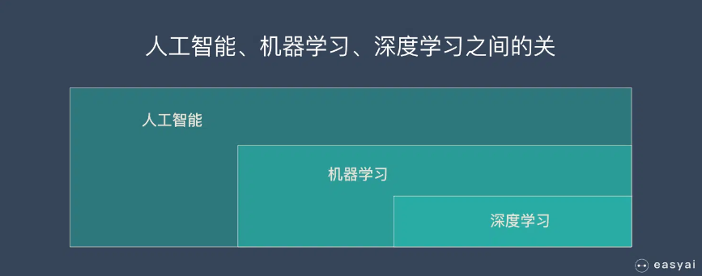

> http://localhost:3000/#/Theory/ML/机器学习?id=机器学习实操的7个步骤

# 什么是机器学习？

在解释机器学习的原理之前，先把最精髓的基本思路介绍给大家，理解了机器学习最本质的东西，就能更好的利用机器学习，同时这个解决问题的思维还可以用到工作和生活中。

**机器学习的基本思路**

1. 把现实生活中的问题抽象成数学模型，并且很清楚模型中不同参数的作用
2. 利用数学方法对这个数学模型进行求解，从而解决现实生活中的问题
3. 评估这个数学模型，是否真正的解决了现实生活中的问题，解决的如何？

**无论使用什么算法，使用什么样的数据，最根本的思路都逃不出上面的3步！**

当我们理解了这个基本思路，我们就能发现：

不是所有问题都可以转换成数学问题的。那些没有办法转换的现实问题 AI 就没有办法解决。同时最难的部分也就是把现实问题转换为数学问题这一步。

## 机器学习的原理

下面以监督学习为例，讲解一下机器学习的实现原理。

假如我们正在教小朋友识字（一、二、三）。我们首先会拿出3张卡片，然后便让小朋友看卡片，一边说“一条横线的是一、两条横线的是二、三条横线的是三”。

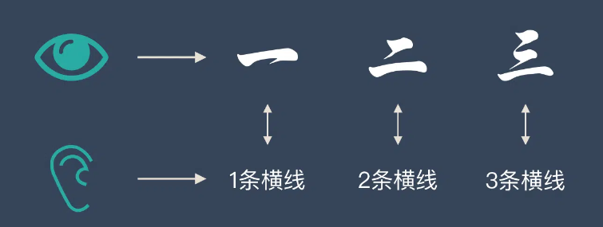

不断重复上面的过程，小朋友的大脑就在不停的学习。

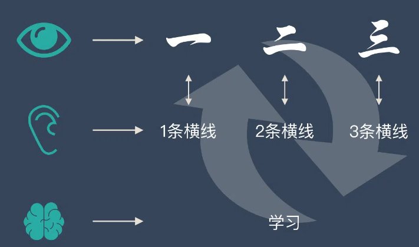

当重复的次数足够多时，小朋友就学会了一个新技能——认识汉字：一、二、三。

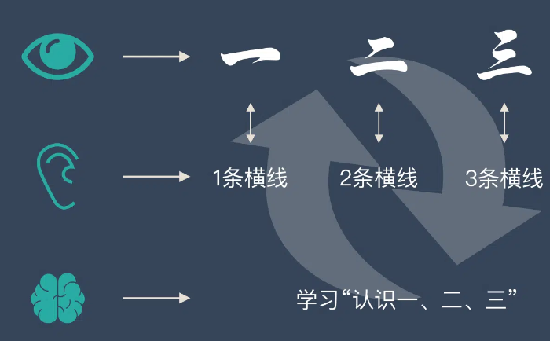

我们用上面人类的学习过程来类比机器学习。机器学习跟上面提到的人类学习过程很相似。

- 上面提到的认字的卡片在机器学习中叫——**训练集**
- 上面提到的“一条横线，两条横线”这种区分不同汉字的属性叫——**特征**
- 小朋友不断学习的过程叫——**建模**
- 学会了识字后总结出来的规律叫——**模型**

**通过训练集，不断识别特征，不断建模，最后形成有效的模型，这个过程就叫“机器学习”！**

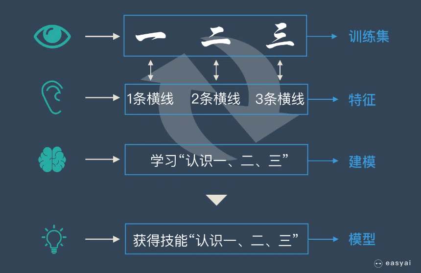

# 机器学习三类训练方法

机器学习根据训练方法大致可以分为三大类：

1. 监督学习
2. 非监督学习
3. 强化学习

除此之外，大家可能还听过“半监督学习”之类的说法，但是那些都是基于上面3类的变种，本质没有改变。

## 监督学习

监督学习是指我们给算法一个数据集，并且给定正确答案。机器通过数据来学习正确答案的计算方法。

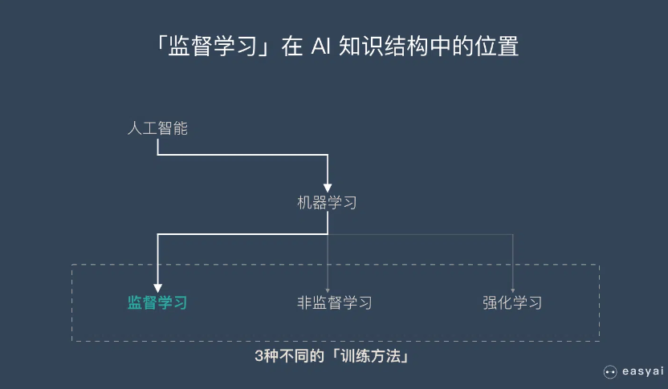

举个栗子：

我们准备了一大堆猫和狗的照片，我们想让机器学会如何识别猫和狗。当我们使用监督学习的时候，我们需要给这些照片打上标签。

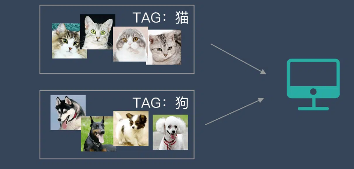

我们给照片打的标签就是“正确答案”，机器通过大量学习，就可以学会在新照片中认出猫和狗。

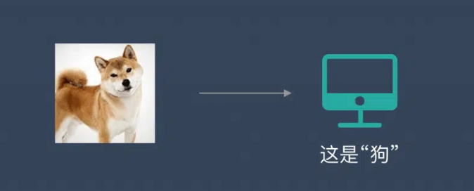

这种通过大量人工打标签来帮助机器学习的方式就是监督学习。这种学习方式效果非常好，但是成本也非常高。

**监督学习需要有明确的目标，很清楚自己想要什么结果**。比如：按照“既定规则”来分类、预测某个具体的值…

监督并不是指人站在机器旁边看机器做的对不对，而是下面的流程：

1. 选择一个适合目标任务的数学模型
2. 先把一部分已知的“问题和答案”（训练集）给机器去学习
3. 机器总结出了自己的“方法论”
4. 人类把”新的问题”（测试集）给机器，让他去解答

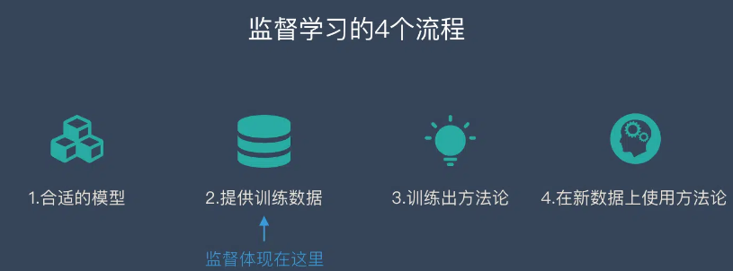

上面提到的问题和答案只是一个比喻，假如我们想要完成文章分类的任务，则是下面的方式：

1. 选择一个合适的数学模型
2. 把一堆已经分好类的文章和他们的分类给机器
3. 机器学会了分类的“方法论”
4. 机器学会后，再丢给他一些新的文章（不带分类），让机器预测这些文章的分类

### 监督学习2个任务：回归、分类

监督学习有2个主要的任务：

1. 回归
2. 分类

**回归：预测连续的、具体的数值。**比如：支付宝里的芝麻信用分数

**分类：对各种事物分门别类，用于离散型（[什么是离散？](https://baike.baidu.com/item/离散变量/8443404?fr=aladdin)）预测。**比如：预测离婚率

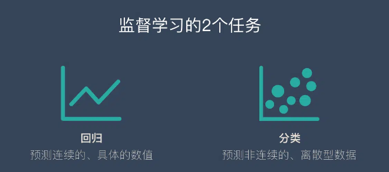

#### “回归”案例：芝麻信用分是怎么来的？

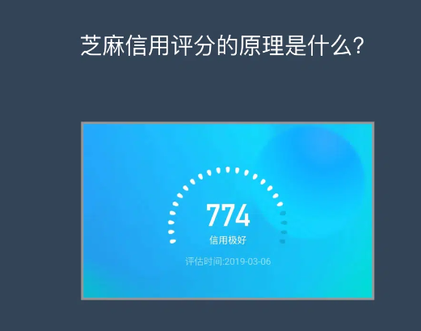

下面要说的是个人信用评估方法——[FICO](https://36kr.com/p/5093993.html)。

他跟芝麻信用类似，用来评估个人的信用状况。FICO 评分系统得出的信用分数范围在300～850分之间，分数越高，说明信用风险越小。

下面我们来模拟一下 FICO 的发明过程，这个过程就是监督学习力的回归。

##### 步骤1：构建问题，选择模型

我们首先找出个人信用的影响因素，从逻辑上讲一个人的体重跟他的信用应该没有关系，比如我们身边很讲信用的人，有胖子也有瘦子。

而财富总额貌似跟信用有关，因为马云不讲信用的损失是非常巨大的，所以大家从来没有听说马云会不还信用卡！而一个乞丐不讲信用的损失是很小的，这条街混不下去了换一条街继续。

所以根据判断，找出了下面5个影响因素：

- 付款记录
- 账户总金额
- 信用记录跨度(自开户以来的信用记录、特定类型账户开户以来的信用记录…)
- 新账户(近期开户数目、特定类型账户的开户比例…)
- 信用类别(各种账户的数目)

这个时候，我们就构建了一个简单的模型：

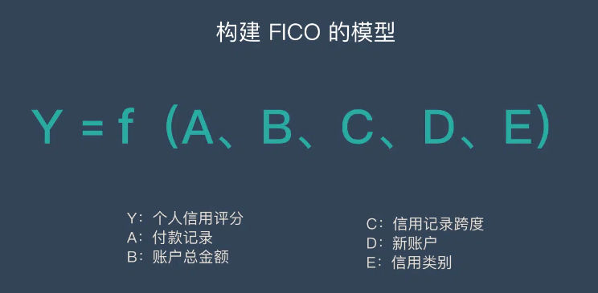

f 可以简单理解为一个特定的公式，这个公式可以将5个因素跟个人信用分形成关联。

**我们的目标就是得到 f 这个公式具体是什么，这样我们只要有了一个人的这5种数据，就可以得到一个人的信用分数了。**

##### 步骤2：收集已知数据

为了找出这个公式 f，我们需要先收集大量的已知数据，这些数据必须包含一个人的5种数据和他/她的信用状态（把信用状态转化为分数）。

我们把数据分成几个部分，一部分用来训练，一部分用来测试和验证。

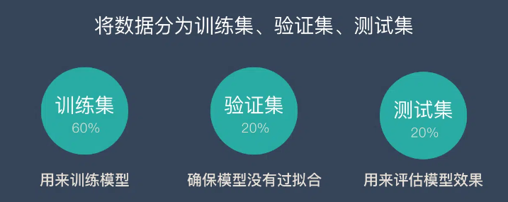

**步骤3：训练出理想模型**

有了这些数据，我们通过机器学习，就能”猜测”出这5种数据和信用分数的关系。这个关系就是公式 f。

然后我们再用验证数据和测试数据来验证一下这个公式是否 OK。

测试验证的具体方法是：

1. 将5种数据套入公式，计算出信用分
2. 用计算出来的信用分跟这个人实际的信用分(预先准备好的)进行比较
3. 评估公式的准确度，如果问题很大再进行调整优化

 

**步骤4：对新用户进行预测**

当我们想知道一个新用户的信用状况时，只需要收集到他的这5种数据，套进公式 f 计算一遍就知道结果了！

好了，上面就是一个跟大家息息相关的回归模型，大致思路就是上面所讲的思路，整个过程做了一些简化，如果想查看完整的过程，可以查看 [机器学习实操的7个步骤](http://localhost:3000/#/Theory/ML/机器学习?id=机器学习实操的7个步骤)

#### “分类”案例：如何预测离婚概率？

美国心理学家戈特曼博士用大数据还原婚姻关系的真相，他的方法就是分类的思路。

戈特曼博士在观察和聆听一对夫妻5分钟的谈话后，便能预测他们是否会离婚，且预测准确率高达94%！他的这项研究还出了一本书《[幸福的婚姻](https://book.douban.com/subject/25833051/)》（豆瓣８.４分）。

##### 步骤1：构建问题，选择模型

戈特曼提出，对话能反映出夫妻之间潜在的问题，他们在对话中的争吵、欢笑、调侃和情感表露创造了某种情感关联。通过这些对话中的情绪关联可以将夫妻分为不同的类型，代表不同的离婚概率。

##### 步骤2：收集已知数据

研究人员邀请了700对夫妻参与实验。他们单独在一间屋子里相对坐下，然后谈论一个有争论的话题，比如金钱和性，或是与姻亲的关系。默里和戈特曼让每一对夫妻持续谈论这个话题15分钟，并拍摄下这个过程。观察者看完这些视频之后，就根据丈夫和妻子之间的谈话给他们打分。

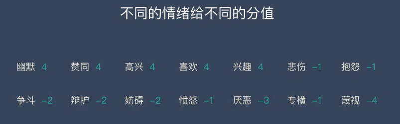

##### 步骤3：训练出理想模型

戈特曼的方法并不是用机器学习来得到结果，不过原理都是类似的。他得到的结论如下：

首先，他们将夫妻双方的分数标绘在一个图表上，两条线的交叉点就可以说明婚姻能否长久稳定。如果丈夫或妻子持续得负分，两人很可能会走向离婚。重点在于定量谈话中正负作用的比率。理想中的比率是5∶1，如果低于这个比例，婚姻就遇到问题了。最后，将结果放在一个数学模型上，这个模型用差分方程式凸显出成功婚姻的潜在特点。

戈特曼根据得分，将这些夫妻分成5组：

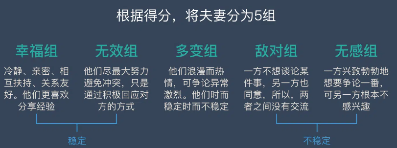

1. **幸福的夫妻**：冷静、亲密、相互扶持、关系友好。他们更喜欢分享经验。
2. **无效的夫妻**：他们尽最大努力避免冲突，只是通过积极回应对方的方式。
3. **多变的夫妻**：他们浪漫而热情，可争论异常激烈。他们时而稳定时而不稳定，可总的来说不怎么幸福。
4. **敌对的夫妻**：一方不想谈论某件事，另一方也同意，所以，两者之间没有交流。
5. **彼此无感的夫妻**：一方兴致勃勃地想要争论一番，可另一方对讨论的话题根本不感兴趣。

该数学模型呈现了两种稳定型夫妻（关系和谐的夫妻和关系不和谐的夫妻）和两种不稳定型夫妻（敌对夫妻和无感夫妻）之间的区别。而据预测，不稳定的夫妻可能会一直保持婚姻关系，尽管他们的婚姻不稳定。

##### 步骤4：对新用户进行预测

12年以来，每隔一两年，默里和戈特曼都会与参与研究的那700对夫妻交流。两个人的公式对离婚率的预测达到了94%的准确率。

### 主流的监督学习算法

| 算法                                          | 类型      | 简介                                                         |
| :-------------------------------------------- | :-------- | :----------------------------------------------------------- |
| 朴素贝叶斯                                    | 分类      | 贝叶斯分类法是基于贝叶斯定定理的统计学分类方法。它通过预测一个给定的元组属于一个特定类的概率，来进行分类。朴素贝叶斯分类法假定一个属性值在给定类的影响独立于其他属性的 —— 类条件独立性。 |
| 决策树                                        | 分类      | 决策树是一种简单但广泛使用的分类器，它通过训练数据构建决策树，对未知的数据进行分类。 |
| [SVM](https://easyai.tech/ai-definition/svm/) | 分类      | 支持向量机把分类问题转化为寻找分类平面的问题，并通过最大化分类边界点距离分类平面的距离来实现分类。 |
| 逻辑回归                                      | 分类      | 逻辑回归是用于处理因变量为分类变量的回归问题，常见的是二分类或二项分布问题，也可以处理多分类问题，它实际上是属于一种分类方法。 |
| 线性回归                                      | 回归      | 线性回归是处理回归任务最常用的算法之一。该算法的形式十分简单，它期望使用一个超平面拟合数据集（只有两个变量的时候就是一条直线）。 |
| 回归树                                        | 回归      | 回归树（决策树的一种）通过将数据集重复分割为不同的分支而实现分层学习，分割的标准是最大化每一次分离的信息增益。这种分支结构让回归树很自然地学习到非线性关系。 |
| K邻近                                         | 分类+回归 | 通过搜索K个最相似的实例（邻居）的整个训练集并总结那些K个实例的输出变量，对新数据点进行预测。 |
| Adaboosting                                   | 分类+回归 | [Adaboost](https://easyai.tech/ai-definition/adaboost/)目的就是从训练数据中学习一系列的弱分类器或基本分类器，然后将这些弱分类器组合成一个强分类器。 |
| 神经网络                                      | 分类+回归 | 它从信息处理角度对人脑神经元网络进行抽象， 建立某种简单模型，按不同的连接方式组成不同的网络。 |

## 无监督学习

无监督学习中，给定的数据集没有“正确答案”，所有的数据都是一样的。无监督学习的任务是从给定的数据集中，挖掘出潜在的结构。

举个栗子：

我们把一堆猫和狗的照片给机器，不给这些照片打任何标签，但是我们希望机器能够将这些照片分分类。

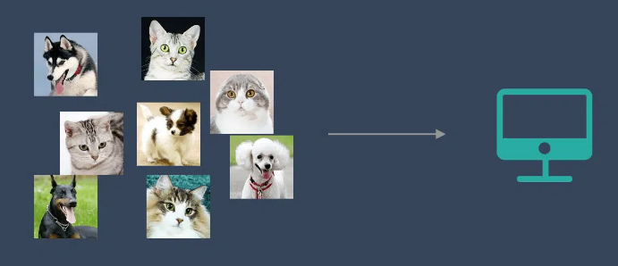

通过学习，机器会把这些照片分为2类，一类都是猫的照片，一类都是狗的照片。虽然跟上面的监督学习看上去结果差不多，但是有着本质的差别：

**无监督学习中，虽然照片分为了猫和狗，但是机器并不知道哪个是猫，哪个是狗。对于机器来说，相当于分成了 A、B 两类。**

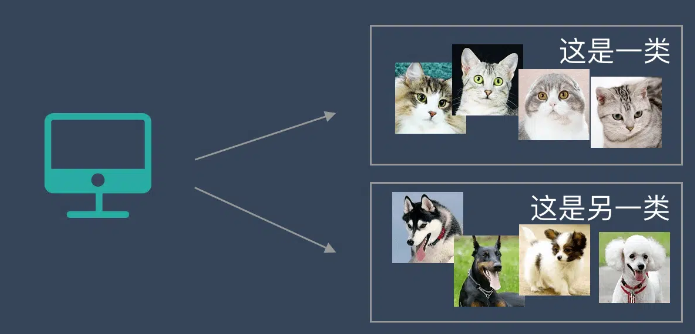

### 什么是无监督学习

下面通过跟监督学习的对比来理解无监督学习：

1. 监督学习是一种目的明确的训练方式，你知道得到的是什么；而**无监督学习则是没有明确目的的训练方式，你无法提前知道结果是什么**。
2. 监督学习需要给数据打标签；而**无监督学习不需要给数据打标签**。
3. 监督学习由于目标明确，所以可以衡量效果；而**无监督学习几乎无法量化效果如何**。

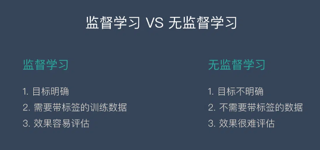

简单总结一下：

**无监督学习是一种机器学习的训练方式，它本质上是一个统计手段，在没有标签的数据里可以发现潜在的一些结构的一种训练方式。**

它主要具备3个特点：

1. 无监督学习没有明确的目的
2. 无监督学习不需要给数据打标签
3. 无监督学习无法量化效果

这么解释很难理解，下面用一些具体案例来告诉大家无监督学习的一些实际应用场景，通过这些实际场景，大家就能了解无监督学习的价值。

### 无监督学习的使用场景

#### 案例1：发现异常

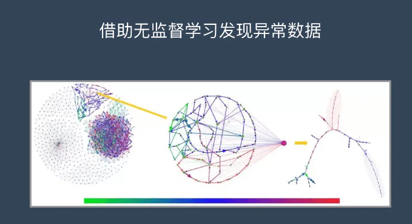

有很多违法行为都需要”洗钱”，这些洗钱行为跟普通用户的行为是不一样的，到底哪里不一样？

如果通过人为去分析是一件成本很高很复杂的事情，我们可以通过这些行为的特征对用户进行分类，就更容易找到那些行为异常的用户，然后再深入分析他们的行为到底哪里不一样，是否属于违法洗钱的范畴。

**通过无监督学习，我们可以快速把行为进行分类，虽然我们不知道这些分类意味着什么，但是通过这种分类，可以快速排出正常的用户，更有针对性的对异常行为进行深入分析。**

#### 案例2：用户细分

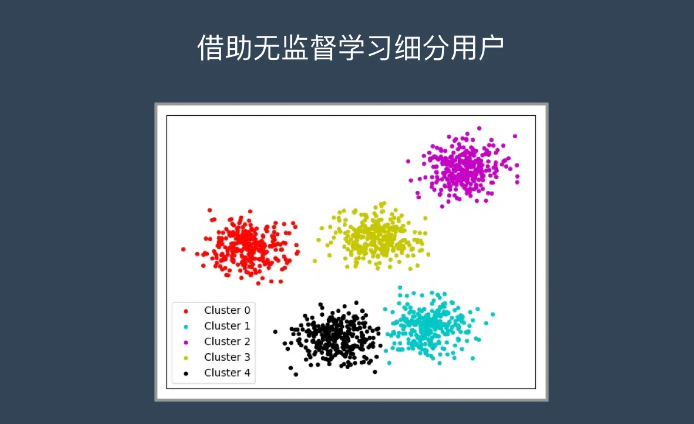

这个对于广告平台很有意义，我们不仅把用户按照性别、年龄、地理位置等维度进行用户细分，还可以通过用户行为对用户进行分类。

通过很多维度的用户细分，广告投放可以更有针对性，效果也会更好。

#### 案例3：推荐系统

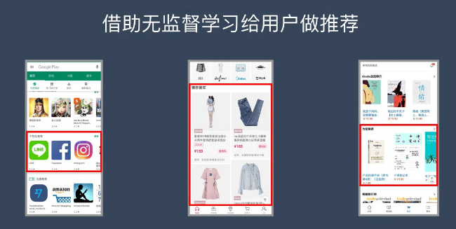

大家都听过”啤酒+尿不湿”的故事，这个故事就是根据用户的购买行为来推荐相关的商品的一个例子。

比如大家在淘宝、天猫、京东上逛的时候，总会根据你的浏览行为推荐一些相关的商品，有些商品就是无监督学习通过聚类来推荐出来的。系统会发现一些购买行为相似的用户，推荐这类用户最”喜欢”的商品。

### 两类无监督学习算法

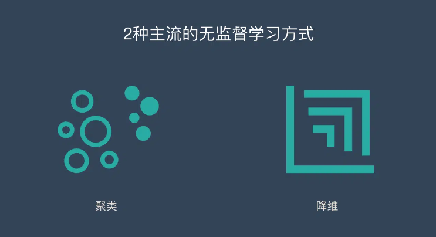

聚类：简单说就是一种自动分类的方法，在监督学习中，你很清楚每一个分类是什么，但是聚类则不是，你并不清楚聚类后的几个分类每个代表什么意思。

降维：降维看上去很像压缩。这是为了在尽可能保存相关的结构的同时降低数据的复杂度。

####  「聚类算法」K均值聚类

K均值聚类就是制定分组的数量为K，自动进行分组。

K 均值聚类的步骤如下：

1. 定义 K 个重心。一开始这些重心是随机的（也有一些更加有效的用于初始化重心的算法）
2. 寻找最近的重心并且更新聚类分配。将每个数据点都分配给这 K 个聚类中的一个。每个数据点都被分配给离它们最近的重心的聚类。这里的「接近程度」的度量是一个超参数——通常是欧几里得距离（Euclidean distance）。
3. 将重心移动到它们的聚类的中心。每个聚类的重心的新位置是通过计算该聚类中所有数据点的平均位置得到的。

重复第 2 和 3 步，直到每次迭代时重心的位置不再显著变化（即直到该算法收敛）。

其过程如下面的动图：

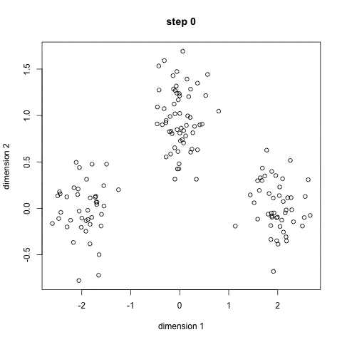

#### 「聚类算法」层次聚类

如果你不知道应该分为几类，那么层次聚类就比较适合了。层次聚类会构建一个多层嵌套的分类，类似一个树状结构。

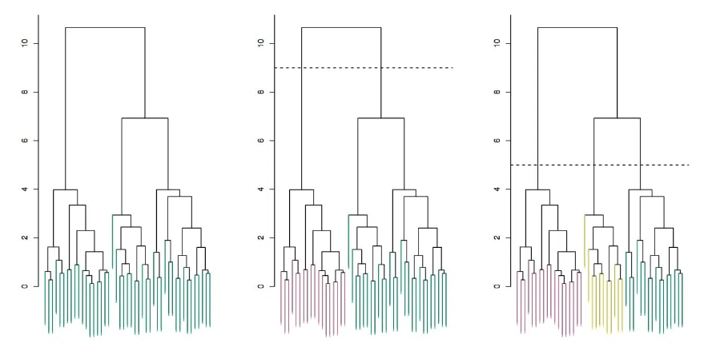

层次聚类的步骤如下：

1. 首先从 N 个聚类开始，每个数据点一个聚类。
2. 将彼此靠得最近的两个聚类融合为一个。现在你有 N-1 个聚类。
3. 重新计算这些聚类之间的距离。
4. 重复第 2 和 3 步，直到你得到包含 N 个数据点的一个聚类。
5. 选择一个聚类数量，然后在这个树状图中划一条水平线。

#### 「降维算法」主成分分析 – PCA

主成分分析是把多指标转化为少数几个综合指标。

主成分分析经常用减少数据集的维数，同时保持数据集的对方差贡献最大的特征。这是通过保留低阶主成分，忽略高阶主成分做到的。这样低阶成分往往能够保留住数据的最重要方面。

变换的步骤：

1. 第一步计算矩阵 X 的样本的[协方差矩阵](https://baike.baidu.com/item/协方差矩阵/9822183) S（此为不标准PCA，标准PCA计算[相关系数](https://baike.baidu.com/item/相关系数/3109424)[矩阵](https://easyai.tech/ai-definition/matrix/)C）
2. 第二步计算协方差矩阵S（或C）的[特征向量](https://baike.baidu.com/item/特征向量/8663983) **e**1,**e**2,…,**e**N和特征值 , t = 1,2,…,N
3. 第三步投影数据到特征向量张成的空间之中。利用下面公式，其中BV值是原样本中对应维度的值。 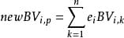

#### 「降维算法」奇异值分解 – SVD

[奇异值分解](https://zh.wikipedia.org/wiki/奇异值分解)（Singular Value Decomposition）是线性代数中一种重要的矩阵分解，奇异值分解则是特征分解在任意矩阵上的推广。在信号处理、统计学等领域有重要应用。

**生成模型和[GAN](https://easyai.tech/ai-definition/gan/)**

无监督学习的最简单目标是训练算法生成自己的数据实例，但是模型不应该简单地重现之前训练的数据，否则就是简单的记忆行为。

它必须是建立一个从数据中的基础类模型。不是生成特定的马或彩虹照片，而是生成马和彩虹的图片集；不是来自特定发言者的特定话语，而是说出话语的一般分布。

生成模型的指导原则是，能够构建一个令人信服的数据示例是理解它的最有力证据。正如物理学家理查德·费曼所说：“我不能创造的东西，我就不能了解”（What I cannot create, I do not understand.）。

对于图像来说，迄今为止最成功的生成模型是生成对抗网络（GAN）。它由两个网络组成：一个生成器和一个鉴别器，分别负责伪造图片和识别真假。

# Others

## 机器学习实操的7个步骤

通过上面的内容，我们对机器学习已经有一些模糊的概念了，这个时候肯定会特别好奇：到底怎么使用机器学习？

机器学习在实际操作层面一共分为7步：

1. 收集数据
2. 数据准备
3. 选择一个模型
4. 训练
5. 评估
6. 参数调整
7. 预测（开始使用）

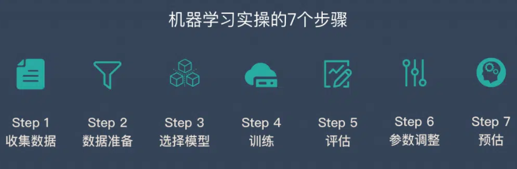

假设我们的任务是通过酒精度和颜色来区分红酒和啤酒，下面详细介绍一下机器学习中每一个步骤是如何工作的。

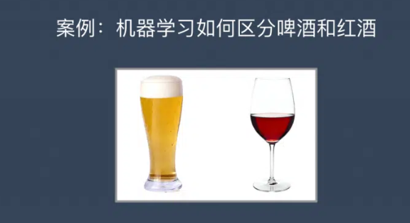

### 步骤1：收集数据

我们在超市买来一堆不同种类的啤酒和红酒，然后再买来测量颜色的光谱仪和用于测量酒精度的设备。

这个时候，我们把买来的所有酒都标记出他的颜色和酒精度，会形成下面这张表格。

| 颜色 | 酒精度 | 种类 |
| :--- | :----- | :--- |
| 610  | 5      | 啤酒 |
| 599  | 13     | 红酒 |
| 693  | 14     | 红酒 |
| …    | …      | …    |

**这一步非常重要，因为数据的数量和质量直接决定了预测模型的好坏。**

### 步骤2：数据准备

在这个例子中，我们的数据是很工整的，但是在实际情况中，我们收集到的数据会有很多问题，所以会涉及到数据清洗等工作。

当数据本身没有什么问题后，我们将数据分成3个部分：训练集（60%）、验证集（20%）、测试集（20%），用于后面的验证和评估工作。

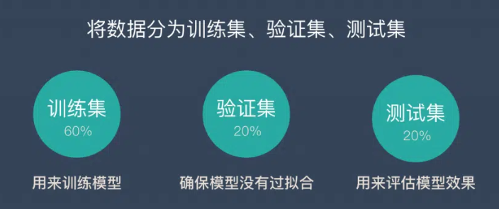

关于数据准备部分，还有非常多的技巧，感兴趣的可以看看《[AI 数据集最常见的6大问题（附解决方案）](https://easyai.tech/blog/ai-dataset-6-problem-solution/)》

### 步骤3：选择一个模型

研究人员和数据科学家多年来创造了许多模型。有些非常适合图像数据，有些非常适合于序列（如文本或音乐），有些用于数字数据，有些用于基于文本的数据。

在我们的例子中，由于我们只有2个特征，颜色和酒精度，我们可以使用一个小的线性模型，这是一个相当简单的模型。

### 步骤4：训练

大部分人都认为这个是最重要的部分，其实并非如此~ 数据数量和质量、还有模型的选择比训练本身重要更多（训练知识台上的3分钟，更重要的是台下的10年功）。

这个过程就不需要人来参与的，机器独立就可以完成，整个过程就好像是在做算术题。因为机器学习的本质就是**将问题转化为数学问题，然后解答数学题的过程**。

### 步骤5：评估

一旦训练完成，就可以评估模型是否有用。这是我们之前预留的验证集和测试集发挥作用的地方。评估的指标主要有 准确率、召回率、F值。

这个过程可以让我们看到模型如何对尚未看到的数是如何做预测的。这意味着代表模型在现实世界中的表现。

### 步骤6：参数调整

完成评估后，您可能希望了解是否可以以任何方式进一步改进训练。我们可以通过调整参数来做到这一点。当我们进行训练时，我们隐含地假设了一些参数，我们可以通过认为的调整这些参数让模型表现的更出色。

### 步骤7：预测

我们上面的6个步骤都是为了这一步来服务的。这也是机器学习的价值。这个时候，当我们买来一瓶新的酒，只要告诉机器他的颜色和酒精度，他就会告诉你，这时啤酒还是红酒了。