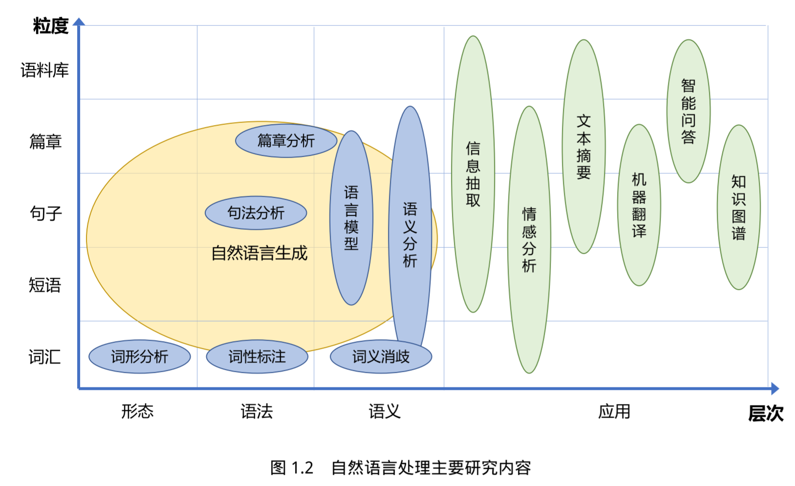
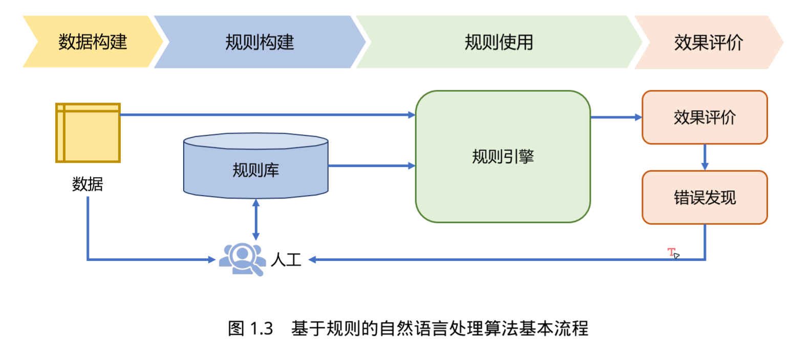

#

# 自然语言处理导论

> **【备注】本笔记是全书的精简版，收录个人觉得比较重要的概念和方法。**
>
> **初学者建议去看原书：**https://intro-nlp.github.io/

自然语言处理（Natural Language Processing，NLP）是计算机科学领域和人工智能领域的重要 研究方向之一，旨在探索实现人与计算机之间用自然语言进行有效交流的理论与方法。它融合了语言学、计算机科学、机器学习、数学、认知心理学等多学科内容，涉及从字、词、短语到句子、段落、篇章的多种语言单位，以及处理、理解、生成等不同层面的知识点，研究内容涉及的知识点多且复杂。自20世纪90年代以来，自然语言处理发展迅猛，各类任务和算法和研究范式层出不穷，在搜索引擎、医疗、金融、教育、司法等众多领域展示出重要作用。

## 1.1 自然语言处理基本概念

自然语言处理目标就是**实现人机之间的有效通信**，意味着要使计算机能够理解自然语言的意义，也能以自然语言文本来表达给定的意图、思想等。前者称为**自然语言理解（Natural Language Understanding，NLU）**，后者称为**自然语言生成（Natural Language Generation，NLG）**。需要说明的是，自然语言处理、自然语言理解以及计算语言学这些概念并没有严格统一的定义。本书采用吴立德教授在 1997 年所著的《大规模中文文本处理》中所给出的定义。无论是自然语言理解还是自然语言生成，目前都是开放性问题（Open Problem），通用的高精度高鲁棒自然语言处理系统还没有解决方案，仍然需要长期研究。

### 1.1.1 自然语言处理简史

自然语言处理的研究历史可以追溯到 1947 年，当时第一台通用计算机 ENIAC 也才刚刚面世一年，Warren Weaver 就提出了利用计算机翻译人类语言的可能，并于 1949 年发布了著名的《Translation》（翻译）备忘录。1950年，Alan Turing发表了著名的具有划时代意义的论文《Computing Machinery and Intelligence》（计算机器与智能），提出了使用图灵测试（Turing Test）对机器是否具备智能进行评测，即如果一台机器能够与人类展开对话而不能被辨别出其机器身份，那么这台机器具有智能。1951 年语言学家 Yehoshua Bar-Hillel 在麻省理工学院开始了机器翻译研究。1954 年乔治城大学（Georgetown University）与IBM合作的机器翻译演示系统将 60 多个俄语句子翻译成了英文。研究者们当时期望通过三到五年的时间完全解决机器翻译问题。20 世纪 50 年代初是自然语言处理的萌芽期。自然语言处理简史的时间线如图1.1所示。大体来看自然语言处理经历了 20 世纪 50 年代末到 60 年代的初创期、20 世纪 70 年代到 80 年代的理性主义时代、20 世纪 90 年代到 21 世纪初的经验主义时代以及 2006 年至今的深度学习时代。

从 20 世纪 90 年代开始，自然语言处理开启了繁荣发展的时代。自 1989 年机器翻译任务中引入语料库方法之后，这种建立在大规模真实语料上的研究方法将自然语言处理研究推向了新的高度。从90年代后期开始，基于机器学习和数据驱动的方法取代了早期基于规则和基于逻辑的方法，成为自然语言处理的标准模式。自然语言处理的各类任务，包括词法分析、词性标注、句法分析、文本分类、机器翻译等都开始引入机器学习算法。这期间朴素贝叶斯（Naive Bayes）[5]、K 近邻（K-nearest neighbor）[6]、支撑向量机（Support Vector Machine，SVM）[7]、最大熵模型（Maximum Entropy, ME）[8]、神经网络（Neural Network）[9]、条件随机场（Conditional Random Fields）[10]、感知机（Perceptron）[11]等方法也都在自然语言处理不同任务上进行了尝试并取得了一定的成功。这种以大规模数据为基础进行分析的方法称为经验主义（Empiricism）。随着数据驱动方法的发展，大部分关于自然语言处理的早期理论都大打折扣，特别是数据量的不断增加以及计算能力的不断提高，经验主义方法直到现在也还在主导着自然语言处理领域。从当前自然语言处理领域重要会议EMNLP（Empirical Methods in Natural Language Processing ）的名称和发展也可以看到经验主义的发展过程。

2006年加拿大多伦多大学教授Geoffery Hinton和他的学生Ruslan Salakhutdinov 在《科学》杂 志上发表了基关于于深度信念网络（DeepBeliefNetworks, DBN）以及无监督预训练结合有监督训练微调的方法解决深层神经网络训练中梯度消失问题的论文[12]，将神经网络重新拉回到机器学习研究者的视野中。2012年基于卷积神经网络（Convolutional Neural Network，CNN）网络的AlexNet在图像识别领域 ImageNet 竞赛中取得惊人的效果，开启了深度学习在学术界和工业界的浪潮[13]。 2011 年论文《Natural language processing (almost) from scratch》（从零开始的 NLP）引起了极大的 关注，深度神经网络可以在不使用人工特征的情况下，用一个统一的网络架构在词性标注、组块 分析、命名实体识别、语义角色标注等任务中都取得了很好的效果[14]。2014 年 Seq2Seq（序列到 序列）的模型[15] 在机器翻译任务上取得了非常好的效果，并且完全不依赖任何人工特征，推动了 神经机器翻译的广泛落地。这种端到端的方式进行编码和解码的方式不仅有效推动了包括生成式 摘要[16]、对话系统[17, 18] 等在内的自然语言生成问题上取得了突破，还应用于自然语言处理中的 很多任务，包括句法分析[19]、问题回答[20]、中文分词[21] 等。此外，循环神经网络（Recurrent neural network，RNN）[22]、长短时记忆网络（Long Short Term Memory Network, LSTM）[23]、递归神经网 络（Recursive Neural Network）[24]、卷积神经网络（Convolutional Neural Network, CNN）[25]、图 神经网络（Graph Neural Networks，GNN）[26, 27] 等神经网络模型也都成功应用于自然语言处理各个任务中。

2018年美国艾伦人工智能研究所（Allen Institute for AI）和华盛顿大学（Washington University） 联合发表的论文中提出了名为 ELMo 的上下文相关的文本表示方法，首先利用语言模型或其他自 监督任务进行预训练，此后在处理下游任务时，从预训练的网络中提取对应单词的网络各层的单 词嵌入作为新特征补充到下游任务中，在多个自然语言处理任务上表现非常突出[28]。此后，深度 学习开启了预训练模型（Pre-trained Models，PTM）结合任务微调的新范式。谷歌、OpenAI、微软、清华大学、百度、智源研究院等先后提出了BERT[29]，GPT[30]，XLNet[31]、ERNIE(THU)[32]、 ERNIE(Baidu)[33]、悟道等大规模预训练模型，在几乎所有自然语言处理任务中都取得了非常好的 效果，甚至在很多任务的标准评测集合上取得了超越人类准确率的水平。尤其是在类似阅读理解、 常识推理等任务上有惊人的效果提升。与此同时，预训练模型的规模也越来越大，2018 年谷歌开 发的BERT-Base 模型有 1.1 亿参数，BERT-Large 模型有 3.4 亿参数，到了 2019 年 OpenAI 开发的 GPT-2 模型就达到了 15 亿参数量。2021 年GPT-3 模型参数量更是达到了 1750 亿，而同年谷歌开 发的 Switch Transformer 模型参数量首次超过万亿，达到了 1.6 万亿。在此之后不久，北京智源研 究院所发布的“悟道 2.0”模型就刷新了上述记录，模型参数量达到了 1.75 万亿。虽然预训练大模 型取得了巨大的成功，但是仍然面临模型鲁棒性亟待提升、超大规模模型如何高效适配下游任务、大模型的理论解释等诸多问题。

### 1.1.2 自然语言处理的主要研究内容

自然语言处理的研究内容十分庞杂，整体上可以分为**基础算法研究**和**应用技术研究**。基础算法研究又可以细分为**自然语言理解**和**自然语言生成**。从语言单位角度看，涵盖了字、词、短语、句 子、段落以及篇章等不同粒度。从语言学研究角度看则涉及形态学、语法学、语义学、语用学等 不同层面。此外，由于目前绝大多数自然语言处理算法采用基于机器学习的方法，针对特定的自然语言处理任务，以有监督、无监督、半监督、强化学习等不同的机器学习算法为基础进行构建。因此，自然语言处理研究又与机器学习和语言学研究交织在一起，使得自然语言处理的研究内容 涉及范围广，学科交叉度大。

自然语言处理研究与语言学密切相关，语言学研究可以划分为形态、语法、语义、语用等几个层面。从自然语言处理研究内容的难度来看，形态、语法、语义到语用是逐层递增的。目前基于机器学习和深度学习的自然语言处理算法处理主要集中在形态、语法以及语义这三个层面，基于目前的处理框架，部分语义层面的任务仍较难突破，语用层面的任务难度更大，在该层面的研究 相对较少。我们从语言单元粒度和语言学研究层次两个维度，对自然语言处理的主要研究内容进行了归类，如图1.2所示。

- 基础算法研究
  - 自然语言理解
  - 自然语言生成
- 应用技术研究

自然语言处理在词汇粒度下的研究内容主要包括：词形分析、词性标注、词义消歧，分别针对单词的词性、语法、语义开展研究。句法分析则是主要针对句子根据语法进行结构分析。篇章 分析核心是对篇章的连贯性和衔接性进行分析，涉及到篇章级别语法结构，同时也包含部分语义 的内容。而语义分析研究则涉及到从词汇、短语、句子到篇章等各个粒度。语言模型主要聚焦于 句子粒度，但是也包含部分短语和篇章级别的研究。以上研究内容主要围绕自然语言理解的基础问题开展。自然语言生成则主要研究利用常识、逻辑和语法等知识自动生成文本，涉及形态、语法和语义层面，同时也涵盖从短语到篇章多个粒度。在自然语言处理基础研究内容之上，信息抽取、情感分析、文本摘要、机器翻译、智能问答、对话系统等任务则围绕自然语言处理的应用开展，所处理的语言单元也根据任务特性而不尽相同。

整体上来看，自然语言处理的主要研究内容围绕语言学基础理论，在形态、语法以及语义等层面开展自然语言理解基础算法和自然语言生成基础算法研究。在此基础上围绕自然语言处理的重要应用场景开展一系列的应用技术研究。这些研究内容也已经深度应用于信息检索、虚拟助理、推荐系统、量化交易、智能问诊、精准医疗等众多系统中。

### 1.1.3 自然语言处理的主要难点

自然语言理解和自然语言生成都是十分困难的任务，这种困难的根本原因是**自然语言在各个层面都广泛存在的各种各样的歧义性或多义性（Ambiguity）**。自然语言文本从形式上是由字符（包 括中文汉字、英文字母、符号）组成的字符串。由字母或者汉字可以组成词，由词可以组成词组， 由词组可以组成句子，进而组成段落、篇章。无论哪种粒度的语言单元，还是从一个层级向上一个 层级转变中都存在歧义和多义现象。形式上一样的字符串，可以理解为不同的词串、词组串，并 有不同的意义[1]。Joseph F. Kess 和 Ronald A. Hoppe 甚至还提出了“语言无处不歧义”的理论[34]。**在某种程度上，我们也可以说自然语言处理基础任务的核心就在于解决歧义问题。**

1. **语音歧义**：主要体现在口语中，是由于语言中同音异义词（Homophone ）、 爆破音不完全、重音位置不明确等原因造成的。

   > 例如：请问您贵姓？ 免贵姓 zhang。这组对话中“zhang”既可以是“张”，也可以是“章”。汉语中同音异义词也有非常多，例如：“chéng shì：城市、程式、成事、城事”、“jìn shì：近视、进士、尽是”、“shǒu shì：首饰、手势”等。

2. **词语切分歧义**：是由字符组成词语时的歧义现象。对于英语等印 欧语系的语言来说，绝大部分单词之间都由空格或标点分割。但是对于汉语、日语等语言来说，单词之间通常没有分隔符。对于这些语言来说，这些连续的字符切分为单词时就会产生歧义。

   > 例如：语言学是一门基础学科。 这门语言学起来很困难。
   >
   > 该例句中“语言学”、“语言”都是词语，在同一个句子中就会出现多种切分方法。这种切分歧义在汉语中普遍存在。我们将在第 2 章详细讨论词语切分歧义的问题以及词语切分的方法。

3. **词义歧义**：是指词语具有相同形式但是不同意义。这种歧义在各种语言 中都广泛存在，通常越是常见的词语其词义数量就越多。例如“打”字在《现代汉语词典（第七版）》中，有两个读音“dá”和“dǎ”，分别作为量词、动词和介词，在作为动词时“打”字有 24
   个意项[35]。

   > 打 dǎ 动词： (1) 用手或器具撞击物体：~ 门 |~ 鼓 (2) 器皿、蛋类等因撞击而破碎：碗 ~ 了 | 鸡飞蛋 ~ (3) 殴打；攻打：~ 架 |~ 援 (4) 发生与人交涉的行为：~ 官司 |~ 交道 (5) 汲取；盛取：~ 米 |~ 酱油 · · ·
   >
   > 英语中存在大量类似的情况，例如根据WordNet 中给出的定义，单词“bank”具有名词和动词两种词性，作为名词时具有 10 种词义。

4. **结构歧义**：是由词组成词组或者句子时，由于其组成的词或词组间可能存 在不同的语法或语义关系而出现的（潜在）歧义现象。结构歧义有时也称为语法歧义（Grammatical Ambiguity）。冯志伟教授在文献 [37] 中对结构歧义进行了系统的描述，其中一些典型的结构歧义如下：

   > - “VP+ 的 + 是 +NP”型歧义结构： 例如：反对 | 的 | 是 | 少数人
   >   该类型歧义中，VP 是一个双向动词，“VP+ 的”是主语，“是 +NP”是谓语，整个句式是个 一个主谓结构。由于主语部分的“VP+的”既可以是施事，也可以是受事，因而会产生歧义。 这个例子中既可以理解为“提反对意见的是少数人”，也可以理解为“所反对的是少数人”。
   > - “VP+N1+ 的 +N2”型歧义结构： 例如：咬死了 | 猎人 | 的 | 狗
   >   该类型歧义中，N1 作为VP的宾语，述宾结构“VP+N1”加上“的”之后，作为名词N2 的 定语，整个结构是一个定中结构。但是 N1 又可以与“的”结合在一起作为 N2 的定语，构 成“N1+ 的 +N2”，这个名词词组作为 VP 的宾语，整个结构构成一个述宾结构。这个例子 中既可以理解为“咬死了一只猎人的狗”，也可以理解为“一只把猎人咬死的狗”。
   > - “N1+ 和 +N2+ 的 +N3”型歧义结构： 例如：桌子 | 和 | 椅子 | 的 | 腿 该类型歧义是由于连词“和”的管辖范围的不同造成的潜在歧义。这个例子中既可以理解为 “桌子和（椅子的腿）”，也可以理解为“（桌子和椅子）的腿”。 
   >
   > 类似的结构歧义类型有很多，例如：“ADJ+N1+N2”、“VP+ADJ+的+N”等。这些歧义的不同理解会造成不同的句法结构以及语义上的不同。句法分析的主要难度就是解决结构歧义问题。我们将在第 3 章对结构歧义以及如何进行句法分析进行详细介绍。

5. **指代和省略歧义**：在由多个句子组成的段落或篇章中，各种歧义依然存在，例如指代歧义和省略歧义。

   **指代歧义** （Demonstrative Ambiguity）是指代词（如我，你，他等）和代词词组（如“那件事”，“这一点”等） 所指的事件可能存在歧义。 
   
   > 例如：猴子吃了香蕉，因为它饿了。 猴子吃了香蕉，因为它熟透了。
   >
   > 上述两个句子的前半句完全相同，“它”可以指代“猴子”和“香蕉”，需要根据后半句的谓词决定指代关系.
   
   **省略歧义**（Ellipsis Ambiguity）是指自然语言中由于省略所产生的歧义。省略是自然语言中的 一种重要的语言现象，尤其在汉语中省略现象非常常见。省略掉一些成分，在绝大部分情况下不会影响句子的表达，但是还是存在一些由于省略造成歧义的问题。
   
   > 例如：县政府同意乡政府报告。 
   >
   > 这个例子中省略了助词“的”，因此使得该句具有两种解释，一个是县政府同意乡政府的那份报告，
   > 另外一个是县政府同意乡政府作出报告。

6. **语用歧义**：是指由于上下文、说话人属性、场景等语用方面的原因造成 的歧义。一句话在不同的场合、由不同的人说、不同的语境，都可能产生不同的理解。 

   > 例如：下例由于场景的不同，同样的句子可以有不同的意义。 句子：你知道南京路怎么走吗？
   >
   >  (1) 如果说话人是游客，说话的对象是警察，那么这句话的含义就是问路。
   >
   >  (2) 如果说话人同样是游客，但是说话的对象换成出租车司机，那么这句话的含义就是询问出租车司机是否可以送他到南京路。

​	从上述介绍中，可以看到自然语言中存在大量的歧义现象。对人类而言，这些歧义在绝大多 数的情况下都可以根据上下文以及相应的语境和场景得到解决。这也就是为什么我们平时使用自 然语言交流并没有感知到语言的歧义。但是，为了消解这些歧义，需要使用大量的知识进行推理 才能完成。而如何表示知识和使用知识、如何完整收集和整理知识以及常识都是极其困难的问题。 莫拉维克悖论（Moravec’s paradox）对自然语言处理也依旧适用。也正是由于这些问题，才使得消 解歧义是自然语言处理中最大的难点之一。 

​	此外，自然语言并不是一成不变的，而是在动态发展中，存在大量未知语言现象。新词汇、新含义、新用法、新句型等层出不穷[38]。 例如：

- 新词汇：双碳、双减、绝绝子、社恐、元宇宙 
- 新含义：躺平、打工人、凡尔赛、青蛙、潜水、盖楼 
- 新用法：走召弓虽、YYDS、回忆杀、求扩列、orz 
- 新句型：纠结的说、看书ing、一整个无语住

这些层见迭出的语言现象对于自然语言处理系统来说也是巨大的挑战。无论是自然语言处理基础任务还是应用系统，如何应对这些未知的情况都是巨大的挑战。

## 1.2 自然语言处理的基本范式

自然语言处理的发展经历了从理性主义到经验主义，再到深度学习三个大的历史阶段。在发 展过程中也逐渐形成了一定的范式，主要包括：基于规则的方法、基于机器学习的方法以及基于 深度学习的方法。这三种范式也基本对应了自然语言处理的不同发展阶段的重点。需要特别说明 的是，虽然以上三种范式来源于自然语言处理的不同发展阶段，有明显的发展先后顺序，并且在 大部分自然语言处理任务的标准评测集合中基于深度学习的方法都好于基于机器学习的方法，更 优于基于规则的方法很多。但是，这三种范式各有利弊，在实际应用中需要根据任务的特点、计 算量、可控制性以及可解释性等具体情况进行选择。 

上述三种范式虽然有很大的不同，但是都有一个相同点就是需要针对特定任务进行构建。面向不同的任务，按照不同的范式构建数据、模型等不同方面，所得到的算法或者系统仅能够处理 特定的任务。在机器学习和深度学习范式下，甚至对模型预测目标进行微小修正，通常都需要对 模型进行重新训练。对于未知任务的零样本学习（Zero-shot Learning）能力很少在上述范式中进行 讨论和研究。基于机器学习和深度学习范式也很难实现模型对未知任务的泛化。2022 年 11 月随 着 ChatGPT 的发布，大模型所展现出来的文本生成能力以及对未知任务的泛化能力使得未来的自 然语言处理的研究范式很可能会发生非常大的变化。因此，本节中也将简要介绍大模型研究范式的雏形。

## 1.2.1 基于规则的方法

基于规则的自然语言处理方法的主要思想是通过词汇、形式文法等制定的规则引入语言学知 识，从而完成相应的自然语言处理任务。这类方法在自然语言处理早期受到了很大的关注，包括 机器翻译在内的很多自然语言处理任务都采用此类方法。甚至目前仍有很多系统还在使用基于规 则的方法。基于规则的方法基本流程如图1.3所示，主要包含：数据构建、规则构建、规则使用和效果评价等四个部分。

