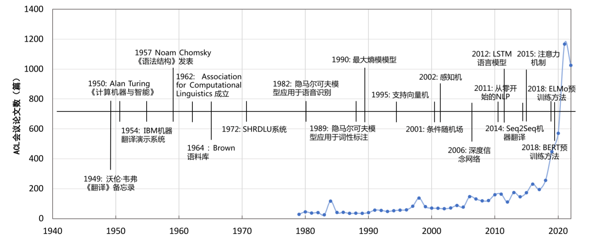

#

# 自然语言处理导论

> **【备注】本笔记是全书的精简版，收录个人觉得比较重要的概念和方法。**
>
> **初学者建议去看原书：**https://intro-nlp.github.io/

自然语言处理（Natural Language Processing，NLP）是计算机科学领域和人工智能领域的重要 研究方向之一，旨在探索实现人与计算机之间用自然语言进行有效交流的理论与方法。它融合 了语言学、计算机科学、机器学习、数学、认知心理学等多学科内容，涉及从字、词、短语到句 子、段落、篇章的多种语言单位，以及处理、理解、生成等不同层面的知识点，研究内容涉及的 知识点多且复杂。自 20 世纪 90 年代以来，自然语言处理发展迅猛，各类任务和算法和研究范式层出不穷，在搜索引擎、医疗、金融、教育、司法等众多领域展示出重要作用。

## 1.1 自然语言处理基本概念

自然语言处理目标就是**实现人机之间的有效通信**，意味着要使计算机能够理解自然语言的意义，也能以自然语言文本来表达给定的意图、思想等。前者称为**自然语言理解（Natural Language Understanding，NLU）**，后者称为**自然语言生成（Natural Language Generation，NLG）**。需要说明的是，自然语言处理、自然语言理解以及计算语言学这些概念并没有严格统一的定义。本书采用 吴立德教授在 1997 年所著的《大规模中文文本处理》中所给出的定义。无论是自然语言理解还是自然语言生成，目前都是开放性问题（Open Problem），通用的高精度高鲁棒自然语言处理系统还没有解决方案，仍然需要长期研究。

### 1.1.1自然语言处理简史

自然语言处理的研究历史可以追溯到 1947 年，当时第一台通用计算机 ENIAC 也才刚刚面 世一年，Warren Weaver 就提出了利用计算机翻译人类语言的可能，并于 1949 年发布了著名的《Translation》（翻译）备忘录。1950年，Alan Turing发表了著名的具有划时代意义的论文《Computing Machinery and Intelligence》（计算机器与智能），提出了使用图灵测试（Turing Test）对机器是否 具备智能进行评测，即如果一台机器能够与人类展开对话而不能被辨别出其机器身份，那么这台 机器具有智能。1951 年语言学家 Yehoshua Bar-Hillel 在麻省理工学院开始了机器翻译研究。1954 年乔治城大学（Georgetown University）与IBM合作的机器翻译演示系统将 60 多个俄语句子翻译 成了英文。研究者们当时期望通过三到五年的时间完全解决机器翻译问题。20 世纪 50 年代初是 自然语言处理的萌芽期。自然语言处理简史的时间线如图1.1所示。大体来看自然语言处理经历了 20 世纪 50 年代末到 60 年代的初创期、20 世纪 70 年代到 80 年代的理性主义时代、20 世纪 90 年代到 21 世纪初的经验主义时代以及 2006 年至今的深度学习时代。

从 20 世纪 90 年代开始，自然语言处理开启了繁荣发展的时代。自 1989 年机器翻译任务中引 入语料库方法之后，这种建立在大规模真实语料上的研究方法将自然语言处理研究推向了新的高 度。从90年代后期开始，基于机器学习和数据驱动的方法取代了早期基于规则和基于逻辑的方法， 成为自然语言处理的标准模式。自然语言处理的各类任务，包括词法分析、词性标注、句法分析、 文本分类、机器翻译等都开始引入机器学习算法。这期间朴素贝叶斯（Naive Bayes）[5]、K 近邻（K-nearest neighbor）[6]、支撑向量机（Support Vector Machine，SVM）[7]、最大熵模型（Maximum Entropy, ME）[8]、神经网络（Neural Network）[9]、条件随机场（Conditional Random Fields）[10]、 感知机（Perceptron）[11] 等方法也都在自然语言处理不同任务上进行了尝试并取得了一定的成功。 这种以大规模数据为基础进行分析的方法称为经验主义（Empiricism）。随着数据驱动方法的发展， 大部分关于自然语言处理的早期理论都大打折扣，特别是数据量的不断增加以及计算能力的不断 提高，经验主义方法直到现在也还在主导着自然语言处理领域。从当前自然语言处理领域重要会 议EMNLP（Empirical Methods in Natural Language Processing ）的名称和发展也可以看到经验主义的发展过程。

2006年加拿大多伦多大学教授Geoffery Hinton和他的学生Ruslan Salakhutdinov 在《科学》杂 志上发表了基关于于深度信念网络（Deep BeliefNetworks, DBN）以及无监督预训练结合有监督训 练微调的方法解决深层神经网络训练中梯度消失问题的论文[12]，将神经网络重新拉回到机器学习研究者的视野中。2012年基于卷积神经网络（Convolutional Neural Network，CNN）网络的AlexNet在图像识别领域 ImageNet 竞赛中取得惊人的效果，开启了深度学习在学术界和工业界的浪潮[13]。 2011 年论文《Natural language processing (almost) from scratch》（从零开始的 NLP）引起了极大的 关注，深度神经网络可以在不使用人工特征的情况下，用一个统一的网络架构在词性标注、组块 分析、命名实体识别、语义角色标注等任务中都取得了很好的效果[14]。2014 年 Seq2Seq（序列到 序列）的模型[15] 在机器翻译任务上取得了非常好的效果，并且完全不依赖任何人工特征，推动了 神经机器翻译的广泛落地。这种端到端的方式进行编码和解码的方式不仅有效推动了包括生成式 摘要[16]、对话系统[17, 18] 等在内的自然语言生成问题上取得了突破，还应用于自然语言处理中的 很多任务，包括句法分析[19]、问题回答[20]、中文分词[21] 等。此外，循环神经网络（Recurrent neural network，RNN）[22]、长短时记忆网络（Long Short Term Memory Network, LSTM）[23]、递归神经网 络（Recursive Neural Network）[24]、卷积神经网络（Convolutional Neural Network, CNN）[25]、图 神经网络（Graph Neural Networks，GNN）[26, 27] 等神经网络模型也都成功应用于自然语言处理各个任务中。

2018年美国艾伦人工智能研究所（Allen Institute for AI）和华盛顿大学（Washington University） 联合发表的论文中提出了名为 ELMo 的上下文相关的文本表示方法，首先利用语言模型或其他自 监督任务进行预训练，此后在处理下游任务时，从预训练的网络中提取对应单词的网络各层的单 词嵌入作为新特征补充到下游任务中，在多个自然语言处理任务上表现非常突出[28]。此后，深度 学习开启了预训练模型（Pre-trained Models，PTM）结合任务微调的新范式。谷歌、OpenAI、微 软、清华大学、百度、智源研究院等先后提出了BERT[29]，GPT[30]，XLNet[31]、ERNIE(THU)[32]、 ERNIE(Baidu)[33]、悟道等大规模预训练模型，在几乎所有自然语言处理任务中都取得了非常好的 效果，甚至在很多任务的标准评测集合上取得了超越人类准确率的水平。尤其是在类似阅读理解、 常识推理等任务上有惊人的效果提升。与此同时，预训练模型的规模也越来越大，2018 年谷歌开 发的BERT-Base 模型有 1.1 亿参数，BERT-Large 模型有 3.4 亿参数，到了 2019 年 OpenAI 开发的 GPT-2 模型就达到了 15 亿参数量。2021 年GPT-3 模型参数量更是达到了 1750 亿，而同年谷歌开 发的 Switch Transformer 模型参数量首次超过万亿，达到了 1.6 万亿。在此之后不久，北京智源研 究院所发布的“悟道 2.0”模型就刷新了上述记录，模型参数量达到了 1.75 万亿。虽然预训练大模 型取得了巨大的成功，但是仍然面临模型鲁棒性亟待提升、超大规模模型如何高效适配下游任务、大模型的理论解释等诸多问题。