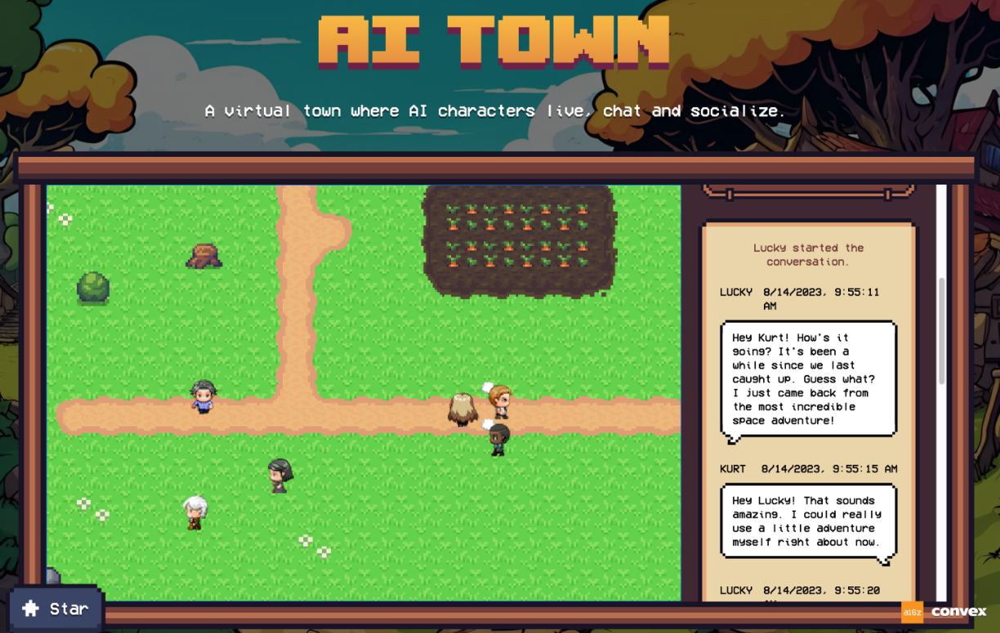

# AI-Town

> 原始项目：https://github.com/joonspk-research/generative_agents
>
> TS/JS版本：https://github.com/a16z-infra/ai-town

# 原始项目【生成式智能体：人类行为的交互式模拟】

> https://github.com/joonspk-research/generative_agents


该代码库附带我们题为“[生成式智能体：人类行为的交互式模拟](https://arxiv.org/abs/2304.03442)”的研究论文。它包含我们的生成智能体（模拟可信人类行为的计算智能体）及其游戏环境的核心模拟模块。下面，我们记录了在本地计算机上设置模拟环境以及将模拟重播为演示动画的步骤。

## 设置环境

要设置您的环境，您需要生成一个`utils.py`包含 OpenAI API 密钥的文件并下载必要的软件包。

### 1. 生成Utils文件

在`reverie/backend_server`文件夹（`reverie.py`所在的文件夹）中，创建一个名为的新文件`utils.py`，并将以下内容复制并粘贴到该文件中：

```python
# Copy and paste your OpenAI API Key
openai_api_key = "<Your OpenAI API>"
# Put your name
key_owner = "<Name>"

maze_assets_loc = "../../environment/frontend_server/static_dirs/assets"
env_matrix = f"{maze_assets_loc}/the_ville/matrix"
env_visuals = f"{maze_assets_loc}/the_ville/visuals"

fs_storage = "../../environment/frontend_server/storage"
fs_temp_storage = "../../environment/frontend_server/temp_storage"

collision_block_id = "32125"

# Verbose 
debug = True
```

### 2. 安装requirements.txt

安装`requirements.txt`文件中列出的所有内容（安装之前记得进入虚拟环境）。

关于 Python 版本的说明：我们在 Python 3.9.12 上测试了我们的环境。

## 运行模拟

要运行新的模拟，您需要同时启动两个服务器：环境服务器和智能体模拟服务器。

### 1. 启动环境服务器

同样，该环境是作为 Django 项目实现的，因此，您需要启动 Django 服务器。为此，首先导航到命令行`environment/frontend_server`（这是所在位置）。`manage.py`然后运行以下命令：

```bash
python manage.py runserver
```

然后，在您最喜欢的浏览器上，转到http://localhost:8000/。如果您看到一条消息“`Your environment server is up and running!`”，则表明您的服务器运行正常。


确保环境服务器在运行模拟时继续运行，因此请保持此命令行选项卡打开！ （注意：我建议使用 Chrome 或 Safari。Firefox 可能会产生一些前端故障，尽管它不应该干扰实际的模拟。）

### 2. 启动模拟服务器

打开另一个命令行（您在步骤 1 中使用的命令行应该仍在运行环境服务器，因此请保持原样）。导航到`reverie/backend_server`并运行`reverie.py`.

```bash
python reverie.py
```

这将启动模拟服务器。将出现命令行提示，询问以下内容：“Enter the name of the forked simulation: ”。要启动一个包含3个智能体 Isabella Rodriguez、Maria Lopez 和 Klaus Mueller 的模拟，请输入以下内容：

```
base_the_ville_isabella_maria_klaus
```

然后提示将询问“Enter the name of the new simulation: ”。输入任何名称来表示您当前的模拟（例如，现在只需“测试模拟”即可）。

```bash
test-simulation
```

保持模拟器服务器运行。此时会显示如下提示：“Enter option: ”

### 3. 运行并保存模拟

在浏览器上，导航到`http://localhost:8000/simulator_home`。您应该会看到Smallville的地图，以及地图上的活跃的智能体列表。您可以使用键盘箭头在地图上移动。请保持此选项卡打开。要运行模拟，请在模拟服务器中键入以下命令以响应提示“Enter option”：

```bash
run <step-count>
```

请注意，您需要将`<step-count>`上面的内容替换为一个整数，表示您要模拟的游戏步骤数。例如，如果您想模拟 100 个游戏步骤，您应该输入`run 100`。一个游戏步骤代表游戏中的 10 秒。

您的模拟应该正在运行，您将看到智能体在浏览器中的地图上移动。一旦模拟运行完成，“Enter option”提示将再次出现。此时，您可以通过重新输入带有所需游戏步骤的运行命令来模拟更多步骤，通过键入`exit` 退出模拟而不保存，或通过键入`fin` 保存并退出。


通过提供模拟的名称（如`test-simulation`）作为forked模拟，可以在下次运行模拟服务器时访问保存的模拟。这将允许您从上次停止的位置重新开始模拟。

### 4. 重启模拟

您只需运行环境服务器并在浏览器中导航到以下地址即可重启已运行的模拟：`http://localhost:8000/replay/<simulation-name>/<starting-time-step>`。请确保替换`<simulation-name>`为您要重播的模拟的名称，以及`<starting-time-step>`您希望开始重播的整数时间步长。

例如，通过访问以下链接，您将启动一个预模拟示例，从时间步 1 开始：
`http://localhost:8000/replay/July1_the_ville_isabella_maria_klaus-step-3-20/1/`

### 5 .演示模拟

您可能已经注意到重启后的所有角色精灵看起来都相同。我们想澄清的是，重播功能主要用于调试目的，并不优先考虑优化模拟文件夹或视觉效果的大小。为了正确演示具有适当角色精灵的模拟，您需要首先压缩模拟。为此，请使用文本编辑器打开位于目录`reverie`中的`compress_sim_storage.py`文件。然后，以目标模拟的名称作为输入来执行`compress`函数。这样，模拟文件将被压缩，以便为演示做好准备。

要启动演示，请在浏览器上访问以下地址：`http://localhost:8000/demo/<simulation-name>/<starting-time-step>/<simulation-speed>`。请注意，`<simulation-name>`和`<starting-time-step>`表示与上面提到的相同的事物。`<simulation-speed>`可以设置控制演示速度，其中1最慢，5最快。例如，访问以下链接将启动一个预模拟示例，从时间步 1 开始，具有中等演示速度：

`http://localhost:8000/demo/July1_the_ville_isabella_maria_klaus-step-3-20/1/3/`

### 提示

我们注意到 OpenAI 的 API 在达到每小时速率限制时可能会挂起。发生这种情况时，您可能需要重新启动模拟。目前，我们建议您在进行过程中经常保存模拟，以确保当您确实需要停止并重新运行模拟时，尽可能少地丢失模拟。至少从 2023 年初开始，运行这些模拟可能会花费一些成本，特别是当环境中存在许多智能体时。

## 模拟存储位置

您保存的所有模拟将位于`environment/frontend_server/storage`，所有压缩演示将位于`environment/frontend_server/compressed_storage`。

## 定制化

有两种方法可以选择自定义您的模拟。

### 作者和加载智能体历史记录

首先是在模拟开始时初始化具有唯一历史记录的智能体。为此，您需要 1) 使用基本模拟之一开始模拟，2) 创建和加载智能体历史记录。更具体地说，步骤如下：

#### 1. 启动基础模拟

存储库中包含两个基本模拟：`base_the_ville_n25`25 个智能体和`base_the_ville_isabella_maria_klaus`3 个智能体。按照上述步骤直至步骤 2 加载基本模拟之一。

#### 2. 加载历史文件

然后，当提示“输入选项：”时，您应该通过响应以下命令来加载智能体历史记录：

```bash
call -- load history the_ville/<history_file_name>.csv
```

请注意，您需要替换`<history_file_name>`为现有历史文件的名称。存储库中包含两个历史文件作为示例：

- `agent_history_init_n25.csv`for`base_the_ville_n25`
- `agent_history_init_n3.csv`for `base_the_ville_isabella_maria_klaus`

这些文件包括每个智能体的以分号分隔的内存记录列表——加载它们会将内存记录插入到智能体的内存流中。

####  3. 进一步定制

要通过创作您自己的历史文件来自定义初始化，请将您的文件放置在以下文件夹中：`environment/frontend_server/static_dirs/assets/the_ville`。自定义历史文件的列格式必须与包含的示例历史文件相匹配。因此，我们建议通过复制并粘贴存储库中已有的内容来开始该过程。

### 创建新的基础模拟

对于更复杂的定制，您将需要编写自己的基础模拟文件。最直接的方法是复制并粘贴现有的基本模拟文件夹，根据您的要求对其进行重命名和编辑。如果您决定保持智能体名称不变，此过程会更简单。但是，如果您希望更改他们的名称或增加 Smallville 地图可容纳的智能体数量，您可能需要使用 [Tiled](https://www.mapeditor.org/) 地图编辑器直接编辑地图。

# TS/JS版本【AI Town】

> https://github.com/a16z-infra/ai-town



AI Town 是一个虚拟城镇，AI 角色在此居住、聊天和社交。

该项目是一个可部署的入门套件，可轻松构建和定制您自己的 AI 城镇版本。受到研究论文[*生成智能体：人类行为的交互式模拟的*](https://arxiv.org/pdf/2304.03442.pdf)启发。

该项目的主要目标不仅仅是工作起来很有趣，还在于提供一个具有坚实基础且可扩展的平台。后端本身支持共享的全局状态、事务和模拟引擎，并且应该适合从简单的项目到可扩展的多人游戏的所有内容。第二个目标是使 JS/TS 框架可用，因为该领域的大多数模拟器（包括上面的原始论文）都是用 Python 编写的。

## 技术栈

- 游戏引擎、数据库和矢量搜索：[Convex](https://convex.dev/)
- 用户：[Convex](https://convex.dev/)
- 文本模型：[OpenAI](https://platform.openai.com/docs/models)
- 部署：[Vercel](https://vercel.com/)
- 像素艺术生成：[Replicate](https://replicate.com/), [Fal.ai](https://serverless.fal.ai/lora)
- 背景音乐生成：[Replicate](https://replicate.com/) using [MusicGen](https://huggingface.co/spaces/facebook/MusicGen)
- 本地推理：[Ollama](https://github.com/jmorganca/ollama)

## 安装

### 项目克隆&安装依赖

```
git clone https://github.com/a16z-infra/ai-town.git
cd ai-town
npm install
npm run dev
```

`npm run dev`请求环境变量会失败。将它们输入到 Convex 仪表板上的环境变量中以继续。您可以通过执行`npx convex dashboard`或者点击 [dashboard.convex.dev](https://dashboard.convex.dev/deployment/settings/environment-variables)到达那里， 请参阅下文了解如何获取各种环境变量。

#### 设置Clerk

1. 转到https://dashboard.clerk.com/并单击“添加应用程序”
2. 为您的应用程序命名并选择您想要为用户提供的登录提供商
3. 创建应用程序
4. 添加`VITE_CLERK_PUBLISHABLE_KEY`和`CLERK_SECRET_KEY`至`.env.local`

```python
VITE_CLERK_PUBLISHABLE_KEY=pk_***
CLERK_SECRET_KEY=sk_***
```

5. 转到 JWT 模板并创建一个新的Convex Template。
6. 复制 JWKS Endpoint URL 以供下面使用


#### OpenAI API key

访问https://platform.openai.com/account/api-keys获取 OpenAI API 密钥并 `OPENAI_API_KEY`在 Convex 部署中设置环境变量（见下文）。

#### Replicate API key (可选) 

对于每日背景音乐生成，请创建一个[Replicate](https://replicate.com/)帐户并在您的个人资料的 [API Token page](https://replicate.com/account/api-tokens)中创建一个token。在您的 Convex 环境变量中添加`REPLICATE_API_TOKEN`。

```
npx convex dev
```


#### 添加环境变量到Convex后端

Convex 后端的环境变量是通过仪表板配置的。

转到“设置”并添加以下环境变量。`CLERK_ISSUER_URL`应该是来自 JWKS Endpoint  URL 中的域（例如，https://your-issuer-url.clerk.accounts.dev/）。

此链接将带您进行最近的部署： https://dashboard.convex.dev/deployment/settings/environment-variables?var=CLERK_ISSUER_URL

```bash
OPENAI_API_KEY  sk-*******
CLERK_ISSUER_URL  https://****
REPLICATE_API_TOKEN **** #optional
```

## 运行代码

要同时运行前端和后端：

```bash
npm run dev
```

您现在可以访问[http://localhost:5173](http://localhost:5173/)。

如果您希望在与 Convex 不同的终端中运行前端（它会在保存后端函数时同步它们），您可以运行以下两个命令：

```bash
npm run dev:frontend
npm run dev:backend
```

详细信息请参阅 package.json，但 dev:backend 运行`npx convex dev`

**注意**：如果窗口空闲，模拟将在 5 分钟后暂停。加载页面将取消暂停。您还可以使用用户界面中的按钮手动冻结和解冻世界。如果你想在没有浏览器的情况下运行世界，你可以在`convex/crons.ts`中注释掉"stop inactive worlds"

## 运行/测试/调试的各种命令

### 停止后端，以防活动过多

这将停止运行引擎和智能体。您仍然可以运行查询并运行函数来调试。

```bash
npx convex run testing:stop
```

### 停止后重新启动后端

```bash
npx convex run testing:resume
```

### 在游戏引擎或智能体未运行的情况下启动引擎

```bash
npx convex run testing:kick
```

### 为世界存档

如果您想重置世界并从头开始，您可以存档当前世界：

```bash
npx convex run testing:archive
```

然后，您仍然可以在仪表板中查看世界数据，但引擎和智能体将不再运行。

然后你就可以用`init` 来创造一个新鲜的世界。

```bash
npx convex run init
```


**清除所有数据库**

您可以使用测试功能擦除所有表`wipeAllTables`。

```
npx convex run testing:wipeAllTables
```

**暂停后端部署**

您可以转到 [dashboard](https://dashboard.convex.dev/) 的部署设置来暂停和取消暂停部署。这将停止所有功能，无论是从客户端调用、计划的还是作为 cron 作业调用。

**请将此视为最后的手段，因为上面有更温和的方法可以停止。**

## 部署应用程序

### 部署到 Vercel

- 在 Vercel 上注册帐户，然后[安装 Vercel CLI](https://vercel.com/docs/cli)。
- **如果您使用的是 Github Codespaces**：您将需要[安装 Vercel CLI](https://vercel.com/docs/cli)并通过运行`vercel login`从您的 codespaces cli 进行身份验证。
- 使用`vercel --prod`将应用程序部署到 Vercel 。

### 将 Convex functions 部署到生产环境

在运行应用程序之前，您需要确保Convex functions已部署到其生产环境。

1. 运行`npx convex deploy`以将凸函数部署到生产中
2. 运行`npx convex run init --prod`

如果您有想要清除的现有数据，您可以运行`npx convex run testing:wipeAllTables --prod`
