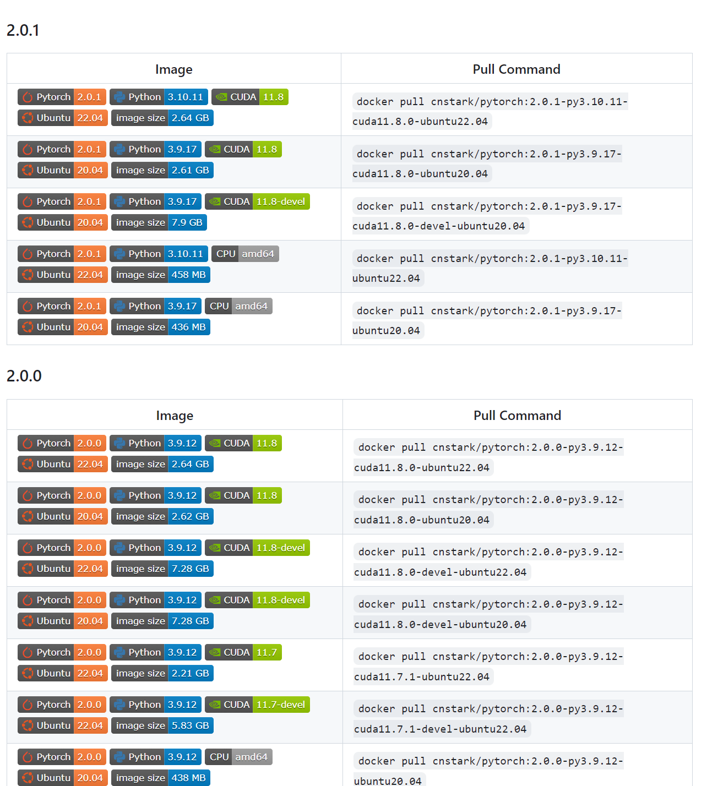

# ChatGLM3-6B相关实践

> ChatGLM3-6B 是 ChatGLM 系列最新一代的开源模型，在保留了前两代模型对话流畅、部署门槛低等众多优秀特性的基础上，ChatGLM3-6B 引入了如下特性：
>
> - 更强大的基础模型： ChatGLM3-6B 的基础模型 ChatGLM3-6B-Base 采用了更多样的训练数据、更充分的训练步数和更合理的训练策略。在语义、数学、推理、代码、知识等不同角度的数据集上测评显示，ChatGLM3-6B-Base 具有在 10B 以下的预训练模型中最强的性能。
> - 更完整的功能支持： ChatGLM3-6B 采用了全新设计的 Prompt 格式，除正常的多轮对话外。同时原生支持工具调用（Function Call）、代码执行（Code Interpreter）和 Agent 任务等复杂场景。
> - 更全面的开源序列： 除了对话模型 ChatGLM3-6B 外，还开源了基础模型 ChatGLM-6B-Base、长文本对话模型 ChatGLM3-6B-32K。以上所有权重对学术研究完全开放，在填写问卷进行登记后亦允许免费商业使用。

> 以下系统均运行在windows11下的ubuntu 22.04子系统

## Docker本地部署

### 项目&模型下载

```bash
#项目下载
git clone https://github.com/THUDM/ChatGLM3


#模型文件下载
git clone https://www.modelscope.cn/ZhipuAI/chatglm3-6b.git
#下载完成之后可以删除下 .git 文件夹，可以减少空间。
```


### 使用nvidia镜像启动

> torch镜像目录
>
> https://github.com/cnstark/pytorch-docker
>
> 

```bash
# 拉取镜像（已经安装docker desktop并绑定wsl2)
docker pull cnstark/pytorch:2.0.1-py3.10.11-cuda11.8.0-ubuntu22.04

# 安装镜像
docker run -itd --name chatglm3 -v `pwd`/ChatGLM3:/data --gpus=all -e NVIDIA_DRIVER_CAPABILITIES=compute,utility -e NVIDIA_VISIBLE_DEVICES=all -p 8501:8501 cnstark/pytorch:2.0.1-py3.10.11-cuda11.8.0-ubuntu22.04
# `pwd`/ChatGLM3:/data   这条命令要求你得在ChatGLM3的父目录下执行该Docker命令，并将其映射到docker中的data目录下

# 进入镜像
docker exec -it chatglm3 bash

# 切换到目录
cd /data
# 换源
pip3 config set global.index-url https://mirrors.aliyun.com/pypi/simple 
pip3 config set install.trusted-host mirrors.aliyun.com
# 安装ChatGLM3安装包
pip3  install -r requirements.txt

#进入基础demo目录，运行脚本
cd ./basic_demo
streamlit run web_demo_streamlit.py

# 在浏览器打开
localhost:8501
```


## 运行对外的HTTP服务

