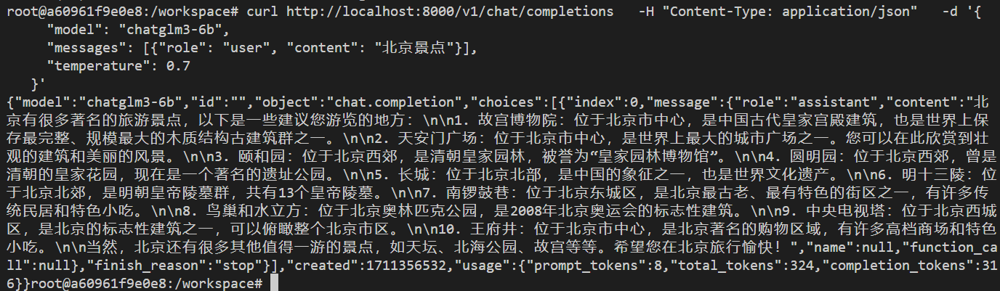
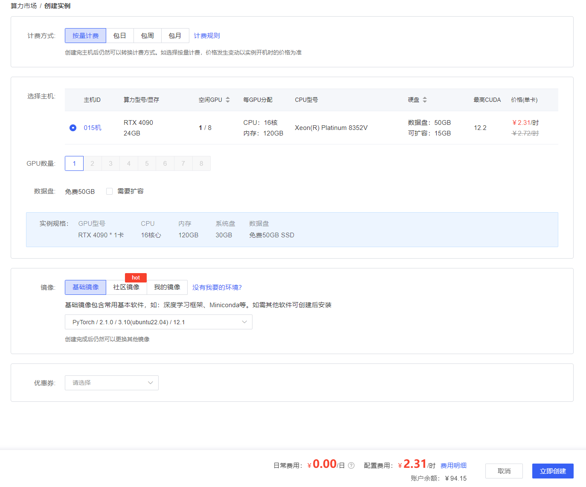
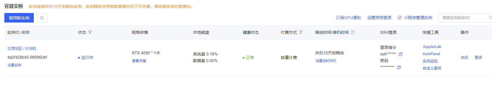
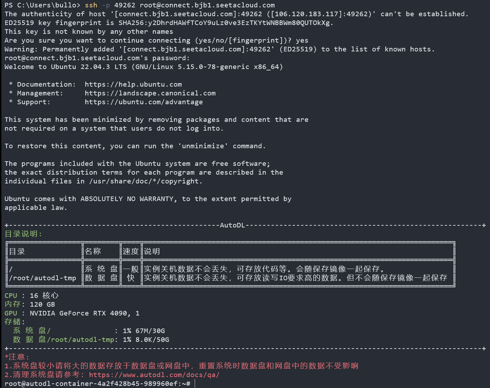
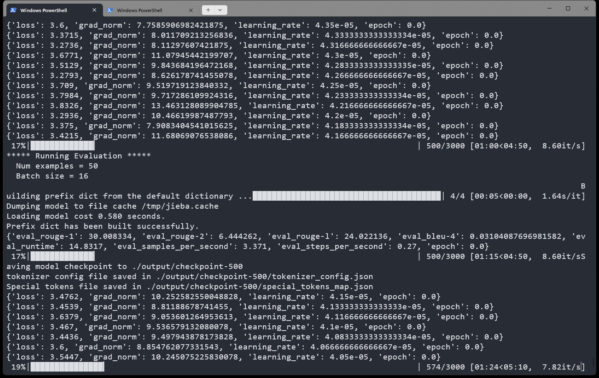
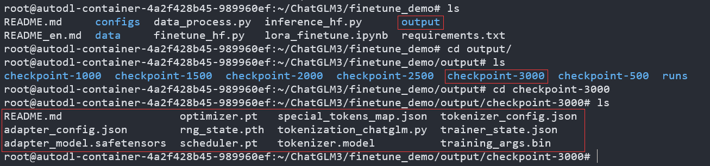
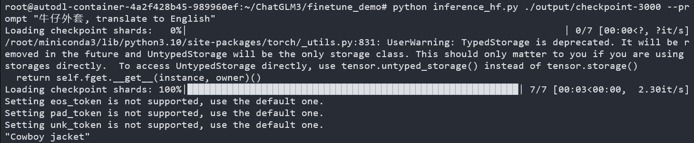
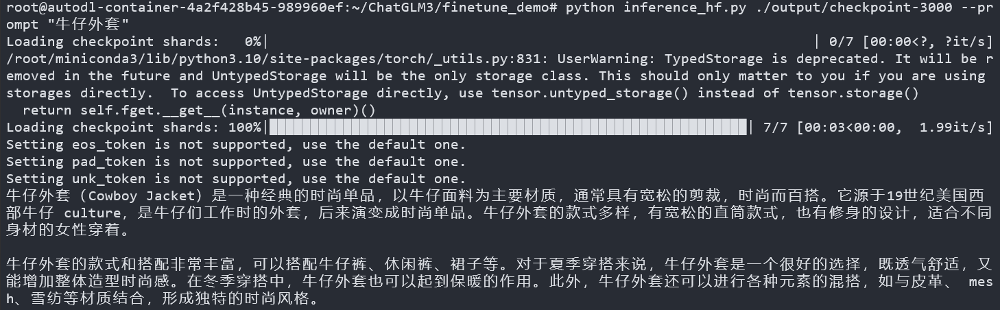

# ChatGLM3-6B相关实践

> ChatGLM3-6B 是 ChatGLM 系列最新一代的开源模型，在保留了前两代模型对话流畅、部署门槛低等众多优秀特性的基础上，ChatGLM3-6B 引入了如下特性：
>
> - 更强大的基础模型： ChatGLM3-6B 的基础模型 ChatGLM3-6B-Base 采用了更多样的训练数据、更充分的训练步数和更合理的训练策略。在语义、数学、推理、代码、知识等不同角度的数据集上测评显示，ChatGLM3-6B-Base 具有在 10B 以下的预训练模型中最强的性能。
> - 更完整的功能支持： ChatGLM3-6B 采用了全新设计的 Prompt 格式，除正常的多轮对话外。同时原生支持工具调用（Function Call）、代码执行（Code Interpreter）和 Agent 任务等复杂场景。
> - 更全面的开源序列： 除了对话模型 ChatGLM3-6B 外，还开源了基础模型 ChatGLM-6B-Base、长文本对话模型 ChatGLM3-6B-32K。以上所有权重对学术研究完全开放，在填写问卷进行登记后亦允许免费商业使用。

> 以下系统均运行在windows11下的ubuntu 22.04子系统

## Docker本地部署

### 项目&模型下载

```bash
#项目下载
git clone https://github.com/THUDM/ChatGLM3


#模型文件下载
git clone https://www.modelscope.cn/ZhipuAI/chatglm3-6b.git
#下载完成之后可以删除下 .git 文件夹，可以减少空间。


# 安装ChatGLM3安装包
pip3  install -r requirements.txt

#进入基础demo目录，运行脚本
cd ./basic_demo
streamlit run web_demo_streamlit.py
```


### 使用nvidia镜像启动

> torch镜像目录
>
> https://github.com/cnstark/pytorch-docker
>
> 

```bash
# 拉取镜像（已经安装docker desktop并绑定wsl2)
docker pull cnstark/pytorch:2.0.1-py3.10.11-cuda11.8.0-ubuntu22.04

# 安装镜像
docker run -itd --name chatglm3 -v `pwd`/ChatGLM3:/data --gpus=all -e NVIDIA_DRIVER_CAPABILITIES=compute,utility -e NVIDIA_VISIBLE_DEVICES=all -p 8501:8501 cnstark/pytorch:2.0.1-py3.10.11-cuda11.8.0-ubuntu22.04
# `pwd`/ChatGLM3:/data   这条命令要求你得在ChatGLM3的父目录下执行该Docker命令，并将其映射到docker中的data目录下

# 进入镜像
docker exec -it chatglm3 bash

# 切换到目录
cd /data
# 换源
pip3 config set global.index-url https://mirrors.aliyun.com/pypi/simple 
pip3 config set install.trusted-host mirrors.aliyun.com
# 安装ChatGLM3安装包
pip3  install -r requirements.txt

#进入基础demo目录，运行脚本
cd ./basic_demo
streamlit run web_demo_streamlit.py

# 在浏览器打开
localhost:8501
```


### 运行已有Docker镜像

```bash
$> docker ps -a
CONTAINER ID   IMAGE                                                    COMMAND                  CREATED        STATUS                        PORTS                                            NAMES
a60961f9e0e8   cnstark/pytorch:2.0.1-py3.10.11-cuda11.8.0-ubuntu22.04   "/bin/bash"              16 hours ago   Exited (255) 37 minutes ago   0.0.0.0:8501->8501/tcp                           chatglm3
...

$> docker start a60961f9e0e8
a60961f9e0e8
$> docker exec -it a60961f9e0e8 bash
root@a60961f9e0e8:/workspace#
```

## 运行对外的HTTP服务

### 修改模型路径

```python
# ChatGLM3/openai_api_demo>api_server.py
# set LLM path
MODEL_PATH = os.environ.get('MODEL_PATH', '/data/model/chatglm3-6b')
TOKENIZER_PATH = os.environ.get("TOKENIZER_PATH", MODEL_PATH)

# set Embedding Model path
EMBEDDING_PATH = os.environ.get('EMBEDDING_PATH', '/data/model/bge-large-zh-v1.5')
```

### 执行脚本

```bash
$> python api_server.py 
Setting eos_token is not supported, use the default one.
Setting pad_token is not supported, use the default one.
Setting unk_token is not supported, use the default one.
Loading checkpoint shards: 100%|██████████████████████████████████████████████████████████████| 7/7 [00:11<00:00,  1.59s/it]
INFO:     Started server process [1341]
INFO:     Waiting for application startup.
INFO:     Application startup complete.
INFO:     Uvicorn running on http://0.0.0.0:8000 (Press CTRL+C to quit)
```

在另一个docker窗口中执行以下命令

```bash
$> curl http://localhost:8000/v1/chat/completions   -H "Content-Type: application/json"   -d '{
     "model": "chatglm3-6b",
     "messages": [{"role": "user", "content": "北京景点"}],
     "temperature": 0.7
    }'
```



## 在AutoDL上，使用4090显卡，部署ChatGLM3API服务

### 创建实例





### 登录实例

> ```bash
> $> ssh -p 49262 root@connect.bjb1.seetacloud.com
> 
> yes
> 
> 输入密码：m+AsIrvBWjiw
> ```



### 下载项目源码和模型

```bash
apt update && apt install git-lfs -y
get clone git@github.com:THUDM/ChatGLM3.git
git clone https://www.modelscope.cn/ZhipuAI/chatglm3-6b.git 
rm -rf model.safetensors.index.json
rm -rf *.safetensors
pip3  install -r requirements.txt

cd ./basic_demo
vim web_demo_streamlit.py  # 修改模型目录
streamlit run web_demo_streamlit.py
```

### 使用脚本进行token测试

```python
# coding=utf-8
"""
python3 test_throughput.py
或者：
python3 test_throughput.py --api-address http://localhost:8000 --n-thread 20
"""
import argparse
import json

import requests
import threading
import time


def main():

    headers = {"User-Agent": "openai client", "Content-Type": "application/json"}
    ploads = {
        "model": args.model_name,
        "messages": [{"role": "user", "content": "生成一个50字的故事，内容随即生成。"}],
        "temperature": 1,
    }
    thread_api_addr = args.api_address

    def send_request(results, i):
        print(f"thread {i} goes to {thread_api_addr}")
        response = requests.post(
            thread_api_addr + "/v1/chat/completions",
            headers=headers,
            json=ploads,
            stream=False,
        )
        print(response.text)
        response_new_words = json.loads(response.text)["usage"]["completion_tokens"]
        print(f"=== Thread {i} ===, words: {response_new_words} ")
        results[i] = response_new_words

    # use N threads to prompt the backend
    tik = time.time()
    threads = []
    results = [None] * args.n_thread
    for i in range(args.n_thread):
        t = threading.Thread(target=send_request, args=(results, i))
        t.start()
        # time.sleep(0.5)
        threads.append(t)

    for t in threads:
        t.join()

    print(f"Time (POST): {time.time() - tik} s")
    n_words = sum(results)
    time_seconds = time.time() - tik
    print(
        f"Time (Completion): {time_seconds}, n threads: {args.n_thread}, "
        f"throughput: {n_words / time_seconds} words/s."
    )


if __name__ == "__main__":
    parser = argparse.ArgumentParser()

    parser.add_argument("--api-address", type=str, default="http://localhost:8000")
    parser.add_argument("--model-name", type=str, default="chatglm3-6b")
    parser.add_argument("--n-thread", type=int, default=10)
    args = parser.parse_args()

    main()
```


## 微调测试

https://github.com/THUDM/ChatGLM3/tree/main/finetune_demo

### 数据集准备

这里以 AdvertiseGen 数据集为例, 您可以从 [Google Drive](https://drive.google.com/file/d/13_vf0xRTQsyneRKdD1bZIr93vBGOczrk/view?usp=sharing) 或者 [Tsinghua Cloud](https://cloud.tsinghua.edu.cn/f/b3f119a008264b1cabd1/?dl=1) 下载 AdvertiseGen 数据集。 将解压后的 AdvertiseGen 目录放到 `data` 目录下并自行转换为如下格式数据集。

> 请注意，现在的微调代码中加入了验证集，因此，对于一组完整的微调数据集，必须包含训练数据集和验证数据集，测试数据集可以不填写。或者直接用验证数据集代替。

数据下载到finetune_demo下的data目录下

```bash
$> ~/ChatGLM3/finetune_demo/data/AdvertiseGen.tar.gz

tar -xzvf  AdvertiseGen.tar.gz
```

#### 数据处理

```bash
$> cd ~/ChatGLM3/finetune_demo
vim data_process.py
# 粘贴下面的代码并保存
```

```python
# ~/ChatGLM3/finetune_demo/data_process.py
import json
from typing import Union
from pathlib import Path


def _resolve_path(path: Union[str, Path]) -> Path:
    return Path(path).expanduser().resolve()


def _mkdir(dir_name: Union[str, Path]):
    dir_name = _resolve_path(dir_name)
    if not dir_name.is_dir():
        dir_name.mkdir(parents=True, exist_ok=False)


def convert_adgen(data_dir: Union[str, Path], save_dir: Union[str, Path]):
    def _convert(in_file: Path, out_file: Path):
        _mkdir(out_file.parent)
        with open(in_file, encoding='utf-8') as fin:
            with open(out_file, 'wt', encoding='utf-8') as fout:
                for line in fin:
                    dct = json.loads(line)
                    sample = {'conversations': [{'role': 'user', 'content': dct['content']},
                                                {'role': 'assistant', 'content': dct['summary']}]}
                    fout.write(json.dumps(sample, ensure_ascii=False) + '\n')

    data_dir = _resolve_path(data_dir)
    save_dir = _resolve_path(save_dir)

    train_file = data_dir / 'train.json'
    if train_file.is_file():
        out_file = save_dir / train_file.relative_to(data_dir)
        _convert(train_file, out_file)

    dev_file = data_dir / 'dev.json'
    if dev_file.is_file():
        out_file = save_dir / dev_file.relative_to(data_dir)
        _convert(dev_file, out_file)


convert_adgen('data/AdvertiseGen', 'data/AdvertiseGen_fix')
```

```bash
# 执行脚本
~/ChatGLM3/finetune_demo $> python data_process.py
```

- 执行脚本之后，data文件夹下会生成处理后的文件`AdvertiseGen_fix`

```bash
 ~/ChatGLM3/finetune_demo/data/AdvertiseGen_fix $> ls
 dev.json  train.json
 ~/ChatGLM3/finetune_demo/data/AdvertiseGen_fix $> cat dev.json
 

{"conversations": [{"role": "user", "content": "类型#裙*裙长#半身裙"}, {"role": "assistant", "content": "这款百搭时尚的仙女半身裙，整体设计非常的飘逸随性，穿上之后每个女孩子都能瞬间变成小仙女啦。料子非常的轻盈，透气性也很好，穿到夏天也很舒适。"}]}


#  ↑ 处理之后的数据格式    ↓ 处理之前的数据格式

{"content": "类型#上衣*材质#牛仔布*颜色#白色*风格#简约*图案#刺绣*衣样式#外套*衣款式#破洞", "summary": "简约而不简单的牛仔外套，白色的衣>身十分百搭。衣身多处有做旧破洞设计，打破单调乏味，增加一丝造型看点。衣身后背处有趣味刺绣装饰，丰富层次感，彰显别样时尚。"}
```

###  安装依赖

```bash
cd  ChatGLM3/finetune_demo
修改 peft>=0.10.0 为 peft==0.7.1
删掉 requirements.txt 下的mpi4py>=3.1.5
pip install -r requirements.txt 
pip install nltk
```

### 开始微调

```bash
ChatGLM3/finetune_demo $> python finetune_hf.py  data/AdvertiseGen_fix/  /root/chatglm3-6b  configs/lora.yaml
```




### 查询结果

微调完之后，finetune_demo文件夹下面会出现一个output文件夹



- 测试模型本身的能力

```bash
ChatGLM3/finetune_demo $> python inference_hf.py ./output/checkpoint-3000 --prompt "牛仔外套, translate to English"
```



- 测试微调后的结果

```bash
ChatGLM3/finetune_demo $> python inference_hf.py ./output/checkpoint-3000 --prompt "牛仔外套"
```



> Success！Over！
>


