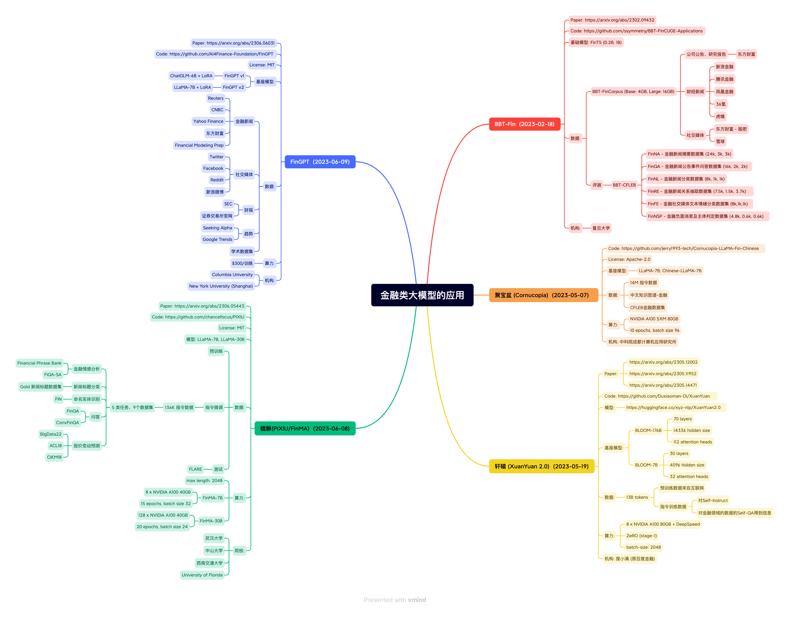

# 

主要参考：https://github.com/HqWu-HITCS/Awesome-Chinese-LLM

## 医学

## 法律

## 金融

## 教育

- 桃李（Taoli）：
  - 地址：https://github.com/blcuicall/taoli 
  - 简介：一个在国际中文教育领域数据上进行了额外训练的模型。项目基于目前国际中文教育领域流通的500余册国际中文教育教材与教辅书、汉语水平考试试题以及汉语学习者词典等，构建了国际中文教育资源库，构造了共计 88000 条的高质量国际中文教育问答数据集，并利用收集到的数据对模型进行指令微调，让模型习得将知识应用到具体场景中的能力。
- EduChat：
  - 地址：https://github.com/icalk-nlp/EduChat
  - 简介：该项目华东师范大学计算机科学与技术学院的EduNLP团队研发，主要研究以预训练大模型为基底的教育对话大模型相关技术，融合多样化的教育垂直领域数据，辅以指令微调、价值观对齐等方法，提供教育场景下自动出题、作业批改、情感支持、课程辅导、高考咨询等丰富功能，服务于广大老师、学生和家长群体，助力实现因材施教、公平公正、富有温度的智能教育。
- chatglm-maths：
  - 地址：https://github.com/yongzhuo/chatglm-maths 
  - 简介：基于chatglm-6b微调/LORA/PPO/推理的数学题解题大模型, 样本为自动生成的整数/小数加减乘除运算, 可gpu/cpu部署，开源了训练数据集等。
- QiaoBan：
  - 地址：https://github.com/HIT-SCIR-SC/QiaoBan 
  - 简介：该项目旨在构建一个面向儿童情感陪伴的大模型，这个仓库包含：用于指令微调的对话数据/data，巧板的训练代码，训练配置文件，使用巧板进行对话的示例代码（TODO，checkpoint将发布至huggingface）。

## 科技

- 天文大语言模型StarGLM：
  - 地址：https://github.com/Yu-Yang-Li/StarGLM
  - 简介：基于ChatGLM训练了天文大语言模型，以期缓解大语言模型在部分天文通用知识和前沿变星领域的幻觉现象，为接下来可处理天文多模态任务、部署于望远镜阵列的观测Agent——司天大脑（数据智能处理）打下基础。
- TransGPT·致远：
  - 地址：https://github.com/DUOMO/TransGPT 
  - 简介：开源交通大模型，主要致力于在真实交通行业中发挥实际价值。它能够实现交通情况预测、智能咨询助手、公共交通服务、交通规划设计、交通安全教育、协助管理、交通事故报告和分析、自动驾驶辅助系统等功能。
- Mozi：
  - 地址：https://github.com/gmftbyGMFTBY/science-llm 
  - 简介：该项目开源了基于LLaMA和Baichuan的科技论文大模型，可以用于科技文献的问答和情感支持。

## 自媒体

- MediaGPT：
  - 地址：https://github.com/IMOSR/MediaGPT 
  - 简介：一个针对自媒体领域进行特殊训练的模型，首先在大规模自媒体语料上进行连续预训练，然后ChatGPT收集了一批关于抖音运营、短视频创作、巨量千川投放、直播运营和直播话术技巧等领域知识问题的分析和回答，并利用这些数据对模型进行指令微调，开源一系列自媒体领域的指令微调数据和基于LLaMA训练的中文自媒体大模型的参数。

## 电商

- EcomGPT
  - 地址：https://github.com/Alibaba-NLP/EcomGPT 
  - 简介：一个由阿里发布的面向电商领域的语言模型，该模型基于BLOOMZ在电商指令微调数据集上微调得到，人工评估在12个电商评测数据集上超过ChatGPT。