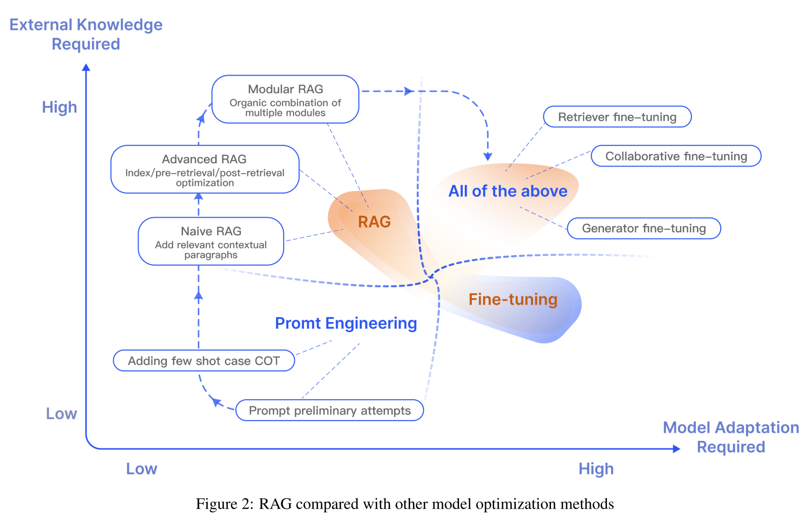
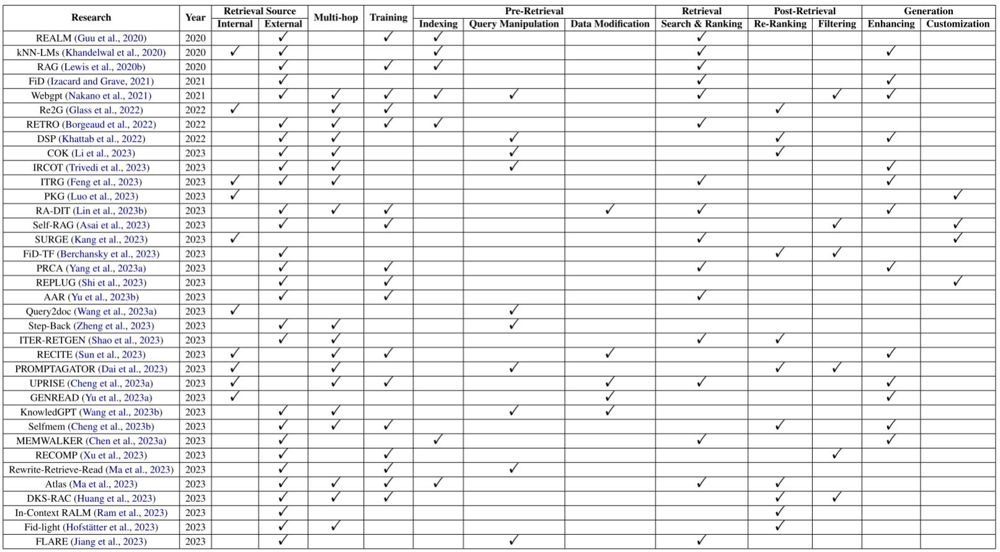

# RAG领域相关综述的全文翻译 ↓

# Retrieval-Augmented Generation for Large Language Models： A Survey

【链接】：https://arxiv.org/abs/2312.10997v2

## 0. 摘要

大型语言模型(LLM)展示了强大的功能，但是它们在实际应用中仍然面临挑战，例如幻觉、缓慢的知识更新和答案缺乏透明性。Retrieve-Augmented Generation (RAG)是指**在使用大语言模型回答问题之前，从外部知识库中检索相关信息的过程**。RAG已被证明可以*显著提高答案的准确性，减少模型幻觉，特别是对于知识密集型任务*。通过引用来源，用户可以验证答案的准确性，增加模型输出的信任度。它还促进了知识更新和特定领域知识的引入。RAG有效地将大语言模型的参数化知识与非参数化的外部知识库结合起来，使其成为实现大型语言模型的最重要的方法之一。本文概述了大语言模型时代RAG的发展范式，归纳出三种范式：朴素RAG、高级RAG和模块化RAG。然后，本文对RAG的三个主要组件进行了总结和组织：检索器、生成器和增强方法，以及每个组件中的关键技术。讨论了如何对RAG模型的有效性进行评价，介绍了两种RAG模型的评价方法，强调了评价的关键指标和能力，并提出了最新的自动评价框架。最后，从垂直优化、水平可扩展性、RAG的技术栈和生态系统三个方面介绍了未来可能的研究方向。

## 1. 介绍

大型语言模型(LLM)比我们以前在自然语言处理(NLP)中看到的任何东西都更强大。GPT系列模型[Brown et al.， 2020, OpenAI, 2023]、LLama系列模型[Touvron et al.， 2023]、Gemini[谷歌，2023]和其他大型语言模型显示出令人印象深刻的语言和知识掌握，在多个评估基准上超过了人类基准水平[Wang et al.， 2019, Hendrycks et al.， 2020, Srivastava et al.， 2022]。

然而，大型语言模型也有许多缺点。他们经常捏造事实[Zhang et al.， 2023b]，在处理特定领域或高度专业化的查询时缺乏知识[Kandpal et al.， 2023]。例如，当寻求的信息超出模型的培训数据或需要最新数据时，大语言模型可能无法提供准确的答案。这一限制为在现实生产环境中部署生成式人工智能带来了挑战，因为盲目地使用黑盒大语言模型可能不够。

传统上，神经网络通过**微调模型**以**参数化知识**来适应特定的领域或专有信息。虽然这种技术产生了显著的结果，但它**需要大量的计算资源，产生较高的成本，并需要专门的技术专长**，使其难以适应不断变化的信息环境。**【参数知识】**和**【非参数知识】**发挥着不同的作用。**<u>参数化知识通过训练大语言模型获得，并存储在神经网络权值中，代表模型对训练数据的理解和泛化，形成生成响应的基础</u>**。另一方面，**<u>非参数知识存在于外部的知识来源中，如向量数据库，不直接编码到模型中，而是作为可更新的补充信息。非参数知识使大语言模型能够访问和利用最新的或领域特定的信息，提高响应的准确性和相关性。</u>**

纯参数化语言模型（大语言模型）将从大量语料库中获取的知识存储在模型的参数中。然而，这样的模型有其局限性。**首先，很难从训练语料库中保留所有的知识，特别是对于不太常见但比较具体的知识。其次，由于模型参数不能动态更新，参数知识容易随着时间的推移而过时。最后，参数的扩展导致训练和推理的计算费用增加。**为了解决纯参数化模型的局限性，语言模型可以通过集成非参数化语料库数据库和参数化模型来采用半参数化方法。这种方法被称为检索增强生成(RAG)。

**检索增强生成**(RAG)一词是由[Lewis et al.， 2020]首先提出的。**<u>它将一个经过训练的检索器与一个经过训练的seq2seq模型(生成器)相结合，并进行端到端微调，以一种更易于解释和模块化的方式获取知识。</u>**在大型模型出现之前，RAG主要关注端到端模型的直接优化。检索侧的密集检索，例如使用基于向量的密集通道检索(DPR)[Karpukhin等人，2020]，以及在生成侧训练更小的模型是常见的做法。由于整体参数尺寸较小，检索器和生成器都经常进行端到端同步训练或微调[Izacard等人，2022]。

在像ChatGPT这样的LLM出现后，生成语言模型成为主流，在各种语言任务中展示了令人印象深刻的性能[Bai et al.， 2022, OpenAI, 2023, Touvron et al.， 2023，谷歌，2023]。**然而，大语言模型仍然面临着幻觉[Yao et al.， 2023, Bang et al.， 2023]、知识更新和数据相关问题等挑战。这影响了大语言模型的可靠性，使它们在某些严肃的任务场景中难以发挥作用，特别是在需要访问大量知识的知识密集型任务中，如开放领域的问题回答[Chen and Yih, 2020, Reddy et al.， 2019, Kwiatkowski et al.， 2019]和常识推理[Clark et al.， 2019, Bisk et al.，[2020]。参数内的隐式知识可能是不完整和不足的。**

后续研究发现，在大型模型的上下文学习(In-Context Learning, ICL)中引入RAG可以缓解上述问题，且效果显著且易于实施。在推理过程中，RAG从外部信息源动态检索信息，并将检索到的数据作为参考来组织答案。这大大提高了响应的准确性和相关性，有效地解决了大语言模型中出现的幻觉问题。这种技术在大语言模型出现后很快得到了广泛应用，并且已经成为最热门的技术之一，用于改进聊天机器人并使大语言模型更实用。RAG通过将事实知识从大语言模型的训练参数中分离出来，巧妙地将生成模型的强大功能与检索模块的灵活性结合起来，有效地解决了纯参数化模型中固有的知识不完整和不足的问题。

本文系统地回顾和分析了当前RAG的研究方法和未来的发展路径，将其归纳为三种主要的研究范式：朴素RAG、高级RAG和模块化RAG。随后，本文对检索(Retrieval)、增强(Augmented)和生成(Generation)三个核心组件进行了综合总结，重点阐述了RAG的改进方向和当前技术特点。在增强方法部分，将当前的工作分为三个方面：RAG的增强阶段、增强数据源和增强过程。此外，本文还总结了RAG的评价体系、适用场景和其他相关内容。通过本文，读者对大型模型和检索-增强生成有了更全面、系统的了解。熟悉知识检索增强的演进路径和关键技术，识别不同技术的优缺点，识别适用场景，并在实践中探索当前的典型应用案例。值得注意的是，在之前的工作中，Feng el al.[2023b]系统地回顾了将大模型与知识相结合的方法、应用和未来趋势，主要集中在知识编辑和检索增强方法上。Zhu等人[2023]介绍了大型语言模型增强检索系统的最新进展，并特别关注检索系统。同时，Asai等人[2023a]关注“什么”、“何时”、“如何”等问题，分析并阐明了基于检索的语言模型中的关键过程。与之相比，本文系统地概述了检索增强生成(retrieve - augmented Generation, RAG)的整个过程，并重点研究了如何通过知识检索来增强大型语言模型的生成。

RAG算法和模型的发展如图1所示。从时间轴上看，大部分与RAG相关的研究出现在2020年之后，一个重要的转折点是2022年12月ChatGPT的发布。自ChatGPT发布以来，自然语言处理领域的研究已经进入了大模型时代。朴素RAG技术迅速得到重视，导致相关研究的数量迅速增加。在增强策略方面，自RAG概念提出以来，关于训练前强化和监督微调阶段强化的研究一直在进行。然而，关于推理阶段强化的研究大多出现在大语言模型时代。这主要是由于与高性能大型模型相关的高训练成本。研究人员试图通过在推理阶段加入RAG模块，以经济有效的方式整合外部知识，从而增强模型生成。关于扩充数据的使用，早期RAG主要关注非结构化数据的应用，特别是在开放领域的问题回答上下文中。随后，可检索的知识来源范围扩大，使用高质量的数据作为知识来源，有效地解决了诸如错误知识内化和大模型中的幻觉等问题。这包括结构化的知识，知识图谱就是一个典型的例子。最近，对self-retrieval的关注越来越多，这涉及到挖掘大语言模型本身的知识，以提高它们的性能。

本文接下来的章节结构如下：第2章介绍了RAG的背景。第三章介绍了RAG的主流范式。第四章分析了RAG中的检索器。第五章重点介绍RAG中的生成器。第六章重点介绍了RAG中的增强方法。第七章介绍了RAG的评价体系。第八章展望了RAG未来的发展趋势。最后，在第九章中，我们总结了本综述的主要内容。

## 2. 背景

在本章中，我们将介绍RAG的定义，以及与其他模型优化技术(如微调)的比较。

### 2.1 定义

RAG的含义随着技术的发展而扩展。在大语言模型时代，RAG的具体定义是指模型在回答问题或生成文本时，首先从大量的语料库中检索相关信息。随后，它利用这些检索到的信息来生成响应或文本，从而提高预测的质量。RAG方法允许开发人员避免为每个特定的任务重新训练整个大型模型的需要。相反，他们可以附加一个知识库，为模型提供额外的信息输入，并提高其响应的准确性。RAG方法特别适用于知识密集型任务。综上所述，RAG系统包括两个关键阶段：

1. 利用编码模型基于问题检索相关文档，如BM25、DPR、ColBERT和类似方法[Robertson et al.， 2009, Karpukhin et al.， 2020, Khattab和Zaharia, 2020]。
2. 生成阶段：使用检索到的上下文作为条件，系统生成文本。

### 2.2 RAG vs 微调

在大型语言模型(大语言模型)的优化中，除了RAG之外，另一个重要的优化技术是微调。

**RAG类似于为模型提供一本教科书，允许它根据特定的查询检索信息。**这种方法适用于模型需要回答特定查询或处理特定信息检索任务的场景。然而，RAG并不适合让模型理解广泛的领域或学习新的语言、格式或风格。

**微调类似于让学生通过广泛学习内化知识。当模型需要复制特定的结构、样式或格式时，这种方法非常有用。**微调可以增强非微调模型的性能，并使交互更高效。它特别适合于<u>【强调基础模型中的现有知识，修改或定制模型的输出，以及为模型提供复杂的指令】</u>。然而，微调并不适合将新知识合并到模型中，也不适合需要对新用例进行快速迭代的情况。

**微调类似于让学生通过长期学习内化知识。当模型需要复制特定的结构、样式或格式时，此方法适用。**微调可以实现比非微调模型更好的性能，交互也更高效。微调特别适合于强调基础模型中的现有知识，修改或自定义模型的输出，以及用复杂的指令来指示模型。然而，微调并不适合向模型中添加新知识，也不适合需要对新用例进行快速迭代的场景。RAG与微调的具体比较见表1。

RAG和微调不是相互排斥的，而是可以互补的，在不同的级别上增强模型的能力。在某些情况下，结合这两种技术可以获得最优的模型性能。使用RAG和微调的整个优化过程可能需要多次迭代才能获得满意的结果。

已有研究表明，与其他优化大型语言模型的方法相比，检索增强生成具有显著优势[Shuster et al.， 2021, Yasunaga et al.， 2022, Wang et al.， 2023c, Borgeaud et al.， 2022]：

- RAG通过将答案与外部知识联系起来，减少语言模型中的幻觉问题，并使**生成的回答更加准确和可靠**，从而提高了准确性。
- 使用检索技术可以识别最新的信息。与单纯依赖训练数据的传统语言模型相比，**RAG保持了响应的及时性和准确性**。
- 透明度是RAG的一个优势。通过引用来源，用户可以**验证答案的准确性**，从而增加对模型输出的信任。
- RAG具有定制功能。通过对相关文本语料库进行索引，可以将模型裁剪到不同的领域，**为特定领域提供知识支持**。
- 在安全和隐私管理方面，**RAG通过其在数据库中内置的角色和安全控制，可以更好地控制数据使用**。相比之下，精细调优的模型可能缺乏对谁可以访问哪些数据的清晰管理。
- RAG**更具可扩展性**。它可以处理大规模的数据集，而不需要更新所有参数和创建训练集，使其更经济有效。
- 最后，RAG的结果更值得信赖。RAG从最新数据中选取确定性的结果，而经过微调的模型在处理动态数据时可能会出现幻觉和不准确性，缺乏透明度和可信度。

## 3. RAG框架

RAG的研究范式在不断演变。本章主要介绍RAG研究范式的演变。我们把它分为三种类型：朴素RAG、高级RAG和模块化RAG。虽然早期的RAG是成本效益和表现比原生的大语言模型更好，它仍然面临许多缺点。先进RAG和模块化RAG的出现旨在解决朴素RAG的具体缺陷。

### 3.1 Naive RAG

Naive RAG研究范式代表了在ChatGPT被广泛采用后不久获得声望的最早的方法论。朴素的RAG涉及传统的过程：索引、检索和生成。Naive RAG也被总结为“Retrieve”-“Read”框架[Ma等人，2023a]。

#### Indexing

从数据源获取数据并为其建立索引的管道通常发生在离线状态。具体来说，数据索引的构建包括以下步骤：

1. **Data Indexing**数据索引：这涉及到清理和提取原始数据，将不同的文件格式(如PDF、HTML、Word、Markdown等)转换为纯文本。
2. **Chunking**分块：将加载的文本分成更小的块。这是必要的，因为语言模型通常限制了它们可以处理的上下文的数量，所以有必要创建尽可能小的文本块。
3. **Embedding and Creating Index**嵌入和创建索引：这是通过语言模型将文本编码成向量的过程。得到的向量将用于后续的检索过程中计算向量与问题向量之间的相似度。该嵌入模型要求推理速度快。由于在用户提问时需要对大量的语料库进行编码，并对问题进行实时编码，所以模型的参数大小不宜过大。生成嵌入后，下一步是创建索引，存储原始语料库块，并以键值对的形式嵌入，以便将来快速频繁的搜索。

#### Retrieve

给定用户的输入，将使用与第一阶段相同的编码模型将查询转换为向量。计算问题嵌入与文献块嵌入在语料库中的相似度。根据相似程度选择前K个文档块作为当前问题的增强上下文信息。

#### Generation

给定的问题和相关文档被组合成一个新的提示符。然后，大型语言模型将根据所提供的信息回答问题。根据不同任务的需要，可以决定是允许大型模型使用其知识，还是只根据给定的信息进行回答。如果有历史对话信息，也可以合并到多轮对话提示中。

#### Naive RAG的缺点

Naive RAG在三个领域面临主要挑战：检索质量、响应生成质量和增强过程。关于检索质量，问题是多方面的。主要的问题是低精度，检索集中的所有块都与查询相关，导致潜在的幻觉和半空中下降问题。第二个问题是低召回率，当没有检索到所有相关块时，就会出现低召回率，从而阻止大语言模型获得足够的上下文来合成答案。此外，过时的信息带来了另一个挑战，其中数据冗余或过时的数据可能导致不准确的检索结果。在响应生成质量方面，问题也同样多样。幻觉是一个突出的问题，因为模型编造了一个并不存在于背景中的答案。当模型生成的答案不能处理查询时，不相关性是另一个问题。此外，毒性或偏见，即模型产生有害或冒犯性的反应，是另一个问题。

最后，增强过程也面临着一些挑战。至关重要的是，从检索的段落中有效地整合上下文与当前的生成任务是至关重要的。如果处理不当，输出可能会显得不连贯或脱节。冗余和重复是另一个问题，特别是当多个检索的段落包含类似的信息时，会导致生成步骤中的内容重复。此外，确定多个检索到的文章对生成任务的重要性或相关性是一项挑战，而增强过程需要适当地平衡每个文章的价值。检索到的内容也可能来自不同的写作风格或语调，增强过程需要调和这些差异，以确保输出的一致性。最后，生成模型可能过度依赖于增强的信息，导致输出仅仅重复检索到的内容，而没有提供新的价值或合成的信息。

### 3.2 Advanced RAG

Advanced RAG已经针对Naive RAG的不足进行了针对性的改进。在检索生成质量方面，Advanced RAG结合了检索前和检索后的方法。为了解决Naive RAG遇到的索引问题，Advanced RAG通过滑动窗口、细粒度分割和元数据等方法优化了索引。同时，提出了各种优化检索过程的方法。就具体实现而言，Advanced RAG可以通过管道或端到端方式进行调整。

#### Pre-Retrieval Process 

**Optimizing Data Indexing**

优化数据索引的目的是提高索引内容的质量。目前，有五种主要策略用于此目的：增加索引数据的粒度、优化索引结构、添加元数据、对齐优化和混合检索。

1. **Enhancing Data Granularity** 提高数据粒度：索引前优化的目标是提高文本的标准化、一致性，并确保事实的准确性和上下文的丰富性，以保证RAG系统的性能。文本标准化包括去除不相关信息和特殊字符，以提高检索效率。在一致性方面，首要任务是消除实体和术语的歧义，同时消除重复或冗余的信息，以简化检索者的焦点。确保事实的准确性是至关重要的，只要有可能，应该核实每条数据的准确性。为了适应现实世界中的系统交互上下文，上下文保持可以通过添加另一层带有特定领域注释的上下文来实现，并通过用户反馈循环进行持续更新。时间敏感性是重要的上下文信息，应该设计机制来刷新过时的文档。总之，优化索引数据的重点应该是清晰、上下文和正确性，以使系统高效和可靠。下面介绍了最佳实践。

2. **Optimizing Index Structures** 优化索引结构：这可以通过调整块的大小、改变索引路径和合并图结构信息来实现。调整块(从小块到大块)的方法包括收集尽可能多的相关上下文和最小化噪音。在构建RAG系统时，块大小是一个关键参数。有不同的评估框架比较单个块的大小。LlamaIndex2使用GPT4来评估保真度和相关度，而LLaMA[Touvron等人，2023]指标对不同的分块方法具有自动评估特征。跨多个索引路径的查询方法与以前的元数据过滤和分组方法密切相关，可能涉及同时跨不同索引进行查询。可以使用标准索引查询特定的查询，也可以使用独立索引根据元数据关键字(如特定的“日期”索引)进行搜索或过滤。

   引入图结构涉及到将实体转换为节点，将它们的关系转换为关系。这可以通过利用节点之间的关系来提高准确性，特别是对于多跳问题。使用图形数据索引可以增加检索的相关性。

3. **Adding Metadata Information** 添加元数据信息：这里的重点是将引用的元数据嵌入到块中，比如用于过滤的日期和目的。添加元数据(如引用的章节和子部分)也有助于改进检索。当我们将索引划分为多个块时，检索效率就成了一个问题。首先过滤元数据可以提高效率和相关性。
4. **Alignment Optimization** 对齐优化：此策略主要处理对齐问题和文档之间的差异。对齐概念包括引入假设的问题，创建适合于每个文档回答的问题，并将这些问题嵌入(或替换)到文档中。这有助于解决文档之间的对齐问题和差异。
5. **Mixed Retrieval** 混合检索：这种策略的优势在于利用不同检索技术的优势。智能结合各种技术，包括基于关键词的搜索、语义搜索和向量搜索，适应不同的查询类型和信息需求，确保最相关和上下文丰富的信息的一致检索。混合检索可以作为检索策略的有力补充，提高RAG管道的整体性能。

#### Embedding 

- **Fine-turning Embedding** 微调嵌入：嵌入模型的微调直接影响RAG的有效性。微调的目的是增强检索内容和查询之间的相关性。微调嵌入的作用类似于生成语音前的耳朵调整，优化检索内容对生成输出的影响。一般来说，微调嵌入的方法分为在特定领域上下文中调整嵌入和优化检索步骤两大类。特别是在处理演化词或稀有词的专业领域，这些自定义嵌入方法可以提高检索的相关性。BGE[BAAI, 2023]嵌入模型是一种微调和高性能的嵌入模型，如BAAI 3开发的BGE-large- en。要创建用于微调BGE模型的训练数据，首先使用gpt-3.5-turbo等大语言模型基于文档块制定问题，其中问题和答案(文档块)形成微调对，用于微调过程。
- **Dynamic Embedding**动态嵌入：动态嵌入根据单词出现的上下文进行调整，与静态嵌入不同，静态嵌入对每个单词使用单个向量。例如，在像BERT这样的变压器模型中，同一个单词可以根据周围单词的不同有不同的嵌入方式。有证据表明，在OpenAI的文本嵌入ada-002模型4中，出现了意想不到的高余弦相似度结果，特别是当文本长度小于5个标记时。理想情况下，嵌入应该包含尽可能多的背景，以确保“健康”的结果。OpenAI的embedded -ada-02是建立在大型语言模型(如GPT)的原则之上的，它比静态嵌入模型更加复杂，能够捕获特定级别的上下文。虽然它在上下文理解方面很出色，但它可能不会表现出与最新的全尺寸语言模型(如GPT4)一样的上下文敏感性。

#### Post-Retrieval Process 

从数据库中检索有价值的上下文后，将它与用于输入的查询合并到大语言模型中会带来挑战。立即将所有相关文档呈现给大语言模型可能会超出上下文窗口限制。将大量文档连接起来形成一个冗长的检索提示符是无效的，这会带来噪音并妨碍大语言模型对关键信息的关注。为了解决这些问题，需要对检索到的内容进行额外的处理。

- **ReRank**重排：重新排序，将最相关的信息移到提示的边缘是一个简单的想法。这个概念已经在诸如LlamaIndex、LangChain和HayStack等框架中得到了实现[Blagojevi, 2023]。例如，Diversity Ranker会根据文档多样性优先排序，而LostInTheMiddleRanker会将最好的文档放在上下文窗口的开头和结尾。同时，为了解决解释基于向量的模拟搜索语义相似度的难题，cohereAI rerank [Cohere, 2023]、bgererank5或LongLLMLingua [Jiang et al.， 2023a]等方法重新计算了相关文本和查询之间的语义相似度。
- **Prompt Compression**提示压缩：研究表明，检索文档中的噪声会对RAG性能产生不利影响。在后处理中，重点在于压缩不相关的上下文，突出关键段落，减少整体上下文长度。选择性上下文[Litman et al.， 2020]和LLMLingua [Anderson et al.， 2022]等方法利用小的语言模型计算提示互信息或perplexity，估计元素的重要性。然而，这些方法在RAG或长上下文场景中可能会丢失关键信息。Recomp [Xu等人，2023a]通过在不同粒度上训练压缩机来解决这一问题。长上下文[Xu et al.， 2023b]在处理广泛上下文时进行分解和压缩，而“在记忆迷宫中行走”[Chen et al.， 2023a]设计了一个分层的摘要树来增强大语言模型的关键信息感知。

#### RAG Pipeline Optimization 

检索过程的优化旨在提高RAG系统的效率和信息质量，目前的研究主要集中在智能结合各种检索技术，优化检索步骤，引入认知回溯的概念，灵活应用多种查询策略，利用嵌入相似性。这些努力共同致力于在RAG检索中的上下文信息的效率和丰富性之间取得平衡。

- **Exploring Hybrid Search**探索混合搜索：通过智能地混合各种技术，如基于关键字的搜索、语义搜索和向量搜索，RAG系统可以利用每种方法的优势。这种方法使RAG系统能够适应不同的查询类型和信息需求，确保一致地检索最相关和上下文丰富的信息。混合搜索作为检索策略的有力补充，提高了RAG管道的整体性能。
- **Recursive Retrieval and Query Engine**递归检索和查询引擎：在RAG系统中优化检索的另一种强大的方法涉及到实现递归检索和一个复杂的查询引擎。递归检索需要在初始检索阶段获取更小的文档块，以捕获关键语义。在此过程的后期，将向语言模型(LM)提供具有更多上下文信息的较大块。这种两步检索方法有助于在效率和上下文丰富的响应之间取得平衡。
- **StepBack-prompt**：StepBack-prompt method [Zheng et al.， 2023]将其集成到RAG process中，鼓励大语言模型从特定的实例中后退一步，并参与到对底层通用概念或原则的推理中。实验结果表明，在各种具有挑战性的推理密集型任务中，使用后向提示可以显著提高性能，显示了它对RAG的自然适应性。检索增强步骤可以应用于对向后提示的答案的生成和最终的问题回答过程。
- **Subqueries**子查询：可以在不同的场景中使用各种查询策略，包括使用LlamaIndex等框架提供的查询引擎、使用树查询、使用向量查询或使用最基本的块顺序查询。
- **HyDE**：这种方法基于一个假设，即生成的答案可能比直接查询更接近嵌入空间。利用大语言模型，HyDE生成一个响应查询的假设文档(答案)，嵌入文档，并使用这种嵌入来检索与假设文档类似的真实文档。与基于查询的嵌入相似度搜索方法不同，该方法强调从答案到答案的嵌入相似度。但是，它可能不会始终产生良好的结果，特别是在语言模型不熟悉所讨论的主题的情况下，这可能会导致生成更多容易出错的实例。

### 3.3 Modular RAG

模块化的RAG结构打破了传统的朴素RAG的索引、检索和生成框架，在整个过程中提供了更大的多样性和灵活性。一方面，它整合了多种方法来扩展功能模块，如在相似度检索中加入搜索模块，在检索器中应用微调方法[Lin et al.， 2023]。此外，具体问题导致了重构RAG模块[Yu等人，2022]和迭代方法[Shao等人，2023]的出现。模块化RAG范式正在成为RAG领域的主流，它允许跨多个模块的序列化管道或端到端培训方法。三种RAG范式的比较如图3所示。

#### New Modules

- **Search Module**搜索模块：新的模块搜索模块不同于在Naive/Advanced RAG中查询和语料库之间的相似性检索，该搜索模块针对特定场景进行了剪裁，在过程中使用llm生成的代码、查询语言(如SQL、Cypher)或其他自定义工具对(其他)语料库进行直接搜索。搜索的数据源包括搜索引擎、文本数据、表格数据或知识图谱[Wang et al.， 2023c]。
- **Memory Module**内存模块：利用大语言模型本身的内存功能来指导检索，该原则涉及到查找与当前输入最相似的内存。Self-mem [Cheng等人，2023b]将“原始问题”和“双重问题”结合起来，迭代地使用一个增强检索的生成器来创建一个无界内存池。一个检索增强的生成模型可以使用自己的输出来增强自己，使得文本更接近推理过程中的数据分布，使用模型自己的输出，而不是训练数据[Wang et al.， 2022a]。
- **Extra Generation Module**额外生成模块：在检索的内容中，冗余和噪声是常见的问题。与直接从数据源检索不同，额外的生成模块利用大语言模型来生成所需的上下文[Yu et al.， 2022]。与直接检索相比，由大语言模型生成的内容更可能包含相关信息。
- **Task Adaptable Module**任务适应性模块：UPRISE[Cheng et al.， 2023a]专注于改造RAG以适应各种下游任务，从预先构造的数据池中自动检索给定零机会任务输入的提示，增强了任务和模型之间的通用性。提词器[Dai et al.， 2022]利用大语言模型作为少量镜头的查询生成器，并基于生成的数据创建特定任务的检索器。利用大语言模型的泛化功能，PROMPTAGATOR仅通过几个示例就可以创建特定任务的端到端检索器。
- **Alignment Module**校准模块：查询和文本之间的对齐一直是影响RAG有效性的关键问题。在模块化RAG时代，研究人员发现，为寻回器添加可训练的适配器模块可以有效地缓解对齐问题。PRCA[Yang et al.， 2023b]利用强化学习训练由大语言模型奖励驱动的上下文适配器，定位在寻回器和生成器之间。在标记自回归策略的强化学习阶段，通过奖励最大化来优化检索到的信息。AAR[Yu et al.， 2023b]提出了一种通用插件，该插件从已知源大语言模型中学习LM偏好，以帮助未知或非共同finetuned大语言模型。RRR[Ma et al.， 2023a]设计了一个基于强化学习重写查询的模块，以将查询与语料库中的文档对齐。
- **Validation Module**验证模块：在实际场景中，并不总是能保证检索到的信息是可靠的。在大语言模型中，检索不相关的数据可能会导致错觉的发生。因此，可以在检索文档之后引入一个额外的验证模块，以评估检索文档和查询之间的相关性。这增强了RAG的鲁棒性[Yu et al.， 2023a]。

#### New Pattern

模块化RAG的组织方法是灵活的，允许基于特定的问题上下文在RAG过程中替换或重新配置模块。对于由检索和生成两个模块(文献中称为阅读或合成)组成的Naive RAG，该框架具有很强的适应性和丰完全性。目前的研究主要探讨了两种组织范式，包括模块的添加或替换，以及模块之间的组织流调整。

- **Adding or Replacing Modules**增加/更换模块

  添加或替换模块的策略需要维护retrieve - read的结构，同时引入额外的模块来增强特定的功能。RRR[Ma等人，2023a]提出了RewriteRetrieve-Read过程，利用大语言模型性能作为对重写器模块强化学习的奖励。这允许重写器调整检索查询，提高阅读器的下游任务性能。类似地，可以在Generate-Read[Yu et al.， 2022]等方法中选择性地替换模块，其中大语言模型生成模块替换检索模块。Recite-Read [Sun et al.， 2022]将外部检索转换为从模型权值的检索，最初让大语言模型记忆任务相关的信息，并生成输出来处理知识密集型的自然语言处理任务。

- **Adjusting the Flow between Modules**调整模块间的流程

  在模块间流的调节方面，语言模型和检索模型之间的交互性受到了重视。DSP[Khattab等人，2022]引入了演示-搜索-预测框架，将上下文学习系统视为一个明确的程序，而不是一个终端任务提示来处理知识密集型任务。ITER-RETGEN [Shao et al.， 2023]利用生成的内容来指导检索，在Retrieve-ReadRetrieve-Read流程中迭代执行“检索增强生成”和“生成增强检索”。Self-RAG[Asai等人，2023b]遵循decision -retrieve-reflect-read过程，引入了一个主动判断模块。这种自适应和多样化的方法允许模块化RAG框架内的模块的动态组织。

## 4. Retriever

在RAG上下文中，“R”代表检索，在RAG管道中起着从庞大的知识库中检索top-k相关文档的作用。然而，打造高质量的检索器是一项重要的任务。在本章中，我们围绕三个关键问题展开讨论：1)如何获得准确的语义表示?2)如何匹配查询和文档的语义空间?3)如何使检索器的输出与大型语言模型的偏好保持一致?

### 4.1如何获得准确的语义表示?

在RAG中，语义空间是查询和文档映射的多维空间。当我们执行检索时，它是在语义空间中测量的。如果语义表达不准确，那么它对RAG的影响是致命的，本节将介绍两种方法来帮助我们构建准确的语义空间。

#### Chunk optimization

处理外部文档时，第一步是分组以获得细粒度的特性。然后块被嵌入。然而，嵌入过大或过小的文本块可能都不会取得良好的效果。因此，为语料库中文档找到最优的块大小是保证搜索结果准确性和相关性的关键。

在选择分块策略时，重要的考虑因素包括：被索引的内容的特征、使用的嵌入模型及其最佳块大小、用户查询的预期长度和复杂性，以及检索结果在特定应用程序中的使用方式。例如，对于较长的或较短的内容，应该选择不同的组块模型。此外，不同的嵌入模型在不同的块大小下表现不同;例如，sentence-transformer更适合单个句子，而text-embedded-ada-002更适合包含256或512个标记的块。此外，用户输入问题文本的长度和复杂性，以及您的应用程序的特定需求，如语义搜索或Q&A，都将影响组块策略的选择。这可能与您选择的大语言模型的令牌限制直接相关，并且可能需要您调整块大小。实际上，该算法通过自适应地应用几种分块策略来获得准确的查询结果;没有最好的，只有最适合的。

目前RAG研究中采用了多种块优化方法来提高检索效率和准确性。滑动窗口等技术通过多次检索聚合全局相关信息，实现分层检索。Small2big技术在搜索过程中利用较小的文本块，并为语言模型提供较大的附属文本块进行处理。摘要嵌入技术对文档摘要进行Top K检索，提供完整的文档上下文。元数据过滤技术利用文档元数据进行过滤。图索引技术将实体和关系转换为节点和连接，显著增强了多跳问题上下文中的相关性。这些方法的合并提高了检索结果，提高了检索性能。

#### Fine-tuning Embedding Models

在获得合适的语块大小后，我们需要通过嵌入模型将语块嵌入并查询到语义空间中，因此嵌入能否有效地表示语料库至关重要。目前，已经出现了一些优秀的嵌入模型，如[UAE[AngIE, 2023]， Voyage[VoyageAI, 2023]， BGE[BAAI, 2023]等，它们在大规模语料库上进行了预训练，但在应用于特定领域时，可能不能准确地表示特定领域的语料库信息。此外，特定于任务的嵌入模型微调对于确保模型理解与内容相关性相关的用户查询至关重要，而未进行微调的模型可能无法满足特定任务的需求。因此，对于下游应用程序来说，微调嵌入模型至关重要。在嵌入微调方法中有两种基本的模式。

- **Domain Knowledge Fine-tuning领域知识微调**：为了使嵌入模型正确地理解特定领域的信息，我们需要构造特定领域的数据集来微调嵌入模型。然而，微调嵌入模型不同于普通的语言模型，主要是因为所使用的数据集不同。在目前主要的嵌入模型微调方法中，所使用的数据集由查询、语料库和相关文档三部分组成。嵌入模型根据查询结果在语料库中查找相关文档，然后以查询的相关文档命中与否作为模型的度量指标。

  在数据集的构造、微调模型和评估过程中，这三个组件中的每一个都可能面临许多挑战。在LlamaIndex [Liu, 2023]中，针对嵌入模型的微调过程，引入了一系列关键类和函数，大大简化了这一过程。通过准备一个领域知识语料库，并利用它提供的方法，我们可以很容易地获得适合于我们想要的领域的专门的嵌入模型。

- **Fine-tuning of downstream tasks下游任务的微调**：使嵌入模型适应下游任务同样重要。当在下游任务中使用RAG时，有些工作通过使用大语言模型的功能对嵌入模型进行了微调。PROMPTAGATOR[Dai et al.， 2022]利用了大型语言模型(Large Language Model，大语言模型)作为一个少量的查询生成器，并基于生成的数据创建特定于任务的检索程序，并缓解了由于数据稀缺而在某些领域难以监管的微调问题。LLM- embedder [Zhang et al.， 2023a]使用大型语言模型输出来自多个下游任务的数据的奖励值，通过对数据集的硬标记和来自大语言模型的软奖励，对具有两个不同监督信号的检索器进行微调。

通过领域知识注入和下游任务微调，这在一定程度上改善了语义表示。然而，这种方法训练的检索器在直觉上对大型语言模型并没有帮助，因此已经做了一些工作来监督通过来自大语言模型的反馈信号直接对嵌入模型进行微调。(这一节将在4.4中介绍)

### 4.2 如何匹配查询和文档的语义空间

在RAG应用程序中，一些检索器使用相同的嵌入模型对查询和文档进行编码，而另一些检索器使用两个模型分别对查询和文档进行编码。此外，用户的原始查询可能存在表达能力差、语义信息缺乏等问题。因此，对齐用户查询和文档的语义空间是非常必要的。本节将介绍实现这一目标的两项关键技术。

#### Query Rewrite

使查询和文档的语义保持一致的最直观的方法是重写查询。如Query2Doc[Wang et al.， 2023b]和ITERRETGEN[Shao et al.， 2023]所述，利用大型语言模型固有的能力，通过引导生成一个伪文档，然后将原始查询与该伪文档合并，形成新的查询。在HyDE[Gao et al.， 2022]中，查询向量是通过使用文本指示器来建立的，使用这些指示器来生成一个“假设的”文档，该文档是相关的，但可能并不真正存在，它只需要捕获相关的模式。RRR[Ma et al.， 2023a]引入了一个新的框架，将检索和读取的顺序颠倒，专注于查询重写。该方法首先使用大型语言模型生成查询，然后使用网络搜索引擎检索上下文，最后使用小型语言模型作为训练重写器来服务于冻结的大型语言模型。step - backprompt [Zheng et al.， 2023]方法可以使大型语言模型进行抽象推理，提取高级概念和原理，并在此基础上进行检索。最后，多查询检索的方法是使用大型语言模型生成多个查询，这些查询可以并行执行，检索结果可以一起输入，对于依赖于多个子问题的单个问题非常有用

#### Embedding Transformation

如果存在像重写查询这样的粗粒度方法，那么也应该有特定于嵌入操作的细粒度实现。在LlamaIndex[Liu, 2023]中，可以在查询编码器之后连接适配器，并对适配器进行微调，以优化查询嵌入的表示，将其映射到更适合于特定任务的潜在空间。当查询和外部文档的数据结构不同时，例如非结构化查询和结构化外部文档，使查询与文档保持一致是非常重要的。SANTA[Li et al.， 2023d]提出了两种训练前方法使检索器感知结构化信息1)利用结构化数据与非结构化数据之间的自然对齐关系进行对比学习，进行结构感知前训练。2)掩蔽实体预测，设计一种面向实体的掩蔽策略，要求语言模型填充掩蔽实体。

### 4.3 如何调整检索器的输出和大语言模型的偏好

在RAG pipeline中，即使我们使用上述技术来提高检索命中率，也不一定能提高RAG的最终效果，因为被检索到的文档可能不是大语言模型所需要的。因此，本节介绍两种方法来调整检索器的输出和大语言模型的首选项。

#### LLM supervised training

许多工作利用了从大型语言模型到微调嵌入模型的各种反馈信号。AAR[Yu等人，2023b]通过一个编码器解码器体系结构LM为一只预先训练过的检索器提供监控信号。通过FiD交叉注意力评分确定LM的首选文档，然后使用硬负抽样和标准交叉熵损失对检索器进行微调。最终，微调的检索器可以直接用于增强不可见的目标LMs，从而更好地执行目标任务。检索器的训练损失：
$$
\zeta=\sum_{q}\sum_{d^+\in D^{a^+}}\sum_{d^-\in D^-}l\left(f\left(q,d^+\right),f\left(q,d^-\right)\right)
$$
其中$D^{a^+}$是检索集中的大语言模型首选的文档，而$D^{a^-}$不是首选的文档。$l$ 是标准的交叉熵损失。最后，我们认为大语言模型可能更倾向于关注可读的文档，而不是信息丰富的文档

REPLUG[Shi et al.， 2023]使用检索器和大语言模型来计算检索到的文档的概率分布，然后通过计算KL散度来执行监督训练。这种简单有效的训练方法通过使用LM作为监督信号来提高检索模型的性能，消除了任何特定的交叉注意机制的需要。检索器的训练损失如下：

$$
\zeta=\frac{1}{|D|}\sum_{x\in D}KL\left(P_{R}\left(d|x\right)||Q_{LM}\left(d|x,y\right)\right)
$$
其中$D$是输入上下文的集合，$P_R$是检索似然，$Q_{LM}$是每个文档的LM似然。

UPRISE [Cheng等人，2023a]也使用了冻结的大型语言模型来微调Prompt检索器。但是语言模型和检索器都将提示输入对作为输入，然后使用大型语言模型给出的分数来监督检索器的训练，这相当于使用大型语言模型来标记数据集。Atlas[Izacard et al.， 2022]提出了四种精细调优监督嵌入模型的方法，其中注意蒸馏(Attention精馏)使用语言模型在输出过程中产生的交叉注意分数进行蒸馏。EMDR2使用期望最大化算法以检索到的文档作为潜在变量进行训练。Perplexity蒸馏直接使用模型生成的令牌的困惑度作为指标进行训练。LOOP基于文档删除对LM预测的影响，引入了新的损耗函数，为模型更好地适应特定任务提供了有效的训练策略。

#### Plug in an adapter

然而，由于使用API实现嵌入功能或本地计算资源不足等因素，对嵌入模型进行微调可能具有挑战性。因此，有些作品选择外部连接适配器进行对齐。PRCA[Yang et al.， 2023b]通过上下文提取阶段和奖励驱动阶段训练适配器，并基于基于令牌的自回归策略优化检索器的输出。TokenFiltering[Berchansky et al.， 2023]方法计算交叉注意分数，选择得分最高的输入令牌来有效地过滤令牌。RECOMP[Xu et al.， 2023a]提出了提取式生成式压缩器，该压缩器通过选择相关句子或综合文档信息生成摘要，实现多文档查询焦点摘要。此外，一种新的方法PKG[Luo et al.， 2023]通过指令微调将知识注入白箱模型，并直接替换检索器模块，该模块用于根据查询直接输出相关文档。

## 5. Generator

RAG中的另一个核心组件是生成器，它负责将检索到的信息转换成自然流畅的文本。其设计灵感来自传统的语言模型，但与传统的生成模型相比，RAG的生成器通过利用检索到的信息，提高了准确性和相关性。在RAG中，生成器的输入不仅包括传统的上下文信息，还包括通过检索器获得的相关文本片段。这使得生成器能够更好地理解问题背后的上下文，并生成信息更丰富的响应。此外，生成器由检索到的文本指导，以确保生成的内容和检索到的信息之间的一致性。正是由于输入数据的多样性，在生成阶段进行了一系列有针对性的工作，所有这些工作都旨在更好地使大型模型适应来自查询和文档的输入数据。我们将通过检索后处理和微调等方面深入介绍生成器。

### 5.1 如何通过检索后处理增强检索结果?

对于没有微调过的大型语言模型，大多数研究依赖于公认的大型语言模型，如GPT4[OpenAI, 2023]，利用其健壮的内部知识来全面检索文档知识。然而，这些大型模型的固有问题，例如上下文长度限制和对冗余信息的脆弱性，仍然存在。为了缓解这些问题，一些研究在检索后处理方面做出了努力。后检索处理是指检索器对大型文档数据库中检索到的相关信息进行进一步处理、筛选或优化的过程。其主要目的是提高检索结果的质量，以更好地满足用户需求或后续任务。它可以理解为对在检索阶段获得的文档进行再处理的过程。后检索处理的操作通常包括信息压缩和结果重新排序。

#### Information Compression

虽然检索器可以从海量的知识库中获取相关的信息，但是在检索文档中处理大量的信息仍然是我们面临的挑战。现有的一些研究试图通过增加大型语言模型的上下文长度来解决这一问题，但目前的大型模型仍然面临上下文的限制。因此，在某些情况下，信息凝聚是必要的。总之，信息凝聚的重要性主要体现在以下几个方面：降低噪声、应对上下文长度限制、增强生成效果。

PRCA [Yang et al.， 2023b]通过训练一个信息提取器来解决这个问题。在上下文提取阶段，给定一个输入文本$S_{input}$，它可以生成一个输出序列$C_{extraction}$，该序列表示从输入文档中压缩的上下文。训练过程的目标是尽可能减少$C_{extraction}$与真实文本$C_{truth}$之间的差异。他们采用的损失函数如下：
$$
minL(\theta)=-\frac1N\sum_{i=1}^NC_{truth}^{(i)}log(f_.(S_{input}^{(i)};\theta))
$$
其中$f$为信息提取器，$θ$为提取器的参数。RECOMP[Xu et al.， 2023a]类似地通过利用对比学习来训练信息冷凝器。对于每个训练数据点，存在1个正样本和5个负样本。在这个过程中，使用对比损耗来训练编码器[Karpukhin等人，2020]。具体优化目标如下：
$$
-log\frac{e^{sim(x_i,p_i)}}{sim(x_i,p_i)+\sum_{n_j\in N_i}e^{sim(x_i,p_i)}}
$$

其中$x_i$为训练数据，$p_i$为正样本，$n_j$为负样本，$sim(x,y)$计算$x$和$y$之间的相似度。另一项研究选择进一步精简文档的数量，通过减少检索文档的数量来提高模型的回答精度。[Ma et al.， 2023b]提出了“Filter-Ranker”范式，该范式综合了大型语言模型(大语言模型)和小型语言模型(SLMs)的优点。在这个范例中，SLMs充当过滤器，而大语言模型充当重新排序代理。通过促使大语言模型重新排列SLMs识别出的困难样本的部分，研究结果表明，在各种信息提取(IE)任务中都有显著的改进。

#### Rerank

重新排序模型的关键作用在于优化从检索器检索的文档集。当添加了额外的上下文时，大语言模型的性能会随着回溯性能而下降，而重新排序提供了解决这个问题的有效解决方案。其核心思想包括重新安排文档记录，将最相关的项目放在顶部，从而将文档的总数减少到一个固定的数量。这不仅解决了检索过程中可能遇到的上下文窗口扩展问题，而且有助于提高检索效率和响应性[Zhuang等，2023]。

将上下文压缩作为重排序的一部分，目的是仅根据给定的查询上下文返回相关信息。该方法的双重意义在于通过减少单个文档的内容和过滤整个文档，将最相关的信息集中显示在检索结果中。因此，重新排序模型在整个信息检索过程中起到了优化和细化的作用，为后续的大语言模型处理提供了更有效和准确的输入。

### 5.2 如何优化生成器以适应输入数据?

在RAG模型中，生成器的优化是架构的重要组成部分。生成器的任务是获取检索到的信息并生成相关文本，从而提供模型的最终输出。优化生成器的目标是确保生成的文本既自然又有效地利用检索到的文档，以便更好地满足用户的查询需求。

在典型的大型语言模型(大语言模型)生成任务中，输入通常是一个查询。在RAG中，主要的区别在于输入不仅包括一个查询，还包括检索器检索的各种文档(结构化的/非结构化的)。附加信息的引入可能会对模型的理解产生重大影响，特别是对于较小的模型。在这种场景中，微调模型以适应查询+检索文档的输入变得尤为重要。具体来说，在向微调模型提供输入之前，通常需要对检索器检索的文档进行检索后处理。需要注意的是，在RAG上对生成器进行微调的方法本质上类似于大语言模型的一般微调方法。这里，我们将简要介绍一些有代表性的工作，包括数据(格式化/非格式化)和优化函数。

#### General Optimization Process

指的是包含(input, output)对的训练数据，目的是训练模型在给定输入x的情况下产生输出y的能力。Self-mem[Cheng et al.， 2023b]的工作中采用了一种比较经典的训练过程。给定输入x，检索相关文档z(选择本文中的top1)，对(x, z)进行积分后，模型产生输出y。本文采用了两种常用的微调范式，即Joint-Encoder [Arora et al.， 2023, Wang et al.， 2022b, Lewis et al.， 2020]和Dual-Encoder [Xia et al.， 2019, Cai et al.， 2021, Cheng et al.，202]。Joint-Encoder采用了一种基于编码器-解码器的标准模型，编码器对输入进行初始编码，解码器通过注意机制将编码后的结果进行组合，自回归生成令牌：

$$
H=Encoder(x[SEP]m)
$$

$$
h^i=Decoder(CrossAttn(H),y<i)
$$

$$
P_{G_\xi}(.|x,y<i)=Softmax(h^i)
$$

对于Dual-Encoder，系统建立了两个独立的编码器，分别负责对输入(查询、上下文)和文档进行编码。然后由解码器依次对输出进行双向交叉注意处理。作者选择使用Transformer [Vaswani et al.， 2017]作为这两种架构的构建块，并优化$G_ξ$负对数似然(NLL)损耗。
$$
H_{x}=SourceEncoder(x)H_{m}=MemoryEncoder(x)
$$

$$
h^i=Decoder(CrossAttn(H_x,H_m),y<i)
$$

$$
\mathcal{L}_{nll}=-\sum_{t=1}^{|y|}logP_{G_{\xi}}(y_{t}|x,m,y<t)
$$

#### Utilizing Contrastive Learning

在准备训练数据的阶段，通常产生的是输入和输出之间的交互对。在这种情况下，模型只能访问一个唯一的真实输出，这可能会导致“暴露偏差”问题[Ranzato et al.， 2015]：在训练阶段，模型只暴露于一个单一的真实反馈，而不访问任何其他生成的令牌。这可能会削弱模型在应用中的性能，因为它可能会过度适合于训练数据中的特定反馈，而没有有效地推广到其他场景。因此，SURGE提出了一种图文对比学习方法[Kang等人，2023]。对于任意给定的输入输出交互对，这种对比学习方法的目标可以定义为：

$$
\mathcal{L}_{cont}=\frac{1}{2}log\frac{e^{sim(\zeta(z),\xi(h))/\iota}}{\sum_{h^{\prime}}e^{sim(\zeta(z),\xi(h^{\prime}))/\iota}}+\frac{1}{2}log\frac{e^{sim(\zeta(z),\xi(h))/\iota}}{\sum_{z^{\prime}}e^{sim(\zeta(z^{\prime}),\xi(h))/\iota}}
$$

其中$ζ$，$ξ$是可学习的线性投影层。$z$是来自Encoder的图的平均表示，$h$是解码器表示的平均值。$Z'$，$h '$分别表示对应的负样本。在给定的文本中，'$h'$'和'$z'$'代表负样本。通过引入对比学习目标，模型可以学习更好地生成多样化和合理的回答，而不仅仅是在训练数据中看到的回答。这有助于降低过拟合的风险，并提高模型在现实场景中的泛化能力。

在处理涉及结构化数据的检索任务时，SANTA[Li et al.， 2023d]的工作采用了三个阶段的训练过程，充分理解结构和语义信息。具体来说，在检索器的训练阶段采用了对比学习，其主要目标是优化查询和文档的嵌入表示。具体优化目标如下：
$$
\mathcal{L}_{DR}=-log\frac{e^{sim(q,d^+)}}{e^{f(q,d^+)}+\sum_{d^-\in D^-}e^{sim(q,d^-)}}
$$

其中$q$和$d$是由编码器编码的查询和文档。$d^−$，$d^+$分别代表负样本和正样本。在生成器的初始训练阶段，我们利用对比学习对结构化数据和相应的非结构化数据的文档描述进行对齐。优化目标如上所述。

此外，在生成器的后期训练阶段，受文献[Sciavolino et al.， 2021, Zhang et al.， 2019]的启发，我们认识到实体语义在检索过程中学习文本数据表示方面的显著有效性。因此，我们首先在结构化数据中执行实体标识，然后对生成器的训练数据的输入部分中的实体应用掩码，使生成器能够预测这些掩码。以下的优化目标是：
$$
\begin{aligned}\mathfrak{L}_{MEP}&=\sum_{j=1}^k-logP(Y_d(t_j)|X_d^{mask},Y_d(t_1,...,j-1))\end{aligned}
$$

其中$Y_d(t_j)$表示序列$Y_d$中的第$j$个记号，$Yd = < mask >_1, ent_1，…， < mask >_n, ent_n$为包含掩码实体的ground truth序列。在整个训练过程中，我们通过从上下文中获取必要的信息来恢复屏蔽实体，理解文本数据的结构语义，并在结构化数据中对齐相关实体。我们优化了语言模型，以填充隐藏的跨度，并更好地理解实体语义[Ye等人，2020]。

## 6. Augmentation in RAG

本章主要从**增强的阶段**、**增强数据源**和**增强的过程**三个维度来阐述RAG开发中的关键技术。RAG核心组件的分类如图4所示。

### 6.1 增强阶段

RAG作为一项知识密集型任务，在语言模型训练的**训练前阶段**、**微调阶段**和**推理阶段**采用了不同的技术方法。

#### Pre-training Stage

自预训练模型出现以来，研究者们通过预训练阶段的检索方法来提高预训练语言模型(Pre-training Language model, PLMs)在开放领域问答中的性能。在预先训练的模型中识别和扩展内隐知识是很有挑战性的。REALM[Arora等人，2023]介绍了一种更模块化和可解释的知识嵌入方法。遵循遮罩语言模型(MLM)范式，REALM将预训练和微调建模为一个检索然后预测的过程，其中语言模型通过基于masked sentences $x$预测masked tokens $y$，建模$P(x|y)$进行预训练。

RETRO[Borgeaud等人，2022]利用检索增强对自回归语言模型进行预训练，通过检索大量标记数据并显著减少模型参数，实现了大规模的预训练。RETRO与GPT模型共享主干结构，并引入了额外的RETRO编码器，对从外部知识库检索到的相邻实体的特征进行编码。此外，RETRO在其解码器变压器结构中集成了按块交叉注意层，以有效地集成来自RETRO编码器的检索信息。复古达到较低的困惑标准GPT模型。此外，它提供了通过更新检索数据库来更新存储在语言模型中的知识的灵活性，而不需要重新训练语言模型[Petroni等人，2019]。

Atla[Izacard et al.， 2022]采用了类似的方法，在训练前和微调阶段结合了使用T5架构的检索机制[rafael et al.， 2020]。在预训练之前，它使用预训练的T5初始化编码-解码器语言模型主干，并使用预训练的设计器初始化稠密检索器。在预训练过程中，它每1000步刷新一次异步索引。

COG [Vaze等人，2021]是一个文本生成模型，它通过从现有的文本集合中逐渐复制文本片段(如单词或短语)来形式化其生成过程。与按顺序选择单词的传统文本生成模型不同，COG利用高效的向量搜索工具来计算文本片段的有意义的上下文表示，并对它们进行索引。因此，文本生成任务被分解为一系列的复制和粘贴操作，在每个时间步骤中，相关的文本片段是从文本集合中寻找，而不是从一个独立的词汇表中选择。COG在各个方面展示了比RETRO更好的性能，包括问答、领域适应和扩展短语索引。

另一方面，随着标度规律的发现，模型参数迅速增加，使自回归模型成为主流。研究人员还在探索是否可以使用RAG方法对更大的模型进行预训练。RETRO++[Wang et al.， 2023a]是RETRO的扩展，增加了模型的参数比例。研究发现，在文本生成质量、事实准确性、低毒性和下游任务的准确性方面，尤其是在知识密集型任务，如开放领域的问题回答方面，都有持续的改善。这些研究结果为训练前的自回归语言模型与未来基础模型的检索提供了重要的方向。

总之，增强前训练的优势和局限性是显而易见的。从积极的方面来看，这种方法提供了一个更强大的基础模型，在复杂性、文本生成质量和下游任务性能方面优于标准GPT模型。此外，与纯预训练模型相比，该模型通过使用更少的参数实现更高的效率。它尤其擅长处理知识密集型任务，允许通过对特定领域语料库的训练来创建特定领域的模型。然而，也有缺点，包括需要大量的训练前数据和更大的训练资源，以及更新速度较慢的问题。特别是随着模型尺寸的增大，增强检索训练的成本也相对较高。尽管存在这些局限性，但该方法在模型鲁棒性方面具有显著的特点。经过训练后，基于纯训练前的检索增强模型消除了外部库依赖的需要，提高了生成速度和操作效率。

#### Fine-tuning Stage

在下游微调阶段，研究人员采用了各种方法来微调检索器和生成器，以改进信息检索，主要是在opendomain问答任务中。对于检索器finetuning, REPlUG[Shi et al.， 2023]将语言模型(LM)视为一个黑箱，并通过可调的检索模型对其进行了增强。repug通过有监督信号获取黑匣子语言模型的反馈，对初始检索模型进行了改进。另一方面，UPRISE[Cheng et al.， 2023a]通过在不同的任务集上进行微调，创造出一种轻量级且多才多艺的检索器，从而对猎犬进行微调。这种检索器可以为零镜头任务自动提供检索提示，展示了它的通用性和跨任务和模型的性能改进。

同时，微调生成器的方法包括Self-Mem[Cheng等人，2023b]，它通过示例内存池对生成器进行微调，Self-RAG[Asai等人，2023b]，通过生成反射令牌满足主动检索需求。RADIT[Lin et al.， 2023]方法通过最大化给定一个检索增强指令的swers的正确概率，对生成器和检索器进行微调。它更新了生成器和检索器，以最小化文档和查询之间的语义相似性，有效地利用了相关的背景知识。

此外，SUGRE[Kang等人，2023]引入了对比学习的概念。它对检索器和生成器进行端到端微调，确保生成非常详细的文本和检索到的子图。使用基于图形神经网络(GNN)的上下文感知子图检索器，SURGE从与正在进行的对话对应的知识图谱中提取相关知识。这确保生成的响应忠实地反映检索到的知识。SURGE为此使用了一个不变但有效的图形编码器和一个图形-文本对比学习目标。

总之，在微调阶段的增强方法表现出几个特点。首先，对大语言模型和检索器进行微调可以更好地适应特定任务，提供同时微调其中一项或两项任务的灵活性，如RePlug[Shi et al.， 2023]和RA-DIT[Lin et al.， 2023]等方法所示。其次，这种微调的好处延伸到适应不同的下游任务，正如UPRISE所证明的[Cheng等人，2023a]，使模型更加灵活。此外，微调使模型能够更好地适应各种语料库中的不同数据结构，这对于图形结构语料库尤其有利，SUGRE方法强调了这一点。

但是，这个阶段的微调也有一些限制，比如需要专门为RAG微调准备的数据集，以及与推断阶段的RAG相比，需要大量的计算资源。总的来说，在微调过程中，研究人员可以根据特定的需求和数据格式灵活地定制模型，与训练前阶段相比减少了资源消耗，同时保留了调整模型输出风格的能力。

#### Inference Stage

将RAG 方法与大语言模型相结合已经成为推理阶段的一个流行研究方向。值得注意的是，朴素RAG的研究范式依赖于推理阶段对检索内容的整合。

为了克服朴素RAG的局限性，研究者在推理阶段的RAG中引入了更丰富的上下文。DSP[Khattab等人，2022]框架依赖于一个复杂的管道，涉及在冻结的语言模型(LM)和检索模型(RM)之间传递自然语言文本，为模型提供更多信息的上下文，以提高生成质量。PKG为大语言模型配备了知识引导模块，允许在不改变大语言模型参数的情况下访问相关知识，使模型能够执行更复杂的任务。此外，CREA-ICL[Li et al.， 2023b]利用跨语言知识的同步检索来帮助获取额外信息，同时通过从大语言模型中取样一个或多个段落来背诵表单上下文。

在推理阶段，优化RAG过程有助于适应更有挑战性的任务。例如，ITRG[Feng et al.， 2023a]通过迭代检索和搜索正确的推理路径，提高了对需要多步推理任务的适应性。ITERRETGEN[Shao et al.， 2023]采用迭代方法来合并检索和生成，实现了“检索增强生成”和“生成增强检索”的交替过程。

另一方面，IRCOT[Trivedi et al.， 2022]融合了RAG和CoT的概念[Wei et al.， 2022]，采用交替CoT引导的检索，并利用检索结果来改进CoT。这种方法显著提高了GPT-3跨各种QA任务的性能，突出了集成检索和生成的潜在优势。

总而言之，推理阶段增强方法具有轻量级、经济、不需要额外训练和使用强大的预训练模型的优点。其主要优点在于在调优过程中冻结大语言模型的参数，重点在于提供更适合需求的上下文，具有快速和低成本的特点。然而，这种方法也有一些限制，包括需要额外的数据处理和流程优化，同时受限于基础模型的功能。通常，这种方法通常与过程优化技术相结合，如逐步推理、迭代推理和自适应检索，以更好地满足不同任务的需求。

### 6.2 增强数据源

数据来源是影响RAG有效性的关键因素。不同的数据源提供不同的知识粒度和维度，需要不同的处理方法。它们主要分为三类：非结构化数据、结构化数据和由大语言模型生成的内容。

#### 用非结构化数据扩充

非结构化数据主要包括文本数据，通常派生自纯文本语料库。此外，其他文本数据也可以作为检索来源，如用于大模型微调的Prompt数据[Cheng等人，2023a]和跨语言数据[Li等人，2023b]。

在文本粒度方面，除了常见的块(包括句子)，检索单元可以是标记(例如kNN-LM[Khandelwal等人，2019])、短语(例如NPM[Lee等人，2020]、COG[Vaze等人，2021])和文档段落。细粒度的检索单元通常可以更好地处理罕见的模式和域外场景，但会增加检索成本。

在词层面，FLARE采用主动检索策略，只有当语言模型生成低概率词时才进行检索。该方法首先生成一个临时的下一个句子，用于相关文档的检索，然后在检索到的文档条件下重新生成下一个句子，以预测后续的句子。

在块级，RETRO使用前一个块检索最近的相邻块，并将此信息与前一个块的上下文信息集成起来，以指导下一个块的生成。RETRO通过从检索数据库中检索最近的相邻块$N(C_{i−1})$，然后融合前一个块的上下文信息$(C_1，…， C_{i−1})$和$N(C_{i−1})$检索信息，通过交叉注意引导下一个块$C_i$的生成。为了保持因果关系，第$i$块$C_i$的自回归生成只能使用前一个块$N(C_{i−1})$的最近邻居，而不是$N(C_i)$。

#### 用结构化数据扩充

像知识图谱(KG)这样的结构化数据源逐渐集成到RAG的范式中。经过验证的KGs可以提供更高质量的背景，减少模特产生幻觉的可能性。

RET-LLM [Modarressi et al.， 2023]通过从过去的对话中提取关系三元组以供将来使用，构建了个性化的知识图谱内存。SUGRE[Kang et al.， 2023]使用图神经网络(GNN)嵌入从知识图谱中检索到的相关子图，以防止模型生成与上下文无关的回复。SUGRE[Kang等人，2023]采用了一种图编码方法，将图结构反映到PTMs的表示空间中，并在图文本模式之间利用多模态对比学习目标，以确保检索到的事实和生成的文本之间的一致性。KnowledgeGPT[Wang et al.， 2023c]以代码格式生成知识库(知识库)的搜索查询，并包含预定义的知识库操作函数。除了检索之外，KnowledgeGPT还提供了在个性化知识库中存储知识的功能，以满足不同用户的需求。这些结构化数据源为RAG提供了更丰富的知识和上下文，有助于改进模型性能。

#### 大语言模型生成的内容RAG

由于注意到RAG回忆的辅助信息并不总是有效的，甚至有可能产生负面影响，一些研究通过深入探究大语言模型的内部知识，扩展了RAG的研究范式。这种方法利用大语言模型本身生成的内容进行检索，目的是提高下游任务的性能。以下概述了这一类别内值得注意的研究：

SKR[Wang et al.， 2023d]使用一个标记的训练集，将模型可以直接回答的问题归类为已知问题，而需要检索增强的问题归类为未知问题。该模型被训练来辨别一个问题是否已知，只对未知输入应用检索增强，而直接回答其他输入

GenRead[Yu et al.， 2022]用大语言模型生成器替代检索器。实验结果表明，生成的上下文文档包含正确答案的情况比Naive RAG检索的情况更普遍。生成的答案也显示了优越的质量。作者将此归因于生成文档级上下文的任务与因果语言建模的训练前目标之间的一致性，从而允许更好地利用存储在模型参数中的世界知识。

Selfmem[Cheng等人，2023b]迭代地使用检索增强生成器来创建一个无界内存池。内存选择器用于选择一个输出作为后续代的内存。这个输出作为原问题的对偶问题。通过结合原始问题和双重问题，检索增强生成模型可以利用自己的输出来增强自己。

这些不同的方法展示了RAG检索增强的创新策略，旨在提高模型的性能和有效性。

### 6.3 增强的过程

大多数RAG研究通常只执行一个检索和生成过程。然而，单个检索可能包含冗余信息，导致“中间丢失”现象[Liu et al.， 2023]。这种冗余信息会模糊关键信息或包含与真实答案相反的信息，对生成效应产生负面影响[Yoran et al.， 2023]。此外，在需要多步骤推理的问题中，从单一检索获得的信息是有限的。

目前优化检索过程的方法主要有**迭代检索**和**自适应检索**。这允许模型在检索过程中进行多次迭代，或者自适应地调整检索过程以更好地适应不同的任务和场景。

#### Iterative Retrieval 迭代检索

定期收集基于原始查询和生成文本的文档可以为大语言模型提供额外的资料[Borgeaud et al.， 2022, Arora et al.， 2023]。在多次迭代检索中提供额外的引用提高了后续答案生成的鲁棒性。但是，这种方法在语义上可能是不连续的，并可能导致收集大量无用的信息，因为它主要依赖于n个标记序列来分离生成的和检索到的文档。递归检索和多跳检索用于特定的数据场景。

递归检索可以首先通过结构化索引处理数据，然后逐级检索。当检索层次结构丰富的文档时，可以对整个文档或长PDF中的每个部分进行摘要。然后根据摘要执行检索。确定文档后，对内部块进行第二次检索，实现递归检索。多跳检索通常用于进一步挖掘图结构数据源中的信息[Li等人，2023c]。

有些方法迭代检索和生成的步骤。ITER-RETGEN [Shao et al.， 2023]协同使用“检索增强生成”和“生成增强检索”来完成需要信息再现的任务。也就是说，模型使用完成任务所需的内容来响应输入任务，这些目标内容作为检索更多相关知识的信息上下文。这有助于在另一个迭代中生成更好的响应。

IRCoT[Trivedi等人，2022]也探索了为每个生成的句子检索文档，并在思想链的每一步引入检索。该算法利用语义相关度来指导检索，并利用检索结果来提高语义相关度，保证语义的完整性。

#### Adaptive Retrieval 自适应检索

实际上，前两部分中描述的RAG方法遵循的是一种被动的方法，其中检索是优先的。这种方法涉及到查询相关文档并根据上下文将其输入到大语言模型中，可能会导致效率问题。Flare[Jiang et al.， 2023b]和SelfRAG[Asai et al.， 2023b]等引入的自适应检索方法对RAG的检索过程进行了优化，使大语言模型能够积极判断检索的时机和内容。这有助于提高检索信息的效率和相关性。

事实上，大语言模型积极使用工具和做出判断的方式并非源于RAG，而是被广泛应用于大型模型的代理中[Yang et al.， 2023c, Schick et al.， 2023, Zhang, 2023]。Graph-Toolformer[Zhang, 2023]的检索步骤大致分为：大语言模型主动使用检索器，Self-Ask和DSP[Khattab et al.， 2022]尽量使用少量的shot提示触发大语言模型搜索查询。当大语言模型认为有必要时，他们可以决定搜索相关的查询来收集必要的资料，类似于代理的工具调用。

WebGPT[Nakano等人，2021]使用了一个强化学习框架来自动训练GPT-3模型，以使用搜索引擎生成文本。它使用特殊的令牌来执行操作，包括在搜索引擎上查询、滚动排名和引用引用。这允许GPT-3利用搜索引擎生成文本。另一方面，

Flare[Jiang等人，2023b]则自动进行检索，并基于生成文本的概率来解决周期性文档检索的成本问题。在生成过程中，它使用概率作为衡量lms信心的指标。当一个词的概率低于一个预定义的阈值时，信息检索系统将检索引用并删除概率较低的词。这种方法设计用于处理大语言模型可能需要额外知识的情况。

Self-RAG[Asai等人，2023b]引入了一项名为Reflection token的重要创新。生成这些特殊标记来检查输出，有两种类型：Retrieve和Critic。该模型可以自主决定何时检索段落或使用设置的阈值触发检索。当需要检索时，产生器同时处理多个段落，执行片段级波束搜索以获得最佳序列。使用批评家分数更新每个细分的分数，并且可以在推理过程中调整这些权重，以定制模型的行为。Self-RAG框架还允许大语言模型自主决定是否需要召回，避免培训额外的分类器或依赖NLI模型。这增强了模型自主判断输入并生成准确答案的能力。

## 7. RAG评估

在探索RAG的开发和优化过程中，如何有效地评估RAG的性能已成为一个核心问题。本章主要讨论了评估方法、RAG的关键指标、应具备的能力以及一些主流的评估框架。

### 7.1 评估方法

评估RAG有效性的方法主要有两种：独立评估和端到端评估[Liu, 2023]。

#### 独立评估

独立评估包括评估检索模块和生成(读/合成)模块。

1. 检索模块

   一套度量系统(如搜索引擎、推荐系统或信息检索系统)根据查询或任务对项目进行排序的有效性的度量标准，通常用于评估RAG检索模块的性能。例如命中率、MRR、NDCG、精度等。

2. 生成模块

   这里的生成模块指的是通过将检索到的文档补充到查询中而形成的增强的或合成的输入，不同于最终的答案/响应生成，后者通常是端到端评估的。生成模块的评估指标主要关注上下文相关性，衡量检索到的文档与查询问题的相关性。

#### 端到端评估

端到端评估考察由RAG模型为给定输入生成的最终响应，包括模型生成的答案与输入查询的相关性和对齐。从内容生成目标来看，评价可以分为无标签内容和有标签内容。未标记的内容评价指标包括回答的保真度、回答的相关性、无害性等，而标记的内容评价指标包括准确性和EM。另外，从评价方法的角度来看，端到端的评价可以分为使用大语言模型的人工评价和自动评价。以上总结了RAG端到端评估的一般情况。此外，基于RAG在特定领域的应用，采用了特定的评价指标，如问答任务中的EM [Borgeaud等人，2022,Izacard等人，2022]，摘要任务中的UniEval和E-F1 [Jiang等人，2023b]，机器翻译中的BLEU [Zhong等人，2022]。这些度量有助于理解RAG在各种特定应用场景中的性能。

### 7.2 关键指标和能力

现有的研究往往缺乏对检索增强生成对不同大语言模型的影响的严格评估。在大多数情况下，评估RAG应用于不同的下游任务和不同的猎犬可能产生不同的结果。然而，一些学术和工程实践已经把重点放在了RAG的一般评价指标和有效使用RAG所需的能力上。本节主要介绍评估RAG有效性的关键指标和评估其性能的基本能力。

#### 关键指标

最近的OpenAI报告[Jarvis和Allard, 2023]提到了优化大型语言模型(大语言模型)的各种技术，包括RAG及其评估指标。此外，最新的评估框架，如RAGAS[Es et al.， 2023]和ARES[Saad-Falcon et al.， 2023]也涉及RAG评估指标。总结这些工作，主要关注三个核心指标：答案的忠实性、答案相关性和上下文相关性。

1. **Faithfulness**真实性

   这个度量强调模型生成的答案必须保持对给定上下文的真实，确保答案与上下文信息一致，不偏离或抵触它。评估的这一方面对于解决大型模型中的错觉至关重要。

2. **Answer Relevance**答案相关性

   这个度量强调生成的答案需要与所提出的问题直接相关。

3. **Context Relevance**上下文相关性

   这个指标要求检索到的上下文信息尽可能准确和有针对性，避免不相关的内容。毕竟，处理长文本对大语言模型来说代价高昂，而且过多的无关信息会降低大语言模型利用上下文的效率。

   OpenAI报告还提到“上下文回忆”作为补充指标，衡量模型检索回答问题所需的所有相关信息的能力。这个指标反映了RAG检索模块的搜索优化级别。低召回率表明可能需要优化搜索功能，例如引入重新排名机制或微调嵌入，以确保更相关的内容检索。

#### 关键能力

RGB的工作[Chen等人，2023b]根据RAG所需的四种基本能力，包括噪声鲁棒性、负排斥、信息集成和反事实鲁棒性，分析了不同大型语言模型的性能，为检索增强生成建立了一个基准。RGB专注于以下四项功能：

1. **Noise Robustness**噪声鲁棒性

   这种能力衡量模型处理噪声文档的效率，这些噪声文档与问题相关，但不包含有用的信息。

2. **Negative Rejection**消极拒绝

   当模型检索的文档缺乏回答问题所需的知识时，模型应该正确地拒绝响应。在消极拒绝的测试设置中，外部文件只包含噪音。理想情况下，大语言模型应该发出“缺乏信息”或类似的拒绝信号。

3. **Information Integration**信息集成

   这种能力评估模型是否能够集成来自多个文档的信息以回答更复杂的问题。

4. **Counterfactual Robustness**反事实鲁棒性

   该测试的目的是评估当接收到关于检索信息中潜在风险的指示时，模型是否能够识别和处理文档中已知的错误信息。反事实健壮性测试包括大语言模型可以直接回答的问题，但是相关的外部文档包含事实错误。

### 7.3 评估框架

最近，大语言模型社区一直在探索使用“大语言模型as judge”进行自动评估，许多人利用强大的大语言模型(如GPT-4)来评估他们自己的大语言模型应用程序的输出。Databricks使用GPT-3.5和GPT-4作为大语言模型法官来评估他们的聊天机器人应用程序的实践表明，使用大语言模型作为自动评估工具是有效的[Leng et al.， 2023]。他们相信这种方法也可以高效且经济地评估基于RAG的应用。

在RAG评价框架领域，RAGAS和ARES相对较新。这些评估的核心焦点是三个主要指标：答案的忠实性、答案相关性和上下文相关性。此外，业界提出的开源库truulens也提供了类似的评估模式。这些框架都使用大语言模型作为评判标准。由于TruLens与RAGAS类似，本章将专门介绍RAGAS和ARES。

#### RAGAS

该框架考虑了检索系统识别相关段落和关键上下文段落的能力、大语言模型忠实地使用这些段落的能力以及生成这些段落本身的质量。RAGAS是一个基于简单手写提示符的评估框架，它使用这些提示符以完全自动化的方式度量质量的三个方面——答案忠实度、答案相关性和上下文相关性。在这个框架的实现和实验中，所有的提示都使用gpt3.5-turbo-16k模型进行评估，该模型可以通过OpenAI API获得[Es et al.， 2023]。

**算法原理**

1. 评估答案的真实性：使用大语言模型将答案分解成单独的语句，并验证每个语句是否与上下文一致。最后，通过比较支持的语句数量和语句总数，可以计算出“忠实分数”。
2. 评估答案的相关性：使用大语言模型生成潜在的问题，并计算这些问题与原始问题之间的相似性。答案相关性得分是通过计算所有生成的问题与原始问题的平均相似度而得出的。
3. 评估上下文相关性：使用大语言模型提取与问题直接相关的句子，并使用这些句子与上下文中句子总数的比例作为上下文相关性得分。

#### ARES

ARES旨在从三个方面自动评估RAG系统的性能：上下文相关性、答案忠实性和答案相关性。这些评估指标类似于RAGAS中的那些。然而，作为一种基于简单手写提示的较新的评估框架，RAGAS对新的RAG评估设置的适应性有限，而这正是ARES工作的意义之一。此外，正如评估显示的那样，ARES的表现明显低于RAGAS。

ARES通过使用少量的人工标注数据和合成数据，降低了评估成本，并利用预测驱动推理(Predictive-Driven Reasoning, PDR)提供统计置信区间，提高了评估的准确性[Saad-Falcon et al.， 2023]。

**算法原理**

1. 生成合成数据集：ARES最初使用语言模型从目标语料库中的文档生成合成问题和答案，以创建正样本和负样本。
2. 准备大语言模型评委：下一步，ARES将使用合成数据集对轻量级语言模型进行微调，以训练它们评估上下文相关性、答案可信度和答案相关性。
3. 使用置信区间对RAG系统进行排序：最后，ARES将这些判断模型应用于RAG系统评分，并将其与使用PPI方法手工注释的验证集相结合，生成置信区间，从而可靠地估计RAG系统的性能。

## 8. 未来展望

在本章中，我们探讨了RAG的三种未来前景，即垂直优化、水平扩张和RAG的生态系统。

### 8.1 RAG的垂直优化

尽管在过去的一年中RAG技术取得了快速的进步，但在其垂直领域中仍有几个领域需要进一步研究。

首先，RAG中的长上下文问题是一个重大的挑战。如文献[Xu et al.， 2023c]所述，RAG的生成阶段受到大语言模型上下文窗口的约束。如果窗口太短，可能包含的相关信息不够;如果太长，可能会导致信息丢失。目前，扩展大语言模型的上下文窗口，甚至扩展到无限上下文，是大语言模型发展的一个关键方向。然而，一旦移除上下文窗口约束，RAG应该如何适应仍然是一个值得注意的问题。

其次，RAG的鲁棒性是另一个重要的研究热点。如果检索过程中出现不相关的噪声，或者检索内容与事实相矛盾，则会显著影响RAG的有效性。这种情况被比喻为“向一个有毒的蘑菇打开一本书”。因此，增强rag的鲁棒性越来越受到研究者的关注，如研究[Yu et al.， 2023a, Glass et al.， 2021, Baek et al.， 2023]。

第三，RAG和微调的协同问题也是一个主要的研究重点。Hybrid逐渐成为RAG的主流方法之一，以RADIT为例[Lin et al.， 2023]。如何协调两者之间的关系，同时获得参数化和非参数化的优点是一个需要解决的问题。

最后，RAG的工程实践是一个值得关注的重要领域。实现的简单性以及与公司工程需求的一致，为RAG的崛起做出了贡献。然而，在工程实践中，如何提高大规模知识库场景中的检索效率和文档召回率，如何确保企业数据安全，如防止大语言模型被诱导公开文档的源、元数据或其他信息，是需要解决的关键问题[Alon等人，2022]。

### 8.2 RAG的水平扩展

在水平方向上，RAG的研究得到了迅速的发展。RAG的思想从最初的文本问答领域开始，逐渐应用到更多的模态数据，如图像、代码、结构化知识、音频和视频等。这方面的工作已经有很多了。

在图像领域，BLIP2的propozhiyosal [Li et al.， 2023a]使用冻结图像编码器和大规模语言模型进行视觉语言预训练，降低了模型训练的成本。此外，该模型可以从零样本生成图像到文本的转换。在文本生成领域，使用VBR[Zhu et al.， 2022]方法生成图像来指导语言模型的文本生成，在开放文本生成任务中效果显著。

在代码领域，RBPS[Nashid等人，2023]用于与代码相关的小规模学习。通过编码或频率分析，可以自动检索与开发人员任务类似的代码示例。这种技术已经在测试断言生成和程序修复任务中证明了它的有效性。在结构化知识领域，CoK[Li et al.， 2023c]提示等方法首先从知识图谱中检索与输入问题相关的事实，然后将这些事实以提示的形式添加到输入中。该方法在知识图谱问答任务中取得了较好的效果。

在音频和视频领域，GSS[Zhao et al.， 2022]方法从口语词汇库中检索并连接音频剪辑，立即将MT数据转换为ST数据。UEOP[Chan等人，2023]通过引入语音到文本映射的外部离线策略，实现了端到端自动语音识别的新突破。文本-语音方法生成的音频嵌入和语义文本嵌入可以通过基于knn的注意融合对ASR进行偏置，有效缩短了域适应时间。Vid2Seq[Yang et al.， 2023a]架构通过引入特殊的时间标记来增强语言模型，使其能够在相同的输出序列中无缝地预测事件边界和文本描述。

### 8.3 RAG生态系统

#### 下游任务与评价

通过整合来自广泛知识库的相关信息，RAG在增强语言模型处理复杂查询和生成信息丰富的响应的能力方面显示出了巨大的潜力。大量研究表明RAG在各种下游任务中表现良好，如开放式问题回答和事实验证。RAG模型不仅提高了下游应用中信息的准确性和相关性，还增加了响应的多样性和深度。

鉴于RAG的成功，探索模型在多领域应用中的适应性和通用性将是未来工作的一部分。这包括它在专业领域知识问答中的应用，如医学、法律和教育。在下游任务(如专业领域知识问答)的应用中，RAG可能比微调提供更低的培训成本和更好的性能收益。

同时，完善RAG的评价体系，对其在不同下游任务中的应用进行评价和优化，对于模型在具体任务中的效率和效益至关重要。这包括为不同的下游任务开发更准确的评估指标和框架，例如上下文相关性、内容创造性和无害性等。

此外，通过RAG增强模型的可解释性，让用户更好地理解模型如何以及为什么做出特定的响应，也是一项有意义的任务。

#### 技术栈

在RAG生态系统中，相关技术栈的开发起到了推动作用。比如，随着ChatGPT的流行，LangChain和LLamaIndex很快就被大家所熟知。它们都提供了一套丰富的与rag相关的api，逐渐成为大模型时代不可或缺的技术之一。同时，新型技术栈也在不断开发。虽然它们没有像LangChain和LLamaIndex那样提供那么多的功能，但它们更专注于自己的独特特性。例如，Flowise AI6强调低代码，允许用户实现各种以RAG为代表的AI应用程序，而无需编写代码，只需通过拖放即可。其他新兴技术包括HayStack、Meltno和Cohere Coral。

除了人工智能原生框架，传统软件或云服务提供商也扩大了他们的服务范围。例如，由矢量数据库公司Weaviate提供的Verba7专注于个人助理。亚马逊为用户提供了基于RAG思维的智能企业搜索服务工具Kendra。用户可以通过内置连接器在不同的内容存储库中进行搜索。

技术堆栈和RAG的发展是相辅相成的。新技术对现有技术栈提出了更高的要求，而技术栈功能的优化进一步推动了RAG技术的发展。总的来说，RAG工具链的技术堆栈已经初步形成，许多企业级应用已经逐渐出现，但一个一体化的平台仍然需要进一步完善。

## 9. 结论

本文深入探讨了检索增强生成(retrieve - augmented Generation, RAG)，这是一种利用外部知识库来补充大型语言模型(Large Language model，大语言模型)上下文并生成响应的技术。值得注意的是，RAG结合了来自大语言模型的参数化知识和非参数化的外部知识，缓解了幻觉问题，通过检索技术及时识别信息，提高了响应的准确性。此外，通过引用来源，RAG增加了模型输出的透明度和用户信任。RAG还可以通过索引相关的文本语料库来根据特定的领域进行定制。将RAG的发展和特点归纳为三种范式：朴素式RAG、高级式RAG和模块化RAG，每种范式都有各自的模型、方法和缺点。Naive RAG主要涉及“检索-阅读”过程。Advanced RAG使用更精细的数据处理，优化知识库索引，并引入多次或迭代检索。随着研究的深入，RAG集成了诸如微调等其他技术，导致了模块化RAG范式的出现，模块化RAG范式用新的模块丰富了RAG过程，并提供了更多的灵活性。

在后面的章节中，我们将进一步详细分析RAG的三个关键部分。第四章介绍了RAG的检索器，如何处理语料库以获得更好的语义表示，如何缓解查询与文档之间的语义鸿沟，如何调整检索器以适应生成器。第5章说明了生成器如何通过对检索到的文档进行后处理以获得更好的生成结果，避免了“中间丢失”的问题，以及调整生成器以适合检索器的方法。随后，在第六章中，我们从检索阶段、检索数据源和检索过程三个方面对当前的检索增强方法进行了综述。第七章阐述了如何评价现有的RAG方法，包括评价指标、关键指标和现有的评价框架，最后展望了RAG未来可能的研究方向。RAG作为一种检索与生成相结合的方法，在未来的研究中有许多潜在的发展方向。通过不断改进技术，扩大应用范围，可以进一步提高RAG的性能和实用性。

# Retrieval-Augmented Generation for AI-Generated Content： A Survey

【链接】：https://arxiv.org/abs/2402.19473

## 0. 摘要

人工智能生成内容(AIGC)的发展得益于模型算法的进步、可扩展的基础模型架构和大量高质量数据集的可用性。虽然AIGC取得了显著的成绩，但它仍然面临挑战，例如维护最新和长尾知识的困难、数据泄露的风险以及与训练和推理相关的高成本。检索增强生成(RAG)最近成为解决这些挑战的范例。特别是，RAG引入了信息检索过程，该过程通过从可用数据存储中检索相关对象来增强AIGC结果，从而提高准确性和健壮性。在本文中，我们全面回顾了将RAG技术集成到AIGC场景中的现有工作。我们首先根据检索器增强生成器的方式对RAG基础进行分类。我们提炼了各种检索器和生成器的增强方法的基本抽象。这个统一的视角涵盖了所有RAG场景，阐明了有助于潜在未来进步的进步和关键技术。我们还总结了RAG的其他增强方法，以促进RAG系统的有效工程和实施。然后，从另一个角度考察了RAG在不同模式和任务中的实际应用，为研究者和实践者提供了有价值的参考。此外，我们介绍了RAG的基准，讨论了当前RAG系统的局限性，并提出了未来研究的潜在方向。项目地址:https://github.com/hymie122/RAG-Survey。

## 3. 方法

在本节中，我们首先介绍AIGC背景下的RAG基础。随后，我们概述了进一步提高RAG有效性的增强方法。

> RAG基础范式的分类

### 3.1 RAG基础

根据检索器增强生成器的方式，我们将RAG基础范式分为4个不同的类别，如图6所示。

#### 1) 基于查询的RAG

基于查询的RAG也称为提示增强（prompt augmentation）。它将用户的查询与检索过程中获取的文档的见解集成到语言模型输入的初始阶段。这种范例在RAG的应用程序中被广泛采用。检索文档后，将其内容与原始用户查询合并，以创建复合输入序列。这个增强的序列随后被输入到一个预先训练好的语言模型中，以产生响应。

REALM[31]采用双bert框架简化知识检索和集成，将预训练模型与知识提取器结合在一起。最初的BERT模块与文档一起处理输入问题以方便检索，利用MIPS选择概率最高的前k个文档并定期更新索引。然后将获得的文档片段与查询集成，并提供给第二个BERT模块以生成多个输出，这些输出聚合为一个单一的综合响应。RAG[32]将预训练的语言模型与知识检索机制协同起来，利用DPR和BART结构来完成检索增强生成任务。DPR作为检索组件，从庞大的文档数据库中获取相关信息，而BART使用这些信息生成文本。RAG-Token和RAG-Sequence的检索时间不同，前者在每个令牌生成时检索信息，后者对整个序列进行单次检索。KILT[125]侧重于通过将维基百科页面与特定快照对齐，并通过BLEU评分评估确定最相关的文本范围，从而确保信息的准确性和可靠性。它过滤掉低质量的数据，以保持高标准的信息映射，提供各种检索系统选项，如Tf-idf、DPR、RAG和BLINK + flair，以支持基于证据的预测或根据任务要求引用。SELF-RAG[126]通过整合检索和评论策略来提高响应的准确性和相关性。最初，该模型使用检索器来搜索与输入问题密切相关的信息段落。随后，评论模型评估这些段落，以确定它们的相关性和对检索文本的支持程度，评估它们对生成响应的影响。最后，生成器模型根据这些信息构建响应，并通过评论标记评估这些响应的质量。

最近，有人提出了一些不修改语言模型体系结构就可以实现RAG的方法，这种方法特别适合通过api访问语言模型的场景。REPLUG[127]通过将语言模型视为“黑盒”来说明这种方法，利用Contriever将相关的外部文档无缝地合并到查询中。REPLUG LSR是语言模型Supervised Retrieval的一个变体，它通过语言模型监督下的洞察来优化检索，从而进一步完善了这一过程，旨在通过丰富其上下文理解来降低困惑分数并提高模型性能。RA语言模型[128]使用BM25算法进行文档检索和预测性重新排序，选择相关文档进行输入整合。

在当代多模态应用研究中，将检索到的内容集成到输入中已被证明是提高各种任务性能的有效方法。该策略适用于几个关键领域，包括代码生成、音频生成和知识库问答(KBQA)。

对于文本到代码的任务，APICoder[129]和docprompt[40]演示了如何有效地将检索到的信息集成到语言模型中，从而提高生成代码的准确性和相关性。在自动程序修复任务中，CEDAR[130]和InferFix[131]利用检索到的代码片段来辅助修复过程，通过将其与原始输入相结合，增强了模型对修复策略的理解和应用。对于代码完成任务，ReACC[132]采用了提示机制，利用检索到的代码片段作为新输入的一部分，以提高代码完成的准确性和效率。

在音频生成领域，MakeAnAudio[42]利用检索来构建无语言音频的字幕，从而缓解文本到音频训练的数据稀疏性。

最近的研究表明，检索和语言模型相结合的效果显著。Uni-Parser[133]、RNG-KBQA[121]和ECBRF[134]通过将查询和检索信息合并到提示符中，有效地提高了QA系统的性能和准确性。BLLM增强[135]代表了使用黑盒大型语言模型实现零样本KBQA的创新尝试。该方法通过直接将检索到的信息集成到模型输入中，而不需要额外的样本训练，显示了将检索和语言模型结合起来，提高模型在理解和回答未知问题方面的泛化能力的巨大潜力。

在RAG技术的科学领域，GeneGPT[54]用于解决基因组学查询，而ChatOrthopedist[136]旨在为患有特发性脊柱侧凸的青少年提供共同决策支持。两种方法都通过将检索到的信息集成到大型语言模型的提示符中，提高了大型语言模型的应用效率和信息准确性。

在图像生成任务中，RetrieveGAN[43]通过将检索到的信息(包括选定的图像补丁及其对应的边界框)集成到生成器的输入阶段，来增强生成图像的相关性和准确性。IC-GAN[137]通过将噪声向量与实例特征相连接来调节生成图像的特定条件和细节。

在3D生成领域，RetDream[48]最初利用CLIP检索相关3D资产，在输入阶段有效地将检索到的内容与用户输入合并。

#### 2) 基于潜在表征的RAG

在基于潜在表示的RAG框架中，生成模型与检索对象的潜在表示交互，从而提高模型的理解能力和生成内容的质量。

FiD[33]技术利用BM25和DPR来寻找支持性段落。它将检索到的每个段落及其标题与查询连接起来，通过编码器分别处理它们。FiD通过在解码器中融合多个检索段落的信息来有效地利用相关信息生成答案，而不是在编码器中处理每个段落，从而降低了计算复杂度。Fusionin-Decoder方法的应用超越了文本内容处理领域，在处理代码、结构化知识和各种多模态数据集方面展示了巨大的潜力和适应性。特别是在协同相关领域，EDITSUM[138]、BASHEXPLAINER[139]和RetrieveNEdit[140]等技术采用FiD方法，通过编码器处理的融合促进集成。除其他方法外，Re2Com[141]和RACE[141]还设计了针对不同类型输入的多个编码器。在知识库问答(Knowledge Base Question answer, KBQA)领域，FiD方法被广泛采用，显示出显著的有效性。UniK-QA[142]、DECAF[143]、SKP[144]、KD-CoT[145]和ReSKGC[146]通过应用Fusion-in-Decoder技术有效地提高了QA系统的性能。这表明，通过将RAG集成到KBQA中，可以显著提高QA系统的效率和准确性。在Science领域，RetMolRetMol[53]和DeepICL[147]采用Fusion-in-Decoder策略，在解码器阶段整合信息，以增强生成的分子结构的相关性和质量。

Retro[34]率先通过“分块交叉注意”(Chunked Cross-Attention)整合检索文本，这是一种将输入序列分割成离散块的新机制。每个块独立执行交叉注意操作，从而减轻了计算负担。该技术使模型能够选择性地检索和吸收不同序列段的不同文档，从而在整个生成过程中促进动态检索。这增强了模型的适应性，丰富了生成内容的上下文背景。在图像生成领域，交叉注意机制在RAG框架中被广泛采用。Re-imagen[148]、KNN-Diffusion[149]、RDM[150]和LAION-RDM & ImageNet-RDM[151]等方法利用交叉注意力整合多个检索结果，有效提高了模型的整体性能。另一方面，Li[152]介绍了ACM，这是一个文本-图像仿射组合模块，值得注意的是，它没有使用任何形式的注意力机制。

值得注意的是，TOME[153]将重点转向了全面的提及编码，优先考虑了提及的粒度，而不是单纯的实体表示。它一丝不苟地为维基百科上提到的每个实体生成编码，填充了一个拥有大约1.5亿个条目的存储库。这个存储库包含键和值编码以及实体id，支持检索更细粒度的信息。TOME集成了一个初始的转换块来处理输入文本，随后集成了具有记忆注意层的TOME块，促进了多方面信息源的综合，并增强了推理推理能力，即使对于未遇到的实体也是如此。Memorizing Transformers[29]通过在Transformer层中集成knn增强的注意力机制，彻底改变了长文档处理。这种创新在输入序列处理中触发kNN搜索，根据序列和存储的键值对之间的相似性获取数据，从而在不需要完全重新训练的情况下提高性能。这种方法不仅提高了处理效率，而且还扩大了模型的记忆范围，使其能够从生成的输出中进行自我检索，并对广泛的知识库或代码库进行微调。Unlimiformer[154]通过在预训练的编码器-解码器转换器框架中嵌入k近邻(kNN)索引，率先处理不确定长度的输入。在kNN索引中存储输入令牌的隐藏状态允许在解码期间有效地检索高度相关的令牌。这一创新扩展了模型管理长时间序列的能力。

与先前的知识方法不同，EaE[155]使语言模型能够内化显式实体知识。EaE引入了特定于实体的参数化，通过嵌入在变压器体系结构中的实体存储器层来优化推理效率。该层直接从文本数据中获取实体表示，利用稀疏检索策略根据其嵌入获取最近的实体，从而通过计算实体特定信息的聚合来改进模型的理解。

在3D生成领域，ReMoDiffuse[49]引入了语义调制的注意机制。该技术提高了基于文本描述生成相应三维运动的精度。AMD[156]通过融合原始扩散过程和参考扩散过程，实现了从文本到三维运动的高效转换。

在音频领域，Koizumi[41]利用预训练的大规模语言模型，在注意力模块中结合VGGish生成的密集特征和嵌入网络来指导音频字幕的生成。ReAudioLDM[157]使用T5和AudioMAE从文本和音频中提取深度特征，并将这些特征集成到其潜在扩散模型(Latent Diffusion Model, LDM)的注意机制中。

在视频字幕领域，R-ConvED[46]采用卷积编码器-解码器网络架构，该架构借助注意力机制对检索到的视频句子对进行处理，生成隐藏状态并随后生成字幕。CARE[158]引入了一个概念检测器作为解码器的输入，并将概念表示嵌入到混合注意机制中。EgoInstructor[47]使用门交叉注意将这些文本输入与编码的视频特征集成在一起，增强了生成的以自我为中心的视频内容的字幕的相关性和连贯性。

#### 3) 基于逻辑的RAG

在基于logit的RAG中，生成模型在解码过程中通过logit组合检索信息。通常，通过模型对对数进行求和或组合，以产生逐步生成的概率。

kNN-LM[35]模型将预训练的神经语言模型与k近邻搜索相结合。它使用预训练的模型生成候选词列表及其概率分布，同时从数据存储库中进行检索，根据当前上下文找到k个最相关的邻居，从而增强原始语言模型的输出。该模型的核心创新在于它能够从广泛的文本语料库中动态检索信息，显著提高其预测的准确性和相关性，特别是在处理罕见模式和适应各种领域方面。他引入了一个新的框架，该框架仅在必要时执行检索操作，旨在通过自适应检索提高kNN-LM模型的推理效率。该框架通过训练检索适配器来加速模型的推理速度，该适配器在某些场景中自动识别和消除不必要的检索操作。该方法允许模型根据当前上下文动态决定检索的必要性，从而平衡性能和效率之间的权衡，在保持模型性能的同时大幅提高推理速度。

与之前只在测试期间合并记忆的方法不同，TRIME[159]在训练和测试阶段都实现了内存合并，将批处理中的示例视为可访问的内存。TRIME利用新的数据批处理和内存构建技术来有效地利用外部内存。TRIME利用BM25分数将词汇重叠度高的段落打包到同一批中，构建训练记忆，进一步优化模型性能。NPM[160]是一个由编码器和参考语料库组成的非参数掩码语言模型。与在有限词汇表上应用softmax的传统模型不同，NPM在语料库上建模非参数分布。编码器的作用是将语料库中的短语映射到固定大小的向量中，通过检索与掩码位置最相似的短语来填充[MASK]。

除了文本领域之外，代码和图像等其他模式也利用在最终输出阶段将检索到的内容与语言模型集成在一起的方法。

对于代码到文本的转换任务，Rencos[119]从检索到的代码中并行生成多个摘要候选项。然后，它使用编辑距离对这些候选对象进行规范化，并计算最终的概率，以选择与原始代码最匹配的摘要输出。在代码汇总任务中，EDITSUM[138]通过在概率级别集成原型汇总，提高了汇总生成的质量。对于文本到代码的任务，kNN-TRANX[161]模型结合了置信度网络和元知识来合并检索到的代码片段。它利用seq2tree结构生成与输入查询紧密匹配的目标代码，从而提高了代码生成的准确性和相关性。

在图像字幕任务中，MA[162]结合了基于注意力的编码器，使用图像编码器提取视觉特征来构建语义部分，并使用检索到的信息逐字解码。MA在标题解码器和内存增强模块生成的两个分布之间进行插值，以确定下一个单词的分布。

#### 4) Speculative RAG

投机性（Speculative）RAG**寻找机会使用检索**而不是生成来节省资源并加快响应速度。REST[30]用检索代替推测解码[163]中的小模型，从而生成草稿。GPTCache[37]试图通过构建用于存储大语言模型响应的语义缓存来解决使用大语言模型 API时的高延迟问题。

> RAG增强的分类

### 3.2 RAG增强

在本节中，我们将介绍增强RAG性能的方法。我们根据增强目标将现有方法分为5个不同的组：输入、检索器、生成器、结果和整个管道。

#### 1) 输入增强

输入指的是用户的查询，它最初被输入到检索器中。输入的质量显著影响检索阶段的最终结果。因此，增强输入变得至关重要。在本节中，我们将介绍两种方法：查询转换和数据增强。

##### a. 查询转换

查询转换可以通过修改输入查询来增强检索结果。Query2doc[164]和HyDE[165]首先使用query生成伪文档，然后使用该文档作为检索的键。这样做的好处是，伪文档将包含更丰富的相关信息，这有助于检索更准确的结果。

##### b. 数据增强

数据增强是指在检索之前提前对数据进行改进，如去除不相关信息、消除歧义、更新过时文档、合成新数据等，可以有效地提高最终RAG系统的性能。MakeAnAudio[42]使用字幕和音频-文本检索为无语言音频生成字幕以减轻数据稀疏性，并添加随机概念音频以改进原始音频。

#### 2) 检索器增强

在RAG系统中，检索过程是至关重要的。一般来说，内容质量越好，就越容易激发大语言模型在上下文学习以及其他生成器和范式中的能力。内容质量越差，越容易引起模型幻觉。因此，在本节中，我们将讨论如何有效地提高检索过程的有效性。

##### a. 递归检索

递归检索是在检索前对查询进行拆分，并执行多次搜索以检索更多、更高质量的内容的过程。Jagerman等[166]使用思维链(Chain-of-Thought, COT)[167]使模型能够逐步分解查询，提供更丰富的相关知识。LLMCS[168]将该技术应用于会话系统，通过重写会话记录获得了更好的检索结果。

##### b. 块优化

块优化技术是指通过调整块的大小来获得更好的检索结果。句子窗口检索[169]是一种有效的方法，它通过获取小块文本并返回被检索片段周围的相关句子窗口来增强检索。这种方法确保了目标句子前后的上下文都包含在内，从而对检索到的信息有了更全面的理解。自动合并检索是LlamaIndex[169]的另一种高级RAG方法，它以树状结构组织文档，父节点包含所有子节点的内容。例如，文章和段落，以及段落和句子，都遵循亲子关系。在检索过程中，对子节点的细粒度搜索最终返回父节点，从而有效地提供更丰富的信息。

##### c. 微调检索器

检索器作为RAG系统的核心部件，在整个系统运行过程中起着至关重要的作用。一个好的嵌入模型可以使语义相似的内容在向量空间中更紧密地结合在一起。检索器的能力越强，为后续发生器提供的有用信息就越多，从而提高RAG系统的有效性。因此，嵌入模型的能力[170]-[173]对RAG系统的整体有效性至关重要。

此外，对于已经具有良好表达能力的嵌入模型，我们仍然可以使用高质量的领域数据或任务相关数据对其进行微调，以提高其在特定领域或任务中的性能。REPLUG[127]将语言模型视为黑盒，根据最终结果更新检索器模型。APICoder[129]使用python文件和api名称、签名、描述对检索器进行微调。EDITSUM[138]对检索器进行微调，以减少检索后摘要之间的夹板距离。SYNCHROMESH[120]在损失中添加ast的树距离，并使用目标相似度调优来微调检索器。R-ConvED[46]使用与生成器相同的数据对检索器进行微调。

##### d. 混合检索

混合检索是指同时使用多种检索方法。RAPGen[174]和ReACC[132]同时使用密集检索器和稀疏检索器来提高检索质量。Rencos[119]使用稀疏检索器在句法层面检索相似的代码片段，使用密集检索器在语义层面检索相似的代码片段。BASHEXPLAINER[139]首先使用密集检索器捕获语义信息，然后使用稀疏检索器获取词汇信息。RetDream[48]首先用文本检索，然后用图像嵌入检索。

##### e. Re-ranking

Re-ranking（重新排序）技术指的是对检索到的内容重新排序，以获得更大的多样性和更好的结果。Re2G[175]采用了传统检索器之后的重新排序[176]模型。重新排序模型的作用是对检索到的文档进行重新排序，其目的是为了减少将文本压缩成向量所造成的信息丢失对检索质量的影响。AceCoder[177]使用选择器对检索到的程序重新排序。引入选择器的目的是为了减少冗余程序，获得多样化的检索程序。XRICL[178]在检索后使用基于蒸馏的范例重新排序器。

##### f. 元数据过滤

元数据过滤[179]是另一种帮助处理检索文档的方法，它使用元数据(如时间、目的等)对检索文档进行过滤，以获得更好的结果。

#### 3) 生成器增强

在RAG系统中，生成器的质量往往决定了最终输出结果的质量。因此，生成器的能力决定了整个RAG系统效能的上限。

##### a. 提示工程

提示工程（Prompt Engineering）[180]中专注于提高大语言模型输出质量的技术，如提示压缩(prompt compression)、Stepback prompt[181]、Active prompt[182]、Chain of Thought prompt[167]等，都适用于RAG系统中的大语言模型生成器。LLMLingua[183]采用小模型压缩查询的总长度来加速模型推理，缓解不相关信息对模型的负面影响，缓解“迷失在中间”的现象[184]。ReMoDiffuse[49]通过使用ChatGPT将复杂的描述分解为解剖文本脚本。ASAP[185]将范例元组添加到提示符中以获得更好的结果。示例元组由输入代码、函数定义、分析该定义的结果及其相关注释组成。CEDAR[130]使用一个设计好的提示模板将代码演示、查询和自然语言指令组织到一个提示中。XRICL[178]利用COT技术添加翻译对作为跨语言语义解析和推理的中间步骤。MakeAnAudio[42]能够使用其他模态作为输入，这可以为下面的过程提供更丰富的信息。

##### b. 解码调优

解码调优（Decoding tuning）指的是在生成器处理期间添加额外的控件，这可以通过调整超参数来实现更大的多样性，以某种形式限制输出词汇表等等。interfix[131]通过调节解码器的温度来平衡结果的多样性和质量。SYNCHROMESH[120]通过实现补全引擎来消除实现错误，从而限制了解码器的输出词汇表。DeepICL[147]根据一个额外的温度因素控制生成的随机性。

##### c. 微调生成器

通过对生成器的微调，可以提高模型的领域知识的准确性，或更好地适应检索器。RETRO[34]固定了检索器的参数，并使用生成器中的分块交叉注意机制将查询内容与检索器结合起来。APICoder[129]对生成器CODEGEN-MONO 350M[186]进行微调，将一个经过洗牌的新文件与API信息和代码块结合起来。CARE[158]首先使用图像数据、音频数据和视频文本对对编码器进行训练，然后对解码器(生成器)进行微调，以共同降低标题损失和概念检测损失为目标，在此过程中，编码器和检索器被冻结。animation - a - story[187]使用图像数据优化视频生成器，然后对LoRA[188]适配器进行微调，以捕获给定角色的外观细节。RetDream[48]用渲染的图像微调LoRA适配器[188]。

#### 4) 结果增强

在许多情况下，RAG的最终结果可能达不到预期的效果，一些result Enhancement技术可以帮助缓解这个问题。

##### a. 重写输出

SARGAM[189]通过Levenshtein Transformer对删除分类器、占位分类器和插入分类器进行分类，修改了代码相关任务中生成的结果，以更好地适应实际的代码上下文。Ring[190]根据生成器产生的每个令牌日志概率的平均值对候选对象重新排序，从而获得多样性结果。CBR-KBQA[52]通过将生成的关系与知识图谱中查询实体的局部邻域中的关系对齐来修改结果。

#### 5) RAG Pipeline增强

##### a. 自适应检索

一些关于RAG的研究和实践表明，检索并不总是有利于最终生成的结果，当模型本身的参数化知识足以回答相关问题时，过度检索会造成资源浪费，并可能增加模型的混乱。因此，在本章中，我们将讨论确定是否检索的两种方法，即基于规则的方法和基于模型的方法。

**基于规则的方法**

FLARE[191]在发电过程中通过概率主动决定是否搜索以及何时搜索。efficiency - knnlm[36]将KNN-LM[35]和NPM[160]的生成概率与一个超参数λ相结合，以确定生成和检索的比例。malen等[192]在生成答案前对问题进行统计分析，允许模型直接回答高频问题，对低频问题引入RAG。Jiang等[193]研究了模型不确定性(Model Uncertainty)、输入不确定性(Input Uncertainty)和输入统计量(Input Statistics)，综合评估了模型的置信水平。最后，基于模型的置信度，决定是否检索。Kandpal等人[194]通过研究训练数据集中相关文档的数量与模型掌握相关知识的程度之间的关系，帮助确定是否需要检索。

**基于模型的方法**

Self-RAG[126]使用经过训练的生成器，根据不同指令下的检索令牌确定是否执行检索，并通过SelfReflection令牌评估检索文本的相关性和支持程度。最后，最终输出结果的质量基于批判token进行评估。Ren等人[195]使用“判断提示”来确定大语言模型是否能够回答相关问题，以及他们的答案是否正确，从而帮助确定检索的必要性。SKR[196]利用大语言模型自身的能力提前判断自己是否能够回答问题，如果能够回答，则不进行检索。

##### b. 迭代RAG

RepoCoder[197]采用迭代检索生成管道，更好地利用代码完成任务中分散在不同文件中的有用信息。它在第i次迭代期间使用先前生成的代码增强检索查询，并获得更好的结果。ITER-RETGEN[198]以迭代的方式协同检索和生成。生成器当前的输出可以在一定程度上反映它还缺少的知识，检索可以检索缺失的信息作为下一轮的上下文信息，这有助于提高下一轮生成内容的质量。

## 4. 应用

# A Survey on Retrieval-Augmented Text Generation for Large Language Models

## 0. 摘要

检索增强生成(RAG)将检索方法与深度学习技术相结合，通过动态集成最新的外部信息来解决大型语言模型(大语言模型)的静态限制。这种方法主要关注文本域，为大语言模型生成合理但不正确的响应提供了一种经济有效的解决方案，从而通过使用真实世界的数据提高了其输出的准确性和可靠性。由于RAG越来越复杂，并且包含了影响其性能的多个概念，因此本文将RAG范式组织为四类：预检索（pre-retrieval）、检索（retrieval）、后检索（ post-retrieval）和生成（ generation），并从检索的角度提供了详细的视角。它概述了RAG的演变，并通过对重要研究的分析讨论了该领域的进展。此外，本文还介绍了RAG的评价方法，指出了面临的挑战，并提出了未来的研究方向。通过提供一个有组织的框架和分类，本研究旨在巩固关于RAG的现有研究，阐明其技术基础，并强调其扩大大语言模型适应性和应用的潜力。

> 图1： 一个RAG帮助ChatGPT解决了超出训练数据范围无法回答的问题，并生成正确的结果的例子。

## 1. 介绍

ChatGPT的出现由于其交互能力和广泛的应用，对学术界和工业界产生了重大影响，使其成为领先的人工智能工具。ChatGPT的核心是大型语言模型GPT-4，正如(OpenAI等人，2023)所详细介绍的那样，已经展现了对其前身的许多增强，在各种自然语言处理(NLP)任务中展示了卓越的能力。尽管取得了这些进步，但大语言模型的采用突出了几个关键问题，主要是由于它们**依赖于大量的数据集**。这种依赖限制了他们在训练后吸收新信息的能力，导致了三个主要挑战。首先，将重点放在广泛和一般的数据上，以最大限度地提高可访问性和适用性，从而导致**在专门领域的性能低于标准**。其次，在线数据的快速创建，加上数据注释和模型训练所需的大量资源，**阻碍了大语言模型保持更新的能力**。第三，大语言模型**容易产生令人信服但不准确的回答，即所谓的“幻觉”，这可能会误导用户**。

自从 Lewis 等人提出以来。  (Lewis et al., 2020b) 2020 年，RAG 技术取得了重大进步，特别是受到 ChatGPT 成功的影响。 然而，文献中对于RAG机制的全面分析以及后续研究取得的进展还存在明显的差距。 此外，该领域的特点是研究重点不同，相似方法使用含糊的术语，导致混乱。 本文旨在通过提供 RAG 的结构化概述、对各种方法进行分类并深入了解该研究领域来阐明这些方面。 本次调查将主要关注 RAG 的文本应用，反映了当前该领域研究工作的重点。

RAG结合了检索方法和高级深度学习来解决两个主要问题：有效检索相关信息和生成准确的响应。第2部分概述了RAG的工作流程，将方法分为预检索、检索、后检索和生成阶段。从第3章到第6章对这些阶段中的技术进行了深入分析。第7章提供了对这些研究的总结，以及所使用的检索器和生成器。第8章详细介绍了RAG的评估方法。第9章探讨了未来的研究方向，重点是基于文本的研究，并扩展到图像和多模态数据的考虑。结论在第10节中提出。

本文的贡献有三个方面：本文**为理解RAG领域提供了一个全面的框架**，确定了未来研究需要改进的领域和挑战。它提供了**对RAG核心技术的详细分析**，调查了它们在处理检索和生成方面的优势。此外，**介绍了RAG研究中使用的评估方法**，强调了**当前的挑战**，并**提出了未来研究的有希望的方向**。

## 2. RAG架构

这种幻觉很大程度上归因于大语言模型无法获取最新信息。这种限制源于模型对训练数据集的依赖。RAG提出了一种解决方案，**通过检索模型将大语言模型的训练数据与外部来源的当前信息相补充，从而能够生成准确的响应**。RAG为大语言模型通常需要的广泛训练和微调过程提供了更具成本效益的替代方案。它允许通过传统的检索方法或预训练的语言模型动态合并新信息，而不需要将这些新数据直接集成到大语言模型中。这个特性使RAG既灵活又可扩展，便于其跨不同目的的大语言模型应用。通过RAG检索的信息来源于人类编写的真实数据，这不仅简化了生成过程，而且提高了生成响应的可靠性。图2给出了具有基本工作流和范例的统一RAG框架。

> 图 2：具有基本工作流程和范例的统一 RAG 框架。
>

Khandelwal等人的研究表明，从训练数据集本身访问相关信息可以显著提高大语言模型性能，突出了RAG的有效性。随着时间的推移，RAG已经从一种提供补充信息的手段发展为支持检索和生成组件之间的多种交互。这包括进行几轮检索，以改进检索信息的准确性，并迭代地提高生成输出的质量。LangChain和LlamaIndex等平台对RAG方法进行了模块化，增强了其适应性，扩大了其应用范围。尽管这些平台采用不同的方法来处理RAG的不同方面(从多次搜索迭代到迭代生成)，但它们仍然坚持基本的RAG工作流。这种一致性对于理解它们的操作和确定进一步开发的机会至关重要。

### 2.1 RAG的基本工作流

RAG的基本工作流程从**创建包含外部资源的索引**开始。该索引作为通过**基于特定查询的检索器模型检索**相关信息的基础。最后一步涉及**生成器模型，该模型将检索到的信息与查询结合起来**以产生所需的输出。

#### 2.1.1 索引（Indexing)

**有效的检索始于全面的索引**，其中**数据准备**是关键。这个阶段包括文本规范化过程，如标记化、词干提取和删除停止词，以增强文本的索引适用性(Manning et al.， 2008)。然后将文本片段组织成句子或段落，以方便更集中的搜索，允许精确定位包含相关关键字的片段。深度学习的集成通过使用预训练的语言模型来生成文本的语义向量表示，彻底改变了索引。这些载体被存储，使快速和精确的检索从广泛的数据收集，显著提高检索效率。

#### 2.1.2 检索（Retrieval）

传统的检索方法，如BM25算法(Hancock-Beaulieu et al.， 1996)，在对文档进行排序时关注词的频率和存在度，但往往忽略了查询的语义信息。**目前的策略利用像BERT这样的预训练的语言模型 (Devlin等人，2019)，它更有效地捕获查询的语义本质。这些模型通过考虑同义词和短语结构来提高搜索精度，从而通过检测语义相似性来改进文档排名。这通常是通过测量文档和查询之间的向量距离来实现的，将传统的检索指标与语义理解结合起来，产生与用户意图相关且一致的搜索结果。**

#### 2.1.3 生成（Generation）

生成阶段的任务是**生成与查询相关的文本，并反映在检索文档中找到的信息**。通常的方法包括将查询与检索到的信息连接起来，然后将其馈送到大语言模型中用于文本生成(Li et al.， 2022)。尽管确保生成的文本与检索内容的一致性和准确性是一项挑战，但在**严格遵循数据源**和**向输出中注入创造性**之间取得平衡也很重要。生成的文本应该准确地传达来自检索文档的信息，并与查询的意图保持一致，同时还提供了引入未明确包含在检索数据中的新见解或观点的灵活性。

### 2.2 RAG范式

RAG范式组织起领域内的研究，提供了一个简单而健壮的框架来增强大语言模型的性能。**RAG的核心是其检索机制，这对于产生高质量的结果至关重要**。因此，从检索的角度来看，该范式分为四个主要阶段：检索前、检索、检索后和生成。单跳和多跳检索方法，包括迭代检索-生成循环，都遵循这个四阶段结构。图3是RAG核心技术的分类树。

> 图3：RAG核心技术的分类树
>

#### 2.2.1 预检索（Pre-Retrieval）

检索增强生成的预检索阶段为成功的数据和查询准备奠定了基础，保证了信息检索的有效性。此阶段包括为有效数据访问做好准备的基本任务。

- **索引（Indexing）** 这个过程从索引开始，它建立了一个有组织的系统，以便快速准确地检索信息。索引的特异性取决于任务和数据类型。例如，句子级标引有利于问答系统精确定位答案，而文档级标引则更适合于对文档进行总结，了解文档的主要概念和思想。

- **查询操作（Query Manipulation）** 在建立索引之后，执行查询操作来**调整用户查询，以便更好地匹配索引数据**。这涉及到查询的**重新表述(reformulation)**(Jansen et al.， 2009;Yu et al.， 2020)，它重写(rewrite)查询以更紧密地与用户意图保持一致；查询**扩展(expansion)**(Huang et al.， 2013)，通过同义词或相关术语扩展查询以获取更相关的结果；查询**规范化(normalization)**，解决拼写或术语方面的差异，以实现一致的查询匹配。

- **数据修改（Data Modification）** 数据修改也是提高检索效率的关键。这一步包括预处理技术，如去除不相关或冗余的信息，以提高结果的质量，并用元数据等附加信息丰富数据，以提高检索内容的相关性和多样性(Bevilacqua et al.， 2022a)。

#### 2.2.2 检索（Retrieval）

**搜索&排名（Search & Ranking）**检索阶段是搜索和排序的结合。它侧重于**从数据集中选择和确定文档的优先级，以提高生成模型输出的质量**。此阶段**使用搜索算法在索引数据中导航，查找与用户查询匹配的文档。在识别出相关文档之后，对这些文档进行初步排序的过程开始根据它们与查询的相关性对它们进行排序。**

#### 2.2.3 检索后（Post-Retrieval）

检索后阶段用于**细化最初检索的文档，以提高文本生成的质量**。这个阶段包括重新排序和过滤，每个阶段都旨在为最终生成任务优化文档选择。

- **重新排序（Re-Ranking）** 在重新排序步骤中，**对先前检索到的文档进行重新评估、评分和重新组织。目标是更准确地突出显示与查询最相关的文档，并减少不相关的文档的重要性**。这一步涉及到合并额外的度量标准和外部知识来源，以提高精确度。在这种情况下，由于可用的候选文档集有限，可以有效地使用精度较高但效率较低的预训练模型(Huang and Hu, 2009)。
- **过滤（Filtering）** 过滤的目的是**删除不符合指定质量或相关标准的文档**。这可以通过几种方法来实现，例如建立最小相关分数阈值以排除低于某个相关级别的文档。此外，使用来自用户的反馈或先前的相关性评估有助于调整过滤过程，保证只保留最相关的文档用于文本生成(Khattab and Zaharia, 2020; Huang and Huang, 2023)。

#### 2.2.4 生成（Generation）

生成阶段是RAG流程的关键组成部分，负责利用检索到的信息来提高生成响应的质量。这个阶段包括几个子步骤，目的是产生可读、引人入胜和信息丰富的内容。

- **增强（Enhancing）** 生成阶段的核心是增强步骤，其目标是将检索到的信息与用户的查询合并，以创建一致且相关的响应。这包括细化的过程，向检索到的内容添加额外的细节以丰富它。努力的重点是提高输出的质量，增加其清晰度，连贯性和风格的吸引力，通过方法，如改写和重组。综合各种来源的信息，提供一个全面的视角，并进行验证，以确保内容的准确性和相关性。
- **定制（Customization）** 定制是一个可选的步骤，包括调整内容，使其与用户的特定首选项或请求上下文保持一致。这种裁剪包括调整内容以满足目标受众的需求，或者调整内容的呈现格式，并压缩信息以简洁地传达内容的本质。这个过程还需要创建强调要点或论点的摘要或摘要，确保输出既翔实又简洁。

## 3. 预检索（Pre-Retrieval）

### 3.1 索引（Indexing） 

如kNN- LMs (Khandelwal et al.， 2020)所示，k-最近邻(kNN)算法与预训练的神经语言模型的集成代表了语言建模方面的重大进展。该方法使用从文本集合创建的数据存储，允许动态检索上下文相关的示例，从而在不需要额外训练的情况下改善困惑。

FAISS以其效率而闻名(Johnson et al.， 2021)，已被许多研究用于索引目的(Khandelwal et al.， 2020;Lewis et al.， 2020b;Khattab et al.， 2022)。一些研究集成了分层可导航小世界(Hierarchical Navigable Small World，HNSW)近似(Malkov和Yashunin, 2020)等增强功能，以实现更快的检索(Lewis等人，2020b)。此外，Webgpt (Nakano et al.， 2021)中概述的利用Bing API基于实际用户搜索历史进行索引等替代工具，说明了正在研究的各种索引技术。

此外，MEMWALKER (Chen et al.， 2023a)引入了一种创新方法，通过从输入文本创建内存树来克服大语言模型中上下文窗口大小的限制。该树的形成方法是先将文本分割成更小的片段，然后将这些片段汇总为摘要节点的分层结构，从而促进对大量信息的高效索引和管理。

### 3.2 查询操作（Query Manipulation） 

**FiD** (Izacard and Grave, 2021)、**COK**(Li et al.， 2023)和**Query2doc** (Wang et al.， 2023a)等研究强调了**创建新查询或改进现有查询**以获得更相关检索结果的重要性。这些研究工作强调了有效地从多个段落收集证据和定制查询以适应各种知识来源的必要性，无论是结构化的还是非结构化的。从创建伪文档到增强查询，各种技术都可以提高跨不同信息检索数据集的检索性能。

**Step-Back** (Zheng等人，2023)和**PROMPTAGATOR** (Dai等人，2023)对查询操作进行了进一步的探索，它们**专注于抽象高级概念或利用大语言模型进行基于提示的查询生成**。这些策略通过将任务重新表述为更通用的版本或从有限的示例中制作特定于任务的查询，努力更好地使查询与检索系统的功能保持一致。这种方法增强了查询和索引数据之间的一致性，便于检索更相关和更有洞察力的信息。

此外，**KnowledGPT** (Wang et al.， 2023b)和**Rewrite-Retrieve-Read** (Ma et al.， 2023)引入了**通过“思维程序”提示和创新的查询重写技术进行查询操作的方法**。KnowledGPT的创新之处**是生成代码与知识库交互，将用户查询转换为结构化搜索命令**。相比之下，rewrite - retriveread使用可训练的紧凑语言模型进行查询重新表述，调整它们以更有效地反映用户的意图和上下文。

最后，**FLARE** (Jiang等人，2023)提出了一种**基于置信度的查询公式策略**，该策略侧重于制作精确反映信息需求的查询。该方法结合使用生成的句子或其片段作为搜索查询的基础。通过选择直接使用句子，模糊低置信度的标记，或制定明确的问题，该方法旨在提高检索过程的效率，确保检索的信息忠实地满足生成过程的要求。

### 3.3 数据修改（Data Modification）

**RA-DIT** (Lin et al.， 2023b)和**RECITE**(Sun et al.， 2023)强调通过**内部数据**修改进行增强。RA-DIT区分了大语言模型和检索器的微调数据集，旨在增强大语言模型的上下文理解能力和检索器与查询对齐的能力。RECITE，另一方面，利用文章提示和综合问题-文章对来增加其生成的背诵和反应的多样性和相关性。这种方法旨在扩大模型的知识库并提高其响应准确性。

**UPRISE** (Cheng et al.， 2023a)和**GENREAD** (Yu et al.， 2023a)针对的是**外部数据**的细化。UPRISE**将原始任务数据转换为结构化格式**，并改进提示的选择，以增强检索结果。相比之下，GENREAD使用的**基于聚类的提示方法从问题中生成文档，并对它们进行聚类以消除不相关的数据**，从而通过各种上下文见解丰富输入。该技术旨在通过提供更丰富的信息集来提高生成模型的性能。

此外，**KnowledGPT** (Wang et al.， 2023b)致力于**通过实体链接用结构化的、语义丰富的信息增强原始文本数据**。这种丰富过程不仅使数据的结构更紧密，更易于查询，而且提高了模型的检索效率。它利用精确的、关联的知识来增强模型的理解和生成相关响应的能力，从而提高其整体性能。

## 4. 检索（Retrieval）

### 4.1 搜索和排序（Search & Ranking）

**Atlas** (Izacard et al.， 2023)研究了少量的学习方法，包括**注意力蒸馏和复杂蒸馏，以引导检索器检索更多相关的文档**。**IRCOT** (Trivedi et al.， 2023)将检索与推理相结合，提高了检索的有效性。**SURGE** (Kang et al.， 2023)使用子图检索器从知识图谱中提取相关子图，而**AAR** (Yu et al.， 2023b)**修改搜索首选项**以帮助大语言模型获取相关文档。

**PRCA** (Yang et al.， 2023a)侧重于使**用特定领域的抽象摘要从文档中提取相关和上下文丰富的信息**，使用监督学习策略对准确查询响应至关重要的内容进行优先级排序。同时，**MEMWALKER** (Chen et al.， 2023a)在构建的记忆树中**利用内部搜索和排序机制来识别长上下文问答的相关信息**。此外，**FLARE**的**基于置信度的主动检索方法**(Jiang等人，2023)利用低置信度token表明需要外部知识的洞察力，**根据生成句子的置信度动态触发信息检索**。

## 5. 检索后（Post-Retrieval）

### 5.1 重新排序（Re-Ranking）

**Re2G** (Glass et al.， 2022)引入了**序列对分类方法进行重新排序**，利用BERT转换器同时分析查询和通道。该交互模型采用序列之间的交叉注意，与初始检索阶段通常使用的表示模型形成对比。**PROMPTAGATOR** (Dai et al.， 2023)也采用交叉注意模型进行重新评分。它的“提升自己”策略迭代地从池中选择最佳候选人进行进一步的生成回合，通过自生成内容逐步提高内容质量。

重新排序也是**InContext RALM**的一个重要关注点(Ram等人，2023)。探讨了两种重新排名的方法：**使用语言模型进行零样本重新排名**和**通过训练模型进行预测重新排名**。这一步的目的是根据文档的预期效用来改进文档的选择，以提高语言模型的性能。特别是**ITER-RETGEN** (Shao et al.， 2023)利用从重新排序器到密集检索器的**知识蒸馏**，根据大语言模型输出的相关信号微调检索工作。这种检索模型的优化旨在更准确地捕获查询的细微差别，从而改进文档选择。

**DKS- RAC** (Huang et al.， 2023)提出了**密集知识相似度(DKS)，用于在序列级别上对齐答案和检索段落之间的知识。由于该方法直接影响了基于知识相似度的段落选择，精炼了查询和文档之间的匹配**，因此被归类为重新排序。

**FiD-light** (Hofstätter et al.， 2023)引入了一种**列表自回归重新排序方法**，该方法使用源指针来优化排序顺序。此方法维护生成的文本和源段落之间的链接，从而实现更结构化的生成过程。通过将模型输出中的文本引用作为指向相关信息源的指针，这种方法促进了有组织的检索和生成过程，增强了生成内容的整体一致性和相关性。

### 5.2 过滤（Filtering）

**COK** (Li et al.， 2023)提出了**渐进式基本原理校正技术**，旨在用检索到的知识迭代地提炼基本原理。这种方法构成了一个持续的优化过程，显著提高了内容生成中使用的信息的相关性和质量。**Self-RAG** (Asai et al.， 2023)**引入了一种自我反射机制，可以有效地过滤掉不相关的内容**。通过使用评论标记，该方法评估检索段落的相关性、支持性和实用性，确保只将高质量的信息集成到内容生成过程中。

此外，**FiD- TF** (Berchansky等人，2023)和**RECOMP** (Xu等人，2023)**致力于从检索的文档中删除不相关或冗余的token和信息**。FiD- TF采用动态机制来识别和消除不必要的令牌，提高了信息处理的效率。另一方面，**RECOMP将文档压缩成简明的摘要**，专注于为生成过程选择最相关的内容。这些方法通过确保只使用相关和支持性信息来简化内容生成工作流程，从而提高生成内容的整体质量和相关性。

## 6. 生成

### 6.1 增强（Enhancing）

**DSP** (Khattab et al.， 2022)引入了一个框架，该框架旨在**生成多个检索查询，以总结和回答问题，利用从各个段落汇总的信息**。该框架使用CombSUM (Fox and Shaw, 1994)计算不同检索列表中段落的累积概率得分，便于从多个来源编译综合响应。

**PRCA** (Yang et al.， 2023a)概述了一个RewardDriven Stage，在这个Stage中，提炼的上下文是基于来自生成器的反馈进行细化的。利用强化学习，这一阶段根据提供相关上下文所获得的奖励调整PRCA的参数。目标是对提取的上下文进行微调，以满足生成器的特定需求，从而优化生成过程。

**REPLUG** (Shi et al.， 2023)提出了一种**在黑盒语言模型最终预测之前将检索到的文档预先添加到输入上下文**的方法。它引入了一种集成策略来并行编码检索到的文档，克服了语言模型上下文长度的限制，并通过分配增加的计算资源来提高准确性。这种方法通过确保语言模型能够访问更广泛的相关信息来改进生成过程。

**RECITE**(Sun et al.， 2023)实现了一种自一致性技术，它涉及独立生成多个recitations，并采用多数/多数投票系统来确定最合适的答案。该方法旨在提高答案的可靠性和准确性，从而提高输出的质量和可信度。

### 6.2 定制（Customization）

由(Luo等人，2023)引入的**PKG**框架代表了一种**定制语言模型输出**的方法。**通过使用预训练模型在内部生成背景知识，PKG消除了传统的外部检索过程的需要。该方法直接将特定领域或特定任务的知识集成到生成步骤中，显著地增强了语言模型产生针对给定上下文或需求专门定制的响应的能力**。

**Self-RAG** (Asai et al.， 2023)提供了一种**将反射token合并到可定制解码算法中的策略。该技术允许基于特定任务动态调整模型的检索和生成行为，从而促进更通用的响应生成。**根据需求，可以调整此方法以提高准确性或创造性，从而灵活地生成满足不同需求的输出。

**SURGE** (Kang et al.， 2023)通过**应用图文对比学习实现定制**。该方法确保生成的对话响应与检索子图中包含的知识紧密一致，从而产生特定的、相关的、深深植根于对话上下文的响应。通过保持检索知识和生成文本之间的一致性，SURGE能够产生精确反映子图详细知识的输出，增强响应的相关性和特异性。

## 7. RAG对比

### 7.1 RAG的综合总结

表1给出了本文讨论的RAG研究的详细分析。分析表明，这些研究大多利用外部数据源来丰富大语言模型的内容。

> 表1：RAG研究的综合总结。打“ √ ”的一栏表明该研究涉及多个搜索轮次。同样，“训练”栏中的“ √ ”表示研究包括训练阶段。需要注意，在这种情况下，“训练”包括初始模型训练和微调过程。

注意到多跳检索优于单跳检索，这表明迭代搜索轮通常产生更好的结果。换句话说，大多数方法使用密集检索来确保更高质量的候选文档。与在预检索阶段修改数据集相比，**更多的研究集中在操作查询来提高检索性能。**此外，本文还强调了检索阶段的优化，强调了其在研究中的重要作用。然而，似乎缺乏研究集中在定制的生成阶段，指出这是一个潜在的领域，未来的探索。**总的来说，虽然RAG的目标是提高大语言模型的响应质量，但更大的努力是针对改进检索方面。**

### 7.2 检索器和生成器

在RAG中，检索器和生成器是主要部件。表2总结了本文研究中使用的检索器和生成器。从表中可以清楚地看出，虽然大多数生成器使用高级语言模型，但由于其效率，**大量检索器仍然使用传统的BM25**。检索方法是RAG的一个关键方面，强调了探索在不影响效率的情况下提高检索性能的方法的重要性。同样，采用LLaMA2、GPT-3.5或GPT-4等功能强大的大语言模型作为生成器的研究也不多。像T5这样的大语言模型仍然很受欢迎，但像BERT和Transformers这样的基本模型在2023年很少使用。与生成器相比，很明显，在检索器中使用的**基于信息检索（IR）的大语言模型**并不多，这表明了未来开发此类模型的有希望的方向。

> 表2：检索器和生成器的总结。这些研究中明确提到的检索模型和预训练语言模型已经被记录下来。

## 8. RAG中的评价

为了理解语言模型在利用外部知识产生更准确、相关和健壮的响应方面的有效性，RAG系统的评估已经成为一个重要的研究领域。随着基于对话的交互的流行，最近的工作集中在使用精确匹配(EM)和F1分数等既定指标评估RAG模型在此类下游任务上的性能。此外，为此目的使用了大量数据集，包括TriviaQA (Joshi等人，2017)、HotpotQA (Yang等人，2018)、FEVER (Thorne等人，2018)、Natural Questions (Kwiatkowski等人，2019)、Wizard of wikipedia (Dinan等人，2019)和T-REX (ElSahar等人，2018)。

然而，仅仅从下游任务的角度进行评估在处理RAG开发的不断变化的需求方面是不够的。最近的研究引入了各种框架和基准，旨在**跨多个维度评估这些系统**，包括**生成文本的质量、检索文档的相关性以及模型对错误信息的弹性**，如表3所示。这些评估侧重于评估特定的能力，如噪声鲁棒性、负面提示、信息集成和反事实鲁棒性，突出了RAG系统在实际应用中面临的复杂挑战。评估框架和指标的持续发展对于推进该领域，扩大RAG系统的适用性，并确保它们满足复杂和不断发展的信息环境的需求至关重要。

> 表3:不同RAG评价框架的比较

### 8.1 基于检索的角度

在信息检索中，通常使用**平均精度(Mean Average Precision，MAP)**、**准确度（Precision）**、**倒数秩（Reciprocal Rank）**和**归一化折现累积增益(Normalized Discounted Cumulative Gain，NDCG)**等标准指标来评估搜索结果的质量(Radlinski和Craswell, 2010;Reimers and Gurevych, 2019;Nogueira et al.， 2019)。这些指标主要**评估检索文档与给定查询的相关性**。

RAG中基于检索的度量侧重于检索相关信息以支持生成任务的有效性。其中包括**准确性**(Accuracy)和**拒绝率**(Rejection Rate)，前者衡量检索文档在回答查询时提供正确信息的准确性，后者评估系统在没有找到相关信息时拒绝回答的能力(Chen等人，2023b)。此外，**错误检测率**（Error Detection Rate）(Chen et al.， 2023b)评估模型识别和忽略检索文档中不正确或误导性信息的能力。**上下文相关性**（Context Relevance）是另一个重要度量，用于评估检索文档与查询的相关性。确保用于生成响应的信息与查询的上下文直接相关是至关重要的。**忠实度**（Faithfulness）(Shahul等人，2023)衡量生成的内容反映检索文档中信息的准确性，确保生成过程中没有错误信息。

### 8.2 基于生成的角度

评估大语言模型产生的文本质量包括使用标准指标分析其在各种下游任务上的表现。这些指标评估**语言质量（Linguistic quality）、连贯性（coherence）、准确性（accuracy）以及生成的文本反映真实数据的程度（the extent to which the generated text reflects ground-truth data）**。语言质量和连贯性通过BLEU (Papineni等人，2002年)和ROUGE-L (Lin, 2004年)等指标进行评估，BLEU测量与人工生成文本的相关度和相似性，ROUGE-L (Lin, 2004年)量化与参考摘要的重叠，以衡量文本概括主要思想和短语的能力。使用EM和F1 Score等指标来衡量准确性和与真实数据的重叠程度，它们分别确定了完全正确的答案的百分比，并在检索相关答案时提供精确度和召回率的平衡评估，同时最大限度地减少不准确性。

除了这些标准度量之外，评估还可以包含特定于任务的标准和针对特定应用程序量身定制的新度量。例如，在对话生成中，利用**困惑度和熵**（perplexity and entropy）来评价响应的多样性和自然度。此外，诸如**误导率和错误再现率**（Misleading Rate and Mistake Reappearance Rate）(Liu et al.， 2023)等指标衡量模型避免错误信息和不准确的能力。其他专门的指标包括**答案相关性**(Shahul等人，2023)，评估查询响应的准确性；Kendall的**tau** (Saad-Falcon et al.， 2023)，用于评估RAG系统排名的准确性；**Micro-F1** (Saad-Falcon et al.， 2023)，它对具有多个正确答案的任务的准确性评估进行微调；**预测准确性**，直接测量生成的答案与预期响应的一致性，从而提供对系统在生成准确内容方面的有效性的直接洞察。

## 9. 未来发展方向

### 9.1 检索质量

由于互联网上包括假新闻在内的大量不可靠信息，将RAG整合到大语言模型课程中面临着重大障碍。这对准确检索有用知识提出了挑战，导致大语言模型生成的响应不可靠。因此，大语言模型可能会根据不正确的信息生成内容，从而降低其可靠性。最近的研究工作是针对提高检索方法，以提高效率，可扩展性和大语言模型的有效性，以产生准确和可靠的响应。

**可微搜索索引（Differentiable Search Indices） **(Tay等人，2022)和(Bevilacqua等人，2022b)开发了可微分搜索索引，将检索过程集成到Transformer模型中，从而支持将文本查询直接映射到文档标识符。这些方法提供了卓越的性能，并有可能实现更高效和可扩展的检索。

**搜索的生成模型（Generative Models for Search）** **GERE** (Chen et al.， 2022a)可以直接为事实验证任务生成文档标题和证据句。**PARADE** (Li et al.， 2024)是一种将段落表示聚合成统一的文档相关性评分的文档重新排序方法。这两种方法在检索质量上都比传统方法有了显著的提高。

**微调预训练语言模型（Fine-tuning Pre-trained Language Models）** RankT5 (Zhuang et al.， 2023)是一个专门针对文本排序对T5框架进行微调的模型。它利用排名损失来优化性能指标，并在域外数据上显示出有希望的零样本性能。

**噪音的力量（Noise Power）**(Cuconasu et al.， 2024)对信息检索（IR）组件对RAG系统的影响进行了全面分析，发现纳入不相关文档可以显著提高准确性。它挑战了传统的检索策略，并强调了开发将检索与语言生成模型集成的专门方法的潜力。

### 9.2 多模态RAG

多模态RAG领域经历了显著的增长，突出了文本和视觉理解融合的关键进步。**MuRAG** (Chen et al.， 2022b)的引入标志着**将文本和视觉信息合并用于语言生成的突破**，为多模态数据集建立了新的标准。该模型展示了利用多模态记忆系统提高问答和推理任务准确性的有效性。

在MuRAG之后，**REVEAL** (Hu et al.， 2023)和**Re-Imagen** (Chen et al.， 2023c)等研究**将重点放在增强视觉问答和文本到图像的生成上。他们分别通过结合动态检索机制和提高图像保真度来实现这一目标。**这些进步为Sarto等人(Sarto等人，2022)的图像字幕模型和Yuan等人(Yuan等人，2023)的文本到音频生成模型奠定了基础，扩大了RAG在不同模式下的应用范围，提高了生成输出的质量和真实感。此外，Re-ViLM (Yang等人，2023b)通过检索增强视觉语言模型改进了图像字幕能力。通过微调模型参数和实施创新的过滤策略，它在产生更精确和上下文合适的字幕方面取得了长足的进步。通过利用外部资源，这些模型比传统基准提供了显著的增强，突出了集成各种知识来源的优势。

## 10. 结论

在本文中，我们提出了一个理解RAG领域的综合框架，强调了它在增强大语言模型能力方面的重要性。本研究通过对RAG的结构化概述，对各种方法进行分类，并对其核心技术和评估方法进行深入分析，为今后的研究指明了路径。它确定了需要改进的关键领域，并概述了推进RAG应用程序的潜在方向，特别是在文本环境中。本研究旨在从检索的角度阐明RAG领域的核心概念，促进在信息的准确检索和生成方面的进一步探索和创新。

## 11. 局限

这篇综述全面审视了现有的RAG模型，从检索的角度将它们的核心技术总结为四个主要步骤。它认识到一些方法可能包含多个步骤，将这些步骤解耦可能会模糊它们的内在联系。然而，主要目标是简化方法的复杂性，清晰地划定它所解决的具体问题。这使得更清晰地识别出可供进一步优化和改进的领域。尽管进行了彻底的调查，但领域的快速发展和页面限制意味着某些方面可能尚未完全分析和探讨，或者可能遗漏了最新的进展。虽然这篇论文提及了可以帮助开发RAG的评估方法，但也承认像LangChain和LlamaIndex这样的成熟工具作为有用的资源。然而，这项调查的重点并不在于详细介绍评估流程或这些工具的具体用途，而是在于说明评估方面如何支持RAG的进展。这个选择突显了未来工作的一个领域，强调了方法论的清晰性和评估工具在精炼和增强RAG模型方面的应用的重要性。

# FlashRAG: A Modular Toolkit for Efficient Retrieval-Augmented Generation Research

## 0. 摘要

随着大型语言模型（LLMs）的出现，检索增强生成（RAG）技术的潜力已经吸引了相当多的研究关注。为了增强RAG系统的各个方面，已经引入了许多新颖的算法和模型。然而，由于缺乏标准化的实施框架，再加上RAG过程本身复杂，使得研究人员在一致的环境中比较和评估这些方法变得具有挑战性和耗时。现有的RAG工具包如LangChain和LlamaIndex虽然可用，但通常过于庞大和笨重，无法满足研究人员的个性化需求。为了应对这一挑战，我们提出了FlashRAG，这是一个高效且模块化的开源工具包，旨在协助研究人员在统一框架内复制现有的RAG方法并开发他们自己的RAG算法。我们的工具包实现了12种先进的RAG方法，并收集并整理了32个基准数据集。我们的工具包具有多种功能，包括可定制的模块化框架、丰富的预实现RAG作品集合、全面的数据处理集、高效的辅助预处理脚本以及广泛和标准的评估指标。我们的工具包和资源可在https://github.com/RUC-NLPIR/FlashRAG上获取。

## 1. 介绍

在大型语言模型（LLMs）的时代，检索增强生成（RAG）[1, 2] 作为一种强大的解决方案，通过利用外部知识库[3]来减轻LLMs中的幻觉问题。RAG技术的巨大应用和潜力已经吸引了相当多的研究关注。近年来，为了改进RAG系统的各个方面，引入了大量的新算法和模型，使得在一致的设置下比较和评估这些方法变得越来越具有挑战性。

许多工作不是开源的，或者在他们的开源代码中有固定设置，这使得适应新数据或创新组件变得困难。此外，使用的数据处理集和检索语料库经常变化，资源分散，这可能导致研究人员花费过多的时间在预处理步骤上，而不是专注于优化他们的方法。此外，由于RAG系统的复杂性，涉及索引、检索和生成等多个步骤，研究人员通常需要自己实现系统的许多部分。尽管有一些现有的RAG工具包，如LangChain[4]和LlamaIndex[5]，它们通常庞大而笨重，阻碍了研究人员实现定制流程，并未能解决上述问题。因此，迫切需要一个统一的、面向研究人员的RAG工具包，以简化方法学开发和比较研究。

为了解决上述问题，我们引入了FlashRAG，这是一个开源库，旨在使研究人员能够轻松地复制现有的RAG方法并开发他们自己的RAG算法。这个库允许研究人员使用构建的管道来复制现有工作，使用提供的RAG组件来构建他们自己的RAG流程，或者简单地使用组织好的数据集和语料库来加速他们自己的RAG工作流程。与现有的RAG工具包相比，FlashRAG更适合研究人员。总结来说，我们的FlashRAG库的关键特点和能力可以概括为以下四个方面：

**广泛且可定制的模块化RAG框架。**为了促进易于扩展的RAG过程，我们在两个层面上实现了模块化RAG。在组件级别，我们提供了全面的RAG组件，包括四个主要类别中的13个组件：裁判、检索器、细化器和生成器。这些组件可以单独在代码中使用，或者组合成一个连贯的管道。在管道级别，经过审查当前RAG开发的状态后，我们实现了8个常见的RAG流程。基于这个框架，现有的方法可以轻松复制，并且可以在不同的设置下运行和评估RAG流程。

**预实现的高级RAG算法。**据我们所知，FlashRAG提供的现有工作的实现是最全面的。到目前为止，基于我们的框架，我们已经实现了12种高级RAG算法，如Self-RAG和FLARE，涵盖了顺序RAG、条件RAG、分支RAG和循环RAG类别。这些方法已在统一设置下进行了评估，并且有可用的基准报告。借助我们的框架，研究人员可以轻松地在各种设置下评估这些方法，并与他们自己的方法进行公平比较，从而提高整体的可复制性。我们计划将更多的方法纳入我们的库中。

**全面的基准数据集。**为了提高RAG研究中数据集的一致性和可重用性，我们编译了32个常见的RAG基准数据集，并将它们预处理成统一格式。其中一些数据集，如asqa和wikiasp，已针对RAG场景进行了特定调整，以确保一致性。我们已经在Hugging Face平台上托管了这些数据集，以便轻松访问和使用。

**高效的RAG辅助脚本。**为了最小化RAG实验的设置时间，我们提供了一套全面的辅助脚本，包括下载和切片维基百科以创建语料库、构建检索索引以及预先准备检索结果。这些步骤对于后续流程很重要，但它们通常很繁琐，并且可能需要很多时间。我们用户友好的脚本设计直观，确保研究人员可以轻松地导航RAG相关研究的准备阶段。

## 2. 相关工作

RAG过程通常涉及各种组件和复杂的初步处理（例如构建语料库和构建索引）。由于缺乏专门的RAG研究库，大多数开源代码倾向于使用他们首选的实现，并涉及复杂的环境配置。因此，运行他人的代码通常耗时，并且很难迁移到自己的设置中。同时，数据集和语料库的处理和使用缺乏标准化，增加了在自身与现有方法之间进行公平比较的挑战。

近年来，已经开发了许多与RAG相关的开源工具包，提供了丰富的RAG组件。Langchain[4]、LlamaIndex[5]和Haystack[6]是被广泛采用的作品之一。这些库提供了与LLM相关的一系列高级API，例如向量数据库和嵌入模型，这极大地简化了与LLM的交互，并轻松地运行RAG过程。尽管有许多优点，但这些库缺乏对研究人员的支持。一方面，它们倾向于忽视现有工作的实现，包括方法、广泛使用检索语料库和基准数据集。另一方面，它们通常过于庞大且高度封装，隐藏了操作细节或需要复杂的文档搜索，因此缺乏定制的灵活性。

鉴于这些问题，已经引入了几个更轻量级和更可定制的RAG专业工具包。例如，FastRAG[7]基于Haystack的API进行优化，并提供了有限数量的支持方法和基准数据集。LocalRQA[8]专注于RAG过程中的训练阶段，为训练可能涉及RAG过程的各种组件（如检索器、生成器）提供了全面的脚本。AutoRAG[9]采用了与我们类似的设计理念，实现了模块化RAG流程。该库将RAG中的每个组件表示为一个节点，通过连接这些节点来实现RAG流程。尽管AutoRAG包含了多种评估指标和基准，但在直接实现现有工作方面有所不足。因此，在我们的库中，我们不仅设计了全面的RAG组件集合来实现各种RAG流程，还实现了各种RAG工作，以便现有工作在不同设置下的效果可以直接通过几行代码复制。此外，我们提供了丰富的资源，包括大量的处理过的数据集、获取和预处理广泛使用语料库的脚本等，以尽可能加快研究人员的准备时间。

> 表1：与其他RAG工具包的比较。模块化组件指的是工具包是否由模块化组件组成。自动评估表示工具包是否提供自动化评估能力，以评估各种数据集的性能。语料库助手显示工具包是否提供处理语料库的辅助工具，包括清理和分块。

## 3. 工具包：FlashRAG

FlashRAG旨在为研究人员提供便利，以便于进行RAG相关的研究。如图1所示，FlashRAG工具包的整体结构由三个层次模块组成：环境模块、组件模块和管道模块。环境模块是工具包的基础，它建立了实验所需的数据集、超参数和评估指标。在环境模块的基础上，组件模块由各种RAG组件组成，每个组件都具有其特定的角色（例如，检索和生成）。管道模块综合了各种组件模块，目的是实现一个完整的RAG流程。在本文中，我们将介绍组件和管道模块。更多细节可在我们库的文档中找到。

### 3.1 组件模块

组件模块将RAG过程中涉及的所有元素整合到一个统一的框架中。每个组件都具备自主功能，可以独立应用。目前，组件模块包括五个主要组件： Judger, Retriever, Reranker, Refiner, and Generator （裁判器、检索器、重排器、细化器和生成器）。

**裁判器（Judger）**作为一个初步组件，用于评估查询是否需要检索。鉴于这一领域有限的工作和模型，我们目前提供了一个基于[SKR](Yile Wang, Peng Li, Maosong Sun, and Yang Liu. Self-knowledge guided retrieval augmentation for large language models. In Findings of the Association for Computational Linguistics: EMNLP 2023, pages 10303–10315, Singapore, December 2023. Association for Computational Linguistics.)[10]方法的裁判器，它使用精选的LLM自知识数据集来确定检索的必要性。

**检索器（Retriever）**的实现在我们的工具包中得到了广泛的覆盖。对于稀疏检索，我们集成了[Pyserini库](Jimmy Lin, Xueguang Ma, Sheng-Chieh Lin, Jheng-Hong Yang, Ronak Pradeep, and Rodrigo Nogueira. Pyserini: A Python toolkit for reproducible information retrieval research with sparse and dense representations. In Proceedings of the 44th Annual International ACM SIGIR Conference on Research and Development in Information Retrieval (SIGIR 2021), pages 2356–2362, 2021.)[11]以便于使用BM25方法。对于密集检索，我们提供了对各种基于BERT的嵌入模型的支持，如[DPR](Vladimir Karpukhin, Barlas Oguz, Sewon Min, Patrick Lewis, Ledell Wu, Sergey Edunov, Danqi Chen, and Wen-tau Yih. Dense passage retrieval for open-domain question answering. In Proceedings of the 2020 Conference on Empirical Methods in Natural Language Processing (EMNLP), pages 6769–6781, Online, November 2020. Association for Computational Linguistics.)[12]、[E5](Liang Wang, Nan Yang, Xiaolong Huang, Binxing Jiao, Linjun Yang, Daxin Jiang, Rangan Majumder, and Furu Wei. Text embeddings by weakly-supervised contrastive pre-training. arXiv preprint arXiv:2212.03533, 2022.)[13]和[BGE](Shitao Xiao, Zheng Liu, Peitian Zhang, and Niklas Muennighoff. C-pack: Packaged resources to advance general chinese embedding, 2023.)[14]。FlashRAG还支持基于T5架构的模型，如[ANCE](Lee Xiong, Chenyan Xiong, Ye Li, Kwok-Fung Tang, Jialin Liu, Paul N. Bennett, Junaid Ahmed, and Arnold Overwijk. Approximate nearest neighbor negative contrastive learning for dense text retrieval. In International Conference on Learning Representations, 2021.)[15]。我们使用FAISS[[16](Matthijs Douze, Alexandr Guzhva, Chengqi Deng, Jeff Johnson, Gergely Szilvasy, PierreEmmanuel Mazaré, Maria Lomeli, Lucas Hosseini, and Hervé Jégou. The faiss library. 2024.), [17](Jeff Johnson, Matthijs Douze, and Hervé Jégou. Billion-scale similarity search with GPUs. IEEE Transactions on Big Data, 7(3):535–547, 2019.)]进行向量数据库计算，以确保检索效率，并利用HuggingFace的datasets库来提高语料库加载速度。

为了增强检索结果的可重用性并适应非开源检索器，我们的库支持使用称为"检索缓存"的预先检索结果。在每次检索实例中，系统会自动使用当前查询在检索缓存中搜索相关结果，并将它们作为返回值呈现。使用我们的检索器，用户可以设置自动保存检索缓存为JSONL文件以供将来使用。对于非开源检索器，用户可以将检索结果格式化以适应我们的缓存结构进行加载。

**重排器（Reranker）**的目标是优化检索器返回的结果顺序，以提高检索准确性。目前，FlashRAG支持多种广泛使用的交叉编码器模型，如bge-reranker和jina-reranker。在嵌入模型用于重排的场景中（例如，使用BM25作为检索器），我们还支持使用像E5这样的双编码器模型作为重排器。在实践中，重排器通过装饰器集成到检索器的检索功能中，实现了与任何检索器的无缝结合。用户可以用一行代码组装任何检索器和重排器。

**细化器（Refiner）**用于细化输入文本，供生成器使用，以减少令牌使用量并减少检索文档中的噪声，从而改善最终的RAG响应。作为RAG过程的重要组成部分，各种研究集中在开发更优越的细化上。我们已经审查了现有文献并实现了四种类型的细化器，每种在处理检索文档方面表现不同。提取式细化器（The Extractive Refiner）采用嵌入模型从检索文本中提取具有较高语义相似性的语义单元，如句子或短语。抽象式细化器利用seq2seq模型直接总结检索文本，支持专用模型如[RECOMP](Fangyuan Xu, Weijia Shi, and Eunsol Choi. Recomp: Improving retrieval-augmented lms with compression and selective augmentation. arXiv preprint arXiv:2310.04408, 2023.)[18]，以及HuggingFace上可用的具有类似结构的通用摘要模型。此外，我们还支持使用基于困惑度的细化器，如LLMLingua[[19](Huiqiang Jiang, Qianhui Wu, Chin-Yew Lin, Yuqing Yang, and Lili Qiu. LLMLingua: Compressing prompts for accelerated inference of large language models. In Proceedings of the 2023 Conference on Empirical Methods in Natural Language Processing, pages 13358– 13376. Association for Computational Linguistics, December 2023.), [20](Huiqiang Jiang, Qianhui Wu, , Xufang Luo, Dongsheng Li, Chin-Yew Lin, Yuqing Yang, and Lili Qiu. LongLLMLingua: Accelerating and enhancing llms in long context scenarios via prompt compression. ArXiv preprint, abs/2310.06839, 2023.)]细化器和选择性上下文[[21](Yucheng Li. Unlocking context constraints of llms: Enhancing context efficiency of llms with self-information-based content filtering. arXiv preprint arXiv:2304.12102, 2023.)]细化器。

**生成器（Generator ）**是RAG过程中的最后一个组件，在工具包中得到了充分的覆盖。在生成器模块中，我们集成了两个领先的LLM加速库，[vllm](Woosuk Kwon, Zhuohan Li, Siyuan Zhuang, Ying Sheng, Lianmin Zheng, Cody Hao Yu, Joseph E. Gonzalez, Hao Zhang, and Ion Stoica. Efficient memory management for large language model serving with pagedattention. In Proceedings of the ACM SIGOPS 29th Symposium on Operating Systems Principles, 2023.)[22]和[FastChat](Lianmin Zheng, Wei-Lin Chiang, Ying Sheng, Siyuan Zhuang, Zhanghao Wu, Yonghao Zhuang, Zi Lin, Zhuohan Li, Dacheng Li, Eric. P Xing, Hao Zhang, Joseph E. Gonzalez, and Ion Stoica. Judging llm-as-a-judge with mt-bench and chatbot arena, 2023.)[23]，因此支持多种主流LLM。此外，我们提供了[Transformers库](Thomas Wolf, Lysandre Debut, Victor Sanh, Julien Chaumond, Clement Delangue, Anthony Moi, Pierric Cistac, Tim Rault, Rémi Louf, Morgan Funtowicz, Joe Davison, Sam Shleifer, Patrick von Platen, Clara Ma, Yacine Jernite, Julien Plu, Canwen Xu, Teven Le Scao, Sylvain Gugger, Mariama Drame, Quentin Lhoest, and Alexander M. Rush. Transformers: State-of-theart natural language processing. In Proceedings of the 2020 Conference on Empirical Methods in Natural Language Processing: System Demonstrations, pages 38–45, Online, October 2020. Association for Computational Linguistics.)[24]的原生接口以增强鲁棒性。我们还支持各种编码器-解码器模型，如[Flan-T5]( Jason Wei, Maarten Bosma, Vincent Zhao, Kelvin Guu, Adams Wei Yu, Brian Lester, Nan Du, Andrew M Dai, and Quoc V Le. Finetuned language models are zero-shot learners. In International Conference on Learning Representations.)[25]。对于这些模型，我们支持使用[Fusion in Decoder (FiD)](Gautier Izacard and Edouard Grave. Leveraging passage retrieval with generative models for open domain question answering. In Paola Merlo, Jorg Tiedemann, and Reut Tsarfaty, editors, Proceedings of the 16th Conference of the European Chapter of the Association for Computational Linguistics: Main Volume, pages 874–880, Online, April 2021. Association for Computational Linguistics.)技术[26]，进一步优化处理检索文档时的效率。

### 3.2 管道组件

基于前面概述的多样化组件，我们能够将RAG过程的算法流程与每个组件的具体实现解耦，便于组装整个管道。整个管道处理用户提供的数据集，执行相应的RAG过程，并提供最终的评估结果和中间结果。在构建管道时，只需要考虑整个RAG过程所需的组件以及这些组件之间的数据流逻辑。具体来说，在每个管道中，需要在`init(.)`函数中加载所需的组件，并根据每个组件的接口在`run(.)`函数中实现相应的逻辑。

为了系统地执行各种RAG任务的操作逻辑，我们对RAG相关文献进行了深入调查。借鉴[RAG Survey](Yunfan Gao, Yun Xiong, Xinyu Gao, Kangxiang Jia, Jinliu Pan, Yuxi Bi, Yi Dai, Jiawei Sun, Qianyu Guo, Meng Wang, and Haofen Wang. Retrieval-augmented generation for large language models: A survey, 2024.)[27]的总结，我们将所有RAG流程分为四种类型：顺序、分支、条件和循环。到目前为止，我们已经实现了8种不同的管道，涵盖了一系列先进的RAG工作。

**顺序管道（Sequential Pipeline）**实现了查询的线性执行路径，正式表示为查询 -> 检索器 -> 检索后处理（重排器、细化器）-> 生成器。一旦用户配置了他们的设置，库就会自动加载必要的组件及其相应的处理逻辑。

**分支管道（Branching Pipeline）**为单个查询执行多个并行路径（通常每个检索到的文档一个路径），并将所有路径的结果合并以形成最终输出。目前，我们的库支持两种先进的分支方法：[REPLUG管道](Weijia Shi, Sewon Min, Michihiro Yasunaga, Minjoon Seo, Rich James, Mike Lewis, Luke Zettlemoyer, and Wen tau Yih. Replug: Retrieval-augmented black-box language models, 2023.)[28]和[SuRe管道](Jaehyung Kim, Jaehyun Nam, Sangwoo Mo, Jongjin Park, Sang-Woo Lee, Minjoon Seo, JungWoo Ha, and Jinwoo Shin. Sure: Summarizing retrievals using answer candidates for opendomain QA of LLMs. In The Twelfth International Conference on Learning Representations, 2024.)[29]。REPLUG管道并行处理每个检索到的文档，并将所有文档的生成概率结合起来产生最终答案。SuRe管道从每个检索到的文档生成候选答案，然后对所有候选答案进行排名。在实现SuRe时，我们遵循原始论文的提示和处理流程，以确保结果的准确性和可比性。

**条件管道（Conditional Pipeline）**使用裁判器根据裁判结果将查询引导到不同的执行路径。在当前框架中，被认为需要检索的查询被发送到正常的顺序流程，其余的则绕过检索直接进行生成。我们提供实用功能来根据裁判器的判断拆分和合并输入数据集，确保所有处理都可以批量进行，这提高了管道的效率。此外，条件管道支持与各种类型的管道集成，这意味着它可以根据不同裁判器结果为查询执行不同的管道。

**循环管道（Loop Pipeline）**涉及检索和生成过程之间的复杂交互，通常包括多个检索和生成周期。与前三种类型的管道相比，这种类型提供了更大的灵活性和改进的结果。我们支持四种广泛认可的方法，包括迭代[[30](Zhihong Shao, Yeyun Gong, Yelong Shen, Minlie Huang, Nan Duan, and Weizhu Chen. Enhancing retrieval-augmented large language models with iterative retrieval-generation synergy. In Houda Bouamor, Juan Pino, and Kalika Bali, editors, Findings of the Association for Computational Linguistics: EMNLP 2023, pages 9248–9274, Singapore, December 2023. Association for Computational Linguistics.), [31](Zhangyin Feng, Xiaocheng Feng, Dezhi Zhao, Maojin Yang, and Bing Qin. Retrieval-generation synergy augmented large language models, 2023.)]、[自我提问](Ofir Press, Muru Zhang, Sewon Min, Ludwig Schmidt, Noah Smith, and Mike Lewis. Measuring and narrowing the compositionality gap in language models. In Houda Bouamor, Juan Pino, and Kalika Bali, editors, Findings of the Association for Computational Linguistics: EMNLP 2023, pages 5687–5711, Singapore, December 2023. Association for Computational Linguistics.)[32]、[Self-RAG](Akari Asai, Zeqiu Wu, Yizhong Wang, Avirup Sil, and Hannaneh Hajishirzi. Self-RAG: Learning to retrieve, generate, and critique through self-reflection. In The Twelfth International Conference on Learning Representations, 2024.)[33]和[FlARE](Zhengbao Jiang, Frank F Xu, Luyu Gao, Zhiqing Sun, Qian Liu, Jane Dwivedi-Yu, Yiming Yang, Jamie Callan, and Graham Neubig. Active retrieval augmented generation. arXiv preprint arXiv:2305.06983, 2023.)[34]。对于这些方法中的每一种，我们支持灵活调整检索器和生成器，以测试它们在不同场景中的性能。

### 3.3 数据集和语料库

#### 3.3.1 数据集

如表2所示，我们收集并预处理了32个基准数据集，涵盖了RAG工作中使用的大部分数据集。我们研究并列出每个数据集中答案的来源以供参考。对于大多数数据集来说，知识来源于维基百科，这突显了它在RAG任务中的重要性。所有数据集都已被格式化为统一的JSONL结构，通常包含四个字段：ID、问题、标准答案和元数据。对于多项选择数据集，如MMLU[35, 36]和OpenBookQA[37]，还提供了一个额外的"选项"字段。我们已经在HuggingFace上托管了处理过的数据集，以便于访问。有关数据集处理的详细信息可以在附录中找到。

> 表2：数据集摘要。FlashRAG目前包括了各种不同任务的数据集。每个数据集的样本大小以及答案的知识来源都列出来作为参考。"-" 表示知识来源是常识。* 符号表示这个数据集的任务已经被修改以适应RAG场景。

除了数据集，我们还提供了多种数据集过滤工具，供用户过滤整个数据集。例如，用户可以从整个数据集中随机或顺序地选择一定数量的样本进行评估，或者通过数据集的元数据选择数据集的子集。这些方法统一在一个数据集加载函数中，可以通过标准接口访问。用户也被允许实现自己的过滤函数。

#### 3.3.2 语料库

除了数据集，用于检索的语料库，也被称为知识库，是实验的另一个重要准备。在各种研究工作中，通常使用以下两种类型的语料库：维基百科转储和MS MARCO段落。

**维基百科段落**：维基百科段落包括来自英文维基百科条目的一系列文档，作为许多数据集的知识来源，例如KILT[61]。它最初在DrQA[68]中作为检索语料库被引入，并在之前的作品[12, 1, 34]中得到使用。获取维基百科转储涉及一个复杂的过程，包括下载XML格式的维基百科快照，清理文本以去除多余的HTML标签并提取相应的文本内容，以及将整个文档文本分割成单独的段落以供检索。

由于各种原因，现有工作中使用了几种不同的维基百科版本，增加了复制的难度。为了解决这个问题，我们提供了易于使用的脚本，用于自动下载和预处理任何所需的维基百科版本。此外，我们还提供各种分块功能，以支持自定义分割方法，使研究人员能够将自己的语料库与他人的作品对齐或建立一个标准语料库以供使用。我们还提供了DPR在2018年12月20日呈现的广泛使用的维基百科转储，作为基础资源。

**MS MARCO段落**[42]：MS MARCO段落包括880万个段落，来源于Bing搜索引擎检索。与维基百科转储相比，它包含的段落较少。幸运的是，这个语料库已经过预处理，可以直接使用。由于这个数据集已经托管在Hugging Face上，并且符合我们所需的格式，我们提供了它的原始链接，以便于下载。

### 3.4 评估

我们的库支持多种评估指标来评估RAG过程的质量。根据评估的主题，我们支持的指标可以分为两类：检索方面的指标和生成方面的指标。

检索方面的指标：为了评估检索的质量，我们支持四种指标，包括召回率@k、精确率@k、F1@k和平均准确率（MAP）。与评估独立的检索系统不同，在RAG过程中检索到的文档通常缺乏黄金标签（例如，相关或不相关的标签）。因此，我们通过考虑黄金答案是否出现在检索到的文档中作为相关性的指标来促进这些评估。其他类型的指标可以通过继承现有指标并修改内部的计算方法来获得。

生成方面的指标：为了评估生成的质量，我们支持五种指标，包括token级别的F1分数、精确匹配、准确率、BLEU[69]和ROUGE-L[70]。此外，我们支持评估生成中使用的token数量，以便于分析整个过程的成本。

为了适应自定义评估指标，我们的库为用户提供了一个指标模板来实现。由于我们的库自动保存执行的中间结果，用户可以方便地评估中间组件产生的结果。例如，用户可以比较细化器运行前后的token数量，或者多轮检索结果之间的精确度差异。

## 4.实验结果和讨论

FlashRAG能够让研究人员对RAG方法进行基准测试，评估他们自己的RAG方法，并在RAG领域内进行探索。为了展示FlashRAG的能力，我们进行了一系列实验，以提供可复现的基准和探索。

**实验设置**。在主要实验中，我们采用了最新的LLAMA3-8B-instruct[71]作为生成器，使用E5-base-v2作为检索器，使用2018年12月的维基百科数据作为检索语料库。生成器模型的最大输入长度设置为4096。对于每个查询，我们检索了五个文档。对于不使用自定义定义提示的方法，我们应用了一个一致的默认提示，该提示显示在附录中。需要特定设置和超参数的方法在我们的表格中用星号标记，其具体配置记录在附录中。所有实验都在8个NVIDIA A100 GPU上进行。我们在六个常用数据集上进行了实验：Natural Questions(NQ)[38]、TriviaQA[39]、HotpotQA[52]、2WikiMultihopQA[53]、PopQA[40]和WebQuestions[45]。我们在NQ、TriviaQA、Web Questions上使用精确匹配作为指标，在HotpotQA、2WikiMultihopQA和PopQA上使用token级别的F1作为指标。

**方法**。我们在所有支持的RAG方法上进行了实验。这些方法根据它们主要优化的RAG组件进行分类：AAR[72]旨在优化检索器；LongLLMLingua[20]、RECOMP[18]和Selective-Context[21]专注于优化细化器以压缩输入提示；Ret-Robust[73]和REPLUG[28]专注于优化生成器及其相关的解码方法；SKR[10]增强了决定是否为查询检索的裁判器；SuRe[29]、Self-RAG[33]、FLARE[34]、Iter-RetGen[30]和ITRG[31]优化了整个RAG流程，包括多次检索和生成过程。

### 4.1 主要结果

表3显示了各种方法的主要结果。总体而言，与直接生成基线相比，RAG方法有显著提高。标准RAG配备了先进的检索器和生成器，是一个强大的基线，在六个数据集上表现良好。AAR通过训练contriever模型改进检索器，在多个数据集上获得了与e5基线相当的结果。对于细化器（refiners），所有三种方法都显示出显著的改进。细化器在像HotpotQA和2WikiMultihopQA这样的多跳数据集上表现尤为出色。这很可能是因为复杂问题导致文档检索的准确性降低，产生更多噪声，需要细化器优化。在生成器优化方法中，Ret-Robust使用Llama2-13B模型和lora模块，极大地增强了生成器对检索文档的理解，并超过了其他无需训练的方法。优化RAG过程的有效性因数据集而异。在像NQ和TriviaQA这样的较简单数据集上，FLARE和Iter-RetGen与标准RAG相当或略低。然而，在需要多步推理的复杂数据集上，如HotpotQA，与基线相比有显著改进。这表明自适应检索方法更适合复杂问题，而在较简单的任务上，它们可能成本更高，收益却只有适度。

> 表3：在三个数据集上进行了RAG方法的性能评估。"优化组件"表示该方法主要优化的组件，而"流程"表示对整个RAG过程的优化。带有∗标记的方法表示使用了经过训练的生成器。

### 4.2 RAG中检索的影响

在RAG过程中，检索器是一个关键组件，对结果产生重大影响。检索到的文档的数量和质量决定了最终答案。然而，由于成本等方面的考虑，现有的研究工作通常采用固定的检索器和固定数量的检索文档，忽略了这一领域的探索。为了彻底调查检索过程对整体RAG结果的影响，我们进行了一系列实验。

在图2中，我们展示了不同数量的检索文档的结果。如图2左半部分所示，当检索文档的数量为3或5时，整体性能最佳。检索文档数量过多或不足都会导致性能显著下降，降幅高达40%。这一趋势在不同的检索器中是一致的，包括密集和稀疏检索方法。此外，我们观察到当检索文档数量较大时，三种不同质量的检索器的结果趋于一致。相比之下，在top1结果中，密集方法（E5、Bge）与BM25之间存在较大差距，表明检索到的文档越少，检索器的质量对最终结果的影响越大。

> 图2：在不同数量的检索文档和检索器下标准RAG过程的结果。左图：使用三种不同的检索器和不同数量的检索文档，在六个数据集上的平均结果。右图：在六个数据集上使用E5作为检索器的单独结果。

在图2的右半部分，我们绘制了检索文档数量对不同数据集的影响。可以看出，在大多数数据集上，使用前3个或前5个检索结果可以获得最佳性能，这表明这可能是检索文档质量和噪声之间良好平衡的代表。

## 5. 局限

我们的工具包目前有一些限制，我们计划在未来逐步改进。(1) 尽管我们努力涵盖许多有代表性的RAG方法，但由于时间和成本的考虑，我们没有包括所有现有的RAG工作。这可能需要将来开源社区的贡献。(2) 我们的工具包缺乏对RAG相关组件训练的支持。我们在最初设计时考虑过训练问题，但由于训练方法的多样性以及许多专门用于检索器和生成器训练的存储库的存在，我们没有包括这部分。将来，我们可能会添加一些辅助脚本，以提供一些帮助，满足研究人员的训练需求。

## 6. 总结

为了应对研究人员在复制研究时面临的挑战以及与RAG领域研究相关的高昂开发成本，我们引入了一个模块化的RAG工具包。我们的工具包包括全面的RAG基准数据集、先进的RAG方法实现，以及用于预处理语料库和多种评估指标的代码。它使研究人员能够轻松地复制现有的RAG方法，开发新算法，并专注于优化他们的研究。
