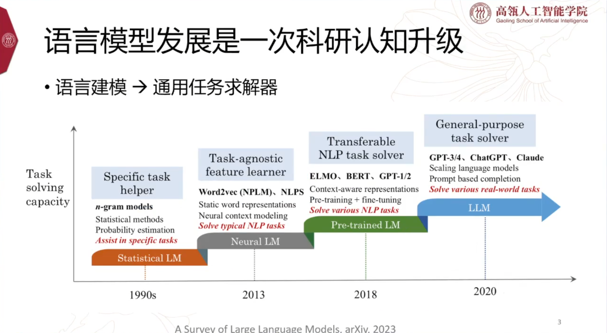
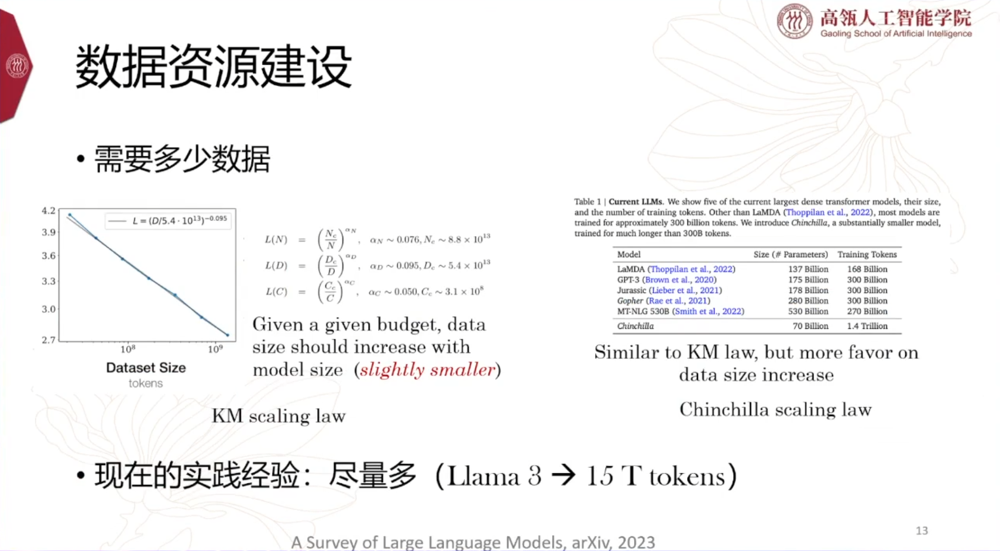

# CCF-NLP走进高校之走进华东师范大学

## 大模型时代知识处理新范式

### 大模型知识更新（参数不变）

#### 参数插件

#### 记忆辅助

### Key Point

### 大模型对齐

## 大模型技术的研发与思考

### 语言模型能力的建立：预训练

### Scaling law

### 数据资源建设

#### 到底需要多少数据？

#### 预训练→数据工程

### 复现GPT-4仍然很难

### 语言模型能力的建立：SFT&RLHF

#### 指令微调（Supervised Fine-tuning，STF）

#### 人类反馈强化学习（Reinforcement Learning with  Human Feedback，RLHF）

#### 其他

### AI研究之路

