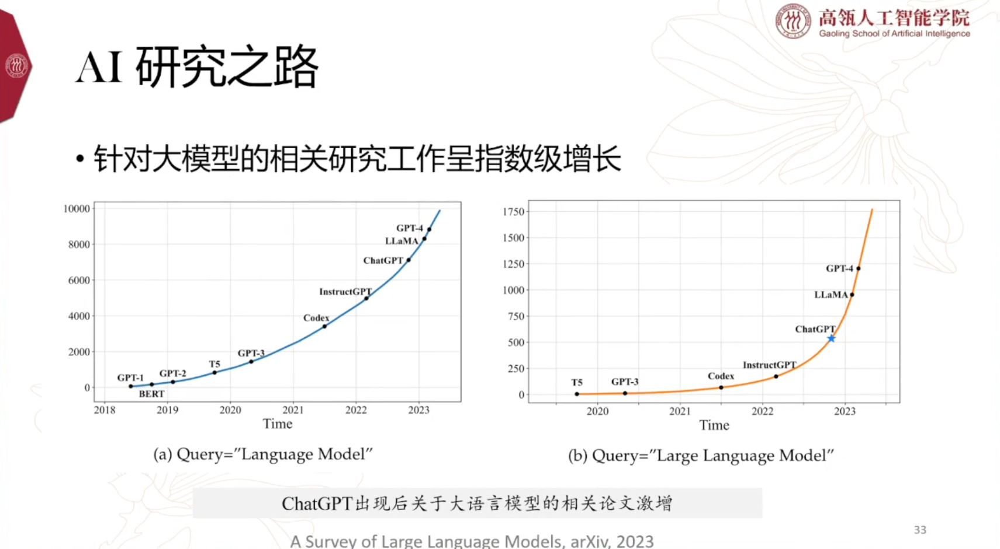
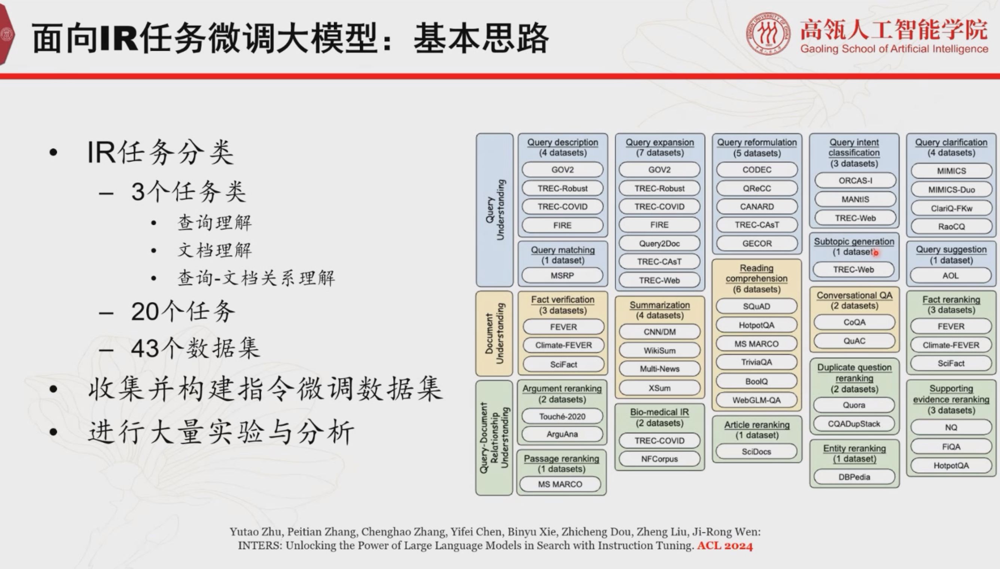
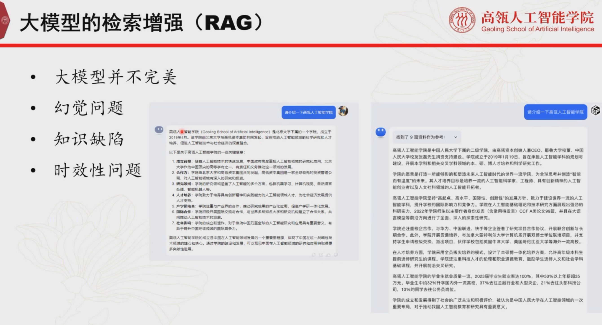
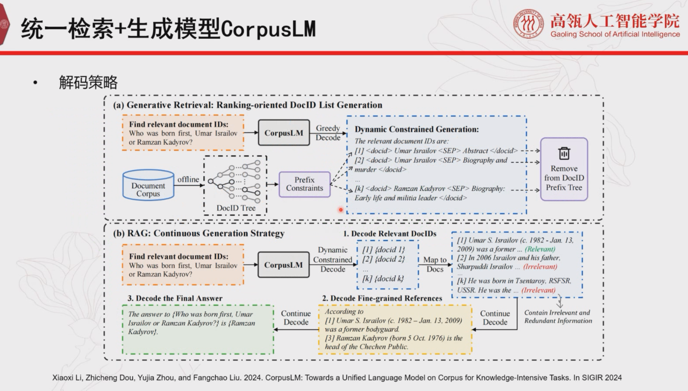

# CCF-NLP走进高校之走进华东师范大学

## 大模型时代知识处理新范式

### 大模型知识更新（参数不变）

#### 参数插件

#### 记忆辅助

### Key Point

### 大模型对齐

## 大模型技术的研发与思考

### 语言模型能力的建立：预训练

### Scaling law

### 数据资源建设

#### 到底需要多少数据？

#### 预训练→数据工程

### 复现GPT-4仍然很难

### 语言模型能力的建立：SFT&RLHF

#### 指令微调（Supervised Fine-tuning，STF）

#### 人类反馈强化学习（Reinforcement Learning with  Human Feedback，RLHF）

#### 其他

### AI研究之路

# CCF-TF131：知识图谱之检索增强技术

## RAG落地中的文档理解及知识库建设实践

### 实现路线

### 具体方案

## GTE-Embedding/Ranking统一文本表示与排序模型

### OpenAI的技术路径

### Embedding路径

### 训练一个通用的语言模型主要分为三个部分

## 有道QAnything的落地经验分享

### QAnything演化史

# 人大高瓴 - 生成式信息检索研究进展与趋势展望

## 传统与大模型时代的信息检索

### 信息检索系统：搜索引擎

#### 一个成功的商业化搜索引擎架构

### 信息检索系统：大语言模型

### 二者对比

### 大模型+检索 → 生成式信息检索

> LLM已经比最熟练的标注工的数据标注效果更好

## 大模型赋能的信息检索

> https://arxiv.org/abs/2308.07107

> **部分任务的效果：微调小模型 > 大模型**

> **任务级别的泛化性**：去掉一个任务，那剩下的数据做微调，再在去掉的结果上去评估效果

## 检索增强的大模型

### 举两个例子

#### 代理模型判定是否必要检索

> 相关性：大概率
>
> - 大模型答不对的时候小模型也答不对
> - 小模型能答对的时候大模型也能答对

> **用同源的、轻量级的模型来代替大模型去做检索的判定**

> **性价比取舍**：虽然比仅用用户输入进行判断的方法高了一些开销，但是效果上看是必要的

#### 假设做完检索了，是否所有检索结果都是必要的？

### Toolkit：FlashRAG

## 生成式文档检索

### 生成式检索的范式

> 从解码器开始，把所有的文档ID通过前缀树构建起来，然后从边一直找到叶节点，输出一个正确的文档ID，整个生成的概率就作为相关性概率输出了

## 总结

- 未来的信息检索会逐渐往**生成**的方向演进
- 但是检索还是逃不掉的，未来的检索会变成同时为人和大模型服务的基础设置

