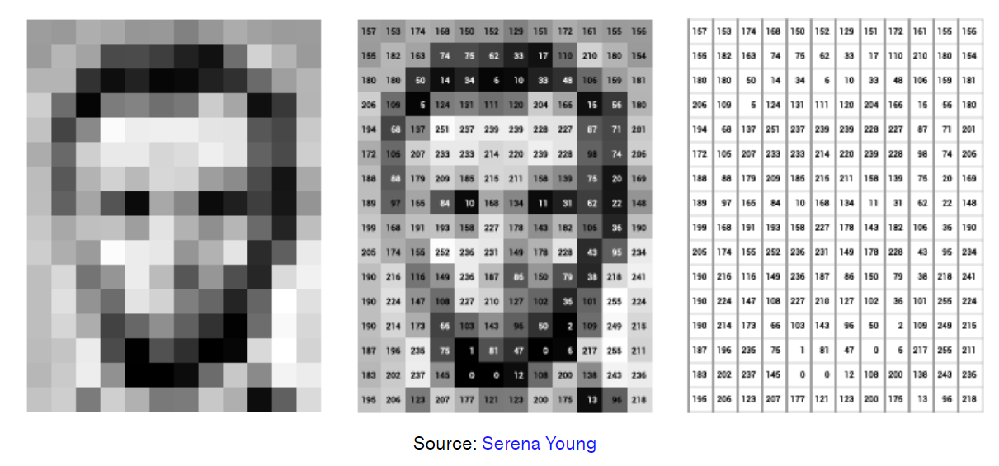

# 

# 向量数据库

## 什么是向量嵌入(Vector embeddings)

> 翻译自：[What are Vector Embeddings](https://www.pinecone.io/learn/vector-embeddings/)

向量嵌入是机器学习中最迷人和最有用的概念之一。它们是许多 NLP、推荐和搜索算法的核心。如果您曾经使用过推荐引擎、语音助手、语言翻译器之类的东西，那么您会遇到依赖嵌入的系统。

与大多数软件算法一样，ML 算法需要数据才能使用。有时我们有一个数据集，其中包含数值列或可以转换为它们的值（有序、分类等）。其他时候，我们会遇到更抽象的东西，比如整个文本文档。我们创建向量嵌入，它们只是数字列表，用于此类数据对它们执行各种操作。可以将整段文本或任何其他对象简化为矢量。甚至数值数据也可以转换为矢量，以便于操作。

但是矢量有一些特殊之处使它们如此有用。这种表示使得将人类感知到的**语义相似性**转换为**向量空间**中的接近性成为可能。

换句话说，当我们将现实世界的对象和概念（如图像、录音、新闻文章、用户配置文件、天气模式和政治观点）表示为向量嵌入时，这些对象和概念的语义相似性可以通过它们作为向量空间中的点彼此之间的接近程度来量化。因此，向量嵌入表示适用于常见的机器学习任务，例如聚类、推荐和分类。

例如，在聚类分析任务中，聚类分析算法将相似的点分配给同一聚类，同时使来自不同聚类的点尽可能不同。在推荐任务中，当对未见过的对象进行推荐时，推荐系统会寻找与所讨论的对象最相似的对象，通过它们与向量嵌入的相似性来衡量。在分类任务中，我们通过对最相似对象的标签进行主要投票来对未见过的对象的标签进行分类。

## 创建向量嵌入

创建向量嵌入的一种方法是使用领域知识设计向量值。这称为特征工程。例如，在医学成像中，我们使用医学专业知识来量化一组特征，例如捕获语义的图像中的形状、颜色和区域。然而，工程向量嵌入需要领域知识，而且扩展成本太高。

我们经常训练模型将对象转换为向量，而不是设计向量嵌入。深度神经网络是训练此类模型的常用工具。得到的嵌入通常是高维的（高达两千维）和密集的（所有值都不为零）。对于文本数据，[Word2Vec](https://en.wikipedia.org/wiki/Word2vec)、[GLoVE](https://en.wikipedia.org/wiki/GloVe_(machine_learning)) 和 [BERT](https://en.wikipedia.org/wiki/BERT_(language_model)) 等模型将单词、句子或段落转换为向量嵌入。

可以使用[卷积神经网络（CNN）](https://en.wikipedia.org/wiki/Convolutional_neural_network)等模型嵌入图像，CNN 的示例包括[VGG](https://arxiv.org/abs/1409.1556)和 [Inception](https://arxiv.org/abs/1409.4842)。可以使用音频视觉表示上的图像嵌入变换（例如，使用其[Spectrogram](https://en.wikipedia.org/wiki/Spectrogram)）将音频录音转换为向量。

## 示例：使用卷积神经网络进行图像嵌入

考虑以下示例，其中原始图像表示为灰度像素。这相当于0到255范围内的整数值的矩阵（或表）。其中值0对应于黑色并且255对应于白色。下图描绘了灰度图像及其相应的矩阵。

左侧子图像描绘灰度像素，中间子图像包含像素灰度值，最右侧子图像定义矩阵。请注意，矩阵值定义一个向量嵌入，其中它的第一个坐标是矩阵左上角的单元格，然后从左到右直到对应于右下角矩阵单元格的最后一个坐标。

这种嵌入非常适合维护图像中像素邻域的语义信息。然而，它们对诸如移位、缩放、裁剪和其他图像处理操作之类的变换非常敏感。因此，它们经常被用作原始输入来学习更强大的嵌入。

卷积神经网络（CNN 或 ConvNet）是一类深度学习架构，通常应用于将图像转换为嵌入的视觉数据。

CNN 通过分层的小型局部子输入（称为receptive fields）来处理输入。每个网络层中的每个神经元处理来自前一层的特定receptive fields。每层要么在receptive fields上应用[卷积](https://en.wikipedia.org/wiki/Convolution)，要么减小输入大小，这称为子采样。

下图描绘了一个典型的 CNN 结构。注意receptive fields，在每层中被描述为子方块，作为前一层中单个神经元的输入。另请注意，子采样操作会减小层大小，而卷积操作会扩展层大小。生成的向量嵌入通过全连接层接收。

学习网络权重（即嵌入模型）需要大量标记图像。权重的优化方式是，与具有不同标签的图像相比，具有相同标签的图像嵌入得更近。一旦我们学习了 CNN 嵌入模型，我们就可以将图像转换为向量并使用 K 最近邻索引来存储它们。现在，给定一个新的未见过的图像，我们可以使用 CNN 模型对其进行转换，检索其 k 个最相似的向量，从而检索相应的相似图像。

尽管我们使用图像和 CNN 作为示例，但可以为任何类型的数据创建向量嵌入，并且我们可以使用多种模型/方法来创建它们。

## 使用向量嵌入

嵌入可以将对象表示为包含其语义信息的密集向量，这一事实使得它们对于广泛的机器学习应用程序非常有用。

[相似性搜索](https://www.pinecone.io/learn/what-is-similarity-search/)是向量嵌入最流行的用途之一。 KNN 和 ANN 等搜索算法要求我们计算向量之间的距离以确定相似度。向量嵌入可用于计算这些距离。最近邻搜索又可用于重复数据删除、推荐、异常检测、反向图像搜索等任务。

即使我们不直接在应用程序中使用嵌入，许多流行的机器学习模型和方法内部也依赖它们。例如，在[编码器-解码器架构](https://towardsdatascience.com/understanding-encoder-decoder-sequence-to-sequence-model-679e04af4346)中，编码器生成的嵌入包含解码器生成结果所需的信息。这种架构广泛应用于机器翻译和字幕生成等应用中。

---

> 翻译自：[What is a Vector Database?](https://www.pinecone.io/learn/vector-database/)

我们正处于人工智能革命之中。它颠覆了它所接触的任何行业，承诺了伟大的创新 - 但它也带来了新的挑战。对于涉及大型语言模型、生成式 AI 和语义搜索的应用程序，高效的数据处理变得比以往任何时候都更加重要。

所有这些新应用程序都依赖于**向量嵌入**，这是一种数据表示，其中包含语义信息，这对于人工智能获得理解并保持他们在执行复杂任务时可以利用的长期记忆至关重要。

