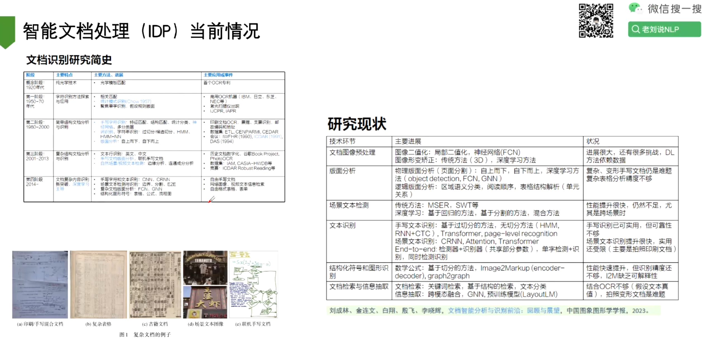
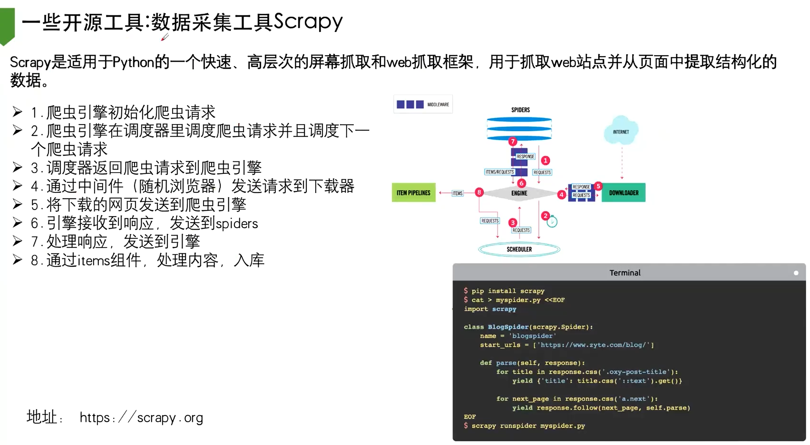
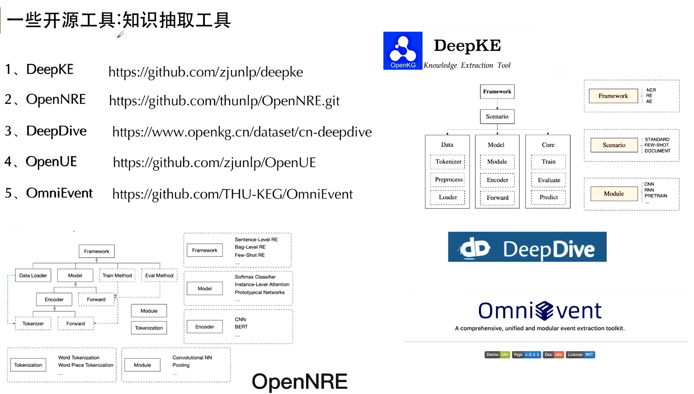
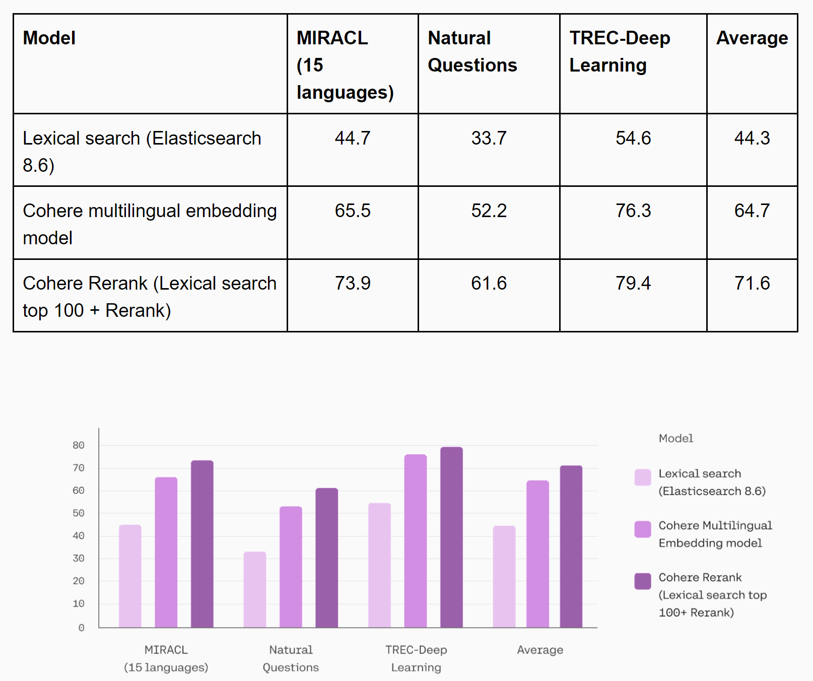
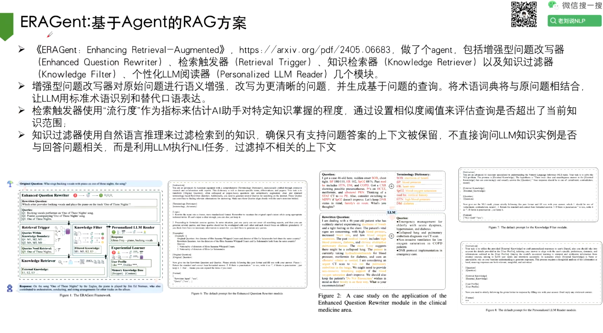
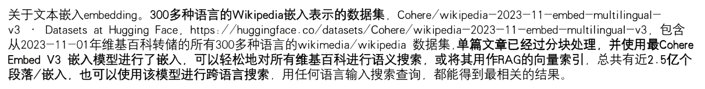

# 为什么要研究搜索

- 做搜索就是一个搜索答案，找解决方案的过程，是一个解决实际问题的过程；
- 如果来一个问题你想要解决，那么首先得把问题想清楚，你就会有思考
- 有了思考你又不能把全部的思考过程放到搜索里面，这样你就会把问题浓缩成一个/若干个关键词
- 然后就会变成关键词的概括，这样变相的会去培养你总结的能力
- 搜索之后，会有很多结果，有些并不是你想要的，这时候你需要举一反三，去想其他的一些搜索词 


# Basic

## 微调


## 长文本


### 业界代表方案


#### 评测


#### 大海捞针


## 小模型


## 文档智能

> 尽量还是采用pipeline方式来做




###  KOSMOS


### Vary


### Donut


### Unidoc


> 方法基本都一样，只是微调数据集的构造和Prompt不一样

### 细粒度多页文档理解大模型FOX


### 公式识别


### 表格处理

> 开源项目：ChatDB、ChatExcel


> 简单表格用markdown，复杂表格用Latex或者HTML


> https://github.com/khuangaf/Awesome-Chart-Understanding

> 没有表格，生成表格


---


### ==文档层级==

> https://arxiv.org/pdf/2402.01767
>
> https://github.com/TebooNok/HiQA


### 360Layout


### Benchmark


## prompt工程


### 大模型性能提升中的prompt工程策略


> 推荐 ↑ 这篇综述

#### ==Logical CoT==


> ↑ 有点像RAG的query rewrite


> ↑ 类似于 RAG-fusion：一个问题，一次性解决不了的时候就分而治之


## 大模型训练资源


## 多轮对话


## 信息抽取


## 数据标注


## 知识蒸馏


## 工具

### PDF处理包：fitz


> 1. pypdf
> 2. pdfminer
> 3. fitz
> 4. pypdfium2
> 5. pdfplumber

## 竞赛


## 数据报告


## 数据集


> 做微调也可以直接拿这个东西去试

> **任务评估数据集，一方面给大家做评估展示、另一方面也可以拿着公开的数据集去做训练**


## 文本处理工具




> 做NLP的人一定要会的，爬虫；简单的就request，工程量比较大的就scrapy


> 不会写代码就用curlconverter



# RAG

## RAG from Scratch


### Self-query

自查询检索器，顾名思义，可以自行搜索信息。它需要一个自然语言问题并使用一系列工具来创建结构化查询。然后，它将此结构化查询应用于其信息数据库。这意味着检索器不仅可以找到与您的问题类似的内容，还可以根据您提供的详细信息**应用过滤器。**这是非常强大的，因为在正常情况下它不会过滤文档并搜索与您的查询类似的每个文档。例如，它可以查找与您的查询匹配并**满足特定条件**（例如特定流派或特定发行年份）的文档。本质上，自查询检索器就像一个智能助手，它理解您的请求，并通过过滤数据而不是获取相似的所有内容，从自己的存储库中查找相关信息。所附图片应该可以帮助您直观地理解它。


### LangChain中的RAG整体设计


#### Indexing


> Embedding只是用来向量化，关键是你怎么存，存完怎么处理

#### Generation


### Query改写

- Query Transformations查询转换侧重于**重写和/或修改问题以便检索**


#### Multi Query多查询

- Multi Query**从多个角度重写用户问题**，为每个重写的问题检索文档，返回所有查询的唯一文档。 在实现上，将一个查询变成多个查询
- https://python.langchain.com/docs/modules/data_connection/retrievers/MultiQueryRetriever


#### RAG-Fusion答案合并

- 从多个角度重写用户问题，检索每个重写问题的文档，并组合多个搜索结果列表的排名，以使用倒数排名融合(RRF)生成单一、统一的排名。其思想在于：**将多个召回查询的结果进行合并**
- https://github.com/langchain-ai/langchain/blob/master/cookbook/rag_fusion.ipynb
- https://towardsdatascience.com/forget-rag-the-future-is-rag-fusion-1147298d8ad1


> Docs：https://github.com/langchain-ai/langchain/blob/master/cookbook/rag_fusion.ipynb
>
> Blog：https://towardsdatascience.com/forget-rag-the-future-is-rag-fusion-1147298d8ad1


#### Decomposition问题分解

- Decomposition问题分解将一个复杂问题分解成多个子问题，将问题分解为一组子问题/问题，可以按顺序解决(使用第一个问题的答案+检索来回答第二个问题，见下面【递归回答】)，也可以并行解决 (将每个答案合并为最终答案)，这个是向下分解，与Multi Query是不同的方案

```python
from langchain.prompts import ChatPromptTemplate

# Decomposition
template = """You are a helpful assistant that generates multiple sub-questions related to an input question. \n
The goal is to break down the input into a set of sub-problems / sub-questions that can be answers in isolation. \n
Generate multiple search queries related to: {question} \n
Output (3 queries):"""
prompt_decomposition = ChatPromptTemplate.from_template(template)

from langchain_openai import ChatOpenAI
from langchain_core.output_parsers import StrOutputParser

# LLM
llm = ChatOpenAI(temperature=0)

# Chain
generate_queries_decomposition = ( prompt_decomposition | llm | StrOutputParser() | (lambda x: x.split("\n")))

# Run
question = "What are the main components of an LLM-powered autonomous agent system?"
questions = generate_queries_decomposition.invoke({"question":question})

from langchain_openai import ChatOpenAI
from langchain_core.output_parsers import StrOutputParser

# LLM
llm = ChatOpenAI(temperature=0)

# Chain
generate_queries_decomposition = ( prompt_decomposition | llm | StrOutputParser() | (lambda x: x.split("\n")))

# Run
question = "What are the main components of an LLM-powered autonomous agent system?"
questions = generate_queries_decomposition.invoke({"question":question})
# ['1. What is LLM technology and how does it work in autonomous agent systems?',
#  '2. What are the specific components that make up an LLM-powered autonomous agent system?',
#  '3. How do the main components of an LLM-powered autonomous agent system interact with each other to enable autonomous functionality?']
```

##### ==递归回答==


> - https://arxiv.org/pdf/2205.10625.pdf
> - https://arxiv.org/abs/2212.10509.pdf


#### Step Back问题回退  

- Step Back问答回退，首先提示LLM提出一个关于高级概念或原则的通用后退问题，并检索有关它们的相关事实，使用此基础来帮助回答用户问题。构成上包括抽象abstracton和推理reasoning两个步骤
- 比如给定一个问题，需要提示大模型，找到回答该问题的一个前置问题。得到前置问题及其答案后，再将其整体与当前问题进行合并，最后送入大模型进行问答，得到最终答案
- https://arxiv.org/pdf/2310.06117.pdf


#### HyDE假设性文档嵌入

> 不仅仅可以尝试修改Query，也可以把答案召回整理成新的文档来回答

- LLM将问题转换为回答问题的假设文档。使用嵌入的假设文档检索真实文档，前提是doc-doc相似性搜索可以产生更多相关匹配。由于query与doc之间是不对称检索，因此这个时候，可以先根据query生成一个doc，然后根据doc生成对应的embedding，再跟原先documents进行检索：例如下图中的query，每个有对应的instruction,通过chatgpt生成generated doument， 然后以此进行召回，最后生成real document;


> Docs：https://github.com/langchain-ai/langchain/blob/master/cookbook/hypothetical_document_embeddings.ipynb
>
> Paper：https://arxiv.org/abs/2212.10496


### Routing

> RAG Routing路由， 主要解决的是从**获取Query之后，所需要执行的问题意图分类的问题**，处理的是问题域选择问题


#### 基于逻辑规则的路由分发Logical routing


> https://python.langchain.com/docs/use_cases/query_analysis/techniques/routing#routing-to-multiple-indexes

#### 基于语义的路由分发Semantic routing


> https://python.langchain.com/docs/expression_language/cookbook/embedding_router
>

### Query构建


- Query Construction, 主要解决的问题是不同检索知识库，如MySQL数据库 、图数据库GraphDB、向量化数据库vectorDB的查询转换。使用LLM将自然语言转换为其中一种与给定数据库(SQL、Cypher等)交互所需的领域特定语言DSL
- https://blog.langchain.dev/query-construction/
- 正在具体实现上，可以查看的方案，可以如下: Query structuring for metadata filters， 基于元数据过滤器的问题构建，例如，许多向量化存储都包含元数据字段，这样就可以根据元数据过滤特定的数据chunk
- https://blog.langchain.dev/enhancing-rag-based-applications-accuracy-by-constructing-and-leveraging-knowledge-graphs/


### Indexing

> 关于文档chunk切分这个事情，索引的组织其实也是一一个很有趣的话题.这块在切分上可以做优化。也可以做多种表达方式的索引multi-representation indexing、特定化的embedding或者层级性的索引


#### Multi-representation Indexing

- 例如Multi-representation Indexing。使用LLM生成针对检索进行优化的文档摘要(“ 命题")。嵌入这些摘要以进行相似性搜索，但将完整文档返回给LLM进行生成：

- ==对于**图表**，先对其进行Summary，再将其召回==

- https://blog.langchain.dev/semi-structured-multi-modal-rag/

  https://python.langchain.com/docs/modules/data_connection/retrievers/multi_vector

  https://arxiv.org/abs/2312.06648


#### 文档层级：父文档索引

- 例如，可以针对一个text, 切分形成多个检索单位retrieval units， 包括: passages 、sentences, propositions， 可以通过小的chunk。来实现**父文档索引**
- https://python.langchain.com/docs/modules/data_connection/retrievers/parent_document_retriever

##### PAPTOR

- **PAPTOR**：其思想在于对文档进行生成聚类摘要， 然后将设计成层级性。具体实现上，**将语料库中的文档聚类，并递归地总结相似的文档。将它们全部编入索引，生成较低级别的文档和摘要，可以检索这些文档和摘要来回答从详细到更高级别的问题。**


##### ColBERT

- 也可以做token到text级，这里可以使用CoIBERT，为段落中的每个token生成一个受上下文影响的向量。CoIBERT同样为查询中的每个token生成向量，然后，每个文档的得分就是每个查询嵌入与任意文档嵌入的最大相似度之和，这块可以看：https://hackernoon.com/how-colbert-helps-developers-overcome-the-limits-of-rag
- RAGatouille 让 ColBERT 的使用变得简单。 
- ColBERT 为段落中的每个标记生成一个受上下文影响的向量。 
- ColBERT 类似地为查询中的每个标记生成向量。
- 然后，每个文档的得分是每个查询嵌入与任何文档嵌入的最大相似度之和
- https://zhuanlan.zhihu.com/p/138703309
- https://til.simonwillison.net/llms/colbert-ragatouille
- https://python.langchain.com/docs/integrations/retrievers/ragatouille

### Retrieval


- 在完成对问题的改写、不同知识库查询的构建以及意图分发、查询对象索引的构建之后，我们可以进一步优化Retrieval检索，包括ranking、refinement增强 以及自适应检索adaptive retrival 。

#### Cohere-Rerank

- **“跟通义的专家聊过，他个人建议还是说，我们在去做RAG的时候，大家尽可能不要去动原始的embedding模型，大家应该动的是re-rank模型,根据你不同的模型。不同的业务你自己去训一个模型，这个流量模型可以特别小，就可能只有几百兆。”**
- 具体采用Re- ranking。这个可以作为rag-fusion的替换方案，当做一个过滤筛子进行排序在具体实现上，可以使用Cohere Re-Rank方案，https://python.langchain.com/v0.1/docs/integrations/retrievers/cohere-reranker/#doing-reranking-with-coherererank




#### CRAG

- 其本质上是一种adaptive-RAG策略， 实现方式为在循环单元测试中自我纠正检索错误，以确定文档相关性并返回到网络搜索，即纠对检索文档的自我反思/自我评分
- 如果至少有一个文档超过了相关性阈值，则进入生成阶段,在生成之前，进行知识细化将文档划分为知识条带(knowledge strip)，对每个知识条进行分级 ，过滤不相关的知识条，如果所有文档都低于相关性阈值，或者分级者不确定，那么框架就会寻找额外的数据源，并使用网络搜索来补充检索。

- https://github.com/langchain-ai/langgraph/blob/main/examples/rag/langgraph_crag.ipynb
- https://github.com/langchain-ai/langgraph/blob/main/examples/rag/langgraph_crag_mistral.ipynb


### Generation

#### Self-RAG

- 其基本思想在于：使用循环单元测试自行纠正RAG 错误，以检查文档相关性、答案幻觉和答案质量。(到底要不要检索，检索完到底相不相关)
- https://arxiv.org/abs/2310.11511
- https://github.com/langchain-ai/langgraph/tree/main/examples/rag
- https://github.com/langchain-ai/langgraph/blob/main/examples/rag/langgraph_self_rag_mistral_nomic.ipynb


#### 长文本的影响

- https://docs.google.com/presentation/d/1mJUiPBdtf58NfuSEQ7pVSEQ2Oqmek7F1i4gBwR6JDss/edit#slide=id.g26c0cb8dc66_0_0

## 优秀开源平台

### FlashRAG


### GraphRAG


### ==SodaRAG==


### ERAGent



### UniOQA


## RAG 2.0


> 优化大模型没多大意义，因为你一换掉模型，所有的东西都白搭
>
> embedding相关性和大模型认为的相关性不是一回事，召回的很准，大模型可能会掉点
>
> 因此提出RAG 2.0

## 多模态RAG

> **为什么要讲多模态，因为未来的RAG一定要往长文本、多模态等方向发展。**


- 方法1：使用V2L模型将视频/图片翻译成文本，然后构造Prompt


- 将各种数据使用【同一个Embedding模型】嵌入到一个文本空间中，分四路召回，分别送入对应模型。


---


## RAG与长文本

> [也谈长文本取代RAG的局限观点：兼看20240224大模型进展早报及Self-DC RAG问答框架](https://mp.weixin.qq.com/s/I-pu2bK8Ajw-e9qeLx2hbw)
>
> **RAG个大系统，就像当时KG一样，都说要替代掉，但其本身是个大系统，依旧是要往前走的，要有工程观和落地观念。**
>
> 本文主要介绍了20240224大模型进展早报以及继续关注RAG的一个工作，也重新温习了使用大模型对自身生成内容置信度估计的方案，与之前介绍内容不同的是，除了使用verblized based方案之外，还可以利用token的预测概率，如均值等，这些都是很好玩的思路。
>
> 此外，self-DC这这套方案，前置要求大模型的置信准确性，也融合了问题扩展等思路，但也存在一些问题，例如，简单问题和难问题之间存在着很大的差距，**如该工作所说的，** 对大模型的依赖性太强，当使用verblized based方法时，在**gpt-3.5-turbo-instruct**上，发现超过65%的情况下置信度得分为0，大约20%的情况下置信度得分超过0.9。但当使用**gpt-3.5-turbo-instruct**，趋势相反，给出0.9更高的频率(≈45%)，也就是说，大模型似乎要么高估了正确性，要么直接承认不确定性并拒绝回答。此外，细粒度置信分数(即0.82,0.61)相当罕见，使得β的细粒度选择毫无意义。
>
> 另一方面，当使用probb方法时，有更多的细粒度置信信号，并且大多数落在<0.5部分(≈90%)。结果表明，gpt-3.5-turbo-1106在不确定性估计方面优于gpt-3.5-turbo-instruct，prob方法优于动词方法，获得了更准确的置信度分数，分解次数受置信度分数的影响很大，这可能又会落入到一个阈值的调节怪圈里。
>
> **所以说，在NLP领域，并不存在一个放之四海而皆准的防范，都是需要特事特办，都是一堆补丁，即便有了长文本，也有一堆RAG的补丁要做。**


**RAG是一个很庞大的系统，和单纯的长文本完全是两个东西，长文本模型只是RAG中众多pipeline中（问题改写、切分、排序、噪声控制、重排、融合sq|\kg, 答案生成、答案组合等其他模块）答案生成这个小模块，当然也可以用到rank-embedding等，长文本的输入长了，可以降低切分、rank这类模块的必要性，但绝对不会是所谓的取代观点，比如我要调用kg，转text2sq|等， 怎么做才能应对不同的检索问答需求，这是工程上需要考虑的点。**


## 模块化RAG


现在很多RAG会发现太冗余了，成本高、速度慢；有一些工作尝试对检索器和生成器进行微调


自然语言本身是冗余的，因此可以压缩，LLM可以有效地从压缩文本描述中重建源代码，同时保持较高的功能准确性。


## RAG的embedding




> 搜索一个概念时，对不同语种页面的信息同时召回，总结，可能准确率就会有提升


> 长文本这么搞是很占内存的，所以后面有人用俄罗斯套娃的方式去做


### chun可视化


## 如何衡量大模型对答案的不确定性


> 自信等级、一致性、结合
>
> 不同模型是有偏的

### 相关or无关


## Transformer Debugger，模型可解释工具


> 传统的检索技术可能不是最优的，需要针对【【语言生成模型与检索整合】的特定需求】开发专门的方法


> Donut：目录信息辅助文档处理
>
> https://github.com/clovaai/donut
>
> 


## 提升鲁棒性


### ==RAFT==


### ==RAT==


## 语义分割

- 用传统滑动窗口，计算量很爆炸


## 引入实体识别 


> T-RAG：你去做向量化检索的时候，能不能顺带去做一下组织里的实体，然后再把实体对应的东西给召回出来。


## RAG架构

> https://www.rungalileo.io/blog/mastering-rag-how-to-architect-an-enterprise-rag-system


## RAG中的表格处理


## RAG Future

### 截止2024.5.9


> [【RAG实践】Rerank，让RAG更近一步](https://developer.aliyun.com/article/1478619)


### 截止2024.5.19


# KG

## ==综合性工作==

### ResearchAgent


### ==交互式系统LinkQ==


## 抽取


## 补全


 

 


## 对齐


## KG增强大模型问答


---

### 再看知识图谱注入大模型RAG问答的几个阶段


### 推理


## KG做大模型评估


# AI搜索

> **用大模型做AI搜索更多地是充当一个润色的作用，会出现幻觉和query漂移，如何跟图谱结合，这方面可以去做跟进。**

> 以**摘要**为核心的搜索：
>
> 1. query意图理解：query的分析（去停用词、实体识别、关键词提取、归一化等）；
> 2. query扩展：一个query扩展成多个sub query, 以扩大召回面，形成标准和多样化的query集合；
> 3. 并发检索：针对query进行并发检索；
> 4. 检索后再进行粗排、精排：召回出符合特定阈值的相关网页文档；
> 5. 追加至prompt：让大模型进行总结回答，给出对应的链接。
>
> - 在query泛化上不受控制，可以借助预先建设好的知识图谱进行控制。

> 对于对话式搜索引擎来说，**召回**+**排序**才是核心竞争力


## 典型案例


### Explorer

> https://explorer.globe.engineer/


> 比如今天想去滑雪：先给出一系列的目录，比如滑雪的技巧，地点，天气，装备等等，这样相当于把用户query给扩充了，再单独生成对应的内容，这样更精确。


### Perplexity AI


### 天工搜索


### 360AI搜索


## to B


# Agent

## 主流Agent框架


## Multi-Agent

- 用户可以跟大模型进行对话，大模型可以进 行任务的拆解，然后有一个多 Agent 协同系统。这个 Agent 可以外挂一些工具，它有自己 的运行环境，然后多 Agent 之间可以互相协同，它们还会共享一些上下文机制。


## 根本认知


## 如何更好的控制Agent

- https://mp.weixin.qq.com/s/kCXZN7Wli-RCvZXRb6mF7g


> RAG的未来就是Agent
>
> - Base模型（有指令微调）要10B以上；
> - 专门要做指令增强的强化
> - 要有意图识别
> - langchain-chatchat-v3
> - AutoGen、AutoGen Studio-v2有完备的可视化界面，多智能体定制很容易，效果很好
> - 目前还是用英文来训练，中文还不行
> - 训完之后去找适合自己任务的足够新的框架
> - 清晰数据还是尽量用成体系的Prompt Engineer来做，人来做的话，模型能力反而可能降低
> - 


## 【RAG+Agent】

### ERAGent


## Tool Learning


## 产品


## Trends & Future

### 技术挑战：“雕花”还是“筑基”？

**1.短期：提示词框架设计**

在现有模型能力的情况下，智能体框架设计需要结合对需求的理解，进行启发式设计，以弥补模型能力的不足。通过对智能体的目标和在不同场景下的用户需求、行为模式进行分析，设计启发式规则和提示词结构，以引导智能体的行为。例如，在客服应用中，通过分析常见问题和高频交互模式，设计相应的提示和响应规则。

然而，启发式的框架设计难以适应不断变化的环境和用户需求。根据从手工设计到数据驱动学习的发展规律，进行提示词结构和智能体框架学习和优化是可能的解决思路。

通过在运行过程中收集反馈，积累用户与智能体的交互数据，可以动态调整提示词，优化模块化结构设计。通过结合启发式设计和数据驱动优化，智能体可以在复杂多变的环境中提供更加灵活和智能的服务，为用户带来更好的体验和价值。

**2.中期：智能体生态建设**

目前的智能体平台，通过可视化工作流和低代码设计已经有不错的交互体验。但要将智能转化为生产力，真正解决用户生活和工作中的需求，还需要逐步完善一个丰富和标准化的智能体插件生态。

关于丰富性，需要深入理解和提炼各个场景中的高频元需求，并将解决方案封装成通用的工具和插件，使得用户可以根据需求快速组合和定制智能体的功能。例如，在客户服务场景中，高频需求包括自动回复常见问题、情感分析和实时翻译等。

关于标准化，需要制定统一的插件格式、API接口等技术规范，并保证与不同大模型的兼容性。这与目前RAG中向量库的标准化问题类似。标准化有助于不同智能体和插件之间的互操作性，使得开发者能够更轻松地创建和集成新的工具和功能，保证平台的可扩展性和插件生态的良性发展。

**3.长期：大模型能力提升**

智能体的应用体验最终将依赖大模型本身能力的提升。

首先是**长上下文推理能力的提升**。目前的智能体在处理具有复杂工作流的任务时，难以保持对长上下文的注意力，导致任务规划和调用工具的过程中无法始终保持与用户目标的一致。

一方面，可以在训练时引导模型进行系统二的分步推理思考，更好地利用训练数据，从而在推理时无需依赖复杂的提示词设计。另一方面，大模型的预训练目标是对序列数据补全，微调数据则是问题-答案对，并没有针对任务规划和工具调用任务进行特定训练。因此，可以通过人类标注规划和行动数据、模仿人类行为学习以及与环境交互反馈等方式提升模型的这些能力。

第二是**经验沉淀**。基于大模型的智能体目前在试错和从错误中学习的能力是不够的。相比基于强化学习的智能体，虽然大语言模型的通用知识使其具备了一定的任务泛化能力，但现有的类似Reflexion的经验沉淀机制只能保存在长期记忆中。

RAG形式的记忆检索无法保证经验的有效利用。需要借鉴强化学习相关方法，将这些经验沉淀到提示词框架中，作为常驻的短期记忆，或者整合到模型参数中，成为大模型本身的能力。此外，自然语言的歧义和模糊性也在一定程度上影响了经验学习的高效性和稳定性，需要一种相对统一的表示方法来保证智能体的经验沉淀和持续学习。

第三是**可信与对齐的增强**。由于加入了记忆、执行、规划等环节，面向智能体的可信与对齐有新的技术问题需要解决。在对抗鲁棒性方面，不仅要关注模型本身的抗攻击能力，还要考虑记忆载体、工具集、规划过程等的安全性。

比如，智能体工具和插件需要经过严格的安全审查，以防止恶意工具的注入或工具本身被攻击。在处理幻觉问题上，不仅要解决感知和认知阶段的幻觉，还要防止这些幻觉在决策和行动阶段传播并产生新的幻觉。比如，智能体在制定和执行决策时，可能会因为之前的幻觉而导致错误的行动。这需要在决策和行动之前引入验证和校正机制，确保决策和行动的准确性和可靠性。

**[结束语]** 电影《奥本海默》中，奥本海默前往普林斯顿向爱因斯坦询问链式反应是否会毁灭世界。同为原子能的“盗火者”，爱因斯坦奠基了核裂变理论，打开了潘多拉魔盒，而奥本海默将理论转化为现实，释放了原子弹这头洪水猛兽。作为智能的“盗火者”，Hinton奠基了深度学习理论，他的学生IIya则训练出了GPT。相同的是理论和实践的结合；不同的是，原子能是宇宙的馈赠，智能则是人类自己海量数据积累和压缩后的结果。

这是科学的胜利，更是工程的胜利。杨植麟说：“实现AGI需要结合研究、工程、产品和商业的新组织形式。”

IIya在释放出GPT这头巨龙后，意识到其不断进化带来的潜在危险，试图找到控制和驯服它的方法。然而，打开的潘多拉魔盒再难关上。Ilya出走后的OpenAI看起来要在商业化的道路上一往无前。或许，e/acc才是带领我们走向AGI的真正途径。

# Alignment


# 其他

## NLP


## Text2SQL


## 中科院天文所


## 生产环境下部署微调的10条戒律

- 标注数据其实是遥遥无期的，要适度


## 论文相关

- 论文里可以直接放Prompt：https://arxiv.org/abs/2403.12968


## MOE 


