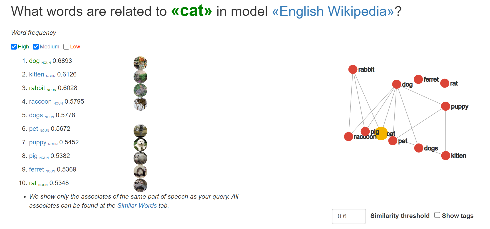
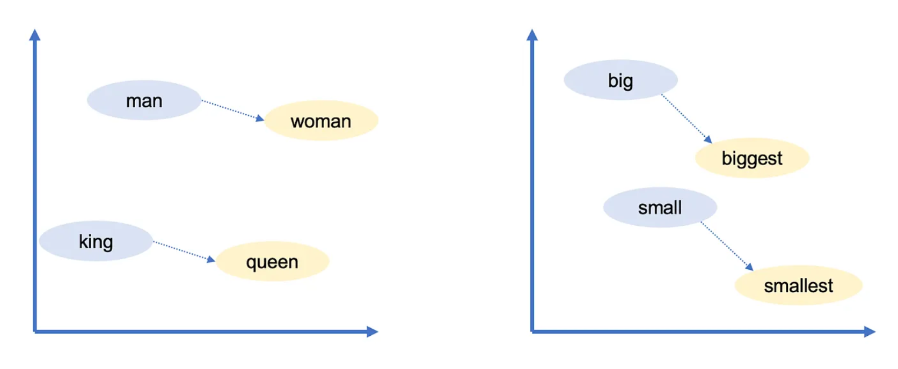
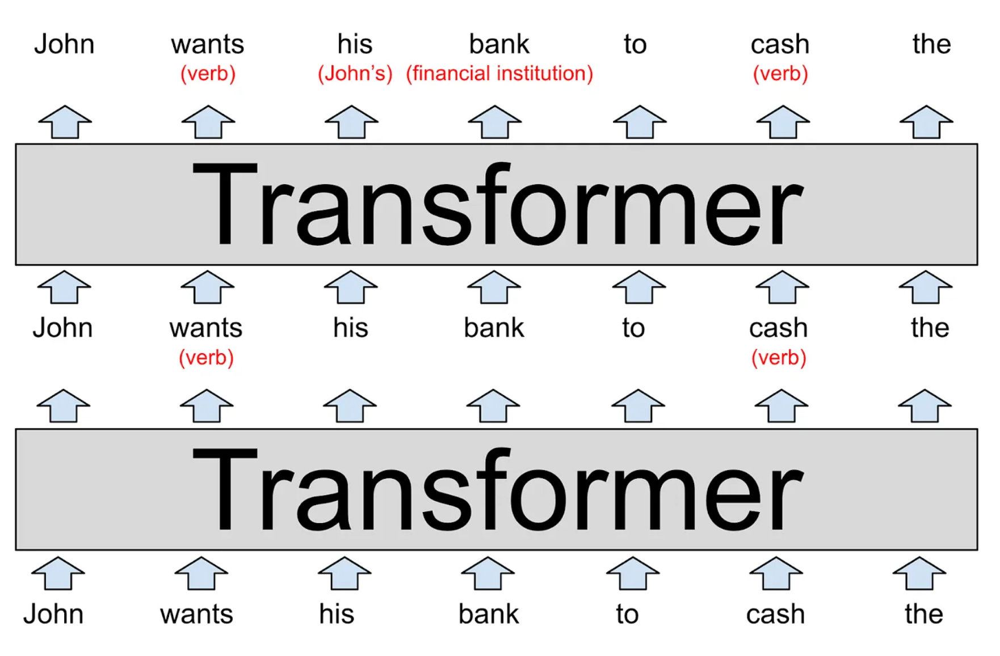
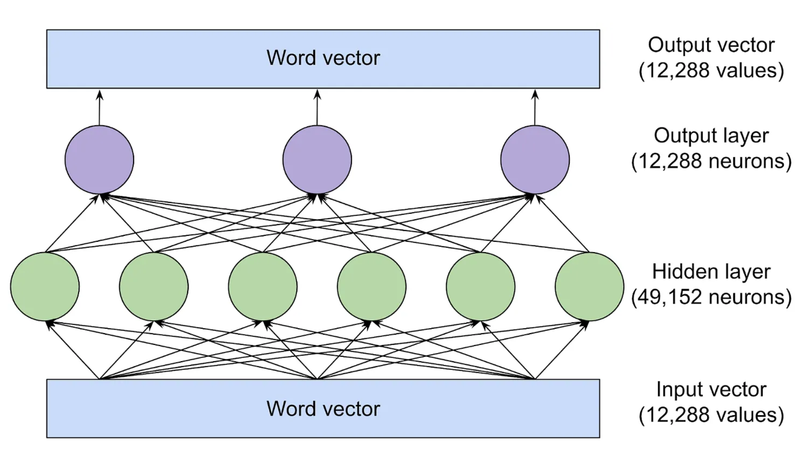
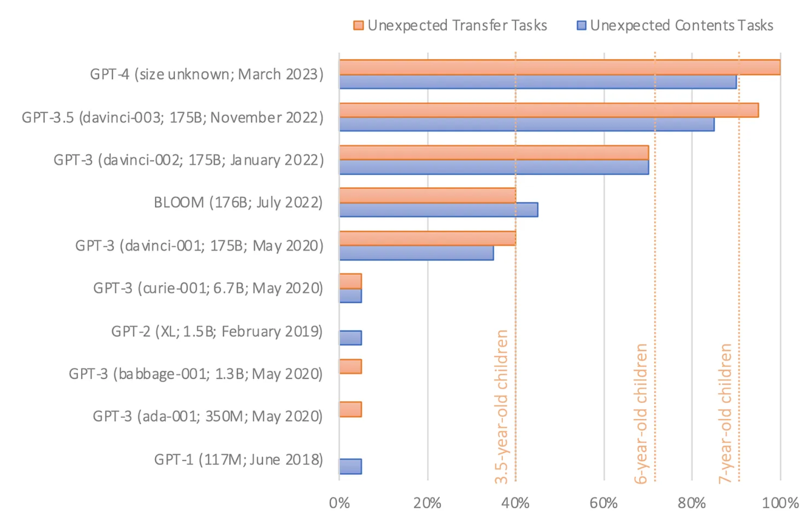
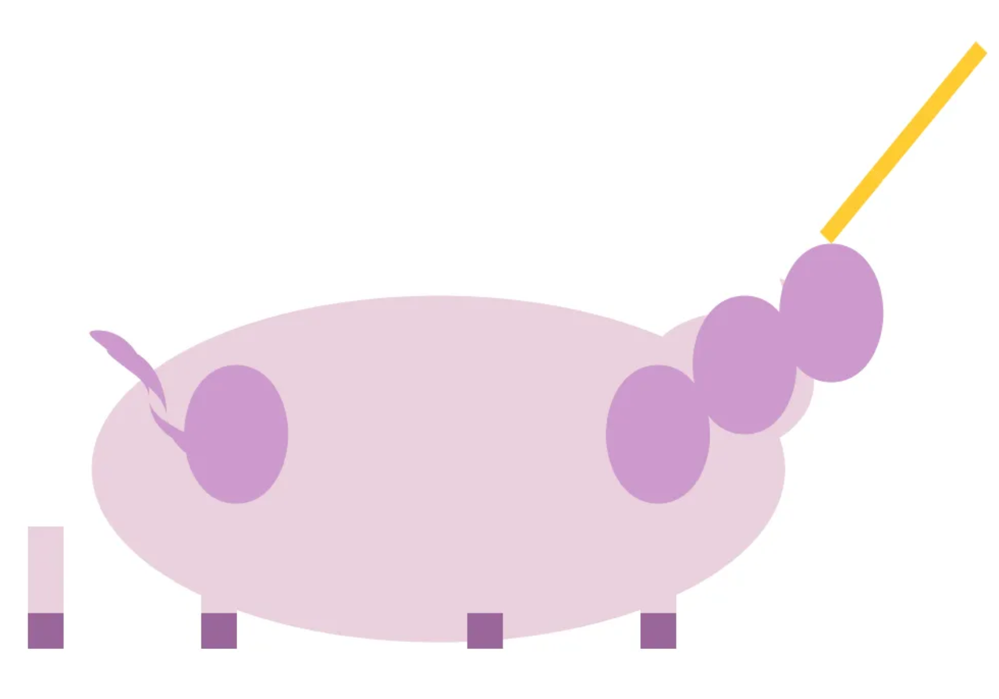

# 大语言模型：一种最少数学知识和专业术语的原理解释

> 翻译自：[Large language models, explained with a minimum of math and jargon](https://www.understandingai.org/p/large-language-models-explained-with)
>
> 原文章写于2023年7月27日

 ChatGPT 在去年秋天一经推出，立即在科技行业乃至全世界范围内引起了巨大轰动。那时，机器学习领域的研究人员已经开发了多年的大语言模型，但是普通大众还没有对其十分关注，也没有意识到它们将会变得极其强大。而如今，几乎每个地球人都听说过大语言模型了，并且有数千万人使用过大语言模型，但是真正了解其工作原理的人并不多。

你可能听说过，训练大语言模型是用来预测下一个词的，而且需要大量的文本语料来实现这一点。但是一般的解释通常也就止步于此。

他们究竟如何预测下一个词？其细节往往被大家视为一个深奥的谜题。其中一个原因是，大语言模型的开发方式非常与众不同。一般的软件都是由人类工程师所编写的，他们为计算机提供明确的逐步执行指令。而相比之下，ChatGPT 是建立在一个使用了数十亿个语言词汇进行训练的神经网络之上。因此，到现在为止，地球上也没有人完全理解大语言模型的内部工作原理。

研究人员正在努力尝试理解这些模型，但这是一个需要数年甚至几十年才能够完成的缓慢过程。不过，专家们确实对这些系统的工作原理已经有了不少了解。我们写这篇文章的目的，是将这些知识开放给广大的受众，我们将在不涉及技术术语或者高级数学的前提下，努力解释已知的大语言模型内部工作原理。

## 1. 理解词向量（Word Vector）

对于大语言模型内部原理的了解，我们将从解释词向量 Word Vector^[1]^ 开始，这是语言模型表示和推理语言的一种奇妙方式。然后我们将深入探讨 Transformer，它是构建 ChatGPT 等模型的基石。最后，我们将解释这些模型是如何训练的，并且探讨为什么要使用庞大的数据量，才能够获得良好的性能。

要了解语言模型的工作原理，首先需要了解它们如何来表示单词。

人类是用字母序列来表示英文单词的，比如说 C-A-T —— cat 表示猫。而语言模型使用的是一个叫做词向量的一长串数字的列表。比如说，这是一种将猫表示为向量的方式。完整的向量长度呢实际上有 300 个数字。那为什么要用这么复杂的表示方法呢？这里边有个类比，比如说华盛顿区位于北纬 38.9 度、西经 77 度，我们可以用向量表示法表示为华盛顿区的坐标是 38.9 和 77，纽约的坐标是 40.7 和 74，伦敦的坐标是51.5和0.1，巴黎的坐标是48.9和-2.4。这对于推理空间关系很有作用。

- Washington DC is at [38.9, 77]
- New York is at [40.7, 74]
- London is at [51.5, 0.1]
- Paris is at [48.9, -2.4]

可以看出，纽约离华盛顿区很近，因为坐标中的38.9接近于40.7，而77接近于74，同样，巴黎离伦敦也很近，但是巴黎离华盛顿区很远。大语言模型正是采用了类似的方法。每个词向量，代表着词空间（word space）中的一个点，具有相似含义的词的位置互相会更为接近。比如说在向量空间中，与猫 “cat” 最接近的词就包括 “dog”、“kitten” 和 “pet”。用实数向量来表示像 cat 这样的单词，有一个主要的优点，就是数字能够完成字母无法进行的运算。

单词太过于复杂，无法只使用二维方式进行表示，因此大语言模型使用了具有数百甚至数千维度的向量空间。虽然我们人类无法想象如此高维度的空间，但是计算机完全可以对它进行推理，并输出有用的结果。

几十年来，研究人员一直在研究词向量，但是这个概念真正引起关注的是在2013年，正是在这一年， Google 公布了 word2vec 项目（《Efficient Estimation of Word Representations in Vector Space》），分析了从 Google 新闻中收集的数百万篇文档，以找出哪些单词倾向于出现在相似的句子中。随着时间的推移，一个经过训练的神经网络学会了将相似类别的单词如 dog 和 cat 放置在向量空间中的相邻位置。

Google 的词向量还具有另一个有趣的特点，即可以使用向量运算来推理单词。例如，Google 研究人员取出 biggest 的向量，减去 big 的向量，再加上 small 的向量，与结果向量最接近的词就是 smallest。也就是说，你可以使用向量运算来进行类比。在这个例子中，big 与 biggest 的关系类似于 small 与 smallest 之间的关系。

Google 的词向量还捕捉到了许多其他的关系：例如瑞士人与瑞士之间的关系，就类似于柬埔寨人与柬埔寨，巴黎与法国类似于柏林与德国，不道德的与道德的类似于可能的与不可能的，moss 与 mice 类似于 dollar 与 dollars，男人与女人类似于国王与女王，等等。

- Swiss is to Switzerland as Cambodian is to Cambodia. (nationalities)
- Paris is to France as Berlin is to Germany. (capitals)
- Unethical is to ethical as possibly is to impossibly. (opposites)
- Mouse is to mice as dollar is to dollars. (plurals)
- Man is to woman as king is to queen. (gender roles)

因为这些向量是从人们使用语言的方式中构建的，所以他们反映了许多存在于人类语言中的偏见，比如说在某些词向量的模型中，医生减去男人再加上女人等于护士。减少这种偏见是一个很新颖的研究领域。

尽管如此，词向量是大语言模型的一个基础，它们编码了词与词之间微妙但是重要的关系信息。如果一个大语言模型学到了关于cat的一些知识，比方说他有时候会去看兽医，那同样的事情呢，很可能也适用于Kitten或者dog。如果模型学到了关于巴黎和法国之间的关系，比方说他们使用了同一种语言，那么柏林和德国以及罗马和意大利的关系很可能也是一样的。

## 2. 单词含义依赖于上下文

简单的词向量方案无法捕获到自然语言的一个重要情形，就是很多单词通常有多重的含义。例如，单词 bank 可以指金融机构，也可以理解为河岸。让我们观察下面这两个例句，两个句子里均包含单词 magazine，其含义具有相关性，但真实含义却有所不同：

- John picks up a magazine.（约翰拿起一本杂志）
- Susan works for a magazine.（苏珊在一家杂志社工作）

当一个词具有多个相互之间无密切关系的含义时，语言学家称之为同音异义词（homonymous）。当一个词具有多个紧密相关的意义时，比如说这里的 magazine，语言学家称之为多义词（polysemous）。像 ChatGPT 这样的大语言模型，能够根据单词出现的上下文，用不同的向量来表示同一个词，有一个对应于金融机构含义 的 bank 的向量，还有一个对应于河岸含义的 bank 向量，有一个对应于杂志含义的 magazine 的向量，还有一个对应于杂志社含义的 magazine 的向量。如你所料，相较于同音异义词，大语言模型使用了更多的相似向量来表示多义词。

到目前为止，我们还没有解释语言模型是如何做到这一点的。我们很快会进入这个话题。不过详细说明这些向量表示，这对于理解大语言模型的工作原理非常重要。

在传统软件的设计中，数据处理是明确的。比如说，你让计算机计算 2+3，这里关于 2、加号以及 3 的含义，都不存在歧义问题。但是自然语言中的歧义远不止同音异义词和多义词。比如说：

“the customer asked the mechanic to fix his car”（顾客请修理工修理他的车），这句话里的 his 是指顾客还是指修理工？

“the professor urged the student to do her homework”（教授催促学生完成他的家庭作业），这句话里的 her 是指教授还是学生？

“fruit flies like a banana”，这句里的 flies，到底是一个动词（在空中飞），还是一个名词（果蝇）呢？

在现实中，人们会根据上下文来解决这类歧义，但是并没有一个简单或者明确的规则。相反，这就需要理解关于这个世界的实际情况。你需要知道，修理工经常会修理顾客的汽车，学生通常会完成自己的家庭作业，而水果通常是不会飞的。

因此，词向量为大语言模型提供了一种灵活的方式，用来在特定段落的上下文中表示每个词的准确含义。现在让我们来看看，他们是究竟如何做到这一点的。

## 3. 将词向量转换（Transforming）为词预测

ChatGPT 最初版本背后的 GPT-3 ^[2]^模型是由数十个神经网络层组成的。因为输入文本中的每个词会对应着一个向量，所以这些神经网络中的每一层都会接受一系列的向量作为输入，并添加一些信息来帮助澄清这个词的含义，从而更好的预测接下来可能出现的词。

让我们从一个简单的例子说起。

大语言模型的每个层都是一个 Transformer，2017年 Google 在一篇里程碑式的论文《Attention Is All You Need》中，首次介绍了这种神经网络结构。

在这张图的底部，模型的输入文本是 “John wants his bank to cash the” 翻译过来就是约翰想让他的银行兑现。这些单词被表示为 word2vec 样式的向量，并传递给第一个 Transformer。

这个 Transformer 确定了 wants 和 cash 都是动词。我们用小括号内的红色文本表示这个附加的上下文。但实际上，模型会通过修改词向量的方式，来存储这个信息。这种方式对于人类来说很难解释。这些新的向量被称为隐藏状态（Hidden state）并传递给下一个 Transformer。

第二个 Transformer 添加了另外两个上下文信息，它澄清了 bank 是金融机构（financial Institution）而不是 “河岸”，并且 his 是指 John 的代词。第二个 Transformer 产生了另一组隐藏状态向量，这组向量反映的是这个模型之前所学习的所有信息。

上面这张图表，描绘的是一个纯粹假想的大语言模型，所以大家不要对其中的细节过于较真。

真实的大语言模型往往有更多的层，比如最强大的 GPT-3 版本有 96 层。研究表明，前几层的神经网络会专注于理解句子的语法，并且解决上面所表示的歧义，而后面的层则致力于对整个文本段落的高层次的理解。

比如说，当大语言模型 “通读” 完一篇短篇小说后，他似乎会记住关于故事角色的各种信息，包括性别和年龄、与其他角色的关系、过去和当前的位置个性和目标等等。研究人员并不完全了解大语言模型是如何跟踪这些信息的。但是从逻辑上来讲，模型在各层之间传递信息时候，必须通过修改隐藏状态的向量来实现。

现代大语言模型中的向量维度极为庞大，这有利于表达更为丰富的语义信息。比如说，GPT-3 最强大的版本使用了具有 12,288 个维度的词向量，也就是说，每个词是由一个包含了 12,288 个的数字序列表示。这比 Google 在 2013 年提出的 word2vec 方案要大 20 倍。你可以把所有这些额外的维度都看作是 GPT-3 用来记录每个词的上下文信息的一种暂存空间（Scratch space）。较早的层所做的信息笔记，可以被后来的层读取和修改，从而使得模型逐渐加深对整篇文章的理解。

因此，假设我们将之前的图表改为描述一个 96 层的语言模型，来解读一个 1,000 字的故事，那么第 60 层，可能会包含一个指向 John 的向量，带有一个表示为 “主角，男性，娶了谢列尔，唐纳德的表弟，来自于明尼斯达州，目前在博伊西，试图找到他丢失的钱包” 这样一整套的括号注释。同样，所有这些以及更多的事实都会以一个包含 12,288 个数字列表的形式进行编码。这些数字都对应着这个词 John，或者说这个故事中的其他词，比如说 “谢列尔，唐纳德，博伊西，钱包”，或者是其他的词。他们的某些信息也会被编码在 12,288 维的向量中。这样做的目的，是让网络的第 96 层和最后一层输入的一个包含所有必要信息的隐藏状态，从而来预测下一个单词。

## 4. Can I have your attention please

现在我们来看看每个 Transformer 内部所发生的情况。

Transformer 在更新输入段落的每个单词的隐藏状态时，有两个处理过程。

**（1）注意力阶段。词汇会“观察”周围，查找具有相关背景，并彼此共享信息的其他的词。**

**（2）前馈阶段。每个词会“思考”之前注意力步骤中收集到的信息，并尝试预测下一个词。**

当然，执行这些步骤的是整个网络，而不是个别的单词。但是我们用这种方式来表述是为了强调 Transformer 是以单词作为这一个分析的基本单元，而不是整个句子或者是段落。这种方法呢，使得大语言模型能够充分地利用现代 GPU 芯片的大规模并行处理能力，它还可以帮助大语言模型扩展到包含成千上万个词的长段落。而这两个方面都是早期大语言模型所面临的挑战。

你可以将注意力机制看作是单词之间的一个撮合服务（matchmaking service）。每个单词都会制作一个检查表，称为查询向量，用来描述他所寻找的词的特征。每个词还会制作一个检查表，称为关键向量，用于描述他自己的特征。神经网络通过将每个关键向量与每个查询向量进行比较，通过计算他们的点积（Dot product）来找到最佳匹配的单词。一旦找到匹配项，它就会从产生关键向量的单词，把相关信息传递给产生查询向量的单词。比如说，在前面的部分中，我们展示了一个假想的 Transformer 模型，它发现在 “John wants his bank to cash the”这个句子中， his 指的就是 John。在系统内部，过程可能是这个样子，his的查询向量可能会有效的表示为 “I’m seeking: a noun describing a male person.”（我正在寻找一名描述男性的名词），而 John 的关键向量可能会有效的表述为 “I am: a noun describing a male person.”（我是一个描述男性的名词），然后网络就会检测到这两个向量是匹配的，并将关于 John 的向量信息转移给 his 的向量，每个注意力层（attention layer）都有几个注意力头（attention heads）。这意味着这个信息交换的过程，在每一层上会并行的进行多次，这个注意力头都会专注于不同的任务。比方说：

- **一个注意力头可能会将代词与名词进行匹配；**
- **另外一个注意力头可能会处理解析类似于bank这样的一词多义的含义；**
- **第三个注意力头可能会将Joe Biden这样的两个单词连接在一起；**
- **第四个以此类推......**

注意力头一般会按照顺序来操作，一个注意力层中的注意力操作结果

会成为下一层中的另一个注意力头的输入。事实上，我们刚才列举的每个任务可能都需要多个注意力头，而不仅仅是一个。GPT-3 的最大版本有 96 个层，每个层有 96 个注意力头。因此每次预测一个新词的时候，GPT-3将执行 9,216 个注意力的操作。

## 5. 一个真实运作的案例

在以上内容中，我们展示了注意力头工作方式的一个理想化的版本。现在让我们来看一下，关于真实语言模型内部运作的研究。2022年，Redwood Research 的研究人员研究了 GPT-2（即 ChatGPT 的前身）。对于 “When Mary and John went to the store, John gave a drink to.”（当玛丽和约翰去商店，约翰把一杯饮料给了）这样的段落，GPT-2 预测下一个单词是 Mary，它是如何准确预测到下一个单词的呢？

研究人员发现，有三种类型的注意力头对这个预测做出了贡献：

- 第一种，三个被他们称为名称移动头的注意力头（Name Move Head）将信息从 Marry 向量复制到了最后的输入向量，也就是 to 这个词所对应的向量。GPT-2 使用这个最右向量中的信息，来预测下一个单词。
- 那么神经网络又是如何来决定 Marry 是正确的复制词（Duplicate Token Heads）呢？通过对 GPT-2 的计算过程进行逆向推导，科学家们发现了一组他们称之为主语抑制头的（Subject Inhibition Heads）4 个注意力头。它们标记了第二个 John 向量，阻止了名称移动头来复制 John 这个名字。
- 主语抑制头又是如何知道不应该复制 John 的呢？团队进一步向后推导，发现了它们成为重复标记头的两个注意力头（Dublicated Token Heads）。它们将第二个状向量标记为第一个状向量的重复副本，这帮助主语抑制头来决定 John 不应该被复制。

简而言之，上述 9 个注意力头使得 GPT-2 能够理解 “John give a drink to John” 是没有意义的，从而选择了 “John give a drink to Marry”。

这个例子也从侧面说明了要完全理解大语言模型会有多么困难。

由 5 位研究人员组成的 Redwood 团队曾经发表了一篇25页的论文《Interpretability in the Wild: a Circuit for Indirect Object Identification in GPT-2 small》，详细解释了他们是如何识别和验证这些注意力头的。然而即使他们完成了所有这些工作，我们离对于为什么 GPT-2 决定预测 Marry 作为下一个单词的全面解释还有很长的路要走。比如说模型是如何知道下一个单词应该是某个人的名字，而不是其他类型的单词？很容易想到，在类似的句子中，Mary 不会是一个好的下一个预测词。比如说，在句子 “When Mary and John went to the restaurant, John gave his keys to” 中，逻辑上下一个词应该是 “the walet”，即代客停车员。假设计算机科学家们进行了充足的研究，也许他们可以揭示和解释 GPT-2 推理过程中的其他步骤，最终他们可能能够全面理解 GPT-2 是如何决定 Marry 是句子最可能的下一个单词。但是这可能需要数个月甚至数年的努力才能够理解一个单词的预测情况，而 ChatGPT 背后的语言模型 GPT-3 和 GPT-4 比 GPT-2 更加庞大和复杂，相比 Redwood 团队研究的简单句子，它们能够完成更复杂的推理任务。因此，完全解释这些系统的工作，将是一个巨大的项目，人类不太可能在短时间内完成。

## 6. 前馈（feed-forward）步骤

我们继续回到注意力头的部分。当注意力头在词向量之间传输信息之后，前馈网络（feed-forward network）^[3]^会 “思考” 每个词向量，并且尝试预测下一个词。在这个阶段，单词之间没有交换任何的信息，前馈层会独立的去分析每个单词，但是前馈层可以访问之前由注意力头复制的任何信息。

这是 GPT-3 最大版本的前馈层结构，其中绿色和紫色的圆圈表示神经元^[4]^，它们是计算其输入加权和的数学函数。

前馈层之所以强大，是因为它有大量的连接。在图上，我们使用了三个神经元作为输出层，六个神经元作为隐藏层，绘制出了这个网络。但是 GPT-3 的前馈层要大得多，它的输出层有 12,288 个神经元，对应模型的 12,288 维的词向量，每个神经元有 49,152 个输入值，也就是每个神经元有 49,152 个权重参数，而隐藏层有 49,152 个神经元，每个神经元有 12,288 个输入值，也就是每个神经元有 12,288 个权重参数。这意味着，每个前馈层有 49,152 乘以 12,288 再加上 12,288 乘以 49,152 个，约等于 12 亿个权重参数。并且有 96 个前馈层，那加起来就是 12 亿乘以 96，等于 1,160 亿个参数。这相当于具有 1,750 亿参数的 GPT-3 将近 2/3 的参数量。

在 2020 年的一篇论文《Transformer Feed-Forward Layers Are Key-Value Memories》中，来自特拉维夫大学的研究人员发现，前馈层通过模式匹配进行工作，即隐藏层中的每个神经元都能够匹配输入文本中的特定模式。下面是一个 16 层版本的 GPT-2 中一些神经元匹配的模式：

- **第 1 层的神经元，匹配以 “substitutes” 结尾的词序列；**
- **第 6 层的神经元，匹配与军事有关并且以 “base” 或者 “basis” 结尾的词序列；**
- **第13层的神经元，匹配以时间范围结尾的序列，比如说 “between 3 pm and 7”（在下午 3 点到 7 点之间）或 “from 7:00 pm Friday until.”（从周五晚上7点直到）；**
- **第 16 层的神经元，匹配与电视节目相关的序列，比如说 “the original NBC daytime version, archived”（原始NBC日间版本，已存档）或 “time shifting viewing added 57 percent to the episode’s.”（时间延迟使该集的观众增加了57%）。**

没错，正如我们所看到的，越是在后面的层中，模式会变得越为抽象。早期的层会倾向于匹配特定的单词，而后期的层则匹配属于更广泛语言类别的短语，比如说电视节目或者说时间间隔。这部分其实很有意思，因为正如我们之前所说的，前馈层每次只能检查一个单词，因此当将序列 “the original NBC daytime version, archived” 分类为与电视相关的时候，它只能访问 “archived”（已存档）这个词的向量，而不是 “NBC” 或者是 “daytime”（日间）等等词汇。可以推断出，前馈层之所以可以判断 “archived” 是电视节目相关序列的一部分，是因为注意力头之前已经将上下文的信息移到了 “archived” 这个词的向量中。

当一个神经元与其中一个模式匹配的时候，他就会向这些词向量中添加信息。虽然这些信息并不总是很容易解释的，但是在许多情况下，你可以将它视为对下一个词的临时的预测。

## 7. 前馈网络使用向量数学实现推理

我们前面有提到过 Google 的 word2vec 的研究，它可以使用向量运算来进行类比的推理。比如说，“柏林” 减去 “德国” 加上 “法国” 等于 “巴黎”。布朗大学的研究人员发现（《Language Models Implement Simple Word2Vec-style Vector Arithmetic》），前馈层有时候会使用这种准确的方法来预测下一个单词。比如说，他们研究了GPT-2对以下提示的回应：

- Q: What is the capital of France?
- A: Paris
- Q: What is the capital of Poland?
- A: ...

这个团队研究了一个包含 24 层的 GPT-2 版本。在每个层之后，布朗大学的科学家们去探测模型观察他对下一个 Token 的最佳预测。他们发现，在前 15 层，最高的可能性的猜测是一个看似于随机的单词。在第 16 层和第 19 层之间，模型开始预测下一个单词是 Poland —— 还不正确，但是越来越接近于正确。然后在第 20 层，最高可能性的猜测变成 Warsaw —— 答案正确 —— 并且在最后 4 层保持不变。

布朗大学的研究人员还发现，第 20 个前馈层通过添加了一个将国家向量映射到其对应首都的向量，从而将 Poland 转化为了 Warsaw。将相同的向量添加到 China 时候，答案会得到 Beijing。同一个模型中的前馈层会使用向量运算，将小写单词转化为大写单词，并将现在时的单词转化为过去时的等效词。

## 8. 注意力与前馈层的分工协作

到目前为止，我们已经看了 GPT-2 单词预测的两个实际的实例。注意力头来帮助预测到 John 是要给 Marry 一杯饮料，而前馈层帮助预测 Warsaw 是 Poland 的首都。

在第一个例子中，Marry 来自于用户提供的提示，但是在第二个例子中，Warsaw并 没有出现在提示中。相反，GPT-2 必须记住华沙是波兰首都这一知识。而这个信息是从训练数据中学到的。当布朗大学的研究人员禁用了将波兰转化为华沙的前馈层时，模型就不再预测下一个词是华沙了。但有趣的是，如果他们接着在提示的开头加上句子 “The capital of Poland is Warsaw”，那么 GPT-2 就能够再次回答这个问题。这可能是因为，GPT-2 使用的注意力机制从提示中提取到了 Warsaw 这个名字。

这种分工协作机制可以一般化地表示为：注意力机制从提示较早部分检索信息，而前馈层能让语言模型记住没有在提示中出现的信息。事实上，你可以将前馈层视为模型，从训练数据中学到的信息的数据库；靠前的前馈层更可能编码与特定单词相关的简单事实，例如说，特朗普经常出现在唐纳德这个词之后。靠后的层，则编码会更加复杂的关系，比如说加入这个向量，来将国家转化为他的首都。

以上，我们已经详细为您讲解了大语言模型的推理过程。接下来，我们再讲一讲它的训练方式。

## 9. 语言模型的训练机制

许多早期的机器学习算法都需要人工来标记训练事例。比如说，训练数据可能是带有人工标签 “dog” 或者 “cat” 的一些动物照片。而正是需要标记数据的需求，使得人们想要创建足够大的数据集来训练强大的模型这件事变得困难而且昂贵。

大语言模型的一个关键的创新之处，就在于它们不需要显式的标记数据，取而代之的是，它们通过尝试预测文本段落中的下一个单词来进行训练学习。几乎任何来源的语料素材都可以用来训练这些模型——从维基百科的页面到新闻文章，再到计算机的软件代码。

举个例子来说，单元模型可能会拿到一个输入 “I like my coffee with cream and”，并且试图预测 “sugar”（糖）作为下一个单词。可能一个新初始化的语言模型，这方面的能力表现得很糟糕，因为它的每个权重参数最初基本上都是从一个随机的数字开始的，但是随着模型学习到更多的实例，比如说数千亿个单词，这些权重会逐渐调整，从而输出更好的预测，直到像 GPT-3 最强大的版本一样，最后达到1,751个参数。

下面我们用一个类比来说明这个过程是如何进行的。

假设你要洗澡，希望水温刚刚好不太热也不太冷，你以前从来没有用过这个水龙头，所以你随意的去调整水龙头把手的这个方向，并触摸水的温度，如果太热或者太冷，你就会往相反的方向去转动把手，当接近适当的水温时候，你对把手所做的调整幅度呢就越小。现在让我们来对这个类比做几个改动。

首先，你想象一下有 50,257 个水龙头，每个水龙头呢对应着一个不同的单词，比如说 the cat 或者是 bank。你的目标是只让与序列中下一个单词相对应的水龙头里出水。其次，水龙头后面有一大堆互联的管道，并且这些管道上还有一堆阀门。所以，如果水从错误的水龙头里流出来了，你不能只是调整水龙头上的这个旋钮，你要派遣一支聪明的松鼠部队，去追踪每条管道，并且沿途去调整他们找到的每个阀门，这样就会变得很复杂了。由于同一个管道经常会供应多个水龙头，所以需要仔细的思考如何确定要拧紧或者松开哪些阀门，以及到底拧多大程度。显然，如果我们仅仅从字面上来理解，这个例子就会变得非常荒谬，建立一个拥有 1,750 亿个阀门的管道网络既不现实也没有什么用。但是由于摩尔定律，计算机可以并且确实在以这种规模在运行。截止到目前，我们所讨论的大语言模型的所有部分，包括前溃层的神经元，以及在单词之间传递上下文信息的注意力头，都被实现为了一系列简单的数学函数，其中主要是矩阵乘法，他的行为由可调整的权重参数来确定，就像我故事中的松鼠来松紧阀门控制水流一样。训练算法是通过增加或者减少语言模型的权重参数，来控制信息在神经网络中的流动。

训练过程分为两个步骤，首先进行前向传播（forward pass）。打开水源，并且检查水是否从正确的水龙头中流出；然后关闭水源，进行反向传播（backwards pass）。松鼠们沿着每根管道飞快地奔跑，拧紧或者松开这个阀门，在数字神经网络中，松鼠的角色是由一个被称为反向传播的算法来扮演的。这个算法会逆向通过网络，使用微积分来评估需要改变每个权重参数的过程，对一个事例进行前向传播，然后再进行后向传播，来提高网络在这个事例上的性能。^[5]^

完成这个过程需要进行数百亿次的数学运算，而像 GPT-3 这种大模型的训练需要重复这个过程数十亿次。因为对每个训练数据的每个词都要训练^[6]^，根据 OpenAI 的估计，训练 GPT-3 需要超过 3,000 亿万亿次的浮点计算，这需要几十个高端的 GPU 芯片运行好几个月才能完成。

## 10. GPT-3的惊人表现

你可能会对训练过程能够如此出色的工作感到很惊讶，因为 ChatGPT 可以执行各种复杂的任务，包括写文章、打比方甚至编写计算机代码等。那么这样一个简单的学习机制是如何产生如此强大的模型呢？

一个原因是规模。像 GPT-3 这样的模型，看到的事例数量是非常之多的，GPT-3 是在大约 5,000 亿个单词的语料库上进行训练的。相比之下，一个普通的人类孩子在 10 岁之前遇到的单词数量大约是 1 亿个（见《American parenting of language-learning children: Persisting differences in family-child interactions observed in natural home environments》）。

在过去的五年中，OpenAI 不断增加其大语言模型的规模，在一篇广为流传的 2020 年的论文（《Scaling Laws for Neural Language Models》）中，OpenAI 宣称，他们的语言模型的准确性与语言规模数据级规模，以及用于训练的计算量成幂率关系，有些趋势甚至跨越7个数量级以上。

模型规模越大，在语言处理方面的任务上表现得越好。但前提是，他们需要以类似的倍数来增加训练数据量，而且要在更多的数据上训练更大的模型，还需要更多的算力。

2018 年，OpenAI 发布了第一个大模型 GPT-1，它使用了 768 维的词向量，共有12 层，总共有 1.17 亿个参数。几个月后，OpenAI 发布了 GPT-2，它最大的版本拥有 1,600 维的词向量，48 层，总共有 15 亿个参数。2020 年，OpenAI 发布了GPT-3，它具有 12,288 维的词向量，96 层，总共有 1,750 亿个参数。今年OpenAI 发布了 GPT-4，虽然还没有公布任何的架构细节，但是业内普遍认为 GPT-4 的规模要比 GPT-3 大得多。每个模型，不仅能学到比它较小的前身模型更多的事实，而且在需要某种形式的抽象推理任务上，表现出了更好的性能。

我们不妨设想这样一个故事：

Here is a bag filled with popcorn. There is no chocolate in the bag. Yet, the label on the bag says “chocolate” and not “popcorn.” Sam finds the bag. She had never seen the bag before. She cannot see what is inside the bag. She reads the label.

（一个装满了爆米花的袋子。袋子里没有巧克力，但是袋子上的标签写着是巧克力，而不是爆米花。一个小孩山姆发现了这个袋子，他以前从来没有见过这个袋子，他也看不见袋子里面的东西，他读到了这个袋子上的标签。）

你可能会猜，山姆相信袋子里面装着巧克力，并且会惊讶地发现里面其实是爆米花。心理学家将这种推理他人思维状态的能力研究称之为心智理论（Theory of Mind）。大多数人从上小学开始就具备了这种能力。虽然专家们对于任何非人类的动物比如说黑猩猩是否适用于这种心智理论存在分歧，但是基本的共识是，它对人类社会的认知至关重要。

今年早些时候，斯坦福大学心理学家 Michal Kosinski 发表了一项研究，研究了大语言模型的能力是否能够解决心智理论的任务。他给各种语言模型阅读了类似刚刚我们讲的那个故事，然后要求他们完成一个句子，比如说他相信袋子里面装满了什么，正确答案应该是巧克力。但是一个不成熟的语言模型可能会说成是爆米花或者其他东西。

GPT-1 和 GPT-2 在这个测试中都失败了。但在 2020 年发布的 GPT-3 的第一个版本中，正确率达到了接近于 40%。Michal Kosinski 认为模型的表现水平类似于 3 岁儿童。去年 11 月份发布的最新版的 GPT-3 将上述问题的正确率提高到了大约 90%，这差不多与 7 岁的儿童相当。而 GPT-4 对心智理论问题的回答正确率约为95%。

Kosinski写道，鉴于这些模型中既没有迹象表明心智化能力被有意的设计进去，也没有研究证明科学家知道如何实现它，这个能力很可能是自发、自主出现的。我们可以把这看作是模型语言能力不断增强的一种副产品。

不过值得注意的是，研究人员并不全都认可这些结果证明了心智理论。比如说，有人发现，对错误信念任务的微小更改，会导致 GPT-3 的表现能力大大地下降。

而 GPT-3 在测量心智理论的其他任务中的表现更为不稳定。正如肖恩（Sean）写的那样，成功的表现，可能是归因于任务中的混淆因素。这是一种 “Clver Hans”（聪明汉斯）效应。在英文中，“clever Hans” 是指一匹名为汉斯的马，汉斯能够完成一些简单的智力任务，但是实际上只是依赖于人们给出的无意识的线索。只不过这个效应现在是出现了大语言模型上，而不是马身上。

尽管如此，GPT-3 在几个衡量心智理论的任务上接近于人类的表现，这在几年前呢是无法想象的。并且这与更大的模型通常在需要高级推理的任务中表现更好的观点是相一致。

这只是语言模型表现出的自发发展出高级推理能力的众多的例子之一。

今年4月，微软的研究人员发表了一篇论文，也表示GPT-4展示了通用人工智能的初步诱人的迹象，即以一种复杂类人的方式去思考的能力。

例如，一名研究人员要求 GPT-4 使用一种名为 TiKZ 的模糊图形编程语言画一只独角兽，GPT-4 回应了几行代码，然后研究人员将这些代码输入 TiKZ 软件。生成的图像虽然粗糙，但是清晰地显示出 GPT-4 对独角兽的外观有一定的理解。

研究人员认为，GPT-4 可能以某种方式从训练数据中记住了绘制独角兽的相关代码。所以他们又提出了进一步的挑战，他们修改了独角兽的代码，移除了头部的角，并且移动了一其他的一些身体部位，然后他们让 GPT-4 把独角兽头上的角放回去。而 GPT4 的回应正是将头上的角放在了正确的位置上。

尽管作者的测试版本和训练数据完全是基于文本的，没有包含任何的图像，但 GPT-4 似乎仍然能够完成这个任务。不过，通过大量的书面文本训练之后，GPT-4 显然学会了推理关于独角兽身体形状的知识。

目前，我们对于大语言模型如何完成这样的壮举没有真正的了解。有些人认为，像这样的例子表明模型开始真正理解训练集中词的含义，而其他人则坚持认为语言模型呢只是一种 “随机鹦鹉”，仅仅是重复越来越复杂的单词序列，而并非真正理解他们。

这种辩论指向了一种深刻的哲学，仅凭争论可能无法解决。尽管如此，我们认为关注 GPT-3 这些模型的经验表现也是很重要的。如果一个语言模型能够在特定类型的问题中始终得到正确的答案，并且研究人员有信心排除掉混淆的因素，比如说可以确保模型在训练期间没有接触过这些问题，那么无论他们对语言的理解方式是否跟人类完全相同，这都是一个有趣而且重要的结果。

另外一个可能的原因是，训练下一个Token预测任务如此有效，是因为语言本身就是可以预测的。语言的规律性通常会跟物质世界的规律性相关联，因此，当语言模型学习单词之间的关系时候，通常也在隐含的学习跟这个世界存在的关系。

此外，预测可能是生物智能以及人工智能的一个基础。根据安迪·克拉克（Andy Clark）等哲学家的观点，人脑可以被认为是一个预测机器，它的主要任务是对我们的环境进行预测，然后利用这些预测来成功地驾驭环境。预测对于生物智能和人工智能都至关重要，直观的说，好的预测离不开良好的表示，比如说准确的地图比错误的地图更有可能帮助人们去更好的导航。世界是广阔而复杂的，进行预测有助于生物高效定位和适应这种复杂性。

在构建语言模型方面，传统上的一个重大的挑战就是如何找出最有用的表示不同单词的方式，特别是因为许多单词的含义很大程度上取决于上下文。下一个词的预测方法使得研究人员能够将其转换成一个经验性的问题，以此来避开这个棘手的理论难题。

事实证明，如果我们提供足够的数据和计算能力，大语言模型能够通过找出最佳的下一个词的预测来学习人类语言的运作方式。它的不足之处在于，对于最终构建的系统内部的运作方式，人类目前还并不能完全理解。

## 注释

[ 1 ] 从技术上讲，LLM对称为 “Token” 的单词片段进行操作，但我们将忽略此实现细节，以使本文保持在可控的长度内。

[ 2 ] 从技术上讲，ChatGPT 的原始版本是基于 GPT-3.5 的，GPT-3.5 是 GPT-3 的继承者，它经历了一个称为人类反馈强化学习（RLHF）的过程。OpenAI 还没有发布这个模型的所有架构细节，所以在这篇文章中，我们将重点关注 GPT-3，这是OpenAI 详细描述的最后一个版本。

[ 3 ] 前馈网络也被称为多层感知器。自20世纪60年代以来，计算机科学家一直在试验这种类型的神经网络。

[ 4 ] 从技术上讲，在神经元计算了输入的加权和之后，它将结果传递给激活函数。我们将忽略这个实现细节，但是如果你想要完整地解释神经元是如何工作的，你可以阅读 Tim 在 2018 年的说明文字。（How computers got shockingly good at recognizing images | Ars Technica）

[ 5 ] 如果你想了解更多关于反向传播的知识，请查看蒂姆2018年关于神经网络如何工作的解释。（How computers got shockingly good at recognizing images | Ars Technica)

[ 6 ] 在实际工程中，为了提高计算效率，训练通常是分批进行的。因此，软件可能会在进行反向传播之前对 32,000 个 Token 进行正向传播。

