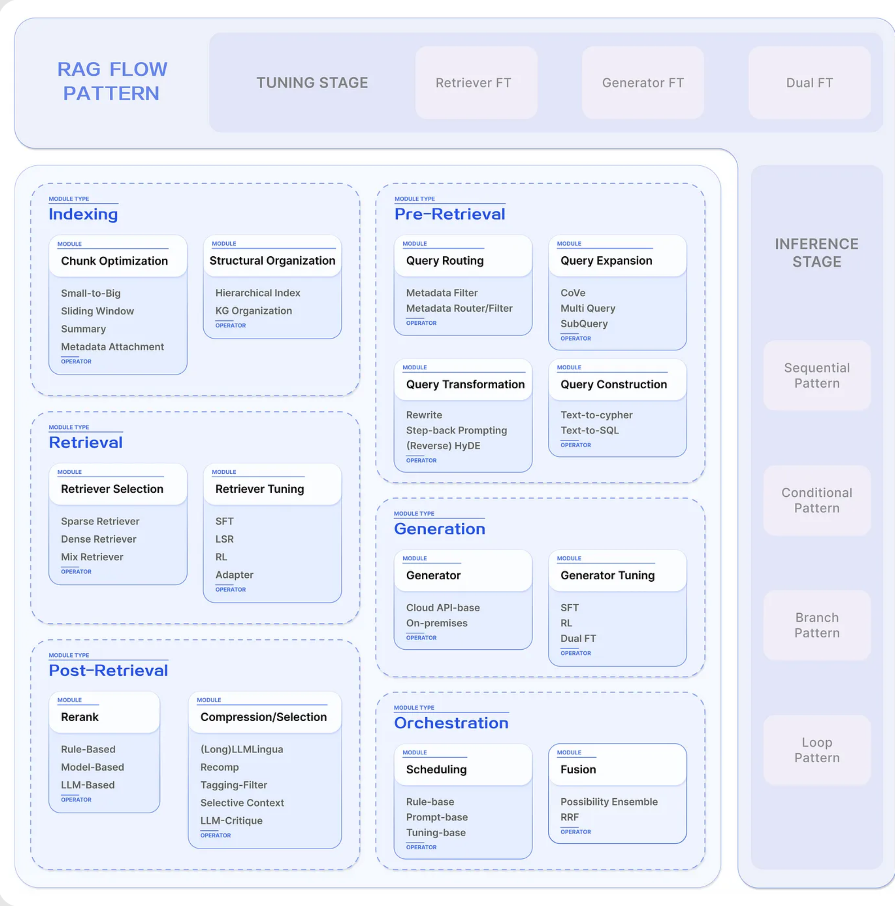
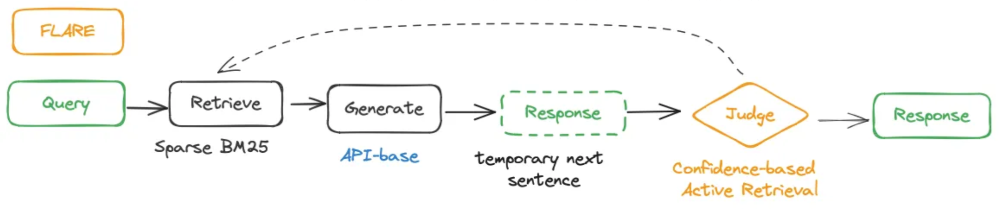

> 翻译自：
>
> [Modular RAG and RAG Flow: Part Ⅰ](https://medium.com/@yufan1602/modular-rag-and-rag-flow-part-%E2%85%B0-e69b32dc13a3)
>
> [Modular RAG and RAG Flow: Part II](https://medium.com/@yufan1602/modular-rag-and-rag-flow-part-ii-77b62bf8a5d3)

# 模块化RAG与RAG的流程

# 介绍

在过去的一年里，检索-增强生成（RAG）作为一种实现LLM应用程序的方法的概念引起了相当大的关注。我们撰写了一篇关于 RAG 的综合调查，深入研究了从朴素 RAG 到高级 RAG 和模块化 RAG 的转变。然而，该调查主要通过增强（例如增强源/阶段/过程）的视角来审查 RAG 技术。

本文将特别关注模块化 RAG 范式。我们进一步定义了一个三层模块化 RAG 范式，包括模块类型、模块和操作员。在此范式下，我们阐述了当前RAG系统中的核心技术，包括6大模块类型、14模块和40+操作，旨在提供对RAG的全面理解。

通过编排不同的操作，我们可以派生出各种 RAG 流，这是我们在本文中旨在阐明的概念。通过广泛的研究，我们提炼并总结了典型模式、几个具体的实施案例和最佳行业案例。（由于篇幅有限，这一部分将在第二部分讨论。）

本文的目的是对 RAG 开发的现状提供更深入的理解，并为未来的发展铺平道路。模块化 RAG 提供了大量机会，有助于定义新的操作员、模块和配置新的流程。

# 什么是模块化 RAG？

模块化RAG是指检索增强生成技术的一种演进形式，其进展带来了更加多样化和灵活的过程，具体体现在以下关键方面：

1. **增强数据获取**：RAG已经超越了传统的非结构化数据，现在包括半结构化和结构化数据，在预处理结构化数据方面更加关注，以改善检索并减少模型对外部知识来源的依赖。
2. **整合技术**：RAG正在整合其他技术，包括微调、适配器模块和强化学习，以增强检索能力。
3. **可适应的检索过程**：检索过程已经发展到支持多轮检索增强，利用检索内容来指导生成，反之亦然。此外，自主判断和LLM的使用增加了通过确定检索的需求来回答问题的效率。

## **模块化RAG的定义**

上面，我们可以看到 RAG 的快速发展已经超越了 Chain 式的高级 RAG 范式，展现了模块化的特性。为了解决当前缺乏组织和抽象的问题，我们提出了一种模块化 RAG 方法，该方法无缝集成了 Naive RAG 和高级 RAG 的开发范式。

模块化 RAG 提供了一个高度可扩展的范式，将 RAG 系统划分为模块类型、模块和操作员的三层结构。每个模块类型代表 RAG 系统中的一个核心进程，包含多个功能模块。反过来，每个功能模块都包含多个特定的运算符。整个 RAG 系统成为多个模块和相应操作的排列和组合，形成了我们所说的 RAG Flow。在Flow中，可以在每种模块类型中选择不同的功能模块，并且在每个功能模块中可以选择一个或多个操作员。

### **与先前范式的关系**

模块化 RAG 以多层模块化形式组织 RAG 系统。Advanced RAG 是 RAG 的模块化形式，而 Naive RAG 是 Advanced RAG 的特例。这三种范式之间的关系是传承与发展的关系。

### **模块化 RAG 的机遇**

模块化 RAG 的好处是显而易见的，它为现有的 RAG 相关工作提供了全新而全面的视角。通过模块化组织，清晰地总结了相关技术和方法。

- **研究视角**。模块化 RAG 具有高度可扩展性，便于研究人员在全面了解当前 RAG 开发的基础上提出新的模块类型、模块和操作。
- **应用视角**。RAG系统的设计和构建变得更加方便，允许用户根据现有数据、使用场景、下游任务等需求定制RAG Flow。开发人员还可以参考当前的 Flow 构建方法，并根据不同的应用场景和领域定义新的流程和模式。

# 模块类型 — 模块 — 运算符

> *在本章中，我们将深入研究三层结构，并构建RAG的技术路线图。由于篇幅有限，我们将避免深入研究技术细节；但是，将提供全面的参考资料以供进一步阅读。*

## 1. Indexing 索引 

索引是将文本分解为可管理的块的过程，在组织系统中是一个至关重要的步骤，面临着三个主要挑战：

- **不完整的内容表示**。块的语义信息受到分割方法的影响，在更长的上下文中会导致重要信息的丢失或被淹没。
- **不准确的块相似性搜索**。随着数据量的增加，检索中的噪音增加，导致频繁与错误数据匹配，使检索系统变得脆弱且不可靠。
- **引用轨迹不清晰**。检索到的块可能来自任何文档，缺乏引用轨迹，可能导致存在来自多个不同文档的块，尽管在语义上相似，但包含的内容却是完全不同的主题。

### 1.1 Chunk Optimization 块优化

较大的块可以捕捉更多的上下文，但也会产生更多的噪音，需要更长的处理时间和更高的成本。而较小的块可能无法完全传达所需的上下文，但它们的噪音较少。

#### Sliding Window 滑动窗口

平衡这些需求的一种简单方法是使用重叠的块。通过使用滑动窗口，语义转换得到增强。然而，存在一些限制，包括对上下文大小的控制不够精确，截断单词或句子的风险，以及缺乏语义考虑。

#### Small-to-Big 从小到大

关键思想是将用于检索的块与用于合成的块分开。使用较小的块可以提高检索的准确性，而较大的块可以提供更多的上下文信息。

具体而言，一种方法可能涉及检索较小的块，然后引用父 ID 以返回较大的块。或者，可以检索单个句子，并返回句子的周围文本窗口。

#### Summary 总结

它类似于 Small-to-Big 概念，其中首先生成较大块的摘要，然后对摘要执行检索。随后，可以对较大的块进行二次检索。

### 1.2 Metadata Attachment  元数据附加

块可以使用元数据信息进行丰富，例如页码、文件名、作者、时间戳、摘要，或者块可以回答的问题。随后，可以根据此元数据过滤检索，从而限制搜索范围。

### 1.3 Structural Oraginzation 结构化组织

提高信息检索效率的一种有效方法是为文档建立分层结构。通过构建块结构，RAG系统可以加速检索和处理相关数据。

#### Hierarchical Index 层次化索引

在文档的层次结构中，节点按照父子关系排列，与之关联的块链接到这些节点上。数据摘要存储在每个节点上，有助于快速遍历数据，并帮助RAG系统确定要提取的块。这种方法还可以缓解由块提取问题引起的幻觉。

构建结构化索引的方法主要包括：

- **结构意识**。对文档进行段落和句子分割。
- **内容意识**。利用PDF、HTML、Latex等文件的内在结构。
- **语义意识**。基于NLP技术，如利用NLTK，对文本进行语义识别和分割。

> 可以看一下[Arcus](https://www.arcus.co/blog/rag-at-planet-scale)在大规模RAG实现下的层次索引

#### KG Organization Docs知识图谱文档组织

在构建文档的层次结构时，利用知识图谱（KGs）有助于保持一致性。它描述了不同概念和实体之间的关系，显著降低了幻觉的可能性。

另一个优点是将信息检索过程转换为LLM可以理解的指令，从而提高知识检索的准确性，并能够LLM生成上下文连贯的响应，从而提高RAG系统的整体效率。

> 可参考 [Neo4j implementation](https://neo4j.com/developer-blog/advanced-rag-strategies-neo4j/)和 [LllmaIndex Neo4j query ](https://docs.llamaindex.ai/en/stable/examples/index_structs/knowledge_graph/Neo4jKGIndexDemo.html)引擎.

对于使用KG组织多个文档，可以参考这篇研究论文 [KGP : Knowledge Graph Prompting for Multi-Document Question Answering](https://arxiv.org/abs/2308.11730).

> [Knowledge Graph Prompting: A New Approach for Multi-Document Question Answering](https://medium.com/@alcarazanthony1/knowledge-graph-prompting-a-new-approach-for-multi-document-question-answering-ab5c4006a429)

## 2. Pre-Retrieval 预检索 

Naive RAG 的主要挑战之一是它直接依赖用户的原始查询作为检索的基础。制定一个准确而清晰的问题是困难的，轻率的查询会导致检索效率不达标。

此阶段的主要挑战包括：

- **措辞不当的查询**。问题本身很复杂，语言组织得不好。
- **语言的复杂性和歧义性**。语言模型在处理具有多种含义的专用词汇或模棱两可的缩写时经常会遇到困难。例如，他们可能无法辨别“LLM”是指**大型语言模型**还是**法律背景下的法学硕士**。

### 2.1 Query Expansion 查询扩展

将单个查询扩展为多个查询可以丰富查询的内容，提供进一步的上下文来解决任何缺乏特定细微差别的问题，从而确保生成的答案具有最佳相关性。

#### Multi-Query 多查询

通过使用提示工程来扩展查询LLMs，然后可以并行执行这些查询。查询的扩展不是随机的，而是精心设计的。此设计的两个关键标准是查询的多样性和覆盖范围。

使用多个查询的挑战之一是可能会稀释用户的原始意图。为了缓解这种情况，我们可以指示模型在提示工程中为原始查询分配更大的权重。

#### Sub-Query 子查询

子问题规划的过程代表了必要子问题的生成，以便在组合时将原始问题置于上下文中并完全回答。原则上，添加相关上下文的过程类似于查询扩展。具体来说，可以使用从最少到最多的提示方法将一个复杂的问题分解为一系列更简单的子问题。

> [Sub Question Query Engine - LlamaIndex](https://docs.llamaindex.ai/en/stable/examples/query_engine/sub_question_query_engine.html)

#### CoVe 验证链

查询扩展的另一种方法是使用 Meta AI 提出的验证链 （CoVe）。扩展的查询经过验证LLM，以达到减少幻觉的效果。经过验证的扩展查询通常表现出更高的可靠性。

### 2.2 Query Transformation 查询转换

> *使用转换后的查询（而不是用户的原始查询）进行检索和生成。*

#### Rewrite 重写

原始查询并不总是检索LLM的最佳选择，尤其是在实际场景中。因此，我们可以提示LLM重写查询。除了用于LLM查询重写之外，还可以使用专门的较小语言模型，例如 RRR（Rewrite-retrieve-read）。

在淘宝推广系统中实施的查询重写方法，即 [**BEQUE:Query Rewriting for Retrieval-Augmented Large Language Models**](https://arxiv.org/abs/2305.14283)，显著增强了长尾查询的召回效率，导致GMV上升。

#### HyDE 假设文档嵌入

响应查询时，LLM构造假设文档（假定答案），而不是直接在向量数据库中搜索查询及其计算向量。它侧重于嵌入答案之间的相似性，而不是为问题或查询寻求嵌入相似性。此外，它还包括 Reverse HyDE，它专注于从一个查询到另一个查询的检索

HyDE 和 Reverse HyDE 的核心思想是弥合查询和答案之间的映射。

>  [Advanced RAG — Improving retrieval using Hypothetical Document Embeddings(HyDE)](https://medium.aiplanet.com/advanced-rag-improving-retrieval-using-hypothetical-document-embeddings-hyde-1421a8ec075a)

#### Step-back Prompting 后退提示

使用 Google DeepMind 提出的 Step-back Prompting 方法，将原始查询抽象化，生成一个高级概念问题（step-back question）。在 RAG 系统中，后退问题和原始查询都用于检索，并且这两个结果都用作语言模型答案生成的基础。

> [A New Prompt Engineering Technique Has Been Introduced Called Step-Back Prompting](https://cobusgreyling.medium.com/a-new-prompt-engineering-technique-has-been-introduced-called-step-back-prompting-b00e8954cacb)

### 2.3 Query Routing 查询路由

根据不同的查询，路由到不同的RAG流水线，适用于为适应不同场景而设计的多功能RAG系统。

#### Metadata Router/ Filter 元数据路由器/过滤器

第一步涉及从查询中提取关键字（实体），然后根据块中的关键字和元数据进行筛选，以缩小搜索范围。

#### Semantic Router 语义路由器

另一种路由方法涉及利用查询的语义信息。当然，也可以采用混合路由方法，将语义和基于元数据的方法结合起来，以增强查询路由。

> [Beyond Basic Chatbots: How Semantic Router is Changing the Game](https://medium.com/ai-insights-cobet/beyond-basic-chatbots-how-semantic-router-is-changing-the-game-783dd959a32d)

### 2.4 Query Construction 查询构造

将用户的查询转换为另一种查询语言以访问备用数据源。常用方法包括：

- Text-to-Cypher
- Text-to-SQL

在许多情况下，结构化查询语言（例如 SQL、Cypher）通常与语义信息和元数据结合使用，以构建更复杂的查询。具体详情请参考 [Langchain 博客](https://blog.langchain.dev/query-construction/)。

## 3. Retrieval 检索

检索过程在 RAG 中起着至关重要的作用。利用强大的 PLM 可以在潜在空间中有效地表示查询和文本，从而促进在问题和文档之间建立语义相似性以支持检索。需要考虑三个主要因素：

- **Retrieval Efficiency 检索效率**
- **Embedding Quality 嵌入质量**
- **Alignment of tasks , data and models
  任务、数据和模型的一致性**

### 3.1 Retriver Selection 检索器的选择

自 ChatGPT 发布以来，嵌入模型的发展掀起了一股狂潮。Hugging Face 的 MTEB 排行榜评估了 8 个任务中几乎所有可用的嵌入模型——聚类、分类、双文本明、对分类、重新排名、检索、语义文本相似度 （STS） 和摘要，涵盖 58 个数据集此外，C-MTEB 专注于评估中文嵌入模型的能力，涵盖 6 个任务和 35 个数据集。

在构建 RAG 应用程序时，对于“使用哪种嵌入模型”，没有一个放之四海而皆准的答案。但是，您可能会注意到，特定嵌入更适合特定用例。

> [Massive Text Embedding Benchmark (MTEB) Leaderboard](https://huggingface.co/spaces/mteb/leaderboard)

#### Sparse Retriever 稀疏检索器

虽然稀疏编码模型可能被认为是一种有些过时的技术，通常基于词频统计等统计方法，但由于其更高的编码效率和稳定性，它们仍然占有一定的地位。常见的系数编码模型包括 BM25 和 TF-IDF。

#### Dense Retriever 密集检索器

基于神经网络的密集编码模型包括以下几种类型：

- 基于 BERT 架构构建的编码器-解码器语言模型，例如 ColBERT。
- 全面的多任务微调模型，如 BGE 和 Baichuan-Text-Embedding。
- 基于云 API 的模型，例如 OpenAI-Ada-002 和 Cohere Embedding。
- 下一代加速编码框架 Dragon+，专为大规模数据应用而设计。

#### Mix/hybrid Retrieval 混合检索

两种嵌入方法捕获不同的相关性特征，并且可以通过利用互补的相关性信息来相互受益。例如，稀疏检索模型可用于为训练密集检索模型提供初始搜索结果。此外，PLM 可用于学习术语权重，以增强稀疏检索。具体而言，它还证明了稀疏检索模型可以增强密集检索模型的零样本检索能力，并协助密集检索器处理包含稀有实体的查询，从而提高鲁棒性。

图片来自 [IVAN ILIN：Advanced RAG Techniques： an Illustrated Overview](https://pub.towardsai.net/advanced-rag-techniques-an-illustrated-overview-04d193d8fec6)

### 3.2 Retriever Fine-tuning 检索器微调

如果上下文可能与预训练模型在嵌入空间中认为相似的情况不同，特别是在高度专业化的领域，如医疗保健、法律和其他专有术语丰富的领域，调整嵌入模型可以解决这个问题。虽然这种调整需要额外的努力，但它可以大大提高检索效率和域对齐。

#### SFT 技术

您可以根据特定于域的数据构建自己的微调数据集，这项任务可以使用 LlamaIndex 快速完成。

#### LSR (LM-supervised Retriever) 基于语言模型的有监督检索器

与直接从数据集构建微调数据集相比，LSR 利用 LM 生成的结果作为监督信号，在 RAG 过程中对嵌入模型进行微调。

#### RL(Reinforcement learning) 强化学习

受RLHF（Reinforcement Learning from Human Feedback）的启发，利用基于LM的反馈通过强化学习来强化检索器。

#### Adapter 适配器

有时，微调整个检索器的成本可能很高，尤其是在处理无法直接微调的基于 API 的检索器时。在这种情况下，我们可以通过合并适配器模块并进行微调来缓解这种情况。添加适配器的另一个好处是能够更好地与特定的下游任务保持一致。

- **特定任务**：[PRCA: Fitting Black-Box Large Language Models for Retrieval QuestionAnswering via Pluggable Reward-Driven Contextual Adapter. ](https://arxiv.org/pdf/2310.18347.pdf) 拟合黑匣子大型语言模型，通过可插拔奖励驱动的上下文适配器进行检索问题回答。
- **未知任务（Task Agnostic）**：AAR（[Augmentation -Adapted Retriver](https://arxiv.org/abs/2305.17331)）引入了一个通用适配器，旨在适应多个下游任务。

## 4. Post-Retrieval 后检索

检索整个文档块并将它们直接LLM输入到上下文环境中并不是最佳选择。对文档进行后处理有助于LLM更好地利用上下文信息。主要挑战包括：

- [**Lost in the middle**](https://arxiv.org/abs/2307.03172)**迷失在中间**。像人类一样，往往只记住长文本的开头和结尾，LLM而忘记中间部分。
- **Noise/anti-fact chunks噪音/反事实块**。检索到的嘈杂或事实矛盾的文档可能会影响最终的检索生成。
- **Context Window上下文窗口**。尽管检索了大量相关内容，但大型模型中上下文信息长度的限制阻止了包含所有这些内容。

### 4.1 Rerank 重新排名

在不更改其内容或长度的情况下对检索到的文档块进行重新排序，以增强 LLM。具体而言：

#### Rule-base Rerank 规则库重新排名

根据某些规则，计算指标以重新排列块。常见指标包括：

- Diversity 多样性
- Relevance 关联
- MRR (Maximal Marginal Relevance，最大边际相关性， 1998)

MMR 背后的想法是减少冗余并增加结果多样性，它用于文本摘要。MMR 根据查询相关性和信息新颖性的综合标准在最终关键短语列表中选择短语。

> [Enhancing RAG Pipelines in Haystack: Introducing DiversityRanker and LostInTheMiddleRanker](https://towardsdatascience.com/enhancing-rag-pipelines-in-haystack-45f14e2bc9f5)

#### Model-base Rerank 基于模型的重新排名

利用语言模型对文档块进行重新排序，选项包括：

- BERT 系列的编码器-解码器型号，例如 SpanBERT
- 专门的重新排名模型，例如 Cohere rerank 或 bge-raranker-large
- 通用大型语言模型，如 GPT-4

### 4.2 Compression and Selection 压缩和选择

RAG 过程中的一个常见误解是认为检索尽可能多的相关文档并将它们连接起来以形成冗长的检索提示是有益的。然而，过多的语境会引入更多的噪音，降低对LLM关键信息的感知，导致“迷失在中间”等问题。解决此问题的常用方法是压缩并选择检索到的内容。

#### LLMLingua

通过利用对齐和训练的小型语言模型，例如 GPT-2 Small 或 LLaMA-7B，可以从提示中检测和删除不重要的标记，将其转换为人类难以理解但易于理解的形式LLMs。这种方法提供了一种直接而实用的即时压缩方法，无需额外的训练，LLMs同时平衡语言完整性和压缩比。

> [LLMLingua | Explore the special language for LLMs via Prompt Compression](https://wyydsb.xin/NLP/LLMLingua_en.html)

#### Recomp

Recomp 引入了两种类型的压缩器：一种是从检索到的文档中选择相关句子的提取式压缩器，另一种是通过合并来自多个文档的信息来生成简明摘要的抽象压缩器。当生成的摘要附加到语言模型的输入之前时，这两个压缩器都经过训练，可以增强语言模型在最终任务上的性能，同时确保摘要的简洁性。如果检索到的文档与输入无关或未向语言模型提供其他信息，压缩器可以返回空字符串，从而实现选择性增强。

#### Selective Context 选择性上下文

通过**识别和删除输入上下文中的冗余内容**，可以简化输入，从而提高语言模型的推理效率。[Selective Context](https://aclanthology.org/2023.emnlp-main.391.pdf) 类似于“停用词删除”策略。在实践中，选择性语境基于基础语言模型计算出的自信息来评估词汇单元的信息内容。通过保留具有较高自我信息的内容，该方法为语言模型处理提供了更简洁、更高效的文本表示，而不会影响它们在不同应用程序中的性能。但是，它忽略了压缩内容之间的相互依赖关系，以及目标语言模型与用于提示压缩的小型语言模型之间的一致性。

#### Tagging-Filter 标记过滤器

标记是一种相对直观和直接的方法。具体而言，首先对文档进行标记，然后根据查询的元数据进行筛选。

> [Tagging | Langchain](https://python.langchain.com/docs/use_cases/tagging)

#### LLM-Critique LLM-批评

另一种简单有效的方法是在生成最终答案之前LLM评估检索到的内容。这允许LLM通过LLM批评过滤掉相关性较差的文档。例如，在Chatlaw中，提示对LLM引用的法律条款进行自我建议，以评估其相关性。

## 5. Generation 生成

利用 LLM 根据用户的查询和检索到的上下文信息生成答案。

### 5.1 Generator Selection 生成器选择

根据方案的不同，可以选择LLM分为以下两种类型：

#### Cloud API-base Generator 基于云 API 的生成器

基于云 API LLMs 通过调用第三方的 API 来利用第三方，例如 OpenAI 的 ChatGPT、GPT-4 和 Anthropic Claude 等。好处：

- No server pressure 没有服务器压力
- High concurrency 高并发
- Ability to use more powerful models 能够使用更强大的模型

缺点：

- Data passes through third parties, leading to data privacy concerns 数据通过第三方传递，导致数据隐私问题
- Inability to adjust the model (in the vast majority of cases) 无法调整模型（在绝大多数情况下）

#### On-Premises 本地

本地部署开源或自研LLMs，如Llama系列、GLM等。优点和缺点与基于 Cloud API 的模型相反。本地部署的模型提供了更大的灵活性和更好的隐私保护，但需要更多的计算资源。

### 5.2 Generator Fine-tuning  生成器微调

除了直接LLM使用外，根据场景和数据特征进行有针对性的微调可以产生更好的结果。这也是使用本地设置的最大优势之一。常见的微调方法包括：

#### SFT技术

当特定领域缺乏数据时LLMs，可以通过微调向其LLM提供额外的知识。Huggingface的微调数据也可以用作初始步骤。

微调的另一个好处是能够调整模型的输入和输出。例如，它可以适应LLM特定的数据格式，并按照指示生成特定样式的响应。

#### RL 强化学习

通过强化学习使LLM输出与人类或检索器的偏好保持一致是一种潜在的方法。例如，手动注释最终生成的答案，然后通过强化学习提供反馈。除了与人类偏好保持一致外，还可以与微调模型和检索器的偏好保持一致。

#### Distillation 蒸馏

当情况阻止访问强大的专有模型或更大参数的开源模型时，一种简单有效的方法是提炼更强大的模型（例如 GPT-4）。

Dual FT 双FT

微调 Generator 和 Retriever 以调整它们的偏好。典型的方法，如 [RA-DIT](https://arxiv.org/pdf/2310.01352.pdf)，使用 KL 散度来对齐 Retriever 和 Generator 之间的评分函数。

## 6. Orchestration 编排

编排是指用于控制 RAG 进程的模块。RAG 不再遵循固定的流程，它涉及在关键点做出决策并根据结果动态选择下一步。与Naive RAG相比，这也是模块化RAG的主要特征之一。

### 6.1 Scheduling 调度

Judge 模块评估 RAG 流程中的关键点，确定检索外部文档存储库的必要性、答案的满意度以及进一步探索的必要性。它通常用于递归、迭代和自适应检索。具体来说，主要包括以下两个操作：

#### Rule-base 基于规则

下一个行动方案是根据预定义的规则确定的。通常，对生成的答案进行评分，然后根据分数是否达到预定义的阈值来决定继续或停止。常见的阈值包括token的置信度。

#### Prompt-base 基于提示

LLM自主决定下一步行动方案。主要有两种方法可以实现这一点。第一种是提示LLM根据对话历史进行反思或做出判断，如ReACT框架所示。这样做的好处是无需对模型进行微调。但是，判断的输出格式取决于LLM对指令的遵守情况。提示基本情况是 [FLARE](https://arxiv.org/pdf/2305.06983.pdf)。

#### Tuning-base 基于调整

第二种方法涉及LLM生成特定的token来触发特定的操作，这种方法可以追溯到Toolformer，并应用于RAG，例如Self-RAG。

### 6.2 Fusion 融合

这个概念起源于RAG Fusion。如上一节中有关查询扩展的部分所述，当前的 RAG 进程不再是单个管道。它通常需要通过多个分支来扩大检索范围或多样性。因此，在扩展到多个分支后，依靠 Fusion 模块来合并多个答案。

#### Possibility Ensemble 可能性合奏

融合方法基于多个 beranches 生成的不同代币的加权值，从而对最终输出进行综合选择。主要采用加权平均法。请参见 [REPLUG](https://arxiv.org/pdf/2301.12652.pdf)。

#### RRF (Reciprocal Rank Fusion 倒数排序融合)

RRF是一种将多个搜索结果列表的排名组合在一起以生成单个统一排名的技术。RRF 是与滑铁卢大学 （CAN） 和 Google 合作开发的，它产生的结果比在任何单个分支下重新排序块更有效。

> [Forget RAG, the Future is RAG-Fusion](https://towardsdatascience.com/forget-rag-the-future-is-rag-fusion-1147298d8ad1)
>
> [Advanced RAG Techniques: an Illustrated Overview](https://pub.towardsai.net/advanced-rag-techniques-an-illustrated-overview-04d193d8fec6)

> **在第一部分中，我们主要讨论了模块化RAG（模块类型-模块-操作）的三层结构，并简要提到了RAG Flow的概念。**
>
> **定义 Module 和 Operator 后，它们可以帮助我们从流的角度查看各种 RAG 方法。每个 RAG 都可以与一组操作员一起布置。**
>
> **那么，在模块化RAG的范式下，我们应该如何设计我们的RAG系统呢？在后半部分，我们将深入探讨典型的 RAG Flow 模式、特定的 RAG Flow 实现和最佳行业案例。**

# 典型的 RAG 流程和实现

首先，让我们探讨 RAG 流程的典型模式，以及每个模板下的特定流程，说明如何编排不同的模块和操作。

在 RAG Flow 的上下文中，我们将**微调阶段**拆解三个不同的流程，将**推理阶段**拆解四个不同的流程。

## 微调阶段

> *Retriever Fine-tuning, Generator Fine-tuning, and Dual Fine-tuning.*
>
> 检索器微调，生成器微调，以及双重微调

### 检索器微调

在 RAG Flow 中，微调检索器的常用方法包括：

- **检索器的直接微调**：构建一个专门的数据集，用于检索和微调密集的猎犬。例如，使用开源检索数据集或基于特定于域的数据构建一个数据集。
- **添加可训练的适配器模块**：有时，对基于 API 的嵌入模型（例如 OpenAI Ada-002 和 Cohere）进行直接微调是不可行的。合并适配器模块可以增强数据的表示形式。此外，适配器模块有助于更好地与下游任务保持一致，无论是针对特定任务（例如 [PCRA](https://arxiv.org/pdf/2310.18347.pdf)）还是通用用途（例如 [AAR](https://arxiv.org/abs/2305.17331)）。
- **基于语言模型的有监督检索（LM-supervised Retrieval ,LSR)**：微调基于【大语言模型生成的结果】的检索器
- **大语言模型奖励强化学习**：仍然使用LLM输出结果作为监督信号。采用强化学习将检索器与生成器对齐。整个检索过程以生成马尔可夫链的形式进行拆解。

检索器微调的典型RAG流程

### 生成器微调

在 RAG Flow 中微调生成器的主要方法包括：

- **直接微调**：通过外部数据集进行微调可以为生成器补充额外的知识。另一个好处是能够自定义输入和输出格式。通过设置Q&A格式，LLM可以理解特定的数据格式并根据指令输出。
- **GPT-4 蒸馏**：在使用开源模型的本地部署时，一种简单有效的方法是使用 GPT-4 批量构建微调数据，以增强开源模型的能力。
- **从【人类反馈/大语言模型】中进行强化学习**。基于最终生成答案的反馈的强化学习。除了使用人工评估外，GPT-4 还可以充当评估法官。

生成器微调的典型RAG流程

### 双重微调

在 RAG 系统中，同时微调检索器和发生器是 RAG 系统的独特功能。需要注意的是，系统微调的重点是检索器和生成器之间的协调。分别对检索器和生成器进行微调属于前面两部分，而不是双重微调的一部分。

双重微调的典型RAG流型

一个典型的实现是 [RA-DIT](https://arxiv.org/abs/2310.01352)，它对 LLM 和 retriever 进行微调。LM-ft 组件更新 以最大限度地提高给定检索增强指令正确答案的可能性，而 R-ft 组件更新LLM检索器以最小化检索器分数分布与LLM偏好之间的 KL 散度。

该框架使用本地 Llama 作为生成器，并使用最先进的基于双编码器的密集检索器 DRAGON+ 作为检索器。

在 [REPLUG](https://arxiv.org/abs/2301.12652) 之后，RA-DIT 会根据语言模型提示检索相关的文本块。每个检索到的块都附加在提示符之前，并且来自多个块的预测被并行计算，并通过加权可能性进行集成以产生最终输出。

RA-DIT 中的 RAG 流

## 推理阶段

在推理阶段，我们提炼了四种典型的 RAG 流程。

### 顺序

RAG Flow 的顺序结构将 RAG 的模块和运算符组织在线性流水线中，如下图所示。如果它同时包含检索前和检索后模块类型，则表示典型的 Advanced RAG 范例；不然就是典型的 Naive RAG 范式。

顺序 RAG 流程

目前使用最广泛的 RAG Pipeline 是 Sequential，它通常包括检索前的 Query Rewrite 或 HyDE 以及检索后的 Rerank 运算符，比如在 [QAnything](https://github.com/netease-youdao/QAnything) 这个例子中。

最常用的顺序 RAG 流

[Rewrite-Retrieve-Read](https://arxiv.org/pdf/2305.14283.pdf) （RRR） 也是一种典型的顺序结构。查询重写模块是一个较小的可训练语言模型，在强化学习的上下文中，重写器的优化被形式化为马尔可夫决策过程，LLM最终输出作为奖励。该检索器使用稀疏编码模型 BM25。

RRR 中的 RAG 流程

### 条件

具有条件结构的 RAG 流涉及根据不同的条件选择不同的 RAG 通路。通常，这是通过路由模块完成的，该模块根据查询关键字或语义确定路由。

根据问题的类型选择不同的路线，针对特定场景针对不同的流程。例如，当用户询问严肃问题、政治问题或娱乐话题时，对大型模型答案的容忍度各不相同。不同的路由分支通常在检索源、检索过程、配置、模型和提示方面有所不同。

条件RAG流程

条件 RAG 的经典实现是 [Semantic Router](https://github.com/aurelio-labs/semantic-router)。

### 分支

具有分支结构的 RAG 流与条件方法的不同之处在于它涉及多个并行分支，而不是从条件方法中的多个选项中选择一个分支。在结构上，它可以分为两种类型：

- **预检索分支（多查询、并行检索）**。这涉及扩展原始查询以获取多个子查询，然后对每个子查询进行单独的检索。检索后，该方法允许根据子问题和相应的检索内容立即生成答案。或者，它可能涉及仅使用扩展的检索内容并将其合并到统一的上下文中以进行生成。
- **后检索分支（单查询、并行生成）**。此方法保留原始查询并检索多个文档块。随后，它同时使用原始查询和每个文档块进行生成，最后将生成的结果合并在一起。

分支RAG流程

REPLUG 体现了经典的**后检索分支**结构，其中每个标记的概率是针对每个分支预测的。通过加权可能性集成，将不同的分支进行聚合，最终生成结果用于通过反馈对称为 Contriever 的检索器进行微调。

### 循环

具有循环结构的 RAG 流是模块化 RAG 的一个重要特征，涉及相互依赖的检索和推理步骤。它通常包括一个用于流量控制的 Judge 模块。这可以进一步分为迭代、递归和自适应（主动）检索方法。

循环RAG流程

#### 迭代检索

> Iterative Retrieval 

有时，单次检索和生成可能无法有效解决需要广泛知识的复杂问题。因此，可以在 RAG 中使用迭代方法，通常涉及固定次数的迭代进行检索。

迭代检索的一个典型案例是[ITER-RETGEN](https://arxiv.org/abs/2305.15294)，它迭代检索-增强生成和生成-增强检索。检索增强生成根据所有检索到的知识输出对任务输入的响应。在每次迭代中，ITER-RETGEN都会利用上一次迭代的模型输出作为特定上下文，以帮助检索更多相关知识。循环的终止由预定义的迭代次数决定。

ITER-RETGEN中的RAG流程

#### 递归检索

> Recursive Retrieval

与迭代检索相反，递归检索的特征是它明显依赖于前一步，并且对检索的不断深化。通常，有一个终止机制作为递归检索的退出条件。在 RAG 系统中，递归检索通常涉及查询转换，依赖于每次检索的新重写查询。

ToC 中的 RAG 流程

递归检索（如 Tree of Clarification，ToC）的典型实现涉及递归执行**递归增强澄清**（Recursive Augmented Clarification，RAC），以从初始歧义问题 （AQ） 逐步将子节点插入到澄清树中。在每个扩展步骤中，都会根据当前查询执行段落重新排序，以生成消除歧义的问题 （DQ）。树的探索在达到最大有效节点数或最大深度时结束。一旦构建了澄清树，ToC 就会收集所有有效节点并生成一个全面的长文本答案来解决 AQ。

#### 自适应检索

> Adaptive(Active) Retrieval

随着 RAG 的进步，从被动检索逐渐转变为自适应检索（也称为主动检索）的出现，这在一定程度上归因于 LLM.这与 Agent 共享一个核心概念LLM。

RAG系统可以主动确定检索时间，并决定何时结束整个过程并产生最终结果。根据判断标准，这可以进一步分为基于提示的方法和基于调优的方法。

- **Prompt-base**：基于提示的方法涉及使用提示工程来控制流，以指导 LLM.一个典型的实现示例是 FLARE。它的核心概念是，语言模型应该只在缺乏基本知识时进行检索，以避免在增强的 LM 中进行不必要或不适当的检索。FLARE 以迭代方式生成下一个临时句子，并检查是否存在低概率标记。如果找到，系统将检索相关文档并重新生成句子。

FLARE 中的 RAG 流

- **Tuning-base**：基于调优的方法涉及微调LLM以生成特殊token，从而触发检索或生成。这个概念可以追溯到 Toolformer，其中特定内容的生成有助于调用工具。在 RAG 系统中，这种方法用于控制检索和生成步骤。一个典型的案例是Self-RAG。具体说来：

1. 给定输入提示和上一代结果，首先通过段落检索预测特殊标记“Retrieve”是否有助于增强续生成。
2. 如果需要检索，模型会生成：一个批评token，用于评估检索到的段落的相关性，下一个响应段，以及一个批评token，用于评估响应段中的信息是否得到该段落的支持。
3. 最后，评论token评估响应的整体效用，并选择最佳结果作为最终输出。

Self-RAG中的 RAG 流

# 最佳行业案例

在前面的章节中，我们深入研究了各种研究论文，其显着特点是强调解决具体的细节和复杂性。另一方面，RAG作为一种在工业领域大放异彩的技术脱颖而出，LLM能够应用于广泛的任务场景。本章将从 RAG Flow 的角度阐述几个行业领先的 RAG 实践，并就如何在实际应用场景中有效地组合和构建 RAG 流提供见解。

## OpenAI

[OpenAI’s Demo Day演示的见解](https://youtu.be/ahnGLM-RC1Y)并不完全代表 OpenAI 的实际操作。

为了提高 RAG 的成功率，OpenAI 团队从 45% 的准确率开始，并尝试了各种方法，以确定最终采用哪些方法进行生产。他们探索了假设的文档嵌入（HyDE）、微调嵌入和其他方法，但结果并不令人满意。通过试验不同大小的信息块并嵌入不同的内容部分，他们能够将准确率提高到 65%。通过重新排序和针对处理不同类型问题而量身定制的方法，他们进一步将准确率提高到 85%。最终，通过结合提示工程、查询扩展和其他方法，他们实现了 98% 的准确率。

OpenAI RAG 流程

该团队强调了模型微调和RAG集成的强大潜力，特别是在不使用复杂技术的情况下，仅通过简单的模型微调和提示工程来接近行业领先的水平。

## Baichuan

根据来自各种来源的公开信息，可用数据有限，作者对某些细节做出了一些推测性假设。查看[原文](https://mp.weixin.qq.com/s/Hy78rtJuJTehAJIC-HK2Rg)

百川从 Meta 的 CoVe 中汲取灵感，设计了一种方法，将复杂的提示解构为多个独立且可并行检索的搜索友好查询。这使得大型模型能够对每个子查询进行有针对性的知识库搜索，从而提供更准确、更详细的答案并减少虚假输出。此外，他们还利用其专有的 TSF（Think-Step Further）来推断和挖掘用户输入背后更深层次的潜在问题，从而更精确、更全面地了解用户意图。虽然 TSF 的技术细节尚未披露，但据推测它是后退提示方法的增强。

在检索步骤中，百川智能开发了百川文本嵌入向量模型，该模型在包含超过 1.5 万亿个代币的高质量中文数据上进行了预训练。他们通过专有的损失函数解决了对比学习中的批量大小依赖性问题。该矢量模型已经超越了C-MTEB。

他们还引入了稀疏检索和重新排序模型（未公开），形成了一种混合检索方法，将向量检索与稀疏检索并行相结合，将召回率显著提高到 95%。

此外，他们还引入了自我批评，使大型模型能够根据提示性、相关性和实用性对检索到的内容进行反省，并进行二次审查以选择最匹配和最高质量的候选内容。

百川RAG流程

鉴于整个百川RAG流中的众多分支以及缺乏具体披露，可以合理地推测，reranking和selection需要对所有材料进行重新排序和筛选，无论是从其他分支检索到的还是从其他分支产生的。

## Databricks

Databricks 作为大数据领域的领先服务提供商，在 RAG 设计方面保持了其独特的特点和优势。

当用户输入问题时，系统会从预处理的文本向量索引中检索相关信息，并结合提示工程来生成响应。上半部分，即非结构化数据管道，遵循主流的 RAG 方法，没有表现出任何特定的独特性。

Databricks RAG 流程

下半部分（结构化数据管道）表示 Databricks 的特征工程过程，是 Databricks RAG 实现的最重要方面。利用其在大数据方面的专业知识，Databricks 从其高度准确的数据存储中进行额外的检索，充分利用其在实时数据服务方面的优势。很明显，Databricks 在 GenAI 时代的战略是赋予 RAG 应用程序广泛的市场需求，将其强大的 Delta Lake 处理能力与生成式 AI 技术集成在一起，构建集成解决方案，并向其客户推广这种统一服务。

> [Retrieval Augmented Generation (RAG) on Databricks](https://docs.databricks.com/en/generative-ai/retrieval-augmented-generation.html)

# 总结

本文描述了三种微调阶段模式、四种推理阶段模式，以及七篇论文和三种行业最佳实践中的具体流程实现。总体框架如下图所示。

正如我们在第 1 部分中提到的，在这个技术快速进步的时代，RAG 范式的总结和抽象至关重要。必须超越具体的实现，从更高的维度理解当前的技术特点和趋势，才能把握未来的发展方向。

