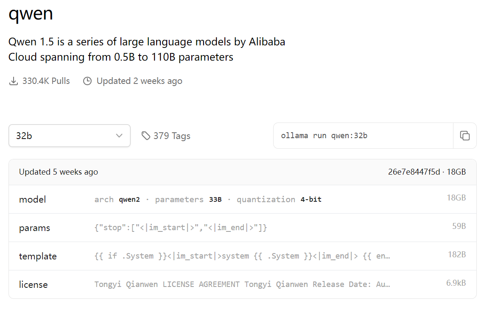
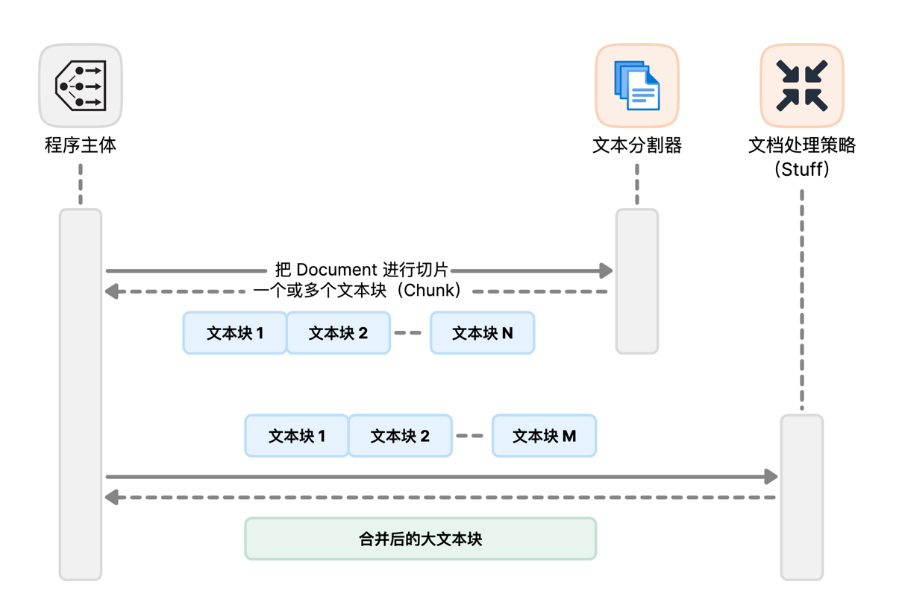
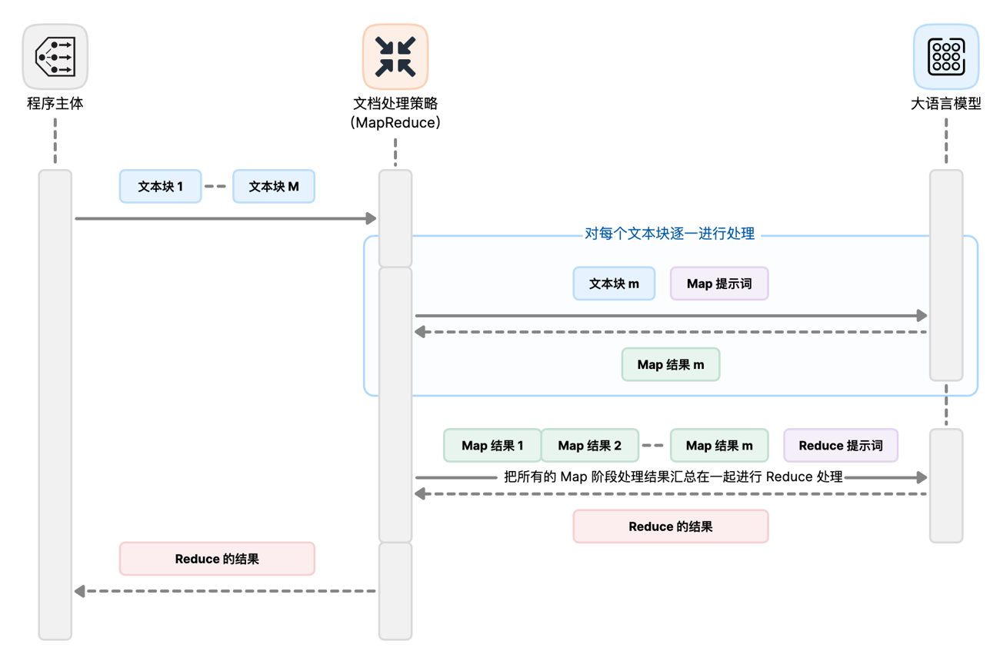
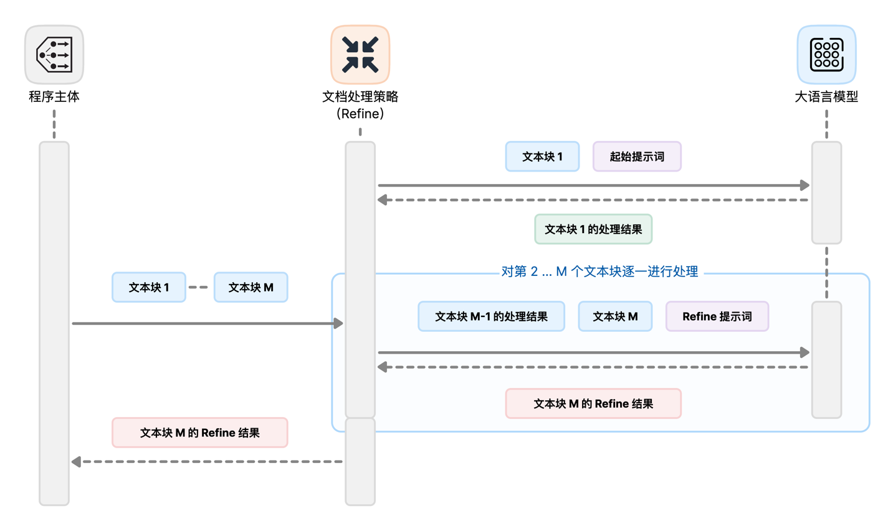
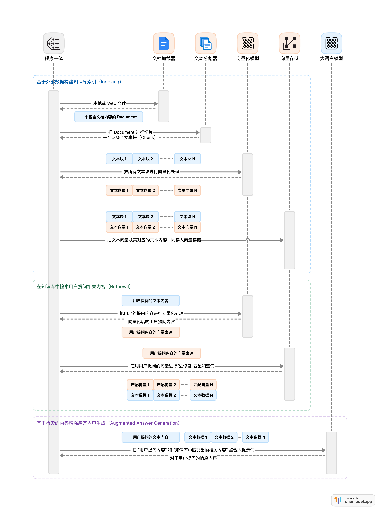

> 本文是《LangChain实战：从原型到生产，动手打造LLM应用》一书的笔记

# 环境准备

- Ollama
    - 下载：https://ollama.com
    
    - 源码：https://github.com/ollama/ollama
    
    - 文档：https://github.com/ollama/ollama/tree/main/docs
    
    - 模型
        - Llama 2 Chinese：https://ollama.com/library/llama2-chinese
        
          ```bash
          ollama pull llama2-chinese:13b
          ```
        
        - Mistral：https://ollama.com/library/mistral
        
        - Yi：https://ollama.com/library/yi
        
        - Qwen：https://ollama.com/library/qwen

- Langchain

```bash
pip install langchain langchain-core langchain-community
# langchain版本
# langchain                0.1.20
# langchain-community      0.0.38
# langchain-core           0.1.52
```


# 角色扮演写作实战

```python
from langchain_core.prompts import ChatPromptTemplate
from langchain_core.output_parsers import StrOutputParser
from langchain_community.chat_models import ChatOllama

# 设定系统上下文，构建提示词
template = """请扮演一位资深的技术博主，您将负责为用户生成适合在微博发送的中文帖文。
请把用户输入的内容扩展成 140 字左右的文字，并加上适当的 emoji 使内容引人入胜并专业。"""
prompt = ChatPromptTemplate.from_messages([("system", template), ("human", "{input}")])

# 通过 Ollama 加载 Llama 2 13B 对话补全模型
model = ChatOllama(model="llama2-chinese:13b")

# 通过 LCEL 构建调用链并执行得到文本输出
chain = prompt | model | StrOutputParser()
chain.invoke({ "input": "给大家推荐一本新书《LangChain实战》，让我们一起开始来学习 LangChain 吧！"})
# 📚 "LangChain 实战" 是一本适合初学者和高级程序员的书籍，它深入介绍了 LangChain 的应用场景，并提供了多种实践例子。
#🤔 "LangChain" 是一个语言模型，它可以在不同的平台上使用，包括 Android、iOS 等。通过学习 LangChain，您可以编写更高效、更灵活的代码。
#💻 "LangChain 实战" 是一本完全免费的书籍，并提供了多种资源来帮助您开始学习 LangChain。
#👏 "LangChain 实战" 已经在多个平台上有好评，建议大家一起来看看！
#📺 如果您想了解更多关于 LangChain 的内容，可以查看这些视频教程：https://www.langchain.com/videos
#LangChain #Programming #BookRecommendation
```

## Model IO三元组

### Prompt

- 默认情况下，提示词模板使用Python的str.format语法进行模板化

```python
# 使用PromptTemplate类来构建带参数的提示词
from langchain_core.prompts import PromptTemplate

prompt_template = PromptTemplate.from_template(
    "Tell me a {adjective} joke about {content}."
)
prompt_template.format(adjective="funny", content="rabbit")
# 'Tell me a funny joke about rabbit.'
```

```python
# 使用PromptTemplate类创建以下聊天提示词模板
from langchain_core.prompts import ChatPromptTemplate

chat_template = ChatPromptTemplate.from_messages(
    [
        ("system", "You are a helpful AI bot. Your name is {name}."),
        ("human", "Hello, how are you doing?"),
        ("ai", "I'm doing well, thanks!"),
        ("human", "{user_input}"),
    ]
)
chat_template.format_messages(name="Bob", user_input="What is your name?")
# [SystemMessage(content='You are a helpful AI bot. Your name is Bob.'),
#  HumanMessage(content='Hello, how are you doing?'),
#  AIMessage(content="I'm doing well, thanks!"),
#  HumanMessage(content='What is your name?')]
```

### Model

- ollama中的模型库https://ollama.com/library

- 下面的例子选择qwen32b-4bit

  

```python
from langchain_core.prompts import ChatPromptTemplate
from langchain_community.chat_models import ChatOllama

prompt = ChatPromptTemplate.from_template("请编写一篇关于{topic}的中文小故事，不超过500字")
# 这里选择
model = ChatOllama(model="qwen:32b")

chain = prompt | model
result = chain.invoke({"topic": "奥特曼打孙悟空"}).content
print(result)
# 标题：宇宙之巅的友谊竞技
# 在一个遥远的未来，地球的守护者——奥特曼与来自东方神秘世界的超级英雄孙悟空，因为一次宇宙大赛而相遇。这场比赛是全宇宙英雄们的盛会，旨在增强各个星球之间的友好交流。奥特曼，身着亮丽的蓝色光甲，有着无尽的光明力量；孙悟空则手持如意金箍棒，身怀七十二般变化，两者都是各自世界的无敌战士。他们在赛场上，吸引了所有观众的目光。比赛开始了，奥特曼以光束拳对上孙悟空的金箍棒，一时间，星辰之力与神秘东方魔法激烈碰撞，空间在他们的战斗中颤抖。观众们屏息凝神，紧张地等待着胜者的诞生。然而，在经过一场惊天动地的较量后，他们并没有分出胜负。奥特曼被孙悟空的坚韧不拔和智慧所打动，孙悟空也被奥特曼的光明与勇气所感染。他们都明白，真正的胜利并不在于战胜对手，而是在于尊重并理解对方。于是，他们在最后一刻联手，用他们的力量阻止了一场即将发生的宇宙灾难。观众们欢呼雀跃，他们看到了英雄间的理解和友谊，感受到了和平的力量。从此，奥特曼和孙悟空成了跨越星球的朋友，他们共同守护着各自的家园，也维护着宇宙的和谐与安宁。这场没有胜者的比赛，成为了全宇宙英雄们的佳话，他们的友情更是成为了永恒的传说。
```

### Output Parser

- OutputParser模块提供多种输出解析器，将模型输出转换为结构化的数据，方便程序处理。
- 它可以生成特定格式的提示词并将提示词插入完整提示，指导模型按照相应格式输出内容。常用的结构化输出格式有JSON、HTML表格等，Output Parser模块可以按照对应的格式解析模型输出，并且将模型输出转换为JSON对象等程序友好的数据结构。
- LangChain官方提供了多种输出解析器，下面我们选取PydanticOutputParser作为示例，为大家展示输出解析器在构建提示词和解析模型输出这两个方面的核心能力。
- Pydantic是个Pyhon库，它提供了一种简单而灵活的方法来定义数据模型并验证其实例。它允许使用Python类定义数据模型，并且使用这些模型来验证数据以确保比符合预期的结构和约束。

```python
from typing import List

from langchain_core.prompts import PromptTemplate
from langchain_community.llms.ollama import Ollama
from langchain.output_parsers import PydanticOutputParser
from langchain.pydantic_v1 import BaseModel, Field


# Actor 类有两个字段:类型为str的name，类型为List[str]的book_names, 由此定义我们期望的输出的数据格式。
class Actor(BaseModel):
    name: str = Field(description="name of an author")
    book_names: List[str] = Field(description="list of names of book they wrote")

actor_query = "随机生成一位知名的作家及其代表作品"

# 定义了一个名为parser的PydanticOutputParser实例，该实例使用Actor类的pydantic_object 参数初始化
parser = PydanticOutputParser(pydantic_obzject=Actor)

# 然后，我们定义个名为 prompt的PromptTemplate 实例，该实例使用【模板参数】初始化，
# 模板参数包含【格式指令】和【查询的占位符】
# 将input_variables 参数设置为["query"]:
#      表示query 变量应格式化为模板。
# 将partial_variables 参数设置为{format_instructions":parser.get format instructions()}:
#      表示parser.get_format_instructions()生成的用于格式化输出的提示词也需要合并到模板中。
prompt = PromptTemplate(
    template="请回答下面的问题：\n{query}\n\n{format_instructions}\n如果输出是代码块，请不要包含首尾的```符号",
    input_variables=["query"],
    partial_variables={"format_instructions": parser.get_format_instructions()},
)

input = prompt.format_prompt(query=actor_query)
# print(input.to_string())

# 接下来，将提示词传递给大语言模型进行推理，并且将结果赋值给input.
model = Ollama(model="llama2-chinese:13b")
output = model(input.to_string())

# print(output)
# 最后，调用解析器实例的parse 方法，将返回的结果解析成预期的JSON数据结构。
print(parser.parse(output))
```


## LCEL语法解析：基础语法和接口

LCEL 是基于LangChain框架开发的领域特定语言(Domain Specifi Language,DSL)。LCEL 旨在提供种简洁且富有表现 力的方式来定 义复杂的大语言模型处理管道和工作流程。它允许用户以结构化和模职化的方式定义操作链，包括数据转换、模型调用和输出解析。

LCEL为构建和编排语言模型应用程序提供了高级抽象，使开发和维护复杂的大语言模型处理管道变得更加容易。LCEL的基本语法是通过`|`管道符号将一些符合 Runnable 协议的对象( 简称为Runnable对象)串联起来。Runnable协议是一个标准接口，由LCEL串联起来的Runnable对象可以让开发者们轻松地构建自定义调用链并以标准方式调用它们。

### Runnable 对象的标准接口

在Python SDK中，Runnable 对象定义了一系列标准的操作接口，具体如下。

1. invoke/ainvoke: 将单个输入转换为输出。
2. batch/abatch: 有效地将6个输入转换为输出。
3. stream/astream: 在生成单个输入时流式输出。
4. astream_log:除了最终响应，还会流式输出中间步骤的执行结果。

其中带有a前缀的接口是异步的(表示async)，在默认情况下，它们使用asyncio的线程池执行同步对应项；在JS SDK中，由于所有接口都是异步的，所以只保留invoke、batch、stream和streamlog这4个接口。所有接口都接收可选的配置参数，这些参数可用于配置执行、添加标签和元数据，以进行跟踪和调试。

### Runnable对象的输入和输出类型

| Runnable对象 | 输入类型                          | 输出类型           |
| ------------ | --------------------------------- | ------------------ |
| Prompt       | 字典类型                          | PromptValue 对象   |
| LLM          | 单个字符串                        | 单个字符串         |
| ChatModel    | 一组ChatMessage 或一个PromptValue | ChatMessage对象    |
| OutputParser | LLM或ChatModel的输出类型          | 解析器各自定义     |
| Retriever    | 单个字符串                        | 一组 Document 对象 |
| Tool         | 工具各自定义                      | 工具各自定义       |

## Runnable Sequence 的基座：Model IO 三元组对象

**Runnable Sequence**是LangChain中另一个重要概念，可以将它看成**由 LCEL构建的调用链的实际载体，它描述了多个 Runnable 对象组合成的链式调用的具体内容。**

前文中提到，Runnable 对象表示一个可调用的函数或操作单元。不同的Runnable 对象的输入和输出各异，需要把前一个Runnable 对象的输出作为后一个Runnable 对象的输入，才能把它们有机串联起来。要实现不同 Runnable 对象之间的串联，最简单和最基础的方式就是通过 Model I/O 三元组。

1. Prompt模块可以准备不同的提示词作为 Runnable 对象的输入。
2. Model模块提供大语言模型接口，实现Runnable 对象的主要逻辑。
3. Output Parser模块可以把前一个对象的模型输出转换成后一个对象的结构化输入。

**通过 Mode lO 三元组的支持，我们可以自由组合 Prompt 模块、Model 模块Output Parser 模块，以构建出一个最基础的 Runnable Sequence。**

之前我们已经展示过一个 Prompt、Model、Output Parser 三个模块通过 LCEL构建 Runnable Sequence 的示例，下面展示一个 Prompt 模块和 Model 模块构建最小调用链的示例。

```python
from langchain_core.prompts import ChatPromptTemplate
from langchain_community.chat_models import ChatOllama

prompt = ChatPromptTemplate.from_template("请编写一篇关于{topic}的中文小故事，不超过100字")
model = ChatOllama(model="qwen:32b")

chain = prompt | model
result = chain.invoke({"topic": "奥特曼vs孙悟空"}).content
print(result)
# 在一个平行宇宙，奥特曼与孙悟空相遇。他们决定以友谊赛的方式一较高下。奥特曼用他的光束与孙悟空的气功波对峙，孙悟空则以金箍棒和身法反击。最终，比赛无分胜负，他们意识到，真正的力量是友情与合作。从此，奥特曼和孙悟空成为了跨越宇宙的朋友。
```

***这种由 Model I/O 三元组串联的 Runnable Sequence 非常基础，但它提供了极为广泛的语言处理能力。我们可以插入各种自定义的 Runnable 对象来完成复杂任务，比如多轮对话、知识库查询等。***

# 多媒体资源的摘要实战

LangChain在文档处理方面提供了多种处理策略，它们对于总结文档、回答文档问题、从文档中提取信息等很有用

## Stuff策略：直接合并

- 先将所有文档直接拼在一起，组成一大段文本，然后将其与问题一起输入问答模型，生成答案



```python
from langchain_core.prompts import PromptTemplate, format_document
from langchain_core.output_parsers import StrOutputParser
from langchain_community.chat_models import ChatOllama
from langchain_community.document_loaders import ArxivLoader
from langchain.text_splitter import RecursiveCharacterTextSplitter

# 加载 arXiv 上的论文《ReAct: Synergizing Reasoning and Acting in Language Models》
loader = ArxivLoader(query="2210.03629", load_max_docs=1)
docs = loader.load()
print(docs[0].metadata)

# 把文本分割成 500 字一组的切片
text_splitter = RecursiveCharacterTextSplitter(
    chunk_size = 500,
    chunk_overlap = 0
)
chunks = text_splitter.split_documents(docs)

# 构建 Stuff 形态（即文本直接拼合）的总结链
doc_prompt = PromptTemplate.from_template("{page_content}")
chain = (
    {
        "content": lambda docs: "\n\n".join(
            format_document(doc, doc_prompt) for doc in docs
        )
    }
    | PromptTemplate.from_template("用中文总结以下内容，不需要人物介绍，字数控制在 50 字以内：\n\n{content}")
    | ChatOllama(model="llama2-chinese:13b")
    | StrOutputParser()
)
# 由于论文很长，我们只选取前 2000 字作为输入并调用总结链
chain.invoke(chunks[:4])
# '\nREACT是一种研究语言模型中的合理和行动之间协调的技术。在大规模语言模型（LLM）中，研究论断和行动的能力一直被视为不同的话题。本文详细介绍了如何使用LLM来生成论断路径和任务特定的行动。这样做可以更好地利用两个方面的能力：论断路径帮助模型推导、修改和更新行动计划，并处理例外情况；而行动使得模型与知识库或环境进行交互和获取更多信息。我们应用了ReAct技术，在各种语言理解和交互式决策任务中都有出色表现。具体来说，在HotpotQA和Fever问题上，ReAct超过了基线模型的普遍问题，包括迷思和错位理解。此外，在两个交互式决策任务（ALFWorld和WebShop）中，ReAct比以上两种方法更高的成功率达到了34%和10%。这些论断路径更加可读性强大，使得人们能够更好地理解模型的任务解释方式。\n'
```


## MapReduce策略：分而治之

- **更适用于大规模文档的问答场景，当文档量成千上万时，它可以发挥算法设计的优势**
- 使用了大数据中常见的MapReduce模式：
  - Map阶段：每个文档单独进行处理，生成一个针对问题的中间回答。这个过程可以被看作是一个“微小问答”，对每个文档进行单独汇总。
  - Reduce阶段：将所有文档的中间回答统一汇总到一个文档中。与原始问题一起作为新的提示词上下文内容，输入问答模型并生成最终回答。
- MapReduce 策略的优势如下：
  1. 可以基于每个文档的相关性对其进行不同程度的汇总，而不会简单拼接
  2. 分阶段逐步推理的过程更贴近人类处理大规模文档的思维模式
  3. 支持并行计算对于大规模文档场景具有很强的可扩展性



```python
from functools import partial

from langchain_community.chat_models import ChatOllama
from langchain_core.prompts import PromptTemplate, format_document
from langchain_core.output_parsers import StrOutputParser
from langchain_community.document_loaders import ArxivLoader
from langchain.text_splitter import RecursiveCharacterTextSplitter

# 加载 arXiv 上的论文《ReAct: Synergizing Reasoning and Acting in Language Models》
loader = ArxivLoader(query="2210.03629", load_max_docs=1)
docs = loader.load()

# 把文本分割成 500 字一组的切片
text_splitter = RecursiveCharacterTextSplitter(
    chunk_size = 500,
    chunk_overlap = 50
)
chunks = text_splitter.split_documents(docs)

llm = ChatOllama(model="llama2-chinese:13b")

# 构建工具函数：将 Document 转换成字符串
document_prompt = PromptTemplate.from_template("{page_content}")
partial_format_document = partial(format_document, prompt=document_prompt)

# 构建 Map 链：对每个文档都先进行一轮总结
map_chain = (
    {"context": partial_format_document}
    | PromptTemplate.from_template("Summarize this content:\n\n{context}")
    | llm
    | StrOutputParser()
)

# 构建 Reduce 链：合并之前的所有总结内容
reduce_chain = (
    {"context": lambda strs: "\n\n".join(strs) }
    | PromptTemplate.from_template("Combine these summaries:\n\n{context}")
    | llm
    | StrOutputParser()
)

# 把两个链合并成 MapReduce 链
map_reduce = map_chain.map() | reduce_chain
map_reduce.invoke(chunks[:4], config={"max_concurrency": 5})
# 'This paper presents REACT, an architecture that combines reasoning and acting capabilities into large language models, enabling more synergy between the two and better handling of exceptions and unexpected events. The authors investigate using LLMs to generate reasoning traces and task-specific actions in an interleaved manner. This approach has been shown to outperform existing state-of-the-art baselines in tasks like question answering and fact verification, with a simple Wikipedia API providing information and generating more interpretable task-solving trajectories than previous methods. The authors provide a detailed explanation of how ReAct works and why it achieves strong performance.\n'
```


## Refine策略：循序迭代

- Refine 策略与 MapReduce 策略类似，也分多轮逐步进行推理，如下图所示。但是，它每一轮的输入都只包含一个文档，以及之前轮次的中间回答。



- 具体来说，Refne策略的处理流程如下：
  1. 初始化一个空的 Context 上下文变量。
  2. 遍历每个文档，将其与Context拼接作为提示词的上下文部分输入问答模型。
  3. 大语言模型生成的回答作为新的Context，供下一轮使用
  4. 重复步骤2和步骤3，直到完成所有文档的处理。
  5. 得到的最后一个 Context 即为最终回答。
- Refine 策略的主要优势如下：
  1. 每次只需要针对一个文档生成回答，避免了过长的 Context.
  2. 回答是逐步推理和完善的，而不是一次性塞入所有信息。
  3. 可以自定义每轮的提示词模校实现更精细的控制。
- 但是 Refine 策略也存在以下限制。
  1. 文档的顺序对结果有很大影响，需要智能排序，
  2. 计算量与文档量线性相关，时间成本高。
  3. 往往需要更多的轮次才能收敛，效率不如MapReduce 策略高
- 因此，Refne策略对**提示词设计**和**文档排序技巧**的要求更高，但可以产生更流畅、连贯的回答。它更适合交叉关联性强的文档集，在文档量适中时效果最佳下面我们来看一下对应的LCEL实现，继续使用ReAct论文总结场景，可以着重关注 Refine 策略用到的两组不同的提示词，以及循环过程的构建方式。

# 面向文档的对话机器人

> 基于文档内容来回答问题

## RAG工作原理

深入了解 RAG 的工作原理，我们需要逐步解析其中的每一个步骤。

### 1. 构建知识库索引

这一步的目标是***将我们准备的用来训练对话机器人的【文档或网站知识库】转换为【可以快速搜索的格式】***。具体来说，要完成以下工作：

1. 使用文档加载器**加载知识库**：文档加载器负责抓取文档，提取文档的原始文本。
2. 使用**文本分割**器对文档进行分割：对一个长文档来说，可能其中只有几段文本和用户的问题相关。所以这里要将文档分割成语义完整的片段(当然，将文档分割成多少个片段也是需要通过实际调试的，不是一个固定的、可直接计算的数值)。
3. 使用 Embedding 模型生成**向量表示**：使用预训练好的Embedding模型为每一个文本片段生成一个固定长度的连续向量，这是存入向量存储的基础
4. **构建向量索引**：将所有文本片段的向量表示和原文存储在向量搜索引擎中，比如FAISS、Pinecone、Milvus、Chroma等。

完成这一步后，知识库就变成了一个可搜索的向量数据库。

### 2. 基于知识库进行检索

当接收到用户的问题时，RAG 按以下步骤进行相关内容的检索：

1. 使用相同的Embedding模型将**向题转换**为向量表示。**【注意】一定要使用相同的 Embedding 模型**，不同 Embedding 模型的算法和向量空间维度不同。
2. 在向量索引中**找出与问题向量最相似的N个文本向量**。注意这一步使用的是向量存储的**相似度匹配、查询能力**，常见误区是Embedding模型具有查询能力，实际上 **Embedding 模型只负责生成文本向量表示的数据**。
3. **返回对应的原文文本**作为相关内容。注意原文文本是随文本向量一起存入向量存储的，通常一起被存入的还可以有一些==**文档的元数据**==。它们可以随向量查询的结果一起被取出。

通过快速的**向量相似度匹配和查询**，我们可以从海量文本中实时定位出与用户问题最相关的文档片段。

### 3. 基于检索内容增强生成

**拿到相关内容之后，我们将其与原问题一起输送给大语言模型**，辅助其生成答案：

1. 使用**系统提示**作为前缀指示大语言模型我们提供了相关内容，要综合考虑后进行回答。
2. 将**相关内容**和**问题**按自定义的格式进行**拼接**。可以将相关内容**标注**为**来源**，以示区分。
3. 将组装好的文本作为提示词**输入大语言模型，生成**回复

增强生成是RAG的最后一步，也是整个流程的目标和焦点。大语言模型可以充分利用提供的外部信息，给出针对性强且语义连贯的回答。

通过上面的描述，我们可以看到，RAG为构建特定领域的对话机器人提供了清晰、高效的工作流程。它结合了向量搜索的强大检索能力和大语言模型的生成能力，使我们只需要编写少量代码就可以实现显著的问答增强效果。随着这一领域的快速发展，未来RAG系统的性能还将持续提升。

## RAG架构



## 代码实现

```python
from operator import itemgetter

from langchain_core.prompts import ChatPromptTemplate, PromptTemplate, format_document
from langchain_core.output_parsers import StrOutputParser
from langchain_core.runnables import RunnablePassthrough, RunnableLambda
from langchain_community.chat_models import ChatOllama
from langchain_community.embeddings import OllamaEmbeddings
from langchain_community.vectorstores.faiss import FAISS
from langchain_community.document_loaders import ArxivLoader
from langchain.text_splitter import RecursiveCharacterTextSplitter

# Step 1: 
# 加载 arXiv 上的论文《ReAct: Synergizing Reasoning and Acting in Language Models》
# load_max_docs=1 表示只加载第一篇论文
loader = ArxivLoader(query="2210.03629", load_max_docs=1)
docs = loader.load()
# print(docs[0].metadata)
#{'Published': '2023-03-10', 'Title': 'ReAct: Synergizing Reasoning and Acting in Language Models', 'Authors': 'Shunyu Yao, Jeffrey Zhao, Dian Yu, Nan Du, Izhak Shafran, Karthik Narasimhan, Yuan Cao', 'Summary': 'While large language models (LLMs) have demonstrated impressive capabilities\nacross tasks in language understanding and interactive decision making, their\nabilities for reasoning (e.g. chain-of-thought prompting) and acting (e.g.\naction plan generation) have primarily been studied as separate topics. In this\npaper, we explore the use of LLMs to generate both reasoning traces and\ntask-specific actions in an interleaved manner, allowing for greater synergy\nbetween the two: reasoning traces help the model induce, track, and update\naction plans as well as handle exceptions, while actions allow it to interface\nwith external sources, such as knowledge bases or environments, to gather\nadditional information. We apply our approach, named ReAct, to a diverse set of\nlanguage and decision making tasks and demonstrate its effectiveness over\nstate-of-the-art baselines, as well as improved human interpretability and\ntrustworthiness over methods without reasoning or acting components.\nConcretely, on question answering (HotpotQA) and fact verification (Fever),\nReAct overcomes issues of hallucination and error propagation prevalent in\nchain-of-thought reasoning by interacting with a simple Wikipedia API, and\ngenerates human-like task-solving trajectories that are more interpretable than\nbaselines without reasoning traces. On two interactive decision making\nbenchmarks (ALFWorld and WebShop), ReAct outperforms imitation and\nreinforcement learning methods by an absolute success rate of 34% and 10%\nrespectively, while being prompted with only one or two in-context examples.\nProject site with code: https://react-lm.github.io'}


# 把文本分割成 200 字一组的切片,并重叠20个字符,文本块越大，越容易匹配，但也会产生更多无关上下文
text_splitter = RecursiveCharacterTextSplitter(chunk_size=200, chunk_overlap=20)
chunks = text_splitter.split_documents(docs)

# Step 2: 
# 基于前10个文本块构建 FAISS 向量存储和对应的 retriever
# FAISS 是一种向量数据库，用于高效地搜索和检索向量数据
# 这里使用FAISS.from_documents来将文档导入向量存储，该方法具有【文档列表】和【要使用的embedding模型】两个参数
vs = FAISS.from_documents(chunks[:10], OllamaEmbeddings(model="llama2-chinese:13b"))
# vs.similarity_search("What is ReAct")
# 使用向量存储的as_retriever方法可以直接得到绑定该向量存储的检索器实例对象
retriever = vs.as_retriever()

# Step 3: 
# 构建 Document 转文本段落的工具函数
DEFAULT_DOCUMENT_PROMPT = PromptTemplate.from_template(template="{page_content}")
# 检索器返回的结果是一组Document对象，但输入给提示词模板作为上下文的内容需要是字符串，
# 所以必须使用一个这样的工具函数来完成【文档内容的提取】和【字符串化】的工作
def _combine_documents(docs, document_prompt=DEFAULT_DOCUMENT_PROMPT, document_separator="\n\n"):
    doc_strings = [format_document(doc, document_prompt) for doc in docs]
    return document_separator.join(doc_strings)

# 准备 Model I/O 三元组
template = """Answer the question based only on the following context:
{context}

Question: {question}
"""
prompt = ChatPromptTemplate.from_template(template)
model = ChatOllama(model="llama2-chinese:13b")

# Step 4: 
# 构建 RAG 链
chain = (
    # 准备上下文，从文档中检索出和用户问题最相关的内容，把它抽取出来并拼接成一段参考文本。
    {
        "context": retriever | _combine_documents,
        "question": RunnablePassthrough()
    }
    # 利用Model IO三元组完成对用户问题的回答
    | prompt
    | model
    | StrOutputParser()
)
chain.invoke("什么是 ReAct？")

# 'ReAct是一种大型语言模型（LLM），它可以进行较好的思维和行动能力。 ReAct通过对逻辑和动作两者的同时优化来提高其表现度，并被应用于语言理解和交互决策等多个任务中。\n'
```

# 自然语言交流的搜索引擎实战

```python
from langchain import hub
from langchain_community.llms.openai import OpenAI
from langchain.agents import load_tools 
from langchain.agents import AgentExecutor
from langchain.agents.output_parsers import ReActSingleInputOutputParser
from langchain.agents.format_scratchpad import format_log_to_str
from langchain.tools.render import render_text_description
from langchain_community.chat_models import ChatOllama

# 通过 python-dotenv 加载环境变量
from dotenv import load_dotenv
load_dotenv()

# 准备大语言模型：这里需要 OpenAI，可以方便地按需停止推理
llm = OpenAI()
# llm = ChatOllama(model="qwen:32b")
llm_with_stop = llm.bind(stop=["\nObservation"])

# 准备我们的工具：这里用到 DuckDuckGo 搜索引擎，和一个基于 LLM 的计算器
tools = load_tools(["ddg-search", "llm-math"], llm=llm)

# 准备核心提示词：这里从 LangChain Hub 加载了 ReAct 模式的提示词，并填充工具的文本描述
prompt = hub.pull("hwchase17/react")
prompt = prompt.partial(
    tools=render_text_description(tools),
    tool_names=", ".join([t.name for t in tools]),
)

# 构建 Agent 的工作链：这里最重要的是把中间步骤的结构要保存到提示词的 agent_scratchpad 中
agent = (
    {
        "input": lambda x: x["input"],
        "agent_scratchpad": lambda x: format_log_to_str(x["intermediate_steps"]),
    }
    | prompt
    | llm_with_stop
    | ReActSingleInputOutputParser()
)

# 构建 Agent 执行器：执行器负责执行 Agent 工作链，直至得到最终答案（的标识）并输出回答
agent_executor = AgentExecutor(agent=agent, tools=tools, verbose=True)
agent_executor.invoke({"input": "今天上海和北京的气温差几度？(用中文回答)"})


# > Entering new AgentExecutor chain...
#  首先，我需要了解上海和北京的天气情况。
# Action: duckduckgo_search
# Action Input: 上海天气今日天气-上海市气象局是您查询上海市当天的气象状况、预警信息、生活指数的最佳平台。您可以了解上海市的温度、湿度、风力、降水、能见度等数据，以及未来几天的天气趋势和空气质量状况。您还可以浏览上海市气象局的其他相关服务和信息，如气象科普、气象视频、气候变化等。 Low 57F. Winds SSE at 5 to 10 mph. Sunny skies. High 81F. Winds SSE at 10 to 15 mph. 2% Dry conditions for the next 6 hours. Shanghai Weather Forecasts. Weather Underground provides local & long ... 天气网提供上海天气预报15天,30天,今日天气,明天天气,上海未来一周的天气预报,上海天气,上海实时天气查询,上海天气预报一周,7天,10天,40天的天气情况。旅游出行,从天气网开始! 上海天气网提供上海天气预报15天，上海天气预报15天查询，上海未来15天天气预报，通过上海天气预报15天查询，及时了解上海各地区未来15天的天气状况，温度，降水量，风向等。助您放心出行旅游。 天气网提供浦东天气预报15天,30天,今日天气,明天天气,浦东未来一周的天气预报,上海浦东新区天气,浦东实时天气查询,浦东天气预报一周,7天,10天,40天的天气情况。旅游出行,从天气网开始!通过搜索上海天气，我可以了解到今天的天气情况。
# Action: duckduckgo_search
# Action Input: 北京天气Winds NW at 10 to 15 mph. 0% Precip. Clear. Low near 55F. Winds light and variable. 0% Dry conditions for the next 6 hours. Beijing Weather Forecasts. Weather Underground provides local & long ... 北京天气预报. 北京5月15日 05:07天气预报，今天14℃-27℃，多云, 风向情况：北风，总降水量：0.00mm，相对湿度：26%。. 北京今日生活指数: 交通指数，良好 （天气较好，路面干燥，交通气象条件良好，车辆可以正常行驶。. ），旅游指数，适宜 （天气较好，风稍 ... 天气网提供北京天气预报15天,30天,今日天气,明天天气,北京未来一周的天气预报,北京天气,北京实时天气查询,北京天气预报一周,7天,10天,40天的天气情况。旅游出行,从天气网开始! 北京 (Beijing) ☀ 10天的气象预报，信息来自气象观测站，网络摄像头，日出日落，当地风和降水图 Ventusky: 天气预报地图 关于 北京5月2日 22:16天气预报，今天11℃-28℃，晴, 风向情况：西南风，总降水量：0.00mm，相对湿度：42%。北京今日生活指数: 交通指数，良好 （天气较好，路面干燥，交通气象条件良好，车辆可以正常行驶。），旅游指数，适宜 （天气较好，温度适宜，是个好天气哦。通过搜索北京天气，我可以了解到今天的天气情况。
# Thought: 现在我知道了上海和北京的天气情况。
# Final Answer: 上海和北京的气温差是27-14=13度。

# > Finished chain.
# {'input': '今天上海和北京的气温差几度？(用中文回答)', 'output': '上海和北京的气温差是27-14=13度。'}
```

