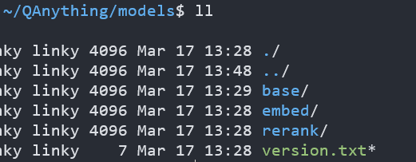
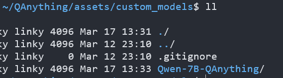
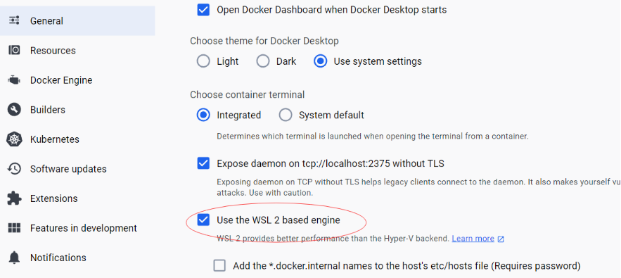
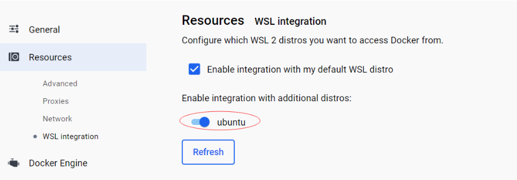

# QAnything

## 1. 演示环境

Windows 11 with WSL2 Ubuntu 22.04

GPU RTX 3090

Docker Desktop 4.27.1

Windows Terminal Powershell 内核

## 2.下载

```bash
git clone https://github.com/netease-youdao/QAnything.git
```

先下载QAnything源码，然后下载有道引以为豪的embedding模型。

```bash
git clone https://www.modelscope.cn/netease-youdao/QAnything.git
```

把embedding模型下载下来以后解压`models.zip`解压后是个models文件夹，这个文件夹要放到QAnything的根目录下。



这个models，就是我们说的RAG构架里的embedding模型，用来表征。

然后下载，大语言模型，官方推荐“通义千问”，下载放在

`QAnything/assets/custom_models` 这个路径下



## 3. 运行bash

在运行bash文件之前，先做几个准备工作

- 启动docker desktop，登录账户，设置docker，wsl，关联上自己本地的wsl系统

  

  

- wsl进入自己的linux子系统

- 更改shell脚本的回车（在windows下创建编辑的shell脚本是dos格式的，而linux却是只能执行格式为unix格式的脚本），否则执行时会报错，[将回车符替换为空字符串](https://github.com/netease-youdao/QAnything/blob/master/FAQ_zh.md)

  ```bash
  # 直接将下面这些代码粘贴到wsl终端里回车
  sed -i "s/\r//" scripts/run_for_local_option.sh
  sed -i "s/^M//" scripts/run_for_local_option.sh
  sed -i "s/\r//" scripts/run_for_cloud_option.sh
  sed -i "s/^M//" scripts/run_for_cloud_option.sh
  sed -i "s/\r//" run.sh
  sed -i "s/^M//" run.sh
  sed -i "s/\r//" close.sh
  sed -i "s/^M//" close.sh
  ```

- 运行下面的bash命令即可下载docker文件

  ```bash
  bash ./run.sh -c local -i 0 -b hf -m Qwen-7B-QAnything -t qwen-7b-qanything
  ```

  
