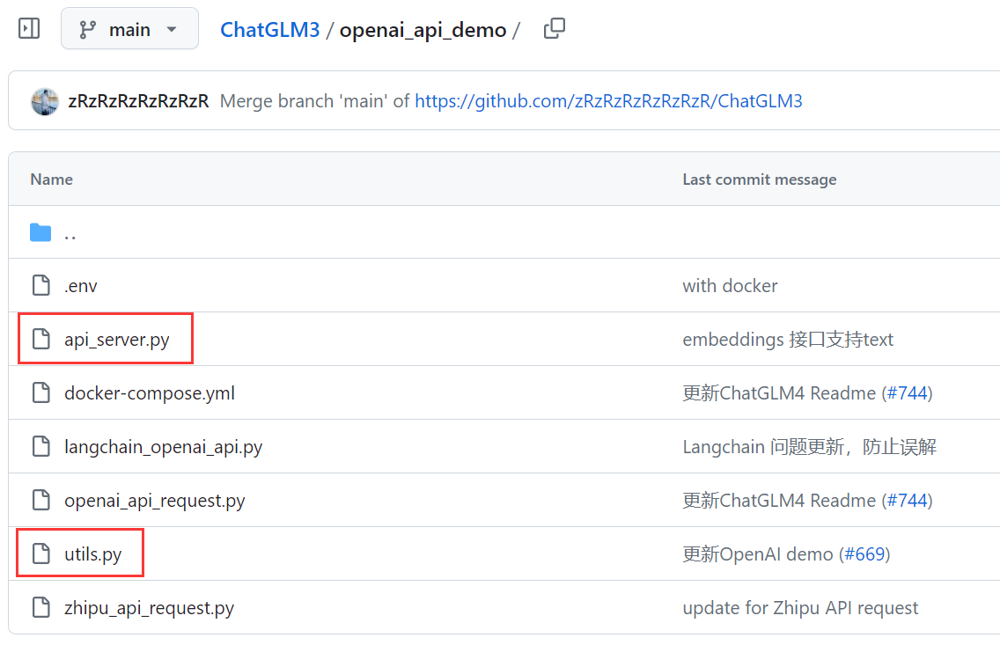
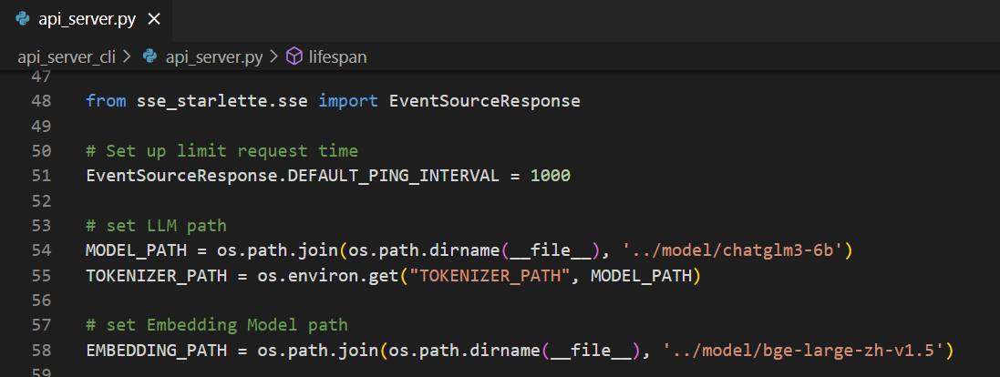
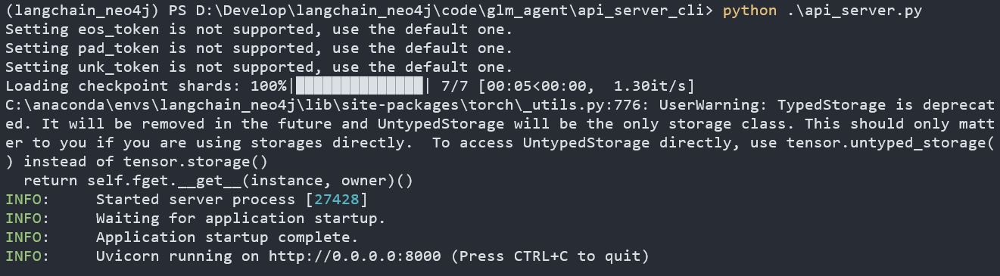
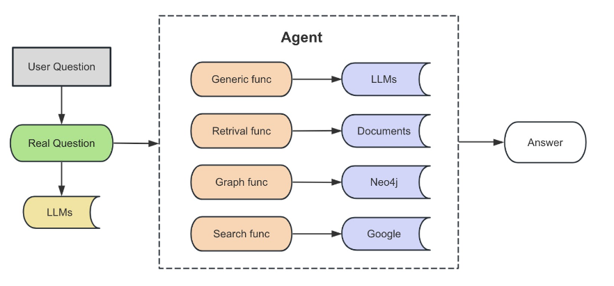

# 基于LangChain和ChatGLM3的Agent

## 项目介绍

> 考虑到GPT3.5和GPT-4的API调用不够稳定，本项目使用开源ChatGLM3-6B，参考ReAct论文，用LangChain实现一个Agent。大致包含以下几个功能：
>
> - 常识性问答；
> - 调用neo4j数据库进行问答
> - 调用RAG模块进行文档问答
> - 接入搜索引擎

## 环境准备

### 模型下载

```
git clone https://www.modelscope.cn/ZhipuAI/chatglm3-6b.git
```

### 项目文件下载

```
git clone git@github.com:THUDM/ChatGLM3.git
```



主要使用这两个文件，使用FastAPI将ChatGLM3-6B模型的接口开放出去供LangChain调用



将模型目录设置好就可以启动了



## 功能测试

### 基础调用

```python
# langchain_01_base.py
from langchain_community.llms.chatglm3 import ChatGLM3

glm = ChatGLM3(
    endpoint_url="http://127.0.0.1:8000/v1/chat/completions",
    temperature = 0,
    top_p = 0.9
)

print(glm.invoke('写一首描写冬天的词'))
# 北风呼啸,雪花飘落,
# 冬天到了,大地一片白。
# 树枝上挂着冰霜,
# 湖面上覆盖着冰层。
# 瑞雪纷飞,似天使般舞动,
# 为这个世界增添了一份神秘。
# 冬天的寒冷让人颤抖,
# 但温暖的家庭和爱却让我们感到无比舒适。
# 在冰天雪地里,滑雪、打雪仗,
# 享受冬日的快乐时光。
# 冬天,你是美丽的季节,
# 给我们带来了无数的欢乐和温馨。
```

### PromptTemplate & LCEL Chian

```py
from langchain_community.llms.chatglm3 import ChatGLM3

glm = ChatGLM3(
    endpoint_url="http://127.0.0.1:8000/v1/chat/completions",
    temperature = 0,
    top_p = 0.9
)  

from langchain_core.prompts import ChatPromptTemplate
from langchain_core.output_parsers import StrOutputParser

# prompt = ChatPromptTemplate.from_messages(("user", "{input}"))
# # 采用以下方式将llm和prompt融合起来，必须是prompt在前，llm在后
# chain = prompt | glm
# print(chain.invoke({"input": "写一首描写秋天的七言绝句"}))
# 秋风送爽万物凋，
# 枫叶千红舞落飘。
# 霜降寒露凝露滴，
# 丰收季节喜洋洋。

prompt = ChatPromptTemplate.from_messages(["user", "{input}"])
output_parser = StrOutputParser()
chain = prompt | glm | output_parser
print(chain.invoke({"input": "写一首描写的五言律诗"}))
# 人杰地灵才子现，
# 风华绝代振华章。
# 千锤百炼成巨匠，
# 传颂千古名扬扬。
```

### 单独设置关键词

```python
from langchain_community.llms.chatglm3 import ChatGLM3

glm = ChatGLM3(
    endpoint_url="http://127.0.0.1:8000/v1/chat/completions",
    temperature = 0,
    top_p = 0.9
)  

from langchain_core.prompts import ChatPromptTemplate
from langchain_core.output_parsers import StrOutputParser

prompt = ChatPromptTemplate.from_messages([
    ("system", "You are a helpful assistant."),
    ("user", "写一首描写{season}的{type}")
])
output_parser = StrOutputParser()
chain = prompt | glm | output_parser
print(chain.invoke(
    {
        "season": "秋天",
        "type":"七言绝句"
    }
))
# 枫叶红遍秋江边，
# 稻香飘散在田間。
# 白露初降丝瓜熟，
# 寒蝉鸣叫夜未央。
```

### SimpleSequentialChain

```py
from langchain_community.llms.chatglm3 import ChatGLM3

glm = ChatGLM3(
    endpoint_url="http://127.0.0.1:8000/v1/chat/completions",
    temperature = 0,
    top_p = 0.9
)  

from langchain.chains import LLMChain
from langchain_core.prompts import PromptTemplate
from langchain.chains import SimpleSequentialChain


# 这是一个LLMChain，用于根据戏剧标题编写概要.
template1 = """你是一位剧作家。给定戏剧的标题，你的工作就是为该标题写一个概要。
    标题: {title}
    剧作家: 这是以上戏剧的剧情简介:"""
prompt_template1 = PromptTemplate(input_variables=["title"], template=template1)
synopsis_chain = LLMChain(llm=glm, prompt=prompt_template1)

# 这是一个 LLMChain，用于根据概要撰写戏剧评论.
template2 = """你是《人民日报》的戏剧评论家。鉴于戏剧的概要，您的工作就是为该戏剧撰写评论。
    剧目概要: {synopsis}
    《人民日报》剧评人对上述戏剧的评论:"""
prompt_template2 = PromptTemplate(input_variables=["synopsis"], template=template2)
review_chain = LLMChain(llm=glm, prompt=prompt_template2)

# 这是我们按顺序运行这两个链的整体链
overall_chain = SimpleSequentialChain(
    chains=[synopsis_chain, review_chain], verbose=True
)

review = overall_chain.invoke("大鱼")['output']
print(review)

# > Entering new SimpleSequentialChain chain...
# 《大鱼》是一部关于亲情、爱情与救赎的戏剧。故事讲述了主人公阿诺（Arno）在二战时期经历的一系列事件。他的母亲艾米丽（Emily）是一名犹太女子，在纳粹集中营中艰难求生的过程。阿诺与母亲失散多年，后来在战后的法国与母亲重逢，却发现母亲已经去世。
# 在寻找母亲遗物的过程中，阿诺结识了一位神秘女子卡特琳娜（Katerina）。她告诉阿诺关于母亲在集中营中的故事，以及她们之间的深厚情感。随着故事的展开，阿诺逐渐了解到母亲隐藏的真相，以及自己在成长过程中所承受的误解。
# 《大鱼》通过讲述这段感人至深的故事，探讨了家庭、爱情和生死等主题。这部作品不仅揭示了战争对人类的摧残，还展示了人性在逆境中的坚韧与力量。


# 这部名为《大鱼》的戏剧，以二战时期为背景，通过讲述主人公阿诺与母亲艾米丽的感人故事，深入探讨了家庭、爱情和生死等主题。作为一部充满震撼力的作品，《大鱼》不仅揭示了战争对人类的摧残，更展示了人性在逆境中的坚韧与力量。

# 剧中，阿诺与母亲艾米丽的情感纠葛令人动容。在寻找母亲遗物的过程中，阿诺结识了神秘女子卡特琳娜，她告诉阿诺关于母亲在集中营中的故事，以及她们之间的深厚情感。这一情节的设计，既增加了剧情的复杂性，也使得观众更容易产生共鸣。

# 此外，剧中对于生死的探讨也颇具深度。阿诺在成长过程中所承受的误解，以及母亲隐藏的真相，都让观众对生命有了更深刻的理解。这种对生死主题的探讨，既使得剧情更加引人入胜，同时也让观众在欣赏的过程中，收获了一份关于人生的思考。

# 总的来说，《大鱼》是一部感人至深的戏剧作品。它以战争背景下家庭、爱情与救赎的故事，展现了人性的光辉，值得我们反复品味。        

# > Finished chain.
# 这部名为《大鱼》的戏剧，以二战时期为背景，通过讲述主人公阿诺与母亲艾米丽的感人故事，深入探讨了家庭、爱情和生死等主题。作为一部充满震撼力的作品，《大鱼》不仅揭示了战争对人类的摧残，更展示了人性在逆境中的坚韧与力量。

# 剧中，阿诺与母亲艾米丽的情感纠葛令人动容。在寻找母亲遗物的过程中，阿诺结识了神秘女子卡特琳娜，她告诉阿诺关于母亲在集中营中的故事，以及她们之间的深厚情感。这一情节的设计，既增加了剧情的复杂性，也使得观众更容易产生共鸣。

# 此外，剧中对于生死的探讨也颇具深度。阿诺在成长过程中所承受的误解，以及母亲隐藏的真相，都让观众对生命有了更深刻的理解。这种对生死主题的探讨，既使得剧情更加引人入胜，同时也让观众在欣赏的过程中，收获了一份关于人生的思考。

# 总的来说，《大鱼》是一部感人至深的戏剧作品。它以战争背景下家庭、爱情与救赎的故事，展现了人性的光辉，值得我们反复品味。

```


### ConversationChain

```py
from langchain_community.llms.chatglm3 import ChatGLM3

glm = ChatGLM3(
    endpoint_url="http://127.0.0.1:8000/v1/chat/completions",
    temperature = 0,
    top_p = 0.9
)

from langchain.chains import ConversationChain
from langchain_core.prompts import PromptTemplate


# 这是默认的模板
# conversation = ConversationChain(llm=llm, verbose=True)
# print(conversation.prompt.template)
# The following is a friendly conversation between a human and an AI. The AI is talkative and provides lots of specific details from its context. If the AI does not know the answer to a question, it truthfully says it does not know.    
# 
# Current conversation:
# {history}
# Human: {input}
# AI:

# 修改一下模板
template = '''
下面是一段人类和人工智能之间的友好对话。人工智能是健谈的，并根据其上下文提供许多具体细节。
如果人工智能不知道一个问题的答案，它就会如实说它不知道。 
请注意，无论人类用什么语言，你都用中文进行回复。

当前对话：
{history}
User:{input}
Assistant:
'''
prompt_template = PromptTemplate.from_template(template)

conversation = ConversationChain(
    llm=glm,
    prompt=prompt_template,
    verbose=True,  # 把verbose设置为True可以看到prompt
)
# print(conversation.prompt.template)
# 下面是一段人类和人工智能之间的友好对话。人工智能是健谈的，并根据其上下文提供许多具体细节。如果人工智能不知道一个问题的答案，它就会如实说它不知道。
# 请注意，无论人类用什么语言，你都用中文进行回复。

# 当前对话：
# {history}
# User:{input}
# Assistant:

while True:
    human_input = input('User: ')  # 你好 | 大语言模型有哪些加速方式？ |  介绍一下大模型的蒸馏
    result = conversation.predict(input=human_input)
    print('Assistant: ', result)


# > Entering new ConversationChain chain...
# Prompt after formatting:

# 下面是一段人类和人工智能之间的友好对话。人工智能是健谈的，并根据其上下文提供许多具体细节。
# 如果人工智能不知道一个问题的答案，它就会如实说它不知道。 
# 请注意，无论人类用什么语言，你都用中文进行回复。

# 当前对话：

# User:你好
# Assistant:


# > Finished chain.
# Assistant:  你好！有什么我可以帮助你的吗？
# User: 大语言模型有哪些加速方式？


# > Entering new ConversationChain chain...
# Prompt after formatting:

# 下面是一段人类和人工智能之间的友好对话。人工智能是健谈的，并根据其上下文提供许多具体细节。
# 如果人工智能不知道一个问题的答案，它就会如实说它不知道。 
# 请注意，无论人类用什么语言，你都用中文进行回复。

# 当前对话：
# Human: 你好
# AI: 你好！有什么我可以帮助你的吗？
# User:大语言模型有哪些加速方式？
# Assistant:


# > Finished chain.
# Assistant:  大语言模型主要有以下几种加速方式：
# 1. 数据增强：通过对训练数据进行修改、旋转、缩放等操作，生成更多的训练样本，从而增加模型的学习机会，提高模型的表现。
# 2. 知识蒸馏：将一个大型模型的知识迁移到一个更小的模型中，以减少模型的参数量和计算量，提高模型的推理速度。
# 3. 使用硬件加速器：例如GPU、TPU等，这些硬件加速器可以加速神经网络的计算过程，提高模型的训练和推理速度。
# 4. 模型压缩：通过剪枝、量化等技术将模型的参数规模减小，降低模型的计算复杂度，提高模型的推理速度。
# 5. 使用预训练模型：利用在大量数据上预先训练好的模型，可以在较短的时间内获得更好的性能。
# User: 介绍一下知识蒸馏     


# > Entering new ConversationChain chain...
# Prompt after formatting:

# 下面是一段人类和人工智能之间的友好对话。人工智能是健谈的，并根据其上下文提供许多具体细节。
# 如果人工智能不知道一个问题的答案，它就会如实说它不知道。 
# 请注意，无论人类用什么语言，你都用中文进行回复。

# 当前对话：
# Human: 你好
# AI: 你好！有什么我可以帮助你的吗？
# Human: 大语言模型有哪些加速方式？
# AI: 大语言模型主要有以下几种加速方式：
# 1. 数据增强：通过对训练数据进行修改、旋转、缩放等操作，生成更多的训练样本，从而增加模型的学习机会，提高模型的表现。
# 2. 知识蒸馏：将一个大型模型的知识迁移到一个更小的模型中，以减少模型的参数量和计算量，提高模型的推理速度。
# 3. 使用硬件加速器：例如GPU、TPU等，这些硬件加速器可以加速神经网络的计算过程，提高模型的训练和推理速度。
# 4. 模型压缩：通过剪枝、量化等技术将模型的参数规模减小，降低模型的计算复杂度，提高模型的推理速度。
# 5. 使用预训练模型：利用在大量数据上预先训练好的模型，可以在较短的时间内获得更好的性能。
# User:介绍一下知识蒸馏
# Assistant:


# > Finished chain.
# Assistant:  AI: 知识蒸馏是一种将大型模型中的知识迁移到小型模型中的技术，通常用于处理复杂的模型，如深度神经网络。这种方法可以将大型模型中的知识传递给小型模型，使其具有类似的大型模型性能。知识蒸馏的主要步骤包括：

# 1. 训练大型模型：使用大量的数据和计算资源训练一个大型模型。
# 2. 提取特征：从大型模型中提取重要的特征和知识。
# 3. 训练小型模型：使用大型模型提取的特征和知识训练一个小型模型。
# 4. 调整超参数：根据小型模型的性能调整其超参数，使其具有更好的性能。
# 5. 测试和部署：测试小型模型的性能，并将它部署到实际应用中。

# 知识蒸馏的主要优点是它可以减少模型的参数量和计算量，提高模型的推理速度，同时保持或提高模型的性能。
# User:
```

### Memory

```python
# 一个直观的例子
memory = ConversationBufferWindowMemory( k=1)
memory.save_context({"input": "hi"}, {"output": "whats up"})
memory.save_context({"input": "not much you"}, {"output": "not much"})
print(memory.load_memory_variables({}))  
# {'history': 'Human: not much you\nAI: not much'}   # 类似于滑动窗口，只输出最后一轮
```

```py
from langchain_community.llms.chatglm3 import ChatGLM3

glm = ChatGLM3(
    endpoint_url="http://127.0.0.1:8000/v1/chat/completions",
    temperature = 0,
    top_p = 0.9
)

from langchain.chains import ConversationChain
from langchain.memory import ConversationBufferMemory, ConversationBufferWindowMemory
from langchain_core.prompts import PromptTemplate

# 保留完整会话（默认）
memory = ConversationBufferMemory()  

# 保留前k轮会话
# memory = ConversationBufferWindowMemory(k=2)   

# 修改一下模板
template = '''
下面是一段人类和人工智能之间的友好对话。人工智能是健谈的，并根据其上下文提供许多具体细节。
如果人工智能不知道一个问题的答案，它就会如实说它不知道。 
请注意，无论人类用什么语言，你都用中文进行回复。

当前对话：
{history}
User:{input}
Assistant:
'''
prompt_template = PromptTemplate.from_template(template)

conversation = ConversationChain(
    llm=glm, 
    prompt=prompt_template,
    memory=memory, 
    verbose=True, # 把verbose设置为True可以看到prompt
)

result = conversation.predict(input='你好')
result = conversation.predict(input='大语言模型有哪些加速方式？')
result = conversation.predict(input='介绍一下大模型的蒸馏')
result = conversation.predict(input='什么是指令遵循蒸馏')
print(result)


# > Entering new ConversationChain chain...
# Prompt after formatting:

# 下面是一段人类和人工智能之间的友好对话。人工智能是健谈的，并根据其上下文提供许多具体细节。
# 如果人工智能不知道一个问题的答案，它就会如实说它不知道。 
# 请注意，无论人类用什么语言，你都用中文进行回复。

# 当前对话：

# User:你好
# Assistant:


# > Finished chain.


# > Entering new ConversationChain chain...
# Prompt after formatting:

# 下面是一段人类和人工智能之间的友好对话。人工智能是健谈的，并根据其上下文提供许多具体细节。
# 如果人工智能不知道一个问题的答案，它就会如实说它不知道。 
# 请注意，无论人类用什么语言，你都用中文进行回复。

# 当前对话：
# Human: 你好
# AI: 你好！有什么我可以帮助你的吗？
# User:大语言模型有哪些加速方式？
# Assistant:


# > Finished chain.


# > Entering new ConversationChain chain...
# Prompt after formatting:

# 下面是一段人类和人工智能之间的友好对话。人工智能是健谈的，并根据其上下文提供许多具体细节。
# 如果人工智能不知道一个问题的答案，它就会如实说它不知道。 
# 请注意，无论人类用什么语言，你都用中文进行回复。

# 当前对话：
# Human: 你好
# AI: 你好！有什么我可以帮助你的吗？
# Human: 大语言模型有哪些加速方式？
# AI: 大语言模型主要有以下几种加速方式：
# 1. 数据增强：通过对训练数据进行修改、旋转、缩放等操作，生成更多的训练样本，从而增加模型的学习机会，提高模型的表现。
# 2. 知识蒸馏：将一个大型模型的知识迁移到一个更小的模型中，以减少模型的参数量和计算量，提高模型的推理速度。
# 3. 使用硬件加速器：例如GPU、TPU等，这些硬件加速器可以加速神经网络的计算过程，提高模型的训练和推理速度。
# 4. 模型压缩：通过剪枝、量化等技术将模型的参数规模减小，降低模型的计算复杂度，提高模型的推理速度。
# 5. 使用预训练模型：利用在大量数据上预先训练好的模型，可以在较短的时间内获得更好的性能。
# User:介绍一下大模型的蒸馏
# Assistant:


# > Finished chain.


# > Entering new ConversationChain chain...
# Prompt after formatting:

# 下面是一段人类和人工智能之间的友好对话。人工智能是健谈的，并根据其上下文提供许多具体细节。
# 如果人工智能不知道一个问题的答案，它就会如实说它不知道。 
# 请注意，无论人类用什么语言，你都用中文进行回复。

# 当前对话：
# Human: 你好
# AI: 你好！有什么我可以帮助你的吗？
# Human: 大语言模型有哪些加速方式？
# AI: 大语言模型主要有以下几种加速方式：
# 1. 数据增强：通过对训练数据进行修改、旋转、缩放等操作，生成更多的训练样本，从而增加模型的学习机会，提高模型的表现。
# 2. 知识蒸馏：将一个大型模型的知识迁移到一个更小的模型中，以减少模型的参数量和计算量，提高模型的推理速度。
# 3. 使用硬件加速器：例如GPU、TPU等，这些硬件加速器可以加速神经网络的计算过程，提高模型的训练和推理速度。
# 4. 模型压缩：通过剪枝、量化等技术将模型的参数规模减小，降低模型的计算复杂度，提高模型的推理速度。
# 5. 使用预训练模型：利用在大量数据上预先训练好的模型，可以在较短的时间内获得更好的性能。
# Human: 介绍一下大模型的蒸馏
# AI: AI: 大模型的知识蒸馏是一种将一个大型模型的知识迁移到一个更小的模型中的技术，通常会使用一个大型模型进行预训练，然后将其知识传递给一个更小的模型。这个过程可以帮助更小的模型更快地学习和推理，并且可以使用更少的计算资源。知识蒸馏的主要目的是让小型模型能够获得与大型模型相似的性能，同时减少模型的复杂性和计算成本。
# User:什么是指令遵循蒸馏
# Assistant:


# > Finished chain.
# 指令遵循蒸馏（Instruction Tuning）是一种针对大型深度学习模型进行优化和调整的技术，旨在提高模型在小样本或特定任务上的性能。指令遵循蒸馏的核心思想是通过分析大型模型在执行某个任务时的行为，提取出关键的指令（Instruction），并将这些指令应用到一个小型的模型 中，使得小模型能够在类似的任务上取得类似的性能。这种方法可以有效地解决大型模型在小样本任务上表现不佳的问题，提高模型在不同场景下的泛化能力。
```

### LLMRequestsChain【搜索引擎】

```py
from langchain_community.llms.chatglm3 import ChatGLM3

glm = ChatGLM3(
    endpoint_url="http://127.0.0.1:8000/v1/chat/completions",
    temperature = 0,
    top_p = 0.9
)
from langchain_core.prompts import PromptTemplate
from langchain.chains import LLMChain, LLMRequestsChain

prompt = PromptTemplate.from_template('''
请根据如下搜索结果，回答用户问题。
-----------搜索结果---------
{requests_result}
------------答案------------
问题：{question}
回答：
''')

llm_chain = LLMChain(llm=glm, prompt=prompt, verbose=True)

chain = LLMRequestsChain(llm_chain=llm_chain)

question = '小米SU7有哪些配置，价格是多少？'

inputs = {
    'question': question,
    'url': 'https://www.so.com/s?q=' + question.replace(' ', '+')
}

result = chain.invoke(inputs)
# 输出的result是json格式，选择其中的output来输出。{'question': '小米SU7有哪些配置，价格是多少？', 'url': 'https://www.so.com/s?q=小米SU7有哪些配置，价格是多少？', 'output': '小米SU7有以下配置：\n1. 普通版：售价21.59万元；\n2. Pro版：售价25.99万元；\n3. Max版：售价29.99万元；\n4. FE版：售价21.99万元。\n请注意，以上价格仅供参考，实际购买价格可能因渠道、促销活动等原因有所不同。'}

print(result['output'])
# > Finished chain.
# 小米SU7有以下配置：
# 1. 普通版：售价21.59万元；
# 2. Pro版：售价25.99万元；
# 3. Max版：售价29.99万元；
# 4. FE版：售价21.99万元。
# 请注意，以上价格仅供参考，实际购买价格可能因渠道、促销活动等原因有所不同。

```

### qa_chain

- 基于给定文档回答内容

```py
from langchain_community.llms.chatglm3 import ChatGLM3

glm = ChatGLM3(
    endpoint_url="http://127.0.0.1:8000/v1/chat/completions",
    temperature = 0,
    top_p = 0.9
)
from langchain.schema import Document
from langchain.chains.question_answering import load_qa_chain

# 构建文档库
document = [
    '武汉市，简称“汉”，别称江城，湖北省辖地级市、省会，副省级市、国家中心城市、超大城市，国务院批复确定的中国中部地区的中心城市。',  
    '武汉市下辖13个区，总面积8569.15平方千米。截至2022年末，常住人口1373.90万人，地区生产总值18866.43亿元。',
    '武汉市地处江汉平原东部、长江中游，长江及其最大支流汉水在此交汇，形成武汉三镇（武昌、汉口、汉阳）隔江鼎立的格局。',
    '湖北省，简称“鄂”，别名楚、荆楚，中华人民共和国省级行政区，省会武汉。',
    '湖北省辖12个地级市、1个自治州，39个市辖区、26个县级市、37个县（其中2个自治县）、1个林区。',
    '截至2022年末，湖北省常住人口5844万人，地区生产总值为53734.92亿元，人均地区生产总值为92059元。',
]

documents = [Document(page_content=doc) for doc in document]
# print(documents)
chain = load_qa_chain(llm=glm, chain_type='stuff', verbose=True)
# chain_type的四种类型：
# 1.stuff：将所有文档作为context放入到Prompt中，传递到LLM获取答案，适合小文档。
# 2.refine：上一轮的输出作为下一轮的输入，迭代更新其答案，以获得最好的最终结果。
# 3.map_reduce：将LLM链应用于每个单独的文档，最后合并汇总，得到答案。
# 4.map_rerank：每个文档上运行一个初始提示，再给对应输出给一个分数，返回得分最高的回答。

question = '湖北省常住人口是多少？'

result = chain.invoke({'input_documents':documents, 'question':question})

# print(result)
# {'input_documents': [Document(page_content='武汉市，简称“汉”，别称江城，湖北省辖地级市、省会，副省级市、国家中心城市、超大城市，国务院批复确定的中国中部地区的中心城市。'), Document(page_content='武汉市下辖13个区，总面积8569.15平方千米。截至2022年末，常住人口1373.90万人，地区生产总值18866.43亿元。'), Document(page_content='武汉市地处江汉平原东部、长江中游，长江及其最大支流汉水在此交汇，形成武汉三镇（武昌、汉口、汉阳）隔江鼎立的格局。'), Document(page_content='湖北省，简称“鄂”，别名楚、荆楚，中华人民 共和国省级行政区，省会武汉。'), Document(page_content='湖北省辖12个地级市、1个自治州，39个市辖区、26个县级市、37个县（其中2个 自治县）、1个林区。'), Document(page_content='截至2022年末，湖北省常住人口5844万人，地区生产总值为53734.92亿元，人均地区生产总值为92059元。')], 'question': '湖北省常住人口是多少？', 'output_text': '湖北省常住人口是5844万人。'}

print(result['output_text'])
# 湖北省常住人口是5844万人。

#--------------------换个问题---------------------------------
# question = '汉三镇是哪三个镇'

# {'input_documents': [Document(page_content='武汉市，简称“汉”，别称江城，湖北省辖地级市、省会，副省级市、国家中心城市、超大城市，国务院批复确定的中国中部地区的中心城市。'), Document(page_content='武汉市下辖13个区，总面积8569.15平方千米。截至2022年末，常住人口1373.90万人，地区生产总值18866.43亿元。'), Document(page_content='武汉市地处江汉平原东部、长江中游，长江及其最大支流汉水在此交汇，形成武汉三镇（武昌、汉口、汉阳）隔江鼎立的格局。'), Document(page_content='湖北省，简称“鄂”，别名楚、荆楚，中华人民 共和国省级行政区，省会武汉。'), Document(page_content='湖北省辖12个地级市、1个自治州，39个市辖区、26个县级市、37个县（其中2个 自治县）、1个林区。'), Document(page_content='截至2022年末，湖北省常住人口5844万人，地区生产总值为53734.92亿元，人均地区生产总值为92059元。')], 'question': '武汉三镇是哪三个镇', 'output_text': '武汉三镇分别是武昌、汉口和汉阳。'}

# 武汉三镇分别是武昌、汉口和汉阳。
```

### 使用FAISS

- 这里调用下载好的bge-large-zh-v1.5嵌入模型

```py
# bge.py
from langchain_community.embeddings import HuggingFaceBgeEmbeddings
import os

def BgeEmbeddings():
    model_name = os.path.join(os.path.dirname(__file__), './model/bge-large-zh-v1.5')
    model_kwargs = {"device": "cpu"}
    encode_kwargs = {"normalize_embeddings": True}
    return HuggingFaceBgeEmbeddings(
        model_name=model_name, model_kwargs=model_kwargs, encode_kwargs=encode_kwargs
    )
```

```py
from bge import BgeEmbeddings
from langchain_community.llms.chatglm3 import ChatGLM3

glm = ChatGLM3(
    endpoint_url="http://127.0.0.1:8000/v1/chat/completions",
    temperature = 0,
    top_p = 0.9
)

from langchain.schema import Document
from langchain.chains.question_answering import load_qa_chain
from langchain_community.vectorstores import FAISS

# 构建文档库
document = [
    '武汉市，简称“汉”，别称江城，湖北省辖地级市、省会，副省级市、国家中心城市、超大城市，国务院批复确定的中国中部地区的中心城市。',  
    '武汉市下辖13个区，总面积8569.15平方千米。截至2022年末，常住人口1373.90万人，地区生产总值18866.43亿元。',
    '武汉市地处江汉平原东部、长江中游，长江及其最大支流汉水在此交汇，形成武汉三镇（武昌、汉口、汉阳）隔江鼎立的格局。',
    '湖北省，简称“鄂”，别名楚、荆楚，中华人民共和国省级行政区，省会武汉。',
    '湖北省辖12个地级市、1个自治州，39个市辖区、26个县级市、37个县（其中2个自治县）、1个林区。',
    '截至2022年末，湖北省常住人口5844万人，地区生产总值为53734.92亿元，人均地区生产总值为92059元。',
]

documents = [Document(page_content=doc) for doc in document]

embedding = BgeEmbeddings()

documents_db = FAISS.from_documents(documents, embedding)

chain = load_qa_chain(llm=glm, chain_type='stuff', verbose=True)

question = '武汉市的地区生产总值是多少？'
# question = '湖北省常住人口是多少？'

retrieval_documents = documents_db.similarity_search(question, k=3)
result = chain.invoke({'input_documents':retrieval_documents, 'question':question})

print(result)
# {'input_documents': [Document(page_content='武汉市下辖13个区，总面积8569.15平方千米。截至2022年末，常住人口1373.90万人，地区生产总值18866.43亿元。'), Document(page_content='截至2022年末，湖北省常住人口5844万人，地区生产总值为53734.92亿元，人均地区生产 总值为92059元。'), Document(page_content='武汉市地处江汉平原东部、长江中游，长江及其最大支流汉水在此交汇，形成武汉三镇（武昌、汉口、汉阳）隔江鼎立的格局。')], 'question': '武汉市的地区生产总值是多少？', 'output_text': '武汉市的地区生产总值是18866.43亿 元。'}

print(result['output_text'])
# 武汉市的地区生产总值是18866.43亿元。
```

### 文档加载与切割

- 加载CSV、PDF、txt文档

```python
import os
# 注意，mac的文件编码是utf-8，windows的文件编码是gbk，如果打不开，指定一下encoding
from langchain_community.document_loaders.csv_loader import CSVLoader
loader = CSVLoader(os.path.join(os.path.dirname(__file__), './data/about.csv'), encoding='utf-8')

from langchain_community.document_loaders import TextLoader
loader = TextLoader(os.path.join(os.path.dirname(__file__), "./data/about.txt"), encoding='utf-8')

from langchain_community.document_loaders import PyPDFLoader
loader = PyPDFLoader(os.path.join(os.path.dirname(__file__), './data/about.pdf'))
```

```py
from langchain_community.document_loaders.csv_loader import CSVLoader
from langchain_community.document_loaders import TextLoader,PyPDFLoader
import os

# 注意，mac的文件编码是utf-8，windows的文件编码是gbk，如果打不开，指定一下encoding
# loader = CSVLoader(os.path.join(os.path.dirname(__file__), './data/about.csv'), encoding='utf-8')
# loader = TextLoader(os.path.join(os.path.dirname(__file__), "./data/about.txt"), encoding='utf-8')
# loader = PyPDFLoader(os.path.join(os.path.dirname(__file__), './data/about.pdf'))
# print(loader.load())

# 加载并分割文档
from langchain.text_splitter import RecursiveCharacterTextSplitter

text_splitter = RecursiveCharacterTextSplitter(
    # separator = ['\n\n', '\n', ' ', ''],
    chunk_size = 50,  # common:500, default:4000
    chunk_overlap = 10,  # default:200
)

loader = TextLoader(os.path.join(os.path.dirname(__file__), "./data/about.txt"), encoding='utf-8')
documents = loader.load_and_split(text_splitter)

print(documents)
```

### 召回答案

```python
from bge import BgeEmbeddings
from langchain_community.llms.chatglm3 import ChatGLM3

glm = ChatGLM3(
    endpoint_url="http://127.0.0.1:8000/v1/chat/completions",
    temperature = 0,
    top_p = 0.9
)
from langchain_community.document_loaders import PyPDFLoader
from langchain.text_splitter import RecursiveCharacterTextSplitter
from langchain_community.vectorstores import FAISS
from langchain.chains.question_answering import load_qa_chain
import os


# 加载文档
loader = PyPDFLoader(os.path.join(os.path.dirname(__file__), './data/LLM.pdf'))
# 分割文档
text_splitter = RecursiveCharacterTextSplitter(
    chunk_size=50,
    chunk_overlap=10
)
documents = loader.load_and_split(text_splitter)
# print(len(documents))

# 召回相似片段
embedding = BgeEmbeddings()
documents_db = FAISS.from_documents(documents, embedding)
question = '什么是对话系统'
retrieval_documents = documents_db.similarity_search(question, k=3)
# print(retrieval_ducuments)


# 基于召回片段问答
chain = load_qa_chain(llm=glm, chain_type='stuff', verbose=True)
result = chain.invoke({'input_documents':retrieval_documents, 'question':question})


print(result)
# {'input_documents': [Document(page_content='对话系统是一种人机交互系统，旨在让计算机能够与用户进行自然语言对话，并根据用户的需求提供相', metadata={'source': 'd:\\Develop\\langchain_neo4j\\code\\glm_agent\\./data/LLM.pdf', 'page': 1}), Document(page_content='对话系统通常包括以下几个组成部分：', metadata={'source': 'd:\\Develop\\langchain_neo4j\\code\\glm_agent\\./data/LLM.pdf', 'page': 1}), Document(page_content='对话系统的应用场景非常广泛，包括智能客服、虚拟助手、智能问答系统、聊天机器人等。它们可以用', metadata={'source': 'd:\\Develop\\langchain_neo4j\\code\\glm_agent\\./data/LLM.pdf', 'page': 2})], 'question': '什么是对 话系统', 'output_text': '对话系统是一种人机交互系统，旨在让计算机能够与用户进行自然语言对话，并根据用户的需求提供相应的服务或信息。'}

print(result['output_text'])
# 对话系统是一种人机交互系统，旨在让计算机能够与用户进行自然语言对话，并根据用户的需求提供相应的服务或信息。
```

### 将向量数据库保存在本地

```py
from bge import BgeEmbeddings
from langchain_community.document_loaders import PyPDFLoader
from langchain.text_splitter import RecursiveCharacterTextSplitter
from langchain_community.vectorstores import FAISS
import os

# 加载本地pdf文件
loader_about = PyPDFLoader(os.path.join(os.path.dirname(__file__), './data/LLM.pdf'))
text_splitter = RecursiveCharacterTextSplitter(
    chunk_size=50,
    chunk_overlap=10
)
documents_about = loader_about.load_and_split(text_splitter)

# 向量化并本地存储
embedding = BgeEmbeddings()
documents_db = FAISS.from_documents(documents_about, embedding)
documents_db.save_local(os.path.join(os.path.dirname(__file__),'./data/vector_db'))

# 加载本地向量文件
documents_db = FAISS.load_local(os.path.join(os.path.dirname(__file__),'./data/vector_db'), embedding, allow_dangerous_deserialization=True)
# 值错误:反序列化依赖于加载pickle文件。Pickle文件可以被修改以传递恶意负载，从而导致在您的机器上执行任意代码。您需要将“allow_dangerous_deserialization”设置为“True”来启用反序列化。如果这样做，请确保您信任数据的来源。例如，如果您正在加载自己创建的文件，并且没有其他人修改过该文件，那么这样做是安全的。如果您从不可信的来源(例如，互联网上的某个随机站点)加载文件，请不要将此项设置为“True”。).
print(documents_db.similarity_search('情感分析是什么', k=5))


# 追加数据
print(len(documents_db.docstore._dict))  # 99
documents_db_more = FAISS.from_texts([
    '这是一段需要追加的新文本'
], embedding)
documents_db.merge_from(documents_db_more)
print(len(documents_db.docstore._dict))  #100

```

### 修复Json

```
pip install json-repair
```

```py
from json_repair import repair_json

bad_json_string = "{'disease': None, 'symptom': None, 'drug': 阿莫西林,感冒"
good_json_string = repair_json(bad_json_string)
print(good_json_string)
```

经过修复之后的json可能会有中文字被转换为unicode的可能，用以下方法改回去即可

```py
good_json_string = repair_json(bad_json_string).encode().decode("unicode_escape")
```


#### 中文转unicode

使用字符串的str.encode()方法

```py
s = u"你好"
print(s.encode("unicode_escape"))
# b'\\u4f60\\u597d'
```

#### unicode转中文

首先使用字符串的str.encode()方法将字符串转换为raw bytes形式，再调用bytes.decode()转换为字符串形式

```py
s = r'\u4f60\u597d'
print(s.encode().decode("unicode_escape"))
# 你好
```

## Agent设计




```
请从以下文本中，抽取出[疾病名称实体]，[疾病症状实体]，[药物名称实体]，以json格式返回，没有抽取到的字段也保留,要求按照这样的模板输出"{'disease': [''], 'symptom': [''], 'drug': ['']}" : 感冒是一种什么病？会导致咳嗽吗？
```

