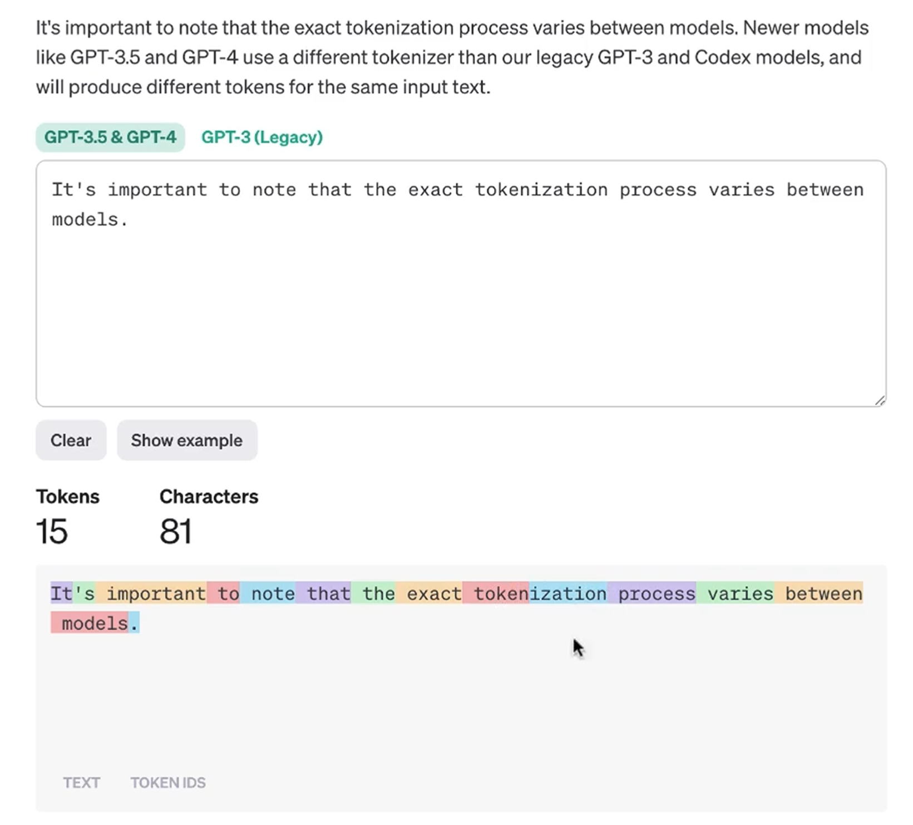
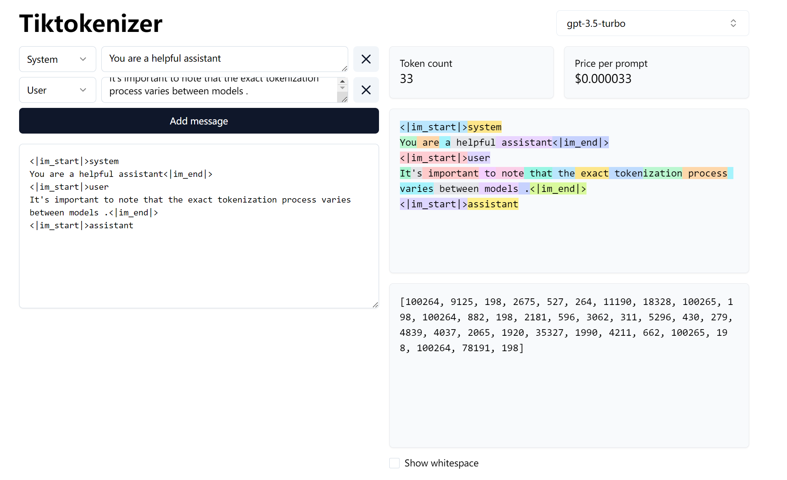

# 基于LangChain和KG的RAG问答平台


## 具体内容

**1、OpenAI**

大约7节课的篇幅，讲解OpenAI对话接口的使用方法。

（1）接口调用、Token计算。

（2）多轮对话、Embedding、相似度文本召回。

**2、LangChain**

课程的重点，大约18节课的篇幅，系统讲解LangChain的各种Chain。

（1）LLMChain、SequentialChain、ConversationChain、QAChain、LLMRequestsChain

（2）提示词、Memory、文档加载、文本分割、Faiss召回、文档问答。

（3）Agent、自定义Tool、多Agent协作，自定义提示词。

**3、综合项目**

大约15节课，用一个大项目，把基础内容进行串联，项目整体架构是Agent模式。

（1）大模型结合历史会话，总结用户真实问题。

（2）大模型自身能力、公司文档召回、Neo4j数据召回、Google搜索，四个数据源解决四类问题。

（3）Gradio界面布局、LangSmith监控。

### 特殊说明

1、项目基于OpenAI模型实现，其他模型推理能力有限，支撑不了Agent架构，忽略后面提到的模型切换的功能。

2、这套课程的体量已经很大了，模型微调和推理加速之类的内容，会在后面单独开设专题讲解。

---

## 相关准备

在正式介绍具体模型之前，要先了解一下大模型这个概念。所谓的大模型，当下指的是大型语言模型（large language model，LLM）。

**大型**：规模和复杂性更大，GPT-3模型拥有1750亿（175B）个参数。更重要的是，更加通用化，可以跨学科、跨领域。

**语言**：自然语言，人跟人交流的语言，用像和人交流的方式，和机器进行对话。

虽然，模型可以生成信息丰富、结构严谨的文本，但他们并不能进行创新性的思考，或生成没有训练数据的新信息，所有的回答都基于训练数据，并通过统计模式进行预测生成。本质上就是根据已知信息，进行文本补全的过程。

**常用大模型：**GPT、LLaMA、ChatGLM、QWen、BaiChuan、ERNIE

### 相关文档

模型列表：https://platform.openai.com/docs/models

计费说明：https://openai.com/pricing

接口文档：https://platform.openai.com/docs/api-reference/introduction

### 安装扩展

```bat
pip install openai
pip install tiktoken
```

### 代码示例

**1、基本格式**

```py
# openai_01_base.py
from openai import OpenAI
client = OpenAI(api_key='replace with your openai api key')

response = client.chat.completions.create(
    model="gpt-3.5-turbo",
    messages=[
        {"role": "system", "content": "You are a helpful assistant."},
        {"role": "user", "content": "Who won the world series in 2020?"},
    ]
)

print(response.choices[0].message.content)
```

**2、OpenAI报错**

```py
OPENAI_BASE_URL = 'https://api.openai-proxy.com/v1'
client = OpenAI(
     api_key='replace with your openai api key',
     base_url=OPENAI_BASE_URL
)
```

**3、参数选择**

模型选项：https://platform.openai.com/docs/models，注意日期tag、token数量等信息。

角色选项：system（系统提示）、user（用户）、assistant（智能助手）

**4、可调参数**

max_tokens：用于指定生成的文本的最大长度。一个token可以是一个字、一个词或者一个标点符号。

temperature：用于控制生成文本的随机性。范围为0-2，值越大，生成的文本越随机，越有创造性；值越小，生成的文本越确定，越准确。

n：用于指定生成多少个独立的文本片段，也就是多个备选答案。

更多参数，可以根据文档，或者结合 ChatGPT 了解。

**5、流式输出**

```py
# openai_02_stream.py
# stream=True
for chunk in response:
    # print(chunk)
    content = chunk.choices[0].delta.content
    if content is not None:
        print(content, end='')
```

**6、隐藏api_key**

在工程化的应用当中，api_key这种敏感信息，一般不会出现在业务代码中的，需要有一个单独的配置文件，来管理这些key。

```bash
pip install python-dotenv
```

```python
# .env
OPENAI_API_KEY = 'replace with your openai api key'
# OPENAI_BASE_URL = 'https://api.openai-proxy.com/v1'

# openai_02_stream.py
from dotenv import load_dotenv
load_dotenv()

client = OpenAI()
```

### 接口调用Token计算

**1、返回值中查看**

```js
# openai_01_base.py
print(response.usage)
```

- prompt_tokens：是用户提交的问题 Token 数量
- completion_tokens：是系统返回的答案 Token 数量

**2、图形化界面**

https://platform.openai.com/tokenizer



https://tiktokenizer.vercel.app/



**3、Tiktoken**

请求token数量

```py
# openai_03_tiktoken.py
import tiktoken

# 需要留意模型名称跟业务模型对应
encoding = tiktoken.encoding_for_model('gpt-3.5-turbo')

# 去掉Key, 只保留Value
messages=[
    {"system", "You are a helpful assistant."},
    {"user",  "Who won the world series in 2020?"},
]

print(f'Prompt_Tokens: {len(encoding.encode(str(messages)))}')
# Prompt_Tokens: 28
```

回复 Token 数量

```py
from openai import OpenAI
client = OpenAI(api_key='replace with your openai api key')

response = client.chat.completions.create(
    model="gpt-3.5-turbo",
    messages=[
        {"role": "system", "content": "You are a helpful assistant."},
        {"role": "user", "content": "Who won the world series in 2020?"},
    ]
)

result = response.choices[0].message.content
print(f'Completion_Tokens: {len(encoding.encode(str(result)))}')
# Completion_Tokens: 13
```

> 在实际项目当中，第一种方法更简单直接，用的最多，其实这个方法也是调用 tiktoken 包实现的，所以第三种方法，大家也需要了解。