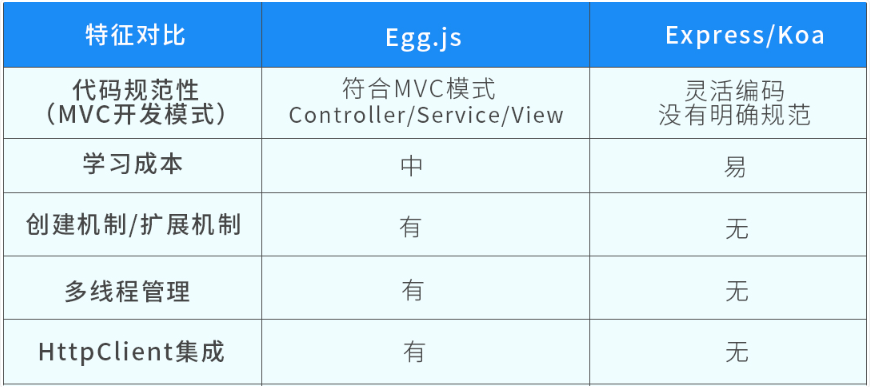
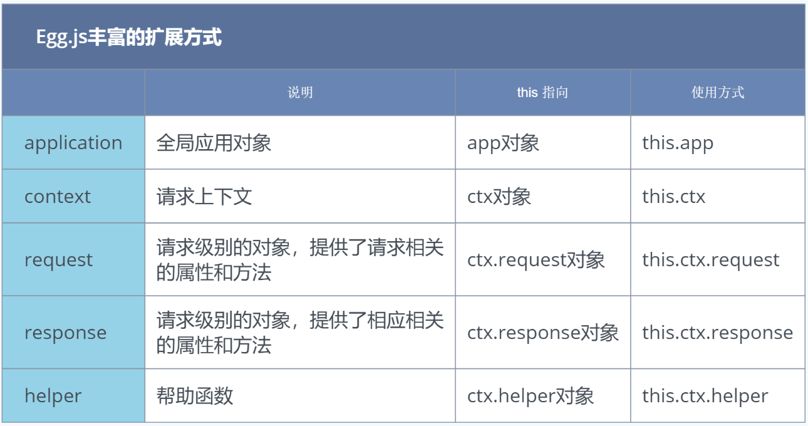

#

> 本教程来源于[JSPang.com](https://jspang.com/article/79)

# Egg.js教程

> Egg.js是阿里旗下为数不多的 ，让人放心使用的开源项目。Egg.js为企业级框架和应用而生的Node.js框架，Egg（简写）奉行【**约定优于配置**】的框架，按照一套同意的约定进行应用开发。适合团队开发，学习成本小，减少维护成本。
>
> 特性
>
> - 提供基于 Egg [定制上层框架](https://www.eggjs.org/zh-CN/advanced/framework)的能力
> - 高度可扩展的[插件机制](https://www.eggjs.org/zh-CN/basics/plugin)
> - 内置[多进程管理](https://www.eggjs.org/zh-CN/advanced/cluster-client)
> - 基于 [Koa](http://koajs.com/) 开发，性能优异
> - 框架稳定，测试覆盖率高
> - [渐进式开发](https://www.eggjs.org/zh-CN/intro/progressive)

## 环境搭建

以管理方式打开Windows中的`PowerShell`（如果不以管理员方式打开，没办新建目录），选择要创建目录的位置。然后创建目录。

```jsx
mkdir egg      // 创建egg目录
cd egg         // 进入egg目录
```

使用yarn命令来创建一个egg项目，命令如下。

```jsx
yarn create egg  --type=simple
```

如果你没安装yarn命令，可以使用下面这条命令进行安装。

```jsx
npm install -g yarn 
```

这时候yarn会给我们去远程拉去egg.js框架和生成项目。其中有几项需要我们配置：项目名称、描述和作者。如果不愿意配置，也可以直接略过。

创建完成后，我们需要安装相关的项目依赖。

```jsx
yarn install
```

安装完成后，我们用`yarn dev`开启项目，开启后会告诉我们 访问地址为 `http://127.0.0.1:7001`。

打开浏览器，输入地址，就会在页面中显示出`hi.egg`。

直接用`code .`命令，直接打开VSCode编辑器。找到`app/controller/home.js`文件，然后把文件的第8行，改为`Hello World`，并保存。刷新页面中的`hi , egg.` 就变成了 `Hello World`。

```
'use strict';

const Controller = require('egg').Controller;

class HomeController extends Controller {
  async index() {
    const { ctx } = this;
    ctx.body = 'Hello World';
  }
}

module.exports = HomeController;
```

### Egg.js与Koa/Express对比

当我们安装好了Egg.js,并简单体验之后。我需要简单的对Egg.js、Koa和Express进行对比。当你知道一个矿建的优点后，你才更有信心进行学习。

Egg.js相对比Koa和Express框架的学习成本要高，但更适合企业级开发，有成熟的插件机制、扩展机制，还可以使用多进程管理。所以多付出一点学习成本是很划算的事情。我制作了一张图，对Egg.js和Express/Koa框架进行了对比。



## 项目结构

### Egg的目录

版本不同和使用的类型不同，你的目录可能跟我的目录有所不同。学习时也没必要完全纠结。只要大概知道生成文件夹和文件的作用就可以了。

```json
- app                        - 项目开发的主目录，工作中的代码几乎都写在这里面
--- controller                --- 控制器目录，所有的控制器都写在这个里面
--- router.js                 --- 项目的路由文件
- config                     - 项目配置目录，比如插件相关的配置
--- config.default.js         --- 系统默认配置文件
--- plugin.js                 --- 插件配置文件
- logs                       -- 项目启动后的日志文件夹
- node_modules               - 项目的运行/开发依赖包，都会放到这个文件夹下面
- test                       - 项目测试/单元测试时使用的目录,
                             - 一般和run配合使用，run里写一个文件，test中也要有一个
- run                        - 项目启动后生成的临时文件，用于保证项目正确运行
- typings                    - TypeScript配置目录，说明项目可以使用TS开发
- .eslintignore              - ESLint配置文件
- .eslintrc                  - ESLint配置文件，语法规则的详细配置文件
- .gitignore                 - git相关配置文件，比如那些文件归于Git管理，那些不需要
- jsconfig.js                - js配置文件，可以对所在目录下的所有JS代码个性化支持
- package.json               - 项目管理文件，包含包管理文件和命令管理文件
- README.MD                  - 项目描述文件 
```

### package.json

打开`package.json`文件的`scripts`属性中，有下面这样一段代码。

```jsx
"scripts": {
    "start": "egg-scripts start --daemon --title=egg-server-egg",
    "stop": "egg-scripts stop --title=egg-server-egg",
    "dev": "egg-bin dev",
    "debug": "egg-bin debug",
    "test": "npm run lint -- --fix && npm run test-local",
    "test-local": "egg-bin test",
    "cov": "egg-bin cov",
    "lint": "eslint .",
    "ci": "npm run lint && npm run cov",
    "autod": "autod"
  },
```

其中有 start 和dev，这两个是有区别的：

- dev : **开发环境**中使用，不用重启服务器，只要刷新。修改内容就会更改。
  - 占用窗口，窗口关闭就会停掉
- start：**生产环境**中使用，也就是开发完成，正式运营之后。以服务的方式运行。
  - 修改后要停止和重启后才会发生改变。
  - 有守护进程，窗口关闭也不会停止运行

```json
 "dependencies": {		//生产环境依赖的包
    "core-js": "^3.25.5",
    "egg": "^3",     
    "egg-scripts": "^2"
  },
  "devDependencies": {	//开发环境依赖的包
    "egg-bin": "^5",
    "egg-ci": "^2",
    "egg-mock": "^5",
    "eslint": "^8",
    "eslint-config-egg": "^12"
  },
```


### 尝试创建一个新的页面

对目录和操作命令了解后，我们再试着去创建一个新的 页面。打开`/app/controller/home.js`，可以看到如下的代码。

```jsx
'use strict';
const Controller = require('egg').Controller;
class HomeController extends Controller {
  async index() {
    const { ctx } = this;
    ctx.body = 'Hello World';
  }
}

module.exports = HomeController;
```

这里需要注意的是Egg.js全部使用**异步模式**`async`。我们在第9行的位置回车，编写下面的代码。

```jsx
'use strict';
const Controller = require('egg').Controller;
class HomeController extends Controller {
  async index() {
    const { ctx } = this;
    ctx.body = 'Hello World';
  }
  async kelin(){
    const {ctx} = this;
    ctx.body="<h1>Hello Kelin</h1>";
  }
}

module.exports = HomeController;
```

写完这个，你可以尝试这去浏览器输入[http://127.0.0.1:7001/kelin](http://127.0.0.1:7001/kelin), 但这时并不能给你返回正确的结果。因为写完页面以后，还需要去配置路由`router.js`。

#### 配置路由

打开`/app/router.js`文件，然后再第9行的位置，加入下面的代码。

```jsx
router.get('/kelin', controller.home.kelin);
```

这样就设置完了路由，也就可以使用了。

```jsx
'use strict';
/**
 * @param {Egg.Application} app - egg application
 */
module.exports = app => {
  const { router, controller } = app;
  router.get('/', controller.home.index);
  router.get('/kelin', controller.home.jspang);
};
```

其实这里并没有作过多的配置，开发时只要安装Egg.js的约定去写，这些配置它已经为我们处理好了。这也就是框架的设计理念**约定优于配置**。

## Controller控制器的使用

### Controller是什么

动手操作之前，我们需要先学点理论知识。`Controller`，也就是控制器，简单说**Controller负责解析用户的输入，处理后返回相应的结果**。但是由于开发形式的不同，Controller的具体作用还是有一些区别的。下面Controller做的三种事情：

- 在`RESTful`接口中，Controller接受用户的参数，从数据库中查找内容返回给用户或者将用户的请求更新到数据库中。
- 在HTML页面请求中，Controller根据用户访问不同的URL，渲染不同的模板得到HTML返回给用户。
- 在代理服务器中，Controller将用户的请求转发到其它服务器上，并将其它服务器的处理结果返回给用户。

> 每一个用途不同，Controller担当的职责也不同
>
> 官方给的建议是Controller层主要对用户的请求参数进行处理（校验、转换），然后调用对应的`service`方法处理业务，得到业务结果封装并返回。

**这里主要学习三种用途的第二种，在HTML页面请求中的使用**。这也是简单、最好理解的一个使用方法。

### 创建一个新的Controller

理论问题解决以后，再自己手写一个Controller，在`/app/controller`目录下，新建一个文件`kelin.js`，然后编写下面的代码。

```jsx
'use strict';

const Controller = require('egg').Controller;

class KelinController extends Controller{
    async index(){
        const { ctx } = this;
        ctx.body = '<h1>I am  Kelin</h1>';
    }
}

module.exports = KelinController;
```

手写这个的目的就是为了熟悉Controller的最简单写法，写完这个Controller后，在浏览器中是没办法访问到的，还需要去配置路由。

### 路由的配置

打开`/app`目录下的`router.js`文件。不用引入，只用增加如下代码就可以进行访问了。

```jsx
router.get('/me',controller.kelin.index);
```


## 单元测试

工作中写完一个`Controller`之后，都需要进行单元测试。**因为单元测试能够快速发现开发业务逻辑中一些隐藏的问题，越早发现问题，越好解决。**这节就介绍一下Egg中的单元测试。

单元测试分为同步单元测试和异步单元测试两种，先来看同步单元测试。

### 同步单元测试

Egg框架规定，所有的测试代码，都需要放在`/test`目录下面。如果是`Controller`相关的代码就需要放在`/test/app/controller`文件夹下面。所有的测试文件都需要以`.test.js`为后缀的。

这里要创建一个`kelin.test.js`文件，然后编写下面的测试文件。

```jsx
'use strict';

const { app } = require('egg-mock/bootstrap');

describe('kelin test', () => {
  it('kelin index', () => {
    return app.httpRequest()
      .get('/my')
      .expect(200)
      .expect('<h1>I am  Kelin</h1>');
  });
});
```

这里的`describe( )`方法有两个参数，第一个是测试的描述（字符串类型），这个描述一般都是用文件的路径。第二个参数是一个回调函数，里边是对这个控制器里边的具体方法的测试用例。

写完上面的代码之后，在`Powershell`输入`yarn test`就可以运行测试用例了，都是绿色的对号就是通过了单元测试，没通过就是红色的X。（视频中会演示错误的）

### 编写异步方法

写异步单元测试，需要有一个异步的`Controller`方法。所以回到回到`/app/controller/kelin.js`文件，编写一个新的方法`getBooks`的异步方法。

```jsx
async getBooks(){
    const{ctx} = this;
    await new Promise(resolve=>{
        setTimeout(()=>{
            resolve(ctx.body = "<h1>I hava lots of algorithm books<h1>")
        },5000)
    })
}
```

我们通过`setTimeout( )`方法来模拟数据需要5秒钟后，才会返回页面结果。

写完这个方法，再到`/router.js`里编写对应的路由。

```jsx
 router.get('/getBooks', controller.kelin.getBooks);
```

之后就可以在浏览器中通过`http://127.0.0.1:7001/getBooks`访问这个页面了，可以看到页面5秒后才会出现结果,`I hava lots of algorithm books`。

### 异步单元测试

当异步方法写完后，再返回到`test/app/controller/kelin.test.js`文件。继续编写异步的单元测试。

```jsx
it('kelin getBooks page', async () => {
    return app.httpRequest()
      .get('/getBooks')
      .expect(200)
      .expect('<h1>I hava lots of algorithm books<h1>');
});
```

注意的是在代码的第一行，我们加入了一个`async`关键字，这就是异步代码测试的关键。

写完这个测试代码，再次回到`PowerShell`，输入`dev test`进行测试，可以看到这次的测试用时变成了5000多毫秒。

```jsx
PS D:\egg> yarn test
yarn run v1.22.19
$ npm run lint -- --fix && npm run test-local

> egg@1.0.0 lint
> eslint . "--fix"

> egg@1.0.0 test-local
> egg-bin test

  test/app/controller/home.test.js
    ✔ should assert
    ✔ should GET /

  kelin index
    ✔ kelin index page
    ✔ kelin getBooks page (5022ms)

  4 passing (6s)
```

## Get请求和参数传递

### Get请求的特点

**通过URL来访问一个地址**，比如`http://127.0.0.1:7001`，这种请求方式就是Get请求。Get请求也是我们最常用的请求方式。包括现在的扫码请求，其实也是变相的Get请求。

- 优点：使用简单，清晰有条例。适合网站和对外App的使用。
- 缺点：传递参数是有大小限制，明文传递，安全性较差，不能完成重要数据的传递。

既有优点，又有缺点，所以就要根据具体的使用情况，而选择使用哪种请求方式。

### 自由传参模式

这里把Get请求分为两种传参模式，一种是自由传参模式。这种传参模式和最早的传参模式相同。传递的参数个数和名称没有具体明确定义，设置不限制你是否传递参数。使用起来非常的灵活，所以就叫做自由传参模式。

下面写一个符合资源传参的`Controller`方法。上节课我们写了一个`getBooks`的方法，因为不能传参，所以获取的书是固定的，这并不是我们想要的结果。这节课能传参了，获取的书就可以根据我们自己设置的参数，进行显示了。

打开`/app/controller/kelin.js`文件，重新编写一个`getBook( )`的方法。

```jsx
async getBook(){
    const {ctx} = this;
    ctx.body = ctx.query
}
```

这里的`ctx.query`就是获得传递的参数。写完后还需要到`router.js`文件下，增加路由后才可以访问。

打开`/app/router.js`文件。

```jsx
router.get('/getBook', controller.kelin.getBook);
```

你通过浏览器访问，URL为[http://127.0.0.1:7001/getBook](http://127.0.0.1:7001/getBook)，这时候页面就会显示传你传递的参数。

那如何体现自由呢，首先你可以不传递参数，只是页面什么都不显示了，只显示一个`{}`。还可以传递多个参数，比如传递名字为《C语言程序设计》，作者为谭浩强， 页面就会完全的显示出来。

```jsx
http://127.0.0.1:7001/getBook?name=《C语言程序设计》&author=谭浩强
```

### 严格传参模式

和自由传参模式对应的就是严格传参模式，也就是你传递的参数个数是固定的，你传递参数顺序是固定的，你传递的参数名称是固定的。

Get的严格传参模式需要配合`router.js`文件进行设置。例如设置一个`getBook2`的路径，然后必须传递一个`name`的参数，就可以这样设置。

```jsx
router.get('/getBook2/:name', controller.kelin.getBook2);
```

设置好路由后，再到`/app/controller/kelin.js`。编写一个`getBook2`的方法就可以。（此方法视频中会详细讲解）

```jsx
async getBook2(){
    const {ctx} = this;
    ctx.body=ctx.params.name
  }
```

`ctx.params`是获取所有的传递参数，`ctx.params.name`是获取传递参数的name值。

这时候的访问URL不再是用`?`来传递参数了，而是直接用`/` 左斜杠来传递。

```jsx
http://127.0.0.1:7001/getBook2/《Python语言设计》
```

这时候如果你的url中不传参或者多传参数，都会报错。我们可以试着先不传参数。

```jsx
http://127.0.0.1:7001/getBook2
```

#### 多参数传递

会了严格传参之后，再来看一下在严格模式下如何传递多个参数，比如我们再传递一个`类别=人工智能`.

路由配置页面就可以这样设置。

```jsx
router.get('/getBook2/:name/:category', controller.kelin.getBook2);
```

然后再修改对应的`getGirl2( )`方法，接受到书名和类别后，显示出来。这里就是完全动态的显示了。

```jsx
//严格传参模式
  async getBook2(){
    const ctx = this.ctx; //这种写法也是可以的
    let name = ctx.params.name;
    let category = ctx.params.category;
    ctx.body = '书名:'+ name +'\n\n类别:'+ category;
}
```

这时候访问URL

```jsx
http://127.0.0.1:7001/getBook2/《Python语言设计》/人工智能
```

现在程序就支持传递多个参数了。

本章我们主要学习了Egg.js中的Get请求和传参方式，Get传参分为自由传参模式和严格传参模式。如果想让程序健壮性更强，可以多使用严格传参模式。

## POST请求和参数的接收

POST是在开发中经常使用的请求方式，比如表单数据的传递和图片的上传，都需要用到POST请求。这些是GET请求无法完成的。

### 编写POST请求的Controller方法

直接在`/app/controller/kelin.js`文件里，重新编写一个`add( )`方法。先写个最简单的，只要能用POST方法访问到就可以了。

```jsx
async add(){
    const {ctx} = this
    ctx.body="add"
  }
```

然后配置路由`/app/router.js`文件。

```jsx
router.post('/add', controller.kelin.add);
```

这时候就可以进行POST请求了，但是POST请求不是通过浏览器访问页面就可以访问到的，所以我们还需要用到VSCode插件。

### REST Client 插件的使用

你可以使用`Postman`这样的工具，但`Postman`需要重新打开一个软件，显得太重了，一点也不优雅。所以我这里推荐使用VSCode中的一个插件`REST Client`。

#### 安装方法和发送请求

直接打开VSCode中的插件管理，在搜索框查找`REST Client`，然后进行安装。安装完成后直接可以使用。

在项目`根目录`下，新建一个`test.http`(这个名字可以随意起，但是文件后缀名字不能变) , 此处注意后缀是`http`才可以和插件进行联动。

```jsx
POST http://127.0.0.1:7001/add 
Content-Type: application/x-www-form-urlencoded

name=kelin
```

你也可以使用JSON的格式进行上传。

```jsx
POST http://127.0.0.1:7001/add  
Content-Type: application/json

{
    "name":"kelin",
      
}
```

需要注意的是，**这个插件你需要完全按照这个格式来写，不能随意多出空行**，否则就会发送失败。得不到数据。

### 安全设置解除

当你第一次请求时，可能会返回403错误，这是因为Egg.js默认开启了CSRF安全策略，学习阶段，我们可以关闭掉这个选项。

> CSRF的全名为 Cross-site request forgery， 它的中文名为 伪造跨站请求。

关闭方法是，打开`/config/config/default.js`文件，也就是项目的默认配置文件。

然后设置配置项，关闭掉`CSRF`。

```jsx
config.security = {
    csrf :{
      enable:false,
    }
}
```

写完这段配置代码后，`CSRF安全策略`就被关闭了。我们就可以发送请求了。

### 接收POST参数

能发送POST请求后，需要在服务端接收请求。Egg.js已经给我们封装好了，直接使用`ctx,request.body`来获取。代码如下。

```jsx
async add(){
    const ctx = this.ctx
    ctx.body={
      status: 200,
      data:ctx.request.body
    }
}
```

写完代码后，再用`REST Client`来发送请求就可以得到返回的参数了。

本节我们主要学些Egg.js中的POST请求和参数接收方法，还学习了用于发送请求的VSCode插件`REST Client`，并使用两种方式向后端传递数据。

## Service服务的编写

这节课学习一下Egg中的Service。Service用来编写和数据库直接交互的业务逻辑代码。

### 官方对Service服务的说明

> Service就是在复杂业务场景下用于做业务逻辑封装的一个抽象层。

简单来说，就是**把业务逻辑代码进一步细化和分类，所以和数据库交互的代码都放到Service中**。这样作有三个明显的好处。

- 保持Controller中的**逻辑更加简洁**。
- 保持业务逻辑的独立性，抽象出来的**Service可以被多个Controller调用**。
- 将逻辑和展现分离，更**容易编写测试用例**。

个人建议只要是和数据库的交互操作，都写在Service里，用了Egg框架，就要遵守它的约定。

### 创建编写第一个Service文件

Egg规定Service文件必须放在`/app/service`目录，所以我们在`/app`文件夹下面，新建一个`service`文件夹。然后在新建一个`kelin.js`文件。编写下面的代码

```jsx
'user strict';

const Service = require("egg").Service;
class KelinServiece extends Service{
    async getBook(id){
        //因为没有真实连接数据库，所以模拟数据
        return{
            id:id,
            name:'《JavaScript程序设计》',
            category:'Web设计'
        }
    }
}

module.exports = KelinServiece;
```

从代码中可以看出，命名规则和写法跟`Controller`是非常类似的。如果你能对比记忆，学习会简单很多。**同样Service里的方法也全部是异步方法，所以要使用`async`关键字**。

### Controller调用Service获取数据

**写完Service方法后，就可以在Controller中使用Service获取它提供的数据了**。现在我们回到`/app/controller/kelin.js`文件中的`getBook( )`方法。

编写代码前，我们并不需要把`service`进行引入，因为Egg已经为我们作好了这一切。直接使用`ctx.service`上下文就可以进行使用了。

下面为Controller中的`getBook( )`方法改写。

```jsx
async getBook(){
    const {ctx} = this;
    const res = await ctx.service.kelin.getBook('123456');
    ctx.body = res
}
```

写完后，用`yarn dev`命令，启动服务。然后打开浏览器，输入[http://127.0.0.1:7001/getBook](http://127.0.0.1:7001/getBook) 就可以看到页面会呈现出`service`给我们返回的数据。

### Service方法的可调用性

当你写完一个`service`方法后，你可以在其它的Controller里进行使用。比如我们现在去`home.js`中进行使用。打开`/app/controller/home.js`文件下，新建一个`testGetBook( )`方法。

```jsx
async testGetBook(){
    const ctx = this.ctx;
    let id = ctx.query.id
    const res = await ctx.service.kelin.getBook(id)
    ctx.body=res;
  }
```

写完上面的代码，到`/app/router.js`文件里，增加一个新的路由。

```jsx
router.get('/testGetBook', controller.home.testGetBook);
```

写完后保存文件，然后在浏览器中输入URL[http://127.0.0.1:7001/testGetBook?id=2000](http://127.0.0.1:7001/testGetBook?id=2000)。可以看到，页面如愿以偿的获得了这些数据。

本节展示了Egg.js的Service的使用，Service应该放在`/app/servcie`文件夹下面，起名的时候最好和`Controller`对应起来。写法和Controller类似，并且在任何Controller下都可以得到Service提供的数据。

## View中使用EJS模板引擎

> Egg.js专注后端开发，但是也提供了View层的渲染，这是有必要的，因为就算是这个时代，也并不是所有的开发都是前后端分离的。还是有很多应用需要服务端渲染的，比如博客就需要服务端渲染。

本节就学习一下Egg.js中的View层，并使用EJS模板引擎来操作，当然Egg还支持其他模板引擎。

### 服务端渲染页面的好处

 先来说一下服务端渲染页面的三个优点。我怕有很多小伙伴认为服务端渲染页面是一个落后的技术，现在都讲究前后端分离和SPA应用。当然无论是Vue还是React都有很好的服务端渲染插件。所以理论上你不用学习Egg的引擎，而还是使用前后端分离模式就可以进行开发。

- 对SEO非常友好，单页应用，比如Vue是到客户端才生成的。这种应用对于国内的搜索引擎是没办法爬取的，这样SEO就不会有好的结果。所以如果是官网、新闻网站、博客这些展示类、宣传类的网址，必须要使用服务端渲染技术。
- 后端渲染是老牌开发模式，渲染性能也是得到一致认可的。在PHP时代，这种后端渲染的技术达到了顶峰。
- 对前后端分离开发模式的补充，并不是所有的功能都可以实现前后端分离的。特别现在流行的中台系统，有很多一次登录，处处可用的原则。这时候就需要服务端渲染来帮忙。

### EJS模板引擎的介绍

EJS属于老牌的模板引擎，记得我在使用ThinkPHP的使用，用的就是EJS模板引擎。EJS模板引擎一直在维护，所以稳定性和生态上都比较好。所以最终选择用EJS给小伙伴讲解Egg中的View层。

如果你对EJS还不熟悉，可以先浏览一下EJS的官方网站和文档。

> EJS官方网站（英文）： https://ejs.co/ 中文网站：https://ejs.bootcss.com/

### EJS在Egg中的安装和配置

Egg.js提供了EJS的插件`egg-view-ejs`,直接哦那个yarn或者npm安装。

npm 的安装方法

```jsx
$ npm i egg-view-ejs --save
```

yarn 的安装方法

```jsx
yarn add egg-view-ejs
```

安装完成后，并不能直接使用，需要再进行一些简单的配置。

配置`/config/plugin.js`文件

```jsx
exports.ejs = {
  enable :true,
  package:"egg-view-ejs"
}
```

plugin.js文件配置完成后，再到`/config /config.default.js`文件里进行配置。

```jsx
config.view = {
    mapping : {
      ".html":"ejs"
    }
  };

  config.ejs={

  }
```

这两部配置完成后，就可以在Controller里使用EJS模板引擎了。

### 使用EJS模板引擎

当配置项都完成后，就可以使用模板EJS模板引擎了。打开`/config/controller/jspang.js`文件。修改`index( )`，因为`render( )`方法返回的是`Promise`的对象,所以要使用关键字`await`.

```jsx
async index() {
  const { ctx } = this;
  await ctx.render('kelin.html')
}
```

这时候我们还没有`jspang.html`这个页面，所以需要马上建立一个。`Egg.js`规定`view`的引擎模板，必须写在`/app/view/`文件夹下面（如果没有view文件夹，可以自己建立）。在文件夹下面新建一个 文件`jspang.js`。

```jsx
<!DOCTYPE html>
<html lang="en">
<head>
    <meta charset="UTF-8">
    <meta http-equiv="X-UA-Compatible" content="IE=edge">
    <meta name="viewport" content="width=device-width, initial-scale=1.0">
    <title>Document</title>
</head>
<body>
    <h1>I am Kelin!</h1>
</body>
</html>
```

在`PowerShell`里输入`yarn dev`开启服务，在浏览器中输入[http://127.0.0.1:7001/me](http://127.0.0.1:7001/me),可以看到输出了我们想要的结果。

### EJS模板中显示controller返回的数据

在Controller中我们有一些动态的数据，需要在EJS模板中进行显示。这时候可以使用`render( )`第二个参数，第二个参数可以传递JavaScript中的对象，也就是说你可以任意的传递各种形式的参数过去。

我们先到`/app/controller/jspang.js`文件下面。在`index( )`方法里，使用第二个`render( )`的参数，来传递参数。

```jsx
async index() {
  const { ctx } = this;
  await ctx.render(
    'jspang.html',{
      id:2021,
      name:'小红',
      age: 18,
      skill:'泰式按摩'
    })
}
```

有了这些数据后，就可以在`/controller/view/jspang.html`文件下使用这些参数了。默认使用的方法是`<%= 参数 %>` 。

```jsx
<!DOCTYPE html>
<html lang="en">
<head>
    <meta charset="UTF-8">
    <meta http-equiv="X-UA-Compatible" content="IE=edge">
    <meta name="viewport" content="width=device-width, initial-scale=1.0">
    <title>Document</title>
</head>
<body>
    <h1>欢迎来到红浪漫~~</h1>
    <h2>现在由<%= id %>号技师，为你服务!</h2>
    <h3>你好，我是<%= name %><%= age %>岁,专业技能是<%= skill %></h3>
</body>
</html>
```

通过这种方式，在EJS模板中就可以使用`controller`传递过来的变量了。

### EJS模板中的循环显示

技师小姐姐不可能只会一项技能，比如我们小红，可能就会三项技能`泰式按摩、精油搓背、水疗SPA`，那这时候我希望他是循环展示出来的。也就是说`cotroller`传递过来的数据是一个数组，如何利用列表来展示。

先来修改`\app\controller\jspang.js`文件中的`index( )`方法。

```jsx
async index() {
  const { ctx } = this;
  await ctx.render(
    'jspang.html',{
      id:2021,
      name:'小红',
      age: 18,
      skills:[
        '泰式按摩',
        '精油搓背',
        '水疗SPA'
      ]
    })
}
```

这时候已经传递了一个数组到模板中，重点是如何再模板中用列表的形式进行展示。

```jsx
<!DOCTYPE html>
<html lang="en">
<head>
    <meta charset="UTF-8">
    <meta http-equiv="X-UA-Compatible" content="IE=edge">
    <meta name="viewport" content="width=device-width, initial-scale=1.0">
    <title>Document</title>
</head>
<body>
    <h1>欢迎来到红浪漫~~</h1>
    <h2>现在由<%= id %>号技师，为你服务!</h2>
    <h3>你好，我是<%= name %><%= age %>岁</h3>
    <br/>
     我的技能如下：
     <ul>
         <% for(var i=0;i<skills.length;i++){ %>
         <li><%= skills[i] %></li>
         <%}%>
     </ul>
</body>
</html>
```

这里使用了`for`循环进行展示，这种写法跟php的写法也非常类似。

### 修改默认分隔符符号

其实很多前端小伙伴是不喜欢用这种`<%%>`的形式展示数据的，这很不前端。EJS也为我们提供了配置型方法，你可以根据你的喜好配置这个配置符。

打开`/config/config.default.js`文件，然后修改`config.ejs`选项。

```jsx
config.ejs={
     delimiter: "$"
  }
```

然后再回到`jspang.html`文件，用全部地替换的方法，把`%`换车`$`，这样就更换成功了。建议这个还是在项目初级就规范好，不要随意改动。

EJS还提供了单独修改某个修饰符，但这里不建议这样修改，会让项目变的混乱不堪，也就是`render`的第三个参数。

总结：这节课我们学习了EJS模板引擎的基本使用方法，还学习了配置EJS的配置分隔符的方法。其实EJS是完全可定制的，有很多地方都可以根据需要自行修改。但是个人不建议作太多的个性化配置，这会给团队和项目带来混乱和跟多的学习成本。

---

这节我们主要学习一下，如何在ESJ模板引擎中配置和使用静态资源文件。作为前端转全栈，肯定少不了`CSS`、`图片`和`JS`文件的引入，而这些全部属于静态资源。所以说静态资源也是项目开发中的一部分，也需要关注和学习的。

### 公共代码片段的使用

比如网站项目中的头部和底部往往都是一样的，这时候我们把公共的部分抽离出来，单独到一个文件夹中，然后在需要的页面直接引入。

在`/app/view/`目录建立一个`header.html`文件。在文件里我们只需要写一些代码片段就可以了，没必须写出全部的html架构。

/app/view/header.html文件

```jsx
<h1>欢迎来到红浪漫！</h1>
```

然后回到`/app/view/jspang.html`文件，直接使用`<% include header.html %>`引入到模板里就可以了。

```jsx
<body>
    <% include header.html %>
    <h2>现在由<%= id %>号技师，为你服务!</h2>
    <h3>你好，我是<%= name %><%= age %>岁</h3>
    <br/>
     我的技能如下：
     <ul>
         <% for(var i=0;i<skills.length;i++){ %>
         <li><%= skills[i] %></li>
         <%}%>
     </ul>
</body>
```

在终端中用`yarn dev`启动服务，然后在浏览器中输入`http://127.0.0.1/my`。 可以看到公用部分的文件已经引入进来了。

### 配置静态资源

Egg中默认的静态资源文件在`/app/public`目录下，比如我们在`public`文件夹下新建一个`css`文件夹，然后新建`default.css`文件。

```jsx
body{
   color:red; 
}
```

然后直接在浏览器中试着查看这个CSS文件。浏览器中输入地址`http://127.0.0.1:7001/public/css/default.css` 。正常情况css代码内容已经显示在浏览器里了。

> 疑问：静态资源我们并没有配置路由，为什么就可以方法到那？

不用配置，静态资源就可以方法到，是因为Egg使用了`egg-static`插件，这个插件是`koa-static`的升级版。我们可以打开`node_modules` 文件夹，直接搜索`egg-static`文件夹，就可以看到。

知道了这个道理，我们也可以猜测到，这个`public`前缀一定是可以修改的，比如修改为`assets`.

打开`/config/config.default.js`文件，然后写入如下配置。

```jsx
onfig.static = {
    prefix:"/assets/"
  }
```

这时候再访问原来的URL就会报`404`错误，你这时候修改一下路径，把`public`改成`assets`就又可以访问到了。

甚至你可以配置静态文件放置的文件夹，但我个人不建议你修改，包括public的前缀也不建议你修改。

### 使用静态资源文件

会配置静态资源了，我们就可以在`EJS模板`里使用这些资源了，比如现在引入刚才写的`default.css`文件。（先把刚才修改的配置删除掉，回归默认配置。）

然后到`/app/view/jspang.html`中引入这个CSS样式。引入方法和正常的HTML引入方法一样就可以了。

```jsx
<link rel="stylesheet" type="text/css" href="public/css/default.css"  />
```

到浏览器进行查看，发现字体已经全部变成了红色。

总结：这节我们主要学习了在EJS模板中如何配置和使用静态资源。希望小i伙伴们能多练习一下。

## Cookie的增删改查

### Cookie是什么

> HTTP请求是无状态的，但是在开发时，有些情况是需要知道请求的人是谁的。为了解决这个问题，HTTP协议设计了一个特殊的请求头：`Cookie`。服务端可以通过响应头（set-cookie）将少量数据响应给客户端，浏览器会遵循协议将数据保留，并在下一次请求同一个服务的时候带上。

简单来说，就相当于你去上班，给你发了一个工牌，这样你就可以进出办公大楼了。你也可以想象成，你去红浪漫，办了一张VIP卡。每次去拿出卡，可以打9折一样。

[**编写前基本准备**](https://jspang.com/article/79#toc348)

你初步了解Cookie后，我们来进行实际操作。

我们先来了解在Egg下，如何实现Cookie的增删改查，这也是最基本的操作。（提示，在实际开发中Cookie的操作应该放在服务端，而不是用客户端的JS操作。）

在讲解之前，我们还是要作一些提前的代码编写，比如设置好对应的按钮、Controller方法和路由。

我们先来到上节课的`/app/view/jspang.html`模板中，编写四个按钮，分别是`增加Cookie`、`删除Cookie`、`修改Cookie`和`查看Cookie`。

```jsx
<div>
    <button onclick="add()">增加Cookie</button>
    <button onclick="del()">删除Cookie</button>
    <button onclick="editor()">修改Cookie</button>
    <button onclick="show()">查看Cookie</button>
</div>
```

写完按钮后，增加对应的方法JavaScript。

可以先写一个方法（function），然后其它的复制后进行修改。就可以快速写出这些代码了。

```jsx
<script>
    function add(){
        fetch("/add",{
            method:"post",
            headers:{
                "Content-type":"application/json"
            }
        });
    }
    function del(){
        fetch("/del",{
            method:"post",
            headers:{
                "Content-type":"application/json"
            }
        });
    }
    function editor(){
        fetch("/editor",{
            method:"post",
            headers:{
                "Content-type":"application/json"
            }
        });
    }
    function show(){
        fetch("/show",{
            method:"post",
            headers:{
                "Content-type":"application/json"
            }
        });
    }
</script>
```

再去`/app/controller/jspang.js`文件下，增加这四个对应的方法。

```jsx
async add(){
  const ctx = this.ctx
}
async del(){
  const ctx = this.ctx
}
async editor(){
  const ctx = this.ctx
}
async show(){
  const ctx = this.ctx
}
```

最后再到`/app/router.js`中配置对应的路由

```jsx
router.post('/add', controller.jspang.add);
router.post('/del', controller.jspang.del);
router.post('/editor', controller.jspang.editor);
router.post('/show', controller.jspang.show);
```

作完上面这四步，我们的基本结构就有了，剩下就可以好好的学习Cookie的基本操作了。

### Cookie的增加操作

先到`/app/controller/jspang.js`文件的`add( )`方法里编写代码。其实egg已经为我们准备好了操作Cookie的方法。直接使用就可以了。

```jsx
async add(){
  const ctx = this.ctx
  ctx.cookies.set("user","jspang.com")
  ctx.body = {
    status:200,
    data:'Cookie添加成功'
  }
}
```

这部分代码写完后，就可以可以在终端中开启服务，输入`yarn dev`开启。

来到页面点击`增加Cookie`按钮，然后按`F12`打开调试模式，找到`Application`，可以看到`Cookie`值已经被加入进来了。

### Cookie的删除操作

再来看一下Cookie的删除操作，再来到`/app/controller/jspang.js`文件。修改`del( )`方法。

```jsx
async del(){
  const ctx = this.ctx
  ctx.cookies.set("user",null)
  ctx.body = {
    status:200,
    data:'Cookie删除成功'
  }
}
```

写好后，直接到浏览器中点击删除，就可以删除`Cookie`了。

### Cookie的修改操作

修改操作和删除和增加一样。直接修改值就可以了。

```jsx
async editor(){
  const ctx = this.ctx
  ctx.cookies.set("user",'bilibili')
  ctx.body = {
    status:200,
    data:'Cookie修改成功'
  }
}
```

### Cookie的显示

显示Cookie要使用`ctx.cookies.get( )`方法。

```jsx
async show(){
  const ctx = this.ctx
  const user=ctx.cookies.get("user")
  console.log(user)
  ctx.body = {
    status:200,
    data:'Cookie显示成功'
  }
}
```

点击按钮后，可以在VSCode的终端中显示出结果。你可以试着让它显示在页面上。

好了，这节课我们就先学这么多。记住一定要跟着作一下。要不你下节课也没办法练习了。程序的学习听懂不代表学会，你只有跟着作出来，才会有所收获。

## Cookie的配置和加密

上节学习了Egg.js对Cookie的增删改查操作，这节学习一下Cookie的一些配置选项，比如有效时间、服务端操作设置和中文编写加密这些操作。

### Cookie时效设置

`ctx.cookies.set( )` 方法是有三个参数的，第一个参数是key，第二个参数是value，第三个参数就可以进行配置。比如你需要配置Cookie的有效时间，可以使用`maxAge`属性。(这个时间是毫秒。)

比如现在我们到`/app/controller/jspang.js`文件里，修改`add( )`方法，把`maxAge`设置为两秒，在添加Cookie两秒后，这个Cookie就会自己失效。

```jsx
async add(){
  const ctx = this.ctx
  ctx.cookies.set("user","jspang.com",{
    maxAge:1000*2
  })
  ctx.body = {
    status:200,
    data:'Cookie添加成功'
  }
}
```

打开浏览器，添加Cookie，等2秒钟之后再刷新页面，Cookie就自动消失了，也就是到达了最大有效时间。

### HttpOnly的设置

伪造Cookie来绕过登录是黑客经常使用的一种手段，所以为了安全，Egg.js默认设置只允许服务端来操作Cookie。

比如现在你通过JS的方式`document.cookie`获取Cookie是不能获取的(需要在浏览器的控制台输入获取)。当我们想通过客户端操作Cookie时，可以通过下面的代码进行设置。

```jsx
sync add(){
  const ctx = this.ctx
  ctx.cookies.set("user","jspang.com",{
    maxAge:1000*60,
    httpOnly:false
  })
  ctx.body = {
    status:200,
    data:'Cookie添加成功'
  }
}
```

上面设置了`httpOnly:false`，再次刷新页面，然后看浏览器控制台的`HttpOnly`就变成`false`属性了。

### 设置中文Cookie的方法

有时候开发需求我们在Cookie里设置中文，如果直接设置&添加，服务端会直接报错的。比如我们在`add( )`方法里设置中文，然后再操作就会报错`500`。

```jsx
ctx.cookies.set("user","技术胖")
```

点击按钮后，会直接报`500`的错误。那下面就学习一下解决中文Cookie的方法。

设置中文Cookie的时候进行加密

加密只要在第三个参数中，加入`encrypt:true`，就可以加密成功。

```jsx
ctx.cookies.set("user","技术胖",{
  encrypt:true
})
```

加密成功了，再来获取这个值。如果你直接通过`ctx.cookies.get( )`方法获取，获取的是`undefind`，也就是无法获取的。这时候需要再次配置解密才可以使用, 在`show( )`方法里配置代码如下。

```jsx
const user=ctx.cookies.get("user",{
  encrypt:true
})
```

这时候到`VSCode`的终端中就可以获取这个解密后的值了。

当然你也可以使用`base64`对字符串进行加密解密。这个属于JavaScript的基础知识了，我这里就不做过多讲解了。

总结：本届主要讲了Egg.js中Cookie的有效期设置、服务端操作设置和中文Cookie的编写方法。

## Session的相关操作

Cookie和Session非常类似，Egg中的Session就存储再Cookie中，但是Session比Cookie的安全性更高。所以在开发中经常使用Cookie来保存是否登录，而用Session来保存登录信息和用户信息。这节课就学习一下Session的使用。

### Session的添加

在开发中你可以理解为不重要的，公开的信息都可以临时存在Cookie里，但是隐私重要的信息，可以存在Session里，并且只允许在服务端进行操作。

先来看一下如何添加一个Session。打开`/app/controller/jspang.js`文件，在`add( )`方法里编写。

```jsx
ctx.session.username='jspang'
```

### Session的获取

添加完成后，我们在`index( )`方法里获取一下session并展示在页面上。

```jsx
async index() {
  const { ctx } = this;

  //获取Session
  const username= ctx.session.username

  await ctx.render(
    'jspang.html',{
      id:2021,
      name:'小红',
      age: 18,
            //赋值给模板
      username:username,
      skills:[
        '泰式按摩',
        '精油搓背',
        '水疗SPA'
      ]
    })
}
```

在Session存在的情况下，我们已获得了Session的值，并且把获得的值发送给了模板。再到模板中修改模板，把值显示出来`app/view/jspang.html`。

```jsx
<h3><%=username%></h3>
```

作完后，我们到浏览器中输入`http://127.0.0.1:7001/my`，然后点击`增加Cookie`按钮，刷新页面后，可以在页面中看到出现`jspang`，说明已经添加Session和读取Session成功了。

这时候打开浏览器的控制台的`Application`标签，可以看到多了一个`EGG_SESS`的Cookie，这个就是我们刚才存储的Session了。

### Session是直接可以支持中文的

比如现在我们要把Session中username的值换成中问的`技术胖`，代码如下。

```jsx
ctx.session.username='技术胖最帅'
```

删除所有Cookie，然后再次点击`增加Cookie`按钮，然后再次刷新按钮，页面显示出了`技术胖最帅`字样，说明中文的Session值也是完全可以使用的。

### Session的删除

删除Session非常简单，只需要把值设置为`null`就可以了。在`del( )`方法中编写下面的代码。

```jsx
ctx.session.username=null
```

这样就可以删除session了。这时候到浏览器中，可以先点击`增加Cookie`按钮，再点击`删除Cookie`按钮，可以看到`Session`也被删除掉了，页面中的值就消失掉了。

### Session的相关项配置

配置Session的一些选项，需要到`config.default.js`文件中进行配置。

```jsx
config.session = {
    key :"PANG_SESS",   // 设置Key的默认值
    httpOnly:true,      // 设置服务端操作
    maxAge:1000*60  ,   // 设置最大有效时间
    renew: true,        // 页面有访问动作自动刷新session 
}
```

总结：这节课我们主要学习了Egg中Session的增删改查和配置相关的操作。

## 中间件的编写

本节主要学习Egg.js中的中间件。Egg是对Koa的二次封装，所以中间件这部分和Koa框架是一样的，也追寻洋葱圈模型。

### 中间件的编写

Egg.js约定中间件要写在`/app/middleware`文件夹下面，如果没有`middleware`可以自己建立。在文件夹下，新建一个`counter.js`的文件。我们来作一下访问页面的次数这样的计数器。由于我们还没学数据库，所以把这个计数器的值保存在Session当中。

```jsx
module.exports = options =>{

    return async (ctx,next)=>{
        if(ctx.session.counter){
            ctx.session.counter++
        }else{
            ctx.session.counter=1
        }
        await next();
    }

};
```

### 中间件的全局使用

写完这个之后，我们需要手动的挂载中间件。挂载方法是打开`/config/config.default.js`文件。

```jsx
config.middleware = ['counter'];
```

这样配置之后，就是全局的中间件，无论访问那个页面，计数器都会增加。为了看到效果。分别在`\app\controller\home.js`文件的`index( )`方法中 和 `\app\controller\jspang.js`的`index( )`方法中，加入控制台输出代码。

```jsx
console.log(ctx.session.counter)
```

然后分别访问这两个页面，看到session都会增加。这就说明了中间件现在的作用域是全局的。

### router中间件的使用

如果只想让访问`/my`时，计数器才会增加，这时候就要使用在router（路由）中配置中间件的使用。直接在`\app\router.js` 中实例化和挂载。

我们先去掉全局的挂载，然后到`router.js`文件中挂载单个路由。

```jsx
'use strict';

module.exports = app => {
  const counter = app.middleware.counter()
  const { router, controller } = app;
  router.get('/', controller.home.index);
  router.get('/my',counter ,controller.jspang.index);
};
```

这时候在访问首页，计数器虽然会显示，但是不会增加。只有在访问`/my`路径的时候才会继续增加。也就是说中间件才会起作用。

我这里使用的中间件非常简单，在实际开发中中间件还是有很多用处的，比如日志的记录、比如所有页面的Gzip压缩展示、比如全局埋点的使用。以后在实战项目中，我们还会学习更多的中间件使用方法。

## Extend-application

Egg虽然给我们提供了很多内置的方法，但有时候还是感觉不够用，这时候就需要我们自己对Egg中的方法进行扩展和编写了。

### 多种对象进行扩展

Egg.js可以对内部的五种对象进行扩展，我也作了一个表格。给出了可扩展的对象、说明、this指向和使用方式。



### 对application对象的方法扩展

这节重点学习一下对`application对象`的扩展。需求是作一个全局的获取时间的扩展。比如用`app.currentTime( )`这个全局的方法，就可以获得当前时间,并显示在页面上。

按照Egg的约定，扩展的`文件夹`和`文件的名字`必须是固定的。比如我们要对`application`扩展，要在`/app`目录下，新建一个`/extend`文件夹，然后在建立一个`application.js`文件。

这里给出具体代码，详细编写思路会在视频中讲解。

```jsx
module.exports = {
    //方法扩展
    currentTime(){
        const current = getTime();
        return current;
    }
};

function getTime(){
    let  now = new Date();
    let year = now.getFullYear(); //得到年份
    let  month = now.getMonth()+1;//得到月份
    let date = now.getDate();//得到日期
    let  hour= now.getHours();//得到小时数
    let minute= now.getMinutes();//得到分钟数
    let second= now.getSeconds();//得到秒数
    let nowTime = year+'年'+month+'月'+date+'日 '+hour+':'+minute+':'+second;
    return nowTime;
}
```

这样就完成了 一个`application`对象的方法扩展。扩展写好后，不用再作过多的配置，直接在一个Controller方法里使用就可以了。比如我们要在`/app/controller/jspang.js`的`index( )`方法里使用。

```jsx
async index() {
  const { ctx ,app } = this;
  await ctx.render(
    'jspang.html',{
      nowTime: app.currentTime()
    })
}
```

这样就可以在`/app/view/jspang.html`模板中使用了。

```jsx
<%=nowTime%>
```

这是Egg中对`application`方法的扩展，我们再来看看对属性的扩展。

### 对application对象的属性扩展

对`属性( property)` 的扩展的关键字是`get`，也需要写在`application.js`文件里。

```jsx
module.exports = {
    //方法扩展
    currentTime(){
        const current = getTime();
        return current;
    },
    //属性扩展
    get timeProp(){
        return getTime();
    }
};
```

加入get,就会默认是一个属性，可以直接以属性的形式在`controller`方法里进行调用。

Egg.js中的扩展是经常使用的，所以你有必要多练习几遍。这节课我们主要学习了如何扩展`application`中的方法扩展和属性扩展。写扩展时要遵照Egg的约束，方法扩展和平时写的方法一样，属性扩展以`get`为关键字。

## Extend-context

接着上节课，再来学习一下Egg.js中对Context（上下文）的扩展。

### 重新编写一个方法

为了学习更简单明了，在`/app/controller/jspang.js`文件里重新编写一个方法`newContext( )`。先用最简单的方式，在页面显示一个方法名称`newContext`就可以了。

```jsx
async newContext(){
  const {ctx} = this ; 
  ctx.body = 'newContext';
}
```

写完方法，到`/app/router.js`里，配置路由。

```jsx
router.get('/newContext',controller.jspang.newContext);
```

路由配置完成后，可以在终端中用`yarn dev`打开测试服务，然后在浏览器里输入`[http://127.0.0.1:7001/newContext](http://127.0.0.1:7001/newContext)`如果能正常在页面中显示出`newContext`就说明正常了，可以继续下面的操作。

### 编写Contenxt扩展

上面的一些准备方法和路由都写好后，就可以开始本节的正式内容了“扩展Context方法”。以前通过上下文来获取传递参数时，`get`方法请求和`post`方法请求的获取方式是不同的，我们编写的方法就是让这两个请求获取参数的方法统一化,都用`params( )`方法。

在`/app/extend`文件夹下，新建一个文件`context.js`（此文件名称是Egg.js要求的固定写法，不能改变）。然后编写下面的代码。

```jsx
module.exports = {
  params(key){
    const method = this.request.method
    if(method ==='GET'){
      return key ? this.query[key]:this.query;
    }else{
      return key? this.request.body[key] :this.request.body;
    }
  }  
};
```

写完之后，打开`/app/controller/jspang.js`文件，使用刚编写的`params`获取参数，然后打印在服务端控制台。

```jsx
async newContext(){
  const {ctx} = this ; 
  const params = ctx.params();
  console.log(params)
  ctx.body = 'newContext';
}
```

这样写完，理论上就可以接收`post`和`get`请求的参数都可以了。

### 测试请求参数获得情况

**get请求参数获取**

直接在浏览器里输入

```jsx
http://127.0.0.1:7001/newContext?username=jspang
```

在到VSCode的终端中查看结果，是可以接收到`{ username: 'jspang' }`参数的。

#### post请求参数获取

`get`请求没问题了，先修改`router.js`，把请求方式改为`post`。

```jsx
router.post('/newContext',controller.jspang.newContext);
```

这里继续使用`第06节`中讲过的`REST Client`插件进行Post请求测试。在根目录下，打开`test.http`文件，然后编写测试代码。

```jsx
POST http://127.0.0.1:7001/newContext  
Content-Type: application/json

{
    "name":"小红",
    "age":18
}
```

写好后，点击`Send Request`按钮测试，可以看到也是可以接收到POST传递的参数的。

这节课我们讲解了Egg.js中对Context(上下文对象)的方法扩展，我们编写了一个可以同时接受`POST`和`GET`的请求的参数Context扩展方法，并进行了基本的测试。下节课继续学习Egg.js中的请求。

## Extend-request

这节课继续学习 Egg.js 中 Request 对象的扩展，Request 中的扩展一般是扩展的属性。比如扩展 Request 中的一个属性，通过属性直接得到请求头中的 token 属性。

### 开发前的准备工作

我们新写一个方法，用来获取请求头中的`token`属性。所以我们在`/app/controller/jspang.js`中添加一个方法。

```jsx
async newRequest(){
  const { ctx } = this;
  const token = ctx.request.token
  ctx.body = {
    status:200,
    body:token
  }

}
```

然后再到`router.js`中设置路由。

```jsx
router.post("/newRequest", controller.jspang.newRequest);
```

### request 对象扩展 token 属性

Egg.js 对 Request 的扩展也需要在`/app/extend`文件夹下，新建一个`request.js`文件，然后在这个文件里写扩展属性。

```jsx
module.exports = {
  get token() {
    console.log("token", this.get("token"));
    return this.get("token");
  },
};
```

### 使用 REST Client 进行测试

写完上面的代码之后，就可以使用`REST Client` 插件进行测试了。编写测试代码如下。

```jsx
POST http://127.0.0.1:7001/newRequest
Content-Type: application/json
token: 'jspang'

{
    "name":"小红",
    "age":18
}
```

在点击`send Request`按钮，在 VSCdoe 控制台和请求后返回的数据中，就可以看到`token`了。这样一个简单的 Request 扩展就完成了。

## Extend-response、helper

这节是Extend（扩展）的最后一节，主要讲一下response对象和helper对象的扩展。

### 编写Respose扩展

在`/app/extend`文件夹下，新建立一个`response.js`文件。我们的需求是和上节课向对应的，作一个设置token的扩展。打开`response.js`文件，编写下面的代码。

```jsx
module.exports={
  set token(token){
    this.set('token',token)
  }
};
```

需要设置的方法以`set`关键字开头，然后用`this.set( )`就可以设置返回的`token`了。

### 编写使用方法和路由

在`/app/controll/jspang.js`文件下，新建一个方法。然后用`response.token`来设置token 的值。

```jsx
async newResponse(){
  const {ctx} = this;
  ctx.response.token='jspang.com'
  ctx.body = 'newRespose'
}
```

然后设置路由,router.js 。

```jsx
router.get('/newResponse',controller.jspang.newResponse);
```

在终端里开启服务`yarn dev`，然后输入`http://127.0.0.1/newResponse`。然后按`F12`打开浏览器的调试模式，然后进入`Network`标签，再次刷新浏览器，再选择`All`，点击`newResponse`。就可以看到`token`。

### 编写helper扩展

我们紧接着再来学一下`helper`对象的扩展。我们作一个把字符串进行`base64`加密的方法。在`/app/extend/`文件夹下，新建一个`helper.js`文件。

```jsx
module.exports = {
  base64Encode(str = '' ){
    return   new Buffer(str).toString('base64');
  } 
}
```

虽然`Buffer( )`方法显示已经弃用，但是你还是可以使用的。

### 使用Helper扩展

我们省事一点，直接在`/app/controller/jspang.js`文件中的`newResponse`方法里，直接使用。

```jsx
async newResponse(){
  const {ctx} = this;
  ctx.response.token='jspang.com'
  const testBase64 = ctx.helper.base64Encode('jspang.com')
  ctx.body = testBase64
}
```

然后到浏览器，刷新一下页面。就可以看到输出的结果编程了base64加密的文字了。

好了，我们通过四节学习了Egg.js中的Extend扩展。下节课开始学习一下Egg.js中的插件机制。

## 定时任务编写

在程序开发的后端领域，定时任务是一个经常使用的功能，比如从数据库定时读取数据，存到缓存当中，定时删除日志，定时更新数据库文件。这节课我们就学习一下定时任务的写法。

### 定时任务的编写

定时任务需要按照Egg的约定，`/app`目录下，新建`shedule`文件夹。然后再`shedule`文件夹下，新建一个`get_time.js`文件。设置每3秒钟，在控制台输出当前时间戳。

```jsx
const Subscription = require('egg').Subscription

class GetTime extends Subscription{
  static get schedule(){
    return {
      interval:'10s',
      type:'worker'
    };
  }

  async subscribe(){

    console.log(Date.now())
  }

};

module.exports =GetTime;
```

### 更复杂的定时

我们也可以使用更复杂的`cron`属性进行定时。cron属性有6个参数。

```jsx
*    *    *    *    *    *
┬    ┬    ┬    ┬    ┬    ┬
│    │    │    │    │    |
│    │    │    │    │    └ day of week (0 - 7) (0 or 7 is Sun)
│    │    │    │    └───── month (1 - 12)
│    │    │    └────────── day of month (1 - 31)
│    │    └─────────────── hour (0 - 23)
│    └──────────────────── minute (0 - 59)
└───────────────────────── second (0 - 59, optional)
```

比如我们还是要设置每3秒钟，返回时间戳，就可以写成下面的样子。

```jsx
static get schedule(){
  return {
    cron: '*/3 * * * * *',
    type:'worker'
  };
}
```

这节课主要学习了如何在Egg中制作定时任务，定时任务几乎每个项目都会用到，所以一定要学好。

## 连接MySql数据库

因为是讲Egg.js的课程，所以我大胆的默认你已经会了MySql数据库，如果你还不会，可以暂停在这里学习一下MySql的基础知识，不用学的很精通，了解就好。数据库就是我们存储数据的地方，MySQL数据库是关系型数据库。适合处理复杂的业务逻辑，目前淘宝仍然以MySql数据库为主。

### 安装egg-mysql插件

打开VSCode中的终端，然后在项目`根目录`下输入`yarn命令`进行安装。正常来讲安装的速度是非常快的。

```jsx
yarn add egg-mysql -S
```

安装完成后，在终端中，再启动这个项目（你也可以先不启用）。

```jsx
yarn dev
```

然后在项目根目录，找到并打开`package.json`文件，查看安装是否成功和对应的版本。

```jsx
"dependencies": {
    "egg": "^2.15.1",
    "egg-mysql": "^3.0.0",
    "egg-scripts": "^2.11.0",
    "egg-view-ejs": "^2.0.1"
  },
```

可以看到，我这里的`egg-mysql`版本为`3.0.0`.

### 配置egg-mysql插件

安装完的插件并不能正常使用，需要在`plugin.js`中配置插件。打开`/config/plugin.js`文件，然后在最后面编写。

```jsx
exports.mysql = {
  enable:true,
  package:'egg-mysql'
}
```

然后再到`/config/config.default.js`当中进行 进一步配置。

```jsx
config.mysql ={
    app:true,     //是否挂载到app下面
    agent:false,  //是否挂载到代理下面
    client:{
      host:'127.0.0.1',      // 数据库地址
      prot:'3306',           // 端口
      user:'root',           // 用户名
      password:'root123',    // 密码
      database:'test-egg'    // 连接的数据库名称
    }
  }
```

如果这些连接信息正确，就可以连接成功了。

### 新建一个数据库test-egg

我这里使用的软件MySql界面管理软件是`Navicat for MySql` 当然，你使用什么都可以，个人只是习惯于使用这个软件了。

利用软件，新建一个数据库`test-egg`, 在新建一个`girls`表。

```jsx
CREATE TABLE `girls` (
  `id` int(11) NOT NULL AUTO_INCREMENT,
  `name` varchar(10) NOT NULL,
  `age` int(11) NOT NULL,
  `skill` varchar(50) DEFAULT NULL,
  PRIMARY KEY (`id`)
) ENGINE=MyISAM DEFAULT CHARSET=utf8;
```

数据表建完，这节课就先到这里，下节课我们继续学习，如何用Egg-mysql插件，对数据表的增删改查。

## 操作MySql数据库

这节学习一下 Egg.js 通过 egg-mysql 插件，如何操作数据库。我们讲过操作数据库的过程应该都在`service`里进行。

### 学习前的准备页面和相关方法

在`/service`文件夹下面，新建一个文件`testdb.js`文件，专门用于操作数据库。在文件中编写下面的方法。方法分别代表增、删、改、查。

```jsx
"use strict";

const Service = require("egg").Service;

class testdbService extends Service {
  // 添加数据库
  async addGirl() {}
  // 删除数据库
  async delGirl() {}
  // 修改数据库
  async updateGirl() {}

  // 查询数据库
  async getGirls(id) {}
}

module.exports = testdbService;
```

写完之后在`/controller`文件夹下面新增一个控制器`girlsManage.js`文件，是对女孩的管理。

```jsx
"use strict";

const Controller = require("egg").Controller;

class GirlManage extends Controller {
  async addGirl() {
    const { ctx } = this;

    ctx.body = "添加女孩";
  }

  async delGirl() {
    const { ctx } = this;

    ctx.body = "删除女孩";
  }

  async updateGirl() {
    const { ctx } = this;

    ctx.body = "修改女孩";
  }

  async getGirls() {
    const { ctx } = this;

    ctx.body = "查询女孩";
  }
}

module.exports = GirlManage;
```

配置相关路由，这里我们全部使用`get`请求方式，在`router.js`文件下加入下面的代码。

```jsx
router.get("/addGirl", controller.girlManage.addGirl);
router.get("/delGirl", controller.girlManage.delGirl);
router.get("/updateGirl", controller.girlManage.updateGirl);
router.get("/getGirls", controller.girlManage.getGirls);
```

然后打开终端，开启服务，然后打开浏览器，输入地址，查看写的方法是否可用`[http://127.0.0.1:7001/addGirl](http://127.0.0.1:7001/addGirl)` 。

### 查询方法的编写

我们先来学习一个最简单的方法，就是查询方法。进入`/servic/testdb.js`文件下的`getGirls( )`方法。然后编写代码。

```jsx
// 查询数据库
   async getGirl(id){
    try{
      const app = this.app;
      const res= await app.mysql.select('girls')
      return res

    }catch(error){
      console.log(error)
      return null
    }
   }
```

写完代码以后，再编写`/controller/girlManage.js`文件下的`getGirls( )`方法。

```jsx
async getGirls() {
    const { ctx } = this;

    const res = await ctx.service.testdb.getGirl()

    ctx.body = '查询女孩:'+JSON.stringify(res);
  }
```

这时候再到浏览器中进行预览，就可以看到可以返回数据了。为了避免视频太长，这节我们就学到这里，一定要记得动手作一下，要不下节课就没办法学习了。

---

上节课已经准备好了数据库操作的相关文件，还小试身手的作了一个数据库的查询操作。这节课我们继续完成数据库的增加、删除和修改操作，内容有点多，小伙伴注意学习。

### 添加数据操作

打开`/app/service/testdb.js`文件，在`addGirl( )` 方法下，编写下面的代码。这里插入使用的`insert( )`方法，

```jsx
// 添加数据库
async addGirl(params){
  try {
    const { app } = this;
    const res = await app.mysql.insert('girls',params);
    return res;
  } catch (error) {
    console.log(error);
    return null;
  }
}
```

`insert( )` 方法接收两个参数，第一个参数是表名称，第二个参数是插入到表里的值。

然后再到`/app/controller/girlManage.js`文件里`addGirl( )`方法里编写代码。

```jsx
async addGirl() {
  const { ctx } = this;
  const params = {
    name:'小白',
    age:18,
    skill:'头疗'
  }
  const res =  await ctx.service.testdb.addGirl(params)
  ctx.body = '添加女孩-成功！';
}
```

写完之后打开终端，运行`yarn dev`开启服务，然后在浏览器中输入`http://127.0.0.1/addGirl`就可以看到结果了。再打开`Navicat for MySQL`查看数据表的内容。如果没有任何错误，应该是可以顺利添加成功的。

### 修改数据操作

会了添加，我们再来看一下如何来修改数据。打开`/app/service/testdb.js`文件，在`updateGirl( )`方法中编写代码。

```jsx
// 修改数据库
async updateGirl(params){
  try {
    const { app } = this;
    const res= await app.mysql.update('girls',params);
    return res;
  } catch (error) {
    console.log(error);
      return null;
  }
}
```

然后再到`/app/controller/girlManage.js`文件中的`updateGirl( )`方法中，编写代码如下。

```jsx
async updateGirl() {
  const { ctx } = this;
  const params = {
    id:3,
    name:'小白',
    age:20,
    skill:'头疗'
  }
  const res  = await ctx.service.testdb.updateGirl(params)
  if(res){
    ctx.body = '修改女孩-成功';
  }else{
    ctx.body = '修改失败';
  }
}
```

写完以后，就可以到浏览器中访问，`http://127.0.0.1/updateGirl`

### 删除数据操作

最后我们再看一下如何删除数据。还是到`/app/service/testdb.js`文件下的`delGirl( )`方法。编写下面的代码。

```jsx
// 删除数据库
async delGirl(id){
  try {
      const { app } = this;
      const res = await app.mysql.delete('girls',id)
      return res;
  } catch (error) {
      console.log(error);
      return null;
  }

}
```

然后再到`controller`里边，进行编写`delGirl( )`方法。

```jsx
async delGirl() {
    const { ctx } = this;
    const id={"id":3};
    const res = await ctx.service.testdb.delGirl(id)
    console.log(res)
    if(res){
      ctx.body = '删除女孩-成功';
    }else{
      ctx.body = '删除失败';
    }

  }
```

写好后，我们到浏览器里访问`http://127.0.0.1/delGirl`就可以了。

好了，这节课学完，我们就可以对数据库进行增删改查操作了。这就是本套课程的全部内容了，当然这只是基础，以后还会用Egg.js作为后台代码，Vue作为前端代码，只做一个博客系统，请你持续关注技术胖的视频教程。每年努力出100集视频教程，希望你能和我一起学习。
