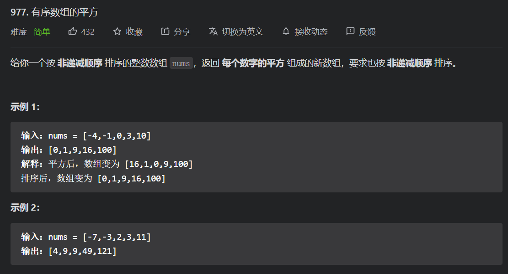

# 基础知识总结

## C/C++基础

---

### 头文件

- **string是c++语言中string类模板的申明**
- **string.h是标准C提高的字符处理函数集，面向char\*，C语言里面关于字符数组的函数定义的头文件**
- **cstring是c++对c语言中的strcpy之类的函数申明，包含cstring之后，就可以在程序中使用c语言风格的strcpy之类的函数。**

> string：是C++特化的字符容器，内含string类。
>
> string.h：strlen、strcmp、strcpy

```C++
#include <cmath> // 相当于C语言里面的#include <math.h>
#include <cstdio> // 相当于C语言里面的#include <stdio.h>
#include <cctype> // 相当于C语言里面的#include <ctype.h>
#include <cstring> // 相当于C语言里面的#include <string.h>
```

#### 常用函数的头文件

`#include<iostream>`

- max
- abs
- min
- to_string

---

### 类型别名

- 可以给复杂的数据类型起别名

#### typedef

```C++
typedef long long LL;
LL a = 12345678987654321,b=12345678912345678;
```

#### using【√】

```C++
using ll = long long;
ll a = 12345678987654321,b=12345678912345678;
```

------

### ASCII码

- **小写字母比大写字母的ASCII码值大32**

- - **0 ~ 9： 48~57**

  - **A ~ Z：65~90**

  - **a ~ z：97~122**

  - **\0：代表空字符，其ASCII码为0，注意\0不是空格**

  - **控制响铃的控制字符：7**

---

### 字符常量

- ###### 必须用单引号标注起来

```C++
char c1='z',c2='j',c3='117'; //字符就是按照ASCII码存储的 
printf("%c%c%c",c1,c2,c3);  //zju
```

------


### 字符串常量

> ​	字符串常量是**由若干字符组成的串**，在C语言中没有单独一种基本数据类型可以存储（C++中有string类型），只能使用字符数组的方式。字符常量就是单个使用单引号标记的字符，那么字符串常量则是由双引号标记的字符集。
>
> C：str[]
>
> C++：string

```C++
char str[10];
//scanf("%s",str);	// 输入不需要加&
char str[25] = "I wish I can get full marks in PAT advanced level."
//求长度
int len = strlen(str);
```

```C++
//getline(cin, s);  //输入
string s = "I wish I can get full marks in PAT advanced level."
//求长度
int len = s.size();		
//或者
int len = s.length();
```


### 预定义常量

- #define  ——  C
- const  ——  C++

#### 符号常量 - 宏定义

```C++
// 格式：#define 标识符 常量  (末尾不加分号)
#include<math.h>
#define PI acos(-1)
#define max(x,y) (x>=(y))?x:(y)
```

- **可以快速定义简单函数**

```C++
#include<stdio.h>
#define ADD(a,b) ((a)+(b))  
// 记得加上括号，因为“宏定义是直接将对应的部分替换”，可能会出现异常；末尾不要加分号 
int main(){
	int n1=3,n2=5;
	printf("%d",ADD(n1,n2));
	return 0;
}
```

#### **使用const**  （√  推荐使用）

```C++
// 格式：const 数据类型 变量名 = 常量；（末尾加分号）
const double pi = 3.1415926;
```

---

### 浮点型

- **碰到浮点型的数据都应该用double来存储，而不是float**

```C++
  double db;
  输入：scanf("%lf",&db); 
  输出：printf("%f",db);
```

---


### 布尔型

- **true和false在存储时分别为1和0，因此如果使用%d输出bool型变量，则true和false会输出1和0**

---


### 运算符

#### %  与    / 

- **% ：返回被除数与除数相除得到的余数**
-   **/  ：返回被除数与除数相除得到的整数**

#### 条件运算符

```C++
// 格式：  A ？ B ： C ，A为真时，执行并返回B，否则执行并返回C
#define MAX(a,b) ((a) > (b) ? (a) : (b))
int a = 3, b = 5;
printf("%d\n",MAX(a,b)); // 5
```

#### 位运算符

- **可能常用的是左移运算符，由于int型的上限为2^(31)-1，因此有时程序中无穷大的数INF可以设置成(1<<31)-1或（1<<30)-1**

```C++
  const int INF = (1 << 30) - 1
```

---


### 输入

#### cin

```C++
//需要加上下面两句话
#include<iostream>
using namespace std;
```

- 如果想要读入一整行，则需要使用getline函数，例如下面的代码就把一整行都读入char型数组str[100]中：

```C++
char str[100];
cin.getline(str,100);
```

- 如果是string容器，则采用如下的输入方式

```C++
string str;
getline(cin,str);
```

#### scanf( )


- **在scanf中除了char数组整个输入(不加&)，其他变量类型都要加&**

- **除了%c外，scanf对其他格式（如%d)的输入是以空白符（tab 空格）为结束判断标志的，因此除非使用%c把空格按字符读入，其他情况都会自动跳过空格。**
- **字符数组使用%s读入的时候以空格、换行符为读入结束的标志**
- **别忘了加&**

#### getchar( )

- 用来输入单个字符，某些scanf函数使用不便的场合可以使用getchar来输入字符
- 多用来识别换行符 \n

#### gets( )

- 获取“字符串”，从第一个字符开始读入，读到第一个"\n"字符（不包括）在这些字符后添加一个空字符"\0"，然后把这个字符串读进一个字符数组。它将读取换行符并将其丢弃，这样下一次读取从新的一行开始。
- gets()函数返回一个指向char的指针，返回的指针与传递给它的是同一指针。

```C++
char str[20];
char *ptr;
ptr = gets(str);
```

#### fgets( )

- fgets与gets不同在于它需要第二个参数来说明最大读入数，参数为n，则fgets()就会读取最多n-1个字符或者**读完一个换行符**为止，两者最先满足要求的那一个来结束读入。fgets()读取到换行符，就会把它存到字符串里，而不是像gets()那样丢弃它。它由第三个参数来说明读哪一个文件，stdin代表从键盘读入。

```C++
char *str;
char *ptr;
ptr = fgets(str,20,stdin);
```


#### sscanf( )

- 从字符串读取格式化输入输出

```C++
int day, year;
char weekday[20], month[20], str[100];
// 将后面的这个字符串复制到str中
strcpy( str, "Saturday March 25 1989" ); 
// 将str按照给定格式赋值给后面的变量，记得数组不需要加 &
sscanf( str, "%s %s %d  %d", weekday, month, &day, &year ); 
printf("%s %d %d ， %s\n", month, day, year, weekday );
// 输出结果 ：March 25 1989 ， Saturday
```

---

### 输出

#### cout

- 如果想要控制double型的精度，例如输出小数点后两位，那么需要在输出之前加上一些东西，并且要加上`#include<iomanip>`头文件，下面的代码会输出123.46：

```C++
#include<iomanip>
cout<<setiosflags(ios:fixed)<<setprecision(2)<<123.4567<<endl;
```

- 不建议使用cin和cout，因为他们在输入大量数据时表现的十分糟糕，有时候题目的数据还没有输入完毕就已经超时。因此还是推荐使用scanf和printf，只有在十分必要的时候才使用cin和cout

#### printf( )


- 对于double类型的变量，其输出格式变成了%f，而在scanf中却是%lf

- 下面介绍三种常用的输出格式

  1. %md ：使不足m位的int型变量以m位进行右对齐输出，其中高位用空格补齐；如果变量本身超过m位，保持原样

     ```C++
     #include<stdio.h>
     int main(){
         int a = 123, b = 1234567;
         printf("%5d\n",a);
         printf("%5d\n",b); 
     }
     // 输出结果：
     |  123
     |1234567
     ```

  2. %0md ：只是在%md中间多加了0，和md的唯一不同点在于，当变量不足m位时，将在前面补足够数量的0而不是空格

     ```C++
     #include<stdio.h>
     int main(){
         int a = 123, b = 1234567;
         printf("%05d\n",a);
         printf("%05d\n",b); 
     }
     // 输出结果：
     |00123
     |1234567
     ```

  3. %.mf ：可以让浮点数保留m位小数输出，这个“保留”使用的是精度的“四舍六入五成双”规则。很多题目都会要求浮点数的输出保留XX位小数，就是用这个格式来进行输出（如果是四舍五入，那么就需要用到round函数）

     ```C++
     #include<stdio.h>
     int main(){
         double dl = 12.3456;
         printf("%lf\n",dl);
         printf("%.0f\n",dl);
         printf("%.1f\n",dl);
         printf("%.2f\n",dl);
         printf("%.3f\n",dl);
         printf("%.4f\n",dl);
     	return 0;
     }
     // 输出结果：
     |12.345600
     |12
     |12.3
     |12.35
     |12.346
     |12.3456
     ```

#### putchar( )

- 用来输出单个字符，某些printf函数使用不便的场合可以使用putchar来输出字符

#### puts( )

- 输出字符串，从输入指针所指向的字符开始，到遇到的第一个’\0’字符结束输出，结束后自动换行。

```C++
char str[20];
char *ptr;
ptr = gets(str);
puts(ptr); //等价写法↓ 
printf("%s\n",ptr);
printf("%s\n",str);//可以直接输出数组，也可以输出指针 
```


#### sprintf()

- 格式化数字字符串

  **sprintf 最常见的应用之一是把整数打印到字符串中**，所以，spritnf 在大多数场合可以替代itoa。如：

```C++
1>把整数123 打印成一个字符串保存在s 中。
  sprintf(s, "%d", 123); //产生"123"
2>可以指定宽度，不足的左边补空格：
  sprintf(s, "%8d%8d", 123, 4567); //产生：" 123 4567"
3>当然也可以左对齐：
  sprintf(s, "%-8d%8d", 123, 4567); //产生："123 4567"
4>也可以按照16进制打印：
  sprintf(s, "%8x", 4567); //小写16 进制，宽度占8 个位置，右对齐
  sprintf(s, "%-8X", 4568); //大写16 进制，宽度占8 个位置，左对齐
  这样，一个整数的16进制字符串就很容易得到，但我们在打印16进制内容时，通常想要一种左边补0的等宽格式，那该怎么做呢？很简单，在表示宽度的数字前面加个0就可以了。
  sprintf(s, "%08X", 4567); //产生："000011D7"
  上面以"%d"进行的10进制打印同样也可以使用这种左边补0 的方式。
```


---


### 数组

#### 一维数组

```C++
int a[10];
double db[100];
char str[1000];
bool HashTable[10000];
```

**如果想要给整个数组都赋初值为0，只需要把第一个元素赋值为0，或者只用一个大括号来表示。**

```C++
int a[10]={0}
int a[10]={}
```


#### 二维数组

```C++
int a[5][6];
double db[10][10];
char str[256][256];
bool vis[1000][1000];
```

赋值

```C++
int a[5][6]={{3,1,2},{8,4},{},{1,2,3,4,5}};
>> 3 1 2 0 0 0
   8 4 0 0 0 0 
   0 0 0 0 0 0
   1 2 3 4 5 0
   0 0 0 0 0 0
```

- **如果数组大小较大（大概10^6级别），则需要将其定义在主函数外面，否则会使程序异常退出。原因是函数内部申请的局部变量来自系统栈，允许申请的空间较小；而函数外部申请的全局变量来自静态存储区，允许申请的空间较大。**

```c++
#include<stdio.h>
int a[1000000];  //这里就定义在main函数外面了
int main(){
	for(int i=0;i<1000000;i++)
		 a[i]=i;
	return 0;
}
```


#### fill

- fill (first, last, a)  
- first 为容器的首迭代器，last为容器的末迭代器，val为将要替换的值。

```C++
int a[200];
fill(a, a+100, 1);
```

#### memset

- memset(arr，a，sizeof(arr))
- 对数组中每一个元素赋相同的值(0或-1）
- 需要引入头文件<string.h>

```C++
#include<stdio.h>
#include<string.h>
int main(){
	int a[5][6];
	memset(a,-1,sizeof(a));
    //输出
	for(int i = 0;i<4;i++){
		for(int j =0;j<5;j++)
			printf("%d",a[i][j]);
		printf("\n");
	}
	printf("\n");
	return 0;
} 
|-1-1-1-1-1
|-1-1-1-1-1
|-1-1-1-1-1
|-1-1-1-1-1

```

---


#### 字符数组

##### 两种初始化

```C++
char str1[15]="Good Story!";
char str2[15]={'G','o','o','d',' ','S','t','o','r','y','!'};
for (auto x:str2) cout<<x;
// Good Story!
```

##### 输入输出

```
字符数组就是char数组，当维度为一维时可以当做"字符串"。当维度为一维时可以当做字符串数组，即若干字符串
```

1. scanf输入，printf输出

   scanf对字符类型有%c和%s两种格式（printf同理，下同），其中%c用来输入单个字符，%s用来输入一个字符串并存在字符数组中。%c格式能够识别空格跟换行并将其输入，而%s通过空格或换行来识别一个字符串的结束

   ```C++
   #include<stdio.h>
   int main(){
       char str[10];
       scanf("%s",str);	// 不需要加&
       printf("%s",str);
       return 0;
   }
   // 输入：Hello World
   // 输出：Hello
   //可以看到 %s识别空格作为字符串的结尾。
   ```

2. getchar输入，putchar输出

   分别用来输入和输出单个字符

   ```C++
   // 输入一个3x3的矩阵
   #include<stdio.h>
   int main(){
       char str[5][5];
       for(int i = 0; i < 3; i++){
           for(int j = 0; j < 3; j++){
               str[i][j] = getchar();
           }
           getchar();	// 这句是为了把输入中每行末尾的换行符吸收掉
       }
       for(int i = 0; i < 3; i++){
           for(int j = 0; j < 3; j++){
               putchar(str[i][j]);
           }
           putchar('\n');	//每输出一行就打印一个换行标志
       }
       return 0;
   }
   ```

   

3. gets输入，puts输出

   gets用来输入一行字符串（注意：gets识别换行符\n作为输入结束，因此scanf完一个整数后如果要使用gets，需要先用getchar接收整数后的换行符），并将其存放于一位数组（或二维数组的一维）中；

   puts用来输出一行字符串，即将一位数组（或二维数组的一维）在界面上输出，并紧跟一个换行。

   ```c++
   #include<stdio.h>
   int main(){
       char str1 [20];
       char str2 [5][10];
       // 输入一个字符串
       gets(str1);
       // 输入三个字符串
       for(int i =0; i < 3; i++)
           gets(str2[i]);
       
       // 输出str1
       puts(str1);
       // 循环输出 str2
       for(int i = 0;i < 3; i++)
           puts(str2);
       return 0;
   }
   ```
##### 字符数组的存放方式

- 字符数组是由若干个char 类型元素组成，所以字符数组的每一位都是一个char字符，

- 字符串的结束符\0的ASCII码为0，即空字符NULL，占用一个字符位，因此开**字符数组**的时候千万要记得字符数组的长度一定要比实际存储字符串的长度至少多1。
- **注意：**int 数组的末尾不需要加\0，只有char型数组才需要。还需要注意\0跟空格不是同一个东西，空格的ASCII码为32

---


### 函数

```C++
返回类型  函数名称（参数类型  参数）{
      函数主体
}
```

- 如果自定义函数只是单纯实现一些语句而不返回变量，那么返回类型为void。

- 需要填写参数的函数被称为有参函数。

```C++
#include<stdio.h>
char judge(int x){
	if(x>0)return '+';
	else if(x==0) return '0';
	else return '-';
}
int main(){
	int a,ans;
	scanf("%d",&a);
	ans = judge(a);
	printf("%c\n",ans);
	return 0;
}// 判断输入的数字是整数还是负数。
```

- 函数的参数个数可以不止一个，多余一个的情况只需要用逗号隔开，传入参数时为止对应即可。

```C++
#include<stdio.h>
int MAX(int a,int b,int c){
	int M;
    if( a >= b && a >= c) M = a;
    else if(b >= a && b >=c )M = b;
    else M = c;
    return M;
}
int main(){
    scanf("%d%d%d",&a,&b,&c);
    printf("%d\n",MAX(a,b,c));
    return 0;
}// 输入三个整数，然后输出三个整数中的最大数
```

#### 以数组作为函数参数

```
函数的参数也可以是数组，且数组作为参数时，参数中数组的第一维不需要填写长度（二维数组的话，第二维需要填写长度），实际调用时也只需要填写数组名，最重要的是，数组作为参数时，在函数中对数组元素的修改就等同于是对原数组元素的修改（这与普通的局部变量不同）
```

```C++
#include<stdio.h>
void change(int a[], int b[][5]){ 
	a[0] = 1;
	a[1] = 3;
	a[2] = 5;
	b[0][0] = 1;
	b[2][3] = 32;
}
int main(){
	int a[3] = {0};
	int b[5][5] = {0};
	change(a,b);
	for(int i = 0;i <3; i++){
		printf("%d\n",a[i]);
	}
	for(int i = 0; i<5;i++){
		for(int j= 0;j<5;j++){
			printf("%d ",b[i][j]);
		}
		putchar('\n');
	}
	return 0;
}
```

#### 函数的嵌套调用

```C++
#include<stdio.h>
int max_2(int a,int b){
	if(a>b) return a;
	else returnb;
}
int max_3(int a,int b,int c){
	int temp = max_2(a,b);
	temp = max_2(temp,c);
	return temp;
}
int main(){
	int a,b,c;
	scanf("%d%d%d",&a,&b,&c);
	printf("&d\n",max_3(a,b,c));
	return 0;
}

```

#### 函数的递归调用

```C++
#include<stdio.h>
int F(int n){
	if(n==0) return 1;
	else return F(n-1) * n;
} 
int main(){
	int n;
	scanf("%d",&n);
	printf("%d",F(n));
	return 0;
}
```


---


### 指针

```
指针变量存放的是地址，而&则是取地址运算符，因此给指针变量赋值的方式一般是**把变量的地址取出来，然后赋值给对应类型的指针变量**
```

```C++
int a;
int *p = &a;
// 上面的代码也可以写成
int a;
int *p;
p = &a;
// 如果需要给多个指针遍历初始化，方法也是一样的：
int a,b;
int *p1 = &a, *p2 = &b;
```

- p是变量名，\*p只是代表指针p，因此地址&a是赋值给p而不是\*p的。记住*只是类型的一部分

---

#### 指针与数组

```C++
//a作为数组的首地址&a[0]而被赋值给指针变量p，a+i作为数组的&a[i]而被赋值给指针变量p+i
int a[10];
int* p=&a;
```

```C++
//指针变量可以使用自增操作，因此可以这样枚举数组中的元素
int a[10] = {1,2,3,4,5,6,7,8,9,10};
for (int *p = a; p < a + 10; p++){
    printf("%d",*p);
}//1 2 3 4 5 6 7 8  10
```

```C++
//指针的减法，所减得结果表明两个指针之间的类型差距：两个int型的指针相减，等价于在求两个指针之间相差了几个int.
#include<stdio.h>
int main(){
	int a[10]={1,4,9,16,25,36,49};
	int* p=a;
	int* q=&a[5];
	printf("q=%d\n",q);
	printf("p=%d\n",p);
	printf("q-p=%d\n",q-p);
	return 0;
}
/* 运行结果：
  q=2293284
  p=2293264
  q-p=5      */
```

#### 使用指针变量作为函数参数

- 指针变量作为函数参数的类型时，视为把变量的地址传入函数。如果在函数中对这个地址中的元素进行改变，原先的数据就会确实地改变。

- 只有在获取地址的情况下对元素进行操作，才能真正地修改变量

```C++
/*经典例子：使用指针作为参数，交换两个数*/
#include<stdio.h>
void change(int *p,int *q){
	int temp = *p;
	*p = *q;
	*q = temp; 
}
int main(){
	int a = 2, b = 3;
	int *p1 = &a, *p2 = &b;
	change(p1,p2);
	printf("a = %d, b = %d",*p1,*p2);
	return 0;
} // a = 3, b = 2
```

---

### 引用

```
	众所周知，函数的参数是作为局部变量的，对局部变量的操作不会影响外部的变量，如果想要修改传入的参数，那么只能用指针。那么，有没有办法可以不使用指针，也能达到修改传入参数的目的？  一个很方便的方法是使用C++中的“引用”。
```

- **引用不产生副本，而是给原变量起了个别名。**这样旧名字和新名字都是指向同一个东西，且对引用变量的操作就是对原变量的操作。

- 使用方法：在函数的参数类型后面加个&就可以了，一般加在变量名前面。

- 注意：要把**引用&**跟**取地址符&**区分开来，引用并不是取地址的意思。

```C++
#include<stdio.h>
void change(int &x){
	x=1;
}
int main(){
	int x=10;
	change(x);
	printf("%d\n",x);
	return 0;
}
```

- change函数的参数int x中加了&，在传入参数时对参数的修改就会对原变量进行修改。形参与实参可以不同。

```C++
void change(int &a){
    a=1;
}
```


### 结构体

#### 定义

```C++
struct Name{
    //一些基本的数据结构或者自定义的数据类型
}；
```

```C++
struct studentInfo{
	int id;
	char gender;//'F' or 'M'
	char name[20];
	char major[20];
};
studentInfo Alice;
studentInfo stu[1000];
```

- 这种定义与下面的定义方式是等价的

```C++
struct studentInfo{
	int id;
	char gender;//'F' or 'M'
	char name[20];
	char major[20];
}Alice,stu[1000];
```

#### 访问元素

```C++
//定义学生的结构体，next用来指向下一个学生的地址，且结构变量中定义了普通变量stu和指针变量p
struct studentInfo{
	int id;
    cahr name[20];
    studentInfo *next;
}stu,*p;
//访问stu
stu.id
stu.name
stu.next
//访问p的方式有两种：
(*p).id     <=>   p->id
(*p).name   <=>   p->name
(*p).next   <=>   p->next

```

#### 初始化（构造函数）

- 当然可以直接scanf或赋值；但当结构体内变量很多时并不方便，于是引入构造函数...
- **构造函数**：用来初始化结构体的函数，直接定义在结构体中。它不需要写返回类型，且函数名与结构体名相同。
- 构造函数在结构体内元素比较多的时候就会使代码显得精炼，因为可以不需要临时变量就初始化一个结构体，而且代码更加工整。
- 三种结构体初始化方法

> 1.利用结构体自带的默认构造函数
> 2.利用默认无参的构造函数
> 3.利用带参数的构造函数

```C++
struct studentInfo{
	int id;
	char gender;//'F' or 'M'
	char name[20];
	char major[20];
	//默认生成的构造函数 :studentInfo(){}
	//下面的参数用以对结构体内部变量进行赋值：
	studentInfo(int _id,char _gender,char _name,char _major){
		//赋值
		id=_id;
		gender=_gender;
		name=_name;
		major=_major; 
	} 
}Alice,stu[1000];
```

- 如果自己重新定义了构造函数，则不能不经过初始化就定义结构体变量，也就是说，默认生成的构造函数“studenInfo(){}”此时被覆盖了。为了既能不初始化就定义结构体变量，又能享受初始化带来的便捷，可以把“studentInfo(){}”手动加上。这意味着，只要参数个数和类型不完全相同，就可以定义任意多个构造函数，以适应不同的初始化场合

```C++
struct studentInfo{
    int id;
    char gender;
    //用以不初始化就定义结构体变量
    studentInfo(){}
    //只初始化gender
    studentInfo(char _gender){
        gender = _gender;
    }
    //同时初始化id和gender
    studentInfo(int _id,char _gender){
        id = _id;
        gender = _gender;
    }
}
```

- 下面是一个实例：其中Point用于存放平面点的坐标x、y

```C++
#include<stdio.h>
struct Point{
	int x, y;
    Point(){};	//用以不经初始化地定义pt[10]
    Point(int _x, int _y):x(_x), y(_y){}	//用以提供x和y的初始化
}pt[10];

int main(){
    int num = 0;
    for(int i = 1; i <= 3; i++){
        for(int j = 1; j <= 3; j++){
            pt[num++] = Point(i,j);	//直接使用构造函数
        }
    }
    for(int i = 0; i < num; i++){
        printf("%d,%d",pt[i].x,pt[i].y);
    }
    return 0;
}
```

### 结构体构造函数

**要点**：
	在建立结构体数组时,如果只写了带参数的构造函数将会出现数组无法初始化的错误！！！各位同学要牢记呀！下面是一个比较安全的带构造的结构体示例

```C++
struct node{
    int data;
    string str;
    char x; 
  node() :x(), str(), data(){} //无参数的构造函数数组初始化时调用
  node(int a, string b, char c) :data(a), str(b), x(c){}//有参构造 
  //注意构造函数最后这里没有分号哦！
}N[10];
```

​	下面我们分别使用默认构造和有参构造，以及自己手动写的初始化函数进行会结构体赋值并观察结果。测试代码如下：

```C++
#include <iostream>
#include <string>
using namespace std;
struct node{
	int data;
	string str;
	char x;
	//自己写的初始化函数
	void init(int a, string b, char c){
		this->data = a;
		this->str = b;
		this->x = c;
	}
	node() :x(), str(), data(){}
	node(int a, string b, char c) :x(c), str(b), data(a){}
}N[10];
int main()
{
	  N[0] = { 1,"c++",'d' };    //无参默认结构体构造体函数
	  N[1].init(2, "java", 'e'); //自定义初始化函数的调用
	  N[2] = node(3, "python", 'f'); //有参数结构体构造函数

	//现在我们开始打印观察是否已经存入
	for (int i = 0; i < 3; i++){
		cout << N[i].data << " " << N[i].str << " " << N[i].x << endl;
	}
	system("pause");
	return 0;
}
```

**输出结果**

```c++
1 c++ d
2 java e
3 python f
```


### 浮点数的比较 eps

```C++
#include<stdio.h>
#include<math.h> 
const double eps = 1e-8;
const double Pi = acos(-1.0); 

//判断两个数a和b之间的关系，满足则返回True,否则返回False 
#define Equ(a,b) ((fabs((a)-(b)))<(eps))   //相等 
#define More(a,b) (((a)-(b))>(eps))		   //大于 
#define Less(a,b) (((a)-(b))<(-eps))	   //小于 
#define MoreEqu(a,b) (((a)-(b))>(-eps))    //大于等于 
#define LessEqu(a,b) (((a)-(b))<(eps))     //小于等于 

int main(){
	double db=1.23;
	if(Equ(db,1.23)){
		printf("True");
	}else{
		printf("False");
	}
	return 0;
}
```

---


### 黑盒测试

#### 多点测试

##### while--EOF

- 当题目没有说明有多少数据需要读入时，就可以利用scanf的返回值是否为EOF来判断输入是否结束
- 该循环判断条件既能够保证对多组测试数据进行处理，又使程序在输入结束后能够正常退出。
- 反之，如果不适用循环，那么程序在处理完一组数据后就会退出，造成后续测试数据无法被正常处理。

```C++
#include<stdio.h>
int main(){
	int a,b;
    while(scanf("%d %d",&a,&b) != EOF){
        printf("%d\n",a+b);
    }
    return 0;
}

//如果读入字符串，则有下面的写法
while(scanf("%s",str) != EOF){
    ...
}
while(gets(str) != NULL){
    ...
}

```

##### while--break

- 题目要求当输入的数据满足某个条件时停止输入

```C++
#include<stdio.h>
int main(){
    int a,b;
    while(scanf("%d%d",&a,&b)!=EOF){
        if(a==0 && b==0) break;
        printf("%d\n",a+b);
    }
    return 0;
}
```

##### while(T--)

- 题目会给出测试数据的组数，然后才给出相应数量组数的输入数据

```C++
#include<iostream>
using namespace std;
int main(){
    int T,a,b;
    cin>>T;
    while(T--){
        cin>>a>>b;
        cout<<a+b<<endl;
    }
    return 0;
}
```


## C 常用函数


### <math.h>

- fabs(double x) 取绝对值

```C++
double db = -1.24;
printf("%.2f",fabs(db));	// 1.24
```

- floor(double x) 向下取整  (比x小)
- ceil(double x)  向上取整   (比x大)
- round(double x) 四舍五入取整

```C++
double db1 = -5.2,db2 = 5.2;
printf(".0f %.0f\n",floor(db1),floot(db2));  // -6  5
printf(".0f %.0f\n",ceil(db1),ceil(db2));    // -5  6
printf(".0f %.0f\n",round(db1),round(db2));  // -5  5
```

- pow(double r, double p) 取指数r^p

```C++
double db = pow（2.0, 3.0);
printf("%f\N",db);	  // 8.000000
```

- sqrt(double x) 取平方根

```C++
double db = sqrt(2.0);
printf("%f\n",db);		//1.414214
```

- log(double x) 取对数 。C语言中没有对任意底数求对数的函数，因此必要时必须使用换底公式

```C++
double db = log(1.0);
printf("%f\n,db");		// 0.000000
```

- sin(double x)、cos(double x)、tan(double x)：求三角函数（参数为弧度制）
  - const double pi = acos(-1.0)  这样取pi可以保证准确性

```C++
const double pi = acos(-1.0), 
double db1 = sin(pi*45/180);
double db2 = cos(pi*45/180);
double db3 = tan(pi*45/180);
printf("%f, %f, %f\n",db1,db2,db3); //0.707107, 0.707107, 1.000000	
```

- asin(double x)、acos(double x)、atan(double x)：求反三角函数

```C++
double db1 = asin(1);
double db2 = acos(-1.0);
double db3 = atan(0);
printf("%f,%f,%f\n",db1,db2,db3);   //1.570796,3.141593,0.000000
```


### <string.h>

- strlen(str)：获取str长度

```c
//strlen(src):计算字符串 str 的长度，直到空结束字符，但不包括空结束字符。
#include <stdio.h>
#include <string.h>
int main (){
   char str[50];
   int len;
   strcpy(str, "abc");
   len = strlen(str);
   printf("|%s| 的长度是 |%d|\n", str, len); 
  return(0);
}
运行结果：
|abc| 的长度是 |3|
```

- substr
  - str.substr(begin,length) 表示切割字符串str，从下标begin处开始，长度为length来切片

```C++
string a = "abcd";
string tmp = a.substr(0,3);
cout << tmp; //输出结果：abc
```


- strcpy(str1, str2)：将str2复制给str1

```c
#include <stdio.h>
#include <string.h>
int main(){
  char str1[]="Sample string";
  char str2[40];
  char str3[40];
  strcpy (str2,str1);
  strcpy (str3,"copy successful");
  printf ("str1: %s\nstr2: %s\nstr3: %s\n",str1,str2,str3);
  return 0;
}
运行结果：
str1: Sample string
str2: Sample string
str3: copy successful
```

- strcmp(str1, str2)：比较字符串str1和str2的字母序大小关系,str1大则返回1，否则为-1，等于为0

```c
//strcmp(str1,str2): 把str1和str2进行比较（ASCII: A-Z < a-z)
#include <stdio.h>
#include <string.h>
int main (){
   char str1[15];
   char str2[15];
   int ret;
   strcpy(str1, "Abc");
   strcpy(str2, "ABC");
   ret = strcmp(str1, str2);
   if(ret > 0){
       printf("str1 大于 str2");
   }else if(ret = 0) {
              printf("str1 等于 str2");
          }else{
              printf("str1 小于 str2");
         }
   return 0;
}
运行结果：
str1 大于 str2
```

- strcat(str1, str2)：将str2添加到str1后面 // 也可以直接str1 + str2

```c
//strcat(dest,src):把 src 所指向的字符串追加到 dest 所指向的字符串的结尾。 
#include <stdio.h>
#include <string.h>
int main (){
   char src[50], dest[50];
   strcpy(src,  "This is source.");
   strcpy(dest, "This is destination");
   strcat(dest, src);
   printf("最终的目标字符串： |%s|", dest);  
   return(0);
}
运行结果：
最终的目标字符串： |This is destinationThis is source.|
//                |        ↑dest     |      ↑src    |
```

- strstr(str1, str2)：在字符串str1中查找第一次出现字符串str2的位置，不包含终止符 '\0'

```c
//strstr(s,n):在字符串s中查找第一次出现字符串n的位置，不包含终止符 '\0'
#include <stdio.h>
#include <string.h>
int main(){
   const char haystack[20] = "RUNOOB";
   const char needle[10] = "NOOB";
   char *ret;
   ret = strstr(haystack, needle);
   printf("子字符串是： %s\n", ret);
   return(0);
}
运行结果：
子字符串是： NOOB
```

- 整合

```C++
#include<stdio.h>
#include<string.h>
int main(){
char str1[50],str2[50];
	gets(str1);				 // 输入 Hello
	gets(str2);               // 输入 World
	int len=strlen(str1); 
	printf("str1的长度为%d\n",len); // str1的长度为5
    //比较字符串str1和str2的大小关系,
	int cmp=strcmp(str1,str2);	 // 返回cmp = -1  
	if(cmp<0) 
        printf("str1<str2 \n");   // str1<str2
	else if(cmp>0) 
        printf("str1>str2 \n");
	else 
        printf("str1==str2 \n");
	printf("复制之前的str1为:%s\n",str1);    // Hello
	strcpy(str1,str2);//将str2复制给str1 
	printf("复制之后的str1为:%s\n",str1);	   // World
    strcat(str1,str2);//把str2拼接到str1的后面 
	printf("拼接之后的str1为:%s\n",str1);	   // WorldWorld
	return 0;
} 
```


### <ctype.h>  / < cctype>

字符处理库

```C
// isalpha() 判断一个字符是否是字母
#include <stdio.h>
#include <ctype.h>  // #include<cctype> C++文件中这样写
int main (){
    int i=0;
    char str[]="C++ Java";
    while (str[i]){
        if (isalpha(str[i])) 
            printf ("character %c is alphabetic\n",str[i]);
        else 
            printf ("character %c is not alphabetic\n",str[i]);
       i++;
    }
    return 0;
}
运行结果：
character C is alphabetic
character + is not alphabetic
character + is not alphabetic
character   is not alphabetic
character J is alphabetic
character a is alphabetic
character v is alphabetic
character a is alphabetic
```

```C
//isalnum() 判断一个字符是否是字母或数字
#include <stdio.h>
#include <ctype.h>
int main (){
    int i = 0, n = 0;
    char str[] = "*ab%c123_ABC-.";
    while(str[i]){
        if( isalnum(str[i]) ) n++;
        i++;
    }
    printf("There are %d characters in str is alphanumeric.\n", n);
    return 0;
}
运行结果：There are 9 characters in str is alphanumeric.
```

- isblank() 所指的空白符是 isspace() 的一个子集。

```c
//isblank() 判断一个字符是否是空白符
#include <stdio.h>
#include <ctype.h>
int main (){
    char c;
    int i=0;
    char str[]="It's really difficult to C-language\n";
    while (str[i]){
        c = str[i];
        if (isblank(c)) c = '\n';
        putchar (c);
        i++;
    }
    return 0;
}
运行结果：
It's
really
difficult
to
C-language
```

```C
//isdigit() //判断一个字符是否是字母或数字
#include <stdio.h>
#include <stdlib.h>
#include <ctype.h>
int main (){
    char str[]="1776ad";
    int year;
    if (isdigit(str[0])){
        year = atoi (str);
        printf ("The year that followed %d was %d.\n", year, year+1);
    }
    return 0;
}
运行结果：
The year that followed 1776 was 1777.
```

```C
//islower() 判断一个字符是否是小写字母
#include <stdio.h>
#include <ctype.h>
int main (){
    int i=0;
    char str[]="c c++ java python.\n";
    char c;
    while (str[i]){
        c=str[i];
        if (islower(c)) c=toupper(c);
        putchar (c);
        i++;
    }
    return 0;
}
运行结果：
C C++ JAVA PYTHON.
```

```C
//ispunct() 判断一个字符是否是标点符号
//统计一段文本中标点符号的个数
#include <stdio.h>
#include <ctype.h>
int main (){
    int i=0;
    int cx=0;
    char str[]="Hello, welcome!";
    while (str[i]){
        if (ispunct(str[i])) cx++;
        i++;
    }
    printf ("Sentence contains %d punctuation characters.\n", cx);
    return 0;
}
运行结果：
Sentence contains 2 punctuation characters.
```

```C
isspace() //判断一个字符是否是空白符
#include <stdio.h>
#include <ctype.h>
int main (){
    char c;
    int i=0;
    char str[]="Example sentence to test isspace\n";
    while (str[i]){
        c=str[i];
        if (isspace(c)) c='\n';
        putchar (c);
        i++;
    }
    return 0;
}
运行结果：
Example
sentence
to
test
isspace
```

```C
//isupper() 判断一个字符是否是大写字母
//islower() 判断一个字符是否是小写字母
//tolower() 将大写字母转换为小写字母
//toupper() 将大写字母转换为大写字母
#include <stdio.h>
#include <ctype.h>
int main (){
    int i = 0;
    char str[] = "C C++ Java Python.\n";
    char c;
    while(str[i]){
        c = str[i];
        if(isupper(c)) c = tolower(c);
      //if(islower(c)) c = toupper(c);
        putchar(c);
        i++;
    }
    return 0;
}
运行结果：
c c++ java python.
```

```C
//isxdigit() 判断一个字符是否是十六进制数字
#include <stdio.h>
#include <stdlib.h>
#include <ctype.h>
int main (){
    char str[]="fBdE";
    long int number;
    if (isxdigit(str[0])){
    //isxdigit() 用来检测 str 字符串中第 0 个字符是否是有效的十六进制数字，
   //如果是，那么使用 strtol() 函数将 str 转换为十进制数字。
        number = strtol (str,NULL,16); 
        printf ("The hexadecimal number %lx is %ld.\n",number,number);
    }
    return 0;
}
运行结果：
The hexadecimal number fbde is 64478.
```


## C++ 常用函数

### bool

```C++
bool flag = true;
bool flag2 = -2; // flag2为true
bool flag3 = 0; // flag3为false
```

---

### < string>


#### to_string

可以把一个 int 型变量或者一个数字转化为 string 类型的变量，当然也可以转 double 、 float 等类型的变量，这在很多字符串处理的题目中很有用处。

```C++
#include<iostream>
#include<string>
using namespace std;
int main(){
	string s1 = to_string(123);	//将123这个数字转换成字符串
	cout<< s1 <<endl;
	string s2 = to_string(4.5);	//将4.5这个数字转换成字符串
	cout<< s2 <<endl;
	cout<< s1 + s2 <<endl;	//将s1和s2两个字符串拼接起来并输出
	printf("%s\n",(s1+s2).c_str());		//如果想要用printf输出string，得加一个.c_str
	return 0;  
} 
```


#### stoi、stod

stoi 、 stod 可以将字符串 string 转化为对应的 int 型、 double 型变量，这在字符串处理理的很多问题中很有帮助～

```C++
/*
 * stoi / stod
 * stof (string to float)
 * stold (string to long double)
 * stol (string to long)
 * stoll (string to long long)
 * stoul (string to unsigned long)
 * stoull (string to unsigned long long)
 */
#include<iostream>
#include<string>
using namespace std;
int main(){
	string str = "123";
	int a = stoi(str);//如果输入的是123.4，那么stoi会自动截取最前面的数字，直到遇到不是数字为止 
	cout<<a<<endl;   //123
	str = "0.44";
	double b = stod(str);
	cout<<b<<endl;	//0.44
	return 0;
} 
```


```C++
/**
 * string的构造函数的形式 
 *
 * string str：生成空字符串
 * string s(str)：生成字符串为str的复制品
 * string s(str, strbegin,strlen)：将字符串str中从下标strbegin开始、长度为strlen的部分作为字符串初值
 * string s(cstr, char_len)：以C_string类型cstr的前char_len个字符串作为字符串s的初值
 * string s(num ,c)：生成num个c字符的字符串
 * string s(str, stridx)：将字符串str中从下标stridx开始到字符串结束的位置作为字符串初值
 */
void test1(){
	string str1;               //生成空字符串
    string str2("123456789");  //生成"1234456789"的复制品
    string str3("12345", 0, 3);//结果为"123"
    string str4("0123456", 5);  //结果为"01234"
    string str5(5, '1');       //结果为"11111"
    string str6(str2, 2);      //结果为"3456789"
    
    cout<<"str2:"<<str2<<endl;
    cout<<"str3:"<<str3<<endl;
    cout<<"str4:"<<str4<<endl;
    cout<<"str5:"<<str5<<endl;
    cout<<"str6:"<<str6<<endl;
}

/**
 * string的大小和容量 
 * 
 * size()和length()：返回string对象的字符个数，他们执行效果相同。
 * max_size()：返回string对象最多包含的字符数，超出会抛出length_error异常
 * capacity()：重新分配内存之前，string对象能包含的最大字符数
 */
void test2(){
    string s("1234567");
    cout << "size=" << s.size() << endl;
    cout << "length=" << s.length() << endl;
    cout << "max_size=" << s.max_size() << endl;
    cout << "capacity=" << s.capacity() << endl;

}

/**
 *  string的字符串比较
 *
 *    C++字符串支持常见的比较操作符（>,>=,<,<=,==,!=），甚至支持string与C-string的比较(如 str < "hello")。 
   在使用>,>=,<,<=这些操作符的时候是根据“当前字符特性”将字符按字典顺序进行逐一比较。字典排序靠前的字符小，  
   比较的顺序是从前向后比较，遇到不相等的字符就按这个位置上的两个字符的比较结果确定两个字符串的大小(前面减后面)
   同时，string ("aaaa") < string("aaaaa")。    
 *    另一个功能强大的比较函数是成员函数compare()。他支持多参数处理，支持用索引值和长度定位子串来进行比较。 
   他返回一个整数来表示比较结果，返回值意义如下：0：相等 1：大于 -1：小于 (A的ASCII码是65，a的ASCII码是97)
 */
void test3(){
    // (A的ASCII码是65，a的ASCII码是97)
    // 前面减去后面的ASCII码，>0返回1，<0返回-1，相同返回0
    string A("aBcd");
    string B("Abcd");
    string C("123456");
    string D("123dfg");
    // "aBcd" 和 "Abcd"比较------ a > A
    cout << "A.compare(B)：" << A.compare(B)<< endl;                          // 结果：1
    // "cd" 和 "Abcd"比较------- c > A
    cout << "A.compare(2, 3, B):" <<A.compare(2, 3, B)<< endl;                // 结果：1
    // "cd" 和 "cd"比较 
    cout << "A.compare(2, 3, B, 2, 3):" << A.compare(2, 3, B, 2, 3) << endl;  // 结果：0
    // 由结果看出来：0表示下标，3表示长度
    // "123" 和 "123"比较 
    cout << "C.compare(0, 3, D, 0, 3)" <<C.compare(0, 3, D, 0, 3) << endl;    // 结果：0
}

/**
 * string的插入：push_back() 和 insert()
 */
void  test4(){
    string s1;

    // 尾插一个字符
    s1.push_back('a');
    s1.push_back('b');
    s1.push_back('c');
    cout<<"s1:"<<s1<<endl; // s1:abc

    // insert(pos,char):在指定的位置pos前插入字符char
    s1.insert(s1.begin(),'1');
    cout<<"s1:"<<s1<<endl; // s1:1abc
}

/**
 * string拼接字符串：append() & + 操作符
 */
void test5(){
    // 方法一：append()
    string s1("abc");
    s1.append("def");
    cout<<"s1:"<<s1<<endl; // s1:abcdef

    // 方法二：+ 操作符
    string s2 = "abc";
    /*s2 += "def";*/
    string s3 = "def";
    s2 += s3.c_str();
    cout<<"s2:"<<s2<<endl; // s2:abcdef
}

/**
 * string的遍历：借助迭代器 或者 下标法
 */
void test6(){
    string s1("abcdef"); 
    // 方法1： 下标法
    for( int i = 0; i < s1.size() ; i++ )
        cout<<s1[i];
    cout<<endl;

    // 方法二：正向迭代器
    string::iterator iter = s1.begin();
    for( ; iter < s1.end() ; iter++)
        cout<<*iter;
    cout<<endl;

    // 方法三：反向迭代器
    string::reverse_iterator riter = s1.rbegin();
    for( ; riter < s1.rend() ; riter++)
        cout<<*riter;
    cout<<endl;
}

/**
 * string的删除：erase()
 * 
 * iterator erase(iterator p);//删除字符串中p所指的字符
 * iterator erase(iterator first, iterator last);//删除字符串中迭代器区间[first,last)上所有字符
 * string& erase(size_t pos = 0, size_t len = npos);//删除字符串中从索引位置pos开始的len个字符
 * void clear();//删除字符串中所有字符
 */
void test7(){
    string s1 = "123456789";
    // s1.erase(s1.begin()+1);              // 结果：13456789
    // s1.erase(s1.begin()+1,s1.end()-2);   // 结果：189
    s1.erase(1,6);                       // 结果：189
    string::iterator iter = s1.begin();
    while( iter != s1.end() ){
        cout<<*iter;
        *iter++;
    }
    cout<<endl;
} 


/**
 * string的字符替换
 *
 * string& replace(size_t pos, size_t n, const char *s);//将当前字符串从pos索引开始的n个字符，替换成字符串s
 * string& replace(size_t pos, size_t n, size_t n1, char c); //将当前字符串从pos索引开始的n个字符，替换成n1个字符c
 * string& replace(iterator i1, iterator i2, const char* s);//将当前字符串[i1,i2)区间中的字符串替换为字符串s
 */
void test8(){
    string s1("hello,world!");
    cout<<s1.size()<<endl;                     // 结果：12
    s1.replace(s1.size()-1,1,1,'.');           // 结果：hello,world.
    // 这里的6表示下标  5表示长度
    s1.replace(6,5,"girl");                    // 结果：hello,girl.
    // s1.begin(),s1.begin()+5 是左闭右开区间
    s1.replace(s1.begin(),s1.begin()+5,"boy"); // 结果：boy,girl.
    cout<<s1<<endl;
}


/** 
 * string的大小写转换：tolower()和toupper()函数 或者 STL中的transform算法
 */
void test9(){
    string s = "ABCDEFG";
    for( int i = 0; i < s.size(); i++ ) s[i] = tolower(s[i]);
    //或者采用<algorithm>文件下的transform函数直接转换
	//transform(s.begin(),s.end(),s.begin(),::tolower);
    cout<<s<<endl;
}


/**
 * string的查找：find
 *
 * size_t find (constchar* s, size_t pos = 0) const; 
	在当前字符串的pos索引位置开始，查找子串s，返回找到的位置索引，-1表示查找不到子串
 * size_t find (charc, size_t pos = 0) const; 
	在当前字符串的pos索引位置开始，查找字符c，返回找到的位置索引，-1表示查找不到字符
 * size_t rfind (constchar* s, size_t pos = npos) const;
	在当前字符串的pos索引位置开始，反向查找子串s，返回找到的位置索引，-1表示查找不到子串
 * size_t rfind (charc, size_t pos = npos) const; 
	在当前字符串的pos索引位置开始，反向查找字符c，返回找到的位置索引，-1表示查找不到字符
 * size_tfind_first_of (const char* s, size_t pos = 0) const; 
	在当前字符串的pos索引位置开始，查找子串s的字符，返回找到的位置索引，-1表示查找不到字符
 * size_tfind_first_not_of (const char* s, size_t pos = 0) const; 
	在当前字符串的pos索引位置开始，查找第一个不位于子串s的字符，返回找到的位置索引，-1表示查找不到字符
 * size_t find_last_of(const char* s, size_t pos = npos) const; 
	在当前字符串的pos索引位置开始，查找最后一个位于子串s的字符，返回找到的位置索引，-1表示查找不到字符
 * size_tfind_last_not_of (const char* s, size_t pos = npos) const; 
	在当前字符串的pos索引位置开始，查找最后一个不位于子串s的字符，返回找到的位置索引，-1表示查找不到子串
 */ 
void test10(){
    string s("dog bird chicken bird cat");
    //字符串查找-----找到后返回首字母在字符串中的下标
    // 1. 查找一个字符串
    cout << s.find("chicken") << endl;        // 结果是：9
    // 2. 从下标为6开始找字符'i'，返回找到的第一个i的下标
    cout << s.find('i',6) << endl;            // 结果是：11
    // 3. 从字符串的末尾开始查找字符串，返回的还是首字母在字符串中的下标
    cout << s.rfind("chicken") << endl;       // 结果是：9
    // 4. 从字符串的末尾开始查找字符
    cout << s.rfind('i') << endl;             // 结果是：18-------因为是从末尾开始查找，所以返回第一次找到的字符
    // 5. 在该字符串中查找第一个属于字符串s的字符
    cout << s.find_first_of("13br98") << endl;  // 结果是：4---b
    // 6. 在该字符串中查找第一个不属于字符串s的字符------先匹配dog，然后bird匹配不到，所以打印4
    cout << s.find_first_not_of("hello dog 2006") << endl; // 结果是：4
    cout << s.find_first_not_of("dog bird 2006") << endl;  // 结果是：9
    // 7. 在该字符串最后中查找第一个属于字符串s的字符
    cout << s.find_last_of("13r98") << endl;               // 结果是：19
    // 8. 在该字符串最后中查找第一个不属于字符串s的字符------先匹配t--a---c，然后空格匹配不到，所以打印21
    cout << s.find_last_not_of("teac") << endl;            // 结果是：21
}


/**
 * string的排序：sort(s.begin(),s.end())
 */
void test11(){
    string s = "cdefba";
    sort(s.begin(),s.end());
    cout<<"s:"<<s<<endl;     // 结果：abcdef
}


/**
 * string的分割/截取字符串：strtok() & substr()
 */
void test12(){
    char str[] = "I,am,a,student; hello world!";
    const char *split = ",; !";
    char *p2 = strtok(str,split);
    while( p2 != NULL ){
        cout<<p2<<endl;
        p2 = strtok(NULL,split);
    }
}
```


---

### < vector>

```C++
#include <iostream>
#include <vector>
using namespace std;
int main() {
//	vector<int> v1;	//定义一个vector v1,定义的时候没有分配大小
//	cout<<v1.size();	//输出vector v1的大小，此处应该为0
//	vector<int> v(10); // 直接定义为长度为10的int数组，默认这10个元素值都为0
//	// 或者
//	vector<int> v1;
//	v1.resize(8); //先定义一个vector变量v1，然后将长度resize为8，默认这8个元素都是0
//	
//	// 在定义的时候就可以对vector变量进行初始化
//	vector<int> v3(100, 9);// 把100长度的数组中所有的值都初始化为9
//	
//	// 访问的时候像数组一样直接用[]下标访问即可～(也可以用迭代器访问)
//	v[1] = 2;
//	cout << v[0];
	vector<int> a; // 定义的时候不指定vector的大小
	cout << a.size() << endl; // 这个时候size是0
	for (int i = 0; i < 10; i++) {
		a.push_back(i); // 在vector a的末尾添加一个元素i
	}
	cout << a.size() << endl; // 此时会发现a的size变成了10
	vector<int> b(15); // 定义的时候指定vector的大小，默认b里面元素都是0
	cout << b.size() << endl;
	for (int i = 0; i < b.size(); i++) {
		b[i] = 15;
	}
	for (int i = 0; i < b.size(); i++) {
		cout << b[i] << " ";
	}
	cout << endl;
	vector<int> c(20, 2); // 定义的时候指定vector的大小并把所有的元素赋一个指定的值(比如2) 
	for (int i = 0; i < c.size(); i++) {
		cout << c[i] << " ";
	}
	cout << endl;
	for (auto it = c.begin(); it != c.end(); it++) { // 使用迭代器的方式访问vector
		cout << *it << " ";
	}
	return 0;
}
```

---

### < set>

```C++
#include<iostream>
#include<set>
using namespace std;
int main(){
	set<int> s;	//定义一个空集合s
	s.insert(1);	//向集合s里面插入一个1
	cout<< *(s.begin()) <<endl;	//输出集合s的第一个元素
	for(int i = 0;i < 6; i++){
		s.insert(i);	//向集合s里插入i 
	} 
	for(auto it = s.begin(); it != s.end(); it++){//使用迭代器遍历集合s里面的每一个元素 
		cout<< *it <<" "; 
	}
	cout<<endl<<(s.find(2) != s.end())<<endl;//查找集合s中的值，如果结果等于s.end()表示未找到
		//（因为s.end()表示s的最后一个元素的下一个元素所在的位置） 
	cout << (s.find(10) != s.end()) << endl;	//s.find(10)!=s.end()表示能找到10这个元素
	s.erase(1);	//删除s中的1这个元素
	cout<<(s.find(1)!=s.end())<<endl<<(s.size());	//这个1应该就找不到啦
	return 0; 
}
```

---

### < map>

```C++
#include<iostream>
#include<map>
#include<string>
using namespace std;
int main(){
	map<string,int> m;		//定义一个空的map m,键是string类型的，值是int类型的 
	m["hello"] = 2;			//将key为"hello"，value为2的键值对存入map中
	cout<<m["hello"]<<endl;	//访问map中 key为"hello"的value,如果key不存在，则返回0
	cout<<m["world"]<<endl;
	m["world"] = 3;			//将"world"键对应的值改为3
	m[","] = 1;				//设立一组键值对，键为","，值为1

	//用迭代器遍历，输出map中所有的元素，键用it->first获取，值用it->second获取
	for(auto it = m.begin();it != m.end();it++){
		cout << it->first << " " << it->second <<endl;
	} 
	//map会自动将所有的键值按照键从小到大进行排序 
	//访问map的第一个元素，输出他的键和值
	cout<<m.begin()->first<<" "<<m.begin()->second<<endl;
	//访问map的最后一个元素，输出他的键和值
	cout<<m.rbegin()->first<<" "<<m.rbegin()->second<<endl;
	//输出map的元素个数
	return 0; 
}
```

---

### < stack>

```C++
#include<iostream>
#include<stack>
using namespace std;
int main(){
	stack<int> s;	//定义一个空栈s 
	for(int i = 0; i<6; i++){
		s.push(i);	//将元素i压入栈s中 
	}
	cout<<s.top()<<endl;	//访问s的栈顶元素
	cout<<s.size()<<endl;	//输出s的元素个数
	s.pop();	//移除栈顶元素
	cout<<s.top()<<endl;	//访问s的栈顶元素
	return 0; 
} 
```

---

### < queue>

```C++
#include<iostream>
#include<queue>
using namespace std;
int main(){
	queue<int> q;	//定义一个空队列q
	for(int i = 0; i < 6; i++){
		q.push(i);	//将i的值一次压入队列q中 
	} 
	cout<<q.front()<<" "<<q.back()<<endl;	//访问队列的队首元素和队尾元素
	cout<<q.size()<<endl;	//输出队列的元素个数
	q.pop(); 
	return 0;
}
```

---

### < unordered_map/set>

​	unordered_map 和 map （或者 unordered_set 和 set ）的区别是， map 会按照键值对的键 key 进行排序（ set 里面会按照集合中的元素大小进行排序，从小到大顺序），而 unordered_map （或者 unordered_set ）省去了这个排序的过程，如果偶尔刷题时候用 map 或者 set 超时了了，可以考虑用 unordered_map （或者 unordered_set ）缩短代码运行时间、提高代码效率。用法和map 、 set 是一样的

---

### < bitset>

bitset ⽤用来处理二进制位非常方便。头文件是 #include < bitset> ， bitset 可能在PAT、蓝桥OJ中不常用，但是在LeetCode OJ中经常用到～而且知道 bitset 能够简化一些操作，可能一些复杂的问题能够直接用 bitset 就很轻易地解决～以下是一些常用用法：

```C++
#include <iostream>
#include <bitset>
using namespace std;
int main() {
	bitset<5> b("11"); //5表示5个二进制位
	// 初始化方式：
	// bitset<5> b; 都为0
	// bitset<5> b(u); u为unsigned int，如果u = 1,则被初始化为10000
	// bitset<5> b(s); s为字符串串，如"1101" -> "10110"
	// bitset<5> b(s, pos, n); 从字符串串的s[pos]开始，n位?长度
	for(int i = 0; i < 5; i++)
	cout << b[i];
	cout << endl << b.any(); //b中是否存在1的二进制位
	cout << endl << b.none(); //b中不不存在1吗？
	cout << endl << b.count(); //b中1的二进制位的个数
	cout << endl << b.size(); //b中二进制位的个数
	cout << endl << b.test(2); //测试下标为2处是否?二进制位为1
	b.set(4); //把b的下标为4处置1
	b.reset(); //所有位归零
	b.reset(3); //b的下标3处归零
	b.flip(); //b的所有二进制位逐位取反
	unsigned long a = b.to_ulong(); //b转换为unsigned long类型
	return 0;
}
```

---

---


### < algorithm>

```C++
#include<iostream>
#include<vector>
#include<algorithm>
using namespace std;
//声明cmp的排序规则 
bool cmp(int a,int b){//cmp函数的返回的值是bool类型 
	return a > b;	//从大到小排列 ，必须严格是'>'或'<' 不能是'<='或'>=' 
} 
int main(){
	//先使用vector进行排序 
	vector<int> v(10);
	for(int i = 0; i<10; i++){
		cin>>v[i];
	}
	sort(v.begin(),v.end());	//因为这里没有传入参数cmp，按照默认从小到大排列
	for(int i = 0; i<10; i++){
		cout<<v[i]<<" ";
	}
	cout<<endl;
	//再利用数组进行排序 
	int arr[10];
	for(int i=0; i<10;i++){
		cin>>arr[i]; 
	}
	sort(arr, arr+10, cmp);	//arr从大到小排列，因为cmp函数排序规则设置了从大到小 
	for(int i = 0; i<10; i++){
		cout<<arr[i]<<" ";
	}
	cout<<endl;
	return 0; 
} 
```

sort 默认是从小到大排列的，也可以指定第三个参数 cmp 函数，然后自己定义一个 cmp 函数指定排序规则～ cmp 最好用的还是在结构体中，尤其是很多排序的题⽬目～比如一个学生结构体 stu 有学号和成绩两个变量，要求如果成绩不同就按照成绩从大到小排列，如果成绩相同就按照学号从小到大排列，那么就可以写一个 cmp 数组实现这个看上去有点复杂的排序过程：

```C++
#include<iostream>
using namespace std;
struct stu{
	int number;
	int score;
};
bool cmp(stu a, stu b){
	if(a.score != b.score)	//如果学生的分数不同，就按照分数从大到小排列
		return a.score > b.score;
	else
		return a.score < b.score; 
}
//上述的简单if-else语句可以用三目运算符来代替
bool cmp(stu a, stu b){
	return a.score!=b.score ? a.score > b.score : a.score < b.score;
} 
```

## 轮子

### ASCII

- 数字：0(48) ~ 9(57)
- 大写字母：A(65) ~ Z(90)
- 小写字母：a(97) ~ z(122)

```C++
#include<iostream>
using namespace std;
int main(){
	char c;
	cin>>c
	c = c-32;
	cout<<c;
	return 0;
}
//a
//A
```

- 将s中的小写字母转换为大写字母

```C++
for (int i = 0; i < s.length(); i++) {
	if (s[i] >= 'a' && s[i] <= 'z') {
		s[i] += 'A' - 'a';
	}
	compare[s[i]] = 1;
}
```


### 定义无穷大

```C++
#define INF 0x3f3f3f3f //定义成无穷大
```


### 求长度

```C++
#include <iostream>
using namespace std;
int main(){
    int i[10];
    cout << "sizeof(i)  = " << sizeof(i) << endl;	//整个数组所占的空间长度
    cout << "sizeof(*i) = " << sizeof(*i) << endl;	//第一个元素（单个元素）所占的空间长度
    cout << "sizeof(i) / sizeof(*i) = " << sizeof(i) / sizeof(*i) << endl;//整个数组长度/元素个数
    return 0;
}
//result
  sizeof(i)  = 40
  sizeof(*i) = 4
  sizeof(i) / sizeof(*i) = 10
```


### 求一行数字的和

```C++
string s; //用string接受输入  
cin >> s;
int sum = 0;
for(int i = 0; i < s.length(); i++)
    sum += (s[i] - '0'); 
cout<<sum;
```

### 四舍五入

#### ceil、floor、round

```C++
#include<iostream>
#include<cmath>
using namespace std;
int main(){
    double a=2.5;
    cout<<ceil(a)<<endl;   //向上取整
    cout<<floor(a)<<endl;   //向下取整
    cout<<round(a)<<endl;   //四舍五入
    //不使用函数实现
    cout<<(a>(int)a?(int)a+1:(int)a)<<endl;  //向上取整
    cout<<(int)a<<endl;    //向下取整_正数
    cout<<(int)(a+0.5)<<endl;   //四舍五入_正数
    cout<<(int)a-1<<endl;    //向下取整_负数
    cout<<(int)(a-0.5)<<endl;   //四舍五入_负数
    return 0;
}
```


### 判断素数

```C++
bool isprime(int a) {
    if (n <= 1) return false;
    for (int i = 2; i * i <= a; i++)
        if (a % i == 0) return false;
    return true;
}
//或者
bool isprime(int n) {
	if (n <= 1) return false;
	int sqr = int(sqrt(n * 1.0));
	for (int i = 2; i <= sqr; i++)
		if (n % i == 0) return false;
	return true;
}
```


### 数字转数组

```C++
void number_to_array(int n,int num[]){	//将数字n的每一位存到num数组中
	for(int i = 0; i < 4; i++){
		num[i] = n % 10;
		n /= 10;
	}
}
```

### 数组转数字

```C++
int array_to_number(int num[]){	//将num数组转换成数字
	int sum = 0;
	for(int i = 0; i < 4; i++){
		sum = sum * 10 + num[i];
	} 
	return sum;
} 
```


### 进制转换

```C++
//将十进制数x 转换为D进制数y 
int res[40],i = 0;	//数组y存放D进制x的每一位，num为位数
do{
	res[i++] = x % D;	//除基取余
	x = x / D;
} while(x!=0);	//当商不为0时进行循环 
//倒序输出
while(i>0)
    cout<<res[--i];
```

#### sprintf ( )

```c++
sprintf(s, "%8x", 4567); //小写16 进制，宽度占8个位置，右对齐
sprintf(s, "%-8X", 4568); //大写16 进制，宽度占8个位置，左对齐
这样，一个整数的16进制字符串就很容易得到，但我们在打印16进制内容时，通常想要一种左边补0的等宽格式，那该怎么做呢？很简单，在表示宽度的数字前面加个0 就可以了。
sprintf(s, "%08X", 4567); //产生："000011D7"
上面以"%d"进行的10进制打印同样也可以使用这种左边补0的方式。
```


### 判断闰年

```C++
bool isLeap(int year){
	return (year % 4 == 0 && year % 100 != 0) || (year % 400 == 0);//返回的是条件语句（1/0）
}
```


### 求反序数

```C++
// 1234   →  4321
int Reverse(int x){
    int rvex = 0;
    while(x != 0){
        revx *= 10;
        revx += x % 10;
        x /= 10;
    }
    return revx;
}
```


### 判断回文串

```C++
bool judge(char str[]){
	int len = strlen(str);	//字符串长度
	for(int i = 0;i < len / 2;i++){//枚举字符串的前一半 
		if(str[i]!=str[len-1-i])
			return false; 
	} 
	return true;
}
```

### 最大公约数

```C++
//辗转相除法
int gcd(int a, int b){
	return b == 0 ? a : gcd(b, a % b);
}
```

### 最小公倍数

```c++
int lcm(int a, int b){
	return a * b / gcd (a, b); 
}
```

- Example

```C++
#include<iostream> 
using namespace std;
int gcd(int a, int b){
	return b == 0 ? a : gcd(b, a % b);
}
int lcm(int a, int b){
	return a * b / gcd (a, b); 
}
int main(){
	int a, b, g, l;
	g = gcd(64, 16);
	l = lcm(8, 12);
	cout << "64和12的最大公约数为 " << g << endl;
	cout << "8和12的最小公倍数为 " << l << endl;
	return 0;
}
```


### 阶乘

```C++
int F1(int n){
	int temp = 1;
	for(int i = n; i > 0; i--)
		temp = temp * i;  //模拟阶乘的数学算法
	return temp; 
} 

int F2(int n){
    if(n == 0) return 1;	//当到达递归边界F(0)时，返回F(0)==1
    else return F(n-1) * n;	//当没有到达递归边界时，使用递归式递归下去
}
```


### Fibonacci数列

```C++
int Fibonacci_recursion(int n){
	if(n == 0 || n == 1) return 1;
    else return Fibonacci_recursion(n - 1) + Fibonacci_recursion(n - 2);
}

int Fibonacci_loop(int n){
	int a* = new [n]{1,1};	//a[0]=a[1]=1
    for(int i = 3; i < n; i++)
		a[i] = a[i-1]+a[i-2];
    return a[n-1];
}
```


### 批量赋值

- #include< string.h>	//C
  #include< cstring> 	//C++

- **void \*memset(void \*str, int c, size_t n)** 复制字符 **c**（一个无符号字符）到参数 **str** 所指向的字符串的前 **n** 个字符。

```C++
int n = 10;
//方法一
int* a = new int[n];
memset(a, 0, n*sizeof(int));
//方法二
int b[10];
for(int i = 0; i<n; ++i)
	b[i] = 0;	
```

```C++
#include<stdio.h>
#include<string.h>
int main(){
	int a[5][6];
	memset(a,-1,sizeof(a)); //批量赋值
	for(int i = 0;i<4;i++){	//输出
		for(int j =0;j<5;j++)
			printf("%d",a[i][j]);
		printf("\n");
	}
	printf("\n");
	return 0;
}
```

### 求因子

```C++
for (int i = 1; i < N; i++){ //不包括N自身
    if (N % i == 0){
        cout<<i<<" ";
    }
}
```


### 打印直角梯形

```C++
#include<iostream>
using namespace std;
int main(){
	int h;
	scanf("%d",&h) ;
	while(h>0){
		int row = h;	//4 
		int col = h+(h-1)*2;	//10
		for(int i = 0; i < row; ++i){
			for(int j = 0; j < col; ++j){
				if(j < col-(h+2*i))
					cout<<" ";
				else
					cout<<"*";
			}
			cout<<endl;
		}
		h = -1*h;
	}
	return 0;
} 

//10
//                  **********
//                ************
//              **************
//            ****************
//          ******************
//        ********************
//      **********************
//    ************************
//  **************************
//****************************
```


### 输出一个正整数的各位之和

```C++
int getSum(int num) {
	int sum = 0;
	while(num != 0) {
		sum += num % 10;	//不断取个位数求和 
		num /= 10;		
	}
	return sum;
}
```


### 输出一个正整数的所有因子

```C++
#include<iostream>
#include<cstring>
#include<cmath> 
using namespace std; 
int main(){
	int yinzi[1000];	//存放因子 
    int N;	//待求整数 
    cin >> N;
    int vis = sqrt(N) + 1;
    memset(yinzi, 0, sizeof(yinzi));
    //仅输出因子 
    for (int i = 2; i <= vis; i++){
        if (N % i == 0){
            cout<<i<<" ";
        }
    }
    cout<<endl;
    //输出因子的同时也保存在数组中 
    for (int i = 2, j = 0; i <= vis; i++){
        if (N % i == 0){
            yinzi[j++] = i;   
            cout<<i<<" ";
        }
    }
}
```


### 格式化输出

```c++
printf("%04d-%02d-%02d\n",year,month,day);
yyyy-mm-dd
```

### 【str[i] - 'a'】做索引

```C++
for(int i = 0; i<str.size(); ++i){
	time += keytab[str[i]-'a'];			//str[i]取到字符串中的某一个字母，-'a'得到第几个字母(从0开始) 
	if(i != 0 && str[i]-str[i-1] == keytab[str[i]-'a'] - keytab[str[i-1]-'a'])
		time += 2; 
}


for (int i = 0; i < v.size(); i++) {
    if (arr[v[i]] == 0) {
        if (flag == 1) cout << " ";
        cout << v[i];
        flag = 1;
    }
}
```

### “最后一个元素后没有空格”

```C++
//法一
for (int i = 0; i < v.size(); i++) {
    if (arr[v[i]] == 0) {
        if (flag == 1) cout << " ";	//第一次循环flag = 0，不输出"_", 最后一个元素输出后，就跳出循环了
        cout << v[i];	//因此每次循环输出: "_X"、"_X"、"_X"...最后输出
        flag = 1;	//输出一个元素之后才flag设为1
    }
}

//法二
for (int i = 0; i < n - 1; i++)
    cout << a[i] << " ";
cout << a[n - 1];
```


```
#include<iostream>
using namespace std;
const int n = 10;
int a[n] = { 1,2,3,4,5,6,7,8,9,10 };
long long s;
vector<int>v;
void dfs(int sum)
{
    if (sum >= 10)
    {
        if (sum == 10) 
        {
            for (int i = 0;i < v.size();i++)
            {
                cout << v[i] << " ";
            }
            s++; //求种数
            cout << endl;
        }
        return;
    }
    for (int i = 0;i < n;i++)
    {
        v.push_back(a[i]);
        sum += a[i];
        dfs(sum);
        sum -= a[i];
        v.pop_back();
    }
}
int main()
{
    dfs(0);
    cout << s << endl;
    return 0;
}
```


# 常用编程技巧

## auto

是C++11里面的新特性，可以让编译器根据初始值类型直接推断变量的类型

```C++
auto x = 100;  // x是int型
auto y = 1.5;  // y是double型
```

```C++
// 本来set的迭代器遍历要这样写：
for(set<int>::iterator it = s.begin(); it != s.end(); it++) {
	cout << *it << " ";
}
// 现在可以直接替换成这样的写法：
for(auto it = s.begin(); it != s.end(); it++) {
	cout << *it << " ";
}
```


## 范围 for 循环

> 以下是基于范围的 for 循环的一般格式：
>
> ```C++
> for (dataType rangeVariable : array)
>   statement;
> ```
>
> - dataType：是范围变量的数据类型。它必须与数组元素的数据类型一样，或者是数组元素可以自动转换过来的类型。
> - rangeVariable：是范围变量的名称。该变量将在循环迭代期间接收不同数组元素的值。在第一次循环迭代期间，它接收的是第一个元素的值；在第二次循环迭代期间，它接收的是第二个元素的值；以此类推。
> - array：是要让该循环进行处理的数组的名称。该循环将对数组中的每个元素迭代一次。
> - statement：是在每次循环迭代期间要执行的语句。要在循环中执行更多的语句，则可以使用一组大括号来包围多个语句。

```C++
// 在遍历数组的时候比较方便
int arr[4] = {0,1,2,3};
for(int i:arr)
	cout << i << endl ;	

// 如果修改数组中的元素，则需要使用引用的方式 int &i进行遍历
int arr[4] = {0,1,2,3};
for(int i : arr)	 
	i = i * 2;	//将数组中的每个元素都X2,arr[4]的内容变成了{0,2,4,6} 

// 不仅适用于数组，还适用于各种STL容器
// v是一个int类型的vector容器 
for(auto i : v)
	cout<< i << endl;
//上面的写法等价于 
for(int i = 0; i< v.size();i++) 
	cout<<v[i]<<endl;
```

```C++
//This program demonstrates the range-based for loop
#include <iostream>
#include <string>
using namespace std;
int main ()
{
    string planets []= { "Mercury", "Venus", "Earth", "Mars", "Jupiter", "Saturn", "Uranus", "Neptune", "Pluto(a dwarf planet)" };
    // Display the values in the array
    cout << "Here are the planets: \n ";
    for (string val : planets)
        cout << val << endl;
    return 0;
}
Here are the planets:
Mercury
Venus
Earth
Mars
Jupiter
Saturn
Uranus
Neptune
Pluto(a dwarf planet)
```


## 双指针



```C++
// 方法二：双指针
// 我们可以使用两个指针分别指向位置0和 n−1，每次比较两个指针对应的数
// 选择较大的那个逆序放入答案并移动指针。这种方法无需处理某一指针移动至边界的情况
class Solution {
public:
    vector<int> sortedSquares(vector<int>& nums) {
        int n = nums.size();
        vector<int> ans(n);
        for (int i = 0, j = n - 1, pos = n - 1; i <= j;) {
            if (nums[i] * nums[i] > nums[j] * nums[j]) {
                ans[pos] = nums[i] * nums[i];
                ++i;
            }
            else {
                ans[pos] = nums[j] * nums[j];
                --j;
            }
            --pos;
        }
        return ans;
    }
};
// 复杂度分析
// 时间复杂度：O(n)，其中n是数组nums的长度。
// 空间复杂度：O(1)。除了存储答案的数组以外，我们只需要维护常量空间。
```


## Others

> ```C++
> int mid = low + ((high - low) / 2); // 防止溢出 等同于(low + high)/2
> ```
>
> 数学上是一样的，但是计算上可能需要考虑溢出吧。至少用代码中的写法，不会存在溢出问题。如果直接加，由于是地址，可能会溢出

> ```C++
> 
> ```
>
> 


> ```C++
> 
> ```
>
> 


> ```C++
> 
> ```
>
> 

> ```C++
> 
> ```
>
> 

> ```C++
> 
> ```
>
> 

> ```C++
> 
> ```
>
> 

> ```C++
> 
> ```
>
> 

> ```C++
> 
> ```
>
> 


