# 

# 第1章 模拟


## 2.1 abc

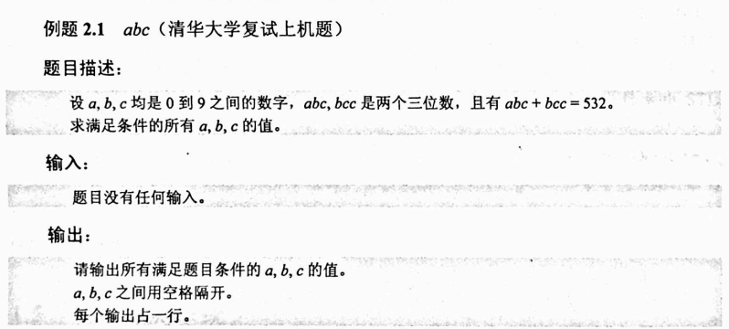

```C++
#include<iostream>
#include<cstdio>
using namespace std;
int main(){
	for(int a = 0; a <= 9; + +a)
		for(int b = 0; b <= 9; ++b)
			for(int c = 0; c <= 9; ++c)
				if(100*a + 110*b + 12*c == 532)
					printf("%d %d %d",a,b,c);
	return 0;
} 
```

## 2.2 反序数

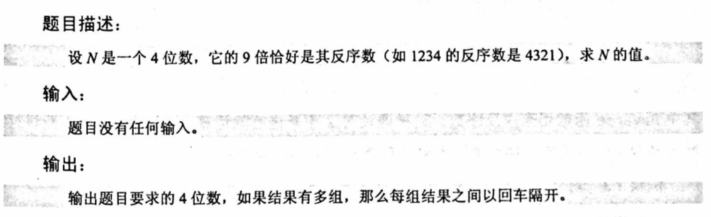

```C++
#include<iostream>
#include<cstdio>
using namespace std;
int Reverse(int x){
    int revx = 0;
    while(x != 0){
        revx *= 10;
        revx += x % 10;
        x /= 10;
    }
    return revx;
}
int main(){
	for(int i = 1000; i <= 9999; ++i){
		if(i * 9 == Reverse(i))
			cout<<i<<endl;
	}
	return 0;
}
```

## 2.3 对称平方数

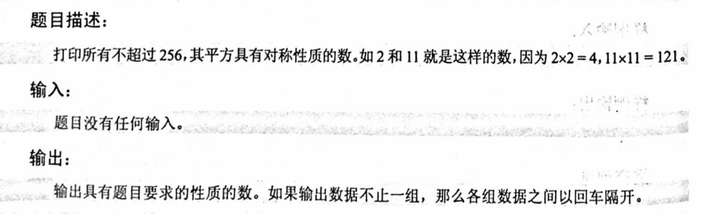

```C++
#include<iostream>
#include<cstdio>
using namespace std;

int Reverse(int x){
	int revx = 0;
	while(x!=0){
		revx *= 10;
		revx += x % 10;
		x /= 10;
	}
	return revx;
}
int main(){
	for(int i = 0 ; i <= 256; ++i){
		if(i*i == Reverse(i*i))
			cout<<i<<endl;
	}
	return 0;
}
```

## 图形

### 2.4 输出梯形

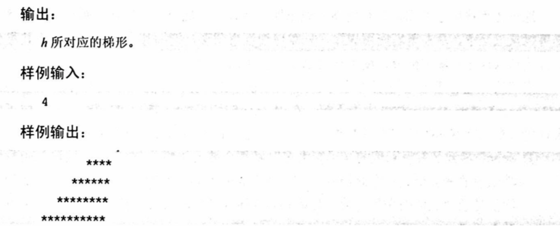

```C++
#include<iostream>
#include<cstdio>
using namespace std;
int main(){
	int h;
	cin>>h;
    //while(scanf("%d,&h")!= EOF){    //从文件中输入
	while(h>0){
		int row = h;	//4 
		int col = h+(h-1)*2;	//10
		for(int i = 0; i < row; ++i){
			for(int j = 0; j < col; ++j){
				if(j < col-(h+2*i))
					cout<<" ";
				else
					cout<<"*";
			}
			cout<<endl;
		}
		h = -1*h;
	}
	return 0;
} 
```

### 2.5 叠箩筐—画同心圆

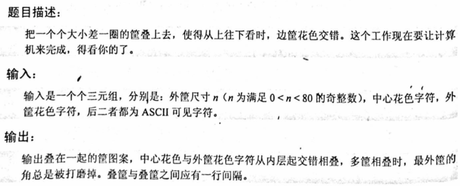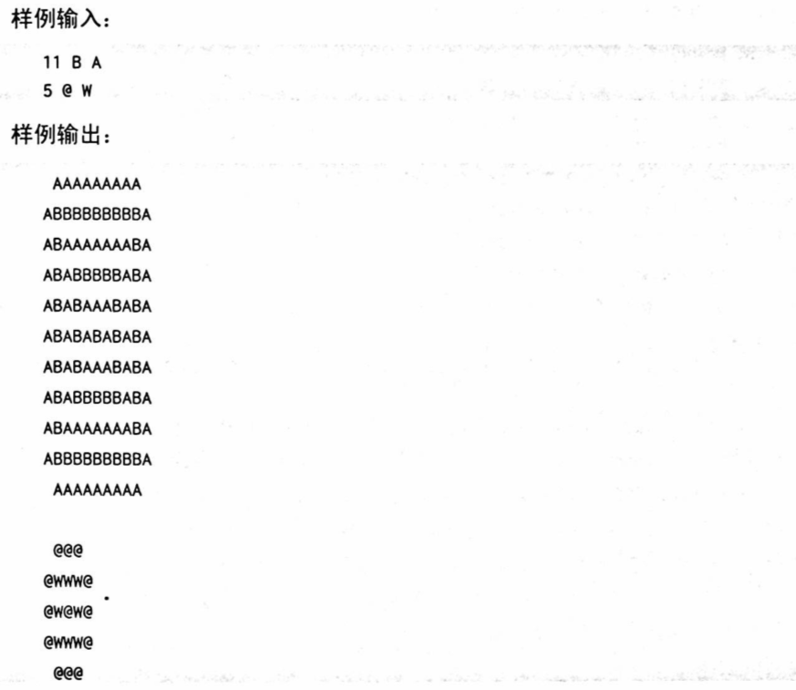

```C++
#include<iostream>
#include<cstdio>
using namespace std;
char matrix[80][80];
int main(){
	int n;						//叠框的大小 
	char a,b;					//输入的两个字符 
	bool firstCase = true;		 //第一组数据标志 
	scanf("%d %c %c",&n,&a,&b);	  //注意"scanf"引号里面的字符形式是怎样输入形式就是怎样
	if(firstCase == true){
		firstCase == false;
	}else{
		cout<<endl;
	}
	for(int i = 0; i <= n/2; ++i){
		int j = n-i-1;
		int length = n-2*i;
		char c;
		if((n/2-i) % 2 == 0)  c = a;
		else c = b;
		for(int k=0; k <length; ++k){
			matrix[i][i+k] = c;			//上边赋值 
			matrix[i+k][i] = c;			//下边赋值 
			matrix[j][j-k] = c;			//右边赋值 
			matrix[j-k][j] = c;			//左边赋值 
		}
	}
	if(n!=1){	//剔除四个角 
		matrix[0][0]=' ';
		matrix[0][n-1]=' ';
		matrix[n-1][0]=' ';
		matrix[n-1][n-1]=' ';
	}
	//逐行逐列打印 
	for(int i = 0; i<n; ++i){
		for(int j = 0; j<n; ++j){
			printf("%c",matrix[i][j]); 
		}
		cout<<endl;
	}

	return 0; 
} 

```

## 日期

### 2.6 今年的第几天 

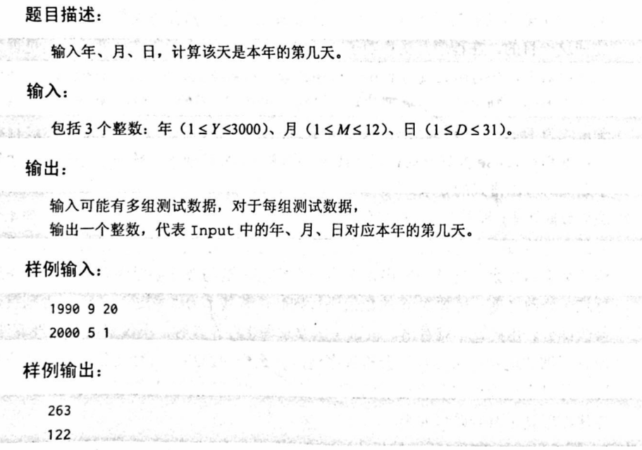

```C++
#include<iostream>
#include<cstdio>
using namespace std;
int IsLeapYear(int year){
	return (year%4 == 0 && year%100 != 0)||(year%400 == 0);
} 
int main(){
	int daytab[2][13]={
		{0,31,28,31,30,31,30,31,31,30,31,30,31},	
		{0,31,29,31,30,31,30,31,31,30,31,30,31}	
	};
	int year,month,day;
	cin>>year>>month>>day; 
//	scanf("&d%d%d",&year,&month,&day);
	int number = 0;
	int row = IsLeapYear(year);	//如果今年是闰年，就选第二行(1)，否则选第一行(0) 
	for(int j=0; j<month; ++j){
		number += daytab[row][j];
	}
	number += day;
	printf("%d\n",number);
	return 0;
} 
```

### 2.7 打印日期

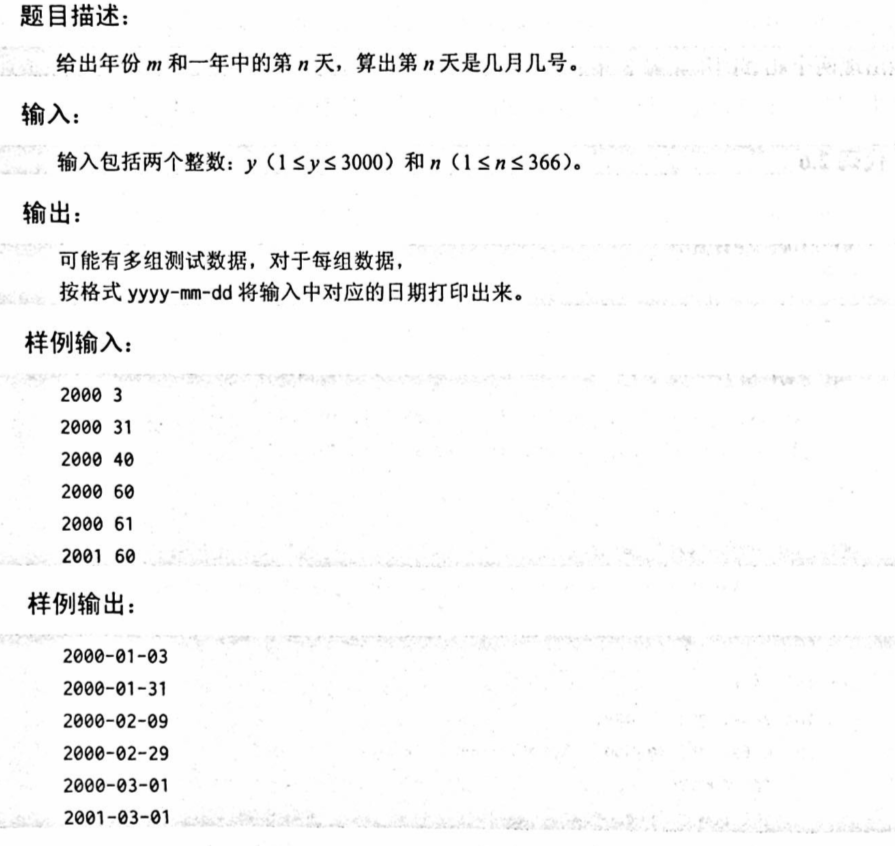

```C++
#include<iostream>
#include<cstdio>
using namespace std;
int IsLeapYear(int year){
	return (year%4 == 0 && year%100 != 0)||(year%400 == 0);
} 
int main(){
	int daytab[2][13]={
		{0,31,28,31,30,31,30,31,31,30,31,30,31},	
		{0,31,29,31,30,31,30,31,31,30,31,30,31}	
	};
	int year,month,day;
	int number;
//	cin>>year>>number;
	while(scanf("%d%d",&year,&number)!=EOF){
		month = 0;
		int row = IsLeapYear(year);
		//确定月份 
		while(number>daytab[row][month]){
			number -= daytab[row][month];
			month++;
		}
		day = number;
		printf("%04d-%02d-%02d\n",year,month,day);
	}
	return 0;
}
```

### 2.8 日期累加*

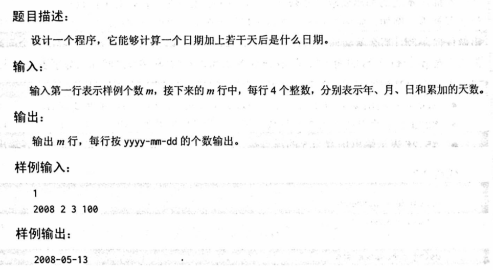

```C++
#include<iostream> 
#include<cstdio>
using namespace std;
int IsLeapYear(int year){
	return (year % 4 == 0 && year % 100 != 0)||(year % 400 == 0);
} 
int NumberOfYear(int year){
	if(IsLeapYear(year)) return 365; 
	else return 366;
}
int main(){
	int daytab[2][13]={
		{0,31,28,31,30,31,30,31,31,30,31,30,31},	
		{0,31,29,31,30,31,30,31,31,30,31,30,31}	
	};
	int year,month,day;
	int number;										//记录天数 
	int caseNumber;									//组数 
	scanf("%d",&caseNumber);
	while(caseNumber--){
		scanf("%d %d %d %d",&year,&month,&day,&number);
		int row = IsLeapYear(year);
        //先将当前日期之前的所有月份天数加起来
		for(int j = 0; j < month; ++j){
			number += daytab[row][j];
		}
		number += day;
        //如果加上天数后超过了年份总天数，年份加1，得到加后年份
		while(number > NumberOfYear(year)){
			number -= NumberOfYear(year);
			year++;
		}
		//确定加后的年份是否为闰年
	    row = IsLeapYear(year);
        month = 0;
        //从1月开始，如果加后天数大于某月天数，月份加1确定加后月份
		while(number > daytab[row][month]){
			number -= daytab[row][month];
			month++;
		}
        //确定加后天数
		day = number;
		printf("%04d-%02d-%02d\n",year,month,day);
	}	
	return 0;
}
```

## 其他

### 2.9 剩下的树

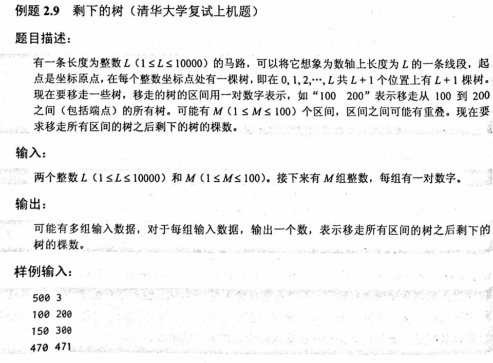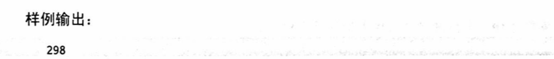

- 模拟一条包含L+1棵树的线段，并在这条线段上施加M次操作，每次操作将一个区间内的树全部移除。问剩下的树的数量是多少？
- 可以用一个bool型数组模拟这条线段，有树就设为true，没有就设为false。

```C++
#include<iostream> 
#include<cstdio>
using namespace std;
const int MAXN = 10001;			

int main(){
	int L, M;			//L+1棵树，M次操作 
	bool arr[MAXN];
	scanf("%d %d",&L, &M);
	for(int i = 0; i <= L; i++)
		arr[i] = true; 
	int number = L + 1; 	//初始化树的数量 
	while(M--){
		int left, right;
		scanf("%d %d", &left, &right);
		for(int i = left; i <= right; i++)
			if(arr[i]){		//如果区间的内的树还在，就设为false， 数量-1
				arr[i] = false;
				number--;
			}			    //如果区间内的树不在，就不减数量
	}
	printf("%d\n", number);
	return 0;
} 
```

### 2.10 手机键盘

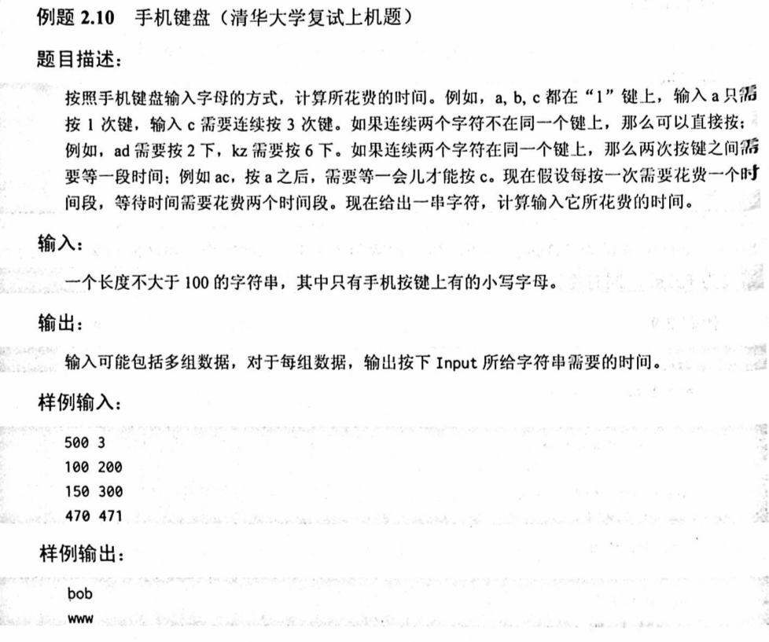

- 按照手机键盘输入字母的方式，计算所花费的时间

```C++
include<iostream>
#include<cstdio>
using namespace std;
int main(){
	//每个字母需要的按键次数 
	int keytab[26] = {1,2,3,1,2,3,1,2,3,1,2,3,1,2,3,1,2,3,4,1,2,3,1,2,3,4};
	string str;
	while(cin>>str){
		int time = 0;
		//对于每一个字符串来说 
		for(int i = 0; i<str.size(); ++i){
			//计算按键时间
			time += keytab[str[i]-'a'];	//str[i]取到字符串中的某一个字母，-'a'得到第几个字母(从0开始)  
			if(i != 0 && str[i]-str[i-1] == keytab[str[i]-'a'] - keytab[str[i-1]-'a'])
				time += 2; 	//不是第一个字母，且两个字母之间的实际距离和键盘分布之间的实际距离相等， 
		}
		cout<<time<<endl;
	}
	return 0;
}
```

### 2.11 XX定律

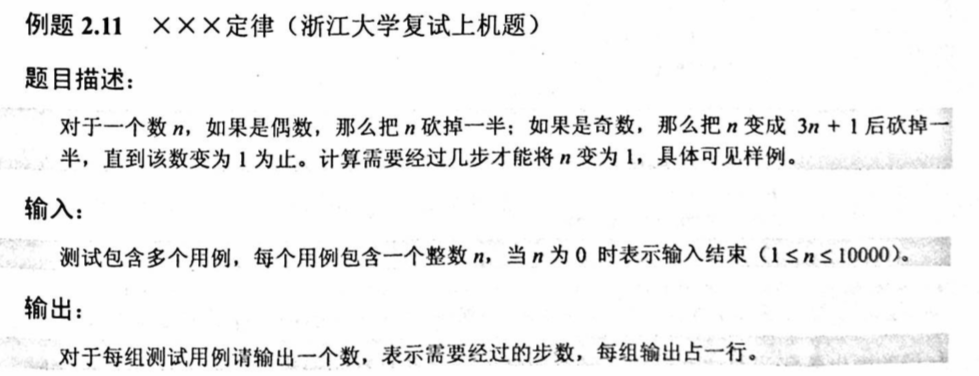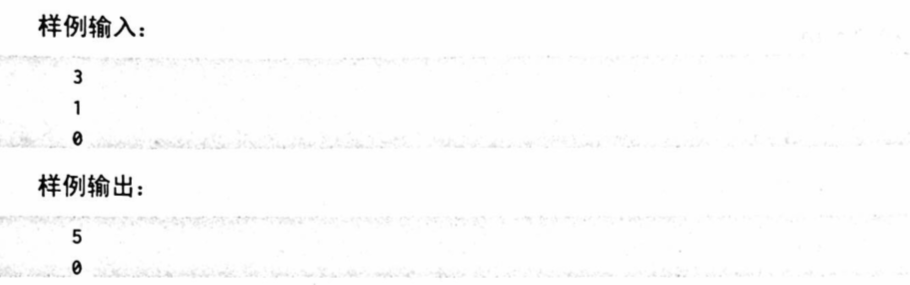

- 一个数n，如果是偶数，砍一半；如果是奇数，n变为3n+1后砍一半，直到该数变为1。
- 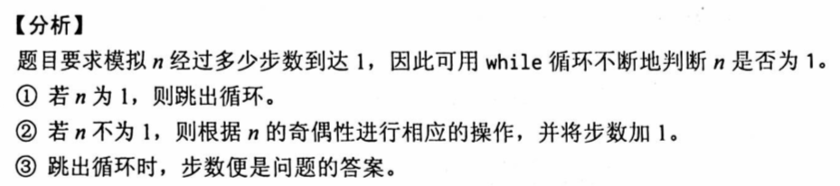

```C++
#include<iostream>
#include<cstdio>
using namespace std;
int main(){
	int n;
	while(cin>>n) {
		if(n == 0) break;		//输入0时表示输入结束
		int step = 0;
		while(n!=1){
			if(n % 2 == 0)
				n = n/2;
			else
				n = (3*n+1) / 2;
			step++;	
		}
		cout<<step<<endl;
	}
    return 0;
} 
```

# 第2章 数据结构

## 数组


## 字符串

- 字符串的定义

```C++
#include<string>  //需要添加头文件
string str
```

- 字符串的初始化

```C++
string str = "Hello World!";
cout << str << endl;	//Hello World!
```

- 字符串的长度

```C++
string str = "Hello World!";
int n1 = str.size();
int n2 = str.length();
cout << n1 << n2;	//11   11
```

- string元素的访问

```C++
string str = "Hello World!";
for(int i = 0; i<str.size(); ++i)
	cout<<str[i]<<" ";
cout<<endl;
cout<<"the 7th element of the str is:"<<str[6];
//H e l l o  W o r l d ! 
//W
```

```C++
//通过迭代器——迭代器类似指针
string str = "Hello World!";
for(string::iterator it = str.begin(); it != str.end(); ++it){
    printf("%c ",*it);
}
cout<<endl;
//H e l l o  W o r l d ! 
```

- string元素的操作

```C++
string str = "hello world";
str.insert(str.size()," end world");//在（字符串长度）最后插入 hello world end world
str.erase(0,12);          //删除0-11处的元素     end world
str.insert(0,"how to ");  //在0处插入后面的元素    how to end world
str.erase(7);			 //删除7之后的元素how to 
str.clear();			 //清空字符串
```

- string的运算符

```C++
string str1 = "to be";
string str2 = "not to be";
string str3 = "that is a question";
string str = str1 + ","  	//to be, 
str = str + str2 + "; ";		//to be, not to be;
str += str3;			    //to be, not to be; that is a question
cout<<str<<endl;
```

- string的比较

```C++
string str1 = "abc";
string str2 = "abcd";
string str3 = "bc";
string str4 = "abcd";
if(str1 <= str2) cout<<"str1 <= str2"<<endl; //	str1 <= str2
if(str2 < str3)	cout<<"str2 < str3"<<endl;	 //	str2 < str3
if(str3 > str1)	cout<<"str3 > str1"<<endl;	 //	str3 > str1
if(str1 != str3) cout<<"str1 != str3"<<endl; //	str1 != str3
if(str2 == str4) cout<<"str2 == str4"<<endl; //	str2 == str4
```

- string其他常用函数

```C++
/*在字符串中寻找特定字符或字符串的函数是find()。若函数找到相应的字符或字符串则返回对应的下标，若找不到返回string::npos.*/
string str = "hello world";							
int found = str.find("world");	//找字符串
if(found != string::npos)
	cout<< "'world' found at: "<<found<<endl; //'world' found at: 6
found = str.find("l");
if(found != string::npos)
	cout<< "'l' found at: "<<found<<endl;   //'l' found at: 2
found = str.find(".");
if(found == string::npos)
	cout<< "'.' not founded"<<endl;     //'.' not founded
```

### 字符串处理

#### 4.1 特殊乘法

- 写个算法，对于两个小于10000000的输入，求特殊乘法的结果。举例：123×45 = 1×4 + 1×5 + 2×4 + 2×5 + 3×4 + 3×5
- 如果当做数字处理，需要逐一取余来得到每个值。这种做法过于复杂。下面采用字符串的方法：

```C++
#include<iostream>
#include<string>
#include<cstdio>
using namespace std;
int main(){	
	string str1,str2;
	while(cin>>str1>>str2) {
		int answer = 0;
		for(int i = 0; i < str1.size(); ++i){
			for(int j = 0; j < str2.size(); ++j){
				answer += (str1[i]-'0') * (str2[j]-'0');	
			}
		}
		cout<<answer<<endl;
	}
	return 0;
}
//123 45
//54
//11 12
//6
```

#### 4.2 密码翻译

- 对给定一个字符串，将其中的从a-y的字母和从A-Y的字母用其后续字母替代，将z和Z用a和A替代，可得到一个简单的加密字符串

```C++
#include<iostream>
#include<string>
#include<cstdio>
using namespace std;
int main(){
	string str;
	while(getline(cin,str)){	//使用getline获取一行字符串
		for(int i = 0; i < str.size(); ++i){
			if(str[i] == 'z'||str[i] == 'Z'){
				str[i] -= 25;
			}else if(('A' <= str[i]&& 'Y'>= str[i])|| ('a' <= str[i]&& 'y'>= str[i]))
				str[i]++;
		}
		cout<<str<<endl;
	}
	return 0; 
}
//Hello World!
//Ifmmp Xpsme!

//How are you!
//Ipx bsf zpv!
```

#### 4.3 简单密码

- 对于明文中的每个字符，用字母表后5位所对应的字符代替，就得到了密文。例如，字符A用F代替。

- 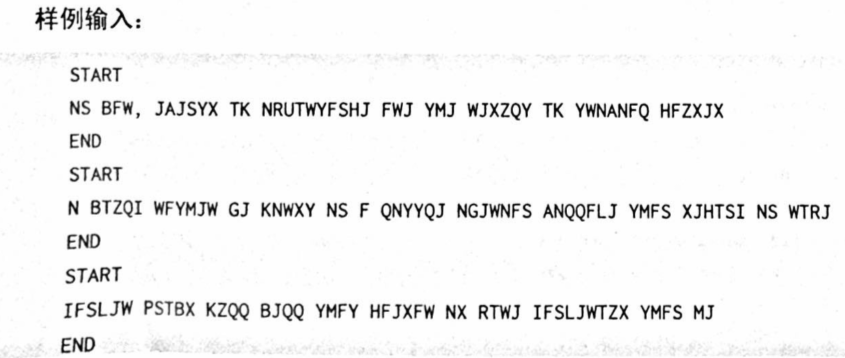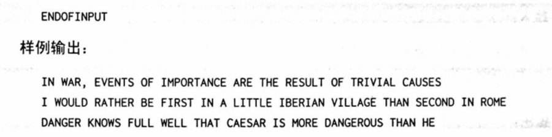

- 这道题和上一题非常相似，但可以用另外一种方式来求解这类循环平移的问题：对字母执行减法操作后，再对字母个数26取模，便可得到答案。


```c++
#include<iostream>
#include<string>
#include<cstdio>
using namespace std;
int main() {
	string str;
	while(getline(cin,str)){		//开始行，吸收START
		if(str == "ENDOFINPUT")		//如果不是行尾
			break;
		getline(cin,str);			//密文 
		for(int i = 0; i < str.size(); ++i){
			if('A' <= str[i] && str[i] <='Z'){
				str[i] = (str[i]-'A'-5+26) % 26 +'A';
			}
		}
		cout<<str<<endl;
		getline(cin,str);			//结束行，吸收END
	}
	return 0; 
}
```

#### 4.4 统计字符

- 给出两行字符串，统计第一行中字符串的每个字符在第二行字符串中出现的次数。读到#时，结束输入。
- ASCII码：大写字母65~90  小写字母：97~122
- 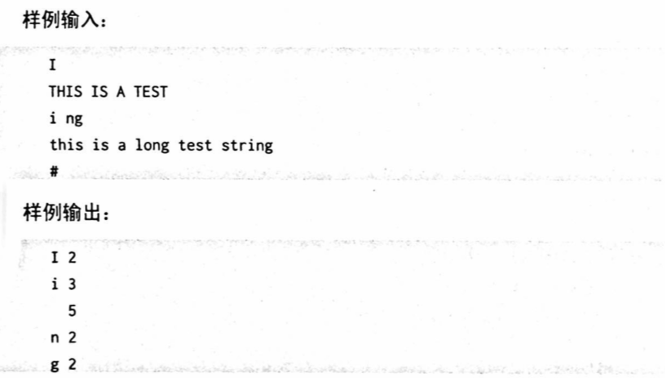

```c++
#include<iostream>
#include<string>
#include<cstdio>
#include<cstring>//会用到memset
using namespace std;
int main(){
	int number[128]; //代表128个字符的计数数组
	string str1, str2;
	while(getline(cin,str1)){
		if(str1 == "#")
			break;
		getline(cin,str2);
		memset(number,0,sizeof(number));	//先将所有字符的计数清零
		for(int i = 0; i < str2.size(); ++i){
			number[str2[i]]++;	//对于每个字符，出现一次，计数+1
		}
		for(int i = 0; i < str1.size(); ++i){
            //遍历字符串str1，将对应字符的计数值输出
			printf("%c %d\n",str1[i],number[str1[i]]);
		}
	}
	return 0;
}
//i ng
//this is a long test string
//i 3
//  5
//n 2
//g 2
```

#### 4.5 字母统计

- 输入一行字符串，计算其中大写字母A~Z各自出现的次数

```c++
#include<iostream>
#include<string>
#include<cstdio>
#include<cstring>	//用到memset
using namespace std;
int main(){
	string str;
	int number[26];
	while(getline(cin,str)){
		memset(number,0,sizeof(number));
		for(int i = 0; i < str.size(); ++i){
			if('A' <= str[i] && str[i] <='Z')
				number[str[i]-'A']++;
		}
		for(int i = 0; i<26; ++i)
			printf("%c:%d\n",'A'+i,number[i]);
	}
	return 0;
} 
//THIS IS ABC PARK, IT'S NOT VERY BIG, BUT IT'S BEAUTIFUL.
//A:3
//B:4
//C:1
//D:0
//E:2
//F:1
//G:1
//H:1
//I:6
//J:0
//K:1
//L:1
//M:0
//N:1
//O:1
//P:1
//Q:0
//R:2
//S:4
//T:6
//U:3
//V:1
//W:0
//X:0
//Y:1
//Z:0
```

### 字符串模式匹配

## 树


### 二叉树

- 结点的定义

```C++
struct TreeNode{
	ElementType data;			//数据
    TreeNode *leftChild;		//左子树
    TreeNode *rightChild;		//右子树
};
```

- 遍历

```C++
#include<iostream>
#include<cstdio>
#include<algorithm>
#include<queue>
typedef int ElementType;
using namespace std;

struct TreeNode{
	ElementType data;			//数据
    TreeNode *leftChild;		//左子树
    TreeNode *rightChild;		//右子树
};

void Visit(ElementType data){
	cout<<data;
}

//前序遍历 
void PreOrder(TreeNode* root){
	if(root == NULL){
		return;
	}
	Visit(root->data);
	PreOrder(root->leftChild);
	PreOrder(root->rightChild);
	return;
}

//中序遍历 
void InOrder(TreeNode* root){
	if(root == NULL){
		return;
	}
	InOrder(root->leftChild);
	Visit(root->data);
	InOrder(root->rightChild);
	return;
}

//后序遍历 
void PostOrder(TreeNode* root){
	if(root == NULL){
		return;
	}
	PostOrder(root->leftChild);
	PostOrder(root->rightChild);
	Visit(root->data);
	return;
}

void LevelOrder(TreeNode* root){
	queue<TreeNode*> myQueue;
	if(root!=NULL){
		myQueue.push(root);
	}
	while(!myQueue.empty()){
		TreeNode* current = myQueue.front();
		myQueue.pop();
		Visit(current->data);
		if(current->leftChild != NULL)
			myQueue.push(current->leftChild);
		if(current->rightChild != NULL)
			myQueue.push(current->rightChild);
	}
	return;
}
```

#### 10.1 二叉树遍历

- 输入前序遍历，建立二叉树，输出中序遍历 

```C++
#include<iostream>
#include<cstdio>
#include<cstring>
using namespace std;

void Visit(int data) {
	printf("%c ",data);
}

struct TreeNode{
	char data;
	TreeNode* leftChild;
	TreeNode* rightChild;
	TreeNode(char c) : data(c), leftChild(NULL), rightChild(NULL) {}
};

TreeNode* Build(int& position, string str) {
	char c = str[position++] ;
	if (c == '#')
	    return NULL;
    TreeNode* root = new TreeNode(c);			//创建新结点 
	root->leftChild = Build(position, str);		//创建左子树 
	root->rightChild = Build(position, str);	//创建右子树 
	return  root;
}

void InOrder(TreeNode* root) {
	if (root == NULL) {
		return;
	}
	InOrder(root->leftChild);
	Visit(root->data);
	InOrder(root->rightChild);
	return;
}
	      
int main(){
	string str;
	while(cin >> str){
		int position = 0;
		TreeNode *root = Build(position, str);
		InOrder(root);
		printf("\n");
	}
	return 0;
}
//abc##de#g##f###
//c b e g d f a
```

#### 10.2 二叉树遍历

- 给定一棵二叉树的前序遍历和中序遍历，求其后序遍历

```c++
#include<iostream>
#include<cstdio>
#include<cstring>
using namespace std;

void Visit(int data) {
	printf("%c",data);
}

struct TreeNode{
	char data;
	TreeNode* leftChild;
	TreeNode* rightChild;
	TreeNode(char c) : data(c), leftChild(NULL), rightChild(NULL) {}
};

TreeNode* Build(string str1, string str2){
	if(str1.size() == 0){
		return NULL;
	}
	char c = str1[0];				//当前字符
	TreeNode *root = new TreeNode(c);
	int position = str2.find(c);	//寻址切分点 
	root->leftChild = Build(str1.substr(1,position), str2.substr(0,position));
	root->rightChild = Build(str1.substr(position+1), str2.substr(position+1));
	return root;
}

void PostOrder(TreeNode* root) {
	if (root == NULL) {
		return;
	}
	PostOrder(root->leftChild);
	PostOrder(root->rightChild);
	Visit(root->data);
	return;
}

int main(){
	string str1, str2;
	while(cin>>str1>>str2){
		TreeNode*root = Build(str1, str2);
		PostOrder(root);
		cout<<endl;
	}
	return 0;
}
//FDXEAG
//XDEFAG
//XEDGAF
```

### 二叉排序树

- 左子树结点值   <   根节点值    <   右子树结点值
- 因此如果对二叉排序树进行中序遍历，那么其遍历结果就必然是一个升序序列，这也是二叉排序树名称的由来。
- 通过建立一棵二叉排序树，就能**对原本无序的序列进行排序，并实现序列的动态维护**

#### 10.3 二叉排序树

- 现在给你N个关键字值各不相同的结点，要求你按顺序将它们插入一个初始为空树的二叉排序树，每次插入成功后，求相应父结点的关键字值，若没有父结点，则输出-1。

```C++
//输入一个序列，动态建立一棵排序二叉树 
#include<iostream>
#include<cstdio>
using namespace std;
struct TreeNode{
	char data;
	TreeNode* leftChild;
	TreeNode* rightChild;
	TreeNode(char c): data(c), leftChild(NULL), rightChild(NULL){}
};

TreeNode* Insert(TreeNode* root, int x, int father){
	if(root == NULL) {
		root = new TreeNode(x);
		printf("%d\n",father);
	}else if(x < root->data){
		root->leftChild = Insert(root->leftChild, x, root->data);
	}else{
		root->rightChild = Insert(root->rightChild, x, root->data);
	}
	return root;
}

int main(){
	int n;
	while(scanf("%d",&n) != EOF){
		TreeNode* root = NULL;
		for(int i = 0; i < n; ++i){
			int x;
			scanf("%d",&x);
			root = Insert(root,x,-1);
		}
	}
	return 0;
} 
//5
//2 5 1 3 4
//
//-1
//2
//2
//5
//3
```

#### 10.4  二叉排序树

- 输入一系列整数，建立二叉排序树，并进行前序、中序、后序遍历

```C++
#include<iostream>
#include<cstdio>
using namespace std;

 void Visit(int data){
 	cout<<data<<" ";
 }
 
struct TreeNode{
	char data;
	TreeNode* leftChild;
	TreeNode* rightChild;
	TreeNode(char c): data(c), leftChild(NULL), rightChild(NULL){}
};

TreeNode* Insert(TreeNode* root, int x){
	if(root == NULL) {
		root = new TreeNode(x);
	}else if(x < root->data){
		root->leftChild = Insert(root->leftChild, x);
	}else{
		root->rightChild = Insert(root->rightChild, x);
	}
	return root;
}


 //前序遍历 
 void PreOrder(TreeNode* root){
 	if(root == NULL){
 		return;
 	}
 	Visit(root->data);
 	PreOrder(root->leftChild);
 	PreOrder(root->rightChild);
 	return;
 }
 
 //中序遍历 
 void InOrder(TreeNode* root){
 	if(root == NULL){
 		return;
 	}
 	InOrder(root->leftChild);
 	Visit(root->data);
 	InOrder(root->rightChild);
 	return;
 }
 
 //后序遍历 
 void PostOrder(TreeNode* root){
 	if(root == NULL){
 		return;
 	}
 	PostOrder(root->leftChild);
 	PostOrder(root->rightChild);
 	Visit(root->data);
 	return;
 }

int main(){
	int n;
	while(scanf("%d",&n) != EOF){
		TreeNode* root = NULL;
		for(int i = 0; i < n; ++i){
			int x;
			cin >> x;
			root = Insert(root, x);
		}
		cout<<"PreOrder:"<<endl;
		PreOrder(root);
		cout<<endl<<"InOrder:"<<endl;
		InOrder(root);
		cout<<endl<<"PostOrder:"<<endl;
		PostOrder(root);
		cout<<endl;
	}
	return 0;
}
//5
//1 6 5 9 8
//
//PreOrder:
//1 6 5 9 8
//InOrder:
//1 5 6 8 9
//PostOrder:
//5 8 9 6 1
```


## 散列表(map)

​		之前介绍的数据结构中，不论是**向量**这样的线性结构，还是**二叉树**这样的树形结构，**结构中元素存放的位置与元素的关键字之间并不存在确定的关系**，因此，在进行查找时需要进行关键字的比较。然而，这类建立在比较基础上的查找，其查找效率取决于比较次数，最优也只能做到O(logn)。
​		散列表是一种根据关键字(key)直接进行访问的数据结构，通过建立关键字和存储位置的直接映射关系(map),便可利用关键码直接访问元素，以加快查找的速度。由于散列表摒弃了关键码有序，因此在理想情况下可在期望的常数时间内实现所有接口操作。也就是说，就平均时间复杂度的意义而言，这些操作的复杂度都是0(1)。
​		本节的目的是讲解映射这种思想在机试中的应用。

```C++
#include<iostream>
#include<map>
#include<string>
using namespace std;
map<string,int> myMap;
int main(){
	myMap["Like"] = 24;
	myMap["Wang"] = 23;
	myMap.insert(pair<string,int>("Liu",25));
	myMap.insert(pair<string,int>("Zang",26));
	myMap.insert(pair<string,int>("Wu",22));
	printf("the size of myMap: %d\n",myMap.size());
	printf("the age of Liu: %d\n",myMap["Liu"]);
	
	cout<<endl<<"遍历："<<endl;
	map<string,int>::iterator it;		//定义迭代器
	for(it = myMap.begin(); it != myMap.end(); ++it) {
		//从第一个元素开始，到最后一个元素为止 
		cout<<"the age of "<<it->first;		//键 
		cout<<": "<<it->second<<endl;		//值 
	}
	//或者采用下面的方式:
	//	for(auto it = m.begin();it != m.end();it++){
	//		cout << it->first << " " << it->second <<endl;
	//	} 
	
	cout<<endl<<"边界："<<endl;
	//访问map的第一个元素，输出他的键和值
	cout<<"The First: "<<myMap.begin()->first<<" "<<myMap.begin()->second<<endl;
	//访问map的最后一个元素，输出他的键和值
	cout<<"The Last: "<<myMap.rbegin()->first<<" "<<myMap.rbegin()->second<<endl;
	myMap.erase("Liu");
	cout<<endl; 
	
	myMap.clear();
	if(myMap.empty())
		printf("myMap is empty\n");
	else	
		printf("myMap is not empty\n");
	it = myMap.find("Like");
	if(it != myMap.end()){
		printf("Like is found\n");
	}else{
		printf("Like is not found\n");
	}
	printf("the size of myMap: %d\n",myMap.size());
	return 0;
}
//the size of myMap: 5
//the age of Liu: 25
//the age of Wang: 23
//
//the age of Like: 24
//the age of Wang: 23
//the age of Wu: 22
//the age of Zang: 26
//
//myMap is empty
//Like is not found
//the size of myMap: 0
```

### 哈希表

直接**把输入的数作为数组的下标**来**对这个数的性质进行统计**

```C++
//输出是否存在
#include<iostream>
const int maxn = 100010;
bool hashTable[maxn] = {false};
int main(){
    int n,m,x;
    cin>>n>>m;
    for(int i = 0; i < n; i++){
        cin>>x;
        hashTable[x] = true;	//数字x出现过
    }
    for(int i = 0; i < m; i++){
        cin>>x;
        if(hashTable[x] == true){
            cout<<"yes"<<endl;
        }else{
            cout<<"no"<<endl;
        }
    }
    return 0;
}
/*
5 3
8 3 7 6 2
7
yes
4
no
2
yes
*/
```

```C++
// 输出出现次数
#include<iostream>
using namespace std; 
const int maxn = 100010;
int hashTable[maxn] = {0};
int main(){
    int n,m,x;
    cin >> n >> m;
    for(int i = 0; i < n; i++){
        cin >> x;
        hashTable[x]++;	//数字x的个数++
    }
    for(int i = 0; i < m; i++){
        cin >> x;
        if(hashTable[x]){
            cout<<"出现"<<hashTable[x]<<"次"<<endl;
        }else{
            cout<<"出现0次"<<endl;
        }
    }
    return 0;
}
/*
10 4
2 3 4 2 3 2 4 4 4 1
2
出现3次
1
出现1次
3
出现2次
4
出现4次
*/
```

散列（hash）：将元素通过一个函数转换成整数，使得该整数可以尽量唯一地代表这个元素。常见的有“直接定址法”(上面的两个例子)、除留取余法

#### 字符串hash

​	将一个字符串S映射为一个整数，使得该整数可以尽可能唯一地代表字符串S

- 例题：给出N个字符串（由恰好三个大写字母组成），再给出M个待查询字符串，问每个字符串在N个字符串中出现的次数

```c++
#include<iostream>
using namespace std;
const int maxn = 100;
char S[maxn][5],temp[5];
int hashTable[26*26*26+10];
int hashFunc(char S[], int len){
	int id = 0;
	for(int i = 0; i<len; i++){
		id = id *26 +(S[i]-'A');
	}
	return id;
}
int main(){
	int n,m;
	cin>>n>>m;
	for(int i = 0; i <n; i++){
		cin>>S[i];
		int id = hashFunc(S[i],3);	//将字符串S[i]转换为整数
		hashTable[id]++;	//该字符串的出现次数加1 
	}
	for(int i= 0;i<m;i++){
		cin>>temp;
		int id = hashFunc(temp,3);	//将字符串temp转换为整数
		cout<<hashTable[id]<<endl; 
	} 
	return 0;
}
/*
10 5
ABC
DEF
DEF
DEF
DEF
DEF
DEF
OPQ
ABC
ABC
DEF
6
ABC
3
OPQ
1
QWE
0
ASD
0
*/
```


### 10.7  查找学生信息

- 典型的单向映射例题

```C++
#include<iostream>
#include<map>
#include<string>
using namespace std;
map<string, string> student;
int main(){
	int n;
	cin>>n;
	getchar();
	for(int i = 0; i < n; ++i){
		string str;
		getline(cin,str);
		int pos = str.find(" ");
		string key = str.substr(0,pos);
		student[key] = str;
	}
	int m;
	cin>>m;
	for(int i = 0; i < m; ++i){
		string key;
		cin >> key;
		string answer = student[key];
		if(answer == ""){
			answer = "No Answer!";
		}
		cout<<answer<<endl;
	}
	return 0;
}
```

### 10.8 魔咒词典

- 典型的双向映射

```C++
#include<iostream>
#include<map>
#include<string>
using namespace std;
map<string, string> dictionary;
int main() {
	string str;
	while (getline(cin, str)) {
		if (str == "@END@") {
			break;
		}
		int pos = str.find("]");
		string key = str.substr(0, pos + 1);
		string value = str.substr(pos + 2);
		dictionary[key] = value;
		dictionary[value] = key;
	}
	int n;
	cin >> n;
	getchar();		//吃掉回车
	while (n--) {
		string key;
		getline(cin, key);
		string answer = dictionary[key];
		if (answer == "") {
			answer = "what?";
		} else if (answer == "[") {
			answer = answer.substr(1, answer.size() - 2);
		}
		cout << answer << endl;
	}
	return 0;
}
//[abc] dsjakl
//[de] ksk
//[cc] qwer
//@END@
//4
//[abc]
//dsjakl
//[cc]
//qwer
//ksk
//[de]
```

### 10.9 子串计算

```C++
#include<iostream>
#include<cstdio>
#include<map>
#include<string>
using namespace std;
int main(){
	string str;
	while(cin>>str)	{
		map<string, int> number;
		for(int i = 0; i <= str.size(); ++i){
			for(int j = 0; j < i; ++j){
				string key = str.substr(j, i-j);	//每个子串
				number[key]++;		//映射值加1 
			}
		}
		map<string,int>::iterator it;
		for(it = number.begin(); it != number.end(); ++it){
			if(1 < it->second){
				cout<<it->first<<" " <<it->second<<endl;
			}
		}
	}
	return 0;
}
//101010101
//0 4
//01 4
//010 3
//0101 3
//01010 2
//010101 2
//1 5
//10 4
//101 4
//1010 3
//10101 3
//101010 2
//1010101 2
```

## 图论

### 存储

#### 邻接矩阵

- 只有当表示的图为稠密图，且需要频繁地判断某特定顶点对是否相邻时，使用邻接矩阵才较为适合

#### 邻接表√

- 当问题中存在大量遍历邻接顶点的操作而较少判断两个特定顶点的关系时，使用邻接表较为适合
- 尽管邻接表访问单条边的效率不高，但擅长批量处理一个顶点的所有关联边。大部分图论算法都是以批处理的形式进行的。因此，总体而言，邻接表的效率要高于邻接矩阵，所以本章中的代码多以邻接表的方式实现。
- 虽然叫邻接表，但在实际编码过程中通常并不采用链表的方式来实现，而采用向量来实现

### 并查集

> 本节讨论图论问题中的一种常用数据结构——并查集(Union Find)。 并查集用于处理一些不交集(Disjoint Sets)的合并和查询问题。读者应该比较了解集合的概念，如数字集A{1,2,3,4}，B{5,6,7}, C{8, 0}。并查集有如下两个功能:一是**判断任意两个元素是否属于同一个集合**，二是**按照要求合并不同的集合**。

#### 查找(Find)

- **确定元素属于哪个集合。**这种方法的步骤是：不断向上查找，直到找到它的根结点，之后根据根结点是否相同来判断两个元素是否属于同一集合

#### 合并(Union)

- **将两个子集合并成同一个集合。**这种方法的步骤是：将一棵树作为另外一棵树的子树，从而使得两棵树变成一棵更大的树
- 为了避免因为树的退化而产生额外的时间消耗，在合并两棵树时就不能任由其发展，而应加入一定的约束和优化，使其尽可能保持较低的树高。为了达到这一目的，可以在查找某个特定结点的根结点的同时，将其与根结点之间的所有结点都直接指向根结点，这个过程被称为**路径压缩**。
- 完成路径压缩的工作后，树的形态会发生巨大改变，如树高大大降低，而该树表示的集合信息却未发生任何改变，所以其在保证集合信息不变的情况下，大大优化了树结构，为后续查找工作节约了大量时间。
- 此外，在合并两棵树时，总是将高度较低的树，作为高度较高的树的子树进行合并。因为**影响查找效率的是树高**，高度较低的树作为高度较高的树子树时，不会增加合并后的树的高度，从而提高了之后的查找效率。

#### 11.1 畅通工程

- 判断连通图，求连通分量

```C++
#include<iostream> 
#include<cstdio>
using namespace std;
const int MAXN = 1000;
int father[MAXN];			//父亲结点 
int height[MAXN];			//结点高度

void Initial(int n){
	for(int i = 0; i <= n; ++i){
		father[i] = i;
		height[i] = 0;
	}
}

int Find(int x){
	if(x != father[x]){
		father[x] = Find(father[x]) ;
	}
	return father[x];
}

void Union(int x, int y){
	x = Find(x);
	y = Find(y);
	if(x != y){
		if(height[x] < height[y]){
			father[x] = y;
		}else if(height[x] > height[y]){
			father[y] = x; 
		}else{
			father[y] = x;
			height[x]++;
		}
	}
	return ;
}
int main(){
	int n, m;
	while(scanf("%d",&n) != EOF){
		if(n == 0)
			break;
		scanf("%d",&m);
		Initial(n);
		while(m--){
			int x, y;
			scanf("%d",&x);
			scanf("%d",&y);
			Union(x,y);
		}
		int answer = -1;
		for(int i = 1; i <= n; ++i){
			if(Find(i) == i)
				answer++;
		}
		printf("%d\n",answer);
	}
	return 0;	
}
```

#### 11.2  连通图

```C++
#include<iostream> 
#include<cstdio>
using namespace std;
const int MAXN = 1000;
int father[MAXN];			//父亲结点 
int height[MAXN];			//结点高度

void Initial(int n){					//初始化 
	for(int i = 0; i <= n; ++i){		
		father[i] = i;					//每个结点的父亲为自己 
		height[i] = 0;					//每个结点的高度为零 
	}
}

int Find(int x){
	if(x != father[x]){					//查找根节点 
		father[x] = Find(father[x]) ;	//路径压缩 
	}
	return father[x];
}

void Union(int x, int y){				//合并集合 
	x = Find(x);
	y = Find(y);
	if(x != y){							//矮树作为高树的子树 
		if(height[x] < height[y]){
			father[x] = y;
		}else if(height[x] > height[y]){
			father[y] = x; 
		}else{
			father[y] = x;
			height[x]++;
		}
	}
	return ;
}

int main(){
	int n, m;
	while(scanf("%d",&n) != EOF){
		if(n == 0)
			break;
		scanf("%d",&m);
		Initial(n);						//初始化 
		while(m--){
			int x, y;
			scanf("%d",&x);
			scanf("%d",&y);
			Union(x,y);					//合并集合 
		}
		int component = 0; 
		for(int i = 1; i <= n; ++i){
			if(Find(i) == i)
				component++;
		}
		if(component == 1)
			printf("YES\n");
		else
			printf("NO\n");
	}
	return 0;	
}
//4 3
//1 2
//2 3
//3 2
//NO
//3 2
//1 2
//2 3
//YES
```

#### 11.3 Is it a tree?

```C++
#include<iostream> 
#include<cstdio>
using namespace std;
const int MAXN = 1000;
int father[MAXN];			//父亲结点 
int height[MAXN];			//结点高度
int isDegree[MAXN];			//入度
bool visit[MAXN];			//标记 

void Initial(){					//初始化 
	for(int i = 0; i <= MAXN; ++i){		
		father[i] = i;					//每个结点的父亲为自己 
		height[i] = 0;					//每个结点的高度为零 
		isDegree[i] = 0;
		visit[i] = false;
	}
}

int Find(int x){
	if(x != father[x]){					//查找根节点 
		father[x] = Find(father[x]) ;	//路径压缩 
	}
	return father[x];
}

void Union(int x, int y){				//合并集合 
	x = Find(x);
	y = Find(y);
	if(x != y){							//矮树作为高树的子树 
		if(height[x] < height[y]){
			father[x] = y;
		}else if(height[x] > height[y]){
			father[y] = x; 
		}else{
			father[y] = x;
			height[x]++;
		}
	}
	return ;
} 

bool IsTree(){
	bool flag = true;
	int component = 0;
	int root = 0;
	for(int i = 0; i < MAXN; ++i){
		if(!visit[i])
			continue;
		if(father[i] == i) {
			component++;
		}
		if(isDegree[i] == 0){
			root++;
		}else if(isDegree[i] > 1){	//入度不满足要求 
			flag = false;
		}
	}
	if(component != 1 || root != 1){
		flag = false;
	}
	if(component == 0 || root == 0){
		flag = true;
	}
	return flag;
}

int main(){
	int x, y;
	int caseNumber = 0;
	Initial();
	while(scanf("%d%d",&x,&y)!=EOF){
		if(x == -1 && y == -1){
			break;
		}
		if(x == 0 && y == 0){
			if(IsTree()){
				printf("Case %d is a tree.\n",++caseNumber);
			}else{
				printf("Case %d is not a tree.\n",++caseNumber);
			}
		}else{
			Union(x,y);
			isDegree[y]++;
			visit[x] = true;
			visit[y] = true;
		}
	}
	return 0;
}
//6 8
//5 3
//5 2
//6 4
//5 6
//0 0
//Case 1 is a tree.
//8 1
//7 3
//6 2
//8 9
//7 5
//7 4
//7 8
//7 6
//0 0
//Case 2 is not a tree.
//3 8
//6 8
//6 4
//5 3
//5 6
//5 2
//0 0
//Case 3 is not a tree.
```

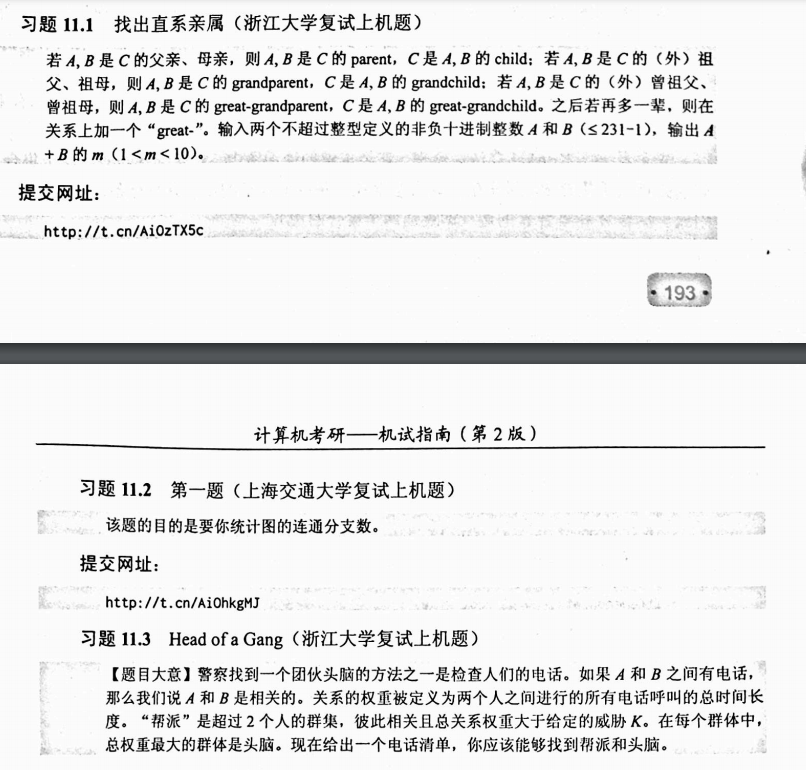

### 最小生成树

> Kruskal算法的步骤如下:
> 	①初始时所有顶点属于孤立的集合。
> 	②按照边权递增顺序遍历所有边，若遍历到的边的两个顶点仍分属不同的集合(该边即为连通这两个集合的边中权值最小的那条)，则确定该边为最小生成树上的一条边，并将该边两个顶点分属的集合合并。
> 	③遍历完所有边后，若原图连通，则被选取的边和所有顶点构成最小生成树:若原图不连通，最小生成树不存在。

​	如以上步骤所示，在**用Kruskal算法求解最小生成树的过程中会涉及大量的集合操作，恰好可以使用上一节中讨论的并查集来实现这些操作**。

#### 11.4 还是畅通工程

- 输入：

  n ——城市数量

  from to len ——从from到to，距离是len

- 输出：

  最小的公路总长度

```C++
#include<iostream> 
#include<cstdio>
#include<algorithm>
using namespace std;
const int MAXN = 100;
struct Edge{
	int from;
	int to;
	int length;
	bool operator<(const Edge& e) const{
		return length < e.length;
	} 
};
Edge edge[MAXN * MAXN];
int father[MAXN];			//父亲结点 
int height[MAXN];			//结点高度

void Initial(int n){					//初始化 
	for(int i = 0; i <= n; ++i){		
		father[i] = i;					//每个结点的父亲为自己 
		height[i] = 0;					//每个结点的高度为零 
	}
}

int Find(int x){
	if(x != father[x]){					//查找根节点 
		father[x] = Find(father[x]) ;	//路径压缩 
	}
	return father[x];
}

void Union(int x, int y){				//合并集合 
	x = Find(x);
	y = Find(y);
	if(x != y){							//矮树作为高树的子树 
		if(height[x] < height[y]){
			father[x] = y;
		}else if(height[x] > height[y]){
			father[y] = x; 
		}else{
			father[y] = x;
			height[x]++;
		}
	}
	return ;
} 

int Kruskal(int n, int edgeNumber){
	Initial(n);
	sort(edge,edge+edgeNumber);
	int sum = 0;
	for(int i = 0; i < edgeNumber; ++i){
		Edge current = edge[i];
		if(Find(current.from) !=Find(current.to)){
			Union(current.from, current.to);
			sum += current.length;
		}
	}
	return sum;
}

int main(){
	int n;
	while(scanf("%d",&n)!=EOF){
		if(n == 0){
			break;
		}
		int edgeNumber = n*(n-1)/2;
		for(int i = 0; i < edgeNumber; ++i){
			scanf("%d%d%d",&edge[i].from,&edge[i].to,&edge[i].length);
		}
		int answer = Kruskal(n, edgeNumber);
		printf("%d\n",answer);
	}
	return 0;
}
//3
//1 2 1
//1 3 2
//2 3 4
//3
//4
//1 2 1
//1 3 4
//1 4 1
//2 3 3
//2 4 2
//3 4 5
//5
```

#### 11.5 继续畅通工程

```C++
#include<iostream> 
#include<cstdio>
#include<algorithm>
using namespace std;
const int MAXN = 100;
struct Edge{
	int from;
	int to;
	int length;
	bool operator<(const Edge& e) const{
		return length < e.length;
	} 
};
Edge edge[MAXN * MAXN];
int father[MAXN];			//父亲结点 
int height[MAXN];			//结点高度

void Initial(int n){					//初始化 
	for(int i = 0; i <= n; ++i){		
		father[i] = i;					//每个结点的父亲为自己 
		height[i] = 0;					//每个结点的高度为零 
	}
}

int Find(int x){
	if(x != father[x]){					//查找根节点 
		father[x] = Find(father[x]) ;	//路径压缩 
	}
	return father[x];
}

void Union(int x, int y){				//合并集合 
	x = Find(x);
	y = Find(y);
	if(x != y){							//矮树作为高树的子树 
		if(height[x] < height[y]){
			father[x] = y;
		}else if(height[x] > height[y]){
			father[y] = x; 
		}else{
			father[y] = x;
			height[x]++;
		}
	}
	return ;
} 

int Kruskal(int n, int edgeNumber){
	Initial(n);
	sort(edge,edge+edgeNumber);			//按权值排序
	int sum = 0;
	for(int i = 0; i < edgeNumber; ++i){
		Edge current = edge[i];
		if(Find(current.from) !=Find(current.to)){
			Union(current.from, current.to);
			sum += current.length;
		}
	}
	return sum;
}

int main(){
	int n;
	while(scanf("%d",&n)!=EOF){
		if(n == 0){
			break;
		}
		int edgeNumber = n*(n-1)/2;
		for(int i = 0; i < edgeNumber; ++i){
			int status; 
			scanf("%d%d%d%d",&edge[i].from,&edge[i].to,
					&edge[i].length,&status);
			if(status == 1)
				edge[i].length = 0;
		}
		int answer = Kruskal(n, edgeNumber);
		printf("%d\n",answer);
	}
	return 0;
} 
//3
//1 2 1 0
//1 3 2 0
//2 3 4 1
//1
//3
//1 2 1 0
//1 3 2 0
//2 3 4 0
//3
```

### 最短路径

#### 11.6 畅通工程续

```C++
#include<iostream>
#include<cstdio>
#include<vector>
#include<cstring>
#include<queue>
#include<climits>
using namespace std;
const int MAXN = 200;
const int INF = INT_MAX;		//无穷设为很大的数

struct Edge{
	int to;						//终点 
	int length;					//长度 
	Edge(int t, int l):to(t),length(l){}
}; 
struct Point{
	int number;					//点的编号 
	int distance;				//源点到该点的距离 
	Point(int n, int d):number(n),distance(d){}
	bool operator< (const Point& p)const{
		return distance > p.distance;	//距离小的优先级高 
	}
};
vector<Edge> graph[MAXN];		//邻接表实现的图 
int dis[MAXN];					//源点到各店距离 

void Dijkstra(int s){
	priority_queue<Point> myPriorityQueue;
	dis[s] = 0;
	myPriorityQueue.push(Point(s,dis[s]));
	while(!myPriorityQueue.empty()){
		int u = myPriorityQueue.top().number;	//离源点最近的点
		myPriorityQueue.pop();
		for(int i = 0; i < graph[u].size(); ++i){
			int v = graph[u][i].to;
			int d = graph[u][i].length;
			if(dis[v] > dis[u] + d){
				dis[v] = dis[u] + d;
				myPriorityQueue.push(Point(v,dis[v]));
			} 
		}
	}
	return ;
}

int main(){
	int n, m;
	while(scanf("%d%d",&n, &m) != EOF){
		memset(graph, 0, sizeof(graph));	//图初始化
		fill(dis,dis+n,INF);			//距离初始化为无穷 
		while(m--){
			int from, to, length;
			scanf("%d%d%d",&from, &to,&length);
			graph[from].push_back(Edge(to,length));
			graph[to].push_back(Edge(from,length));
		} 
		int s, t;
		scanf("%d%d",&s,&t);
		Dijkstra(s);
		if(dis[t] == INF){
			dis[t] = -1;
		}
		printf("%d\n",dis[t]);	
	}
	return 0;
}
//3 3
//0 1 1
//0 2 3
//1 2 1
//0 2
//2
//
//3 1
//0 1 1
//1 2
//-1
```


#### 11.7 最短路径

```C++
#include<iostream>
#include<cstdio>
#include<vector>
#include<cstring>
#include<queue>
#include<climits>
using namespace std;
const int MAXN = 1001;
const int INF = INT_MAX;		//无穷设为很大的数

struct Edge{
	int to;						//终点 
	int length;					//长度 
	int price;					//花费 
	Edge(int t, int l,int p):to(t),length(l),price(p){}
}; 
struct Point{
	int number;					//点的编号 
	int distance;				//源点到该点的距离 
	Point(int n, int d):number(n),distance(d){}
	bool operator< (const Point& p)const{
		return distance > p.distance;	//距离小的优先级高 
	}
};
vector<Edge> graph[MAXN];		//邻接表实现的图 
int dis[MAXN];					//源点到各店距离 
int cost[MAXN];					//记录花费 

void Dijkstra(int s){
	priority_queue<Point> myPriorityQueue;
	dis[s] = 0;
	cost[s] = 0; 
	myPriorityQueue.push(Point(s,dis[s]));
	while(!myPriorityQueue.empty()){
		int u = myPriorityQueue.top().number;	//离源点最近的点
		myPriorityQueue.pop();
		for(int i = 0; i < graph[u].size(); ++i){
			int v = graph[u][i].to;
			int l = graph[u][i].length;
			int p = graph[u][i].price;
			if((dis[v] == dis[u] + l && cost[v] > cost[u] + p) ||
					dis[v]>dis[u]+l){
				dis[v] = dis[u] + l;
				cost[v] = cost[u] + p; 
				myPriorityQueue.push(Point(v,dis[v]));
			} 
		}
	}
	return ;
}

int main(){
	int n, m;
	while(scanf("%d%d",&n, &m) != EOF){
		if(n == 0 && m == 0){
			break;
		}
		memset(graph, 0, sizeof(graph));	//图初始化
		fill(dis, dis + n + 1, INF);			//距离初始化为无穷 
		fill(cost, cost + n + 1, INF);			//花费初始化为无穷 
		while(m--){
			int from, to, length, price;
			scanf("%d%d%d%d",&from, &to,&length,&price);
			graph[from].push_back(Edge(to,length,price));
			graph[to].push_back(Edge(from,length,price));
		} 
		int s, t;
		scanf("%d%d",&s,&t);
		Dijkstra(s);
		printf("%d %d\n",dis[t], cost[t]);	
	}
	return 0;
}
//3 2
//1 2 5 6
//2 3 4 5
//1 3
//9 11
```

### 拓扑排序

#### 11.8 Legal or Not

​	若将群中的所有人都抽象成图上的项点，将所有的师徒关系都抽象成有向边，这个实际问题就转化为判断图上是否有环，即判断该图是否为有向无环图。无论何时，当需要判断某个图是否是向无环图时，都应立刻联想到求拓扑排序。若一个图存在符合拓扑次序的顶点序列，则该图为有向无环图;反之，该图为非有向无环图。
​	为了保存在拓扑排序过程中不断出现的入度为0的顶点，可以使用一个队列来进行存储。每当出现一个新的入度为0的项点，就将其放入队列;若需要找到一个入度为0的顶点，则可从队头取出。值得一提的是，这里使用队列仅仅是为了保存入度为0的顶点，而与队列先进先出的性质无关。若读者愿意，也可以使用栈来保存。

```C++
#include<iostream>
#include<cstdio>
#include<cstring>
#include<queue>
using namespace std;
const int MAXN = 500;
vector<int> graph[MAXN];
int inDegree[MAXN];				//入度

bool TopologicalSort(int n) {
	queue<int> node;
	for (int i = 0; i < n; ++i) {
		if (inDegree[i] == 0 ){
			node.push(i);
		}
	}
	int number = 0;				//拓扑序列顶点个数 
	while(!node.empty()){
		int u = node.front();
		node.pop();
		number++;
		for(int i = 0; i< graph[u].size(); ++i){
			int v = graph[u][i];
			inDegree[v]--;
			if(inDegree[v] == 0){
				node.push(v);
			}
		}
	}
	return n == number;		//判断能否产生拓扑序列 
}

int main() {
	int n,m;
	while(scanf("%d%d",&n,&m)!=EOF){
		if(n==0&&m==0){
			break;
		}
		memset(graph,0,sizeof(graph));
		memset(inDegree,0,sizeof(inDegree));
		while(m--){
			int from, to;
			scanf("%d%d",&from,&to);
			graph[from].push_back(to);
			inDegree[to]++;
		}
		if(TopologicalSort(n)){
			printf("YES\n"); 
		}else{
			printf("NO\n");
		}
		return 0;
	}
}
//3 2
//0 1
//1 2
//YES
//2 2
//0 1
//1 0
//NO
```

#### 11.9 确定比赛名次

```C++
#include<iostream>
#include<cstdio>
#include<cstring>
#include<queue>
using namespace std;
const int MAXN = 501;
vector<int> graph[MAXN];
int inDegree[MAXN];				//入度

vector<int> TopologicalSort(int n) {
	vector<int> topology;
	priority_queue<int, vector<int>, greater<int>> node;
	for (int i = 1; i <= n; ++i) {
		if (inDegree[i] == 0 ) {
			node.push(i);
		}
	}
	while (!node.empty()) {
		int u = node.top();
		node.pop();
		topology.push_back(u);
		for (int i = 0; i < graph[u].size(); ++i) {
			int v = graph[u][i];
			inDegree[v]--;
			if (inDegree[v] == 0) {
				node.push(v);
			}
		}
	}
	return topology;		//判断能否产生拓扑序列
}

int main() {
	int n, m;
	while (scanf("%d%d", &n, &m) != EOF) {
		memset(graph, 0, sizeof(graph));
		memset(inDegree, 0, sizeof(inDegree));
		while (m--) {
			int from, to;
			scanf("%d%d", &from, &to);
			graph[from].push_back(to);
			inDegree[to]++;
		}
		vector<int> answer = TopologicalSort(n);
		for (int i = 0; i < answer.size(); ++i) {
			if (i == 0) {
				printf("%d", answer[i]);
			} else {
				printf(" %d", answer[i]);
			}
		}
		printf("\n");
	}
	return 0;
}
//4 3
//1 2
//2 3
//4 3
//1 2 4 3
```

### 关键路径

#### 11.10

```C++
//11.10
#include <iostream>
#include <cstdio>
#include <queue>
#include <vector>
#include <cstring>
#include <climits>
using namespace std;
const int MAXN = 1001 ;
const int INF = INT_MAX;
struct Edge {
	int to; //终点，
	int length;  //距离
	Edge(int t, int l): to(t), length(l) {}
} ;

vector<Edge> graph[MAXN] ;
int earliest[MAXN];		//最早开始时间。
int latest[MAXN];		//最晚开始时间
int inDegree[MAXN] ;	//入度
void CriticalPath(int n) {
	vector<int> topology;	//拓扑序列
	queue<int> node;
	for (int i = 0; i < n; ++i) {
		if (inDegree[i] == 0) {
			node . push(i);
			earliest[i] = 1;	//初始化为1
		}
	}
	while (!node.empty()) {
		int u = node.front();
		topology.push_back(u);
		node. pop();
		for (int i = 0; i < graph[u].size(); ++i) {
			int v = graph[u][i].to;
			int l = graph[u][i].length;
			earliest[v] = max(earliest[v], earliest[u] + 1);
			inDegree[v]--;
			if (inDegree[v] == 0) {
				node. push(v);
			}
		}
	}
	for (int i = topology.size() - 1; i >= 0; --i) {
		int u = topology[i];
		if (graph[u].size() == 0) {
			latest[u] = earliest[u];			//汇点的最晚开始时间初始化
		} else {
			latest[u] = INF;			//非汇点的最晚开始时间初始化
		}
		for (int j = 0; j < graph[u]. size(); ++j) {
			int v = graph[u][j]. to;
			int l = graph[u][j]. length;
			latest[u] = min(latest[u], latest[v] - 1);
		}
	}
}

int main() {
	int n, m;
	while (scanf("%d%d", &n, &m) != EOF) {
		memset(graph, 0,sizeof (graph));
		memset(earliest, 0, sizeof(earliest));
		memset(latest,0,sizeof(latest));
		memset(inDegree, 0, sizeof(inDegree));
		while (m--) {
			int from, to, length;
			scanf("%d%d%d",&from, &to, &length);
			graph[from].push_back(Edge(to, length));
			inDegree[to]++;
		}
		CriticalPath(n);
		int answer = 0;
		for (int i = 0; i < n; ++i) {
			answer = max(answer, earliest[i]);
		}
		printf("%d\n", answer);
	}
	return 0;
}
//5 2
//1 2 1
//3 4 1
//2
```

#### 11.11

```C++
#include <iostream>
#include <cstdio>
#include <queue>
#include <vector>
#include <cstring>
#include <climits>
using namespace std;
const int MAXN = 1e5 + 7;
const int INF = INT_MAX;
const int MOD = 1e9 + 7;

vector<int> graph[MAXN];
int inDegree[MAXN];//入度
long long earliest[MAXN];//最早开始时间
long long latest[MAXN];//最晚开始时间
long long time[MAXN];//花费时间

long long CriticalPath(int n) {
	vector<int> topology;//拓扑序列
	queue<int> node;
	for (int i = 1; i <= n; ++i) {
		if (inDegree[i] == 0) {
			node.push(i);
		}
	}
	long long totalTime = 0;  //总耗时
	while (!node.empty()) {
		int u = node.front();
		topology.push_back(u) ;
		node.pop();
		for (int i = 0; i < graph[u].size(); ++i) {
			int v = graph[u][i] ;
			earliest[v] = max(earliest[v], earliest[u] + time[u]);
			inDegree[v]-- ;
			if (inDegree[v] == 0) {
				node.push(v);
				totalTime = max(totalTime, earliest[v] + time[v]);
			}
		}
	}
	for (int i = topology.size()-1; i >= 0; --i) {
		int u = topology[i];
		if (graph[u].size() == 0) {
			latest[u] = totalTime - time[u];
		} else {
			latest[u] = INF;
		}
		for (int j = 0; j < graph[u].size(); ++j) {
			int v = graph[u][j];
			latest[u] = min(latest[u], latest[v] - time[u]);
		}
	}
	return totalTime;
}

int main() {
	int n, m;
	while (scanf("%d%d", &n, &m) != EOF) {
		memset(graph, 0, sizeof(graph));
		memset(earliest, 0, sizeof(earliest));
		memset(latest, 0, sizeof(latest));
		memset(inDegree, 0, sizeof(inDegree));
		memset(time, 0, sizeof(time));
		for (int i = 1; i <= n; ++i) {
			scanf("%lld", &time[i]) ;
		}
		while (m--) {
			int from, to;
			scanf("%d%d", &from, &to);
			graph[from].push_back(to);
			inDegree[to]++;
		}
		long long totalTime = CriticalPath(n);
		long long answer = 1;
		for (int i = 1; i <= n; ++i) {
			answer *= latest[i] - earliest[i] + 1;
			answer %= MOD;
		}
		printf("%lld\n%lld\n", totalTime, answer);
		return 0;
	}
}
//7 5
//11 20 17 10 11 17 17
//5 4
//6 1
//7 3
//2 4
//2 1
//
//34
//7840
```


# 第3章 排序

## --插入类--

### 插入排序

- 时间复杂度O(n^2^)，额外空间复杂度O(1)
- 对序列A的n个元素A[1] ~ A[n]，令i从2到n枚举，进行n-1趟操作。假设某一趟时，序列A的前i-1个元素A[1] ~ A[i-1]已经有序，而范围[i,n]还未有序，那么该趟从范围[1,i-1]中寻找某个位置j，使得将A[i]插入位置j后（此时A[j]~ A[i-1]会后移一位至A[j+1] ~ A[i]），范围[1,i]有序。
- 插入排序是将待插元素一个个插入初始已有序部分中的过程，而插入位置的选择遵循了使**插入后仍然保持有序**的原则，具体做法一般是从后往前枚举已有序部分来确定插入位置。

```C++
void insertSort(int A[]){	
	int len = sizeof(A);
	for(int i = 2;i <= len; i++){
		int temp = A[i], j = i;	//temp临时存放A[i],j从i开始往前枚举
		while(j > 1 && temp <A [j-1]){	//只要temp小于前一个元素A[j-1] 
			A[j] = A[j-1];	//把A[j-1] 后移一位至A[j]
			j--; 
		}
		A[j] = temp;
	}
}
```

### 希尔排序

```C++
void shellSort(int[] arr) {
    int gap = 1;
    while (gap < arr.length) {
        gap = gap * 3 + 1;
    }

    while (gap > 0) {
        for (int i = gap; i < arr.length; i++) {
            for (int j = i - gap; j >= 0 && arr[j] > arr[j + gap]; j -= gap) {
                swap(arr, j, j + gap);
            }
        }
        gap = gap / 3;
    }
}
```

## --交换类--

### 冒泡排序

- 时间复杂度O(n^2^)，额外空间复杂度O(1)

```C++
void bubbleSort(int A[]){
	int len = sizeof(A);
	for(int i=1; i<=len; i++){//进行n-1趟，第i趟时从A[0]到A[n-i-1]都与它们下一个数比较 
		for(int j=0; j<len-i; j++){
			if(A[j] > A[j+1]){
				int temp = A[j];
				A[j] = A[j+1];
				A[j+1] = temp;
			}
		} 
	}
} 
```


### 快速排序

- 时间复杂度O(nlogn)，额外空间复杂度O(logn) 

```C++
#include<iostream>
using namespace std;
void QuickSort(int R[],int low, int high){
    int temp;
    int i = low, j = high;
    if(low < high){
        temp = R[low];
        while(i<j){
            while(i < j && R[j] >= temp) 
				--j;
            if(i<j){
                R[i]=R[j];
                ++i;
            }
            while(i < j && R[i] < temp) 
				++i;
            if(i<j){
                R[j] = R[i];
                --j;
            }
        }
        R[i] = temp;
        QuickSort(R, low, i-1);
        QuickSort(R, i+1, high);
    }
}

int main(){
	int arr[] = {49,38,65,28,11,46,72,93,81,16};
	int len = sizeof(arr) / sizeof(arr[0]);
	QuickSort(arr,0,len);
	for(auto x:arr)cout<<x<<" ";
	return 0;	
} 

//非递归算法
void QuickSortNonRecursion(int arr[],int n){
    int i,low,high;
    int stack[maxSize][2],top=-1;
    low=0,high=n-1;
    ++top;
    stack[top][0]=low;
    stack[top][1]=high;
    while(top>=0){
        low=stack[top][0];
        high=stack[top[1];
        --top;
        partition(arr,low,high,i);
        if(low<high){
            ++top;
            stack[top][0]=low;
            stack[top][1]=i-1;
            ++top;
            stack[top][0]=i+1;
            stack[top][1]=high;
        }
    }
}
```

## --选择类--

### 选择排序

- 时间复杂度O(n^2^)，额外空间复杂度O(1)
- 对序列A中的元素A[1]~A[n]，令i从1到n枚举，进行n趟操作，每趟从待排序部分[ i , n ]中选择最小的元素，令其余待排序部分的第一个元素A[i]进行交换，这样元素A[i]就会与当前有序区间 [1 , i-1] 形成新的有序区间 [1 , i ]。于是在n趟操作后，所有元素就会是有序的。
- 实现的逻辑：总共需要进行n趟操作(1<=i<=n)，每趟操作选出待排序部分 [ i , n ] 中最小的元素，令其与A[ i ] 交换。因此总复杂度为O(n^2)。

```C++
void selectSort(int A[]){
	int len = sizeof(A);
	for(int i = 1; i <= len; i++){
		int k = i;
		for(int j = i; j <= len;j++)	选出[i,n]中最小的元素，下标为k
			if(A[j] < A[k]) 
                 k=j;
		int temp = A[i];	//交换A[k]与A[i] 
		A[i] = A[k];
		A[k] = temp;
	}
}
```

### 堆排序

```C++
void heapSort(int[] arr) {
    if (arr.length < 2) return;
    // 建堆
    for (int i = 0; i < arr.length; i++) {
        heapInsert(arr, i);
    }
    // 交换最后一个
    int size = arr.length - 1;
    while (size > 0) {
        swap(arr, 0, size);
        heapify(arr, size--);
    }
}

void heapInsert(int[] arr, int i) { // 升序排序，最大堆
    // 插入到数组末尾，从下往上走，比父亲结点大就交换
    while (arr[i] > arr[(i - 1) / 2]) {
        swap(arr, i, (i - 1) / 2);
        i = (i - 1) / 2;
    }
}

// 将当前堆最大值取出后，重新调整成最大堆
void heapify(int[] arr, int size) {
    int cur = 0; // 根节点一定为 0
    int left = 2 * cur + 1; // 实际上就是 1
    while (left < size) {
        // 判断左右孩子结点哪个大
        int max = (left + 1 < size && arr[left + 1] > arr[left]) ? left + 1 : left;
        // 判断最大的孩子结点和当前结点哪个大
        max = arr[cur] > arr[max] ? cur : max;
        if (max == cur) // 如果当前结点就是最大值，那么无需继续调整，终止即可
            return;
        swap(arr, cur, max);
        cur = max;
        left = 2 * cur + 1;
    }
}

```

## --归并排序--

- 时间复杂度O(nlogn)，额外空间复杂度O(n) 

```C++
void merge(int[] arr, int l, int mid, int r) {
    int help[r - l + 1];
    int i = 0;
    int p1 = l;
    int p2 = mid + 1;
    while (p1 <= mid && p2 <= r) {
        help[i++] = arr[p1] > arr[p2] ? arr[p2++] : arr[p1++];
    }
    while (p1 <= mid) {
        help[i++] = arr[p1++];
    }
    while (p2 <= r) {
        help[i++] = arr[p2++];
    }
    for (int j = 0; j < help.length; j++) { // 可用 System.arraycopy 代替
        arr[l + j] = help[j];
    }
}
void mergeSort(int[] arr, int l, int r) {
    if (l < r) {
//      int mid = l + ((r - l) >> 1); // 注意位运算的优先级
        int mid = l + (r - l) / 2;
        mergeSort(arr, l, mid);
        mergeSort(arr, mid + 1, r);
        merge(arr, l, mid, r);
    }
}

void mergeSort(int[] arr) {
    mergeSort(arr, 0, arr.length - 1);
}

```


## --sort排序--

```C++
//int 型数组排序
#include<algorithm>
bool cmp(int a,int b){
	return a > b;   	//从大到小
}
int main(){
	int a[5] = {3,1,4,2};
	sort(a,a+5,cmp);
	for(int x:a) cout << x <<" ";
	cout<<endl;	 // 4  3  2  1  0
	return 0;
}
```

```C++
//double 型数组排序
#include<algorithm>
bool cmp(double a, double b){
	return a > b;   	//从大到小
}

int main(){
	double a[5] = {1.4,-2.1,9};
	sort(a,a+5,cmp);
	for(double x:a) cout << x <<" ";
	cout<<endl;  //9 1.4 0 0 -2.1
	return 0;
}
```

```C++
//char 型数组排序
#include<algorithm>
bool cmp(char a, char b){
	return a > b;   	//从大到小
}
int main(){
	char a[5] = {'T','W','a','K'};
	sort(a,a+5,cmp);
	for(char x:a) cout << x <<" ";
	cout<<endl; //a W T K
	return 0;
}
```

## 3.1 排序

- 对输入的n个数进行排序并输出

> sort函数（需要引入algorithm头文件）——sort(first, last, cmp)：
>
> first和last为待排序序列的起始地址和结束地址；
>
> cmp为排序方式，默认为升序

```C++
#include<iostream>
#include<cstdio>
#include<algorithm>
using namespace std;
const int MAXN = 100;
int main(){
	int arr[MAXN];
	int n;
	while(cin>>n){
		for(int i = 0; i<n; ++i)
			cin>>arr[i]; 
		sort(arr,arr+n);		//默认升序 
		for(int i = 0; i < n; ++i)
			cout<<arr[i]<<" ";
		cout<<endl; 
	}
	return 0;	
}
//8
//13 63 152 55 97 22 15 225
//13 15 22 55 63 97 152 225 
```

## 3.2 成绩排序

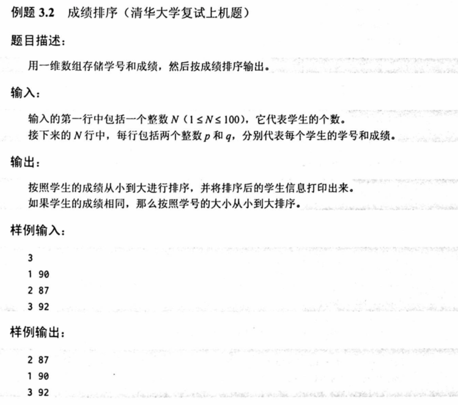

- 用一维数组存储学号和成绩，然后按成绩排序输出。

```C++
#include<iostream>
#include<cstdio>
#include<algorithm>
using namespace std;
const int MAXN = 100;
struct Stu{
	int number;
	int score;
};
bool cmp(Stu x, Stu y){
	if(x.score == y.score){
		return x.number < y.number;  //成绩相等比较学号 。学号升序
	}else{
		return x.score > y.score;  //成绩不等比较成绩 。成绩降序
	}
}
int main(){
	Stu arr[MAXN];
	int n;
	cin>>n;
	for(int i = 0; i < n; ++i) 
		cin>>arr[i].number>>arr[i].score;			//输入数据 
	sort(arr,arr+n,cmp);							//排序数据 
	cout<<endl;
	for(int i = 0; i<n; ++i)
		cout<<arr[i].number<<" "<<arr[i].score<<endl;		//输出数据 
	return 0;
}
//5
//1 52
//2 92
//3 52
//4 94
//5 21
// 
//4 94
//2 92
//1 52
//3 52
//5 21
```

## 3.3  成绩排序

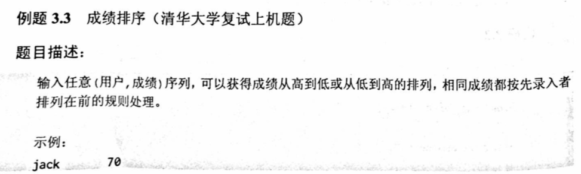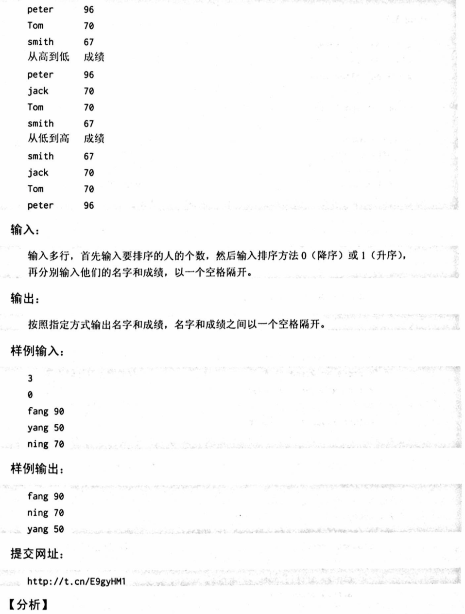

```C++
#include<iostream>
#include<cstdio>
#include<algorithm>
using namespace std;
struct Stu{
	string name;
	int score;
	int order;
}; 
bool cmp_Descending(Stu x, Stu y){	//升序
	if(x.score == y.score)
		return x.order < y.order;
	else
		return x.score > y.score;
}
bool cmp_Ascending(Stu x, Stu y){	//降序
	if(x.score == y.score)
		return x.order < y.order;
	else
		return x.score < y.score;
}
int main(){
	int n;
	int type;
	while(cin>>n){
		Stu arr[n];
		cin>>type;
		for(int i = 0; i<n; ++i){
			cin >> arr[i].name >> arr[i].score;
			arr[i].order = i;
		}
        if(type == 0)	//根据用户输入的模式，选择降序还是升序排列
			sort(arr, arr+n, cmp_Descending);
		else
			sort(arr, arr+n, cmp_Ascending);
		for(int i = 0; i<n; ++i){
			cout << arr[i].name<<" "<< arr[i].score<<endl;
		}
	}
	return 0;
}
```

# 第4章 查找

## 3.4 找x

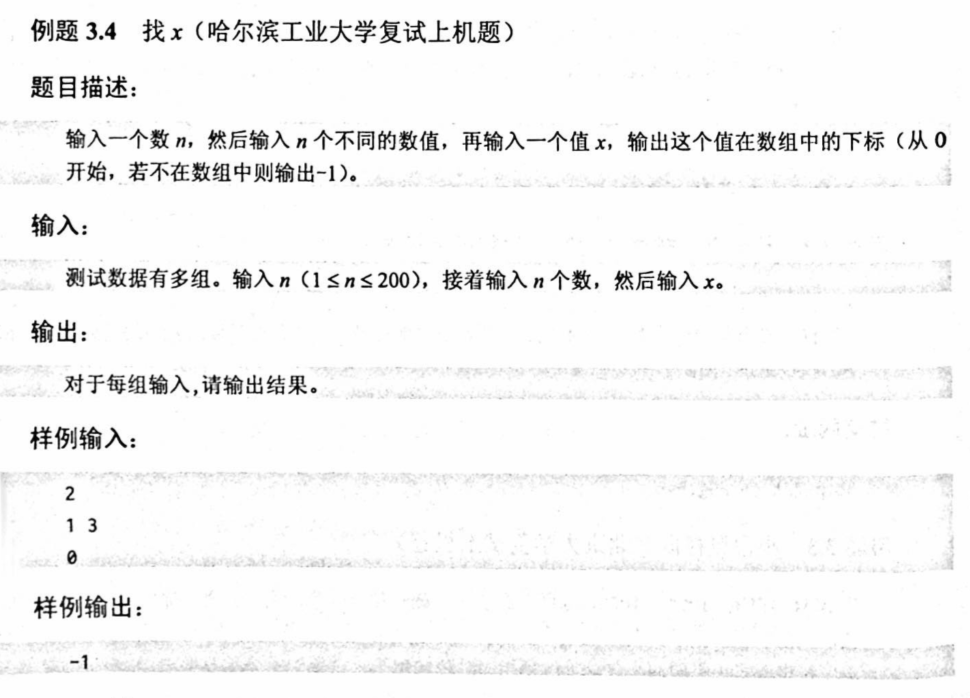

```c++
#include<iostream>
#include<cstdio>
using namespace std;
const int MAXN = 200;
int arr[MAXN];
int main(){
	int n;
	while(cin>>n){
		for(int i = 0; i < n; ++i){
			cin>>arr[i];
		}
		int x;
		cin>>x;
		int answer = -1;
		for(int i = 0; i < n;++i){
			if(arr[i] == x){
				answer = i;
				break;
			}
		}
		cout<<x<<"在第"<<answer+1<<"位";
	}
	return 0;
}
//6
//-2 5 64 13 55 20
//13
//13在第4位
```

## 3.5  二分查找

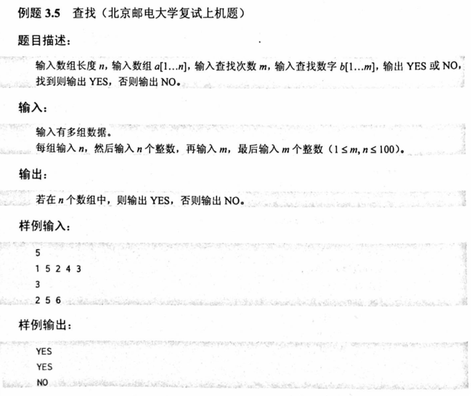

- 前提：数列有序

- ```C++
  void BinaryInsertSort(int R[], int len){
  	int low,high,mid,temp,i,j;
      for(i = 1; i < len; i++){
          //折半查找应该插入的位置
          low = 0, high = i-1;
          while(low <= high){
              mid = (low + high) / 2;
              if(R[mid] > R[i])
                  high = mid - 1;
              else
                  low = mid + 1;
          }
          //统一移动元素，然后将这个元素插入到正确的位置
          temp = R[i];
          for(j = i; j > high + 1; j--){
              R[j] = R[j-1];
          }
          R[high+1] = temp;
      }       
  }
  public:
  
  };
  ```

```C++
#include<iostream>
#include<cstdio>
#include<algorithm> 
using namespace std;
const int MAXN = 100;
int arr[MAXN];

bool BinarySearch(int n, int target){
	int left = 0;
	int right = n-1;
	while(left <= right){
		int middle = (left+right) / 2;
		if(arr[middle] < target){
			left = middle + 1;
		}else if(target < arr[middle]){
			right = middle + 1;
		}else{
			return true;
		}
	}
	return false; 
}

int main(){
	int n, m;		//n是元素个数   //m是待查找元素个数
	while(cin>>n){		
		for(int i = 0; i < n; ++i)
			cin>>arr[i];
		sort(arr,arr+n);	//先排序再查找 
		cin>>m;	
		for(int i = 0; i < m; ++i){
			int target;
			cin>>target;//每输入一个待查找元素，都送到二分查找函数中处理
			if(BinarySearch(n,target))
				cout<<"YES" <<endl;
			else{
				cout<<"NO"<<endl;
			}
		}
	}
	return 0;
}
//5
//1 5 2 4 3
//3
//2 5 6
//YES
//YES
//NO
```


# 第5章 STL

## 向量 STL-vector

- vector的定义

```C++
#include<vector>
vector<typename> name;
```

- vector的状态

```C++
name.empty(); //返回当前向量是否为空
name.size();  //返回当前向量元素个数
```

- vector尾部元素的添加和删除

```C++
name.push_back()	//添加
name.pop_back()		//删除
```

- vector元素的访问

```C++
//可以像数组一样通过元素下标进行访问，下标从0到size()-1
//可以通过迭代器进行访问，迭代器类似于指针
```

- vector元素操作

```C++
name.insert();	//插入元素
name.erase();	//任意位置删除
name.clear();	//清空
```

- vector迭代器操作

```
name.begin(); 	//返回向量中的首元素的迭代器
name.end();		//返回向量中的尾元素的迭代器
```

```C++
#include<iostream>
#include<cstdio> 
#include<vector>
using namespace std;

vector<int> myVector;

int main(){
	for(int i = 0; i < 5; ++i){
		myVector.push_back(i);
	}
	myVector.insert(myVector.begin(),3,15);
	myVector.pop_back();
	for(int i = 0; i < myVector.size(); ++i){
		cout<< myVector[i]<<" ";
	}
	cout<<endl;
	cout<<"the 5th element of myVector:"<<myVector[4]<<endl;
	cout<<"the size of myVector:"<<myVector.size()<<endl;
	myVector.erase(myVector.begin()+5, myVector.end());	//删除第5后续的元素 
	vector<int>::iterator it;	//定义迭代器 
	for(it = myVector.begin(); it != myVector.end(); it++){
		//利用迭代器访问向量 
		cout<<*it<<" ";
	} 
	cout<<endl;
	myVector.clear();
	return 0;
}
//15 15 15 0 1 2 3
//the 5th element of myVector:1
//the size of myVector:7
//15 15 15 0 1
```

### 5.1 完数与盈数

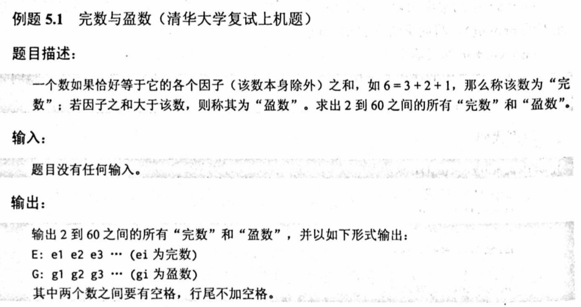

```C++
#include<iostream>
#include<cstdio>
#include<vector>
using namespace std;
vector<int> numberE;
vector<int> numberG;
int Sum(int x){
	int sum = 0;
	for(int i = 1; i < x; ++i){
		if(x % i == 0){
			sum += i;
		}
	}
	return sum;
}
int main(){
	for(int i = 2; i <= 60; ++i){
		if(i == Sum(i)){
			numberE.push_back(i);
		}else if(i < Sum(i)){
			numberG.push_back(i);
		}
	}
	cout<<"E:";
	for(int i : numberE)	//范围for循环
		cout<<" "<<i;
	cout<<endl<<"G:";
	for(int j : numberG)
		cout<<" "<<j;
	cout<<endl;
	return 0;
}
//E: 6 28
//G: 12 18 20 24 30 36 40 42 48 54 56 60
```

- ==从上例可以看出，向量vector可在数据量不确定的情况下，轻松地帮助完成数据的处理。无论是对输入时的数据量不确定，还是对输出时的数据量不确定，向量都能起到很好的作用。==
- vector还能实现图论中的邻接表


## 队列 STL-queue

- queue的定义

```C++
#include<queue>
queue<int> qu;
```

- queue的状态

```C++
qu.empty(); //返回当前队列是否为空
qu.size();  //返回当前队列元素个数
```

- queue元素的添加或删除

```C++
qu.push(); //添加
qu.pop();	 //删除
```

- queue元素的访问

```C++
qu.front(); //访问头元素
qu.back();  //访问尾元素
```

```C++
#include<iostream>
#include<cstdio>
#include<queue>
using namespace std;
queue<int> qu;
int main(){
	printf("the size of myQueue: %d\n", qu.size());
	for(int i = 0; i < 10; ++i){
		qu.push(i);
	}
	printf("the front of myQueue: %d\n", qu.front());
	printf("the back of myQueue: %d\n", qu.back());
	printf("the size of myQueue: %d\n", qu.size());
	int sum = 0;
	while(!qu.empty()){
		sum += qu.front();	//加上头元素 
		qu.pop();	 	//出队（头元素） 
	}
	printf("sum: %d\n", sum);
	if(qu.empty()){
		printf("myQueue is empty\n");
	}
	printf("the size of myQueue now: %d\n", qu.size());
	return 0;
}
//the size of myQueue: 0
//the front of myQueue: 0
//the back of myQueue: 9
//the size of myQueue: 10
//sum: 45
//myQueue is empty
//the size of myQueue now: 0
```

### 5.2 约瑟夫问题

- n个小孩坐成一圈，并按顺时针编号为1,2,3,,,n，从编号p的小孩顺时针依次报数，由1到m，报到m时，这名小孩从圈中出去；然后下一名小孩再从1报数到m，报到m时再出去。直到所有小孩都从圈中出去。按出去的先后顺序输出小孩的编号。

- 输入：第一行：n  p  m

  ​		   最后一行：0 0 0

```C++
#include<iostream>
#include<cstdio>
#include<queue>
using namespace std;
int main(){
	int n,p,m;
	while(scanf("%d %d %d",&n,&p,&m)){
		if(n==0 && p==0 && m==0) 
             break;
		queue<int> children;
		for(int i = 1; i <= n; ++i)		//依次加入队列 
			children.push(i);
		for(int i = 1; i < p; ++i){			//使编号为p的小孩在队首 
			children.push(children.front());
			children.pop();
		}
		while(!children.empty()){
			for(int i = 1; i < m; ++i){		//m-1个小孩依次重新入队 
				children.push(children.front());
				children.pop();
			}
			if(children.size() == 1)		//最后一个小孩的输出不同 
				printf("%d\n",children.front());
			else
				printf("%d,",children.front());
			children.pop();
		}
	}
	return 0;
}
//8 3 4
//6,2,7,4,3,5,1,8
```

- 本题是著名的约瑟夫问题的简化版。规模不大时可用循环队列求解。但queue只是普通的队列。但可以**把queue的队首元素弹出队列并将其压入队尾，以此来模拟循环队列**。

```c++
for(int i = 1; i < p; ++i){	
	children.push(children.front());//从队首取出元素压入队尾
	children.pop();		//将队首元素删除
}
```

### 5.3 猫狗收容所

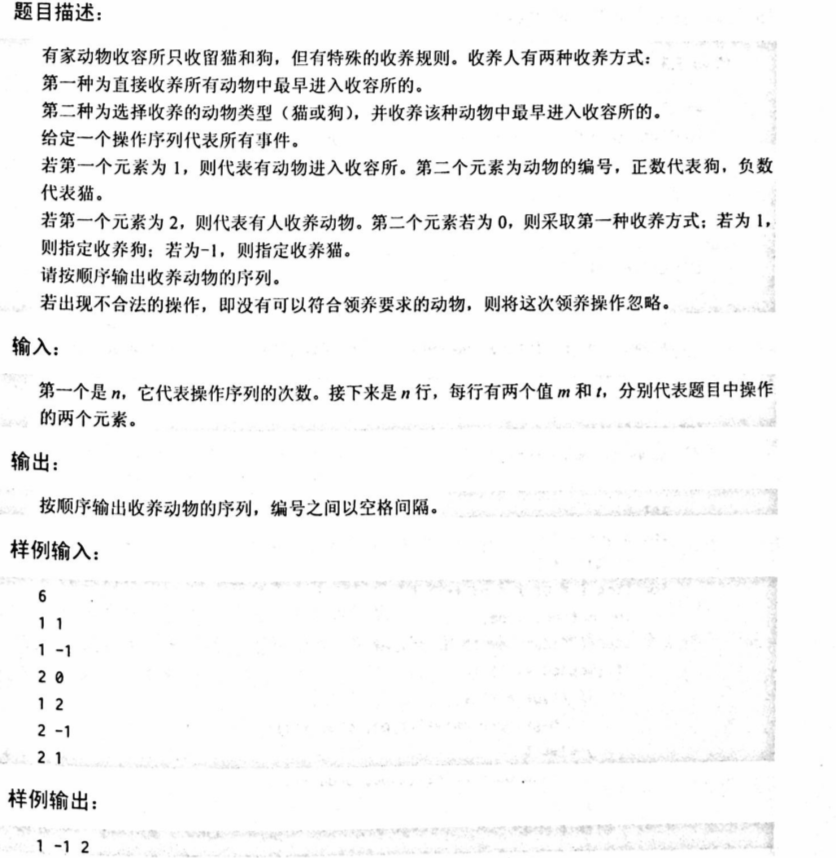

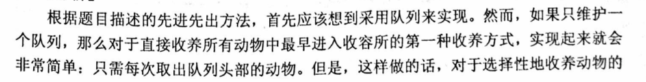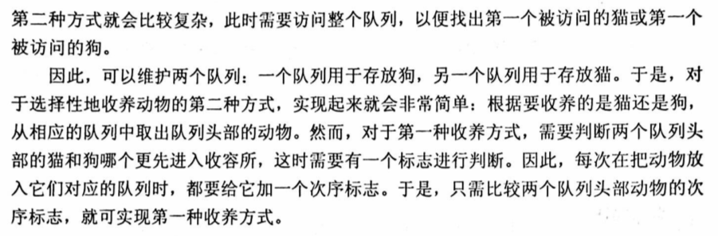

```c++
#include<iostream>
#include<cstdio>
#include<queue>
using namespace std;

struct animal {
	int number;									//动物编号
	int order;									//次序标志
	animal(int n, int o): number(n), order(o) {}	//构造函数
};

int main() {
	queue<animal> cats;
	queue<animal> dogs;
	int n;
	int order = 0;
	scanf("%d", &n);
	for (int i = 0; i < n; ++i) {
		int method, type;
		scanf("%d%d", &method, &type);
		if (method == 1) {
			if (type > 0) {
				dogs.push(animal(type, order++));
			} else {
				cats.push(animal(type, order++));
			}
		} else {
			if (type == 0 && !dogs.empty() && !cats.empty()) {
				if (dogs.front().order < cats.front().order) {
					printf("%d ", dogs.front().number);
					dogs.pop();
				} else {
					printf("%d ", cats.front().number) ;
					cats.pop();
				}
			} else if (type == 0 && dogs.empty() && !cats.empty()) {
				printf("%d ", cats.front().number);
				cats.pop();
			} else if (type == 0 && !dogs.empty() && cats.empty()) {
				printf("%d ", dogs.front().number);
				dogs.pop();
			} else if (type == 1 && !dogs.empty()) {
				printf("%d ", dogs.front().number);
				dogs.pop();
			} else if (type == -1 && !cats.empty()) {
				printf("%d ", cats.front().number);
				cats.pop();
			}
		}
	}
	printf("\n");
	return 0;
}
```

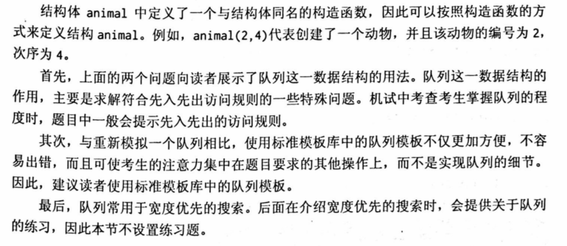

## 优先队列  priority_queue

```C++
#include<queue>
```

```C++
queue<int> q;  //声明一个int类型的队列
priority_queue <int> q; //（默认的）也是从大到小
priority_queue <int, vector<int>, greater<int> > q; //从小到大的优先队列
priority_queue <int, vector<int>, less<int> > q;   //从大到小
```

### queue队列

```C++
q.back()		//返回最后一个元素
q.empty()		//如果队列空则返回真
q.front()		//返回第一个元素
q.pop()			//删除第一个元素
q.push()		//在末尾加入一个元素
q.size()		//返回队列中元素的个数
```

### priority_queue优先队列

```C++
q.empty( )  	//判断一个队列是否为空
q.pop( )  		//删除队顶元素
q.push( )  		//加入一个元素
q.size( )  		//返回优先队列中拥有的元素个数
q.top( )  		//返回优先队列的队顶元素
```

	普通的队列是一种**先进先出**的数据结构，元素在队列尾追加，而从队列头删除。
	
	在优先队列中，元素被赋予优先级。当访问元素时，具有最高优先级的元素最先删除。优先队列具有**最高级先出** （first in, largest out）的行为特征。优先队列具有队列的所有特性，包括队列的基本操作，只是在这基础上添加了内部的一个排序，它本质是一个堆实现的。我们可以自定义其中数据的优先级, 让优先级高的排在队列前面，优先出队。

```C++
#include<iostream>
#include<cstdio>
#include<queue> 
using namespace std;

priority_queue<int> myPriorityQueue;
int main(){
	printf("the size of myPriorityQueue: %d\n",myPriorityQueue.size());
	myPriorityQueue.push(20);
	myPriorityQueue.push(100);
	myPriorityQueue.push(30);
	myPriorityQueue.push(50);
	printf("the top of myPriorityQueue: %d\n",myPriorityQueue.top());
	printf("the size of myPriorityQueue: %d\n",myPriorityQueue.size());
	int sum = 0;
	printf("The element you input are: ");
	while(!myPriorityQueue.empty()){
		printf("%d ",myPriorityQueue.top());
		sum += myPriorityQueue.top();
		myPriorityQueue.pop();
	}
	printf("\nsum: %d\n",sum);
	return 0;
}
//the size of myPriorityQueue: 0
//the top of myPriorityQueue: 100
//the size of myPriorityQueue: 4
//The element you input are: 100 50 30 20
//sum: 200
```

### 10.5 复数集合

	本题的优先队列中的元素并不是整型这样的内部类型，而是需要人为定义的复数类型Complex。程序无法比较人为定义的结构体大小，因此需要**重载小于符号**，即**重新定义复数这个结构体的比较关系**==（所谓的优先级应该是什么样的）==。题目中要求比较关系由复数的模决定，但代码中并没有使用复数的模来进行比较的，而是利用模的平方来进行比较的。由于模平方的大小关系与模本身的大小关系相同，因此可用较为  简单的模平方进行大小比较。

```C++
#include<iostream>
#include<cstdio>
#include<queue>
#include<cstring>
using namespace std;
struct Complex{
	int real;
	int imag;
	Complex(int a, int b):real(a),imag(b){};
	bool operator< (Complex c) const{			//重载小于号 
		return real*real+imag*imag < c.real*c.real+c.imag*c.imag;
	}
};

int main() {
	int n;
	while(scanf("%d",&n) != EOF){
		priority_queue<Complex> myPriorityQueue;
		while(n--){
			string str;
			cin>>str;
			if(str == "POP"){
				if(myPriorityQueue.empty()){
					printf("empty\n");
				}else{
					Complex current = myPriorityQueue.top();
					myPriorityQueue.pop();
					printf("%d+%di\n",current.real,current.imag);
					printf("SIZE = %d\n",myPriorityQueue.size());
				}
			}else if(str == "INSERT"){
				int a, b;
				scanf("%d+%di",&a,&b);
				myPriorityQueue.push(Complex(a,b));
				printf("SIZE = %d\n",myPriorityQueue.size());
			}else{
				printf("Wrong Instruction!");
			}
		}
	}
	return 0;
}
//5   (条指令)
//insert 4+2i
//SIZE = 1
//insert 3+4i
//SIZE = 2
//insert 2+5i
//SIZE = 3
//insert 1+7i
//SIZE = 4
//pop
//1+7i
//SIZE = 3
```

### 10.6 哈夫曼树

- 求最小带权路径长度和

```C++
#include<iostream>
#include<queue>
using namespace std; 
int main(){
	int n;
	while(cin>>n){
		priority_queue<int,vector<int>,greater<int>> q;
		for(int i = 0; i < n; ++i){
			int x;
			cin >> x;
			q.push(x);
		}
		int ans=0;
		while(q.size()>1){
			int a=q.top();
			q.pop();
			int b=q.top();
			q.pop();
			ans += a+b;
			q.push(a+b);
		}
		cout<<ans<<endl;
	}
	return 0;
} 
//5
//1 2 2 5 9
//
//37
```

### 习10.2 查找第k小的整数

#### 题目描述

查找一个数组的第K小的数，注意同样大小算一样大。 如 2 1 3 4 5 2 第三小数为3。

#### 输入描述:

```
输入有多组数据。
每组输入n，然后输入n个整数(1<=n<=1000)，再输入k。
```

#### 输出描述:

```
输出第k小的整数。
```

#### 输入

```
6
2 1 3 5 2 2
3
```

#### 输出

```
3
```

```c++
#include <iostream>
#include <cstdio>
#include <queue>
using namespace std;
int main() {
	int n;
	while (cin >> n) {
		priority_queue<int, vector<int>, greater<int>> myPriorityQueue;
		while (n--) {
			int x;
			cin >> x;
			myPriorityQueue.push(x);
		}
		int k;
		cin >> k;
		int temp  = myPriorityQueue.top();	//此时temp是第一个元素，即第1小的元素，因此下面从2开始遍历
		myPriorityQueue.pop();
		for (int i = 2 ; i <= k; i++) {
			while (temp == myPriorityQueue.top()) {
                //相同元素的直接抛出，即后移一位
				myPriorityQueue.pop();
			}
			temp = myPriorityQueue.top();
			myPriorityQueue.pop();
		}//遍历&赋值完，即时第k小的元素，输出即可
		cout << temp << endl;
	}
	return 0;
}
```


## 栈 STL-stack

- stack的定义

```C++
#include<stack>
stack<int> st;
```

- stack的状态

```C++
st.empty(); //返回当前栈是否为空
st.size();  //返回当前栈元素个数
```

- stack元素的添加或删除

```C++
st.push(); //添加
st.pop();  //删除
```

- stack元素的访问

```C++
st.top(); //访问栈顶元素
```

```C++
#include<iostream>
#include<cstdio>
#include<stack>
using namespace std;

stack<int> S;

int main(){
	printf("the size of myStack: %d\n",S.size());
	for(int i = 0; i < 10; ++i){
		S.push(i);
	}
	printf("the front of myStack: %d\n",S.top());
	printf("the size of myStack: %d\n",S.size());
	int sum = 0;
	while(!S.empty()){
		sum += S.top();	//加上头元素 
		S.pop();	 	//出队（头元素） 
	}
	printf("sum: %d\n",sum);
	if(S.empty()){
		printf("myStack is empty\n");
	}
	printf("the size of myStack now: %d\n",S.size());
	return 0;
}
//the size of myStack: 0
//the front of myStack: 9
//the size of myStack: 10
//sum: 45
//myStack is empty
//the size of myStack now: 0
```

### 5.4 逆序输出

```C++
#include<iostream>
#include<cstdio>
#include<stack>
using namespace std;

stack<long long> S;

int main(){
	int n;
	while(scanf("%d", &n) != EOF){
		while(n--){
			long long number;
			scanf("%lld", &number);
			S.push(number);
		}
		while(!S.empty()){
			printf("%lld ", S.top());
			S.pop();
		}
		printf("\n");
	} 
	return 0;
}
//5
//-13 284 641 -223 -208
//-208 -223 641 284 -13
```

### 5.5 括号匹配

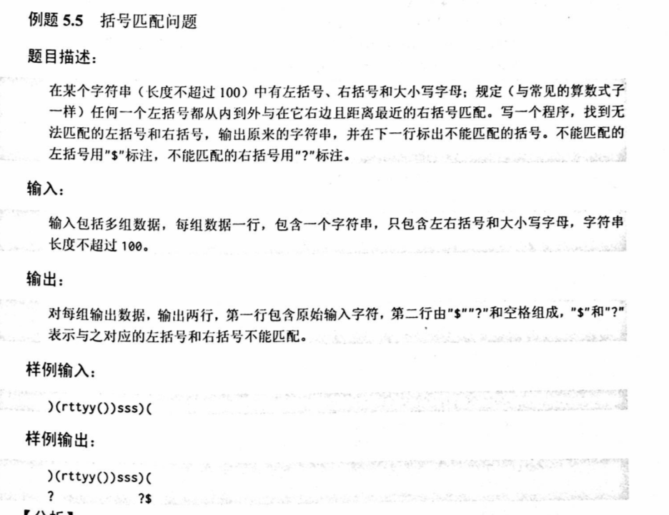

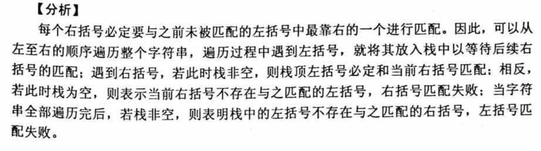

- string s(num ,c)：生成num个c字符的字符串

```c++
#include<iostream>
#include<cstdio>
#include<string>
#include<stack>
using namespace std;
int main(){
	string str;
	while(cin >> str){
		stack<int> brackets;
		//string s(num ,c)：生成num个c字符的字符串
		string answer(str.size(), ' '); 	//设为输入长度个空格 
		for(int i = 0; i < str.size(); ++i){
			if(str[i] == '('){			//如果是左括号，就入栈 
				brackets.push(i);
			}else if(str[i]==')'){		//如果是有括号，且此时栈不空，就将 
				if(!brackets.empty()){	//栈中的左括号出栈，即匹配成功一对。 
					brackets.pop();
				}else{					//如果是右括号，且此时栈已空，就打个？ 
					answer[i] = '?';	//即)未匹配成功 
				}						
			}
		}
		while(!brackets.empty()){			//如果全部字符串遍历完之后栈中还有
			answer[brackets.top()] = '$';	//左括号，就打一个$。即)未匹配成功 
			brackets.pop();
		}
		cout<<answer<<endl; 
	}
	return 0;
}
//)jjsklajd(djsk)(ds(dsaf)fa))(
//?                          ?$
```


### 5.6 简单计算器

- 读入一个只包含+ - * / 的非负整数计算表达式，计算该表达式的值
- 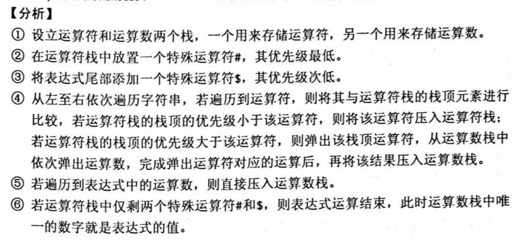

```C++
#include<iostream>
#include<cstdio>
#include<cctype>
#include<string>
#include<stack>
using namespace std;

int Priority(char c){
	if(c == '#'){
		return 0;
	}else if(c == '$'){
		return 1;
	}else if(c == '+' || c == '-'){
		return 2;
	}else {
		return 3;
	}
}

double GetNumber(string str, int& index) {	//获得下个数字 
	double number = 0;	
	while(isdigit(str[index])){
		number = number*10 + str[index]-'0';
		index++;
	} 
	return number;
}

double Calculate(double x, double y, char op){
	double result = 0;
	if(op == '+'){
		return x + y;
	}else if (op == '-'){
		return x - y;
	}else if (op == '*'){
		return x * y;
	}else if (op == '/'){
		return x / y;
	}
}

int main(){
	string str;
	while(getline(cin,str)){
		if(str == "0")
			break;
		int index  = 0;
		stack<char> op;
		stack<double> data;
		str += '$';
		op.push('#');
		while(index < str.size()){
			if(str[index] == ' '){
				index++;
			}else if(isdigit(str[index])){
				data.push(GetNumber(str, index));
			}else{
				if(Priority(op.top()) < Priority(str[index])){
					op.push(str[index]);
					index++;
				}else{
					double y = data.top();
					data.pop();
					//取出一个数，就抛出一个数 
					double x = data.top();
					data.pop();
					data.push(Calculate(x, y, op.top()));
					op.pop();
				}
			}
		}
		printf("%.2f\n",data.top());	//结果精确到小数点后两位
	}
	return 0;
}

//4 + 2 * 5 -7 / 11
//13.36
```

# 第6章 数学问题

## 进制转换

```C++
//将十进制数x 转换为D进制数y 
int res[40],i = 0;	//数组y存放D进制x的每一位，num为位数
do{
	res[i++] = x % D;	//除基取余
	x = x / D;
} while(x!=0);	//当商不为0时进行循环 
//倒序输出
while(i>0)
    cout<<res[--i];
```

### sprintf ( )

```c++
sprintf(s, "%8x", 4567); //小写16 进制，宽度占8个位置，右对齐
sprintf(s, "%-8X", 4568); //大写16 进制，宽度占8个位置，左对齐
这样，一个整数的16进制字符串就很容易得到，但我们在打印16进制内容时，通常想要一种左边补0的等宽格式，那该怎么做呢？很简单，在表示宽度的数字前面加个0 就可以了。
sprintf(s, "%08X", 4567); //产生："000011D7"
上面以"%d"进行的10进制打印同样也可以使用这种左边补0的方式。
```

### 6.1 二进制数

- 将unsigned int 数据转换成二进制

```C++
#include<iostream> 
#include<cstdio>
#include<vector> 
using namespace std;
int main(){
	unsigned int n;
	while(scanf("%d",&n)!=EOF){
		vector<int> binary;
		while(n != 0){
			binary.push_back(n % 2);  //取余
			n /= 2;					//除基
		} 
        //记得要逆序输出
		for(int i = binary.size()-1; i >= 0; --i){
			printf("%d",binary[i]);	
		}
		printf("\n");
	}
	return 0;	
}
//4
//100
//64
//1000000
//1023
//1111111111
//1024
//10000000000
//48199124
//10110111110111010111010100
//3214121242131231
//1111111111111111111111111111111
//41242152452411315124231
//1111111111111111111111111111111
```

### 6.2 进制转换

- （与上栗不同，本题要求得有30位数字，无法再用整型数来保存该题的输入，得用string）
- 将一个长度最多为30位数字的十进制非负整数转换为二进制数
- 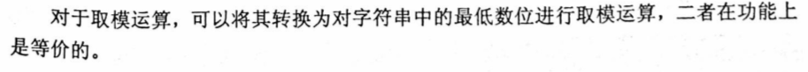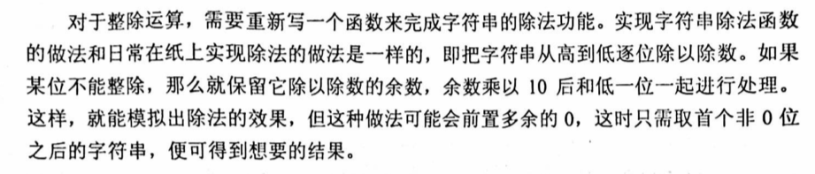

```C++
#include<iostream> 
#include<cstdio>
#include<string>
#include<vector> 
using namespace std;

string Divide(string str, int x){			//字符串除法 
	int remainder = 0; 						//保存余数 
	for(int i = 0;  i< str.size(); ++i){
		int current = remainder * 10 + str[i]-'0';	
		str[i] = current / x + '0';
		remainder = current % x; 
	}
	int pos = 0;
	while(str[pos] == '0'){		//寻找首个非零下标 
		pos++;
	}
	return str.substr(pos);		//删除前置多余的0 
}

int main(){
	string str;
	while(cin >> str){
		vector<int> binary;
		while(str.size() != 0){
			int last = str[str.size()-1]-'0';
			binary.push_back(last % 2);
			str = Divide(str, 2);
		} 
        //记得要逆序输出
		for(int i = binary.size()-1; i >= 0; --i){
			printf("%d",binary[i]);	
		}
		printf("\n");
	}
	return 0;	
}
//6
//110
//16
//10000
//1024
//10000000000
//89140238950231
//10100010001001010010100010001110001111101010111
//3890218491812823910849320152109
//110001000110011111100101010000101001010101011001011010000010101011111010110100011000010110110000101101
```

### 6.3  二进制逆序数

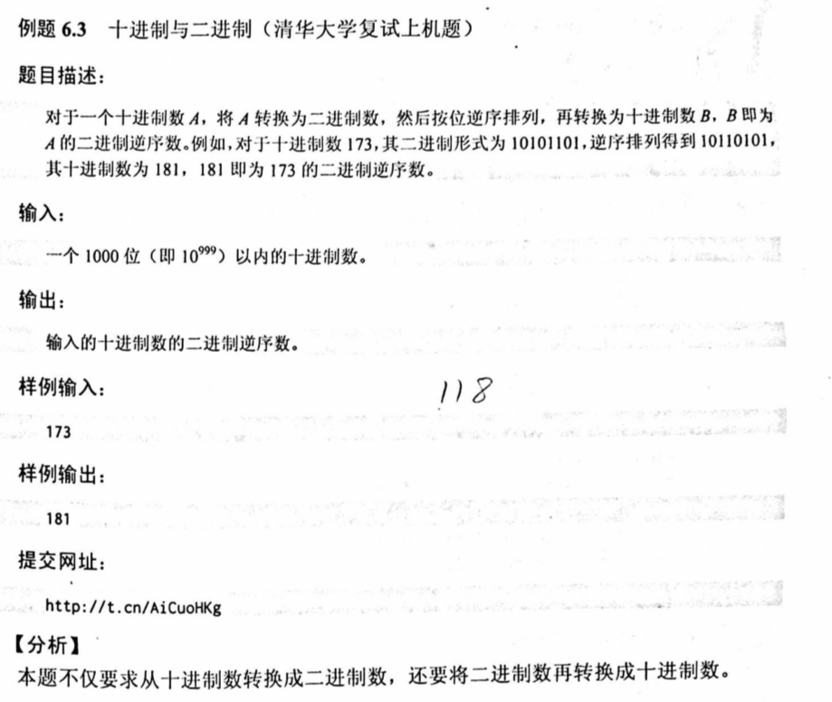

```c++
#include<iostream> 
#include<cstdio>
#include<string>
#include<vector> 
using namespace std;

string Divide(string str, int x){		//字符串除法 
	int remainder = 0; 					//保存余数 
	for(int i = 0;  i< str.size(); ++i){
		int current = remainder * 10 + str[i]-'0';	
		str[i] = current / x + '0';
		remainder = current % x; 
	}
	int pos = 0;
	while(str[pos] == '0'){				//寻址首个非零下标 
		pos++;
	}
	return str.substr(pos);				//删除前置多余的0 
}

string Multiple(string str, int x){		//字符串乘法 
	int carry = 0;						//保存进位 
	for(int i = str.size()-1; i>=0; --i){
		int current = x * (str[i] - '0') + carry;
		str[i] = current % 10 +'0';
		carry = current / 10; 
	}
	if(carry != 0){						//仍有进位 
		str = "1" + str;
	}
	return str;
}

string Add(string str, int x){			//字符串加法 
	int carry = x; 
	for(int i=str.size()-1; i >= 0; --i){
		int current = (str[i] - '0')+carry;
		str[i] = current % 10 +'0';
		carry = current / 10;
	}
	if(carry != 0){						//仍有进位 
		str = "1" + str;
	}
	return str;
}

int main(){
	string str;
	while(cin >> str){
		vector<int>binary;
		while(str.size() != 0){
			int last = str[str.size()-1] - '0';	//最低位的值
			binary.push_back(last % 2);			//取模运算 
			str = Divide(str, 2);				//整除运算 
		}
		string answer = "0";
		for(int i = 0; i < binary.size(); ++i) {
			answer = Multiple(answer, 2);		//乘法运算 
			answer = Add(answer, binary[i]);	//加法运算 
		}
		cout<<answer <<endl; 
	}
	return 0;
}
//173   ( →   10101101   →  10110101   →   181)
//181
```

### 6.4 进制转换2（清华2016）

- 将M进制数X转换为N进制的数并输出

```C++
#include<iostream> 
#include<cstdio>
#include<string>
#include<vector> 
using namespace std;

char IntToChar(int x) {
	if(x < 10)
		return x + '0';
	else
		return x - 10 + 'a';
}

int CharToInt(char c){
	if(c >= '0' && c <= '9')
		return c-'0';
	else
		return c- 'A' + 10;
}

int main(){
	int m,n;
	cout<<"请输入转换之前的进制(例如：二进制输入2)：";
	cin>>m; 
	cout<<"请输入转换之后的进制(例如：二进制输入2)：";
	cin>>n;
	string str;
	cout<<"请输入数据："; 
	cin>>str;
	long long number = 0;
	for(int i = 0; i < str.size(); ++i){
		number *= m;
		number += CharToInt(str[i]);
	}
	vector<char> answer;
	while(number != 0){
		answer.push_back(IntToChar(number % n));
		number /= n;
	}
	for(int i = answer.size()-1; i >= 0; --i){
		if(answer[i]>'a'&& answer[i]<'z')
			answer[i] -= 32;	 
		printf("%c", answer[i]);
	}
	printf("\n");
	return 0;
}
//请输入转换之前的进制(例如：二进制输入2)：10
//请输入转换之后的进制(例如：二进制输入2)：2
//请输入数据：11
//转换之后的数据为：1011

//请输入转换之前的进制(例如：二进制输入2)：10
//请输入转换之后的进制(例如：二进制输入2)：16
//请输入数据：321890421
//转换之后的数据为：132FA875
```

## 最大公约数和最小公倍数

### 最大公约数

```C++
//欧几里得算法——辗转相除法
int gcd(int a, int b){
	return b == 0 ? a : gcd(b, a % b);
}
```

### 最小公倍数

```c++
int gcd(int a, int b){
	return b == 0 ? a : gcd(b, a % b);
}
int lcm(int a, int b){
	return a * b / gcd (a, b); 
}
```

- Example

```C++
#include<iostream> 
using namespace std;
int gcd(int a, int b){
	return b == 0 ? a : gcd(b, a % b);
}
int lcm(int a, int b){
	return a * b / gcd (a, b); 
}
int main(){
	int a, b, g, l;
	g = gcd(64, 16);
	l = lcm(8, 12);
	cout << "64和12的最大公约数为 " << g << endl;
	cout << "8和12的最小公倍数为 " << l << endl;
	return 0;
}
```


## 素数 / 质数

```C++
//首选：
bool isprime(int a) {
    for (int i = 2; i * i <= a; i++)
        if (a % i == 0) return false;
    return true;
}
//其次：
bool isprime(int n) {
	if (n <= 1) return false;
	int sqr = int(sqrt(n * 1.0));
	for (int i = 2; i <= sqr; i++)
		if (n % i == 0) return false;
	return true;
}
```


## 分解质因数

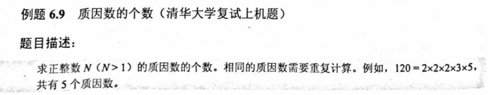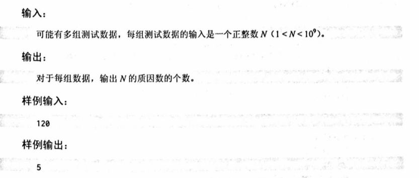

```C++
//6.9质因数的个数
#include<iostream> 
#include<cstdio>
#include<vector>
#include<cmath>
using namespace std;
const int MAXN = sqrt(1e9)+1;
vector<int> prime;		//保存质数
bool isPrime[MAXN];

void Initial(){
	for(int i = 0; i < MAXN; ++i){
		isPrime[i] = true;
	}
	isPrime[0] = false;
	isPrime[1] = false;
	for(int i = 2; i < MAXN; ++i){
		if(!isPrime[i])
			continue;
		prime.push_back(i);
		for(int j = i * i; j < MAXN; j += i){
			isPrime[j] = false;		//质数的倍数为非质数 
		}	
	}
	return ; 
}

int main(){
	Initial();
	int n; 
	while(cin >> n){
		int answer = 0;
		for(int i = 0; i < prime.size() && prime[i] < n; ++i){
			int factor = prime[i];
			while(n % factor == 0){
				n /= factor;
				answer++;
			}
		}
		if(n>1)
			answer++;
		cout<<answer<<endl; 
	}
	return 0;
}
```

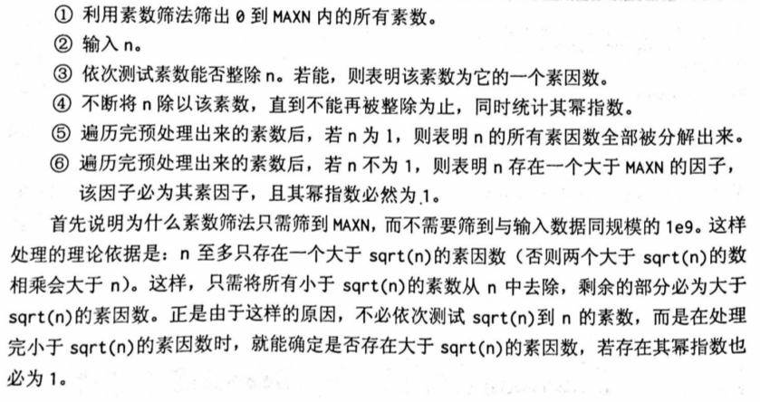


## 快速幂

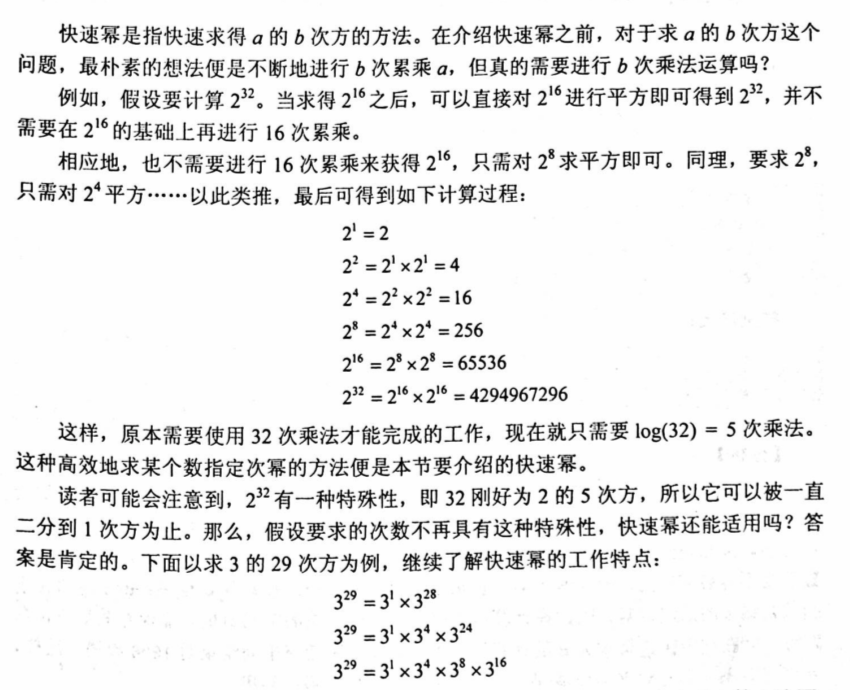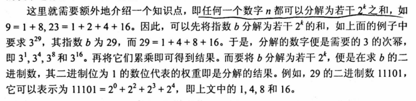

### 6.10 求A^B^的最后三位数表示的整数

- 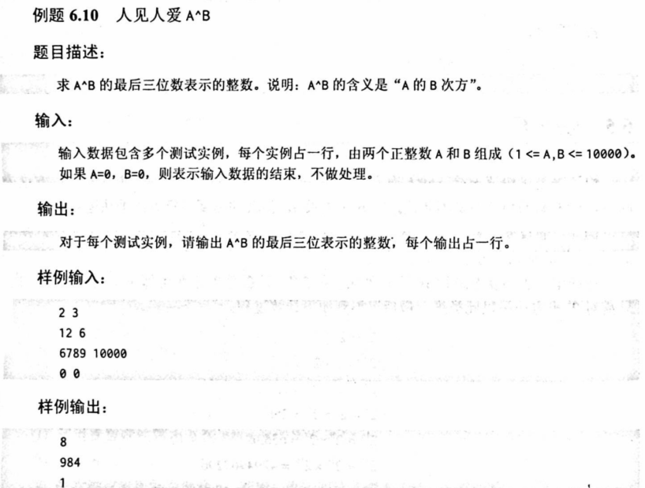
- 数字是不容易存储的，但A^B^的后三位数其实只与A的后三位数和B有关。由于题目要求的只是结果的后三位数，因此在计算该结果的过程中产生的中间值也只需保存其后三位数即可。即在利用快速幂求A^B^的计算过程中，只需不断地将中间结果对1000取模。这样，就可以既不用担心数字不能被保存，又能够获得正确的最终结果。

```C++
#include<iostream>
using namespace std;
int FastExponentiation(int a, int b, int mod){
	int answer = 1;				//初始化为1 
	while(b != 0){				//不断将b转换为二进制数 
		if(b % 2 == 1){			//若当前位为1，累乘a的2^k次幂 
			answer *= a;
			answer %= mod;		//求后三位 
		}
		b /= 2;
		a *= a;
		a %= mod; 
	}
	return answer;
}

int  main(){
	int a, b;
	while(cin>>a>>b){
		if(a == 0 && b == 0)
			break;
		printf("%d\n",FastExponentiation(a,b,1000));
	}
	return 0;
}
```


## 矩阵和矩阵快速幂

​		数学问题中另外一个常考的知识点是矩阵。考查的内容不难，一般只考查矩阵的基本运算，如矩阵加法、矩阵乘法、矩阵转置等。通常，可用一个二维数组来模拟矩阵。

### 矩阵加法

- 计算矩阵A+B的结果中，所有行和列中，元素和为0的总个数

- 输入：m行n列  接下来2*m行输入A和B的元素

- 输出：count值

- 样例：

  > 2 2
  > 1 1
  > 1 1
  > -1 -1
  > 10 9
  > 2 3
  > 1 2 3
  > 4 5 6
  > -1 -2 -3
  > -4 -5 -6
  >
  > 
  >
  > 1 5

```C++
#include<stdio.h>
#include<math.h>
int main() {
	int M, N, i, j, count;
	int A[10][10], B;	//注意：这里并没有创建两个矩阵 
	while (scanf("%d", &M) != EOF && M) {	//输入M的同时检查是否为0，为0则退出 
		count = 0;
		scanf("%d", &N);
		// 输入A矩阵 
		for (i = 0; i < M; ++i) {
			for (j = 0; j < N; ++j) {
				scanf("%d", &A[i][j]);
			}
		}
		//输入B矩阵元素同时，将其对应加到A上 
		for (i = 0; i < M; ++i) {
			for (j = 0; j < N; ++j) {
				scanf("%d", &B);	 
				A[i][j] += B;
			}
		}
		//按行优先遍历A 
		for (i = 0; i < M; ++i) {
			for (j = 0; j < N; ++j) {
				if (A[i][j] != 0)
					break;		//有一个元素不为0就跳出该行，进入下一行 
			}
			//只有一行遍历完到末尾，所有元素都为0，才计数 
			if (j == N)
				++count;
		}
		for (i = 0; i < N; ++i) {
			for (j = 0; j < M; ++j) {
				if (A[j][i] != 0) 	//注意是a[j][i]不是a[i][j]
					break;
			}
			if (j == M)
				++count;
		}
		printf("%d\n", count);
	}
	return 0; 
}
//2 2
//1 1
//1 1
//-1 -1
//10 9
//1
//2 3
//1 2 3
//4 5 6
//-1 -2 -3
//-4 -5 -6
//5
```


### 矩阵普通幂

- 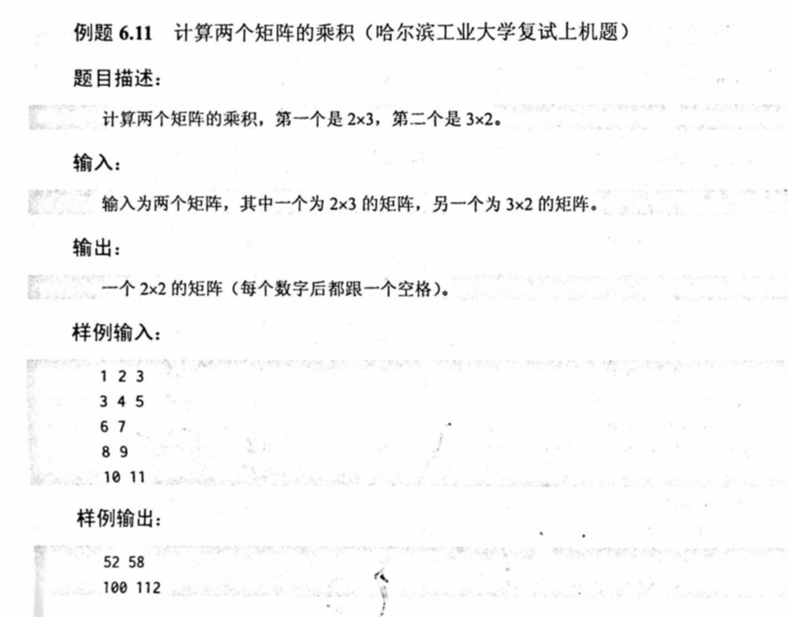

```C++
#include<iostream>
#include<cstdio>
using namespace std;
struct Matrix{
	int matrix[3][3];
	int row, col;					 
	Matrix(int r, int c) : row(r) ,col(c){}		//构造函数 
};
//计算矩阵相乘
Matrix Multiply(Matrix x, Matrix y){
	//定义一个空白矩阵，存放运算结果 
    Matrix answer(x.row, y.col);     //   m×n X r×s  →  m×s		
	for(int i = 0; i < answer.row; ++i) 
		for(int j = 0; j < answer.col; ++j){
			answer.matrix[i][j] = 0;
			for(int k = 0; k < x.col; ++k){	//单个元素的乘法次数为x矩阵的列数 
				answer.matrix[i][j] += x.matrix[i][k] * y.matrix[k][j];
			}
		}
	return answer;
}
//输出矩阵
void PrintMatrix(Matrix x){
	for(int i = 0; i < x.row; ++i){
		for(int j = 0; j < x.col; ++j) 
			printf("%d ", x.matrix[i][j]);
		printf("\n");	//每输出一行就换一行 
	}
	return ; 
}

int main(){
	Matrix x(2,3);
	Matrix y(3,2);
    //输入矩阵x的数据
	for(int i = 0; i < x.row; ++i){
		for(int j = 0; j < x.col; ++j){
			cin >> x.matrix[i][j];
		}
	}
    //输入矩阵y的数据
	for(int i = 0; i < y.row; ++i){
		for(int j = 0; j < y.col; ++j){
			cin >> y.matrix[i][j];
		}
	}
	Matrix answer = Multiply(x, y);	
	PrintMatrix(answer);			
	return 0;
}
//1 2 3
//3 4 5
//6 7
//8 9
//10 11

//52 58
//100 112
```

### 矩阵快速幂

​		类似于普通快速幂，矩阵的快速幂就是高效求矩阵多幂次的方法，其思想和普通快速来的思想相同。唯一不同的地方在于，对数字的快速幂而言，其初始值是1；而对于矩阵快速幕而言，其初始值是单位矩阵。

- 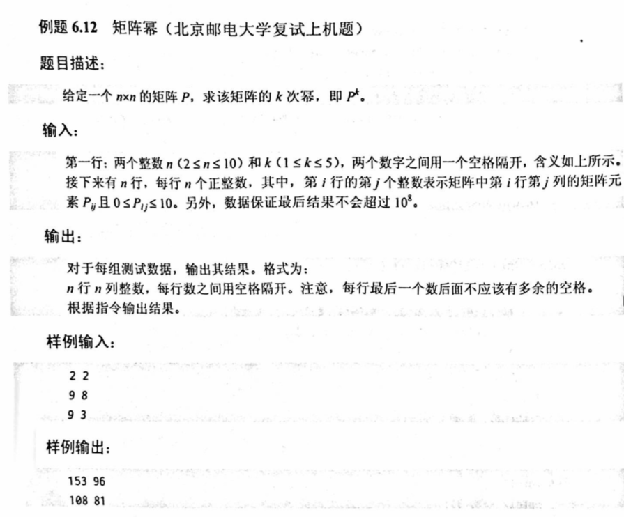

```C++
#include<iostream>
#include<cstdio>
using namespace std;
struct Matrix{
	int matrix[3][3];
	int row, col;					 
	Matrix(int r, int c) : row(r) ,col(c){}		//构造函数 
};
 
Matrix Multiply(Matrix x, Matrix y){
	Matrix answer(x.row, y.col);		//定义一个空白矩阵，存放运算结果 
	for(int i = 0; i < answer.row; ++i) 
		for(int j = 0; j < answer.col; ++j){
			answer.matrix[i][j] = 0;
			for(int k = 0; k < x.col; ++k){	//单个元素的乘法次数为x矩阵的列数 
				answer.matrix[i][j] += x.matrix[i][k] * y.matrix[k][j];
			}
		}
	return answer;
}

void PrintMatrix(Matrix x){
	for(int i = 0; i < x.row; ++i){
		for(int j = 0; j < x.col; ++j) 
			printf("%d ", x.matrix[i][j]);
		printf("\n");	//每输出一行就换一行 
	}
	return ; 
}

Matrix FastExponentiation(Matrix x, int k){
	Matrix answer(x.row,x.col);
	for(int i = 0; i < answer.row; ++i){			//初始化单位矩阵 
		for(int j = 0; j < answer.col; ++j){
			if(i == j)
				answer.matrix[i][j] = 1;
			else
				answer.matrix[i][j] = 0;
				 
		}
	}
	while(k != 0){							//不断将k转换为二进制
		if(k % 2 == 1)						//累乘x的2^k次幂
			answer = Multiply(answer, x);
		k /= 2;
		x = Multiply(x, x);
	}
	return answer;
}

int main(){
	int n, k;
	cin>>n>>k;
	Matrix x(n,n);
	for(int i = 0; i < x.row; ++i){
		for(int j = 0; j < x.col; ++j){
			cin >> x.matrix[i][j];
		}
	}
	Matrix answer = FastExponentiation(x, k);
	PrintMatrix(answer);
	return 0;
}
//2 2
//9 8
//9 3
//
//153 96
//108 81
```


## 高精度整数


# 第7章 贪心策略

> 本章介绍了常常用来**求解最优化问题**的贪心策略。读者在考场上遇到求最大、最小、最多等最值问题时，应优先考虑是否能够用贪心策略求解。若问题满足最优子结构性质，即该问题具备无后效性，那么全局的最优解便可由求子问题的最优解得到。此时就应该选择使用贪心策略。尽管贪心策略是一种高效实用的方法，但不适合于求解所有的最优化问题。无法通过贪心策略求解的最优化问题，将在动态规划一章中介绍。

## 贪心算法思想

顾名思义，贪心算法总是作出在当前看来最好的选择。也就是说贪心算法并不从整体最优考虑，它所作出的选择只是在某种意义上的局部最优选择。当然，希望贪心算法得到的最终结果也是整体最优的。虽然贪心算法不能对所有问题都得到整体最优解，但对许多问题它能产生整体最优解。如单源最短路经问题，最小生成树问题等。在一些情况下，即使贪心算法不能得到整体最优解，其最终结果却是最优解的很好近似。

## 贪心算法的基本要素

1. 贪心选择性质。所谓贪心选择性质是指所求问题的整体最优解可以通过一系列局部最优的选择，即贪心选择来达到。这是贪心算法可行的第一个基本要素，也是贪心算法与动态规划算法的主要区别。

   动态规划算法通常以自底向上的方式解各子问题，而贪心算法则通常以自顶向下的方式进行，以迭代的方式作出相继的贪心选择，每作一次贪心选择就将所求问题简化为规模更小的子问题。

   对于一个具体问题，要确定它是否具有贪心选择性质，必须证明每一步所作的贪心选择最终导致问题的整体最优解。

2. 当一个问题的最优解包含其子问题的最优解时，称此问题具有最优子结构性质。问题的最优子结构性质是该问题可用动态规划算法或贪心算法求解的关键特征。

## 贪心算法的基本思路

从问题的某一个初始解出发逐步逼近给定的目标，以尽可能快的地求得更好的解。当达到算法中的某一步不能再继续前进时，算法停止。

该算法存在问题：

1. 不能保证求得的最后解是最佳的；

2. 不能用来求最大或最小解问题；

3. 只能求满足某些约束条件的可行解的范围。

实现该算法的过程：

> 从问题的某一初始解出发；
>
> while 能朝给定总目标前进一步 do
>
> 　　 求出可行解的一个解元素；
>
> 由所有解元素组合成问题的一个可行解；
> 


## 简单贪心

### 7.1 鸡兔同笼

- 一个笼子里面关了鸡和兔子(鸡有2只脚，兔子有4只脚，没有例外)。已知笼子里面脚的总数是a,问笼子里面至少有多少只动物，至多有多少只动物。
- 在动手写代码之前，可以先深入分析一下:不论是兔子还是鸡，它们的脚数都是偶数:也就是说，当总脚数a是奇数时，问题无解。因此在总脚数是偶数的前提下，求最多动物数的时候，只需将它们全部考虑成鸡。然而，求最少动物数的时候，优先考虑脚多的兔子后，会出现两种情况: 1. 有多余的脚但又不够构成兔子; 2. 刚好没有多余的脚。对于第一种情况， 剩下只可能是两只脚:第二种情况没有剩下脚。因此，可以用剩下的脚除以2来判断需不需要多添加一只鸡。

```C++
#include<iostream> 
#include<cstdio>
using namespace std;
int main(){
	int a;
	while(cin>>a){
		int min = 0;
		int max = 0;
		if(a % 2 == 0){
			min = a / 4 + (a%4) / 2;
			max = a / 2;
		}
		printf("最多%d只，最少%d只",max,min);
	}
	return 0;
}
//56
//最多28只，最少14只
```


### 7.2 FatMouse' s  Trade

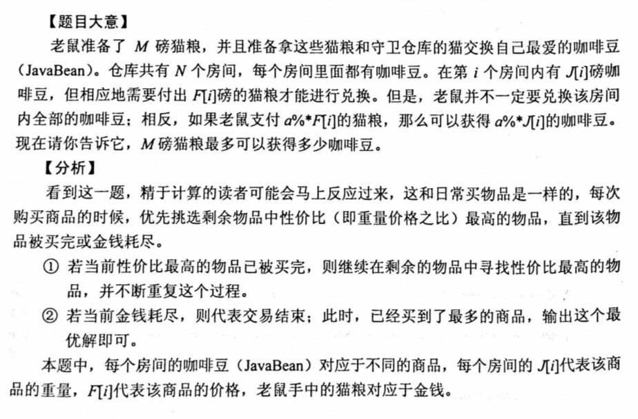

```c++
#include<iostream> 
#include<cstdio>
#include<algorithm>
using namespace std;
const int MAXN = 1000;
struct JavaBean{
	double weight;
	double cost;
};

JavaBean arr[MAXN];

bool Compare(JavaBean x, JavaBean y){
	return (x.weight / x.cost) > (y.weight / y.cost);
}

int main(){
	int m,n;
	while(cin>>m>>n){
		if(m == -1 && n == -1)
			break;
		for(int i = 0; i < n; ++i){
			cin>>arr[i].weight>>arr[i].cost;
		}
		sort(arr,arr+n,Compare);
		double answer = 0;
		for(int i = 0; i < n; ++i){
			if(m >= arr[i].cost){
				m -= arr[i].cost;
				answer += arr[i].weight;
			}else{
				answer += arr[i].weight * (m / arr[i].cost);
				break; 
			}
		}
		printf("%.3f\n",answer);
	}
	return 0;
}
//5 3
//7 2
//4 3
//5 2
//13.333

//20 3
//25 18
//24 15
//15 10
//31.500
```

### 7.3 Senior's Gun

```C++
#include<iostream> 
#include<cstdio>
#include<algorithm>
using namespace std;
const int MAXN = 10001;

long long gun[MAXN];
long long monster[MAXN];

bool cmp(long long x, long long y){
	return x > y;
}

int main(){
	int caseNumber;
	cin>>caseNumber;
	while(caseNumber--) {
		int n, m;	//n把枪，m个怪物
		scanf("%d %d",&n,&m);
		for(int i = 0; i < n; ++i) {
			scanf("%lld",&gun[i]);
		}
		for(int i = 0; i < m; ++i) {
			scanf("%lld",&monster[i]);
		}
		sort(gun, gun+n,cmp);
		sort(monster, monster+m);
		long long answer = 0;
		for(int i = 0; i < n; ++i){
			if(i >= m || gun[i] <= monster[i])
				break;
			answer += (gun[i]-monster[i]);
		}
		printf("%lld\n",answer);
	}
	return 0; 
} 
//1
//2 2
//2 3
//2 2
//
//1
```

### 清华复试_代理服务器

#### 题目描述

​	使用代理服务器能够在一定程度上隐藏客户端信息，从而保护用户在互联网上的隐私。我们知道n个代理服务器的IP地址，现在要用它们去访问m个服务器。这 m 个服务器的 IP 地址和访问顺序也已经给出。系统在同一时刻只能使用一个代理服务器，并要求不能用代理服务器去访问和它 IP地址相同的服务器（不然客户端信息很有可能就会被泄露）。在这样的条件下，找到一种使用代理服务器的方案，使得代理服务器切换的次数尽可能得少。

#### 输入描述

每个测试数据包括 n + m + 2 行。
第 1 行只包含一个整数 n，表示代理服务器的个数。
第 2行至第n + 1行每行是一个字符串，表示代理服务器的 IP地址。这n个 IP地址两两不相同。
第 n + 2 行只包含一个整数 m，表示要访问的服务器的个数。
第 n + 3 行至第 n + m + 2 行每行是一个字符串，表示要访问的服务器的 IP 地址，按照访问的顺序给出。
每个字符串都是合法的IP地址，形式为“xxx.yyy.zzz.www”，其中任何一部分均是0–255之间的整数。输入数据的任何一行都不包含空格字符。
其中，1<=n<=1000，1<=m<=5000。

#### 输出描述

可能有多组测试数据，对于每组输入数据， 输出数据只有一行，包含一个整数s，表示按照要求访问服务器的过程中切换代理服务器的最少次数。第一次使用的代理服务器不计入切换次数中。若没有符合要求的安排方式，则输出-1。

#### 示例：

##### 输入

```Java
3
166.111.4.100
162.105.131.113
202.112.128.69
6
72.14.235.104
166.111.4.100
207.46.19.190
202.112.128.69
162.105.131.113
118.214.226.52
1234567891011
```

##### 输出

```Java
1
1
```

#### 分析

​	这道题是一道典型的贪心算法问题，主要问题是怎么贪。首先来看一下输出-1的情况，这个很容易想到，只有一个代理服务器的时候，并且需要访问的服务器中包含这个唯一的代理服务器时，就不满足条件。只要有两个及以上的代理服务器，就一定有某种顺序能够访问完所有的服务器。就拿两个为例，只需要在这两个代理服务器中不断切换即可，这里不再多说，仔细想想就能理解。

​	我们主要来关注怎么贪心的问题。其实也很容易想到，**从第一台服务器开始访问，如果需要访问的服务器IP地址，也是其中某一台代理服务器的IP地址，那么就对这个代理服务器做一个标记，意思是最开始选择的代理服务器不是这一台，因为如果选择这一台代理服务器，很快就需要切换了。要使切换代理服务器的次数最少，我们就需要在每一轮切换时，使得切换来使用的代理服务器能够访问更多的服务器，也就是贪心。所以按照上面的做法，依次对代理服务器进行标记，直到还剩最后一台代理服务器没有被标记，那么就选择这台代理服务器用于访问，接着继续遍历，直到最后这一台代理服务器也需要进行标记。然后如果服务器没有遍历完，那么就清空状态，记录切换次数，从下一台服务器开始，继续上述过程，直到所有服务器都遍历一遍，即可求出结果。如果第一轮遍历就已经把服务器遍历完了，那么就说明不需要切换服务器，这时没有被标记的代理服务器都可以选择用来进行访问服务器**。

​	思路大概就是这样，不过具体在编程时还会有一些细节问题。怎么知道是不是只剩一个代理服务器没有被标记？这个可以使用一个变量来记录，最开始变量赋值为代理服务器的数量，如果有代理服务器被标记，那么变量值减1，最后如果变量值为1，并且最后一台代理服务器也需要进行标记，就说明这轮遍历结束了。另外还有一点需要注意，当遍历完一轮需要清理状态时，不要忘记在状态重置后，将上一轮最后一个未被标记的代理服务器进行标记，并且记录标记数量的变量不是设置为第一轮的n，而是n-1。因为这台被选择的代理服务器，是作为上一轮的选择，在这一轮中不能被选择。如果在这一轮中最后也被选中的话，不是相当于没有切换代理服务器吗？所以这一点也需要注意，后面的几轮遍历与第一轮的遍历略微有点区别。

#### AC代码如下：

```c++
#include<iostream>
#include<string>
#include<vector>
#include<algorithm>//find函数
#include<cstring>//memset函数

using namespace std;

int main(){
	int n, m;
	string temp;
	while(cin >> n){
		vector<string> strn, strm;//分别存储代理服务器和服务器
		int result = 0;//记录结果
		bool flag = true;//表示是否不满足条件，输出-1的标志
		//记录代理服务器是否被标记，题目没有要求输出切换的代理服务器
		//这里为什么需要做记录呢？因为有的代理服务器在需要访问的列表中出现多次
		//在记录时只需要记录一次即可，否则用来记录的变量会出错
		//这里还可以使用bool数组
		int* dai = new int[n];
		memset(dai, 0, n*sizeof(int));
		for(int i = 0; i < n; ++i){
			cin >> temp;
			strn.push_back(temp);
			dai[i] = 0;
		}
		cin >> m;
		int left = n;//记录还未被标记的代理服务器数目
		int index = 0;//记录vector中的元素下标
		for(int i = 0; i < m; ++i){
			cin >> temp;
			//如果不满足条件就没必要继续下去浪费运行时间
			//不过输入还没有结束，不能直接break出去输出
			//至少要等到程序的输入完成
			if(flag == false){
				continue;
			}
			strm.push_back(temp);
			//泛型查找函数，很好用
			//如果类型名称过长，可以使用auto自动推断类型
			vector<string>::iterator it = find(strn.begin(), strn.end(), temp);
			if(it != strn.end()){//表示找到了
				//这是在vector中返回迭代器所指向的元素的下标的常用手段
				//使用当前迭代器减去起始迭代器
				//即是当前迭代器所指向的元素的下标
				index = it - strn.begin();
				if(dai[index] == 0){//代理服务器未被标记
					dai[index] = 1;
					--left;
				}
			}
			if(left == 0){
				//所以代理服务器都需要被标记，并且输入只有一个代理服务器
				//说明肯定不满足条件，需要输出-1
				if(n == 1){
					flag = false;
					continue;
				}
				++result;
				//重置状态
				memset(dai, 0, n*sizeof(int));
				//最后一个被标记的代理服务器不能参与下次循环
				dai[index] = 1;
				left = n - 1;
			}
		}
		delete [] dai;
		if(flag){
			cout << result;
		}else{
			cout << -1;
		}
	}
	return 0;
}
```

## 区间贪心

### 7.4 今年暑假不AC

- 假设你已经知道了所有你喜欢看的电视节目的转播时间表，你会合理安排观看顺序吗? (目标是能看尽量多的完整节目)
- 具体的做法可以是首先对所有节目按照结束时间的早晚进行升序排序，然后按照这一顺序逐一对节目进行判断:①如果当前时间能够观看该节目(即当前时间小于等于该节目的开始时间)，那么就选择观看该节目，并将当前时间更新为该节目的结束时间。②如果当前时间不能够观看该节目(当前时间已超过该节目的开始时间),那么就选择放弃观看该节目，进而去判断下一个节目是否符合要求。

```C++
#include<iostream> 
#include<cstdio>
#include<algorithm>
using namespace std;
const int MAXN = 100;

struct Program{
	int No;
	int startTime;
	int endTime;
}arr[MAXN]; 

bool cmp(Program x, Program y){
	return x.endTime < y.endTime;
}

int main(){
	int n;
	while(cin>>n){
		if(n == 0)
			break;
		for(int i = 0; i < n; ++i){
			arr[i].No = i+1;
			cin>>arr[i].startTime>>arr[i].endTime;
		}
		sort(arr,arr+n,cmp);
		int currentTime = 0;
		int answer = 0;
		cout<<"可按照下列顺序观看:";
		for(int i = 0; i < n; ++i){
			if(currentTime <= arr[i].startTime){
				currentTime = arr[i].endTime;
				cout<<arr[i].No<<" "; 
				answer++;
			}
		}
		printf("\n可以观看的节目共%d个\n",answer);
	}
	return 0;
}
//12
//1 3
//3 4
//0 7
//3 8
//15 19
//15 20
//10 15
//8 18
//6 12
//5 10
//4 14
//2 9
//可按照下列顺序观看:1 2 10 7 5
//可以观看的节目共5个
```

### 7.5 Case of Fugitive

```C++
#include<iostream>
#include<cstdio>
#include<cstring>
#include<algorithm>
#include<queue>
using namespace std;
const int MAXN = 200001;

struct Island{
	long long left;		//岛屿左端点 
	long long right;	//岛屿右端点 
};

struct Bridge{
	long long length;	//桥的长度 
	long long index;	//桥的编号 
};

struct Interval{
	long long max;		//区间最大值 
	long long min;		//区间最小值 
	long long index;	//区间编号
	bool operator< (Interval x) const { 
		return max > x.max;
	} 
}; 

bool IntervalCmp(Interval x, Interval y){
	if(x.min == y.min){
		return x.max < y.max;
	}else{
		return x.min < y.min;
	}
}

bool BridgeCmp(Bridge x, Bridge y){
	return x.length < y.length;
}

Island island[MAXN];
Bridge bridge[MAXN];
Interval interval[MAXN];
long long answer[MAXN];

bool Solve(int n,int m) {
	priority_queue<Interval> myQueue;
	int position = 0;
	int number = 0;p
	for(int i = 0; i < m; ++i){
		while(myQueue.top().max < bridge[i].length && !myQueue.empty())
			myQueue.pop();		//当前区间无法搭建
		while(position < n-1 &&
				interval[position].min <= bridge[i].length &&
				interval[position].max >= bridge[i].length ){
			myQueue.push(interval[position]);
			position++;
		}
		if(!myQueue.empty()){
			Interval current = myQueue.top();
			myQueue.pop();
			answer[current.index] = bridge[i].index;
			number++;
		}
	}
	return number == n-1;	//判断桥数是否与区间数相等 
}

int main(){
	int n, m;
	while(scanf("%d%d",&n, &m) != EOF){
		memset(island,0,sizeof(island));
		memset(bridge,0,sizeof(bridge));
		memset(interval,0,sizeof(interval));
		memset(answer,0,sizeof(answer));
		for(int i = 0; i < n; ++i){
			scanf("%lld%lld",&island[i].left, &island[i].right);
		}
		for(int i = 0; i < m; ++i){
			scanf("%lld",&bridge[i].length);
			bridge[i].index = i + 1;
		}
		for(int i = 0; i < n-1; ++i){
			interval[i].min = island[i+1].left-island[i].right;
			interval[i].max = island[i+1].right-island[i].left;
			interval[i].index = i;
		}
		sort(interval, interval + n -1,IntervalCmp);
		sort(bridge, bridge+m,BridgeCmp);
		if(Solve(n,m)){
			printf("Yes\n");
			for(int i = 0; i < n-1; ++i){
				printf("%lld",answer[i]);
			}
		}else{
			printf("No\n"); 
		}
	}
	return 0;
}
```

# 第8章 递归与分治

> ​	本章介绍了关于递归与分治的知识点和问题。递归思想在计算机学科中非常重要，但由于其调用自身的特殊性，导致许多初学者常常不得其要领。不过，只要记住，当问题能够转换成比其原来规模更小且问题相同的子问题时，便要考虑能否用递归的方式求解。希望读者在之后的学习中，不断掌握递归的使用技巧。

## 递归策略

> ​	**将原问题划分为若干个规模较小而结构与原问题相同或相似的子问题，然后分别解决这些子问题，最后合并子问题的解，即得到为原问题的解。**
>
> 构成递归需要具备两个条件:
>
> 1. 子问题必须与原始问题相同，且规模更小。
> 2. 不能无限制地调用本身，必须有一个递归出口。

> 任何问题，不管规模为N时有多复杂，**只要把N-1那块“外包”给别人做之后，我们在这个基础上可以轻易完成N**，那么它很可能就适合用“递归”解决。
>
> 那么，怎么最终确定它能不能用“递归”做呢？
>
> 看当N取1或2之类最简情况时，问题是否可以解决——然后写程序解决它。
>
> 容易看出，“递归”其实和“数学归纳法”的思路非常像：证明N=1时成立；证明若N=n-1成立，则N=n时也成立；如上两步得证，则命题在n>1时一定成立（n为自然数）。
>
> 你看，我们没必要从1开始逐一验证每个自然数，只要证明了“基础条件”、再证明了“递推条件”，大自然的规律会帮我们搞定一切。
>
> 
>
> 换句话说，只要我们：
>
> 1、写程序告诉电脑“如何分解一个问题”
>
> 2、写程序告诉电脑“当该问题分解到最简时如何处理”
>
> 那么，“具体如何递推、如何回归”这个简单问题就不要再操心了，电脑自己能搞定。
>
> ——写出问题分解方法、写出分解到最简后如何解决，这是我们的任务；把问题搞定，是电脑的任务。这就是递归的魅力。
>
> 正是由于这种“我提供思路你搞定细节”的特点，“一切皆递归”的函数系语言才被称为“声明式编程”（而不是必须一步一步指导电脑如何做的“命令式编程”）

### 8.1 n的阶乘

```C++
#include<iostream>
#include<cstdio>
using namespace std;
long long Factorial(int n){
	if(n == 0)
		return 1;
	else
		return n * Factorial(n-1);
}

int main(){
	int n;
	while(cin>>n){
		cout<<Factorial(n)<<endl;
	}
	return 0;
}
```


### 8.2 汉诺塔III

```C++
#include<iostream> 
#include<cstdio>
using namespace std;
long long Function(int n){
	if(n == 1)
		return 2;
	else
		return 3 * Function(n-1) + 2;
}

int main(){
	int n;
	while(scanf("%d",&n) != EOF){
		printf("%lld\n",Function(n));
	}
	return 0;
}
```

### 8.3 全排列

```C++
#include<iostream>
using namespace std;
const int max=11;
//p为当前排列，hashTable用来记录x是否已经在p中 
int n,P[max],hashTable[max]={false};
void generateP(int index){	//当前处理排列的第index号位 
	if(index == n+1){		//如果达到了递归边界，即已经处理完排列的第1~n位，就直接返回 
		for(int i = 1; i <= n; i++){
			cout<<P[i];
		}
		cout<<endl;	//每输出一个排列就换一行
		return; 
	}
	//如果没有到达一行的边界
	for(int x = 1; x <= n; x++){	 //枚举1~n,试图将x填入P[index]
		if(hashTable[x]==false){	 //如果x不在P[0]~P[index]中
			P[index] = x;			//就把x放到边界
			hashTable[x] = true;	 //此时x已经在P中，改为true	 
			generateP(index+1);		 //处理已经排列的第index号位
			hashTable[x] = false; 	 //再将边界元素置为空 
		} 
	} 
}
int main(){
	n=3;
	generateP(1);
	return 0;
} 
//123
//132
//213
//231
//312
//321
```

#### 八皇后问题

##### 暴力求解

```c
#include<stdio.h>
const int max=11;
int n,P[max],hashTable[max]={false};
int count = 0;
void generateP(int index){//当前处理排列的第index号位 
	if(index == n+1){	//递归边界，生成一个排列 
		bool flag = true;	//flag为true表示当前排列为一个合法方案 
		for(int i = 1; i <= n; i++){	// 遍历任意两个皇后 
			for(int j = 1; j <= n; j++) {
				flag = false;	//不合法 
			}
		}
		if(flag) count++;
		return; 
	}
	//如果没有到达一行的边界
	for(int x = 1; x<=n;x++){	//枚举1~n,试图将x填入P[index]
		if(hashTable[x]==false){	//如果x不在P[0]~P[index]中
			P[index] = x;	//就把x放到边界
			hashTable[x] = true;	//此时x已经在P中，改为true	 
			generateP(index+1);	//处理已经排列的第index号位
			hashTable[x] = false; //再将边界元素置位空 
		} 
	} 
}
int main(){
	n=3;
	generateP(1);
	return 0;
} 
```


##### 回溯法求解

```c
void generateP(int index){
	if(index == n+1){	//递归边界，生成一个合法方案 
		count++;	//能到达这里的一定是合法的 
		return;
	}
	for(int x = 1; x <= n; x++){//第n行 
		if(hashTable[x] == false){	//第n行还没有皇后 
			bool flag = true;	//flag为true表示当前皇后不会和之前的皇后冲突
			for(int pre = 1; pre < index; pre++){	//遍历之前的皇后 
				//第index列皇后的行号为x,第pre列皇后的行号为P[pre] 
				if(abs[index-pre] == abs(x-P[pre])){
					flag = false;	//与之前的皇后在一条对角线，冲突
					break; 	 
					//这里的break可以不继续判断是否合法，直接退出 
				} 
			} 
			if(flag){	//如果可以把皇后放在第x行 
				P[index] = x;	//令第index列皇后的行号为x
				hashTable[x] = true;	//此时x已经在P中，改为true	 
				generateP(index+1);	//递归处理第index+1行皇后 
				hashTable[x] = false; //递归完毕还原第x行为未占用 
			}
		}
	}
}
```


## 分治法

> ​	分治法(Divide and Conquer)是另一个非常重要的算法。分治法字面上的解释是“分而治之”，就是把一个复杂的问题分成两个或更多个子问题，子问题之间互相独立且与原问题相同或相似。之后再把子问题分成更小的子问题，以此类推，直到最后的子问题可以简单地直接求解，原问题的解即子问题的解的合并。
> ​	由于分治法产生的子问题往往与原问题相同且模式更小，这就为**使用递归策略求解**提供了条件。在这种情况下，通过反复利用分治手段，可以使子问题的规模不断缩小，最终缩小到可以直接求解的情况。在从过程中会导致了递归过程的产生。**分治与递归就像一对孪生兄弟**，经常同时应用在算法设计中，这也是将分治法和递归策略放在同一章中进行讲解的原因。

> **分治法的步骤如下:**
>
> 1. 分：将问题分解为规模更小的子问题。
> 2. 治：将这些规模更小的子问题逐个击破。
> 3. 合：将已解决的子问题合并，最终得出“母”问题的解。

### 8.3 Fibonacci

```C++
#include<iostream>
#include<cstdio>
using namespace std;
long long Fibonacci(int n){
	if(n == 0 || n == 1)
		return n;
	else
		return Fibonacci(n-1) + Fibonacci(n-2);
}

int main(){
	int n;
	while(cin>>n){
		cout<<Fibonacci(n)<<endl;
	}
	return 0;
}
//35
//9227465
//
//40
//102334155
//
//41
//165580141
/*从40之后开始就有点费劲了（耗时）*/
```


### 8.4 二叉树

- 结点m所在的子树中一共包括多少个结点

- 当结点m大于n时，以m为根节点的树为空，那么该树的结点数目必定为0，这个便是这个问题可被轻松求解的底层子问题，也是递归出口。

```c++
#include<iostream>
#include<cstdio>
using namespace std;
int CountNodes(int m, int n){
	if(m > n)
		return 0;
	else
		return 1 + CountNodes(m*2,n) + CountNodes(m*2+1,n);
}

int main(){
	int m, n;
	while(cin>>m>>n){
		cout<<CountNodes(m,n)<<endl;
	}
	return 0;
}
```

# 第9章 搜索

## 宽度优先搜索(BFS)

- 即**广度优先遍历**——用队列实现

> 宽度优先搜索(Breadth First Search, BFS)策略从搜索的起点开始，不断地优先访问当前结点的邻居。也就是说，首先访问起点，然后依次访问起点尚未访问的邻居结点，再按照访问起点邻居结点的先后顺序依次访问它们的邻居，直到找到解或搜遍整个解空间。宽度优先搜索类似于向静止的湖中扔一个石块，波纹以石块为中心依次向外传播。由于宽度优先搜索的这种<u>不断向外扩展</u>的特性，因此==常用于**搜索最优值**的问题==。

### 9.1 Catch That Cow——最优路径

- 农夫约翰被告知逃亡奶牛所在的位置，并希望能够立即抓住奶牛。他刚开始站在点N (0≤N≤100000)上，并且母牛站在同一条线上的点K (0≤K≤00000)上。农夫约翰有两种交通方式:步行和传送。
  1. 行走:农夫约翰可以在1分钟内从任何一点X移动到点X-1或点X+1.
  2. 传送:农夫约翰可以在1分钟内从任何一点X移动到2X点。
- 如果母牛不知道有人要去追它，根本不动，那么农夫约翰需要多长时间才能找回它?

> 本题属于图的广度优先遍历，每一个结点(状态)都有三个邻接结点(状态)，一直访问，直到满足条件。

```C++
//9.1
#include<iostream> 
#include<cstdio>
#include<cstring>
#include<queue>
using namespace std;
const int MAXN = 10000;
struct Status {
	int n,t;
	Status(int n, int t):n(n),t(t){}
};
bool visit[MAXN];
int BFS(int n, int k){
	queue<Status> myQueue;
	myQueue.push(Status(n,0));
	visit[n] = true;
	while(!myQueue.empty()){
		Status current = myQueue.front();
		myQueue.pop();
		if(current.n == k)
			return  current.t;
		for(int i = 0; i < 3; ++i){
			Status next(current.n, current.t+1);
			if(i == 0)
				next.n += 1;
			else if(i == 1)
				next.n -= 1;
			else
				next.n *= 2;
			if(next.n < 0 || next.n > MAXN || visit[next.n]){
				continue;				//新状态不合法 
			}
			myQueue.push(next);			//压入新的状态 
			visit[next.n] = true;		//该点已被访问 
		}	
	}
}
int main() {
	int n, k;
	cin>>n>>k;
	memset(visit, false, sizeof(visit));
	cout<<BFS(n,k)<<endl;
	return 0; 
}
//5 17
//4
```

### 9.2 Find The Multiple

```C++
#include<iostream>
#include<cstdio>
#include<queue>
using namespace std;

void BFS(int n){
	queue<long long> myQueue;
	myQueue.push(1);
	while(!myQueue.empty()){
		long long current = myQueue.front();
		myQueue.pop();
		if(current % n == 0){
			printf("%lld\n",current);
			return ;
		}
		myQueue.push(current * 10);
		myQueue.push(current * 10 + 1);
	}
}

int main(){
	int n;
	while(scanf("%d",&n) != EOF){
		if(n == 0)
			break;
		BFS(n);
	}
	return 0;
}
```

学习上面的例题后，宽度优先搜索总结如下。

> ①状态。需要确定所求解问题中的状态。通过状态的扩展，遍历所有的状态，从中寻找需要的答案。
>
> ②状态扩展方式。在宽度优先搜索中，需要尽可能地扩展状态，并对先扩展得到的状态先进行下一次状态扩展。
>
> ③有效状态。对有些状态，并不需要再次扩展它，而是直接舍弃它。因为根据问题的分析可知，目标状态不可能由这些状态经过若干次扩展得到，所以直接舍弃。
>
> ④队列。为了使得先得出的状态能够先扩展，于是使用队列，将得到的状态依次放入队尾，每次取队头元素进行扩展。
>
> ⑤标记。为了判断哪些状态是有效的，哪些是无效的，往往使用标记。
>
> ⑥有效状态数。问题中的有效状态数与算法的时间复杂度同数量级，所以在进行搜索之前，必须估算其是否在能够接受的范围内。
>
> ⑦最优。宽度优先搜索常被用来求解最优值问题，因为其搜索到的状态总是按照某个关键字递增，这个特性非常适合求解最优值问题。因此，**一旦问题中出现最少、最短、最优等关键字，就要考虑是否是宽度优先搜索问题**。

## 深度优先搜索(DFS)

- 即深度优先遍历（走迷宫）——用栈实现

> ​	在介绍深度优先搜索(Depth First Search, DFS)之前，先回顾一下 之前介绍过的宽度优先搜索。*在宽度优先搜索过程中，获得到一个状态后，立即扩展这个状态，并且保证早得到的状态优先得到扩展。因此，使用**队列**的**先进先出**特性来实现**先得到的状态先扩展**这一特性。*
> ​	如果在搜索过程中，首先访问起点，之后访问起点的一个邻居，先不访问除该点之外的其他起点的邻居结点，而是访问该点的邻居结点，如此往复，直到找到解，或者当前访问结点已经没有尚未访问过的邻居结点为止，之后回溯到上一个结点并访问它的另一个邻居结点。这样的搜索策略便是深度优先搜索，它<u>类似于人在迷宫中找出口</u>:**每遇到一个路口，先往一一个既定的方向走到底，直到发现出口或遇到死胡同。发现死胡同后，就回到上一个路口， 并选择另外一个方向继续寻找出口。**
> ​	在深度优先搜索中，对搜索的状态而言，获得一个状态后，同样立即扩展这个状态，但需要保证***早得到的状态较后得到扩展***。这种***先入后出***的特点让人想到了**栈**这种数据结构，不过递归策略也能保证这一-特性。 考虑到递归的代码比较简洁明了，因此常常使用递归策略来求解深度优先搜索问题。
> ​	由于深度优先搜索并没有先入先出的特点，所以搜索到需要的状态时，该状态不再像是在宽度优先搜索中的状态一-样，具有某种最优的特性。因此，**==使用深度优先搜索策略时，常常是为了知道问题是否有解==，而一般不使用深度优先搜索求解最优解问题。**

### 9.3  A Knight's Journey

```C++
#include<iostream>
#include<cstdio>
#include<string>
#include<cstring>
using namespace std; 
const int MAXN = 30;
int p, q;					//棋盘参数
bool visit[MAXN][MAXN];			//标记矩阵
int direction[8][2] = {
	{-1,-2}, {1,-2}, {-2,-1}, {2,-1}, {-2,1}, {2,1}, {-1,2}, {1,2}
};
bool DFS(int x, int y,int step, string ans) {
	if (step == p*q) { 			//搜索成功
		cout << ans << endl << endl;
		return true;
	} else {
		for(int i = 0; i < 8; ++i){
			int nx = x + direction[i][0];
			int ny = y + direction[i][1];
			char col = ny + 'A';
			char row = nx + '1';
			if(nx < 0 ||nx >= p || ny < 0 || ny >= q || visit[nx][ny])
				continue;
			visit[nx][ny] = true;
			if(DFS(nx,ny,step+1,ans+col+row)){
				return  true;
			}
			visit[nx][ny] = false;
		}
	}
	return false;
}

int main(){
	int n;
	cin>>n;
	int caseNumber = 0;
	while(n--){
		cin >> p >> q;
		memset(visit, false, sizeof(visit));
		cout << "Scenario #" << ++caseNumber << ":" << endl;
		visit[0][0] = true;				//标记A1点
		if(!DFS(0,0,1,"A1"))
			cout<<"impossible" <<endl<<endl;
	}
	return 0;
}
```


### 9.4 Square

```C++
#include<iostream>
#include<cstdio>
#include<algorithm>
#include<cstring>
using namespace std;
const int MAXN = 25;
int side;				//边长 
int m;					//木棍数目 
int sticks[MAXN];
bool visit[MAXN];

bool DFS(int sum, int number, int position){
	//num是当前拼凑的木棍长度 
	//number是已拼凑成边长的数量
	//position是当前木棍的编号 
	if(number == 3)
		return true;
	int sample = 0;						//剪枝（3） 
	for(int i = position; i < m; ++i){
		if(visit[i] || sum + sticks[i] > side || sticks[i] == sample)
			continue;
		visit[i] = true;
		if(sum + sticks[i] == side){	//凑成一条边 
			if(DFS(0,number+1,0)){
				return true;
			}else{
				sample = sticks[i];		//记录失败棍子长度 
			}
		}else{
			if(DFS(sum+sticks[i], number, i+1)){
				return true;
			}else{
				sample = sticks[i];		////记录失败棍子长度 
			}
		}
		visit[i] = false;
	}
	return false;
}
bool Compare(int x, int y){
	return x > y;
}
int main(){
	int caseNum;
	cin>>caseNum;	//输入测试数量 
	while(caseNum--){
		int length = 0;		//总长 
		cin >> m;			//输入木棍数目  
		for(int i = 0; i < m; ++i){
			cin >> sticks[i];
			length += sticks[i];	//计算总长
		}
		memset(visit, false, sizeof(visit));
		if(length % 4 != 0){
			cout<<"no"<<endl;
			continue;
		}
		// ↓只有总长能够整除4才会进行下述操作
		side = length / 4;		//边长 
		sort(sticks, sticks+m, Compare);	//将木棍长度降序排列 
		if(sticks[0] > side){
			/*边界：如果最长的边大于边长，必然无法拼成矩形*/ 	 
			cout<<"no"<<endl;
			continue;
		}
		if(DFS(0,0,0)){
			cout<<"yes"<<endl;
		}else{
			cout<<"no"<<endl;
		}
	}
	return 0;
}
//3
//4 1 1 1 1
//yes
//5 10 20 30 40 50
//no
//8 1 7 2 6 4 4 3 5
//yes
```

学习上面的例题后，深度优先搜索总结如下。

> ​	深度优先搜索的<u>查找空间</u>和<u>查找目的</u>与宽度优先搜索是一致的，与宽度优先搜索不同的是其<u>查找方式</u>。**深度优先搜索对状态的查找采用的是==立即扩展新得到的状态==，而不是将当前状态全部扩展完后再扩展新的状态**。因此，**常使用递归函数**来实现这一功能。<u>由于采用了这样扩展方法，故搜索得到的解不再拥有最优解的特性，所以常用它来判断一个问题的解是否存在。</u>
> ​	在结束对深度优先搜索的讨论之前，还需要特别强调的是，使用**递归函数时一定要注意递归的层数**。一个程序可以使用的栈空间是有限的，当递归层次过深或每层递归所需的栈空间太大时，会造成栈溢出，使评判系统返回程序运行时异常终止的结果。<u>一旦递归程序出现了这种错误，就要考虑是否是由递归层次太深造成了“爆栈”。这是使用递归程序时一个重要的注意点。</u>具体可以使用的栈大小，会因评判系统的不同而有所差异，需要读者自行测试后确定。至此，已经学习了两种既有联系又有区别的搜索方式，在考研机试中，究竟选择哪种搜索方式进行搜索，需要考生联系实际考题做出选择。


# 第10章 动态规划

## 特点

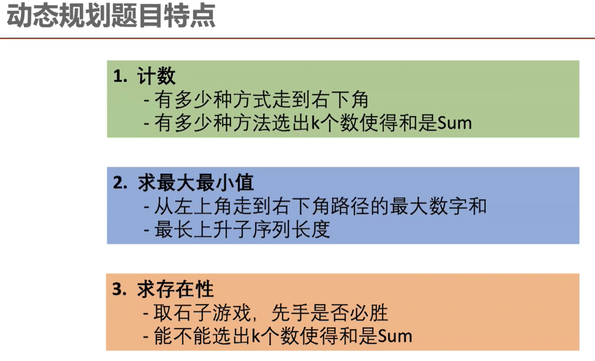

- 计数型：+
- 最值型：min  max
- 存在型：or   and

## 例题&解法

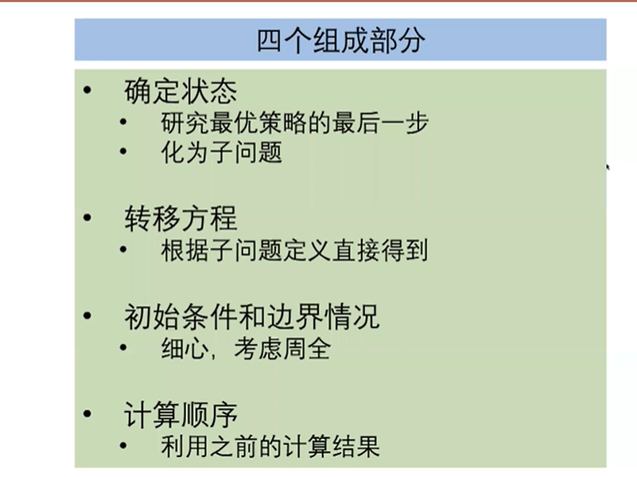

> ==1、开数组==
>
> ==2、初始化==
>
> ==3、for循环==

- 题目描述【最值型】

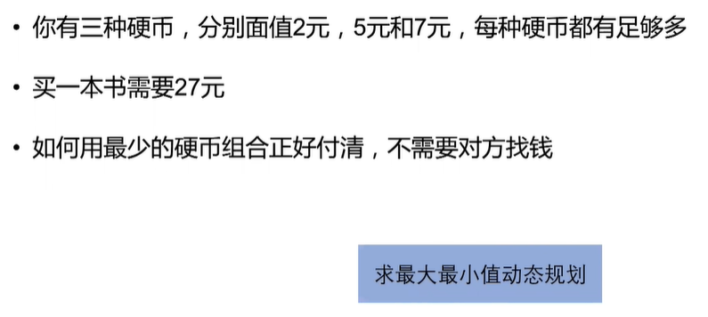

- 思路

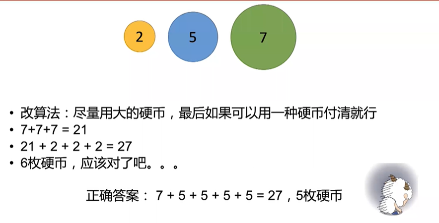

### 确定状态

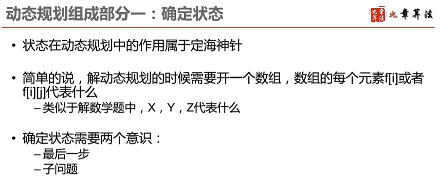

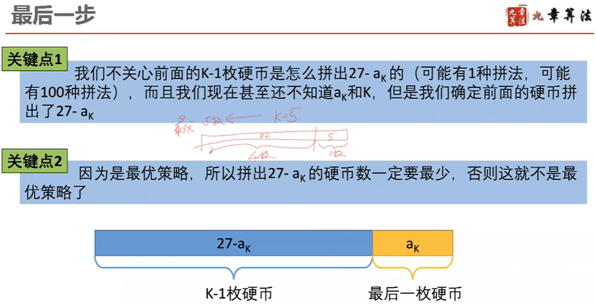


### 转移方程


### 初试条件和边界情况


- **初试条件**：用转移方程算不出来的，需要手工定义

### 计算顺序

- ==计算顺序（大多数）==
  - 一维：从小到大
  - 二维：从上到下，从左到右


### 总结


### 代码

```C++
#include<iostream>
#include<vector>
const int MAXN = 10000;
using namespace std;
int coinChange(vector<int>& coins, int amount) {
	int dp[amount + 1];
	dp[0] = 0;
	int N = coins.size();
	for (int i = 1; i <= amount; ++i) {
		dp[i] = MAXN;
		//last coin coins[j]
		//dp[i] = min{dp[i-coins[0]]+1,..,dp[i-coins[n-1]]+1}
		for (int j = 0; j < N ; ++j) {
			if (i - coins[j] >= 0 && dp[i - coins[j]] < MAXN) {
				dp[i] = min(dp[i], dp[i - coins[j]] + 1);
			}
		}
	}
	if (dp[amount] == MAXN) {
		dp[amount] = -1;
	}
	return dp[amount];

}

int main() {
	int num, M;
	cin >> num;
	vector<int> coins(num);
	for (int i = 0; i < num; ++i) {
		cin >> coins[i];
	}
	cin >> M;
	cout << coinChange(coins, M);
	return 0;
}
//输入：coins[3]={2,5,7}, amount = 27
//输出: 5
//解释：7+5+5+5+5 = 27
```


## 典型题目

[Java数据结构和算法——动态规划做题步骤详细总结](https://blog.csdn.net/weixin_44550963/article/details/107282087)

### 最值型

#### 斐波那契数列


```C++
class Solution {
public:
// 递归法(代码少但效率低)
    // int fib(int N) {
    //     if (N == 0 || N == 1)
    //         return N;
    //     return fib(N - 1) + fib(N - 2);
    // }

// 滚动数组思想(效率比哈希表法低一点)
    // int fib(int N) {
    //     if (N == 0 || N == 1) 
    //         return N;
    //     int a = 0, b = 1, r = 1;
    //     for(int i=0; i <N-1; i++){
    //         r = a + b;
    //         a = b;
    //         b = r;
    //     }
    //     return r;
    // }

// 哈希表法(效率最高)
    int fib(int N) {
        if (N == 0 || N == 1)
            return N;
        int dp[31];    // 0 <= N <= 30
        dp[0] = 0;
        dp[1] = 1;
        for (int i = 2; i <= N; i++) 
            dp[i] = dp[i-2] + dp[i-1];
        return dp[N];
    }
};
```

#### 第N个泰波那契数


```C++
class Solution {
public:
// 递归法(超时)
    // int tribonacci(int n) {
    //    if (N == 0 || N == 1 || N == 2) 
    //        return N == 0? 0 : 1;
    //     }
    //     return tribonacci(N-3) + tribonacci(N-2) + tribonacci(N-1);
    // }

// 滚动数组思想(效率比哈希表法低一点)
    // int tribonacci(int N) {
    //     if (N == 0 || N == 1 || N == 2) 
    //         return N == 0? 0 : 1;
    //     int a = 0, b = 1, c = 1, r = 0;
    //     for(int i = 2; i < N; i++){
    //         r = a + b + c;
    //         a = b;
    //         b = c;
    //         c = r;
    //     }
    //     return r;
    // }

// 哈希表法(效率最高)
    int tribonacci(int N) { 
        int dp[38] ={0};
        dp[0] = 0;
        dp[1] = dp[2] = 1;
        for(int i = 3; i <= N; i++)
            dp[i] = dp[i-1] + dp[i-2] + dp[i-3]; 
        return dp[N];
    }

//流氓算法
    // int tribonacci(int N) {
    //     int arr[38] = {0, 1, 1, 2, 4, 7, 13, 24, 44, 81, 149, 274, 504, 927, 1705, 3136, 5768, 10609, 19513, 35890, 66012, 121415, 223317, 410744, 755476, 1389537, 2555757, 4700770,8646064, 15902591, 29249425, 53798080, 98950096, 181997601, 334745777, 615693474, 1132436852, 2082876103};
    //     return arr[N];
    // }
};
```


#### N阶楼梯上楼问题


```C++
#include<iostream> 
#include<cstdio>
using namespace std;
const int MAXN = 91;

long long dp[MAXN];
int main(){
	dp[1] = 1;		//一个台阶只有{一次一步}，这一种 
	dp[2] = 2;		//两个台阶有{两次一步，一次两步} 两种 
	for(int i = 3; i < MAXN; ++i){
		dp[i] = dp[i-1] + dp[i-2];	
		//后面的每一级都可由一步、两步两种情况走上来 
	}
	int n;
	while(cin>>n){
		printf("%lld\n",dp[n]);
	}
	return 0;
}
```

#### 使用最小花费爬楼梯


```C++
int minCostClimbingStairs(vector<int>& cost) {
    int n = cost.size();
    vector<int> dp(n + 1);
    dp[0] = dp[1] = 0;
    for (int i = 2; i <= n; i++) {
        dp[i] = min(dp[i - 1] + cost[i - 1], dp[i - 2] + cost[i - 2]);
    }
    return dp[n];
}
```

#### 打家劫舍


```C++
//dp数组
class Solution {
public:
    int rob(vector<int>& nums) {
        int size = nums.size();
        if(size == 0) return 0;
        if(size == 1) return nums[0];
        vector<int> dp = vector<int>(size,0);
        dp[0] = nums[0];
        dp[1] = max(nums[0],nums[1]);
        for(int i = 2; i < size; i++){
            dp[i] = max(dp[i-1], dp[i-2] + nums[i]);   //状态转移方程
        }
        return dp[size-1];//前n间房总收入
    }
};

//滚动数组
class Solution {
public:
    int rob(vector<int>& nums) {
        int size = nums.size();
        if(size == 0) return 0;
        if(size == 1) return nums[0];
        int first = nums[0], second = max(nums[0], nums[1]);
        for (int i = 2; i < size; i++) {
            int temp = second;
            second = max(first + nums[i], second);
            first = temp;
        }
        return second;
    }
};

```


#### 打家劫舍II


```C++
class Solution {
public:
    //dp数组
    int robRange(vector<int>& nums, int start, int end) {
        if (end == start) return nums[start];
        vector<int> dp(nums.size());
        dp[start] = nums[start];
        dp[start + 1] = max(nums[start], nums[start + 1]);
        for (int i = start + 2; i <= end ; i++) {
            dp[i] = max(dp[i-1], dp[i-2] + nums[i]); 
        }
        return dp[end];
    }
    //滚动数组
    // int robRange(vector<int>& nums, int start, int end) {
    //     int first = nums[start], second = max(nums[start], nums[start + 1]);
    //     for (int i = start + 2; i <= end; i++) {
    //         int temp = second;
    //         second = max(first + nums[i], second);
    //         first = temp;
    //     }
    //     return second;
    // }
    int rob(vector<int>& nums) {
        int length = nums.size();
        if (length == 1) {  //只有一间房
            return nums[0];
        } else if (length == 2) {   //有两间房
            return max(nums[0], nums[1]);
        }
        return max(robRange(nums, 0, length - 2), robRange(nums, 1, length - 1));  //三间房及以上
    }
};
```


#### 吃糖果


```C++
#include <iostream>
#include <cstdio>
using namespace std;
int main(){
	//freopen("a.txt", "r", stdin);
    int n;
    int f[100] = {0};
    f[1] = 1;
    f[2] = 2;
    for(int i = 3; i < 90; ++i){
        f[i] = f[i - 2] + f[i - 1];
    }
    while(cin >> n){
        cout << f[n] << endl;
    }
}
```

#### 最大连续子序列和


```C++
#include <iostream>
#include <cstdio>
using namespace std;
const int MAXN = 1000000;
long long A[MAXN];
long long dp[MAXN];
//dp[i]表示以A[i]作为末尾的连续序列的最大和 
/*只需将i从小到大枚举并依次遍历，即可得到整个dp数组。
接着输出该数组中的最大值，即求得最大连续子序列的和。*/
long long MaxSubsequence(int n){
	long long maximum = 0;
	for(int i = 0; i < n; ++i){
		if(i == 0){
			dp[i] = A[i];
		}else{
			dp[i] = max(A[i], dp[i-1]+A[i]);
		}
		if(maximum == 0 && dp[i]<0)
			maximum = dp[i]; 
		maximum = max(maximum,dp[i]);
	}
	 
	return maximum;
}

int main(){
	int n;
	 while(scanf("%d",&n) != EOF){
	 	for(int i = 0; i < n; ++i){
		 	scanf("%lld", &A[i]);
		 }
		 long long answer = MaxSubsequence(n);
		 printf("%lld\n",answer);
	}
	return 0;
}
//5
//1 5 -3 2 4
//9
//
//6
//1 -2 3 4 -10 6
//7
//
//4
//-3 -1 -2 -5
//-1
//
//3
//-1 0 1
//1
```


#### 最大子矩阵


```C++
#include <iostream>
#include <cstdio>
using namespace std;
const int MAXN = 100;
int matrix[MAXN][MAXN];		//原始矩阵 
int total[MAXN][MAXN];		//辅助矩阵 
int A[MAXN];				//一维数组 
int dp[MAXN];
//dp[i]表示以A[i]作为末尾的连续序列的最大和 
/*只需将i从小到大枚举并依次遍历，即可得到整个dp数组。
接着输出该数组中的最大值，即求得最大连续子序列的和。*/
long long MaxSubsequence(int n){
	int maximum = 0;
	for(int i = 0; i < n; ++i){
		if(i == 0){
			dp[i] = A[i];
		}else{
			dp[i] = max(A[i], dp[i-1]+A[i]);
		}
		if(maximum == 0 && dp[i]<0)
			maximum = dp[i]; 
		maximum = max(maximum,dp[i]);
	}
	return maximum;
}

int MaxSubmatrix(int n){
	int maximal = 0;
	for(int i = 0; i < n; ++i){
		for(int j = i; j < n; ++j){
			for(int k = 0; k < n; ++k){
				if(i == 0){
					A[k] = total[j][k];
				}else{
					A[k] = total[j][k]-total[i-1][k];
				}
			}
			int current = MaxSubsequence(n);
			maximal = max(maximal, current);
		}
	}
	return maximal;
}

int main(){
	int n;
	while(scanf("%d",&n) != EOF){
		for(int i = 0; i < n; ++i){
			for(int j = 0; j < n; ++j){
				scanf("%d",&matrix[i][j]);
			}
		}
		for(int i = 0; i < n; ++i){
			for(int j = 0; j < n; ++j){
				if(i == 0){
					total[i][j] = matrix[i][j];
				}else{
					total[i][j] = total[i-1][j] + matrix[i][j];
				}
			}
		}
		int answer = MaxSubmatrix(n);
		printf("%d\n",answer);
	}
	return 0;
}
//4
//0 -2 -7 0
//9 2 -6 2
//-4 1 -4 1
//-1 8 0 -2
//15
```

#### 最大连续子序列


```c++
#include <iostream>
#include <cstdio>
using namespace std;
const int MAXN = 1000000;
long long A[MAXN];
long long dp[MAXN];
int First = 0, Last = 0;
int temp = 0;
//dp[i]表示以A[i]作为末尾的连续序列的最大和 
/*只需将i从小到大枚举并依次遍历，即可得到整个dp数组。
接着输出该数组中的最大值，即求得最大连续子序列的和。*/
long long MaxSubsequence(int n){
	long long maximum = 0;
	for(int i = 0; i < n; ++i){
		temp = maximum;
		if(i == 0){
			dp[i] = A[i];
		}else{
			dp[i] = max(A[i], dp[i-1]+A[i]);
		}
		if(maximum == 0 && dp[i]<0)
			maximum = dp[i]; 
		maximum = max(maximum,dp[i]);
		if(maximum > temp){
			Last = A[i];
			int sum = 0;
			for(int j = i; j > 0; j--){		
				sum += A[j];
				if(sum == maximum){
					First = A[j];
				}
			}
		}
	}
	return maximum;
}
int main(){
	int n;
	 while(scanf("%d",&n) != EOF){
	 	for(int i = 0; i < n; ++i){
		 	scanf("%lld", &A[i]);
		 }
		 long long answer = MaxSubsequence(n);
		 printf("最大连续子序列和为：%lld\nFirst:%d\nLast:%d\n",
		 	answer,First,Last);
	}
	return 0;
}
//10
//1 -3 5 3 7 -4 2 5 -1 2
//最大连续子序列和为：19
//First:5
//Last:2

//long long MaxSubsequence(int n){
//	long long maximum = 0;
//	for(int i = 0; i < n; ++i){
//		temp = maximum;
//		if(i == 0){
//			dp[i] = A[i];
//		}else{
//			dp[i] = max(A[i], dp[i-1]+A[i]);
//			if(dp[i] == A[i]){
//				First = A[i];
//			}
//		}
//		if(maximum<dp[i]){
//			Last = A[i];
//		}
//		if(maximum == 0 && dp[i]<0)
//			maximum = dp[i]; 
//		maximum = max(maximum,dp[i]);
//	}
//	return maximum;
//}
```

#### 最长递增子序列

- 求一个序列的最长递增子序列，这样的子序列是允许中间越过一些字符的，即留"空"。例如：4 2 3 1 5 的最长递增子序列为 2 3 5，长度为 3 

```C++
#include<iostream>
#include<cstdio>
using namespace std;
const int MAXN = 25;
int A[MAXN];		//存储序列的数组 
int dp[MAXN];
int main() {
	int n;
	while (scanf("%d", &n) != EOF) {
		for (int i = 0; i < n; ++i) {
			scanf("%d", &A[i]);
		}
		int answer = 0;
		for (int i = 0; i < n; ++i) {
			dp[i] = 1;
			for (int j = 0; j < i; ++j) {
				if (A[i] > A[j]) {
					dp[i] = max(dp[i], dp[j] + 1);
				}
			}
			answer = max(answer,dp[i]);			//dp数组的最大值 
		}
		printf("%d\n",answer);
	}
	return 0;
}
//5
//4 2 3 1 5
//3
```

#### 导弹拦截


- 由题意不难看出，要求最多能够拦截多少枚导弹，即在按照袭击顺序排列的导弹高度中求其最长不增子序列。所谓不增子序列，即子序列中排在前面的数字不比排在后面的数字小。求**最长不增子序列**的原理与求**最长递增子序列**的原理完全一致，只是状态转移方程相应地发生了一些变化。
- 状态转移方程为dp[i]=max{1,dp[j]+1 | j<i && Aj>=Ai}。

```C++
#include<iostream>
#include<cstdio>
using namespace std;
const int MAXN = 25;
int height[MAXN];		//导弹高度
int dp[MAXN];
int main() {
	int n;
	while (scanf("%d", &n) != EOF) {
		for (int i = 0; i < n; ++i) {
			scanf("%d", &height[i]);
		}
		int answer = 0;
		for (int i = 0; i < n; ++i) {
			dp[i] = 1;
			for (int j = 0; j < i; ++j) {
				if (height[i] <= height[j]) {
					dp[i] = max(dp[i], dp[j] + 1);
				}
			}
			answer = max(answer,dp[i]);			//dp数组的最大值 
		}
		printf("%d\n",answer);
	}
	return 0;
}
//7
//300 207 155 300 299 170 158
//5
```

#### 最大上升序列和


```C++
#include<iostream>
#include<cstdio>
using namespace std;
const int MAXN = 25;
int A[MAXN];		//存储序列的数组 
int dp[MAXN];
int main(){
	int n;
	while (scanf("%d", &n) != EOF) {
		for (int i = 0; i < n; ++i) {
			scanf("%d", &A[i]);
		}
		int answer = 0;
		for (int i = 0; i < n; ++i) {
			dp[i] = 1;
			for (int j = 0; j < i; ++j) {
				if (A[i] > A[j]) {
					dp[i] = max(dp[i], dp[j] + A[i]);	//状态方程发生变化
				}
			}
			answer = max(answer,dp[i]);			//dp数组的最大值 
		}
		printf("%d\n",answer);
	}
	return 0;
}
//7
//1 7 3 5 9 4 8
//18(1+3+5+9)
```


```C++
#include<iostream>
#include<climits>
using namespace std;
const int MAXN = 101;
int A[MAXN];
int dp1[MAXN];  //dp1[i]表示以a[i]结尾的最长递增子序列
int dp2[MAXN];  //dp2[i]表示以a[i]开头的最长递减子序列
int main() {
	int n;
	scanf("%d", &n);
	for (int i = 0; i < n; i++) {
		scanf("%d", &A[i]);
	}
	for (int i = 1; i < n; i++) {
		dp1[i] = 1;
		for (int j = 0; j < i; j++) {
			if (A[i] > A[j]) {
				dp1[i] = max(dp1[i], dp1[j] + 1);
			}
		}
	}
	for (int i = n - 2; i >= 0; i--) {
		dp2[i] = 1;
		for (int j = n - 1; j > i; j--) {
			if (A[i] > A[j]) {
				dp2[i] = max(dp2[i], dp2[j] + 1);
			}
		}
	}
	int answer = INT_MAX;
	for (int i = 0; i < n; i++) {
		answer = min(n - (dp1[i] + dp2[i] - 1), answer);
	}
	printf("%d\n", answer);
	return 0;
}
//8
//186 186 150 200 160 130 197 220
//4
```

#### 最长公共子序列

- 给定两个字符串S和S2,求一个最长公共子串，即求字符串S3，它同时为S和S2的子串，且要求它的长度最长，并确定这个长度。这个问题称为最长公共子序列问题。

```c++
#include<iostream>
#include<cstdio>
#include<cstring>
using namespace std;
const int MAXN = 1001;
char s1[MAXN];
char s2[MAXN];
int dp[MAXN][MAXN];/*dp[i][j]表示以s1[i]为末尾和以s2[i]为末尾的最长公共子序列的长度*/ 
int main(){
	while(scanf("%s%s",s1 +1,s2+1)!=EOF){//从下标1开始输入
		int n = strlen(s1+1);
		int m = strlen(s2+1);
		for(int i = 0; i <= n; ++i){
			for(int j = 0; j<=m; ++j){
				if(i==0||j==0){
                    //边界情况初始化
					dp[i][j] = 0;
					continue;
				}
				if(s1[i] == s2[j]){
					dp[i][j] = dp[i-1][j-1]+1;
				}else{
					dp[i][j] = max(dp[i-1][j], dp[i][j-1]);
				}
			}
		}
		printf("%d\n",dp[n][m]);
	}
	return 0;
}
//abcfbc abfcab
//4
//programming contest
//2
```


### 计数型

#### 机器人走路


```C++
//机器人走路 
#include<iostream>
#include<vector>
using namespace std;
int uniquePaths(int m, int n) {
	int dp[m][n];
	for (int i = 0; i < m; ++i) {		//row: top to bottom
		for (int j = 0; j < n; ++j) {	//column: left to right
			if (i == 0 || j == 0) {		
				dp[i][j] = 1;		//初始化 
			} else {
				dp[i][j] = dp[i - 1][j] + dp[i][j - 1];
			}
		}
	}
	return dp[m - 1][n - 1];
}

int main() {
	int row, col;
	cin >> row >> col; 
	cout << uniquePaths(row, col);
	return 0;
}
//输入：row = 4 , col = 5
//输出: 35
//解释：有35条路从左上角到右下角 
```

#### The triangle


```C++
#include<iostream>
#include<cstdio>
using namespace std;
const int MAXN = 100;
int dp[MAXN][MAXN];
int matrix[MAXN][MAXN];

int main(){
	int n;
	scanf("%d",&n);
	for(int i = 0; i<n; ++i){
		for(int j = 0; j<=i;++j){
			scanf("%d",&matrix[i][j]);
			dp[i][j] = matrix[i][j];
		}
	}
	for(int i = n-1; i>=0;--i){
		for(int j = 0; j <= i;++j){
			dp[i][j] += max(dp[i+1][j],dp[i+1][j+1]);
		}
	}
	printf("%d\n",dp[0][0]);
	return 0;
}
//5
//7
//3 8
//8 1 0
//2 7 4 4
//4 5 2 6 5
//30
```

#### 猴子吃香蕉


```C++
#include <iostream>
#include <cstdio>
using namespace std;
const int MAXN = 100;
int dp[2 * MAXN][MAXN];
int matrix[2 * MAXN][MAXN];
int main() {
	int caseNumber ;
	scanf("%d", &caseNumber);
	for (int cas = 1; cas <= caseNumber; ++cas) {
		int n;
		scanf("%d", &n);
		for (int i = 0; i < n; ++i) {
			for (int j = 0; j <= i; ++j) {
				scanf("%d", &matrix[i][j]);
				dp[i][j] = matrix[i][j];
			}
		}
		for (int i = n; i < 2 * n - 1; ++i) {
			for (int j = 0; j <= 2 * (n - 1) - i; ++j) {
				scanf("%d", &matrix[i][j]);
				dp[i][j] = matrix[i][j];
			}
		}
		for (int i = 2*(n-1)-1; i >= n-1; --i) {
			for (int j = 0; j <= 2*(n-1) - i; ++j) {
				if (j == 0) {						//最左端
					dp[i][j] += dp[i + 1][j];
				} else if (j == 2*(n-1) - i) {		//最右端
					dp[i][j] += dp[i + 1][j - 1];
				} else {
					dp[i][j] += max(dp[i + 1][j], dp[i + 1][j - 1]);
				}
			}
		}
		for (int i = n - 2; i >= 0; --i) {
			for (int j = 0; j <= i; ++j) {
				dp[i][j] += max(dp[i + 1][j], dp[i + 1][j + 1]);
			}
		}
		printf("Case %d: %d\n", cas, dp[0][0]);
	}
	return 0;
}
//2
//4
//7
//6 4
//2 5 10
//9 8 12 2
//2 12 7
//8 2
//10
//Case 1: 63
//2
//1
//2 3
//1
//Case 2: 5
```

#### 放苹果

> 把M个同样的苹果放在N个同样的盘子里,允许有的盘子空着不放，问共有多少种不同的分法(用K表示) ?例如，5,1,1和1,5,1是同一种分法。

```C++
/*
 * 递归
 * 设division(m,n)为分法结果，m为苹果数，n为盘子数
 * 对n进行讨论
 * .当m<n时，则必定有n-m个盘子永远空着，去掉它们对结果无影响
 * 即if(n>m) f(m,n)=f(m,m)
 * .当m>n时,分两类，含有0的方案数，不含0的方案数
 * 1.含有0的方案数，即有至少一个盘子空着，即相当于f(m,n)=f(m,n-1)
 * 2.不含0的方案数，即所有的盘子都有苹果，相当于可以从每个盘子中
 * 拿出一个苹果，不影响分法，即f(m,n)=f(m-n,n)
 * 而总的放法等于二者之和，即
 * f(m,n)=f(m,n-1)+f(m-n,n)
 *
 * 递归出口条件：
 *      .当n=1时，所有苹果都i必须放在同一个盘子里，返回1
 *      .当m=0时，即没有苹果，返回1
 */

#include <stdio.h>
int division(int m,int n){
    if(m==0||n==1){
        return 1;
    }
    else if(m<n){
        return division(m,m);
    }
    else{
        return division(m,n-1)+division(m-n,n);
    }
}
int main(){
    int m,n;
    while(scanf("%d%d",&m,&n)!=EOF){
        printf("%d\n",division(m,n));
    }
    return 0;
}
//7 3
//8
```


#### 整数拆分

> 一个整数总可以拆分为2的幂的和。例如，7可以拆分成7=1+2+4, 7=1+2+2+2, 7=1+1+ 1 +4, 7=1+1+1+2+2，7=1+1+1+1+1+2.7=1+1+1+1+1+ 1+1,共有6种不同的拆分方式。再如，4可以拆分成4=4，4=1+1+1+1, 4=2+2, 4=1+1+2,共有4种不同的拆分方式。
>
> 用f(n)表示n的不同拆分的种数，例如f(7)=6。要求编写程序， 读入n (不超过100000,
> 输出f(n) %00000000.

```C++
//习题12.8
#include <iostream>
#include <cstdio>
#include <cstring> 
using namespace std;
int n, dp[1000002], a[21];
int main ( ) {
	int i, j;
	a[1]=1;
	for (i = 2; i <= 20; i++ )
		a[i] = a[i-1]*2;
	dp[0] = 1;
	while ( cin >> n ) {
		memset ( dp + 1, 0, sizeof ( dp ) );
		for ( i = 1; i <= 20; i ++ ) {
			for ( j = a[i]; j <= n; j ++ ) {
				dp[j] += dp[j - a[i]];
				dp[j] %= 1000000000;
			}
		}
		cout << dp[n] << endl;
	}
	return 0;
}
```


### 存在型

#### Jump Game


```C++
#include<iostream>
#include<vector>
using namespace std;
bool canJump(vector<int>& A) {
	int n = A.size();
	bool dp[n];
	dp[0] = true;
	for (int j = 1; j < n; ++j) {
		dp[j] = false;
		for (int i = 0; i < j; ++i) {
			if (dp[i] && i + A[i] >= j) {
				dp[j] = true;
				break;
			}
		}
	}
	return dp[n - 1];
}
int main() {
	vector<int> A(5);
	for (int i = 0; i < A.size(); ++i){
		cin>>A[i];
	}
	if(canJump(A)) cout<<"true"<<endl;
	else cout<<"false"<<endl;
	return 0;
}
//2 3 1 1 4
//true
//3 2 1 0 4
//false
```


### labuladong

#### 斐波那契

```C++
int fib(int n){
	if(n == 0 || n == 1) return 1;
    else return fib(n-1) + fib(n-2);
}
```

——下面的解法旨在说明【重叠子问题】的消除方法

**带“备忘录”的递归解法**


```C++
int fib(int N){
    //将备忘录全初始化为0
	if(N == 0) 
        return 0;
	//进行带备忘录的递归
	vector<int> memo(N+1,0);
	return helper(memo,N); 
} 

int helper(vector<int>& memo, int n){
	//base case
	if(n==1 || n==2) return 1;
	//已经计算过
	if(memo[n] != 0) return memo[n];
	memo[n] = helper(memo, n-1) + helper(memo, n-2);
	return memo[n]; 
}
```

**迭代的动态规划解法**


```C++
int fib(int N){
	if(N==0) return 0;
	if(N==1||N==2) return 1;
	vector<int> dp(N+1,0);
	//base case
	dp[1] = dp[2] = 1;
	for(int i = 3; i <= N; i++)
		dp[i] = dp[i-1] + dp[i-2];
	return dp[n];
}
```

**再优化_“状态压缩”**

- 当前状态只和之前的两个状态有关，其实并不需要那么长的一个DP table来存储所有的状态，只要想办法存储之前的两个状态即可。O(N)→O(1)

```C++
int fib(int N){
	if(N==0) return 0;
	if(N==1||N==2) return 1;
	int prev = 1, curr = 1;
	for(int i=3; i<=N; i++) {
		int sum = prev + curr;
		prev = curr;
		curr = sum;
	}
	return curr;
}
```


## 背包问题

==背包问题也是动态规划的一大类题型==

### 三种类型

#### 0-1背包

> 0-1背包问题是最基本的背包问题，其他各类背包问题都是在此基础上演变而来。0-1背包的特点是，每种物品至多只能选择一件，即在背包中该物品的数量只有0和1两种情况，这也是0-1背包名称的由来。


```C++
//经典问题，需要记住的代码：
#include <iostream>
#include <cstdio>
#include <cstring>
using namespace std;
const int MAXN = 1001;
int w[MAXN];		//物品重量
int v[MAXN];		//物品价值
int dp[MAXN];
int main() {
	int m, n;		//m是背包空间, n是物品个数
	while (scanf("%d %d", &m, &n) != EOF) {
		for (int i = 0; i < n; ++i) {
			scanf("%d %d", &w[i], &v[i]);
		}
		memset(dp, 0, sizeof(dp));	//memset需要#include<cstring>
		for (int i = 0; i < n; ++i) {
			for (int j = m; j >= w[i]; --j) {
				dp[j] = max(dp[j], dp[j - w[i]] + v[i]);
			}
		}
		printf("%d\n", dp[m]);
	}
	return 0;
}
```

##### 点菜问题


- 这个问题是典型的0-1背包问题，报销额度对应于背包的容量，每种菜的价格对应于商品的重量，而每种菜的评分对应于商品的价值。

```C++
#include <iostream>
#include <cstdio>
#include <cstring>
using namespace std;
const int MAXN = 1001;
int v[MAXN];		//物品价值（菜的评分）
int w[MAXN];		//物品重量（菜的价格）
int dp[MAXN];
int main() {
	int m, n;		//m是背包空间, n是物品个数
	while (scanf("%d %d", &m, &n) != EOF) {
		for (int i = 0; i < n; ++i) {
			scanf("%d %d", &w[i], &v[i]);
		}
		memset(dp, 0, sizeof(dp));	//memset需要#include<cstring>
		for (int i = 0; i < n; ++i) {
			for (int j = m; j >= w[i]; --j) {
				dp[j] = max(dp[j], dp[j - w[i]] + v[i]);
			}
		}
		printf("%d\n", dp[m]);
	}
	return 0;
}
//90 4
//20 25
//30 20
//40 50
//10 18
//95
//
//40 2
//25 30
//10 8
//38
```

##### 采药


```C++
#include <iostream>
#include <cstdio>
#include <cstring>
using namespace std;
const int MAXN = 1001;
int v[MAXN];		//物品价值（菜的评分）
int w[MAXN];		//物品重量（菜的价格）
int dp[MAXN];
int main() {
	int m, n;		//m是背包空间, n是物品个数
	while (scanf("%d %d", &m, &n) != EOF) {
		for (int i = 0; i < n; ++i) {
			scanf("%d %d", &w[i], &v[i]);
		}
		memset(dp, 0, sizeof(dp));	//memset需要#include<cstring>
		for (int i = 0; i < n; ++i) {
			for (int j = m; j >= w[i]; --j) {
				dp[j] = max(dp[j], dp[j - w[i]] + v[i]);
			}
		}
		printf("%d\n", dp[m]);
	}
	return 0;
}
//90 4
//20 25
//30 20
//40 50
//10 18
//95
//
//40 2
//25 30
//10 8
//38
```


##### 最小邮票数

有若干邮票，要求从中选取最少的邮票张数凑成一个给定的总值.例如，有1分、3分、3分、3分、4分五张邮票，要求凑成10分;此时使用3张邮票: 3分、3分、4分即可。

```C++
#include <iostream>
#include <cstdio>
#include <algorithm>
using namespace std;
#define INF 0x3f3f3f3f
const int MAXN = 101;
int dp[MAXN];	//dp[i]表示凑成总值为i的最少邮票数量
int price[MAXN];	//price表示各种面额
int main() {
//    freopen("s.cpp","r",stdin);
	int total, n;	//total是需要凑成的总值，n是提供的邮票张数
	while (scanf("%d%d", &total, &n) != EOF) {
		for (int i = 0; i < MAXN; i++)
			dp[i] = INF;
		dp[0] = 0;
		int sum = 0;
		for (int i = 0; i < n; i++) {
			scanf("%d", &price[i]);
			sum += price[i];
		}
		if (sum < total) {
			//如果所有的邮票面值加起来都凑不到总值
			printf("0\n");
			continue;
		}
		sort(price, price + n);		//对邮票面额排序
		for (int i = 0; i < n; i++) {
			//按邮票面额从小到大考虑
			for (int j = total; j >= price[i]; j--) {
				if (dp[j-price[i]] != INF)
					dp[j] = min(dp[j], dp[j-price[i]] + 1);
			}
		}
		if (dp[total] != INF) {
			printf("%d\n", dp[total]);
		} else {
			printf("0\n");
		}
	}
	return 0;
}
```


#### 完全背包

> 如果将0-1背包问题进行扩展，每种物品不只可以取一件，而是可以选择多件，这时该如何使得背包里的物品价值总和最大呢?这便得到完全背包问题:有n种物品，每种物品的重量为w[],其价值为v[i]，每种物品的数量均为无限个，现在有容量为m的背包，如何选择物品使得装入背包物品的价值最大?


##### Piggy-Bank


```C++
#include<iostream>
#include<cstdio>
#include<climits>
using namespace std;
const int INF = INT_MAX / 10;
const int MAXN = 10000;
int w[MAXN];		//物品重量
int v[MAXN];		//物品价值
int dp[MAXN];

int main() {
	int caseNumber;
	scanf("%d", &caseNumber);
	while (caseNumber--) {
		int e, f;
		scanf("%d%d",&e,&f);
		int m = f - e;		//背包容量
		int n;		      //物品种类
		scanf("%d",&n);
		for (int i = 0; i < n; i++) {
			scanf("%d%d",&v[i], &w[i]);
		}
		for (int i = 1; i <= m; i++) {
			dp[i] = INF;	//注意初始化
		}
		dp[0] = 0;
		for (int i = 0; i < n; ++i) {
			for (int j = w[i]; j <= m; ++j) {
				dp[j] = min(dp[j], dp[j - w[i]] + v[i]);
			}
		}
		if (dp[m] == INF) {
			printf("This is impossible.\n");
		} else {
			printf("The minimum amount of money in the piggy-bank is %d.\n", dp[m]);
		}
	}
	return 0;
}
//3
//10 110
//2
//1 1
//30 50
//The minimum amount of money in the piggy-bank is 60.
//10 110
//2
//1 1
//50 30
//The minimum amount of money in the piggy-bank is 100.
//1 6
//2
//10 3
//20 4
//This is impossible.
```

==总之，完全背包问题的特点是每类物品可选的数量为无穷，其解法与0-1背包问题整体保持一致，与其不同的仅为状态更新时的遍历顺序。==

#### 多重背包

> 如果在0-1背包和完全背包问题之间折中，即每种物品既不是只能取一一件， 又不是能取无穷件，而是最多只能取k件，这时该如何使得背包里的物品价值总和最大呢?这便得到**多重背包问题**:有n种物品，每种物品的重量为w[i]， 其价值为v[]，每种物品的数量为kK[]，现在有个容量为m的背包，如何选择物品使得装入背包物品的价值最大。

##### 珍惜现在，感恩生活


```C++
#include<iostream>
#include<cstdio>
using namespace std;
const int MAXN = 10001;

int w[MAXN];				//物品质量 
int v[MAXN];				//物品价值 
int k[MAXN];				//物品数量 
int value[MAXN];			//分解后物品价值 
int weight[MAXN];			//分解后物品质量 
int dp[MAXN];

int main(){
	int caseNumber;
	scanf("%d",&caseNumber);
	while(caseNumber--){
		int n, m;
		scanf("%d%d",&m,&n);
		int number = 0;
		for(int i = 0; i < n; ++i){
			scanf("%d%d%d",&w[i],&v[i],&k[i]);
			for(int j = i; j<=k[i]; ++j){
				value[number] = j*v[i];
				weight[number] = j*w[i];
				number++;
				k[i] -= j;
			}
			if(k[i]>0){
				value[number] = k[i] * v[i];
				weight[number] = k[i] * w[i];
				number++;
			}
		}
		for(int i = 0;i <= m; ++i){
			dp[i] = 0;		//初始化 
		}
		for(int i = 0; i < number; ++i) {
			for(int j = m; j >=weight[i]; --j){
				dp[j] = max(dp[j],dp[j-weight[i]]+value[i]);
			}
		}
		printf("%d\n",dp[m]);
	}
	return 0;
}
//1
//8 2
//2 100 4
//2 100 2
//400
```

==多重背包问题小结如下:多重背包的特征是每个物品可取的数量为一个确定的整数，通过对这个整数进行拆分，使若干物品组合成一个更大的物品，同时通过这些大物品间的组合又可组合出选择任意件物品的情况，通过这种拆分使得最后求解0-1背包问题时的物品数量大大减少，从而降低复杂度。==

## 其他问题

由于动态规划问题没有固定的命题形式，之前几节也只是介绍了一些经典且常见的动态规划问题。本节结合题目分析一些动态规划问题的实例，以帮助读者深入了解动态规划。

### 12.10 The Triangle

```C++
#include<iostream>
#include<cstdio>
using namespace std;
const int MAXN = 100;
int dp[MAXN][MAXN];
int matrix[MAXN][MAXN];

int main(){
	int n;
	scanf("%d",&n);
	for(int i = 0; i<n; ++i){
		for(int j = 0; j<=i;++j){
			scanf("%d",&matrix[i][j]);
			dp[i][j] = matrix[i][j];
		}
	}
	for(int i = n-1; i>=0;--i){
		for(int j = 0; j <= i;++j){
			dp[i][j] += max(dp[i+1][j],dp[i+1][j+1]);
		}
	}
	printf("%d\n",dp[0][0]);
	return 0;
}
//5
//7
//3 8
//8 1 0
//2 7 4 4
//4 5 2 6 5
//30
```

### 12.11 Monkey Banana Problem

```C++
#include <iostream>
#include <cstdio>
using namespace std;
const int MAXN = 100;
int dp[2 * MAXN][MAXN];
int matrix[2 * MAXN][MAXN];
int main() {
	int caseNumber ;
	scanf("%d", &caseNumber);
	for (int cas = 1; cas <= caseNumber; ++cas) {
		int n;
		scanf("%d", &n);
		for (int i = 0; i < n; ++i) {
			for (int j = 0; j <= i; ++j) {
				scanf("%d", &matrix[i][j]);
				dp[i][j] = matrix[i][j];
			}
		}
		for (int i = n; i < 2 * n - 1; ++i) {
			for (int j = 0; j <= 2 * (n - 1) - i; ++j) {
				scanf("%d", &matrix[i][j]);
				dp[i][j] = matrix[i][j];
			}
		}
		for (int i = 2*(n-1)-1; i >= n-1; --i) {
			for (int j = 0; j <= 2*(n-1) - i; ++j) {
				if (j == 0) {						//最左端
					dp[i][j] += dp[i + 1][j];
				} else if (j == 2*(n-1) - i) {		//最右端
					dp[i][j] += dp[i + 1][j - 1];
				} else {
					dp[i][j] += max(dp[i + 1][j], dp[i + 1][j - 1]);
				}
			}
		}
		for (int i = n - 2; i >= 0; --i) {
			for (int j = 0; j <= i; ++j) {
				dp[i][j] += max(dp[i + 1][j], dp[i + 1][j + 1]);
			}
		}
		printf("Case %d: %d\n", cas, dp[0][0]);
	}
	return 0;
}
//2
//4
//7
//6 4
//2 5 10
//9 8 12 2
//2 12 7
//8 2
//10
//Case 1: 63
//2
//1
//2 3
//1
//Case 2: 5
```

### 习题12.7 放苹果

> 把M个同样的苹果放在N个同样的盘子里,允许有的盘子空着不放，问共有多少种不同的分法(用K表示) ?例如，5,1,1和1,5,1是同一种分法。

```C++
/*
 * 递归
 * 设division(m,n)为分法结果，m为苹果数，n为盘子数
 * 对n进行讨论
 * .当m<n时，则必定有n-m个盘子永远空着，去掉它们对结果无影响
 * 即if(n>m) f(m,n)=f(m,m)
 * .当m>n时,分两类，含有0的方案数，不含0的方案数
 * 1.含有0的方案数，即有至少一个盘子空着，即相当于f(m,n)=f(m,n-1)
 * 2.不含0的方案数，即所有的盘子都有苹果，相当于可以从每个盘子中
 * 拿出一个苹果，不影响分法，即f(m,n)=f(m-n,n)
 * 而总的放法等于二者之和，即
 * f(m,n)=f(m,n-1)+f(m-n,n)
 *
 * 递归出口条件：
 *      .当n=1时，所有苹果都i必须放在同一个盘子里，返回1
 *      .当m=0时，即没有苹果，返回1
 */

#include <stdio.h>
int division(int m,int n){
    if(m==0||n==1){
        return 1;
    }
    else if(m<n){
        return division(m,m);
    }
    else{
        return division(m,n-1)+division(m-n,n);
    }
}
int main(){
    int m,n;
    while(scanf("%d%d",&m,&n)!=EOF){
        printf("%d\n",division(m,n));
    }
    return 0;
}
//7 3
//8
```


### 习题12.8 整数拆分

> 一个整数总可以拆分为2的幂的和。例如，7可以拆分成7=1+2+4, 7=1+2+2+2, 7=1+1+ 1 +4, 7=1+1+1+2+2，7=1+1+1+1+1+2.7=1+1+1+1+1+ 1+1,共有6种不同的拆分方式。再如，4可以拆分成4=4，4=1+1+1+1, 4=2+2, 4=1+1+2,共有4种不同的拆分方式。
>
> 用f(n)表示n的不同拆分的种数，例如f(7)=6。要求编写程序， 读入n (不超过100000,
> 输出f(n) %00000000.

```C++
//习题12.8
#include <iostream>
#include <cstdio>
#include <cstring> 
using namespace std;
int n, dp[1000002], a[21];
int main ( ) {
	int i, j;
	a[1]=1;
	for (i = 2; i <= 20; i++ )
		a[i] = a[i-1]*2;
	dp[0] = 1;
	while ( cin >> n ) {
		memset ( dp + 1, 0, sizeof ( dp ) );
		for ( i = 1; i <= 20; i ++ ) {
			for ( j = a[i]; j <= n; j ++ ) {
				dp[j] += dp[j - a[i]];
				dp[j] %= 1000000000;
			}
		}
		cout << dp[n] << endl;
	}
	return 0;
}
```

# Python算法


## 算法绪论

### 算法由来


### 算法定义


### 算法性质


### 算法表示


### 算法分析


#### 渐进分析


## 分而治之

### 归并排序


#### 分而治之的一般步骤


### 递归式求解

#### 递归树法


#### 代入法

- 递归树法无法确定渐进紧确界
- 其实就是猜测，然后用数学归纳法来证明


### 最大子数组I


#### 蛮力枚举


#### 优化枚举


#### 分而治之方法


---


### 逆序对计数


#### 蛮力枚举


#### 分而治之


### 快速排序


### 次序选择


## 动态规划


### 0-1背包问题


### 最大子数组II


### 最长公共子序列


### 最长公共子串


### 编辑距离


### 钢条切割


### 矩阵链乘法


## 贪心策略


### 部分背包


### 霍夫曼编码


### 任务调度


### 活动选择


### 最小生成树


#### Prim算法


#### Kruskal算法


### 单源最短路径


#### Dijkstra算法


#### Bellman-Ford算法


## 图算法篇


### 图的基本概念


### 广度优先搜索


### 深度优先搜索


### 环路存在性判断


### 拓扑排序


### 强连通分量


### 所有点对最短路径


### 最大流


### 二分图匹配


### 图算法总结


# 常用轮子

### 判断素数

```python
from math import sqrt

def isprime(n):
    N = int n
    for i in range(2, int(sqrt(N))):
        if N % i == 0:
            return true
            break
    else:
	    return false
```

### 选择排序

```C
//C语言
void select_sort(int *a, int n){
    int i, j, t;
    for(i=0; i<n-1; i++){
        for(j=i+1; j<n; j++){
            if(a[i] > a[j]){
                t = a[i];
                a[i] = a[j];
                a[j] = t;
            }
        }
    }
}
```

```python
#python
def select_sort(a, n):
    for i in range(0, n-1):
        for j in range (i+1, n):
            if a[i] > a[j]:
                t = a[i]
                a[i] = a[j]
                a[j] = t;

def select_sort(a, n):
    for i in range(0, n-1):
        cur_min = a[i]
        cur_min_pos = i
        for j in range (i, n):
            if cur_min > a[j]:
                cur_min = a[j]
                cur_min_pos = j
        t = a[i]
        a[i] = a[cur_min_pos]
        a[cur_min_pos] = t;             
```

