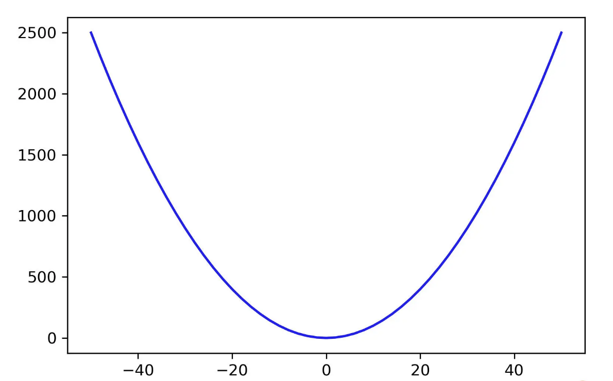
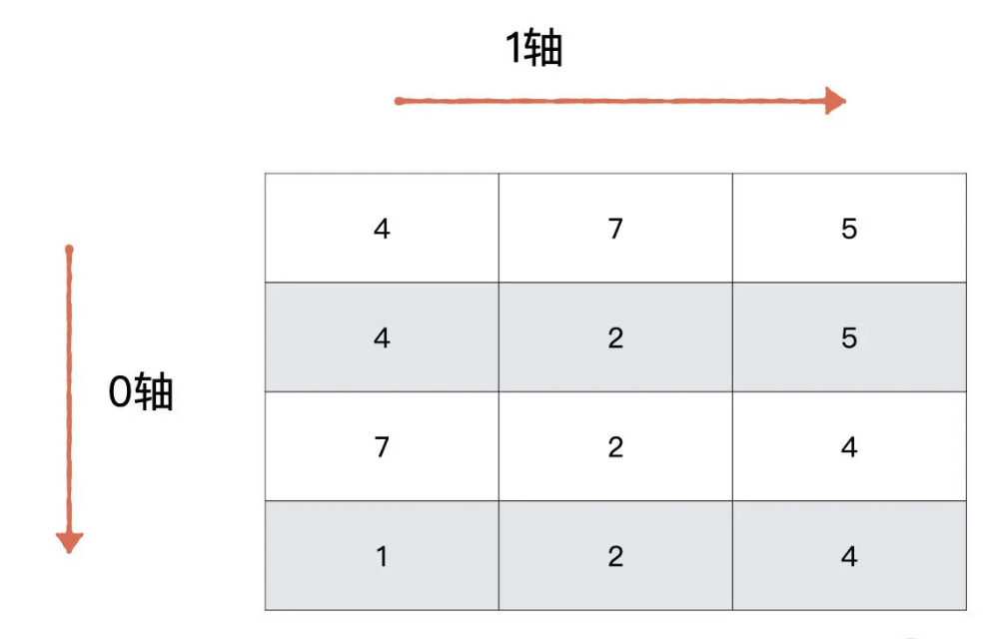
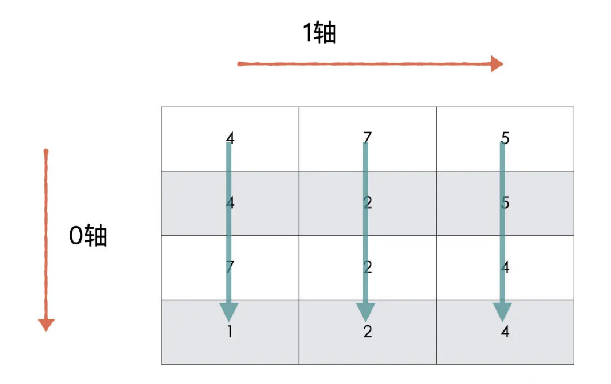
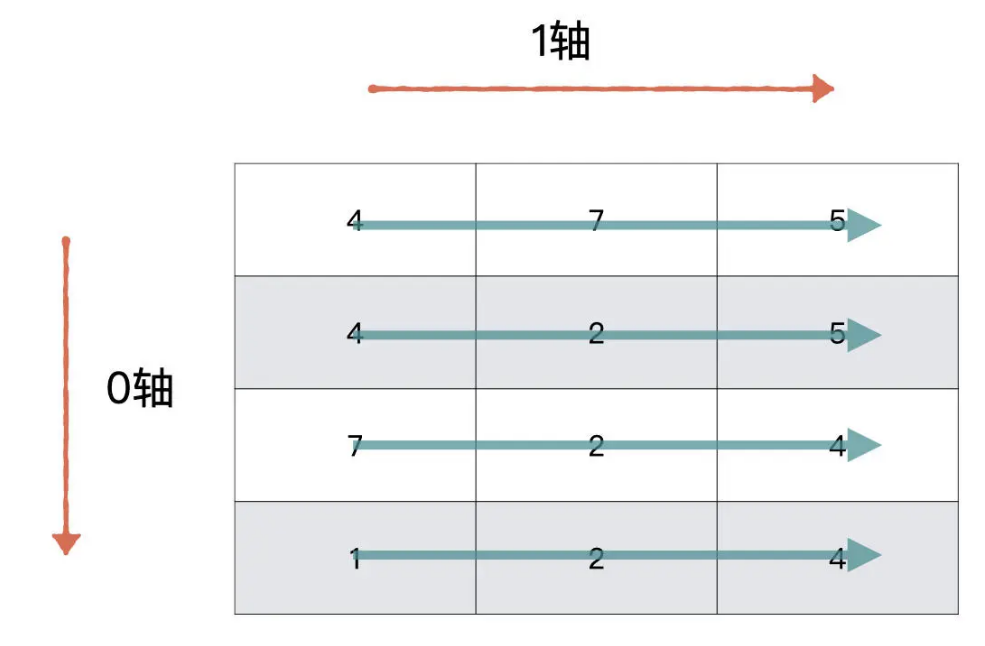
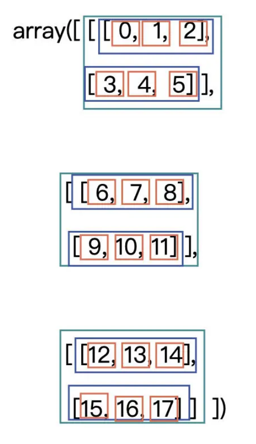

#

# Pytorch介绍

- 从 19 年起，无论是学术界还是工程界 PyTorch 已经霸占了半壁江山，可以说 PyTorch 已经是现阶段的主流框架了。

  

- 这里的 Py 我们不陌生，它就是 Python，那 Torch 是什么？从字面翻译过来是一个“火炬”。

- 什么是火炬呢？其实这跟 TensorFlow 中的 Tensor 是一个意思，我们可以把它看成是能在 GPU 中计算的矩阵。

- 那 PyTorch 框架具体是怎么用的呢？说白了就是一个计算的工具。借助它，我们就能用计算机完成复杂的计算流程。

- 但是我们都知道，机器跟人类的“语言”并不相通，想要让机器替我们完成对数据的复杂计算，就得先把数据翻译成机器能够理解的内容。无论是图像数据、文本数据还是数值数据，都要转换成矩阵才能进行后续的变化和运算。

- 搞定了读入数据这一步，我们就要靠 PyTorch 搞定后面各种复杂的计算功能。这些所有的计算功能，包括了从前向传播到反向传播，甚至还会涉及其它非常复杂的计算，而这些计算统统要交给 PyTorch 框架实现。

- PyTorch 会把我们需要计算的矩阵传入到 GPU（或 CPU）当中，在 GPU（或 CPU）中实现各种我们所需的计算功能。因为 GPU 做矩阵运算比较快，所以在神经网络中的计算一般都首选使用 GPU，但对于学习来说，我们用 CPU 就可以了。

- 而我们要做的就是，设计好整个任务的流程、整个网络架构，这样 PyTorch 才能顺畅地完成后面的计算流程，从而帮我们正确地计算。

# 环境配置

- [b站最全最简洁易学的深度学习环境配置教程Anaconda+Pycharm+CUDA+CUdnn+PyTorch+TensorFlow](https://www.bilibili.com/video/BV1ov41137Z8?p=7&spm_id_from=333.880.my_history.page.click&vd_source=91088843a890485388c17ae47f6d4379)

# NumPy

​		NumPy 是用于 Python 中科学计算的一个基础包。它提供了一个多维度的数组对象，以及针对数组对象的各种快速操作，例如排序、变换，选择等。

## NumPy 数组

​		数组对象是 NumPy 中最核心的组成部分，这个数组叫做 ndarray，是“N-dimensional array”的缩写。其中的 N 是一个数字，指代维度，例如常常能听到的 1-D 数组、2-D 数组或者更高维度的数组。

​		在 NumPy 中，数组是由 numpy.ndarray 类来实现的，它是 NumPy 的核心数据结构。

​		NumPy 数组从逻辑上来看，与其他编程语言中的数组是一样的，索引也是从 0 开始。而 Python 中的列表，其实也可以达到与 NumPy 数组相同的功能，但它们又有差异：

> 1. Python 中的列表可以动态地改变，而 **NumPy 数组是不可变**的，它在创建时就有固定大小了。改变 Numpy 数组长度的话，会新创建一个新的数组并且删除原数组。
> 2. NumPy 数组中的数据类型必须是一样的，而列表中的元素可以是多样的。
> 3. NumPy 针对 NumPy 数组一系列的运算进行了优化，使得其速度特别快，并且相对于 Python 中的列表，同等操作只需使用更少的内存。

### 创建数组

#### np.array() & np.asarray()

​	最简单的方法就是把一个列表传入到 np.array() 或 np.asarray() 中，这个列表可以是任意维度的。np.array() 属于深拷贝，np.asarray() 则是浅拷贝【用numpy，基本就考虑深拷贝了，直接上numpy.array()】

```python
>>>import numpy as np  #引入一次即可
>>>arr_1_d = np.asarray([1])
>>>print(arr_1_d)
[1]
```

```python
# 再创建个二维数组
>>>arr_2_d = np.asarray([[1, 2], [3, 4]])
>>>print(arr_2_d)
[[1 2]
 [3 4]]
```

#### np.ones() 

np.ones() 用来创建一个全 1 的数组，必须指定数组的形状，可选参数是数组的数据类型

```python
>>>np.ones()
Traceback (most recent call last):
  File "<stdin>", line 1, in <module>
TypeError: ones() takes at least 1 argument (0 given)
# 报错原因是没有给定形状的参数
>>>np.ones(shape=(2,3))
array([[1., 1., 1.],
       [1., 1., 1.]])

>>>np.ones(shape=(2,3), dtype='int32')
array([[1, 1, 1],
       [1, 1, 1]], dtype=int32)
```

如果需要初始化一些权重的时候就可以用上，比如说生成一个 2x3 维的数组，每个数值都是 0.5，可以这样做：

```python
>>>np.ones((2, 3)) * 0.5
array([[0.5, 0.5, 0.5],
       [0.5, 0.5, 0.5]]
```

#### np.zeros()

np.zeros()同理，用来创建一个全1的数组，必须指定数组的形状，可选参数是数组的数据类型

```python
>>>np.zeros(shape=(2,3))
array([[0., 0., 0.],
       [0., 0., 0.]])

>>>np.zeros(shape=(2,3),dtype='int64')
array([[0, 0, 0],
       [0, 0, 0]], dtype=int64)
```

#### np.arange()

​	还可以使用 `np.arange([start, ]stop, [step, ]dtype=None)` 创建一个在**[start, stop)** 区间的数组，元素之间的跨度是 step。

- `start`： 可选参数，默认为 0
- `stop`： 必须参数，左闭右开区间 → 从start到stop-1
- `step`： 可选参数，默认是 1
- `dtype`： 可选参数，默认是'int32'

```python
# 创建从0到4的数组
>>>np.arange(5)
array([0, 1, 2, 3, 4])

# 从2开始到4的数组
>>>np.arange(2, 5)
array([2, 3, 4])

# 从2开始，到8的数组，跨度是3
>>>np.arange(2, 9, 3)
array([2, 5, 8])
```

#### np.linspace()

​	最后，我们也可以用 `np.linspace（start, stop, num=50, endpoint=True, retstep=False, dtype=None）`创建一个数组，具体就是创建一个从开始数值到结束数值的等差数列。

- `start`：必须参数，序列的起始值
- `stop`：必须参数，序列的终点
- `num`：序列中元素的个数，默认是 50
- `endpoint`：默认为 True，如果为 True，则数组最后一个元素是 stop
- `retstep`：默认为 False，如果为 True，则返回数组与公差
- `dtype`： 可选参数，默认是'float64'

```python
# 从2到10，有3个元素的等差数列
>>>np.linspace(start=2, stop=10, num=3)
 array([ 2.,  6., 10.])
```

`np.arange()` 与 `np.linspace()` 也是比较常见的函数，比如你要作图的时候，可以用它们生成 x 轴的坐标。例如，我要生成一个 y=x^2^ 的图片，x 轴可以用 `np.linespace()` 来生成

```python
import numpy as np
import matplotlib.pyplot as plt

X = np.arange(-50, 51, 2)
Y = X ** 2

plt.plot(X, Y, color='blue')
plt.legend()
plt.show()
```



### 数组的属性

#### arr.ndim

​	ndim 表示数组**维度（或轴）的个数**。刚才创建的数组 arr_1_d 的轴的个数就是 1，arr_2_d 的轴的个数就是 2。

```python
>>>arr_1_d.ndim
1
>>>arr_2_d.ndim
2
```

#### arr.shape

​	shape 表示数组的**维度**或形状， 是一个整数的元组，元组的长度等于 ndim。arr_1_d 的形状就是（1，）（一个向量）， arr_2_d 的形状就是 (2, 2)（一个矩阵）

```python
>>>arr_1_d.shape
(1,)
>>>arr_2_d.shape
(2, 2)
```

​	在实际的工作当中，使用 arr.reshape() 函数对数组的形状进行变换，需要注意的是，变换前与变换后数组的元素个数需要是一样的。

```python
>>>arr_2_d.shape
(2, 2)
>>>arr_2_d
[[1 2]
 [3 4]]
# 将arr_2_d reshape为(4，1)的数组
>>>arr_2_d.reshape((4，1))
array([[1],
       [2],
       [3],
       [4]])
```

​	还可以使用 `np.reshape(a, newshape, order)` 对数组 a 进行 reshape，新的形状在 newshape 中指定。order参数为：

- ‘C’：默认参数，使用类似 C-like 语言（**行优先**）中的索引方式进行读写。**多数用这种默认的方式**
- ‘F’：使用类似 Fortran-like 语言（**列优先**）中的索引方式进行读写。
- ‘A’：原数组如果是按照‘C’的方式存储数组，则用‘C’的索引对数组进行 reshape，否则使用’F’的索引方式。

​	reshape 的过程你可以这样理解，首先需要根据指定的方式 (‘C’或’F’) 将原数组展开，然后再根据指定的方式写入到新的数组中。这是什么意思呢？先看一个简单的 2 维数组的例子。

```python
>>>a = np.arange(6).reshape(2,3)
[[0 1 2]
 [3 4 5]]
>>>b = a.reshape(3,2)   # b = a.reshape(3,2,order='A')同
[[0 1]
 [2 3]
 [4 5]]
>>> b = a.reshape(3,2,order="F")
[[0 4]
 [3 2]
 [1 5]]
#————————————————————————————————————————————————
>>>a = np.arange(6).reshape(3,2)
[[0 1]
 [2 3]
 [4 5]]
>>>b = a.reshape(2,3)  # b = a.reshape(2,3,order='A')同
[[0 1 2]
 [3 4 5]]
>>>b = a.reshape(2,3,order='F')
[[0 4 3]
 [2 1 5]]
```

#### arr.size

​	size，也就是数组元素的总个数，它就等于 shape 属性中元素的乘积

```python
>>>arr_2_d.size
4
```

#### arr.dtype

​	一个描述数组中元素类型的对象。使用 dtype 属性可以查看数组所属的数据类型。

​	NumPy 中大部分常见的数据类型都是支持的，例如 int8、int16、int32、float32、float64 等。dtype 是一个常见的属性，在创建数组，数据类型转换时都可以看到它。如果没有指定数据类型，NumPy 会自动进行判断，然后给一个默认的数据类型。如下：

```python
>>>arr_2_d.dtype
dtype('int64')
```

```python
>>>arr_2_d = np.asarray([[1, 2], [3, 4]], dtype='float')
>>>arr_2_d.dtype
dtype('float64')
```

可以使用 `astype()` 改变数组的数据类型，注意，**这里是暂时改变，原有的数组类型不变**

```python
>>>arr_2_d.dtype
dtype('float64')
>>>arr_2_d.astype('int32')
array([[1, 2],
       [3, 4]], dtype=int32)
>>>arr_2_d.dtype
dtype('float64')
# 原数组的数据类型并没有改变
>>>arr_2_d_int = arr_2_d.astype('int32')
>>>arr_2_d_int.dtype
dtype('int32')
```

**不能通过直接修改数据类型来修改数组的数据类型**，这样代码虽然不会报错，但是数据会发生改变【就是不要偷懒，直接改dtype，会改出事的】，请看下面的代码：

```python
>>>arr_2_d.dtype
dtype('float64')
>>>arr_2_d.size
4
>>>arr_2_d.dtype='int32'
>>>arr_2_d
array([[         0, 1072693248,          0, 1073741824],
       [         0, 1074266112,          0, 1074790400]], dtype=int32)
```

1 个 float64 相当于 2 个 int32，所以原有的 4 个 float32，会变为 8 个 int32，然后直接输出这个 8 个 int32。

### 数组的轴

​	这是一个非常重要的概念，也是 NumPy 数组中最不好理解的一个概念。它经常出现在 np.sum()、np.max() 这样关键的聚合函数中。

#### 一个例子

​	我们用这样一个问题引出，同一个函数如何根据轴的不同来获得不同的计算结果呢？比如现在有一个 (4,3) 的矩阵，存放着 4 名同学关于 3 款游戏的评分数据。

```python
>>>interest_score = np.random.randint(10, size=(4, 3))
>>>interest_score
array([[5, 8, 7],
       [9, 3, 2],
       [2, 6, 7],
       [1, 4, 7]])
```

​	**数组的轴即数组的维度**，它是从 0 开始的。对于我们这个二维数组来说，有两个轴，分别是代表行的 1 轴与代表列的 0 轴。如下图所示。



#### 0轴（按列）

​	第一个需求是，计算每一款游戏的评分总和。也就是沿着 0 轴的方向进行求和。所以，我们只需要在求和函数中指定沿着 0 轴的方向求和即可



```python
>>> np.sum(interest_score, axis=0)
array([22, 15, 28])
```

#### 1轴（按行）

​	第二个问题是要计算每个游戏的平均得分，也就是要沿着 1 轴方向对二维数组进行操作。所以，我们需要使用average函数，并将 axis 参数设定为 1 



```python
>>>np.around(np.average(interest_score, axis=1),decimals=2) #保留两位小数
array([3.67, 4.67, 7.33, 6.  ])
```

#### 多维轴	

​	二维数组还是比较好理解的，那多维数据该怎么办呢？其实当 axis=i 时，就是按照第 i 个轴的方向进行计算的，或者可以理解为第 i 个轴的数据将会被折叠或聚合到一起。

​	形状为 (a, b, c) 的数组，沿着 0 轴聚合后，形状变为 (b, c)；沿着 1 轴聚合后，形状变为 (a, c)；沿着 2 轴聚合后，形状变为 (a, b)；更高维数组以此类推。

​	再看一个多维数组的例子。对数组 a，求不同维度上的最大值。

```python
>>> a = np.arange(18).reshape(3,2,3)
>>> a
array([[[ 0,  1,  2],
        [ 3,  4,  5]],

       [[ 6,  7,  8],
        [ 9, 10, 11]],

       [[12, 13, 14],
        [15, 16, 17]]])
```

我们可以将同一个轴上的数据看做同一个单位，那聚合的时候，我们只需要在同级别的单位上进行聚合就可以了。

如下图所示，绿框代表沿着 0 轴方向的单位，蓝框代表着沿着 1 轴方向的单位，红框代表着 2 轴方向的单位。



当 axis=0 时，就意味着将三个绿框的数据聚合在一起，结果是一个（2，3）的数组，数组内容为：
$$
[\ [(max(a_{000},a_{100},a_{200}),max(a_{001},a_{101},a_{201}),max(a_{002},a_{102},a_{202}))],\\
[(max(a_{010},a_{110},a_{210}),max(a_{011},a_{111},a_{211}),max(a_{012},a_{112},a_{212}))]\ ]
$$

```python
>>> a.max(axis=0)
array([[12, 13, 14],
       [15, 16, 17]])
```

当 axis=1 时，就意味着每个绿框内的蓝框聚合在一起，结果是一个（3，3）的数组，数组内容为：
$$
[\ [(max(a_{000},a_{010}),max(a_{001},a_{011}),max(a_{002},a_{012}))],\\
[(max(a_{100},a_{110}),max(a_{101},a_{111}),max(a_{102},a_{112}))],\\
[(max(a_{200},a_{210}),max(a_{201},a_{211}),max(a_{202},a_{212}))]\ ]
$$

```python
>>> a.max(axis=1)
array([[ 3,  4,  5],
       [ 9, 10, 11],
       [15, 16, 17]])
```

当 axis=2 时，就意味着每个蓝框中的红框聚合在一起，结果是一个（3，2）的数组，数组内容如下所示：
$$
[\ [(max(a_{000},a_{001},a_{002}),max(a_{010},a_{011},a_{012}))],\\
[(max(a_{100},a_{101},a_{102}),max(a_{110},a_{111},a_{112}))],\\
[(max(a_{200},a_{201},a_{202}),max(a_{210},a_{211},a_{212}))]\ ]
$$

```python
>>> a.max(axis=2)
array([[ 2,  5],
       [ 8, 11],
       [14, 17]])
```

axis 参数非常常见，不光光出现在刚才介绍的 sum 与 max，还有很多其他的聚合函数也会用到，例如 min、mean、argmin（求最小值下标）、argmax（求最大值下标）等。
