#  

# 生物制药必备经典模型

1990年代后期，计算生物学开始成为生物学中非常重要的一部分。在大热的AlphaFold掀起浪潮之前，就有科学家断言：所有生物学都是计算生物学。AI或者深度学习的出现，给计算生物学带来了新的巨大的发展空间。

对于生物学本身，传统的实验和分析手段已难以充分开发海量生物数据，确实需要计算生物学这种跨学科同时兼顾多个细分领域的综合性工具来解决问题。在具体实验方法上，当前绝大多数采用的都是基于已有数据库和资源、利用成熟工具来解决特定问题或自行设计统计分析、数值计算的方法，而计算生物学的出现让干湿实验结合的新方法开始走向主流（在生物上讲，干实验就是通过计算机模拟以及生物信息学方法来进行研究。湿实验就是通过在实验室里采用分子、细胞、生理学试验方法进行研究）。引入AI，实现了对在传统的湿实验环境中的假设的验证，干湿实验共同迭代加速，AI和传统科研结合带来的巨大潜能，有望带来一场全新的科学革命。

在计算生物学中，AI的应用主要有三类：一是，计算推演生物性质及原理，包括：蛋白质结构预测、致病机理研究、蛋白质相互作用预测（PPI）、抗体和抗原的表位预测、基于基因组学寻找疾病成因或寻找新型的生物标志物等。（生物标志物是指可以标记系统、器官、组织、细胞及亚细胞结构或功能的改变或可能发生的改变的生化指标，可用于疾病诊断、判断疾病分期或者用来评价新药或新疗法在目标人群中的安全性及有效性。）这些研究的成果后续可用于得到新的药物靶点等，为疾病治疗提供基本思路。二是搭建预测及判断模型，包括：AI制药中基于靶点的化合物性质预测（主要涉及小分子药物开发），疾病诊断/监控/治疗建模，涵盖细胞/器官/人体的生物模拟器等。其中，生物模拟器的本质功能是用于验证特定疗法有效性的生物模拟器，可以简单理解为生物医药领域的数字孪生。三是对生物体进行控制改造，包括：新疗法/药物开发、精准医疗和生物制造（以合成生物学为代表）。其中新疗法/药物开发是目前落地最成熟的场景。再往细来说，对癌症的个性化治疗和基因组学也将成为精准医疗中最先落地的场景。AI应用于新药开发，可以实现药物靶点发现、药物筛选和结构优化、合成路线等。

本文聚焦于生物制药中必备的TOP模型，具体来说就是第三类AI应用中的主要模型，可以运用到整个药物从研发、中试到生产的所有关键技术环节。上面提及的第二类AI应用主要是生物医药领域的数字孪生，不包含在本文的讨论范围内。

本文回顾的必备TOP模型主要包括蛋白质结构预测和蛋白设计、分子生成、分子表征和性质预测这三类应用，而化学合成/逆合成及其它大数据分析应用等，暂不包含在本文讨论的模型范围中。AI的各种模型和算法应用在生物制药领域，需要与对应的生物学、医学知识高度结合，因此，本报告中对必备TOP模型的介绍主要是从AI建模的角度对模型总体架构和整体设计思路进行介绍，各个模型设计的技术细节、模型调参等思路和技术创新点，需结合原文和所应用的医学场景深入理解。

| 模型                      | SOTA！模型资源站收录情况                                     | 模型来源论文                                                 |
| :------------------------ | :----------------------------------------------------------- | :----------------------------------------------------------- |
| RaptorX                   | https://sota.jiqizhixin.com/project/raptorx 收录实现数量：1  | Accurate De Novo Prediction of Protein Contact Map by Ultra-Deep Learning Model |
| AlphaFold                 | https://sota.jiqizhixin.com/project/alphafold 收录实现数量：1 支持框架：TensorFlow | Improved protein structure prediction using potentials from deep learning |
| AlphaFold2                | https://sota.jiqizhixin.com/project/alphafold2 收录实现数量：1 支持框架：TensorFlow | Highly accurate protein structure prediction with AlphaFold  |
| RoseTTAFold               | https://sota.jiqizhixin.com/project/rosettafold              | Accurate prediction of protein structures and interactions using a three-track neural network |
| DeepAccNet                | https://sota.jiqizhixin.com/project/deepaccnet               | Improved protein structure refinement guided by deep learning based accuracy estimation |
| ESMFold                   | https://sota.jiqizhixin.com/project/esmfold-2                | Language models of protein sequences at the scale of evolution enable accurate structure prediction |
| OmegaFold                 | https://sota.jiqizhixin.com/project/omegafold                | High-resolution de novo structure prediction from primary sequence |
| EquBind                   | https://sota.jiqizhixin.com/project/equbind                  | EquiBind: Geometric Deep Learning for Drug Binding Structure Prediction |
| RELATION                  | https://sota.jiqizhixin.com/project/relation                 | RELATION: A Deep Generative Model for Structure-based De Novo Drug Design |
| BIMODAL                   | https://sota.jiqizhixin.com/project/bimodal                  | Bidirectional Molecule Generation with Recurrent Neural Networks |
| GF-VAE                    | https://sota.jiqizhixin.com/project/gf-vae                   | GF-VAE:A Flow-based Variational Autoencoder for Molecule Generation |
| MCMG                      | https://sota.jiqizhixin.com/project/mcmg                     | Multi-constraint molecular generation based conditional transformer, knowledge distillation and reinforcement learning |
| MGM                       | https://sota.jiqizhixin.com/project/mgm                      | Masked graph modeling for molecule generation                |
| MolGPT                    | https://sota.jiqizhixin.com/project/molgpt                   | MolGPT: Molecular Generation Using a Transformer-Decoder Model |
| Iterative Refinement LSTM | https://sota.jiqizhixin.com/project/iterative-refinement-lstm | Low Data Drug Discovery with One-Shot Learning               |
| PAR                       | https://sota.jiqizhixin.com/project/par-3                    | Property-Aware Relation Networks for Few-Shot Molecular Property Prediction |
| Uni-Mol                   | https://sota.jiqizhixin.com/project/uni-mol                  | Uni-Mol: A Universal 3D Molecular Representation Learning Framework |
| K-Bert                    | https://sota.jiqizhixin.com/project/k-bert                   | Knowledge-based BERT: a method to extract molecular features like computational chemists |
| MolCLR                    | https://sota.jiqizhixin.com/project/molclr                   | Molecular contrastive learning of representations via graph neural networks |

## 蛋白质结构预测和蛋白设计

### 1、RaptorX

该方法**通过两个深度残差神经网络形成的超深神经网络**，整合进化耦合和序列守恒信息来预测接触。其中，**第一个残差网络**对序列特征进行一系列的一维卷积变换；**第二个残差网络**对第一个残差网络的输出、 进化耦合（**evolutionary coupling，EC**）信息和成对电位进行一系列二维卷积变换。通过使用非常深的残差网络，可以精确地模拟接触发生模式和复杂的序列结构关系，从而获得更高质量的接触预测，而不管所讨论的蛋白质有多少序列同源物。

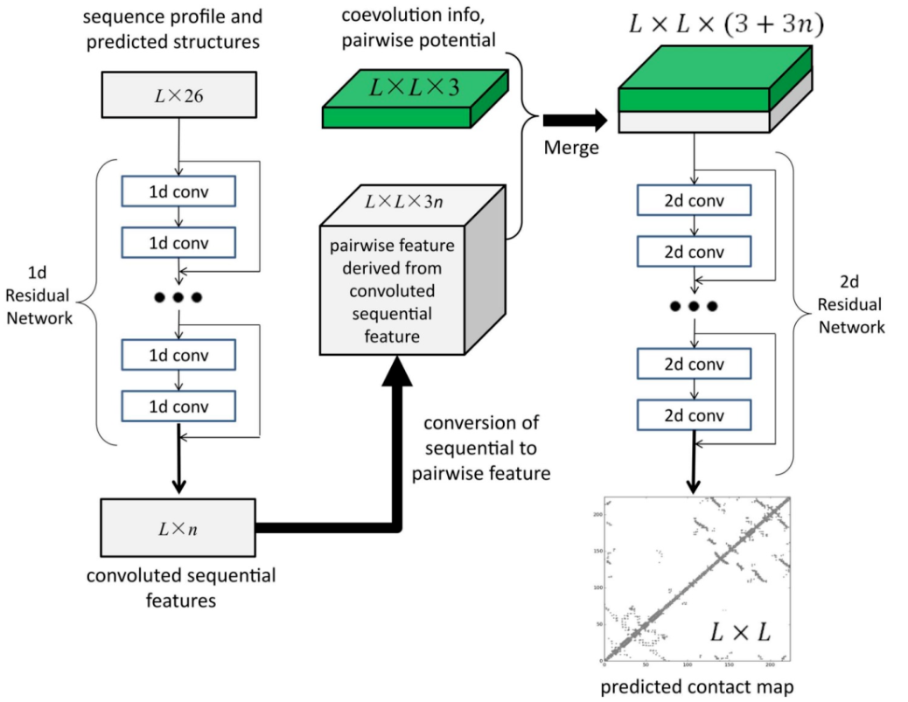

> *图1 用于接触预测的深度学习模型示意图，其中，L是被预测的蛋白质的序列长度*

图1展示了用于接触预测的深度神经网络模型。与以往接触预测的监督学习方法不同，该深度神经网络使用了几十个隐藏层。通过使用一个非常深层的结构，模型可以自动地学习序列信息和接触之间的复杂关系，并对联系人之间的相互依赖性进行建模，从而提高接触的预测能力。

模型由两个主要模块组成，每个模块都是一个残差神经网络。第一个模块对序列特征（序列 profile、预测的二级结构和溶剂可及性）进行一系列一维卷积变换。该一维卷积网络的输出通过外级联（类似于外积的操作）转换为二维矩阵，然后连同成对特征（协同进化信息、成对接触和距离势）输入第二模块。第二个模块是一个二维残差网络，对其输入进行一系列二维卷积变换。最后，将二维卷积网络的输出输入logistic回归，该回归预测任意两个残基形成接触的概率。此外，每一个卷积层之前也有一个简单的非线性变换称为整流线性单元（rectified linear unit）。从数学上讲，一维残差网络的输出只是一个维数为L×m的二维矩阵，其中，m是网络最后一个卷积层产生的新特征（或隐藏神经元）的数目。从生物学角度讲，这个1维残差网络学习的是残基顺序的上下文。通过叠加多个卷积层，该网络可以在非常大的连续上下文中学习信息。二维卷积层的输出具有L×L×n的维数，其中，n是该层为一个残基对生成的新特征（或隐藏神经元）的数目。2维残差网络主要学习接触发生模式或高阶残基相关性（即残基对的2D上下文）。每一层的隐藏神经元的数量可能有所不同。

网络由两个残差神经网络组成，每个残差神经网络又由一些连接在一起的残差块组成。图2示出了由2个卷积层和2个激活层组成的残差块的示例。在这个图中，X_l和X_l+1分别是块的输入和输出。激活层在不使用任何参数的情况下对其输入进行简单的非线性变换，使用ReLU激活函数来进行这种转换。**为了加快训练速度，还在每个激活层之前添加了一个批处理规范化层，它将其输入标准化为平均值为0，标准偏差为1。**1D卷积层使用的滤波器尺寸（即窗口尺寸）为17，而2D卷积层使用的滤波器尺寸为3×3或5×5。通过将许多残差块叠加在一起，即使在每个卷积层使用了一个小窗口大小，该网络可以模拟输入特征和接触之间的非常长的相互依赖关系，以及两个不同残差数对之间的长程互依关系。将一维残差网络的深度（即卷积层数）固定为6，但改变二维残差网络的深度。

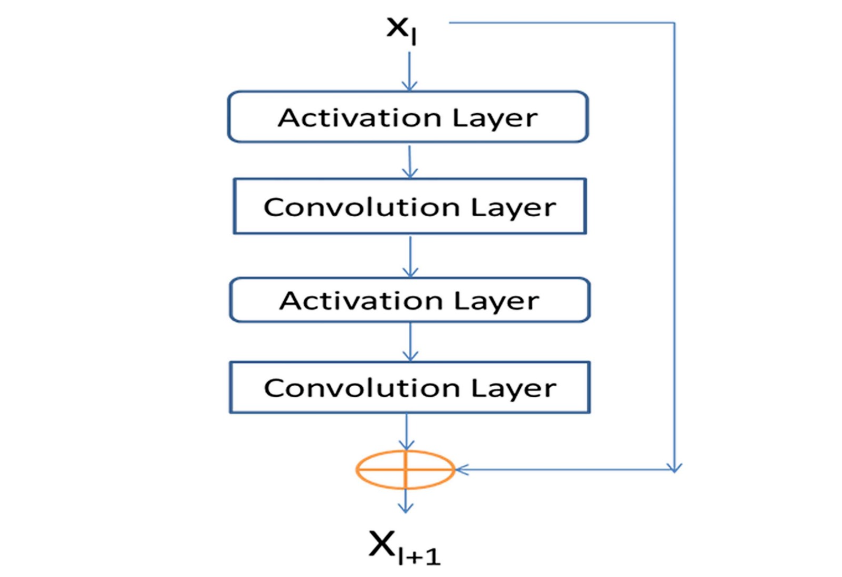

> *图2 残差网络的构建模块，X_l和X_l+1分别是输入和输出。每个模块由两个卷积层和两个激活层组成*

### 2、AlphaFold

2018年12月，DeepMind的AlphaFold成功预测了43种蛋白质中25种蛋白质的最准确结构，赢得了第13届蛋白质结构预测技术关键评估(CASP)。AlphaFold 构建的模型依赖于深度神经网络，这些经过训练的深度神经网络可以从基因序列中预测蛋白质的属性。DeepMind 的研究人员表示，神经网络预测的蛋白质属性主要有：（a）氨基酸对之间的距离；（b）连接这些氨基酸的化学键及它们之间的角度。DeepMind以跨学科的方式开展工作，汇集了结构生物学、物理学和机器学习领域的专家，应用尖端技术，完全基于蛋白质的基因序列来预测蛋白质的3D结构。

AlphaFold解决的问题是蛋白质折叠问题。输入是一个氨基酸序列，每一个位置代表一个元素，输出是一个拓扑结构，如图3所示，训练了一个生成式神经网络来创建新的片段，这些片段被用来不断改进所提出的蛋白质结构的得分：

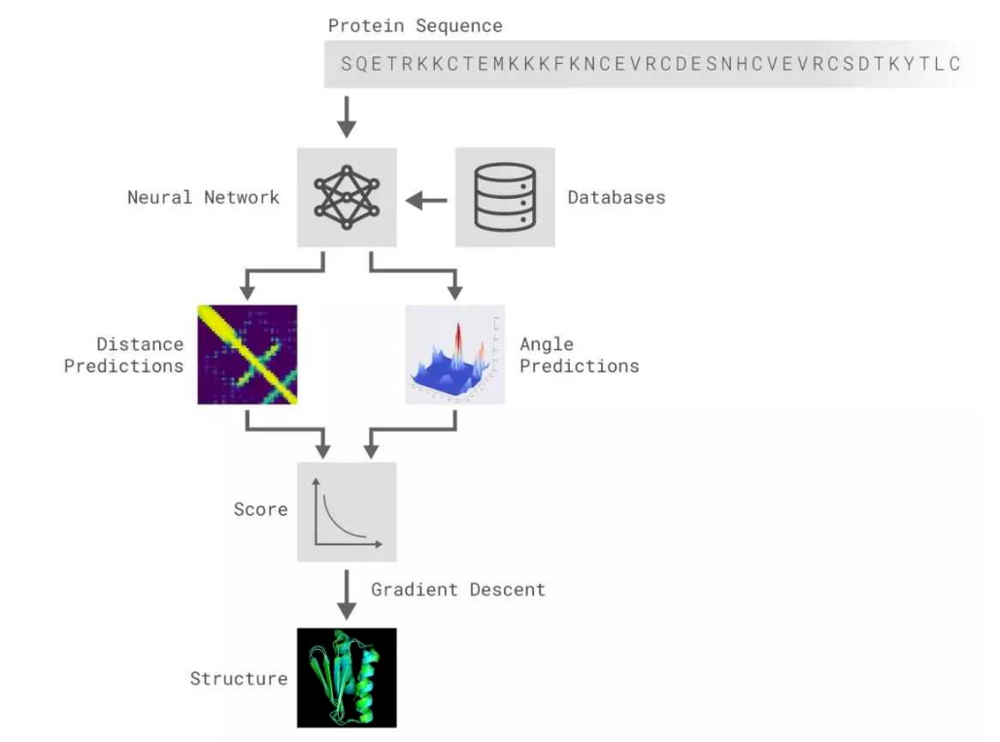

> *图3 AlphaFold工作过程*

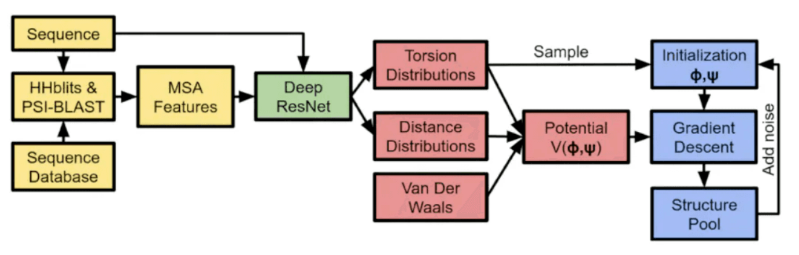

> *图4 AlphaFold算法组成*

如图4所示，AlphaFold算法大致分为以下几个部分：

1. 特征工程：序列和MSA特征抽取，结合专家经验数据库，把氨基酸链的输入转换到特征空间；
2. 深度神经网络结构预测：依据特征工程中的特征预测氨基酸链的一些性质，比如氨基酸之间两两的距离分布，氨基酸链的夹角分布；
3. Potential Construction：结合专家经验构造一个评估函数，来评估步骤2中神经网络输出解的合理程度；
4. 结构生成：对于2中预测的距离分布、夹角分布，使用3中的评估函数评估Loss，然后使用梯度下降法优化，直到收敛。

### 3、AlphaFold2

2020 年 12 月的国际蛋白质结构预测竞赛 CASP ，一项重磅成果引发了科技界所有人的关注：由 DeepMind 开发的 AlphaFold 2 击败一众选手，在准确性方面达到比肩人类实验的结果，被认为是蛋白质折叠问题的解决方案。2021年7 月 15 日，Demis Hassabis、John Jumper 等人在 Nature 杂志上发表了文章《Highly accurate protein structure prediction with AlphaFold》，描述并开源了 AlphaFold2，它预测的蛋白质结构能达到原子水平的准确度。

AlphaFold2是基于氨基酸序列的蛋白质结构预测的深度学习算法，其模型构建依赖于深度神经网络，可以从基因序列中预测蛋白质的属性。简单来说就是通过训练神经网络来对回归目标进行逐步迭代精化。原理从随机生成含有大量冗余的数据开始，通过机器学习训练出一个模型，然后用这个模型做预测会得到一个更有代表性的数据，再用这个数据集再次训练模型，不停进行迭代。

AlphaFold2网络直接预测给定蛋白质的所有重原子的三维坐标，使用基本氨基酸序列和同源序列的对齐序列作为输入 (如图 5e）。AlphaFold2 网络由两个主要部分组成。首先，网络的主干通过一个称为 Evoformer 的新神经网络块的重复层来处理输入，产生一个 Nseq × Nres 阵列 (Nseq: 序列数，Nres: 残差数) ，它表示一个处理过的 MSA 和一个表示残差对的 Nres × Nres 阵列。Evoformer 块包含许多基于注意力和非基于注意力的成分，它的关键创新是与 MSA 交换信息的新机制，并能直接推理空间和进化关系的配对表征。

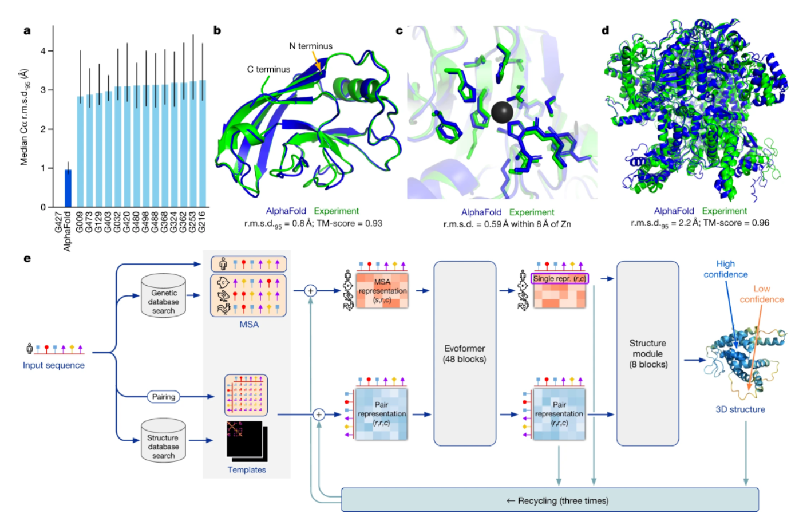

> *图5 a, AlphaFold2在CASP14数据集上的表现（n = 87个蛋白域）相对于前15名的条目（在146个条目中），组号对应于CASP分配给参赛者的号码。数据是中位数和中位数的95%置信区间，由10,000个自举样本估计。b, 对CASP14目标T1049（PDB 6Y4F，蓝色）的预测与真实（实验）结构（绿色）的比较。晶体结构中C端的四个残基是B因子异常值，没有被描述出来。c，CASP14目标T1056（PDB 6YJ1）。一个很好预测的锌结合点的例子（AlphaFold2虽然没有明确预测锌离子，但有准确的侧链）。d，CASP目标T1044（PDB 6VR4）—一个2180个残基的单链—被预测为具有正确的结构域包装（预测是在CASP之后使用AlphaFold进行的，没有干预）。e，模型结构。箭头显示了本文所描述的各种组件之间的信息流。阵列形状在括号中显示，s，序列的数量（正文中为Nseq）；r，残基的数量（正文中为Nres）；c，通道的数量*

网络的主干之后是结构模块（Structure Module），该模块以蛋白质的每个残基的旋转和平移的形式引入了显式的 3-D 结构。这些表征在微不足道的状态下初始化，所有旋转设置为同一性（identity），所有位置设置为原点，能够快速开发和完善具有精确原子细节的高度准确的蛋白质结构。这部分网络的关键创新包括打破链原子结构，允许同时局部细化结构的所有部分，一个新的「equivariant transformer」允许网络隐式地推理未表示的侧链原子，以及损失项可对残基方向的正确性赋予重要权重。在结构模块和整个网络中，通过对输出重复应用最终的损失，然后将输出递归到相同的模块中，加强了迭代完善的概念。使用整个网络的迭代改进（称之为 "循环"，与计算机视觉中的方法有关）明显地提高了准确性，但所需的额外的训练时间并不多。AlphaFold2的详细结构如图6所示。

> *图6 a, Evoformer块。箭头表示信息流。阵列的形状在括号中显示。b, 对表示解释为图中的有向边。c, 三角形的乘法更新和三角形的自注意力。圆圈代表residues。对表示中的条目被说明为有向边，在每个图中，被更新的边是ij。d，结构模块包括不变点注意力（Invariant point attention，IPA）模块。e, 残基气体：将每个残基表示为骨干的一个自由浮动刚体（蓝色三角形）和侧链的χ角（绿色圆圈）。相应的原子结构显示如下。f，框架对齐点误差（FAPE）。绿色，预测结构；灰色，真实结构；（Rk，tk），框架；xi，原子位置*

### 4、RoseTTAFold

DeepMind 在 2020 年的 CASP14 会议上展示了其在该领域的显著成果 AlphaFold2，当时该技术在预测蛋白质方面取得了排名第一的准确率。华盛顿大学医学院蛋白质设计研究所（Institute for Protein Design）的研究者们很大程度上重现了 DeepMind 在蛋白质预测任务上的表现，他们联合哈佛大学、德克萨斯大学西南医学中心、剑桥大学、劳伦斯伯克利国家实验室等机构研发出了一款**基于深度学习的蛋白质预测新工具 RoseTTAFold，在预测蛋白质结构上取得了媲美 AlphaFold2 的超高准确率，而且速度更快、所需要的计算机处理能力也较低**。

RoseTTAFold利用深度学习技术，根据有限信息准确、快速地预测蛋白质结构。从结构上来看，RoseTTAFold 是一个**三轨（three-track）神经网络**，意味着它可以兼顾蛋白质序列的模式、氨基酸如何相互作用以及蛋白质可能的三维结构。在这种结构中，一维、二维、三维信息来回流动，使得网络能够集中推理蛋白质的化学部分与它的折叠结构。三轨神经网络产生的结构预测精度接近CASP14中DeepMind的精度，能够快速解决具有挑战性的X射线晶体学和冷冻电镜结构建模问题，并提供对目前未知结构的蛋白质功能的见解。该网络还可以仅仅通过序列信息快速生成精确的蛋白质-蛋白质复合物模型，而传统的方法需要对单个子单元进行建模，然后进行对接。

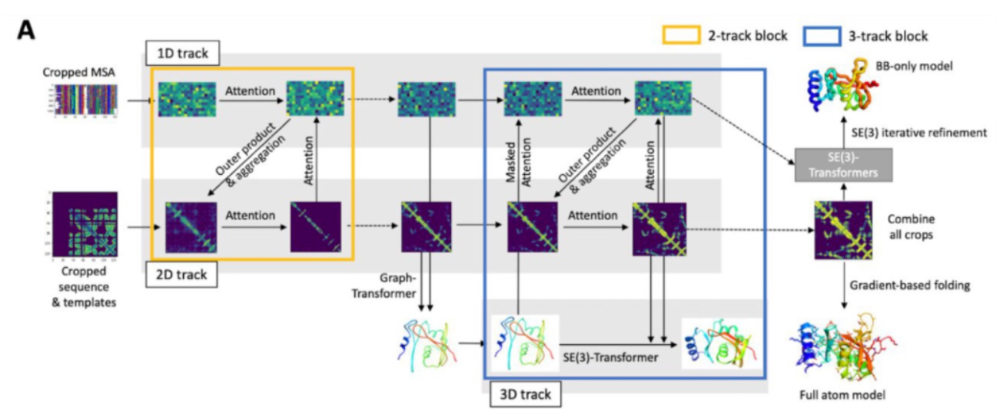

> *图7 RoseTTAFold网络结构，其中，连续转换和集成1D序列级、2D距离图级和3D坐标级的信息*

如图7所示，在该架构中，信息在1D氨基酸序列信息、2D距离图和3D坐标之间来回流动，允许网络共同推理序列、距离和坐标之间的关系。在1D和2D信息处理完成后，在双轨AlphaFold2架构中推理3D原子坐标。由于计算机硬件内存的限制，不能直接在大蛋白质上构建模型，因为三轨模型有数百万个参数；相反，向网络呈现了输入序列的许多不连续作物，其由跨越总共260个残基的两个不连续序列区段组成。为了生成最终模型，将每种作物产生的1D特征、2D距离和方向预测进行组合和平均，然后使用两种方法生成最终的3D结构。首先，将预测的残基-残基距离和取向分布输入pyRosetta以生成全原子模型。在第二种情况下，将平均的1D和2D特征馈入最终的SE-等变层，并且在从氨基酸序列到3D坐标的端到端构建之后，直接生成骨架坐标网络。

### 5、DeepAccNet

DeepAccNet是一个深度学习框架，用于估计蛋白质模型中每个残基的准确性和残基-残基距离中的符号错误，并使用这些预测来指导Rosetta蛋白质结构优化。在Rosetta改进方案的多个阶段中，加入准确性预测，可以大大提高所得蛋白质结构模型的准确性，说明深度学习可以改善对生物分子整体能量最小值的搜索。

DeepAccNet结构如图8所示，可在蛋白质结构模型的基础上进行三种类型的预测：每个残基的Cβ局部距离差异测试（Cβ1-DDT）分数，阈值为15Å的局部Cβ接触图，以及来自相应自然结构的有符号Cβ–Cβ距离误差的每个残基对分布。DeepAccNet不是预测每对位置的单个误差值，而是预测误差的直方图，该直方图提供有关可能结构分布的更详细信息，并能更好地表示误差预测所固有的不确定性。

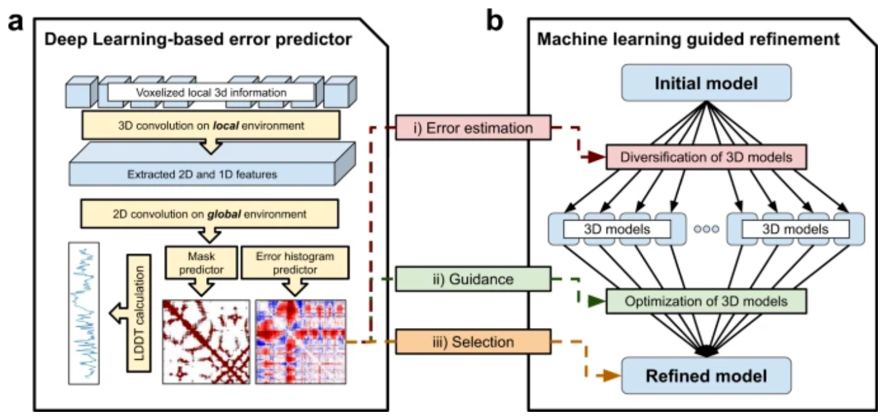

> *图8 a 深度学习网络（DeepAccNet）由一系列的三维和二维卷积操作组成*

DeepAccNet网络被训练来预测（i）每个残基对的签名Cβ-Cβ距离误差分布（误差直方图或简称estogram），（ii）本地Cβ接触图，阈值为15 Å（称为掩码），（iii）每个残基的Cβ l-DDT得分；Cα取自GLY。网络的输入特征包括：距离图、氨基酸的身份和特性、用三维卷积扫描的局部原子环境、骨架角度、残基角度方向、Rosetta能量项和二级结构信息。多重序列比对（MSA）信息以trRosetta网络的残基间距离预测和ProtBert-BFD100模型（简称Bert）的序列嵌入为形式，也可以选择提供二维特征。网络结构和特征的细节在方法中提供。b 机器学习指导的完善协议以三种方式使用训练后的神经网络；估计的Cβ l-DDT分数用于识别更密集的采样和模型重组的区域，估计的成对误差分布用于指导结构的多样化和优化，最后，估计的全局Cβ l-DDT分数，即每个残基值的平均值，用于在迭代完善过程中和结束时选择模型。

DeepAccNet整合了1D、2D和3D特征，首先在以每个残基为中心的坐标框中对局部原子网格执行一系列3D卷积操作，这些卷积生成描述蛋白质中N个残基中每个残基的局部3D环境特征。这些3D特征以及附加的残基水平一维输入特征通过平铺与2D残基-残基输入特征结合在一起，然后使用ResNet架构将生成的组合2D特征描述输入到一系列2D卷积层中。

### 6、ESMFold

大型语言模型被证明可以随着规模的扩大而发展出新的能力，超越了简单的模式匹配，可以进行更高层次的推理并生成栩栩如生的图像和文本。虽然在蛋白质序列上训练的语言模型已经在较小的规模上进行了研究，但人们对它们在扩大规模后对生物学的了解知之甚少。在这项工作中，作者训练了高达150亿个参数的模型ESMFold，这是迄今为止被评估的最大的蛋白质语言模型。作者发现，随着模型的扩展，它们学习到的信息能够在单个原子的分辨率下预测蛋白质的三维结构。

ESMFold与AlphaFold2和RoseTTAFold对多序列输入的蛋白质结构预测具有相当的准确度。但ESMFold突出优势在于，其计算速度**比AlphaFold2快一个数量级**，能够在更有效的时间尺度上探索蛋白质的结构空间。ESMFold使用ESM-2学习的信息和表示来执行端到端的3D结构预测，特别是仅使用单个序列作为输入（AlphaFold2需要多序列输入），方便研究者在使用时通过模型缩放，将模型大小控制在数百万到数十亿量级参数。需要注意的是，**随着模型大小的增加，可观察到预测准确性的持续提升。**

与AlphaFold2模型类似，ESMFold模型的架构也可以分为四部分：数据解析部分、编码器部分（Folding Trunk）、解码器部分（Structure Module）、循环部分（Recycling）。ESMFold和AlphaFold2之间的一个关键区别是**使用语言模型表示来消除对显式同源序列（以MSA的形式）作为输入的要求**。语言模型表示作为输入提供给ESMFold的折叠主干。通过将处理MSA的计算量大的Folding Block模块替换为处理序列的Tranformer模块来简化AlphaFold2中的Evoformer。这种简化或优化意味着ESMFold会比基于MSA的模型快得多。此外，ESMFold是一个**完全端到端的序列结构预测器**，可以完全在GPU上运行，无需访问任何外部数据库。

> *图9 ESMFold能够从单一序列中进行准确的结构预测。(A) ESMFold模型结构。箭头显示了网络中从语言模型到折叠主干到结构模块的信息流，结构模块输出三维坐标和置信度。折叠主干是AlphaFold2中描述的EvoFormer的一个简化的单序列版本*

如图9， ESM-2使用了一个BERT风格的仅有编码器的Transformer架构，并进行了修改。在扩展ESM模型时，改变了层数、注意力头数、隐藏大小和前馈隐藏大小。原始的Transformer论文使用绝对的正弦位置编码来告知模型关于token的位置。这些位置编码被添加到编码器堆栈底部的输入嵌入中。在ESM-2中，使用了旋转位置嵌入（RoPE），以允许模型推断出它所训练的上下文窗口。RoPE略微增加了模型的计算成本，因为它将自注意力范围内的每个查询和关键向量都乘以一个正弦波的嵌入。

AlphaFold2的架构分为两个主要部分，即Evoformer和结构模块。结构模块将最终的表征处理成用于原子级结构预测的三维坐标，不需要做任何改变就可以与ESM-2一起使用。然而，Evoformer建立了单独的MSA和残基对嵌入空间。为了使Evoformer块适应语言模型的特征，ESMFold做的主要改变是消除其对MSA的依赖。由于MSA是二维的，Evoformer在MSA的列和行上采用了轴向注意。语言模型的特征是一维的，所以我们可以用这个特征空间的标准注意力来代替轴向注意力。Evoformer块中的所有其他操作都保持不变。我们把这种简化的结构称为折叠块。ESMFold做的第二个变化涉及到模板的去除。模板信息是以成对距离的形式传递给模型的，是残基对嵌入的输入。作者简单地省略了这一信息，转而传递来自语言模型的注意力图，因为这些已经被证明可以很好地捕捉结构信息。ESMFold有48个折叠块。它在256大小的蛋白质作物上进行了最初的125k步的训练，然后在384大小的作物上用structural violation loss进行了25k步的微调。使用AlphaFold2中引入的框架对齐点误差（Frame Aligned Point Error，FAPE）和distogram损失，以及用于预测lDDT和pTM得分的heads。省略了屏蔽的语言模型损失。冻结语言模型参数，用于训练ESMFold。

### 7、OmegaFold

AI预测蛋白质3D结构，仅通过单条蛋白序列就能搞定。也就是说，AI预测蛋白质结构，可以不需要蛋白质进化过程中的同源信息。一些人工设计的蛋白质药物和工业合成用酶，也可以通过AI预测3D结构，确定其对人体的功能，实现这一功能的模型就是OmegaFold。OmegaFold的整体模型在概念上受到自然语言处理的语言模型以及AlphaFold2中使用的深度神经网络的最新进展的启发。

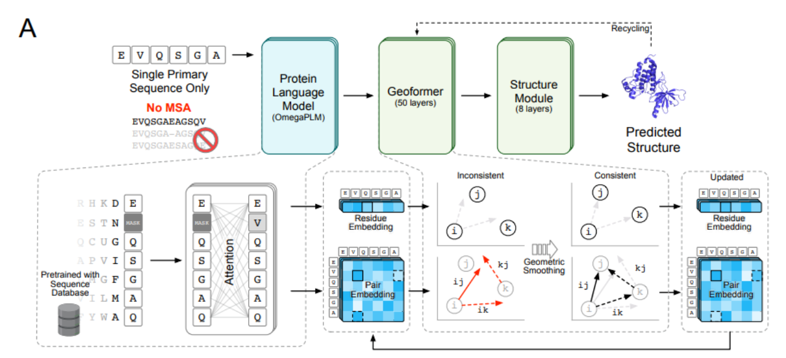

> *图10 OmegaFold的模型结构。主要的蛋白质序列首先被送入一个预训练的蛋白质语言模型（Omega protein language model，OmegaPLM），以获得残基级节点嵌入和残基-残基配对嵌入。然后，一堆Geoformer层迭代更新这些嵌入，以提高其几何一致性。最后，一个结构模块从最终的嵌入中预测出三维蛋白质结构。预测的结构和嵌入可以通过循环程序再次输入到另一个循环中，以预测更精细的结构*

这项工作专注于设计一个内存高效的自注意力架构，通过改进以前的PLM的不同组件，如位置编码功能、非线性转换和归一化功能，使PLM更加深入。OmegaPLM的整体架构是一个自注意力模型，其中，每个token是一个氨基酸。OmegaFold模型用一堆GAU层来处理一个蛋白质序列，而不是用自注意力层和多层感知器。该模型包含66个层，大约有6.7亿个参数，没有共享参数。令n_i∈R^d作为位置i的token的d维向量表示，Algorithm 1中给出了OmegaPLM的详细过程。

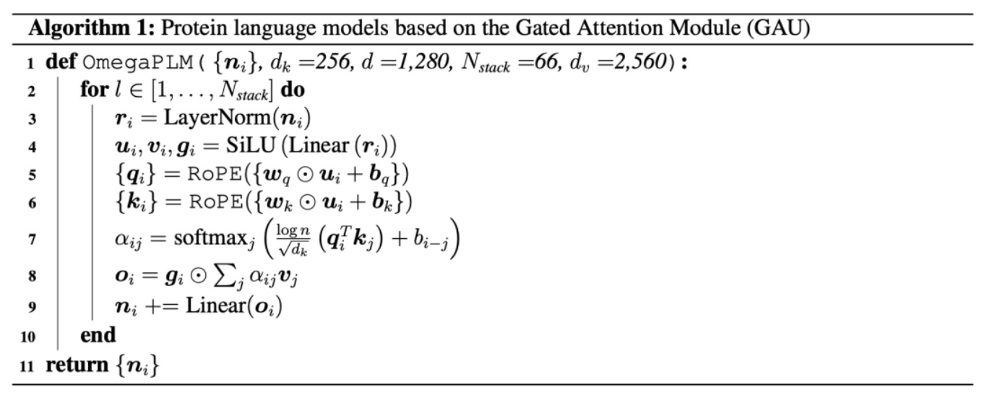

**Pre-LayerNorm**。如算法1所示，引入pre-LayerNorm操作，将层归一化放在残差块之间。正如最近的研究表明，预层规范化能够产生更稳定的梯度，特别是在初始化时。目前在不同的深度学习包中普遍存在的归一化层的实现，通常包含element-wise的仿射变换，其参数可学习，紧随其后的是许多 pre-layernorm Transformers的线性操作。然而，这种配置在数学上并没有意义，只会在训练期间选择优化器造成的微小差异。因此，删除了pre-LayerNorm中的所有element-wise仿射变换。

**Gated Attention Unit**。没有使用多头自注意力（multi-headed self-attention，MHSA），而是采用了门控注意单元（GAU）（算法1中的第8行），它作为多头自注意力的替代品，具有较小的内存消耗和较快的收敛率，显示出巨大的前景。在注意力聚集后应用门控操作，用relu2(-)取代传统的softmax(-)函数来聚集成对的对数。特别是，使用一个额外的门控向量gi∈R^dv，其中dv是价值向量的维度，后来以元素方式与价值vj的加权和相乘（第8行）。

**Relative Positional Encoding (RoPE)**。注意力机制本质上是变异的，所以它在应用于序列数据时需要位置信息。这里我们应用旋转位置嵌入（rotary positional embedding，RoPE）（算法1中的第5行和第6行）来编码一对氨基酸的位置信息，其定义见算法2。利用复数的特性解决了这个问题，并将这种机制应用到查询和密钥中。为了进一步强调相对位置信息的影响，引入一个偏置项b_i-j，它是针对位置i和j的。注意b_i-j和b_j-i的值是不同的。没有随着绝对相对位置的增加而减少嵌入值，而是对相对位置进行剪辑以允许extrapolation。

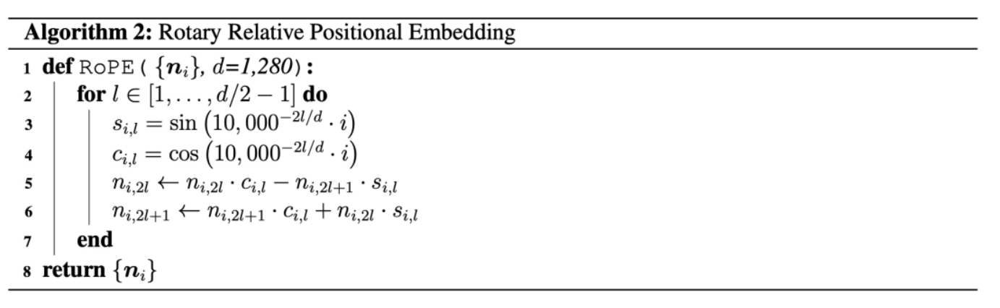

### 8、EquBind

EquBind的工作发表在ICML 2022中。之前典型的‘配体-蛋白质’方法，就像试图让模型将钥匙插入一个有许多锁孔的锁中，需要花大量时间对钥匙和每个锁孔的配合度打分，然后选择最合适的那个。而EquBind可以跳过最耗时的步骤，遇到新分子时可提前预测最合适的‘锁眼’，这就是所谓的‘盲对接’。其内置的几何推理算法，可帮助模型学习分子的基本结构。该算法允许EquBind在遇到新分子时直接预测最合适的位置，而不是花费大量时间尝试不同的位置并对其进行评分。即，EquBind依靠SE(3)等价图神经网络来预测结合的蛋白质配体构象，只需一次就能完成。EquBind将配体分子图与随机关联的非结合三维构象体以及受体结合结构作为输入，详细结构如图11所示。

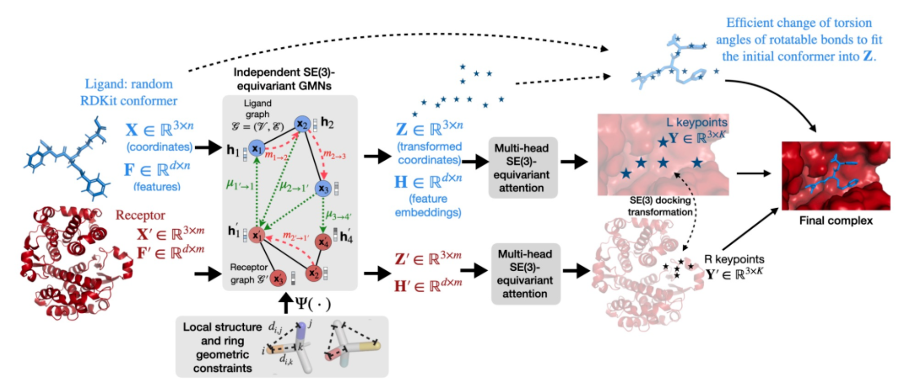

> *图11 EquBind结构*

**K-NN图的表示**。将两个输入分子表示为空间k-近邻（k-NN）图。配体图G = (V, E)使用原子作为节点，其各自的三维坐标来自未结合的构象体，表示为X∈R^3×n，以及初始特征F∈R^d×n（例如原子类型）。边缘包括距离在4˚A以内的所有原子对。受体图 G‘ = (V’, E‘) 将残基作为节点，其三维坐标X0∈R……3×m由α-碳的位置给出。每个节点在图中都与最近的10个其他节点相连，距离小于30˚A。

**Independent E(3)-equivariant transformations。**使用独立E(3)-变量图匹配网络（IEGMN），它结合了图匹配网络和E(3)-变量图神经网络。这种架构共同转换特征和三维坐标，以进行神经图内部的信息传递。
IEGMN(X, F, X’ , F’ ) = Z ∈ R ^3×n, H ∈ R^ d×n, Z’ ∈ R^ 3×m, H’ ∈ R^ d×m。IEGMNs的核心属性是，堆叠任何数量的此类层都能保证原始输入结构的任何独立旋转和平移都将准确地反映在输出中。在实践中，图11所示的Z、H、Z'、H'输出是通过堆叠几个IEGMN层得到的。我们对单个第l层的选择是：

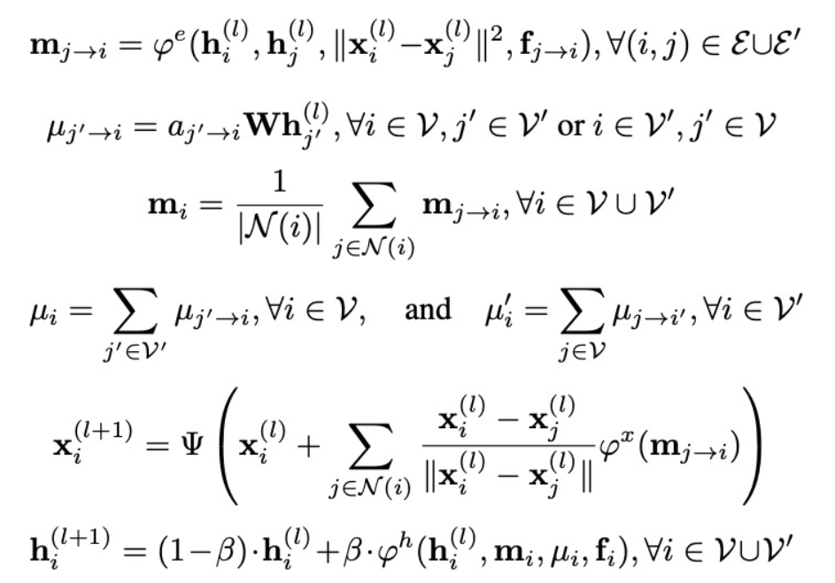

**Z的作用**。表示为Z和Z'的坐标E(3)等价变换的输出将被用于不同的作用：识别刚体变换和结合点，以及通过训练Z来表示变形的原子点云来模拟配体的灵活性。

### 9、RELATION

基于深度学习的从头分子设计最近获得了相当大的关注。许多基于深度学习的生成模型已被成功开发出来并应用于设计新的分子，但其中大多数是以配体为中心的，target binding pockets的三维几何形状在分子生成中的作用还没有得到很好的利用。为此，提出了一个新的基于三维的生成模型，称为RELATION。在RELATION模型中，BiTL算法被专门设计用来提取蛋白质-配体复合物的所需几何特征并将其迁移到一个潜在的空间进行生成，在引入双向迁移学习后，隐藏层的采样能够同时兼顾生成分子的骨架片段的新颖性以及对靶标蛋白的亲和性。应用药效团约束生成（ pharmacophore conditioning）和贝叶斯优化（BO）采样，能够有效地浏览巨大的化学空间，可供用户定制化生成药效团匹配度更高以及对靶标的对接打分表现更好的分子。

RELATION框架由两个部分组成：（1）3D编码器，使用了3D-CNN的结构，包括私有编码器和共享编码器。附带SMILES标签的训练源域数据以及目标域数据转换成4D张量后，分别作为私有编码器和共享编码器的输入。所有的编码器具有相同的架构，均具有8层，第一层包含64个过滤器，然后在奇数层上加倍，最后一层学习512个过滤器。每一个偶数层后面都有一个额外的池化层，核数、步长和填充为2，用于执行下采样。利用ReLU激活函数对3D-CNN模型进行训练，并使用两个输出为512维的全连接层得到μ和σ，对其重参数化后，生成一个的1024维嵌入向量；（2）解码器，解码器的结构是caption-LSTM，可以将隐藏层内的高维向量转化为SMILE分子式，caption-LSTM由三层组成，其词汇量输入大小为39，隐藏大小为1024。

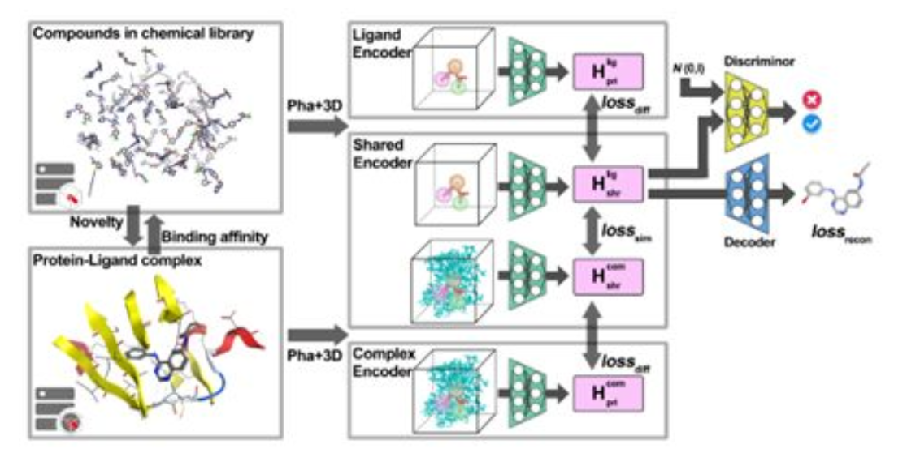

> *图12 RELATION架构*

为了实现双向迁移，定义损失函数如下：

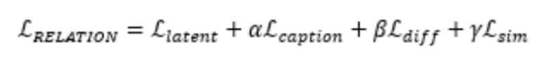

在迁移学习中引入L_sim和βL_diff，使得隐藏层在生成过程中不仅考虑了源域数据集和目标域数据集的相似性，也保留了源域数据集（结构多样性）和目标域数据集（蛋白-配体亲和力）各自的特征。L_sim项能够保证共享隐藏层中小分子与复合物的相似性。L_latent表示编码器由均值和单位方差均为零的多元高斯分布先验进行正则化，表示为：

最后，L_caption用来测量原始输入和通过字幕网络产生的输出之间的重建损失。

## 分子生成

### 1、BIMODAL

循环神经网络（RNN）能够使用简化的分子输入线输入系统（SMILES）字符串表示的化学结构来生成新的分子设计。基于RNN的结构生成通常是单向进行的，通过从左到右增长SMILES字符串。然而，小分子没有自然的起点或终点，SMILES字符串本质上是分子图的非单点表示。这些特性促使了双向结构的生成。这篇文章介绍了用于基于SMILES的分子设计的双向生成性RNNs，实现了两种既定的双向方法，并引入了一种用于SMILES字符串生成和数据增强的新方法：双向分子设计交替学习法（BIMODAL）。作者将这三种双向策略与用于SMILES字符串生成的单向正向RNN方法进行了比较，内容包括(i)计算机生成的分子的新颖性，(ii)支架的多样性，(iii)化学-生物学相关性。

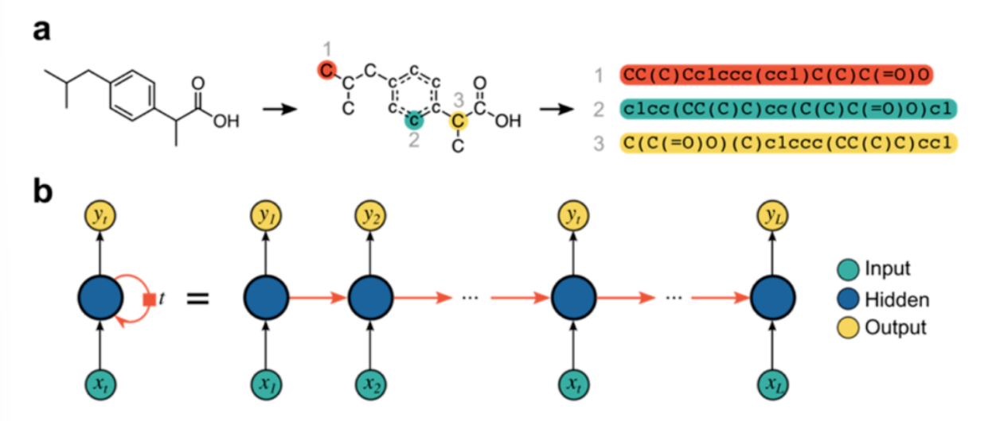

> *图13 (a) SMILES字符串，从分子图表示中获得，每个原子用其元素符号表示，而分支和连接性用符号或小写字母表示（例如，"( )"、"="和 "c "分别表示分支、双键和芳香族碳）。图中给出代表药物布洛芬的三个SMILES字符串的示例；用于SMILES字符串生成的起始原子用灰色数字表示。(b) 带有一个递归神经元层的前向RNN的简化方案。RNNs是一个动态系统的模型，其中任何一个时间点t的网络状态都取决于当前的观察（x_t）和之前的状态（t - 1），并被用来预测输出（y_t）*

以SMILES字符序列（"token"）作为输入，RNN模型根据序列的前一部分和概率估计，每次学习预测一个token（图4b）。可以从学到的概率分布抽样新的SMILES字符串。RNNs通常被训练成以 "向前 "的方式读取和生成SMILES字符串，即从左到右。然而，SMILES表示可以从任何非氢原子开始，按任何方向进行生成（图13 a）。与自然语言不同，小分子没有唯一定义的起点和终点。非单向性和非方向性提供了探索双向序列生成的机会，即在前向和后向都能读取和生成SMILES字符串的方法。然而，纯粹的从头开始（"端到端"）的双向SMILES生成至今还没有被探索过。BIMODAL就是一种双向生成性RNNs。

给定一个输入序列，生成式RNNs被训练成通过预测下一个序列标记来扩展这个序列，定义为y_t = x_t+1。使用带有LSTM单元的RNNs以解决由长序列和大型网络结构引起的梯度消失和梯度爆炸问题。在任何给定的第t个时间步长，这样的网络由以下一组方程描述：

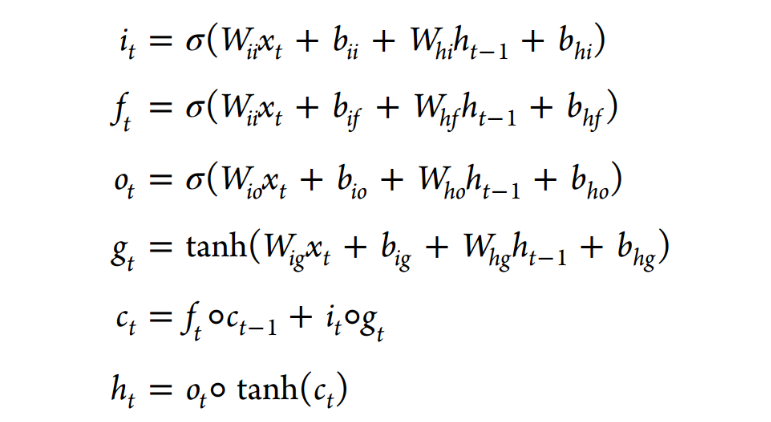

最常见的用于序列生成的RNNs版本从左到右进行（前向），即从t=1到t=L，其中，L是SMILES序列的长度。在训练过程中，输入的第一个位置被填入一个序列开始的token，而输入的最后一个位置被填入一个序列结束的token。一旦RNN模型被训练好，新的序列就会通过(i)输入起始token("G")，(ii)允许模型逐步选择下一个token，给定各自的前一个token序列，直到生成结束token("E")（图14 a）。在每一个时间步长t，每一个第k个符号跟随生成的字符串的前一部分的概率是用一个softmax函数计算的

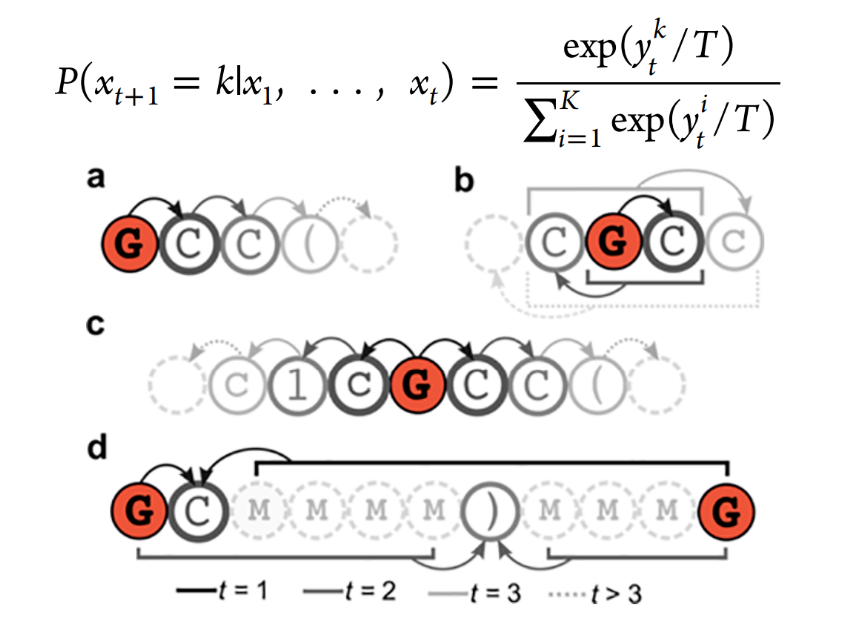

> *图14 基于RNN的SMILES字符串生成方法。SMILES生成从起始token "G "开始，按预定方向进行。(a) 前向RNN。从起始token "G "开始，从左到右添加新的token。(b) BIMODAL方法：在每个时间步长(t)交替生成token。该模型使用整个序列（前向和后向）来生成下一个token。(c) 前向-后向模型。从 "G "token开始，每个时间步长预测两个token，两边各一个。(d) NADE方法：缺失的 "假 "token（"M"）被替换为有效的SMILES字符，可以向字符串的中心或以随机方式替换*

在任何第t个时间步长，BIMODAL沿前向（x_m→x_t）和后向（x_t←x_m）方向读取x={x_m, x_m+1, ..., x_t}，在两个方向上生成SMILES序列。然而，通过同时使用从左到右（向前）和从右到左（向后）的信息，每一步只有一个token被交替预测。BIMODAL由两个RNN组成，每个方向（前向和后向）都有一个读取序列，然后结合起来提供一个联合预测（y_t）：

在SMILES的生成设置中，BIMODAL在每个时间步长t的前向和后向都会读取序列（图14 b）。然后，它在前向或后向生成一个新token：

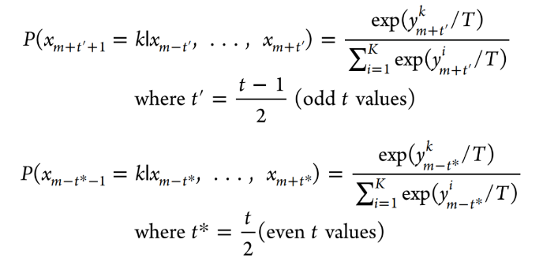

###  2、GF-VAE

GF-VAE是一种用于分子图生成的基于流的变分自动编码器(VAE)模型。该模型在原来VAE的基础上增加了Flow模型解码器。其中，编码器主要是加速解码的训练，而解码器则依次优化编码器的性能。由于流模型的可逆性，生成过程很容易通过反转解码器来完成。因此，GF-VAE继承了VAE和基于流的方法的优点。给定𝑅键的类型和𝑀原子的类型，分子图可以用𝐺=（𝐴，𝑋）表示，其中，𝐴∈{0, 1}^𝑁×𝑁×𝑅是𝑁原子的邻接张量，𝑋∈{0,1}^𝑁×𝑀为一个显示𝑁原子节点类型的特征矩阵。我们的主要目标是从给定的图集G中学习生成模型𝑝G(𝐺)，使从分布𝑝G中抽取的样本是一个有效的分子图。GF-VAE的架构如图15所示。

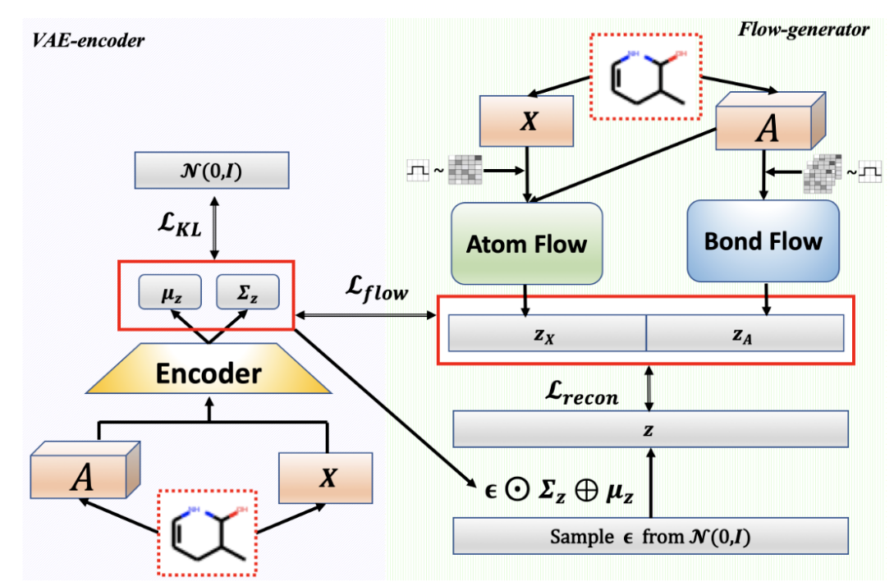

> *图15 GF-VAE的结构（训练）*

Flow-generator由两个部分组成：atom flow用于近似原子的分布，bond flow用于捕捉键的分布。通过向𝐴和𝑋添加一个均匀的随机噪声𝑈[0,1]来对𝐺进行去量化处理：

将得到的𝐺′=(𝐴′,𝑋′)送到流生成器（Flow-generator），学习从原空间到潜在空间的偏射，使潜在空间中映射的图向量遵循高斯分布。由于我们已经获得了高斯分布中的VAE编码向量z，原子流和键流只需要将𝑋′和𝐴′贴近z，而不是进行像完全边际归一化流模型那样多的工作来映射到标准高斯分布。

对于bond flow，以Glow模型为基础。它为z𝐴𝑁(𝐴′)学习了一个可逆映射，它将𝐴′∈R^𝑅×𝑁×𝑁映射到z𝐴∈R^𝑅×𝑁。使用图15中bond flow中从下到上的所有过程，如squeeze+actnorm、可逆1∗1卷积，以及掩码卷积。对于bond coupling layer，类似于图像处理中使用的，通过3×3𝑐𝑜𝑛𝑣2𝑑→𝑐ℎ𝑁𝑜𝑟𝑚→𝑅𝑒𝐿𝑢层并堆叠𝐾𝐵次建立。此外，整个模块被堆叠𝐿𝐵次以提高映射性能。

对于atom flow，通过𝑜𝑚𝜔(𝑋′,𝐴)学习一个可逆的映射函数来得到z𝑋∈R^𝑁×𝑀。如图16的atom flow所示，atom affine coupling layer由𝐾𝐴次叠加𝑐ℎ𝑁𝑜𝑟𝑚→𝑅𝑒𝐿𝑢→𝑅𝑒𝐿𝑢层与多层感知器（MLP）输出层组成。这里𝑔𝑟𝑎𝑝ℎ𝑐𝑜𝑛𝑣也由Relational-GCN实现。由于二维原子矩阵中没有通道，需要对每一行而不是每一个通道进行归一化处理，这与屏蔽卷积过程类似。此外，整个模块被堆叠了𝐿𝐴次，以达到更好的映射性能。由于𝑓𝑎𝑡𝑜𝑚𝜔和𝑓𝑏𝑜 都是可倒置的，给定潜在向量z𝑋和z𝐴来自已知先验分布，给定图形的概率𝐺=（𝐴，𝑋）可以计算为：

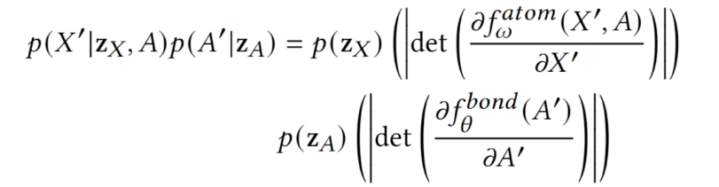

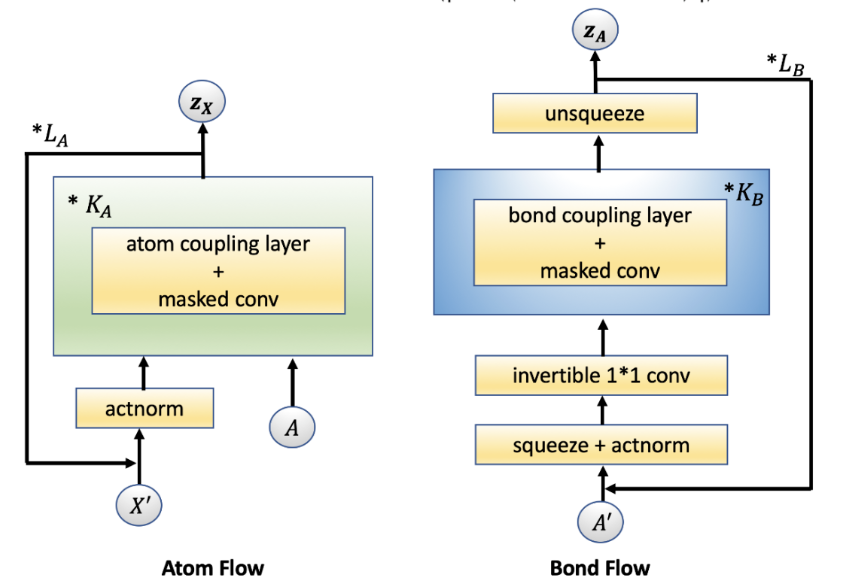

> *图16 GF-VAE中的原子流和键合流*

生成过程如图16所示，首先从标准高斯分布中提取随机样本z，并将其分成zA和zX。由于Flow模型的生成器（𝑓𝑎𝑡𝑜𝑚𝜔和𝑜𝑚𝜔）是可逆的，只需将zA放入𝑓𝑎𝑡𝑜𝑚𝜔，zX放入𝑜𝑚𝜔，但顺序相反。值得注意的是，原子流和键流可以在训练中同时进行，因为它们的更新是相互独立的。然而，原子流在生成过程中需要有效的键张量作为输入。因此，需要首先在zA上应用键合流的反向步骤以得到键合张量𝐴。然后，把它和zX一起送入原子流的反向步骤，得到原子张量𝑋。最后，把原子张量和键张量放入有效性修正模块，得到最终生成的分子。

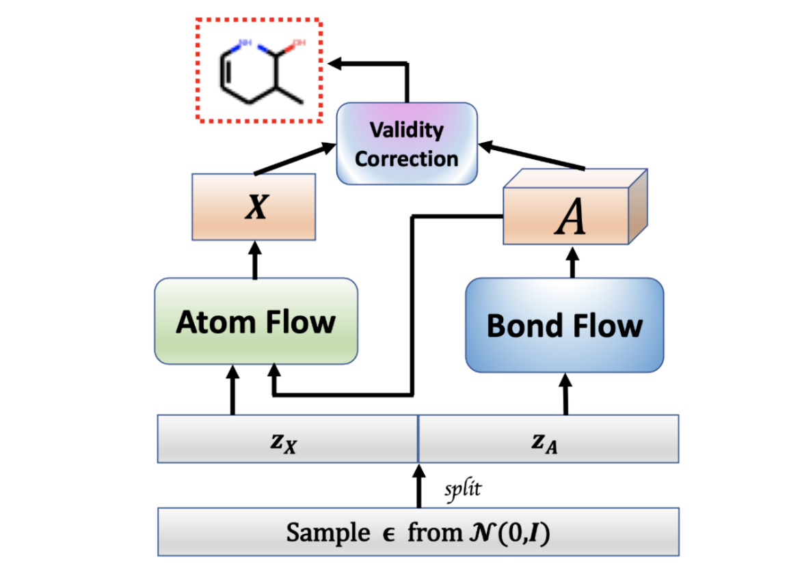

> *图17 GF-VAE的生成过程*

### 3、MCMG

MCMG是一种基于知识蒸馏的多约束分子生成方法，该方法将Conditional Transformer和强化学习算法相结合，满足多个约束条件。利用条件Transformer训练分子生成模型，有效地学习并将结构性质关系纳入有偏生成过程中。然后利用知识蒸馏模型降低模型的复杂度，通过强化学习对模型进行有效的微调，增强生成分子的结构多样性。

MCMG由三个部分组成 ：先验模型、基于RNN的蒸馏模型、使用RL微调的专家模型。蒸馏模型可以帮助学习到更加specific的信息，从而平滑不必要的噪音。MCMG模型的工作流程如图 18 所示。首先训练一个c-Transformer，然后将该c-Transformer蒸馏为RNN，以便后续与RL的应用。蒸馏后的RNN不仅可以减轻RL的训练负担，还可以提升生成分子的结构多样性。

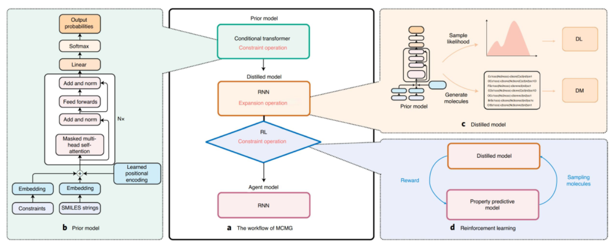

> *图18 MCMG结构*

Prior model的架构如图 18B 所示。该模型学习生成具有由一组条件标记编码的特定的分子。Prior model在训练过程中学习了约束和SMILES的联合嵌入；除了约束代码的处理外，其余的训练过程类似于标准的seq2seq训练。由于Transformer模型庞大，直接通过 RL 算法进行微调较为困难，并且这种c-Transformer的重构化学空间过于集中，将产生易于陷入局部最优的潜在问题。为了应对这一挑战，作者采用并比较了两种知识蒸馏方法。第一种是构建具有三层门控循环单元（GRU）的RNN，以学习从prior model中采样的分子子集；第二种是直接使用c-Transformer模型生成100万个所需分子的数据集（给定一组适当的条件token），然后使用该数据集训练具有上述相同结构的RNN。作者将蒸馏模型和以这种方式训练的最终模型分别命名为蒸馏分子模型（DM）和MCMG分子模型（MCMGM）；此外，作者还提出了两种不同的模型，semi-DM和semi-MCMGM，试图只引入方便计算且可靠的标签，例如QED和SA，避免标记具有预测生物活性的分子。最后，作者采用了REINVENT模型中用到的RL 算法来微调蒸馏模型，并为药物设计中分子生成通常需要的多个目标构建定制的奖励函数。

### 4、MGM

分子设计是一个具有挑战性的问题，可应用于药物发现和材料设计。作者引入了一个掩码图（Masked Graph）模型，该模型通过捕捉未观察到的节点（原子）和边（键）的条件分布来学习图上的分布。

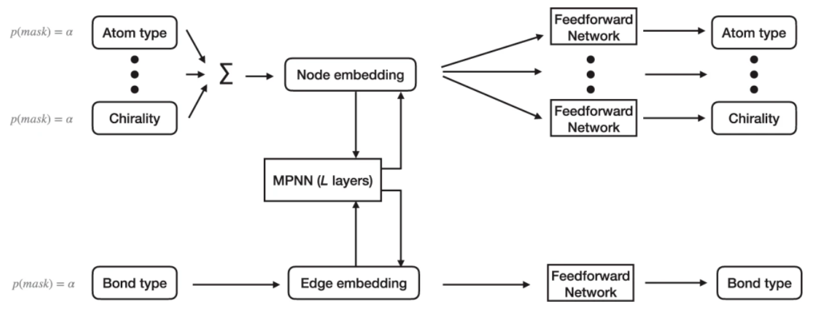

> *图19模型结构*