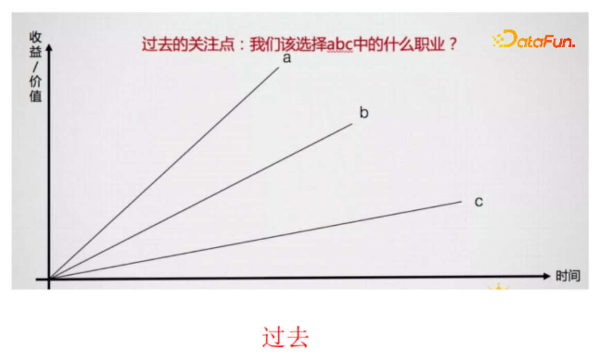
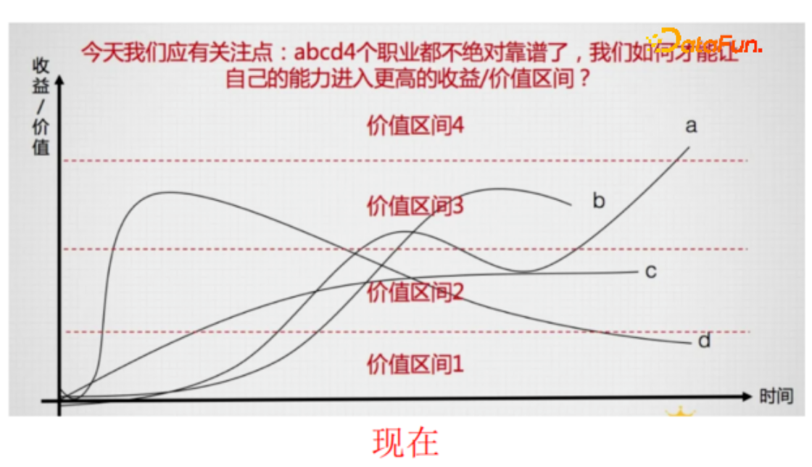
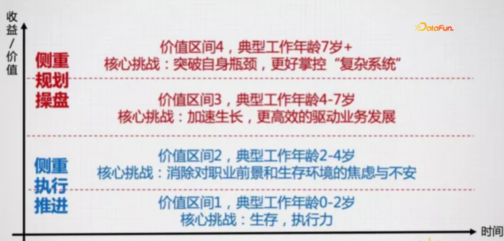

# 初入职场

## 初入职场面临问题

初入职场，大家从校招毕业生成为社会人，迷茫在所难免。若在硕士或博士阶段，跟导师做的科研项目或企业项目多，则上手相对快些。若仅是授课型的，与导师联系较松散，则易出现不适应的状况。

初入职场，面临去哪家公司工作、选择什么技术方向的选择困难，同时需要熟悉公司业务、处理好跟上级和同事的事关系，以及规划未来职业发展等等，需要考虑的因素很多，这就是此次交流的目的。

- 怎么样才能快速上手工作？
- 如何判断什么方向更适合我？
- 什么方向更有前景？（CV、NLP、搜推广、供应链等）
- 该如何选择未来的职业方向和如何更快速成长？（跟随潮流还是坚持一个方向）
- 业务总是在变化，导致无所适从怎么办？（领导、同事一直变化）
- 行业、公司动荡，该怎么面对？（裁员、业务调整）
- 如何与领导、同事处好关系？
- 如何在高强度工作的同时、保持不断学习的状态？（使得技术能力或软实力有精进）

## 判定适合的发展方向

依据技术方向、类型和行业可有如下的方向分类：

- 按技术方向：NLP，CV，语音，机制策略，AIGC，……
- 按类型分：搜索/推荐/广告，算法工程，架构，数据研发，产品，运营……
- 按行业分：短视频，电商，社交，本地生活，娱乐，出行，云计算……

上述分类会有交叉，如不同的行业选择某一类型，或者某一类型中选择不同的技术。

具体地，如何判断哪个方向更适合自己的所谓判断标准，有如下两个要点：

**（1）是否对此事有比常人更强的热情和执着？** 物质激励是激发热情的一方面，但对事情本身感兴趣，才是支撑你在漫长的职业生涯中持续前行的重要因素。

- 如不喜欢偏工程类（代码），可做策略设计、数据研发或产品运营；
- 若不喜欢与人打交道，可做算法工程和架构；
- 既对技术感兴趣，也想与业务结合，那可尝试做搜推广的算法工程师。

**（2）是否显著比他人更擅长做好此事？** （判断自己的长处）

- 若有些同学非常善于写代码，但不太善于与人沟通，则适合做偏技术类的岗位，不太适合做产品和运营的岗位；
- 若一些同学技术较强且业务感知很好，则相对于纯算法领域的工作，偏策略的工作可以更好地发挥自己的价值。

木桶效应通常讲自身发展受最薄弱板块所影响，但在职场中，自身发展是受你最擅长板块所影响。任何一件工作都不是独立能做到的，需要讲究团队配合，所以自身的短板可以通过与同事打配合完成。因此，在职场中要学会扬长避短，**将长处发挥到极致才是正道**。

## 立足于当前

初入职场，同学们进入到一个公司、一个部门、一个项目组后，所做的工作无论是否感兴趣，首要都将当下手头工作做好。这体现了职场中的**基本态度**，是对所拿工资**负责任的表现**，也可积累**好的口碑**。

特别地，当遇到对工作任务不感兴趣时，一定要积极调整心态，首先做到胜任该工作。钱多、事少、离家近、且擅长的工作是非常稀缺的，百分之四五十感兴趣已经是很不错的工作了。

具体地，先试着沉下心，用尽全力将一项工作做到80分以上，然后进行下面的评估判断：

（1）对于做到80分以上的工作，是否会觉得享受它、喜欢它、还是反感它？这时的感受，可能更具参考价值；

（2）对比其他身边同样可将该工作做到80分左右水准的人，是会显著比他们效率更高，完成得更加轻松，还是会更累更费劲？

此外，在立足于当前手头工作后，一般会有较好的绩效产出，这会带给你奖金或升职加薪的**正反馈激励**。

## 判断发展方向前景

在过去，我们关注该选择哪个职业。

当今的互联网行业中新旧工种更迭极快，甚至一个职业的生命周期会短于5年。例如5年前NLP技术中有Bert模型等，而随着大语言模型的出现，会被逐步替代，相应的从业者的技能价值会逐渐降低。现在应关注如何让自己的能力进入到更高的收益/价值区间。

职场的发展并不是线性的、可预测的，会存在很多波动。诚然个人的命运与自身奋斗正相关，但它不完全由你自己掌控。因此，无法判断准确的前提下，需关注该工作是否可带来长远价值，例如该价值是否让消费者生活更便利，进而降低社会的总成本等。

因此，在**判断职业的前景方向时**，一定要有**长远规划，关注工作的核心价值**。

面对“职业”的不稳定性，习得和精通一些核心能力，无论职业环境如何变化，都可处于价值链的高处，让自己更有价值。我们更应将关注点放到“如何让自己可以习得这样的能力”上。

**5. 以不变应万变**

**在变化大势下，不变的是个人核心能力，那应聚焦于哪些能力，可获取足够的物质回报和精神正反馈？**

（1）更高效驱动业务发展和增长的能力；（技术是手段，需要产品和运营的思维）

（2）可掌控和影响复杂系统的能力（综合管理能力&沟通协调能力）。

- 个人能力再强，所做工作也非常有限，一个领导者带领团队可创造更大的价值。
- 某个业务的工作需要很多链条（如产品、运营、算法、架构、数据工程等）的同事协同完成，因此需要锻炼协调沟通的软技能。

# 职场各阶段重点

## 收益/价值分析

依据收益/价值分析，将职场划分为4个阶段，具体如下图。

## 不同阶段，职场中的挑战不同

在职业生涯的不同阶段，或是在不同的价值区间中，你面临的核心挑战很可能是完全不同的，由于年龄不同，生活状态会有差异，如随着时间推移，会涉及谈恋爱、结婚、生子等，这会面临生活重心的自然转移；此外，工作经验不同，对职场期待也不同。因此在进行职业选择时，需考虑的侧重点可能会完全不同。

例如，你当前需要在职业发展上解决的核心问题：

- 是需要习得生存能力？
- 还是需要解决你的不安和焦虑？
- 还是已经能够做好一些事，但瓶颈明显需要加速生长？
- 还是已经有了很好的基本盘，但需要更大的舞台去迎接更大挑战？

上述状态不同，在进行职业选择时的判断逻辑也很可能是不同的。

### 1. 价值区间1：初入职场（0-2年）

第一个阶段，初入职场0到2年，对标阿里级别P5-P6（今年后大多数硕士入职可能就是P4了，该阶段延伸为P4-P6）。通常公司的战略自上而下拆解成具体任务，该阶段为偏执行的角色。

- 该阶段面临核心挑战为生存问题，即“如何能让自己在职业环境下能够生存下来”；
- 生存的资本：对于具体待执行的工作，可高效推进执行。通过绩效考核，从一个学生变成一个合格的社会人。
- 保质保量地完成领导交代的工作。
- 事事有反馈，执行力强，保证时效性。
- 无需花费大量时间精力了解高大上的方法论和概念。

### 2. 价值区间2：业务熟练能手（2-4年）

第二个阶段，为业务熟练的能手，参加工作2- 4年，对标阿里级别P6-P7，核心挑战为如何持续获得成长。

①不能仅限于熟练的“工具人”，尽可能多掌握一些**无需依赖于“环境”或“工具”的工作方法或技能**（产品思维+运营思维）

- 算法工程师、架构、数据研发等都可有意培养产品和运营思维，对工作知其所以然。
- 如数据研发可思考开发的特征、选取的样本的原因。
- 架构可思考公司为何对召回的素材、商品或视频进行过滤等逻辑的处理。

②成为工作中某一**领域的专家**

- 精通某一领域，让专业能力成为职级跃升和跳槽涨薪的买单项。

③养成强烈的“对业务目标负责”的意识，并能够通过你手中的一系列工作来驱动某个核心业务指标发生变化（为业务结果负责、而非只考虑技术）

- 向上一级看问题，理解技术规划、模型选型、项目排期、人员分工的内在逻辑。
- 不能有技术完全至上的思想，要有“技术为业务服务”的意识。
- 从不同的角度来助力业务结果的达成，是该阶段突破瓶颈的一个关键，这也是如阿里P7晋升时常见问题。

### 3. 价值区间3：细分领域专家（4-7年）

#### ①核心挑战：突破瓶颈（P7-P8）

价值区间3典型出现在职业生涯的4-7岁，对应阿里的P7-P8。P8可能为某个细分领域的专家，如召回算法专家，短视频排序算法领域专家，或本地生活LBS 服务专家等。P8需要对该细分领域的技术和业务非常的精通，从而实现战略方向制定后的落地。

从价值区间2到价值区间3的核心挑战是突破瓶颈，很多人因为无法突破瓶颈，而只能成为小团队的中层Leader，无法成为可操盘和影响一项业务生死的业务负责人。其中最难以突破的有两点：

- 是否能够真的把自己的一线业务能力**从“精良”做到“超级专精”**，从而让自己能够成为该领域内的头部，获得最大的势能；
- 是否能够在执行力和一线业务能力已经还不错的情况下，还能够习得和掌握一些**“底层逻辑”**，从而大大提升自己的成长速度。

#### ② “精良”和“超级专精”的区别

“精良”和“超级专精”的区别，也即“胜过70%的同类人”与行业类极其稀有的5%的区别。

- “头部法则”始终都在发挥着作用，一旦成为一个领域内的前5%，会获得该领域内最多的红利，非常多的资源都将会自动向你倾斜。
- **马太效应**存在于多个领域，如人类社会的财富是向少数人聚集，电商流量向少数头部的商品聚集，短视频里的流量向头部热门的视频聚集等；
- 马太效应的存在，意味着当你往上每提升1%，可获得的回报不止1%；所以我们做这个事情是超级有价值的，因此，一定要做到领域内超级专精。

#### ③底层逻辑

在一个领域内，与其关注方法技巧，更需要：找到那些少数能够基于它演化出众多创新的关键规则，并深刻理解这些规则。以下通过CTR预估、推荐新颖性、运营规则的示例说明什么是底层逻辑。

- **CTR 预估**，如在电商场景下，目的是将用户点击率和购买率最高的商品放到最前面，从而提升该次曝光展现的商品列表页里的整体期望购买金额或期望成交单数。
- **推荐的新颖性**。做推荐算法的时候，不仅要做点击率预估，还需考虑如何把推荐的素材（商品类别或视频、短视频的类别），需要考虑其新颖性，从而提升用户的停留时长，用户的完播率、翻页率、点赞率、关注率等。
- **运营规则**。做技术的同学可能会觉得偏运营、偏产品的工作缺乏技术含量，但我认为这种观念是偏颇的。运营其实更接近于商业的本质，真正在一个公司做到顶层还是运营、产品、财务出身的同事偏多。做技术的同学了解运营规则，了解制定打法的底层逻辑，将有助于拓展自己的职业发展空间。

### 4. 价值区间4：领域大咖（7年+）

工作的七年以后的领域大佬，对应P8-P9，通常会领导一条业务线。在该职场阶段，通常希望建立**业务影响力**，技术的同学会考虑**学术影响力**（论文获奖、专利），还有**产品影响力**（如做出一个拥有亿级DMU、千万级DAU的产品）。在我的职业发展中，有幸遇到了一些非常优秀的前辈和同事，他们身上的闪光点也在启发着身边的人。

根据我粗浅的观察，该层级需要较技术更复杂、更综合的**管理经验**。可能还需要学习一些心理学的知识，来应对团队管理中出现的一些事件，比如：

- 如在分配工作时如何给具有抵触情绪的同学安排工作？

- 遇到困难，如何安抚大家的情绪？

- 如何去保持团队的战斗力等？

  

# 发展建议

## **做选择需要考虑的因素**

具体的发展建议有如下几点：

- 跟对人：跟着一个眼界、格局、视野、能力都非常出色的老板，从其言传身教中持续学习；同时，通过工作与领导建立信任，自己的成长帮其分担更大的职责，跟随他一起成长。
- 做对事：选择永远比努力更重要。
- 选对领域：进入到大公司核心业务部门，从而系统学习大公司内部最核心、也含金量最高的一整套工作方法和业务流程。

## 追求做T型人才

### ①纵向（专业素养的深度）：

- 提高自己的专业技能；
- 加深对所在细分领域的理解深度；

### ②横向（跨领域的知识和思维）：

- 补齐算法、架构、产品、运营思维能力；
- 软技能：管理学、心理学……

## 发展方向

### ①想做技术的同学：

- 一个方向侧重于“广”，着眼于技术的整体性、架构性和业务解决方案，对标“架构师”。
- 一个方向侧重于“专”，着眼于某个专项技术的深度、专业度和精细度，对标“某领域技术专家”或“科学家”。

### ②想做管理的同学：

- **技术管理者**，某个大技术体系或整个技术部的负责人。

- 通常从工程师到技术团队的一线经理，再慢慢做到部门负责人。
- 若同时管理产品、设计等所有“产品交付”类团队，就成为了一个常规意义上的**CTO**。

- **业务管理者**，往往负责一个完整的业务，不限于管理技术类团队，类似该业务的CEO或GM，需要关心业务经营的各方面。

- 业务管理者很多来源于技术管理者，这相当于有由点到面的职场跃升；

## 定义和挖掘擅长领域

- **不要挑工作**，主动承担更多的工作（无论初级还是高大上），在不断累积工作经验和能力的同时持续思考；
- **对标优秀的人**：见贤思齐。学习各领域优秀的人的做事方式和知识体系，有助于完善自己对行业领域的理解和认知。；
- **定期与上级1 on 1**：即与领导一对一的交流，建立良好的沟通机制。

- 表达对当前阶段的工作理解，尝试给出可让工作效果更好的想法；
- 争取和上级、导师或信赖的同事面对面的沟通，寻求他们的点评，逐步地让自己的思考更靠谱和更有效。
- 充分信任领导。从领导层面，由于你是其工作的帮手，通过沟通了解你的工作状态和期望，会为你争取资源，从而使得整个团队业绩更优。

## 学会总结

- 在接到任务时，习惯思考‘我为什么做这件事情’，避免类似初入职场时无脑接任务并执行。

- 目标导向，如写日记周记，并定期回顾。

  如思考自己过去一段时间所做工作的过程，是否紧密围绕着目标前进？是否只是在形式化的做一件事情偏离了本质？哪些动作是对的哪些是错的？

- 争取做自己擅长的事情，发掘自身优势素质，并不断验证，“弥补自己的缺点”，更重要的是扬长避短。

# 问答环节

**1. 技术发展太快，跟不上节奏怎么办？**

- 技术发展确实很快，最近大模型在颠覆很多行业；
- 但**技术发展再快，仍然是依托于业务**。通过加深业务的理解，提升竞争力，来抵消技术进步太快的风险；
- 同时，对最新的技术还需了解一些，保持跟进。

**2. 大模型已经淘汰 NLP 工程师了吗？**

- 短期内不会；
- 不同于OpenAI可抓取大量开源领域的英文世界的数据；国内发展大模型所需的数据没有很多，尚未打通，因此需要一个过程。

**3. 怎么约上级一对一交流？**

- 形式上可以很随意，如约他午餐、晚餐或咖啡等；
- 不要惧怕上级，你是他工作的助手，他是你工作的帮手。

**4. 大模型的未来的发展**

- 大模型未来会显著地改变很多行业；
- 如它会改变搜索和推荐的一些范式。当前搜索商品需精准输入想要的东西，而基于大模型，可输入意图（预定到某地的行程），即可给到整套方案（交通工具、酒店、餐饮）。

**5. 怎么面对职场卷、组内卷、公司内部卷、领域卷**

- 当前大环境下，卷是常态。过去整个行业在快速发展，内外部机会较多。当前相对会更焦虑，卷的现象就会更突出。
- 卷的同时保重身体，身体是革命的本钱；
- 有意义地卷，以提高自身技能为目的来卷，而不仅做重复性劳动。

**6. 算法最新的技术方向和就业方向**

技术方向没有太多的变化，如搜推广、算法工程、语音、NLP、CV等。

**7. 算法转产品会更容易吗？具体路径？**

- 算法转产品是一个不错的方式，由于了解相关技术，做过算法的产品经理在与程序员沟通时更顺畅；算法工程师的逻辑思维能力较强，转产品更有优势；
- 具体路径，内部一般都有转岗活水的组织机制。

**8. 部门的业务发生大变化时，自身的职业规划要怎么考虑？**

部门发生大变化的时候，需要考虑要不要跳槽。

- 若要跳槽，需要准备简历；
- 若不跳槽（受限于户口等），需在内部寻找转岗的机会。

**9. 目标导向的具体场景例子？**

目标导向，就是确定完成该任务所需的关键因素、节点和依赖。如确定投入产出比，花费时长，任务涉及的部门，资源依赖方，需要推动哪些角色等。例如推动数据的同学产出数据，推动架构的同学，开发线上打标功能等。

**10. 产品运营思维该怎么培养？**

产品运营思维的培养，需多与产品运营同事多沟通交流。此外站在产品和运营的角度思考问题，也即换位思考。具体地，考虑若你是产品或运营，那么需要做哪些事情、怎么去做才能达成业务目标？以电商伟丽，产品考虑用户体验多一些，运营更宏观，考虑行业和B端多一些。

**11. 如何从行业的前30%提升到前10%？**

重要的经验就是要比别人付出多。

- 单纯时间付出多是不够的，并不是靠堆时间就可达成跃升。
- 需脑力付出多。多思考、多交流（与领导、同行或跨行专业人士）、多模仿（思维方式、行为方式）。