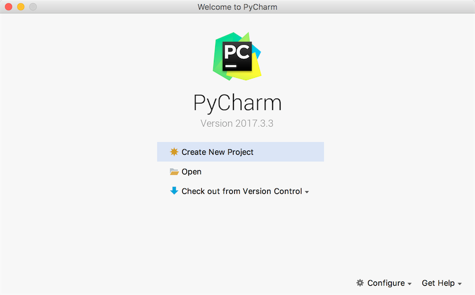
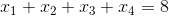
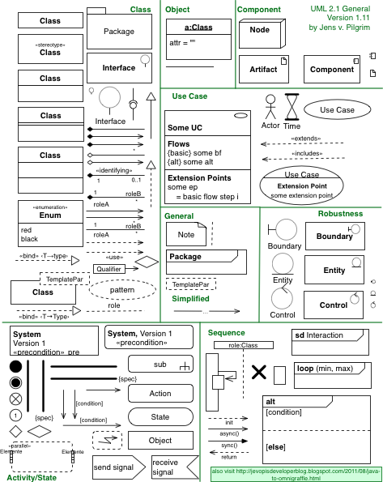
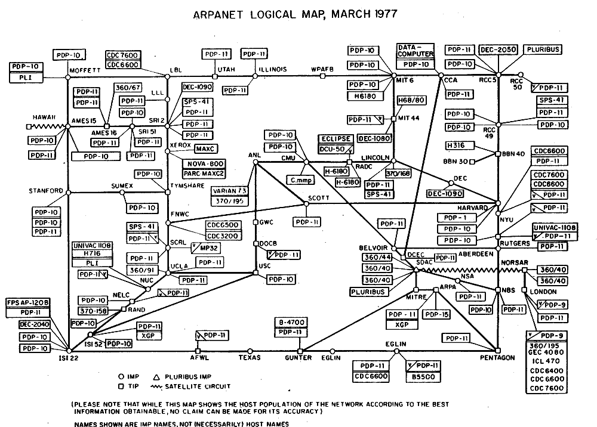

# Python基础

## 初识Python

### Python简介

#### Python的历史

1. 1989年圣诞节：Guido von Rossum开始写Python语言的编译器。
2. 1991年2月：第一个Python编译器（同时也是解释器）诞生，它是用C语言实现的（后面），可以调用C语言的库函数。在最早的版本中，Python已经提供了对“类”，“函数”，“异常处理”等构造块的支持，还有对列表、字典等核心数据类型，同时支持以模块为基础来构造应用程序。
3. 1994年1月：Python 1.0正式发布。
4. 2000年10月16日：Python 2.0发布，增加了完整的[垃圾回收](https://zh.wikipedia.org/wiki/%E5%9E%83%E5%9C%BE%E5%9B%9E%E6%94%B6_(%E8%A8%88%E7%AE%97%E6%A9%9F%E7%A7%91%E5%AD%B8))，提供了对[Unicode](https://zh.wikipedia.org/wiki/Unicode)的支持。与此同时，Python的整个开发过程更加透明，社区对开发进度的影响逐渐扩大，生态圈开始慢慢形成。
5. 2008年12月3日：Python 3.0发布，它并不完全兼容之前的Python代码，不过因为目前还有不少公司在项目和运维中使用Python 2.x版本，所以Python 3.x的很多新特性后来也被移植到Python 2.6/2.7版本中。

目前我使用的Python 3.7.x的版本是在2018年发布的，Python的版本号分为三段，形如A.B.C。其中A表示大版本号，一般当整体重写，或出现不向后兼容的改变时，增加A；B表示功能更新，出现新功能时增加B；C表示小的改动（例如：修复了某个Bug），只要有修改就增加C。如果对Python的历史感兴趣，可以阅读名为[《Python简史》](http://www.cnblogs.com/vamei/archive/2013/02/06/2892628.html)的网络文章。

#### Python的优缺点

Python的优点很多，简单的可以总结为以下几点。

1. 简单明了，学习曲线低，比很多编程语言都容易上手。
2. 开放源代码，拥有强大的社区和生态圈，尤其是在数据分析和机器学习领域。
3. 解释型语言，天生具有平台可移植性，代码可以工作于不同的操作系统。
4. 对两种主流的编程范式（面向对象编程和函数式编程）都提供了支持。
5. 代码规范程度高，可读性强，适合有代码洁癖和强迫症的人群。

Python的缺点主要集中在以下几点。

1. 执行效率稍低，对执行效率要求高的部分可以由其他语言（如：C、C++）编写。
2. 代码无法加密，但是现在很多公司都不销售卖软件而是销售服务，这个问题会被弱化。
3. 在开发时可以选择的框架太多（如Web框架就有100多个），有选择的地方就有错误。

#### Python的应用领域

目前Python在Web应用后端开发、云基础设施建设、DevOps、网络数据采集（爬虫）、自动化测试、数据分析、机器学习等领域都有着广泛的应用。

### 安装Python解释器

想要开始Python编程之旅，首先得在自己使用的计算机上安装Python解释器环境，下面将以安装官方的Python解释器为例，讲解如何在不同的操作系统上安装Python环境。官方的Python解释器是用C语言实现的，也是使用最为广泛的Python解释器，通常称之为CPython。除此之外，Python解释器还有Java语言实现的Jython、C#语言实现的IronPython以及PyPy、Brython、Pyston等版本，有兴趣的读者可以自行了解。

#### Windows环境

可以在[Python官方网站](https://www.python.org)下载到Python的Windows安装程序（exe文件），需要注意的是如果在Windows 7环境下安装Python 3.x，需要先安装Service Pack 1补丁包（可以通过一些工具软件自动安装系统补丁的功能来安装），安装过程建议勾选“Add Python 3.x to PATH”（将Python 3.x添加到PATH环境变量）并选择自定义安装，在设置“Optional Features”界面最好将“pip”、“tcl/tk”、“Python test suite”等项全部勾选上。强烈建议选择自定义的安装路径并保证路径中没有中文。安装完成会看到“Setup was successful”的提示。如果稍后运行Python程序时，出现因为缺失一些动态链接库文件而导致Python解释器无法工作的问题，可以按照下面的方法加以解决。

如果系统显示api-ms-win-crt\*.dll文件缺失，可以参照[《api-ms-win-crt\*.dll缺失原因分析和解决方法》](<https://zhuanlan.zhihu.com/p/32087135>)一文讲解的方法进行处理或者直接在[微软官网](https://www.microsoft.com/zh-cn/download/details.aspx?id=48145)下载Visual C++ Redistributable for Visual Studio 2015文件进行修复；如果是因为更新Windows的DirectX之后导致某些动态链接库文件缺失问题，可以下载一个[DirectX修复工具](<https://dl.pconline.com.cn/download/360074-1.html>)进行修复。

#### Linux环境

Linux环境自带了Python 2.x版本，但是如果要更新到3.x的版本，可以在[Python的官方网站](https://www.python.org)下载Python的源代码并通过源代码构建安装的方式进行安装，具体的步骤如下所示（以CentOS为例）。

1. 安装依赖库（因为没有这些依赖库可能在源代码构件安装时因为缺失底层依赖库而失败）。

```Shell
yum -y install wget gcc zlib-devel bzip2-devel openssl-devel ncurses-devel sqlite-devel readline-devel tk-devel gdbm-devel db4-devel libpcap-devel xz-devel libffi-devel
```

2. 下载Python源代码并解压缩到指定目录。

```Shell
wget https://www.python.org/ftp/python/3.7.6/Python-3.7.6.tar.xz
xz -d Python-3.7.6.tar.xz
tar -xvf Python-3.7.6.tar
```

3. 切换至Python源代码目录并执行下面的命令进行配置和安装。

```Shell
cd Python-3.7.6
./configure --prefix=/usr/local/python37 --enable-optimizations
make && make install
```

4. 修改用户主目录下名为.bash_profile的文件，配置PATH环境变量并使其生效。

```Shell
cd ~
vim .bash_profile
```

```Shell
# ... 此处省略上面的代码 ...

export PATH=$PATH:/usr/local/python37/bin

# ... 此处省略下面的代码 ...
```

5. 激活环境变量。

```Shell
source .bash_profile
```

#### macOS环境

macOS也自带了Python 2.x版本，可以通过[Python的官方网站](https://www.python.org)提供的安装文件（pkg文件）安装Python 3.x的版本。默认安装完成后，可以通过在终端执行`python`命令来启动2.x版本的Python解释器，启动3.x版本的Python解释器需要执行`python3`命令。

### 运行Python程序

#### 确认Python的版本

可以Windows的命令行提示符中键入下面的命令。

```Shell
python --version
```

在Linux或macOS系统的终端中键入下面的命令。

```Shell
python3 --version
```

当然也可以先输入`python`或`python3`进入交互式环境，再执行以下的代码检查Python的版本。

```Python
import sys

print(sys.version_info)
print(sys.version)
```

#### 编写Python源代码

可以用文本编辑工具（推荐使用[Sublime](<https://www.sublimetext.com/>)、[Visual Studio Code](<https://code.visualstudio.com/>)等高级文本编辑工具）编写Python源代码并用py作为后缀名保存该文件，代码内容如下所示。

```Python
print('hello, world!')
```

#### 运行程序

切换到源代码所在的目录并执行下面的命令，看看屏幕上是否输出了"hello, world!"。

```Shell
python hello.py
```

或

```Shell
python3 hello.py
```

#### 代码中的注释

注释是编程语言的一个重要组成部分，用于在源代码中解释代码的作用从而增强程序的可读性和可维护性，当然也可以将源代码中不需要参与运行的代码段通过注释来去掉，这一点在调试程序的时候经常用到。注释在随源代码进入预处理器或编译时会被移除，不会在目标代码中保留也不会影响程序的执行结果。

1. 单行注释 - 以#和空格开头的部分
2. 多行注释 - 三个引号开头，三个引号结尾

```Python
"""
第一个Python程序 - hello, world!
向伟大的Dennis M. Ritchie先生致敬

Version: 0.1
Author: 骆昊
"""
print('hello, world!')
# print("你好, 世界！")
```

### Python开发工具

#### IDLE - 自带的集成开发工具

IDLE是安装Python环境时自带的集成开发工具，如下图所示。但是由于IDLE的用户体验并不是那么好所以很少在实际开发中被采用。


#### IPython - 更好的交互式编程工具

IPython是一种基于Python的交互式解释器。相较于原生的Python交互式环境，IPython提供了更为强大的编辑和交互功能。可以通过Python的包管理工具pip安装IPython，具体的操作如下所示。

```Shell
pip install ipython
```

或

```Shell
pip3 install ipython
```

安装成功后，可以通过下面的ipython命令启动IPython，如下图所示。


#### Sublime Text - 高级文本编辑器


- 首先可以通过[官方网站](https://www.sublimetext.com/)下载安装程序安装Sublime Text 3或Sublime Text 2。

- 安装包管理工具。

  1. 通过快捷键Ctrl+`或者在View菜单中选择Show Console打开控制台，输入下面的代码。

  - Sublime 3

  ```Python
  import  urllib.request,os;pf='Package Control.sublime-package';ipp=sublime.installed_packages_path();urllib.request.install_opener(urllib.request.build_opener(urllib.request.ProxyHandler()));open(os.path.join(ipp,pf),'wb').write(urllib.request.urlopen('http://sublime.wbond.net/'+pf.replace(' ','%20')).read())
  ```

  - Sublime 2

  ```Python
  import  urllib2,os;pf='Package Control.sublime-package';ipp=sublime.installed_packages_path();os.makedirs(ipp)ifnotos.path.exists(ipp)elseNone;urllib2.install_opener(urllib2.build_opener(urllib2.ProxyHandler()));open(os.path.join(ipp,pf),'wb').write(urllib2.urlopen('http://sublime.wbond.net/'+pf.replace(' ','%20')).read());print('Please restart Sublime Text to finish installation')
  ```

  2. 在浏览器中输入  https://sublime.wbond.net/Package%20Control.sublime-package 下载包管理工具的安装包，并找到安装Sublime目录下名为&quot;Installed Packages&quot;的目录，把刚才下载的文件放到这个文件加下，然后重启Sublime Text就搞定了。


- 安装插件。通过Preference菜单的Package Control或快捷键Ctrl+Shift+P打开命令面板，在面板中输入Install Package就可以找到安装插件的工具，然后再查找需要的插件。我们推荐大家安装以下几个插件：

  - SublimeCodeIntel - 代码自动补全工具插件。
  - Emmet - 前端开发代码模板插件。
  - Git - 版本控制工具插件。
  - Python PEP8 Autoformat - PEP8规范自动格式化插件。
  - ConvertToUTF8 - 将本地编码转换为UTF-8。

> **说明**：事实上[Visual Studio Code](<https://code.visualstudio.com/>)可能是更好的选择，它不用花钱并提供了更为完整和强大的功能，有兴趣的读者可以自行研究。

#### PyCharm - Python开发神器

PyCharm的安装、配置和使用在[《玩转PyCharm》](../番外篇/玩转PyCharm.md)进行了介绍，有兴趣的读者可以选择阅读。



### 练习

1. 在Python交互式环境中输入下面的代码并查看结果，请尝试将看到的内容翻译成中文。

   ```Python
   import this
   ```

   > **说明**：输入上面的代码，在Python的交互式环境中可以看到Tim Peter撰写的[“Python之禅”](../Python之禅.md)，里面讲述的道理不仅仅适用于Python，也适用于其他编程语言。

2. 学习使用turtle在屏幕上绘制图形。

   > **说明**：turtle是Python内置的一个非常有趣的模块，特别适合对计算机程序设计进行初体验的小伙伴，它最早是Logo语言的一部分，Logo语言是Wally Feurzig和Seymour Papert在1966发明的编程语言。

   ```Python
   import turtle
   
   turtle.pensize(4)
   turtle.pencolor('red')
   
   turtle.forward(100)
   turtle.right(90)
   turtle.forward(100)
   turtle.right(90)
   turtle.forward(100)
   turtle.right(90)
   turtle.forward(100)
   
   turtle.mainloop()
   ```

   > **提示**：本章提供的代码中还有画国旗和画小猪佩奇的代码，有兴趣的读者请自行研究。

## 语言元素

#### 指令和程序

计算机的硬件系统通常由五大部件构成，包括：运算器、控制器、存储器、输入设备和输出设备。其中，运算器和控制器放在一起就是我们通常所说的中央处理器，它的功能是执行各种运算和控制指令以及处理计算机软件中的数据。我们通常所说的程序实际上就是指令的集合，我们程序就是将一系列的指令按照某种方式组织到一起，然后通过这些指令去控制计算机做我们想让它做的事情。今天我们大多数时候使用的计算机，虽然它们的元器件做工越来越精密，处理能力越来越强大，但究其本质来说仍然属于[“冯·诺依曼结构”](https://zh.wikipedia.org/wiki/%E5%86%AF%C2%B7%E8%AF%BA%E4%BC%8A%E6%9B%BC%E7%BB%93%E6%9E%84)的计算机。“冯·诺依曼结构”有两个关键点，一是指出要将存储设备与中央处理器分开，二是提出了将数据以二进制方式编码。二进制是一种“逢二进一”的计数法，跟我们人类使用的“逢十进一”的计数法没有实质性的区别，人类因为有十根手指所以使用了十进制（因为在数数时十根手指用完之后就只能进位了，当然凡事都有例外，玛雅人可能是因为长年光着脚的原因把脚趾头也算上了，于是他们使用了二十进制的计数法，在这种计数法的指导下玛雅人的历法就与我们平常使用的历法不一样，而按照玛雅人的历法，2012年是上一个所谓的“太阳纪”的最后一年，而2013年则是新的“太阳纪”的开始，后来这件事情被以讹传讹的方式误传为”2012年是玛雅人预言的世界末日“这种荒诞的说法，今天我们可以大胆的猜测，玛雅文明之所以发展缓慢估计也与使用了二十进制有关）。对于计算机来说，二进制在物理器件上来说是最容易实现的（高电压表示1，低电压表示0），于是在“冯·诺依曼结构”的计算机都使用了二进制。虽然我们并不需要每个程序员都能够使用二进制的思维方式来工作，但是了解二进制以及它与我们生活中的十进制之间的转换关系，以及二进制与八进制和十六进制的转换关系还是有必要的。如果你对这一点不熟悉，可以自行使用[维基百科](https://zh.wikipedia.org/wiki/%E4%BA%8C%E8%BF%9B%E5%88%B6)或者[百度百科](https://baike.baidu.com)科普一下。

> **说明**：近期关于**量子计算机**的研究已经被推倒了风口浪尖，量子计算机基于量子力学进行运算，使用量子瞬移的方式来传递信息。2018年6月，Intel宣布开发出新款量子芯片并通过了在接近绝对零度环境下的测试；2019年，IBM和Google都推出了自己的量子计算机。

### 变量和类型

在程序设计中，变量是一种存储数据的载体。计算机中的变量是实际存在的数据或者说是存储器中存储数据的一块内存空间，变量的值可以被读取和修改，这是所有计算和控制的基础。计算机能处理的数据有很多种类型，除了数值之外还可以处理文本、图形、音频、视频等各种各样的数据，那么不同的数据就需要定义不同的存储类型。Python中的数据类型很多，而且也允许我们自定义新的数据类型（这一点在后面会讲到），我们先介绍几种常用的数据类型。

- 整型：Python中可以处理任意大小的整数（Python 2.x中有`int`和`long`两种类型的整数，但这种区分对Python来说意义不大，因此在Python 3.x中整数只有int这一种了），而且支持二进制（如`0b100`，换算成十进制是4）、八进制（如`0o100`，换算成十进制是64）、十进制（`100`）和十六进制（`0x100`，换算成十进制是256）的表示法。
- 浮点型：浮点数也就是小数，之所以称为浮点数，是因为按照科学记数法表示时，一个浮点数的小数点位置是可变的，浮点数除了数学写法（如`123.456`）之外还支持科学计数法（如`1.23456e2`）。
- 字符串型：字符串是以单引号或双引号括起来的任意文本，比如`'hello'`和`"hello"`,字符串还有原始字符串表示法、字节字符串表示法、Unicode字符串表示法，而且可以书写成多行的形式（用三个单引号或三个双引号开头，三个单引号或三个双引号结尾）。
- 布尔型：布尔值只有`True`、`False`两种值，要么是`True`，要么是`False`，在Python中，可以直接用`True`、`False`表示布尔值（请注意大小写），也可以通过布尔运算计算出来（例如`3 < 5`会产生布尔值`True`，而`2 == 1`会产生布尔值`False`）。
- 复数型：形如`3+5j`，跟数学上的复数表示一样，唯一不同的是虚部的`i`换成了`j`。实际上，这个类型并不常用，大家了解一下就可以了。

#### 变量命名

对于每个变量我们需要给它取一个名字，就如同我们每个人都有属于自己的响亮的名字一样。在Python中，变量命名需要遵循以下这些必须遵守硬性规则和强烈建议遵守的非硬性规则。

- 硬性规则：
  - 变量名由字母（广义的Unicode字符，不包括特殊字符）、数字和下划线构成，数字不能开头。
  - 大小写敏感（大写的`a`和小写的`A`是两个不同的变量）。
  - 不要跟关键字（有特殊含义的单词，后面会讲到）和系统保留字（如函数、模块等的名字）冲突。
- PEP 8要求：
  - 用小写字母拼写，多个单词用下划线连接。
  - 受保护的实例属性用单个下划线开头（后面会讲到）。
  - 私有的实例属性用两个下划线开头（后面会讲到）。

当然，作为一个专业的程序员，给变量（事实上应该是所有的标识符）命名时做到见名知意也是非常重要的。

#### 变量的使用

下面通过几个例子来说明变量的类型和变量使用。

```Python
"""
使用变量保存数据并进行加减乘除运算

Version: 0.1
Author: 骆昊
"""
a = 321
b = 12
print(a + b)    # 333
print(a - b)    # 309
print(a * b)    # 3852
print(a / b)    # 26.75
```

在Python中可以使用`type`函数对变量的类型进行检查。程序设计中函数的概念跟数学上函数的概念是一致的，数学上的函数相信大家并不陌生，它包括了函数名、自变量和因变量。如果暂时不理解这个概念也不要紧，我们会在后续的章节中专门讲解函数的定义和使用。

```Python
"""
使用type()检查变量的类型

Version: 0.1
Author: 骆昊
"""
a = 100
b = 12.345
c = 1 + 5j
d = 'hello, world'
e = True
print(type(a))    # <class 'int'>
print(type(b))    # <class 'float'>
print(type(c))    # <class 'complex'>
print(type(d))    # <class 'str'>
print(type(e))    # <class 'bool'>
```

可以使用Python中内置的函数对变量类型进行转换。

- `int()`：将一个数值或字符串转换成整数，可以指定进制。
- `float()`：将一个字符串转换成浮点数。
- `str()`：将指定的对象转换成字符串形式，可以指定编码。
- `chr()`：将整数转换成该编码对应的字符串（一个字符）。
- `ord()`：将字符串（一个字符）转换成对应的编码（整数）。

下面的代码通过键盘输入两个整数来实现对两个整数的算术运算。

```Python
"""
使用input()函数获取键盘输入(字符串)
使用int()函数将输入的字符串转换成整数
使用print()函数输出带占位符的字符串

Version: 0.1
Author: 骆昊
"""
a = int(input('a = '))
b = int(input('b = '))
print('%d + %d = %d' % (a, b, a + b))
print('%d - %d = %d' % (a, b, a - b))
print('%d * %d = %d' % (a, b, a * b))
print('%d / %d = %f' % (a, b, a / b))
print('%d // %d = %d' % (a, b, a // b))
print('%d %% %d = %d' % (a, b, a % b))
print('%d ** %d = %d' % (a, b, a ** b))
```

> **说明**：上面的print函数中输出的字符串使用了占位符语法，其中`%d`是整数的占位符，`%f`是小数的占位符，`%%`表示百分号（因为百分号代表了占位符，所以带占位符的字符串中要表示百分号必须写成`%%`），字符串之后的`%`后面跟的变量值会替换掉占位符然后输出到终端中，运行上面的程序，看看程序执行结果就明白啦。

### 运算符

Python支持多种运算符，下表大致按照优先级从高到低的顺序列出了所有的运算符，运算符的优先级指的是多个运算符同时出现时，先做什么运算然后再做什么运算。除了我们之前已经用过的赋值运算符和算术运算符，我们稍后会陆续讲到其他运算符的使用。

| 运算符                                                       | 描述                           |
| ------------------------------------------------------------ | ------------------------------ |
| `[]` `[:]`                                                   | 下标，切片                     |
| `**`                                                         | 指数                           |
| `~` `+` `-`                                                  | 按位取反, 正负号               |
| `*` `/` `%` `//`                                             | 乘，除，模，整除               |
| `+` `-`                                                      | 加，减                         |
| `>>` `<<`                                                    | 右移，左移                     |
| `&`                                                          | 按位与                         |
| `^` `\|`                                                     | 按位异或，按位或               |
| `<=` `<` `>` `>=`                                            | 小于等于，小于，大于，大于等于 |
| `==` `!=`                                                    | 等于，不等于                   |
| `is`  `is not`                                               | 身份运算符                     |
| `in` `not in`                                                | 成员运算符                     |
| `not` `or` `and`                                             | 逻辑运算符                     |
| `=` `+=` `-=` `*=` `/=` `%=` `//=` `**=` `&=` `|=` `^=` `>>=` `<<=` | （复合）赋值运算符             |

>**说明：** 在实际开发中，如果搞不清楚运算符的优先级，可以使用括号来确保运算的执行顺序。

#### 赋值运算符

赋值运算符应该是最为常见的运算符，它的作用是将右边的值赋给左边的变量。下面的例子演示了赋值运算符和复合赋值运算符的使用。

```Python
"""
赋值运算符和复合赋值运算符

Version: 0.1
Author: 骆昊
"""
a = 10
b = 3
a += b        # 相当于：a = a + b
a *= a + 2    # 相当于：a = a * (a + 2)
print(a)      # 算一下这里会输出什么
```

### 比较运算符和逻辑运算符

比较运算符有的地方也称为关系运算符，包括`==`、`!=`、`<`、`>`、`<=`、`>=`，我相信没有什么好解释的，大家一看就能懂，唯一需要提醒的是比较相等用的是`==`，请注意这个地方是两个等号，因为`=`是赋值运算符，我们在上面刚刚讲到过，`==`才是比较相等的比较运算符。比较运算符会产生布尔值，要么是`True`要么是`False`。

逻辑运算符有三个，分别是`and`、`or`和`not`。`and`字面意思是“而且”，所以`and`运算符会连接两个布尔值，如果两个布尔值都是`True`，那么运算的结果就是`True`；左右两边的布尔值有一个是`False`，最终的运算结果就是`False`。相信大家已经想到了，如果`and`左边的布尔值是`False`，不管右边的布尔值是什么，最终的结果都是`False`，所以在做运算的时候右边的值会被跳过（短路处理），这也就意味着在`and`运算符左边为`False`的情况下，右边的表达式根本不会执行。`or`字面意思是“或者”，所以`or`运算符也会连接两个布尔值，如果两个布尔值有任意一个是`True`，那么最终的结果就是`True`。当然，`or`运算符也是有短路功能的，在它左边的布尔值为`True`的情况下，右边的表达式根本不会执行。`not`运算符的后面会跟上一个布尔值，它的作用是得到与该布尔值相反的值，也就是说，后面的布尔值如果是`True`运算结果就是`False`，而后面的布尔值如果是`False`则运算结果就是`True`。

```Python
"""
比较运算符和逻辑运算符的使用

Version: 0.1
Author: 骆昊
"""
flag0 = 1 == 1
flag1 = 3 > 2
flag2 = 2 < 1
flag3 = flag1 and flag2
flag4 = flag1 or flag2
flag5 = not (1 != 2)
print('flag0 =', flag0)    # flag0 = True
print('flag1 =', flag1)    # flag1 = True
print('flag2 =', flag2)    # flag2 = False
print('flag3 =', flag3)    # flag3 = False
print('flag4 =', flag4)    # flag4 = True
print('flag5 =', flag5)    # flag5 = False
```

> **说明**：比较运算符的优先级高于赋值运算符，所以`flag0 = 1 == 1`先做`1 == 1`产生布尔值`True`，再将这个值赋值给变量`flag0`。`print`函数可以输出多个值，多个值之间可以用`,`进行分隔，输出的内容之间默认以空格分开。

### 练习

#### 练习1：华氏温度转换为摄氏温度。

> 提示：华氏温度到摄氏温度的转换公式为：$C=(F - 32) \div 1.8$。

参考答案：

```Python
"""
将华氏温度转换为摄氏温度

Version: 0.1
Author: 骆昊
"""
f = float(input('请输入华氏温度: '))
c = (f - 32) / 1.8
print('%.1f华氏度 = %.1f摄氏度' % (f, c))
```

> **说明**：在使用`print`函数输出时，也可以对字符串内容进行格式化处理，上面`print`函数中的字符串`%.1f`是一个占位符，稍后会由一个`float`类型的变量值替换掉它。同理，如果字符串中有`%d`，后面可以用一个`int`类型的变量值替换掉它，而`%s`会被字符串的值替换掉。除了这种格式化字符串的方式外，还可以用下面的方式来格式化字符串，其中`{f:.1f}`和`{c:.1f}`可以先看成是`{f}`和`{c}`，表示输出时会用变量`f`和变量`c`的值替换掉这两个占位符，后面的`:.1f`表示这是一个浮点数，小数点后保留1位有效数字。
>
> ```Python
> print(f'{f:.1f}华氏度 = {c:.1f}摄氏度')
> ```

#### 练习2：输入圆的半径计算计算周长和面积。

参考答案：

```Python
"""
输入半径计算圆的周长和面积

Version: 0.1
Author: 骆昊
"""
radius = float(input('请输入圆的半径: '))
perimeter = 2 * 3.1416 * radius
area = 3.1416 * radius * radius
print('周长: %.2f' % perimeter)
print('面积: %.2f' % area)
```

#### 练习3：输入年份判断是不是闰年。

参考答案：

```Python
"""
输入年份 如果是闰年输出True 否则输出False

Version: 0.1
Author: 骆昊
"""
year = int(input('请输入年份: '))
# 如果代码太长写成一行不便于阅读 可以使用\对代码进行折行
is_leap = year % 4 == 0 and year % 100 != 0 or \
          year % 400 == 0
print(is_leap)
```

> **说明**：比较运算符会产生布尔值，而逻辑运算符`and`和`or`会对这些布尔值进行组合，最终也是得到一个布尔值，闰年输出`True`，平年输出`False`。

## 分支结构

### 应用场景

迄今为止，我们写的Python代码都是一条一条语句顺序执行，这种代码结构通常称之为顺序结构。然而仅有顺序结构并不能解决所有的问题，比如我们设计一个游戏，游戏第一关的通关条件是玩家获得1000分，那么在完成本局游戏后，我们要根据玩家得到分数来决定究竟是进入第二关，还是告诉玩家“Game Over”，这里就会产生两个分支，而且这两个分支只有一个会被执行。类似的场景还有很多，我们将这种结构称之为“分支结构”或“选择结构”。给大家一分钟的时间，你应该可以想到至少5个以上这样的例子，赶紧试一试。

### if语句的使用

在Python中，要构造分支结构可以使用`if`、`elif`和`else`关键字。所谓**关键字**就是有特殊含义的单词，像`if`和`else`就是专门用于构造分支结构的关键字，很显然你不能够使用它作为变量名（事实上，用作其他的标识符也是不可以）。下面的例子中演示了如何构造一个分支结构。

```Python
"""
用户身份验证

Version: 0.1
Author: 骆昊
"""
username = input('请输入用户名: ')
password = input('请输入口令: ')
# 用户名是admin且密码是123456则身份验证成功否则身份验证失败
if username == 'admin' and password == '123456':
    print('身份验证成功!')
else:
    print('身份验证失败!')
```

需要说明的是和C/C++、Java等语言不同，Python中没有用花括号来构造代码块而是**使用了缩进的方式来表示代码的层次结构**，如果`if`条件成立的情况下需要执行多条语句，只要保持多条语句具有相同的缩进就可以了。换句话说**连续的代码如果又保持了相同的缩进那么它们属于同一个代码块**，相当于是一个执行的整体。**缩进**可以使用任意数量的空格，但**通常使用4个空格**，建议大家**不要使用制表键**或者**设置你的代码编辑工具自动将制表键变成4个空格**。

当然如果要构造出更多的分支，可以使用`if...elif...else...`结构或者嵌套的`if...else...`结构，下面的代码演示了如何利用多分支结构实现分段函数求值。

```Python
"""
分段函数求值

        3x - 5  (x > 1)
f(x) =  x + 2   (-1 <= x <= 1)
        5x + 3  (x < -1)

Version: 0.1
Author: 骆昊
"""

x = float(input('x = '))
if x > 1:
    y = 3 * x - 5
elif x >= -1:
    y = x + 2
else:
    y = 5 * x + 3
print('f(%.2f) = %.2f' % (x, y))
```

当然根据实际开发的需要，分支结构是可以嵌套的，例如判断是否通关以后还要根据你获得的宝物或者道具的数量对你的表现给出等级（比如点亮两颗或三颗星星），那么我们就需要在`if`的内部构造出一个新的分支结构，同理`elif`和`else`中也可以再构造新的分支，我们称之为嵌套的分支结构，也就是说上面的代码也可以写成下面的样子。

```Python
"""
分段函数求值
		3x - 5	(x > 1)
f(x) =	x + 2	(-1 <= x <= 1)
		5x + 3	(x < -1)

Version: 0.1
Author: 骆昊
"""

x = float(input('x = '))
if x > 1:
    y = 3 * x - 5
else:
    if x >= -1:
        y = x + 2
    else:
        y = 5 * x + 3
print('f(%.2f) = %.2f' % (x, y))
```

> **说明：** 大家可以自己感受一下这两种写法到底是哪一种更好。在之前我们提到的Python之禅中有这么一句话“Flat is better than nested.”，之所以提倡代码“扁平化”是因为嵌套结构的嵌套层次多了之后会严重的影响代码的可读性，所以能使用扁平化的结构时就不要使用嵌套。

### 练习

#### 练习1：英制单位英寸与公制单位厘米互换。

参考答案：

```Python
"""
英制单位英寸和公制单位厘米互换

Version: 0.1
Author: 骆昊
"""
value = float(input('请输入长度: '))
unit = input('请输入单位: ')
if unit == 'in' or unit == '英寸':
    print('%f英寸 = %f厘米' % (value, value * 2.54))
elif unit == 'cm' or unit == '厘米':
    print('%f厘米 = %f英寸' % (value, value / 2.54))
else:
    print('请输入有效的单位')
```

#### 练习2：百分制成绩转换为等级制成绩。

> **要求**：如果输入的成绩在90分以上（含90分）输出A；80分-90分（不含90分）输出B；70分-80分（不含80分）输出C；60分-70分（不含70分）输出D；60分以下输出E。

参考答案：

```Python
"""
百分制成绩转换为等级制成绩

Version: 0.1
Author: 骆昊
"""
score = float(input('请输入成绩: '))
if score >= 90:
    grade = 'A'
elif score >= 80:
    grade = 'B'
elif score >= 70:
    grade = 'C'
elif score >= 60:
    grade = 'D'
else:
    grade = 'E'
print('对应的等级是:', grade)
```

#### 练习3：输入三条边长，如果能构成三角形就计算周长和面积。

参考答案：

```Python
"""
判断输入的边长能否构成三角形，如果能则计算出三角形的周长和面积

Version: 0.1
Author: 骆昊
"""
a = float(input('a = '))
b = float(input('b = '))
c = float(input('c = '))
if a + b > c and a + c > b and b + c > a:
    print('周长: %f' % (a + b + c))
    p = (a + b + c) / 2
    area = (p * (p - a) * (p - b) * (p - c)) ** 0.5
    print('面积: %f' % (area))
else:
    print('不能构成三角形')
```

> **说明：** 上面使用的通过边长计算三角形面积的公式叫做[海伦公式](https://zh.wikipedia.org/zh-hans/海伦公式)。

## 循环结构

### 应用场景

我们在写程序的时候，一定会遇到需要重复执行某条或某些指令的场景。例如用程序控制机器人踢足球，如果机器人持球而且还没有进入射门范围，那么我们就要一直发出让机器人向球门方向移动的指令。在这个场景中，让机器人向球门方向移动就是一个需要重复的动作，当然这里还会用到上一课讲的分支结构来判断机器人是否持球以及是否进入射门范围。再举一个简单的例子，如果要实现每隔1秒中在屏幕上打印一次“hello, world”并持续打印一个小时，我们肯定不能够直接把`print('hello, world')`这句代码写3600遍，这里同样需要循环结构。

循环结构就是程序中控制某条或某些指令重复执行的结构。在Python中构造循环结构有两种做法，一种是`for-in`循环，一种是`while`循环。

### for-in循环

如果明确的知道循环执行的次数或者要对一个容器进行迭代（后面会讲到），那么我们推荐使用`for-in`循环，例如下面代码中计算1~100求和的结果（$\displaystyle \sum \limits_{n=1}^{100}n$）。 

```Python
"""
用for循环实现1~100求和

Version: 0.1
Author: 骆昊
"""

sum = 0
for x in range(101):
    sum += x
print(sum)
```

需要说明的是上面代码中的`range(1, 101)`可以用来构造一个从1到100的范围，当我们把这样一个范围放到`for-in`循环中，就可以通过前面的循环变量`x`依次取出从1到100的整数。当然，`range`的用法非常灵活，下面给出了一个例子：

- `range(101)`：可以用来产生0到100范围的整数，需要注意的是取不到101。
- `range(1, 101)`：可以用来产生1到100范围的整数，相当于前面是闭区间后面是开区间。
- `range(1, 101, 2)`：可以用来产生1到100的奇数，其中2是步长，即每次数值递增的值。
- `range(100, 0, -2)`：可以用来产生100到1的偶数，其中-2是步长，即每次数字递减的值。

知道了这一点，我们可以用下面的代码来实现1~100之间的偶数求和。

```Python
"""
用for循环实现1~100之间的偶数求和

Version: 0.1
Author: 骆昊
"""

sum = 0
for x in range(2, 101, 2):
    sum += x
print(sum)
```

当然，也可以通过在循环中使用分支结构的方式来实现相同的功能，代码如下所示。

```Python
"""
用for循环实现1~100之间的偶数求和

Version: 0.1
Author: 骆昊
"""

sum = 0
for x in range(1, 101):
    if x % 2 == 0:
        sum += x
print(sum)
```

> **说明**：相较于上面直接跳过奇数的做法，下面这种做法很明显并不是很好的选择。

### while循环

如果要构造不知道具体循环次数的循环结构，我们推荐使用`while`循环。`while`循环通过一个能够产生或转换出`bool`值的表达式来控制循环，表达式的值为`True`则继续循环；表达式的值为`False`则结束循环。

下面我们通过一个“猜数字”的小游戏来看看如何使用`while`循环。猜数字游戏的规则是：计算机出一个1到100之间的随机数，玩家输入自己猜的数字，计算机给出对应的提示信息（大一点、小一点或猜对了），如果玩家猜中了数字，计算机提示用户一共猜了多少次，游戏结束，否则游戏继续。

```Python
"""
猜数字游戏

Version: 0.1
Author: 骆昊
"""
import random

answer = random.randint(1, 100)
counter = 0
while True:
    counter += 1
    number = int(input('请输入: '))
    if number < answer:
        print('大一点')
    elif number > answer:
        print('小一点')
    else:
        print('恭喜你猜对了!')
        break
print('你总共猜了%d次' % counter)
if counter > 7:
    print('你的智商余额明显不足')
```

上面的代码中使用了`break`关键字来提前终止循环，需要注意的是`break`只能终止它所在的那个循环，这一点在使用嵌套的循环结构（下面会讲到）需要引起注意。除了`break`之外，还有另一个关键字是`continue`，它可以用来放弃本次循环后续的代码直接让循环进入下一轮。

和分支结构一样，循环结构也是可以嵌套的，也就是说在循环中还可以构造循环结构。下面的例子演示了如何通过嵌套的循环来输出一个九九乘法表。

```Python
"""
输出乘法口诀表(九九表)

Version: 0.1
Author: 骆昊
"""

for i in range(1, 10):
    for j in range(1, i + 1):
        print('%d*%d=%d' % (i, j, i * j), end='\t')
    print()
```

### 练习

#### 练习1：输入一个正整数判断是不是素数。

> **提示**：素数指的是只能被1和自身整除的大于1的整数。

参考答案：

```Python
"""
输入一个正整数判断它是不是素数

Version: 0.1
Author: 骆昊
Date: 2018-03-01
"""
from math import sqrt

num = int(input('请输入一个正整数: '))
end = int(sqrt(num))
is_prime = True
for x in range(2, end + 1):
    if num % x == 0:
        is_prime = False
        break
if is_prime and num != 1:
    print('%d是素数' % num)
else:
    print('%d不是素数' % num)
```

#### 练习2：输入两个正整数，计算它们的最大公约数和最小公倍数。

> **提示**：两个数的最大公约数是两个数的公共因子中最大的那个数；两个数的最小公倍数则是能够同时被两个数整除的最小的那个数。

参考答案：

```Python
"""
输入两个正整数计算它们的最大公约数和最小公倍数

Version: 0.1
Author: 骆昊
Date: 2018-03-01
"""

x = int(input('x = '))
y = int(input('y = '))
# 如果x大于y就交换x和y的值
if x > y:
    # 通过下面的操作将y的值赋给x, 将x的值赋给y
    x, y = y, x
# 从两个数中较小的数开始做递减的循环
for factor in range(x, 0, -1):
    if x % factor == 0 and y % factor == 0:
        print('%d和%d的最大公约数是%d' % (x, y, factor))
        print('%d和%d的最小公倍数是%d' % (x, y, x * y // factor))
        break
```

#### 练习3：打印如下所示的三角形图案。

```
*
**
***
****
*****
```

```
    *
   **
  ***
 ****
*****
```

```
    *
   ***
  *****
 *******
*********
```

参考答案：

```Python
"""
打印三角形图案

Version: 0.1
Author: 骆昊
"""

row = int(input('请输入行数: '))
for i in range(row):
    for _ in range(i + 1):
        print('*', end='')
    print()


for i in range(row):
    for j in range(row):
        if j < row - i - 1:
            print(' ', end='')
        else:
            print('*', end='')
    print()

for i in range(row):
    for _ in range(row - i - 1):
        print(' ', end='')
    for _ in range(2 * i + 1):
        print('*', end='')
    print()
```

## 构造程序逻辑

学完前面的几个章节后，我觉得有必要在这里带大家做一些练习来巩固之前所学的知识，虽然迄今为止我们学习的内容只是Python的冰山一角，但是这些内容已经足够我们来构建程序中的逻辑。对于编程语言的初学者来说，在学习了Python的核心语言元素（变量、类型、运算符、表达式、分支结构、循环结构等）之后，必须做的一件事情就是尝试用所学知识去解决现实中的问题，换句话说就是锻炼自己把用人类自然语言描述的算法（解决问题的方法和步骤）翻译成Python代码的能力，而这件事情必须通过大量的练习才能达成。

我们在本章为大家整理了一些经典的案例和习题，希望通过这些例子，一方面帮助大家巩固之前所学的Python知识，另一方面帮助大家了解如何建立程序中的逻辑以及如何运用一些简单的算法解决现实中的问题。

### 经典的例子

1. 寻找**水仙花数**。

   > **说明**：水仙花数也被称为超完全数字不变数、自恋数、自幂数、阿姆斯特朗数，它是一个3位数，该数字每个位上数字的立方之和正好等于它本身，例如：$1^3 + 5^3+ 3^3=153$。

   ```Python
   """
   找出所有水仙花数
   
   Version: 0.1
   Author: 骆昊
   """
   
   for num in range(100, 1000):
       low = num % 10
       mid = num // 10 % 10
       high = num // 100
       if num == low ** 3 + mid ** 3 + high ** 3:
           print(num)
   ```

   在上面的代码中，我们通过整除和求模运算分别找出了一个三位数的个位、十位和百位，这种小技巧在实际开发中还是常用的。用类似的方法，我们还可以实现将一个正整数反转，例如：将12345变成54321，代码如下所示。

   ```Python
   """
   正整数的反转
   
   Version: 0.1
   Author: 骆昊
   """
   
   num = int(input('num = '))
   reversed_num = 0
   while num > 0:
       reversed_num = reversed_num * 10 + num % 10
       num //= 10
   print(reversed_num)
   ```

2. **百钱百鸡**问题。

   > **说明**：百钱百鸡是我国古代数学家[张丘建](https://baike.baidu.com/item/%E5%BC%A0%E4%B8%98%E5%BB%BA/10246238)在《算经》一书中提出的数学问题：鸡翁一值钱五，鸡母一值钱三，鸡雏三值钱一。百钱买百鸡，问鸡翁、鸡母、鸡雏各几何？翻译成现代文是：公鸡5元一只，母鸡3元一只，小鸡1元三只，用100块钱买一百只鸡，问公鸡、母鸡、小鸡各有多少只？

   ```Python
   """
   《百钱百鸡》问题
   
   Version: 0.1
   Author: 骆昊
   """
   
   for x in range(0, 20):
       for y in range(0, 33):
           z = 100 - x - y
           if 5 * x + 3 * y + z / 3 == 100:
               print('公鸡: %d只, 母鸡: %d只, 小鸡: %d只' % (x, y, z))
   ```

   上面使用的方法叫做**穷举法**，也称为**暴力搜索法**，这种方法通过一项一项的列举备选解决方案中所有可能的候选项并检查每个候选项是否符合问题的描述，最终得到问题的解。这种方法看起来比较笨拙，但对于运算能力非常强大的计算机来说，通常都是一个可行的甚至是不错的选择，而且问题的解如果存在，这种方法一定能够找到它。

3. **CRAPS赌博游戏**。

   > **说明**：CRAPS又称花旗骰，是美国拉斯维加斯非常受欢迎的一种的桌上赌博游戏。该游戏使用两粒骰子，玩家通过摇两粒骰子获得点数进行游戏。简单的规则是：玩家第一次摇骰子如果摇出了7点或11点，玩家胜；玩家第一次如果摇出2点、3点或12点，庄家胜；其他点数玩家继续摇骰子，如果玩家摇出了7点，庄家胜；如果玩家摇出了第一次摇的点数，玩家胜；其他点数，玩家继续要骰子，直到分出胜负。

   ```Python
   """
   Craps赌博游戏
   我们设定玩家开始游戏时有1000元的赌注
   游戏结束的条件是玩家输光所有的赌注
   
   Version: 0.1
   Author: 骆昊
   """
   from random import randint
   
   money = 1000
   while money > 0:
       print('你的总资产为:', money)
       needs_go_on = False
       while True:
           debt = int(input('请下注: '))
           if 0 < debt <= money:
               break
       first = randint(1, 6) + randint(1, 6)
       print('玩家摇出了%d点' % first)
       if first == 7 or first == 11:
           print('玩家胜!')
           money += debt
       elif first == 2 or first == 3 or first == 12:
           print('庄家胜!')
           money -= debt
       else:
           needs_go_on = True
       while needs_go_on:
           needs_go_on = False
           current = randint(1, 6) + randint(1, 6)
           print('玩家摇出了%d点' % current)
           if current == 7:
               print('庄家胜')
               money -= debt
           elif current == first:
               print('玩家胜')
               money += debt
           else:
               needs_go_on = True
   print('你破产了, 游戏结束!')
   ```

###有用的练习 

1. 生成**斐波那契数列**的前20个数。

   > **说明**：斐波那契数列（Fibonacci sequence），又称黄金分割数列，是意大利数学家莱昂纳多·斐波那契（Leonardoda Fibonacci）在《计算之书》中提出一个在理想假设条件下兔子成长率的问题而引入的数列，所以这个数列也被戏称为&quot;兔子数列&quot;。斐波那契数列的特点是数列的前两个数都是1，从第三个数开始，每个数都是它前面两个数的和，形如：1, 1, 2, 3, 5, 8, 13, 21, 34, 55, 89, 144, ...。斐波那契数列在现代物理、准晶体结构、化学等领域都有直接的应用。

2. 找出10000以内的**完美数**。

   > **说明**：完美数又称为完全数或完备数，它的所有的真因子（即除了自身以外的因子）的和（即因子函数）恰好等于它本身。例如：6（$6=1+2+3$）和28（$28=1+2+4+7+14$）就是完美数。完美数有很多神奇的特性，有兴趣的可以自行了解。

3. 输出**100以内所有的素数**。

   > **说明**：素数指的是只能被1和自身整除的正整数（不包括1）。

上面练习的参考答案在本章对应的代码目录中，如果需要帮助请读者自行查看参考答案。

## 函数和模块的使用

在讲解本章节的内容之前，我们先来研究一道数学题，请说出下面的方程有多少组正整数解。



事实上，上面的问题等同于将8个苹果分成四组每组至少一个苹果有多少种方案。想到这一点问题的答案就呼之欲出了。


可以用Python的程序来计算出这个值，代码如下所示。

```Python
"""
输入M和N计算C(M,N)
Version: 0.1
Author: 骆昊
"""
m = int(input('m = '))
n = int(input('n = '))
fm = 1
for num in range(1, m + 1):
    fm *= num
fn = 1
for num in range(1, n + 1):
    fn *= num
fm_n = 1
for num in range(1, m - n + 1):
    fm_n *= num
print(fm // fn // fm_n)
```

### 函数的作用

不知道大家是否注意到，在上面的代码中，我们做了3次求阶乘，这样的代码实际上就是重复代码。编程大师*Martin Fowler*先生曾经说过：“**代码有很多种坏味道，重复是最坏的一种！**”，要写出高质量的代码首先要解决的就是重复代码的问题。对于上面的代码来说，我们可以将计算阶乘的功能封装到一个称之为“函数”的功能模块中，在需要计算阶乘的地方，我们只需要“调用”这个“函数”就可以了。

### 定义函数

在Python中可以使用`def`关键字来定义函数，和变量一样每个函数也有一个响亮的名字，而且命名规则跟变量的命名规则是一致的。在函数名后面的圆括号中可以放置传递给函数的参数，这一点和数学上的函数非常相似，程序中函数的参数就相当于是数学上说的函数的自变量，而函数执行完成后我们可以通过`return`关键字来返回一个值，这相当于数学上说的函数的因变量。

在了解了如何定义函数后，我们可以对上面的代码进行重构，所谓重构就是在不影响代码执行结果的前提下对代码的结构进行调整，重构之后的代码如下所示。

```Python
"""
输入M和N计算C(M,N)

Version: 0.1
Author: 骆昊
"""
def fac(num):
    """求阶乘"""
    result = 1
    for n in range(1, num + 1):
        result *= n
    return result


m = int(input('m = '))
n = int(input('n = '))
# 当需要计算阶乘的时候不用再写循环求阶乘而是直接调用已经定义好的函数
print(fac(m) // fac(n) // fac(m - n))
```

> **说明：** Python的`math`模块中其实已经有一个名为`factorial`函数实现了阶乘运算，事实上求阶乘并不用自己定义函数。下面的例子中，我们讲的函数在Python标准库已经实现过了，我们这里是为了讲解函数的定义和使用才把它们又实现了一遍，**实际开发中并不建议做这种低级的重复劳动**。


### 函数的参数

函数是绝大多数编程语言中都支持的一个代码的&quot;构建块&quot;，但是Python中的函数与其他语言中的函数还是有很多不太相同的地方，其中一个显著的区别就是Python对函数参数的处理。在Python中，函数的参数可以有默认值，也支持使用可变参数，所以Python并不需要像其他语言一样支持[函数的重载](https://zh.wikipedia.org/wiki/%E5%87%BD%E6%95%B0%E9%87%8D%E8%BD%BD)，因为我们在定义一个函数的时候可以让它有多种不同的使用方式，下面是两个小例子。

```Python
from random import randint


def roll_dice(n=2):
    """摇色子"""
    total = 0
    for _ in range(n):
        total += randint(1, 6)
    return total


def add(a=0, b=0, c=0):
    """三个数相加"""
    return a + b + c


# 如果没有指定参数那么使用默认值摇两颗色子
print(roll_dice())
# 摇三颗色子
print(roll_dice(3))
print(add())
print(add(1))
print(add(1, 2))
print(add(1, 2, 3))
# 传递参数时可以不按照设定的顺序进行传递
print(add(c=50, a=100, b=200))
```

我们给上面两个函数的参数都设定了默认值，这也就意味着如果在调用函数的时候如果没有传入对应参数的值时将使用该参数的默认值，所以在上面的代码中我们可以用各种不同的方式去调用`add`函数，这跟其他很多语言中函数重载的效果是一致的。

其实上面的`add`函数还有更好的实现方案，因为我们可能会对0个或多个参数进行加法运算，而具体有多少个参数是由调用者来决定，我们作为函数的设计者对这一点是一无所知的，因此在不确定参数个数的时候，我们可以使用可变参数，代码如下所示。

```Python
# 在参数名前面的*表示args是一个可变参数
def add(*args):
    total = 0
    for val in args:
        total += val
    return total


# 在调用add函数时可以传入0个或多个参数
print(add())
print(add(1))
print(add(1, 2))
print(add(1, 2, 3))
print(add(1, 3, 5, 7, 9))
```

### 用模块管理函数

对于任何一种编程语言来说，给变量、函数这样的标识符起名字都是一个让人头疼的问题，因为我们会遇到命名冲突这种尴尬的情况。最简单的场景就是在同一个.py文件中定义了两个同名函数，由于Python没有函数重载的概念，那么后面的定义会覆盖之前的定义，也就意味着两个函数同名函数实际上只有一个是存在的。

```Python
def foo():
    print('hello, world!')


def foo():
    print('goodbye, world!')


# 下面的代码会输出什么呢？
foo()
```

当然上面的这种情况我们很容易就能避免，但是如果项目是由多人协作进行团队开发的时候，团队中可能有多个程序员都定义了名为`foo`的函数，那么怎么解决这种命名冲突呢？答案其实很简单，Python中每个文件就代表了一个模块（module），我们在不同的模块中可以有同名的函数，在使用函数的时候我们通过`import`关键字导入指定的模块就可以区分到底要使用的是哪个模块中的`foo`函数，代码如下所示。

`module1.py`

```Python
def foo():
    print('hello, world!')
```

`module2.py`

```Python
def foo():
    print('goodbye, world!')
```

`test.py`

```Python
from module1 import foo

# 输出hello, world!
foo()

from module2 import foo

# 输出goodbye, world!
foo()
```

也可以按照如下所示的方式来区分到底要使用哪一个`foo`函数。

`test.py`

```Python
import module1 as m1
import module2 as m2

m1.foo()
m2.foo()
```

但是如果将代码写成了下面的样子，那么程序中调用的是最后导入的那个`foo`，因为后导入的foo覆盖了之前导入的`foo`。

`test.py`

```Python
from module1 import foo
from module2 import foo

# 输出goodbye, world!
foo()
```

`test.py`

```Python
from module2 import foo
from module1 import foo

# 输出hello, world!
foo()
```

需要说明的是，如果我们导入的模块除了定义函数之外还有可以执行代码，那么Python解释器在导入这个模块时就会执行这些代码，事实上我们可能并不希望如此，因此如果我们在模块中编写了执行代码，最好是将这些执行代码放入如下所示的条件中，这样的话除非直接运行该模块，if条件下的这些代码是不会执行的，因为只有直接执行的模块的名字才是&quot;\_\_main\_\_&quot;。

`module3.py`

```Python
def foo():
    pass


def bar():
    pass


# __name__是Python中一个隐含的变量它代表了模块的名字
# 只有被Python解释器直接执行的模块的名字才是__main__
if __name__ == '__main__':
    print('call foo()')
    foo()
    print('call bar()')
    bar()
```

`test.py`

```Python
import module3

# 导入module3时 不会执行模块中if条件成立时的代码 因为模块的名字是module3而不是__main__
```

### 练习

#### 练习1：实现计算求最大公约数和最小公倍数的函数。

参考答案：

```Python
def gcd(x, y):
    """求最大公约数"""
    (x, y) = (y, x) if x > y else (x, y)
    for factor in range(x, 0, -1):
        if x % factor == 0 and y % factor == 0:
            return factor


def lcm(x, y):
    """求最小公倍数"""
    return x * y // gcd(x, y)
```

#### 练习2：实现判断一个数是不是回文数的函数。

参考答案：

```Python
def is_palindrome(num):
    """判断一个数是不是回文数"""
    temp = num
    total = 0
    while temp > 0:
        total = total * 10 + temp % 10
        temp //= 10
    return total == num
```

#### 练习3：实现判断一个数是不是素数的函数。

参考答案：

```Python
def is_prime(num):
    """判断一个数是不是素数"""
    for factor in range(2, int(num ** 0.5) + 1):
        if num % factor == 0:
            return False
    return True if num != 1 else False
```

#### 练习4：写一个程序判断输入的正整数是不是回文素数。

参考答案：

```Python
if __name__ == '__main__':
    num = int(input('请输入正整数: '))
    if is_palindrome(num) and is_prime(num):
        print('%d是回文素数' % num)
```

> **注意**：通过上面的程序可以看出，当我们**将代码中重复出现的和相对独立的功能抽取成函数**后，我们可以**组合使用这些函数**来解决更为复杂的问题，这也是我们为什么要定义和使用函数的一个非常重要的原因。

### 变量的作用域

最后，我们来讨论一下Python中有关变量作用域的问题。

```Python
def foo():
    b = 'hello'

    # Python中可以在函数内部再定义函数
    def bar():
        c = True
        print(a)
        print(b)
        print(c)

    bar()
    # print(c)  # NameError: name 'c' is not defined


if __name__ == '__main__':
    a = 100
    # print(b)  # NameError: name 'b' is not defined
    foo()
```

上面的代码能够顺利的执行并且打印出100、hello和True，但我们注意到了，在`bar`函数的内部并没有定义`a`和`b`两个变量，那么`a`和`b`是从哪里来的。我们在上面代码的`if`分支中定义了一个变量`a`，这是一个全局变量（global variable），属于全局作用域，因为它没有定义在任何一个函数中。在上面的`foo`函数中我们定义了变量`b`，这是一个定义在函数中的局部变量（local variable），属于局部作用域，在`foo`函数的外部并不能访问到它；但对于`foo`函数内部的`bar`函数来说，变量`b`属于嵌套作用域，在`bar`函数中我们是可以访问到它的。`bar`函数中的变量`c`属于局部作用域，在`bar`函数之外是无法访问的。事实上，Python查找一个变量时会按照“局部作用域”、“嵌套作用域”、“全局作用域”和“内置作用域”的顺序进行搜索，前三者我们在上面的代码中已经看到了，所谓的“内置作用域”就是Python内置的那些标识符，我们之前用过的`input`、`print`、`int`等都属于内置作用域。

再看看下面这段代码，我们希望通过函数调用修改全局变量`a`的值，但实际上下面的代码是做不到的。

```Python
def foo():
    a = 200
    print(a)  # 200


if __name__ == '__main__':
    a = 100
    foo()
    print(a)  # 100
```

在调用`foo`函数后，我们发现`a`的值仍然是100，这是因为当我们在函数`foo`中写`a = 200`的时候，是重新定义了一个名字为`a`的局部变量，它跟全局作用域的`a`并不是同一个变量，因为局部作用域中有了自己的变量`a`，因此`foo`函数不再搜索全局作用域中的`a`。如果我们希望在`foo`函数中修改全局作用域中的`a`，代码如下所示。

```Python
def foo():
    global a
    a = 200
    print(a)  # 200


if __name__ == '__main__':
    a = 100
    foo()
    print(a)  # 200
```

我们可以使用`global`关键字来指示`foo`函数中的变量`a`来自于全局作用域，如果全局作用域中没有`a`，那么下面一行的代码就会定义变量`a`并将其置于全局作用域。同理，如果我们希望函数内部的函数能够修改嵌套作用域中的变量，可以使用`nonlocal`关键字来指示变量来自于嵌套作用域，请大家自行试验。

在实际开发中，我们应该尽量减少对全局变量的使用，因为全局变量的作用域和影响过于广泛，可能会发生意料之外的修改和使用，除此之外全局变量比局部变量拥有更长的生命周期，可能导致对象占用的内存长时间无法被[垃圾回收](https://zh.wikipedia.org/wiki/%E5%9E%83%E5%9C%BE%E5%9B%9E%E6%94%B6_(%E8%A8%88%E7%AE%97%E6%A9%9F%E7%A7%91%E5%AD%B8))。事实上，减少对全局变量的使用，也是降低代码之间耦合度的一个重要举措，同时也是对[迪米特法则](https://zh.wikipedia.org/zh-hans/%E5%BE%97%E5%A2%A8%E5%BF%92%E8%80%B3%E5%AE%9A%E5%BE%8B)的践行。减少全局变量的使用就意味着我们应该尽量让变量的作用域在函数的内部，但是如果我们希望将一个局部变量的生命周期延长，使其在定义它的函数调用结束后依然可以使用它的值，这时候就需要使用[闭包](https://zh.wikipedia.org/wiki/%E9%97%AD%E5%8C%85_(%E8%AE%A1%E7%AE%97%E6%9C%BA%E7%A7%91%E5%AD%A6))，这个我们在后续的内容中进行讲解。

> **说明：** 很多人经常会将“闭包”和[“匿名函数”](https://zh.wikipedia.org/wiki/%E5%8C%BF%E5%90%8D%E5%87%BD%E6%95%B0)混为一谈，但实际上它们并不是一回事，如果想了解这个概念，可以看看[维基百科](https://zh.wikipedia.org/wiki/)的解释或者[知乎](https://www.zhihu.com/)上对这个概念的讨论。

说了那么多，其实结论很简单，从现在开始我们可以将Python代码按照下面的格式进行书写，这一点点的改进其实就是在我们理解了函数和作用域的基础上跨出的巨大的一步。

```Python
def main():
    # Todo: Add your code here
    pass


if __name__ == '__main__':
    main()
```

## 字符串和常用数据结构

### 使用字符串

第二次世界大战促使了现代电子计算机的诞生，最初计算机被应用于导弹弹道的计算，而在计算机诞生后的很多年时间里，计算机处理的信息基本上都是数值型的信息。世界上的第一台电子计算机叫ENIAC（电子数值积分计算机），诞生于美国的宾夕法尼亚大学，每秒钟能够完成约5000次浮点运算。随着时间的推移，虽然数值运算仍然是计算机日常工作中最为重要的事情之一，但是今天的计算机处理得更多的数据可能都是以文本的方式存在的，如果我们希望通过Python程序操作这些文本信息，就必须要先了解字符串类型以及与它相关的知识。

所谓**字符串**，就是由零个或多个字符组成的有限序列，一般记为。在Python程序中，如果我们把单个或多个字符用单引号或者双引号包围起来，就可以表示一个字符串。

```Python
s1 = 'hello, world!'
s2 = "hello, world!"
# 以三个双引号或单引号开头的字符串可以折行
s3 = """
hello, 
world!
"""
print(s1, s2, s3, end='')
```

可以在字符串中使用`\`（反斜杠）来表示转义，也就是说`\`后面的字符不再是它原来的意义，例如：`\n`不是代表反斜杠和字符n，而是表示换行；而`\t`也不是代表反斜杠和字符t，而是表示制表符。所以如果想在字符串中表示`'`要写成`\'`，同理想表示`\`要写成`\\`。可以运行下面的代码看看会输出什么。

```Python
s1 = '\'hello, world!\''
s2 = '\n\\hello, world!\\\n'
print(s1, s2, end='')
```

在`\`后面还可以跟一个八进制或者十六进制数来表示字符，例如`\141`和`\x61`都代表小写字母`a`，前者是八进制的表示法，后者是十六进制的表示法。也可以在`\`后面跟Unicode字符编码来表示字符，例如`\u9a86\u660a`代表的是中文“骆昊”。运行下面的代码，看看输出了什么。

```Python
s1 = '\141\142\143\x61\x62\x63'
s2 = '\u9a86\u660a'
print(s1, s2)
```

如果不希望字符串中的`\`表示转义，我们可以通过在字符串的最前面加上字母`r`来加以说明，再看看下面的代码又会输出什么。

```Python
s1 = r'\'hello, world!\''
s2 = r'\n\\hello, world!\\\n'
print(s1, s2, end='')
```

Python为字符串类型提供了非常丰富的运算符，我们可以使用`+`运算符来实现字符串的拼接，可以使用`*`运算符来重复一个字符串的内容，可以使用`in`和`not in`来判断一个字符串是否包含另外一个字符串（成员运算），我们也可以用`[]`和`[:]`运算符从字符串取出某个字符或某些字符（切片运算），代码如下所示。

```Python
s1 = 'hello ' * 3
print(s1) # hello hello hello 
s2 = 'world'
s1 += s2
print(s1) # hello hello hello world
print('ll' in s1) # True
print('good' in s1) # False
str2 = 'abc123456'
# 从字符串中取出指定位置的字符(下标运算)
print(str2[2]) # c
# 字符串切片(从指定的开始索引到指定的结束索引)
print(str2[2:5]) # c12
print(str2[2:]) # c123456
print(str2[2::2]) # c246
print(str2[::2]) # ac246
print(str2[::-1]) # 654321cba
print(str2[-3:-1]) # 45
```

在Python中，我们还可以通过一系列的方法来完成对字符串的处理，代码如下所示。

```Python
str1 = 'hello, world!'
# 通过内置函数len计算字符串的长度
print(len(str1)) # 13
# 获得字符串首字母大写的拷贝
print(str1.capitalize()) # Hello, world!
# 获得字符串每个单词首字母大写的拷贝
print(str1.title()) # Hello, World!
# 获得字符串变大写后的拷贝
print(str1.upper()) # HELLO, WORLD!
# 从字符串中查找子串所在位置
print(str1.find('or')) # 8
print(str1.find('shit')) # -1
# 与find类似但找不到子串时会引发异常
# print(str1.index('or'))
# print(str1.index('shit'))
# 检查字符串是否以指定的字符串开头
print(str1.startswith('He')) # False
print(str1.startswith('hel')) # True
# 检查字符串是否以指定的字符串结尾
print(str1.endswith('!')) # True
# 将字符串以指定的宽度居中并在两侧填充指定的字符
print(str1.center(50, '*'))
# 将字符串以指定的宽度靠右放置左侧填充指定的字符
print(str1.rjust(50, ' '))
str2 = 'abc123456'
# 检查字符串是否由数字构成
print(str2.isdigit())  # False
# 检查字符串是否以字母构成
print(str2.isalpha())  # False
# 检查字符串是否以数字和字母构成
print(str2.isalnum())  # True
str3 = '  jackfrued@126.com '
print(str3)
# 获得字符串修剪左右两侧空格之后的拷贝
print(str3.strip())
```

我们之前讲过，可以用下面的方式来格式化输出字符串。

```Python
a, b = 5, 10
print('%d * %d = %d' % (a, b, a * b))
```

当然，我们也可以用字符串提供的方法来完成字符串的格式，代码如下所示。

```Python
a, b = 5, 10
print('{0} * {1} = {2}'.format(a, b, a * b))
```

Python 3.6以后，格式化字符串还有更为简洁的书写方式，就是在字符串前加上字母`f`，我们可以使用下面的语法糖来简化上面的代码。

```Python
a, b = 5, 10
print(f'{a} * {b} = {a * b}')
```

除了字符串，Python还内置了多种类型的数据结构，如果要在程序中保存和操作数据，绝大多数时候可以利用现有的数据结构来实现，最常用的包括列表、元组、集合和字典。

### 使用列表

不知道大家是否注意到，刚才我们讲到的字符串类型（`str`）和之前我们讲到的数值类型（`int`和`float`）有一些区别。数值类型是标量类型，也就是说这种类型的对象没有可以访问的内部结构；而字符串类型是一种结构化的、非标量类型，所以才会有一系列的属性和方法。接下来我们要介绍的列表（`list`），也是一种结构化的、非标量类型，它是值的有序序列，每个值都可以通过索引进行标识，定义列表可以将列表的元素放在`[]`中，多个元素用`,`进行分隔，可以使用`for`循环对列表元素进行遍历，也可以使用`[]`或`[:]`运算符取出列表中的一个或多个元素。

下面的代码演示了如何定义列表、如何遍历列表以及列表的下标运算。

```Python
list1 = [1, 3, 5, 7, 100]
print(list1) # [1, 3, 5, 7, 100]
# 乘号表示列表元素的重复
list2 = ['hello'] * 3
print(list2) # ['hello', 'hello', 'hello']
# 计算列表长度(元素个数)
print(len(list1)) # 5
# 下标(索引)运算
print(list1[0]) # 1
print(list1[4]) # 100
# print(list1[5])  # IndexError: list index out of range
print(list1[-1]) # 100
print(list1[-3]) # 5
list1[2] = 300
print(list1) # [1, 3, 300, 7, 100]
# 通过循环用下标遍历列表元素
for index in range(len(list1)):
    print(list1[index])
# 通过for循环遍历列表元素
for elem in list1:
    print(elem)
# 通过enumerate函数处理列表之后再遍历可以同时获得元素索引和值
for index, elem in enumerate(list1):
    print(index, elem)
```

下面的代码演示了如何向列表中添加元素以及如何从列表中移除元素。

```Python
list1 = [1, 3, 5, 7, 100]
# 添加元素
list1.append(200)
list1.insert(1, 400)
# 合并两个列表
# list1.extend([1000, 2000])
list1 += [1000, 2000]
print(list1) # [1, 400, 3, 5, 7, 100, 200, 1000, 2000]
print(len(list1)) # 9
# 先通过成员运算判断元素是否在列表中，如果存在就删除该元素
if 3 in list1:
	list1.remove(3)
if 1234 in list1:
    list1.remove(1234)
print(list1) # [1, 400, 5, 7, 100, 200, 1000, 2000]
# 从指定的位置删除元素
list1.pop(0)
list1.pop(len(list1) - 1)
print(list1) # [400, 5, 7, 100, 200, 1000]
# 清空列表元素
list1.clear()
print(list1) # []
```

和字符串一样，列表也可以做切片操作，通过切片操作我们可以实现对列表的复制或者将列表中的一部分取出来创建出新的列表，代码如下所示。

```Python
fruits = ['grape', 'apple', 'strawberry', 'waxberry']
fruits += ['pitaya', 'pear', 'mango']
# 列表切片
fruits2 = fruits[1:4]
print(fruits2) # apple strawberry waxberry
# 可以通过完整切片操作来复制列表
fruits3 = fruits[:]
print(fruits3) # ['grape', 'apple', 'strawberry', 'waxberry', 'pitaya', 'pear', 'mango']
fruits4 = fruits[-3:-1]
print(fruits4) # ['pitaya', 'pear']
# 可以通过反向切片操作来获得倒转后的列表的拷贝
fruits5 = fruits[::-1]
print(fruits5) # ['mango', 'pear', 'pitaya', 'waxberry', 'strawberry', 'apple', 'grape']
```

下面的代码实现了对列表的排序操作。

```Python
list1 = ['orange', 'apple', 'zoo', 'internationalization', 'blueberry']
list2 = sorted(list1)
# sorted函数返回列表排序后的拷贝不会修改传入的列表
# 函数的设计就应该像sorted函数一样尽可能不产生副作用
list3 = sorted(list1, reverse=True)
# 通过key关键字参数指定根据字符串长度进行排序而不是默认的字母表顺序
list4 = sorted(list1, key=len)
print(list1)
print(list2)
print(list3)
print(list4)
# 给列表对象发出排序消息直接在列表对象上进行排序
list1.sort(reverse=True)
print(list1)
```

### 生成式和生成器

我们还可以使用列表的生成式语法来创建列表，代码如下所示。

```Python
f = [x for x in range(1, 10)]
print(f)
f = [x + y for x in 'ABCDE' for y in '1234567']
print(f)
# 用列表的生成表达式语法创建列表容器
# 用这种语法创建列表之后元素已经准备就绪所以需要耗费较多的内存空间
f = [x ** 2 for x in range(1, 1000)]
print(sys.getsizeof(f))  # 查看对象占用内存的字节数
print(f)
# 请注意下面的代码创建的不是一个列表而是一个生成器对象
# 通过生成器可以获取到数据但它不占用额外的空间存储数据
# 每次需要数据的时候就通过内部的运算得到数据(需要花费额外的时间)
f = (x ** 2 for x in range(1, 1000))
print(sys.getsizeof(f))  # 相比生成式生成器不占用存储数据的空间
print(f)
for val in f:
    print(val)
```

除了上面提到的生成器语法，Python中还有另外一种定义生成器的方式，就是通过`yield`关键字将一个普通函数改造成生成器函数。下面的代码演示了如何实现一个生成[斐波拉切数列](https://zh.wikipedia.org/wiki/%E6%96%90%E6%B3%A2%E9%82%A3%E5%A5%91%E6%95%B0%E5%88%97)的生成器。所谓斐波拉切数列可以通过下面[递归](https://zh.wikipedia.org/wiki/%E9%80%92%E5%BD%92)的方法来进行定义：


```Python
def fib(n):
    a, b = 0, 1
    for _ in range(n):
        a, b = b, a + b
        yield a


def main():
    for val in fib(20):
        print(val)


if __name__ == '__main__':
    main()
```

### 使用元组

Python中的元组与列表类似也是一种容器数据类型，可以用一个变量（对象）来存储多个数据，不同之处在于元组的元素不能修改，在前面的代码中我们已经不止一次使用过元组了。顾名思义，我们把多个元素组合到一起就形成了一个元组，所以它和列表一样可以保存多条数据。下面的代码演示了如何定义和使用元组。

```Python
# 定义元组
t = ('骆昊', 38, True, '四川成都')
print(t)
# 获取元组中的元素
print(t[0])
print(t[3])
# 遍历元组中的值
for member in t:
    print(member)
# 重新给元组赋值
# t[0] = '王大锤'  # TypeError
# 变量t重新引用了新的元组原来的元组将被垃圾回收
t = ('王大锤', 20, True, '云南昆明')
print(t)
# 将元组转换成列表
person = list(t)
print(person)
# 列表是可以修改它的元素的
person[0] = '李小龙'
person[1] = 25
print(person)
# 将列表转换成元组
fruits_list = ['apple', 'banana', 'orange']
fruits_tuple = tuple(fruits_list)
print(fruits_tuple)
```

这里有一个非常值得探讨的问题，我们已经有了列表这种数据结构，为什么还需要元组这样的类型呢？

1. 元组中的元素是无法修改的，事实上我们在项目中尤其是[多线程](https://zh.wikipedia.org/zh-hans/%E5%A4%9A%E7%BA%BF%E7%A8%8B)环境（后面会讲到）中可能更喜欢使用的是那些不变对象（一方面因为对象状态不能修改，所以可以避免由此引起的不必要的程序错误，简单的说就是一个不变的对象要比可变的对象更加容易维护；另一方面因为没有任何一个线程能够修改不变对象的内部状态，一个不变对象自动就是线程安全的，这样就可以省掉处理同步化的开销。一个不变对象可以方便的被共享访问）。所以结论就是：如果不需要对元素进行添加、删除、修改的时候，可以考虑使用元组，当然如果一个方法要返回多个值，使用元组也是不错的选择。
2. 元组在创建时间和占用的空间上面都优于列表。我们可以使用sys模块的getsizeof函数来检查存储同样的元素的元组和列表各自占用了多少内存空间，这个很容易做到。我们也可以在ipython中使用魔法指令%timeit来分析创建同样内容的元组和列表所花费的时间，下图是我的macOS系统上测试的结果。


### 使用集合

Python中的集合跟数学上的集合是一致的，不允许有重复元素，而且可以进行交集、并集、差集等运算。


可以按照下面代码所示的方式来创建和使用集合。

```Python
# 创建集合的字面量语法
set1 = {1, 2, 3, 3, 3, 2}
print(set1)
print('Length =', len(set1))
# 创建集合的构造器语法(面向对象部分会进行详细讲解)
set2 = set(range(1, 10))
set3 = set((1, 2, 3, 3, 2, 1))
print(set2, set3)
# 创建集合的推导式语法(推导式也可以用于推导集合)
set4 = {num for num in range(1, 100) if num % 3 == 0 or num % 5 == 0}
print(set4)
```

向集合添加元素和从集合删除元素。

```Python
set1.add(4)
set1.add(5)
set2.update([11, 12])
set2.discard(5)
if 4 in set2:
    set2.remove(4)
print(set1, set2)
print(set3.pop())
print(set3)
```

集合的成员、交集、并集、差集等运算。

```Python
# 集合的交集、并集、差集、对称差运算
print(set1 & set2)
# print(set1.intersection(set2))
print(set1 | set2)
# print(set1.union(set2))
print(set1 - set2)
# print(set1.difference(set2))
print(set1 ^ set2)
# print(set1.symmetric_difference(set2))
# 判断子集和超集
print(set2 <= set1)
# print(set2.issubset(set1))
print(set3 <= set1)
# print(set3.issubset(set1))
print(set1 >= set2)
# print(set1.issuperset(set2))
print(set1 >= set3)
# print(set1.issuperset(set3))
```

> **说明：** Python中允许通过一些特殊的方法来为某种类型或数据结构自定义运算符（后面的章节中会讲到），上面的代码中我们对集合进行运算的时候可以调用集合对象的方法，也可以直接使用对应的运算符，例如`&`运算符跟intersection方法的作用就是一样的，但是使用运算符让代码更加直观。

### 使用字典

字典是另一种可变容器模型，Python中的字典跟我们生活中使用的字典是一样一样的，它可以存储任意类型对象，与列表、集合不同的是，字典的每个元素都是由一个键和一个值组成的“键值对”，键和值通过冒号分开。下面的代码演示了如何定义和使用字典。

```Python
# 创建字典的字面量语法
scores = {'骆昊': 95, '白元芳': 78, '狄仁杰': 82}
print(scores)
# 创建字典的构造器语法
items1 = dict(one=1, two=2, three=3, four=4)
# 通过zip函数将两个序列压成字典
items2 = dict(zip(['a', 'b', 'c'], '123'))
# 创建字典的推导式语法
items3 = {num: num ** 2 for num in range(1, 10)}
print(items1, items2, items3)
# 通过键可以获取字典中对应的值
print(scores['骆昊'])
print(scores['狄仁杰'])
# 对字典中所有键值对进行遍历
for key in scores:
    print(f'{key}: {scores[key]}')
# 更新字典中的元素
scores['白元芳'] = 65
scores['诸葛王朗'] = 71
scores.update(冷面=67, 方启鹤=85)
print(scores)
if '武则天' in scores:
    print(scores['武则天'])
print(scores.get('武则天'))
# get方法也是通过键获取对应的值但是可以设置默认值
print(scores.get('武则天', 60))
# 删除字典中的元素
print(scores.popitem())
print(scores.popitem())
print(scores.pop('骆昊', 100))
# 清空字典
scores.clear()
print(scores)
```

### 练习

#### 练习1：在屏幕上显示跑马灯文字。

参考答案：

```Python
import os
import time


def main():
    content = '北京欢迎你为你开天辟地…………'
    while True:
        # 清理屏幕上的输出
        os.system('cls')  # os.system('clear')
        print(content)
        # 休眠200毫秒
        time.sleep(0.2)
        content = content[1:] + content[0]


if __name__ == '__main__':
    main()
```

#### 练习2：设计一个函数产生指定长度的验证码，验证码由大小写字母和数字构成。

参考答案：

```Python
import random


def generate_code(code_len=4):
    """
    生成指定长度的验证码

    :param code_len: 验证码的长度(默认4个字符)

    :return: 由大小写英文字母和数字构成的随机验证码
    """
    all_chars = '0123456789abcdefghijklmnopqrstuvwxyzABCDEFGHIJKLMNOPQRSTUVWXYZ'
    last_pos = len(all_chars) - 1
    code = ''
    for _ in range(code_len):
        index = random.randint(0, last_pos)
        code += all_chars[index]
    return code
```

#### 练习3：设计一个函数返回给定文件名的后缀名。

参考答案：

```Python
def get_suffix(filename, has_dot=False):
    """
    获取文件名的后缀名

    :param filename: 文件名
    :param has_dot: 返回的后缀名是否需要带点
    :return: 文件的后缀名
    """
    pos = filename.rfind('.')
    if 0 < pos < len(filename) - 1:
        index = pos if has_dot else pos + 1
        return filename[index:]
    else:
        return ''
```

#### 练习4：设计一个函数返回传入的列表中最大和第二大的元素的值。

参考答案：

```Python
def max2(x):
    m1, m2 = (x[0], x[1]) if x[0] > x[1] else (x[1], x[0])
    for index in range(2, len(x)):
        if x[index] > m1:
            m2 = m1
            m1 = x[index]
        elif x[index] > m2:
            m2 = x[index]
    return m1, m2
```

#### 练习5：计算指定的年月日是这一年的第几天。

参考答案：

```Python
def is_leap_year(year):
    """
    判断指定的年份是不是闰年

    :param year: 年份
    :return: 闰年返回True平年返回False
    """
    return year % 4 == 0 and year % 100 != 0 or year % 400 == 0


def which_day(year, month, date):
    """
    计算传入的日期是这一年的第几天

    :param year: 年
    :param month: 月
    :param date: 日
    :return: 第几天
    """
    days_of_month = [
        [31, 28, 31, 30, 31, 30, 31, 31, 30, 31, 30, 31],
        [31, 29, 31, 30, 31, 30, 31, 31, 30, 31, 30, 31]
    ][is_leap_year(year)]
    total = 0
    for index in range(month - 1):
        total += days_of_month[index]
    return total + date


def main():
    print(which_day(1980, 11, 28))
    print(which_day(1981, 12, 31))
    print(which_day(2018, 1, 1))
    print(which_day(2016, 3, 1))


if __name__ == '__main__':
    main()
```

#### 练习6：打印[杨辉三角](https://zh.wikipedia.org/wiki/%E6%9D%A8%E8%BE%89%E4%B8%89%E8%A7%92%E5%BD%A2)。

参考答案：

```Python
def main():
    num = int(input('Number of rows: '))
    yh = [[]] * num
    for row in range(len(yh)):
        yh[row] = [None] * (row + 1)
        for col in range(len(yh[row])):
            if col == 0 or col == row:
                yh[row][col] = 1
            else:
                yh[row][col] = yh[row - 1][col] + yh[row - 1][col - 1]
            print(yh[row][col], end='\t')
        print()


if __name__ == '__main__':
    main()
```

### 综合案例

#### 案例1：双色球选号。

```Python
from random import randrange, randint, sample


def display(balls):
    """
    输出列表中的双色球号码
    """
    for index, ball in enumerate(balls):
        if index == len(balls) - 1:
            print('|', end=' ')
        print('%02d' % ball, end=' ')
    print()


def random_select():
    """
    随机选择一组号码
    """
    red_balls = [x for x in range(1, 34)]
    selected_balls = []
    selected_balls = sample(red_balls, 6)
    selected_balls.sort()
    selected_balls.append(randint(1, 16))
    return selected_balls


def main():
    n = int(input('机选几注: '))
    for _ in range(n):
        display(random_select())


if __name__ == '__main__':
    main()
```

> **说明：** 上面使用random模块的sample函数来实现从列表中选择不重复的n个元素。

#### 综合案例2：[约瑟夫环问题](https://zh.wikipedia.org/wiki/%E7%BA%A6%E7%91%9F%E5%A4%AB%E6%96%AF%E9%97%AE%E9%A2%98)。

```Python
"""
《幸运的基督徒》
有15个基督徒和15个非基督徒在海上遇险，为了能让一部分人活下来不得不将其中15个人扔到海里面去，有个人想了个办法就是大家围成一个圈，由某个人开始从1报数，报到9的人就扔到海里面，他后面的人接着从1开始报数，报到9的人继续扔到海里面，直到扔掉15个人。由于上帝的保佑，15个基督徒都幸免于难，问这些人最开始是怎么站的，哪些位置是基督徒哪些位置是非基督徒。
"""


def main():
    persons = [True] * 30
    counter, index, number = 0, 0, 0
    while counter < 15:
        if persons[index]:
            number += 1
            if number == 9:
                persons[index] = False
                counter += 1
                number = 0
        index += 1
        index %= 30
    for person in persons:
        print('基' if person else '非', end='')


if __name__ == '__main__':
    main()

```

#### 综合案例3：[井字棋](https://zh.wikipedia.org/wiki/%E4%BA%95%E5%AD%97%E6%A3%8B)游戏。

```Python
import os


def print_board(board):
    print(board['TL'] + '|' + board['TM'] + '|' + board['TR'])
    print('-+-+-')
    print(board['ML'] + '|' + board['MM'] + '|' + board['MR'])
    print('-+-+-')
    print(board['BL'] + '|' + board['BM'] + '|' + board['BR'])


def main():
    init_board = {
        'TL': ' ', 'TM': ' ', 'TR': ' ',
        'ML': ' ', 'MM': ' ', 'MR': ' ',
        'BL': ' ', 'BM': ' ', 'BR': ' '
    }
    begin = True
    while begin:
        curr_board = init_board.copy()
        begin = False
        turn = 'x'
        counter = 0
        os.system('clear')
        print_board(curr_board)
        while counter < 9:
            move = input('轮到%s走棋, 请输入位置: ' % turn)
            if curr_board[move] == ' ':
                counter += 1
                curr_board[move] = turn
                if turn == 'x':
                    turn = 'o'
                else:
                    turn = 'x'
            os.system('clear')
            print_board(curr_board)
        choice = input('再玩一局?(yes|no)')
        begin = choice == 'yes'


if __name__ == '__main__':
    main()
```

>**说明：** 最后这个案例来自[《Python编程快速上手:让繁琐工作自动化》](https://item.jd.com/11943853.html)一书（这本书对有编程基础想迅速使用Python将日常工作自动化的人来说还是不错的选择），对代码做了一点点的调整。

## 面向对象编程基础

活在当下的程序员应该都听过&quot;面向对象编程&quot;一词，也经常有人问能不能用一句话解释下什么是&quot;面向对象编程&quot;，我们先来看看比较正式的说法。

&quot;把一组数据结构和处理它们的方法组成对象（object），把相同行为的对象归纳为类（class），通过类的封装（encapsulation）隐藏内部细节，通过继承（inheritance）实现类的特化（specialization）和泛化（generalization），通过多态（polymorphism）实现基于对象类型的动态分派。&quot;

这样一说是不是更不明白了。所以我们还是看看更通俗易懂的说法，下面这段内容来自于[知乎](https://www.zhihu.com/)。


> **说明：** 以上的内容来自于网络，不代表作者本人的观点和看法，与作者本人立场无关，相关责任不由作者承担。

之前我们说过&quot;**程序是指令的集合**&quot;，我们在程序中书写的语句在执行时会变成一条或多条指令然后由CPU去执行。当然为了简化程序的设计，我们引入了函数的概念，把相对独立且经常重复使用的代码放置到函数中，在需要使用这些功能的时候只要调用函数即可；如果一个函数的功能过于复杂和臃肿，我们又可以进一步将函数继续切分为子函数来降低系统的复杂性。但是说了这么多，不知道大家是否发现，所谓编程就是程序员按照计算机的工作方式控制计算机完成各种任务。但是，计算机的工作方式与正常人类的思维模式是不同的，如果编程就必须得抛弃人类正常的思维方式去迎合计算机，编程的乐趣就少了很多，&quot;每个人都应该学习编程&quot;这样的豪言壮语就只能说说而已。当然，这些还不是最重要的，最重要的是当我们需要开发一个复杂的系统时，代码的复杂性会让开发和维护工作都变得举步维艰，所以在上世纪60年代末期，&quot;[软件危机](https://zh.wikipedia.org/wiki/%E8%BD%AF%E4%BB%B6%E5%8D%B1%E6%9C%BA)&quot;、&quot;[软件工程](https://zh.wikipedia.org/wiki/%E8%BD%AF%E4%BB%B6%E5%B7%A5%E7%A8%8B)&quot;等一系列的概念开始在行业中出现。

当然，程序员圈子内的人都知道，现实中并没有解决上面所说的这些问题的&quot;[银弹](https://zh.wikipedia.org/wiki/%E6%B2%A1%E6%9C%89%E9%93%B6%E5%BC%B9)&quot;，真正让软件开发者看到希望的是上世纪70年代诞生的[Smalltalk](https://zh.wikipedia.org/wiki/Smalltalk)编程语言中引入的面向对象的编程思想（面向对象编程的雏形可以追溯到更早期的[Simula](https://zh.wikipedia.org/wiki/Simula)语言）。按照这种编程理念，程序中的数据和操作数据的函数是一个逻辑上的整体，我们称之为“对象”，而我们解决问题的方式就是创建出需要的对象并向对象发出各种各样的消息，多个对象的协同工作最终可以让我们构造出复杂的系统来解决现实中的问题。

> **说明：** 当然面向对象也不是解决软件开发中所有问题的最后的“银弹”，所以今天的高级程序设计语言几乎都提供了对多种编程范式的支持，Python也不例外。

### 类和对象

简单的说，类是对象的蓝图和模板，而对象是类的实例。这个解释虽然有点像用概念在解释概念，但是从这句话我们至少可以看出，类是抽象的概念，而对象是具体的东西。在面向对象编程的世界中，一切皆为对象，对象都有属性和行为，每个对象都是独一无二的，而且对象一定属于某个类（型）。当我们把一大堆拥有共同特征的对象的静态特征（属性）和动态特征（行为）都抽取出来后，就可以定义出一个叫做“类”的东西。


### 定义类

在Python中可以使用`class`关键字定义类，然后在类中通过之前学习过的函数来定义方法，这样就可以将对象的动态特征描述出来，代码如下所示。

```Python
class Student(object):

    # __init__是一个特殊方法用于在创建对象时进行初始化操作
    # 通过这个方法我们可以为学生对象绑定name和age两个属性
    def __init__(self, name, age):
        self.name = name
        self.age = age

    def study(self, course_name):
        print('%s正在学习%s.' % (self.name, course_name))

    # PEP 8要求标识符的名字用全小写多个单词用下划线连接
    # 但是部分程序员和公司更倾向于使用驼峰命名法(驼峰标识)
    def watch_movie(self):
        if self.age < 18:
            print('%s只能观看《熊出没》.' % self.name)
        else:
            print('%s正在观看岛国爱情大电影.' % self.name)
```

> **说明：** 写在类中的函数，我们通常称之为（对象的）方法，这些方法就是对象可以接收的消息。

### 创建和使用对象

当我们定义好一个类之后，可以通过下面的方式来创建对象并给对象发消息。

```Python
def main():
    # 创建学生对象并指定姓名和年龄
    stu1 = Student('骆昊', 38)
    # 给对象发study消息
    stu1.study('Python程序设计')
    # 给对象发watch_av消息
    stu1.watch_movie()
    stu2 = Student('王大锤', 15)
    stu2.study('思想品德')
    stu2.watch_movie()


if __name__ == '__main__':
    main()
```

### 访问可见性问题

对于上面的代码，有C++、Java、C#等编程经验的程序员可能会问，我们给`Student`对象绑定的`name`和`age`属性到底具有怎样的访问权限（也称为可见性）。因为在很多面向对象编程语言中，我们通常会将对象的属性设置为私有的（private）或受保护的（protected），简单的说就是不允许外界访问，而对象的方法通常都是公开的（public），因为公开的方法就是对象能够接受的消息。在Python中，属性和方法的访问权限只有两种，也就是公开的和私有的，如果希望属性是私有的，在给属性命名时可以用两个下划线作为开头，下面的代码可以验证这一点。

```Python
class Test:

    def __init__(self, foo):
        self.__foo = foo

    def __bar(self):
        print(self.__foo)
        print('__bar')


def main():
    test = Test('hello')
    # AttributeError: 'Test' object has no attribute '__bar'
    test.__bar()
    # AttributeError: 'Test' object has no attribute '__foo'
    print(test.__foo)


if __name__ == "__main__":
    main()
```

但是，Python并没有从语法上严格保证私有属性或方法的私密性，它只是给私有的属性和方法换了一个名字来妨碍对它们的访问，事实上如果你知道更换名字的规则仍然可以访问到它们，下面的代码就可以验证这一点。之所以这样设定，可以用这样一句名言加以解释，就是&quot;**We are all consenting adults here**&quot;。因为绝大多数程序员都认为开放比封闭要好，而且程序员要自己为自己的行为负责。

```Python
class Test:

    def __init__(self, foo):
        self.__foo = foo

    def __bar(self):
        print(self.__foo)
        print('__bar')


def main():
    test = Test('hello')
    test._Test__bar()
    print(test._Test__foo)


if __name__ == "__main__":
    main()
```

在实际开发中，我们并不建议将属性设置为私有的，因为这会导致子类无法访问（后面会讲到）。所以大多数Python程序员会遵循一种命名惯例就是让属性名以单下划线开头来表示属性是受保护的，本类之外的代码在访问这样的属性时应该要保持慎重。这种做法并不是语法上的规则，单下划线开头的属性和方法外界仍然是可以访问的，所以更多的时候它是一种暗示或隐喻，关于这一点可以看看我的[《Python - 那些年我们踩过的那些坑》](http://blog.csdn.net/jackfrued/article/details/79521404)文章中的讲解。

### 面向对象的支柱

面向对象有三大支柱：封装、继承和多态。后面两个概念在下一个章节中进行详细的说明，这里我们先说一下什么是封装。我自己对封装的理解是&quot;隐藏一切可以隐藏的实现细节，只向外界暴露（提供）简单的编程接口&quot;。我们在类中定义的方法其实就是把数据和对数据的操作封装起来了，在我们创建了对象之后，只需要给对象发送一个消息（调用方法）就可以执行方法中的代码，也就是说我们只需要知道方法的名字和传入的参数（方法的外部视图），而不需要知道方法内部的实现细节（方法的内部视图）。

### 练习

#### 练习1：定义一个类描述数字时钟。

参考答案：

```Python
from time import sleep


class Clock(object):
    """数字时钟"""

    def __init__(self, hour=0, minute=0, second=0):
        """初始化方法

        :param hour: 时
        :param minute: 分
        :param second: 秒
        """
        self._hour = hour
        self._minute = minute
        self._second = second

    def run(self):
        """走字"""
        self._second += 1
        if self._second == 60:
            self._second = 0
            self._minute += 1
            if self._minute == 60:
                self._minute = 0
                self._hour += 1
                if self._hour == 24:
                    self._hour = 0

    def show(self):
        """显示时间"""
        return '%02d:%02d:%02d' % \
               (self._hour, self._minute, self._second)


def main():
    clock = Clock(23, 59, 58)
    while True:
        print(clock.show())
        sleep(1)
        clock.run()


if __name__ == '__main__':
    main()
```

#### 练习2：定义一个类描述平面上的点并提供移动点和计算到另一个点距离的方法。

参考答案：

```Python
from math import sqrt


class Point(object):

    def __init__(self, x=0, y=0):
        """初始化方法
        
        :param x: 横坐标
        :param y: 纵坐标
        """
        self.x = x
        self.y = y

    def move_to(self, x, y):
        """移动到指定位置
        
        :param x: 新的横坐标
        "param y: 新的纵坐标
        """
        self.x = x
        self.y = y

    def move_by(self, dx, dy):
        """移动指定的增量
        
        :param dx: 横坐标的增量
        "param dy: 纵坐标的增量
        """
        self.x += dx
        self.y += dy

    def distance_to(self, other):
        """计算与另一个点的距离
        
        :param other: 另一个点
        """
        dx = self.x - other.x
        dy = self.y - other.y
        return sqrt(dx ** 2 + dy ** 2)

    def __str__(self):
        return '(%s, %s)' % (str(self.x), str(self.y))


def main():
    p1 = Point(3, 5)
    p2 = Point()
    print(p1)
    print(p2)
    p2.move_by(-1, 2)
    print(p2)
    print(p1.distance_to(p2))


if __name__ == '__main__':
    main()
```

> **说明：** 本章中的插图来自于Grady Booch等著作的[《面向对象分析与设计》](https://item.jd.com/20476561918.html)一书，该书是讲解面向对象编程的经典著作，有兴趣的读者可以购买和阅读这本书来了解更多的面向对象的相关知识。

## 面向对象进阶

在前面的章节我们已经了解了面向对象的入门知识，知道了如何定义类，如何创建对象以及如何给对象发消息。为了能够更好的使用面向对象编程思想进行程序开发，我们还需要对Python中的面向对象编程进行更为深入的了解。

### @property装饰器

之前我们讨论过Python中属性和方法访问权限的问题，虽然我们不建议将属性设置为私有的，但是如果直接将属性暴露给外界也是有问题的，比如我们没有办法检查赋给属性的值是否有效。我们之前的建议是将属性命名以单下划线开头，通过这种方式来暗示属性是受保护的，不建议外界直接访问，那么如果想访问属性可以通过属性的getter（访问器）和setter（修改器）方法进行对应的操作。如果要做到这点，就可以考虑使用@property包装器来包装getter和setter方法，使得对属性的访问既安全又方便，代码如下所示。

```Python
class Person(object):

    def __init__(self, name, age):
        self._name = name
        self._age = age

    # 访问器 - getter方法
    @property
    def name(self):
        return self._name

    # 访问器 - getter方法
    @property
    def age(self):
        return self._age

    # 修改器 - setter方法
    @age.setter
    def age(self, age):
        self._age = age

    def play(self):
        if self._age <= 16:
            print('%s正在玩飞行棋.' % self._name)
        else:
            print('%s正在玩斗地主.' % self._name)


def main():
    person = Person('王大锤', 12)
    person.play()
    person.age = 22
    person.play()
    # person.name = '白元芳'  # AttributeError: can't set attribute


if __name__ == '__main__':
    main()
```

### \_\_slots\_\_魔法

我们讲到这里，不知道大家是否已经意识到，Python是一门[动态语言](https://zh.wikipedia.org/wiki/%E5%8A%A8%E6%80%81%E8%AF%AD%E8%A8%80)。通常，动态语言允许我们在程序运行时给对象绑定新的属性或方法，当然也可以对已经绑定的属性和方法进行解绑定。但是如果我们需要限定自定义类型的对象只能绑定某些属性，可以通过在类中定义\_\_slots\_\_变量来进行限定。需要注意的是\_\_slots\_\_的限定只对当前类的对象生效，对子类并不起任何作用。

```Python
class Person(object):

    # 限定Person对象只能绑定_name, _age和_gender属性
    __slots__ = ('_name', '_age', '_gender')

    def __init__(self, name, age):
        self._name = name
        self._age = age

    @property
    def name(self):
        return self._name

    @property
    def age(self):
        return self._age

    @age.setter
    def age(self, age):
        self._age = age

    def play(self):
        if self._age <= 16:
            print('%s正在玩飞行棋.' % self._name)
        else:
            print('%s正在玩斗地主.' % self._name)


def main():
    person = Person('王大锤', 22)
    person.play()
    person._gender = '男'
    # AttributeError: 'Person' object has no attribute '_is_gay'
    # person._is_gay = True
```

### 静态方法和类方法

之前，我们在类中定义的方法都是对象方法，也就是说这些方法都是发送给对象的消息。实际上，我们写在类中的方法并不需要都是对象方法，例如我们定义一个“三角形”类，通过传入三条边长来构造三角形，并提供计算周长和面积的方法，但是传入的三条边长未必能构造出三角形对象，因此我们可以先写一个方法来验证三条边长是否可以构成三角形，这个方法很显然就不是对象方法，因为在调用这个方法时三角形对象尚未创建出来（因为都不知道三条边能不能构成三角形），所以这个方法是属于三角形类而并不属于三角形对象的。我们可以使用静态方法来解决这类问题，代码如下所示。

```Python
from math import sqrt


class Triangle(object):

    def __init__(self, a, b, c):
        self._a = a
        self._b = b
        self._c = c

    @staticmethod
    def is_valid(a, b, c):
        return a + b > c and b + c > a and a + c > b

    def perimeter(self):
        return self._a + self._b + self._c

    def area(self):
        half = self.perimeter() / 2
        return sqrt(half * (half - self._a) *
                    (half - self._b) * (half - self._c))


def main():
    a, b, c = 3, 4, 5
    # 静态方法和类方法都是通过给类发消息来调用的
    if Triangle.is_valid(a, b, c):
        t = Triangle(a, b, c)
        print(t.perimeter())
        # 也可以通过给类发消息来调用对象方法但是要传入接收消息的对象作为参数
        # print(Triangle.perimeter(t))
        print(t.area())
        # print(Triangle.area(t))
    else:
        print('无法构成三角形.')


if __name__ == '__main__':
    main()
```

和静态方法比较类似，Python还可以在类中定义类方法，类方法的第一个参数约定名为cls，它代表的是当前类相关的信息的对象（类本身也是一个对象，有的地方也称之为类的元数据对象），通过这个参数我们可以获取和类相关的信息并且可以创建出类的对象，代码如下所示。

```Python
from time import time, localtime, sleep


class Clock(object):
    """数字时钟"""

    def __init__(self, hour=0, minute=0, second=0):
        self._hour = hour
        self._minute = minute
        self._second = second

    @classmethod
    def now(cls):
        ctime = localtime(time())
        return cls(ctime.tm_hour, ctime.tm_min, ctime.tm_sec)

    def run(self):
        """走字"""
        self._second += 1
        if self._second == 60:
            self._second = 0
            self._minute += 1
            if self._minute == 60:
                self._minute = 0
                self._hour += 1
                if self._hour == 24:
                    self._hour = 0

    def show(self):
        """显示时间"""
        return '%02d:%02d:%02d' % \
               (self._hour, self._minute, self._second)


def main():
    # 通过类方法创建对象并获取系统时间
    clock = Clock.now()
    while True:
        print(clock.show())
        sleep(1)
        clock.run()


if __name__ == '__main__':
    main()
```

### 类之间的关系

简单的说，类和类之间的关系有三种：is-a、has-a和use-a关系。

- is-a关系也叫继承或泛化，比如学生和人的关系、手机和电子产品的关系都属于继承关系。
- has-a关系通常称之为关联，比如部门和员工的关系，汽车和引擎的关系都属于关联关系；关联关系如果是整体和部分的关联，那么我们称之为聚合关系；如果整体进一步负责了部分的生命周期（整体和部分是不可分割的，同时同在也同时消亡），那么这种就是最强的关联关系，我们称之为合成关系。
- use-a关系通常称之为依赖，比如司机有一个驾驶的行为（方法），其中（的参数）使用到了汽车，那么司机和汽车的关系就是依赖关系。

我们可以使用一种叫做[UML](https://zh.wikipedia.org/wiki/%E7%BB%9F%E4%B8%80%E5%BB%BA%E6%A8%A1%E8%AF%AD%E8%A8%80)（统一建模语言）的东西来进行面向对象建模，其中一项重要的工作就是把类和类之间的关系用标准化的图形符号描述出来。关于UML我们在这里不做详细的介绍，有兴趣的读者可以自行阅读[《UML面向对象设计基础》](https://e.jd.com/30392949.html)一书。




利用类之间的这些关系，我们可以在已有类的基础上来完成某些操作，也可以在已有类的基础上创建新的类，这些都是实现代码复用的重要手段。复用现有的代码不仅可以减少开发的工作量，也有利于代码的管理和维护，这是我们在日常工作中都会使用到的技术手段。

### 继承和多态

刚才我们提到了，可以在已有类的基础上创建新类，这其中的一种做法就是让一个类从另一个类那里将属性和方法直接继承下来，从而减少重复代码的编写。提供继承信息的我们称之为父类，也叫超类或基类；得到继承信息的我们称之为子类，也叫派生类或衍生类。子类除了继承父类提供的属性和方法，还可以定义自己特有的属性和方法，所以子类比父类拥有的更多的能力，在实际开发中，我们经常会用子类对象去替换掉一个父类对象，这是面向对象编程中一个常见的行为，对应的原则称之为[里氏替换原则](https://zh.wikipedia.org/wiki/%E9%87%8C%E6%B0%8F%E6%9B%BF%E6%8D%A2%E5%8E%9F%E5%88%99)。下面我们先看一个继承的例子。

```Python
class Person(object):
    """人"""

    def __init__(self, name, age):
        self._name = name
        self._age = age

    @property
    def name(self):
        return self._name

    @property
    def age(self):
        return self._age

    @age.setter
    def age(self, age):
        self._age = age

    def play(self):
        print('%s正在愉快的玩耍.' % self._name)

    def watch_av(self):
        if self._age >= 18:
            print('%s正在观看爱情动作片.' % self._name)
        else:
            print('%s只能观看《熊出没》.' % self._name)


class Student(Person):
    """学生"""

    def __init__(self, name, age, grade):
        super().__init__(name, age)
        self._grade = grade

    @property
    def grade(self):
        return self._grade

    @grade.setter
    def grade(self, grade):
        self._grade = grade

    def study(self, course):
        print('%s的%s正在学习%s.' % (self._grade, self._name, course))


class Teacher(Person):
    """老师"""

    def __init__(self, name, age, title):
        super().__init__(name, age)
        self._title = title

    @property
    def title(self):
        return self._title

    @title.setter
    def title(self, title):
        self._title = title

    def teach(self, course):
        print('%s%s正在讲%s.' % (self._name, self._title, course))


def main():
    stu = Student('王大锤', 15, '初三')
    stu.study('数学')
    stu.watch_av()
    t = Teacher('骆昊', 38, '砖家')
    t.teach('Python程序设计')
    t.watch_av()


if __name__ == '__main__':
    main()
```

子类在继承了父类的方法后，可以对父类已有的方法给出新的实现版本，这个动作称之为方法重写（override）。通过方法重写我们可以让父类的同一个行为在子类中拥有不同的实现版本，当我们调用这个经过子类重写的方法时，不同的子类对象会表现出不同的行为，这个就是多态（poly-morphism）。

```Python
from abc import ABCMeta, abstractmethod


class Pet(object, metaclass=ABCMeta):
    """宠物"""

    def __init__(self, nickname):
        self._nickname = nickname

    @abstractmethod
    def make_voice(self):
        """发出声音"""
        pass


class Dog(Pet):
    """狗"""

    def make_voice(self):
        print('%s: 汪汪汪...' % self._nickname)


class Cat(Pet):
    """猫"""

    def make_voice(self):
        print('%s: 喵...喵...' % self._nickname)


def main():
    pets = [Dog('旺财'), Cat('凯蒂'), Dog('大黄')]
    for pet in pets:
        pet.make_voice()


if __name__ == '__main__':
    main()
```

在上面的代码中，我们将`Pet`类处理成了一个抽象类，所谓抽象类就是不能够创建对象的类，这种类的存在就是专门为了让其他类去继承它。Python从语法层面并没有像Java或C#那样提供对抽象类的支持，但是我们可以通过`abc`模块的`ABCMeta`元类和`abstractmethod`包装器来达到抽象类的效果，如果一个类中存在抽象方法那么这个类就不能够实例化（创建对象）。上面的代码中，`Dog`和`Cat`两个子类分别对`Pet`类中的`make_voice`抽象方法进行了重写并给出了不同的实现版本，当我们在`main`函数中调用该方法时，这个方法就表现出了多态行为（同样的方法做了不同的事情）。

### 综合案例

#### 案例1：奥特曼打小怪兽。

```Python
from abc import ABCMeta, abstractmethod
from random import randint, randrange


class Fighter(object, metaclass=ABCMeta):
    """战斗者"""

    # 通过__slots__魔法限定对象可以绑定的成员变量
    __slots__ = ('_name', '_hp')

    def __init__(self, name, hp):
        """初始化方法

        :param name: 名字
        :param hp: 生命值
        """
        self._name = name
        self._hp = hp

    @property
    def name(self):
        return self._name

    @property
    def hp(self):
        return self._hp

    @hp.setter
    def hp(self, hp):
        self._hp = hp if hp >= 0 else 0

    @property
    def alive(self):
        return self._hp > 0

    @abstractmethod
    def attack(self, other):
        """攻击

        :param other: 被攻击的对象
        """
        pass


class Ultraman(Fighter):
    """奥特曼"""

    __slots__ = ('_name', '_hp', '_mp')

    def __init__(self, name, hp, mp):
        """初始化方法

        :param name: 名字
        :param hp: 生命值
        :param mp: 魔法值
        """
        super().__init__(name, hp)
        self._mp = mp

    def attack(self, other):
        other.hp -= randint(15, 25)

    def huge_attack(self, other):
        """究极必杀技(打掉对方至少50点或四分之三的血)

        :param other: 被攻击的对象

        :return: 使用成功返回True否则返回False
        """
        if self._mp >= 50:
            self._mp -= 50
            injury = other.hp * 3 // 4
            injury = injury if injury >= 50 else 50
            other.hp -= injury
            return True
        else:
            self.attack(other)
            return False

    def magic_attack(self, others):
        """魔法攻击

        :param others: 被攻击的群体

        :return: 使用魔法成功返回True否则返回False
        """
        if self._mp >= 20:
            self._mp -= 20
            for temp in others:
                if temp.alive:
                    temp.hp -= randint(10, 15)
            return True
        else:
            return False

    def resume(self):
        """恢复魔法值"""
        incr_point = randint(1, 10)
        self._mp += incr_point
        return incr_point

    def __str__(self):
        return '~~~%s奥特曼~~~\n' % self._name + \
            '生命值: %d\n' % self._hp + \
            '魔法值: %d\n' % self._mp


class Monster(Fighter):
    """小怪兽"""

    __slots__ = ('_name', '_hp')

    def attack(self, other):
        other.hp -= randint(10, 20)

    def __str__(self):
        return '~~~%s小怪兽~~~\n' % self._name + \
            '生命值: %d\n' % self._hp


def is_any_alive(monsters):
    """判断有没有小怪兽是活着的"""
    for monster in monsters:
        if monster.alive > 0:
            return True
    return False


def select_alive_one(monsters):
    """选中一只活着的小怪兽"""
    monsters_len = len(monsters)
    while True:
        index = randrange(monsters_len)
        monster = monsters[index]
        if monster.alive > 0:
            return monster


def display_info(ultraman, monsters):
    """显示奥特曼和小怪兽的信息"""
    print(ultraman)
    for monster in monsters:
        print(monster, end='')


def main():
    u = Ultraman('骆昊', 1000, 120)
    m1 = Monster('狄仁杰', 250)
    m2 = Monster('白元芳', 500)
    m3 = Monster('王大锤', 750)
    ms = [m1, m2, m3]
    fight_round = 1
    while u.alive and is_any_alive(ms):
        print('========第%02d回合========' % fight_round)
        m = select_alive_one(ms)  # 选中一只小怪兽
        skill = randint(1, 10)   # 通过随机数选择使用哪种技能
        if skill <= 6:  # 60%的概率使用普通攻击
            print('%s使用普通攻击打了%s.' % (u.name, m.name))
            u.attack(m)
            print('%s的魔法值恢复了%d点.' % (u.name, u.resume()))
        elif skill <= 9:  # 30%的概率使用魔法攻击(可能因魔法值不足而失败)
            if u.magic_attack(ms):
                print('%s使用了魔法攻击.' % u.name)
            else:
                print('%s使用魔法失败.' % u.name)
        else:  # 10%的概率使用究极必杀技(如果魔法值不足则使用普通攻击)
            if u.huge_attack(m):
                print('%s使用究极必杀技虐了%s.' % (u.name, m.name))
            else:
                print('%s使用普通攻击打了%s.' % (u.name, m.name))
                print('%s的魔法值恢复了%d点.' % (u.name, u.resume()))
        if m.alive > 0:  # 如果选中的小怪兽没有死就回击奥特曼
            print('%s回击了%s.' % (m.name, u.name))
            m.attack(u)
        display_info(u, ms)  # 每个回合结束后显示奥特曼和小怪兽的信息
        fight_round += 1
    print('\n========战斗结束!========\n')
    if u.alive > 0:
        print('%s奥特曼胜利!' % u.name)
    else:
        print('小怪兽胜利!')


if __name__ == '__main__':
    main()
```

#### 案例2：扑克游戏。

```Python
import random


class Card(object):
    """一张牌"""

    def __init__(self, suite, face):
        self._suite = suite
        self._face = face

    @property
    def face(self):
        return self._face

    @property
    def suite(self):
        return self._suite

    def __str__(self):
        if self._face == 1:
            face_str = 'A'
        elif self._face == 11:
            face_str = 'J'
        elif self._face == 12:
            face_str = 'Q'
        elif self._face == 13:
            face_str = 'K'
        else:
            face_str = str(self._face)
        return '%s%s' % (self._suite, face_str)
    
    def __repr__(self):
        return self.__str__()


class Poker(object):
    """一副牌"""

    def __init__(self):
        self._cards = [Card(suite, face) 
                       for suite in '♠♥♣♦'
                       for face in range(1, 14)]
        self._current = 0

    @property
    def cards(self):
        return self._cards

    def shuffle(self):
        """洗牌(随机乱序)"""
        self._current = 0
        random.shuffle(self._cards)

    @property
    def next(self):
        """发牌"""
        card = self._cards[self._current]
        self._current += 1
        return card

    @property
    def has_next(self):
        """还有没有牌"""
        return self._current < len(self._cards)


class Player(object):
    """玩家"""

    def __init__(self, name):
        self._name = name
        self._cards_on_hand = []

    @property
    def name(self):
        return self._name

    @property
    def cards_on_hand(self):
        return self._cards_on_hand

    def get(self, card):
        """摸牌"""
        self._cards_on_hand.append(card)

    def arrange(self, card_key):
        """玩家整理手上的牌"""
        self._cards_on_hand.sort(key=card_key)


# 排序规则-先根据花色再根据点数排序
def get_key(card):
    return (card.suite, card.face)


def main():
    p = Poker()
    p.shuffle()
    players = [Player('东邪'), Player('西毒'), Player('南帝'), Player('北丐')]
    for _ in range(13):
        for player in players:
            player.get(p.next)
    for player in players:
        print(player.name + ':', end=' ')
        player.arrange(get_key)
        print(player.cards_on_hand)


if __name__ == '__main__':
    main()
```

>**说明：** 大家可以自己尝试在上面代码的基础上写一个简单的扑克游戏，例如21点(Black Jack)，游戏的规则可以自己在网上找一找。

#### 案例3：工资结算系统。

```Python
"""
某公司有三种类型的员工 分别是部门经理、程序员和销售员
需要设计一个工资结算系统 根据提供的员工信息来计算月薪
部门经理的月薪是每月固定15000元
程序员的月薪按本月工作时间计算 每小时150元
销售员的月薪是1200元的底薪加上销售额5%的提成
"""
from abc import ABCMeta, abstractmethod


class Employee(object, metaclass=ABCMeta):
    """员工"""

    def __init__(self, name):
        """
        初始化方法

        :param name: 姓名
        """
        self._name = name

    @property
    def name(self):
        return self._name

    @abstractmethod
    def get_salary(self):
        """
        获得月薪

        :return: 月薪
        """
        pass


class Manager(Employee):
    """部门经理"""

    def get_salary(self):
        return 15000.0


class Programmer(Employee):
    """程序员"""

    def __init__(self, name, working_hour=0):
        super().__init__(name)
        self._working_hour = working_hour

    @property
    def working_hour(self):
        return self._working_hour

    @working_hour.setter
    def working_hour(self, working_hour):
        self._working_hour = working_hour if working_hour > 0 else 0

    def get_salary(self):
        return 150.0 * self._working_hour


class Salesman(Employee):
    """销售员"""

    def __init__(self, name, sales=0):
        super().__init__(name)
        self._sales = sales

    @property
    def sales(self):
        return self._sales

    @sales.setter
    def sales(self, sales):
        self._sales = sales if sales > 0 else 0

    def get_salary(self):
        return 1200.0 + self._sales * 0.05


def main():
    emps = [
        Manager('刘备'), Programmer('诸葛亮'),
        Manager('曹操'), Salesman('荀彧'),
        Salesman('吕布'), Programmer('张辽'),
        Programmer('赵云')
    ]
    for emp in emps:
        if isinstance(emp, Programmer):
            emp.working_hour = int(input('请输入%s本月工作时间: ' % emp.name))
        elif isinstance(emp, Salesman):
            emp.sales = float(input('请输入%s本月销售额: ' % emp.name))
        # 同样是接收get_salary这个消息但是不同的员工表现出了不同的行为(多态)
        print('%s本月工资为: ￥%s元' %
              (emp.name, emp.get_salary()))


if __name__ == '__main__':
    main()
```

## 图形用户界面和游戏开发

### 基于tkinter模块的GUI

GUI是图形用户界面的缩写，图形化的用户界面对使用过计算机的人来说应该都不陌生，在此也无需进行赘述。Python默认的GUI开发模块是tkinter（在Python 3以前的版本中名为Tkinter），从这个名字就可以看出它是基于Tk的，Tk是一个工具包，最初是为Tcl设计的，后来被移植到很多其他的脚本语言中，它提供了跨平台的GUI控件。当然Tk并不是最新和最好的选择，也没有功能特别强大的GUI控件，事实上，开发GUI应用并不是Python最擅长的工作，如果真的需要使用Python开发GUI应用，wxPython、PyQt、PyGTK等模块都是不错的选择。

基本上使用tkinter来开发GUI应用需要以下5个步骤：

1. 导入tkinter模块中我们需要的东西。
2. 创建一个顶层窗口对象并用它来承载整个GUI应用。
3. 在顶层窗口对象上添加GUI组件。
4. 通过代码将这些GUI组件的功能组织起来。
5. 进入主事件循环(main loop)。

下面的代码演示了如何使用tkinter做一个简单的GUI应用。

```Python
import tkinter
import tkinter.messagebox


def main():
    flag = True

    # 修改标签上的文字
    def change_label_text():
        nonlocal flag
        flag = not flag
        color, msg = ('red', 'Hello, world!')\
            if flag else ('blue', 'Goodbye, world!')
        label.config(text=msg, fg=color)

    # 确认退出
    def confirm_to_quit():
        if tkinter.messagebox.askokcancel('温馨提示', '确定要退出吗?'):
            top.quit()

    # 创建顶层窗口
    top = tkinter.Tk()
    # 设置窗口大小
    top.geometry('240x160')
    # 设置窗口标题
    top.title('小游戏')
    # 创建标签对象并添加到顶层窗口
    label = tkinter.Label(top, text='Hello, world!', font='Arial -32', fg='red')
    label.pack(expand=1)
    # 创建一个装按钮的容器
    panel = tkinter.Frame(top)
    # 创建按钮对象 指定添加到哪个容器中 通过command参数绑定事件回调函数
    button1 = tkinter.Button(panel, text='修改', command=change_label_text)
    button1.pack(side='left')
    button2 = tkinter.Button(panel, text='退出', command=confirm_to_quit)
    button2.pack(side='right')
    panel.pack(side='bottom')
    # 开启主事件循环
    tkinter.mainloop()


if __name__ == '__main__':
    main()
```

需要说明的是，GUI应用通常是事件驱动式的，之所以要进入主事件循环就是要监听鼠标、键盘等各种事件的发生并执行对应的代码对事件进行处理，因为事件会持续的发生，所以需要这样的一个循环一直运行着等待下一个事件的发生。另一方面，Tk为控件的摆放提供了三种布局管理器，通过布局管理器可以对控件进行定位，这三种布局管理器分别是：Placer（开发者提供控件的大小和摆放位置）、Packer（自动将控件填充到合适的位置）和Grid（基于网格坐标来摆放控件），此处不进行赘述。

### 使用Pygame进行游戏开发

Pygame是一个开源的Python模块，专门用于多媒体应用（如电子游戏）的开发，其中包含对图像、声音、视频、事件、碰撞等的支持。Pygame建立在[SDL](https://zh.wikipedia.org/wiki/SDL)的基础上，SDL是一套跨平台的多媒体开发库，用C语言实现，被广泛的应用于游戏、模拟器、播放器等的开发。而Pygame让游戏开发者不再被底层语言束缚，可以更多的关注游戏的功能和逻辑。

下面我们来完成一个简单的小游戏，游戏的名字叫“大球吃小球”，当然完成这个游戏并不是重点，学会使用Pygame也不是重点，最重要的我们要在这个过程中体会如何使用前面讲解的面向对象程序设计，学会用这种编程思想去解决现实中的问题。

#### 制作游戏窗口

```Python
import pygame


def main():
    # 初始化导入的pygame中的模块
    pygame.init()
    # 初始化用于显示的窗口并设置窗口尺寸
    screen = pygame.display.set_mode((800, 600))
    # 设置当前窗口的标题
    pygame.display.set_caption('大球吃小球')
    running = True
    # 开启一个事件循环处理发生的事件
    while running:
        # 从消息队列中获取事件并对事件进行处理
        for event in pygame.event.get():
            if event.type == pygame.QUIT:
                running = False


if __name__ == '__main__':
    main()
```

#### 在窗口中绘图

可以通过pygame中draw模块的函数在窗口上绘图，可以绘制的图形包括：线条、矩形、多边形、圆、椭圆、圆弧等。需要说明的是，屏幕坐标系是将屏幕左上角设置为坐标原点`(0, 0)`，向右是x轴的正向，向下是y轴的正向，在表示位置或者设置尺寸的时候，我们默认的单位都是[像素](https://zh.wikipedia.org/wiki/%E5%83%8F%E7%B4%A0)。所谓像素就是屏幕上的一个点，你可以用浏览图片的软件试着将一张图片放大若干倍，就可以看到这些点。pygame中表示颜色用的是色光[三原色](https://zh.wikipedia.org/wiki/%E5%8E%9F%E8%89%B2)表示法，即通过一个元组或列表来指定颜色的RGB值，每个值都在0~255之间，因为是每种原色都用一个8位（bit）的值来表示，三种颜色相当于一共由24位构成，这也就是常说的“24位颜色表示法”。

```Python
import pygame


def main():
    # 初始化导入的pygame中的模块
    pygame.init()
    # 初始化用于显示的窗口并设置窗口尺寸
    screen = pygame.display.set_mode((800, 600))
    # 设置当前窗口的标题
    pygame.display.set_caption('大球吃小球')
    # 设置窗口的背景色(颜色是由红绿蓝三原色构成的元组)
    screen.fill((242, 242, 242))
    # 绘制一个圆(参数分别是: 屏幕, 颜色, 圆心位置, 半径, 0表示填充圆)
    pygame.draw.circle(screen, (255, 0, 0,), (100, 100), 30, 0)
    # 刷新当前窗口(渲染窗口将绘制的图像呈现出来)
    pygame.display.flip()
    running = True
    # 开启一个事件循环处理发生的事件
    while running:
        # 从消息队列中获取事件并对事件进行处理
        for event in pygame.event.get():
            if event.type == pygame.QUIT:
                running = False


if __name__ == '__main__':
    main()
```

#### 加载图像

如果需要直接加载图像到窗口上，可以使用pygame中image模块的函数来加载图像，再通过之前获得的窗口对象的`blit`方法渲染图像，代码如下所示。

```Python
import pygame


def main():
    # 初始化导入的pygame中的模块
    pygame.init()
    # 初始化用于显示的窗口并设置窗口尺寸
    screen = pygame.display.set_mode((800, 600))
    # 设置当前窗口的标题
    pygame.display.set_caption('大球吃小球')
    # 设置窗口的背景色(颜色是由红绿蓝三原色构成的元组)
    screen.fill((255, 255, 255))
    # 通过指定的文件名加载图像
    ball_image = pygame.image.load('./res/ball.png')
    # 在窗口上渲染图像
    screen.blit(ball_image, (50, 50))
    # 刷新当前窗口(渲染窗口将绘制的图像呈现出来)
    pygame.display.flip()
    running = True
    # 开启一个事件循环处理发生的事件
    while running:
        # 从消息队列中获取事件并对事件进行处理
        for event in pygame.event.get():
            if event.type == pygame.QUIT:
                running = False


if __name__ == '__main__':
    main()
```

#### 实现动画效果 

说到[动画](https://zh.wikipedia.org/wiki/%E5%8A%A8%E7%94%BB)这个词大家都不会陌生，事实上要实现动画效果，本身的原理也非常简单，就是将不连续的图片连续的播放，只要每秒钟达到了一定的帧数，那么就可以做出比较流畅的动画效果。如果要让上面代码中的小球动起来，可以将小球的位置用变量来表示，并在循环中修改小球的位置再刷新整个窗口即可。

```Python
import pygame


def main():
    # 初始化导入的pygame中的模块
    pygame.init()
    # 初始化用于显示的窗口并设置窗口尺寸
    screen = pygame.display.set_mode((800, 600))
    # 设置当前窗口的标题
    pygame.display.set_caption('大球吃小球')
    # 定义变量来表示小球在屏幕上的位置
    x, y = 50, 50
    running = True
    # 开启一个事件循环处理发生的事件
    while running:
        # 从消息队列中获取事件并对事件进行处理
        for event in pygame.event.get():
            if event.type == pygame.QUIT:
                running = False
        screen.fill((255, 255, 255))
        pygame.draw.circle(screen, (255, 0, 0,), (x, y), 30, 0)
        pygame.display.flip()
        # 每隔50毫秒就改变小球的位置再刷新窗口
        pygame.time.delay(50)
        x, y = x + 5, y + 5


if __name__ == '__main__':
    main()
```

#### 碰撞检测

通常一个游戏中会有很多对象出现，而这些对象之间的“碰撞”在所难免，比如炮弹击中了飞机、箱子撞到了地面等。碰撞检测在绝大多数的游戏中都是一个必须得处理的至关重要的问题，pygame的sprite（动画精灵）模块就提供了对碰撞检测的支持，这里我们暂时不介绍sprite模块提供的功能，因为要检测两个小球有没有碰撞其实非常简单，只需要检查球心的距离有没有小于两个球的半径之和。为了制造出更多的小球，我们可以通过对鼠标事件的处理，在点击鼠标的位置创建颜色、大小和移动速度都随机的小球，当然要做到这一点，我们可以把之前学习到的面向对象的知识应用起来。

```Python
from enum import Enum, unique
from math import sqrt
from random import randint

import pygame


@unique
class Color(Enum):
    """颜色"""

    RED = (255, 0, 0)
    GREEN = (0, 255, 0)
    BLUE = (0, 0, 255)
    BLACK = (0, 0, 0)
    WHITE = (255, 255, 255)
    GRAY = (242, 242, 242)

    @staticmethod
    def random_color():
        """获得随机颜色"""
        r = randint(0, 255)
        g = randint(0, 255)
        b = randint(0, 255)
        return (r, g, b)


class Ball(object):
    """球"""

    def __init__(self, x, y, radius, sx, sy, color=Color.RED):
        """初始化方法"""
        self.x = x
        self.y = y
        self.radius = radius
        self.sx = sx
        self.sy = sy
        self.color = color
        self.alive = True

    def move(self, screen):
        """移动"""
        self.x += self.sx
        self.y += self.sy
        if self.x - self.radius <= 0 or \
                self.x + self.radius >= screen.get_width():
            self.sx = -self.sx
        if self.y - self.radius <= 0 or \
                self.y + self.radius >= screen.get_height():
            self.sy = -self.sy

    def eat(self, other):
        """吃其他球"""
        if self.alive and other.alive and self != other:
            dx, dy = self.x - other.x, self.y - other.y
            distance = sqrt(dx ** 2 + dy ** 2)
            if distance < self.radius + other.radius \
                    and self.radius > other.radius:
                other.alive = False
                self.radius = self.radius + int(other.radius * 0.146)

    def draw(self, screen):
        """在窗口上绘制球"""
        pygame.draw.circle(screen, self.color,
                           (self.x, self.y), self.radius, 0)
```

#### 事件处理

可以在事件循环中对鼠标事件进行处理，通过事件对象的`type`属性可以判定事件类型，再通过`pos`属性就可以获得鼠标点击的位置。如果要处理键盘事件也是在这个地方，做法与处理鼠标事件类似。

```Python
def main():
    # 定义用来装所有球的容器
    balls = []
    # 初始化导入的pygame中的模块
    pygame.init()
    # 初始化用于显示的窗口并设置窗口尺寸
    screen = pygame.display.set_mode((800, 600))
    # 设置当前窗口的标题
    pygame.display.set_caption('大球吃小球')
    running = True
    # 开启一个事件循环处理发生的事件
    while running:
        # 从消息队列中获取事件并对事件进行处理
        for event in pygame.event.get():
            if event.type == pygame.QUIT:
                running = False
            # 处理鼠标事件的代码
            if event.type == pygame.MOUSEBUTTONDOWN and event.button == 1:
                # 获得点击鼠标的位置
                x, y = event.pos
                radius = randint(10, 100)
                sx, sy = randint(-10, 10), randint(-10, 10)
                color = Color.random_color()
                # 在点击鼠标的位置创建一个球(大小、速度和颜色随机)
                ball = Ball(x, y, radius, sx, sy, color)
                # 将球添加到列表容器中
                balls.append(ball)
        screen.fill((255, 255, 255))
        # 取出容器中的球 如果没被吃掉就绘制 被吃掉了就移除
        for ball in balls:
            if ball.alive:
                ball.draw(screen)
            else:
                balls.remove(ball)
        pygame.display.flip()
        # 每隔50毫秒就改变球的位置再刷新窗口
        pygame.time.delay(50)
        for ball in balls:
            ball.move(screen)
            # 检查球有没有吃到其他的球
            for other in balls:
                ball.eat(other)


if __name__ == '__main__':
    main()
```

上面的两段代码合在一起，我们就完成了“大球吃小球”的游戏（如下图所示），准确的说它算不上一个游戏，但是做一个小游戏的基本知识我们已经通过这个例子告诉大家了，有了这些知识已经可以开始你的小游戏开发之旅了。其实上面的代码中还有很多值得改进的地方，比如刷新窗口以及让球移动起来的代码并不应该放在事件循环中，等学习了多线程的知识后，用一个后台线程来处理这些事可能是更好的选择。如果希望获得更好的用户体验，我们还可以在游戏中加入背景音乐以及在球与球发生碰撞时播放音效，利用pygame的mixer和music模块，我们可以很容易的做到这一点，大家可以自行了解这方面的知识。事实上，想了解更多的关于pygame的知识，最好的教程是[pygame的官方网站](https://www.pygame.org/news)，如果英语没毛病就可以赶紧去看看啦。 如果想开发[3D游戏](https://zh.wikipedia.org/wiki/3D%E6%B8%B8%E6%88%8F)，pygame就显得力不从心了，对3D游戏开发如果有兴趣的读者不妨看看[Panda3D](https://www.panda3d.org/)。

## 文件和异常

实际开发中常常会遇到对数据进行[持久化](https://baike.baidu.com/item/%E6%95%B0%E6%8D%AE%E6%8C%81%E4%B9%85%E5%8C%96)操作的场景，而实现数据持久化最直接简单的方式就是将数据保存到文件中。说到“文件”这个词，可能需要先科普一下关于[文件系统](https://zh.wikipedia.org/wiki/%E6%96%87%E4%BB%B6%E7%B3%BB%E7%BB%9F)的知识，但是这里我们并不浪费笔墨介绍这个概念，请大家自行通过维基百科进行了解。

在Python中实现文件的读写操作其实非常简单，通过Python内置的`open`函数，我们可以指定文件名、操作模式、编码信息等来获得操作文件的对象，接下来就可以对文件进行读写操作了。这里所说的操作模式是指要打开什么样的文件（字符文件还是二进制文件）以及做什么样的操作（读、写还是追加），具体的如下表所示。

| 操作模式 | 具体含义                         |
| -------- | -------------------------------- |
| `'r'`    | 读取 （默认）                    |
| `'w'`    | 写入（会先截断之前的内容）       |
| `'x'`    | 写入，如果文件已经存在会产生异常 |
| `'a'`    | 追加，将内容写入到已有文件的末尾 |
| `'b'`    | 二进制模式                       |
| `'t'`    | 文本模式（默认）                 |
| `'+'`    | 更新（既可以读又可以写）         |

下面这张图来自于[菜鸟教程](http://www.runoob.com)网站，它展示了如果根据应用程序的需要来设置操作模式。


### 读写文本文件

读取文本文件时，需要在使用`open`函数时指定好带路径的文件名（可以使用相对路径或绝对路径）并将文件模式设置为`'r'`（如果不指定，默认值也是`'r'`），然后通过`encoding`参数指定编码（如果不指定，默认值是None，那么在读取文件时使用的是操作系统默认的编码），如果不能保证保存文件时使用的编码方式与encoding参数指定的编码方式是一致的，那么就可能因无法解码字符而导致读取失败。下面的例子演示了如何读取一个纯文本文件。

```Python
def main():
    f = open('致橡树.txt', 'r', encoding='utf-8')
    print(f.read())
    f.close()


if __name__ == '__main__':
    main()
```

请注意上面的代码，如果`open`函数指定的文件并不存在或者无法打开，那么将引发异常状况导致程序崩溃。为了让代码有一定的健壮性和容错性，我们可以使用Python的异常机制对可能在运行时发生状况的代码进行适当的处理，如下所示。

```Python
def main():
    f = None
    try:
        f = open('致橡树.txt', 'r', encoding='utf-8')
        print(f.read())
    except FileNotFoundError:
        print('无法打开指定的文件!')
    except LookupError:
        print('指定了未知的编码!')
    except UnicodeDecodeError:
        print('读取文件时解码错误!')
    finally:
        if f:
            f.close()


if __name__ == '__main__':
    main()
```

在Python中，我们可以将那些在运行时可能会出现状况的代码放在`try`代码块中，在`try`代码块的后面可以跟上一个或多个`except`来捕获可能出现的异常状况。例如在上面读取文件的过程中，文件找不到会引发`FileNotFoundError`，指定了未知的编码会引发`LookupError`，而如果读取文件时无法按指定方式解码会引发`UnicodeDecodeError`，我们在`try`后面跟上了三个`except`分别处理这三种不同的异常状况。最后我们使用`finally`代码块来关闭打开的文件，释放掉程序中获取的外部资源，由于`finally`块的代码不论程序正常还是异常都会执行到（甚至是调用了`sys`模块的`exit`函数退出Python环境，`finally`块都会被执行，因为`exit`函数实质上是引发了`SystemExit`异常），因此我们通常把`finally`块称为“总是执行代码块”，它最适合用来做释放外部资源的操作。如果不愿意在`finally`代码块中关闭文件对象释放资源，也可以使用上下文语法，通过`with`关键字指定文件对象的上下文环境并在离开上下文环境时自动释放文件资源，代码如下所示。

```Python
def main():
    try:
        with open('致橡树.txt', 'r', encoding='utf-8') as f:
            print(f.read())
    except FileNotFoundError:
        print('无法打开指定的文件!')
    except LookupError:
        print('指定了未知的编码!')
    except UnicodeDecodeError:
        print('读取文件时解码错误!')


if __name__ == '__main__':
    main()
```

除了使用文件对象的`read`方法读取文件之外，还可以使用`for-in`循环逐行读取或者用`readlines`方法将文件按行读取到一个列表容器中，代码如下所示。

```Python
import time


def main():
    # 一次性读取整个文件内容
    with open('致橡树.txt', 'r', encoding='utf-8') as f:
        print(f.read())

    # 通过for-in循环逐行读取
    with open('致橡树.txt', mode='r') as f:
        for line in f:
            print(line, end='')
            time.sleep(0.5)
    print()

    # 读取文件按行读取到列表中
    with open('致橡树.txt') as f:
        lines = f.readlines()
    print(lines)
    

if __name__ == '__main__':
    main()
```

要将文本信息写入文件文件也非常简单，在使用`open`函数时指定好文件名并将文件模式设置为`'w'`即可。注意如果需要对文件内容进行追加式写入，应该将模式设置为`'a'`。如果要写入的文件不存在会自动创建文件而不是引发异常。下面的例子演示了如何将1-9999之间的素数分别写入三个文件中（1-99之间的素数保存在a.txt中，100-999之间的素数保存在b.txt中，1000-9999之间的素数保存在c.txt中）。

```Python
from math import sqrt


def is_prime(n):
    """判断素数的函数"""
    assert n > 0
    for factor in range(2, int(sqrt(n)) + 1):
        if n % factor == 0:
            return False
    return True if n != 1 else False


def main():
    filenames = ('a.txt', 'b.txt', 'c.txt')
    fs_list = []
    try:
        for filename in filenames:
            fs_list.append(open(filename, 'w', encoding='utf-8'))
        for number in range(1, 10000):
            if is_prime(number):
                if number < 100:
                    fs_list[0].write(str(number) + '\n')
                elif number < 1000:
                    fs_list[1].write(str(number) + '\n')
                else:
                    fs_list[2].write(str(number) + '\n')
    except IOError as ex:
        print(ex)
        print('写文件时发生错误!')
    finally:
        for fs in fs_list:
            fs.close()
    print('操作完成!')


if __name__ == '__main__':
    main()
```

### 读写二进制文件

知道了如何读写文本文件要读写二进制文件也就很简单了，下面的代码实现了复制图片文件的功能。

```Python
def main():
    try:
        with open('guido.jpg', 'rb') as fs1:
            data = fs1.read()
            print(type(data))  # <class 'bytes'>
        with open('吉多.jpg', 'wb') as fs2:
            fs2.write(data)
    except FileNotFoundError as e:
        print('指定的文件无法打开.')
    except IOError as e:
        print('读写文件时出现错误.')
    print('程序执行结束.')


if __name__ == '__main__':
    main()
```

### 读写JSON文件

通过上面的讲解，我们已经知道如何将文本数据和二进制数据保存到文件中，那么这里还有一个问题，如果希望把一个列表或者一个字典中的数据保存到文件中又该怎么做呢？答案是将数据以JSON格式进行保存。JSON是“JavaScript Object Notation”的缩写，它本来是JavaScript语言中创建对象的一种字面量语法，现在已经被广泛的应用于跨平台跨语言的数据交换，原因很简单，因为JSON也是纯文本，任何系统任何编程语言处理纯文本都是没有问题的。目前JSON基本上已经取代了XML作为异构系统间交换数据的事实标准。关于JSON的知识，更多的可以参考[JSON的官方网站](http://json.org)，从这个网站也可以了解到每种语言处理JSON数据格式可以使用的工具或三方库，下面是一个JSON的简单例子。

```JSON
{
    "name": "骆昊",
    "age": 38,
    "qq": 957658,
    "friends": ["王大锤", "白元芳"],
    "cars": [
        {"brand": "BYD", "max_speed": 180},
        {"brand": "Audi", "max_speed": 280},
        {"brand": "Benz", "max_speed": 320}
    ]
}
```

可能大家已经注意到了，上面的JSON跟Python中的字典其实是一样一样的，事实上JSON的数据类型和Python的数据类型是很容易找到对应关系的，如下面两张表所示。

| JSON                | Python       |
| ------------------- | ------------ |
| object              | dict         |
| array               | list         |
| string              | str          |
| number (int / real) | int / float  |
| true / false        | True / False |
| null                | None         |

| Python                                 | JSON         |
| -------------------------------------- | ------------ |
| dict                                   | object       |
| list, tuple                            | array        |
| str                                    | string       |
| int, float, int- & float-derived Enums | number       |
| True / False                           | true / false |
| None                                   | null         |

我们使用Python中的json模块就可以将字典或列表以JSON格式保存到文件中，代码如下所示。

```Python
import json


def main():
    mydict = {
        'name': '骆昊',
        'age': 38,
        'qq': 957658,
        'friends': ['王大锤', '白元芳'],
        'cars': [
            {'brand': 'BYD', 'max_speed': 180},
            {'brand': 'Audi', 'max_speed': 280},
            {'brand': 'Benz', 'max_speed': 320}
        ]
    }
    try:
        with open('data.json', 'w', encoding='utf-8') as fs:
            json.dump(mydict, fs)
    except IOError as e:
        print(e)
    print('保存数据完成!')


if __name__ == '__main__':
    main()
```

json模块主要有四个比较重要的函数，分别是：

- `dump` - 将Python对象按照JSON格式序列化到文件中
- `dumps` - 将Python对象处理成JSON格式的字符串
- `load` - 将文件中的JSON数据反序列化成对象
- `loads` - 将字符串的内容反序列化成Python对象

这里出现了两个概念，一个叫序列化，一个叫反序列化。自由的百科全书[维基百科](https://zh.wikipedia.org/)上对这两个概念是这样解释的：“序列化（serialization）在计算机科学的数据处理中，是指将数据结构或对象状态转换为可以存储或传输的形式，这样在需要的时候能够恢复到原先的状态，而且通过序列化的数据重新获取字节时，可以利用这些字节来产生原始对象的副本（拷贝）。与这个过程相反的动作，即从一系列字节中提取数据结构的操作，就是反序列化（deserialization）”。

目前绝大多数网络数据服务（或称之为网络API）都是基于[HTTP协议](https://zh.wikipedia.org/wiki/%E8%B6%85%E6%96%87%E6%9C%AC%E4%BC%A0%E8%BE%93%E5%8D%8F%E8%AE%AE)提供JSON格式的数据，关于HTTP协议的相关知识，可以看看阮一峰老师的[《HTTP协议入门》](http://www.ruanyifeng.com/blog/2016/08/http.html)，如果想了解国内的网络数据服务，可以看看[聚合数据](https://www.juhe.cn/)和[阿凡达数据](http://www.avatardata.cn/)等网站，国外的可以看看[{API}Search](http://apis.io/)网站。下面的例子演示了如何使用[requests](http://docs.python-requests.org/zh_CN/latest/)模块（封装得足够好的第三方网络访问模块）访问网络API获取国内新闻，如何通过json模块解析JSON数据并显示新闻标题，这个例子使用了[天行数据](https://www.tianapi.com/)提供的国内新闻数据接口，其中的APIKey需要自己到该网站申请。

```Python
import requests
import json


def main():
    resp = requests.get('http://api.tianapi.com/guonei/?key=APIKey&num=10')
    data_model = json.loads(resp.text)
    for news in data_model['newslist']:
        print(news['title'])


if __name__ == '__main__':
    main()
```

在Python中要实现序列化和反序列化除了使用json模块之外，还可以使用pickle和shelve模块，但是这两个模块是使用特有的序列化协议来序列化数据，因此序列化后的数据只能被Python识别。关于这两个模块的相关知识可以自己看看网络上的资料。另外，如果要了解更多的关于Python异常机制的知识，可以看看segmentfault上面的文章[《总结：Python中的异常处理》](https://segmentfault.com/a/1190000007736783)，这篇文章不仅介绍了Python中异常机制的使用，还总结了一系列的最佳实践，很值得一读。

## 使用正则表达式

### 正则表达式相关知识

在编写处理字符串的程序或网页时，经常会有查找符合某些复杂规则的字符串的需要，正则表达式就是用于描述这些规则的工具，换句话说正则表达式是一种工具，它定义了字符串的匹配模式（如何检查一个字符串是否有跟某种模式匹配的部分或者从一个字符串中将与模式匹配的部分提取出来或者替换掉）。如果你在Windows操作系统中使用过文件查找并且在指定文件名时使用过通配符（\*和?），那么正则表达式也是与之类似的用来进行文本匹配的工具，只不过比起通配符正则表达式更强大，它能更精确地描述你的需求（当然你付出的代价是书写一个正则表达式比打出一个通配符要复杂得多，要知道任何给你带来好处的东西都是有代价的，就如同学习一门编程语言一样），比如你可以编写一个正则表达式，用来查找所有以0开头，后面跟着2-3个数字，然后是一个连字号“-”，最后是7或8位数字的字符串（像028-12345678或0813-7654321），这不就是国内的座机号码吗。最初计算机是为了做数学运算而诞生的，处理的信息基本上都是数值，而今天我们在日常工作中处理的信息基本上都是文本数据，我们希望计算机能够识别和处理符合某些模式的文本，正则表达式就显得非常重要了。今天几乎所有的编程语言都提供了对正则表达式操作的支持，Python通过标准库中的re模块来支持正则表达式操作。

我们可以考虑下面一个问题：我们从某个地方（可能是一个文本文件，也可能是网络上的一则新闻）获得了一个字符串，希望在字符串中找出手机号和座机号。当然我们可以设定手机号是11位的数字（注意并不是随机的11位数字，因为你没有见过“25012345678”这样的手机号吧）而座机号跟上一段中描述的模式相同，如果不使用正则表达式要完成这个任务就会很麻烦。

关于正则表达式的相关知识，大家可以阅读一篇非常有名的博客叫[《正则表达式30分钟入门教程》](https://deerchao.net/tutorials/regex/regex.htm)，读完这篇文章后你就可以看懂下面的表格，这是我们对正则表达式中的一些基本符号进行的扼要总结。

| 符号               | 解释                             | 示例                | 说明                                                         |
| ------------------ | -------------------------------- | ------------------- | ------------------------------------------------------------ |
| .                  | 匹配任意字符                     | b.t                 | 可以匹配bat / but / b#t / b1t等                              |
| \\w                | 匹配字母/数字/下划线             | b\\wt               | 可以匹配bat / b1t / b_t等<br>但不能匹配b#t                   |
| \\s                | 匹配空白字符（包括\r、\n、\t等） | love\\syou          | 可以匹配love you                                             |
| \\d                | 匹配数字                         | \\d\\d              | 可以匹配01 / 23 / 99等                                       |
| \\b                | 匹配单词的边界                   | \\bThe\\b           |                                                              |
| ^                  | 匹配字符串的开始                 | ^The                | 可以匹配The开头的字符串                                      |
| $                  | 匹配字符串的结束                 | .exe$               | 可以匹配.exe结尾的字符串                                     |
| \\W                | 匹配非字母/数字/下划线           | b\\Wt               | 可以匹配b#t / b@t等<br>但不能匹配but / b1t / b_t等           |
| \\S                | 匹配非空白字符                   | love\\Syou          | 可以匹配love#you等<br>但不能匹配love you                     |
| \\D                | 匹配非数字                       | \\d\\D              | 可以匹配9a / 3# / 0F等                                       |
| \\B                | 匹配非单词边界                   | \\Bio\\B            |                                                              |
| []                 | 匹配来自字符集的任意单一字符     | [aeiou]             | 可以匹配任一元音字母字符                                     |
| [^]                | 匹配不在字符集中的任意单一字符   | [^aeiou]            | 可以匹配任一非元音字母字符                                   |
| *                  | 匹配0次或多次                    | \\w*                |                                                              |
| +                  | 匹配1次或多次                    | \\w+                |                                                              |
| ?                  | 匹配0次或1次                     | \\w?                |                                                              |
| {N}                | 匹配N次                          | \\w{3}              |                                                              |
| {M,}               | 匹配至少M次                      | \\w{3,}             |                                                              |
| {M,N}              | 匹配至少M次至多N次               | \\w{3,6}            |                                                              |
| \|                 | 分支                             | foo\|bar            | 可以匹配foo或者bar                                           |
| (?#)               | 注释                             |                     |                                                              |
| (exp)              | 匹配exp并捕获到自动命名的组中    |                     |                                                              |
| (?&lt;name&gt;exp) | 匹配exp并捕获到名为name的组中    |                     |                                                              |
| (?:exp)            | 匹配exp但是不捕获匹配的文本      |                     |                                                              |
| (?=exp)            | 匹配exp前面的位置                | \\b\\w+(?=ing)      | 可以匹配I'm dancing中的danc                                  |
| (?<=exp)           | 匹配exp后面的位置                | (?<=\\bdanc)\\w+\\b | 可以匹配I love dancing and reading中的第一个ing              |
| (?!exp)            | 匹配后面不是exp的位置            |                     |                                                              |
| (?<!exp)           | 匹配前面不是exp的位置            |                     |                                                              |
| *?                 | 重复任意次，但尽可能少重复       | a.\*b<br>a.\*?b     | 将正则表达式应用于aabab，前者会匹配整个字符串aabab，后者会匹配aab和ab两个字符串 |
| +?                 | 重复1次或多次，但尽可能少重复    |                     |                                                              |
| ??                 | 重复0次或1次，但尽可能少重复     |                     |                                                              |
| {M,N}?             | 重复M到N次，但尽可能少重复       |                     |                                                              |
| {M,}?              | 重复M次以上，但尽可能少重复      |                     |                                                              |

> **说明：** 如果需要匹配的字符是正则表达式中的特殊字符，那么可以使用\\进行转义处理，例如想匹配小数点可以写成\\.就可以了，因为直接写.会匹配任意字符；同理，想匹配圆括号必须写成\\(和\\)，否则圆括号被视为正则表达式中的分组。

### Python对正则表达式的支持

Python提供了re模块来支持正则表达式相关操作，下面是re模块中的核心函数。

| 函数                                         | 说明                                                         |
| -------------------------------------------- | ------------------------------------------------------------ |
| compile(pattern, flags=0)                    | 编译正则表达式返回正则表达式对象                             |
| match(pattern, string, flags=0)              | 用正则表达式匹配字符串 成功返回匹配对象 否则返回None         |
| search(pattern, string, flags=0)             | 搜索字符串中第一次出现正则表达式的模式 成功返回匹配对象 否则返回None |
| split(pattern, string, maxsplit=0, flags=0)  | 用正则表达式指定的模式分隔符拆分字符串 返回列表              |
| sub(pattern, repl, string, count=0, flags=0) | 用指定的字符串替换原字符串中与正则表达式匹配的模式 可以用count指定替换的次数 |
| fullmatch(pattern, string, flags=0)          | match函数的完全匹配（从字符串开头到结尾）版本                |
| findall(pattern, string, flags=0)            | 查找字符串所有与正则表达式匹配的模式 返回字符串的列表        |
| finditer(pattern, string, flags=0)           | 查找字符串所有与正则表达式匹配的模式 返回一个迭代器          |
| purge()                                      | 清除隐式编译的正则表达式的缓存                               |
| re.I / re.IGNORECASE                         | 忽略大小写匹配标记                                           |
| re.M / re.MULTILINE                          | 多行匹配标记                                                 |

> **说明：** 上面提到的re模块中的这些函数，实际开发中也可以用正则表达式对象的方法替代对这些函数的使用，如果一个正则表达式需要重复的使用，那么先通过compile函数编译正则表达式并创建出正则表达式对象无疑是更为明智的选择。

下面我们通过一系列的例子来告诉大家在Python中如何使用正则表达式。

#### 例子1：验证输入用户名和QQ号是否有效并给出对应的提示信息。

```Python
"""
验证输入用户名和QQ号是否有效并给出对应的提示信息

要求：用户名必须由字母、数字或下划线构成且长度在6~20个字符之间，QQ号是5~12的数字且首位不能为0
"""
import re


def main():
    username = input('请输入用户名: ')
    qq = input('请输入QQ号: ')
    # match函数的第一个参数是正则表达式字符串或正则表达式对象
    # 第二个参数是要跟正则表达式做匹配的字符串对象
    m1 = re.match(r'^[0-9a-zA-Z_]{6,20}$', username)
    if not m1:
        print('请输入有效的用户名.')
    m2 = re.match(r'^[1-9]\d{4,11}$', qq)
    if not m2:
        print('请输入有效的QQ号.')
    if m1 and m2:
        print('你输入的信息是有效的!')


if __name__ == '__main__':
    main()
```

> **提示：** 上面在书写正则表达式时使用了“原始字符串”的写法（在字符串前面加上了r），所谓“原始字符串”就是字符串中的每个字符都是它原始的意义，说得更直接一点就是字符串中没有所谓的转义字符啦。因为正则表达式中有很多元字符和需要进行转义的地方，如果不使用原始字符串就需要将反斜杠写作\\\\，例如表示数字的\\d得书写成\\\\d，这样不仅写起来不方便，阅读的时候也会很吃力。

#### 例子2：从一段文字中提取出国内手机号码。

下面这张图是截止到2017年底，国内三家运营商推出的手机号段。


```Python
import re


def main():
    # 创建正则表达式对象 使用了前瞻和回顾来保证手机号前后不应该出现数字
    pattern = re.compile(r'(?<=\D)1[34578]\d{9}(?=\D)')
    sentence = '''
    重要的事情说8130123456789遍，我的手机号是13512346789这个靓号，
    不是15600998765，也是110或119，王大锤的手机号才是15600998765。
    '''
    # 查找所有匹配并保存到一个列表中
    mylist = re.findall(pattern, sentence)
    print(mylist)
    print('--------华丽的分隔线--------')
    # 通过迭代器取出匹配对象并获得匹配的内容
    for temp in pattern.finditer(sentence):
        print(temp.group())
    print('--------华丽的分隔线--------')
    # 通过search函数指定搜索位置找出所有匹配
    m = pattern.search(sentence)
    while m:
        print(m.group())
        m = pattern.search(sentence, m.end())


if __name__ == '__main__':
    main()
```

> **说明：** 上面匹配国内手机号的正则表达式并不够好，因为像14开头的号码只有145或147，而上面的正则表达式并没有考虑这种情况，要匹配国内手机号，更好的正则表达式的写法是：`(?<=\D)(1[38]\d{9}|14[57]\d{8}|15[0-35-9]\d{8}|17[678]\d{8})(?=\D)`，国内最近好像有19和16开头的手机号了，但是这个暂时不在我们考虑之列。

#### 例子3：替换字符串中的不良内容

```Python
import re


def main():
    sentence = '你丫是傻叉吗? 我操你大爷的. Fuck you.'
    purified = re.sub('[操肏艹]|fuck|shit|傻[比屄逼叉缺吊屌]|煞笔',
                      '*', sentence, flags=re.IGNORECASE)
    print(purified)  # 你丫是*吗? 我*你大爷的. * you.


if __name__ == '__main__':
    main()
```

> **说明：** re模块的正则表达式相关函数中都有一个flags参数，它代表了正则表达式的匹配标记，可以通过该标记来指定匹配时是否忽略大小写、是否进行多行匹配、是否显示调试信息等。如果需要为flags参数指定多个值，可以使用[按位或运算符](http://www.runoob.com/python/python-operators.html#ysf5)进行叠加，如`flags=re.I | re.M`。

#### 例子4：拆分长字符串

```Python
import re


def main():
    poem = '窗前明月光，疑是地上霜。举头望明月，低头思故乡。'
    sentence_list = re.split(r'[，。, .]', poem)
    while '' in sentence_list:
        sentence_list.remove('')
    print(sentence_list)  # ['窗前明月光', '疑是地上霜', '举头望明月', '低头思故乡']


if __name__ == '__main__':
    main()
```

### 后话

如果要从事爬虫类应用的开发，那么正则表达式一定是一个非常好的助手，因为它可以帮助我们迅速的从网页代码中发现某种我们指定的模式并提取出我们需要的信息，当然对于初学者来收，要编写一个正确的适当的正则表达式可能并不是一件容易的事情（当然有些常用的正则表达式可以直接在网上找找），所以实际开发爬虫应用的时候，有很多人会选择[Beautiful Soup](https://www.crummy.com/software/BeautifulSoup/)或[Lxml](http://lxml.de/)来进行匹配和信息的提取，前者简单方便但是性能较差，后者既好用性能也好，但是安装稍嫌麻烦，这些内容我们会在后期的爬虫专题中为大家介绍。

## 进程和线程

今天我们使用的计算机早已进入多CPU或多核时代，而我们使用的操作系统都是支持“多任务”的操作系统，这使得我们可以同时运行多个程序，也可以将一个程序分解为若干个相对独立的子任务，让多个子任务并发的执行，从而缩短程序的执行时间，同时也让用户获得更好的体验。因此在当下不管是用什么编程语言进行开发，实现让程序同时执行多个任务也就是常说的“并发编程”，应该是程序员必备技能之一。为此，我们需要先讨论两个概念，一个叫进程，一个叫线程。

### 概念

进程就是操作系统中执行的一个程序，操作系统以进程为单位分配存储空间，每个进程都有自己的地址空间、数据栈以及其他用于跟踪进程执行的辅助数据，操作系统管理所有进程的执行，为它们合理的分配资源。进程可以通过fork或spawn的方式来创建新的进程来执行其他的任务，不过新的进程也有自己独立的内存空间，因此必须通过进程间通信机制（IPC，Inter-Process Communication）来实现数据共享，具体的方式包括管道、信号、套接字、共享内存区等。

一个进程还可以拥有多个并发的执行线索，简单的说就是拥有多个可以获得CPU调度的执行单元，这就是所谓的线程。由于线程在同一个进程下，它们可以共享相同的上下文，因此相对于进程而言，线程间的信息共享和通信更加容易。当然在单核CPU系统中，真正的并发是不可能的，因为在某个时刻能够获得CPU的只有唯一的一个线程，多个线程共享了CPU的执行时间。使用多线程实现并发编程为程序带来的好处是不言而喻的，最主要的体现在提升程序的性能和改善用户体验，今天我们使用的软件几乎都用到了多线程技术，这一点可以利用系统自带的进程监控工具（如macOS中的“活动监视器”、Windows中的“任务管理器”）来证实，如下图所示。


当然多线程也并不是没有坏处，站在其他进程的角度，多线程的程序对其他程序并不友好，因为它占用了更多的CPU执行时间，导致其他程序无法获得足够的CPU执行时间；另一方面，站在开发者的角度，编写和调试多线程的程序都对开发者有较高的要求，对于初学者来说更加困难。

Python既支持多进程又支持多线程，因此使用Python实现并发编程主要有3种方式：多进程、多线程、多进程+多线程。

### Python中的多进程

Unix和Linux操作系统上提供了`fork()`系统调用来创建进程，调用`fork()`函数的是父进程，创建出的是子进程，子进程是父进程的一个拷贝，但是子进程拥有自己的PID。`fork()`函数非常特殊它会返回两次，父进程中可以通过`fork()`函数的返回值得到子进程的PID，而子进程中的返回值永远都是0。Python的os模块提供了`fork()`函数。由于Windows系统没有`fork()`调用，因此要实现跨平台的多进程编程，可以使用multiprocessing模块的`Process`类来创建子进程，而且该模块还提供了更高级的封装，例如批量启动进程的进程池（`Pool`）、用于进程间通信的队列（`Queue`）和管道（`Pipe`）等。

下面用一个下载文件的例子来说明使用多进程和不使用多进程到底有什么差别，先看看下面的代码。

```Python
from random import randint
from time import time, sleep


def download_task(filename):
    print('开始下载%s...' % filename)
    time_to_download = randint(5, 10)
    sleep(time_to_download)
    print('%s下载完成! 耗费了%d秒' % (filename, time_to_download))


def main():
    start = time()
    download_task('Python从入门到住院.pdf')
    download_task('Peking Hot.avi')
    end = time()
    print('总共耗费了%.2f秒.' % (end - start))


if __name__ == '__main__':
    main()
```

下面是运行程序得到的一次运行结果。

```Shell
开始下载Python从入门到住院.pdf...
Python从入门到住院.pdf下载完成! 耗费了6秒
开始下载Peking Hot.avi...
Peking Hot.avi下载完成! 耗费了7秒
总共耗费了13.01秒.
```

从上面的例子可以看出，如果程序中的代码只能按顺序一点点的往下执行，那么即使执行两个毫不相关的下载任务，也需要先等待一个文件下载完成后才能开始下一个下载任务，很显然这并不合理也没有效率。接下来我们使用多进程的方式将两个下载任务放到不同的进程中，代码如下所示。

```Python
from multiprocessing import Process
from os import getpid
from random import randint
from time import time, sleep


def download_task(filename):
    print('启动下载进程，进程号[%d].' % getpid())
    print('开始下载%s...' % filename)
    time_to_download = randint(5, 10)
    sleep(time_to_download)
    print('%s下载完成! 耗费了%d秒' % (filename, time_to_download))


def main():
    start = time()
    p1 = Process(target=download_task, args=('Python从入门到住院.pdf', ))
    p1.start()
    p2 = Process(target=download_task, args=('Peking Hot.avi', ))
    p2.start()
    p1.join()
    p2.join()
    end = time()
    print('总共耗费了%.2f秒.' % (end - start))


if __name__ == '__main__':
    main()
```

在上面的代码中，我们通过`Process`类创建了进程对象，通过`target`参数我们传入一个函数来表示进程启动后要执行的代码，后面的`args`是一个元组，它代表了传递给函数的参数。`Process`对象的`start`方法用来启动进程，而`join`方法表示等待进程执行结束。运行上面的代码可以明显发现两个下载任务“同时”启动了，而且程序的执行时间将大大缩短，不再是两个任务的时间总和。下面是程序的一次执行结果。

```Shell
启动下载进程，进程号[1530].
开始下载Python从入门到住院.pdf...
启动下载进程，进程号[1531].
开始下载Peking Hot.avi...
Peking Hot.avi下载完成! 耗费了7秒
Python从入门到住院.pdf下载完成! 耗费了10秒
总共耗费了10.01秒.
```

我们也可以使用subprocess模块中的类和函数来创建和启动子进程，然后通过管道来和子进程通信，这些内容我们不在此进行讲解，有兴趣的读者可以自己了解这些知识。接下来我们将重点放在如何实现两个进程间的通信。我们启动两个进程，一个输出Ping，一个输出Pong，两个进程输出的Ping和Pong加起来一共10个。听起来很简单吧，但是如果这样写可是错的哦。

```Python
from multiprocessing import Process
from time import sleep

counter = 0


def sub_task(string):
    global counter
    while counter < 10:
        print(string, end='', flush=True)
        counter += 1
        sleep(0.01)

        
def main():
    Process(target=sub_task, args=('Ping', )).start()
    Process(target=sub_task, args=('Pong', )).start()


if __name__ == '__main__':
    main()
```

看起来没毛病，但是最后的结果是Ping和Pong各输出了10个，Why？当我们在程序中创建进程的时候，子进程复制了父进程及其所有的数据结构，每个子进程有自己独立的内存空间，这也就意味着两个子进程中各有一个`counter`变量，所以结果也就可想而知了。要解决这个问题比较简单的办法是使用multiprocessing模块中的`Queue`类，它是可以被多个进程共享的队列，底层是通过管道和[信号量（semaphore）]()机制来实现的，有兴趣的读者可以自己尝试一下。


### Python中的多线程

在Python早期的版本中就引入了thread模块（现在名为_thread）来实现多线程编程，然而该模块过于底层，而且很多功能都没有提供，因此目前的多线程开发我们推荐使用threading模块，该模块对多线程编程提供了更好的面向对象的封装。我们把刚才下载文件的例子用多线程的方式来实现一遍。

```Python
from random import randint
from threading import Thread
from time import time, sleep


def download(filename):
    print('开始下载%s...' % filename)
    time_to_download = randint(5, 10)
    sleep(time_to_download)
    print('%s下载完成! 耗费了%d秒' % (filename, time_to_download))


def main():
    start = time()
    t1 = Thread(target=download, args=('Python从入门到住院.pdf',))
    t1.start()
    t2 = Thread(target=download, args=('Peking Hot.avi',))
    t2.start()
    t1.join()
    t2.join()
    end = time()
    print('总共耗费了%.3f秒' % (end - start))


if __name__ == '__main__':
    main()
```

我们可以直接使用threading模块的`Thread`类来创建线程，但是我们之前讲过一个非常重要的概念叫“继承”，我们可以从已有的类创建新类，因此也可以通过继承`Thread`类的方式来创建自定义的线程类，然后再创建线程对象并启动线程。代码如下所示。

```Python
from random import randint
from threading import Thread
from time import time, sleep


class DownloadTask(Thread):

    def __init__(self, filename):
        super().__init__()
        self._filename = filename

    def run(self):
        print('开始下载%s...' % self._filename)
        time_to_download = randint(5, 10)
        sleep(time_to_download)
        print('%s下载完成! 耗费了%d秒' % (self._filename, time_to_download))


def main():
    start = time()
    t1 = DownloadTask('Python从入门到住院.pdf')
    t1.start()
    t2 = DownloadTask('Peking Hot.avi')
    t2.start()
    t1.join()
    t2.join()
    end = time()
    print('总共耗费了%.2f秒.' % (end - start))


if __name__ == '__main__':
    main()
```

因为多个线程可以共享进程的内存空间，因此要实现多个线程间的通信相对简单，大家能想到的最直接的办法就是设置一个全局变量，多个线程共享这个全局变量即可。但是当多个线程共享同一个变量（我们通常称之为“资源”）的时候，很有可能产生不可控的结果从而导致程序失效甚至崩溃。如果一个资源被多个线程竞争使用，那么我们通常称之为“临界资源”，对“临界资源”的访问需要加上保护，否则资源会处于“混乱”的状态。下面的例子演示了100个线程向同一个银行账户转账（转入1元钱）的场景，在这个例子中，银行账户就是一个临界资源，在没有保护的情况下我们很有可能会得到错误的结果。

```Python
from time import sleep
from threading import Thread


class Account(object):

    def __init__(self):
        self._balance = 0

    def deposit(self, money):
        # 计算存款后的余额
        new_balance = self._balance + money
        # 模拟受理存款业务需要0.01秒的时间
        sleep(0.01)
        # 修改账户余额
        self._balance = new_balance

    @property
    def balance(self):
        return self._balance


class AddMoneyThread(Thread):

    def __init__(self, account, money):
        super().__init__()
        self._account = account
        self._money = money

    def run(self):
        self._account.deposit(self._money)


def main():
    account = Account()
    threads = []
    # 创建100个存款的线程向同一个账户中存钱
    for _ in range(100):
        t = AddMoneyThread(account, 1)
        threads.append(t)
        t.start()
    # 等所有存款的线程都执行完毕
    for t in threads:
        t.join()
    print('账户余额为: ￥%d元' % account.balance)


if __name__ == '__main__':
    main()
```

运行上面的程序，结果让人大跌眼镜，100个线程分别向账户中转入1元钱，结果居然远远小于100元。之所以出现这种情况是因为我们没有对银行账户这个“临界资源”加以保护，多个线程同时向账户中存钱时，会一起执行到`new_balance = self._balance + money`这行代码，多个线程得到的账户余额都是初始状态下的`0`，所以都是`0`上面做了+1的操作，因此得到了错误的结果。在这种情况下，“锁”就可以派上用场了。我们可以通过“锁”来保护“临界资源”，只有获得“锁”的线程才能访问“临界资源”，而其他没有得到“锁”的线程只能被阻塞起来，直到获得“锁”的线程释放了“锁”，其他线程才有机会获得“锁”，进而访问被保护的“临界资源”。下面的代码演示了如何使用“锁”来保护对银行账户的操作，从而获得正确的结果。

```Python
from time import sleep
from threading import Thread, Lock


class Account(object):

    def __init__(self):
        self._balance = 0
        self._lock = Lock()

    def deposit(self, money):
        # 先获取锁才能执行后续的代码
        self._lock.acquire()
        try:
            new_balance = self._balance + money
            sleep(0.01)
            self._balance = new_balance
        finally:
            # 在finally中执行释放锁的操作保证正常异常锁都能释放
            self._lock.release()

    @property
    def balance(self):
        return self._balance


class AddMoneyThread(Thread):

    def __init__(self, account, money):
        super().__init__()
        self._account = account
        self._money = money

    def run(self):
        self._account.deposit(self._money)


def main():
    account = Account()
    threads = []
    for _ in range(100):
        t = AddMoneyThread(account, 1)
        threads.append(t)
        t.start()
    for t in threads:
        t.join()
    print('账户余额为: ￥%d元' % account.balance)


if __name__ == '__main__':
    main()
```

比较遗憾的一件事情是Python的多线程并不能发挥CPU的多核特性，这一点只要启动几个执行死循环的线程就可以得到证实了。之所以如此，是因为Python的解释器有一个“全局解释器锁”（GIL）的东西，任何线程执行前必须先获得GIL锁，然后每执行100条字节码，解释器就自动释放GIL锁，让别的线程有机会执行，这是一个历史遗留问题，但是即便如此，就如我们之前举的例子，使用多线程在提升执行效率和改善用户体验方面仍然是有积极意义的。

### 多进程还是多线程

无论是多进程还是多线程，只要数量一多，效率肯定上不去，为什么呢？我们打个比方，假设你不幸正在准备中考，每天晚上需要做语文、数学、英语、物理、化学这5科的作业，每项作业耗时1小时。如果你先花1小时做语文作业，做完了，再花1小时做数学作业，这样，依次全部做完，一共花5小时，这种方式称为单任务模型。如果你打算切换到多任务模型，可以先做1分钟语文，再切换到数学作业，做1分钟，再切换到英语，以此类推，只要切换速度足够快，这种方式就和单核CPU执行多任务是一样的了，以旁观者的角度来看，你就正在同时写5科作业。

但是，切换作业是有代价的，比如从语文切到数学，要先收拾桌子上的语文书本、钢笔（这叫保存现场），然后，打开数学课本、找出圆规直尺（这叫准备新环境），才能开始做数学作业。操作系统在切换进程或者线程时也是一样的，它需要先保存当前执行的现场环境（CPU寄存器状态、内存页等），然后，把新任务的执行环境准备好（恢复上次的寄存器状态，切换内存页等），才能开始执行。这个切换过程虽然很快，但是也需要耗费时间。如果有几千个任务同时进行，操作系统可能就主要忙着切换任务，根本没有多少时间去执行任务了，这种情况最常见的就是硬盘狂响，点窗口无反应，系统处于假死状态。所以，多任务一旦多到一个限度，反而会使得系统性能急剧下降，最终导致所有任务都做不好。

是否采用多任务的第二个考虑是任务的类型，可以把任务分为计算密集型和I/O密集型。计算密集型任务的特点是要进行大量的计算，消耗CPU资源，比如对视频进行编码解码或者格式转换等等，这种任务全靠CPU的运算能力，虽然也可以用多任务完成，但是任务越多，花在任务切换的时间就越多，CPU执行任务的效率就越低。计算密集型任务由于主要消耗CPU资源，这类任务用Python这样的脚本语言去执行效率通常很低，最能胜任这类任务的是C语言，我们之前提到过Python中有嵌入C/C++代码的机制。

除了计算密集型任务，其他的涉及到网络、存储介质I/O的任务都可以视为I/O密集型任务，这类任务的特点是CPU消耗很少，任务的大部分时间都在等待I/O操作完成（因为I/O的速度远远低于CPU和内存的速度）。对于I/O密集型任务，如果启动多任务，就可以减少I/O等待时间从而让CPU高效率的运转。有一大类的任务都属于I/O密集型任务，这其中包括了我们很快会涉及到的网络应用和Web应用。

> **说明：** 上面的内容和例子来自于[廖雪峰官方网站的《Python教程》](https://www.liaoxuefeng.com/wiki/0014316089557264a6b348958f449949df42a6d3a2e542c000)，因为对作者文中的某些观点持有不同的看法，对原文的文字描述做了适当的调整。

### 单线程+异步I/O

现代操作系统对I/O操作的改进中最为重要的就是支持异步I/O。如果充分利用操作系统提供的异步I/O支持，就可以用单进程单线程模型来执行多任务，这种全新的模型称为事件驱动模型。Nginx就是支持异步I/O的Web服务器，它在单核CPU上采用单进程模型就可以高效地支持多任务。在多核CPU上，可以运行多个进程（数量与CPU核心数相同），充分利用多核CPU。用Node.js开发的服务器端程序也使用了这种工作模式，这也是当下并发编程的一种流行方案。

在Python语言中，单线程+异步I/O的编程模型称为协程，有了协程的支持，就可以基于事件驱动编写高效的多任务程序。协程最大的优势就是极高的执行效率，因为子程序切换不是线程切换，而是由程序自身控制，因此，没有线程切换的开销。协程的第二个优势就是不需要多线程的锁机制，因为只有一个线程，也不存在同时写变量冲突，在协程中控制共享资源不用加锁，只需要判断状态就好了，所以执行效率比多线程高很多。如果想要充分利用CPU的多核特性，最简单的方法是多进程+协程，既充分利用多核，又充分发挥协程的高效率，可获得极高的性能。关于这方面的内容，在后续的课程中会进行讲解。

### 应用案例

#### 例子1：将耗时间的任务放到线程中以获得更好的用户体验。

如下所示的界面中，有“下载”和“关于”两个按钮，用休眠的方式模拟点击“下载”按钮会联网下载文件需要耗费10秒的时间，如果不使用“多线程”，我们会发现，当点击“下载”按钮后整个程序的其他部分都被这个耗时间的任务阻塞而无法执行了，这显然是非常糟糕的用户体验，代码如下所示。

```Python
import time
import tkinter
import tkinter.messagebox


def download():
    # 模拟下载任务需要花费10秒钟时间
    time.sleep(10)
    tkinter.messagebox.showinfo('提示', '下载完成!')


def show_about():
    tkinter.messagebox.showinfo('关于', '作者: 骆昊(v1.0)')


def main():
    top = tkinter.Tk()
    top.title('单线程')
    top.geometry('200x150')
    top.wm_attributes('-topmost', True)

    panel = tkinter.Frame(top)
    button1 = tkinter.Button(panel, text='下载', command=download)
    button1.pack(side='left')
    button2 = tkinter.Button(panel, text='关于', command=show_about)
    button2.pack(side='right')
    panel.pack(side='bottom')

    tkinter.mainloop()


if __name__ == '__main__':
    main()
```

如果使用多线程将耗时间的任务放到一个独立的线程中执行，这样就不会因为执行耗时间的任务而阻塞了主线程，修改后的代码如下所示。

```Python
import time
import tkinter
import tkinter.messagebox
from threading import Thread


def main():

    class DownloadTaskHandler(Thread):

        def run(self):
            time.sleep(10)
            tkinter.messagebox.showinfo('提示', '下载完成!')
            # 启用下载按钮
            button1.config(state=tkinter.NORMAL)

    def download():
        # 禁用下载按钮
        button1.config(state=tkinter.DISABLED)
        # 通过daemon参数将线程设置为守护线程(主程序退出就不再保留执行)
        # 在线程中处理耗时间的下载任务
        DownloadTaskHandler(daemon=True).start()

    def show_about():
        tkinter.messagebox.showinfo('关于', '作者: 骆昊(v1.0)')

    top = tkinter.Tk()
    top.title('单线程')
    top.geometry('200x150')
    top.wm_attributes('-topmost', 1)

    panel = tkinter.Frame(top)
    button1 = tkinter.Button(panel, text='下载', command=download)
    button1.pack(side='left')
    button2 = tkinter.Button(panel, text='关于', command=show_about)
    button2.pack(side='right')
    panel.pack(side='bottom')

    tkinter.mainloop()


if __name__ == '__main__':
    main()
```

#### 例子2：使用多进程对复杂任务进行“分而治之”。

我们来完成1~100000000求和的计算密集型任务，这个问题本身非常简单，有点循环的知识就能解决，代码如下所示。

```Python
from time import time


def main():
    total = 0
    number_list = [x for x in range(1, 100000001)]
    start = time()
    for number in number_list:
        total += number
    print(total)
    end = time()
    print('Execution time: %.3fs' % (end - start))


if __name__ == '__main__':
    main()
```

在上面的代码中，我故意先去创建了一个列表容器然后填入了100000000个数，这一步其实是比较耗时间的，所以为了公平起见，当我们将这个任务分解到8个进程中去执行的时候，我们暂时也不考虑列表切片操作花费的时间，只是把做运算和合并运算结果的时间统计出来，代码如下所示。

```Python
from multiprocessing import Process, Queue
from random import randint
from time import time


def task_handler(curr_list, result_queue):
    total = 0
    for number in curr_list:
        total += number
    result_queue.put(total)


def main():
    processes = []
    number_list = [x for x in range(1, 100000001)]
    result_queue = Queue()
    index = 0
    # 启动8个进程将数据切片后进行运算
    for _ in range(8):
        p = Process(target=task_handler,
                    args=(number_list[index:index + 12500000], result_queue))
        index += 12500000
        processes.append(p)
        p.start()
    # 开始记录所有进程执行完成花费的时间
    start = time()
    for p in processes:
        p.join()
    # 合并执行结果
    total = 0
    while not result_queue.empty():
        total += result_queue.get()
    print(total)
    end = time()
    print('Execution time: ', (end - start), 's', sep='')


if __name__ == '__main__':
    main()
```

比较两段代码的执行结果（在我目前使用的MacBook上，上面的代码需要大概6秒左右的时间，而下面的代码只需要不到1秒的时间，再强调一次我们只是比较了运算的时间，不考虑列表创建及切片操作花费的时间），使用多进程后由于获得了更多的CPU执行时间以及更好的利用了CPU的多核特性，明显的减少了程序的执行时间，而且计算量越大效果越明显。当然，如果愿意还可以将多个进程部署在不同的计算机上，做成分布式进程，具体的做法就是通过`multiprocessing.managers`模块中提供的管理器将`Queue`对象通过网络共享出来（注册到网络上让其他计算机可以访问），这部分内容也留到爬虫的专题再进行讲解。

## 网络编程入门

### 计算机网络基础

计算机网络是独立自主的计算机互联而成的系统的总称，组建计算机网络最主要的目的是实现多台计算机之间的通信和资源共享。今天计算机网络中的设备和计算机网络的用户已经多得不可计数，而计算机网络也可以称得上是一个“复杂巨系统”，对于这样的系统，我们不可能用一两篇文章把它讲清楚，有兴趣的读者可以自行阅读Andrew S.Tanenbaum老师的经典之作《计算机网络》或Kurose和Ross老师合著的《计算机网络:自顶向下方法》来了解计算机网络的相关知识。

#### 计算机网络发展史

1. 1960s - 美国国防部ARPANET项目问世，奠定了分组交换网络的基础。

   

2. 1980s - 国际标准化组织（ISO）发布OSI/RM，奠定了网络技术标准化的基础。

   

3. 1990s - 英国人[蒂姆·伯纳斯-李](https://zh.wikipedia.org/wiki/%E6%8F%90%E5%A7%86%C2%B7%E6%9F%8F%E5%85%A7%E8%8C%B2-%E6%9D%8E)发明了图形化的浏览器，浏览器的简单易用性使得计算机网络迅速被普及。

   在没有浏览器的年代，上网是这样的。

   

   有了浏览器以后，上网是这样的。

   

#### TCP/IP模型

实现网络通信的基础是网络通信协议，这些协议通常是由[互联网工程任务组](https://zh.wikipedia.org/wiki/%E4%BA%92%E8%81%94%E7%BD%91%E5%B7%A5%E7%A8%8B%E4%BB%BB%E5%8A%A1%E7%BB%84) （IETF）制定的。所谓“协议”就是通信计算机双方必须共同遵从的一组约定，例如怎样建立连接、怎样互相识别等，网络协议的三要素是：语法、语义和时序。构成我们今天使用的Internet的基础的是TCP/IP协议族，所谓协议族就是一系列的协议及其构成的通信模型，我们通常也把这套东西称为TCP/IP模型。与国际标准化组织发布的OSI/RM这个七层模型不同，TCP/IP是一个四层模型，也就是说，该模型将我们使用的网络从逻辑上分解为四个层次，自底向上依次是：网络接口层、网络层、传输层和应用层，如下图所示。


IP通常被翻译为网际协议，它服务于网络层，主要实现了寻址和路由的功能。接入网络的每一台主机都需要有自己的IP地址，IP地址就是主机在计算机网络上的身份标识。当然由于IPv4地址的匮乏，我们平常在家里、办公室以及其他可以接入网络的公共区域上网时获得的IP地址并不是全球唯一的IP地址，而是一个[局域网（LAN）](https://zh.wikipedia.org/zh-hans/%E5%B1%80%E5%9F%9F%E7%BD%91)中的内部IP地址，通过[网络地址转换（NAT）服务](https://zh.wikipedia.org/wiki/%E7%BD%91%E7%BB%9C%E5%9C%B0%E5%9D%80%E8%BD%AC%E6%8D%A2)我们也可以实现对网络的访问。计算机网络上有大量的被我们称为“[路由器](https://zh.wikipedia.org/wiki/%E8%B7%AF%E7%94%B1%E5%99%A8)”的网络中继设备，它们会存储转发我们发送到网络上的数据分组，让从源头发出的数据最终能够找到传送到目的地通路，这项功能就是所谓的路由。

TCP全称传输控制协议，它是基于IP提供的寻址和路由服务而建立起来的负责实现端到端可靠传输的协议，之所以将TCP称为可靠的传输协议是因为TCP向调用者承诺了三件事情：

1. 数据不传丢不传错（利用握手、校验和重传机制可以实现）。
2. 流量控制（通过滑动窗口匹配数据发送者和接收者之间的传输速度）。
3. 拥塞控制（通过RTT时间以及对滑动窗口的控制缓解网络拥堵）。

#### 网络应用模式

1. C/S模式和B/S模式。这里的C指的是Client（客户端），通常是一个需要安装到某个宿主操作系统上的应用程序；而B指的是Browser（浏览器），它几乎是所有图形化操作系统都默认安装了的一个应用软件；通过C或B都可以实现对S（服务器）的访问。关于二者的比较和讨论在网络上有一大堆的文章，在此我们就不再浪费笔墨了。
2. 去中心化的网络应用模式。不管是B/S还是C/S都需要服务器的存在，服务器就是整个应用模式的中心，而去中心化的网络应用通常没有固定的服务器或者固定的客户端，所有应用的使用者既可以作为资源的提供者也可以作为资源的访问者。

### 基于HTTP协议的网络资源访问

#### HTTP（超文本传输协议）

HTTP是超文本传输协议（Hyper-Text Transfer Proctol）的简称，维基百科上对HTTP的解释是：超文本传输协议是一种用于分布式、协作式和超媒体信息系统的应用层协议，它是[万维网](https://zh.wikipedia.org/wiki/%E5%85%A8%E7%90%83%E8%B3%87%E8%A8%8A%E7%B6%B2)数据通信的基础，设计HTTP最初的目的是为了提供一种发布和接收[HTML](https://zh.wikipedia.org/wiki/HTML)页面的方法，通过HTTP或者[HTTPS](https://zh.wikipedia.org/wiki/%E8%B6%85%E6%96%87%E6%9C%AC%E4%BC%A0%E8%BE%93%E5%AE%89%E5%85%A8%E5%8D%8F%E8%AE%AE)（超文本传输安全协议）请求的资源由URI（[统一资源标识符](https://zh.wikipedia.org/wiki/%E7%B5%B1%E4%B8%80%E8%B3%87%E6%BA%90%E6%A8%99%E8%AD%98%E7%AC%A6)）来标识。关于HTTP的更多内容，我们推荐阅读阮一峰老师的[《HTTP 协议入门》](http://www.ruanyifeng.com/blog/2016/08/http.html)，简单的说，通过HTTP我们可以获取网络上的（基于字符的）资源，开发中经常会用到的网络API（有的地方也称之为网络数据接口）就是基于HTTP来实现数据传输的。

#### JSON格式

**JSON**（**J**ava**S**cript **O**bject **N**otation）是一种轻量级的数据交换语言，该语言以易于让人阅读的文字（纯文本）为基础，用来传输由属性值或者序列性的值组成的数据对象。尽管JSON是最初只是Javascript中一种创建对象的字面量语法，但它在当下更是一种独立于语言的数据格式，很多编程语言都支持JSON格式数据的生成和解析，Python内置的json模块也提供了这方面的功能。由于JSON是纯文本，它和[XML](https://zh.wikipedia.org/wiki/XML)一样都适用于异构系统之间的数据交换，而相较于XML，JSON显得更加的轻便和优雅。下面是表达同样信息的XML和JSON，而JSON的优势是相当直观的。

XML的例子：

```XML
<?xml version="1.0" encoding="UTF-8"?>
<message>
	<from>Alice</from>
	<to>Bob</to>
	<content>Will you marry me?</content>
</message>
```

JSON的例子：

```JSON
{
    "from": "Alice",
    "to": "Bob",
    "content": "Will you marry me?"
}
```

#### requests库

requests是一个基于HTTP协议来使用网络的第三库，其[官方网站](http://cn.python-requests.org/zh_CN/latest/)有这样的一句介绍它的话：“Requests是唯一的一个**非转基因**的Python HTTP库，人类可以安全享用。”简单的说，使用requests库可以非常方便的使用HTTP，避免安全缺陷、冗余代码以及“重复发明轮子”（行业黑话，通常用在软件工程领域表示重新创造一个已有的或是早已被优化過的基本方法）。前面的文章中我们已经使用过这个库，下面我们还是通过requests来实现一个访问网络数据接口并从中获取美女图片下载链接然后下载美女图片到本地的例子程序，程序中使用了[天行数据](https://www.tianapi.com/)提供的网络API。

我们可以先通过pip安装requests及其依赖库。

```Shell
pip install requests
```

如果使用PyCharm作为开发工具，可以直接在代码中书写`import requests`，然后通过代码修复功能来自动下载安装requests。

```Python
from time import time
from threading import Thread

import requests


# 继承Thread类创建自定义的线程类
class DownloadHanlder(Thread):

    def __init__(self, url):
        super().__init__()
        self.url = url

    def run(self):
        filename = self.url[self.url.rfind('/') + 1:]
        resp = requests.get(self.url)
        with open('/Users/Hao/' + filename, 'wb') as f:
            f.write(resp.content)


def main():
    # 通过requests模块的get函数获取网络资源
    # 下面的代码中使用了天行数据接口提供的网络API
    # 要使用该数据接口需要在天行数据的网站上注册
    # 然后用自己的Key替换掉下面代码的中APIKey即可
    resp = requests.get(
        'http://api.tianapi.com/meinv/?key=APIKey&num=10')
    # 将服务器返回的JSON格式的数据解析为字典
    data_model = resp.json()
    for mm_dict in data_model['newslist']:
        url = mm_dict['picUrl']
        # 通过多线程的方式实现图片下载
        DownloadHanlder(url).start()


if __name__ == '__main__':
    main()
```

### 基于传输层协议的套接字编程

套接字这个词对很多不了解网络编程的人来说显得非常晦涩和陌生，其实说得通俗点，套接字就是一套用[C语言](https://zh.wikipedia.org/wiki/C%E8%AF%AD%E8%A8%80)写成的应用程序开发库，主要用于实现进程间通信和网络编程，在网络应用开发中被广泛使用。在Python中也可以基于套接字来使用传输层提供的传输服务，并基于此开发自己的网络应用。实际开发中使用的套接字可以分为三类：流套接字（TCP套接字）、数据报套接字和原始套接字。

#### TCP套接字

所谓TCP套接字就是使用TCP协议提供的传输服务来实现网络通信的编程接口。在Python中可以通过创建socket对象并指定type属性为SOCK_STREAM来使用TCP套接字。由于一台主机可能拥有多个IP地址，而且很有可能会配置多个不同的服务，所以作为服务器端的程序，需要在创建套接字对象后将其绑定到指定的IP地址和端口上。这里的端口并不是物理设备而是对IP地址的扩展，用于区分不同的服务，例如我们通常将HTTP服务跟80端口绑定，而MySQL数据库服务默认绑定在3306端口，这样当服务器收到用户请求时就可以根据端口号来确定到底用户请求的是HTTP服务器还是数据库服务器提供的服务。端口的取值范围是0~65535，而1024以下的端口我们通常称之为“著名端口”（留给像FTP、HTTP、SMTP等“著名服务”使用的端口，有的地方也称之为“周知端口”），自定义的服务通常不使用这些端口，除非自定义的是HTTP或FTP这样的著名服务。

下面的代码实现了一个提供时间日期的服务器。

```Python
from socket import socket, SOCK_STREAM, AF_INET
from datetime import datetime


def main():
    # 1.创建套接字对象并指定使用哪种传输服务
    # family=AF_INET - IPv4地址
    # family=AF_INET6 - IPv6地址
    # type=SOCK_STREAM - TCP套接字
    # type=SOCK_DGRAM - UDP套接字
    # type=SOCK_RAW - 原始套接字
    server = socket(family=AF_INET, type=SOCK_STREAM)
    # 2.绑定IP地址和端口(端口用于区分不同的服务)
    # 同一时间在同一个端口上只能绑定一个服务否则报错
    server.bind(('192.168.1.2', 6789))
    # 3.开启监听 - 监听客户端连接到服务器
    # 参数512可以理解为连接队列的大小
    server.listen(512)
    print('服务器启动开始监听...')
    while True:
        # 4.通过循环接收客户端的连接并作出相应的处理(提供服务)
        # accept方法是一个阻塞方法如果没有客户端连接到服务器代码不会向下执行
        # accept方法返回一个元组其中的第一个元素是客户端对象
        # 第二个元素是连接到服务器的客户端的地址(由IP和端口两部分构成)
        client, addr = server.accept()
        print(str(addr) + '连接到了服务器.')
        # 5.发送数据
        client.send(str(datetime.now()).encode('utf-8'))
        # 6.断开连接
        client.close()


if __name__ == '__main__':
    main()
```

运行服务器程序后我们可以通过Windows系统的telnet来访问该服务器，结果如下图所示。

```Shell
telnet 192.168.1.2 6789
```


当然我们也可以通过Python的程序来实现TCP客户端的功能，相较于实现服务器程序，实现客户端程序就简单多了，代码如下所示。

```Python
from socket import socket


def main():
    # 1.创建套接字对象默认使用IPv4和TCP协议
    client = socket()
    # 2.连接到服务器(需要指定IP地址和端口)
    client.connect(('192.168.1.2', 6789))
    # 3.从服务器接收数据
    print(client.recv(1024).decode('utf-8'))
    client.close()


if __name__ == '__main__':
    main()
```

需要注意的是，上面的服务器并没有使用多线程或者异步I/O的处理方式，这也就意味着当服务器与一个客户端处于通信状态时，其他的客户端只能排队等待。很显然，这样的服务器并不能满足我们的需求，我们需要的服务器是能够同时接纳和处理多个用户请求的。下面我们来设计一个使用多线程技术处理多个用户请求的服务器，该服务器会向连接到服务器的客户端发送一张图片。

服务器端代码：

```Python
from socket import socket, SOCK_STREAM, AF_INET
from base64 import b64encode
from json import dumps
from threading import Thread


def main():
    
    # 自定义线程类
    class FileTransferHandler(Thread):

        def __init__(self, cclient):
            super().__init__()
            self.cclient = cclient

        def run(self):
            my_dict = {}
            my_dict['filename'] = 'guido.jpg'
            # JSON是纯文本不能携带二进制数据
            # 所以图片的二进制数据要处理成base64编码
            my_dict['filedata'] = data
            # 通过dumps函数将字典处理成JSON字符串
            json_str = dumps(my_dict)
            # 发送JSON字符串
            self.cclient.send(json_str.encode('utf-8'))
            self.cclient.close()

    # 1.创建套接字对象并指定使用哪种传输服务
    server = socket()
    # 2.绑定IP地址和端口(区分不同的服务)
    server.bind(('192.168.1.2', 5566))
    # 3.开启监听 - 监听客户端连接到服务器
    server.listen(512)
    print('服务器启动开始监听...')
    with open('guido.jpg', 'rb') as f:
        # 将二进制数据处理成base64再解码成字符串
        data = b64encode(f.read()).decode('utf-8')
    while True:
        client, addr = server.accept()
        # 启动一个线程来处理客户端的请求
        FileTransferHandler(client).start()


if __name__ == '__main__':
    main()
```

客户端代码：

```Python
from socket import socket
from json import loads
from base64 import b64decode


def main():
    client = socket()
    client.connect(('192.168.1.2', 5566))
    # 定义一个保存二进制数据的对象
    in_data = bytes()
    # 由于不知道服务器发送的数据有多大每次接收1024字节
    data = client.recv(1024)
    while data:
        # 将收到的数据拼接起来
        in_data += data
        data = client.recv(1024)
    # 将收到的二进制数据解码成JSON字符串并转换成字典
    # loads函数的作用就是将JSON字符串转成字典对象
    my_dict = loads(in_data.decode('utf-8'))
    filename = my_dict['filename']
    filedata = my_dict['filedata'].encode('utf-8')
    with open('/Users/Hao/' + filename, 'wb') as f:
        # 将base64格式的数据解码成二进制数据并写入文件
        f.write(b64decode(filedata))
    print('图片已保存.')


if __name__ == '__main__':
    main()
```

在这个案例中，我们使用了JSON作为数据传输的格式（通过JSON格式对传输的数据进行了序列化和反序列化的操作），但是JSON并不能携带二进制数据，因此对图片的二进制数据进行了Base64编码的处理。Base64是一种用64个字符表示所有二进制数据的编码方式，通过将二进制数据每6位一组的方式重新组织，刚好可以使用0~9的数字、大小写字母以及“+”和“/”总共64个字符表示从`000000`到`111111`的64种状态。[维基百科](https://zh.wikipedia.org/wiki/Base64)上有关于Base64编码的详细讲解，不熟悉Base64的读者可以自行阅读。

> **说明：** 上面的代码主要为了讲解网络编程的相关内容因此并没有对异常状况进行处理，请读者自行添加异常处理代码来增强程序的健壮性。

#### UDP套接字

传输层除了有可靠的传输协议TCP之外，还有一种非常轻便的传输协议叫做用户数据报协议，简称UDP。TCP和UDP都是提供端到端传输服务的协议，二者的差别就如同打电话和发短信的区别，后者不对传输的可靠性和可达性做出任何承诺从而避免了TCP中握手和重传的开销，所以在强调性能和而不是数据完整性的场景中（例如传输网络音视频数据），UDP可能是更好的选择。可能大家会注意到一个现象，就是在观看网络视频时，有时会出现卡顿，有时会出现花屏，这无非就是部分数据传丢或传错造成的。在Python中也可以使用UDP套接字来创建网络应用，对此我们不进行赘述，有兴趣的读者可以自行研究。

### 网络应用开发

#### 发送电子邮件

在即时通信软件如此发达的今天，电子邮件仍然是互联网上使用最为广泛的应用之一，公司向应聘者发出录用通知、网站向用户发送一个激活账号的链接、银行向客户推广它们的理财产品等几乎都是通过电子邮件来完成的，而这些任务应该都是由程序自动完成的。

就像我们可以用HTTP（超文本传输协议）来访问一个网站一样，发送邮件要使用SMTP（简单邮件传输协议），SMTP也是一个建立在TCP（传输控制协议）提供的可靠数据传输服务的基础上的应用级协议，它规定了邮件的发送者如何跟发送邮件的服务器进行通信的细节，而Python中的smtplib模块将这些操作简化成了几个简单的函数。

下面的代码演示了如何在Python发送邮件。

```Python
from smtplib import SMTP
from email.header import Header
from email.mime.text import MIMEText


def main():
    # 请自行修改下面的邮件发送者和接收者
    sender = 'abcdefg@126.com'
    receivers = ['uvwxyz@qq.com', 'uvwxyz@126.com']
    message = MIMEText('用Python发送邮件的示例代码.', 'plain', 'utf-8')
    message['From'] = Header('王大锤', 'utf-8')
    message['To'] = Header('骆昊', 'utf-8')
    message['Subject'] = Header('示例代码实验邮件', 'utf-8')
    smtper = SMTP('smtp.126.com')
    # 请自行修改下面的登录口令
    smtper.login(sender, 'secretpass')
    smtper.sendmail(sender, receivers, message.as_string())
    print('邮件发送完成!')


if __name__ == '__main__':
    main()
```

如果要发送带有附件的邮件，那么可以按照下面的方式进行操作。

```Python
from smtplib import SMTP
from email.header import Header
from email.mime.text import MIMEText
from email.mime.image import MIMEImage
from email.mime.multipart import MIMEMultipart

import urllib


def main():
    # 创建一个带附件的邮件消息对象
    message = MIMEMultipart()
    
    # 创建文本内容
    text_content = MIMEText('附件中有本月数据请查收', 'plain', 'utf-8')
    message['Subject'] = Header('本月数据', 'utf-8')
    # 将文本内容添加到邮件消息对象中
    message.attach(text_content)

    # 读取文件并将文件作为附件添加到邮件消息对象中
    with open('/Users/Hao/Desktop/hello.txt', 'rb') as f:
        txt = MIMEText(f.read(), 'base64', 'utf-8')
        txt['Content-Type'] = 'text/plain'
        txt['Content-Disposition'] = 'attachment; filename=hello.txt'
        message.attach(txt)
    # 读取文件并将文件作为附件添加到邮件消息对象中
    with open('/Users/Hao/Desktop/汇总数据.xlsx', 'rb') as f:
        xls = MIMEText(f.read(), 'base64', 'utf-8')
        xls['Content-Type'] = 'application/vnd.ms-excel'
        xls['Content-Disposition'] = 'attachment; filename=month-data.xlsx'
        message.attach(xls)
    
    # 创建SMTP对象
    smtper = SMTP('smtp.126.com')
    # 开启安全连接
    # smtper.starttls()
    sender = 'abcdefg@126.com'
    receivers = ['uvwxyz@qq.com']
    # 登录到SMTP服务器
    # 请注意此处不是使用密码而是邮件客户端授权码进行登录
    # 对此有疑问的读者可以联系自己使用的邮件服务器客服
    smtper.login(sender, 'secretpass')
    # 发送邮件
    smtper.sendmail(sender, receivers, message.as_string())
    # 与邮件服务器断开连接
    smtper.quit()
    print('发送完成!')


if __name__ == '__main__':
    main()
```

#### 发送短信

发送短信也是项目中常见的功能，网站的注册码、验证码、营销信息基本上都是通过短信来发送给用户的。在下面的代码中我们使用了[互亿无线](http://www.ihuyi.com/)短信平台（该平台为注册用户提供了50条免费短信以及常用开发语言发送短信的demo，可以登录该网站并在用户自服务页面中对短信进行配置）提供的API接口实现了发送短信的服务，当然国内的短信平台很多，读者可以根据自己的需要进行选择（通常会考虑费用预算、短信达到率、使用的难易程度等指标），如果需要在商业项目中使用短信服务建议购买短信平台提供的套餐服务。

```Python
import urllib.parse
import http.client
import json


def main():
    host  = "106.ihuyi.com"
    sms_send_uri = "/webservice/sms.php?method=Submit"
    # 下面的参数需要填入自己注册的账号和对应的密码
    params = urllib.parse.urlencode({'account': '你自己的账号', 'password' : '你自己的密码', 'content': '您的验证码是：147258。请不要把验证码泄露给其他人。', 'mobile': '接收者的手机号', 'format':'json' })
    print(params)
    headers = {'Content-type': 'application/x-www-form-urlencoded', 'Accept': 'text/plain'}
    conn = http.client.HTTPConnection(host, port=80, timeout=30)
    conn.request('POST', sms_send_uri, params, headers)
    response = conn.getresponse()
    response_str = response.read()
    jsonstr = response_str.decode('utf-8')
    print(json.loads(jsonstr))
    conn.close()


if __name__ == '__main__':
    main()
```

## 图像和办公文档处理

用程序来处理图像和办公文档经常出现在实际开发中，Python的标准库中虽然没有直接支持这些操作的模块，但我们可以通过Python生态圈中的第三方模块来完成这些操作。

### 操作图像

#### 计算机图像相关知识

1. 颜色。如果你有使用颜料画画的经历，那么一定知道混合红、黄、蓝三种颜料可以得到其他的颜色，事实上这三种颜色就是被我们称为美术三原色的东西，它们是不能再分解的基本颜色。在计算机中，我们可以将红、绿、蓝三种色光以不同的比例叠加来组合成其他的颜色，因此这三种颜色就是色光三原色，所以我们通常会将一个颜色表示为一个RGB值或RGBA值（其中的A表示Alpha通道，它决定了透过这个图像的像素，也就是透明度）。

   | 名称  |        RGBA值        |  名称  |       RGBA值       |
   | :---: | :------------------: | :----: | :----------------: |
   | White | (255, 255, 255, 255) |  Red   |  (255, 0, 0, 255)  |
   | Green |   (0, 255, 0, 255)   |  Blue  |  (0, 0, 255, 255)  |
   | Gray  | (128, 128, 128, 255) | Yellow | (255, 255, 0, 255) |
   | Black |    (0, 0, 0, 255)    | Purple | (128, 0, 128, 255) |

2. 像素。对于一个由数字序列表示的图像来说，最小的单位就是图像上单一颜色的小方格，这些小方块都有一个明确的位置和被分配的色彩数值，而这些一小方格的颜色和位置决定了该图像最终呈现出来的样子，它们是不可分割的单位，我们通常称之为像素（pixel）。每一个图像都包含了一定量的像素，这些像素决定图像在屏幕上所呈现的大小。

#### 用Pillow操作图像

Pillow是由从著名的Python图像处理库PIL发展出来的一个分支，通过Pillow可以实现图像压缩和图像处理等各种操作。可以使用下面的命令来安装Pillow。

```Shell
pip install pillow
```

Pillow中最为重要的是Image类，读取和处理图像都要通过这个类来完成。

```Python
>>> from PIL import Image
>>>
>>> image = Image.open('./res/guido.jpg')
>>> image.format, image.size, image.mode
('JPEG', (500, 750), 'RGB')
>>> image.show()
```


1. 剪裁图像

   ```Python
   >>> image = Image.open('./res/guido.jpg')
   >>> rect = 80, 20, 310, 360
   >>> image.crop(rect).show()
   ```

   

2. 生成缩略图

   ```Python
   >>> image = Image.open('./res/guido.jpg')
   >>> size = 128, 128
   >>> image.thumbnail(size)
   >>> image.show()
   ```

   

3. 缩放和黏贴图像

   ```Python
   >>> image1 = Image.open('./res/luohao.png')
   >>> image2 = Image.open('./res/guido.jpg')
   >>> rect = 80, 20, 310, 360
   >>> guido_head = image2.crop(rect)
   >>> width, height = guido_head.size
   >>> image1.paste(guido_head.resize((int(width / 1.5), int(height / 1.5))), (172, 40))
   ```

   

4. 旋转和翻转

   ```Python
   >>> image = Image.open('./res/guido.png')
   >>> image.rotate(180).show()
   >>> image.transpose(Image.FLIP_LEFT_RIGHT).show()
   ```

   

   

5. 操作像素

   ```Python
   >>> image = Image.open('./res/guido.jpg')
   >>> for x in range(80, 310):
   ...     for y in range(20, 360):
   ...         image.putpixel((x, y), (128, 128, 128))
   ... 
   >>> image.show()
   ```

   

6. 滤镜效果

   ```Python
   >>> from PIL import Image, ImageFilter
   >>>
   >>> image = Image.open('./res/guido.jpg')
   >>> image.filter(ImageFilter.CONTOUR).show()
   ```

   

### 处理Excel电子表格

Python的openpyxl模块让我们可以在Python程序中读取和修改Excel电子表格，由于微软从Office 2007开始使用了新的文件格式，这使得Office Excel和LibreOffice Calc、OpenOffice Calc是完全兼容的，这就意味着openpyxl模块也能处理来自这些软件生成的电子表格。

```Python
import datetime

from openpyxl import Workbook

wb = Workbook()
ws = wb.active

ws['A1'] = 42
ws.append([1, 2, 3])
ws['A2'] = datetime.datetime.now()

wb.save("sample.xlsx")
```

### 处理Word文档

利用python-docx模块，Python可以创建和修改Word文档，当然这里的Word文档不仅仅是指通过微软的Office软件创建的扩展名为docx的文档，LibreOffice Writer和OpenOffice Writer都是免费的字处理软件。

```Python
from docx import Document
from docx.shared import Inches

document = Document()

document.add_heading('Document Title', 0)

p = document.add_paragraph('A plain paragraph having some ')
p.add_run('bold').bold = True
p.add_run(' and some ')
p.add_run('italic.').italic = True

document.add_heading('Heading, level 1', level=1)
document.add_paragraph('Intense quote', style='Intense Quote')

document.add_paragraph(
    'first item in unordered list', style='List Bullet'
)
document.add_paragraph(
    'first item in ordered list', style='List Number'
)

document.add_picture('monty-truth.png', width=Inches(1.25))

records = (
    (3, '101', 'Spam'),
    (7, '422', 'Eggs'),
    (4, '631', 'Spam, spam, eggs, and spam')
)

table = document.add_table(rows=1, cols=3)
hdr_cells = table.rows[0].cells
hdr_cells[0].text = 'Qty'
hdr_cells[1].text = 'Id'
hdr_cells[2].text = 'Desc'
for qty, id, desc in records:
    row_cells = table.add_row().cells
    row_cells[0].text = str(qty)
    row_cells[1].text = id
    row_cells[2].text = desc

document.add_page_break()

document.save('demo.docx')
```

