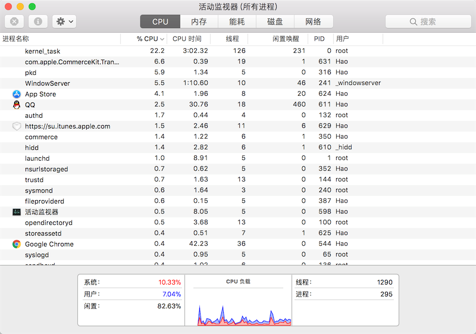
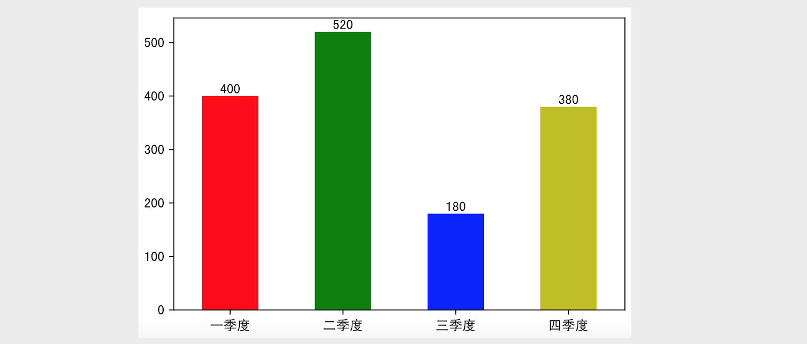
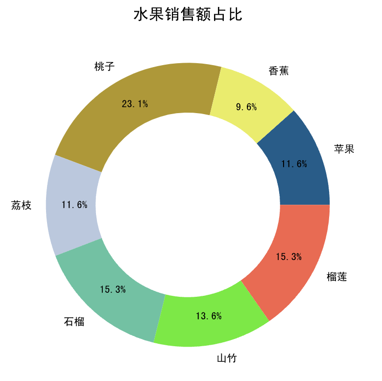
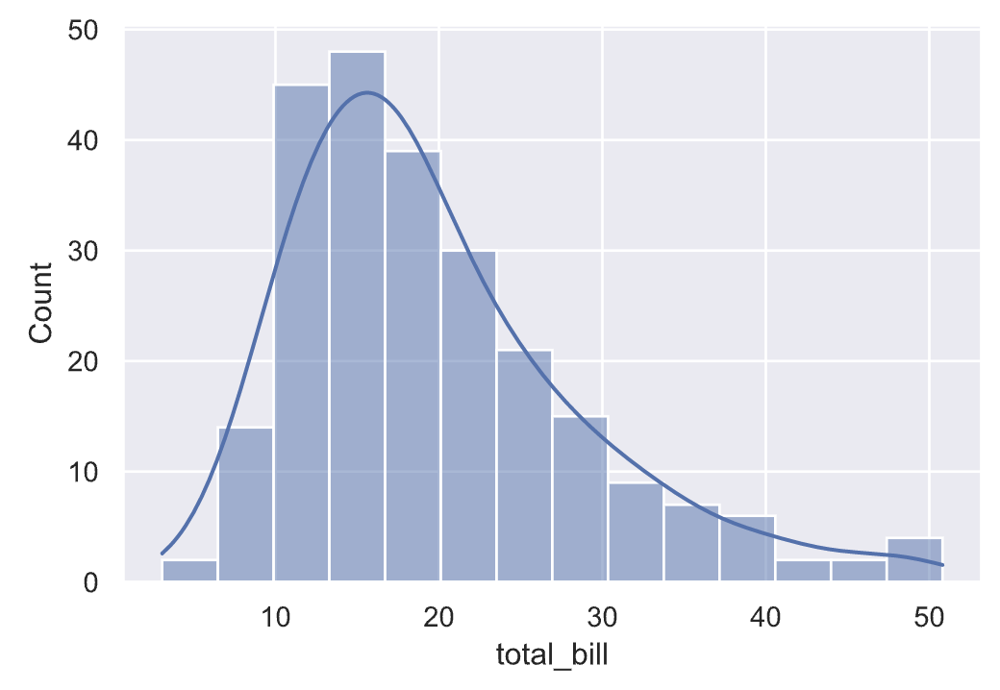
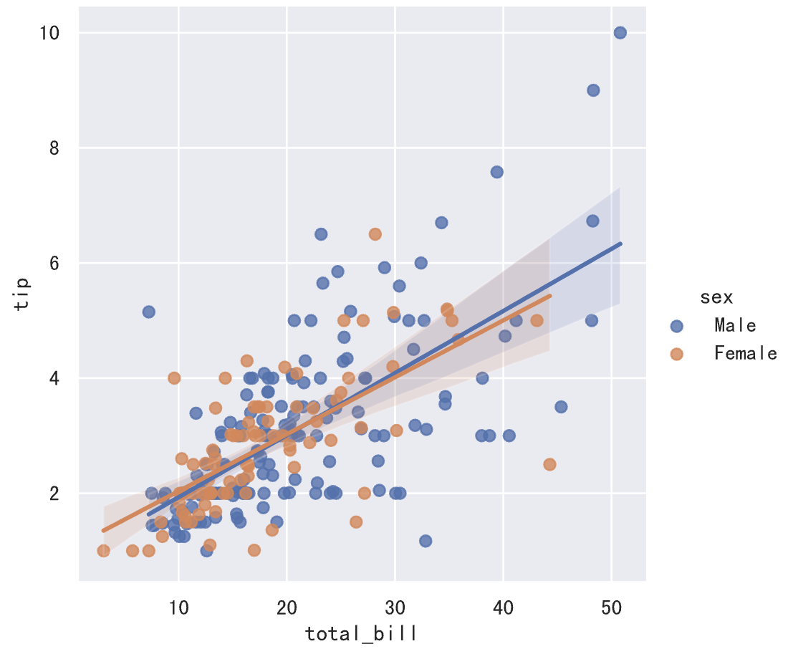
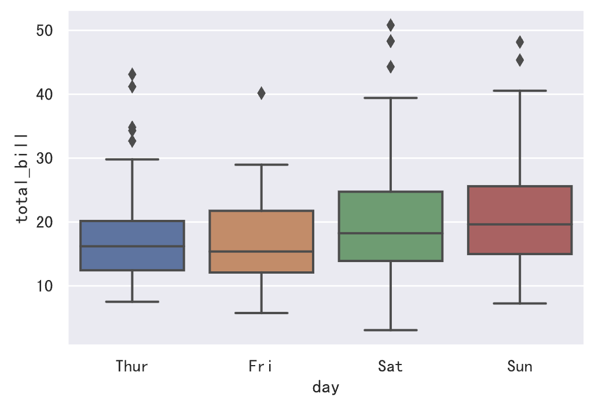

# Python进阶

## Python编程惯例

“惯例”这个词指的是“习惯的做法，常规的办法，一贯的做法”，与这个词对应的英文单词叫“idiom”。由于Python跟其他很多编程语言在语法和使用上还是有比较显著的差别，因此作为一个Python开发者如果不能掌握这些惯例，就无法写出“Pythonic”的代码。下面我们总结了一些在Python开发中的惯用的代码。

1. 让代码既可以被导入又可以被执行。

   ```Python
   if __name__ == '__main__':
   ```


2. 用下面的方式判断逻辑“真”或“假”。

   ```Python
   if x:
   if not x:
   ```

   **好**的代码：

   ```Python
   name = 'jackfrued'
   fruits = ['apple', 'orange', 'grape']
   owners = {'1001': '骆昊', '1002': '王大锤'}
   if name and fruits and owners:
       print('I love fruits!')
   ```

   **不好**的代码：

   ```Python
   name = 'jackfrued'
   fruits = ['apple', 'orange', 'grape']
   owners = {'1001': '骆昊', '1002': '王大锤'}
   if name != '' and len(fruits) > 0 and owners != {}:
       print('I love fruits!')
   ```

3. 善于使用in运算符。

   ```Python
   if x in items: # 包含
   for x in items: # 迭代
   ```

   **好**的代码：

   ```Python
   name = 'Hao LUO'
   if 'L' in name:
       print('The name has an L in it.')
   ```

   **不好**的代码：

   ```Python
   name = 'Hao LUO'
   if name.find('L') != -1:
       print('This name has an L in it!')
   ```

4. 不使用临时变量交换两个值。

   ```Python
   a, b = b, a
   ```

5. 用序列构建字符串。

   **好**的代码：

   ```Python
   chars = ['j', 'a', 'c', 'k', 'f', 'r', 'u', 'e', 'd']
   name = ''.join(chars)
   print(name)  # jackfrued
   ```

   **不好**的代码：

   ```Python
   chars = ['j', 'a', 'c', 'k', 'f', 'r', 'u', 'e', 'd']
   name = ''
   for char in chars:
       name += char
   print(name)  # jackfrued
   ```

6. EAFP优于LBYL。

   EAFP - **E**asier to **A**sk **F**orgiveness than **P**ermission.

   LBYL - **L**ook **B**efore **Y**ou **L**eap.

   **好**的代码：

   ```Python
   d = {'x': '5'}
   try:
       value = int(d['x'])
       print(value)
   except (KeyError, TypeError, ValueError):
       value = None
   ```

   **不好**的代码：

   ```Python
   d = {'x': '5'}
   if 'x' in d and isinstance(d['x'], str) \
   		and d['x'].isdigit():
       value = int(d['x'])
       print(value)
   else:
       value = None
   ```

7. 使用enumerate进行迭代。

   **好**的代码：

   ```Python
   fruits = ['orange', 'grape', 'pitaya', 'blueberry']
   for index, fruit in enumerate(fruits):
   	print(index, ':', fruit)
   ```

   **不好**的代码：

   ```Python
   fruits = ['orange', 'grape', 'pitaya', 'blueberry']
   index = 0
   for fruit in fruits:
       print(index, ':', fruit)
       index += 1
   ```

8. 用生成式生成列表。

   **好**的代码：

   ```Python
   data = [7, 20, 3, 15, 11]
   result = [num * 3 for num in data if num > 10]
   print(result)  # [60, 45, 33]
   ```

   **不好**的代码：

   ```Python
   data = [7, 20, 3, 15, 11]
   result = []
   for i in data:
       if i > 10:
           result.append(i * 3)
   print(result)  # [60, 45, 33]
   ```

9. 用zip组合键和值来创建字典。

   **好**的代码：

   ```Python
   keys = ['1001', '1002', '1003']
   values = ['骆昊', '王大锤', '白元芳']
   d = dict(zip(keys, values))
   print(d)
   ```

   **不好**的代码：

   ```Python
   keys = ['1001', '1002', '1003']
   values = ['骆昊', '王大锤', '白元芳']
   d = {}
   for i, key in enumerate(keys):
       d[key] = values[i]
   print(d)
   ```

> **说明**：这篇文章的内容来自于网络，有兴趣的读者可以阅读[原文](http://safehammad.com/downloads/python-idioms-2014-01-16.pdf)。


## PEP 8风格指南

PEP是Python Enhancement Proposal的缩写，通常翻译为“Python增强提案”。每个PEP都是一份为Python社区提供的指导Python往更好的方向发展的技术文档，其中的第8号增强提案（PEP 8）是针对Python语言编订的代码风格指南。尽管我们可以在保证语法没有问题的前提下随意书写Python代码，但是在实际开发中，采用一致的风格书写出可读性强的代码是每个专业的程序员应该做到的事情，也是每个公司的编程规范中会提出的要求，这些在多人协作开发一个项目（团队开发）的时候显得尤为重要。我们可以从Python官方网站的[PEP 8链接](https://www.python.org/dev/peps/pep-0008/)中找到该文档，下面我们对该文档的关键部分做一个简单的总结。

### 空格的使用

1. <u>使用空格来表示缩进而不要用制表符（Tab）。</u>这一点对习惯了其他编程语言的人来说简直觉得不可理喻，因为绝大多数的程序员都会用Tab来表示缩进，但是要知道Python并没有像C/C++或Java那样的用花括号来构造一个代码块的语法，在Python中分支和循环结构都使用缩进来表示哪些代码属于同一个级别，鉴于此Python代码对缩进以及缩进宽度的依赖比其他很多语言都强得多。在不同的编辑器中，Tab的宽度可能是2、4或8个字符，甚至是其他更离谱的值，用Tab来表示缩进对Python代码来说可能是一场灾难。
2. <u>和语法相关的每一层缩进都用4个空格来表示。</u>
3. <u>每行的字符数不要超过79个字符，如果表达式因太长而占据了多行，除了首行之外的其余各行都应该在正常的缩进宽度上再加上4个空格。</u>
4. <u>函数和类的定义，代码前后都要用两个空行进行分隔。</u>
5. <u>在同一个类中，各个方法之间应该用一个空行进行分隔。</u>
6. <u>二元运算符的左右两侧应该保留一个空格，而且只要一个空格就好。</u>

### 标识符命名

PEP 8倡导用不同的命名风格来命名Python中不同的标识符，以便在阅读代码时能够通过标识符的名称来确定该标识符在Python中扮演了怎样的角色（在这一点上，Python自己的内置模块以及某些第三方模块都做得并不是很好）。

1. <u>变量、函数和属性应该使用小写字母来拼写，如果有多个单词就使用下划线进行连接。</u>
2. <u>类中受保护的实例属性，应该以一个下划线开头。</u>
3. <u>类中私有的实例属性，应该以两个下划线开头。</u>
4. <u>类和异常的命名，应该每个单词首字母大写。</u>
5. <u>模块级别的常量，应该采用全大写字母，如果有多个单词就用下划线进行连接。</u>
6. <u>类的实例方法，应该把第一个参数命名为`self`以表示对象自身。</u>
7. <u>类的类方法，应该把第一个参数命名为`cls`以表示该类自身。</u>

### 表达式和语句

在Python之禅（可以使用`import this`查看）中有这么一句名言：“There should be one-- and preferably only one --obvious way to do it.”，翻译成中文是“做一件事应该有而且最好只有一种确切的做法”，这句话传达的思想在PEP 8中也是无处不在的。

1. <u>采用内联形式的否定词，而不要把否定词放在整个表达式的前面。</u>例如`if a is not b`就比`if not a is b`更容易让人理解。
2. 不要用检查长度的方式来判断字符串、列表等是否为`None`或者没有元素，应该用`if not x`这样的写法来检查它。
3. <u>就算`if`分支、`for`循环、`except`异常捕获等中只有一行代码，也不要将代码和`if`、`for`、`except`等写在一起，分开写才会让代码更清晰。</u>
4. <u>`import`语句总是放在文件开头的地方。</u>
5. <u>引入模块的时候，`from math import sqrt`比`import math`更好。</u>
6. <u>如果有多个`import`语句，应该将其分为三部分，从上到下分别是Python**标准模块**、**第三方模块**和**自定义模块**，每个部分内部应该按照模块名称的**字母表顺序**来排列。</u>


## 【零散】知识点

- 生成式（推导式）的用法

  ```Python
  prices = {
      'AAPL': 191.88,
      'GOOG': 1186.96,
      'IBM': 149.24,
      'ORCL': 48.44,
      'ACN': 166.89,
      'FB': 208.09,
      'SYMC': 21.29
  }
  # 用股票价格大于100元的股票构造一个新的字典
  prices2 = {key: value for key, value in prices.items() if value > 100}
  print(prices2)
  ```

  > 说明：生成式（推导式）可以用来生成列表、集合和字典。

- 嵌套的列表的坑

  ```Python
  names = ['关羽', '张飞', '赵云', '马超', '黄忠']
  courses = ['语文', '数学', '英语']
  # 录入五个学生三门课程的成绩
  # 错误 - 参考http://pythontutor.com/visualize.html#mode=edit
  # scores = [[None] * len(courses)] * len(names)
  scores = [[None] * len(courses) for _ in range(len(names))]
  for row, name in enumerate(names):
      for col, course in enumerate(courses):
          scores[row][col] = float(input(f'请输入{name}的{course}成绩: '))
          print(scores)
  ```

  [Python Tutor](http://pythontutor.com/) - VISUALIZE CODE AND GET LIVE HELP

- `heapq`模块（堆排序）

  ```Python
  """
  从列表中找出最大的或最小的N个元素
  堆结构(大根堆/小根堆)
  """
  import heapq
  
  list1 = [34, 25, 12, 99, 87, 63, 58, 78, 88, 92]
  list2 = [
      {'name': 'IBM', 'shares': 100, 'price': 91.1},
      {'name': 'AAPL', 'shares': 50, 'price': 543.22},
      {'name': 'FB', 'shares': 200, 'price': 21.09},
      {'name': 'HPQ', 'shares': 35, 'price': 31.75},
      {'name': 'YHOO', 'shares': 45, 'price': 16.35},
      {'name': 'ACME', 'shares': 75, 'price': 115.65}
  ]
  print(heapq.nlargest(3, list1))
  print(heapq.nsmallest(3, list1))
  print(heapq.nlargest(2, list2, key=lambda x: x['price']))
  print(heapq.nlargest(2, list2, key=lambda x: x['shares']))
  ```

- `itertools`模块

  ```Python
  """
  迭代工具模块
  """
  import itertools
  
  # 产生ABCD的全排列
  itertools.permutations('ABCD')
  # 产生ABCDE的五选三组合
  itertools.combinations('ABCDE', 3)
  # 产生ABCD和123的笛卡尔积
  itertools.product('ABCD', '123')
  # 产生ABC的无限循环序列
  itertools.cycle(('A', 'B', 'C'))
  ```

- `collections`模块

  常用的工具类：

  - `namedtuple`：命令元组，它是一个类工厂，接受类型的名称和属性列表来创建一个类。
  - `deque`：双端队列，是列表的替代实现。Python中的列表底层是基于数组来实现的，而deque底层是双向链表，因此当你需要在头尾添加和删除元素时，deque会表现出更好的性能，渐近时间复杂度为$O(1)$。
  - `Counter`：`dict`的子类，键是元素，值是元素的计数，它的`most_common()`方法可以帮助我们获取出现频率最高的元素。`Counter`和`dict`的继承关系我认为是值得商榷的，按照CARP原则，`Counter`跟`dict`的关系应该设计为关联关系更为合理。
  - `OrderedDict`：`dict`的子类，它记录了键值对插入的顺序，看起来既有字典的行为，也有链表的行为。
  - `defaultdict`：类似于字典类型，但是可以通过默认的工厂函数来获得键对应的默认值，相比字典中的`setdefault()`方法，这种做法更加高效。

  ```Python
  """
  找出序列中出现次数最多的元素
  """
  from collections import Counter
  
  words = [
      'look', 'into', 'my', 'eyes', 'look', 'into', 'my', 'eyes',
      'the', 'eyes', 'the', 'eyes', 'the', 'eyes', 'not', 'around',
      'the', 'eyes', "don't", 'look', 'around', 'the', 'eyes',
      'look', 'into', 'my', 'eyes', "you're", 'under'
  ]
  counter = Counter(words)
  print(counter.most_common(3))
  ```


## 函数的使用方式

- 将函数视为“一等公民”

  - 函数可以赋值给变量
  - 函数可以作为函数的参数
  - 函数可以作为函数的返回值

- 高阶函数的用法（`filter`、`map`以及它们的替代品）

  ```Python
  items1 = list(map(lambda x: x ** 2, filter(lambda x: x % 2, range(1, 10))))
  items2 = [x ** 2 for x in range(1, 10) if x % 2]
  ```

- 位置参数、可变参数、关键字参数、命名关键字参数

- 参数的元信息（代码可读性问题）

- 匿名函数和内联函数的用法（`lambda`函数）

- 闭包和作用域问题

  - Python搜索变量的LEGB顺序（Local >>> Embedded >>> Global >>> Built-in）

  - `global`和`nonlocal`关键字的作用

    `global`：声明或定义全局变量（要么直接使用现有的全局作用域的变量，要么定义一个变量放到全局作用域）。

    `nonlocal`：声明使用嵌套作用域的变量（嵌套作用域必须存在该变量，否则报错）。

- 装饰器函数（使用装饰器和取消装饰器）

  例子：输出函数执行时间的装饰器。

  ```Python
  def record_time(func):
      """自定义装饰函数的装饰器"""
      
      @wraps(func)
      def wrapper(*args, **kwargs):
          start = time()
          result = func(*args, **kwargs)
          print(f'{func.__name__}: {time() - start}秒')
          return result
          
      return wrapper
  ```

  如果装饰器不希望跟`print`函数耦合，可以编写可以参数化的装饰器。

  ```Python
  from functools import wraps
  from time import time
  
  
  def record(output):
      """可以参数化的装饰器"""
  	
  	def decorate(func):
  		
  		@wraps(func)
  		def wrapper(*args, **kwargs):
  			start = time()
  			result = func(*args, **kwargs)
  			output(func.__name__, time() - start)
  			return result
              
  		return wrapper
  	
  	return decorate
  ```

  ```Python
  from functools import wraps
  from time import time
  
  
  class Record():
      """通过定义类的方式定义装饰器"""
  
      def __init__(self, output):
          self.output = output
  
      def __call__(self, func):
  
          @wraps(func)
          def wrapper(*args, **kwargs):
              start = time()
              result = func(*args, **kwargs)
              self.output(func.__name__, time() - start)
              return result
  
          return wrapper
  ```

  > **说明**：由于对带装饰功能的函数添加了@wraps装饰器，可以通过`func.__wrapped__`方式获得被装饰之前的函数或类来取消装饰器的作用。

  例子：用装饰器来实现单例模式。

  ```Python
  from functools import wraps
  
  
  def singleton(cls):
      """装饰类的装饰器"""
      instances = {}
  
      @wraps(cls)
      def wrapper(*args, **kwargs):
          if cls not in instances:
              instances[cls] = cls(*args, **kwargs)
          return instances[cls]
  
      return wrapper
  
  
  @singleton
  class President:
      """总统(单例类)"""
      pass
  ```

  > **提示**：上面的代码中用到了闭包（closure），不知道你是否已经意识到了。还没有一个小问题就是，上面的代码并没有实现线程安全的单例，如果要实现线程安全的单例应该怎么做呢？

  线程安全的单例装饰器。

  ```Python
  from functools import wraps
  from threading import RLock
  
  
  def singleton(cls):
      """线程安全的单例装饰器"""
      instances = {}
      locker = RLock()
  
      @wraps(cls)
      def wrapper(*args, **kwargs):
          if cls not in instances:
              with locker:
                  if cls not in instances:
                      instances[cls] = cls(*args, **kwargs)
          return instances[cls]
  
      return wrapper
  ```

  > **提示**：上面的代码用到了`with`上下文语法来进行锁操作，因为锁对象本身就是上下文管理器对象（支持`__enter__`和`__exit__`魔术方法）。在`wrapper`函数中，我们先做了一次不带锁的检查，然后再做带锁的检查，这样做比直接加锁检查性能要更好，如果对象已经创建就没有必须再去加锁而是直接返回该对象就可以了。

### 用函数还是用复杂的表达式

Perl语言的原作者*Larry Wall*曾经说过，伟大的程序员都有三个优点：懒惰、暴躁和自负。乍一看这三个词语没有一个是褒义词，但在程序员的世界里，这三个词有不同的意义。首先，懒惰会促使程序员去写一些省事儿的程序来辅助自己或别人更好的完成工作，这样我们就无需做那些重复和繁琐的劳动；同理能够用3行代码解决的事情，我们也绝不会写出10行代码来。其次，暴躁会让程序员主动的去完成一些你还没有提出的工作，去优化自己的代码让它更有效率，能够3秒钟完成的任务，我们绝不能容忍1分钟的等待。最后，自负会促使程序员写出可靠无误的代码，我们写代码不是为了接受批评和指责，而是为了让其他人来膜拜。

那么接下来就有一个很有意思的问题值得探讨一下，我们需要一个程序从输入的三个数中找出最大的那个数。这个程序对任何会编程的人来说都是小菜一碟，甚至不会编程的人经过10分钟的学习也能搞定。下面是用来解决这个问题的Python代码。

```Python
a = int(input('a = '))
b = int(input('b = '))
c = int(input('c = '))
if a > b:
	the_max = a
else:
	the_max = b
if c > the_max:
	the_max = c
print('The max is:', the_max)
```

但是我们刚才说了，程序员都是懒惰的，很多程序员都会使用三元条件运算符来改写上面的代码。

```Python
a = int(input('a = '))
b = int(input('b = '))
c = int(input('c = '))
the_max = a if a > b else b
the_max = c if c > the_max else the_max
print('The max is:', the_max)
```

需要说明的是，Python在2.5版本以前是没有上面代码第4行和第5行中使用的三元条件运算符的，究其原因是Guido van Rossum（Python之父）认为三元条件运算符并不能帮助 Python变得更加简洁，于是那些习惯了在C/C++或Java中使用三元条件运算符（在这些语言中，三元条件运算符也称为“Elvis运算符”，因为`?:`放在一起很像著名摇滚歌手猫王Elvis的大背头）的程序员试着用`and`和`or`运算符的短路特性来模拟出三元操作符，于是在那个年代，上面的代码是这样写的。

```Python
a = int(input('a = '))
b = int(input('b = '))
c = int(input('c = '))
the_max = a > b and a or b
the_max = c > the_max and c or the_max
print('The max is:', the_max)
```

但是这种做法在某些场景下是不能成立的，且看下面的代码。

```Python
a = 0
b = -100
# 下面的代码本来预期输出a的值，结果却得到了b的值
# 因为a的值0在进行逻辑运算时会被视为False来处理
print(True and a or b)
# print(a if True else b)
```

所以在Python 2.5以后引入了三元条件运算符来避免上面的风险（上面代码被注释掉的最后一句话）。那么，问题又来了，上面的代码还可以写得更简短吗？答案是肯定的。

```Python
a = int(input('a = '))
b = int(input('b = '))
c = int(input('c = '))
print('The max is:', (a if a > b else b) if (a if a > b else b) > c else c)
```

但是，这样做真的好吗？如此复杂的表达式是不是让代码变得晦涩了很多呢？我们发现，在实际开发中很多开发者都喜欢过度的使用某种语言的特性或语法糖，于是简单的多行代码变成了复杂的单行表达式，这样做真的好吗？这个问题我也不止一次的问过自己，现在我能给出的答案是下面的代码，使用辅助函数。

```Python
def the_max(x, y):
	return x if x > y else y


a = int(input('a = '))
b = int(input('b = '))
c = int(input('c = '))
print('The max is:', the_max(the_max(a, b), c))
```

上面的代码中，我定义了一个辅助函数`the_max`用来找出参数传入的两个值中较大的那一个，于是下面的输出语句可以通过两次调用`the_max`函数来找出三个数中的最大值，现在代码的可读性是不是好了很多。用辅助函数来替代复杂的表达式真的是一个不错的选择，关键是比较大小的逻辑转移到这个辅助函数后不仅可以反复调用它，而且还可以进行级联操作。

当然，很多语言中比较大小的函数根本没有必要自己来实现（通常都是内置函数），Python也是如此。Python内置的max函数利用了Python对可变参数的支持，允许一次性传入多个值或者一个迭代器并找出那个最大值，所以上面讨论的问题在Python中也就是一句话的事，但是从复杂表达式到使用辅助函数简化复杂表达式这个思想是非常值得玩味的，所以分享出来跟大家做一个交流。

```Python
a = int(input('a = '))
b = int(input('b = '))
c = int(input('c = '))
print('The max is:', max(a, b, c))
```


## 面向对象相关知识

- 三大支柱：封装、继承、多态

  例子：工资结算系统。

  ```Python
  """
  月薪结算系统 - 部门经理每月15000 程序员每小时200 销售员1800底薪加销售额5%提成
  """
  from abc import ABCMeta, abstractmethod
  
  
  class Employee(metaclass=ABCMeta):
      """员工(抽象类)"""
  
      def __init__(self, name):
          self.name = name
  
      @abstractmethod
      def get_salary(self):
          """结算月薪(抽象方法)"""
          pass
  
  
  class Manager(Employee):
      """部门经理"""
  
      def get_salary(self):
          return 15000.0
  
  
  class Programmer(Employee):
      """程序员"""
  
      def __init__(self, name, working_hour=0):
          self.working_hour = working_hour
          super().__init__(name)
  
      def get_salary(self):
          return 200.0 * self.working_hour
  
  
  class Salesman(Employee):
      """销售员"""
  
      def __init__(self, name, sales=0.0):
          self.sales = sales
          super().__init__(name)
  
      def get_salary(self):
          return 1800.0 + self.sales * 0.05
  
  
  class EmployeeFactory:
      """创建员工的工厂（工厂模式 - 通过工厂实现对象使用者和对象之间的解耦合）"""
  
      @staticmethod
      def create(emp_type, *args, **kwargs):
          """创建员工"""
          all_emp_types = {'M': Manager, 'P': Programmer, 'S': Salesman}
          cls = all_emp_types[emp_type.upper()]
          return cls(*args, **kwargs) if cls else None
  
  
  def main():
      """主函数"""
      emps = [
          EmployeeFactory.create('M', '曹操'), 
          EmployeeFactory.create('P', '荀彧', 120),
          EmployeeFactory.create('P', '郭嘉', 85), 
          EmployeeFactory.create('S', '典韦', 123000),
      ]
      for emp in emps:
          print(f'{emp.name}: {emp.get_salary():.2f}元')
  
  
  if __name__ == '__main__':
      main()
  ```

- 类与类之间的关系

  - is-a关系：继承
  - has-a关系：关联 / 聚合 / 合成
  - use-a关系：依赖

  例子：扑克游戏。

  ```Python
  """
  经验：符号常量总是优于字面常量，枚举类型是定义符号常量的最佳选择
  """
  from enum import Enum, unique
  
  import random
  
  
  @unique
  class Suite(Enum):
      """花色"""
  
      SPADE, HEART, CLUB, DIAMOND = range(4)
  
      def __lt__(self, other):
          return self.value < other.value
  
  
  class Card:
      """牌"""
  
      def __init__(self, suite, face):
          """初始化方法"""
          self.suite = suite
          self.face = face
  
      def show(self):
          """显示牌面"""
          suites = ['♠︎', '♥︎', '♣︎', '♦︎']
          faces = ['', 'A', '2', '3', '4', '5', '6', '7', '8', '9', '10', 'J', 'Q', 'K']
          return f'{suites[self.suite.value]}{faces[self.face]}'
  
      def __repr__(self):
          return self.show()
  
  
  class Poker:
      """扑克"""
  
      def __init__(self):
          self.index = 0
          self.cards = [Card(suite, face)
                        for suite in Suite
                        for face in range(1, 14)]
  
      def shuffle(self):
          """洗牌（随机乱序）"""
          random.shuffle(self.cards)
          self.index = 0
  
      def deal(self):
          """发牌"""
          card = self.cards[self.index]
          self.index += 1
          return card
  
      @property
      def has_more(self):
          return self.index < len(self.cards)
  
  
  class Player:
      """玩家"""
  
      def __init__(self, name):
          self.name = name
          self.cards = []
  
      def get_one(self, card):
          """摸一张牌"""
          self.cards.append(card)
  
      def sort(self, comp=lambda card: (card.suite, card.face)):
          """整理手上的牌"""
          self.cards.sort(key=comp)
  
  
  def main():
      """主函数"""
      poker = Poker()
      poker.shuffle()
      players = [Player('东邪'), Player('西毒'), Player('南帝'), Player('北丐')]
      while poker.has_more:
          for player in players:
                  player.get_one(poker.deal())
      for player in players:
          player.sort()
          print(player.name, end=': ')
          print(player.cards)
  
  
  if __name__ == '__main__':
      main()
  ```

  > **说明**：上面的代码中使用了Emoji字符来表示扑克牌的四种花色，在某些不支持Emoji字符的系统上可能无法显示。

- 对象的复制（深复制/深拷贝/深度克隆和浅复制/浅拷贝/影子克隆）

- 垃圾回收、循环引用和弱引用

  Python使用了自动化内存管理，这种管理机制以**引用计数**为基础，同时也引入了**标记-清除**和**分代收集**两种机制为辅的策略。

  ```C
  typedef struct _object {
      /* 引用计数 */
      int ob_refcnt;
      /* 对象指针 */
      struct _typeobject *ob_type;
  } PyObject;
  ```

  ```C
  /* 增加引用计数的宏定义 */
  #define Py_INCREF(op)   ((op)->ob_refcnt++)
  /* 减少引用计数的宏定义 */
  #define Py_DECREF(op) \ //减少计数
      if (--(op)->ob_refcnt != 0) \
          ; \
      else \
          __Py_Dealloc((PyObject *)(op))
  ```

  导致引用计数+1的情况：

  - 对象被创建，例如`a = 23`
  - 对象被引用，例如`b = a`
  - 对象被作为参数，传入到一个函数中，例如`f(a)`
  - 对象作为一个元素，存储在容器中，例如`list1 = [a, a]`

  导致引用计数-1的情况：

  - 对象的别名被显式销毁，例如`del a`
  - 对象的别名被赋予新的对象，例如`a = 24`
  - 一个对象离开它的作用域，例如f函数执行完毕时，f函数中的局部变量（全局变量不会）
  - 对象所在的容器被销毁，或从容器中删除对象

  引用计数可能会导致循环引用问题，而循环引用会导致内存泄露，如下面的代码所示。为了解决这个问题，Python中引入了“标记-清除”和“分代收集”。在创建一个对象的时候，对象被放在第一代中，如果在第一代的垃圾检查中对象存活了下来，该对象就会被放到第二代中，同理在第二代的垃圾检查中对象存活下来，该对象就会被放到第三代中。

  ```Python
  # 循环引用会导致内存泄露 - Python除了引用技术还引入了标记清理和分代回收
  # 在Python 3.6以前如果重写__del__魔术方法会导致循环引用处理失效
  # 如果不想造成循环引用可以使用弱引用
  list1 = []
  list2 = [] 
  list1.append(list2)
  list2.append(list1)
  ```

  以下情况会导致垃圾回收：

  - 调用`gc.collect()`
  - `gc`模块的计数器达到阀值
  - 程序退出

  如果循环引用中两个对象都定义了`__del__`方法，`gc`模块不会销毁这些不可达对象，因为gc模块不知道应该先调用哪个对象的`__del__`方法，这个问题在Python 3.6中得到了解决。

  也可以通过`weakref`模块构造弱引用的方式来解决循环引用的问题。

- 魔法属性和方法（请参考《Python魔法方法指南》）

  有几个小问题请大家思考：

  - 自定义的对象能不能使用运算符做运算？
  - 自定义的对象能不能放到`set`中？能去重吗？
  - 自定义的对象能不能作为`dict`的键？
  - 自定义的对象能不能使用上下文语法？

- 混入（Mixin）

  例子：自定义字典限制只有在指定的key不存在时才能在字典中设置键值对。

  ```Python
  class SetOnceMappingMixin:
      """自定义混入类"""
      __slots__ = ()
  
      def __setitem__(self, key, value):
          if key in self:
              raise KeyError(str(key) + ' already set')
          return super().__setitem__(key, value)
  
  
  class SetOnceDict(SetOnceMappingMixin, dict):
      """自定义字典"""
      pass
  
  
  my_dict= SetOnceDict()
  try:
      my_dict['username'] = 'jackfrued'
      my_dict['username'] = 'hellokitty'
  except KeyError:
      pass
  print(my_dict)
  ```

- 元编程和元类

  对象是通过类创建的，类是通过元类创建的，元类提供了创建类的元信息。所有的类都直接或间接的继承自`object`，所有的元类都直接或间接的继承自`type`。

  例子：用元类实现单例模式。

  ```Python
  import threading
  
  
  class SingletonMeta(type):
      """自定义元类"""
  
      def __init__(cls, *args, **kwargs):
          cls.__instance = None
          cls.__lock = threading.RLock()
          super().__init__(*args, **kwargs)
  
      def __call__(cls, *args, **kwargs):
          if cls.__instance is None:
              with cls.__lock:
                  if cls.__instance is None:
                      cls.__instance = super().__call__(*args, **kwargs)
          return cls.__instance
  
  
  class President(metaclass=SingletonMeta):
      """总统(单例类)"""
      
      pass
  ```

- 面向对象设计原则

  - 单一职责原则 （**S**RP）- 一个类只做该做的事情（类的设计要高内聚）
  - 开闭原则 （**O**CP）- 软件实体应该对扩展开发对修改关闭
  - 依赖倒转原则（DIP）- 面向抽象编程（在弱类型语言中已经被弱化）
  - 里氏替换原则（**L**SP） - 任何时候可以用子类对象替换掉父类对象
  - 接口隔离原则（**I**SP）- 接口要小而专不要大而全（Python中没有接口的概念）
  - 合成聚合复用原则（CARP） - 优先使用强关联关系而不是继承关系复用代码
  - 最少知识原则（迪米特法则，Lo**D**）- 不要给没有必然联系的对象发消息

  > **说明**：上面加粗的字母放在一起称为面向对象的**SOLID**原则。

- GoF设计模式

  - 创建型模式：单例、工厂、建造者、原型
  - 结构型模式：适配器、门面（外观）、代理
  - 行为型模式：迭代器、观察者、状态、策略

  例子：可插拔的哈希算法（策略模式）。

  ```Python
  class StreamHasher():
      """哈希摘要生成器"""
  
      def __init__(self, alg='md5', size=4096):
          self.size = size
          alg = alg.lower()
          self.hasher = getattr(__import__('hashlib'), alg.lower())()
  
      def __call__(self, stream):
          return self.to_digest(stream)
  
      def to_digest(self, stream):
          """生成十六进制形式的摘要"""
          for buf in iter(lambda: stream.read(self.size), b''):
              self.hasher.update(buf)
          return self.hasher.hexdigest()
  
  def main():
      """主函数"""
      hasher1 = StreamHasher()
      with open('Python-3.7.6.tgz', 'rb') as stream:
          print(hasher1.to_digest(stream))
      hasher2 = StreamHasher('sha1')
      with open('Python-3.7.6.tgz', 'rb') as stream:
          print(hasher2(stream))
  
  
  if __name__ == '__main__':
      main()
  ```

## 迭代器和生成器

- 迭代器是实现了迭代器协议的对象。

  - Python中没有像`protocol`或`interface`这样的定义协议的关键字。
  - Python中用魔术方法表示协议。
  - `__iter__`和`__next__`魔术方法就是迭代器协议。

  ```Python
  class Fib(object):
      """迭代器"""
      
      def __init__(self, num):
          self.num = num
          self.a, self.b = 0, 1
          self.idx = 0
     
      def __iter__(self):
          return self
  
      def __next__(self):
          if self.idx < self.num:
              self.a, self.b = self.b, self.a + self.b
              self.idx += 1
              return self.a
          raise StopIteration()
  ```

- 生成器是语法简化版的迭代器。

  ```Python
  def fib(num):
      """生成器"""
      a, b = 0, 1
      for _ in range(num):
          a, b = b, a + b
          yield a
  ```

- 生成器进化为协程。

  生成器对象可以使用`send()`方法发送数据，发送的数据会成为生成器函数中通过`yield`表达式获得的值。这样，生成器就可以作为协程使用，协程简单的说就是可以相互协作的子程序。

  ```Python
  def calc_avg():
      """流式计算平均值"""
      total, counter = 0, 0
      avg_value = None
      while True:
          value = yield avg_value
          total, counter = total + value, counter + 1
          avg_value = total / counter
  
  
  gen = calc_avg()
  next(gen)
  print(gen.send(10))
  print(gen.send(20))
  print(gen.send(30))
  ```


## Python中的并发编程

现如今，我们使用的计算机早已是多 CPU 或多核的计算机，而我们使用的操作系统基本都支持“多任务”，这使得我们可以同时运行多个程序，也可以将一个程序分解为若干个相对独立的子任务，让多个子任务“并行”或“并发”的执行，从而缩短程序的执行时间，同时也让用户获得更好的体验。因此当下，不管用什么编程语言进行开发，实现“并行”或“并发”编程已经成为了程序员的标配技能。为了讲述如何在 Python 程序中实现“并行”或“并发”，我们需要先了解两个重要的概念：进程和线程。

### 线程和进程

我们通过操作系统运行一个程序会创建出一个或多个进程，进程是具有一定独立功能的程序关于某个数据集合上的一次运行活动。简单的说，进程是操作系统分配存储空间的基本单位，每个进程都有自己的地址空间、数据栈以及其他用于跟踪进程执行的辅助数据；操作系统管理所有进程的执行，为它们合理的分配资源。一个进程可以通过 fork 或 spawn 的方式创建新的进程来执行其他的任务，不过新的进程也有自己独立的内存空间，因此两个进程如果要共享数据，必须通过进程间通信机制来实现，具体的方式包括管道、信号、套接字等。

一个进程还可以拥有多个执行线索，简单的说就是拥有多个可以获得 CPU 调度的执行单元，这就是所谓的线程。由于线程在同一个进程下，它们可以共享相同的上下文，因此相对于进程而言，线程间的信息共享和通信更加容易。当然在单核 CPU 系统中，多个线程不可能同时执行，因为在某个时刻只有一个线程能够获得 CPU，多个线程通过共享 CPU 执行时间的方式来达到并发的效果。

在程序中使用多线程技术通常都会带来不言而喻的好处，最主要的体现在提升程序的性能和改善用户体验，今天我们使用的软件几乎都用到了多线程技术，这一点可以利用系统自带的进程监控工具（如 macOS 中的“活动监视器”、Windows 中的“任务管理器”）来证实，如下图所示。



这里，我们还需要跟大家再次强调两个概念：**并发**（concurrency）和**并行**（parallel）。**并发**通常是指同一时刻只能有一条指令执行，但是多个线程对应的指令被快速轮换地执行。比如一个处理器，它先执行线程 A 的指令一段时间，再执行线程 B 的指令一段时间，再切回到线程 A 执行一段时间。由于处理器执行指令的速度和切换的速度极快，人们完全感知不到计算机在这个过程中有多个线程切换上下文执行的操作，这就使得宏观上看起来多个线程在同时运行，但微观上其实只有一个线程在执行。**并行**是指同一时刻，有多条指令在多个处理器上同时执行，并行必须要依赖于多个处理器，不论是从宏观上还是微观上，多个线程可以在同一时刻一起执行的。很多时候，我们并不用严格区分并发和并行两个词，所以我们有时候也把 Python 中的多线程、多进程以及异步 I/O 都视为实现并发编程的手段，但实际上前面两者也可以实现并行编程，当然这里还有一个全局解释器锁（GIL）的问题，我们稍后讨论。

### 多线程编程

Python 标准库中`threading`模块的`Thread`类可以帮助我们非常轻松的实现多线程编程。我们用一个联网下载文件的例子来对比使用多线程和不使用多线程到底有什么区别，代码如下所示。

不使用多线程的下载。

```Python
import random
import time


def download(*, filename):
    start = time.time()
    print(f'开始下载 {filename}.')
    time.sleep(random.randint(3, 6))
    print(f'{filename} 下载完成.')
    end = time.time()
    print(f'下载耗时: {end - start:.3f}秒.')


def main():
    start = time.time()
    download(filename='Python从入门到住院.pdf')
    download(filename='MySQL从删库到跑路.avi')
    download(filename='Linux从精通到放弃.mp4')
    end = time.time()
    print(f'总耗时: {end - start:.3f}秒.')


if __name__ == '__main__':
    main()
```

> **说明**：上面的代码并没有真正实现联网下载的功能，而是通过`time.sleep()`休眠一段时间来模拟下载文件需要一些时间上的开销，跟实际下载的状况比较类似。

运行上面的代码，可以得到如下所示的运行结果。可以看出，当我们的程序只有一个工作线程时，每个下载任务都需要等待上一个下载任务执行结束才能开始，所以程序执行的总耗时是三个下载任务各自执行时间的总和。

```
开始下载Python从入门到住院.pdf.
Python从入门到住院.pdf下载完成.
下载耗时: 3.005秒.
开始下载MySQL从删库到跑路.avi.
MySQL从删库到跑路.avi下载完成.
下载耗时: 5.006秒.
开始下载Linux从精通到放弃.mp4.
Linux从精通到放弃.mp3下载完成.
下载耗时: 6.007秒.
总耗时: 14.018秒.
```

事实上，上面的三个下载任务之间并没有逻辑上的因果关系，三者是可以“并发”的，下一个下载任务没有必要等待上一个下载任务结束，为此，我们可以使用多线程编程来改写上面的代码。

```Python
import random
import time
from threading import Thread


def download(*, filename):
    start = time.time()
    print(f'开始下载 {filename}.')
    time.sleep(random.randint(3, 6))
    print(f'{filename} 下载完成.')
    end = time.time()
    print(f'下载耗时: {end - start:.3f}秒.')


def main():
    threads = [
        Thread(target=download, kwargs={'filename': 'Python从入门到住院.pdf'}),
        Thread(target=download, kwargs={'filename': 'MySQL从删库到跑路.avi'}),
        Thread(target=download, kwargs={'filename': 'Linux从精通到放弃.mp4'})
    ]
    start = time.time()
    # 启动三个线程
    for thread in threads:
        thread.start()
    # 等待线程结束
    for thread in threads:
        thread.join()
    end = time.time()
    print(f'总耗时: {end - start:.3f}秒.')


if __name__ == '__main__':
    main()
```

某次的运行结果如下所示。

```
开始下载 Python从入门到住院.pdf.
开始下载 MySQL从删库到跑路.avi.
开始下载 Linux从精通到放弃.mp4.
MySQL从删库到跑路.avi 下载完成.
下载耗时: 3.005秒.
Python从入门到住院.pdf 下载完成.
下载耗时: 5.006秒.
Linux从精通到放弃.mp4 下载完成.
下载耗时: 6.003秒.
总耗时: 6.004秒.
```

通过上面的运行结果可以发现，整个程序的执行时间几乎等于耗时最长的一个下载任务的执行时间，这也就意味着，三个下载任务是并发执行的，不存在一个等待另一个的情况，这样做很显然提高了程序的执行效率。简单的说，如果程序中有非常耗时的执行单元，而这些耗时的执行单元之间又没有逻辑上的因果关系，即 B 单元的执行不依赖于 A 单元的执行结果，那么 A 和 B 两个单元就可以放到两个不同的线程中，让他们并发的执行。这样做的好处除了减少程序执行的等待时间，还可以带来更好的用户体验，因为一个单元的阻塞不会造成程序的“假死”，因为程序中还有其他的单元是可以运转的。

#### 使用 Thread 类创建线程对象

通过上面的代码可以看出，直接使用`Thread`类的构造器就可以创建线程对象，而线程对象的`start()`方法可以启动一个线程。线程启动后会执行`target`参数指定的函数，当然前提是获得 CPU 的调度；如果`target`指定的线程要执行的目标函数有参数，需要通过`args`参数为其进行指定，对于关键字参数，可以通过`kwargs`参数进行传入。`Thread`类的构造器还有很多其他的参数，我们遇到的时候再为大家进行讲解，目前需要大家掌握的，就是`target`、`args`和`kwargs`。

#### 继承 Thread 类自定义线程

除了上面的代码展示的创建线程的方式外，还可以通过继承`Thread`类并重写`run()`方法的方式来自定义线程，具体的代码如下所示。

```Python
import random
import time
from threading import Thread


class DownloadThread(Thread):

    def __init__(self, filename):
        self.filename = filename
        super().__init__()

    def run(self):
        start = time.time()
        print(f'开始下载 {self.filename}.')
        time.sleep(random.randint(3, 6))
        print(f'{self.filename} 下载完成.')
        end = time.time()
        print(f'下载耗时: {end - start:.3f}秒.')


def main():
    threads = [
        DownloadThread('Python从入门到住院.pdf'),
        DownloadThread('MySQL从删库到跑路.avi'),
        DownloadThread('Linux从精通到放弃.mp4')
    ]
    start = time.time()
    # 启动三个线程
    for thread in threads:
        thread.start()
    # 等待线程结束
    for thread in threads:
        thread.join()
    end = time.time()
    print(f'总耗时: {end - start:.3f}秒.')


if __name__ == '__main__':
    main()
```

#### 使用线程池

我们还可以通过线程池的方式将任务放到多个线程中去执行，通过线程池来使用线程应该是多线程编程最理想的选择。事实上，线程的创建和释放都会带来较大的开销，频繁的创建和释放线程通常都不是很好的选择。利用线程池，可以提前准备好若干个线程，在使用的过程中不需要再通过自定义的代码创建和释放线程，而是直接复用线程池中的线程。Python 内置的`concurrent.futures`模块提供了对线程池的支持，代码如下所示。

```Python
import random
import time
from concurrent.futures import ThreadPoolExecutor
from threading import Thread


def download(*, filename):
    start = time.time()
    print(f'开始下载 {filename}.')
    time.sleep(random.randint(3, 6))
    print(f'{filename} 下载完成.')
    end = time.time()
    print(f'下载耗时: {end - start:.3f}秒.')


def main():
    with ThreadPoolExecutor(max_workers=4) as pool:
        filenames = ['Python从入门到住院.pdf', 'MySQL从删库到跑路.avi', 'Linux从精通到放弃.mp4']
        start = time.time()
        for filename in filenames:
            pool.submit(download, filename=filename)
    end = time.time()
    print(f'总耗时: {end - start:.3f}秒.')


if __name__ == '__main__':
    main()
```

### 守护线程

所谓“守护线程”就是在主线程结束的时候，不值得再保留的执行线程。这里的不值得保留指的是守护线程会在其他非守护线程全部运行结束之后被销毁，它守护的是当前进程内所有的非守护线程。简单的说，守护线程会跟随主线程一起挂掉，而主线程的生命周期就是一个进程的生命周期。如果不理解，我们可以看一段简单的代码。

```Python
import time
from threading import Thread


def display(content):
    while True:
        print(content, end='', flush=True)
        time.sleep(0.1)


def main():
    Thread(target=display, args=('Ping', )).start()
    Thread(target=display, args=('Pong', )).start()


if __name__ == '__main__':
    main()
```

> **说明**：上面的代码中，我们将`print`函数的参数`flush`设置为`True`，这是因为`flush`参数的值如果为`False`，而`print`又没有做换行处理，就会导致每次`print`输出的内容被放到操作系统的输出缓冲区，直到缓冲区被输出的内容塞满，才会清空缓冲区产生一次输出。上述现象是操作系统为了减少 I/O 中断，提升 CPU 利用率做出的设定，为了让代码产生直观交互，我们才将`flush`参数设置为`True`，强制每次输出都清空输出缓冲区。

上面的代码运行起来之后是不会停止的，因为两个子线程中都有死循环，除非你手动中断代码的执行。但是，如果在创建线程对象时，将名为`daemon`的参数设置为`True`，这两个线程就会变成守护线程，那么在其他线程结束时，即便有死循环，两个守护线程也会挂掉，不会再继续执行下去，代码如下所示。

 ```Python
import time
from threading import Thread


def display(content):
    while True:
        print(content, end='', flush=True)
        time.sleep(0.1)


def main():
    Thread(target=display, args=('Ping', ), daemon=True).start()
    Thread(target=display, args=('Pong', ), daemon=True).start()
    time.sleep(5)


if __name__ == '__main__':
    main()
 ```

上面的代码，我们在主线程中添加了一行`time.sleep(5)`让主线程休眠5秒，在这个过程中，输出`Ping`和`Pong`的守护线程会持续运转，直到主线程在5秒后结束，这两个守护线程也被销毁，不再继续运行。

> **思考**：如果将上面代码第12行的`daemon=True`去掉，代码会怎样执行？有兴趣的读者可以尝试一下，并看看实际执行的结果跟你想象的是否一致。

### 资源竞争

在编写多线程代码时，不可避免的会遇到多个线程竞争同一个资源（对象）的情况。在这种情况下，如果没有合理的机制来保护被竞争的资源，那么就有可能出现非预期的状况。下面的代码创建了`100`个线程向同一个银行账户（初始余额为`0`元）转账，每个线程转账金额为`1`元。在正常的情况下，我们的银行账户最终的余额应该是`100`元，但是运行下面的代码我们并不能得到`100`元这个结果。

```Python
import time

from concurrent.futures import ThreadPoolExecutor


class Account(object):
    """银行账户"""

    def __init__(self):
        self.balance = 0.0

    def deposit(self, money):
        """存钱"""
        new_balance = self.balance + money
        time.sleep(0.01)
        self.balance = new_balance


def main():
    """主函数"""
    account = Account()
    with ThreadPoolExecutor(max_workers=16) as pool:
        for _ in range(100):
            pool.submit(account.deposit, 1)
    print(account.balance)


if __name__ == '__main__':
    main()
```

上面代码中的`Account`类代表了银行账户，它的`deposit`方法代表存款行为，参数`money`代表存入的金额，该方法通过`time.sleep`函数模拟受理存款需要一段时间。我们通过线程池的方式启动了`100`个线程向一个账户转账，但是上面的代码并不能运行出`100`这个我们期望的结果，这就是在多个线程竞争一个资源的时候，可能会遇到的数据不一致的问题。注意上面代码的第`14`行，当多个线程都执行到这行代码时，它们会在相同的余额上执行加上存入金额的操作，这就会造成“丢失更新”现象，即之前修改数据的成果被后续的修改给覆盖掉了，所以才得不到正确的结果。

要解决上面的问题，可以使用锁机制，通过锁对操作数据的关键代码加以保护。Python 标准库的`threading`模块提供了`Lock`和`RLock`类来支持锁机制，这里我们不去深究二者的区别，建议大家直接使用`RLock`。接下来，我们给银行账户添加一个锁对象，通过锁对象来解决刚才存款时发生“丢失更新”的问题，代码如下所示。

```Python
import time

from concurrent.futures import ThreadPoolExecutor
from threading import RLock


class Account(object):
    """银行账户"""

    def __init__(self):
        self.balance = 0.0
        self.lock = RLock()

    def deposit(self, money):
        # 获得锁
        self.lock.acquire()
        try:
            new_balance = self.balance + money
            time.sleep(0.01)
            self.balance = new_balance
        finally:
            # 释放锁
            self.lock.release()


def main():
    """主函数"""
    account = Account()
    with ThreadPoolExecutor(max_workers=16) as pool:
        for _ in range(100):
            pool.submit(account.deposit, 1)
    print(account.balance)


if __name__ == '__main__':
    main()
```

上面代码中，获得锁和释放锁的操作也可以通过上下文语法来实现，使用上下文语法会让代码更加简单优雅，这也是我们推荐大家使用的方式。

```Python
import time

from concurrent.futures import ThreadPoolExecutor
from threading import RLock


class Account(object):
    """银行账户"""

    def __init__(self):
        self.balance = 0.0
        self.lock = RLock()

    def deposit(self, money):
        # 通过上下文语法获得锁和释放锁
        with self.lock:
            new_balance = self.balance + money
            time.sleep(0.01)
            self.balance = new_balance


def main():
    """主函数"""
    account = Account()
    with ThreadPoolExecutor(max_workers=16) as pool:
        for _ in range(100):
            pool.submit(account.deposit, 1)
    print(account.balance)


if __name__ == '__main__':
    main()
```

> **思考**：将上面的代码修改为5个线程向银行账户存钱，5个线程从银行账户取钱，取钱的线程在银行账户余额不足时，需要停下来等待存钱的线程将钱存入后再尝试取钱。这里需要用到线程调度的知识，大家可以自行研究下`threading`模块中的`Condition`类，看看是否能够完成这个任务。

### GIL问题

如果使用官方的 Python 解释器（通常称之为 CPython）运行 Python 程序，我们并不能通过使用多线程的方式将 CPU 的利用率提升到逼近400%（对于4核 CPU）或逼近800%（对于8核 CPU）这样的水平，因为 CPython 在执行代码时，会受到 GIL（全局解释器锁）的限制。具体的说，CPython 在执行任何代码时，都需要对应的线程先获得 GIL，然后每执行100条（字节码）指令，CPython 就会让获得 GIL 的线程主动释放 GIL，这样别的线程才有机会执行。因为 GIL 的存在，无论你的 CPU 有多少个核，我们编写的 Python 代码也没有机会真正并行的执行。

GIL 是官方 Python 解释器在设计上的历史遗留问题，要解决这个问题，让多线程能够发挥 CPU 的多核优势，需要重新实现一个不带 GIL 的 Python 解释器。这个问题按照官方的说法，在 Python 发布4.0版本时会得到解决，就让我们拭目以待吧。当下，对于 CPython 而言，如果希望充分发挥 CPU 的多核优势，可以考虑使用多进程，因为每个进程都对应一个 Python 解释器，因此每个进程都有自己独立的 GIL，这样就可以突破 GIL 的限制。在下一个章节中，我们会为大家介绍关于多进程的相关知识，并对多线程和多进程的代码及其执行效果进行比较。

---

在上一课中我们说过，由于 GIL 的存在，CPython 中的多线程并不能发挥 CPU 的多核优势，如果希望突破 GIL 的限制，可以考虑使用多进程。对于多进程的程序，每个进程都有一个属于自己的 GIL，所以多进程不会受到 GIL 的影响。那么，我们应该如何在 Python 程序中创建和使用多进程呢？

### 创建进程

在 Python 中可以基于`Process`类来创建进程，虽然进程和线程有着本质的差别，但是`Process`类和`Thread`类的用法却非常类似。在使用`Process`类的构造器创建对象时，也是通过`target`参数传入一个函数来指定进程要执行的代码，而`args`和`kwargs`参数可以指定该函数使用的参数值。

```Python
from multiprocessing import Process, current_process
from time import sleep


def sub_task(content, nums):
    # 通过current_process函数获取当前进程对象
    # 通过进程对象的pid和name属性获取进程的ID号和名字
    print(f'PID: {current_process().pid}')
    print(f'Name: {current_process().name}')
    # 通过下面的输出不难发现，每个进程都有自己的nums列表，进程之间本就不共享内存
    # 在创建子进程时复制了父进程的数据结构，三个进程从列表中pop(0)得到的值都是20
    counter, total = 0, nums.pop(0)
    print(f'Loop count: {total}')
    sleep(0.5)
    while counter < total:
        counter += 1
        print(f'{counter}: {content}')
        sleep(0.01)


def main():
    nums = [20, 30, 40]
    # 创建并启动进程来执行指定的函数
    Process(target=sub_task, args=('Ping', nums)).start()
    Process(target=sub_task, args=('Pong', nums)).start()
    # 在主进程中执行sub_task函数
    sub_task('Good', nums)


if __name__ == '__main__':
    main()
```

> **说明**：上面的代码通过`current_process`函数获取当前进程对象，再通过进程对象的`pid`属性获取进程ID。在 Python 中，使用`os`模块的`getpid`函数也可以达到同样的效果。

如果愿意，也可以使用`os`模块的`fork`函数来创建进程，调用该函数时，操作系统自动把当前进程（父进程）复制一份（子进程），父进程的`fork`函数会返回子进程的ID，而子进程中的`fork`函数会返回`0`，也就是说这个函数调用一次会在父进程和子进程中得到两个不同的返回值。需要注意的是，Windows 系统并不支持`fork`函数，如果你使用的是 Linux 或 macOS 系统，可以试试下面的代码。

```Python
import os

print(f'PID: {os.getpid()}')
pid = os.fork()
if pid == 0:
    print(f'子进程 - PID: {os.getpid()}')
    print('Todo: 在子进程中执行的代码')
else:
    print(f'父进程 - PID: {os.getpid()}')
    print('Todo: 在父进程中执行的代码')
```

简而言之，我们还是推荐大家通过直接使用`Process`类、继承`Process`类和使用进程池（`ProcessPoolExecutor`）这三种方式来创建和使用多进程，这三种方式不同于上面的`fork`函数，能够保证代码的兼容性和可移植性。具体的做法跟之前讲过的创建和使用多线程的方式比较接近，此处不再进行赘述。

### 多进程和多线程的比较

对于爬虫这类 I/O 密集型任务来说，使用多进程并没有什么优势；但是对于计算密集型任务来说，多进程相比多线程，在效率上会有显著的提升，我们可以通过下面的代码来加以证明。下面的代码会通过多线程和多进程两种方式来判断一组大整数是不是质数，很显然这是一个计算密集型任务，我们将任务分别放到多个线程和多个进程中来加速代码的执行，让我们看看多线程和多进程的代码具体表现有何不同。

我们先实现一个多线程的版本，代码如下所示。

```Python
import concurrent.futures

PRIMES = [
    1116281,
    1297337,
    104395303,
    472882027,
    533000389,
    817504243,
    982451653,
    112272535095293,
    112582705942171,
    112272535095293,
    115280095190773,
    115797848077099,
    1099726899285419
] * 5


def is_prime(n):
    """判断素数"""
    for i in range(2, int(n ** 0.5) + 1):
        if n % i == 0:
            return False
    return n != 1


def main():
    """主函数"""
    with concurrent.futures.ThreadPoolExecutor(max_workers=16) as executor:
        for number, prime in zip(PRIMES, executor.map(is_prime, PRIMES)):
            print('%d is prime: %s' % (number, prime))


if __name__ == '__main__':
    main()
```

假设上面的代码保存在名为`example.py`的文件中，在 Linux 或 macOS 系统上，可以使用`time python example.py`命令执行程序并获得操作系统关于执行时间的统计，在我的 macOS 上，某次的运行结果的最后一行输出如下所示。

```
python example09.py  38.69s user 1.01s system 101% cpu 39.213 total
```

从运行结果可以看出，多线程的代码只能让 CPU 利用率达到100%，这其实已经证明了多线程的代码无法利用 CPU 多核特性来加速代码的执行，我们再看看多进程的版本，我们将上面代码中的线程池（`ThreadPoolExecutor`）更换为进程池（`ProcessPoolExecutor`）。

多进程的版本。

```Python
import concurrent.futures

PRIMES = [
    1116281,
    1297337,
    104395303,
    472882027,
    533000389,
    817504243,
    982451653,
    112272535095293,
    112582705942171,
    112272535095293,
    115280095190773,
    115797848077099,
    1099726899285419
] * 5


def is_prime(n):
    """判断素数"""
    for i in range(2, int(n ** 0.5) + 1):
        if n % i == 0:
            return False
    return n != 1


def main():
    """主函数"""
    with concurrent.futures.ProcessPoolExecutor(max_workers=16) as executor:
        for number, prime in zip(PRIMES, executor.map(is_prime, PRIMES)):
            print('%d is prime: %s' % (number, prime))


if __name__ == '__main__':
    main()
```

> **提示**：运行上面的代码时，可以通过操作系统的任务管理器（资源监视器）来查看是否启动了多个 Python  解释器进程。

我们仍然通过`time python example.py`的方式来执行上述代码，运行结果的最后一行如下所示。

```
python example09.py 106.63s user 0.57s system 389% cpu 27.497 total
```

可以看出，多进程的版本在我使用的这台电脑上，让 CPU 的利用率达到了将近400%，而运行代码时用户态耗费的 CPU 的时间（106.63秒）几乎是代码运行总时间（27.497秒）的4倍，从这两点都可以看出，我的电脑使用了一款4核的 CPU。当然，要知道自己的电脑有几个 CPU 或几个核，可以直接使用下面的代码。

```Python
import os

print(os.cpu_count())
```

综上所述，多进程可以突破 GIL 的限制，充分利用 CPU 多核特性，对于计算密集型任务，这一点是相当重要的。常见的计算密集型任务包括科学计算、图像处理、音视频编解码等，如果这些计算密集型任务本身是可以并行的，那么使用多进程应该是更好的选择。

### 进程间通信

在讲解进程间通信之前，先给大家一个任务：启动两个进程，一个输出“Ping”，一个输出“Pong”，两个进程输出的“Ping”和“Pong”加起来一共有50个时，就结束程序。听起来是不是非常简单，但是实际编写代码时，由于多个进程之间不能够像多个线程之间直接通过共享内存的方式交换数据，所以下面的代码是达不到我们想要的结果的。

```Python
from multiprocessing import Process
from time import sleep

counter = 0


def sub_task(string):
    global counter
    while counter < 50:
        print(string, end='', flush=True)
        counter += 1
        sleep(0.01)

        
def main():
    Process(target=sub_task, args=('Ping', )).start()
    Process(target=sub_task, args=('Pong', )).start()


if __name__ == '__main__':
    main()
```

上面的代码看起来没毛病，但是最后的结果是“Ping”和“Pong”各输出了50个。再次提醒大家，当我们在程序中创建进程的时候，子进程会复制父进程及其所有的数据结构，每个子进程有自己独立的内存空间，这也就意味着两个子进程中各有一个`counter`变量，它们都会从`0`加到`50`，所以结果就可想而知了。要解决这个问题比较简单的办法是使用`multiprocessing`模块中的`Queue`类，它是可以被多个进程共享的队列，底层是通过操作系统底层的管道和信号量（semaphore）机制来实现的，代码如下所示。

```Python
import time
from multiprocessing import Process, Queue


def sub_task(content, queue):
    counter = queue.get()
    while counter < 50:
        print(content, end='', flush=True)
        counter += 1
        queue.put(counter)
        time.sleep(0.01)
        counter = queue.get()


def main():
    queue = Queue()
    queue.put(0)
    p1 = Process(target=sub_task, args=('Ping', queue))
    p1.start()
    p2 = Process(target=sub_task, args=('Pong', queue))
    p2.start()
    while p1.is_alive() and p2.is_alive():
        pass
    queue.put(50)


if __name__ == '__main__':
    main()
```

> **提示**：`multiprocessing.Queue`对象的`get`方法默认在队列为空时是会阻塞的，直到获取到数据才会返回。如果不希望该方法阻塞以及需要指定阻塞的超时时间，可以通过指定`block`和`timeout`参数进行设定。

上面的代码通过`Queue`类的`get`和`put`方法让三个进程（`p1`、`p2`和主进程）实现了数据的共享，这就是所谓的进程间的通信，通过这种方式，当`Queue`中取出的值已经大于等于`50`时，`p1`和`p2`就会跳出`while`循环，从而终止进程的执行。代码第22行的循环是为了等待`p1`和`p2`两个进程中的一个结束，这时候主进程还需要向`Queue`中放置一个大于等于`50`的值，这样另一个尚未结束的进程也会因为读到这个大于等于`50`的值而终止。

进程间通信的方式还有很多，比如使用套接字也可以实现两个进程的通信，甚至于这两个进程并不在同一台主机上，有兴趣的读者可以自行了解。

###  简单的总结

在 Python 中，我们还可以通过`subprocess`模块的`call`函数执行其他的命令来创建子进程，相当于就是在我们的程序中调用其他程序，这里我们暂不探讨这些知识，有兴趣的读者可以自行研究。

对于Python开发者来说，以下情况需要考虑使用多线程：

1. 程序需要维护许多共享的状态（尤其是可变状态），Python 中的列表、字典、集合都是线程安全的（多个线程同时操作同一个列表、字典或集合，不会引发错误和数据问题），所以使用线程而不是进程维护共享状态的代价相对较小。
2. 程序会花费大量时间在 I/O 操作上，没有太多并行计算的需求且不需占用太多的内存。

那么在遇到下列情况时，应该考虑使用多进程：

1. 程序执行计算密集型任务（如：音视频编解码、数据压缩、科学计算等）。
2. 程序的输入可以并行的分成块，并且可以将运算结果合并。
3. 程序在内存使用方面没有任何限制且不强依赖于 I/O 操作（如读写文件、套接字等）。

### 【补充】

Python中实现并发编程的三种方案：多线程、多进程和异步I/O。并发编程的好处在于可以提升程序的执行效率以及改善用户体验；坏处在于并发的程序不容易开发和调试，同时对其他程序来说它并不友好。

- 多线程：Python中提供了`Thread`类并辅以`Lock`、`Condition`、`Event`、`Semaphore`和`Barrier`。Python中有GIL来防止多个线程同时执行本地字节码，这个锁对于CPython是必须的，因为CPython的内存管理并不是线程安全的，因为GIL的存在多线程并不能发挥CPU的多核特性。

  ```Python
  """
  面试题：进程和线程的区别和联系？
  进程 - 操作系统分配内存的基本单位 - 一个进程可以包含一个或多个线程
  线程 - 操作系统分配CPU的基本单位
  并发编程（concurrent programming）
  1. 提升执行性能 - 让程序中没有因果关系的部分可以并发的执行
  2. 改善用户体验 - 让耗时间的操作不会造成程序的假死
  """
  import glob
  import os
  import threading
  
  from PIL import Image
  
  PREFIX = 'thumbnails'
  
  
  def generate_thumbnail(infile, size, format='PNG'):
      """生成指定图片文件的缩略图"""
  	file, ext = os.path.splitext(infile)
  	file = file[file.rfind('/') + 1:]
  	outfile = f'{PREFIX}/{file}_{size[0]}_{size[1]}.{ext}'
  	img = Image.open(infile)
  	img.thumbnail(size, Image.ANTIALIAS)
  	img.save(outfile, format)
  
  
  def main():
      """主函数"""
  	if not os.path.exists(PREFIX):
  		os.mkdir(PREFIX)
  	for infile in glob.glob('images/*.png'):
  		for size in (32, 64, 128):
              # 创建并启动线程
  			threading.Thread(
  				target=generate_thumbnail, 
  				args=(infile, (size, size))
  			).start()
  			
  
  if __name__ == '__main__':
  	main()
  ```

  多个线程竞争资源的情况。

  ```Python
  """
  多线程程序如果没有竞争资源处理起来通常也比较简单
  当多个线程竞争临界资源的时候如果缺乏必要的保护措施就会导致数据错乱
  说明：临界资源就是被多个线程竞争的资源
  """
  import time
  import threading
  
  from concurrent.futures import ThreadPoolExecutor
  
  
  class Account(object):
      """银行账户"""
  
      def __init__(self):
          self.balance = 0.0
          self.lock = threading.Lock()
  
      def deposit(self, money):
          # 通过锁保护临界资源
          with self.lock:
              new_balance = self.balance + money
              time.sleep(0.001)
              self.balance = new_balance
  
  
  def main():
      """主函数"""
      account = Account()
      # 创建线程池
      pool = ThreadPoolExecutor(max_workers=10)
      futures = []
      for _ in range(100):
          future = pool.submit(account.deposit, 1)
          futures.append(future)
      # 关闭线程池
      pool.shutdown()
      for future in futures:
          future.result()
      print(account.balance)
  
  
  if __name__ == '__main__':
      main()
  ```

  修改上面的程序，启动5个线程向账户中存钱，5个线程从账户中取钱，取钱时如果余额不足就暂停线程进行等待。为了达到上述目标，需要对存钱和取钱的线程进行调度，在余额不足时取钱的线程暂停并释放锁，而存钱的线程将钱存入后要通知取钱的线程，使其从暂停状态被唤醒。可以使用`threading`模块的`Condition`来实现线程调度，该对象也是基于锁来创建的，代码如下所示：

  ```Python
  """
  多个线程竞争一个资源 - 保护临界资源 - 锁（Lock/RLock）
  多个线程竞争多个资源（线程数>资源数） - 信号量（Semaphore）
  多个线程的调度 - 暂停线程执行/唤醒等待中的线程 - Condition
  """
  from concurrent.futures import ThreadPoolExecutor
  from random import randint
  from time import sleep
  
  import threading
  
  
  class Account:
      """银行账户"""
  
      def __init__(self, balance=0):
          self.balance = balance
          lock = threading.RLock()
          self.condition = threading.Condition(lock)
  
      def withdraw(self, money):
          """取钱"""
          with self.condition:
              while money > self.balance:
                  self.condition.wait()
              new_balance = self.balance - money
              sleep(0.001)
              self.balance = new_balance
  
      def deposit(self, money):
          """存钱"""
          with self.condition:
              new_balance = self.balance + money
              sleep(0.001)
              self.balance = new_balance
              self.condition.notify_all()
  
  
  def add_money(account):
      while True:
          money = randint(5, 10)
          account.deposit(money)
          print(threading.current_thread().name, 
                ':', money, '====>', account.balance)
          sleep(0.5)
  
  
  def sub_money(account):
      while True:
          money = randint(10, 30)
          account.withdraw(money)
          print(threading.current_thread().name, 
                ':', money, '<====', account.balance)
          sleep(1)
  
  
  def main():
      account = Account()
      with ThreadPoolExecutor(max_workers=15) as pool:
          for _ in range(5):
              pool.submit(add_money, account)
          for _ in range(10):
              pool.submit(sub_money, account)
  
  
  if __name__ == '__main__':
      main()
  ```

- 多进程：多进程可以有效的解决GIL的问题，实现多进程主要的类是`Process`，其他辅助的类跟`threading`模块中的类似，进程间共享数据可以使用管道、套接字等，在`multiprocessing`模块中有一个`Queue`类，它基于管道和锁机制提供了多个进程共享的队列。下面是官方文档上关于多进程和进程池的一个示例。

  ```Python
  """
  多进程和进程池的使用
  多线程因为GIL的存在不能够发挥CPU的多核特性
  对于计算密集型任务应该考虑使用多进程
  time python3 example22.py
  real    0m11.512s
  user    0m39.319s
  sys     0m0.169s
  使用多进程后实际执行时间为11.512秒，而用户时间39.319秒约为实际执行时间的4倍
  这就证明我们的程序通过多进程使用了CPU的多核特性，而且这台计算机配置了4核的CPU
  """
  import concurrent.futures
  import math
  
  PRIMES = [
      1116281,
      1297337,
      104395303,
      472882027,
      533000389,
      817504243,
      982451653,
      112272535095293,
      112582705942171,
      112272535095293,
      115280095190773,
      115797848077099,
      1099726899285419
  ] * 5
  
  
  def is_prime(n):
      """判断素数"""
      if n % 2 == 0:
          return False
  
      sqrt_n = int(math.floor(math.sqrt(n)))
      for i in range(3, sqrt_n + 1, 2):
          if n % i == 0:
              return False
      return True
  
  
  def main():
      """主函数"""
      with concurrent.futures.ProcessPoolExecutor() as executor:
          for number, prime in zip(PRIMES, executor.map(is_prime, PRIMES)):
              print('%d is prime: %s' % (number, prime))
  
  
  if __name__ == '__main__':
      main()
  ```

  > **重点**：**多线程和多进程的比较**。
  >
  > 以下情况需要使用多线程：
  >
  > 1. 程序需要维护许多共享的状态（尤其是可变状态），Python中的列表、字典、集合都是线程安全的，所以使用线程而不是进程维护共享状态的代价相对较小。
  > 2. 程序会花费大量时间在I/O操作上，没有太多并行计算的需求且不需占用太多的内存。
  >
  > 以下情况需要使用多进程：
  >
  > 1. 程序执行计算密集型任务（如：字节码操作、数据处理、科学计算）。
  > 2. 程序的输入可以并行的分成块，并且可以将运算结果合并。
  > 3. 程序在内存使用方面没有任何限制且不强依赖于I/O操作（如：读写文件、套接字等）。

- 异步处理：从调度程序的任务队列中挑选任务，该调度程序以交叉的形式执行这些任务，我们并不能保证任务将以某种顺序去执行，因为执行顺序取决于队列中的一项任务是否愿意将CPU处理时间让位给另一项任务。异步任务通常通过多任务协作处理的方式来实现，由于执行时间和顺序的不确定，因此需要通过回调式编程或者`future`对象来获取任务执行的结果。Python 3通过`asyncio`模块和`await`和`async`关键字（在Python 3.7中正式被列为关键字）来支持异步处理。

  ```Python
  """
  异步I/O - async / await
  """
  import asyncio
  
  
  def num_generator(m, n):
      """指定范围的数字生成器"""
      yield from range(m, n + 1)
  
  
  async def prime_filter(m, n):
      """素数过滤器"""
      primes = []
      for i in num_generator(m, n):
          flag = True
          for j in range(2, int(i ** 0.5 + 1)):
              if i % j == 0:
                  flag = False
                  break
          if flag:
              print('Prime =>', i)
              primes.append(i)
  
          await asyncio.sleep(0.001)
      return tuple(primes)
  
  
  async def square_mapper(m, n):
      """平方映射器"""
      squares = []
      for i in num_generator(m, n):
          print('Square =>', i * i)
          squares.append(i * i)
  
          await asyncio.sleep(0.001)
      return squares
  
  
  def main():
      """主函数"""
      loop = asyncio.get_event_loop()
      future = asyncio.gather(prime_filter(2, 100), square_mapper(1, 100))
      future.add_done_callback(lambda x: print(x.result()))
      loop.run_until_complete(future)
      loop.close()
  
  
  if __name__ == '__main__':
      main()
  ```

  > **说明**：上面的代码使用`get_event_loop`函数获得系统默认的事件循环，通过`gather`函数可以获得一个`future`对象，`future`对象的`add_done_callback`可以添加执行完成时的回调函数，`loop`对象的`run_until_complete`方法可以等待通过`future`对象获得协程执行结果。

  Python中有一个名为`aiohttp`的三方库，它提供了异步的HTTP客户端和服务器，这个三方库可以跟`asyncio`模块一起工作，并提供了对`Future`对象的支持。Python 3.6中引入了`async`和`await`来定义异步执行的函数以及创建异步上下文，在Python 3.7中它们正式成为了关键字。下面的代码异步的从5个URL中获取页面并通过正则表达式的命名捕获组提取了网站的标题。

  ```Python
  import asyncio
  import re
  
  import aiohttp
  
  PATTERN = re.compile(r'\<title\>(?P<title>.*)\<\/title\>')
  
  
  async def fetch_page(session, url):
      async with session.get(url, ssl=False) as resp:
          return await resp.text()
  
  
  async def show_title(url):
      async with aiohttp.ClientSession() as session:
          html = await fetch_page(session, url)
          print(PATTERN.search(html).group('title'))
  
  
  def main():
      urls = ('https://www.python.org/',
              'https://git-scm.com/',
              'https://www.jd.com/',
              'https://www.taobao.com/',
              'https://www.douban.com/')
      loop = asyncio.get_event_loop()
      cos = [show_title(url) for url in urls]
      loop.run_until_complete(asyncio.wait(cos))
      loop.close()
  
  
  if __name__ == '__main__':
      main()
  ```

  > **重点**：**异步I/O与多进程的比较**。
  >
  > 当程序不需要真正的并发性或并行性，而是更多的依赖于异步处理和回调时，`asyncio`就是一种很好的选择。如果程序中有大量的等待与休眠时，也应该考虑`asyncio`，它很适合编写没有实时数据处理需求的Web应用服务器。

  Python还有很多用于处理并行任务的三方库，例如：`joblib`、`PyMP`等。实际开发中，要提升系统的可扩展性和并发性通常有垂直扩展（增加单个节点的处理能力）和水平扩展（将单个节点变成多个节点）两种做法。可以通过消息队列来实现应用程序的解耦合，消息队列相当于是多线程同步队列的扩展版本，不同机器上的应用程序相当于就是线程，而共享的分布式消息队列就是原来程序中的Queue。消息队列（面向消息的中间件）的最流行和最标准化的实现是AMQP（高级消息队列协议），AMQP源于金融行业，提供了排队、路由、可靠传输、安全等功能，最著名的实现包括：Apache的ActiveMQ、RabbitMQ等。

  要实现任务的异步化，可以使用名为`Celery`的三方库。`Celery`是Python编写的分布式任务队列，它使用分布式消息进行工作，可以基于RabbitMQ或Redis来作为后端的消息代理。

## Web前端概述

> **说明**：本文使用的部分插图来自*Jon Duckett*先生的*[HTML and CSS: Design and Build Websites](https://www.amazon.cn/dp/1118008189/ref=sr_1_5?__mk_zh_CN=%E4%BA%9A%E9%A9%AC%E9%80%8A%E7%BD%91%E7%AB%99&keywords=html+%26+css&qid=1554609325&s=gateway&sr=8-5)*一书，这是一本非常棒的前端入门书，有兴趣的读者可以在亚马逊或者其他网站上找到该书的购买链接。

HTML 是用来描述网页的一种语言，全称是 Hyper-Text Markup Language，即超文本标记语言。我们浏览网页时看到的文字、按钮、图片、视频等元素，它们都是通过 HTML 书写并通过浏览器来呈现的。

### HTML简史

1. 1991年10月：一个非正式CERN（[欧洲核子研究中心](https://zh.wikipedia.org/wiki/%E6%AD%90%E6%B4%B2%E6%A0%B8%E5%AD%90%E7%A0%94%E7%A9%B6%E7%B5%84%E7%B9%94)）文件首次公开18个HTML标签，这个文件的作者是物理学家[蒂姆·伯纳斯-李](https://zh.wikipedia.org/wiki/%E8%92%82%E5%A7%86%C2%B7%E4%BC%AF%E7%BA%B3%E6%96%AF-%E6%9D%8E)，因此他是[万维网](https://zh.wikipedia.org/wiki/%E4%B8%87%E7%BB%B4%E7%BD%91)的发明者，也是[万维网联盟](https://zh.wikipedia.org/wiki/%E4%B8%87%E7%BB%B4%E7%BD%91%E8%81%94%E7%9B%9F)的主席。
2. 1995年11月：HTML 2.0标准发布（RFC 1866）。
3. 1997年1月：HTML 3.2作为[W3C](https://zh.wikipedia.org/wiki/W3C)推荐标准发布。
4. 1997年12月：HTML 4.0作为W3C推荐标准发布。
5. 1999年12月：HTML4.01作为W3C推荐标准发布。
6. 2008年1月：HTML5由W3C作为工作草案发布。
7. 2011年5月：W3C将HTML5推进至“最终征求”（Last Call）阶段。
8. 2012年12月：W3C指定HTML5作为“候选推荐”阶段。
9. 2014年10月：HTML5作为稳定W3C推荐标准发布，这意味着HTML5的标准化已经完成。

#### HTML5新特性

1. 引入原生多媒体支持（audio和video标签）
2. 引入可编程内容（canvas标签）
3. 引入语义Web（article、aside、details、figure、footer、header、nav、section、summary等标签）
4. 引入新的表单控件（日历、邮箱、搜索、滑条等）
5. 引入对离线存储更好的支持（localStorage和sessionStorage）
6. 引入对定位、拖放、WebSocket、后台任务等的支持

### 使用标签承载内容


####  结构

- html
  - head
    - title
    - meta
  - body

#### 文本

- 标题（heading）和段落（paragraph）
  - h1 ~ h6
  - p
- 上标（superscript）和下标（subscript）
  - sup
  - sub
- 空白（白色空间折叠）
- 折行（break）和水平标尺（horizontal ruler）
  - br
  - hr
- 语义化标签
  - 加粗和强调 - strong
  - 引用 - blockquote
  - 缩写词和首字母缩写词 - abbr / acronym
  - 引文 - cite
  - 所有者联系信息 - address
  - 内容的修改 - ins / del

#### 列表（list）

 - 有序列表（ordered list）- ol / li
 - 无序列表（unordered list）- ul / li
 - 定义列表（definition list）- dl / dt / dd

#### 链接（anchor）

- 页面链接
- 锚链接
- 功能链接

#### 图像（image）

- 图像存储位置

  

- 图像及其宽高

- 选择正确的图像格式

  - JPEG
  - GIF
  - PNG

- 矢量图

- 语义化标签 - figure / figcaption

#### 表格（table）

- 基本的表格结构 - table / tr / td / th
- 表格的标题 - caption
- 跨行和跨列 - rowspan属性 / colspan属性
- 长表格 - thead / tbody / tfoot

#### 表单（form）

- 重要属性 - action / method / enctype
- 表单控件（input）- type属性
  - 文本框 - `text` / 密码框 - `password` / 数字框 - `number`
  - 邮箱 - `email` / 电话 - `tel` / 日期 - `date` / 滑条 - `range` / URL - `url` / 搜索 - `search`
  - 单选按钮 - `radio` / 复选按钮 - `checkbox`
  - 文件上传 - `file` / 隐藏域 - `hidden`
  - 提交按钮 - `submit` / 图像按钮 - `image`  / 重置按钮 - `reset`
- 下拉列表 - select / option
- 文本域（多行文本）- textarea
- 组合表单元素 - fieldset / legend

#### 音视频（audio / video）

- 视频格式和播放器
- 视频托管服务
- 添加视频的准备工作
- video标签和属性 - autoplay / controls / loop / muted / preload / src
- audio标签和属性 - autoplay / controls / loop / muted / preload / src / width / height / poster

#### 窗口（frame）

- 框架集（过时，不建议使用） - frameset / frame

- 内嵌窗口 - iframe

#### 其他

- 文档类型

  ```HTML
  <!doctype html>
  ```

  ```HTML
  <!DOCTYPE HTML PUBLIC "-//W3C//DTD HTML 4.01//EN" "http://www.w3.org/TR/html4/strict.dtd">
  ```

  ```HTML
  <!DOCTYPE HTML PUBLIC "-//W3C//DTD HTML 4.01 Transitional//EN" "http://www.w3.org/TR/html4/loose.dtd">
  ```

- 注释

  ```HTML
  <!-- 这是一段注释，注释不能够嵌套 -->
  ```

- 属性

  - id：唯一标识
  - class：元素所属的类，用于区分不同的元素
  - title：元素的额外信息（鼠标悬浮时会显示工具提示文本）
  - tabindex：Tab键切换顺序
  - contenteditable：元素是否可编辑
  - draggable：元素是否可拖拽

- 块级元素 / 行级元素

- 字符实体（实体替换符）

  

### 使用CSS渲染页面

#### 简介

- CSS的作用

- CSS的工作原理

- 规则、属性和值

  

- 常用选择器

  

#### 颜色（color）

- 如何指定颜色
- 颜色术语和颜色对比
- 背景色

#### 文本（text / font）

- 文本的大小和字型(font-size / font-family)

  

  

- 粗细、样式、拉伸和装饰(font-weight / font-style / font-stretch / text-decoration)

  

- 行间距(line-height)、字母间距(letter-spacing)和单词间距(word-spacing)

- 对齐(text-align)方式和缩进(text-ident)

- 链接样式（:link / :visited / :active / :hover）

- CSS3新属性

  - 阴影效果 - text-shadow
  - 首字母和首行文本(:first-letter / :first-line)
  - 响应用户

#### 盒子（box model）

- 盒子大小的控制（width / height）

  

- 盒子的边框、外边距和内边距（border /  margin / padding）

  

- 盒子的显示和隐藏（display / visibility）

- CSS3新属性

  - 边框图像（border-image）
  - 投影（border-shadow）
  - 圆角（border-radius）

#### 列表、表格和表单

- 列表的项目符号（list-style）
- 表格的边框和背景（border-collapse）
- 表单控件的外观
- 表单控件的对齐
- 浏览器的开发者工具

#### 图像

- 控制图像的大小（display: inline-block）
- 对齐图像
- 背景图像（background / background-image / background-repeat / background-position）

#### 布局

- 控制元素的位置（position / z-index）

  - 普通流
  - 相对定位
  - 绝对定位
  - 固定定位
  - 浮动元素（float / clear）

- 网站布局

  - HTML5布局

    

- 适配屏幕尺寸

  - 固定宽度布局
  - 流体布局
  - 布局网格

### 使用JavaScript控制行为

#### JavaScript基本语法

- 语句和注释
- 变量和数据类型
  - 声明和赋值
  - 简单数据类型和复杂数据类型
  - 变量的命名规则
- 表达式和运算符
  - 赋值运算符
  - 算术运算符
  - 比较运算符
  - 逻辑运算符：`&&`、`||`、`!`
- 分支结构
  - `if...else...`
  - `switch...cas...default...`
- 循环结构
  - `for`循环
  - `while`循环
  - `do...while`循环
- 数组
  - 创建数组
  - 操作数组中的元素
- 函数
  - 声明函数
  - 调用函数
  - 参数和返回值
  - 匿名函数
  - 立即调用函数

#### 面向对象

 - 对象的概念
 - 创建对象的字面量语法
 - 访问成员运算符
 - 创建对象的构造函数语法
   - `this`关键字
 - 添加和删除属性
   - `delete`关键字
 - 标准对象
   - `Number` / `String` / `Boolean` / `Symbol` / `Array` / `Function` 
   - `Date` / `Error` / `Math` / `RegExp` / `Object` / `Map` / `Set`
   - `JSON` / `Promise` / `Generator` / `Reflect` / `Proxy`

#### BOM

 - `window`对象的属性和方法
 - `history`对象
   - `forward()` / `back()` / `go()`
 - `location`对象
 - `navigator`对象
 - `screen`对象

#### DOM

 - DOM树
 - 访问元素
   - `getElementById()` / `querySelector()`
   - `getElementsByClassName()` / `getElementsByTagName()` / `querySelectorAll()`
   - `parentNode` / `previousSibling` / `nextSibling` / `children` / `firstChild` / `lastChild`
- 操作元素
  - `nodeValue`
  - `innerHTML` / `textContent` / `createElement()` / `createTextNode()` / `appendChild()` / `insertBefore()` / `removeChild()`
  - `className` / `id` / `hasAttribute()` / `getAttribute()` / `setAttribute()` / `removeAttribute()`
- 事件处理
  - 事件类型
    - UI事件：`load` / `unload` / `error` / `resize` / `scroll`
    - 键盘事件：`keydown` / `keyup` / `keypress`
    - 鼠标事件：`click` / `dbclick` / `mousedown` / `mouseup` / `mousemove` / `mouseover` / `mouseout`
    - 焦点事件：`focus` / `blur`
    - 表单事件：`input` / `change` / `submit` / `reset` / `cut` / `copy` / `paste` / `select`
  - 事件绑定
    - HTML事件处理程序（不推荐使用，因为要做到标签与代码分离）
    - 传统的DOM事件处理程序（只能附加一个回调函数）
    - 事件监听器（旧的浏览器中不被支持）
  - 事件流：事件捕获 / 事件冒泡
  - 事件对象（低版本IE中的window.event）
    - `target`（有些浏览器使用srcElement）
    - `type`
    - `cancelable`
    - `preventDefault()`
    - `stopPropagation()`（低版本IE中的cancelBubble）
  - 鼠标事件 - 事件发生的位置
    - 屏幕位置：`screenX`和`screenY`
    - 页面位置：`pageX`和`pageY`
    - 客户端位置：`clientX`和`clientY`
  - 键盘事件 - 哪个键被按下了
    - `keyCode`属性（有些浏览器使用`which`）
    - `String.fromCharCode(event.keyCode)`
  - HTML5事件
    - `DOMContentLoaded`
    - `hashchange`
    - `beforeunload`

#### JavaScript API

- 客户端存储 - `localStorage`和`sessionStorage`

  ```JavaScript
  localStorage.colorSetting = '#a4509b';
  localStorage['colorSetting'] = '#a4509b';
  localStorage.setItem('colorSetting', '#a4509b');
  ```

- 获取位置信息 - `geolocation`

  ```JavaScript
  navigator.geolocation.getCurrentPosition(function(pos) { 		  
      console.log(pos.coords.latitude)
      console.log(pos.coords.longitude)
  })
  ```

- 从服务器获取数据 - Fetch API

- 绘制图形 - `<canvas>`的API

- 音视频 - `<audio>`和`<video>`的API

### 使用jQuery

#### jQuery概述

1. Write Less Do More（用更少的代码来完成更多的工作）
2. 使用CSS选择器来查找元素（更简单更方便）
3. 使用jQuery方法来操作元素（解决浏览器兼容性问题、应用于所有元素并施加多个方法）

#### 引入jQuery

- 下载jQuery的开发版和压缩版
- 从CDN加载jQuery

```HTML
<script src="https://cdn.bootcss.com/jquery/3.3.1/jquery.min.js"></script>
<script>
    window.jQuery || 
        document.write('<script src="js/jquery-3.3.1.min.js"></script>')
</script>
```

#### 查找元素

- 选择器
  - \* / element / #id / .class / selector1, selector2
  - ancestor descendant / parent>child / previous+next / previous~siblings 
- 筛选器
  - 基本筛选器：:not(selector) / :first / :last / :even / :odd / :eq(index) / :gt(index) / :lt(index) / :animated / :focus
  - 内容筛选器：:contains('…') / :empty / :parent / :has(selector)
  - 可见性筛选器：:hidden / :visible
  - 子节点筛选器：:nth-child(expr) / :first-child / :last-child / :only-child
  - 属性筛选器：[attribute] / [attribute='value'] / [attribute!='value'] / [attribute^='value'] / [attribute$='value'] / [attribute|='value'] / [attribute~='value']
- 表单：:input / :text / :password / :radio / :checkbox / :submit / :image / :reset / :button / :file / :selected / :enabled / :disabled / :checked

#### 执行操作

- 内容操作
  - 获取/修改内容：`html()` / `text()` / `replaceWith()` / `remove()`
  - 获取/设置元素：`before()` / `after()` / `prepend()` / `append()` / `remove()` / `clone()` / `unwrap()` / `detach()` / `empty()` / `add()`
  - 获取/修改属性：`attr()` / `removeAttr()` / `addClass()` / `removeClass()` / `css()`
  - 获取/设置表单值：`val()`
- 查找操作
  - 查找方法：`find()` /  `parent()` / `children()` / `siblings()` / `next()` / `nextAll()` / `prev()` / `prevAll()`
  - 筛选器：`filter()` / `not()` / `has()` / `is()` / `contains()`
  - 索引编号：`eq()`
- 尺寸和位置
  - 尺寸相关：`height()` / `width()` / `innerHeight()` / `innerWidth()` / `outerWidth()` / `outerHeight()`
  - 位置相关：`offset()` / `position()` / `scrollLeft()` / `scrollTop()`
- 特效和动画
  - 基本动画：`show()` / `hide()` / `toggle()`
  - 消失出现：`fadeIn()` / `fadeOut()` / `fadeTo()` / `fadeToggle()`
  - 滑动效果：`slideDown()` / `slideUp()` / `slideToggle()`
  - 自定义：`delay()` / `stop()` / `animate()`
- 事件
  - 文档加载：`ready()` / `load()`
  - 用户交互：`on()` / `off()`

#### 链式操作

#### 检测页面是否可用

```HTML
<script>
    $(document).ready(function() {
        
    });
</script>
```

```HTML
<script>
    $(function() {
        
    });
</script>
```

#### jQuery插件

- jQuery Validation
- jQuery Treeview
- jQuery Autocomplete
- jQuery UI

#### 避免和其他库的冲突

先引入其他库再引入jQuery的情况。

```HTML
<script src="other.js"></script>
<script src="jquery.js"></script>
<script>
	jQuery.noConflict();
    jQuery(function() {
        jQuery('div').hide();
    });
</script>
```

先引入jQuery再引入其他库的情况。

```HTML
<script src="jquery.js"></script>
<script src="other.js"></script>
<script>
    jQuery(function() {
        jQuery('div').hide();
    });
</script>
```

#### 使用Ajax

Ajax是一种在无需重新加载整个网页的情况下，能够更新部分网页的技术。

- 原生的Ajax
- 基于jQuery的Ajax
  - 加载内容
  - 提交表单

### 前端框架

#### 渐进式框架 - [Vue.js](<https://cn.vuejs.org/>)

前后端分离开发（前端渲染）必选框架。

##### 快速上手

1. 引入Vue的JavaScript文件，我们仍然推荐从CDN服务器加载它。

   ```HTML
   <script src="https://cdn.jsdelivr.net/npm/vue"></script>
   ```

2. 数据绑定（声明式渲染 ）。

   ```HTML
   <div id="app">
   	<h1>{{ product }}库存信息</h1>
   </div>
   
   <script src="https://cdn.jsdelivr.net/npm/vue"></script>
   <script>
   	const app = new Vue({
   		el: '#app',
   		data: {
   			product: 'iPhone X'
   		}
   	});
   </script>
   ```

3. 条件与循环。

   ```HTML
   <div id="app">
   	<h1>库存信息</h1>
       <hr>
   	<ul>
   		<li v-for="product in products">
   			{{ product.name }} - {{ product.quantity }}
   			<span v-if="product.quantity === 0">
   				已经售罄
   			</span>
   		</li>
   	</ul>
   </div>
   
   <script src="https://cdn.jsdelivr.net/npm/vue"></script>
   <script>
   	const app = new Vue({
   		el: '#app',
   		data: {
   			products: [
   				{"id": 1, "name": "iPhone X", "quantity": 20},
   				{"id": 2, "name": "华为 Mate20", "quantity": 0},
   				{"id": 3, "name": "小米 Mix3", "quantity": 50}
   			]
   		}
   	});
   </script>
   ```

4. 计算属性。

   ```HTML
   <div id="app">
   	<h1>库存信息</h1>
   	<hr>
   	<ul>
   		<li v-for="product in products">
   			{{ product.name }} - {{ product.quantity }}
   			<span v-if="product.quantity === 0">
   				已经售罄
   			</span>
   		</li>
   	</ul>
   	<h2>库存总量：{{ totalQuantity }}台</h2>
   </div>
   
   <script src="https://cdn.jsdelivr.net/npm/vue"></script>
   <script>
   	const app = new Vue({
   		el: '#app',
   		data: {
   			products: [
   				{"id": 1, "name": "iPhone X", "quantity": 20},
   				{"id": 2, "name": "华为 Mate20", "quantity": 0},
   				{"id": 3, "name": "小米 Mix3", "quantity": 50}
   			]
   		},
   		computed: {
   			totalQuantity() {
   				return this.products.reduce((sum, product) => {
   					return sum + product.quantity
   				}, 0);
   			}
   		}
   	});
   </script>
   ```

5. 处理事件。

   ```HTML
   <div id="app">
   	<h1>库存信息</h1>
   	<hr>
   	<ul>
   		<li v-for="product in products">
   			{{ product.name }} - {{ product.quantity }}
   			<span v-if="product.quantity === 0">
   				已经售罄
   			</span>
   			<button @click="product.quantity += 1">
   				增加库存
   			</button>
   		</li>
   	</ul>
   	<h2>库存总量：{{ totalQuantity }}台</h2>
   </div>
   
   <script src="https://cdn.jsdelivr.net/npm/vue"></script>
   <script>
   	const app = new Vue({
   		el: '#app',
   		data: {
   			products: [
   				{"id": 1, "name": "iPhone X", "quantity": 20},
   				{"id": 2, "name": "华为 Mate20", "quantity": 0},
   				{"id": 3, "name": "小米 Mix3", "quantity": 50}
   			]
   		},
   		computed: {
   			totalQuantity() {
   				return this.products.reduce((sum, product) => {
   					return sum + product.quantity
   				}, 0);
   			}
   		}
   	});
   </script>
   ```

6. 用户输入。

   ```HTML
   <div id="app">
   	<h1>库存信息</h1>
   	<hr>
   	<ul>
   		<li v-for="product in products">
   			{{ product.name }} - 
   			<input type="number" v-model.number="product.quantity" min="0">
   			<span v-if="product.quantity === 0">
   				已经售罄
   			</span>
   			<button @click="product.quantity += 1">
   				增加库存
   			</button>
   		</li>
   	</ul>
   	<h2>库存总量：{{ totalQuantity }}台</h2>
   </div>
   
   <script src="https://cdn.jsdelivr.net/npm/vue"></script>
   <script>
   	const app = new Vue({
   		el: '#app',
   		data: {
   			products: [
   				{"id": 1, "name": "iPhone X", "quantity": 20},
   				{"id": 2, "name": "华为 Mate20", "quantity": 0},
   				{"id": 3, "name": "小米 Mix3", "quantity": 50}
   			]
   		},
   		computed: {
   			totalQuantity() {
   				return this.products.reduce((sum, product) => {
   					return sum + product.quantity
   				}, 0);
   			}
   		}
   	});
   </script>
   ```

7. 通过网络加载JSON数据。

   ```HTML
   <div id="app">
   	<h2>库存信息</h2>
   	<ul>
   		<li v-for="product in products">
   			{{ product.name }} - {{ product.quantity }}
   			<span v-if="product.quantity === 0">
   				已经售罄
   			</span>
   		</li>
   	</ul>
   </div>
   
   <script src="https://cdn.jsdelivr.net/npm/vue"></script>
   <script>
   	const app = new Vue({
   		el: '#app',
   		data: {
   			products: []
   		}，
   		created() {
   			fetch('https://jackfrued.top/api/products')
   				.then(response => response.json())
   				.then(json => {
   					this.products = json
   				});
   		}
   	});
   </script>
   ```

##### 使用脚手架 - vue-cli

Vue为商业项目开发提供了非常便捷的脚手架工具vue-cli，通过工具可以省去手工配置开发环境、测试环境和运行环境的步骤，让开发者只需要关注要解决的问题。

1. 安装脚手架。
2. 创建项目。
3. 安装依赖包。
4. 运行项目。


#### UI框架 - [Element](<http://element-cn.eleme.io/#/zh-CN>)

基于Vue 2.0的桌面端组件库，用于构造用户界面，支持响应式布局。

1. 引入Element的CSS和JavaScript文件。

   ```HTML
   <!-- 引入样式 -->
   <link rel="stylesheet" href="https://unpkg.com/element-ui/lib/theme-chalk/index.css">
   <!-- 引入组件库 -->
   <script src="https://unpkg.com/element-ui/lib/index.js"></script>
   ```

2. 一个简单的例子。

   ```HTML
   <!DOCTYPE html>
   <html>
   	<head>
   		<meta charset="UTF-8">
   		<link rel="stylesheet" href="https://unpkg.com/element-ui/lib/theme-chalk/index.css">
   	</head>
   	<body>
   		<div id="app">
   			<el-button @click="visible = true">点我</el-button>
   			<el-dialog :visible.sync="visible" title="Hello world">
   				<p>开始使用Element吧</p>
   			</el-dialog>
               </div>
   	</body>
   	<script src="https://unpkg.com/vue/dist/vue.js"></script>
   	<script src="https://unpkg.com/element-ui/lib/index.js"></script>
   	<script>
   		new Vue({
   			el: '#app',
   			data: {
   				visible: false,
   			}
   		})
   	</script>
   </html>
   ```

3. 使用组件。

   ```HTML
   <!DOCTYPE html>
   <html>
   	<head>
   		<meta charset="UTF-8">
   		<link rel="stylesheet" href="https://unpkg.com/element-ui/lib/theme-chalk/index.css">
   	</head>
   	<body>
   		<div id="app">
   			<el-table :data="tableData" stripe style="width: 100%">
   				<el-table-column prop="date" label="日期" width="180">
   				</el-table-column>
   				<el-table-column prop="name" label="姓名" width="180">
   				</el-table-column>
   				<el-table-column prop="address" label="地址">
   				</el-table-column>
   			</el-table>
   		</div>
   	</body>
   	<script src="https://unpkg.com/vue/dist/vue.js"></script>
   	<script src="https://unpkg.com/element-ui/lib/index.js"></script>
   	<script>
   		new Vue({
   			el: '#app',
   			data: {
   				tableData:  [
   					{
   						date: '2016-05-02',
   						name: '王一霸',
   						address: '上海市普陀区金沙江路 1518 弄'
   					}, 
   					{
   						date: '2016-05-04',
   						name: '刘二狗',
   						address: '上海市普陀区金沙江路 1517 弄'
   					}, 
   					{
   						date: '2016-05-01',
   						name: '杨三萌',
   						address: '上海市普陀区金沙江路 1519 弄'
   					}, 
   					{
   						date: '2016-05-03',
   						name: '陈四吹',
   						address: '上海市普陀区金沙江路 1516 弄'
   					}
   				]
   			}
   		})
   	</script>
   </html>
   ```


#### 报表框架 - [ECharts](<https://echarts.baidu.com>)

百度出品的开源可视化库，常用于生成各种类型的报表。


#### 基于弹性盒子的CSS框架 - [Bulma](<https://bulma.io/>)

Bulma是一个基于Flexbox的现代化的CSS框架，其初衷就是移动优先（Mobile First），模块化设计，可以轻松用来实现各种简单或者复杂的内容布局，即使不懂CSS的开发者也能够使用它定制出漂亮的页面。

```HTML
<!DOCTYPE html>
<html lang="en">
<head>
	<meta charset="UTF-8">
	<title>Bulma</title>
	<link href="https://cdn.bootcss.com/bulma/0.7.4/css/bulma.min.css" rel="stylesheet">
	<style type="text/css">
		div { margin-top: 10px; }
		.column { color: #fff; background-color: #063; margin: 10px 10px; text-align: center; }
	</style>
</head>
<body>
	<div class="columns">
		<div class="column">1</div>
		<div class="column">2</div>
		<div class="column">3</div>
		<div class="column">4</div>
	</div>
	<div>
		<a class="button is-primary">Primary</a>
		<a class="button is-link">Link</a>
		<a class="button is-info">Info</a>
		<a class="button is-success">Success</a>
		<a class="button is-warning">Warning</a>
		<a class="button is-danger">Danger</a>
	</div>
	<div>
		<progress class="progress is-danger is-medium" max="100">60%</progress>
	</div>
	<div>
		<table class="table is-hoverable">
			<tr>
				<th>One</th>
				<th>Two</th>
			</tr>
			<tr>
				<td>Three</td>
				<td>Four</td>
			</tr>
			<tr>
				<td>Five</td>
				<td>Six</td>
			</tr>
			<tr>
				<td>Seven</td>
				<td>Eight</td>
			</tr>
			<tr>
				<td>Nine</td>
				<td>Ten</td>
			</tr>
			<tr>
				<td>Eleven</td>
				<td>Twelve</td>
			</tr>
		</table>
	</div>
</body>
</html>
```

#### 响应式布局框架 - [Bootstrap](<http://www.bootcss.com/>)

用于快速开发Web应用程序的前端框架，支持响应式布局。

1. 特点

   - 支持主流的浏览器和移动设备
   - 容易上手
   - 响应式设计

2. 内容

   - 网格系统
   - 封装的CSS
   - 现成的组件
   - JavaScript插件

3. 可视化

       

## Python爬虫

爬虫（crawler）也经常被称为网络蜘蛛（spider），是按照一定的规则自动浏览网站并获取所需信息的机器人程序（自动化脚本代码），被广泛的应用于互联网搜索引擎和数据采集。使用过互联网和浏览器的人都知道，网页中除了供用户阅读的文字信息之外，还包含一些超链接，网络爬虫正是通过网页中的超链接信息，不断获得网络上其它页面的地址，然后持续的进行数据采集。正因如此，网络数据采集的过程就像一个爬虫或者蜘蛛在网络上漫游，所以才被形象的称为爬虫或者网络蜘蛛。

### 爬虫的应用领域

在理想的状态下，所有 ICP（Internet Content Provider）都应该为自己的网站提供 API 接口来共享它们允许其他程序获取的数据，在这种情况下就根本不需要爬虫程序。国内比较有名的电商平台（如淘宝、京东等）、社交平台（如微博、微信等）等都提供了自己的 API 接口，但是这类 API 接口通常会对可以抓取的数据以及抓取数据的频率进行限制。对于大多数的公司而言，及时的获取行业数据和竞对数据是企业生存的重要环节之一，然而对大部分企业来说，数据都是其与生俱来的短板。在这种情况下，合理的利用爬虫来获取数据并从中提取出有商业价值的信息对这些企业来说就显得至关重要的。

爬虫的应用领域其实非常广泛，下面我们列举了其中的一部分，有兴趣的读者可以自行探索相关内容。

1. 搜索引擎
2. 新闻聚合
3. 社交应用
4. 舆情监控
5. 行业数据

### 爬虫合法性探讨

经常听人说起“爬虫写得好，牢饭吃到饱”，那么编程爬虫程序是否违法呢？关于这个问题，我们可以从以下几个角度进行解读。

1. 网络爬虫这个领域目前还属于拓荒阶段，虽然互联网世界已经通过自己的游戏规则建立起了一定的道德规范，即 Robots 协议（全称是“网络爬虫排除标准”），但法律部分还在建立和完善中，也就是说，现在这个领域暂时还是灰色地带。
2. “法不禁止即为许可”，如果爬虫就像浏览器一样获取的是前端显示的数据（网页上的公开信息）而不是网站后台的私密敏感信息，就不太担心法律法规的约束，因为目前大数据产业链的发展速度远远超过了法律的完善程度。
3. 在爬取网站的时候，需要限制自己的爬虫遵守 Robots 协议，同时控制网络爬虫程序的抓取数据的速度；在使用数据的时候，必须要尊重网站的知识产权（从Web 2.0时代开始，虽然Web上的数据很多都是由用户提供的，但是网站平台是投入了运营成本的，当用户在注册和发布内容时，平台通常就已经获得了对数据的所有权、使用权和分发权）。如果违反了这些规定，在打官司的时候败诉几率相当高。
4. 适当的隐匿自己的身份在编写爬虫程序时必要的，而且最好不要被对方举证你的爬虫有破坏别人动产（例如服务器）的行为。
5. 不要在公网（如代码托管平台）上去开源或者展示你的爬虫代码，这些行为通常会给自己带来不必要的麻烦。

#### Robots协议

大多数网站都会定义`robots.txt`文件，这是一个君子协议，并不是所有爬虫都必须遵守的游戏规则。下面以淘宝的[`robots.txt`](http://www.taobao.com/robots.txt)文件为例，看看淘宝网对爬虫有哪些限制。

```
User-agent: Baiduspider
Disallow: /

User-agent: baiduspider
Disallow: /
```

通过上面的文件可以看出，淘宝禁止百度爬虫爬取它任何资源，因此当你在百度搜索“淘宝”的时候，搜索结果下方会出现：“由于该网站的`robots.txt`文件存在限制指令（限制搜索引擎抓取），系统无法提供该页面的内容描述”。百度作为一个搜索引擎，至少在表面上遵守了淘宝网的`robots.txt`协议，所以用户不能从百度上搜索到淘宝内部的产品信息。

图1. 百度搜索淘宝的结果


下面是豆瓣网的[`robots.txt`](https://www.douban.com/robots.txt)文件，大家可以自行解读，看看它做出了什么样的限制。

```
User-agent: *
Disallow: /subject_search
Disallow: /amazon_search
Disallow: /search
Disallow: /group/search
Disallow: /event/search
Disallow: /celebrities/search
Disallow: /location/drama/search
Disallow: /forum/
Disallow: /new_subject
Disallow: /service/iframe
Disallow: /j/
Disallow: /link2/
Disallow: /recommend/
Disallow: /doubanapp/card
Disallow: /update/topic/
Disallow: /share/
Allow: /ads.txt
Sitemap: https://www.douban.com/sitemap_index.xml
Sitemap: https://www.douban.com/sitemap_updated_index.xml
# Crawl-delay: 5

User-agent: Wandoujia Spider
Disallow: /

User-agent: Mediapartners-Google
Disallow: /subject_search
Disallow: /amazon_search
Disallow: /search
Disallow: /group/search
Disallow: /event/search
Disallow: /celebrities/search
Disallow: /location/drama/search
Disallow: /j/
```

### 超文本传输协议（HTTP）

在开始讲解爬虫之前，我们稍微对超文本传输协议（HTTP）做一些回顾，因为我们在网页上看到的内容通常是浏览器执行 HTML （超文本标记语言）得到的结果，而 HTTP 就是传输 HTML 数据的协议。HTTP 和其他很多应用级协议一样是构建在 TCP（传输控制协议）之上的，它利用了 TCP 提供的可靠的传输服务实现了 Web 应用中的数据交换。按照维基百科上的介绍，设计 HTTP 最初的目的是为了提供一种发布和接收 [HTML](https://zh.wikipedia.org/wiki/HTML) 页面的方法，也就是说，这个协议是浏览器和 Web 服务器之间传输的数据的载体。关于 HTTP 的详细信息以及目前的发展状况，大家可以阅读[《HTTP 协议入门》](http://www.ruanyifeng.com/blog/2016/08/http.html)、[《互联网协议入门》](http://www.ruanyifeng.com/blog/2012/05/internet_protocol_suite_part_i.html)、[《图解 HTTPS 协议》](http://www.ruanyifeng.com/blog/2014/09/illustration-ssl.html)等文章进行了解。

下图是我在四川省网络通信技术重点实验室工作期间用开源协议分析工具 Ethereal（WireShark 的前身）截取的访问百度首页时的 HTTP 请求和响应的报文（协议数据），由于 Ethereal 截取的是经过网络适配器的数据，因此可以清晰的看到从物理链路层到应用层的协议数据。

图2. HTTP请求


HTTP 请求通常是由请求行、请求头、空行、消息体四个部分构成，如果没有数据发给服务器，消息体就不是必须的部分。请求行中包含了请求方法（GET、POST 等，如下表所示）、资源路径和协议版本；请求头由若干键值对构成，包含了浏览器、编码方式、首选语言、缓存策略等信息；请求头的后面是空行和消息体。


图3. HTTP响应


HTTP 响应通常是由响应行、响应头、空行、消息体四个部分构成，其中消息体是服务响应的数据，可能是 HTML 页面，也有可能是JSON或二进制数据等。响应行中包含了协议版本和响应状态码，响应状态码有很多种，常见的如下表所示。


#### 相关工具

下面我们先介绍一些开发爬虫程序的辅助工具，这些工具相信能帮助你事半功倍。

1. Chrome Developer Tools：谷歌浏览器内置的开发者工具。该工具最常用的几个功能模块是：

   - 元素（ELements）：用于查看或修改 HTML 元素的属性、CSS 属性、监听事件等。CSS 可以即时修改，即时显示，大大方便了开发者调试页面。
   - 控制台（Console）：用于执行一次性代码，查看 JavaScript 对象，查看调试日志信息或异常信息。控制台其实就是一个执行 JavaScript 代码的交互式环境。
   - 源代码（Sources）：用于查看页面的 HTML 文件源代码、JavaScript 源代码、CSS 源代码，此外最重要的是可以调试 JavaScript 源代码，可以给代码添加断点和单步执行。
   - 网络（Network）：用于 HTTP 请求、HTTP 响应以及与网络连接相关的信息。
   - 应用（Application）：用于查看浏览器本地存储、后台任务等内容，本地存储主要包括Cookie、Local Storage、Session Storage等。

   

2. Postman：功能强大的网页调试与 RESTful 请求工具。Postman可以帮助我们模拟请求，非常方便的定制我们的请求以及查看服务器的响应。

   

3. HTTPie：命令行HTTP客户端。

   安装。

   ```Bash
   pip install httpie
   ```

   使用。

   ```Bash
   http --header http --header https://movie.douban.com/
   
   HTTP/1.1 200 OK
   Connection: keep-alive
   Content-Encoding: gzip
   Content-Type: text/html; charset=utf-8
   Date: Tue, 24 Aug 2021 16:48:00 GMT
   Keep-Alive: timeout=30
   Server: dae
   Set-Cookie: bid=58h4BdKC9lM; Expires=Wed, 24-Aug-22 16:48:00 GMT; Domain=.douban.com; Path=/
   Strict-Transport-Security: max-age=15552000
   Transfer-Encoding: chunked
   X-Content-Type-Options: nosniff
   X-DOUBAN-NEWBID: 58h4BdKC9lM
   ```

4. `builtwith`库：识别网站所用技术的工具。

   安装。

   ```Bash
   pip install builtwith
   ```

   使用。

   ```Python
   import ssl
   
   import builtwith
   
   ssl._create_default_https_context = ssl._create_unverified_context
   print(builtwith.parse('http://www.bootcss.com/'))
   ```

5. `python-whois`库：查询网站所有者的工具。

   安装。

   ```Bash
   pip3 install python-whois
   ```

   使用。

   ```Python
   import whois
   
   print(whois.whois('https://www.bootcss.com'))
   ```

### 爬虫的基本工作流程

一个基本的爬虫通常分为数据采集（网页下载）、数据处理（网页解析）和数据存储（将有用的信息持久化）三个部分的内容，当然更为高级的爬虫在数据采集和处理时会使用并发编程或分布式技术，这就需要有调度器（安排线程或进程执行对应的任务）、后台管理程序（监控爬虫的工作状态以及检查数据抓取的结果）等的参与。


一般来说，爬虫的工作流程包括以下几个步骤：

1. 设定抓取目标（种子页面/起始页面）并获取网页。
2. 当服务器无法访问时，按照指定的重试次数尝试重新下载页面。
3. 在需要的时候设置用户代理或隐藏真实IP，否则可能无法访问页面。
4. 对获取的页面进行必要的解码操作然后抓取出需要的信息。
5. 在获取的页面中通过某种方式（如正则表达式）抽取出页面中的链接信息。
6. 对链接进行进一步的处理（获取页面并重复上面的动作）。
7. 将有用的信息进行持久化以备后续的处理。

### 用Python获取网络数据

网络数据采集是 Python 语言非常擅长的领域，上节课我们讲到，实现网络数据采集的程序通常称之为网络爬虫或蜘蛛程序。即便是在大数据时代，数据对于中小企业来说仍然是硬伤和短板，有些数据需要通过开放或付费的数据接口来获得，其他的行业数据和竞对数据则必须要通过网络数据采集的方式来获得。不管使用哪种方式获取网络数据资源，Python 语言都是非常好的选择，因为 Python 的标准库和三方库都对网络数据采集提供了良好的支持。

#### requests库

要使用 Python 获取网络数据，我们推荐大家使用名为`requests` 的三方库，这个库我们在之前的课程中其实已经使用过了。按照官方网站的解释，`requests`是基于 Python 标准库进行了封装，简化了通过 HTTP 或 HTTPS 访问网络资源的操作。上课我们提到过，HTTP 是一个请求响应式的协议，当我们在浏览器中输入正确的 [URL](https://developer.mozilla.org/zh-CN/docs/Learn/Common_questions/What_is_a_URL)（通常也称为网址）并按下 Enter 键时，我们就向网络上的 [Web 服务器](https://developer.mozilla.org/zh-CN/docs/Learn/Common_questions/What_is_a_web_server)发送了一个 HTTP 请求，服务器在收到请求后会给我们一个 HTTP 响应。在 Chrome 浏览器中的菜单中打开“开发者工具”切换到“Network”选项卡就能够查看 HTTP 请求和响应到底是什么样子的，如下图所示。


通过`requests`库，我们可以让 Python 程序向浏览器一样向 Web 服务器发起请求，并接收服务器返回的响应，从响应中我们就可以提取出想要的数据。浏览器呈现给我们的网页是用 [HTML](https://developer.mozilla.org/zh-CN/docs/Web/HTML) 编写的，浏览器相当于是 HTML 的解释器环境，我们看到的网页中的内容都包含在 HTML 的标签中。在获取到 HTML 代码后，就可以从标签的属性或标签体中提取内容。下面例子演示了如何获取网页 HTML 代码，我们通过`requests`库的`get`函数，获取了搜狐首页的代码。

```Python
import requests

resp = requests.get('https://www.sohu.com/')
if resp.status_code == 200:
    print(resp.text)
```

> **说明**：上面代码中的变量`resp`是一个`Response`对象（`requests`库封装的类型），通过该对象的`status_code`属性可以获取响应状态码，而该对象的`text`属性可以帮我们获取到页面的 HTML 代码。

由于`Response`对象的`text`是一个字符串，所以我们可以利用之前讲过的正则表达式的知识，从页面的 HTML 代码中提取新闻的标题和链接，代码如下所示。

```Python
import re

import requests

pattern = re.compile(r'<a.*?href="(.*?)".*?title="(.*?)".*?>')
resp = requests.get('https://www.sohu.com/')
if resp.status_code == 200:
    all_matches = pattern.findall(resp.text)
    for href, title in all_matches:
        print(href)
        print(title)
```

除了文本内容，我们也可以使用`requests`库通过 URL 获取二进制资源。下面的例子演示了如何获取百度 Logo 并保存到名为`baidu.png`的本地文件中。可以在百度的首页上右键点击百度Logo，并通过“复制图片地址”菜单项获取图片的 URL。

```Python
import requests

resp = requests.get('https://www.baidu.com/img/PCtm_d9c8750bed0b3c7d089fa7d55720d6cf.png')
with open('baidu.png', 'wb') as file:
    file.write(resp.content)
```

> **说明**：`Response`对象的`content`属性可以获得服务器响应的二进制数据。

`requests`库非常好用而且功能上也比较强大和完整，具体的内容我们在使用的过程中为大家一点点剖析。想解锁关于`requests`库更多的知识，可以阅读它的[官方文档](https://docs.python-requests.org/zh_CN/latest/)。

#### 编写爬虫代码

接下来，我们以“豆瓣电影”为例，为大家讲解如何编写爬虫代码。按照上面提供的方法，我们先使用`requests`获取到网页的HTML代码，然后将整个代码看成一个长字符串，这样我们就可以使用正则表达式的捕获组从字符串提取我们需要的内容。下面的代码演示了如何从[豆瓣电影](https://movie.douban.com/)获取排前250名的电影的名称。[豆瓣电影Top250](https://movie.douban.com/top250)的页面结构和对应代码如下图所示，可以看出，每页共展示了25部电影，如果要获取到 Top250 数据，我们共需要访问10个页面，对应的地址是<https://movie.douban.com/top250?start=xxx>，这里的`xxx`如果为`0`就是第一页，如果`xxx`的值是`100`，那么我们可以访问到第五页。为了代码简单易读，我们只获取电影的标题和评分。


```Python
import random
import re
import time

import requests

for page in range(1, 11):
    resp = requests.get(
        url=f'https://movie.douban.com/top250?start={(page - 1) * 25}',
        # 如果不设置HTTP请求头中的User-Agent，豆瓣会检测出不是浏览器而阻止我们的请求。
        # 通过get函数的headers参数设置User-Agent的值，具体的值可以在浏览器的开发者工具查看到。
        # 用爬虫访问大部分网站时，将爬虫伪装成来自浏览器的请求都是非常重要的一步。
        headers={'User-Agent': 'Mozilla/5.0 (Macintosh; Intel Mac OS X 10_14_6) AppleWebKit/537.36 (KHTML, like Gecko) Chrome/92.0.4515.159 Safari/537.36'}
    )
    # 通过正则表达式获取class属性为title且标签体不以&开头的span标签并用捕获组提取标签内容
    pattern1 = re.compile(r'<span class="title">([^&]*?)</span>')
    titles = pattern1.findall(resp.text)
    # 通过正则表达式获取class属性为rating_num的span标签并用捕获组提取标签内容
    pattern2 = re.compile(r'<span class="rating_num".*?>(.*?)</span>')
    ranks = pattern2.findall(resp.text)
    # 使用zip压缩两个列表，循环遍历所有的电影标题和评分
    for title, rank in zip(titles, ranks):
        print(title, rank)
    # 随机休眠1-5秒，避免爬取页面过于频繁
    time.sleep(random.random() * 4 + 1)
```

> **说明**：通过分析豆瓣网的robots协议，我们发现豆瓣网并不拒绝百度爬虫获取它的数据，因此我们也可以将爬虫伪装成百度的爬虫，将`get`函数的`headers`参数修改为：`headers={'User-Agent': 'BaiduSpider'}`。

#### 使用 IP 代理

让爬虫程序隐匿自己的身份对编写爬虫程序来说是比较重要的，很多网站对爬虫都比较反感的，因为爬虫会耗费掉它们很多的网络带宽并制造很多无效的流量。要隐匿身份通常需要使用**商业 IP 代理**（如蘑菇代理、芝麻代理、快代理等），让被爬取的网站无法获取爬虫程序来源的真实 IP 地址，也就无法简单的通过 IP 地址对爬虫程序进行封禁。

下面以[蘑菇代理](http://www.moguproxy.com/)为例，为大家讲解商业 IP 代理的使用方法。首先需要在该网站注册一个账号，注册账号后就可以[购买](http://www.moguproxy.com/buy)相应的套餐来获得商业 IP 代理。作为商业用途，建议大家购买不限量套餐，这样可以根据实际需要获取足够多的代理 IP 地址；作为学习用途，可以购买包时套餐或根据自己的需求来决定。蘑菇代理提供了两种接入代理的方式，分别是 API 私密代理和 HTTP 隧道代理，前者是通过请求蘑菇代理的 API 接口获取代理服务器地址，后者是直接使用统一的入口（蘑菇代理提供的域名）进行接入。


下面，我们以HTTP隧道代理为例，为大家讲解接入 IP 代理的方式，大家也可以直接参考蘑菇代理官网提供的代码来为爬虫设置代理。

```Python
import requests

APP_KEY = 'Wnp******************************XFx'
PROXY_HOST = 'secondtransfer.moguproxy.com:9001'

for page in range(1, 11):
    resp = requests.get(
        url=f'https://movie.douban.com/top250?start={(page - 1) * 25}',
        # 需要在HTTP请求头设置代理的身份认证方式
        headers={
            'Proxy-Authorization': f'Basic {APP_KEY}',
            'User-Agent': 'Mozilla/5.0 (Macintosh; Intel Mac OS X 10_14_6) AppleWebKit/537.36 (KHTML, like Gecko) Chrome/92.0.4515.159 Safari/537.36',
            'Accept-Language': 'zh-CN,zh;q=0.8,en-US;q=0.6,en;q=0.4'
        },
        # 设置代理服务器
        proxies={
            'http': f'http://{PROXY_HOST}',
            'https': f'https://{PROXY_HOST}'
        },
        verify=False
    )
    pattern1 = re.compile(r'<span class="title">([^&]*?)</span>')
    titles = pattern1.findall(resp.text)
    pattern2 = re.compile(r'<span class="rating_num".*?>(.*?)</span>')
    ranks = pattern2.findall(resp.text)
    for title, rank in zip(titles, ranks):
        print(title, rank)
```

> **说明**：上面的代码需要修改`APP_KEY`为自己创建的订单对应的`Appkey`值，这个值可以在用户中心用户订单中查看到。蘑菇代理提供了免费的 API 代理和 HTTP 隧道代理试用，但是试用的代理接通率不能保证，建议大家还是直接购买一个在自己支付能力范围内的代理服务来体验。

####  简单的总结

Python 语言能做的事情真的很多，就网络数据采集这一项而言，Python 几乎是一枝独秀的，大量的企业和个人都在使用 Python 从网络上获取自己需要的数据，这可能也是你将来日常工作的一部分。另外，用编写正则表达式的方式从网页中提取内容虽然可行，但是写出一个能够满足需求的正则表达式本身也不是件容易的事情，这一点对于新手来说尤为明显。在下一节课中，我们将会为大家介绍另外两种从页面中提取数据的方法，虽然从性能上来讲，它们可能不如正则表达式，但是却降低了编码的复杂性，相信大家会喜欢上它们的。

### 用Python解析HTML页面

在前面的课程中，我们讲到了使用`request`三方库获取网络资源，还介绍了一些前端的基础知识。接下来，我们继续探索如何解析 HTML 代码，从页面中提取出有用的信息。之前，我们尝试过用正则表达式的捕获组操作提取页面内容，但是写出一个正确的正则表达式也是一件让人头疼的事情。为了解决这个问题，我们得先深入的了解一下 HTML 页面的结构，并在此基础上研究另外的解析页面的方法。

#### HTML 页面的结构

我们在浏览器中打开任意一个网站，然后通过鼠标右键菜单，选择“显示网页源代码”菜单项，就可以看到网页对应的 HTML 代码。


代码的第`1`行是文档类型声明，第`2`行的`<html>`标签是整个页面根标签的开始标签，最后一行是根标签的结束标签`</html>`。`<html>`标签下面有两个子标签`<head>`和`<body>`，放在`<body>`标签下的内容会显示在浏览器窗口中，这部分内容是网页的主体；放在`<head>`标签下的内容不会显示在浏览器窗口中，但是却包含了页面重要的元信息，通常称之为网页的头部。HTML 页面大致的代码结构如下所示。

```HTML
<!doctype html>
<html>
    <head>
        <!-- 页面的元信息，如字符编码、标题、关键字、媒体查询等 -->
    </head>
    <body>
        <!-- 页面的主体，显示在浏览器窗口中的内容 -->
    </body>
</html>
```

标签、层叠样式表（CSS）、JavaScript 是构成 HTML 页面的三要素，其中标签用来承载页面要显示的内容，CSS 负责对页面的渲染，而 JavaScript 用来控制页面的交互式行为。要实现 HTML 页面的解析，可以使用 XPath 的语法，它原本是 XML 的一种查询语法，可以根据 HTML 标签的层次结构提取标签中的内容或标签属性；此外，也可以使用 CSS 选择器来定位页面元素，就跟用 CSS 渲染页面元素是同样的道理。

#### XPath 解析

XPath 是在 XML（eXtensible Markup Language）文档中查找信息的一种语法，XML 跟 HTML 类似也是一种用标签承载数据的标签语言，不同之处在于 XML 的标签是可扩展的，可以自定义的，而且 XML 对语法有更严格的要求。XPath 使用路径表达式来选取 XML 文档中的节点或者节点集，这里所说的节点包括元素、属性、文本、命名空间、处理指令、注释、根节点等。下面我们通过一个例子来说明如何使用 XPath 对页面进行解析。

```XML
<?xml version="1.0" encoding="UTF-8"?>
<bookstore>
    <book>
      <title lang="eng">Harry Potter</title>
      <price>29.99</price>
    </book>
    <book>
      <title lang="zh">Learning XML</title>
      <price>39.95</price>
    </book>
</bookstore>
```

对于上面的 XML 文件，我们可以用如下所示的 XPath 语法获取文档中的节点。

| 路径表达式                           | 结果                                                         |
| ------------------------------------ | ------------------------------------------------------------ |
| `/bookstore`                         | 选取根元素 bookstore。**注意**：假如路径起始于正斜杠( / )，则此路径始终代表到某元素的绝对路径！ |
| `//book`                             | 选取所有 book 子元素，而不管它们在文档中的位置。             |
| `//@lang`                            | 选取名为 lang 的所有属性。                                   |
| `/bookstore/book[1]`                 | 选取属于 bookstore 子元素的第一个 book 元素。                |
| `/bookstore/book[last()]`            | 选取属于 bookstore 子元素的最后一个 book 元素。              |
| `/bookstore/book[last()-1]`          | 选取属于 bookstore 子元素的倒数第二个 book 元素。            |
| `/bookstore/book[position()<3]`      | 选取最前面的两个属于 bookstore 元素的子元素的 book 元素。    |
| `//title[@lang]`                     | 选取所有拥有名为 lang 的属性的 title 元素。                  |
| `//title[@lang='eng']`               | 选取所有 title 元素，且这些元素拥有值为 eng 的 lang 属性。   |
| `/bookstore/book[price>35.00]`       | 选取 bookstore 元素的所有 book 元素，且其中的 price 元素的值须大于 35.00。 |
| `/bookstore/book[price>35.00]/title` | 选取 bookstore 元素中的 book 元素的所有 title 元素，且其中的 price 元素的值须大于 35.00。 |

XPath还支持通配符用法，如下所示。

| 路径表达式     | 结果                              |
| -------------- | --------------------------------- |
| `/bookstore/*` | 选取 bookstore 元素的所有子元素。 |
| `//*`          | 选取文档中的所有元素。            |
| `//title[@*]`  | 选取所有带有属性的 title 元素。   |

如果要选取多个节点，可以使用如下所示的方法。

| 路径表达式                         | 结果                                                         |
| ---------------------------------- | ------------------------------------------------------------ |
| `//book/title \| //book/price`     | 选取 book 元素的所有 title 和 price 元素。                   |
| `//title \| //price`               | 选取文档中的所有 title 和 price 元素。                       |
| `/bookstore/book/title \| //price` | 选取属于 bookstore 元素的 book 元素的所有 title 元素，以及文档中所有的 price 元素。 |

> **说明**：上面的例子来自于“菜鸟教程”网站上的 [XPath 教程](<https://www.runoob.com/xpath/xpath-tutorial.html>)，有兴趣的读者可以自行阅读原文。

当然，如果不理解或不熟悉 XPath 语法，可以在浏览器的开发者工具中按照如下所示的方法查看元素的 XPath 语法，下图是在 Chrome 浏览器的开发者工具中查看豆瓣网电影详情信息中影片标题的 XPath 语法。


实现 XPath 解析需要三方库`lxml` 的支持，可以使用下面的命令安装`lxml`。

```Bash
pip install lxml
```

下面我们用 XPath 解析方式改写之前获取豆瓣电影 Top250的代码，如下所示。

```Python
from lxml import etree
import requests

for page in range(1, 11):
    resp = requests.get(
        url=f'https://movie.douban.com/top250?start={(page - 1) * 25}',
        headers={'User-Agent': 'BaiduSpider'}
    )
    tree = etree.HTML(resp.text)
    # 通过XPath语法从页面中提取电影标题
    title_spans = tree.xpath('//*[@id="content"]/div/div[1]/ol/li/div/div[2]/div[1]/a/span[1]')
    # 通过XPath语法从页面中提取电影评分
    rank_spans = tree.xpath('//*[@id="content"]/div/div[1]/ol/li[1]/div/div[2]/div[2]/div/span[2]')
    for title_span, rank_span in zip(title_spans, rank_spans):
        print(title_span.text, rank_span.text)
```

#### CSS 选择器解析

对于熟悉 CSS 选择器和 JavaScript 的开发者来说，通过 CSS 选择器获取页面元素可能是更为简单的选择，因为浏览器中运行的 JavaScript 本身就可以`document`对象的`querySelector()`和`querySelectorAll()`方法基于 CSS 选择器获取页面元素。在 Python 中，我们可以利用三方库`beautifulsoup4`或`pyquery`来做同样的事情。Beautiful Soup 可以用来解析 HTML 和 XML 文档，修复含有未闭合标签等错误的文档，通过为待解析的页面在内存中创建一棵树结构，实现对从页面中提取数据操作的封装。可以用下面的命令来安装 Beautiful Soup。

```Python
pip install beautifulsoup4
```

下面是使用`bs4`改写的获取豆瓣电影Top250电影名称的代码。

```Python
import bs4
import requests

for page in range(1, 11):
    resp = requests.get(
        url=f'https://movie.douban.com/top250?start={(page - 1) * 25}',
        headers={'User-Agent': 'BaiduSpider'}
    )
    # 创建BeautifulSoup对象
    soup = bs4.BeautifulSoup(resp.text, 'lxml')
    # 通过CSS选择器从页面中提取包含电影标题的span标签
    title_spans = soup.select('div.info > div.hd > a > span:nth-child(1)')
    # 通过CSS选择器从页面中提取包含电影评分的span标签
    rank_spans = soup.select('div.info > div.bd > div > span.rating_num')
    for title_span, rank_span in zip(title_spans, rank_spans):
        print(title_span.text, rank_span.text)
```

关于 BeautifulSoup 更多的知识，可以参考它的[官方文档](https://www.crummy.com/software/BeautifulSoup/bs4/doc.zh/)。

####  简单的总结

下面我们对三种解析方式做一个简单比较。

| 解析方式       | 对应的模块       | 速度   | 使用难度 |
| -------------- | ---------------- | ------ | -------- |
| 正则表达式解析 | `re`             | 快     | 困难     |
| XPath 解析     | `lxml`           | 快     | 一般     |
| CSS 选择器解析 | `bs4`或`pyquery` | 不确定 | 简单     |


### 使用Selenium抓取网页动态内容

根据权威机构发布的全球互联网可访问性审计报告，全球约有四分之三的网站其内容或部分内容是通过JavaScript动态生成的，这就意味着在浏览器窗口中“查看网页源代码”时无法在HTML代码中找到这些内容，也就是说我们之前用的抓取数据的方式无法正常运转了。解决这样的问题基本上有两种方案，一是获取提供动态内容的数据接口，这种方式也适用于抓取手机 App 的数据；另一种是通过自动化测试工具 Selenium 运行浏览器获取渲染后的动态内容。对于第一种方案，我们可以使用浏览器的“开发者工具”或者更为专业的抓包工具（如：Charles、Fiddler、Wireshark等）来获取到数据接口，后续的操作跟上一个章节中讲解的获取“360图片”网站的数据是一样的，这里我们不再进行赘述。这一章我们重点讲解如何使用自动化测试工具 Selenium 来获取网站的动态内容。

#### Selenium 介绍

Selenium 是一个自动化测试工具，利用它可以驱动浏览器执行特定的行为，最终帮助爬虫开发者获取到网页的动态内容。简单的说，只要我们在浏览器窗口中能够看到的内容，都可以使用 Selenium 获取到，对于那些使用了 JavaScript 动态渲染技术的网站，Selenium 会是一个重要的选择。下面，我们还是以 Chrome 浏览器为例，来讲解 Selenium 的用法，大家需要先安装 Chrome 浏览器并下载它的驱动。Chrome 浏览器的驱动程序可以在[ChromeDriver官网](https://chromedriver.chromium.org/downloads)进行下载，驱动的版本要跟浏览器的版本对应，如果没有完全对应的版本，就选择版本代号最为接近的版本。


#### 使用Selenium

我们可以先通过`pip`来安装 Selenium，命令如下所示。

```Shell
pip install selenium
```

##### 加载页面

接下来，我们通过下面的代码驱动 Chrome 浏览器打开百度。

```Python
from selenium import webdriver

# 创建Chrome浏览器对象
browser = webdriver.Chrome()
# 加载指定的页面
browser.get('https://www.baidu.com/')
```

如果不愿意使用 Chrome 浏览器，也可以修改上面的代码操控其他浏览器，只需创建对应的浏览器对象（如 Firefox、Safari 等）即可。运行上面的程序，如果看到如下所示的错误提示，那是说明我们还没有将 Chrome 浏览器的驱动添加到 PATH 环境变量中，也没有在程序中指定 Chrome 浏览器驱动所在的位置。

```Shell
selenium.common.exceptions.WebDriverException: Message: 'chromedriver' executable needs to be in PATH. Please see https://sites.google.com/a/chromium.org/chromedriver/home
```

解决这个问题的办法有三种：

1. 将下载的 ChromeDriver 放到已有的 PATH 环境变量下，建议直接跟 Python 解释器放在同一个目录，因为之前安装 Python 的时候我们已经将 Python 解释器的路径放到 PATH 环境变量中了。

2. 将 ChromeDriver 放到项目虚拟环境下的 `bin` 文件夹中（Windows 系统对应的目录是 `Scripts`），这样 ChromeDriver 就跟虚拟环境下的 Python 解释器在同一个位置，肯定是能够找到的。

3. 修改上面的代码，在创建 Chrome 对象时，通过`service`参数配置`Service`对象，并通过创建`Service`对象的`executable_path`参数指定 ChromeDriver 所在的位置，如下所示：

   ```Python
   from selenium import webdriver
   from selenium.webdriver.chrome.service import Service
   
   browser = webdriver.Chrome(service=Service(executable_path='venv/bin/chromedriver'))
   browser.get('https://www.baidu.com/')
   ```

##### 查找元素和模拟用户行为

接下来，我们可以尝试模拟用户在百度首页的文本框输入搜索关键字并点击“百度一下”按钮。在完成页面加载后，可以通过`Chrome`对象的`find_element`和`find_elements`方法来获取页面元素，Selenium 支持多种获取元素的方式，包括：CSS 选择器、XPath、元素名字（标签名）、元素 ID、类名等，前者可以获取单个页面元素（`WebElement`对象），后者可以获取多个页面元素构成的列表。获取到`WebElement`对象以后，可以通过`send_keys`来模拟用户输入行为，可以通过`click`来模拟用户点击操作，代码如下所示。

```Python
from selenium import webdriver
from selenium.webdriver.common.by import By

browser = webdriver.Chrome()
browser.get('https://www.baidu.com/')
# 通过元素ID获取元素
kw_input = browser.find_element(By.ID, 'kw')
# 模拟用户输入行为
kw_input.send_keys('Python')
# 通过CSS选择器获取元素
su_button = browser.find_element(By.CSS_SELECTOR, '#su')
# 模拟用户点击行为
su_button.click()
```

如果要执行一个系列动作，例如模拟拖拽操作，可以创建`ActionChains`对象，有兴趣的读者可以自行研究。

##### 隐式等待和显式等待

这里还有一个细节需要大家知道，网页上的元素可能是动态生成的，在我们使用`find_element`或`find_elements`方法获取的时候，可能还没有完成渲染，这时会引发`NoSuchElementException`错误。为了解决这个问题，我们可以使用隐式等待的方式，通过设置等待时间让浏览器完成对页面元素的渲染。除此之外，我们还可以使用显示等待，通过创建`WebDriverWait`对象，并设置等待时间和条件，当条件没有满足时，我们可以先等待再尝试进行后续的操作，具体的代码如下所示。

```Python
from selenium import webdriver
from selenium.webdriver.common.by import By
from selenium.webdriver.support import expected_conditions
from selenium.webdriver.support.wait import WebDriverWait

browser = webdriver.Chrome()
# 设置浏览器窗口大小
browser.set_window_size(1200, 800)
browser.get('https://www.baidu.com/')
# 设置隐式等待时间为10秒
browser.implicitly_wait(10)
kw_input = browser.find_element(By.ID, 'kw')
kw_input.send_keys('Python')
su_button = browser.find_element(By.CSS_SELECTOR, '#su')
su_button.click()
# 创建显示等待对象
wait_obj = WebDriverWait(browser, 10)
# 设置等待条件（等搜索结果的div出现）
wait_obj.until(
    expected_conditions.presence_of_element_located(
        (By.CSS_SELECTOR, '#content_left')
    )
)
# 截屏
browser.get_screenshot_as_file('python_result.png')
```

上面设置的等待条件`presence_of_element_located`表示等待指定元素出现，下面的表格列出了常用的等待条件及其含义。

| 等待条件                                 | 具体含义                              |
| ---------------------------------------- | ------------------------------------- |
| `title_is / title_contains`              | 标题是指定的内容 / 标题包含指定的内容 |
| `visibility_of`                          | 元素可见                              |
| `presence_of_element_located`            | 定位的元素加载完成                    |
| `visibility_of_element_located`          | 定位的元素变得可见                    |
| `invisibility_of_element_located`        | 定位的元素变得不可见                  |
| `presence_of_all_elements_located`       | 定位的所有元素加载完成                |
| `text_to_be_present_in_element`          | 元素包含指定的内容                    |
| `text_to_be_present_in_element_value`    | 元素的`value`属性包含指定的内容       |
| `frame_to_be_available_and_switch_to_it` | 载入并切换到指定的内部窗口            |
| `element_to_be_clickable`                | 元素可点击                            |
| `element_to_be_selected`                 | 元素被选中                            |
| `element_located_to_be_selected`         | 定位的元素被选中                      |
| `alert_is_present`                       | 出现 Alert 弹窗                       |

##### 执行JavaScript代码

对于使用瀑布式加载的页面，如果希望在浏览器窗口中加载更多的内容，可以通过浏览器对象的`execute_scripts`方法执行 JavaScript 代码来实现。对于一些高级的爬取操作，也很有可能会用到类似的操作，如果你的爬虫代码需要 JavaScript 的支持，建议先对 JavaScript 进行适当的了解，尤其是 JavaScript 中的 BOM 和 DOM 操作。我们在上面的代码中截屏之前加入下面的代码，这样就可以利用 JavaScript 将网页滚到最下方。

```Python
# 执行JavaScript代码
browser.execute_script('document.documentElement.scrollTop = document.documentElement.scrollHeight')
```

##### Selenium反爬的破解

有一些网站专门针对 Selenium 设置了反爬措施，因为使用 Selenium 驱动的浏览器，在控制台中可以看到如下所示的`webdriver`属性值为`true`，如果要绕过这项检查，可以在加载页面之前，先通过执行 JavaScript 代码将其修改为`undefined`。


另一方面，我们还可以将浏览器窗口上的“Chrome正受到自动测试软件的控制”隐藏掉，完整的代码如下所示。

```Python
# 创建Chrome参数对象
options = webdriver.ChromeOptions()
# 添加试验性参数
options.add_experimental_option('excludeSwitches', ['enable-automation'])
options.add_experimental_option('useAutomationExtension', False)
# 创建Chrome浏览器对象并传入参数
browser = webdriver.Chrome(options=options)
# 执行Chrome开发者协议命令（在加载页面时执行指定的JavaScript代码）
browser.execute_cdp_cmd(
    'Page.addScriptToEvaluateOnNewDocument',
    {'source': 'Object.defineProperty(navigator, "webdriver", {get: () => undefined})'}
)
browser.set_window_size(1200, 800)
browser.get('https://www.baidu.com/')
```

##### 无头浏览器

很多时候，我们在爬取数据时并不需要看到浏览器窗口，只要有 Chrome 浏览器以及对应的驱动程序，我们的爬虫就能够运转起来。如果不想看到浏览器窗口，我们可以通过下面的方式设置使用无头浏览器。

```Python
options = webdriver.ChromeOptions()
options.add_argument('--headless')
browser = webdriver.Chrome(options=options)
```

#### API参考

Selenium 相关的知识还有很多，我们在此就不一一赘述了，下面为大家罗列一些浏览器对象和`WebElement`对象常用的属性和方法。具体的内容大家还可以参考 Selenium [官方文档的中文翻译](https://selenium-python-zh.readthedocs.io/en/latest/index.html)。

##### 浏览器对象

表1. 常用属性

| 属性名                  | 描述                             |
| ----------------------- | -------------------------------- |
| `current_url`           | 当前页面的URL                    |
| `current_window_handle` | 当前窗口的句柄（引用）           |
| `name`                  | 浏览器的名称                     |
| `orientation`           | 当前设备的方向（横屏、竖屏）     |
| `page_source`           | 当前页面的源代码（包括动态内容） |
| `title`                 | 当前页面的标题                   |
| `window_handles`        | 浏览器打开的所有窗口的句柄       |

表2. 常用方法

| 方法名                                 | 描述                                |
| -------------------------------------- | ----------------------------------- |
| `back` / `forward`                     | 在浏览历史记录中后退/前进           |
| `close` / `quit`                       | 关闭当前浏览器窗口 / 退出浏览器实例 |
| `get`                                  | 加载指定 URL 的页面到浏览器中       |
| `maximize_window`                      | 将浏览器窗口最大化                  |
| `refresh`                              | 刷新当前页面                        |
| `set_page_load_timeout`                | 设置页面加载超时时间                |
| `set_script_timeout`                   | 设置 JavaScript 执行超时时间        |
| `implicit_wait`                        | 设置等待元素被找到或目标指令完成    |
| `get_cookie` / `get_cookies`           | 获取指定的Cookie / 获取所有Cookie   |
| `add_cookie`                           | 添加 Cookie 信息                    |
| `delete_cookie` / `delete_all_cookies` | 删除指定的 Cookie / 删除所有 Cookie |
| `find_element` / `find_elements`       | 查找单个元素 / 查找一系列元素       |

##### WebElement对象

表1. WebElement常用属性

| 属性名     | 描述           |
| ---------- | -------------- |
| `location` | 元素的位置     |
| `size`     | 元素的尺寸     |
| `text`     | 元素的文本内容 |
| `id`       | 元素的 ID      |
| `tag_name` | 元素的标签名   |

表2. 常用方法

| 方法名                           | 描述                                 |
| -------------------------------- | ------------------------------------ |
| `clear`                          | 清空文本框或文本域中的内容           |
| `click`                          | 点击元素                             |
| `get_attribute`                  | 获取元素的属性值                     |
| `is_displayed`                   | 判断元素对于用户是否可见             |
| `is_enabled`                     | 判断元素是否处于可用状态             |
| `is_selected`                    | 判断元素（单选框和复选框）是否被选中 |
| `send_keys`                      | 模拟输入文本                         |
| `submit`                         | 提交表单                             |
| `value_of_css_property`          | 获取指定的CSS属性值                  |
| `find_element` / `find_elements` | 获取单个子元素 / 获取一系列子元素    |
| `screenshot`                     | 为元素生成快照                       |

#### 简单案例

下面的例子演示了如何使用 Selenium 从“360图片”网站搜索和下载图片。

```Python
import os
import time
from concurrent.futures import ThreadPoolExecutor

import requests
from selenium import webdriver
from selenium.webdriver.common.by import By
from selenium.webdriver.common.keys import Keys

DOWNLOAD_PATH = 'images/'


def download_picture(picture_url: str):
    """
    下载保存图片
    :param picture_url: 图片的URL
    """
    filename = picture_url[picture_url.rfind('/') + 1:]
    resp = requests.get(picture_url)
    with open(os.path.join(DOWNLOAD_PATH, filename), 'wb') as file:
        file.write(resp.content)


if not os.path.exists(DOWNLOAD_PATH):
    os.makedirs(DOWNLOAD_PATH)
browser = webdriver.Chrome()
browser.get('https://image.so.com/z?ch=beauty')
browser.implicitly_wait(10)
kw_input = browser.find_element(By.CSS_SELECTOR, 'input[name=q]')
kw_input.send_keys('苍老师')
kw_input.send_keys(Keys.ENTER)
for _ in range(10):
    browser.execute_script(
        'document.documentElement.scrollTop = document.documentElement.scrollHeight'
    )
    time.sleep(1)
imgs = browser.find_elements(By.CSS_SELECTOR, 'div.waterfall img')
with ThreadPoolExecutor(max_workers=32) as pool:
    for img in imgs:
        pic_url = img.get_attribute('src')
        pool.submit(download_picture, pic_url)
```

运行上面的代码，检查指定的目录下是否下载了根据关键词搜索到的图片。

### 爬虫框架Scrapy简介

当你写了很多个爬虫程序之后，你会发现每次写爬虫程序时，都需要将页面获取、页面解析、爬虫调度、异常处理、反爬应对这些代码从头至尾实现一遍，这里面有很多工作其实都是简单乏味的重复劳动。那么，有没有什么办法可以提升我们编写爬虫代码的效率呢？答案是肯定的，那就是利用爬虫框架，而在所有的爬虫框架中，Scrapy 应该是最流行、最强大的框架。

#### Scrapy 概述

Scrapy 是基于 Python 的一个非常流行的网络爬虫框架，可以用来抓取 Web 站点并从页面中提取结构化的数据。下图展示了 Scrapy 的基本架构，其中包含了主要组件和系统的数据处理流程（图中带数字的红色箭头）。


##### Scrapy的组件

我们先来说说 Scrapy 中的组件。

1. Scrapy 引擎（Engine）：用来控制整个系统的数据处理流程。
2. 调度器（Scheduler）：调度器从引擎接受请求并排序列入队列，并在引擎发出请求后返还给它们。
3. 下载器（Downloader）：下载器的主要职责是抓取网页并将网页内容返还给蜘蛛（Spiders）。
4. 蜘蛛程序（Spiders）：蜘蛛是用户自定义的用来解析网页并抓取特定URL的类，每个蜘蛛都能处理一个域名或一组域名，简单的说就是用来定义特定网站的抓取和解析规则的模块。
5. 数据管道（Item Pipeline）：管道的主要责任是负责处理有蜘蛛从网页中抽取的数据条目，它的主要任务是清理、验证和存储数据。当页面被蜘蛛解析后，将被发送到数据管道，并经过几个特定的次序处理数据。每个数据管道组件都是一个 Python 类，它们获取了数据条目并执行对数据条目进行处理的方法，同时还需要确定是否需要在数据管道中继续执行下一步或是直接丢弃掉不处理。数据管道通常执行的任务有：清理 HTML 数据、验证解析到的数据（检查条目是否包含必要的字段）、检查是不是重复数据（如果重复就丢弃）、将解析到的数据存储到数据库（关系型数据库或 NoSQL 数据库）中。
6. 中间件（Middlewares）：中间件是介于引擎和其他组件之间的一个钩子框架，主要是为了提供自定义的代码来拓展 Scrapy 的功能，包括下载器中间件和蜘蛛中间件。

##### 数据处理流程

Scrapy 的整个数据处理流程由引擎进行控制，通常的运转流程包括以下的步骤：

1. 引擎询问蜘蛛需要处理哪个网站，并让蜘蛛将第一个需要处理的 URL 交给它。

2. 引擎让调度器将需要处理的 URL 放在队列中。

3. 引擎从调度那获取接下来进行爬取的页面。

4. 调度将下一个爬取的 URL 返回给引擎，引擎将它通过下载中间件发送到下载器。

5. 当网页被下载器下载完成以后，响应内容通过下载中间件被发送到引擎；如果下载失败了，引擎会通知调度器记录这个 URL，待会再重新下载。

6. 引擎收到下载器的响应并将它通过蜘蛛中间件发送到蜘蛛进行处理。

7. 蜘蛛处理响应并返回爬取到的数据条目，此外还要将需要跟进的新的 URL 发送给引擎。

8. 引擎将抓取到的数据条目送入数据管道，把新的 URL 发送给调度器放入队列中。

上述操作中的第2步到第8步会一直重复直到调度器中没有需要请求的 URL，爬虫就停止工作。

#### 安装和使用Scrapy

可以使用 Python 的包管理工具`pip`来安装 Scrapy。

```Shell
pip install scrapy
```

在命令行中使用`scrapy`命令创建名为`demo`的项目。

```Bash
scrapy startproject demo
```

项目的目录结构如下图所示。

```Shell
demo
|____ demo
|________ spiders
|____________ __init__.py
|________ __init__.py
|________ items.py
|________ middlewares.py
|________ pipelines.py
|________ settings.py
|____ scrapy.cfg
```

切换到`demo` 目录，用下面的命令创建名为`douban`的蜘蛛程序。

```Bash
scrapy genspider douban movie.douban.com
```

##### 一个简单的例子

接下来，我们实现一个爬取豆瓣电影 Top250 电影标题、评分和金句的爬虫。

1. 在`items.py`的`Item`类中定义字段，这些字段用来保存数据，方便后续的操作。

   ```Python
   import scrapy
   
   
   class DoubanItem(scrapy.Item):
       title = scrapy.Field()
       score = scrapy.Field()
       motto = scrapy.Field()
   ```

2. 修改`spiders`文件夹中名为`douban.py` 的文件，它是蜘蛛程序的核心，需要我们添加解析页面的代码。在这里，我们可以通过对`Response`对象的解析，获取电影的信息，代码如下所示。

   ```Python
   import scrapy
   from scrapy import Selector, Request
   from scrapy.http import HtmlResponse
   
   from demo.items import MovieItem
   
   
   class DoubanSpider(scrapy.Spider):
       name = 'douban'
       allowed_domains = ['movie.douban.com']
       start_urls = ['https://movie.douban.com/top250?start=0&filter=']
   
       def parse(self, response: HtmlResponse):
           sel = Selector(response)
           movie_items = sel.css('#content > div > div.article > ol > li')
           for movie_sel in movie_items:
               item = MovieItem()
               item['title'] = movie_sel.css('.title::text').extract_first()
               item['score'] = movie_sel.css('.rating_num::text').extract_first()
               item['motto'] = movie_sel.css('.inq::text').extract_first()
               yield item
   ```

   通过上面的代码不难看出，我们可以使用 CSS 选择器进行页面解析。当然，如果你愿意也可以使用 XPath 或正则表达式进行页面解析，对应的方法分别是`xpath`和`re`。

   如果还要生成后续爬取的请求，我们可以用`yield`产出`Request`对象。`Request`对象有两个非常重要的属性，一个是`url`，它代表了要请求的地址；一个是`callback`，它代表了获得响应之后要执行的回调函数。我们可以将上面的代码稍作修改。

   ```Python
   import scrapy
   from scrapy import Selector, Request
   from scrapy.http import HtmlResponse
   
   from demo.items import MovieItem
   
   
   class DoubanSpider(scrapy.Spider):
       name = 'douban'
       allowed_domains = ['movie.douban.com']
       start_urls = ['https://movie.douban.com/top250?start=0&filter=']
   
       def parse(self, response: HtmlResponse):
           sel = Selector(response)
           movie_items = sel.css('#content > div > div.article > ol > li')
           for movie_sel in movie_items:
               item = MovieItem()
               item['title'] = movie_sel.css('.title::text').extract_first()
               item['score'] = movie_sel.css('.rating_num::text').extract_first()
               item['motto'] = movie_sel.css('.inq::text').extract_first()
               yield item
   
           hrefs = sel.css('#content > div > div.article > div.paginator > a::attr("href")')
           for href in hrefs:
               full_url = response.urljoin(href.extract())
               yield Request(url=full_url)
   ```

   到这里，我们已经可以通过下面的命令让爬虫运转起来。

   ```Shell
   scrapy crawl movie
   ```

   可以在控制台看到爬取到的数据，如果想将这些数据保存到文件中，可以通过`-o`参数来指定文件名，Scrapy 支持我们将爬取到的数据导出成 JSON、CSV、XML 等格式。

   ```Shell
   scrapy crawl moive -o result.json
   ```

   不知大家是否注意到，通过运行爬虫获得的 JSON 文件中有`275`条数据，那是因为首页被重复爬取了。要解决这个问题，可以对上面的代码稍作调整，不在`parse`方法中解析获取新页面的 URL，而是通过`start_requests`方法提前准备好待爬取页面的 URL，调整后的代码如下所示。

   ```Python
   import scrapy
   from scrapy import Selector, Request
   from scrapy.http import HtmlResponse
   
   from demo.items import MovieItem
   
   
   class DoubanSpider(scrapy.Spider):
       name = 'douban'
       allowed_domains = ['movie.douban.com']
   
       def start_requests(self):
           for page in range(10):
               yield Request(url=f'https://movie.douban.com/top250?start={page * 25}')
   
       def parse(self, response: HtmlResponse):
           sel = Selector(response)
           movie_items = sel.css('#content > div > div.article > ol > li')
           for movie_sel in movie_items:
               item = MovieItem()
               item['title'] = movie_sel.css('.title::text').extract_first()
               item['score'] = movie_sel.css('.rating_num::text').extract_first()
               item['motto'] = movie_sel.css('.inq::text').extract_first()
               yield item
   ```

3. 如果希望完成爬虫数据的持久化，可以在数据管道中处理蜘蛛程序产生的`Item`对象。例如，我们可以通过前面讲到的`openpyxl`操作 Excel 文件，将数据写入 Excel 文件中，代码如下所示。

   ```Python
   import openpyxl
   
   from demo.items import MovieItem
   
   
   class MovieItemPipeline:
   
       def __init__(self):
           self.wb = openpyxl.Workbook()
           self.sheet = self.wb.active
           self.sheet.title = 'Top250'
           self.sheet.append(('名称', '评分', '名言'))
   
       def process_item(self, item: MovieItem, spider):
           self.sheet.append((item['title'], item['score'], item['motto']))
           return item
   
       def close_spider(self, spider):
           self.wb.save('豆瓣电影数据.xlsx')
   ```

   上面的`process_item`和`close_spider`都是回调方法（钩子函数）， 简单的说就是 Scrapy 框架会自动去调用的方法。当蜘蛛程序产生一个`Item`对象交给引擎时，引擎会将该`Item`对象交给数据管道，这时我们配置好的数据管道的`parse_item`方法就会被执行，所以我们可以在该方法中获取数据并完成数据的持久化操作。另一个方法`close_spider`是在爬虫结束运行前会自动执行的方法，在上面的代码中，我们在这个地方进行了保存 Excel 文件的操作，相信这段代码大家是很容易读懂的。

   总而言之，数据管道可以帮助我们完成以下操作：

   - 清理 HTML 数据，验证爬取的数据。
   - 丢弃重复的不必要的内容。
   - 将爬取的结果进行持久化操作。

4. 修改`settings.py`文件对项目进行配置，主要需要修改以下几个配置。

   ```Python
   # 用户浏览器
   USER_AGENT = 'Mozilla/5.0 (Macintosh; Intel Mac OS X 10_14_6) AppleWebKit/537.36 (KHTML, like Gecko) Chrome/92.0.4515.159 Safari/537.36'
   
   # 并发请求数量 
   CONCURRENT_REQUESTS = 4
   
   # 下载延迟
   DOWNLOAD_DELAY = 3
   # 随机化下载延迟
   RANDOMIZE_DOWNLOAD_DELAY = True
   
   # 是否遵守爬虫协议
   ROBOTSTXT_OBEY = True
   
   # 配置数据管道
   ITEM_PIPELINES = {
      'demo.pipelines.MovieItemPipeline': 300,
   }
   ```

   > **说明**：上面配置文件中的`ITEM_PIPELINES`选项是一个字典，可以配置多个处理数据的管道，后面的数字代表了执行的优先级，数字小的先执行。

## Python数据分析

### 数据分析概述

当今世界对信息技术的依赖程度在不断加深，每天都会有大量的数据产生，我们经常会感到数据越来越多，但是要从中发现有价值的信息却越来越难。这里所说的信息，可以理解为对数据集处理之后的结果，是从数据集中提炼出的可用于其他场合的结论性的东西，而**从原始数据中抽取出有价值的信息**的这个过程我们就称之为**数据分析**，它是数据科学工作的一部分。

> 定义：**数据分析是有针对性的收集、加工、整理数据并采用统计、挖掘等技术对数据进行分析和解释的科学和艺术**。

#### 数据分析师的职责和技能栈

HR在发布招聘需求时，通常将数据工程、数据分析、数据挖掘等岗位都统称为数据分析岗位，但是根据工作性质的不同，又可以分为偏工程的**数据治理方向**、偏业务的**数据分析方向**、偏算法的**数据挖掘方向**、偏开发的**数据开发方向**、偏产品的**数据产品经理**。我们通常所说的数据分析师主要是指**业务数据分析师**，很多数据分析师的职业生涯都是从这个岗位开始的，而且这个岗位也是招聘数量最多的岗位。业务数据分析师在公司通常不属于研发部门而属于运营部门，所以这个岗位也称为**数据运营**或**商业分析**，这类人员通常也被称为“BI工程师”。通常招聘信息对这个岗位的描述（JD）是：

1. 负责相关报表的输出。
2. 建立和优化指标体系。
3. 监控数据波动和异常，找出问题。
4. 优化和驱动业务，推动数字化运营。
5. 找出潜在的市场和产品的上升空间。

根据上面的描述，作为业务数据分析师，我们的工作不是给领导一个简单浅显的结论，而是结合公司的业务，完成**监控数据**、**揪出异常**、**找到原因**、**探索趋势**等工作。作为数据分析师，不管是用 Python 语言、Excel、SPSS或其他的商业智能工具，工具只是达成目标的手段，**数据思维是核心技能**，从实际业务问题出发到最终**发现数据中的商业价值**是终极目标。数据分析师在很多公司只是一个基础岗位，精于业务的数据分析师可以向**数据分析经理**或**数据运营总监**等管理岗位发展；对于熟悉机器学习算法的数据分析师来说，可以向**数据挖掘工程师**或**算法专家**方向发展，而这些岗位除了需要相应的数学和统计学知识，在编程能力方面也比数据分析师有更高的要求，可能还需要有大数据存储和处理的相关经验。数据治理岗位主要是帮助公司建设数据仓库或数据湖，实现数据从业务系统、埋点系统、日志系统到分析库的转移，为后续的数据分析和挖掘提供基础设施。数据治理岗位对 SQL 和 HiveSQL 有着较高的要求，要求能够熟练的使用 ETL 工具，此外可能还需要对 Hadoop 生态圈有一个很好的认知。作为数据产品经理，除了传统产品经理的技能栈之外，也需要较强的技术能力，例如要了解常用的推荐算法、机器学习模型，能够为算法的改进提供依据，能够制定相关埋点的规范和口径，虽然不需要精通各种算法，但是要站在产品的角度去考虑数据模型、指标、算法等的落地

以下是我总结的数据分析师的技能栈，仅供参考。

1. 计算机科学（数据分析工具、编程语言、数据库）
2. 数学和统计学（数据思维、统计思维）
3. 人工智能（机器学习中的数据挖掘算法）
4. 业务理解能力（沟通、表达、经验）
5. 总结和表述能力（商业PPT、文字总结）

#### 数据分析的流程

我们提到数分析这个词很多时候可能指的都是**狭义的数据分析**，这类数据分析主要目标就是生成可视化报表并通过这些报表来洞察业务中的问题。**广义的数据分析**还包含了数据挖掘的部分，不仅要通过数据实现对业务的监控和分析，还要利用机器学习算法，找出隐藏在数据背后的知识，并利用这些知识为将来的决策提供支撑。简单的说，**一个完整的数据分析应该包括基本的数据分析和深入的数据挖掘两个部分**。

基本的数据分析工作一般包含以下几个方面的内容，当然因为行业和工作内容的不同会略有差异。

1. 确定目标（输入）：理解业务，确定指标口径
2. 获取数据：数据仓库、电子表格、三方接口、网络爬虫、开放数据集等
3. 清洗数据：缺失值/重复值/异常值处理、数据变换（格式化、规范化）、离散化等
4. 数据透视：运算、统计、分组、聚合、可视化
5. 数据报告（输出）：数据发布，工作成果总结汇报
6. 分析洞察（后续）：解释数据的变化，提出对应的方案

深入的数据挖掘工作通常包含以下几个方面的内容，当然因为行业和工作内容的不同会略有差异。

1. 确定目标（输入）：理解业务，明确挖掘目标
2. 数据准备：数据采集、数据描述、数据探索、质量判定等
3. 数据加工：提取数据、清洗数据、数据变换、特殊编码、降维、特征选择等
4. 数据建模：模型比较、模型选择、算法应用
5. 模型评估：交叉检验、参数调优、结果评价
6. 模型部署（输出）：模型落地、业务改进、运营监控、报告撰写

#### 数据分析相关库

使用 Python 从事数据科学相关的工作是一个非常棒的选择，因为 Python 整个生态圈中，有大量的成熟的用于数据科学的软件包（工具库）。而且不同于其他的用于数据科学的编程语言（如：Julia、R），Python 除了可以用于数据科学，能做的事情还很多，可以说 Python 语言几乎是无所不能的。

##### 三大神器

1. [NumPy](https://numpy.org/)：支持常见的数组和矩阵操作，通过`ndarray`类实现了对多维数组的封装，提供了操作这些数组的方法和函数集。由于 NumPy 内置了并行运算功能，当使用多核 CPU 时，Numpy会自动做并行计算。
2. [Pandas](https://pandas.pydata.org/)：pandas 的核心是其特有的数据结构`DataFrame`和`Series`，这使得 pandas 可以处理包含不同类型的数据的负责表格和时间序列，这一点是NumPy的`ndarray`做不到的。使用 pandas，可以轻松顺利的加载各种形式的数据，然后对数据进行切片、切块、处理缺失值、聚合、重塑和可视化等操作。
3. [Matplotlib](https://matplotlib.org/)：matplotlib 是一个包含各种绘图模块的库，能够根据我们提供的数据创建高质量的图形。此外，matplotlib 还提供了 pylab 模块，这个模块包含了很多像 [MATLAB](https://www.mathworks.com/products/matlab.html) 一样的绘图组件。

##### 其他相关库

1. [SciPy](https://scipy.org/)：完善了 NumPy 的功能，封装了大量科学计算的算法，包括线性代数、稀疏矩阵、信号和图像处理、最优化问题、快速傅里叶变换等。
2. [Seaborn](https://seaborn.pydata.org/)：seaborn 是基于 matplotlib 的图形可视化工具，直接使用 matplotlib 虽然可以定制出漂亮的统计图表，但是总体来说还不够简单方便，seaborn 相当于是对 matplotlib 做了封装，让用户能够以更简洁有效的方式做出各种有吸引力的统计图表。
3. [Scikit-learn](https://scikit-learn.org/)：scikit-learn 最初是 SciPy 的一部分，它是 Python 数据科学运算的核心，提供了大量机器学习可能用到的工具，包括：数据预处理、监督学习（分类、回归）、无监督学习（聚类）、模式选择、交叉检验等。
4. [Statsmodels](https://www.statsmodels.org/stable/index.html)：包含了经典统计学和经济计量学算法的库。

### NumPy的应用

Numpy 是一个开源的 Python 科学计算库，**用于快速处理任意维度的数组**。Numpy **支持常见的数组和矩阵操作**，对于同样的数值计算任务，使用 NumPy 不仅代码要简洁的多，而且 NumPy 的性能远远优于原生 Python，基本是一个到两个数量级的差距，而且数据量越大，NumPy 的优势就越明显。

Numpy 最为核心的数据类型是`ndarray`，使用`ndarray`可以处理一维、二维和多维数组，该对象相当于是一个快速而灵活的大数据容器。NumPy 底层代码使用 C 语言编写，解决了 GIL 的限制，`ndarray`在存取数据的时候，数据与数据的地址都是连续的，这确保了可以进行高效率的批量操作，远远优于 Python 中的`list`；另一方面`ndarray`对象提供了更多的方法来处理数据，尤其是和统计相关的方法，这些方法也是 Python 原生的`list`没有的。

 #### 准备工作

1. 启动Notebook

   ```Bash
   jupyter notebook
   ```

   > **提示**：在启动Notebook之前，建议先安装好数据分析相关依赖项，包括之前提到的三大神器以及相关依赖项，包括：`numpy`、`pandas`、`matplotlib`、`openpyxl`等。如果使用Anaconda，则无需单独安装。

2. 导入

   ```Python
   import numpy as np
   import pandas as pd
   import matplotlib.pyplot as plt
   ```

   > **说明**：如果已经启动了 Notebook 但尚未安装相关依赖库，例如尚未安装`numpy`，可以在 Notebook 的单元格中输入`!pip install numpy`并运行该单元格来安装 NumPy，也可以一次性安装多个三方库，需要在单元格中输入`%pip install numpy pandas matplotlib`。注意上面的代码，我们不仅导入了NumPy，还将 pandas 和 matplotlib 库一并导入了。

#### 创建数组对象

创建`ndarray`对象有很多种方法，下面就如何创建一维数组、二维数组和多维数组进行说明。

##### 一维数组

- 方法一：使用`array`函数，通过`list`创建数组对象

  代码：

  ```Python
  array1 = np.array([1, 2, 3, 4, 5])
  array1
  ```

  输出：

  ```
  array([1, 2, 3, 4, 5])
  ```

- 方法二：使用`arange`函数，指定取值范围创建数组对象

  代码：

  ```Python
  array2 = np.arange(0, 20, 2)
  array2
  ```

  输出：

  ```
  array([ 0,  2,  4,  6,  8, 10, 12, 14, 16, 18])
  ```

- 方法三：使用`linspace`函数，用指定范围均匀间隔的数字创建数组对象

  代码：

  ```Python
  array3 = np.linspace(-5, 5, 101)
  array3
  ```

  输出：

  ```
  array([-5. , -4.9, -4.8, -4.7, -4.6, -4.5, -4.4, -4.3, -4.2, -4.1, -4. ,
         -3.9, -3.8, -3.7, -3.6, -3.5, -3.4, -3.3, -3.2, -3.1, -3. , -2.9,
         -2.8, -2.7, -2.6, -2.5, -2.4, -2.3, -2.2, -2.1, -2. , -1.9, -1.8,
         -1.7, -1.6, -1.5, -1.4, -1.3, -1.2, -1.1, -1. , -0.9, -0.8, -0.7,
         -0.6, -0.5, -0.4, -0.3, -0.2, -0.1,  0. ,  0.1,  0.2,  0.3,  0.4,
          0.5,  0.6,  0.7,  0.8,  0.9,  1. ,  1.1,  1.2,  1.3,  1.4,  1.5,
          1.6,  1.7,  1.8,  1.9,  2. ,  2.1,  2.2,  2.3,  2.4,  2.5,  2.6,
          2.7,  2.8,  2.9,  3. ,  3.1,  3.2,  3.3,  3.4,  3.5,  3.6,  3.7,
          3.8,  3.9,  4. ,  4.1,  4.2,  4.3,  4.4,  4.5,  4.6,  4.7,  4.8,
          4.9,  5. ])
  ```

- 方法四：使用`numpy.random`模块的函数生成随机数创建数组对象

  产生10个$[0, 1)$范围的随机小数，代码：

  ```Python
  array4 = np.random.rand(10)
  array4
  ```

  输出：

  ```
  array([0.45556132, 0.67871326, 0.4552213 , 0.96671509, 0.44086463,
         0.72650875, 0.79877188, 0.12153022, 0.24762739, 0.6669852 ])
  ```

  产生10个$[1, 100)$范围的随机整数，代码：

  ```Python
  array5 = np.random.randint(1, 100, 10)
  array5
  ```

  输出：

  ```
  array([29, 97, 87, 47, 39, 19, 71, 32, 79, 34])
  ```

  产生20个$\mu=50$，$\sigma=10$的正态分布随机数，代码：

  ```Python
  array6 = np.random.normal(50, 10, 20)
  array6
  ```

  输出：

  ```
  array([55.04155586, 46.43510797, 20.28371158, 62.67884053, 61.23185964,
         38.22682148, 53.17126151, 43.54741592, 36.11268017, 40.94086676,
         63.27911699, 46.92688903, 37.1593374 , 67.06525656, 67.47269463,
         23.37925889, 31.45312239, 48.34532466, 55.09180924, 47.95702787])
  ```

> **说明**：创建一维数组还有很多其他的方式，比如通过读取字符串、读取文件、解析正则表达式等方式，这里我们暂不讨论这些方式，有兴趣的读者可以自行研究。

##### 二维数组

- 方法一：使用`array`函数，通过嵌套的`list`创建数组对象

  代码：

  ```Python
  array7 = np.array([[1, 2, 3], [4, 5, 6]])
  array7
  ```

  输出：

  ```
  array([[1, 2, 3],
         [4, 5, 6]])
  ```

- 方法二：使用`zeros`、`ones`、`full`函数指定数组的形状创建数组对象

  使用`zeros`函数，代码：

  ```Python
  array8 = np.zeros((3, 4))
  array8
  ```

  输出：

  ```
  array([[0., 0., 0., 0.],
         [0., 0., 0., 0.],
         [0., 0., 0., 0.]])
  ```

  使用`ones`函数，代码：

  ```Python
  array9 = np.ones((3, 4))
  array9
  ```

  输出：

  ```
  array([[1., 1., 1., 1.],
         [1., 1., 1., 1.],
         [1., 1., 1., 1.]])
  ```

  使用`full`函数，代码：

  ```Python
  array10 = np.full((3, 4), 10)
  array10
  ```

  输出：

  ```
  array([[10, 10, 10, 10],
         [10, 10, 10, 10],
         [10, 10, 10, 10]])
  ```

- 方法三：使用eye函数创建单位矩阵

  代码：

  ```Python
  array11 = np.eye(4)
  array11
  ```

  输出：

  ```
  array([[1., 0., 0., 0.],
         [0., 1., 0., 0.],
         [0., 0., 1., 0.],
         [0., 0., 0., 1.]])
  ```

- 方法四：通过`reshape`将一维数组变成二维数组

  代码：

  ```Python
  array12 = np.array([1, 2, 3, 4, 5, 6]).reshape(2, 3)
  array12
  ```

  输出：

  ```
  array([[1, 2, 3],
         [4, 5, 6]])
  ```

  > **提示**：`reshape`是`ndarray`对象的一个方法，使用`reshape`方法时需要确保调形后的数组元素个数与调形前数组元素个数保持一致，否则将会产生异常。

- 方法五：通过`numpy.random`模块的函数生成随机数创建数组对象

  产生$[0, 1)$范围的随机小数构成的3行4列的二维数组，代码：

  ```Python
  array13 = np.random.rand(3, 4)
  array13
  ```

  输出：

  ```
  array([[0.54017809, 0.46797771, 0.78291445, 0.79501326],
         [0.93973783, 0.21434806, 0.03592874, 0.88838892],
         [0.84130479, 0.3566601 , 0.99935473, 0.26353598]])
  ```

  产生$[1, 100)$范围的随机整数构成的3行4列的二维数组，代码：

  ```Python
  array14 = np.random.randint(1, 100, (3, 4))
  array14
  ```

  输出：

  ```
  array([[83, 30, 64, 53],
         [39, 92, 53, 43],
         [43, 48, 91, 72]])
  ```

##### 多维数组

- 使用随机的方式创建多维数组

  代码：

  ```Python
  array15 = np.random.randint(1, 100, (3, 4, 5))
  array15
  ```

  输出：

  ```
  array([[[94, 26, 49, 24, 43],
          [27, 27, 33, 98, 33],
          [13, 73,  6,  1, 77],
          [54, 32, 51, 86, 59]],
  
         [[62, 75, 62, 29, 87],
          [90, 26,  6, 79, 41],
          [31, 15, 32, 56, 64],
          [37, 84, 61, 71, 71]],
  
         [[45, 24, 78, 77, 41],
          [75, 37,  4, 74, 93],
          [ 1, 36, 36, 60, 43],
          [23, 84, 44, 89, 79]]])
  ```

- 将一维二维的数组调形为多维数组

  一维数组调形为多维数组，代码：

  ```Python
  array16 = np.arange(1, 25).reshape((2, 3, 4))
  array16
  ```

  输出：

  ```Python
  array([[[ 1,  2,  3,  4],
          [ 5,  6,  7,  8],
          [ 9, 10, 11, 12]],
  
         [[13, 14, 15, 16],
          [17, 18, 19, 20],
          [21, 22, 23, 24]]])
  ```

  二维数组调形为多维数组，代码：

  ```Python
  array17 = np.random.randint(1, 100, (4, 6)).reshape((4, 3, 2))
  array17
  ```

  输出：

  ```
  array([[[60, 59],
          [31, 80],
          [54, 91]],
  
         [[67,  4],
          [ 4, 59],
          [47, 49]],
  
         [[16,  4],
          [ 5, 71],
          [80, 53]],
  
         [[38, 49],
          [70,  5],
          [76, 80]]])
  ```

- 读取图片获得对应的三维数组

  代码：

  ```Python
  array18 = plt.imread('guido.jpg')
  array18
  ```

  输出：

  ```
  array([[[ 36,  33,  28],
          [ 36,  33,  28],
          [ 36,  33,  28],
          ...,
          [ 32,  31,  29],
          [ 32,  31,  27],
          [ 31,  32,  26]],
  
         [[ 37,  34,  29],
          [ 38,  35,  30],
          [ 38,  35,  30],
          ...,
          [ 31,  30,  28],
          [ 31,  30,  26],
          [ 30,  31,  25]],
  
         [[ 38,  35,  30],
          [ 38,  35,  30],
          [ 38,  35,  30],
          ...,
          [ 30,  29,  27],
          [ 30,  29,  25],
          [ 29,  30,  25]],
  
         ...,
  
         [[239, 178, 123],
          [237, 176, 121],
          [235, 174, 119],
          ...,
          [ 78,  68,  56],
          [ 75,  67,  54],
          [ 73,  65,  52]],
  
         [[238, 177, 120],
          [236, 175, 118],
          [234, 173, 116],
          ...,
          [ 82,  70,  58],
          [ 78,  68,  56],
          [ 75,  66,  51]],
  
         [[238, 176, 119],
          [236, 175, 118],
          [234, 173, 116],
          ...,
          [ 84,  70,  61],
          [ 81,  69,  57],
          [ 79,  67,  53]]], dtype=uint8)
  ```

  > **说明**：上面的代码读取了当前路径下名为`guido.jpg` 的图片文件，计算机系统中的图片通常由若干行若干列的像素点构成，而每个像素点又是由红绿蓝三原色构成的，所以能够用三维数组来表示。读取图片用到了`matplotlib`库的`imread`函数。

#### 数组对象的属性

1. `size`属性：数组元素个数

   代码：

   ```Python
   array19 = np.arange(1, 100, 2)
   array20 = np.random.rand(3, 4)
   print(array19.size, array20.size)
   ```

   输出：

   ```
   50 12
   ```

2. `shape`属性：数组的形状

   代码：

   ```Python
   print(array19.shape, array20.shape)
   ```

   输出：

   ```
   (50,) (3, 4)
   ```

3. `dtype`属性：数组元素的数据类型

   代码：

   ```Python
   print(array19.dtype, array20.dtype)
   ```

   输出：

   ```
   int64 float64
   ```

   `ndarray`对象元素的数据类型可以参考如下所示的表格。

   

4. `ndim`属性：数组的维度

   代码：

   ```Python
   print(array19.ndim, array20.ndim)
   ```

   输出：

   ```
   1 2
   ```

5. `itemsize`属性：数组单个元素占用内存空间的字节数

   代码：

   ```Python
   array21 = np.arange(1, 100, 2, dtype=np.int8)
   print(array19.itemsize, array20.itemsize, array21.itemsize)
   ```

   输出：

   ```
   8 8 1
   ```

   > **说明**：在使用`arange`创建数组对象时，通过`dtype`参数指定元素的数据类型。可以看出，`np.int8`代表的是8位有符号整数，只占用1个字节的内存空间，取值范围是$[-128,127]$。

6. `nbytes`属性：数组所有元素占用内存空间的字节数

   代码：

   ```Python
   print(array19.nbytes, array20.nbytes, array21.nbytes)
   ```

   输出：

   ```
   400 96 50
   ```

7. `flat`属性：数组（一维化之后）元素的迭代器

   代码：

   ```Python
   from typing import Iterable
   
   print(isinstance(array20.flat, np.ndarray), isinstance(array20.flat, Iterable))
   ```

   输出：

   ```
   False True
   ```

8. `base`属性：数组的基对象（如果数组共享了其他数组的内存空间）

   代码：

   ```Python
   array22 = array19[:]
   print(array22.base is array19, array22.base is array21)
   ```

   输出：

   ```
   True False
   ```

   > **说明**：上面的代码用到了数组的切片操作，它类似于 Python 中`list`类型的切片，但在细节上又不完全相同，下面会专门讲解这个知识点。通过上面的代码可以发现，`ndarray`切片后得到的新的数组对象跟原来的数组对象共享了内存中的数据，因此`array22`的`base`属性就是`array19`对应的数组对象。

#### 数组的索引和切片

和 Python 中的列表类似，NumPy 的`ndarray`对象可以进行索引和切片操作，通过索引可以获取或修改数组中的元素，通过切片可以取出数组的一部分。

1. 索引运算（普通索引）

   一维数组，代码：

   ```Python
   array23 = np.array([1, 2, 3, 4, 5, 6, 7, 8, 9])
   print(array23[0], array23[array23.size - 1])
   print(array23[-array23.size], array23[-1])
   ```

   输出：

   ```
   1 9
   1 9
   ```

   二维数组，代码：

   ```Python
   array24 = np.array([[1, 2, 3], [4, 5, 6], [7, 8, 9]])
   print(array24[2])
   print(array24[0][0], array24[-1][-1])
   print(array24[1][1], array24[1, 1])
   ```

   输出：

   ```
   [7 8 9]
   1 9
   5 5
   [[ 1  2  3]
    [ 4 10  6]
    [ 7  8  9]]
   ```

   代码：

   ```Python
   array24[1][1] = 10
   print(array24)
   array24[1] = [10, 11, 12]
   print(array24)
   ```

   输出：

   ```
   [[ 1  2  3]
    [ 4 10  6]
    [ 7  8  9]]
   [[ 1  2  3]
    [10 11 12]
    [ 7  8  9]]
   ```

2. 切片运算（切片索引）

   切片是形如`[开始索引:结束索引:步长]`的语法，通过指定**开始索引**（默认值无穷小）、**结束索引**（默认值无穷大）和**步长**（默认值1），从数组中取出指定部分的元素并构成新的数组。因为开始索引、结束索引和步长都有默认值，所以它们都可以省略，如果不指定步长，第二个冒号也可以省略。一维数组的切片运算跟 Python 中的`list`类型的切片非常类似，此处不再赘述，二维数组的切片可以参考下面的代码，相信非常容易理解。

   代码：

   ```Python
   print(array24[:2, 1:])
   ```

   输出：

   ```
   [[2 3]
    [5 6]]
   ```

   代码：

   ```Python
   print(array24[2])
   print(array24[2, :])
   ```

   输出：

   ```
   [7 8 9]
   [7 8 9]
   ```

   代码：

   ```Python
   print(array24[2:, :])
   ```

   输出：

   ```
   [[7 8 9]]
   ```

   代码：

   ```Python
   print(array24[:, :2])
   ```

   输出：

   ```
   [[1 2]
    [4 5]
    [7 8]]
   ```

   代码：

   ```Python
   print(array24[1, :2])
   print(array24[1:2, :2])
   ```

   输出：

   ```
   [4 5]
   [[4 5]]
   ```

   代码：

   ```Python
   print(array24[::2, ::2])
   ```

   输出：

   ```
   [[1 3]
    [7 9]]
   ```

   代码：

   ```Python
   print(array24[::-2, ::-2])
   ```

   输出：

   ```
   [[9 7]
    [3 1]]
   ```

   关于数组的索引和切片运算，大家可以通过下面的两张图来增强印象，这两张图来自[《利用Python进行数据分析》](https://item.jd.com/12398725.html)一书，它是`pandas`库的作者 Wes McKinney 撰写的 Python 数据分析领域的经典教科书，有兴趣的读者可以购买和阅读原书。

   

     

3. 花式索引（fancy index）

   花式索引（Fancy indexing）是指利用整数数组进行索引，这里所说的整数数组可以是 NumPy 的`ndarray`，也可以是 Python 中`list`、`tuple`等可迭代类型，可以使用正向或负向索引。

   一维数组的花式索引，代码：

   ```Python
   array25 = np.array([50, 30, 15, 20, 40])
   array25[[0, 1, -1]]
   ```

   输出：

   ```
   array([50, 30, 40])
   ```

   二维数组的花式索引，代码：

   ```Python
   array26 = np.array([[30, 20, 10], [40, 60, 50], [10, 90, 80]])
   # 取二维数组的第1行和第3行
   array26[[0, 2]]
   ```

   输出：

   ```
   array([[30, 20, 10],
          [10, 90, 80]])
   ```

   代码：

   ```Python
   # 取二维数组第1行第2列，第3行第3列的两个元素
   array26[[0, 2], [1, 2]]
   ```

   输出：

   ```
   array([20, 80])
   ```

   代码：

   ```Python
   # 取二维数组第1行第2列，第3行第2列的两个元素
   array26[[0, 2], 1]
   ```

   输出：

   ```
   array([20, 90])
   ```

4. 布尔索引

   布尔索引就是通过布尔类型的数组对数组元素进行索引，布尔类型的数组可以手动构造，也可以通过关系运算来产生布尔类型的数组。

   代码：

   ```Python
   array27 = np.arange(1, 10)
   array27[[True, False, True, True, False, False, False, False, True]]
   ```

   输出：

   ```
   array([1, 3, 4, 9])
   ```

   代码：

   ```Python
   array27 >= 5
   ```

   输出：

   ```
   array([False, False, False, False,  True,  True,  True,  True,  True])
   ```

   代码：

   ```Python
   # ~运算符可以实现逻辑变反，看看运行结果跟上面有什么不同
   ~(array27 >= 5)
   ```

   输出：

   ```
   array([ True,  True,  True,  True, False, False, False, False, False])
   ```

   代码：

   ```Python
   array27[array27 >= 5]
   ```

   输出：

   ```
   array([5, 6, 7, 8, 9])
   ```

> **提示**：切片操作虽然创建了新的数组对象，但是新数组和原数组共享了数组中的数据，简单的说，如果通过新数组对象或原数组对象修改数组中的数据，其实修改的是同一块数据。花式索引和布尔索引也会创建新的数组对象，而且新数组复制了原数组的元素，新数组和原数组并不是共享数据的关系，这一点通过前面讲的数组的`base`属性也可以了解到，在使用的时候要引起注意。

##### 案例：通过数组切片处理图像

学习基础知识总是比较枯燥且没有成就感的，所以我们还是来个案例为大家演示下上面学习的数组索引和切片操作到底有什么用。前面我们说到过，可以用三维数组来表示图像，那么通过图像对应的三维数组进行操作，就可以实现对图像的处理，如下所示。

读入图片创建三维数组对象。

```Python
guido_image = plt.imread('guido.jpg')
plt.imshow(guido_image)
```

对数组的0轴进行反向切片，实现图像的垂直翻转。

```Python
plt.imshow(guido_image[::-1])
```


对数组的1轴进行反向切片，实现图像的水平翻转。

```Python
plt.imshow(guido_image[:,::-1])
```


将 Guido 的头切出来。

```Python
plt.imshow(guido_image[30:350, 90:300])
```


#### 数组对象的方法

##### 统计方法

统计方法主要包括：`sum()`、`mean()`、`std()`、`var()`、`min()`、`max()`、`argmin()`、`argmax()`、`cumsum()`等，分别用于对数组中的元素求和、求平均、求标准差、求方差、找最大、找最小、求累积和等，请参考下面的代码。

```Python
array28 = np.array([1, 2, 3, 4, 5, 5, 4, 3, 2, 1])
print(array28.sum())
print(array28.mean())
print(array28.max())
print(array28.min())
print(array28.std())
print(array28.var())
print(array28.cumsum())
```

输出：

```
30
3.0
5
1
1.4142135623730951
2.0
[ 1  3  6 10 15 20 24 27 29 30]
```

##### 其他方法

1. `all()` / `any()`方法：判断数组是否所有元素都是`True` / 判断数组是否有为`True`的元素。

2. `astype()`方法：拷贝数组，并将数组中的元素转换为指定的类型。

3. `dump()`方法：保存数组到文件中，可以通过 NumPy 中的`load()`函数从保存的文件中加载数据创建数组。

   代码：

   ```Python
   array31.dump('array31-data')
   array32 = np.load('array31-data', allow_pickle=True)
   array32
   ```

   输出：

   ```
   array([[1, 2],
          [3, 4],
          [5, 6]])
   ```

4. `fill()`方法：向数组中填充指定的元素。

5. `flatten()`方法：将多维数组扁平化为一维数组。

   代码：

   ```Python
   array32.flatten()
   ```

   输出：

   ```
   array([1, 2, 3, 4, 5, 6])
   ```

6. `nonzero()`方法：返回非0元素的索引。

7. `round()`方法：对数组中的元素做四舍五入操作。

8. `sort()`方法：对数组进行就地排序。

   代码：

   ```Python
   array33 = np.array([35, 96, 12, 78, 66, 54, 40, 82])
   array33.sort()
   array33
   ```

   输出：

   ```
   array([12, 35, 40, 54, 66, 78, 82, 96])
   ```

9. `swapaxes()`和`transpose()`方法：交换数组指定的轴。

   代码：

   ```Python
   # 指定需要交换的两个轴，顺序无所谓
   array32.swapaxes(0, 1)
   ```

   输出：

   ```
   array([[1, 3, 5],
         [2, 4, 6]])
   ```

   代码：

   ```Python
   # 对于二维数组，transpose相当于实现了矩阵的转置
   array32.transpose()
   ```

   输出：

   ```
   array([[1, 3, 5],
         [2, 4, 6]])
   ```

10. `tolist()`方法：将数组转成Python中的`list`。

#### 数组的运算

使用 NumPy 最为方便的是当需要对数组元素进行运算时，不用编写循环代码遍历每个元素，所有的运算都会自动的**矢量化**（使用高效的、提前编译的底层代码来对数据序列进行数学操作）。简单的说就是，NumPy 中的数学运算和数学函数会自动作用于数组中的每个成员。

##### 数组跟标量的运算

代码：

```Python
array35 = np.arange(1, 10)
print(array35 + 10)
print(array35 * 10)
```

输出：

```
[11 12 13 14 15 16 17 18 19]
[10 20 30 40 50 60 70 80 90]
```

##### 数组跟数组的运算

代码：

```Python
array36 = np.array([1, 1, 1, 2, 2, 2, 3, 3, 3])
print(array35 + array36)
print(array35 * array36)
print(array35 ** array36)
```

输出：

```
[ 2  3  4  6  7  8 10 11 12]
[ 1  2  3  8 10 12 21 24 27]
[  1   2   3  16  25  36 343 512 729]
```

##### 通用一元函数

通用函数是对`ndarray`中的数据执行元素级运算的函数。你可以将其看做普通函数（接收一个标量值作为参数，返回一个标量值）的矢量化包装器，如下所示。

代码：

```Python
print(np.sqrt(array35))
print(np.log2(array35))
```

输出：

```
[1.         1.41421356 1.73205081 2.         2.23606798 2.44948974
 2.64575131 2.82842712 3.        ]
[0.         1.         1.5849625  2.         2.32192809 2.5849625
 2.80735492 3.         3.169925  ]
```

**表1：通用一元函数**

| 函数                             | 说明                                          |
| -------------------------------- | --------------------------------------------- |
| `abs` / `fabs`                   | 求绝对值的函数                                |
| `sqrt`                           | 求平方根的函数，相当于`array ** 0.5 `         |
| `square`                         | 求平方的函数，相当于`array ** 2`              |
| `exp`                            | 计算$e^x$的函数                               |
| `log` / `log10` / `log2`         | 对数函数（`e`为底 / `10`为底 / `2`为底）      |
| `sign`                           | 符号函数（`1` - 正数；`0` - 零；`-1` - 负数） |
| `ceil` / `floor`                 | 上取整 /  下取整                              |
| `isnan`                          | 返回布尔数组，NaN对应`True`，非NaN对应`False` |
| `isfinite` / `isinf`             | 判断数值是否为无穷大的函数                    |
| `cos` / `cosh` / `sin`           | 三角函数                                      |
| `sinh` / `tan` / `tanh`          | 三角函数                                      |
| `arccos` / `arccosh` / `arcsin`  | 反三角函数                                    |
| `arcsinh` / `arctan` / `arctanh` | 反三角函数                                    |
| `rint` / `round`                 | 四舍五入函数                                  |

##### 通用二元函数

代码：

```Python
array37 = np.array([[4, 5, 6], [7, 8, 9]])
array38 = np.array([[1, 2, 3], [3, 2, 1]])
print(array37 ** array38)
print(np.power(array37, array38))
```

输出：

```
[[  4  25 216]
 [343  64   9]]
[[  4  25 216]
 [343  64   9]]
```

**表2：通用二元函数**

| 函数                               | 说明                                                         |
| ---------------------------------- | ------------------------------------------------------------ |
| `add(x, y)` / `substract(x, y)`    | 加法函数 / 减法函数                                          |
| `multiply(x, y)` / `divide(x, y)`  | 乘法函数 / 除法函数                                          |
| `floor_divide(x, y)` / `mod(x, y)` | 整除函数 / 求模函数                                          |
| `allclose(x, y)`                   | 检查数组`x`和`y`元素是否几乎相等                             |
| `power(x, y)`                      | 数组$x$的元素$x_i$和数组$y$的元素$y_i$，计算$x_i^{y_i}$      |
| `maximum(x, y)` / `fmax(x, y)`     | 两两比较元素获取最大值 / 获取最大值（忽略NaN）               |
| `minimum(x, y)` / `fmin(x, y)`     | 两两比较元素获取最小值 / 获取最小值（忽略NaN）               |
| `dot(x, y)`                        | 点积运算（数量积，通常记为$\cdots$，用于欧几里得空间（Euclidean space）） |
| `inner(x, y)`                      | 内积运算（内积的含义要高于点积，点积相当于是内积在欧几里得空间$$的特例，而内积可以推广到**赋范向量空间**，只要它满足平行四边形法则即可） |
| `cross(x, y) `                     | 叉积运算（向量积，通常记为$\times$，运算结果是一个向量）     |
| `outer(x, y)`                      | 外积运算（张量积，通常记为$\bigotimes$，运算结果通常是一个矩阵） |
| `intersect1d(x, y)`                | 计算`x`和`y`的交集，返回这些元素构成的有序数组               |
| `union1d(x, y)`                    | 计算`x`和`y`的并集，返回这些元素构成的有序数组               |
| `in1d(x, y)`                       | 返回由判断`x` 的元素是否在`y`中得到的布尔值构成的数组        |
| `setdiff1d(x, y)`                  | 计算`x`和`y`的差集，返回这些元素构成的数组                   |
| `setxor1d(x, y)`                   | 计算`x`和`y`的对称差，返回这些元素构成的数组                 |

>**补充说明**：在二维空间内，两个向量$\boldsymbol{A}=\begin{bmatrix} a_1 \\ a_2 \end{bmatrix}$和$\boldsymbol{B}=\begin{bmatrix} b_1 \\ b_2 \end{bmatrix}$的叉积是这样定义的：$\boldsymbol{A}\times \boldsymbol{B}=\begin{vmatrix} a_1 \quad a_2 \\ b_1 \quad b_2 \end{vmatrix}=a_1b_2 - a_2b_1$，其中$\begin{vmatrix} a_1 \quad a_2 \\ b_1 \quad b_2 \end{vmatrix}$称为行列式。但是一定要注意，叉积并不等同于行列式，行列式的运算结果是一个标量，而叉积运算的结果是一个向量。如果不明白，我们可以看看三维空间两个向量，$\boldsymbol{A}=\begin{bmatrix} a_1 \\ a_2 \\ a_3 \end{bmatrix}$和$\boldsymbol{B}=\begin{bmatrix} b_1 \\ b_2 \\ b_3 \end{bmatrix}$的叉积是$\left< \hat{i} \begin{vmatrix} a_2 \quad a_3 \\ b_2 \quad b_3 \end{vmatrix}, -\hat{j} \begin{vmatrix} a_1 \quad a_3 \\ b_1 \quad b_3 \end{vmatrix}, \hat{k} \begin{vmatrix} a_1 \quad a_2 \\ b_1 \quad b_2 \end{vmatrix} \right>$，其中$\hat{i}, \hat{j}, \hat{k}$代表每个维度的单位向量。

##### 广播机制

上面的例子中，两个二元运算的数组形状是完全相同的，我们再来研究一下，两个形状不同的数组是否可以直接做二元运算或使用二元函数进行运算，请看下面的例子。

代码：

```Python
array39 = np.array([[0, 0, 0], [1, 1, 1], [2, 2, 2], [3, 3, 3]])
array40 = np.array([1, 2, 3])
array39 + array40
```

输出：

```
array([[1, 2, 3],
       [2, 3, 4],
       [3, 4, 5],
       [4, 5, 6]])
```

代码：

```Python
array41 = np.array([[1], [2], [3], [4]])
array39 + array41
```

输出：

```
array([[1, 1, 1],
       [3, 3, 3],
       [5, 5, 5],
       [7, 7, 7]])
```

通过上面的例子，我们发现形状不同的数组仍然有机会进行二元运算，但也绝对不是任意的数组都可以进行二元运算。简单的说，只有两个数组后缘维度相同或者其中一个数组后缘维度为1时，广播机制会被触发，而通过广播机制如果能够使两个数组的形状一致，才能进行二元运算。所谓后缘维度，指的是数组`shape`属性对应的元组中最后一个元素的值（从后往前数最后一个维度的值），例如，我们之前打开的图像对应的数组后缘维度为3，3行4列的二维数组后缘维度为4，而有5个元素的一维数组后缘维度为5。简单的说就是，后缘维度相同或者其中一个数组的后缘维度为1，就可以应用广播机制；而广播机制如果能够使得数组的形状一致，就满足了两个数组对应元素做运算的需求，如下图所示。


#### 其他常用函数

除了上面讲到的函数外，NumPy 中还提供了很多用于处理数组的函数，`ndarray`对象的很多方法也可以通过直接调用函数来实现，下表给出了一些常用的函数。

**表3：NumPy其他常用函数**

| 函数                           | 说明                                             |
| ------------------------------ | ------------------------------------------------ |
| `unique`                       | 去除数组重复元素，返回唯一元素构成的有序数组     |
| `copy`                         | 返回拷贝数组得到的数组                           |
| `sort`                         | 返回数组元素排序后的拷贝                         |
| `split` / `hsplit` / `vsplit`  | 将数组拆成若干个子数组                           |
| `stack` / `hstack` / `vstack`  | 将多个数组堆叠成新数组                           |
| `concatenate`                  | 沿着指定的轴连接多个数组构成新数组               |
| `append` / `insert`            | 向数组末尾追加元素 / 在数组指定位置插入元素      |
| `argwhere`                     | 找出数组中非0元素的位置                          |
| `extract` / `select` / `where` | 按照指定的条件从数组中抽取或处理数组元素         |
| `flip`                         | 沿指定的轴翻转数组中的元素                       |
| `fromiter`                     | 通过迭代器创建数组对象                           |
| `fromregex`                    | 通过读取文件和正则表达式解析获取数据创建数组对象 |
| `repeat` / `tile`              | 通过对元素的重复来创建新数组                     |
| `roll`                         | 沿指定轴对数组元素进行移位                       |
| `resize`                       | 重新调整数组的大小                               |
| `place` / `put`                | 将数组中满足条件的元素/指定的元素替换为指定的值  |
| `partition`                    | 用选定的元素对数组进行一次划分并返回划分后的数组 |

> **提示**：上面的`resize`函数和`ndarray`对象的`resize`方法是有区别的，`resize`函数在调整数组大小时会重复数组中的元素作为填补多出来的元素的值，而`ndarry`对象的`resize`方法是用0来填补多出来的元素。这些小细节不清楚暂时也不要紧，但是如果用到对应的功能了就要引起注意。

代码：

```Python
array42 = np.array([[1, 1, 1], [2, 2, 2], [3, 3, 3]])
array43 = np.array([[4, 4, 4], [5, 5, 5], [6, 6, 6]])
np.hstack((array42, array43))
```

输出：

```
array([[1, 1, 1, 4, 4, 4],
       [2, 2, 2, 5, 5, 5],
       [3, 3, 3, 6, 6, 6]])
```

代码：

```Python
np.vstack((array42, array43))
```

输出：

```
array([[1, 1, 1],
       [2, 2, 2],
       [3, 3, 3],
       [4, 4, 4],
       [5, 5, 5],
       [6, 6, 6]])
```

代码：

```Python
np.concatenate((array42, array43))
```

输出：

```
array([[1, 1, 1],
       [2, 2, 2],
       [3, 3, 3],
       [4, 4, 4],
       [5, 5, 5],
       [6, 6, 6]])
```

代码：

```Python
np.concatenate((array42, array43), axis=1)
```

输出：

```
array([[1, 1, 1, 4, 4, 4],
       [2, 2, 2, 5, 5, 5],
       [3, 3, 3, 6, 6, 6]])
```

#### 矩阵运算

NumPy 中提供了专门用于线性代数（linear algebra）的模块和表示矩阵的类型`matrix`，当然我们通过二维数组也可以表示一个矩阵，官方并不推荐使用`matrix`类而是建议使用二维数组，而且有可能在将来的版本中会移除`matrix`类。无论如何，利用这些已经封装好的类和函数，我们可以轻松愉快的实现线性代数中很多的操作。

##### 线性代数快速回顾

1. **向量**也叫**矢量**，是一个同时具有大小和方向，且满足平行四边形法则的几何对象。与向量相对的概念叫**标量**或**数量**，标量只有大小、绝大多数情况下没有方向。
2. 向量可以进行**加**、**减**、**数乘**、**点积**、**叉积**等运算。
3. **行列式**由向量组成，它的性质可以由向量解释。
4. 行列式可以使用**行列式公式**计算：$det(\boldsymbol{A})=\sum_{n!} \pm {a_{1\alpha}a_{2\beta} \cdots a_{n\omega}}$。
5. 高阶行列式可以用**代数余子式**展开成多个低阶行列式，如：$det(\boldsymbol{A})=a_{11}C_{11}+a_{12}C_{12}+ \cdots +a_{1n}C_{1n}$。
6. **矩阵**是由一系列元素排成的矩形阵列，矩阵里的元素可以是数字、符号或数学公式。
7. 矩阵可以进行**加法**、**减法**、**数乘**、**乘法**、**转置**等运算。
8. **逆矩阵**用$\boldsymbol{A^{-1}}$表示，$\boldsymbol{A}\boldsymbol{A^{-1}}=\boldsymbol{A^{-1}}\boldsymbol{A}=\boldsymbol{I}$；没有逆矩阵的方阵是**奇异矩阵**。
9. 如果一个方阵是**满秩矩阵**(矩阵的秩等于矩阵的阶数)，该方阵对应的线性方程有唯一解。

> **说明**：**矩阵的秩**是指矩阵中线性无关的行/列向量的最大个数，同时也是矩阵对应的线性变换的像空间的维度。

##### NumPy中矩阵相关函数

1. 创建矩阵对象。

   代码：

   ```Python
   # matrix构造函数可以传入类数组对象也可以传入字符串
   m1 = np.matrix('1 2 3; 4 5 6')
   m1
   ```

   输出：

   ```
   matrix([[1, 2, 3],
           [4, 5, 6]])
   ```

   代码：

   ```Python
   # asmatrix函数也可以写成mat函数，它们其实是同一个函数
   m2 = np.asmatrix(np.array([[1, 1], [2, 2], [3, 3]]))
   m2
   ```

   输出：

   ```
   matrix([[1, 1],
           [2, 2],
           [3, 3]])
   ```

   代码：

   ```Python
   m1 * m2
   ```

   输出：

   ```
   matrix([[14, 14],
           [32, 32]])
   ```

   > **说明**：注意`matrix`对象和`ndarray`对象乘法运算的差别，如果两个二维数组要做矩阵乘法运算，应该使用`@`运算符或`matmul`函数，而不是`*`运算符。

2. 矩阵对象的属性。

   | 属性    | 说明                                      |
   | ------- | ----------------------------------------- |
   | `A`     | 获取矩阵对象对应的`ndarray`对象           |
   | `A1`    | 获取矩阵对象对应的扁平化后的`ndarray`对象 |
   | `I`     | 可逆矩阵的逆矩阵                          |
   | `T`     | 矩阵的转置                                |
   | `H`     | 矩阵的共轭转置                            |
   | `shape` | 矩阵的形状                                |
   | `size`  | 矩阵元素的个数                            |

3. 矩阵对象的方法。

  矩阵对象的方法跟之前讲过的`ndarray`数组对象的方法基本差不多，此处不再进行赘述。

##### NumPy的线性代数模块

NumPy 的`linalg`模块中有一组标准的矩阵分解运算以及诸如求逆和行列式之类的函数，它们跟 MATLAB 和 R 等语言所使用的是相同的行业标准线性代数库，下面的表格列出了`numpy`以及`linalg`模块中常用的跟线性代数相关的函数。

| 函数          | 说明                                                         |
| ------------- | ------------------------------------------------------------ |
| `diag`        | 以一维数组的形式返回方阵的对角线元素或将一维数组转换为方阵（非对角元素元素为0） |
| `vdot`        | 向量的点积                                                   |
| `dot`         | 数组的点积                                                   |
| `inner`       | 数组的内积                                                   |
| `outer`       | 数组的叉积                                                   |
| `trace`       | 计算对角线元素的和                                           |
| `norm`        | 求模（范数）运算                                             |
| `det`         | 计算行列式的值（在方阵上计算会得到一个标量）                 |
| `matrix_rank` | 计算矩阵的秩                                                 |
| `eig`         | 计算矩阵的特征值（eigenvalue）和特征向量（eigenvector）      |
| `inv`         | 计算非奇异矩阵（$n$阶方阵）的逆矩阵                          |
| `pinv`        | 计算矩阵的摩尔-彭若斯（Moore-Penrose）广义逆                 |
| `qr`          | QR分解（把矩阵分解成一个正交矩阵与一个上三角矩阵的积）       |
| `svd`         | 计算奇异值分解（singular value decomposition）               |
| `solve`       | 解线性方程组$\boldsymbol{A}\boldsymbol{x}=\boldsymbol{b}$，其中$\boldsymbol{A}$是一个方阵 |
| `lstsq`       | 计算$\boldsymbol{A}\boldsymbol{x}=\boldsymbol{b}$的最小二乘解 |

大家如果有兴趣可以用下面的代码验证上面的函数。

代码：

```Python
m3 = np.array([[1., 2.], [3., 4.]])
np.linalg.inv(m3)
```

输出：

```
array([[-2. ,  1. ],
       [ 1.5, -0.5]])
```

代码：

```Python
m4 = np.array([[1, 3, 5], [2, 4, 6], [4, 7, 9]])
np.linalg.det(m4)
```

输出：

```
2
```

代码：

```Python
# 解线性方程组ax=b
# 3*x1 + x2= 9，x1 + 2*x2 = 8
a = np.array([[3,1], [1,2]])
b = np.array([9, 8])
np.linalg.solve(a, b)
```

输出：

```
array([2., 3.])
```


### Pandas的应用

Pandas是Wes McKinney在2008年开发的一个强大的**分析结构化数据**的工具集。Pandas以NumPy为基础（数据表示和运算），提供了用于数据处理的函数和方法，对数据分析和数据挖掘提供了很好的支持；同时Pandas还可以跟数据可视化工具Matplotlib很好的整合在一起，非常轻松愉快的实现数据的可视化展示。

Pandas核心的数据类型是`Series`（数据系列）、`DataFrame`（数据表/数据框），分别用于处理一维和二维的数据，除此之外还有一个名为`Index`的类型及其子类型，它为`Series`和`DataFrame`提供了索引功能。日常工作中以`DataFrame`使用最为广泛，因为二维的数据本质就是一个有行有列的表格（想一想Excel电子表格和关系型数据库中的二维表）。上述这些类型都提供了大量的处理数据的方法，数据分析师可以以此为基础实现对数据的各种常规处理。

### Series的应用

Pandas库中的`Series`对象可以用来表示一维数据结构，跟数组非常类似，但是多了一些额外的功能。`Series`的内部结构包含了两个数组，其中一个用来保存数据，另一个用来保存数据的索引。

#### 创建Series对象

> **提示**：在执行下面的代码之前，请先导入`pandas`以及相关的库文件，具体的做法可以参考上一章。

##### 方法1：通过列表或数组创建Series对象

代码：

```Python
# data参数表示数据，index参数表示数据的索引（标签）
# 如果没有指定index属性，默认使用数字索引
ser1 = pd.Series(data=[320, 180, 300, 405], index=['一季度', '二季度', '三季度', '四季度'])
ser1
```

输出：

```
一季度    320
二季度    180
三季度    300
四季度    405
dtype: int64
```

##### 方法2：通过字典创建Series对象。

代码：

```Python
# 字典中的键就是数据的索引（标签），字典中的值就是数据
ser2 = pd.Series({'一季度': 320, '二季度': 180, '三季度': 300, '四季度': 405})
ser2
```

输出：

```
一季度    320
二季度    180
三季度    300
四季度    405
dtype: int64
```

#### 索引和切片

跟数组一样，Series对象也可以进行索引和切片操作，不同的是Series对象因为内部维护了一个保存索引的数组，所以除了可以使用整数索引通过位置检索数据外，还可以通过自己设置的索引标签获取对应的数据。

##### 使用整数索引

代码：

```Python
print(ser2[0], ser[1], ser[2], ser[3])
ser2[0], ser2[3] = 350, 360
print(ser2)
```

输出：

```
320 180 300 405
一季度    350
二季度    180
三季度    300
四季度    360
dtype: int64
```

> **提示**：如果要使用负向索引，必须在创建`Series`对象时通过`index`属性指定非数值类型的标签。

##### 使用自定义的标签索引

代码：

```Python
print(ser2['一季度'], ser2['三季度'])
ser2['一季度'] = 380
print(ser2)
```

输出：

```
350 300
一季度    380
二季度    180
三季度    300
四季度    360
dtype: int64
```

##### 切片操作

代码：

```Python
print(ser2[1:3])
print(ser2['二季度':'四季度'])
```

输出：

```
二季度    180
三季度    300
dtype: int64
二季度    500
三季度    500
四季度    520
dtype: int64
```

代码：

```Python
ser2[1:3] = 400, 500
ser2
```

输出：

```
一季度    380
二季度    400
三季度    500
四季度    360
dtype: int64
```

##### 花式索引

代码：

```Python
print(ser2[['二季度', '四季度']])
ser2[['二季度', '四季度']] = 500, 520
print(ser2)
```

输出：

```
二季度    400
四季度    360
dtype: int64
一季度    380
二季度    500
三季度    500
四季度    520
dtype: int64
```

##### 布尔索引

代码：

```Python
ser2[ser2 >= 500]
```

输出：

```
二季度    500
三季度    500
四季度    520
dtype: int64
```

####属性和方法

Series对象的常用属性如下表所示。

| 属性                      | 说明                                    |
| ------------------------- | --------------------------------------- |
| `dtype` / `dtypes`        | 返回`Series`对象的数据类型              |
| `hasnans`                 | 判断`Series`对象中有没有空值            |
| `at` / `iat`              | 通过索引访问`Series`对象中的单个值      |
| `loc` / `iloc`            | 通过一组索引访问`Series`对象中的一组值  |
| `index`                   | 返回`Series`对象的索引                  |
| `is_monotonic`            | 判断`Series`对象中的数据是否单调        |
| `is_monotonic_increasing` | 判断`Series`对象中的数据是否单调递增    |
| `is_monotonic_decreasing` | 判断`Series`对象中的数据是否单调递减    |
| `is_unique`               | 判断`Series`对象中的数据是否独一无二    |
| `size`                    | 返回`Series`对象中元素的个数            |
| `values`                  | 以`ndarray`的方式返回`Series`对象中的值 |

`Series`对象的方法很多，我们通过下面的代码为大家介绍一些常用的方法。

##### 统计相关的方法

`Series`对象支持各种获取描述性统计信息的方法。

代码：

```Python
# 求和
print(ser2.sum())
# 求均值
print(ser2.mean())
# 求最大
print(ser2.max())
# 求最小
print(ser2.min())
# 计数
print(ser2.count())
# 求标准差
print(ser2.std())
# 求方差
print(ser2.var())
# 求中位数
print(ser2.median())
```

`Series`对象还有一个名为`describe()`的方法，可以获得上述所有的描述性统计信息，如下所示。

代码：

```Python
ser2.describe()
```

输出：

```
count      4.000000
mean     475.000000
std       64.031242
min      380.000000
25%      470.000000
50%      500.000000
75%      505.000000
max      520.000000
dtype: float64
```

> **提示**：因为`describe()`返回的也是一个`Series`对象，所以也可以用`ser2.describe()['mean']`来获取平均值。

如果`Series`对象有重复的值，我们可以使用`unique()`方法获得去重之后的`Series`对象；可以使用`nunique()`方法统计不重复值的数量；如果想要统计每个值重复的次数，可以使用`value_counts()`方法，这个方法会返回一个`Series`对象，它的索引就是原来的`Series`对象中的值，而每个值出现的次数就是返回的`Series`对象中的数据，在默认情况下会按照出现次数做降序排列。

代码：

```Python
ser3 = pd.Series(data=['apple', 'banana', 'apple', 'pitaya', 'apple', 'pitaya', 'durian'])
ser3.value_counts()
```

输出：

```
apple     3
pitaya    2
durian    1
banana    1
dtype: int64
```

代码：

```Python
ser3.nunique()
```

输出：

```
4
```

##### 数据处理的方法

`Series`对象的`isnull()`和`notnull()`方法可以用于空值的判断，代码如下所示。

代码：

```Python
ser4 = pd.Series(data=[10, 20, np.NaN, 30, np.NaN])
ser4.isnull()
```

输出：

```
0    False
1    False
2     True
3    False
4     True
dtype: bool
```

代码：

```Python
ser4.notnull()
```

输出：

```
0     True
1     True
2    False
3     True
4    False
dtype: bool
```

`Series`对象的`dropna()`和`fillna()`方法分别用来删除空值和填充空值，具体的用法如下所示。

代码：

```Python
ser4.dropna()
```

输出：

```
0    10.0
1    20.0
3    30.0
dtype: float64
```

代码：

```Python
# 将空值填充为40
ser4.fillna(value=40)
```

输出：

```
0    10.0
1    20.0
2    40.0
3    30.0
4    40.0
dtype: float64
```

代码：

```Python
# backfill或bfill表示用后一个元素的值填充空值
# ffill或pad表示用前一个元素的值填充空值
ser4.fillna(method='ffill')
```

输出：

```
0    10.0
1    20.0
2    20.0
3    30.0
4    30.0
dtype: float64
```

需要提醒大家注意的是，`dropna()`和`fillna()`方法都有一个名为`inplace`的参数，它的默认值是`False`，表示删除空值或填充空值不会修改原来的`Series`对象，而是返回一个新的`Series`对象来表示删除或填充空值后的数据系列，如果将`inplace`参数的值修改为`True`，那么删除或填充空值会就地操作，直接修改原来的`Series`对象，那么方法的返回值是`None`。后面我们会接触到的很多方法，包括`DataFrame`对象的很多方法都会有这个参数，它们的意义跟这里是一样的。

`Series`对象的`mask()`和`where()`方法可以将满足或不满足条件的值进行替换，如下所示。

代码：

```Python
ser5 = pd.Series(range(5))
ser5.where(ser5 > 0)
```

输出：

```
0    NaN
1    1.0
2    2.0
3    3.0
4    4.0
dtype: float64
```

代码：

```Python
ser5.where(ser5 > 1, 10)
```

输出：

```
0    10
1    10
2     2
3     3
4     4
dtype: int64
```

代码：

```Python
ser5.mask(ser5 > 1, 10)
```

输出：

```
0     0
1     1
2    10
3    10
4    10
dtype: int64
```

`Series`对象的`duplicated()`方法可以帮助我们找出重复的数据，而`drop_duplicates()`方法可以帮我们删除重复数据。

代码：

```Python
ser3.duplicated()
```

输出：

```
0    False
1    False
2     True
3    False
4     True
5     True
6    False
dtype: bool
```

代码：

```Python
ser3.drop_duplicates()
```

输出：

```
0     apple
1    banana
3    pitaya
6    durian
dtype: object
```

`Series`对象的`apply()`和`map()`方法非常重要，它们可以用于数据处理，把数据映射或转换成我们期望的样子，这个操作在数据分析的数据准备阶段非常重要。

代码：

```Python
ser6 = pd.Series(['cat', 'dog', np.nan, 'rabbit'])
ser6
```

输出：

```
0       cat
1       dog
2       NaN
3    rabbit
dtype: object
```

代码：

```Python
ser6.map({'cat': 'kitten', 'dog': 'puppy'})
```

输出：

```
0    kitten
1     puppy
2       NaN
3       NaN
dtype: object
```

代码：

```Python
ser6.map('I am a {}'.format, na_action='ignore')
```

输出：

```
0       I am a cat
1       I am a dog
2              NaN
3    I am a rabbit
dtype: object
```

代码：

```Python
ser7 = pd.Series([20, 21, 12],  index=['London', 'New York', 'Helsinki'])
ser7
```

输出：

```
London      20
New York    21
Helsinki    12
dtype: int64
```

代码：

```Python
ser7.apply(np.square)
```

输出：

```
London      400
New York    441
Helsinki    144
dtype: int64
```

代码：

```Python
ser7.apply(lambda x, value: x - value, args=(5, ))
```

输出：

```
London      15
New York    16
Helsinki     7
dtype: int64
```

##### 排序和取头部值的方法

`Series`对象的`sort_index()`和`sort_values()`方法可以用于对索引和数据的排序，排序方法有一个名为`ascending`的布尔类型参数，该参数用于控制排序的结果是升序还是降序；而名为`kind`的参数则用来控制排序使用的算法，默认使用了`quicksort`，也可以选择`mergesort`或`heapsort`；如果存在空值，那么可以用`na_position`参数空值放在最前还是最后，默认是`last`，代码如下所示。

代码：

```Python
ser8 = pd.Series(
    data=[35, 96, 12, 57, 25, 89], 
index=['grape', 'banana', 'pitaya', 'apple', 'peach', 'orange']
)
# 按值从小到大排序
ser8.sort_values()
```

输出：

```
pitaya    12
peach     25
grape     35
apple     57
orange    89
banana    96
dtype: int64
```

代码：

```Python
# 按索引从大到小排序
ser8.sort_index(ascending=False)
```

输出：

```
pitaya    12
peach     25
orange    89
grape     35
banana    96
apple     57
dtype: int64
```

如果要从`Series`对象中找出元素中最大或最小的“Top-N”，实际上是不需要对所有的值进行排序的，可以使用`nlargest()`和`nsmallest()`方法来完成，如下所示。

代码：

```Python
# 值最大的3个
ser8.nlargest(3)
```

输出：

```
banana    96
orange    89
apple     57
dtype: int64
```

代码：

```Python
# 值最小的2个
ser8.nsmallest(2)
```

输出：

```
pitaya    12
peach     25
dtype: int64
```

#### 绘制图表

Series对象有一个名为`plot`的方法可以用来生成图表，如果选择生成折线图、饼图、柱状图等，默认会使用Series对象的索引作为横坐标，使用Series对象的数据作为纵坐标。

首先导入`matplotlib`中`pyplot`模块并进行必要的配置。

```Python
import matplotlib.pyplot as plt

# 配置支持中文的非衬线字体（默认的字体无法显示中文）
plt.rcParams['font.sans-serif'] = ['SimHei', ]
# 使用指定的中文字体时需要下面的配置来避免负号无法显示
plt.rcParams['axes.unicode_minus'] = False
```

创建`Series`对象并绘制对应的柱状图。

```Python
ser9 = pd.Series({'一季度': 400, '二季度': 520, '三季度': 180, '四季度': 380})
# 通过Series对象的plot方法绘图（kind='bar'表示绘制柱状图）
ser9.plot(kind='bar', color=['r', 'g', 'b', 'y'])
# x轴的坐标旋转到0度（中文水平显示）
plt.xticks(rotation=0)
# 在柱状图的柱子上绘制数字
for i in range(4):
    plt.text(i, ser9[i] + 5, ser9[i], ha='center')
# 显示图像
plt.show()
```



绘制反映每个季度占比的饼图。

```Python
# autopct参数可以配置在饼图上显示每块饼的占比
ser9.plot(kind='pie', autopct='%.1f%%')
# 设置y轴的标签（显示在饼图左侧的文字）
plt.ylabel('各季度占比')
plt.show()
```


#### DataFrame的应用

##### 创建DataFrame对象

**通过二维数组创建`DataFrame`对象**

代码：

```Python
scores = np.random.randint(60, 101, (5, 3))
courses = ['语文', '数学', '英语']
ids = [1001, 1002, 1003, 1004, 1005]
df1 = pd.DataFrame(data=scores, columns=courses, index=ids)
df1
```

输出：

```
		语文	数学	英语
1001    69    80	79
1002    71	  60	100
1003    94    81	93
1004    88	  88	67
1005    82	  66    60
```

**通过字典创建`DataFrame`对象**

代码：

```Python
scores = {
    '语文': [62, 72, 93, 88, 93],
    '数学': [95, 65, 86, 66, 87],
    '英语': [66, 75, 82, 69, 82],
}
ids = [1001, 1002, 1003, 1004, 1005]
df2 = pd.DataFrame(data=scores, index=ids)
df2
```

输出：

```
		语文	数学	英语
1001    69    80	79
1002    71	  60	100
1003    94    81	93
1004    88	  88	67
1005    82	  66    60
```

**读取 CSV 文件创建`DataFrame`对象**

可以通过`pandas` 模块的`read_csv`函数来读取 CSV 文件，`read_csv`函数的参数非常多，下面接受几个比较重要的参数。

- `sep` / `delimiter`：分隔符，默认是`,`。
- `header`：表头（列索引）的位置，默认值是`infer`，用第一行的内容作为表头（列索引）。
- `index_col`：用作行索引（标签）的列。
- `usecols`：需要加载的列，可以使用序号或者列名。
- `true_values` / `false_values`：哪些值被视为布尔值`True` / `False`。
- `skiprows`：通过行号、索引或函数指定需要跳过的行。
- `skipfooter`：要跳过的末尾行数。
- `nrows`：需要读取的行数。
- `na_values`：哪些值被视为空值。

代码：

```Python
df3 = pd.read_csv('2018年北京积分落户数据.csv', index_col='id')
df3
```

输出：

```
     name   birthday    company       score
id				
1    杨x    1972-12    北京利德xxxx	  122.59
2    纪x    1974-12    北京航天xxxx	  121.25
3    王x    1974-05	  品牌联盟xxxx    118.96
4    杨x    1975-07	  中科专利xxxx    118.21
5    张x    1974-11	  北京阿里xxxx    117.79
...  ...    ...        ...            ...
6015 孙x    1978-08	  华为海洋xxxx	  90.75
6016 刘x    1976-11	  福斯流体xxxx    90.75
6017 周x    1977-10	  赢创德固xxxx    90.75
6018 赵x	   1979-07	  澳科利耳xxxx    90.75
6019 贺x	   1981-06	  北京宝洁xxxx    90.75
6019 rows × 4 columns
```

> **说明**：如果需要上面例子中的 CSV 文件，可以通过下面的百度云盘地址进行获取，数据在《从零开始学数据分析》目录中。链接：https://pan.baidu.com/s/1rQujl5RQn9R7PadB2Z5g_g，提取码：e7b4。

**读取Excel文件创建`DataFrame`对象**

可以通过`pandas` 模块的`read_excel`函数来读取 Exce l文件，该函数与上面的`read_csv`非常相近，多了一个`sheet_name`参数来指定数据表的名称，但是不同于 CSV 文件，没有`sep`或`delimiter`这样的参数。下面的代码中，`read_excel`函数的`skiprows`参数是一个 Lambda 函数，通过该 Lambda 函数指定只读取 Excel 文件的表头和其中10%的数据，跳过其他的数据。

代码：

```Python
import random

df4 = pd.read_excel(
    io='小宝剑大药房2018年销售数据.xlsx',
    usecols=['购药时间', '社保卡号', '商品名称', '销售数量', '应收金额', '实收金额'],
    skiprows=lambda x: x > 0 and random.random() > 0.1
)
df4
```

> **说明**：如果需要上面例子中的 Excel 文件，可以通过下面的百度云盘地址进行获取，数据在《从零开始学数据分析》目录中。链接：https://pan.baidu.com/s/1rQujl5RQn9R7PadB2Z5g_g，提取码：e7b4。

输出：

```
    购药时间			社保卡号	    商品名称    销售数量	应收金额	实收金额
0	2018-03-23 星期三	10012157328		强力xx片	 1			13.8		13.80
1	2018-07-12 星期二	108207828	    强力xx片	 1	        13.8		13.80
2	2018-01-17 星期日	13358228	    清热xx液	 1		    28.0		28.00
3	2018-07-11 星期一	10031402228		三九xx灵	 5			149.0		130.00
4	2018-01-20 星期三	10013340328		三九xx灵	 3			84.0		73.92
...	...					...				...		...			...			...
618	2018-03-05 星期六	10066059228		开博xx通	 2			56.0		49.28
619	2018-03-22 星期二	10035514928		开博xx通	 1			28.0		25.00
620	2018-04-15 星期五	1006668328	    开博xx通	 2			56.0		50.00
621	2018-04-24 星期日	10073294128		高特xx灵	 1			5.6			5.60
622	2018-04-24 星期日	10073294128		高特xx灵	 10			56.0		56.0
623 rows × 6 columns
```

**通过SQL从数据库读取数据创建`DataFrame`对象**

`pandas`模块的`read_sql`函数可以通过 SQL 语句从数据库中读取数据创建`DataFrame`对象，该函数的第二个参数代表了需要连接的数据库。对于 MySQL 数据库，我们可以通过`pymysql`或`mysqlclient`来创建数据库连接，得到一个`Connection` 对象，而这个对象就是`read_sql`函数需要的第二个参数，代码如下所示。

代码：

```Python
import pymysql

# 创建一个MySQL数据库的连接对象
conn = pymysql.connect(
    host='47.104.31.138', port=3306,
    user='guest', password='Guest.618',
    database='hrs', charset='utf8mb4'
)
# 通过SQL从数据库读取数据创建DataFrame
df5 = pd.read_sql('select * from tb_emp', conn, index_col='eno')
df5
```

> **提示**：执行上面的代码需要先安装`pymysql`库，如果尚未安装，可以先在 Notebook 的单元格中先执行`!pip install pymysql`，然后再运行上面的代码。上面的代码连接的是我部署在阿里云上的 MySQL 数据库，公网 IP 地址：`47.104.31.138`，用户名：`guest`，密码：`Guest.618`，数据库：`hrs`，表名：`tb_emp`，字符集：`utf8mb4`，大家可以使用这个数据库，但是不要进行恶意的访问。

输出：

```
        ename    job     mgr      sal    comm    dno
eno						
1359	胡一刀   销售员	3344.0   1800   200.0   30
2056	乔峰	   分析师	 7800.0   5000   1500.0	 20
3088	李莫愁	  设计师	2056.0   3500   800.0   20
3211	张无忌	  程序员	2056.0   3200   NaN     20
3233	丘处机	  程序员	2056.0   3400	NaN     20
3244	欧阳锋	  程序员	3088.0   3200	NaN     20
3251	张翠山	  程序员	2056.0   4000	NaN     20
3344	黄蓉	   销售主管	7800.0   3000	800.0   30
3577	杨过	   会计	  5566.0   2200   NaN	  10
3588	朱九真	  会计	 5566.0   2500   NaN	 10
4466	苗人凤	  销售员	3344.0   2500	NaN     30
5234	郭靖	   出纳	  5566.0   2000   NaN	  10
5566	宋远桥	  会计师	7800.0   4000   1000.0  10
7800	张三丰	  总裁	 NaN      9000   1200.0  20
```

##### 基本属性和方法

在开始讲解`DataFrame`的属性和方法前，我们先从之前提到的`hrs`数据库中读取三张表的数据，创建出三个`DataFrame`对象，代码如下所示。

```Python
import pymysql

conn = pymysql.connect(
    host='47.104.31.138', port=3306, 
    user='guest', password='Guest.618', 
    database='hrs', charset='utf8mb4'
)
dept_df = pd.read_sql('select * from tb_dept', conn, index_col='dno')
emp_df = pd.read_sql('select * from tb_emp', conn, index_col='eno')
emp2_df = pd.read_sql('select * from tb_emp2', conn, index_col='eno')
```

得到的三个`DataFrame`对象如下所示。

部门表（`dept_df`），其中`dno`是部门的编号，`dname`和`dloc`分别是部门的名称和所在地。

```
    dname  dloc
dno
10	会计部	北京
20	研发部	成都
30	销售部	重庆
40	运维部	天津
```

员工表（`emp_df`），其中`eno`是员工编号，`ename`、`job`、`mgr`、`sal`、`comm`和`dno`分别代表员工的姓名、职位、主管编号、月薪、补贴和部门编号。

```
        ename    job        mgr      sal     comm    dno
eno
1359	胡一刀    销售员	   3344.0	1800	200.0	30
2056	乔峰	    分析师	    7800.0	 5000	 1500.0	 20
3088	李莫愁	   设计师	   2056.0	3500	800.0	20
3211	张无忌	   程序员	   2056.0	3200	NaN     20
3233	丘处机	   程序员	   2056.0	3400	NaN	    20
3244	欧阳锋	   程序员	   3088.0	3200	NaN     20
3251	张翠山	   程序员	   2056.0	4000	NaN	    20
3344	黄蓉	    销售主管   7800.0	3000	800.0	30
3577	杨过	    会计	     5566.0	  2200	  NaN	  10
3588	朱九真	   会计	    5566.0	 2500	 NaN	 10
4466	苗人凤	   销售员	   3344.0	2500	NaN	    30
5234	郭靖	    出纳	     5566.0	  2000	  NaN	  10
5566	宋远桥	   会计师	   7800.0	4000	1000.0	10
7800	张三丰	   总裁	    NaN      9000	 1200.0	 20
```

> **说明**：在数据库中`mgr`和`comm`两个列的数据类型是`int`，但是因为有缺失值（空值），读取到`DataFrame`之后，列的数据类型变成了`float`，因为我们通常会用`float`类型的`NaN`来表示空值。

员工表（`emp2_df`），跟上面的员工表结构相同，但是保存了不同的员工数据。

```
        ename    job    mgr     sal      comm    dno
eno
9800	骆昊	   架构师	7800	30000	 5000	 20
9900	王小刀	  程序员  9800	   10000	1200	20
9700	王大锤	  程序员  9800    8000 	600	    20
```

`DataFrame`对象的属性如下表所示。

| 属性名         | 说明                                |
| -------------- | ----------------------------------- |
| `at` / `iat`   | 通过标签获取`DataFrame`中的单个值。 |
| `columns`      | `DataFrame`对象列的索引             |
| `dtypes`       | `DataFrame`对象每一列的数据类型     |
| `empty`        | `DataFrame`对象是否为空             |
| `loc` / `iloc` | 通过标签获取`DataFrame`中的一组值。 |
| `ndim`         | `DataFrame`对象的维度               |
| `shape`        | `DataFrame`对象的形状（行数和列数） |
| `size`         | `DataFrame`对象中元素的个数         |
| `values`       | `DataFrame`对象的数据对应的二维数组 |

关于`DataFrame`的方法，首先需要了解的是`info()`方法，它可以帮助我们了解`DataFrame`的相关信息，如下所示。

代码：

```Python
emp_df.info()
```

输出：

```
<class 'pandas.core.frame.DataFrame'>
Int64Index: 14 entries, 1359 to 7800
Data columns (total 6 columns):
 #   Column  Non-Null Count  Dtype  
---  ------  --------------  -----  
 0   ename   14 non-null     object 
 1   job     14 non-null     object 
 2   mgr     13 non-null     float64
 3   sal     14 non-null     int64  
 4   comm    6 non-null      float64
 5   dno     14 non-null     int64  
dtypes: float64(2), int64(2), object(2)
memory usage: 1.3+ KB
```

如果需要查看`DataFrame`的头部或尾部的数据，可以使用`head()`或`tail()`方法，这两个方法的默认参数是`5`，表示获取`DataFrame`最前面5行或最后面5行的数据，如下所示。

```Python
emp_df.head()
```

输出：

```
        ename    job    mgr    sal    comm  dno
eno						
1359	胡一刀   销售员	3344   1800  200   30
2056	乔峰	   分析师	 7800   5000  1500	20
3088	李莫愁	  设计师	2056   3500  800   20
3211	张无忌	  程序员	2056   3200  NaN   20
3233	丘处机	  程序员	2056   3400	 NaN   20
```

##### 获取数据

**索引和切片**

如果要获取`DataFrame`的某一列，例如取出上面`emp_df`的`ename`列，可以使用下面的两种方式。

```Python
emp_df.ename
```

或者

```Python
emp_df['ename']
```

执行上面的代码可以发现，我们获得的是一个`Series`对象。事实上，`DataFrame`对象就是将多个`Series`对象组合到一起的结果。

如果要获取`DataFrame`的某一行，可以使用整数索引或我们设置的索引，例如取出员工编号为`2056`的员工数据，代码如下所示。

```Python
emp_df.iloc[1]
```

或者

```Python
emp_df.loc[2056]
```

通过执行上面的代码我们发现，单独取`DataFrame` 的某一行或某一列得到的都是`Series`对象。我们当然也可以通过花式索引来获取多个行或多个列的数据，花式索引的结果仍然是一个`DataFrame`对象。

获取多个列：

```Python
emp_df[['ename', 'job']]
```

获取多个行：

```Python
emp_df.loc[[2056, 7800, 3344]]
```

如果要获取或修改`DataFrame` 对象某个单元格的数据，需要同时指定行和列的索引，例如要获取员工编号为`2056`的员工的职位信息，代码如下所示。

```Python
emp_df['job'][2056]
```

或者

```Python
emp_df.loc[2056]['job']
```

或者

```Python
emp_df.loc[2056, 'job']
```

我们推荐大家使用第三种做法，因为它只做了一次索引运算。如果要将该员工的职位修改为“架构师”，可以使用下面的代码。

```Python
emp_df.loc[2056, 'job'] = '架构师'
```

当然，我们也可以通过切片操作来获取多行多列，相信大家一定已经想到了这一点。

```Python
emp_df.loc[2056:3344]
```

输出：

```
        ename    job        mgr      sal     comm    dno
eno
2056	乔峰	    分析师	    7800.0	 5000	 1500.0	 20
3088	李莫愁	   设计师	   2056.0	3500	800.0	20
3211	张无忌	   程序员	   2056.0	3200	NaN     20
3233	丘处机	   程序员	   2056.0	3400	NaN	    20
3244	欧阳锋	   程序员	   3088.0	3200	NaN     20
3251	张翠山	   程序员	   2056.0	4000	NaN	    20
3344	黄蓉	    销售主管   7800.0	3000	800.0	30
```

**数据筛选**

上面我们提到了花式索引，相信大家已经联想到了布尔索引。跟`ndarray`和`Series`一样，我们可以通过布尔索引对`DataFrame`对象进行数据筛选，例如我们要从`emp_df`中筛选出月薪超过`3500`的员工，代码如下所示。

```Python
emp_df[emp_df.sal > 3500]
```

输出：

```
        ename    job        mgr      sal     comm    dno
eno
2056	乔峰	    分析师	    7800.0	 5000	 1500.0	 20
3251	张翠山	   程序员	   2056.0	4000	NaN	    20
5566	宋远桥	   会计师	   7800.0	4000	1000.0	10
7800	张三丰	   总裁	    NaN      9000	 1200.0	 20
```

当然，我们也可以组合多个条件来进行数据筛选，例如从`emp_df`中筛选出月薪超过`3500`且部门编号为`20`的员工，代码如下所示。

```Python
emp_df[(emp_df.sal > 3500) & (emp_df.dno == 20)]
```

输出：

```
        ename    job        mgr      sal     comm    dno
eno
2056	乔峰	    分析师	    7800.0	 5000	 1500.0	 20
3251	张翠山	   程序员	   2056.0	4000	NaN	    20
7800	张三丰	   总裁	    NaN      9000	 1200.0	 20
```

除了使用布尔索引，`DataFrame`对象的`query`方法也可以实现数据筛选，`query`方法的参数是一个字符串，它代表了筛选数据使用的表达式，而且更符合 Python 程序员的使用习惯。下面我们使用`query`方法将上面的效果重新实现一遍，代码如下所示。

```Python
emp_df.query('sal > 3500 and dno == 20')
```

##### 重塑数据

有的时候，我们做数据分析需要的原始数据可能并不是来自一个地方，就像上面的例子中，我们从关系型数据库中读取了三张表，得到了三个`DataFrame`对象，但实际工作可能需要我们把他们的数据整合到一起。例如：`emp_df`和`emp2_df`其实都是员工的数据，而且数据结构完全一致，我们可以使用`pandas`提供的`concat`函数实现两个或多个`DataFrame`的数据拼接，代码如下所示。

```Python
all_emp_df = pd.concat([emp_df, emp2_df])
```

输出：

```
        ename    job        mgr      sal     comm    dno
eno
1359    胡一刀    销售员	   3344.0	1800	200.0	30
2056    乔峰	    分析师	    7800.0	 5000	 1500.0	 20
3088    李莫愁	   设计师	   2056.0	3500	800.0	20
3211    张无忌	   程序员	   2056.0	3200	NaN     20
3233    丘处机	   程序员	   2056.0	3400	NaN	    20
3244    欧阳锋	   程序员	   3088.0	3200	NaN     20
3251    张翠山	   程序员	   2056.0	4000	NaN	    20
3344    黄蓉	    销售主管   7800.0	3000	800.0	30
3577    杨过	    会计	     5566.0	  2200	  NaN	  10
3588    朱九真	   会计	    5566.0	 2500	 NaN	 10
4466    苗人凤	   销售员	   3344.0	2500	NaN	    30
5234    郭靖	    出纳	     5566.0	  2000	  NaN	  10
5566    宋远桥	   会计师	   7800.0	4000	1000.0	10
7800    张三丰	   总裁	    NaN      9000	 1200.0	 20
9800    骆昊	    架构师     7800.0	 30000	 5000.0	 20
9900    王小刀	   程序员     9800.0	10000	1200.0	20
9700    王大锤	   程序员     9800.0	8000	600.0	20
```

上面的代码将两个代表员工数据的`DataFrame`拼接到了一起，接下来我们使用`merge`函数将员工表和部门表的数据合并到一张表中，代码如下所示。

先使用`reset_index`方法重新设置`all_emp_df`的索引，这样`eno` 不再是索引而是一个普通列，`reset_index`方法的`inplace`参数设置为`True`表示，重置索引的操作直接在`all_emp_df`上执行，而不是返回修改后的新对象。

```Python
all_emp_df.reset_index(inplace=True)
```

通过`merge`函数合并数据，当然，也可以调用`DataFrame`对象的`merge`方法来达到同样的效果。

```Python
pd.merge(dept_df, all_emp_df, how='inner', on='dno')
```

输出：

```
    dno dname  dloc eno   ename  job      mgr     sal    comm
0   10	会计部	北京	3577  杨过	会计	   5566.0  2200   NaN
1   10	会计部	北京	3588  朱九真  会计     5566.0  2500   NaN
2   10	会计部	北京	5234  郭靖	出纳	   5566.0  2000   NaN
3   10	会计部	北京	5566  宋远桥  会计师   7800.0	 4000   1000.0
4   20	研发部	成都	2056  乔峰	架构师   7800.0  5000	 1500.0
5   20	研发部	成都	3088  李莫愁  设计师   2056.0	 3500   800.0
6   20	研发部	成都	3211  张无忌  程序员   2056.0	 3200   NaN
7   20	研发部	成都	3233  丘处机  程序员   2056.0	 3400   NaN
8   20	研发部	成都	3244  欧阳锋  程序员   3088.0	 3200   NaN
9   20	研发部	成都	3251  张翠山  程序员   2056.0	 4000   NaN
10  20	研发部	成都	7800  张三丰  总裁     NaN     9000   1200.0
11  20	研发部	成都	9800  骆昊    架构师   7800.0  30000	 5000.0
12  20	研发部	成都	9900  王小刀  程序员	 9800.0	 10000  1200.0
13  20	研发部	成都	9700  王大锤  程序员	 9800.0	 8000   600.0
14  30	销售部	重庆	1359  胡一刀  销售员	 3344.0	 1800   200.0
15  30	销售部	重庆	3344  黄蓉    销售主管 7800.0	 3000   800.0
16  30	销售部	重庆	4466  苗人凤  销售员   3344.0	 2500   NaN
```

`merge`函数的一个参数代表合并的左表、第二个参数代表合并的右表，有SQL编程经验的同学对这两个词是不是感觉到非常亲切。正如大家猜想的那样，`DataFrame`对象的合并跟数据库中的表连接非常类似，所以上面代码中的`how`代表了合并两张表的方式，有`left`、`right`、`inner`、`outer`四个选项；而`on`则代表了基于哪个列实现表的合并，相当于 SQL 表连接中的连表条件，如果左右两表对应的列列名不同，可以用`left_on`和`right_on`参数取代`on`参数分别进行指定。

如果对上面的代码稍作修改，将`how`参数修改为`left`，大家可以思考一下代码执行的结果。

```Python
pd.merge(dept_df, all_emp_df, how='left', on='dno')
```

运行结果比之前的输出多出了如下所示的一行，这是因为`left`代表左外连接，也就意味着左表`dept_df`中的数据会被完整的查出来，但是在`all_emp_df`中又没有编号为`40` 部门的员工，所以对应的位置都被填入了空值。

```
17  40  运维部  天津  NaN  NaN  NaN  NaN  NaN  NaN
```

##### 窗口计算

`DataFrame`对象的`rolling`方法允许我们将数据置于窗口中，然后就可以使用函数对窗口中的数据进行运算和处理。例如，我们获取了某只股票近期的数据，想制作5日均线和10日均线，那么就需要先设置窗口再进行运算。我们可以使用三方库`pandas-datareader`来获取指定的股票在某个时间段内的数据，具体的操作如下所示。

安装`pandas-datareader`三方库。

```Bash
pip install pandas-datareader
```

通过`pandas-datareader` 提供的`get_data_stooq`从 Stooq 网站获取百度（股票代码：BIDU）近期股票数据。

```Python
import pandas_datareader as pdr

baidu_df = pdr.get_data_stooq('BIDU', start='2021-11-22', end='2021-12-7')
baidu_df.sort_index(inplace=True)
baidu_df
```

输出：


上面的`DataFrame`有`Open`、`High`、`Low`、`Close`、`Volume`五个列，分别代码股票的开盘价、最高价、最低价、收盘价和成交量，接下来我们对百度的股票数据进行窗口计算。

```Python
baidu_df.rolling(5).mean()
```

输出：


上面的`Close` 列的数据就是我们需要的5日均线，当然，我们也可以用下面的方法，直接在`Close`列对应的`Series`对象上计算5日均线。

```Python
baidu_df.Close.rolling(5).mean()
```

输出：

```
Date
2021-11-22        NaN
2021-11-23        NaN
2021-11-24        NaN
2021-11-26        NaN
2021-11-29    150.608
2021-11-30    151.014
2021-12-01    150.682
2021-12-02    150.196
2021-12-03    147.062
2021-12-06    146.534
2021-12-07    146.544
Name: Close, dtype: float64
```

##### 相关性判定

在统计学中，我们通常使用协方差（covariance）来衡量两个随机变量的联合变化程度。如果变量 $X$ 的较大值主要与另一个变量 $Y$ 的较大值相对应，而两者较小值也相对应，那么两个变量倾向于表现出相似的行为，协方差为正。如果一个变量的较大值主要对应于另一个变量的较小值，则两个变量倾向于表现出相反的行为，协方差为负。简单的说，协方差的正负号显示着两个变量的相关性。方差是协方差的一种特殊情况，即变量与自身的协方差。

$$
cov(X,Y) = E((X - \mu)(Y - \upsilon)) = E(X \cdot Y) - \mu\upsilon
$$

如果 $X$ 和 $Y$ 是统计独立的，那么二者的协方差为0，这是因为在 $X$ 和 $Y$ 独立的情况下：

$$
E(X \cdot Y) = E(X) \cdot E(Y) = \mu\upsilon
$$

协方差的数值大小取决于变量的大小，通常是不容易解释的，但是正态形式的协方差大小可以显示两变量线性关系的强弱。在统计学中，皮尔逊积矩相关系数就是正态形式的协方差，它用于度量两个变量 $X$ 和 $Y$ 之间的相关程度（线性相关），其值介于`-1`到`1`之间。

$$
\rho{X,Y} = \frac {cov(X, Y)} {\sigma_{X}\sigma_{Y}}
$$

估算样本的协方差和标准差，可以得到样本皮尔逊系数，通常用希腊字母 $\rho$ 表示。

$$
\rho = \frac {\sum_{i=1}^{n}(X_i - \bar{X})(Y_i - \bar{Y})} {\sqrt{\sum_{i=1}^{n}(X_i - \bar{X})^2} \sqrt{\sum_{i=1}^{n}(Y_i - \bar{Y})^2}}
$$

我们用 $\rho$ 值判断指标的相关性时遵循以下两个步骤。

1. 判断指标间是正相关、负相关，还是不相关。
   - 当 $ \rho \gt 0 $，认为变量之间是正相关，也就是两者的趋势一致。
   - 当 $ \rho \lt 0 $，认为变量之间是负相关，也就是两者的趋势相反。
   - 当 $ \rho = 0 $，认为变量之间是不相关的，但并不代表两个指标是统计独立的。
2. 判断指标间的相关程度。
   - 当 $ \rho $ 的绝对值在 $ [0.6,1] $ 之间，认为变量之间是强相关的。
   - 当 $ \rho $ 的绝对值在 $ [0.1,0.6) $ 之间，认为变量之间是弱相关的。
   - 当 $ \rho $ 的绝对值在 $ [0,0.1) $ 之间，认为变量之间没有相关性。

皮尔逊相关系数适用于：

    1. 两个变量之间是线性关系，都是连续数据。
    2. 两个变量的总体是正态分布，或接近正态的单峰分布。
    3. 两个变量的观测值是成对的，每对观测值之间相互独立。

`DataFrame`对象的`cov`方法和`corr`方法分别用于计算协方差和相关系数，`corr`方法的第一个参数`method`的默认值是`pearson`，表示计算皮尔逊相关系数；除此之外，还可以指定`kendall`或`spearman`来获得肯德尔系数或斯皮尔曼等级相关系数。

接下来，我们从名为`boston_house_price.csv`的文件中获取著名的[波士顿房价数据集](https://www.heywhale.com/mw/dataset/590bd595812ede32b73f55f2)来创建一个`DataFrame`，我们通过`corr`方法计算可能影响房价的`13`个因素中，哪些跟房价是正相关或负相关的，代码如下所示。

```Python
boston_df = pd.read_csv('data/csv/boston_house_price.csv')
boston_df.corr()
```

> **说明**：如果需要上面例子中的 CSV 文件，可以通过下面的百度云盘地址进行获取，数据在《从零开始学数据分析》目录中。链接：<https://pan.baidu.com/s/1rQujl5RQn9R7PadB2Z5g_g>，提取码：e7b4。

输出：


斯皮尔曼相关系数对数据条件的要求没有皮尔逊相关系数严格，只要两个变量的观测值是成对的等级评定资料，或者是由连续变量观测资料转化得到的等级资料，不论两个变量的总体分布形态、样本容量的大小如何，都可以用斯皮尔曼等级相关系数来进行研究。我们通过下面的方式来计算斯皮尔曼相关系数。

```Python
boston_df.corr('spearman')
```

 输出：


在 Notebook 或 JupyterLab 中，我们可以为`PRICE`列添加渐变色，用颜色直观的展示出跟房价负相关、正相关、不相关的列，`DataFrame`对象`style`属性的`background_gradient`方法可以完成这个操作，代码如下所示。

```Python
boston_df.corr('spearman').style.background_gradient('RdYlBu', subset=['PRICE'])
```


上面代码中的`RdYlBu`代表的颜色如下所示，相关系数的数据值越接近`1`，颜色越接近红色；数据值越接近`1`，颜色越接近蓝色；数据值在`0`附件则是黄色。

```Python
plt.get_cmap('RdYlBu')
```


#### Index的应用

我们再来看看`Index`类型，它为`Series`和`DataFrame`对象提供了索引服务，常用的`Index`有以下几种。

##### 范围索引（RangeIndex）

代码：

```Python
sales_data = np.random.randint(400, 1000, 12)
month_index = pd.RangeIndex(1, 13, name='月份')
ser = pd.Series(data=sales_data, index=month_index)
ser
```

输出：

```
月份
1     703
2     705
3     557
4     943
5     961
6     615
7     788
8     985
9     921
10    951
11    874
12    609
dtype: int64
```

##### 分类索引（CategoricalIndex）

代码：

```Python
cate_index = pd.CategoricalIndex(
    ['苹果', '香蕉', '苹果', '苹果', '桃子', '香蕉'],
    ordered=True,
    categories=['苹果', '香蕉', '桃子']
)
ser = pd.Series(data=amount, index=cate_index)
ser
```

输出：

```
苹果    6
香蕉    6
苹果    7
苹果    6
桃子    8
香蕉    6
dtype: int64
```

代码：

```Python
ser.groupby(level=0).sum()
```

输出：

```
苹果    19
香蕉    12
桃子     8
dtype: int64
```

##### 多级索引（MultiIndex）

代码：

```Python
ids = np.arange(1001, 1006)
sms = ['期中', '期末']
index = pd.MultiIndex.from_product((ids, sms), names=['学号', '学期'])
courses = ['语文', '数学', '英语']
scores = np.random.randint(60, 101, (10, 3))
df = pd.DataFrame(data=scores, columns=courses, index=index)
df
```

> **说明**：上面的代码使用了`MultiIndex`的类方法`from_product`，该方法通过`ids`和`sms`两组数据的笛卡尔积构造了多级索引。

输出：

```
             语文 数学 英语
学号	学期			
1001  期中	93	77	60
      期末	93	98	84
1002  期中	64	78	71
      期末	70	71	97
1003  期中	72	88	97
      期末	99	100	63
1004  期中	80	71	61
      期末	91	62	72
1005  期中	82	95	67
      期末	84	78	86
```

代码：

```Python
# 计算每个学生的成绩，期中占25%，期末占75%
df.groupby(level=0).agg(lambda x: x.values[0] * 0.25 + x.values[1] * 0.75)
```

输出：

```
        语文    数学    英语
学号			
1001	93.00	92.75	78.00
1002	68.50	72.75	90.50
1003	92.25	97.00	71.50
1004	88.25	64.25	69.25
1005	83.50	82.25	81.25
```

##### 日期时间索引（DatetimeIndex）

1. 通过`date_range()`函数，我们可以创建日期时间索引，代码如下所示。

   代码：

   ```Python
   pd.date_range('2021-1-1', '2021-6-1', periods=10)
   ```

   输出：

   ```
   DatetimeIndex(['2021-01-01 00:00:00', '2021-01-17 18:40:00',
                  '2021-02-03 13:20:00', '2021-02-20 08:00:00',
                  '2021-03-09 02:40:00', '2021-03-25 21:20:00',
                  '2021-04-11 16:00:00', '2021-04-28 10:40:00',
                  '2021-05-15 05:20:00', '2021-06-01 00:00:00'],
                 dtype='datetime64[ns]', freq=None)
   ```

   代码：

   ```Python
   pd.date_range('2021-1-1', '2021-6-1', freq='W')
   ```

   输出：

   ```
   DatetimeIndex(['2021-01-03', '2021-01-10', '2021-01-17', '2021-01-24',
                  '2021-01-31', '2021-02-07', '2021-02-14', '2021-02-21',
                  '2021-02-28', '2021-03-07', '2021-03-14', '2021-03-21',
                  '2021-03-28', '2021-04-04', '2021-04-11', '2021-04-18',
                  '2021-04-25', '2021-05-02', '2021-05-09', '2021-05-16',
                  '2021-05-23', '2021-05-30'],
                 dtype='datetime64[ns]', freq='W-SUN')
   ```

2. 通过`DateOffset`类型，我们可以设置时间差并和`DatetimeIndex`进行运算，具体的操作如下所示。

   代码：

   ```Python
   index = pd.date_range('2021-1-1', '2021-6-1', freq='W')
   index - pd.DateOffset(days=2)
   ```

   输出：

   ```
   DatetimeIndex(['2021-01-01', '2021-01-08', '2021-01-15', '2021-01-22',
                  '2021-01-29', '2021-02-05', '2021-02-12', '2021-02-19',
                  '2021-02-26', '2021-03-05', '2021-03-12', '2021-03-19',
                  '2021-03-26', '2021-04-02', '2021-04-09', '2021-04-16',
                  '2021-04-23', '2021-04-30', '2021-05-07', '2021-05-14',
                  '2021-05-21', '2021-05-28'],
                 dtype='datetime64[ns]', freq=None)
   ```

   代码：

   ```Python
   index + pd.DateOffset(days=2)
   ```

   输出：

   ```
   DatetimeIndex(['2021-01-05', '2021-01-12', '2021-01-19', '2021-01-26',
                  '2021-02-02', '2021-02-09', '2021-02-16', '2021-02-23',
                  '2021-03-02', '2021-03-09', '2021-03-16', '2021-03-23',
                  '2021-03-30', '2021-04-06', '2021-04-13', '2021-04-20',
                  '2021-04-27', '2021-05-04', '2021-05-11', '2021-05-18',
                  '2021-05-25', '2021-06-01'],
                 dtype='datetime64[ns]', freq=None)
   ```

3. 可以使用`DatatimeIndex`类型的相关方法来处理数据，具体包括：

   - `shift()`方法：通过时间前移或后移数据，我们仍然以上面百度股票数据为例，代码如下所示。

     代码：

     ```Python
     baidu_df.shift(3, fill_value=0)
     ```

     输出：

     

     代码：

     ```Python
     baidu_df.shift(-1, fill_value=0)
     ```

     输出：

     

   - `asfreq()`方法：指定一个时间频率抽取对应的数据，代码如下所示。

     代码：

     ```Python
     baidu_df.asfreq('5D')
     ```

     输出：

     

     代码：

     ```Python
     baidu_df.asfreq('5D', method='ffill')
     ```

     输出：

     

   - `resample()`方法：基于时间对数据进行重采样，相当于根据时间周期对数据进行了分组操作，代码如下所示。

     代码：

     ```Python
     baidu_df.resample('1M').mean()
     ```

     输出：

     

   > **说明**：上面的代码中，`W`表示一周，`5D`表示`5`天，`1M`表示`1`个月。

4. 时区转换

   - 获取时区信息。

     ```Python
     import pytz
     
     pytz.common_timezones
     ```

   - `tz_localize()`方法：将日期时间本地化。

     代码：

     ```Python
     baidu_df = baidu_df.tz_localize('Asia/Chongqing')
     baidu_df
     ```

     输出：

     

   - `tz_convert()`方法：转换时区。

     代码：

     ```Python
     baidu_df.tz_convert('America/New_York')
     ```

     输出：

     

     

     

#### 数据清洗

通常，我们从 Excel、CSV 或数据库中获取到的数据并不是非常完美的，里面可能因为系统或人为的原因混入了重复值或异常值，也可能在某些字段上存在缺失值；再者，`DataFrame`中的数据也可能存在格式不统一、量纲不统一等各种问题。因此，在开始数据分析之前，对数据进行清洗就显得特别重要。

##### 缺失值

可以使用`DataFrame`对象的`isnull`或`isna`方法来找出数据表中的缺失值，如下所示。

```Python
emp_df.isnull()
```

或者

```Python
emp_df.isna()
```

输出：

```
        ename   job	    mgr     sal     comm    dno
eno						
1359	False	False	False	False	False	False
2056	False	False	False	False	False	False
3088	False	False	False	False	False	False
3211	False	False	False	False	True	False
3233	False	False	False	False	True	False
3244	False	False	False	False	True	False
3251	False	False	False	False	True	False
3344	False	False	False	False	False	False
3577	False	False	False	False	True	False
3588	False	False	False	False	True	False
4466	False	False	False	False	True	False
5234	False	False	False	False	True	False
5566	False	False	False	False	False	False
7800	False	False	True	False	False	False
```

相对应的，`notnull`和`notna`方法可以将非空的值标记为`True`。如果想删除这些缺失值，可以使用`DataFrame`对象的`dropna`方法，该方法的`axis`参数可以指定沿着0轴还是1轴删除，也就是说当遇到空值时，是删除整行还是删除整列，默认是沿0轴进行删除的，代码如下所示。

```Python
emp_df.dropna()
```

输出：

```
        ename   job      mgr	 sal    comm     dno
eno						
1359	胡一刀  销售员	3344.0	1800   200.0	30
2056	乔峰    架构师	 7800.0	 5000	1500.0	 20
3088	李莫愁  设计师	2056.0	3500   800.0	20
3344	黄蓉    销售主管	7800.0	3000   800.0	30
5566	宋远桥  会计师	7800.0	4000   1000.0	10
```

如果要沿着1轴进行删除，可以使用下面的代码。

```Python
emp_df.dropna(axis=1)
```

输出：

```
        ename    job      sal    dno
eno				
1359	胡一刀   销售员    1800	30
2056	乔峰     架构师	  5000	 20
3088	李莫愁   设计师    3500	20
3211	张无忌   程序员    3200	20
3233	丘处机   程序员    3400	20
3244	欧阳锋   程序员    3200	20
3251	张翠山   程序员    4000	20
3344	黄蓉     销售主管  3000	30
3577	杨过     会计	   2200	  10
3588	朱九真   会计	  2500	 10
4466	苗人凤   销售员	 2500   30
5234	郭靖     出纳      2000   10
5566	宋远桥   会计师    4000   10
7800	张三丰   总裁      9000   20
```

> **注意**：`DataFrame`对象的很多方法都有一个名为`inplace`的参数，该参数的默认值为`False`，表示我们的操作不会修改原来的`DataFrame`对象，而是将处理后的结果通过一个新的`DataFrame`对象返回。如果将该参数的值设置为`True`，那么我们的操作就会在原来的`DataFrame`上面直接修改，方法的返回值为`None`。简单的说，上面的操作并没有修改`emp_df`，而是返回了一个新的`DataFrame`对象。

在某些特定的场景下，我们可以对空值进行填充，对应的方法是`fillna`，填充空值时可以使用指定的值（通过`value`参数进行指定），也可以用表格中前一个单元格（通过设置参数`method=ffill`）或后一个单元格（通过设置参数`method=bfill`）的值进行填充，当代码如下所示。

```Python
emp_df.fillna(value=0)
```

> **注意**：填充的值如何选择也是一个值得探讨的话题，实际工作中，可能会使用某种统计量（如：均值、众数等）进行填充，或者使用某种插值法（如：随机插值法、拉格朗日插值法等）进行填充，甚至有可能通过回归模型、贝叶斯模型等对缺失数据进行填充。

输出：

```
        ename    job        mgr      sal     comm    dno
eno
1359	胡一刀    销售员	   3344.0	1800	200.0	30
2056	乔峰	    分析师	    7800.0	 5000	 1500.0	 20
3088	李莫愁	   设计师	   2056.0	3500	800.0	20
3211	张无忌	   程序员	   2056.0	3200	0.0     20
3233	丘处机	   程序员	   2056.0	3400	0.0	    20
3244	欧阳锋	   程序员	   3088.0	3200	0.0     20
3251	张翠山	   程序员	   2056.0	4000	0.0	    20
3344	黄蓉	    销售主管   7800.0	3000	800.0	30
3577	杨过	    会计	     5566.0	  2200	  0.0	  10
3588	朱九真	   会计	    5566.0	 2500	 0.0	 10
4466	苗人凤	   销售员	   3344.0	2500	0.0	    30
5234	郭靖	    出纳	     5566.0	  2000	  0.0	  10
5566	宋远桥	   会计师	   7800.0	4000	1000.0	10
7800	张三丰	   总裁	    0.0      9000	 1200.0	 20
```

##### 重复值

接下来，我们先给之前的部门表添加两行数据，让部门表中名为“研发部”和“销售部”的部门各有两个。

```Python
dept_df.loc[50] = {'dname': '研发部', 'dloc': '上海'}
dept_df.loc[60] = {'dname': '销售部', 'dloc': '长沙'}
dept_df
```

输出:

```
    dname  dloc
dno		
10	会计部	北京
20	研发部	成都
30	销售部	重庆
40	运维部	天津
50	研发部	上海
60	销售部	长沙
```

现在，我们的数据表中有重复数据了，我们可以通过`DataFrame`对象的`duplicated`方法判断是否存在重复值，该方法在不指定参数时默认判断行索引是否重复，我们也可以指定根据部门名称`dname`判断部门是否重复，代码如下所示。

```Python
dept_df.duplicated('dname')
```

输出：

```
dno
10    False
20    False
30    False
40    False
50     True
60     True
dtype: bool
```

从上面的输出可以看到，`50`和`60`两个部门从部门名称上来看是重复的，如果要删除重复值，可以使用`drop_duplicates`方法，该方法的`keep`参数可以控制在遇到重复值时，保留第一项还是保留最后一项，或者多个重复项一个都不用保留，全部删除掉。

```Python
dept_df.drop_duplicates('dname')
```

输出：

```
	dname	dloc
dno		
10	会计部	北京
20	研发部	成都
30	销售部	重庆
40	运维部	天津
```

将`keep`参数的值修改为`last`。

```Python
dept_df.drop_duplicates('dname', keep='last')
```

输出：

```
	dname	dloc
dno		
10	会计部	北京
40	运维部	天津
50	研发部	上海
60	销售部	长沙
```

##### 异常值

异常值在统计学上的全称是疑似异常值，也称作离群点（outlier），异常值的分析也称作离群点分析。异常值是指样本中出现的“极端值”，数据值看起来异常大或异常小，其分布明显偏离其余的观测值。实际工作中，有些异常值可能是由系统或人为原因造成的，但有些异常值却不是，它们能够重复且稳定的出现，属于正常的极端值，例如很多游戏产品中头部玩家的数据往往都是离群的极端值。所以，我们既不能忽视异常值的存在，也不能简单地把异常值从数据分析中剔除。重视异常值的出现，分析其产生的原因，常常成为发现问题进而改进决策的契机。

异常值的检测有Z-score 方法、IQR 方法、DBScan 聚类、孤立森林等，这里我们对前两种方法做一个简单的介绍。


如果数据服从正态分布，依据3σ法则，异常值被定义与平均值的偏差超过三倍标准差的值。在正态分布下，距离平均值3σ之外的值出现的概率为$ P(|x-\mu|>3\sigma)<0.003 $，属于小概率事件。如果数据不服从正态分布，那么可以用远离平均值的多少倍的标准差来描述，这里的倍数就是Z-score。Z-score以标准差为单位去度量某一原始分数偏离平均值的距离，公式如下所示。
$$
z = \frac {X - \mu} {\sigma}
$$
Z-score需要根据经验和实际情况来决定，通常把远离标准差`3`倍距离以上的数据点视为离群点，下面的代给出了如何通过Z-score方法检测异常值。

```Python
import numpy as np


def detect_outliers_zscore(data, threshold=3):
    avg_value = np.mean(data)
    std_value = np.std(data)
    z_score = np.abs((data - avg_value) / std_value)
    return data[z_score > threshold]
```

IQR 方法中的IQR（Inter-Quartile Range）代表四分位距离，即上四分位数（Q3）和下四分位数（Q1）的差值。通常情况下，可以认为小于 $ Q1 - 1.5 \times IQR $ 或大于 $ Q3 + 1.5 \times IQR $ 的就是异常值，而这种检测异常值的方法也是箱线图（后面会讲到）默认使用的方法。下面的代给出了如何通过 IQR 方法检测异常值。

```Python
import numpy as np


def detect_outliers_iqr(data, whis=1.5):
    q1, q3 = np.quantile(data, [0.25, 0.75])
    iqr = q3 - q1
    lower, upper = q1 - whis * iqr, q3 + whis * iqr
    return data[(data < lower) | (data > upper)]
```

如果要删除异常值，可以使用`DataFrame`对象的`drop`方法，该方法可以根据行索引或列索引删除指定的行或列。例如我们认为月薪低于`2000`或高于`8000`的是员工表中的异常值，可以用下面的代码删除对应的记录。

```Python
emp_df.drop(emp_df[(emp_df.sal > 8000) | (emp_df.sal < 2000)].index)
```

如果要替换掉异常值，可以通过给单元格赋值的方式来实现，也可以使用`replace`方法将指定的值替换掉。例如我们要将月薪为`1800`和`9000`的替换为月薪的平均值，补贴为`800`的替换为`1000`，代码如下所示。

```Python
avg_sal = np.mean(emp_df.sal).astype(int)
emp_df.replace({'sal': [1800, 9000], 'comm': 800}, {'sal': avg_sal, 'comm': 1000})
```

##### 预处理

对数据进行预处理也是一个很大的话题，它包含了对数据的拆解、变换、归约、离散化等操作。我们先来看看数据的拆解。如果数据表中的数据是一个时间日期，我们通常都需要从年、季度、月、日、星期、小时、分钟等维度对其进行拆解，如果时间日期是用字符串表示的，可以先通过`pandas`的`to_datetime`函数将其处理成时间日期。

在下面的例子中，我们先读取 Excel 文件，获取到一组销售数据，其中第一列就是销售日期，我们将其拆解为“月份”、“季度”和“星期”，代码如下所示。

```Python
sales_df = pd.read_excel(
    '2020年销售数据.xlsx',
    usecols=['销售日期', '销售区域', '销售渠道', '品牌', '销售额']
)
sales_df.info()
```

> **说明**：如果需要上面例子中的 Excel 文件，可以通过下面的百度云盘地址进行获取，数据在《从零开始学数据分析》目录中。链接：https://pan.baidu.com/s/1rQujl5RQn9R7PadB2Z5g_g，提取码：e7b4。

输出：

```
<class 'pandas.core.frame.DataFrame'>
RangeIndex: 1945 entries, 0 to 1944
Data columns (total 5 columns):
 #   Column  Non-Null Count  Dtype         
---  ------  --------------  -----         
 0   销售日期    1945 non-null   datetime64[ns]
 1   销售区域    1945 non-null   object        
 2   销售渠道    1945 non-null   object        
 3   品牌        1945 non-null   object        
 4   销售额      1945 non-null   int64         
dtypes: datetime64[ns](1), int64(1), object(3)
memory usage: 76.1+ KB
```

```Python
sales_df['月份'] = sales_df['销售日期'].dt.month
sales_df['季度'] = sales_df['销售日期'].dt.quarter
sales_df['星期'] = sales_df['销售日期'].dt.weekday
sales_df
```

输出：

```
	    销售日期	 销售区域	销售渠道	品牌	  销售额	月份	季度	星期
0	    2020-01-01	上海	     拼多多	 八匹马   8217	    1	 1	   2
1	    2020-01-01	上海	     抖音	      八匹马	6351	 1	  1	    2
2	    2020-01-01	上海	     天猫	      八匹马	14365	 1	  1	    2
3	    2020-01-01	上海	     天猫       八匹马	2366	 1	  1     2
4	    2020-01-01	上海	     天猫 	  皮皮虾	15189	 1	  1     2
...     ...         ...        ...       ...      ...     ...  ...   ...
1940    2020-12-30	北京	     京东	      花花姑娘 6994     12	 4	   2
1941    2020-12-30	福建	     实体	      八匹马	7663	 12	  4	    2
1942    2020-12-31	福建	     实体	      花花姑娘 14795    12	 4	   3
1943    2020-12-31	福建	     抖音	      八匹马	3481	 12	  4	    3
1944    2020-12-31	福建	     天猫	      八匹马	2673	 12	  4	    3
```

在上面的代码中，通过日期时间类型的`Series`对象的`dt` 属性，获得一个访问日期时间的对象，通过该对象的`year`、`month`、`quarter`、`hour`等属性，就可以获取到年、月、季度、小时等时间信息，获取到的仍然是一个`Series`对象，它包含了一组时间信息，所以我们通常也将这个`dt`属性称为“日期时间向量”。

我们再来说一说字符串类型的数据的处理，我们先从指定的 Excel 文件中读取某招聘网站的招聘数据。

```Python
jobs_df = pd.read_csv(
    '某招聘网站招聘数据.csv',
    usecols=['city', 'companyFullName', 'positionName', 'salary']
)
jobs_df.info()
```

> **说明**：如果需要上面例子中的 Excel 文件，可以通过下面的百度云盘地址进行获取，数据在《从零开始学数据分析》目录中。链接：https://pan.baidu.com/s/1rQujl5RQn9R7PadB2Z5g_g，提取码：e7b4。

输出：

```
<class 'pandas.core.frame.DataFrame'>
RangeIndex: 3140 entries, 0 to 3139
Data columns (total 4 columns):
 #   Column           Non-Null Count  Dtype 
---  ------           --------------  ----- 
 0   city             3140 non-null   object
 1   companyFullName  3140 non-null   object
 2   positionName     3140 non-null   object
 3   salary           3140 non-null   object
dtypes: object(4)
memory usage: 98.2+ KB
```

查看前`5`条数据。

```Python
jobs_df.head()
```

输出：

```
    city    companyFullName              positionName    salary
0   北京	  达疆网络科技（上海）有限公司    数据分析岗       15k-30k
1   北京	  北京音娱时光科技有限公司        数据分析        10k-18k
2   北京	  北京千喜鹤餐饮管理有限公司	     数据分析        20k-30k
3   北京	  吉林省海生电子商务有限公司	     数据分析        33k-50k
4   北京	  韦博网讯科技（北京）有限公司	数据分析        10k-15k
```

上面的数据表一共有`3140`条数据，但并非所有的职位都是“数据分析”的岗位，如果要筛选出数据分析的岗位，可以通过检查`positionName`字段是否包含“数据分析”这个关键词，这里需要模糊匹配，应该如何实现呢？我们可以先获取`positionName`列，因为这个`Series`对象的`dtype`是字符串，所以可以通过`str`属性获取对应的字符串向量，然后就可以利用我们熟悉的字符串的方法来对其进行操作，代码如下所示。

```Python
jobs_df = jobs_df[jobs_df.positionName.str.contains('数据分析')]
jobs_df.shape
```

输出：

```
(1515, 4)
```

可以看出，筛选后的数据还有`1515`条。接下来，我们还需要对`salary`字段进行处理，如果我们希望统计所有岗位的平均工资或每个城市的平均工资，首先需要将用范围表示的工资处理成其中间值，代码如下所示。

```Python
jobs_df.salary.str.extract(r'(\d+)[kK]?-(\d+)[kK]?')
```

> **说明**：上面的代码通过正则表达式捕获组从字符串中抽取出两组数字，分别对应工资的下限和上限，对正则表达式不熟悉的读者，可以阅读我的知乎专栏“从零开始学Python”中的[《正则表达式的应用》](https://zhuanlan.zhihu.com/p/158929767)一文。

输出：

```
        0     1
0	    15    30
1	    10	  18
2       20    30
3       33    50
4       10    15
...     ...   ...
3065    8     10
3069    6     10
3070    2     4
3071    6     12
3088    8     12
```

需要提醒大家的是，抽取出来的两列数据都是字符串类型的值，我们需要将其转换成`int`类型，才能计算平均值，对应的方法是`DataFrame`对象的`applymap`方法，该方法的参数是一个函数，而该函数会作用于`DataFrame`中的每个元素。完成这一步之后，我们就可以使用`apply`方法将上面的`DataFrame`处理成中间值，`apply`方法的参数也是一个函数，可以通过指定`axis`参数使其作用于`DataFrame` 对象的行或列，代码如下所示。

```Python
temp_df = jobs_df.salary.str.extract(r'(\d+)[kK]?-(\d+)[kK]?').applymap(int)
temp_df.apply(np.mean, axis=1)
```

 输出：

```
0       22.5
1       14.0
2       25.0
3       41.5
4       12.5
        ... 
3065    9.0
3069    8.0
3070    3.0
3071    9.0
3088    10.0
Length: 1515, dtype: float64
```

接下来，我们可以用上面的结果替换掉原来的`salary`列或者增加一个新的列来表示职位对应的工资，完整的代码如下所示。

```Python
temp_df = jobs_df.salary.str.extract(r'(\d+)[kK]?-(\d+)[kK]?').applymap(int)
jobs_df['salary'] = temp_df.apply(np.mean, axis=1)
jobs_df.head()
```

输出：

```
    city    companyFullName              positionName    salary
0   北京	  达疆网络科技（上海）有限公司    数据分析岗       22.5
1   北京	  北京音娱时光科技有限公司        数据分析        14.0
2   北京	  北京千喜鹤餐饮管理有限公司	     数据分析        25.0
3   北京	  吉林省海生电子商务有限公司	     数据分析        41.5
4   北京	  韦博网讯科技（北京）有限公司	数据分析        12.5
```

`applymap`和`apply`两个方法在数据预处理的时候经常用到，`Series`对象也有`apply`方法，也是用于数据的预处理，但是`DataFrame`对象还有一个名为`transform` 的方法，也是通过传入的函数对数据进行变换，类似`Series`对象的`map`方法。需要强调的是，`apply`方法具有归约效果的，简单的说就是能将较多的数据处理成较少的数据或一条数据；而`transform`方法没有归约效果，只能对数据进行变换，原来有多少条数据，处理后还是有多少条数据。

如果要对数据进行深度的分析和挖掘，字符串、日期时间这样的非数值类型都需要处理成数值，因为非数值类型没有办法计算相关性，也没有办法进行$\chi^2$检验等操作。对于字符串类型，通常可以其分为以下三类，再进行对应的处理。

1. 有序变量（Ordinal Variable）：字符串表示的数据有顺序关系，那么可以对字符串进行序号化处理。
2. 分类变量（Categorical Variable）/ 名义变量（Nominal Variable）：字符串表示的数据没有大小关系和等级之分，那么就可以使用独热编码的方式处理成哑变量（虚拟变量）矩阵。
3. 定距变量（Scale Variable）：字符串本质上对应到一个有大小高低之分的数据，而且可以进行加减运算，那么只需要将字符串处理成对应的数值即可。

对于第1类和第3类，我们可以用上面提到的`apply`或`transform`方法来处理，也可以利用`scikit-learn`中的`OrdinalEncoder`处理第1类字符串，这个我们在后续的课程中会讲到。对于第2类字符串，可以使用`pandas`的`get_dummies()`函数来生成哑变量（虚拟变量）矩阵，代码如下所示。

```Python
persons_df = pd.DataFrame(
    data={
        '姓名': ['关羽', '张飞', '赵云', '马超', '黄忠'],
        '职业': ['医生', '医生', '程序员', '画家', '教师'],
        '学历': ['研究生', '大专', '研究生', '高中', '本科']
    }
)
persons_df
```

输出：

```
	姓名	职业	学历
0	关羽	医生	研究生
1	张飞	医生	大专
2	赵云	程序员	研究生
3	马超	画家	高中
4	黄忠	教师	本科
```

将职业处理成哑变量矩阵。

```Python
pd.get_dummies(persons_df['职业'])
```

输出：

```
    医生 教师  画家  程序员
0	1    0    0    0
1	1    0    0    0
2	0    0    0    1
3	0    0    1    0
4	0    1    0    0
```

将学历处理成大小不同的值。

```Python
def handle_education(x):
    edu_dict = {'高中': 1, '大专': 3, '本科': 5, '研究生': 10}
    return edu_dict.get(x, 0)


persons_df['学历'].apply(handle_education)
```

输出：

```
0    10
1     3
2    10
3     1
4     5
Name: 学历, dtype: int64
```

我们再来说说数据离散化。离散化也叫分箱，如果变量的取值是连续值，那么它的取值有无数种可能，在进行数据分组的时候就会非常的不方便，这个时候将连续变量离散化就显得非常重要。之所以把离散化叫做分箱，是因为我们可以预先设置一些箱子，每个箱子代表了数据取值的范围，这样就可以将连续的值分配到不同的箱子中，从而实现离散化。下面的例子读取了2018年北京积分落户数据，我们可以根据落户积分对数据进行分组，具体的做法如下所示。

```Python
luohu_df = pd.read_csv('data/2018年北京积分落户数据.csv', index_col='id')
luohu_df.score.describe()
```

输出：

```
count    6019.000000
mean       95.654552
std         4.354445
min        90.750000
25%        92.330000
50%        94.460000
75%        97.750000
max       122.590000
Name: score, dtype: float64
```

可以看出，落户积分的最大值是`122.59`，最小值是`90.75`，那么我们可以构造一个从`90`分到`125`分，每`5`分一组的`7`个箱子，`pandas`的`cut`函数可以帮助我们首先数据分箱，代码如下所示。

```Python
bins = np.arange(90, 126, 5)
pd.cut(luohu_df.score, bins, right=False)
```

> **说明**：`cut`函数的`right`参数默认值为`True`，表示箱子左开右闭；修改为`False`可以让箱子的右边界为开区间，左边界为闭区间，大家看看下面的输出就明白了。

输出：

```
id
1       [120, 125)
2       [120, 125)
3       [115, 120)
4       [115, 120)
5       [115, 120)
           ...    
6015      [90, 95)
6016      [90, 95)
6017      [90, 95)
6018      [90, 95)
6019      [90, 95)
Name: score, Length: 6019, dtype: category
Categories (7, interval[int64, left]): [[90, 95) < [95, 100) < [100, 105) < [105, 110) < [110, 115) < [115, 120) < [120, 125)]
```

我们可以根据分箱的结果对数据进行分组，然后使用聚合函数对每个组进行统计，这是数据分析中经常用到的操作，下一个章节会为大家介绍。除此之外，`pandas`还提供了一个名为`qcut`的函数，可以指定分位数对数据进行分箱，有兴趣的读者可以自行研究。

#### 数据分析

经过前面的学习，我们已经将数据准备就绪而且变成了我们想要的样子，接下来就是最为重要的数据分析阶段了。当我们拿到一大堆数据的时候，如何从数据中迅速的解读出有价值的信息，这就是数据分析要解决的问题。首先，我们可以获取数据的描述性统计信息，通过描述性统计信息，我们可以了解数据的集中趋势和离散趋势。

例如，我们有如下所示的学生成绩表。

```Python
import numpy as np
import pandas as pd

scores = np.random.randint(50, 101, (5, 3))
names = ('关羽', '张飞', '赵云', '马超', '黄忠')
courses = ('语文', '数学', '英语')
df = pd.DataFrame(data=scores, columns=courses, index=names)
df
```

输出：

```
     语文   数学   英语
关羽  96    72    73
张飞  72    70	97
赵云  74    51	79
马超  100   54	54
黄忠  89    100	88
```

我们可以通过`DataFrame`对象的方法`mean`、`max`、`min`、`std`、`var`等方法分别获取每个学生或每门课程的平均分、最高分、最低分、标准差、方差等信息，也可以直接通过`describe`方法直接获取描述性统计信息，代码如下所示。

计算每门课程成绩的平均分。

```Python
df.mean()
```

输出：

```
语文    86.2
数学    69.4
英语    78.2
dtype: float64
```

计算每个学生成绩的平均分。

```Python
df.mean(axis=1)
```

输出：

```
关羽    80.333333
张飞    79.666667
赵云    68.000000
马超    69.333333
黄忠    92.333333
dtype: float64
```

计算每门课程成绩的方差。

```Python
df.var()
```

输出：

```
语文    161.2
数学    379.8
英语    265.7
dtype: float64
```

> **说明**：通过方差可以看出，数学成绩波动最大，最不稳定。

获取每门课程的描述性统计信息。

```Python
df.describe()
```

输出：

```
        语文        数学         英语
count   5.000000	5.000000	5.000000
mean    86.200000	69.400000	78.200000
std     12.696456	19.488458	16.300307
min     72.000000	51.000000	54.000000
25%     74.000000	54.000000	73.000000
50%     89.000000	70.000000	79.000000
75%     96.000000	72.000000	88.000000
max     100.000000	100.000000	97.000000
```

**排序和Top-N**

如果需要对数据进行排序，可以使用`DataFrame`对象的`sort_values`方法，该方法的`by`参数可以指定根据哪个列或哪些列进行排序，而`ascending`参数可以指定升序或是降序。例如，下面的代码展示了如何将学生表按语文成绩排降序。

```Python
df.sort_values(by='语文', ascending=False)
```

输出：

```
      语文   数学   英语
马超	100    54	  54
关羽	96     72     73
黄忠	89     100    88
赵云	74     51     79
张飞	72     70     97
```

如果`DataFrame`数据量很大，排序将是一个非常耗费时间的操作。有的时候我们只需要获得排前N名或后N名的数据，这个时候其实没有必要对整个数据进行排序，而是直接利用堆结构找出Top-N的数据。`DataFrame`的`nlargest`和`nsmallest`方法就提供对Top-N操作的支持，代码如下所示。

找出语文成绩前3名的学生信息。

```Python
df.nlargest(3, '语文')
```

输出：

```
      语文   数学   英语
马超	100    54	  54
关羽	96     72     73
黄忠	89     100    88
```

找出数学成绩最低的3名学生的信息。

```Python
df.nsmallest(3, '数学')
```

输出：

```
      语文  数学  英语
赵云  74    51	79
马超  100   54	54
张飞  72    70	97
```

**分组聚合操作**

我们先从 Excel 文件中读取一组销售数据，然后再为大家演示如何进行分组聚合操作。

```Python
df = pd.read_excel('2020年销售数据.xlsx')
df.head()
```

> **说明**：如果需要上面例子中的 Excel 文件，可以通过百度云盘进行获取。链接：https://pan.baidu.com/s/1NhWtYcpFzF72cxcsoDoXjQ?pwd=swg1，提取码：swg1。

输出：

```
    销售日期	 销售区域   销售渠道  销售订单     品牌    售价  销售数量
0   2020-01-01  上海       拼多多    182894-455  八匹马  99    83
1   2020-01-01  上海       抖音      205635-402  八匹马  219   29
2   2020-01-01  上海       天猫      205654-021  八匹马  169   85
3   2020-01-01  上海       天猫      205654-519  八匹马  169   14
4   2020-01-01  上海       天猫      377781-010  皮皮虾  249   61
```

如果我们要统计每个销售区域的销售总额，可以先通过“售价”和“销售数量”计算出销售额，为`DataFrame`添加一个列，代码如下所示。

```Python
df['销售额'] = df['售价'] * df['销售数量']
df.head()
```

输出：

```
    销售日期	 销售区域   销售渠道  销售订单     品牌    售价  销售数量  销售额
0   2020-01-01  上海       拼多多    182894-455  八匹马  99    83        8217
1   2020-01-01  上海       抖音      205635-402  八匹马  219   29        6351
2   2020-01-01  上海       天猫      205654-021  八匹马  169   85        14365
3   2020-01-01  上海       天猫      205654-519  八匹马  169   14        2366
4   2020-01-01  上海       天猫      377781-010  皮皮虾  249   61        15189
```

然后再根据“销售区域”列对数据进行分组，这里我们使用的是`DataFrame`对象的`groupby`方法。分组之后，我们取“销售额”这个列在分组内进行求和处理，代码和结果如下所示。

```Python
df.groupby('销售区域').销售额.sum()
```

输出：

```
销售区域
上海    11610489
北京    12477717
南京     1767301
安徽      895463
广东     1617949
江苏      537079
浙江      687862
福建    10178227
Name: 销售额, dtype: int64
```

如果我们要统计每个月的销售总额，我们可以将“销售日期”作为groupby`方法的参数，当然这里需要先将“销售日期”处理成月，代码和结果如下所示。

```Python
df.groupby(df['销售日期'].dt.month).销售额.sum()
```

输出：

```
销售日期
1     5409855
2     4608455
3     4164972
4     3996770
5     3239005
6     2817936
7     3501304
8     2948189
9     2632960
10    2375385
11    2385283
12    1691973
Name: 销售额, dtype: int64
```

接下来我们将难度升级，统计每个销售区域每个月的销售总额，这又该如何处理呢？事实上，`groupby`方法的第一个参数可以是一个列表，列表中可以指定多个分组的依据，大家看看下面的代码和输出结果就明白了。

```Python
df.groupby(['销售区域', df['销售日期'].dt.month]).销售额.sum()
```

输出：

```
销售区域  销售日期
上海      1       1679125
          2       1689527
          3       1061193
          4       1082187
          5        841199
          6        785404
          7        863906
          8        734937
          9       1107693
         10       412108
         11       825169
         12       528041
北京     1       1878234
         2       1807787
         3       1360666
         4       1205989
         5        807300
         6       1216432
         7       1219083
         8        645727
         9        390077
        10       671608
        11       678668
        12       596146
南京     7        841032
        10       710962
        12       215307
安徽     4        341308
         5        554155
广东     3        388180
         8        469390
         9        365191
        11       395188
江苏     4        537079
浙江     3        248354
         8        439508
福建     1       1852496
         2       1111141
         3       1106579
         4        830207
         5       1036351
         6        816100
         7        577283
         8        658627
         9        769999
        10       580707
        11       486258
        12       352479
Name: 销售额, dtype: int64
```

如果希望统计出每个区域的销售总额以及每个区域单笔金额的最高和最低，我们可以在`DataFrame`或`Series`对象上使用`agg`方法并指定多个聚合函数，代码和结果如下所示。

```Python
df.groupby('销售区域').销售额.agg(['sum', 'max', 'min'])
```

输出：

```
          sum        max        min
销售区域			
上海      11610489   116303     948
北京      12477717   133411     690
南京      1767301    87527      1089
安徽      895463     68502      1683
广东      1617949    120807     990
江苏      537079     114312     3383
浙江      687862     90909      3927
福建      10178227   87527      897
```

如果希望自定义聚合后的列的名字，可以使用如下所示的方法。

```Python
df.groupby('销售区域').销售额.agg(销售总额='sum', 单笔最高='max', 单笔最低='min')
```

输出：

```
          销售总额   单笔最高    单笔最低
销售区域			
上海      11610489   116303     948
北京      12477717   133411     690
南京      1767301    87527      1089
安徽      895463     68502      1683
广东      1617949    120807     990
江苏      537079     114312     3383
浙江      687862     90909      3927
福建      10178227   87527      897
```

如果需要对多个列使用不同的聚合函数，例如“统计每个销售区域销售额的平均值以及销售数量的最低值和最高值”，我们可以按照下面的方式来操作。

```Python
df.groupby('销售区域')[['销售额', '销售数量']].agg({
    '销售额': 'mean', '销售数量': ['max', 'min']
})
```

输出：

```
         销售额        销售数量
         mean          max    min
销售区域			
上海     20622.538188  100    10
北京     20125.350000  100    10
南京     22370.898734  100    11
安徽     26337.147059  98     16
广东     32358.980000  98     10
江苏     29837.722222  98     15
浙江     27514.480000  95     20
福建     18306.163669  100    10
```

**透视表和交叉表**

上面的例子中，“统计每个销售区域每个月的销售总额”会产生一个看起来很长的结果，在实际工作中我们通常把那些行很多列很少的表成为“窄表”，如果我们不想得到这样的一个“窄表”，可以使用`DataFrame`的`pivot_table`方法或者是`pivot_table`函数来生成透视表。透视表的本质就是对数据进行分组聚合操作，**根据 A 列对 B 列进行统计**，如果大家有使用 Excel 的经验，相信对透视表这个概念一定不会陌生。例如，我们要“统计每个销售区域的销售总额”，那么“销售区域”就是我们的 A 列，而“销售额”就是我们的 B 列，在`pivot_table`函数中分别对应`index`和`values`参数，这两个参数都可以是单个列或者多个列。

```Python
pd.pivot_table(df, index='销售区域', values='销售额', aggfunc='sum')
```

输出：


> **注意**：上面的结果操作跟之前用`groupby`的方式得到的结果有一些区别，`groupby`操作后，如果对单个列进行聚合，得到的结果是一个`Series`对象，而上面的结果是一个`DataFrame` 对象。

如果要统计每个销售区域每个月的销售总额，也可以使用`pivot_table`函数，代码如下所示。

```Python
pd.pivot_table(df, index=['销售区域', df['销售日期'].dt.month], values='销售额', aggfunc='sum')
```

上面的操作结果是一个`DataFrame`，但也是一个长长的“窄表”，如果希望做成一个行比较少列比较多的“宽表”，可以将`index`参数中的列放到`columns`参数中，代码如下所示。

```Python
pd.pivot_table(
    df, index='销售区域', columns=df['销售日期'].dt.month, 
    values='销售额', aggfunc='sum', fill_value=0
)
```

> **说明**：`pivot_table`函数的`fill_value=0`会将空值处理为`0`。

输出：


使用`pivot_table`函数时，还可以通过添加`margins`和`margins_name`参数对分组聚合的结果做一个汇总，具体的操作和效果如下所示。

```Python
df['月份'] = df['销售日期'].dt.month
pd.pivot_table(
    df, index='销售区域', columns='月份',
    values='销售额', aggfunc='sum', fill_value=0, 
    margins=True, margins_name='总计'
)
```

输出：


交叉表就是一种特殊的透视表，它不需要先构造一个`DataFrame`对象，而是直接通过数组或`Series`对象指定两个或多个因素进行运算得到统计结果。例如，我们要统计每个销售区域的销售总额，也可以按照如下所示的方式来完成，我们先准备三组数据。

```Python
sales_area, sales_month, sales_amount = df['销售区域'], df['月份'], df['销售额']
```

使用`crosstab`函数生成交叉表。

```Python
pd.crosstab(
    index=sales_area, columns=sales_month, values=sales_amount, aggfunc='sum'
).fillna(0).applymap(int)
```

> **说明**：上面的代码使用了`DataFrame`对象的`fillna`方法将空值处理为0，再使用`applymap`方法将数据类型处理成整数。

### 数据可视化

一图胜千言，我们对数据进行透视的结果，最终要通过图表的方式呈现出来，因为图表具有极强的表现力，能够让我们迅速的解读数据中隐藏的价值。和`Series`一样，`DataFrame`对象提供了`plot`方法来支持绘图，底层仍然是通过`matplotlib`库实现图表的渲染。关于`matplotlib`的内容，我们在下一个章节进行详细的探讨，这里我们只简单的讲解`plot`方法的用法。 

例如，我们想通过一张柱状图来比较“每个销售区域的销售总额”，可以直接在透视表上使用`plot`方法生成柱状图。我们先导入`matplotlib.pyplot`模块，通过修改绘图的参数使其支持中文显示。

```Python
import matplotlib.pyplot as plt

plt.rcParams['font.sans-serif'] = 'FZJKai-Z03S'
```

> **说明**：上面的`FZJKai-Z03S`是我电脑上已经安装的一种支持中文的字体的名称，字体的名称可以通过查看用户主目录下`.matplotlib`文件夹下名为`fontlist-v330.json`的文件来获得，而这个文件在执行上面的命令后就会生成。

使用魔法指令配置生成矢量图。

```Python
%config InlineBackend.figure_format = 'svg'
```

绘制“每个销售区域销售总额”的柱状图。

```Python
temp = pd.pivot_table(df, index='销售区域', values='销售额', aggfunc='sum')
temp.plot(figsize=(8, 4), kind='bar')
plt.xticks(rotation=0)
plt.show()
```

> **说明**：上面的第3行代码会将横轴刻度上的文字旋转到0度，第4行代码会显示图像。

输出：


如果要绘制饼图，可以修改`plot`方法的`kind`参数为`pie`，然后使用定制饼图的参数对图表加以定制，代码如下所示。

```Python
temp.sort_values(by='销售额', ascending=False).plot(
    figsize=(6, 6), kind='pie', y='销售额', 
    autopct='%.2f%%', pctdistance=0.8,
    wedgeprops=dict(linewidth=1, width=0.35)
)
plt.legend(loc='center')
plt.show()
```

输出：


---

在完成了对数据的透视之后，我们可以将数据透视的结果通过可视化的方式呈现出来，简单的说，就是将数据变成漂亮的统计图表，然后进一步发现和解读数据背后隐藏的商业价值。上面已经为大家展示过用使用`Series`或`DataFrame`对象的`plot`方法生成可视化图表的操作，本章我们为大家讲解`plot`方法的基石，它就是大名鼎鼎的`matplotlib`库。

#### 常用的图表类型

常用的图表类型及其应用场景如下图所示。


#### Matplotlib 的安装和导入

如果还没有安装`matplotlib`库，可以使用 Python 的包管理工具 pip 来安装，命令如下所示。

```Shell
pip install matplotlib
```

在 Notebook 中，我们可以用下面的方式导入`matplotlib`。为了解决图表中文显示的问题，我们可以通过`pyplot`模块的`rcParams`属性修改配置参数，具体的操作如下所示。

```Python
import matplotlib.pyplot as plt

plt.rcParams['font.sans-serif'] = ['SimHei', 'Songti SC']
plt.rcParams['axes.unicode_minus'] = False
```

> **说明**：上面代码中的`SimHei`是字体名称，大家可以通过百度云盘下载并安装该字体，链接地址：https://pan.baidu.com/s/1rQujl5RQn9R7PadB2Z5g_g，提取码:e7b4；`Songti SC`是我的 macOS 上自带的字体，对于 macOS 或 Windows 系统，字体的名字都可以在用户主目录下的`.matplotlib`文件夹下的`fontlist-v330.json`文件中找到。值得注意的是，使用中文字体后坐标轴上的负号会显示不出来，所以需要将`axes.unicode_minus`参数设置为`False`，这样才能让坐标轴上的负号正常显示。

通过下面的魔法指令，我们可以在绘图时生成[矢量图](https://zh.wikipedia.org/wiki/%E7%9F%A2%E9%87%8F%E5%9B%BE%E5%BD%A2)（SVG - Scalable Vector Graphics）。

```Python
%config InlineBackend.figure_format='svg'
```

#### 绘图的流程

##### 创建画布

`pyplot`模块的`figure`函数可以用来创建画布，创建画布时，可以通过`figsize`参数指定画布的尺寸（默认值是`[6.4, 4.8]`）；可以通过`dpi`参数设置绘图的分辨率，因为`dpi`代表了每英寸的像素点数量。除此之外，还可以通过`facecolor`参数设置画布的背景色。`figure`函数的返回值是一个`Figure`对象，它代表了绘图使用的画布，我们可以基于画布来创建绘图使用的坐标系。

```Python
plt.figure(figsize=(8, 4), dpi=120, facecolor='darkgray')
```

##### 创建坐标系

可以直接使用`pyplot`模块的`subplot`函数来创建坐标系，该函数会返回`Axes`对象。`subplot`的前三个参数分别用来指定整个画布分成几行几列以及当前坐标系的索引，这三个参数的默认值都是`1`。如果需要在画布上创建多个坐标系，就需要使用该函数，否则就直接使用默认的也是唯一的坐标系。当然，也可以通过上面创建的`Figure`对象的`add_subplot`方法或`add_axes`方法来创建坐标系，前者跟`subplot`函数的作用一致，后者会产生嵌套的坐标系。

```Python
plt.subplot(2, 2, 1)
```

##### 绘制图像

###### 折线图

在绘图时，如果没有先调用`figure`函数和`subplot`函数，我们将使用默认的画布和坐标系，如果要绘制折线图，可以使用`pyplot`模块的`plot`函数，并指定横轴和纵轴的数据。折线图最适合用来观察数据的趋势，尤其是当横坐标代表时间的情况下。我们可以使用`plot`函数的`color`参数来定制折线的颜色，可以使用`marker`参数来定制数据点的标记（例如：`*`表示五角星，`^`表示三角形，`o`表示小圆圈等），可以使用`linestyle`参数来定制折线的样式（例如：`-`表示实线，`--`表示虚线，`:`表示点线等），可以使用`linewidth`参数来定制折线的粗细。 下面的代码绘制了一条正弦曲线，其中`marker='*'`会将数据点的标记设置为五角星形状，而`color='red'`会将折线绘制为红色。

```Python
import numpy as np

x = np.linspace(-2 * np.pi, 2 * np.pi, 120)
y = np.sin(x)

# 创建画布
plt.figure(figsize=(8, 4), dpi=120)
# 绘制折线图
plt.plot(x, y, linewidth=2, marker='*', color='red')
# 显示绘图
plt.show()
```


如果要在一个坐标系上同时绘制正弦和余弦曲线，可以对上面的代码稍作修改。

```Python
x = np.linspace(-2 * np.pi, 2 * np.pi, 120)
y1, y2 = np.sin(x), np.cos(x)

plt.figure(figsize=(8, 4), dpi=120)
plt.plot(x, y1, linewidth=2, marker='*', color='red')
plt.plot(x, y2, linewidth=2, marker='^', color='blue')
# 定制图表的标注，其中的arrowprops是定制箭头样式的参数
plt.annotate('sin(x)', xytext=(0.5, -0.75), xy=(0, -0.25), fontsize=12, arrowprops={
    'arrowstyle': '->', 'color': 'darkgreen', 'connectionstyle': 'angle3, angleA=90, angleB=0'
})
plt.annotate('cos(x)', xytext=(-3, 0.75), xy=(-1.25, 0.5), fontsize=12, arrowprops={
    'arrowstyle': '->', 'color': 'darkgreen', 'connectionstyle': 'arc3, rad=0.35'
})
plt.show()
```


如果要使用两个坐标系分别绘制正弦和余弦，可以用上面提到的`subplot`函数来创建坐标系，然后再绘图。

```Python
plt.figure(figsize=(8, 4), dpi=120)
# 创建坐标系（第1个图）
plt.subplot(2, 1, 1)
plt.plot(x, y1, linewidth=2, marker='*', color='red')
# 创建坐标系（第2个图）
plt.subplot(2, 1, 2)
plt.plot(x, y2, linewidth=2, marker='^', color='blue')
plt.show()
```


当然也可以像下面这么做，大家可以运行代码看看跟上面的图有什么区别。

```Python
plt.figure(figsize=(8, 4), dpi=120)
plt.subplot(1, 2, 1)
plt.plot(x, y1, linewidth=2, marker='*', color='red')
plt.subplot(1, 2, 2)
plt.plot(x, y2, linewidth=2, marker='^', color='blue')
plt.show()
```

然后，再试一试下面这个代码，看看运行效果如何。

```Python
fig = plt.figure(figsize=(10, 4), dpi=120)
plt.plot(x, y1, linewidth=2, marker='*', color='red')
# 用Figure对象的add_axes方法在现有坐标系中嵌套一个新的坐标系
# 该方法的参数是一个四元组，代表了新坐标系在原坐标系中的位置
# 前两个值是左下角的位置，后两个值是坐标系的宽度和高度
ax = fig.add_axes((0.595, 0.6, 0.3,0.25))
ax.plot(x, y2, marker='^', color='blue')
ax = fig.add_axes((0.155, 0.2, 0.3,0.25))
ax.plot(x, y2, marker='^', color='green')
plt.show()
```

###### 散点图

散点图可以帮助我们了解两个变量的关系，如果需要了解三个变量的关系，可以将散点图升级为气泡图。下面的代码中，`x`和`y`两个数组分别表示每个月的收入和每个月网购的支出，如果我们想了解`x`和`y`是否存在相关关系，就可以绘制如下所示的散点图。

```Python
x = np.array([5550,7500,10500,15000,20000,25000,30000,40000])
y = np.array([800,1800,1250,2000,1800,2100,2500,3500])

plt.figure(figsize=(6, 4), dpi=120)
plt.scatter(x, y)
plt.show()
```


###### 柱状图

在对比数据的差异时，柱状图是非常棒的选择，我们可以使用`pyplot`模块的`bar`函数来生成柱状图，也可以使用`barh`函数来生成水平柱状图。我们先为柱状图准备一些数据，代码如下所示。

```Python
x = np.arange(4)
y1 = np.random.randint(20, 50, 4)
y2 = np.random.randint(10, 60, 4)
```

绘制柱状图的代码。

```Python
plt.figure(figsize=(6, 4), dpi=120)
# 通过横坐标的偏移，让两组数据对应的柱子分开
# width参数控制柱子的粗细，label参数为柱子添加标签
plt.bar(x - 0.1, y1, width=0.2, label='销售A组')
plt.bar(x + 0.1, y2, width=0.2, label='销售B组')
# 定制横轴的刻度
plt.xticks(x, labels=['Q1', 'Q2', 'Q3', 'Q4'])
# 定制显示图例
plt.legend()
plt.show()
```


如果想绘制堆叠柱状图，可以对上面的代码稍作修改，如下所示。

```Python
labels = ['Q1', 'Q2', 'Q3', 'Q4']
plt.figure(figsize=(6, 4), dpi=120)
plt.bar(labels, y1, width=0.4, label='销售A组')
# 注意：堆叠柱状图的关键是将之前的柱子作为新柱子的底部
# 可以通过bottom参数指定底部数据，新柱子绘制在底部数据之上
plt.bar(labels, y2, width=0.4, bottom=y1, label='销售B组')
plt.legend(loc='lower right')
plt.show()
```


###### 饼状图

饼状图通常简称为饼图，是一个将数据划分为几个扇形区域的统计图表，它主要用于描述数量、频率等之间的相对关系。在饼图中，每个扇形区域的大小就是其所表示的数量的比例，这些扇形区域合在一起刚好是一个完整的饼。在需要展示数据构成的场景下，饼状图、树状图和瀑布图是不错的选择，我们可以使用`pyplot`模块的`pie`函数来绘制饼图，代码如下所示。

```Python
data = np.random.randint(100, 500, 7)
labels = ['苹果', '香蕉', '桃子', '荔枝', '石榴', '山竹', '榴莲']

plt.figure(figsize=(5, 5), dpi=120)
plt.pie(
    data,
    # 自动显示百分比
    autopct='%.1f%%',
    # 饼图的半径
    radius=1,
    # 百分比到圆心的距离
    pctdistance=0.8,
    # 颜色（随机生成）
    colors=np.random.rand(7, 3),
    # 分离距离
    # explode=[0.05, 0, 0.1, 0, 0, 0, 0],
    # 阴影效果
    # shadow=True,
    # 字体属性
    textprops=dict(fontsize=8, color='black'),
    # 楔子属性（生成环状饼图的关键）
    wedgeprops=dict(linewidth=1, width=0.35),
    # 标签
    labels=labels
)
# 定制图表的标题
plt.title('水果销售额占比')
plt.show()
```



>**说明**：大家可以试一试将上面代码中被注释的部分恢复，看看有什么样的效果。

###### 直方图

在统计学中，直方图是一种展示数据分布情况的图形，是一种二维统计图表，它的两个坐标分别是统计样本和该样本对应的某个属性的度量。下面的数据是某学校100名男学生的身高，如果我们想知道数据的分布，就可以使用直方图。

```Python
heights = np.array([
    170, 163, 174, 164, 159, 168, 165, 171, 171, 167, 
    165, 161, 175, 170, 174, 170, 174, 170, 173, 173, 
    167, 169, 173, 153, 165, 169, 158, 166, 164, 173, 
    162, 171, 173, 171, 165, 152, 163, 170, 171, 163, 
    165, 166, 155, 155, 171, 161, 167, 172, 164, 155, 
    168, 171, 173, 169, 165, 162, 168, 177, 174, 178, 
    161, 180, 155, 155, 166, 175, 159, 169, 165, 174, 
    175, 160, 152, 168, 164, 175, 168, 183, 166, 166, 
    182, 174, 167, 168, 176, 170, 169, 173, 177, 168, 
    172, 159, 173, 185, 161, 170, 170, 184, 171, 172
])
```

可以使用`pyplot`模块的`hist`函数来绘制直方图，代码如下所示。

```Python
# 将身高数据分到以下8个组中
bins = np.array([150, 155, 160, 165, 170, 175, 180, 185, 190])

plt.figure(figsize=(6, 4), dpi=120)
# density参数默认值为False，表示纵轴显示频数
# 将density参数设置为True，纵轴会显示概率密度
plt.hist(heights, bins, density=True)
# 定制横轴标签
plt.xlabel('身高')
# 定制纵轴标签
plt.ylabel('概率密度')
plt.show()
```


###### 箱线图

箱线图又叫箱型图或盒须图，是一种用于展示一组数据分散情况的统计图表，如下所示。因图形如箱子，而且在上下四分位数之外有线条像胡须延伸出去而得名。在箱线图中，箱子的上边界是上四分位数（$Q_3$）的位置，箱子的下边界是下四分位数（$Q_1$）的位置，箱子中间的线条是中位数（$Q_2$）的位置，而箱子的长度就是四分位距离（IQR）。除此之外，箱子上方线条的边界是最大值，箱子下方线条的边界是最小值，这两条线之外的点就是离群值（outlier）。所谓离群值，是指数据小于$Q_1 - 1.5 \times IQR$或数据大于$Q_3 + 1.5 \times IQR$的值，公式中的`1.5`还可以替换为`3`来发现极端离群值（extreme outlier），而介于`1.5`到`3`之间的离群值通常称之为适度离群值（mild outlier）。

可以使用`pyplot`模块的`boxplot`函数来绘制箱线图，代码如下所示。

```Python
# 数组中有47个[0, 100)范围的随机数
data = np.random.randint(0, 100, 47)
# 向数组中添加三个可能是离群点的数据
data = np.append(data, 160)
data = np.append(data, 200)
data = np.append(data, -50)

plt.figure(figsize=(6, 4), dpi=120)
# whis参数的默认值是1.5，将其设置为3可以检测极端离群值
# showmeans=True表示在图中标记均值的位置
plt.boxplot(data, whis=1.5, showmeans=True, notch=True)
# 定制纵轴的取值范围
plt.ylim([-100, 250])
# 定制横轴的刻度
plt.xticks([1], labels=['data'])
plt.show()
```


> **说明**：由于数据是随机生成的，所以大家运行上面的代码生成的图可能跟我这里并不相同。

##### 显示或保存图像

可以使用`pyplot`模块的`show`函数来显示绘制的图表，我们在上面的代码中使用过这个函数。如果希望保存图表，可以使用`savefig`函数。需要注意的是，如果要同时显示和保存图表，应该先执行`savefig`函数，再执行`show`函数，因为在调用`show`函数时，图表已经被释放，位于`show`函数之后的`savefig`保存的只是一个空白的区域。

```Python
plt.savefig('chart.png')
plt.show()
```

##### 其他图表

使用 matplotlib，我们还可以绘制出其他的统计图表（如：雷达图、玫瑰图、热力图等），但实际工作中，使用频率最高的几类图表我们在上面已经为大家完整的展示出来了。此外，matplotlib 还有很多对统计图表进行定制的细节，例如定制坐标轴、定制图表上的文字和标签等。如果想了解如何用 matplotlib 绘制和定制更多的统计图表，可以直接查看 matplotlib 官方网站上的[文档](https://matplotlib.org/stable/tutorials/index.html)和[示例](https://matplotlib.org/stable/gallery/index.html)。

---

通过前面的学习，我们已经对数据可视化工具 matplotlib 有一个初步的认知。大家可能也会发现了，matplotlib 提供的函数虽然强大，但是参数太多，要想对图表进行深度的定制就需要修改一系列的参数，这一点对新手并不友好。另一方面，使用 matplotlib 定制的统计图是静态图表，可能在某些需要交互效果的场景下并不合适。为了解决这两个问题，我们为大家介绍两个新的可视化工具，一个是 seaborn，一个是 pyecharts。

#### Seaborn

Seaborn 是建立在 matplotlib 之上的数据可视化工具，它相当于是对 matplotlib 进行了更高级的封装，而且 seaborn 也能跟 pandas 无缝整合，让我们可以用更少的代码构建出更好的统计图表，帮助我们探索和理解数据。Seaborn 包含但不局限于以下描述的功能：

1. 面向数据集的 API，可用于检查多个变量之间的关系。
1. 支持使用分类变量来显示观察结果或汇总统计数据。
1. 能够可视化单变量或双变量分布以及在数据子集之间进行比较的选项
1. 各类因变量线性回归模型的自动估计与作图。
1. 集成调色板和主题，轻松定制统计图表的视觉效果。

可以使用 Python 的包管理工具 pip 来安装 seaborn。

```Bash
pip install seaborn
```

在 Jupyter 中，可以直接使用魔法指令进行安装，如下所示。

```Bash
%pip install seaborn
```

下面，我们用 seaborn 自带的数据集为例，为大家简单的展示 seaborn 的用法和强大之处，想要深入研究 seaborn 的读者可以自行阅读官方[文档](https://seaborn.pydata.org/tutorial.html)和并查看官方作品集中的[示例。](https://seaborn.pydata.org/examples/index.html)根据官方示例来编写自己的代码是一个不错的选择，简单的说就是保留官方代码，将数据换成自己的数据即可。下图展示了 seaborn 绘制图表的函数，可以看出，seaborn 的这些函数主要支持我们通过绘制图表来探索数据的关系、分布和分类。


使用 seaborn，首先需要导入该库并设置主题，代码如下所示。

```Python
import seaborn as sns

sns.set_theme()
```

如果需要在图表上显示中文，还需要用之前讲过的方法修改 matplotlib 的配置参数，代码如下所示。

```Python
import matplotlib.pyplot as plt

plt.rcParams['font.sans-serif'] = ['SimHei', ]
plt.rcParams['axes.unicode_minus'] = False
```

> **注意**：上面的代码必须放在调用 set_theme 函数之后，否则调用 set_theme 函数时又会重新修改 matplotlib 配置参数中的字体设置。

加载官方的 Tips 数据集（就餐小费数据）。

```Python
tips_df = sns.load_dataset('tips')
tips_df.info()
```

运行结果如下所示，其中 total_bill 表示账单总金额，tip 表示小费的金额，sex 是顾客的性别，smoker 表示顾客是否抽样，day 代表星期几，time 代表是午餐还是晚餐，size 是就餐人数。

```
<class 'pandas.core.frame.DataFrame'>
RangeIndex: 244 entries, 0 to 243
Data columns (total 7 columns):
 #   Column      Non-Null Count  Dtype   
---  ------      --------------  -----   
 0   total_bill  244 non-null    float64 
 1   tip         244 non-null    float64 
 2   sex         244 non-null    category
 3   smoker      244 non-null    category
 4   day         244 non-null    category
 5   time        244 non-null    category
 6   size        244 non-null    int64   
dtypes: category(4), float64(2), int64(1)
memory usage: 7.4 KB
```

由于数据集是联网加载的，上述代码可能因为 SSL 的原因无法获取到数据，可以尝试先运行下面的代码，然后再加载数据集。

```Python
import ssl

ssl._create_default_https_context = ssl._create_unverified_context
```

如果我们希望了解账单金额的分布，可以使用下面的代码来绘制分布图。

```Python
sns.histplot(data=tips_df, x='total_bill', kde=True)
```



如果想了解变量之间的两两关系，我们可以绘制点对图，代码和效果如下所示。

```Python
sns.pairplot(data=tips_df, hue='sex')
```


如果对上面图表的颜色不满意，还可以通过 palette 参数选择 seaborn 自带的“调色板”来修改颜色，这种方式相比于自行指定颜色或使用随机颜色方便和靠谱了很多，下图为大家展示了部分 seaborn 自带的“调色板”。


我们可以将上面的代码稍作修改，看看运行结果有什么差别。

```Python
sns.pairplot(data=tips_df, hue='sex', palette='Dark2')
```

接下来，我们为 total_bill 和 tip 两组数据绘制联合分布图，代码如下所示。

```Python
sns.jointplot(data=tips_df, x='total_bill', y='tip', hue='sex')
```


上面清晰的展示了，total_bill 和 tip 之间存在正相关关系，这一点我们也可以通过 DataFrame 对象的 corr 方法进行验证。接下来，我们可以建立回归模型来拟合这些数据点，而 seaborn 的线性回归模型图已经帮我们实现了这项功能，代码如下所示。

```Python
sns.lmplot(data=tips_df, x='total_bill', y='tip', hue='sex')
```



如果我们希望了解账单金额的集中和离散趋势，可以绘制箱线图或小提琴图，代码如下所示，我们将数据按星期四、星期五、星期六和星期天分别进行展示。

```Python
sns.boxplot(data=tips_df, x='day', y='total_bill')
```



```Python
sns.violinplot(data=tips_df, x='day', y='total_bill')
```


> **说明**：相较于箱线图，小提琴图没有标注异常点而是显示了数据的整个范围，另一方面，小提琴图很好的展示了数据的分布（密度轨迹）。

#### Pyecharts

Echarts 原来是百度开发的一个前端图表库，2018年1月16日，ECharts 进入 Apache Incubator 进行孵化，目前已经是 Apache 软件基金会的顶级项目。凭借着良好的交互性和精巧的图表设计，ECharts 得到了众多开发者的认可，而 pyecharts 就是基于 Python 语言对 ECharts 进行了包装，让 Python 开发者也可以使用 ECharts 绘制外观精美且交互性强的统计图表。

可以使用 Python 的包管理工具 pip 来安装 pyecharts。

```Bash
pip install pyecharts
```

在 Jupyter 中，可以直接使用魔法指令进行安装，如下所示。

```Bash
%pip install pyecharts
```

接下来，我们通过来自于 pyecharts 官方网站新手教程中的一个例子，来认识 pyecharts。当然，我们对官网的例子进行一些调整，代码如下所示。

```Python
from pyecharts.charts import Bar
from pyecharts import options
from pyecharts.globals import ThemeType

# 创建柱状图对象并设置初始参数（宽度、高度、主题）
bar = Bar(init_opts=options.InitOpts(
    width='600px',
    height='450px',
    theme=ThemeType.CHALK
))
# 设置横轴数据
bar.add_xaxis(["衬衫", "羊毛衫", "雪纺衫", "裤子", "高跟鞋", "袜子"])
# 设置纵轴数据（第一组）
bar.add_yaxis(
    "商家A",
    [25, 20, 36, 10, 75, 90],
)
# 设置纵轴数据（第二组）
bar.add_yaxis(
    "商家B",
    [15, 12, 30, 20, 45, 60]
)
# 设置纵轴数据（第三组）
bar.add_yaxis(
    "商家C",
    [12, 32, 40, 52, 35, 26]
)
# 添加全局配置参数
bar.set_global_opts(
    # 横轴相关的参数
    xaxis_opts=options.AxisOpts(
        axislabel_opts=options.LabelOpts(
            color='white'
        )
    ),
    # 纵轴相关的参数（标签、最小值、最大值、间隔）
    yaxis_opts=options.AxisOpts(
        axislabel_opts=options.LabelOpts(
            color='white'
        ),
        min_=0,
        max_=100,
        interval=10
    ),
    # 标题相关的参数（内容、链接、位置、文本样式）
    title_opts=options.TitleOpts(
        title='2021年销售数据展示',
        title_link='http://www.qfedu.com',
        pos_left='2%',
        title_textstyle_opts=options.TextStyleOpts(
            color='white',
            font_size=16,
            font_family='SimHei',
            font_weight='bold'
        )
    ),
    # 工具箱相关的参数
    toolbox_opts=options.ToolboxOpts(
        orient='vertical',
        pos_left='right'
    )
)
# 在Jupyter Notebook中渲染图表
bar.render_notebook()
```

上面代码的运行效果如下图所示。值得一提的是，下图中的标题、图例、右侧的工具箱都是可以点击的，大家可以点击它们看看会有什么样的效果，ECharts 的魅力就在于它的交互效果，大家一定要试一试。如果要将下面的统计图表保存成一个网页，可以将上面最后一行代码修改为`bar.render('index.html')`即可。


接下来，我们也是通过一个官方示例，看看如何绘制饼图。

```Python
import pyecharts.options as opts
from pyecharts.charts import Pie

# 准备饼图需要的数据
x_data = ["直接访问", "邮件营销", "联盟广告", "视频广告", "搜索引擎"]
y_data = [335, 310, 234, 135, 1548]
data = [(x, y) for x, y in zip(x_data, y_data)]

# 创建饼图对象并设置初始化参数
pie = Pie(init_opts=opts.InitOpts(width="800px", height="400px"))
# 向饼图添加数据
pie.add(
    '', 
    data_pair=data,
    radius=["50%", "75%"],
    label_opts=opts.LabelOpts(is_show=False),
)
# 设置全局配置项
pie.set_global_opts(
    # 配置图例相关的参数
    legend_opts=opts.LegendOpts(
        pos_left="legft",
        orient="vertical"
    )
)
# 设置数据系列配置参数
pie.set_series_opts(
    # 设置不显示工具提示
    tooltip_opts=opts.TooltipOpts(is_show=False),
    # 设置饼图标签的样式
    label_opts=opts.LabelOpts(formatter="{b}({c}): {d}%")
)
pie.render_notebook()
```

运行上面的代码，效果如下图所示。


需要提醒大家注意的是，pyecharts 并不能直接使用 NumPy 的 ndarray 和 Pandas 的 Series、DataFrame 为其提供数据，它需要的是 Python 原生的数据类型。可能大家也注意到了，上面的代码中，我们使用的都是列表、元组这样的数据类型。

最后，我们来看看如何绘制地图，绘制地图首先需要安装额外的依赖库来获取地图相关信息，命令如下所示。

```Bash
pip install echarts-countries-pypkg echarts-china-provinces-pypkg echarts-china-cities-pypkg echarts-china-counties-pypkg
```

在 Jupyter 中，可以直接使用魔法指令进行安装，如下所示。

```Bash
%pip install echarts-countries-pypkg
%pip install echarts-china-provinces-pypkg
%pip install echarts-china-cities-pypkg
%pip install echarts-china-counties-pypkg
```

> **说明**：上面的四个库分别包含了世界各国、中国省级行政区域、中国市级行政区域、中国区/县级行政区域的数据。

然后，我们将全国各省抖音大V的数据放在一个列表中，代码如下所示。

```Python
data = [
    ('广东', 594), ('浙江', 438), ('四川', 316), ('北京', 269), ('山东', 248),
    ('江苏', 234), ('湖南', 196), ('福建', 166), ('河南', 153), ('辽宁', 152),
    ('上海', 138), ('河北', 86), ('安徽', 79), ('湖北', 75), ('黑龙江', 70), 
    ('陕西', 63), ('吉林', 59), ('江西', 56), ('重庆', 46), ('贵州', 39),
    ('山西', 37), ('云南', 33), ('广西', 24), ('天津', 22), ('新疆', 21),
    ('海南', 18), ('内蒙古', 14), ('台湾', 11), ('甘肃', 7), ('广西壮族自治区', 4),
    ('香港', 4), ('青海', 3), ('新疆维吾尔自治区', 3), ('内蒙古自治区', 3), ('宁夏', 1)
]
```

接下来，我们使用 pyecharts 在地图上标记各省抖音大V人数。

```Python
from pyecharts.charts import Map

map_chart = Map()
map_chart.add('', data, 'china', is_roam=False)
map_chart.render_notebook()
```

代码的运行效果如下图所示，将鼠标置于地图上时，会高亮对应的省并看到相关的信息。


和 seaborn 一样，我们建议大家参考官方提供的示例来使用 pyecharts，我们可以在 pyecharts [官方网站](https://pyecharts.org/#/zh-cn/)的左侧导航栏中找到“图表类型”选项，下面每种类型的图表都有对应的官方示例，很多代码是可以直接使用的，我们需要做的就是将数据换成自己的数据。

### 概率统计基础

概率论源于赌博游戏。意大利文艺复兴时代，百科全书式的学者卡尔达诺（死后）发表的《论赌博游戏》被认为是第一部论述概率论的著作。到了17世纪的法国，宫廷贵族里盛行着掷骰子游戏，游戏规则是玩家连续掷4次骰子，如果其中没有6点出现，玩家赢，如果出现一次6点，则庄家（相当于现在的赌场）赢；后来为了使游戏更刺激，游戏规则发生了些许变化，玩家用2个骰子连续掷24次，不同时出现2个6点，玩家赢，否则庄家赢。在这样的时代背景下，法国数学家帕斯卡和费马创立了概率论，后来雅各布·伯努利发现，概率论远远不止用于赌博，他将他的思考和研究记录下来，写成了《猜度数》一书，提出了大数定理（**在一个随机事件中，随着试验次数的增加，事件发生的频率越趋近于一个稳定值**），这个定理在当时的保险公司得到了充分利用。

> **思考**：回到刚才的骰子游戏，按照旧玩法，庄家获胜的概率是多少？换成新玩法，庄家获胜的概率与之前的玩法相同吗？

以概率论为基础的统计学显然比概率论出现的时间更晚，而且一直以来都是一种尴尬的存在，处于各种鄙视链的底端。从数学的角度看，统计学中的数学原理过于肤浅；从应用科学的角度看，统计学太数学，跟应用沾不上边。卢瑟福（原子核物理学之父）曾经说过，“如果你的实验需要统计学，那么你应该再做一个更好的实验”；波普尔（20世纪最伟大的哲学家之一）也曾经对归纳逻辑进行过强烈的抨击。曾经，由于欧几里得、笛卡尔带给人们的完美体系实在太过迷人，导致很多人都忽视了统计思维这一重要的科学思维方式。但是最近十年时间，随着大数据和人工智能时代的来临，统计学又以惊人的速度流行起来，因为大数据时代已经充分证明了经验主义、归纳推理的强大之处；而人工智能实际上也是大数据加上深度学习的归纳方法所取得的成功。有了统计学，我们能够处有效的处理海量的数据，也能够正确理解数据分析的结果。

按照统计方法的不同，我们可以将统计学分类为描述统计学、推断统计学、贝叶斯统计学等。描述统计学是用来描绘或总结观察量的基本情况的统计方法，通常会将整理后的数据做成表格或图表，具体包括数据的集中趋势分析、离散趋势分析和相关分析。推断统计学是研究如何根据样本数据推断总体数据特征的方法，在无法获得全量数据的情况下，推断统计就是最为行之有效的方法。贝叶斯统计学的基础是贝叶斯定理，贝叶斯定理将经验和直觉与概率相关联，和人类大脑的判断原理十分类似，简单的说就是在获取到新的数据之后，先前凭借经验和直觉获得的概率是可以改变的。

#### 数据和数据的分类

在统计学中，通过试验、观察、调查等获得的材料被称为数据，数据大致可以分为定性数据和定量数据，其中定性数据又可以分为定类尺度和定序尺度，定量数据又可以分为定距尺度和定比尺度，如下表所示。


####定性数据的处理

1. 定类尺度（名义尺度）：定类尺度通常会处理成虚拟变量（哑变量），多个不同的类型最终会变成一个虚拟变量矩阵。
2. 定序尺度：定序尺度可以处理成一个序号，并通过该序号表示等级的高低。

##### 定量数据的处理

1. 线性归一化
   $$ x_i' = \frac {x_i - min(X)} {max(X) - min(X)} $$

2. 零均值归一化
   $$ x_i' = \frac {x_i - \mu} {\sigma} $$

#### 数据的集中趋势

我们经常会使用以下几个指标来描述一组数据的集中趋势：

1. 均值 - 均值代表某个数据集的整体水平，我们经常提到的客单价、平均访问时长、平均配送时长等指标都是均值。均值是对数据进行概括的一个强有力的方法，将大量的数据浓缩成了一个数据。均值的缺点是容易受极值的影响，可以使用加权平均值或去尾平均值来消除极值的影响；对于正数可以用几何平均值来替代算术平均值。
   - 算术平均值：$$\bar{x} = \frac{\sum_{i=1}^{n} {x_{i}}} {n} = \frac{x_{1}+x_{2}+\cdots +x_{n}}{n}$$，例如计算最近30天日均DAU、日均新增访客等，都可以使用算术平均值。
   - 几何平均值：$$\left(\prod_{i=1}^{n}x_{i}\right)^{\frac{1}{n}}={\sqrt[{n}]{x_{1}x_{2} \cdots x_{n}}}$$，例如计算不同渠道的平均转化率、不同客群的平均留存率、不同品类的平均付费率等，就可以使用几何平均值。
2. 中位数 - 将数据按照升序或降序排列后位于中间的数，它描述了数据的中等水平。中位数的计算分两种情况：
   - 当数据体量$n$为奇数时，中位数是位于$\frac{n + 1}{2}$位置的元素。
   - 当数据体量$n$为偶数时，中位数是位于$\frac{n}{2}$和${\frac{n}{2}+1}$两个位置元素的均值。
3. 众数 - 数据集合中出现频次最多的数据，它代表了数据的一般水平。一般在数据量比较大时，众数才有意义，而且数据越集中，众数的代表性就越好。众数不受极值的影响，但是无法保证唯一性和存在性。

例子：有A和B两组数据。

```
A组：5, 6, 6, 6, 6, 8, 10
B组：3, 5, 5, 6, 6, 9, 12
```

A组的均值：6.74，中位数：6，众数：6。

B组的均值：6.57，中位数：6，众数：5, 6。

> **说明**：在Excel中，可以使用`AVERAGE`、`GEOMEAN`、`MEDIAN`、`MODE.SNGL`、`MODE.MULT`函数分别计算均值、中位数和众数。求中位数也可以使用`QUARTILE.EXC`或`QUARTILE.INC`函数，将第二个参数设置为2即可。

对A组的数据进行一些调整。

```
A组：5, 6, 6, 6, 6, 8, 10, 500
B组：3, 5, 5, 6, 6, 9, 12
```

A组的均值会大幅度提升，但中位数和众数却没有变化。

|        | 优点                             | 缺点                                 |
| ------ | -------------------------------- | ------------------------------------ |
| 均值   | 充分利用了所有数据，适应性强     | 容易收到极端值（异常值）的影响       |
| 中位数 | 能够避免被极端值（异常值）的影响 | 不敏感                               |
| 众数   | 能够很好的反映数据的集中趋势     | 有可能不存在（数据没有明显集中趋势） |

#### 数据的离散趋势

如果说数据的集中趋势，说明了数据最主要的特征是什么；那么数据的离散趋势，则体现了这个特征的稳定性。简单的说就是数据越集中，均值的代表性就越强；数据波动越大，均值的代表性就越弱。

1. 极值：就是最大值（maximum）、最小值（minimum），代表着数据集的上限和下限。

   > **说明**：Excel 中，计算极值的函数分别是`MAX`和`MIN`。

2. 极差：又称“全距”，是一组数据中的最大观测值和最小观测值之差，记作$R$。一般情况下，极差越大，离散程度越大，数据受极值的影响越严重。

3. 四分位距离：$\small{IQR = Q_3 - Q_1}$。

   > **提示**：箱线图。

4. 方差：将每个值与均值的偏差进行平方，然后除以总数据量得到的值。简单来说就是表示数据与期望值的偏离程度。方差越大，就意味着数据越不稳定、波动越剧烈，因此代表着数据整体比较分散，呈现出离散的趋势；而方差越小，意味着数据越稳定、波动越平滑，因此代表着数据整体比较集中。简单的总结一下，

   - 总体方差：$$ \sigma^2 = \frac {\sum_{i=1}^{N} {(X_i - \mu)^2}} {N} $$。
   - 样本方差：$$ S^2 = \frac {\sum_{i=1}^{N} {(X_i - \bar{X})^2}} {N-1} $$。

   > **说明**：Excel 中，计算总体方差和样本方差的函数分别是`VAR.P`和`VAR.S`。

5. 标准差：将方差进行平方根运算后的结果，与方差一样都是表示数据与期望值的偏离程度。

   - 总体标准差：$$ \sigma = \sqrt{\frac{\sum_{i=1}^{N} {(X_i - \mu)^2}} {N}} $$
   - 样本标准差：$$ S = \sqrt{\frac{\sum_{i=1}^{N} {(X_i - \bar{X})^2}} {N-1}} $$

   > **说明**：Excel 中，计算标准差的函数分别是`STDEV.P`和`STDEV.S`。

#### 数据的频数分析

用一定的方式将数据分组，然后统计每个分组中样本的数量，再辅以图表（如直方图）就可以更直观的展示数据分布趋势的一种方法。

频数分析的业务意义：

1. 大问题变小问题，迅速聚焦到需要关注的群体。
2. 找到合理的分类机制，有利于长期的数据分析（维度拆解）。

例如：一个班有50个学生，考试成绩如下所示：

```
87,  80,  79,  78,  55,  80,  81,  60,  78,  82,  67,  74,  67, 74,  66,  91,  100,  70,  82,  71,  77,  94,  75,  83,  85,  84, 47,  75,  84,  96,  53,  86,  86,  89,  71,  76,  75,  80,  70,  83,  77,  91,  90,  82,  74,  74,  78,  53,  88,  72
```

在获得数据后，我们先解读数据的集中趋势和离散趋势。

均值：`77.4`，中位数：`78.0`，众数：`74`。

最高分：`100`，最低分：`47`，极差：`53`，方差：`120.16`。

但是，仅仅依靠上面的指标是很难对一个数据集做出全面的解读，我们可以把学生按照考试成绩进行分组，如下所示。

| 分数段   | 学生人数 |
| -------- | -------- |
| <60      | 4        |
| [60, 65) | 1        |
| [65, 70) | 3        |
| [70, 75) | 9        |
| [75, 80) | 10       |
| [80, 85) | 11       |
| [85, 90) | 6        |
| [90, 95) | 4        |
| >=95     | 2        |

我们可以利用直方图来查看数据分布的形态，对数据分布形态的测度主要以正态分布为标准进行衡量，正态分布在坐标轴上的形状是一个铃铛型（钟型），正态曲线以均值为中心左右对称，如下图所示，而上面的学生考试成绩数据就呈现出正态分布的轮廓。


我们可以数据分布的直方图拟合出一条曲线与正态曲线进行比较，主要比较曲线的尖峭程度和对称性，通常称之为峰度和偏态。数据分布的不对称性称为偏态，偏态又分为正偏（右偏）或负偏（左偏）两种。在正态分布的情况下，中位数和均值应该都在对称轴的位置，如果中位数在左边，均值在右边，那么数据的极端值也在右边，数据分布曲线向右延伸，就是我们说的右偏；如果均值在左边，中位数在右边，那么数据的极端值在左边，数据分布曲线向左延伸，就是我们说的左偏。测定偏态的指标是偏态系数，Excel 中计算偏度系数使用的公式如下所示：
$$
SK = \frac{n}{(n - 1)(n - 2)} \sum(\frac{x_i - \bar{x}}{s})^3
$$
$\small{SK > 0}$时，分布呈现正偏，SK值越大，正偏程度越高。

$\small{SK < 0}$时，分布呈现负偏，SK值越小，负偏程度越高。

峰度是指数据分布的尖峭程度，一般可以表现为尖顶峰度、平顶峰度和标准峰度（正态分布的峰度）。测定峰度的指标是峰度系数，Excel 中计算峰度系数使用的公式如下所示：
$$
K = \frac{n(n + 1)}{(n - 1)(n - 2)(n - 3)}\sum(\frac{x_i - \bar{x}}{s})^4-\frac{3(n - 1)^2}{(n - 2)(n - 3)}
$$
峰度系数$\small{K < 0}$时，分布与正态分布相比更为扁平、宽肩、瘦尾；峰度系数$\small{K > 0}$时，分布与正态分布相比更为尖峰、瘦肩、肥尾。

#### 数据的概率分布

##### 基本概念

1. 随机现象：在一定条件下可能发生也可能不发生，结果具有偶然性的现象。

2. 样本空间（*sample space*）：随机现象一切可能的结果组成的集合。

  - 抛一枚硬币的样本空间：$\Omega = \{ \omega_1, \omega_2 \}$。
  - 抛两枚硬币的样本空间：$\Omega = \{ \omega_1, \omega_2, \omega_3, \omega_4 \}$，其中$\omega_1 = (H, H)$，$\omega_2 = (H, T)$，$\omega_3 = (T, H)$，$\omega_4 = (T, T)$。
  - 离散型的样本空间的元素是可列的，连续型的样本空间的元素是（无限）不可列的。

3. 随机试验（*trials*）：在相同条件下对某种随机现象进行观测的试验。随机试验满足三个特点：

   - 可以在相同条件下重复的进行。

   - 每次试验的结果不止一个，事先可以明确指出全部可能的结果。

   - 重复试验的结果以随机的方式出现（事先不确定会出现哪个结果）。

   

4. 随机变量（*random variable*）：如果$X$指定给概率空间$S$中每一个事件$e$有一个实数$X(e)$，同时针对每一个实数$r$都有一个事件集合$A_r$与其相对应，其中$A_r=\{e: X(e) \le r\}$，那么$X$被称作随机变量。从这个定义看出，$X$的本质是一个实值函数，以给定事件为自变量的实值函数，因为函数在给定自变量时会产生因变量，所以将$X$称为随机变量。简单的说，随机变量的值需要通过试验来确认。

   - 离散型随机变量：数据可以一一列出。
   - 连续型随机变量：数据不可以一一列出。

   > **说明**：如果离散型随机变量的取值非常庞大时，可以近似看做连续型随机变量。

   

   

5. 概率（*probability*）：用一个0~1之间的数字表示随机现象发生的可能性，也就是说概率是随机事件出现可能性的度量。

6. 概率质量函数/概率密度函数：概率质量函数是描述离散型随机变量为特定取值的概率的函数，通常缩写为**PMF**。概率密度函数是描述连续型随机变量在某个确定的取值点可能性的函数，通常缩写为**PDF**。二者的区别在于，概率密度函数本身不是概率，只有对概率密度函数在某区间内进行积分后才是概率。

7. 随机变量的数字特征：

   - （数学）期望：随机变量按照概率的加权平均，它表示了概率分布的中心位置，反映随机变量平均取值的大小。

     对于离散型随机变量$ X $，若$ \sum_{i=1}^{\infty} x_ip_i $收敛，那么它就是随机变量$ X $的期望，记为$ E(X) $，即$ E(X) = \sum_{i=1}^{\infty} x_ip_i $，否则随机变量$ X $的期望不存在。

     对于连续型随机变量$ X $，其概率密度函数为$ f(x) $，若$ \int_{-\infty}^{\infty}xf(x)dx $收敛，则称$ E(x) =  \int_{-\infty}^{\infty}xf(x)dx $为随机变量$ X $的数学期望，否则随机变量$ X $的期望不存在。

   - 方差：方差用来表示随机变量概率分布的离散程度，对于随机变量$ X $，若$ E((X - E(X))^2) $存在，则称$ E((X - E(X))^2) $为$ X $的方差，记为$ Var(X) $。很显然，离散型随机变量$ X $的方差为$ Var(X) = \sum_{i=1}^{\infty} [x_i - E(X)]^2p_i$，连续型随机变量$ X $的方差为$ Var(X) = \int_{-\infty}^{\infty} [x - E(X)]^2f(x)dx $。

8. 期望与方差的性质：

   - 对于任意两个随机变量$ X_1 $和$ X_2 $，则有$ E(X_1 + X_2) = E(X_1) + E(X_2) $。
   - 若$ X $是随机变量，$ a $和$ b $是任意常量，则有$ E(aX + b) = aE(X) + b $和$ Var(aX + b) = a^2Var(X)$。
   - 若随机变量$ X_1 $和$ X_2 $独立，则有$ Var(X_1 + X_2) = Var(X_1) + Var(X_2) $。

9. 其他零碎小概念：

   - 互斥（*mutually exclusive*）：事件不能同时发生。
   - 独立（*independant*）：一个试验的结果不会对另一个试验的结果产生影响。
   - 排列（permutation）：$ P_k^n = \frac{n!}{(n - k)!} $，国内教科书一般记为$ P_n^k $或$ A_n^k $。
   - 组合（*combination*）：$ C_k^n = \frac{n!}{k!(n-k)!} $，国内教科书一般记为$ C_n^k $。

##### 离散型分布

1. 伯努利分布（*Bernoulli distribution*）：又名**两点分布**或者**0-1分布**，是一个离散型概率分布。若伯努利试验成功，则随机变量取值为1。若伯努利试验失败，则随机变量取值为0。记其成功概率为$ p (0 \le p \le 1) $，失败概率为$ q=1-p $，则概率质量函数为：

   $$ f(x)=p^{x}(1-p)^{1-x}=\left\{{\begin{matrix}p&{\mbox{if }}x=1,\\q\ &{\mbox{if }}x=0.\\\end{matrix}}\right. $$

2. 二项分布（*Binomial distribution*）：$n$个独立的是/非试验中成功次数的离散概率分布，其中每次试验的成功概率为$p$。一般地，如果随机变量$X$服从参数为$ n $和$ p $的二项分布，记为$ X\sim B(n,p) $。$ n $次试验中正好得到$ k $次成功的概率由概率质量函数给出，
   $$ P(X=k) = C_k^np^k(1-p)^{n-k} $$

   > **提示**：Excel 中，可以通过`BINOM.DIST.RANGE`函数计算二项分布的概率。

3. 泊松分布（*Poisson distribution*）：适合于描述单位时间内随机事件发生的次数的概率分布。如某一服务设施在一定时间内受到的服务请求的次数、汽车站台的候客人数、机器出现的故障数、自然灾害发生的次数、DNA序列的变异数、放射性原子核的衰变数等等。泊松分布的概率质量函数为：$P(X=k)=\frac{e^{-\lambda}\lambda^k}{k!}$，泊松分布的参数$\lambda$是单位时间（或单位面积）内随机事件的平均发生率。

   > **说明**：泊松分布是在没有计算机的年代，由于二项分布的运算量太大运算比较困难，为了减少运算量，数学家为二项分布提供的一种近似。当二项分布的$n$很大，$p$很小的时候，我们可以让$\lambda = np$，然后用泊松分布的概率质量函数计算概率来近似二项分布的概率。

##### 分布函数

对于连续型随机变量，我们不可能去罗列每一个值出现的概率，因此要引入分布函数的概念。
$$
F(x) = P\{X \le x\}
$$
如果将$ X $看成是数轴上的随机坐标，上面的分布函数表示了$ x $落在区间$ (-\infty, x) $中的概率。分布函数有以下性质：

1. $ F(x) $是一个单调不减的函数；
2. $ 0 \le F(x) \le 1$，且$ F(-\infty) = \lim_{x \to -\infty} F(x) = 0 $， $F(\infty) = \lim_{x \to \infty} F(x) = 1$；
3. $ F(x) $是右连续的。

概率密度函数就是给分布函数求导的结果，简单的说就是：
$$
F(x) = \int_{- \infty}^{x} f(t)dt
$$

##### 连续型分布

1. 均匀分布（*Uniform distribution*）：如果连续型随机变量$X$具有概率密度函数$f(x)=\begin{cases}{\frac{1}{b-a}} \quad &{a \leq x \leq b} \\ {0} \quad &{\mbox{other}}\end{cases}$，则称$X$服从$[a,b]$上的均匀分布，记作$X\sim U[a,b]$。

2. 指数分布（*Exponential distribution*）：如果连续型随机变量$X$具有概率密度函数$f(x)=\begin{cases} \lambda e^{- \lambda x} \quad &{x \ge 0} \\ {0} \quad &{x \lt 0} \end{cases}$，则称$X$服从参数为$\lambda$的指数分布，记为$X \sim Exp(\lambda)$。指数分布可以用来表示独立随机事件发生的时间间隔，比如旅客进入机场的时间间隔、客服中心接入电话的时间间隔、知乎上出现新问题的时间间隔等等。指数分布的一个重要特征是无记忆性（无后效性），这表示如果一个随机变量呈指数分布，它的条件概率遵循：$P(T \gt s+t\ |\ T \gt t)=P(T \gt s), \forall s,t \ge 0$。

3. 正态分布（*Normal distribution*）：又名**高斯分布**（*Gaussian distribution*），是一个非常常见的连续概率分布，经常用自然科学和社会科学中来代表一个不明的随机变量。若随机变量$X$服从一个位置参数为$\mu$、尺度参数为$\sigma$的正态分布，记为$X \sim N(\mu,\sigma^2)$，其概率密度函数为：$\displaystyle f(x)={\frac {1}{{\sqrt {2 \pi } \sigma}}}e^{-{\frac {\left(x-\mu \right)^{2}}{2\sigma ^{2}}}}$。

   根据“棣莫弗-拉普拉斯积分定理”，假设$ \mu_{n} (n=1, 2, \cdots) $表示$ n $重伯努利试验中成功的次数，已知每次试验成功的概率为$p$，那么：
   $$ \lim_{n \to \infty} P\lbrace \frac{\mu_n - np} {\sqrt{np(1-p)}} \le x \rbrace = \frac {1} {\sqrt{2\pi}} \int_{-\infty}^{x} e^{-\frac {\mu^2} {2}} dx $$，该定理表明正态分布是二项分布的极限分布。

提到正态分布，就必须说一下“3$\sigma$法则”，该法则也称为“68-95-99.7”法则，如下图所示。


正态分布有一个非常重要的性质，**大量统计独立的随机变量的平均值的分布趋于正态分布**，即$ \bar{X} \sim N(\mu, \frac{\sigma^2}{n}) $这就是**中心极限定理**。中心极限定理的重要意义在于，我们可以用正态分布作为其他概率分布的近似。

一个例子：假设某校入学新生的智力测验平均分数与标准差分别为 100 与 12。那么随机抽取 50 个学生，他们智力测验平均分数大于 105 的概率是多少？小于 90 的概率是多少？

本例没有正态分布的假设，还好中心极限定理提供一个可行解，那就是当随机样本数量超过30，样本平均数近似于一个正态变量，我们可以构造标准正态变量$ Z = \frac {\bar{X} - \mu} {\sigma / \sqrt{n}} $。

平均分数大于 105 的概率为：$ P(Z \gt \frac{105 - 100}{12 / \sqrt{50}}) = P(Z \gt 5/1.7) = P(Z \gt 2.94) = 0.0016$。

平均分数小于 90 的概率为：$ P(Z \lt \frac{90-100}{12/\sqrt{50}}) = P(Z < -5.88) = 0.0000 $。
    

> **说明**：上面标准正态分布的概率值可以查表得到，在 Excel 中可以使用`NORM.DIST`函数获得。例如在上面的例子中，我们可以通过`NORM.DIST(2.94, 0, 1, TRUE)`获得$P(z\le2.94)$的概率为`0.998359`。

##### 基于正态分布的三大分布

1. 卡方分布（*Chi-square distribution*）：若$k$个随机变量$Z_1,Z_2,...,Z_k$是相互独立且服从标准正态分布$N(0, 1)$的随机变量，则随机变量$X = \sum_{i=1}^{k}Z_i^2$被称为服从自由度为$k$的卡方分布，记为$X \sim \chi^2(k)$。卡方分布的概率密度曲线如下所示。

   

2. $t$分布：设$X \sim N(0, 1)$， $Y \sim {\chi}^2(n)$，且$X$与$Y$相互独立，则随机变量$T = \frac {X} {\sqrt{Y/n}}$称为自由度为$n$的$t$分布，记作$T \sim t(n)$。$t$分布的概率密度曲线如下所示。

   

3. $F$分布：设$X \sim \chi^2(n_1)$，$Y \sim \chi^2(n_2)$，且$X$与$Y$相互独立，则随机变量$F = \frac{X / n_1}{Y / n_2}$称为自由度为$(n_1, n_2)$的$F$分布，记作$F \sim F(n_1, n_2)$，它的概率密度曲线如下所示。

   

这三个分布有什么用呢？

1. $ \chi^2 $分布：常用于独立性检验、拟合优度检验。
2. $ F $分布：常用于比例的估计和检验，方差分析和回归分析中也会用到$ F $分布。
3. $ t $分布：在信息不足的情况下，要对总体均值进行估计和检验，就会使用到$ t $分布。

#### 其他内容

##### 贝叶斯定理

**联合概率**是指事件A和事件B共同发生的概率，通常记为$\small{P(A \cap B)}$。

**条件概率**是指事件A在事件B发生的条件下发生的概率，通常记为$\small{P(A|B)}$。设A与B为样本空间$\Omega$中的两个事件，其中$\small{P(B) \gt 0}$。那么在事件B发生的条件下，事件A发生的条件概率为：${P(A|B)=\frac{P(A \cap B)}{P(B)}}$，当$ P(B)=0 $时，规定$ P(A|B) = 0 $。

> **思考**：
>
> 1. 某家庭有两个孩子，问两个孩子都是女孩的概率是多少？
> 2. 某家庭有两个孩子，已知其中一个是女孩，问两个孩子都是女孩的概率是多少？
> 3. 某家庭有两个孩子，已知老大是女孩，问两个孩子都是女孩的概率是多少？

事件A在事件B已发生的条件下发生的概率，与事件B在事件A已发生的条件下发生的概率是不一样的。然而，这两者是有确定的关系的，**贝叶斯定理**就是对这种关系的陈述，如下所示：
$$
P(A|B)=\frac{P(B|A)}{P(B)}P(A)
$$

- $P(A|B)$是已知$B$发生后，$A$的条件概率，也称为$A$的后验概率。
- $P(A)$是$A$的先验概率也称作边缘概率，是不考虑$B$时$A$发生的概率。
- $P(B|A)$是已知$A$发生后，$B$的条件概率，称为$B$的似然性。
- $P(B)$是$B$的先验概率。

##### 大数定理

样本数量越多，则其算术平均值就有越高的概率接近期望值。

1. 弱大数定律（辛钦定理）：样本均值依概率收敛于期望值，即对于任意正数$\epsilon$，有：$\lim_{n \to \infty}P(|\bar{X_n}-\mu|>\epsilon)=0$。
2. 强大数定律：样本均值以概率1收敛于期望值，即：$P(\lim_{n \to \infty}\bar{X_n}=\mu)=1$。

##### 假设检验

假设检验就是通过抽取样本数据，并且通过**小概率反证法**去验证整体情况的方法。假设检验的核心思想是小概率反证法（首先假设想推翻的命题是成立的，然后试图找出矛盾，找出不合理的地方来证明命题为假命题），即在**零假设**（通常记为$H_0$）的前提下，估算某事件发生的可能性，如果该事件是小概率事件，在一次试验中本不应该发生，但现在却发生了，此时我们就有足够的理由怀疑零假设，转而接受**备择假设**（通常记为$H_A$）。

假设检验会存在两种错误情况，一种称为“拒真”，一种称为“取伪”。如果原假设是对的，但你拒绝了原假设，这种错误就叫作“拒真”，这个错误的概率也叫作显著性水平$\alpha$，或称为容忍度；如果原假设是错的，但你承认了原假设，这种错误就叫作“取伪”，这个错误的概率我们记为$\beta$。

#### 总结

描述性统计通常用于研究表象，将现象用数据的方式描述出来（用整体的数据来描述整体的特征）；推理性统计通常用于推测本质（通过样本数据特征去推理总体数据特征），也就是你看到的表象的东西有多大概率符合你对隐藏在表象后的本质的猜测。

### 方差分析和参数估计

#### 方差分析

##### 基本概念

在产品运营中，我们会遇到各种需要评估运营效果的场景，包括促活的活动是否起到作用、A/B 测试的策略有无成效等等。具体例如，产品升级前的平均 DAU 是 155 万，产品升级后的平均 DAU 是 157 万，那么如何判断 DAU 提升的 2 万是正常的波动，还是升级带来的效果呢？对比同一组数据在实施某些策略前后的数据变化，判断数据波动是不是某一因素导致的，这种方法我们称之为方差分析。方差分析通常缩写为 ANOVA（Analysis of Variance），也叫“F 检验”，用于两个及两个以上分组样本的差异性检验。简单的说，**分析差异的显著性是否明显的方法就是方差分析**。

举一个例子，如果我们需要分析优惠券的金额对用户的购买转化率是否能起到有效作用，我们可以将数据分成以下三个组：


用户购买行为是随机的，购买率很高的不会很多，购买率极低的也不会很多，绝大部分用户的购买率都集中在某个值附近，这个值我们叫作整体购买率的平均值。如果每个客群分组自身的购买率均值与这个整体购买率平均值不一致，就会出现以下两种情况。

1. 第一种情况

   蓝色分组的购买率平均值（蓝色线）比整体平均值（黑色线）要高，有可能是最右边那个很高的购买率把分组的均值抬升的，同时蓝色分组的数据分布很散（方差大），此时不能有十足把握说明该组用户的购买转化率很高。

   

2. 第二种情况

   绿色分组的购买率平均值（绿色线）比整体平均值（黑色线）要高，但是绿色分组的数据非常集中，都集中在分组的平均值（绿色线）附近，此时我们可以认为该组的转化率平均值与整体有明显区别。

   

为了更好表述上面的问题，我们可以引入“组内方差”的概念，即描述每个分组内部数据分布的离散情况。如下图所示，对于上面蓝色和绿色分组的“组内方差”，显然蓝色的组内方差更大，绿色的组内方差更小。


综上所述，如果上面三个分组的用户购买率平均值不在中线（整体购买率）左右，而是有明显的偏高或偏低，并且该组内的每个转化率都紧紧围绕在该组购买率平均值的附近（即组内方差很小）。那么我们就可以断定：该组的购买率与整体不一致，是该组对应优惠金额的影响造成的。

##### 定量分析

如果要进行定量分析，可以使用 F 检验值和 F crit 临界值这两个指标。F 检验值用来精确表达这几组差异大小的，F crit临界值是一个判断基线：

- 当 F > F crit，这几组之间的差异超过判断基准了，认为不同优惠金额的分组间的购买率是不一样的，优惠金额这个因素会对购买率产生影响，也就是说通过运营优惠金额这个抓手，是可以提升用户购买转化率的；
- 当 F < F crit，则认为不同优惠金额的分组间的购买率是一样的，优惠金额这个因素不会对购买率产生影响，也就是说需要继续寻找其他与购买转化率有关的抓手。


> **说明**：图中 SS 代表方差、df 代表指标自由度、MS 是均方差、P-value 是差异的显著性水平。

上图是用 Excel 得出的 A、B、C 三组的方差分析结果，如图所示 F  < F crit，所以从定量分析角度，可以判定优惠金额不会对购买率产生影响。

##### 实施方法

实施方差分析可以分为以下三步走：

1. 判断样本是否满足“方差分析”的前提条件

   - 每个分组中的每个值都必须来自同一个总体样本；
   - 方差分析只能分析满足正态分布的指标，事实上，在产品运营中大部分指标都是正态分布，例如：
     - 几乎所有的转化率都满足正态分布：购买率、点击率、转化率、活跃率、留存率、复购率等。
     - 几乎所有的业务量都满足正态分布：客单价、每日新增用户数、渠道引流的流量等。
     - 几乎所有的用户画像指标都满足正态分布：年龄、城市、登录次数、使用时长等。
   - 分析的样本必须是随机抽样

2. 计算 F 检验值和 F crit 临界值

3. 如果有差异，需要评估差异大小

   我们用一个新的指标来表示：$ R^2=SSA / SST $，其中 $ R^2 $ 表示差异大小，$ SSA $ 是组间误差平方和，$ SST $ 是总误差平方和。

   - 当 $ R^2 \gt 0.5 $，认为各个分组间的差异非常显著；
   - 当 $ R^2 $ 在 $ [0.1, 0.5] $ 之间时，认为各个分组间的差异一般显著；
   - 当 $ R^2 \lt 0.1 $ 时，认为各个分组间的差异微弱显著。

> **练习**：打开“方差分析练习.xlsx”文件，完成练习1。

##### 多因素方差分析

上面的案例是针对一种策略来分析效果。我们把这种形式的方差分析叫作单因素方差分析，实际工作中，我们可能需要研究多种策略（例如运营中的渠道、活动、客群等）对结果的影响，我们称之为多因素方差分析。例如我们会在多个运营渠道上安排多种运营活动，评价各个渠道的转化率。此时，影响转化率的因素有渠道和活动两个因素，我们可以使用“无重复双因素方差分析”来检查数据。


##### 应用场景

工作中遇到以下两类场景就可以使用方差分析：

1. 同一个客群在实施某个策略前后的指标对比。
2. 两个或多个客群对比同一指标，评估同一指标在不同客群上的差异。


#### 参数估计

在产品运营的工作中，数据分析常会遭遇诸多非常让人困扰的情况，例如：产品运营面对的数据量动辄百万级、千万级，带来的就是分析速度急剧下降，跑个数等一两天时间已经是很理想情况；另外，在很多场景下，我们都只能拿到部分数据（样本），而无法获取全量数据（总体）。在这种情况下我们就必须通过分析非常小量样本的特征，再用这些特征去评估海量总体数据的特征，可以称之为**样本检验**。

**推断型统计的核心就是用样本推测总体**。在实际生产环境中，可能无法获得所有的数据，或者即便获取了所有的数据，但是没有足够的资源来分析所有的数据，在这种情况下，我们都需要用非常小量的样本特征去评估总体数据的特征，这其中的一项工作就是参数估计。

参数估计应用的场景非常的多，例如：

1. 在产品侧，我们可以用参数估计的方式评估A/B测试的效果。
2. 在运营侧，我们可以用参数估计的方式优化活动配置和推荐策略。
3. 在市场侧，我们可以用参数估计的方式制定广告投放策略。

##### 实施步骤

1. 确定分析的置信水平

2. 确定估计的参数类型

3. 计算参数估计的区间

   - 数值型指标：$ A = z \times 样本标准差 / \sqrt{样本数量} $，其中 $ z $ 的值可以通过查表得到，如果置信水平选择95%，那么 $ z $ 的值就是1.96。大部分运营指标都是数值型指标，例如DAU、ARPU、转化率等。
   - 占比型指标：$ A = z \times \sqrt{占比 \times (1 - 占比) / 样本数量} $，$ z $ 值同上。占比型指标如性别占比、渠道占比、品类占比等。

   最终得到的估计区间就是：$ [样本均值 - A, 样本均值 + A] $。

###  相关和回归

我们知道，可以通过对指标的维度拆来解寻找指标变化的原因。当我们找到问题的原因时，自然会进一步思考一个问题：指标变化的原因这么多，其中的关键因素又是哪个呢？例如，我们在工作场景中时不时会讨论这些问题：

1. 电商类产品想知道哪个品类销售对整体销售贡献更大；
2. 渠道运营想知道哪个渠道的用户对整体活跃作用更大；
3. 负责留存的想知道哪个客群对整体的留存关系更大；
4. 产品想知道到底哪些维度（城市、年龄、接入设备等）会影响整体活跃。

还有很多类似的场景，在这种情况下我们不仅要要找到数据变化的原因，还需要明确出不同原因的重要性。因为实际工作中可用资源有限，只能集中优势资源解决核心问题。

#### 相关分析基本概念

相关性分析，指对两个或多个指标进行分析，评估它们两两之间联系或相互影响的程度。相关性分析不仅可以分析出多个指标间是否存在相关关系，还能给出相关程度的量化值。在进行相关性分析时，我们会使用“相关系数”定量给出几个指标间联系和影响的程度，通常用 $ \rho $ 来表示，计算公式为：

$$
\rho = \frac {cov(X, Y)} {\sqrt{var(X) \cdot var(Y)}}
$$
需要注意的是，$ \rho $  只能用来度量线性关系，它的取值在 $ [-1, 1] $ 之间。数据中的离群值会对 $ \rho $ 产生影响，在计算时必须先剔除，实际使用相关关系时，还需要**关注相关关系的稳定性**。

我们用 $ \rho $ 值判断指标的相关性时遵循以下两个步骤。

1. 判断指标间是正相关、负相关，还是不相关。
   - 当 $ \rho \gt 0 $，认为指标间是正相关，也就是两者的趋势一致。如果指标 A 与指标 B 的 $ \rho \gt 0 $，那么指标 A 上涨，指标 B 也会上涨；反之亦然。
   - 当 $ \rho \lt 0 $，认为指标间是负相关，也就是两者的趋势相反。如果指标 A 与指标 B 的 $ \rho \lt 0 $，那么指标 A 上涨，指标 B 会下降；反之亦然。
   - 当 $ \rho = 0 $，认为指标间是不相关的，但并不代表两个指标是统计独立的。
2. 判断指标间的相关程度。
   - 当 $ \rho $ 的值在 $ [0.5,1] $ 之间，认为指标间是强相关，指标间的业务联系非常紧密。
   - 当 $ \rho $ 的值在 $ [0.1,0.5) $ 之间，认为指标间是弱相关，指标间的业务联系不太紧密。
   - 当 $ \rho $ 的值在 $ [0,0.1) $ 之间，认为指标间是无相关，指标间的业务联系无任何联系，也就是说当我们去运营指标 A 时，指标 B 不会产生相应的变化。

#### 相关分析应用场景

事实上，相关性分析的应用场景非常多，基本上当问到“这两个东西有什么关系”、“哪个指标的作用（贡献或价值）更大”、“我们应该重点解决哪个问题”这类问题时，都可以用相关性分析给出比较准确的回答，非常便于产品运营找到解决问题的核心抓手。


在使用相关分析时，应注意以下几个方面：

1. 业务意义：当我们想知道A指标的情况时，可以监控B指标。
2. 注意事项：千万不要将相关关系判断为因果关系，相关关系是伴随关系而不是因果关系。
3. 强相关关系才是有业务价值的，建议寻找相关系数在 0.6 以上甚至 0.8 以上的指标。
4. 相关关系的本质是 Y 的变化有多少能被 X 解释，跟 X 和 Y 之间的斜率大小无关。

#### Excel计算相关系数

1. 方法一：使用 CORREL 函数。
2. 方法二：使用“数据分析”模块的“相关系数”功能。


#### 相关分析案例

##### 分析哪个客群的留存对整体留存贡献更大

留存的运营中我们最常看的就是新客的留存和活跃客群的留存，用来评估哪个客群的留存与整体的留存联系更紧密，以便制定后续运营的策略。


利用Excel进行相关分析的结果如下所示。


可以看出，活跃访客的留存率与整体留存率的相关是强相关；而新增访客的留存率与整体留存率的相关是弱相关，所以如果要提升整体留存率，我们的产品运营资源应当更多地投放给活跃用户，以提升整体的留存率；而新增访客，虽然不会拿到很多运营资源，但是我们也要去深入分析为什么新增访客的留存的贡献比较小，适时做一些提升这部分客群与整体留存的策略。

##### 案例2：找出对购买转化率贡献最高的渠道

基本上电商运营会同时部署多个渠道，包括线上电商平台以及线下的门店。由于现有某产品从各个渠道获客的用户在产品上的购买转化率，需要评估哪些渠道的用户对整体购买转化率贡献最大，后续将重点营销此渠道。


##### 案例3：分析哪些因素对 DAU 的影响更大

我们分析 DAU 时常会将它拆解为各种维度来分析，这里我们分析与 DAU 联系最紧密的维度到底是哪些，以帮助我们制定针对性的运营策略，如下图所示。


对于这样的报表，我们需要找出到底是哪几个城市、哪个操作系统，以及哪个年龄段的用户对于 DAU 的影响最大。如果能找出来这个关系，那么后续要提升 DAU，就有非常清晰的方向。


#### 线性回归

如果只有一个自变量 X，而且因变量 Y 和自变量 X 之间的数量变化关系呈现近似的线性关系，就可以建立一元线性回归方程，通过自变量 X 的值来预测因变量 Y 的值，这就是所谓的**一元线性回归预测**，回归方程如下所示：
$$
Y = aX + b
$$
我们可以通过历史数据（已知的 $ X $ 和 $ Y $ ），确定参数 $ a $ 和 $ b $ 的值，还原出回归方程，从而实现预测。很显然，$ a $和 $ b $ 的取值可以有很多种选择，那么什么才是最好的 $ a $ 和 $ b$ 呢？如果把真实值记为 $ y $，把预测值记为 $ \hat{y} $，那么让 $ SSR $ 值最小的 $ a $ 和 $ b $ 就是最好的 $ a $ 和 $ b $ ，称之为**最小二乘解**，其中$ SSR $ 值计算公式如下所示：
$$
SSR = \sum_{i=1}^{n}(y_i - \hat{y_i})^2
$$
损失函数是凹函数，找到使函数最小的`a`和`b`的值，可以通过向凹函数的拐点进行逼近的方式来找到更好的`a`和`b`的值，具体的公式如下所示：

$$
a^\prime = a + (-1) \times \frac {\partial loss(a, b)} {\partial a} \times \Delta \\
b^\prime = b + (-1) \times \frac {\partial loss(a, b)} {\partial b} \times \Delta
$$
对于上面的求 $ SSR $ 的函数来说，可以用下面的公式计算偏导数：
$$
f(a, b) = \frac {1} {N} \sum_{i=1}^{N}(y_i - (ax_i + b))^2  \\
\frac {\partial {f(a, b)}} {\partial {a}} = \frac {2} {N} \sum_{i=1}^{N}(-x_iy_i + x_i^2a + x_ib) \\
\frac {\partial {f(a, b)}} {\partial {b}} = \frac {2} {N} \sum_{i=1}^{N}(-y_i + x_ia + b)
$$
上面的方法称为**梯度下降法**。

在Excel中，可以使用“数据分析”模块的“”来实现线性回归。


对于回归分析，最为重要的是评价回归的结果是否理想，这关系到能否通过回归方程去预测将来，我们先看看决定系数（Multiple R-Squared，通常称之为$ R^2 $）。在统计学习中，决定系数用于度量因变量的变化中可由自变量解释部分所占的比例，也就是你的回归模型的解释力是否良好，$ R^2 $ 的值越接近`1`越好。
$$
SS_{tot} = \sum_{i}(y_{i} - \bar {y})^2 \\
SS_{res} = \sum_{i}(y_{i} - \hat {y_i})^2 \\
R^2 = 1 - \frac {SS_{res}} {SS_{tot}}
$$


接下来我们还要对回归方程的显著性进行检验，主要包括 t 检验（回归系数的检验）和F检验（回归方程的检验）。对于F检验（F-statistic）的结果，主要关注其 p-value ，如果 p-value 小于0.05，那么说明拟合效果是不错的。


## Python容器类型使用小技巧

Python中提供了非常丰富的容器型数据类型，大家最为熟悉的有`list`、`tuple`、`set`、`dict`等。下面为大家分享一些使用这些类型的小技巧，希望帮助大家写出更加Pythonic的代码。

### 从字典中取最大

假设字典对象对应的变量名为`my_dict`。

- 取出最大值

  ```Python
  max(my_dict.values())
  ```

- 取值最大值的键

  ```Python
  max(my_dict, key=my_dict.get)
  ```

- 取出最大值的键和值

  ```python
   max(my_dict.items(), key=lambda x: x[1])
  ```

  或

  ```Python
  import operator
  
  max(my_dict.items(), key=operator.itemgetter(1))
  ```

  > **说明**：上面用到了`operator`模块的`itemgetter`函数，这个函数的的作用如下所示。在上面的代码中，`itemgetter`帮我们获取到了二元组中的第2个元素。
  >
  > ```Python
  > def itemgetter(*items):
  > if len(items) == 1:
  >   item = items[0]
  >   def g(obj):
  >       return obj[item]
  > else:
  >   def g(obj):
  >       return tuple(obj[item] for item in items)
  > return g
  > ```

### 统计列表元素出现次数

假设列表对象对应的变量名为`my_list`。

```Python
{x: my_list.count(x) for x in set(my_list)}
```

或

```Python
from itertools import groupby

{key: len(list(group)) for key, group in groupby(sorted(my_list))}
```

> **说明**：`groupby`函数会将相邻相同元素分到一个组中，所以先用`sorted`函数排序就是为了将相同的元素放到一起。

或

```Python
from collections import Counter

dict(Counter(my_list))
```

### 截断列表元素

假设列表对象对应的变量名为`my_list`，通常大家会想到用下面的方式来截断列表。

```Python
my_list = my_list[:i]
my_list = my_list[j:]
```

然而，更好的方式使用下面的操作，大家可以认真想想为什么。

```Python
del my_list[i:]
del my_list[:j]
```

### 按最长列表实现zip操作

Python的内置函数`zip`可以产生一个生成器对象，该生成器对象将两个或多个可迭代对象的元素组装到一起，如下所示。

```Python
list(zip('abc', [1, 2, 3, 4]))
```

执行上面的代码会得到一个如下所示的列表，相信大家也注意到了，列表中元素的个数是由`zip`函数中长度最小的可迭代对象决定的，所以下面的列表中只有3个元素。

```Python
[('a', 1), ('b', 2), ('c', 3)]
```

如果希望由`zip`函数中长度最大的可迭代对象来决定最终迭代出的元素个数，可以试一试`itertools`模块的`zip_longest`函数，其用法如下所示。

```Python
from itertools import zip_longest

list(zip_longest('abc', [1, 2, 3, 4]))
```

上面的代码创建出的列表对象如下所示。

```Python
[('a', 1), ('b', 2), ('c', 3), (None, 4)]
```

### 快速拷贝一个列表

如果希望快速拷贝一个列表对象，可以通过切片操作来实现，但是切片操作仅实现了浅拷贝，简单的说就是切片创建了新的列表对象，但是新列表中的元素是和之前的列表共享的。如果希望实现深拷贝，可以使用`copy`模块的`deepcopy`函数。

- 浅拷贝

  ```Python
  thy_list = my_list[:]
  ```

  或

  ```Python
  import copy
  
  thy_list = copy.copy(my_list)
  ```

- 深拷贝

  ```Python
  import copy
  
  thy_list = copy.deepcopy(my_list)
  ```

### 对两个或多个列表对应元素进行操作

Python内置函数中的`map`函数可以对一个可迭代对象中的元素进行“映射”操作，这个函数在批量处理数据时非常有用。但是很多人都不知道，这个函数还可以作用于多个可迭代对象，通过传入的函数对多个可迭代对象中的对应元素进行处理，如下所示。

```Python
my_list = [11, 13, 15, 17]
thy_list = [2, 4, 6, 8, 10]
list(map(lambda x, y: x + y, my_list, thy_list))
```

上面的操作会得到如下所示的列表。

```Python
[13, 17, 21, 25]
```

当然，同样的操作也可以用`zip`函数配合列表生成式来完成。

```Python
my_list = [11, 13, 15, 17]
thy_list = [2, 4, 6, 8, 10]
[x + y for x, y in zip(my_list, thy_list)]
```

### 处理列表中的空值和零值

假设列表对象对应的变量名为`my_list`，如果列表中有空值（`None`）和零值，我们可以用下面的方式去掉空值和零值。

```Python
list(filter(bool, my_list))
```

对应的列表生成式语法如下所示。

```Python
[x for x in my_list if x]
```

### 从嵌套列表中抽取指定列

假设`my_list`是一个如下所示的嵌套列表，该嵌套列表可以用来表示数学上的矩阵，如果要取出矩阵第一列的元素构成一个列表，我们可以这样写。

```Python
my_list = [
    [1, 1, 2, 2],
    [5, 6, 7, 8],
    [3, 3, 4, 4],
]
col1, *_ = zip(*my_list)
list(col1)
```

这里我们会得到一个如下所示的列表，刚好是矩阵的第一列。

```Python
[1, 5, 3]
```

以此类推，如果想取出矩阵第二列的元素构成一个列表，可以用如下所示的方法。

```Python
_, col2, *_ = zip(*my_list)
list(col2)
```

至此，如果要实现矩阵的转置操作，我们也可以按照上面的思路写出下面的代码。

```Python
[list(x) for x in zip(*my_list)]
```

经过上面的操作，我们会得到如下所示的列表。

```Python
[[1, 5, 3], 
 [1, 6, 3], 
 [2, 7, 4], 
 [2, 8, 4]]
```


## Zen of Python（Python之禅）

1. Beautiful is better than ugly. （优美比丑陋好）<br>
2. Explicit is better than implicit.（清晰比晦涩好）<br>
3. Simple is better than complex.（简单比复杂好）<br>
4. Complex is better than complicated.（复杂比错综复杂好）<br>
5. Flat is better than nested.（扁平比嵌套好）<br>
6. Sparse is better than dense.（稀疏比密集好）<br>
7. Readability counts.（可读性很重要）<br>
8. Special cases aren't special enough to break the rules.（特殊情况也不应该违反这些规则）<br>
9. Although practicality beats purity.（但现实往往并不那么完美）<br>
10. Errors should never pass silently.（异常不应该被静默处理）<br>
11. Unless explicitly silenced.（除非你希望如此）<br>
12. In the face of ambiguity, refuse the temptation to guess.（遇到模棱两可的地方，不要胡乱猜测）<br>
13. There should be one-- and preferably only one --obvious way to do it.（肯定有一种通常也是唯一一种最佳的解决方案）<br>
14. Although that way may not be obvious at first unless you're Dutch.（虽然这种方案并不是显而易见的，因为你不是那个荷兰人[^1]）<br>
15. Now is better than never.（现在开始做比不做好）<br>
16. Although never is often better than \*right\* now.（不做比盲目去做好[^2]）<br>
17. If the implementation is hard to explain, it's a bad idea.（如果一个实现方案难于理解，它通常不是一个好的方案）<br>
18. If the implementation is easy to explain, it may be a good idea.（如果一个实现方案易于理解，它很有可能是一个好的方案）<br>
19. Namespaces are one honking great idea -- let's do more of those!（命名空间非常有用，我们应当多加利用）<br>

[^1]: 这里指的是 Python 之父 Guido van Rossumm。
[^2]: 极限编程中的YAGNI原则


