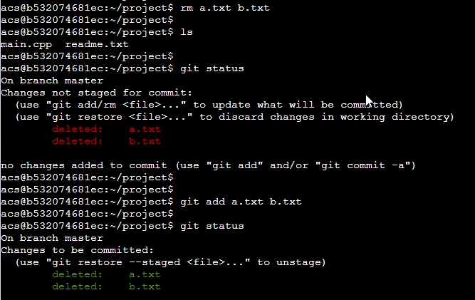
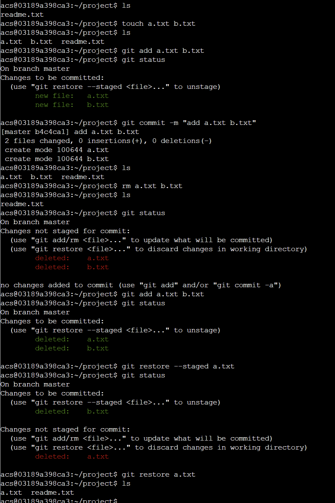
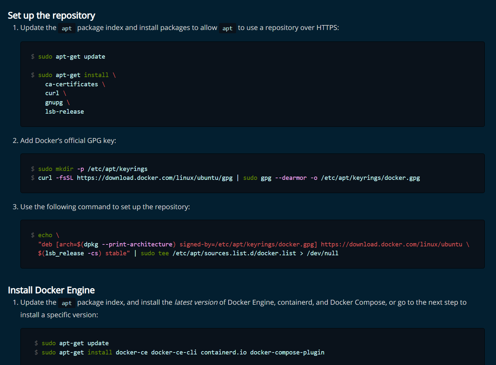

#

# 常用命令

- `D: & cd D:\repository & docsify serve`
- `pip install -i https://pypi.tuna.tsinghua.edu.cn/simple XXX`
- `pip install -i https://pypi.tuna.tsinghua.edu.cn/simple -r requirements.txt`

# 深度学习配置

## conda

### conda更新

```python
> conda update -n base -c efaults conda
```

### 虚拟环境

#### 激活与退出

```python
> conda activate env_name
> conda deactivate 
```

#### 新建env_name

```python
> conda create -n env_name python=3.10(版本号)
```

#### 删除env_name

```
> conda env remove --name env_name
```

#### 列出所有虚拟环境

```python
> conda env list
```


### 设置国内镜像

conda默认使用的国外镜像源速度相对较慢，使用清华的Anaconda仓库镜像，执行下面的命令。

```python
# 添加清华Anaconda镜像
conda config --add channels https://mirrors.tuna.tsinghua.edu.cn/anaconda/pkgs/free/
# 显示通道地址
conda config --set show_channel_urls yes
```

命令执行完后，会生成~/.condarc(Linux/Mac)或C:\Users\USER_NAME.condarc文件，文件内容如下：

```python
channels:
  - https://mirrors.tuna.tsinghua.edu.cn/anaconda/pkgs/free/
  - defaults
show_channel_urls: true
```

若未成功生成该配置文件，也可手动创建、添加上面内容保存即可，具体可参见[Sample .condarc file](http://link.zhihu.com/?target=https%3A//conda.io/docs/user-guide/configuration/sample-condarc.html)。
此时，我们搜索包（conda seach PIL），可以看见已经能使用清华Anaconda镜像源了。

## Pytorch

- [安装网址](https://pytorch.org/get-started/locally/)


## Jupyter Notebook

### 打开

```python
$ The address you want to open > jupyter notebook
```

### 快捷键

- `Enter` 从命令模式进入编辑模式
- `Esc` 从编辑模式退回到命令模式
- `m` 将代码单元格转换为Markdown单元格
- `y` 将Markdown单元格转换为代码单元格
- `shift`+`Enter` 运行本单元格，选择下面的代码块
- `ctrl`+`Enter` 运行本单元格
- `alt`+`Enter` 运行本单元格，在下方新建一个单元格
- `a` 在上方新建一个单元格（above）
- `b` 在下方新建一个单元格（below）
- `d` 删除选中的单元格（delete）
- `x` 剪切本单元格
- `c` 复制本单元格
- `shift`+ `v` 粘贴到上面
- `v` 粘贴到下面
- `l` 命令行模式下，按`l`显示代码行号


# Windows 11

## Alt + S 、Win + S/Q

> 全局快速搜索

## Win + Shift + S

> 专业截图（窗口截图、区域截图）

## Win + R

> 运行

## Win + Z

> 打开窗口布局

## Win + Tab

> 切换窗口、切换桌面

## Win + A

> 打开右下角设置面板 　

## Win + N

> 快速打开日历

## Win + M

> 窗口最小化（不可逆）

## Win + D

> 快速显示桌面，快速回到原界面

## Win + E

> 打开文件资源管理器（快速访问）

## Win + I

> 打开设置（系统）

## Win + L

> 快速锁屏

## Win + V

> 打开剪切板

# Windows Shell

## 基础


- 文件夹名称不区分大小写，因此`cd ./cat`和`cd ./Cat`是一样的效果

## help command     |    command /?   

-  查看某个command的用法

## cd

- change directory的缩写，进入指定目录。

- 不能通过cd命令切换到其它盘符的根目录下

  ```shell
  c:\Users>cd d:\test
  c:\Users>     // 切换失败
  c:\Users>d:   // 需要冒号，不需要加cd，不要加反斜扛 
  d:\>
  ```

- 因此，想要切换到其他盘的子目录下，要先切换到其它盘的根目录下，再使用 `cd` 命令切换到子目录。

## dir

- directory的缩写，**列出当前目录下的文件以及文件夹**，命令语句如下：

  ```
  C:\Users\bullorwolf\go>dir
   驱动器 C 中的卷是 System
   卷的序列号是 C64E-8F19
  
   C:\Users\bullorwolf\go 的目录
  
  2022/06/08  15:33    <DIR>          .
  2022/08/08  12:01    <DIR>          ..
  2022/07/07  19:39    <DIR>          bin
  2022/06/08  15:32    <DIR>          pkg
                 0 个文件              0 字节
                 4 个目录 168,152,719,360 可用字节
  ```

## md / mkdir

- make directory的缩写，创建目录，命令语句如下：

  ```
  d:\>md test // 创建文件夹test
  
  d:\>mkdir a/b/c   //递归创建d:a\b\c
  ```

## rd

- remove directory的缩写，删除目录，命令语句如下：

  ```
  d:\>rd test // 删除目录test
  ```

- 删除目录树

  ```
  d:\>rd /S test
  /S      除目录本身外，还将删除指定目录下的所有子目录和
             文件。用于删除目录树。
  /Q      安静模式，带 /S 删除目录树时不要求确认
  ```

## type

- 显示文本文件内容

  ```
  d:\>type c:\11.txt   // 显示c盘中11.txt的文本内容
  
  d:\>type conf.ini   // 显示当前目录下conf.ini的文本内容
  
  d:\>type c:\11.txt | more   // 分页显示c盘中11.txt的文本内容
  ```

## more

- 逐屏的显示文本文件内容

  ```
  d:\>more conf.ini   // 逐屏的显示当前目录下conf.ini的文本内容 【空格：下一屏 q：退出 】
  ```

## rename/ren

- 重命名文件

  ```
  d:\test>rename filef.txt old.txt // 把filef.txt改名成old.txt
  ```

## echo

- 查看信息，例如查看变量path的值，命令语句如下：

  ```
  d:\test>echo %path%
  C:\Windows\system32;C:\Windows;C:\Windows\System32\Wbem;C:\Windows\System32\WindowsPowerShell\v1.0\;C:\Windows\System32\OpenSSH\;C:\Users\Administrator\AppData\Local\Microsoft\WindowsApps; 
  
  ```

- 将字符串输出到文件中，命令语句如下：

  ```
  d:\test>echo love > old.txt  // 将字符串love写入到当前目录下的old.txt文件内，以覆盖的方式哦~
  
  d:\test>
  ```

  

# Linux

## 常用命令

### 基础命令

```bash
(1) ctrl c: 取消命令，并且换行
(2) ctrl u: 清空本行命令    
(3) tab键：可以补全命令和文件名，如果补全不了快速按两下tab键，可以显示备选选项
(4) ls: 列出当前目录下所有文件，蓝色的是文件夹，白色的是普通文件，绿色的是可执行文件
	ll：详细版ls，可查看执行权限
(5) pwd: 显示当前路径
(6) cd XXX: 进入XXX目录下, cd .. 返回上层目录
(7) cp XXX YYY: 将XXX文件复制成YYY，XXX和YYY可以是一个路径，比如../dir_c/a.txt，表示上层目录下的dir_c文件夹下的文件a.txt
(8) mkdir XXX: 创建目录XXX           
	mkdir -p a/b/c：递归创建多层文件夹a/b/c
(9) rm XXX: 删除普通文件;  rm XXX -r: 删除文件夹
(10) mv XXX YYY: 将XXX文件移动到YYY，和cp命令一样，XXX和YYY可以是一个路径；重命名也是用这个命令
(11) touch XXX: 创建一个文件
(12) cat XXX: 展示文件XXX中的内容
(13) 复制文本
     Ctrl + insert
(14) 粘贴文本
     Shift + insert
(15) 关闭进程：
     1. 使用【top】命令找到进程的PID
     2. 输入【kill -9 PID】即可关掉此进程
```

### 系统状况

1. `top`：查看所有进程的信息（Linux的任务管理器）
   - 打开后，输入`M`：按使用内存排序
   - 打开后，输入`P`：按使用CPU排序
   - 打开后，输入`q`：退出
2. `df -h`：查看硬盘使用情况
3. `free -h`：查看内存使用情况
4. `du -sh`：查看当前目录占用的硬盘空间
5. `ps aux`：查看所有进程
6. `kill -9 pid`：杀死编号为`pid`的进程
   - 传递某个具体的信号：`kill -s SIGTERM pid`
7. `netstat -nt`：查看所有网络连接
8. `w`：列出当前登陆的用户
9. `ping www.baidu.com`：检查是否连网

### 文件权限 

`chmod`：修改文件权限

- `chmod +x xxx`：给xxx添加可执行权限
- `chmod -x xxx`：去掉xxx的可执行权限
- `chmod 777 xxx`：将xxx的权限改成777
- `chmod 777 xxx -R`：递归修改整个文件夹的权限

### 文件检索

1. `find /path/to/directory/ -name '*.py'`：搜索某个文件路径下的所有*.py文件
2. `grep xxx`：从`stdin`中读入若干行数据，如果某行中包含`xxx`，则输出该行；否则忽略该行。ctrl+d结束
3. `wc`：统计行数、单词数、字节数
   既可以从`stdin`中直接读入内容；也可以在命令行参数中传入文件名列表；
   - `wc -l`：统计行数
   - `wc -w`：统计单词数
   - `wc -c`：统计字节数
4. `tree`：展示当前目录的文件结构
   - `tree /path/to/directory/`：展示某个目录的文件结构
   - `tree -a`：展示隐藏文件
5. `ag xxx`：搜索当前目录下的所有文件，检索`xxx`字符串
6. `cut`：分割一行内容
   - 从`stdin`中读入多行数据
   - `echo $PATH | cut -d ':' -f 3,5`：输出PATH用:分割后第3、5列数据
   - `echo $PATH | cut -d ':' -f 3-5`：输出PATH用:分割后第3-5列数据
   - `echo $PATH | cut -c 3,5`：输出PATH的第3、5个字符
   - `echo $PATH | cut -c 3-5`：输出PATH的第3-5个字符
7. `sort`：将每行内容按字典序排序
   
   - 可以从`stdin`中读取多行数据
   - 可以从命令行参数中读取文件名列表
8. `xargs`：将`stdin`中的数据用空格或回车分割成命令行参数
   
   - `find . -name '*.py' | xargs cat | wc -l`：统计当前目录下所有python文件的总行数
   
9. `whereis`：查看文件位置

   ```nginx
   root@bullorwolf:/usr/sbin# whereis nginx
   nginx: /usr/sbin/nginx /usr/lib/nginx /etc/nginx /usr/share/nginx /usr/share/man/man8/nginx.8.gz
   ```

   

### 查看文件内容

1. `more`：浏览文件内容
   - 回车：下一行
   - 空格：下一页
   - b：上一页
   - q：退出
2. `less`：与`more`类似，功能更全
   - 回车：下一行
   - y：上一行
   - Page Down：下一页
   - Page Up：上一页
   - q：退出
3. `head -3 xxx`：展示`xxx`的前3行内容
   - 同时支持从`stdin`读入内容
4. `tail -3 xxx`：展示`xxx`末尾3行内容
   - 同时支持从`stdin`读入内容

### 用户相关

- `history`：展示当前用户的历史操作。内容存放在`~/.bash_history`中

### 工具

1. `md5sum`：计算`md5`哈希值
   - 可以从`stdin`读入内容
   - 也可以在命令行参数中传入文件名列表；
2. `time command`：统计`command`命令的执行时间
3. `ipython3`：交互式`python3`环境。可以当做计算器，或者批量管理文件。
   - `! echo "Hello World`"：`!`表示执行`shell`脚本
4. `watch -n 0.1 command`：每0.1秒执行一次`command`命令
5. `tar`：压缩文件
   - `tar -zcvf xxx.tar.gz /path/to/file/*`：压缩
   - `tar -zxvf xxx.tar.gz`：解压缩
6. `diff xxx yyy`：查找文件`xxx`与`yyy`的不同点

### 安装软件

1. `sudo command`：以`root`身份执行`command`命令
2. `apt-get install xxx`：安装软件
3. `pip install xxx --user --upgrade`：安装python包


## tmux

```
功能：
    (1) 分屏。
    (2) 允许断开Terminal连接后，继续运行进程。
结构：
    一个tmux可以包含多个session，一个session可以包含多个window，一个window可以包含多个pane。
    实例：
        tmux:
            session 0:
                window 0:
                    pane 0
                    pane 1
                    pane 2
                    ...
                window 1
                window 2
                ...
            session 1
            session 2
            ...
操作：
    (1) tmux：新建一个session，其中包含一个window，window中包含一个
    (2) 按下Ctrl + a后手指松开，然后按%：将当前pane左右平分成两个pane。
    (3) 按下Ctrl + a后手指松开，然后按"：将当前pane上下平分成两个pane。
    (4) Ctrl + d：关闭当前pane；如果当前window的所有pane均已关闭，则自动关闭window；如果当前session的所有window均已关闭，则自动关闭session。
    (5) 鼠标点击可以选pane。
    (6) 按下ctrl + a后手指松开，然后按方向键：选择相邻的pane。
    (7) 鼠标拖动pane之间的分割线，可以调整分割线的位置。
    (8) 按住ctrl + a的同时按方向键，可以调整pane之间分割线的位置。
    (9) 按下ctrl + a后手指松开，然后按z：将当前pane全屏/取消全屏。
    (10) 按下ctrl + a后手指松开，然后按d：挂起当前session。
    (11) tmux a：打开之前挂起的session。
    (12) 按下ctrl + a后手指松开，然后按s：选择其它session。
        方向键 —— 上：选择上一项 session/window/pane
        方向键 —— 下：选择下一项 session/window/pane
        方向键 —— 右：展开当前项 session/window
        方向键 —— 左：闭合当前项 session/window
    (13) 按下Ctrl + a后手指松开，然后按c：在当前session中创建一个新的window。
    (14) 按下Ctrl + a后手指松开，然后按w：选择其他window，操作方法与(12)完全相同。
    (15) 按下Ctrl + a后手指松开，然后按PageUp：翻阅当前pane内的内容。
    (16) 鼠标滚轮：翻阅当前pane内的内容。
    (17) 在tmux中选中文本时，需要按住shift键。（仅支持Windows和Linux，不支持Mac，不过该操作并不是必须的，因此影响不大）
    (18) tmux中复制/粘贴文本的通用方式：
        (1) 按下Ctrl + a后松开手指，然后按[
        (2) 用鼠标选中文本，被选中的文本会被自动复制到tmux的剪贴板
        (3) 按下Ctrl + a后松开手指，然后按]，会将剪贴板中的内容粘贴到光标处
```

## vim

```
功能：
    (1) 命令行模式下的文本编辑器。
    (2) 根据文件扩展名自动判别编程语言。支持代码缩进、代码高亮等功能。
    (3) 使用方式：vim filename
        如果已有该文件，则打开它。
        如果没有该文件，则打开个一个新的文件，并命名为filename

模式：
    (1) 一般命令模式
        默认模式。命令输入方式：类似于打游戏放技能，按不同字符，即可进行不同操作。可以复制、粘贴、删除文本等。
    (2) 编辑模式
        在一般命令模式里按下i，会进入编辑模式。
        按下ESC会退出编辑模式，返回到一般命令模式。
    (3) 命令行模式
        在一般命令模式里按下:/?三个字母中的任意一个，会进入命令行模式。命令行在最下面。
        可以查找、替换、保存、退出、配置编辑器等。

操作：
    (1) i：进入编辑模式
    (2) ESC：进入一般命令模式
    (3) h 或 左箭头键：光标向左移动一个字符
    (4) j 或 向下箭头：光标向下移动一个字符
    (5) k 或 向上箭头：光标向上移动一个字符
    (6) l 或 向右箭头：光标向右移动一个字符
    (7) n<Space>：n表示数字，按下数字后再按空格，光标会向右移动这一行的n个字符
    (8) 0 或 功能键[Home]：光标移动到本行开头
    (9) $ 或 功能键[End]：光标移动到本行末尾
    (10) G：光标移动到最后一行
    (11) :n 或 nG：n为数字，光标移动到第n行
    (12) gg：光标移动到第一行，相当于1G
    (13) n<Enter>：n为数字，光标向下移动n行
    (14) /word：向光标之下寻找第一个值为word的字符串。
    (15) ?word：向光标之上寻找第一个值为word的字符串。
    (16) n：重复前一个查找操作
    (17) N：反向重复前一个查找操作
    (18) :n1,n2s/word1/word2/g：n1与n2为数字，在第n1行与n2行之间寻找word1这个字符串，并将该字符串替换为word2
    (19) :1,$s/word1/word2/g：将全文的word1替换为word2
    (20) :1,$s/word1/word2/gc：将全文的word1替换为word2，且在替换前要求用户确认。
    (21) v：选中文本
    (22) d：删除选中的文本
    (23) dd: 删除当前行
    (24) y：复制选中的文本
    (25) yy: 复制当前行
    (26) p: 将复制的数据在光标的下一行/下一个位置粘贴
    (27) u：撤销
    (28) Ctrl + r：取消撤销
    (29) 大于号 >：将选中的文本整体向右缩进一次
    (30) 小于号 <：将选中的文本整体向左缩进一次
    (31) :w 保存
    (32) :w! 强制保存
    (33) :q 退出
    (34) :q! 强制退出
    (35) :wq 保存并退出
    (36) :set paste 设置成粘贴模式，取消代码自动缩进
    (37) :set nopaste 取消粘贴模式，开启代码自动缩进
    (38) :set nu 显示行号
    (39) :set nonu 隐藏行号
    (40) gg=G：将全文代码格式化
    (41) :noh 关闭查找关键词高亮
    (42) Ctrl + q：当vim卡死时，可以取消当前正在执行的命令

异常处理：
    每次用vim编辑文件时，会自动创建一个.filename.swp的临时文件。
    如果打开某个文件时，该文件的swp文件已存在，则会报错。此时解决办法有两种： 
    (1) 找到正在打开该文件的程序，并退出
    (2) 直接删掉该swp文件即可

```

## nginx

### 启动

```shell
service nginx restart
```

### 关闭

```shell
nginx -s quit
```


## Shell

### 概述

shell是我们通过命令行与操作系统沟通的语言。

shell脚本可以直接在命令行中执行，也可以将一套逻辑组织成一个文件，方便复用。
AC Terminal中的命令行可以看成是一个“shell脚本在逐行执行”。

Linux中常见的shell脚本有很多种，常见的有：

- Bourne Shell(`/usr/bin/sh`或`/bin/sh`)
- Bourne Again Shell(`/bin/bash`)
- C Shell(`/usr/bin/csh`)
- K Shell(`/usr/bin/ksh`)
- zsh
- …

Linux系统中一般默认使用bash，所以接下来讲解bash中的语法。
文件开头需要写`#! /bin/bash`，指明bash为脚本解释器。

#### 学习技巧

不要死记硬背，遇到含糊不清的地方，可以在AC Terminal里实际运行一遍。

#### 脚本示例

新建一个test.sh文件，内容如下：

```bash
#! /bin/bash
echo "Hello World!"
```

#### 运行方式

- 作为可执行文件

```bash
acs@9e0ebfcd82d7:~$ chmod +x test.sh  # 使脚本具有可执行权限
acs@9e0ebfcd82d7:~$ ./test.sh  # 当前路径下执行
Hello World!  
acs@9e0ebfcd82d7:~$ /home/acs/test.sh  # 绝对路径下执行
Hello World!  
acs@9e0ebfcd82d7:~$ ~/test.sh  # 家目录路径下执行
Hello World!  
```

- 用解释器执行

```bash
acs@9e0ebfcd82d7:~$ bash test.sh
Hello World!  # 脚本输出
```

### 注释

#### 单行注释

每行中#之后的内容均是注释。

```bash
# 这是一行注释
echo 'Hello World'  #  这也是注释
```

#### 多行注释

格式：

```bash
:<<EOF
第一行注释
第二行注释
第三行注释
EOF
```

其中`EOF`可以换成其它任意字符串。例如：

```bash
:<<abc
第一行注释
第二行注释
第三行注释
abc

:<<!
第一行注释
第二行注释
第三行注释
!
```

### 变量

#### 定义变量

定义变量，不需要加`$`符号，例如：

```bash
name1='yxc'  # 单引号定义字符串
name2="yxc"  # 双引号定义字符串
name3=yxc    # 也可以不加引号，同样表示字符串
```

#### 使用变量

使用变量，需要加上`$`符号，或者`${}`符号。**花括号是可选的**，主要为了帮助解释器识别变量边界。

```bash
name=yxc
echo $name  # 输出yxc
echo ${name}  # 输出yxc
echo ${name}acwing  # 输出yxcacwing
#多个echo会自动换行
```

#### 只读变量

> 类似C++中的const

使用`readonly`或者`declare`可以将变量变为只读。

```bash
name=yxc

readonly name
declare -r name  # 两种写法均可

name=abc  # 会报错，因为此时name只读
```

#### 删除变量

`unset`可以删除变量。

```bash
name=yxc
unset name
echo $name  # 输出空行
```

#### 变量类型

1. 自定义变量（局部变量）
   子进程不能访问的变量
2. 环境变量（全局变量）
   子进程可以访问的变量

自定义变量改成环境变量：

```bash
acs@9e0ebfcd82d7:~$ name=yxc  # 定义变量
acs@9e0ebfcd82d7:~$ export name  # 第一种方法
acs@9e0ebfcd82d7:~$ declare -x name  # 第二种方法
```

环境变量改为自定义变量：

```bash
acs@9e0ebfcd82d7:~$ export name=yxc  # 定义环境变量
acs@9e0ebfcd82d7:~$ declare +x name  # 改为自定义变量
```

#### 字符串

字符串**可以用**单引号，**也可以用**双引号，**也可以不用**引号。

单引号与双引号的区别：

- 单引号中的内容会原样输出，不会执行、不会取变量；
- 双引号中的内容可以执行、可以取变量；

```bash
name=yxc  # 不用引号
echo 'hello, $name \"hh\"'  # 单引号字符串，输出 hello, $name \"hh\"
echo "hello, $name \"hh\""  # 双引号字符串，输出 hello, yxc "hh"
```

获取字符串长度

```bash
name="yxc"
echo ${#name}  # 输出3
```

提取子串

```bash
name="hello, yxc"
echo ${name:0:5}  # 提取从0开始的5个字符
```

### 默认变量

#### 文件参数变量

在执行shell脚本时，可以向脚本传递参数。`$1`是第一个参数，`$2`是第二个参数，以此类推。特殊的，`$0`是文件名（包含路径）。例如：

创建文件`test.sh`：

```bash
#! /bin/bash

echo "文件名："$0
echo "第一个参数："$1
echo "第二个参数："$2
echo "第三个参数："$3
echo "第四个参数："$4
```

然后执行该脚本：

```bash
acs@9e0ebfcd82d7:~$ chmod +x test.sh 
acs@9e0ebfcd82d7:~$ ./test.sh 1 2 3 4
文件名：./test.sh
第一个参数：1
第二个参数：2
第三个参数：3
第四个参数：4
```

#### 其它参数相关变量

| 参数         | 说明                                                         |
| ------------ | ------------------------------------------------------------ |
| `$#`         | 代表文件传入的参数个数，如上例中值为4                        |
| `$*`         | 由所有参数构成的用空格隔开的字符串，如上例中值为`"$1 $2 $3 $4"` |
| `$@`         | 每个参数分别用双引号括起来的字符串，如上例中值为`"$1" "$2" "$3" "$4"` |
| `$$`         | 脚本当前运行的进程ID                                         |
| `$?`         | 上一条命令的退出状态（注意不是stdout，而是exit code）。取值为0-255，0表示正常结束。其他值表示错误 |
| `$(command)` | 返回`command`这条命令的stdout（可嵌套）                      |
| `command`    | 返回`command`这条命令的stdout（不可嵌套）                    |

### 数组

数组中可以存放多个不同类型的值，只支持一维数组，初始化时不需要指明数组大小。
数组**下标从0开始**。

#### 定义

数组用小括号表示，元素之间用空格隔开。例如：

```bash
array=(1 abc "def" yxc)
```

也可以直接定义数组中某个元素的值：

```bash
array[0]=1 
array[1]=abc
array[2]="def"
array[3]=yxc
```

#### 读取数组中某个元素的值

格式：

```bash
${array[index]}
```

例如：

```bash
array=(1 abc "def" yxc)
echo ${array[0]}
echo ${array[1]}
echo ${array[2]}
echo ${array[3]}
```

#### 读取整个数组

格式：

```bash
${array[@]}  # 第一种写法
${array[*]}  # 第二种写法
```

例如：

```bash
array=(1 abc "def" yxc)

echo ${array[@]}  # 第一种写法
echo ${array[*]}  # 第二种写法
```

#### 数组长度

类似于字符串

```bash
${#array[@]}  # 第一种写法
${#array[*]}  # 第二种写法
```

例如：

```bash
array=(1 abc "def" yxc)

echo ${#array[@]}  # 第一种写法
echo ${#array[*]}  # 第二种写法
```

### expr命令

`expr`命令用于求表达式的值，格式为：

```bash
expr 表达式
```

表达式说明：

- 用空格隔开每一项
- 用反斜杠放在shell特定的字符前面（发现表达式运行错误时，可以试试转义）
- 对包含空格和其他特殊字符的字符串要用引号括起来
- expr会在`stdout`中输出结果。如果为逻辑关系表达式，则结果为真，`stdout`为1，否则为0。
- expr的`exit code`：如果为逻辑关系表达式，则结果为真，`exit code`为0，否则为1。

#### 字符串表达式

- `length STRING`

  返回`STRING`的长度

- `index STRING CHARSET`
  `CHARSET`中任意单个字符在`STRING`中最前面的字符位置，**下标从1开始**。如果在`STRING`中完全不存在`CHARSET`中的字符，则返回0。

- `substr STRING POSITION LENGTH`
  返回`STRING`字符串中从`POSITION`开始，长度最大为`LENGTH`的子串。如果`POSITION`或`LENGTH`为负数，0或非数值，则返回空字符串。

示例：

```bash
str="Hello World!"

echo `expr length "$str"`  # ``不是单引号，表示执行该命令，输出12
echo `expr index "$str" aWd`  # 输出7，下标从1开始
echo `expr substr "$str" 2 3`  # 输出 ell
```

#### 整数表达式

expr支持普通的算术操作，算术表达式优先级低于字符串表达式，高于逻辑关系表达式。

+ `+ -`
  加减运算。两端参数会转换为整数，如果转换失败则报错。

* `* / %`
  乘，除，取模运算。两端参数会转换为整数，如果转换失败则报错。

- `()` 可以该表优先级，但需要用反斜杠转义

示例：

```bash
a=3
b=4

echo `expr $a + $b`  # 输出7
echo `expr $a - $b`  # 输出-1
echo `expr $a \* $b`  # 输出12，*需要转义
echo `expr $a / $b`  # 输出0，整除
echo `expr $a % $b` # 输出3
echo `expr \( $a + 1 \) \* \( $b + 1 \)`  # 输出20，值为(a + 1) * (b + 1)
```

#### 逻辑关系表达式

- `|`
  如果第一个参数非空且非0，则返回第一个参数的值，否则返回第二个参数的值，但要求第二个参数的值也是非空或非0，否则返回0。如果第一个参数是非空或非0时，不会计算第二个参数。
- `&`
  如果两个参数都非空且非0，则返回第一个参数，否则返回0。如果第一个参为0或为空，则不会计算第二个参数。

- `< <= = == != >= >`
  比较两端的参数，如果为true，则返回1，否则返回0。”==”是”=”的同义词。”expr”首先尝试将两端参数转换为整数，并做算术比较，如果转换失败，则按字符集排序规则做字符比较。

- `()` 可以该表优先级，但需要用反斜杠转义
  示例：

```bash
a=3
b=4

echo `expr $a \> $b`  # 输出0，>需要转义
echo `expr $a '<' $b`  # 输出1，也可以将特殊字符用引号引起来
echo `expr $a '>=' $b`  # 输出0
echo `expr $a \<\= $b`  # 输出1

c=0
d=5

echo `expr $c \& $d`  # 输出0
echo `expr $a \& $b`  # 输出3
echo `expr $c \| $d`  # 输出5
echo `expr $a \| $b`  # 输出3
```

### read命令

`read`命令用于从标准输入中读取单行数据。当读到文件结束符时，`exit code`为1，否则为0。

参数说明

- `-p`: 后面可以接提示信息
  `-t`：后面跟秒数，定义输入字符的等待时间，超过等待时间后会自动忽略此命令

实例：

```bash
acs@9e0ebfcd82d7:~$ read name  # 读入name的值
acwing yxc  # 标准输入
acs@9e0ebfcd82d7:~$ echo $name  # 输出name的值
acwing yxc  #标准输出
acs@9e0ebfcd82d7:~$ read -p "Please input your name: " -t 30 name  # 读入name的值，等待时间30秒
Please input your name: acwing yxc  # 标准输入
acs@9e0ebfcd82d7:~$ echo $name  # 输出name的值
acwing yxc  # 标准输出
```

### echo命令

`echo`用于输出字符串。命令格式：

```bash
echo STRING
```

#### 显示普通字符串

```bash
echo "Hello AC Terminal"
echo Hello AC Terminal  # 引号可以省略
```

#### 显示转义字符

```bash
echo "\"Hello AC Terminal\""  # 注意只能使用双引号，如果使用单引号，则不转义
echo \"Hello AC Terminal\"  # 也可以省略双引号
```

#### 显示变量

```bash
name=yxc
echo "My name is $name"  # 输出 My name is yxc
```

#### 显示换行

```bash
echo -e "Hi\n"  # -e 开启转义 
echo "acwing"
```

输出结果：

```bash
Hi
acwing
```

#### 显示不换行

```bash
echo -e "Hi \c" # -e 开启转义 \c 不换行
echo "acwing"
```

输出结果：

```bash
Hi acwing
```

#### 显示结果定向至文件

```bash
echo "Hello World" > output.txt  # 将内容以覆盖的方式输出到output.txt中
```

#### 原样输出字符串，不进行转义或取变量(用单引号)

```bash
name=acwing
echo '$name\"'
```

输出结果

```bash
$name\"
```

#### 显示命令的执行结果

```bash
echo `date`
```

输出结果：

```bash
Wed Sep 1 11:45:33 CST 2021
```

### printf命令

`printf`命令用于格式化输出，类似于`C/C++`中的`printf`函数。

默认**不会在字符串末尾添加换行符**。

命令格式：

```bash
printf format-string [arguments...]
```

#### 用法示例

脚本内容：

```bash
printf "%10d.\n" 123  # 占10位，右对齐
printf "%-10.2f.\n" 123.123321  # 占10位，保留2位小数，左对齐
printf "My name is %s\n" "yxc"  # 格式化输出字符串
printf "%d * %d = %d\n"  2 3 `expr 2 \* 3` # 表达式的值作为参数
```

输出结果：

```bash
       123.
123.12    .
My name is yxc
2 * 3 = 6
```

### test命令与判断符号[]

#### 逻辑运算符&&和||

> 注意：`|`和`&`是expr命令自己定义的，`||`和`&&`是bash内嵌的，注意区别

- && 表示与，|| 表示或 

- 二者具有短路原则：

  `expr1 && expr2`：当`expr1`为假时，直接忽略`expr2`

  `expr1 || expr2`：当`expr1`为真时，直接忽略`expr2`
  表达式的`exit code`为0，表示真；为非零，表示假。（与C/C++中的定义相反）

#### test命令

在命令行中输入`man test`，可以查看`test`命令的用法。

`test`命令用于判断文件类型，以及对变量做比较。

`test`命令用`exit code`返回结果，而不是使用`stdout`。0表示真，非0表示假。（程序退出状态）

> 注意：expr用`stdout`返回结果，1表示真，0表示假

例如：

```bash
test 2 -lt 3  # 为真，返回值为0
echo $?  # 输出上个命令的返回值，输出0
```

```bash
acs@9e0ebfcd82d7:~$ ls  # 列出当前目录下的所有文件
homework  output.txt  test.sh  tmp
acs@9e0ebfcd82d7:~$ test -e test.sh && echo "exist" || echo "Not exist"
exist  # test.sh 文件存在
acs@9e0ebfcd82d7:~$ test -e test2.sh && echo "exist" || echo "Not exist"
Not exist  # testh2.sh 文件不存在
```

#### 文件类型判断

命令格式：

```bash
test -e filename  # 判断文件是否存在
```

| 测试参数 | 代表意义     |
| -------- | ------------ |
| -e       | 文件是否存在 |
| -f       | 是否为文件   |
| -d       | 是否为目录   |

#### 文件权限判断

命令格式：

```bash
test -r filename  # 判断文件是否可读
```

| 测试参数 | 代表意义       |
| -------- | -------------- |
| -r       | 文件是否可读   |
| -w       | 文件是否可写   |
| -x       | 文件是否可执行 |
| -s       | 是否为非空文件 |


#### 整数间的比较

命令格式：

```bash
test $a -eq $b  # a是否等于b
```

| 测试参数 | 代表意义       |
| -------- | -------------- |
| -eq      | a是否等于b     |
| -ne      | a是否不等于b   |
| -gt      | a是否大于b     |
| -lt      | a是否小于b     |
| -ge      | a是否大于等于b |
| -le      | a是否小于等于b |


#### 字符串比较

| 测试参数          | 代表意义                                               |
| ----------------- | ------------------------------------------------------ |
| test -z STRING    | 判断STRING是否为空，如果为空，则返回true               |
| test -n STRING    | 判断STRING是否非空，如果非空，则返回true（-n可以省略） |
| test str1 == str2 | 判断str1是否等于str2                                   |
| test str1 != str2 | 判断str1是否不等于str2                                 |

#### 多重条件判定

命令格式：

```bash
test -r filename -a -x filename
```

| 测试参数 | 代表意义                                            |
| -------- | --------------------------------------------------- |
| -a       | 两条件是否同时成立                                  |
| -o       | 两条件是否至少一个成立                              |
| !        | 取反。如 test ! -x file，当file不可执行时，返回true |

#### 判断符号[ ]

`[]`与`test`用法几乎一模一样，更常用于`if`语句中。另外`[[]]`是`[]`的加强版，支持的特性更多。

例如：

```bash
[ 2 -lt 3 ]  # 为真，返回值为0
echo $?  # 输出上个命令的返回值， 输出0
```

```bash
acs@9e0ebfcd82d7:~$ ls  # 列出当前目录下的所有文件
homework  output.txt  test.sh  tmp
acs@9e0ebfcd82d7:~$ [ -e test.sh ] && echo "exist" || echo "Not exist"
exist  # test.sh 文件存在
acs@9e0ebfcd82d7:~$ [ -e test2.sh ] && echo "exist" || echo "Not exist"
Not exist  # testh2.sh 文件不存在
```

注意：

- []内的每一项都要用空格隔开
- 中括号内的变量，最好用双引号括起来
- 中括号内的常数，最好用单或双引号括起来

例如：

```bash
name="acwing yxc"
[ $name == "acwing yxc" ]  # 错误，等价于 [ acwing yxc == "acwing yxc" ]，参数太多
[ "$name" == "acwing yxc" ]  # 正确
```

### 判断语句

#### if…then形式

类似于`C/C++`中的`if-else`语句。

#### 单层if

命令格式：

```bash
if condition
then
    语句1
    语句2
    ...
fi
```

示例：

```bash
a=3
b=4

if [ "$a" -lt "$b" ] && [ "$a" -gt 2 ]
then
    echo ${a}在范围内
fi
```

输出结果：

```bash
3在范围内
```

#### 单层if-else

命令格式

```bash
if condition
then
    语句1
    语句2
    ...
else
    语句1
    语句2
    ...
fi
```

示例：

```bash
a=3
b=4

if ! [ "$a" -lt "$b" ]
then
    echo ${a}不小于${b}
else
    echo ${a}小于${b}
fi
```

输出结果：

```bash
3小于4
```

#### 多层if-elif-elif-else

命令格式

```bash
if condition
then
    语句1
    语句2
    ...
elif condition
then
    语句1
    语句2
    ...
elif condition
then
    语句1
    语句2
else
    语句1
    语句2
    ...
fi
```

示例：

```bash
a=4

if [ $a -eq 1 ]
then
    echo ${a}等于1
elif [ $a -eq 2 ]
then
    echo ${a}等于2
elif [ $a -eq 3 ]
then
    echo ${a}等于3
else
    echo 其他
fi
```

输出结果：

```bash
其他
```

#### case…esac形式

类似于`C/C++`中的`switch`语句。

命令格式

```bash
case $变量名称 in
    值1)
        语句1
        语句2
        ...
        ;;  # 类似于C/C++中的break
    值2)
        语句1
        语句2
        ...
        ;;
    *)  # 类似于C/C++中的default
        语句1
        语句2
        ...
        ;;
esac
```

示例：

```bash
a=4

case $a in
    1)
        echo ${a}等于1
        ;;  
    2)
        echo ${a}等于2
        ;;  
    3)                                                
        echo ${a}等于3
        ;;  
    *)
        echo 其他
        ;;  
esac
```

输出结果：

```bash
其他
```

### 循环语句

#### for…in…do…done

命令格式：

```bash
for var in val1 val2 val3
do
    语句1 
    语句2
    ...
done
```

示例1，输出a 2 cc，每个元素一行：

```bash
for i in a 2 cc
do
    echo $i
done
```

示例2，输出当前路径下的所有文件名，每个文件名一行：

```bash
for file in `ls`
do
    echo $file
done
```

示例3，输出1-10

```bash
for i in $(seq 1 10)
do
    echo $i
done
```

> 注意：seq命令用于产生从某个数到另外一个数之间的所有整数，不支持字母，因此不可以`$(seq a z)`

示例4，使用{1..10} 或者 {a..z}

```bash
for i in {a..z}
do
    echo $i
done
```

#### for ((…;…;…)) do…done

命令格式：

```bash
for ((expression; condition; expression))
do
    语句1
    语句2
done
```

示例，输出1-10，每个数占一行：

```bash
for ((i=1; i<=10; i++))
do
    echo $i
done
```

#### while…do…done循环

命令格式：

```bash
while condition
do
    语句1
    语句2
    ...
done
```

示例，文件结束符为Ctrl+d，输入文件结束符后read指令返回false。

```bash
while read name
do
    echo $name
done
```

#### until…do…done循环

当条件为真时结束。

命令格式：

```bash
until condition
do
    语句1
    语句2
    ...
done
```

示例，当用户输入`yes`或者`YES`时结束，否则一直等待读入。

```bash
until [ "${word}" == "yes" ] || [ "${word}" == "YES" ]
do
    read -p "Please input yes/YES to stop this program: " word
done
#除了yes、YES和ctrl+c之外，其他都无法退出循环，ctrl+d也无法结束，因为他只是一个文件结束符EOF
```

#### break命令

跳出当前一层循环，注意与`C/C++`不同的是：`break`不能跳出`case`语句。

示例

```bash
while read name
do
    for ((i=1;i<=10;i++))
    do
        case $i in
            8)
                break
                ;;
            *)
                echo $i
                ;;
        esac
    done
done
```

该示例每读入非EOF的字符串，会输出一遍1-7。
该程序可以输入Ctrl+d文件结束符来结束，也可以直接用Ctrl+c杀掉该进程。

#### continue命令

跳出当前循环。

示例：

```bash
for ((i=1;i<=10;i++))
do
    if [ `expr $i % 2` -eq 0 ]
    then
        continue
    fi
    echo $i
done
```

该程序输出1-10中的所有奇数。

#### 死循环的处理方式

如果AC Terminal可以打开该程序，则输入`Ctrl+c`即可。

否则可以直接关闭进程：

1. 使用`top`命令找到进程的PID
2. 输入`kill -9 PID`即可关掉此进程

### 函数

`bash`中的函数类似于`C/C++`中的函数，但`return`的返回值与`C/C++`不同，返回的是`exit code`，取值为0-255，0表示正常结束。

如果想获取函数的输出结果，可以通过`echo`输出到`stdout`中，然后通过`$(function_name)`来获取`stdout`中的结果。

函数的`return`值可以通过`$?`来获取。

命令格式：

```bash
[function] func_name() {  # function关键字可以省略
    语句1
    语句2
    ...
}
```

不获取`return`值和`stdout`值
示例

```bash
func() {
    name=yxc
    echo "Hello $name"
}

func
```

输出结果：

```bash
Hello yxc
```

#### 获取 return值和stdout值

不写`return`时，默认`return 0`。

示例

```bash
func() {
    name=yxc
    echo "Hello $name"
	return 123
}
output=$(func)
ret=$?

echo "output = $output"
echo "return = $ret"
```

输出结果：

```bash
output = Hello yxc
return = 123
```

#### 函数的输入参数

在函数内，`$1`表示第一个输入参数，`$2`表示第二个输入参数，依此类推。

注意：函数内的`$0`仍然是文件名，而不是函数名。

示例：

```bash
func() {  # 递归计算 $1 + ($1 - 1) + ($1 - 2) + ... + 0
    word=""
    while [ "${word}" !=`` 'y' ] && [ "${word}" != 'n' ]
    do
        read -p "要进入func($1)函数吗？请输入y/n：" word
    done

if [ "$word" == 'n' ]
then
    echo 0
    return 0
fi  

if [ $1 -le 0 ] 
then
    echo 0
    return 0
fi  

sum=$(func $(expr $1 - 1))
echo $(expr $sum + $1)

}

echo $(func 10)
```

输出结果：

```bash
55
```

#### 函数内的局部变量

可以在函数内定义局部变量，作用范围仅在当前函数内。

可以在递归函数中定义局部变量。

命令格式：

```bash
local 变量名=变量值
```

例如：

```bash
#! /bin/bash

func() {
    local name=yxc
    echo $name
}
func

echo $name
```

输出结果：

```bash
yxc
```

第一行为函数内的name变量，第二行为函数外调用name变量，会发现此时该变量不存在。

### exit命令

`exit`命令用来退出当前`shell`进程，并返回一个退出状态；使用`$?`可以接收这个退出状态。

`exit`命令可以接受一个整数值作为参数，代表退出状态。如果不指定，默认状态值是 0。

`exit`退出状态只能是一个介于 0~255 之间的整数，其中只有 0 表示成功，其它值都表示失败。

示例：

创建脚本`test.sh`，内容如下：

```bash
#! /bin/bash

if [ $# -ne 1 ]  # 如果传入参数个数等于1，则正常退出；否则非正常退出。
then
    echo "arguments not valid"
    exit 1
else
    echo "arguments valid"
    exit 0
fi
```

执行该脚本：

```bash
acs@9e0ebfcd82d7:~$ chmod +x test.sh 
acs@9e0ebfcd82d7:~$ ./test.sh acwing
arguments valid
acs@9e0ebfcd82d7:~$ echo $?  # 传入一个参数，则正常退出，exit code为0
0
acs@9e0ebfcd82d7:~$ ./test.sh 
arguments not valid
acs@9e0ebfcd82d7:~$ echo $?  # 传入参数个数不是1，则非正常退出，exit code为1
1
```

#### return和exit的区别

> return和exit的共同之处都是返回exit code，区别是return结束当前函数，exit结束整个shell脚本

### 文件重定向

每个进程默认打开3个文件描述符：

- stdin标准输入，从命令行读取数据，文件描述符为0
- stdout标准输出，向命令行输出数据，文件描述符为1
- stderr标准错误输出，向命令行输出数据，文件描述符为2

可以用文件重定向将这三个文件重定向到其他文件中。

#### 重定向命令列表

| 命令             | 说明                                  |
| ---------------- | ------------------------------------- |
| command > file   | 将stdout重定向到file中                |
| command < file   | 将stdin重定向到file中                 |
| command >> file  | 将stdout以追加方式重定向到file中      |
| command n> file  | 将文件描述符n重定向到file中           |
| command n>> file | 将文件描述符n以追加方式重定向到file中 |


#### 输入和输出重定向

```bash
echo -e "Hello \c" > output.txt  # 将stdout重定向到output.txt中
echo "World" >> output.txt  # 将字符串追加到output.txt中

read str < output.txt  # 从output.txt中读取字符串

echo $str  # 输出结果：Hello World
```

同时重定向stdin和stdout
创建bash脚本：

```bash
#! /bin/bash

read a
read b

echo $(expr "$a" + "$b")
```

创建input.txt，里面的内容为：

```bash
3
4
```

执行命令：

```bash
acs@9e0ebfcd82d7:~$ chmod +x test.sh  # 添加可执行权限
acs@9e0ebfcd82d7:~$ ./test.sh < input.txt > output.txt  # 从input.txt中读取内容，将输出写入output.txt中
acs@9e0ebfcd82d7:~$ cat output.txt  # 查看output.txt中的内容
7
```

#### 其他

> 1.ls -l >文件 （列表的内容写入文件a.txt中 覆盖写）
>
> 2.ls -al >>文件 （列表的内容文件追加到文件aa.txt的末尾）
>
> 3.cat 文件1 >文件2 （将文件1的内容覆盖到文件2）
>
> 4.echo “内容” >>文件 (将echo的内容追加到文件末尾)
>
> ---
>
> 权限这一块，ls -l
> 第一个符号代表文件类型，d是文件夹，l是连接文件，-是普通文件，后面的是权限，r是读取，w是写入，x是执行，3个为1段，第一段代表的是建立这个文件的用户权限，第二段为建立这个文件的用户所属组的权限，第三段为其他用户的权限，哪像为空，则没有这个权限.

### 引入外部脚本

类似于`C/C++`中的`include`操作，`bash`也可以引入其他文件中的代码。

语法格式：

```bash
. filename  # 注意点和文件名之间有一个空格

或

source filename
```

示例
创建`test1.sh`，内容为：

```bash
#! /bin/bash

name=yxc  # 定义变量name
```

然后创建`test2.sh`，内容为：

```bash
#! /bin/bash

source test1.sh # 或 . test1.sh

echo My name is: $name  # 可以使用test1.sh中的变量
```

执行命令：

```bash
acs@9e0ebfcd82d7:~$ chmod +x test2.sh 
acs@9e0ebfcd82d7:~$ ./test2.sh 
My name is: yxc
```

## SSH

### SSH登录

#### 基本用法

远程登录服务器：

```bash
ssh user@hostname
```

- user: 用户名

- hostname: IP地址或域名

第一次登录时会提示：

```bash
The authenticity of host '123.57.47.211 (123.57.47.211)' can't be established.
ECDSA key fingerprint is SHA256:iy237yysfCe013/l+kpDGfEG9xxHxm0dnxnAbJTPpG8.
Are you sure you want to continue connecting (yes/no/[fingerprint])?
```

输入`yes`，然后回车即可。
这样会将该服务器的信息记录在`~/.ssh/known_hosts`文件中。

然后输入密码即可登录到远程服务器中。

默认登录端口号为22。如果想登录某一特定端口：

```bash
ssh user@hostname -p 22
```

#### 配置文件

创建文件 `~/.ssh/config`。

然后在文件中输入：

```
Host myserver1
    HostName IP地址或域名
    User 用户名

Host myserver2
    HostName IP地址或域名
    User 用户名
```

之后再使用服务器时，可以直接使用别名`myserver1`、`myserver2`。

#### 密钥登录

创建密钥：

```bash
ssh-keygen
```

然后一直回车即可。

执行结束后，`~/.ssh/`目录下会多两个文件：

- id_rsa：私钥
- id_rsa.pub：公钥

---

之后想免密码登录哪个服务器，就将公钥传给哪个服务器即可。

例如，想免密登录`myserver`服务器。则将公钥中的内容，复制到`myserver`中的`~/.ssh/authorized_keys`文件里即可。

也可以使用如下命令一键添加公钥：

```
ssh-copy-id myserver
```

#### 执行命令

命令格式：

```bash
ssh user@hostname command
```

例如：

```bash
ssh user@hostname ls -a
```

或者

```bash
# 单引号中的$i可以求值

ssh myserver 'for ((i = 0; i < 10; i ++ )) do echo $i; done'
```

或者

```bash
# 双引号中的$i不可以求值

ssh myserver "for ((i = 0; i < 10; i ++ )) do echo $i; done"
```

### scp传文件

#### 基本用法

命令格式：

```
scp source destination
```

将`source`路径下的文件复制到`destination`中

一次复制多个文件：

```
scp source1 source2 destination
```

复制文件夹：

```bash
scp -r ~/tmp myserver:/home/acs/
```

将本地家目录中的`tmp`文件夹复制到`myserver`服务器中的`/home/acs/`目录下。

```bash
scp -r ~/tmp myserver:homework/
```

将本地家目录中的`tmp`文件夹复制到`myserver`服务器中的`~/homework/`目录下。

```bash
scp -r myserver:homework .
```

将`myserver`服务器中的`~/homework/`文件夹复制到本地的当前路径下。

指定服务器的端口号：

```bash
scp -P 22 source1 source2 destination
```

注意： `scp`的`-r -P`等参数尽量加在`source`和`destination`之前。

#### 使用scp配置其他服务器的vim和tmux

```
scp ~/.vimrc ~/.tmux.conf myserver:
```


## Git常用命令

### 仓库

```bash
# 在当前目录新建一个Git代码库
$ git init

# 新建一个目录，将其初始化为Git代码库
$ git init [project-name]

# 下载一个项目和它的整个代码历史
$ git clone [url]
```

### 配置

```bash
# 显示当前的Git配置
$ git config --list

# 编辑Git配置文件
$ git config -e [--global]

# 设置提交代码时的用户信息
$ git config [--global] user.name "[name]"
$ git config [--global] user.email "[email address]"
```

### 增加/删除文件

```bash
# 添加指定文件到暂存区
$ git add [file1] [file2] ...

# 添加指定目录到暂存区，包括子目录
$ git add [dir]

# 添加当前目录的所有文件到暂存区
$ git add .

# 添加每个变化前，都会要求确认
# 对于同一个文件的多处变化，可以实现分次提交
$ git add -p

# 删除工作区文件，并且将这次删除放入暂存区
$ git rm [file1] [file2] ...

# 停止追踪指定文件，但该文件会保留在工作区
$ git rm --cached [file]

# 改名文件，并且将这个改名放入暂存区
$ git mv [file-original] [file-renamed]
```

- 注意：git add不仅用于添加文件，删除文件也是这个命令。这里的add只是【添加操作】，不是【普通增加】



### 代码提交

```bash
# 提交暂存区到仓库区
$ git commit -m [message]

# 提交暂存区的指定文件到仓库区
$ git commit [file1] [file2] ... -m [message]

# 提交工作区自上次commit之后的变化，直接到仓库区
$ git commit -a

# 提交时显示所有diff信息
$ git commit -v

# 使用一次新的commit，替代上一次提交
# 如果代码没有任何新变化，则用来改写上一次commit的提交信息
$ git commit --amend -m [message]

# 重做上一次commit，并包括指定文件的新变化
$ git commit --amend [file1] [file2] ...
```

### 分支

```bash
# 列出所有本地分支
$ git branch

# 列出所有远程分支
$ git branch -r

# 列出所有本地分支和远程分支
$ git branch -a

# 新建一个分支，但依然停留在当前分支
$ git branch [branch-name]

# 新建一个分支，并切换到该分支
$ git checkout -b [branch]

# 新建一个分支，指向指定commit
$ git branch [branch] [commit]

# 新建一个分支，与指定的远程分支建立追踪关系
$ git branch --track [branch] [remote-branch]

# 切换到指定分支，并更新工作区
$ git checkout [branch-name]

# 切换到上一个分支
$ git checkout -

# 建立追踪关系，在现有分支与指定的远程分支之间
$ git branch --set-upstream [branch] [remote-branch]

# 合并指定分支到当前分支
$ git merge [branch]

# 选择一个commit，合并进当前分支
$ git cherry-pick [commit]

# 删除分支
$ git branch -d [branch-name]

# 删除远程分支
$ git push origin --delete [branch-name]
$ git branch -dr [remote/branch]
```

### 标签

```bash
# 列出所有tag
$ git tag

# 新建一个tag在当前commit
$ git tag [tag]

# 新建一个tag在指定commit
$ git tag [tag] [commit]

# 删除本地tag
$ git tag -d [tag]

# 删除远程tag
$ git push origin :refs/tags/[tagName]

# 查看tag信息
$ git show [tag]

# 提交指定tag
$ git push [remote] [tag]

# 提交所有tag
$ git push [remote] --tags

# 新建一个分支，指向某个tag
$ git checkout -b [branch] [tag]
```

### 查看信息

```bash
# 显示有变更的文件
$ git status

# 显示当前分支的版本历史
$ git log

# 显示当前分支的最近几次提交
$ git reflog

# 显示commit历史，以及每次commit发生变更的文件
$ git log --stat

# 搜索提交历史，根据关键词
$ git log -S [keyword]

# 显示某个commit之后的所有变动，每个commit占据一行
$ git log [tag] HEAD --pretty=format:%s

# 显示某个commit之后的所有变动，其"提交说明"必须符合搜索条件
$ git log [tag] HEAD --grep feature

# 显示某个文件的版本历史，包括文件改名
$ git log --follow [file]
$ git whatchanged [file]

# 显示指定文件相关的每一次diff
$ git log -p [file]

# 显示过去5次提交
$ git log -5 --pretty --oneline

# 显示所有提交过的用户，按提交次数排序
$ git shortlog -sn

# 显示指定文件是什么人在什么时间修改过
$ git blame [file]

# 显示暂存区和工作区的差异
$ git diff

# 显示暂存区和上一个commit的差异
$ git diff --cached [file]

# 显示工作区与当前分支最新commit之间的差异
$ git diff HEAD

# 显示两次提交之间的差异
$ git diff [first-branch]...[second-branch]

# 显示今天你写了多少行代码
$ git diff --shortstat "@{0 day ago}"

# 显示某次提交的元数据和内容变化
$ git show [commit]

# 显示某次提交发生变化的文件
$ git show --name-only [commit]

# 显示某次提交时，某个文件的内容
$ git show [commit]:[filename]
```

### 远程同步

```bash
# 下载远程仓库的所有变动
$ git fetch [remote]

# 显示所有远程仓库
$ git remote -v

# 显示某个远程仓库的信息
$ git remote show [remote]

# 增加一个新的远程仓库，并命名
$ git remote add [shortname] [url]

# 取回远程仓库的变化，并与本地分支合并
$ git pull [remote] [branch]

# 上传本地指定分支到远程仓库
$ git push [remote] [branch]

# 强行推送当前分支到远程仓库，即使有冲突
$ git push [remote] --force

# 推送所有分支到远程仓库
$ git push [remote] --all
```

### 撤销

```bash
# 恢复暂存区的指定文件到工作区
$ git checkout [file]

# 恢复某个commit的指定文件到暂存区和工作区
$ git checkout [commit] [file]

# 恢复暂存区的所有文件到工作区
$ git checkout .

# 重置暂存区的指定文件，与上一次commit保持一致，但工作区不变
$ git reset [file]

# 重置暂存区与工作区，与上一次commit保持一致
$ git reset --hard

# 重置当前分支的指针为指定commit，同时重置暂存区，但工作区不变
$ git reset [commit]

# 重置当前分支的HEAD为指定commit，同时重置暂存区和工作区，与指定commit一致
$ git reset --hard [commit]

# 重置当前HEAD为指定commit，但保持暂存区和工作区不变
$ git reset --keep [commit]

# 新建一个commit，用来撤销指定commit
# 后者的所有变化都将被前者抵消，并且应用到当前分支
$ git revert [commit]

暂时将未提交的变化移除，稍后再移入
$ git stash
$ git stash pop
```

### 其他

```bash
# 生成一个可供发布的压缩包
$ git archive
```

#### 回滚被删除的文件

> a.txt被删除了，可以使用git restore a.txt回滚恢复



## git_acwing


### git基本概念

- 工作区：仓库的目录。工作区是独立于各个分支的。
- 暂存区：数据暂时存放的区域，类似于工作区写入版本库前的缓存区。暂存区是独立于各个分支的。
- 版本库：存放所有已经提交到本地仓库的代码版本
- 版本结构：树结构，树中每个节点代表一个代码版本

### git常用命令

```bash
git config --global user.name xxx：设置全局用户名，信息记录在~/.gitconfig文件中
git config --global user.email xxx@xxx.com：设置全局邮箱地址，信息记录在~/.gitconfig文件中
git init：将当前目录配置成git仓库，信息记录在隐藏的.git文件夹中
git add XX：将XX文件添加到暂存区
git add .：将所有待加入暂存区的文件加入暂存区
git rm --cached XX：将文件从仓库索引目录中删掉
git commit -m "给自己看的备注信息"：将暂存区的内容提交到当前分支
git status：查看仓库状态
git diff XX：查看XX文件相对于暂存区修改了哪些内容
git log：查看当前分支的所有版本
git reflog：查看HEAD指针的移动历史（包括被回滚的版本）
git reset --hard HEAD^ 或 git reset --hard HEAD~：将代码库回滚到上一个版本
git reset --hard HEAD^^：往上回滚两次，以此类推
git reset --hard HEAD~100：往上回滚100个版本
git reset --hard 版本号：回滚到某一特定版本
git checkout — XX或git restore XX：将XX文件尚未加入暂存区的修改全部撤销
git remote add origin git@git.acwing.com:xxx/XXX.git：将本地仓库关联到远程仓库
git push -u (第一次需要-u以后不需要)：将当前分支推送到远程仓库
git push origin branch_name：将本地的某个分支推送到远程仓库
git clone git@git.acwing.com:xxx/XXX.git：将远程仓库XXX下载到当前目录下
git checkout -b branch_name：创建并切换到branch_name这个分支
git branch：查看所有分支和当前所处分支
git checkout branch_name：切换到branch_name这个分支
git merge branch_name：将分支branch_name合并到当前分支上
git branch -d branch_name：删除本地仓库的branch_name分支
git branch branch_name：创建新分支
git push --set-upstream origin branch_name：设置本地的branch_name分支对应远程仓库的branch_name分支
git push -d origin branch_name：删除远程仓库的branch_name分支
git pull：将远程仓库的当前分支与本地仓库的当前分支合并
git pull origin branch_name：将远程仓库的branch_name分支与本地仓库的当前分支合并
git branch --set-upstream-to=origin/branch_name1 branch_name2：将远程的branch_name1分支与本地的branch_name2分支对应
git checkout -t origin/branch_name 将远程的branch_name分支拉取到本地
git stash：将工作区和暂存区中尚未提交的修改存入栈中
git stash apply：将栈顶存储的修改恢复到当前分支，但不删除栈顶元素
git stash drop：删除栈顶存储的修改
git stash pop：将栈顶存储的修改恢复到当前分支，同时删除栈顶元素
git stash list：查看栈中所有元素
```

### 补充

- 不管是master分支还是dev分支，都共用一个暂存区，commit的时候，是看你当前所在分支，在哪个分支，就加到哪个分支的后面
- git merge branch_name之Fast-forward模式：直接修改引用，不产生复制。即将head结点指向branch_name

## 管道

### 概念

​	管道类似于文件重定向，可以将前一个命令的`stdout`重定向到下一个命令的`stdin`。

### 要点

1. 管道命令仅处理`stdout`，会忽略`stderr`。
2. 管道右边的命令必须能接受`stdin`。
3. 多个管道命令可以串联。

### 与文件重定向的区别

- 文件重定向左边为命令，右边为文件。
- 管道左右两边均为命令，左边有`stdout`，右边有`stdin`。

### 举例

统计当前目录下所有python文件的总行数，其中`find`、`xargs`、`wc`等命令可以参考常用命令这一节内容。

```shell
find . -name '*.py' | xargs cat | wc -l
```


## 环境变量

### 概念

Linux系统中会用很多环境变量来记录**配置信息**。
环境变量类似于全局变量，可以被各个进程访问到。我们可以通过修改环境变量来方便地修改系统配置。

### 查看

列出当前环境下的所有环境变量：

```shell
env  # 显示当前用户的变量
set  # 显示当前shell的变量，包括当前用户的变量;
export  # 显示当前导出成用户变量的shell变量
```

输出某个环境变量的值：

```shell
echo $PATH
```


### 修改

环境变量的定义、修改、删除操作可以参考上面【shell语法—变量】这一节的内容。

为了将对环境变量的修改应用到未来所有环境下，可以将修改命令放到`~/.bashrc`文件中。
修改完`~/.bashrc`文件后，记得执行`source ~/.bashrc`，来将修改应用到当前的`bash`环境下。

为何将修改命令放到`~/.bashrc`，就可以确保修改会影响未来所有的环境呢？

- 每次启动`bash`，都会先执行`~/.bashrc`。
- 每次`ssh`登陆远程服务器，都会启动一个`bash`命令行给我们。
- 每次`tmux`新开一个`pane`，都会启动一个`bash`命令行给我们。
- 所以未来所有新开的环境都会加载我们修改的内容。

### 常见环境变量

1. `HOME`：用户的家目录。

2. `PATH`：可执行文件（命令）的存储路径。路径与路径之间用:分隔。当某个可执行文件同时出现在多个路径中时，会选择从左到右数第一个路径中的执行。

   **下列所有存储路径的环境变量，均采用从左到右的优先顺序。**

3. `LD_LIBRARY_PATH`：用于指定动态链接库(.so文件)的路径，其内容是以冒号分隔的路径列表。

4. `C_INCLUDE_PATH`：C语言的头文件路径，内容是以冒号分隔的路径列表。

5. `CPLUS_INCLUDE_PATH`：CPP的头文件路径，内容是以冒号分隔的路径列表。

6. `PYTHONPATH`：Python导入包的路径，内容是以冒号分隔的路径列表。

7. `JAVA_HOME`：jdk的安装目录。

8. `CLASSPATH`：存放Java导入类的路径，内容是以冒号分隔的路径列表。

# 服务器配置


## AC Terminal相关配置

### 修改主机名

```
sudo hostnamectl set-hostname hwcloud  ← 要改的名字
```


### 创建工作用户kelin并赋予sudo权限

```C++
acterm>> ssh root@114.115.xxx.xxx  //登录到服务器
server>> adduser kelin  		//创建新用户kelin,输入密码,其他默认
server>> usermod -aG sudo kelin //赋予kelin sudo权限
server>> logout   //退出服务器
```

### 配置免密登录方式

```C++
acterm>> vim ~/.ssh/config
//在config中添加：
// Host myserver
//     HostName 114.115.xxx.xxx
//     User kelin
//保存退出
acterm>> ssh-copy-id myserver 	//输入kelin@114.115.xxx.xxx密码
acterm>> ssh myserver   	//即可免密登录
```


### 配置新服务器的工作环境

> 安装tmux和docker

#### tmux

- 登录自己的服务器，然后安装tmux：

```shell
acterm>> ssh myserver
server>> sudo apt-get update
server>> sudo apt-get install tmux
```

- 然后退回AC Terminal将tmux的配置传到新服务器上：

```shell
server>> scp .bashrc .vimrc .tmux.conf myserver:		#注意要加冒号
```

- 回到自己的服务器

```
acterm>> ssh myserver
server>> tmux    //就跟AC Terminal中的tmux一样了
```

- 然后在tmux中根据docker安装教程安装docker即可。

# 虚拟机

## 通用


- 切换用户

```
sudo su [用户名]
//exit退出当前用户，即回到root用户
```


## Ubuntu 22.04

### 查看系统信息

```bash
sudo lsb_release -a
```


### 换源

```bash
sudo sed -i "s@http://.*archive.ubuntu.com@https://mirrors.tuna.tsinghua.edu.cn@g" /etc/apt/sources.list
sudo sed -i "s@http://.*security.ubuntu.com@https://mirrors.tuna.tsinghua.edu.cn@g" /etc/apt/sources.list
```

### apt / apt-get

```bash
sudo apt update	     //更新软件
sudo apt upgrade	 //安装更新

sudo apt install <软件名>  //安装软件最简单的方式
sudo apt list               //查看所有已安装的软件列表
sudo apt search <软件名>       //搜索某个软件
sudo apt remove <软件名>       //删除某个软件包
sudo apt purge <软件名>        //删除某个软件包以及配置文件，更彻底
```


## CentOS 7.6

### 查看系统信息

```bash
sudo lsb_release -a
```

### 用户

- 新增用户

```bash
adduser [用户名]
```

- 修改用户密码(仅限root用户)

```bash
passwd [用户名]
```

### 换源

- 使用之前请确保已经安装wget，如未安装请执行下面一条命令来安装

  ```bash
  $ yum install -y  wget
  ```

- 备份原来的源

  ```bash
  $ sudo mv /etc/yum.repos.d/CentOS-Base.repo /etc/yum.repos.d/CentOS-Base.repo.bk
  ```

- 下载阿里源

  ```bash
  $ cd /etc/yum.repos.d
  $ sudo wget -nc http://mirrors.aliyun.com/repo/Centos-7.repo
  ```

- 更改阿里yum源为默认源

  ```bash
  $ sudo mv Centos-7.repo CentOS-Base.repo
  ```

- 更新本地yum缓存

  ```bash
  # 全部清除
  $ sudo yum clean all
  # 更新列表
  $ sudo yum list
  # 缓存yum包信息到本机，提高搜索速度
  $ sudo yum makecache
  ```

  


# Docker

## 安装

- [安装地址](https://docs.docker.com/engine/install/ubuntu/)



- 按照上述步骤直接安装即可

## 将当前用户添加到docker用户组

​	为了避免每次使用`docker`命令都需要加上`sudo`权限，可以将当前用户加入安装中自动创建的`docker`用户组(可以参考[官方文档](https://docs.docker.com/engine/install/linux-postinstall/))：

```shell
sudo usermod -aG docker $USER
```

执行完此操作后，需要退出服务器，再重新登录回来，才可以省去`sudo`权限。

## 镜像（images）

- `docker pull ubuntu:20.04`：拉取一个镜像
- `docker images`：列出本地所有镜像
- `docker image rm ubuntu:20.04 或 docker rmi ubuntu:20.04`：删除镜像ubuntu:20.04
- `docker [container] commit CONTAINER IMAGE_NAME:TAG`：创建某个container的镜像
- `docker save -o ubuntu_20_04.tar ubuntu:20.04`：将镜像ubuntu:20.04导出到本地文件ubuntu_20_04.tar中
- `docker load -i ubuntu_20_04.tar`：将镜像ubuntu:20.04从本地文件ubuntu_20_04.tar中加载出来

## 容器(container)

- `docker [container] create -it ubuntu:20.04`：利用镜像ubuntu:20.04创建一个容器。
- `docker ps -a`：查看本地的所有容器
- `docker [container] start CONTAINER`：启动容器
- `docker [container] stop CONTAINER`：停止容器
- `docker [container] restart CONTAINER`：重启容器
- `docker [contaienr] run -itd ubuntu:20.04`：创建并启动一个容器
- `docker [container] attach CONTAINER`：进入容器
  - 先按Ctrl-p，再按Ctrl-q可以挂起容器
- `docker [container] exec CONTAINER COMMAND`：在容器中执行命令
  - 前提：容器处于启动状态：`docker run CONTAINER`
- `docker [container] rm CONTAINER`：删除某个已停止的容器
- `docker container prune`：删除所有已停止的容器
- `docker export -o xxx.tar CONTAINER`：将容器CONTAINER导出到本地文件xxx.tar中
- `docker import xxx.tar image_name:tag`：将本地文件xxx.tar导入成镜像，并将镜像命名为image_name:tag
- `docker export/import`与`docker save/load`的区别：
  - `export/import`会丢弃历史记录和元数据信息，仅保存容器当时的快照状态
  - `save/load`会保存完整记录，体积更大
- `docker top CONTAINER`：查看某个容器内的所有进程
- `docker stats`：查看所有容器的统计信息，包括CPU、内存、存储、网络等信息
- `docker cp xxx CONTAINER:xxx` 或 `docker cp CONTAINER:xxx xxx`：在本地和容器间复制文件
  - 本地cp文件需要加-r，但在容器中复制不需要加-r
- `docker rename CONTAINER1 CONTAINER2`：重命名容器
- `docker update CONTAINER --memory 500MB`：修改容器限制


## 实战

进入AC Terminal，然后：

```shell
# 将镜像上传到自己租的云端服务器
scp /var/lib/acwing/docker/images/docker_lesson_1_0.tar server_name:  
# 登录自己的云端服务器
ssh server_name  

# 将镜像加载到本地
docker load -i docker_lesson_1_0.tar  
# 创建并运行docker_lesson:1.0镜像
docker run -p 20000:22 --name my_docker_server -itd docker_lesson:1.0  

# 进入创建的docker容器
docker attach my_docker_server  
# 设置root密码
passwd  
# 退出时，记得用ctrl +p，ctrl+q挂起，直接关闭会被拒绝访问
```

去云平台控制台中修改安全组配置，放行端口20000。

返回AC Terminal，即可通过ssh登录自己的docker容器：

```shell
ssh root@114.115.xxx.xxx -p 20000  # 将114.115.xxx.xxx替换成自己租的服务器的IP地址
```

然后，创建工作账户acs

```shell
adduser like  		//创建新用户like,输入密码,其他默认
usermod -aG sudo like //赋予like sudo权限
```

最后，配置docker容器的别名和免密登录

```C++
acterm>> vim ~/.ssh/config
//在config中添加：
// Host hwserver_docker
//     HostName 114.115.xxx.xxx
//     User like
//     Port 20000
//保存退出
acterm>> ssh-copy-id hwserver_docker 	//输入like@114.115.xxx.xxx密码
acterm>> ssh hwserver_docker   	//即可免密登录
```

## Others

如果apt-get下载软件速度较慢，可以参考清华大学开源软件镜像站中的内容，修改软件源。


