# 

## 入门建议

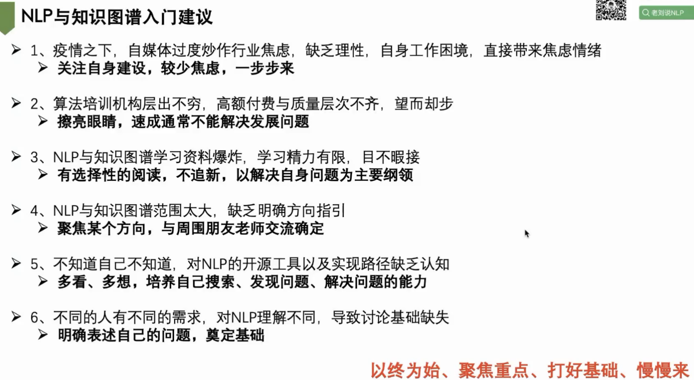

## 知识图谱

### 知识图谱是什么

> 基于二元关系的知识库，用以**描述现实世界中的实体或概念及其相互关系**，基本组成单位是【实体-关系-实体】 三元组（triplet），实体之间通过关系相互联结，构成网状结构。

#### 知识图谱的本质

> **知识的表示方法——用规范的术语和框架来进行领域知识刻画的方法**

#### 知识图谱三个核心

> （业务场景）
>
> 1. 本体【怎么建】
> 2. 结构化数据【怎么获取】
> 3. 图【怎么用】

#### 概念辨析

- 知识图谱不等于可视化，可视化只是知识图谱的一种展示方式
- 知识图谱和图数据库不是一个东西，用关系型数据库存，也是图谱
- 知识工程 + 大数据 = 广义知识图谱（大规模知识工程）
- 语义网络 + 大数据 = 狭义知识图谱（大规模语义网络 — 知识构建、表征、推理、应用）

### 知识图谱存储

- 知识图谱存储的核心不是存储，是怎么非结构化转结构化。

- 知识图谱不等于图数据库，Neo4j只是知识图谱的一种存储介质。Neo4j的优势在于拿图快，也就是图计算的输入数据获取的快。

- 知识的存储不必拘泥于什么数据库，而是看需求，没有图计算或多级跳需求，不必非要图数据库。

- 不要纠结是MySQL/MongoDB还是Neo4j，如果非要分出个啥，有个场景是除了Neo4j等图数据库都费劲才搞的定的，那就是——路径搜索：

  1. 指定两个实体，给我找出两个实体之间的最短路径，n跳路径
  2. 给定一个实体，给我1度、2度、3度、4度或者N度以内的路径

  如果你的场景不存在图搜索，就是k-v查询，那么直接MongoDB最好【数据模式很灵活，大json，想怎么存怎么存】，MySQL也行【大宽表，很规范】。总而言之：**按需分配**

## 自然语言处理与知识图谱

### 落地是第一要义

> 自然语言处理与知识图谱的发展是场持久战

[Gartner 2022年人工智能技术成熟度曲线](https://www.gartner.com/cn/newsroom/press-releases/2022-ai-hc)

- 知识图谱处于期望膨胀期
- 自然语言处理处于泡沫破裂低谷期 
- 距离生产成熟还需5-10年

- 认知智能是人工智能的高级阶段，是目前制约人工智能取得更大突破和更广泛应用的关键瓶颈。

### 从人工智能到自然语言处理

> 自然语言处理是研究如何利用计算机技术对语言文本(句子、篇章或话语等)进行处理和加工的一门学科，研究内容包括对词法、句法、语义和语用等信息的识别、分类、提取、转换和生成等各种处理方法和实现技术。——《计算机科学技术百科全书》(宗成庆)

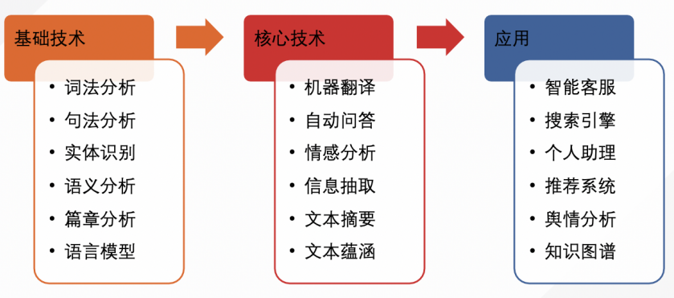

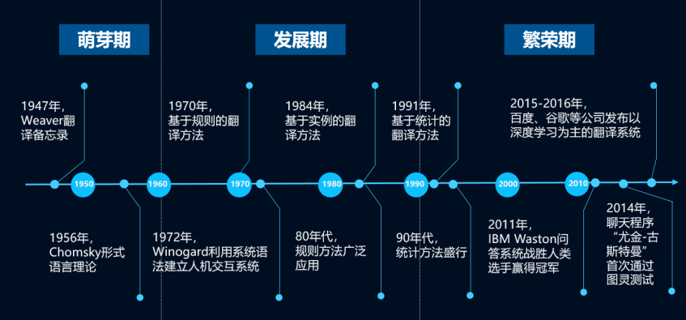

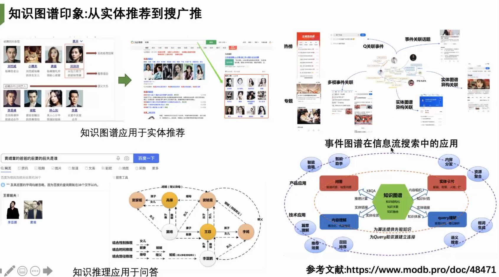

### 信息抽取

> 知识图谱是NLP的一个细分方向，知识图谱的全流程都会用到NLP相关技术，并不彼此割裂，**最紧密结合的是抽取任务**。

- 抽取任务
  - 本体层的抽取
    - 上下位概念抽取
  - 实例层的抽取
    - 实体抽取/实体关系抽取/实体属性抽取
    - 事件抽取/事件关系抽取
- 融合任务
  - 本体层的融合
  - 实例层的融合
- 推理任务
  - 本体层的推理
  - 实例层的推理

## 自然语言处理与知识图谱的可研方向

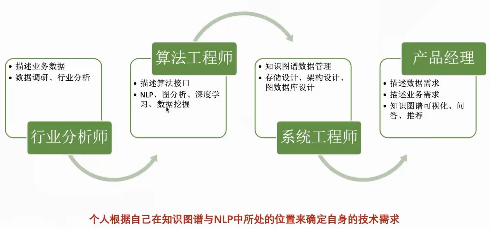

> 以下观点来源于《知识图谱导论》——陈华钧

### 多模态知识图谱

- 知识图谱是链接数据的概念，本来就应该是多模态的，现有很多商用知识图谱都已经通过知识图谱将各种模态的数据进行关联，并提高多模态的语义搜索能力。
- 多模态知识图谱可以发挥不同模态数据中所包含知识的互补性，相互增强，相互补充。一方面，我们可以利用多模态数据来进一步补全知识图谱，另外一方面，知识图谱也可以提升多模态任务的效率。
- 多模态知识图谱有很多值得深入研究的方向，例如：多模态关系预测与推理、多模态知识问答、多模态实体对齐与实体链接、多模态推荐计算等。
- 目前有关多模态知识图谱的研究，不管是经验方法还是图谱数据的构建,都还有很大的发展和创新空间。

### 知识图谱与语言预训练

- 知识对于语言的理解至关重要，在语言预训练模型大行其道的当下，将知识融入到语言预训练模型中是重要的技术发展方向。
- 将知识图谱融入到语言预训练模型中大致有三种方法，包括直接把图谱表示向量作为特征输入的ERNIE和KnowBERT等模型；通过设计新的预训练任务实现知识植入的KEPLER和WKLM等模型；通过增加额外的模块的K-ADAPTER等模型。
- 知识的植入未必总是有效的，实验表明知识植入对于那些低资源任务和低频的实体是有价值的，但因为外部知识的引入也可能带来噪音，因此也可能反而对语言模型带来模型损失。

### 事理知识图谱

- 事理图谱是一类以事理和事件为中心的知识图谱，侧重于刻画事件和事理之间因果、顺承、条件、互反等逻辑关系。
- 事理是知识图谱“动起来”的神经，知识图谱是事理运行的血肉载体，描述事理逻辑架构的事理知识图谱与刻画实体逻辑关系知识图谱可以相互补充，更好解决现实的问题。

### 知识图谱与低资源学习

> 小样本学习知识图谱

- 知识(图谱)的获取和构建，特别是常识类的知识获取绝大部分都是长尾问题，自动化知识获取的主要难点是在长尾知识，因此，低资源学习是知识图谱构建的不可或缺的技术手段。
- 知识图谱可用来建模语义空间，从而建立类别之间的关联关系，从而更好的帮助解决零样本预测等低资源问题
- 知识可以看作是质量更好、表示更规范的数据，或者是融入更多人的先验的数据。解决低资源问题应该充分发挥知识的作用

## 自然语言处理与知识图谱的必备基础

> 基础不牢，地动山摇

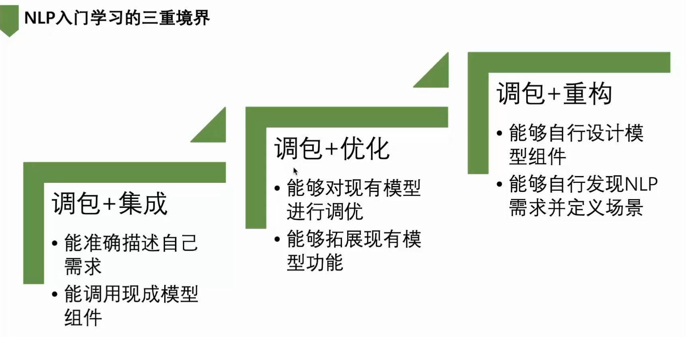

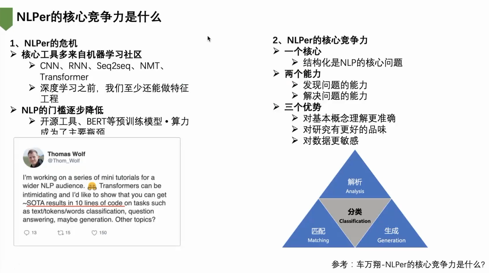

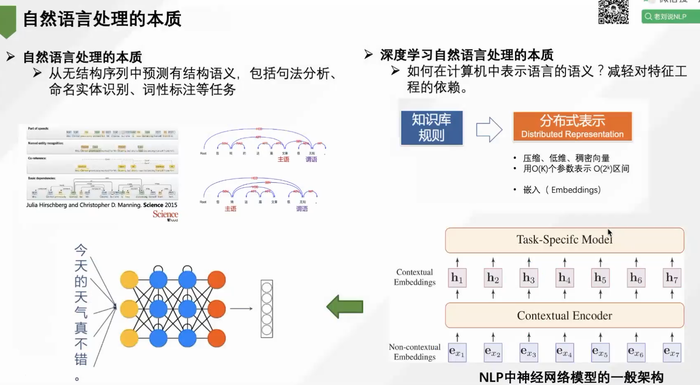

### NLP必备理论

#### 文本分词

#### 词性标注

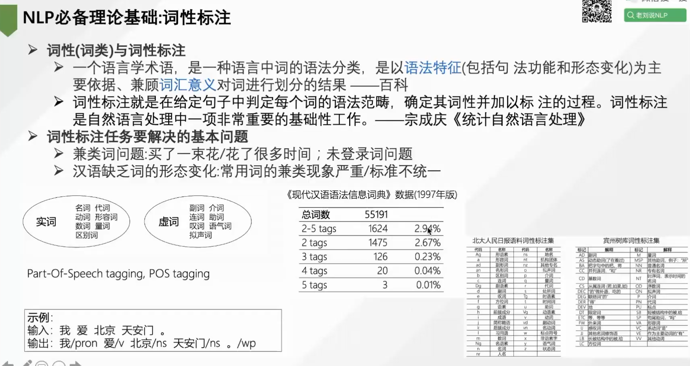

#### 句法分析

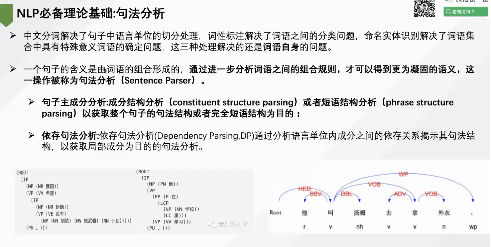

#### 语义角色标注

#### 统计语言模型

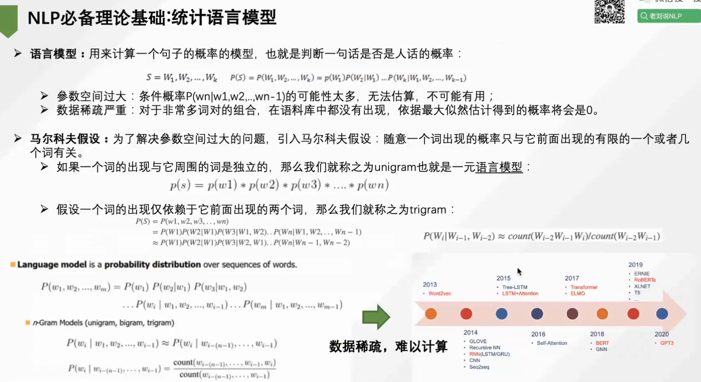

#### NNLM语言模型

#### ELMo动态词向量表示

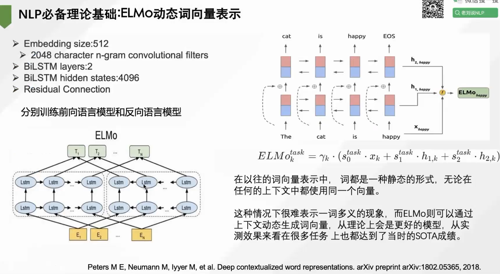

#### Transformer

#### BERT

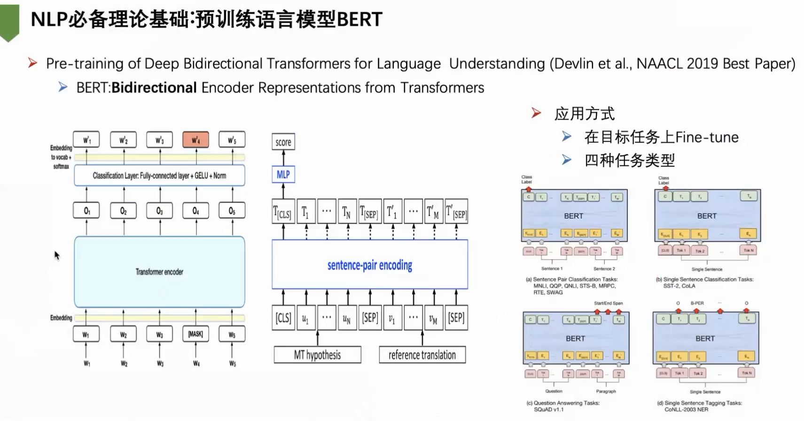

#### GBT

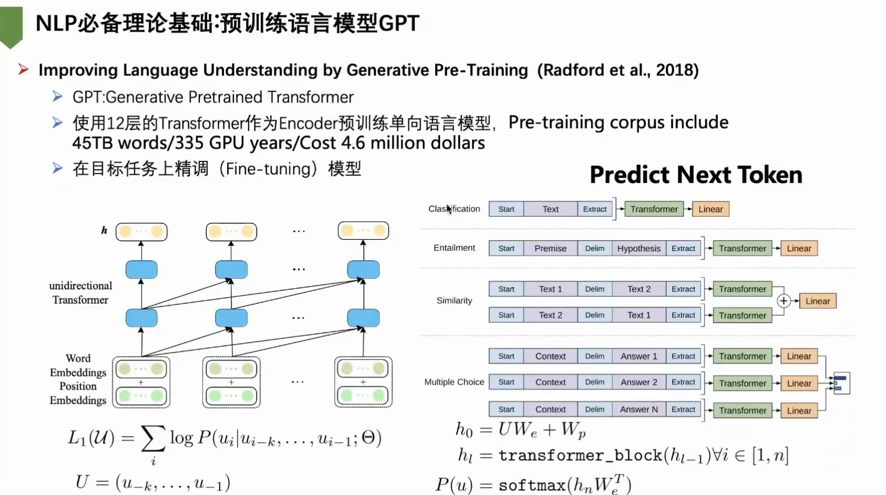

#### pretrain+finetune

> 预训练+微调

#### GPT

#### Prompt Tuning

> 提示学习（Prompt Learning）是一个NLP界最近兴起的学科，能够通过在输入中添加一个提示词（Prompt），使得预训练模型的性能大幅提高。Prompt Tuning和Fine Tuning都是对预训练模型进行微调的方法。

### NLP必备技能

#### Pytorch

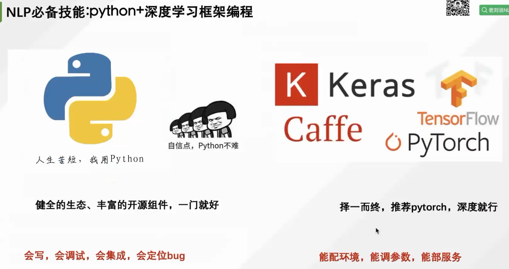

#### 正则表达式

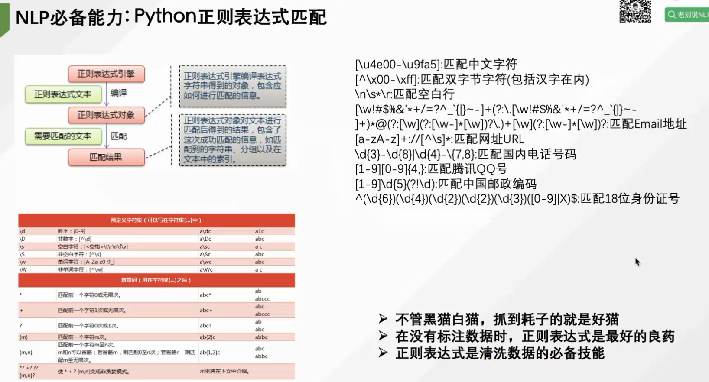

### KG必备理论

#### 实体识别

#### 实体关系抽取

#### 实体表示学习

#### 实体链接

#### 知识推理

#### 事件抽取

### KG必备技能

#### 非结构化信息抽取

#### 半结构化知识抽取

#### 图数据库（Neo4j等）

> [Neo4j](https://neo4j.com/)、[Py2neo](https://py2neo.org/2021.1/)

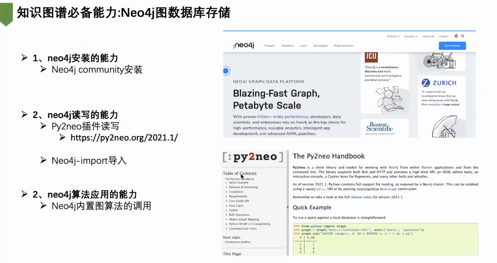

## 开放数据与模型

### NLP

#### 预训练词向量

> [腾讯中英文词向量](https://ai.tencent.com/ailab/nlp/en/embedding.html)
>
> [多类型(依存/拼音/词)中文向量](https://github.com/liuhuanyong/ChineseEmbedding)
>
> [多领域(微博/新闻/小说)中文向量](https://github.com/Embedding/Chinese-Word-Vectors)
>
> [多粒度(字/词)中文向量](https://github.com/SophonPlus/ChineseWordVectors)

#### 预训练语言模型

> [huggingface预训练语言模型](https://huggingface.co/models)
>
> [中文预训练语言模型](https://github.com/lonePatient/awesome-pretrained-chinese-nlp-models)

### KG

#### 开放数据库

> [Google Search](https://www.google.com/)、[Wikipedia](https://www.wikipedia.org/)、[DBpedia](https://www.dbpedia.org/)、[YAGO](https://yago-knowledge.org/)、[OpenKG](http://openkg.cn/)

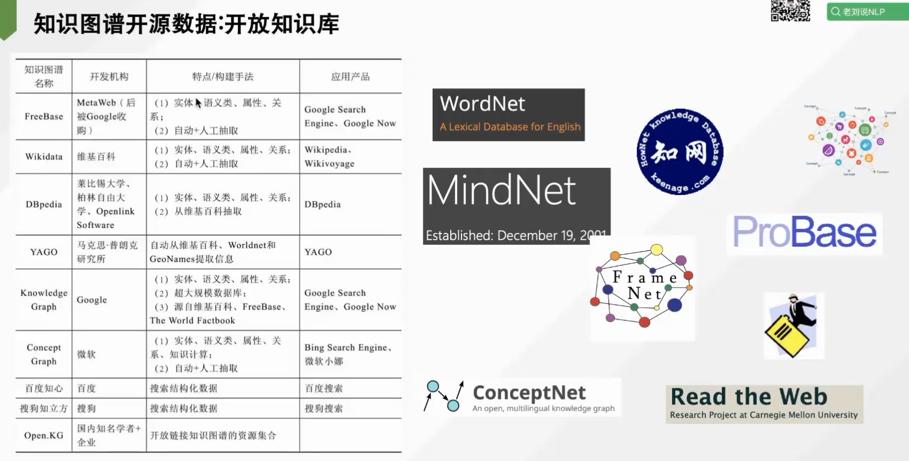

#### 开源图谱评测数据

> 太多了，需要啥自己输入吧...

#### Wordnet

> [WordNet](http://wordnet.princeton.edu/)

#### OpenHowNet

> [OpenHowNet](https://openhownet.thunlp.org/)

#### Cyc规则型知识库

> [Cyc](https://cyc.com/)

#### ConceptNet常识数据库

> [ConceptNet](http://www.conceptnet.io)

#### Freebase百科型知识库

> 2016年，谷歌宣布将Freebase的数据和API服务都迁移至Wikidata，正式关闭了Freebase

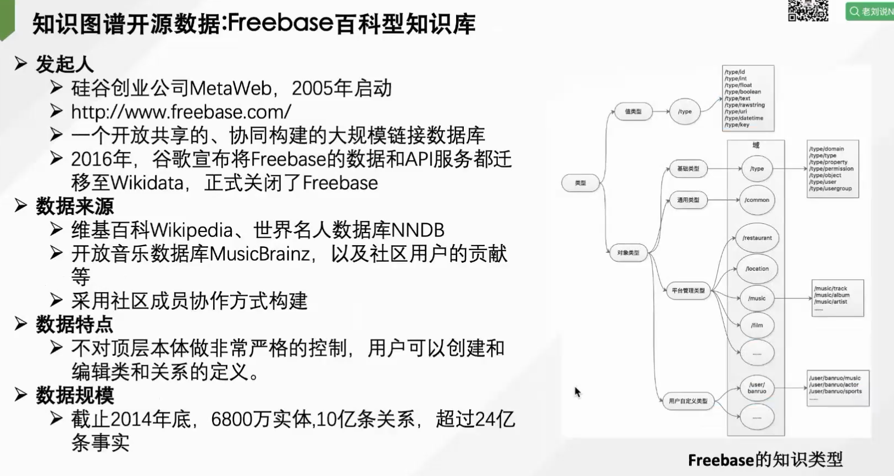

#### YAGO时空型知识库

> [YAGO](https://yago-knowledge.org/)

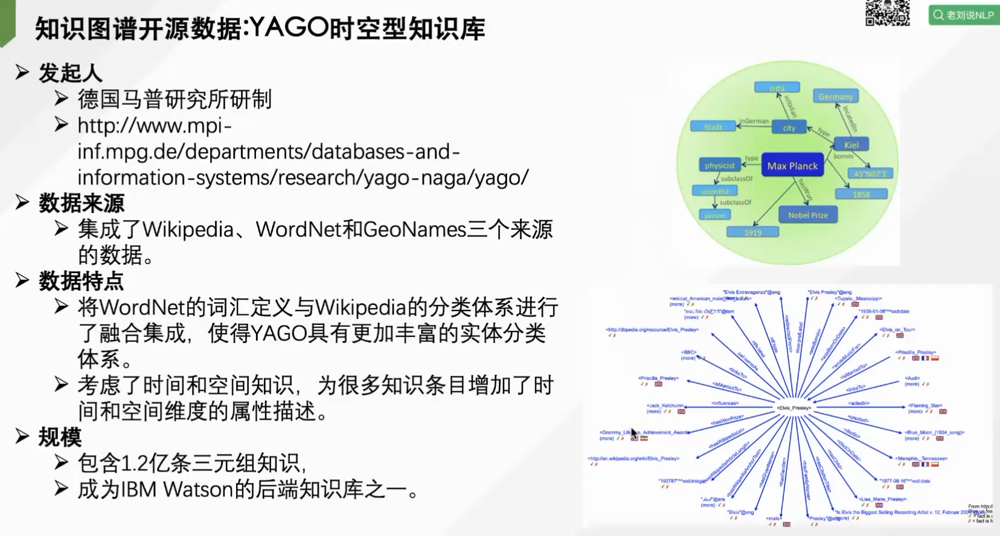

#### NELL学习型知识库

> [NELL](http://rtw.ml.cmu.edu/rtw)

#### 百科AI Studio数据集

> [飞桨AI Studio](https://aistudio.baidu.com/aistudio/datasetoverview/2)

#### OpenKG

> [OpenKG](http://openkg.cn/)

#### 相关学术数据平台

> [Google Scholar](https://scholar.google.com/)、[Semantic Scholar](https://www.semanticscholar.org/)、[Paper With Code](https://paperswithcode.com/)、[Research Gate](https://www.researchgate.net/)

## NLP与知识图谱的实践项目与开源工具

### NLP基础资源与开源工具

#### 模式匹配及加速工具

> [re](https://www.runoob.com/python/python-reg-expressions.html)、[regex](https://pypi.org/project/regex/)、[pyahocorasick](https://github.com/WojciechMula/pyahocorasick)、[Acora](https://www.cnpython.com/pypi/acora)、[esmre](https://pypi.org/project/esmre/)、[pampy](https://github.com/santinic/pampy)、[flashtext](https://flashtext.readthedocs.io/en/latest/)

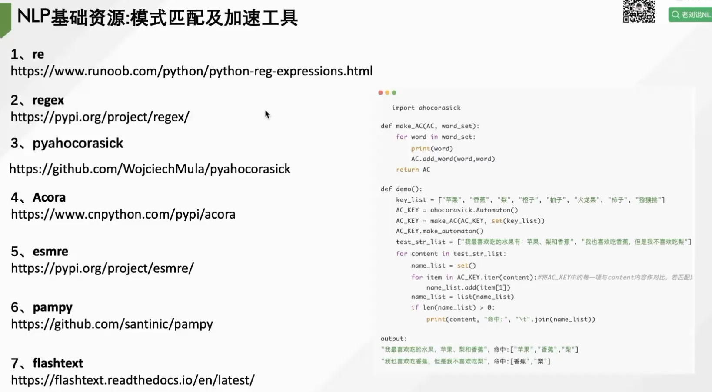

#### 文本向量化工具

> 延伸阅读：
>
> [NLP文本向量化必备：Gensim、Sklearn中的8种向量化工具概述与实践实操总结](https://mp.weixin.qq.com/s/Cg8q1Brt_1t0_WbKW7Co5Q)
>
> [NLP文本向量化必备：BERT句向量争议与transformers、sentence-transformers向量生成动手实操](https://mp.weixin.qq.com/s/fkgk8l_Vd4YDU_K6G54F4Q)

#### 腾讯Texsmart细粒度实体tag工具

> [TexSmart: 文本理解工具与服务](https://ai.tencent.com/ailab/nlp/texsmart/zh/index.html)

#### 百度解语框架细粒度实体tag工具

> [PaddleNLP-解语](https://www.paddlepaddle.org.cn/textToKnowledge)

### 知识图谱开源生态

> [CCF TF65：开源开放的知识图谱抽取与推理工具](https://dl.ccf.org.cn/video/videoDetail.html?_ack=1&id=6043538742249472)
>
> 建议去看完整版视频，有很多知识（需注册学生会员）

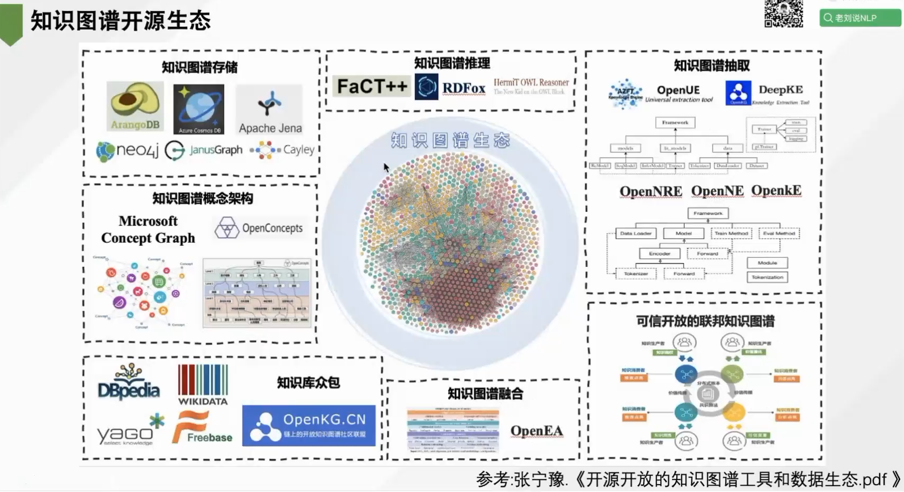

#### 开源项目

> [open-entity-relation-extraction](https://github.com/lemonhu/open-entity-relation-extraction)、[knowledge_ graph_ demo](https://github.com/percent4/knowledge_graph_demo)、[EventTriplesExtraction](https://github.com/liuhuanyong/EventTriplesExtraction)

> https://github.com/liuhuanyong/QASystemOnMedicalKG
>
> 

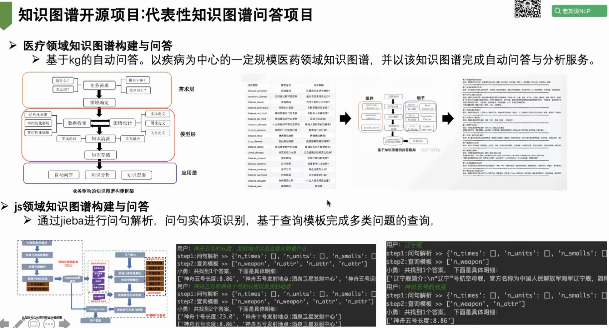

#### Openkg工具集

> [工具-开放知识图谱](http://openkg.cn/tool)

#### 知识本体构建工具

> [Protégé](https://protege.stanford.edu)、[NeOn Toolkit](http://neon-toolkit.org/wiki/Main_Page.html)、[Altova SemanticWorks](https://www.lesliesikos.com/)、[TopBraid Composer](http://www.topquadrant.com/)、[Xmind](https://xmind.cn/)

#### 文本处理工具

#### 数据采集工具Scrapy

> pip install scrapy

#### 数据采集工具curlconverter

> [采集代码自动生成](https://curlconverter.com/)

#### 网页解析工具lxml

> [Python解析库lxml与xpath用法总结](https://zhuanlan.zhihu.com/p/356791704)

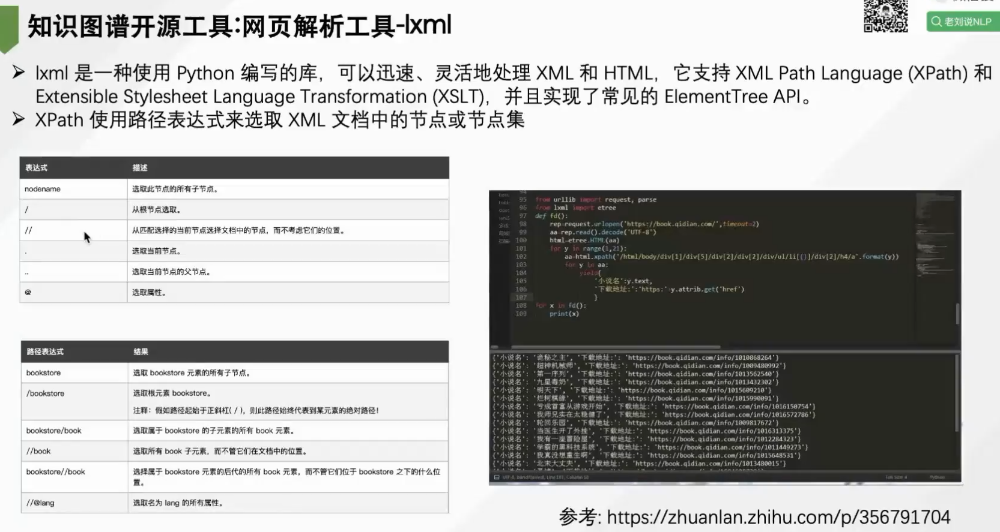

#### 开源分词/词性标注组件

> [jieba](https://github.com/fxsjy/jieba)、[thulac](https://github.com/thunlp/THULAC-Python)、[hanlp](https://github.com/hankcs/HanLP)、[ltp](https://github.com/HIT-SCIR/ltp)

#### 开源句法分析开源组件

> 就是上面的hanlp

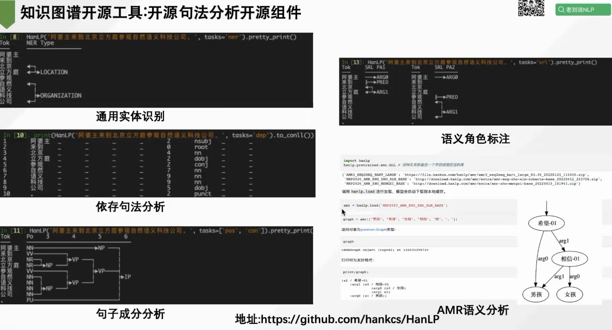

#### 知识标注开源工具

> [YEDDA/SUTDAnnotator](https://github.com/jiesutd/YEDDA)、[Chinese-Annotator](https://github.com/deepwel/Chinese-Annotator)、[Brat](https://github.com/nlplab/brat)、[doccano](https://github.com/doccano)、[Marktool](https://github.com/chosendai/MarkTool)、[label-studio](https://labelstud.io)

#### 知识抽取工具

> [DeepKE](https://github.com/zjunlp/deepke)、[OpenNRE](https://github.com/thunlp/OpenNRE)、[DeepDive](https://www.openkg.cn/dataset/cn-deepdive)、[OpenUE](https://github.com/zjunlp/OpenUE)、[OmniEvent](https://github.com/THU-KEG/OmniEvent)

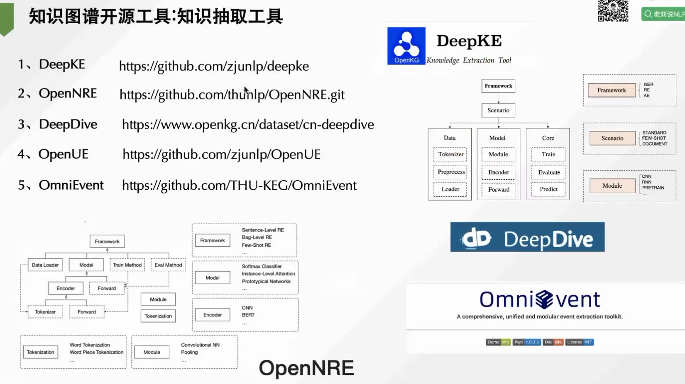

##### DeepKE

> [DeepKE](https://github.com/zjunlp/deepke)

##### OpenNRE

> [OpenNRE](https://github.com/thunlp/OpenNRE)

##### OmniEvent

> [OmniEvent](https://github.com/THU-KEG/OmniEvent)

#### 百度开源UIE抽取框架

> [起底NLP“大一统”模型：UIE统一信息抽取框架背后的技术本质、收益辨析及几点思考](https://mp.weixin.qq.com/s/aXHmjwZEOohwXSWwEqxXYw)

### 大规模存储工具

> [Neo4j图数据库](https://neo4j.com)、[HugeGraph](https://hugegraph.apache.org/)、[NebulaGraph](https://github.com/microsoft/SPTAG)

### 图算法计算工具

> [PyTorch Geometric (PyG)](https://github.com/pyg-team/pytorch_geometric)、[tf_ geometric](https://github.com/CrawlScript/tf_ geometric)、[Deep Graph Library (DGL)](https://github.com/dmlc/dgl)、[CogDL](https://github.com/THUDM/cogdl)、[GraphEmbedding](https://github.com/shenweichen/GraphEmbedding)、
> [Spark GraphX](http://spark.apache.org/graphx/)、[networkx](https://networkx.org)、[Plato](https://github.com/tencent/plato)

### 知识融合工具

> [Dedupe](https://github.com/dedupeio/dedupe)、<u>Falcon-Ao跑丢</u>、[LIMES](https://github.com/dice-group/LIMES)、[OpenEA](https://github.com/nju-websoft/OpenEA)、[PRASEMap](https://github.com/qizhyuan/PRASEMap)

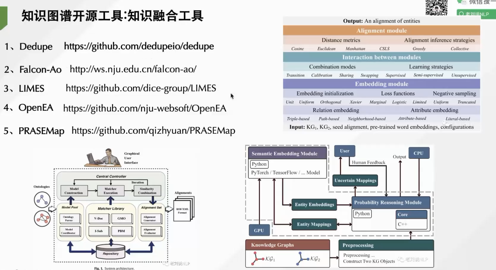

### 大规模图谱搜索工具

> [Elasticsearch](https://www.elastic.co/cn/)、[FAISS](https://github.com/facebookresearch/faiss)、[SPTAG](https://github.com/microsoft/SPTAG)、[Vearch](https://github.com/vearch/vearch)、[Milvus](https://milvus.io/)

### 图谱可视化工具

> [D3.js](https://observablehq.com/@d3/gallery)、[Vis.js](https://visjs.github.io/vis-network/examples/)、[Echarts](https://aistudio.baidu.com/aistudio/index)、[AntvG6](https://www.yuque.com/antv/g6/intro)

## 竞赛平台

> *最“接地气”也最能锻炼实践能力*

> [百度飞桨](https://aistudio.baidu.com/aistudio/competition)、[Biendata](https://www.biendata.xyz/)、[datafountain](https://datafountain.cn/competitions)、[和鲸社区](https://www.heywhale.com/home/competition)、[“未来杯”知识图谱锦标赛](https://ai.futurelab.tv/contest_detail/40)

## 挑战与破局

---

