# 自然语言处理

## Encoder-Decoder & Seq2Seq

> Encoder-Decoder 是 NLP 领域里的一种模型框架。它被广泛用于机器翻译、语音识别等任务。
>
> 本文将详细介绍 Encoder-Decoder、Seq2Seq 以及他们的升级方案Attention。
>
> 本文来源：https://zhuanlan.zhihu.com/p/88987096

### 什么是 Encoder-Decoder ？

Encoder-Decoder 模型主要是 NLP 领域里的概念。它并不特值某种具体的算法，而是一类算法的统称。Encoder-Decoder 算是一个通用的框架，在这个框架下可以使用不同的算法来解决不同的任务。

Encoder-Decoder 这个框架很好的诠释了机器学习的核心思路：

> 将现实问题转化为数学问题，通过求解数学问题，从而解决现实问题。

Encoder 又称作编码器。它的作用就是「将现实问题转化为数学问题」

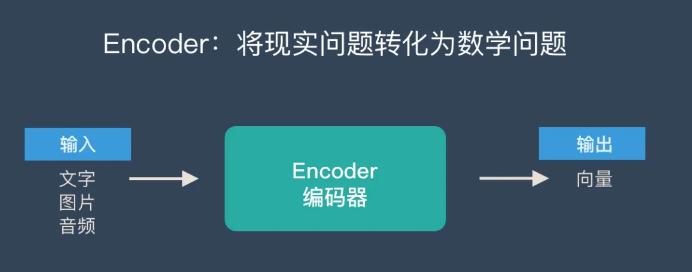

Decoder 又称作解码器，他的作用是「求解数学问题，并转化为现实世界的解决方案」

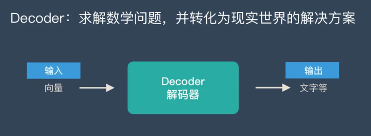

把 2 个环节连接起来，用通用的图来表达则是下面的样子：

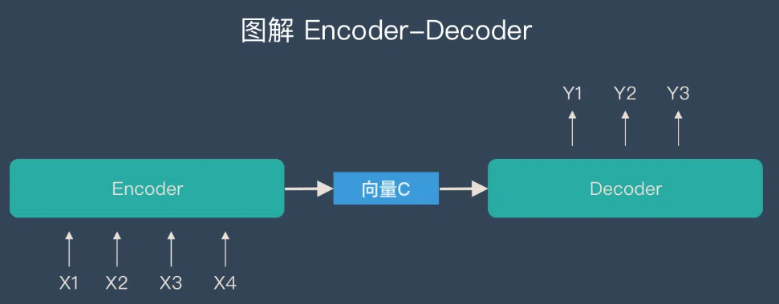

关于 Encoder-Decoder，有2 点需要说明：

1. 不论输入和输出的长度是什么，中间的「向量 c」 长度都是固定的（这也是它的缺陷，下文会详细说明）
2. 根据不同的任务可以选择不同的编码器和解码器（可以是一个 *RNN* ，但通常是其变种 *LSTM* 或者 *GRU* ）

只要是符合上面的框架，都可以统称为 Encoder-Decoder 模型。说到 Encoder-Decoder 模型就经常提到一个名词—— Seq2Seq。

### 什么是 Seq2Seq？

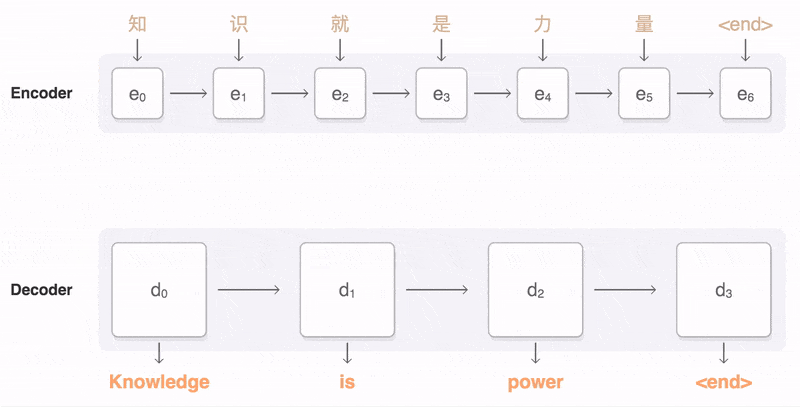

如上图：输入了 6 个汉字，输出了 3 个英文单词。输入和输出的长度不同。

### Seq2Seq 的由来

在 Seq2Seq 框架提出之前，深度神经网络在图像分类等问题上取得了非常好的效果。在其擅长解决的问题中，输入和输出通常都可以表示为固定长度的向量，如果长度稍有变化，会使用补零等操作。

然而许多重要的问题，例如机器翻译、语音识别、自动对话等，表示成序列后，其长度事先并不知道。因此如何突破先前深度神经网络的局限，使其可以适应这些场景，成为了13年以来的研究热点，Seq2Seq框架应运而生。

### 「Seq2Seq」和「Encoder-Decoder」的关系

Seq2Seq（强调目的）不特指具体方法，满足「输入序列、输出序列」的目的，都可以统称为 Seq2Seq 模型。

而 Seq2Seq 使用的具体方法基本都属于Encoder-Decoder 模型（强调方法）的范畴。

总结一下的话：

- Seq2Seq 属于 Encoder-Decoder 的大范畴
- Seq2Seq 更强调目的，Encoder-Decoder 更强调方法

### Encoder-Decoder 有哪些应用？

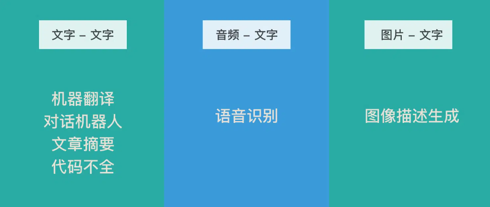

**机器翻译、对话机器人、诗词生成、代码补全、文章摘要（文本 – 文本）**

「文本 – 文本」 是最典型的应用，其输入序列和输出序列的长度可能会有较大的差异。

Google 发表的用Seq2Seq做机器翻译的论文《[Sequence to Sequence Learning with Neural Networks](https://arxiv.org/abs/1409.3215)》

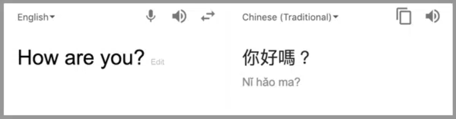

**语音识别（音频 – 文本）**

语音识别也有很强的序列特征，比较适合 Encoder-Decoder 模型。

Google 发表的使用Seq2Seq做语音识别的论文《[A Comparison of Sequence-to-Sequence Models for Speech Recognition](https://isca-speech.org/archive_v0/Interspeech_2017/pdfs/0233.PDF)》

**图像描述生成（图片 – 文本）**

通俗的讲就是“看图说话”，机器提取图片特征，然后用文字表达出来。这个应用是计算机视觉和 NLP 的结合。

图像描述生成的论文《[Sequence to Sequence – Video to Text](https://arxiv.org/pdf/1505.00487.pdf)》

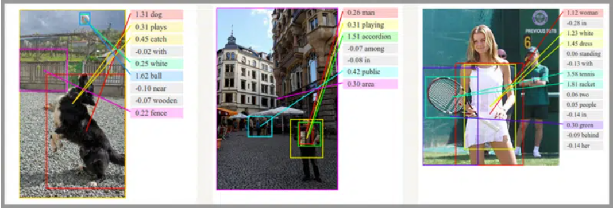

### Encoder-Decoder 的缺陷

上文提到：Encoder（编码器）和 Decoder（解码器）之间只有一个「向量 c」来传递信息，且 c 的长度固定。

为了便于理解，我们类比为「压缩-解压」的过程：

将一张 800X800 像素的图片压缩成 100KB，看上去还比较清晰。再将一张 3000X3000 像素的图片也压缩到 100KB，看上去就模糊了。

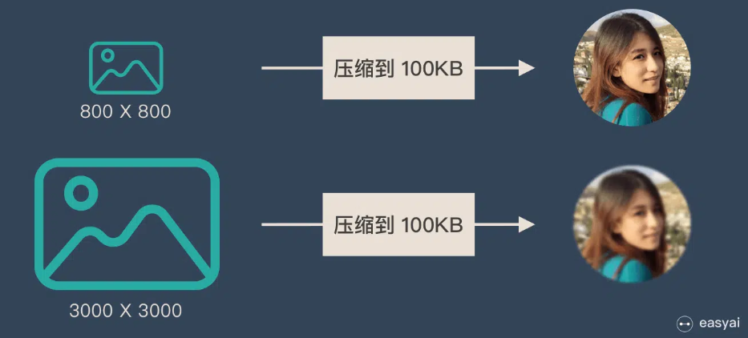

**Encoder-Decoder 就是类似的问题：当输入信息太长时，会丢失掉一些信息。**

### Attention 解决信息丢失问题

**Attention 机制就是为了解决“信息过长，信息丢失”的问题。**

*Ａttention* 模型的特点是 Eecoder 不再将整个输入序列编码为固定长度的“中间向量 Ｃ” ，而是编码成一个向量的序列。引入了 *Ａttention* 的 *Encoder-Decoder* 模型如下图：

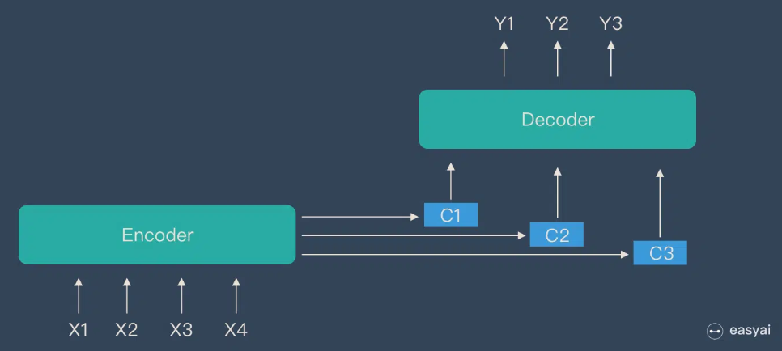

这样，在产生每一个输出的时候，都能够做到充分利用输入序列携带的信息。而且这种方法在翻译任务中取得了非常不错的成果。

Attention 是一个很重要的知识点，想要详细了解 Attention，请查看下一章节

## Attention

> Attention 正在被越来越广泛的得到应用。尤其是 [BERT](https://easyai.tech/ai-definition/bert/) 火爆了之后。
>
> Attention 到底有什么特别之处？他的原理和本质是什么？Attention都有哪些类型？本文将详细讲解Attention的方方面面。

### Attention 的本质是什么

Attention（注意力）机制如果浅层的理解，跟他的名字非常匹配。他的核心逻辑就是「**从关注全部到关注重点**」。

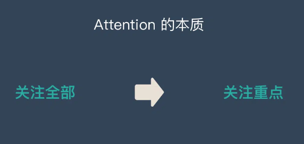

Attention 机制很像人类看图片的逻辑，当我们看一张图片的时候，我们并没有看清图片的全部内容，而是将注意力集中在了图片的焦点上。大家看一下下面这张图：

我们一定会看清「锦江饭店」4个字，但是我相信没人会意识到「锦江饭店」上面还有一串「电话号码」，也不会意识到「喜运来大酒家」，如下图：

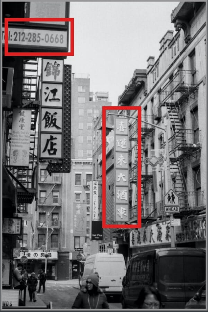

所以，当我们看一张图片的时候，其实是这样的：

上面所说的，我们的视觉系统就是一种 Attention机制，**将有限的注意力集中在重点信息上，从而节省资源，快速获得最有效的信息。**

**AI 领域的 Attention 机制**

Attention 机制最早是在计算机视觉里应用的，随后在 NLP 领域也开始应用了，真正发扬光大是在 NLP 领域，因为 2018 年 [BERT](https://easyai.tech/ai-definition/bert/) 和 GPT 的效果出奇的好，进而走红。而 [Transformer](https://easyai.tech/ai-definition/transformer/) 和 Attention 这些核心开始被大家重点关注。

如果用图来表达 Attention 的位置大致是下面的样子：

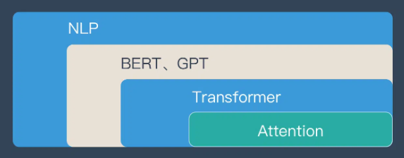

这里先让大家对 Attention 有一个宏观的概念，下文会对 Attention 机制做更详细的讲解。在这之前，我们先说说为什么要用 Attention。

### Attention 的3大优点

之所以要引入 Attention 机制，主要是3个原因：

1. 参数少
2. 速度快
3. 效果好

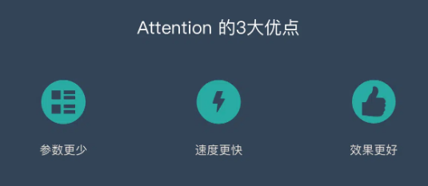

#### 参数少

模型复杂度跟 [CNN](https://easyai.tech/ai-definition/cnn/)、[RNN](https://easyai.tech/ai-definition/rnn/) 相比，复杂度更小，参数也更少。所以对算力的要求也就更小。

#### 速度快

Attention 解决了 RNN 不能并行计算的问题。Attention机制每一步计算不依赖于上一步的计算结果，因此可以和CNN一样并行处理。

#### 效果好

在 Attention 机制引入之前，有一个问题大家一直很苦恼：长距离的信息会被弱化，就好像记忆能力弱的人，记不住过去的事情是一样的。

Attention 是挑重点，就算文本比较长，也能从中间抓住重点，不丢失重要的信息。下图红色的预期就是被挑出来的重点。

### Attention 的原理

Attention 经常会和 Encoder–Decoder 一起说，上一章节也提到了 Attention。

下面的动图演示了attention 引入 Encoder-Decoder 框架下，完成机器翻译任务的大致流程。

**但是，Attention 并不一定要在 Encoder-Decoder 框架下使用的，他是可以脱离 Encoder-Decoder 框架的。**

下面的图片则是脱离 Encoder-Decoder 框架后的原理图解。

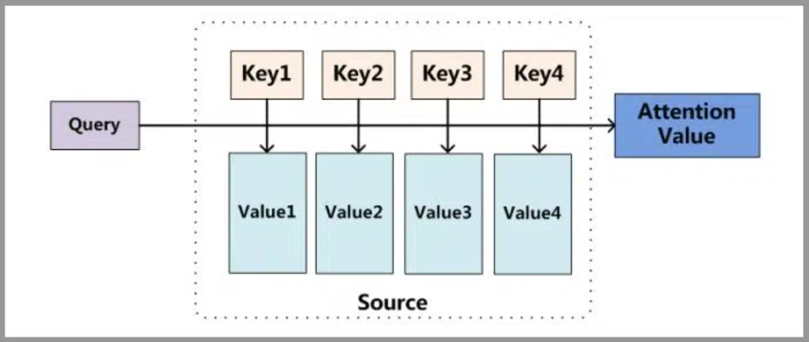

#### 小故事讲解

上面的图看起来比较抽象，下面用一个例子来解释 attention 的原理：

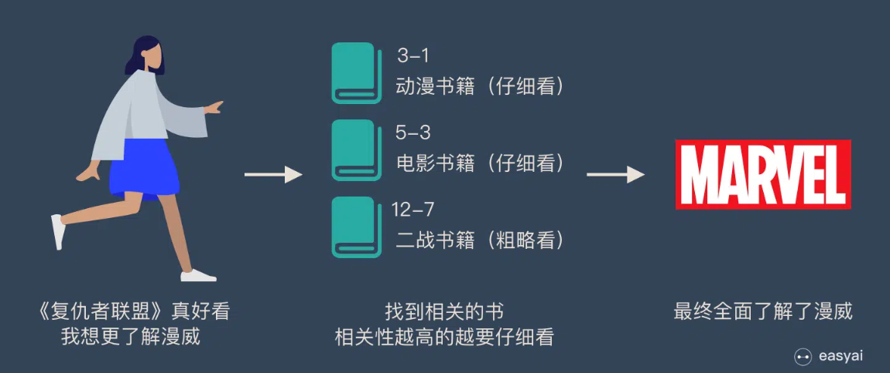

图书馆（source）里有很多书（value），为了方便查找，我们给书做了编号（key）。当我们想要了解漫威（query）的时候，我们就可以看看那些动漫、电影、甚至二战（美国队长）相关的书籍。

为了提高效率，并不是所有的书都会仔细看，针对漫威来说，动漫，电影相关的会看的仔细一些（权重高），但是二战的就只需要简单扫一下即可（权重低）。

当我们全部看完后就对漫威有一个全面的了解了。

Attention 原理的3步分解：

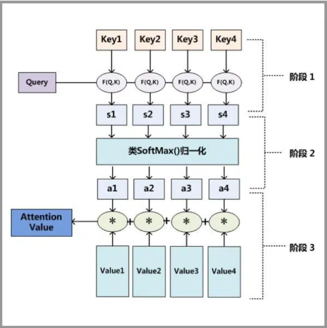

第一步： query 和 key 进行相似度计算，得到权值

第二步：将权值进行归一化，得到直接可用的权重

第三步：将权重和 value 进行加权求和

> 从上面的建模，我们可以大致感受到 Attention 的思路简单，**四个字“带权求和”就可以高度概括**，大道至简。做个不太恰当的类比，人类学习一门新语言基本经历四个阶段：死记硬背（通过阅读背诵学习语法练习语感）->提纲挈领（简单对话靠听懂句子中的关键词汇准确理解核心意思）->融会贯通（复杂对话懂得上下文指代、语言背后的联系，具备了举一反三的学习能力）->登峰造极（沉浸地大量练习）。
>
> 这也如同attention的发展脉络，RNN 时代是死记硬背的时期，attention 的模型学会了提纲挈领，进化到 [transformer](https://easyai.tech/ai-definition/transformer/)，融汇贯通，具备优秀的表达学习能力，再到 GPT、BERT，通过多任务大规模学习积累实战经验，战斗力爆棚。
>
> 要回答为什么 attention 这么优秀？是因为它让模型开窍了，懂得了提纲挈领，学会了融会贯通。
>
> ——阿里技术

想要了解更多技术细节，可以看看下面的文章或者视频：

「文章」[深度学习中的注意力机制](https://blog.csdn.net/tg229dvt5i93mxaq5a6u/article/details/78422216)

「文章」[遍地开花的 Attention，你真的懂吗？](https://zhuanlan.zhihu.com/p/77307258)

「文章」[探索 NLP 中的 Attention 注意力机制及 Transformer 详解](https://www.infoq.cn/article/lteUOi30R4uEyy740Ht2)

「视频」[李宏毅 – transformer](https://www.bilibili.com/video/av56239558?from=search&seid=14406218127146760248)

「视频」[李宏毅 – ELMO、BERT、GPT 讲解](https://www.bilibili.com/video/av56235038?from=search&seid=9558641265797595207)

### Attention 的 N 种类型

Attention 有很多种不同的类型：Soft Attention、Hard Attention、静态Attention、动态Attention、Self Attention 等等。下面就跟大家解释一下这些不同的 Attention 都有哪些差别。

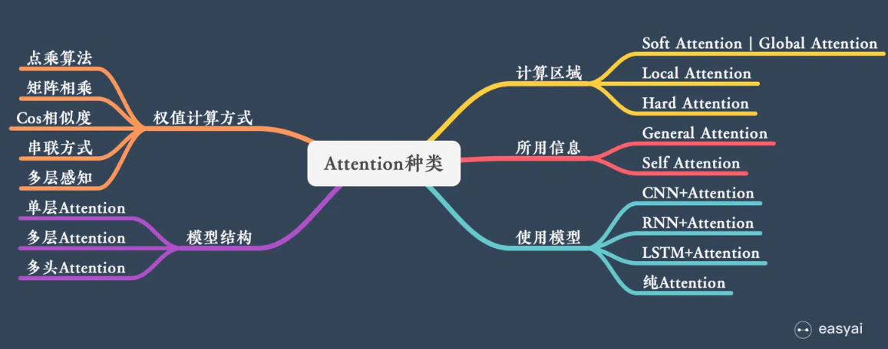

由于这篇文章《[Attention用于NLP的一些小结](https://zhuanlan.zhihu.com/p/35739040)》已经总结的很好的，下面就直接引用了：

本节从计算区域、所用信息、结构层次和模型等方面对Attention的形式进行归类。

#### 1. 计算区域

根据Attention的计算区域，可以分成以下几种：

1）**Soft** Attention，这是比较常见的Attention方式，对所有key求权重概率，每个key都有一个对应的权重，是一种全局的计算方式（也可以叫Global Attention）。这种方式比较理性，参考了所有key的内容，再进行加权。但是计算量可能会比较大一些。

2）**Hard** Attention，这种方式是直接精准定位到某个key，其余key就都不管了，相当于这个key的概率是1，其余key的概率全部是0。因此这种对齐方式要求很高，要求一步到位，如果没有正确对齐，会带来很大的影响。另一方面，因为不可导，一般需要用强化学习的方法进行训练。（或者使用gumbel softmax之类的）

3）**Local** Attention，这种方式其实是以上两种方式的一个折中，对一个窗口区域进行计算。先用Hard方式定位到某个地方，以这个点为中心可以得到一个窗口区域，在这个小区域内用Soft方式来算Attention。

#### 2. 所用信息

假设我们要对一段原文计算Attention，这里原文指的是我们要做attention的文本，那么所用信息包括内部信息和外部信息，内部信息指的是原文本身的信息，而外部信息指的是除原文以外的额外信息。

1）**General** Attention，这种方式利用到了外部信息，常用于需要构建两段文本关系的任务，query一般包含了额外信息，根据外部query对原文进行对齐。

比如在阅读理解任务中，需要构建问题和文章的关联，假设现在baseline是，对问题计算出一个问题[向量](https://easyai.tech/ai-definition/vector/)q，把这个q和所有的文章词向量拼接起来，输入到[LSTM](https://easyai.tech/ai-definition/lstm/)中进行建模。那么在这个模型中，文章所有词向量共享同一个问题向量，现在我们想让文章每一步的词向量都有一个不同的问题向量，也就是，在每一步使用文章在该步下的词向量对问题来算attention，这里问题属于原文，文章词向量就属于外部信息。

2）**Local** Attention，这种方式只使用内部信息，key和value以及query只和输入原文有关，在self attention中，key=value=query。既然没有外部信息，那么在原文中的每个词可以跟该句子中的所有词进行Attention计算，相当于寻找原文内部的关系。

还是举阅读理解任务的例子，上面的baseline中提到，对问题计算出一个向量q，那么这里也可以用上attention，只用问题自身的信息去做attention，而不引入文章信息。

#### 3. 结构层次

结构方面根据是否划分层次关系，分为单层attention，多层attention和多头attention：

1）单层Attention，这是比较普遍的做法，用一个query对一段原文进行一次attention。

2）多层Attention，一般用于文本具有层次关系的模型，假设我们把一个document划分成多个句子，在第一层，我们分别对每个句子使用attention计算出一个句向量（也就是单层attention）；在第二层，我们对所有句向量再做attention计算出一个文档向量（也是一个单层attention），最后再用这个文档向量去做任务。

3）多头Attention，这是Attention is All You Need中提到的multi-head attention，用到了多个query对一段原文进行了多次attention，每个query都关注到原文的不同部分，相当于重复做多次单层attention：

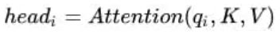

最后再把这些结果拼接起来：

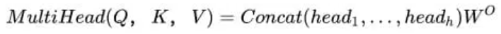

####  4. 模型方面

从模型上看，Attention一般用在CNN和LSTM上，也可以直接进行纯Attention计算。

##### 1）CNN+Attention

CNN的卷积操作可以提取重要特征，我觉得这也算是Attention的思想，但是CNN的卷积感受视野是局部的，需要通过叠加多层卷积区去扩大视野。另外，Max Pooling直接提取数值最大的特征，也像是hard attention的思想，直接选中某个特征。

CNN上加Attention可以加在这几方面：

a. 在卷积操作前做attention，比如Attention-Based BCNN-1，这个任务是文本蕴含任务需要处理两段文本，同时对两段输入的序列向量进行attention，计算出特征向量，再拼接到原始向量中，作为卷积层的输入。

b. 在卷积操作后做attention，比如Attention-Based BCNN-2，对两段文本的卷积层的输出做attention，作为pooling层的输入。

c. 在pooling层做attention，代替max pooling。比如Attention pooling，首先我们用LSTM学到一个比较好的句向量，作为query，然后用CNN先学习到一个特征矩阵作为key，再用query对key产生权重，进行attention，得到最后的句向量。

##### 2）LSTM+Attention

LSTM内部有Gate机制，其中input gate选择哪些当前信息进行输入，forget gate选择遗忘哪些过去信息，我觉得这算是一定程度的Attention了，而且号称可以解决长期依赖问题，实际上LSTM需要一步一步去捕捉序列信息，在长文本上的表现是会随着step增加而慢慢衰减，难以保留全部的有用信息。

LSTM通常需要得到一个向量，再去做任务，常用方式有：

a. 直接使用最后的hidden state（可能会损失一定的前文信息，难以表达全文）

b. 对所有step下的hidden state进行等权平均（对所有step一视同仁）。

c. Attention机制，对所有step的hidden state进行加权，把注意力集中到整段文本中比较重要的hidden state信息。性能比前面两种要好一点，而方便可视化观察哪些step是重要的，但是要小心过拟合，而且也增加了计算量。

##### 3）纯Attention

Attention is all you need，没有用到CNN/RNN，乍一听也是一股清流了，但是仔细一看，本质上还是一堆向量去计算attention。

#### 5. 相似度计算方式

在做attention的时候，我们需要计算query和某个key的分数（相似度），常用方法有：

1）点乘：最简单的方法，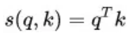

2）矩阵相乘：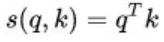

3）cos相似度：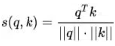

4）串联方式：把q和k拼接起来，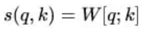

5）用多层感知机也可以：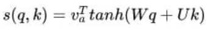

