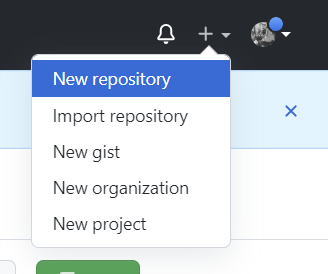
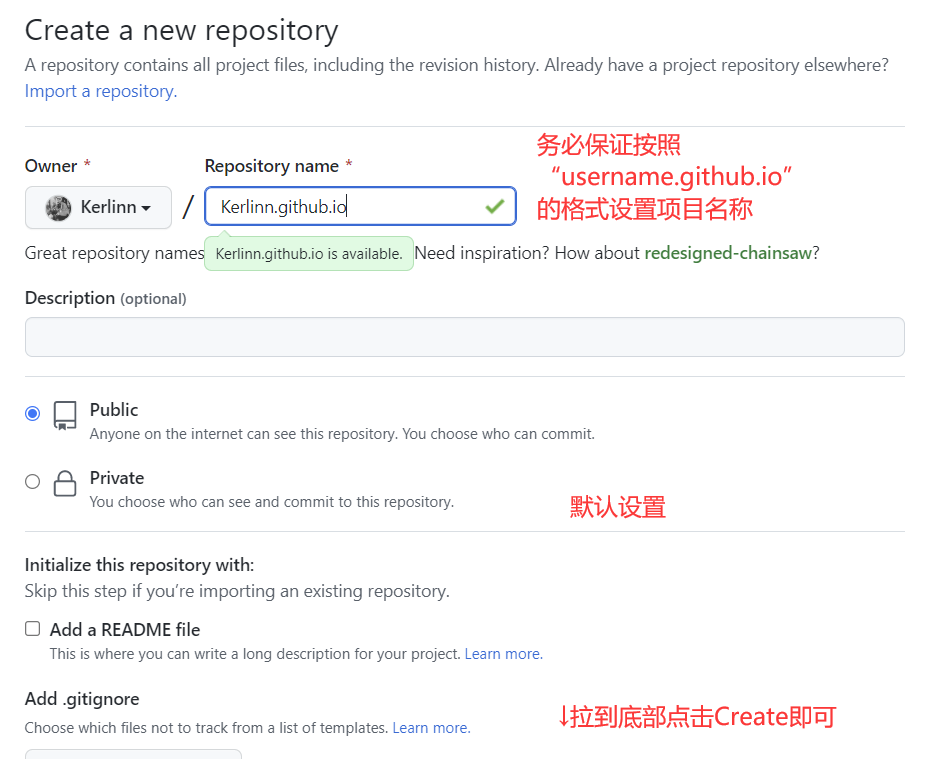
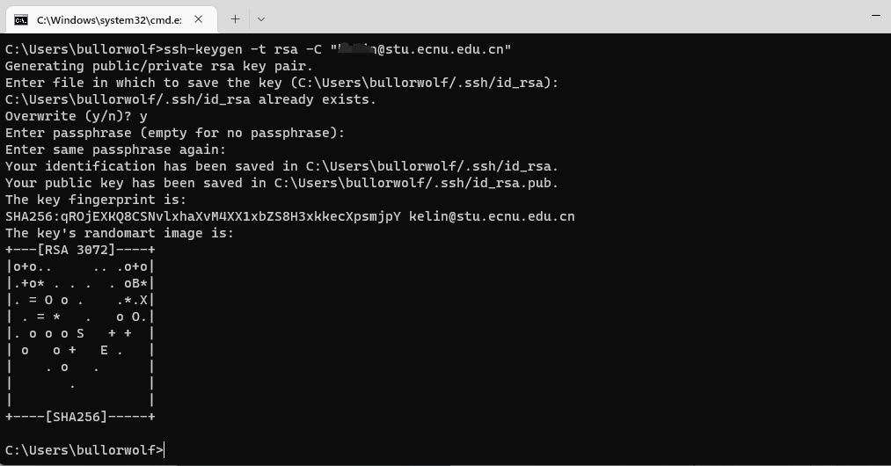
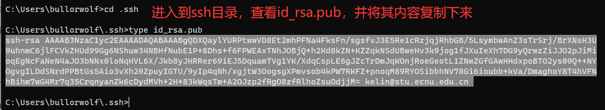
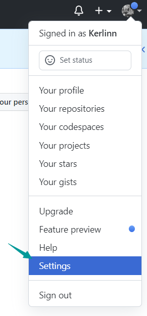
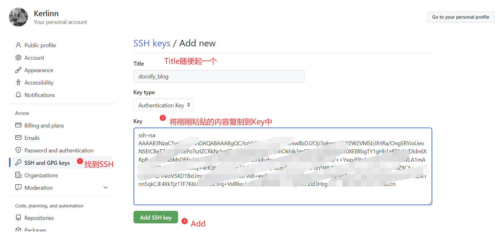

# 部署

## 1. 在github中新建一个respository





## 2. 生成并设置SSH

- 在cmd.exe中键入以下内容并一路回车(生成ssh的地址默认即可)

```shell
ssh-keygen -t rsa -C "email_address"
```





- 回到github中找到Settings





ssh-rsa AAAAB3NzaC1yc2EAAAADAQABAAABgQDXQaylYURPtwwVD8Et2mhPFNa4FksFn/sgsfvJ3E5Re1cRzjqjRhbGB/5LsymbwAnZ3sTrSrj/BrXNsH3U9uhnmC6jlFCVkZHUd99Gg6NShuw34NBHfNubE1P+8Dhs+f6FPWEAxTNhJOBjQ+h2Kd8kZN+KZZqkNSdUBweHv3k9jog1fJXuIeXh7DG9yQrwzZiJJO2pJiMioqEgNcFaNeN4aJO3bNNx0loNqHVL6X/Jkb8yJHRRer69iEJ5DquamTVg1YK/XdqCspLE6gJZcTrDmJqKOnjRoeGeotL1ZNwZGfGAwHHdxpoBTO2ys09Q++NYOgvgILDdSNrdPPBtGs5Aio3vXh20ZpuyIGTU/9yIp4qNh/xgjtW3OogsgXPmvsob4kPW7RKFZ+pnoqM89RYOSibbhNV78Gi6ioubb+kVa/DmaghoY8T4hVFNhBihm7wG4Mr7q35CrqnyanZk6cDydMVh+2H+83kWqsTm+A2OJzp2fRgO8zfRlhoZsuOdjjM= kelin@stu.ecnu.edu.cn